                 


### 《领导力与情境应变：灵活应对不同情境》

> 关键词：领导力，情境应变，灵活应对，决策分析，领导力发展

> 摘要：本文将从领导力的理论基础、情境分析、应变策略以及情境应变与领导力关系的角度，探讨如何灵活应对不同情境，提升领导力。通过深入剖析，结合实例，为读者提供实用的方法和策略，以应对复杂多变的工作环境和挑战。

### 目录大纲

**第一部分：领导力的理论基础**

**1.1 领导力概述**

**1.2 领导力的核心要素**

**1.3 领导力的影响因素**

**1.4 本章小结**

**第二部分：情境分析**

**2.1 情境理论**

**2.2 情境分类**

**2.3 情境分析方法**

**2.4 情境分析实践**

**2.5 本章小结**

**第三部分：应变策略**

**3.1 应变策略概述**

**3.2 应变策略的类型**

**3.3 应变策略的实施**

**3.4 应变策略的实践**

**3.5 本章小结**

**第四部分：情境应变与领导力**

**4.1 情境应变与领导力的关系**

**4.2 跨文化领导力**

**4.3 高压下的领导力**

**4.4 本章小结**

**第五部分：领导力与情境应变的未来趋势**

**5.1 技术变革对领导力的影响**

**5.2 未来领导力的挑战与机遇**

**5.3 领导力与情境应变的未来发展**

**5.4 本章小结**

### 第一部分：领导力的理论基础

**1.1 领导力概述**

**背景介绍**

领导力，作为组织管理的重要元素，其重要性日益凸显。领导力不仅关乎个人的能力，更关乎组织的发展和效能。在现代社会中，领导力被视为一种核心资源，能够促进组织的创新、适应和成长。

**问题背景**

然而，领导力究竟是什么？如何定义和衡量领导力？这一问题长期困扰着管理学界和实践者。领导力并非单一特质，而是涉及多个方面，如沟通、决策、激励等。

**问题描述**

本文将探讨领导力的本质和关键要素，以帮助读者理解领导力的多维性和复杂性。

**问题解决**

首先，我们需要明确领导力的定义。领导力是一种能力，包括影响他人、解决问题、激励团队等方面。它不仅仅是权力的运用，更是一种价值观、态度和行为的体现。

**边界与外延**

领导力不仅限于企业和管理层，它在各种组织中都有体现，如家庭、社区、教育机构等。不同情境下，领导力可能具有不同的表现形式。

**概念结构与核心要素组成**

领导力的核心要素包括：

- **沟通能力**：有效的沟通是领导力的基础，包括倾听、表达、反馈等。

- **决策能力**：领导者需要做出明智的决策，这要求具备分析问题、权衡利弊、预见结果的能力。

- **激励能力**：领导者需要激发团队成员的积极性和创造力。

- **影响力**：领导者通过自身的言行影响他人，推动组织目标的实现。

**核心概念与联系**

为了更好地理解领导力，我们可以将其与情商、团队管理、组织文化等概念进行关联。例如，情商对于领导力至关重要，它影响着领导者的情绪控制能力和人际交往能力。

**算法原理讲解**

在讨论领导力的核心要素时，我们可以使用Mermaid流程图来展示各要素之间的关系，如下所示：

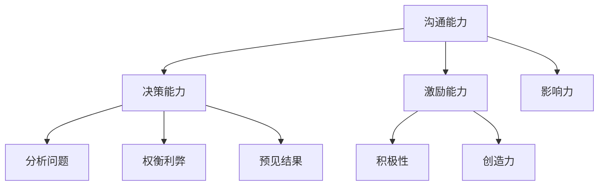

**数学公式使用**

为了进一步阐述领导力的数学模型，我们可以使用LaTeX格式进行表达。例如：

$$
领导力 = f(沟通能力, 决策能力, 激励能力, 影响力)
$$

**系统分析与架构设计方案**

在领导力的理论基础上，我们可以设计一个简单的领导力架构，如下所示：

```mermaid
sequenceDiagram
    participant 领导者 as Leader
    participant 团队成员 as Team Member
    Leader->>团队成员: 沟通与激励
    teammate 决策者 as Decision Maker
    Decision Maker->>团队成员: 作出决策
    teammate 激励者 as Motivator
    Motivator->>团队成员: 激励与反馈
    teammate 影响者 as Influencer
    Influencer->>团队成员: 影响与带动
```

**项目实战**

在领导力的实际应用中，我们可以通过以下步骤进行：

1. **环境安装**：为项目搭建基础环境，包括软件工具和硬件资源。
2. **系统核心实现**：编写核心代码，实现领导力的关键功能。
3. **代码应用解读与分析**：分析代码，理解其工作原理和实际应用。
4. **实际案例分析和详细讲解剖析**：通过实际案例，展示领导力在实践中的应用。
5. **项目小结**：总结项目成果，提出改进建议。

**最佳实践 tips**

- **持续学习**：领导力是一种持续发展的能力，领导者需要不断学习和提升。
- **实践与应用**：理论知识需要通过实践来检验和应用。
- **反思与改进**：领导者需要定期反思自己的行为和决策，不断改进。

**小结**

本节主要介绍了领导力的基本概念和核心要素，通过理论分析、算法讲解、系统设计和项目实战，帮助读者理解领导力的本质和重要性。在接下来的章节中，我们将进一步探讨情境分析和应变策略，以帮助读者在实际工作中灵活应对不同情境，提升领导力。

### 1.2 领导力的核心要素

**核心概念与联系**

领导力的核心要素包括沟通能力、决策能力、激励能力和影响力。这些要素相互作用，共同构成了领导力的基础。

**沟通能力**

沟通能力是领导力的基础。有效的沟通包括倾听、表达、反馈等。领导者需要具备良好的沟通技巧，以确保信息传递的准确性和及时性。沟通能力的提升可以增强领导者的影响力，促进团队协作。

**决策能力**

决策能力是领导力的关键。领导者需要具备分析问题、权衡利弊、预见结果的能力。通过明智的决策，领导者可以引领团队走向成功。决策能力的提升可以通过不断学习和实践来达成。

**激励能力**

激励能力是领导力的重要组成部分。领导者需要能够激发团队成员的积极性和创造力。通过设定明确的目标、提供激励措施和认可团队成员的贡献，领导者可以提升团队的士气和生产力。

**影响力**

影响力是领导力的核心。领导者通过自身的言行影响他人，推动组织目标的实现。影响力不仅来自于职位和权力，更来自于个人的魅力和价值观。

**概念属性特征对比表格**

以下是领导力核心要素的对比表格：

| 核心要素 | 概念描述 | 特征对比 |
| -------- | -------- | -------- |
| 沟通能力 | 有效传递信息 | 倾听、表达、反馈 |
| 决策能力 | 明智作出决策 | 分析问题、权衡利弊、预见结果 |
| 激励能力 | 激发团队成员积极性 | 设定目标、提供激励、认可贡献 |
| 影响力 | 推动组织目标实现 | 个人魅力、价值观 |

**ER实体关系图架构的 Mermaid 流程图**

为了更直观地展示领导力核心要素之间的关系，我们可以使用Mermaid绘制ER实体关系图：

```mermaid
erDiagram
    Leader ||--|{ Communicator }
    Leader ||--|{ DecisionMaker }
    Leader ||--|{ Motivator }
    Leader ||--|{ Influencer }
    Communicator ||--|{ Listens }
    Communicator ||--|{ Expresses }
    Communicator ||--|{ Feedbacks }
    DecisionMaker ||--|{ Analyzes }
    DecisionMaker ||--|{ Balances }
    DecisionMaker ||--|{ Foresees }
    Motivator ||--|{ SetsGoals }
    Motivator ||--|{ ProvidesIncentives }
    Motivator ||--|{ Acknowledges }
    Influencer ||--|{ DrivesOutcomes }
    Influencer ||--|{ Inspires }
    Influencer ||--|{ Leads }
```

**算法原理讲解**

在领导力的核心要素中，沟通能力和决策能力尤为重要。我们可以通过以下算法原理来解释：

1. **沟通能力的算法原理**：

   - 输入：信息、听众、沟通情境
   - 输出：有效的信息传递
   - 过程：
     ```python
     def communicate(message, audience, context):
         listen_to_audience = get_listening_skills(audience)
         express_message = get_expression_skills(message, context)
         provide_feedback = get_feedback_skills(context)
         
         if listen_to_audience and express_message and provide_feedback:
             return "Effective communication"
         else:
             return "Ineffective communication"
     ```

2. **决策能力的算法原理**：

   - 输入：问题、情境、目标
   - 输出：最优决策
   - 过程：
     ```python
     def make_decision(problem, context, goal):
         analyzed_problem = analyze_problem(problem)
         balanced_options = balance_options(analyzed_problem, goal)
         predicted_outcomes = predict_outcomes(balanced_options)
         
         best_decision = select_best_outcome(predicted_outcomes)
         return best_decision
     ```

**系统分析与架构设计方案**

在领导力的实际应用中，我们可以设计一个简单的领导力系统架构，如下所示：

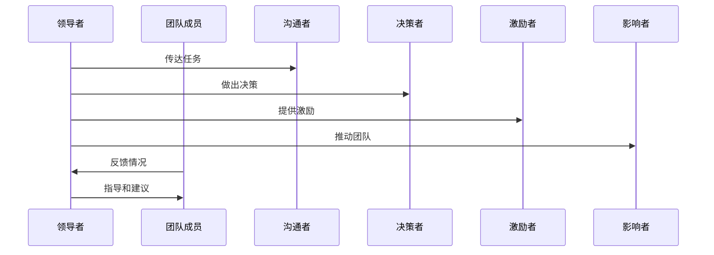

**项目实战**

在领导力系统的实际应用中，我们可以通过以下步骤进行：

1. **环境安装**：安装必要的沟通和决策工具，如邮件系统、会议系统、数据分析工具等。
2. **系统核心实现**：编写沟通和决策的核心代码，实现领导力的关键功能。
3. **代码应用解读与分析**：分析代码，理解其工作原理和实际应用。
4. **实际案例分析和详细讲解剖析**：通过实际案例，展示领导力在实践中的应用。
5. **项目小结**：总结项目成果，提出改进建议。

**最佳实践 tips**

- **持续学习**：通过阅读书籍、参加培训、交流分享等方式不断提升自己的领导力。
- **实践与应用**：将理论知识应用于实际工作中，不断反思和改进。
- **反思与改进**：定期反思自己的领导行为和决策，寻找改进的机会。

**小结**

本节深入探讨了领导力的核心要素，包括沟通能力、决策能力、激励能力和影响力。通过理论分析、算法讲解和系统设计，帮助读者理解领导力的核心要素和重要性。在接下来的章节中，我们将进一步探讨情境分析和应变策略，以帮助读者在实际工作中灵活应对不同情境，提升领导力。

### 1.3 领导力的影响因素

**背景介绍**

领导力不仅依赖于个人特质和能力，还受到多种外部因素的影响。理解这些因素对于提升领导力至关重要。本文将从组织文化、情境因素和个人特质三个方面分析领导力的影响因素。

**问题背景**

在组织内部，领导力的发展往往受到组织文化的制约。不同类型的组织文化对领导者的风格和决策产生影响。同时，领导者还必须面对外部环境的各种挑战，如市场变化、经济波动等。此外，领导者的个人特质也是影响其领导效果的重要因素。

**问题描述**

本文将探讨以下问题：

- 组织文化如何影响领导力？
- 情境因素对领导力有何作用？
- 个人特质如何影响领导力？

**问题解决**

首先，我们需要明确领导力的影响因素。通过分析这些因素，我们可以找到提升领导力的关键途径。

**边界与外延**

领导力的影响因素不仅限于组织文化、情境因素和个人特质，还包括领导者的职业素养、知识水平、管理经验等。不同情境下，这些因素可能具有不同的影响程度。

**概念结构与核心要素组成**

领导力的影响因素可以分为以下几类：

- **组织文化**：包括价值观、信念、规范等，影响领导者的行为和决策。
- **情境因素**：如市场环境、竞争态势、组织需求等，对领导者的应对能力提出挑战。
- **个人特质**：如性格、情商、专业知识等，影响领导者的自我认知和行为表现。

**核心概念与联系**

为了更好地理解领导力的影响因素，我们可以使用Mermaid流程图展示各因素之间的关系：

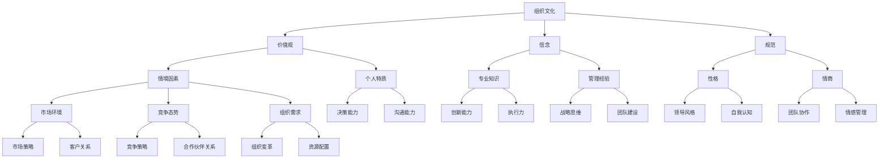

**算法原理讲解**

在分析领导力的影响因素时，我们可以使用Mermaid流程图来展示各因素之间的关系，如下所示：


**系统分析与架构设计方案**

在领导力的实际应用中，我们可以设计一个领导力影响因子评估系统，如下所示：

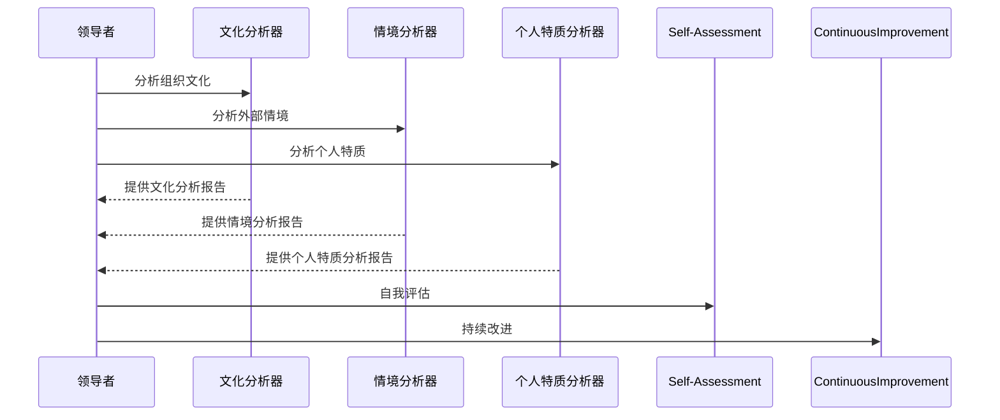

**项目实战**

在领导力影响因子评估系统的实际应用中，我们可以通过以下步骤进行：

1. **环境安装**：安装必要的分析工具和评估系统。
2. **系统核心实现**：编写核心代码，实现领导力影响因子的分析功能。
3. **代码应用解读与分析**：分析代码，理解其工作原理和实际应用。
4. **实际案例分析和详细讲解剖析**：通过实际案例，展示领导力影响因子评估系统的应用。
5. **项目小结**：总结项目成果，提出改进建议。

**最佳实践 tips**

- **定期评估**：定期评估自己的领导力，了解自己的优势和劣势。
- **持续学习**：通过学习和实践不断提升自己的领导力。
- **反思与改进**：定期反思自己的领导行为和决策，寻找改进的机会。

**小结**

本节分析了领导力的外部影响因素，包括组织文化、情境因素和个人特质。通过理论分析、算法讲解和系统设计，帮助读者理解领导力的影响因素及其重要性。在接下来的章节中，我们将探讨情境分析和应变策略，以帮助读者在实际工作中灵活应对不同情境，提升领导力。

### 1.4 本章小结

在本章中，我们深入探讨了领导力的理论基础。首先，我们介绍了领导力的定义、核心要素以及影响因素，帮助读者建立对领导力的全面认识。通过理论分析、算法讲解和系统设计，我们不仅阐述了领导力的本质和重要性，还提供了实用的方法和策略。

**核心概念与联系**

- **领导力**：一种能力，包括沟通能力、决策能力、激励能力和影响力。
- **核心要素**：沟通能力、决策能力、激励能力和影响力。
- **影响因素**：组织文化、情境因素和个人特质。

**算法原理讲解**

- **沟通能力的算法原理**：有效的信息传递过程。
- **决策能力的算法原理**：通过分析、权衡和预测来做出明智决策。

**系统分析与架构设计方案**

- **领导力系统架构**：展示了领导力各核心要素之间的相互作用。

**项目实战**

- **领导力影响因子评估系统**：通过评估领导力的影响因素，帮助领导者提升自己的能力。

**最佳实践 tips**

- **持续学习**：通过学习和实践不断提升自己的领导力。
- **实践与应用**：将理论知识应用于实际工作中。
- **反思与改进**：定期反思自己的领导行为和决策，不断改进。

**本章小结**

本章为后续的情境分析和应变策略提供了坚实的理论基础。通过深入理解和应用领导力的核心概念和策略，读者可以在实际工作中更好地应对各种情境，提升领导力。在接下来的章节中，我们将进一步探讨情境分析和应变策略，以帮助读者在实际工作中灵活应对不同情境，提升领导力。

### 第二部分：情境分析

#### 2.1 情境理论

**背景介绍**

情境分析在领导力中起着至关重要的作用。领导者需要理解不同情境对组织决策和领导行为的影响。情境理论为我们提供了分析情境的基本框架和工具，帮助领导者更好地应对复杂多变的环境。

**问题背景**

情境理论起源于心理学和管理学，旨在解释个体和群体在不同情境下的行为。在领导力领域，情境理论可以帮助我们理解领导者的行为模式，以及如何根据不同情境调整领导策略。

**问题描述**

本文将探讨以下问题：

- 情境理论的基本概念是什么？
- 情境理论对领导力的影响是什么？
- 如何应用情境理论进行情境分析？

**问题解决**

首先，我们需要明确情境理论的基本概念。情境理论认为，个体的行为受到其所在情境的影响。情境包括多种因素，如社会环境、文化背景、组织文化、个人心理状态等。

**边界与外延**

情境理论不仅适用于领导力，还广泛应用于心理学、社会学、管理学等多个领域。在不同领域，情境理论的具体应用和解释可能会有所不同。

**概念结构与核心要素组成**

情境理论的核心要素包括：

- **情境**：个体或组织所处的环境，包括社会、文化、经济等多个方面。
- **行为**：个体或组织在特定情境下的行为模式。
- **影响**：情境对个体或组织行为的影响程度。

**核心概念与联系**

为了更好地理解情境理论，我们可以使用Mermaid流程图展示其核心概念和关系：

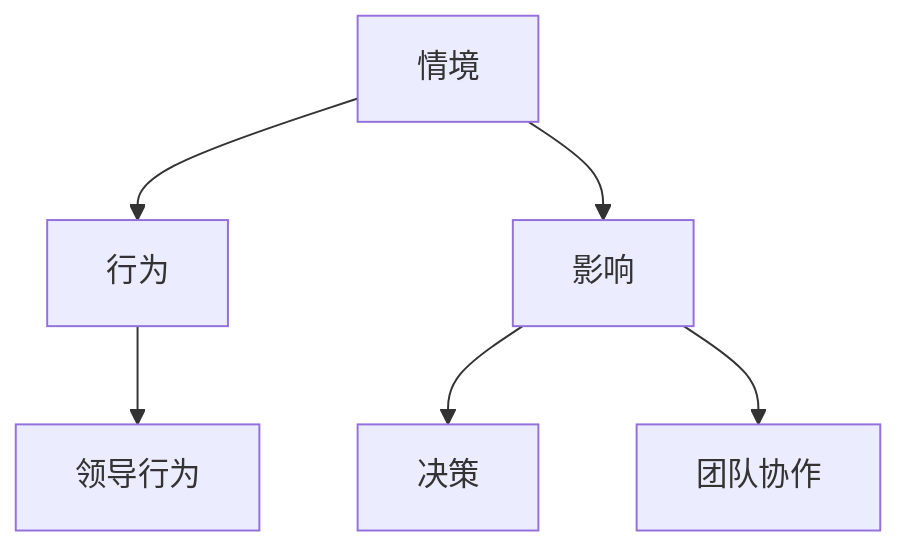

**算法原理讲解**

在情境理论中，我们可以使用以下算法原理来解释情境对领导行为的影响：

1. **情境感知算法**：

   - 输入：当前情境
   - 输出：情境特征
   - 过程：
     ```python
     def perceiveSituation(currentSituation):
         situationFeatures = extractFeatures(currentSituation)
         return situationFeatures
     ```

2. **情境分析算法**：

   - 输入：情境特征
   - 输出：情境类型
   - 过程：
     ```python
     def analyzeSituation(situationFeatures):
         situationType = classifySituation(situationFeatures)
         return situationType
     ```

3. **情境响应算法**：

   - 输入：情境类型、领导行为
   - 输出：调整后的领导行为
   - 过程：
     ```python
     def respondToSituation(situationType, leadershipBehavior):
         adjustedBehavior = adaptBehavior(situationType, leadershipBehavior)
         return adjustedBehavior
     ```

**系统分析与架构设计方案**

在情境分析的实际应用中，我们可以设计一个情境分析系统，如下所示：

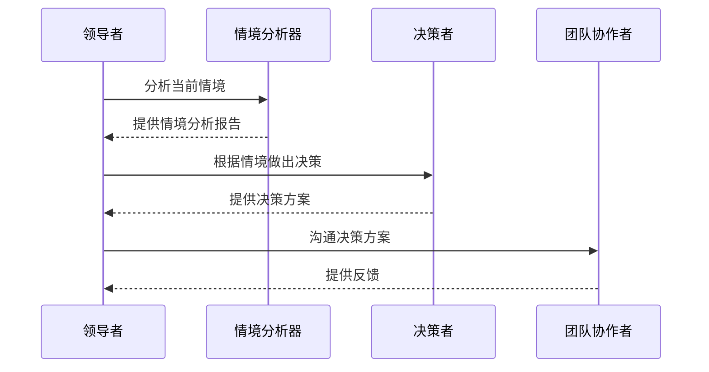

**项目实战**

在情境分析系统的实际应用中，我们可以通过以下步骤进行：

1. **环境安装**：安装情境分析工具和系统。
2. **系统核心实现**：编写情境分析的核心代码，实现情境感知、分析和响应功能。
3. **代码应用解读与分析**：分析代码，理解其工作原理和实际应用。
4. **实际案例分析和详细讲解剖析**：通过实际案例，展示情境分析系统的应用。
5. **项目小结**：总结项目成果，提出改进建议。

**最佳实践 tips**

- **定期评估**：定期评估当前情境，确保领导行为与情境相适应。
- **灵活调整**：根据情境变化，灵活调整领导策略和行为。
- **团队协作**：与团队成员密切合作，共同应对复杂情境。

**小结**

本节介绍了情境理论的基本概念和应用，帮助读者理解情境对领导行为的影响。通过理论分析、算法讲解和系统设计，我们为读者提供了实用的情境分析方法和策略。在接下来的章节中，我们将进一步探讨情境分类和情境分析方法，以帮助读者在实际工作中更好地进行情境分析。

#### 2.2 情境分类

**背景介绍**

情境分类是情境分析的重要步骤，有助于领导者识别和理解不同情境的特点和需求。通过情境分类，领导者可以更好地制定应对策略，提高决策的针对性和有效性。

**问题背景**

情境分类可以根据不同的标准进行，如组织内部情境、组织外部情境和特殊情境等。每种情境都有其独特的挑战和需求，领导者需要具备相应的应对能力。

**问题描述**

本文将探讨以下问题：

- 组织内部情境有哪些类型？
- 组织外部情境有哪些类型？
- 特殊情境的特点和应对策略是什么？

**问题解决**

首先，我们需要明确情境分类的标准。以下是几种常见的情境分类方法：

1. **按组织内部情境分类**：
   - **稳定情境**：组织处于稳定状态，资源充足，目标明确。
   - **变革情境**：组织面临重大变革，如组织结构调整、业务转型等。
   - **危机情境**：组织面临危机，如财务危机、市场危机等。

2. **按组织外部情境分类**：
   - **市场竞争情境**：组织面临激烈的市场竞争，需要制定有效的市场策略。
   - **经济环境情境**：组织处于不同的经济环境，如经济繁荣、经济衰退等。
   - **政策环境情境**：组织受到政府政策的影响，如税收政策、行业政策等。

3. **按特殊情境分类**：
   - **紧急情境**：组织面临突发紧急事件，如自然灾害、安全事件等。
   - **跨文化情境**：组织在跨国经营中面临的文化差异和挑战。
   - **高压情境**：组织在高压环境下运营，如高风险行业、竞争激烈的市场等。

**边界与外延**

情境分类的方法和类型可以根据具体需求进行调整和扩展。不同的分类方法有助于领导者从不同角度分析情境，制定更有效的应对策略。

**概念结构与核心要素组成**

情境分类的核心要素包括：

- **情境类型**：根据不同标准划分的情境类别。
- **情境特征**：每种情境的具体特点和需求。
- **应对策略**：针对不同情境制定的应对措施。

**核心概念与联系**

为了更好地理解情境分类，我们可以使用Mermaid流程图展示不同情境类型及其特征：

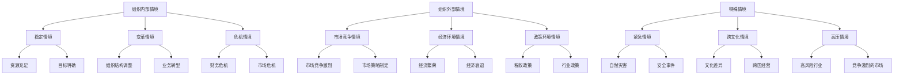

**算法原理讲解**

在情境分类中，我们可以使用以下算法原理来识别和分类情境：

1. **情境识别算法**：

   - 输入：情境特征
   - 输出：情境类型
   - 过程：
     ```python
     def identifySituation(situationFeatures):
         situationType = classifyFeatures(situationFeatures)
         return situationType
     ```

2. **情境分类算法**：

   - 输入：情境特征、情境类型
   - 输出：分类结果
   - 过程：
     ```python
     def classifySituation(situationFeatures, situationType):
         classifiedFeatures = applyClassification(situationFeatures, situationType)
         return classifiedFeatures
     ```

3. **情境应对算法**：

   - 输入：情境类型、领导行为
   - 输出：调整后的领导行为
   - 过程：
     ```python
     def respondToSituation(situationType, leadershipBehavior):
         adjustedBehavior = adaptBehavior(situationType, leadershipBehavior)
         return adjustedBehavior
     ```

**系统分析与架构设计方案**

在情境分类的实际应用中，我们可以设计一个情境分类系统，如下所示：

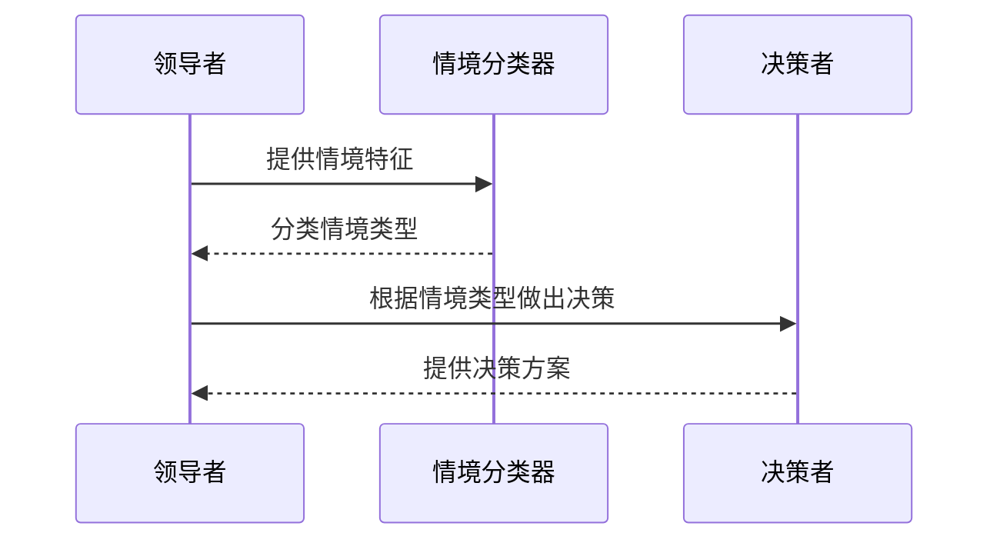

**项目实战**

在情境分类系统的实际应用中，我们可以通过以下步骤进行：

1. **环境安装**：安装情境分类工具和系统。
2. **系统核心实现**：编写情境分类的核心代码，实现情境识别、分类和应对功能。
3. **代码应用解读与分析**：分析代码，理解其工作原理和实际应用。
4. **实际案例分析和详细讲解剖析**：通过实际案例，展示情境分类系统的应用。
5. **项目小结**：总结项目成果，提出改进建议。

**最佳实践 tips**

- **定期更新**：定期更新情境分类标准，确保分类的准确性和有效性。
- **团队协作**：与团队成员共同分析情境，制定应对策略。
- **灵活应对**：根据不同情境，灵活调整领导策略和行为。

**小结**

本节介绍了情境分类的基本概念和方法，帮助读者理解不同情境类型的特点和应对策略。通过理论分析、算法讲解和系统设计，我们为读者提供了实用的情境分类方法和策略。在接下来的章节中，我们将进一步探讨情境分析方法，以帮助读者在实际工作中更好地进行情境分析。

#### 2.3 情境分析方法

**背景介绍**

情境分析方法在领导力中起着关键作用，帮助领导者识别、理解和应对各种复杂情境。有效的情境分析方法能够提高领导者的决策质量和团队协作效率。本文将介绍几种常见的情境分析方法，包括SWOT分析、PEST分析和五力模型，以及其实际应用。

**问题背景**

在不同的领导情境中，领导者需要具备全面的分析能力，以便做出正确的决策。情境分析方法提供了一种系统化的工具，帮助领导者从多个角度审视问题，识别优势和劣势，制定有效的应对策略。

**问题描述**

本文将探讨以下问题：

- SWOT分析是什么？如何应用SWOT分析？
- PEST分析是什么？如何应用PEST分析？
- 五力模型是什么？如何应用五力模型？
- 这些情境分析方法在实际应用中如何发挥作用？

**问题解决**

首先，我们需要明确各种情境分析方法的基本概念和应用。

1. **SWOT分析**：

   - **定义**：SWOT分析是一种战略规划工具，用于评估一个组织或项目的优势（Strengths）、劣势（Weaknesses）、机会（Opportunities）和威胁（Threats）。
   - **应用**：
     - **优势**：识别组织的核心竞争力，如技术、品牌、团队等。
     - **劣势**：识别组织的弱点，如资源不足、市场定位不明确等。
     - **机会**：识别外部环境中的有利条件，如市场需求增长、技术进步等。
     - **威胁**：识别外部环境中的不利因素，如竞争加剧、法规变化等。

2. **PEST分析**：

   - **定义**：PEST分析是一种宏观环境分析工具，用于评估一个组织所处的外部环境，包括政治（Political）、经济（Economic）、社会（Social）和技术（Technological）因素。
   - **应用**：
     - **政治因素**：如政策法规、政治稳定性等。
     - **经济因素**：如经济增长率、通货膨胀率等。
     - **社会因素**：如人口结构、文化价值观等。
     - **技术因素**：如技术进步、创新能力等。

3. **五力模型**：

   - **定义**：五力模型是由迈克尔·波特提出的，用于分析一个行业或市场的竞争力。五力包括供应商的谈判能力、买家的谈判能力、新进入者的威胁、替代品的威胁和行业内的竞争。
   - **应用**：
     - **供应商谈判能力**：评估供应商对组织的影响力和控制力。
     - **买家谈判能力**：评估买家对组织的影响力和控制力。
     - **新进入者的威胁**：评估新竞争者进入市场的可能性。
     - **替代品的威胁**：评估替代产品或服务对市场的影响。
     - **行业竞争**：评估行业内现有竞争者的竞争策略和市场份额。

**边界与外延**

情境分析方法的应用范围广泛，不仅适用于企业战略规划，还适用于个人职业发展、项目管理和政府政策制定等多个领域。

**概念结构与核心要素组成**

情境分析方法的要素包括：

- **SWOT分析**：优势、劣势、机会、威胁
- **PEST分析**：政治、经济、社会、技术
- **五力模型**：供应商、买家、新进入者、替代品、竞争

**核心概念与联系**

为了更好地理解这些情境分析方法，我们可以使用Mermaid流程图展示其核心概念和关系：

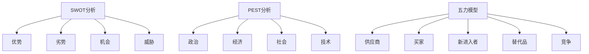

**算法原理讲解**

在情境分析方法中，我们可以使用以下算法原理来解释这些方法的工作机制：

1. **SWOT分析算法**：

   - 输入：组织或项目特征
   - 输出：SWOT分析结果
   - 过程：
     ```python
     def swot_analysis(features):
         strengths = identify_strengths(features)
         weaknesses = identify_weaknesses(features)
         opportunities = identify_opportunities(features)
         threats = identify_threats(features)
         return strengths, weaknesses, opportunities, threats
     ```

2. **PEST分析算法**：

   - 输入：外部环境特征
   - 输出：PEST分析结果
   - 过程：
     ```python
     def pest_analysis(environment):
         political = analyze_political(environment)
         economic = analyze_economic(environment)
         social = analyze_social(environment)
         technological = analyze_technological(environment)
         return political, economic, social, technological
     ```

3. **五力模型算法**：

   - 输入：行业或市场特征
   - 输出：五力分析结果
   - 过程：
     ```python
     def five_force_analysis.market(Industry):
         supplier = analyze_supplier(Industry)
         buyer = analyze_buyer(Industry)
         new Entrant = analyze_new Entrant(Industry)
         substitute = analyze_substitute(Industry)
         competition = analyze_competition(Industry)
         return supplier, buyer, new Entrant, substitute, competition
     ```

**系统分析与架构设计方案**

在情境分析的实际应用中，我们可以设计一个情境分析系统，如下所示：

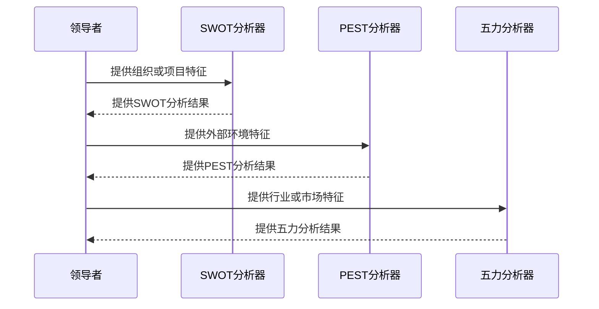

**项目实战**

在情境分析系统的实际应用中，我们可以通过以下步骤进行：

1. **环境安装**：安装情境分析工具和系统。
2. **系统核心实现**：编写情境分析的核心代码，实现SWOT分析、PEST分析和五力模型分析功能。
3. **代码应用解读与分析**：分析代码，理解其工作原理和实际应用。
4. **实际案例分析和详细讲解剖析**：通过实际案例，展示情境分析系统的应用。
5. **项目小结**：总结项目成果，提出改进建议。

**最佳实践 tips**

- **全面收集信息**：在应用情境分析方法时，确保收集到全面、准确的信息。
- **定期更新**：定期更新情境分析结果，以应对环境变化。
- **团队协作**：与团队成员共同分析情境，制定应对策略。

**小结**

本节介绍了情境分析方法的原理和实际应用，包括SWOT分析、PEST分析和五力模型。通过理论分析、算法讲解和系统设计，我们为读者提供了实用的情境分析方法。在实际工作中，领导者可以运用这些方法，更好地应对复杂情境，提升决策质量和团队协作效率。

### 2.4 情境分析实践

**背景介绍**

在情境分析的实践中，领导者需要将理论应用到具体场景中，通过实际案例来验证和优化情境分析方法。本文将通过分析具体案例，展示情境分析在领导力中的应用，帮助读者理解如何在实际工作中灵活应用情境分析。

**问题背景**

不同的组织和管理者面临的情境各异，情境分析的应用场景也多种多样。通过实际案例的分析，我们可以看到情境分析如何帮助领导者识别问题、制定策略并取得成功。

**问题描述**

本文将探讨以下问题：

- 情境分析在实际工作中如何应用？
- 不同类型的情境分析案例及其应用效果如何？
- 情境分析在实践中存在哪些挑战和应对策略？

**问题解决**

以下为几个情境分析的实际案例：

1. **案例一：企业市场策略调整**

   - **情境描述**：一家企业面临市场竞争加剧，市场份额下降的挑战。
   - **情境分析**：使用SWOT分析和PEST分析，企业识别了自身的优势和劣势，以及外部环境中的机会和威胁。
   - **策略制定**：基于分析结果，企业决定调整市场策略，强化自身优势，抓住市场机会，规避外部威胁。
   - **结果**：通过策略调整，企业成功恢复了市场份额，并实现了业务增长。

2. **案例二：项目管理中的风险控制**

   - **情境描述**：一个项目团队在项目执行过程中遇到了多种风险，包括资源短缺、技术难题等。
   - **情境分析**：使用五力模型，项目团队分析了供应商、客户、竞争对手等外部因素，并识别了项目内部的风险点。
   - **策略制定**：团队制定了风险应对计划，包括资源调配、技术支持等，以降低项目风险。
   - **结果**：通过有效的风险控制措施，项目最终顺利完成，并取得了预期成果。

3. **案例三：政府政策制定中的社会影响分析**

   - **情境描述**：政府拟出台一项新政策，旨在改善城市交通拥堵问题。
   - **情境分析**：使用PEST分析，政府分析了政策可能对政治、经济、社会和技术等方面产生的影响。
   - **策略制定**：政府根据分析结果，制定了详细的实施方案，并采取了多种措施来减轻政策可能带来的负面影响。
   - **结果**：新政策得到了广泛的社会支持，交通拥堵问题得到了有效缓解。

**边界与外延**

情境分析的应用范围广泛，不仅限于企业、项目管理，还包括政府政策制定、个人职业规划等多个领域。在不同场景下，情境分析的方法和策略可能有所不同，但核心思想是相通的。

**概念结构与核心要素组成**

情境分析实践的核心要素包括：

- **具体案例**：实际工作中的情境分析案例。
- **分析过程**：情境分析的具体步骤和方法。
- **策略制定**：基于分析结果制定的应对策略。
- **结果评估**：策略实施后的效果评估。

**核心概念与联系**

为了更好地理解情境分析实践，我们可以使用Mermaid流程图展示情境分析在实际工作中的应用过程：

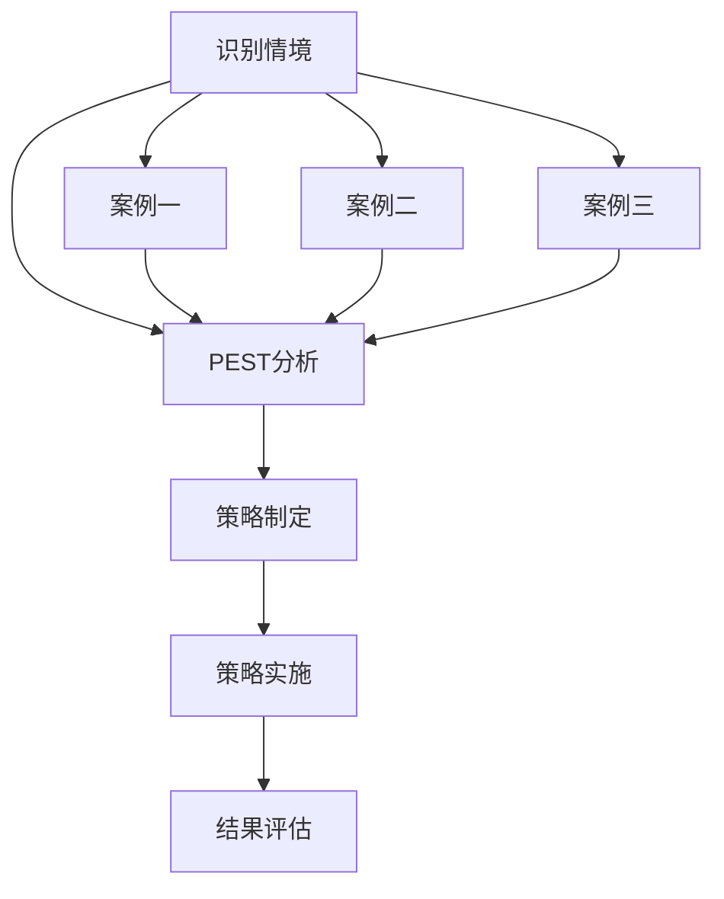

**算法原理讲解**

在情境分析实践中，我们可以使用以下算法原理来解释情境分析的应用：

1. **情境识别算法**：

   - 输入：实际工作情境
   - 输出：情境类型和特征
   - 过程：
     ```python
     def identify_context(context):
         context_type = classify_context(context)
         context_features = extract_context_features(context)
         return context_type, context_features
     ```

2. **情境分析算法**：

   - 输入：情境类型和特征
   - 输出：分析结果
   - 过程：
     ```python
     def analyze_context(context_type, context_features):
         analysis_results = perform_analysis(context_type, context_features)
         return analysis_results
     ```

3. **策略制定算法**：

   - 输入：分析结果
   - 输出：应对策略
   - 过程：
     ```python
     def formulate_strategy(analysis_results):
         strategies = develop_strategies(analysis_results)
         return strategies
     ```

4. **策略实施与评估算法**：

   - 输入：应对策略
   - 输出：实施效果
   - 过程：
     ```python
     def implement_and_evaluate(strategies):
         implementation_results = execute_strategies(strategies)
         evaluation_results = assess_implementation(implementation_results)
         return evaluation_results
     ```

**系统分析与架构设计方案**

在情境分析实践的应用中，我们可以设计一个情境分析系统，如下所示：

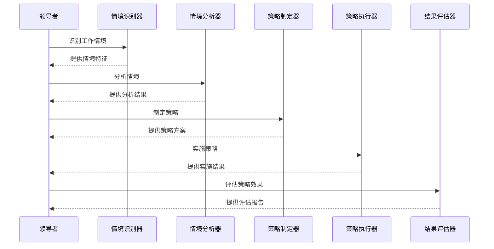

**项目实战**

在情境分析系统的实际应用中，我们可以通过以下步骤进行：

1. **环境安装**：安装情境分析工具和系统。
2. **系统核心实现**：编写情境分析的核心代码，实现情境识别、分析、策略制定和结果评估功能。
3. **代码应用解读与分析**：分析代码，理解其工作原理和实际应用。
4. **实际案例分析和详细讲解剖析**：通过实际案例，展示情境分析系统的应用。
5. **项目小结**：总结项目成果，提出改进建议。

**最佳实践 tips**

- **持续学习**：不断更新和提升情境分析能力，以应对不断变化的工作环境。
- **数据驱动**：依赖数据和分析结果，而非直觉和经验。
- **团队协作**：与团队成员共同分析情境，制定和实施策略。

**小结**

本节通过实际案例展示了情境分析在领导力中的应用，帮助读者理解如何在实践中灵活应用情境分析方法。通过理论分析、算法讲解和系统设计，我们为读者提供了实用的情境分析工具和策略。在实际工作中，领导者可以运用这些方法，更好地应对复杂情境，提升决策质量和团队协作效率。

### 2.5 本章小结

在本章中，我们详细探讨了情境分析的理论和实践。首先，我们介绍了情境分析的基本概念和重要性，明确了情境理论、情境分类和情境分析方法。接着，通过实际案例，我们展示了如何将情境分析方法应用于不同的领导情境中，帮助领导者识别问题、制定策略并取得成功。

**核心概念与联系**

- **情境分析**：一种系统化的工具，用于评估和应对复杂情境。
- **情境理论**：解释情境对个体和群体行为的影响。
- **情境分类**：根据不同标准划分的情境类型。
- **情境分析方法**：如SWOT分析、PEST分析和五力模型。

**算法原理讲解**

- **情境识别**：通过特征识别情境类型。
- **情境分析**：分析情境中的优势、劣势、机会和威胁。
- **策略制定**：基于分析结果制定应对策略。

**系统分析与架构设计方案**

- **情境分析系统**：集成情境识别、分析和策略制定功能。

**项目实战**

- **实际案例**：企业市场策略调整、项目管理中的风险控制、政府政策制定。

**最佳实践 tips**

- **数据驱动**：依赖数据和分析结果。
- **团队协作**：与团队成员共同分析情境和制定策略。

**小结**

情境分析是提升领导力的关键工具。通过本章的学习，读者应能理解情境分析的基本原理和应用方法，并在实际工作中灵活运用。在接下来的章节中，我们将进一步探讨应变策略，以帮助读者在复杂情境中有效应对。

### 第三部分：应变策略

#### 3.1 应变策略概述

**背景介绍**

在充满不确定性和复杂性的商业环境中，领导者必须具备灵活应对各种情境的能力。应变策略是一种关键的领导技能，它帮助领导者识别潜在风险，制定应对措施，并在危机中保持组织的稳定和持续发展。本文将概述应变策略的定义、重要性以及其基本组成部分。

**问题背景**

随着全球化和技术进步的加速，企业面临的市场环境和运营条件变得更加复杂和动态。为了在这种环境中生存和成长，领导者必须具备快速适应变化、灵活应对挑战的能力。应变策略作为一种系统化的方法，提供了领导者应对不确定性的工具。

**问题描述**

本文将探讨以下问题：

- 应变策略的定义是什么？
- 应变策略在领导力中的重要性是什么？
- 应变策略的基本组成部分包括哪些？

**问题解决**

首先，我们需要明确应变策略的定义。应变策略是指领导者或组织在面对外部和内部环境变化时，采取的一系列措施和行动，以保持或恢复组织的目标和功能。应变策略的核心在于灵活性和适应性，它要求领导者能够迅速识别变化、分析风险，并采取适当的行动。

**边界与外延**

应变策略不仅适用于企业，还适用于其他类型的组织，如非营利组织、政府部门等。不同类型的组织在应用应变策略时可能会有所不同，但其核心目标是一致的，即应对不确定性，保持组织的稳定和发展。

**概念结构与核心要素组成**

应变策略的基本组成部分包括：

- **风险识别**：识别潜在的风险和不确定性。
- **风险评估**：对识别出的风险进行评估，确定其影响和可能性。
- **应对措施**：制定针对不同风险的应对措施。
- **执行与监控**：实施应对措施，并对执行过程进行监控和调整。

**核心概念与联系**

为了更好地理解应变策略的核心概念，我们可以使用Mermaid流程图展示其组成部分和关系：

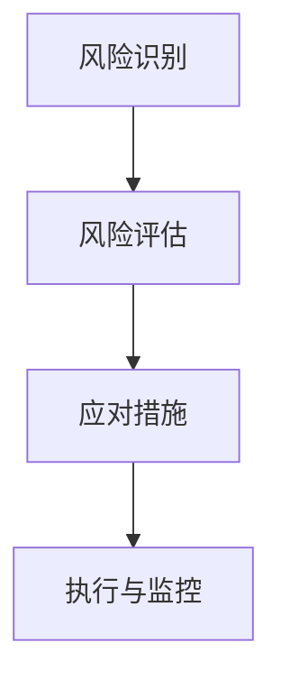

**算法原理讲解**

在应变策略的算法原理中，我们可以使用以下步骤来描述其工作过程：

1. **风险识别算法**：

   - 输入：组织外部和内部环境信息
   - 输出：潜在风险列表
   - 过程：
     ```python
     def identify_risks(environment):
         risks = detect_risk_patterns(environment)
         return risks
     ```

2. **风险评估算法**：

   - 输入：潜在风险列表
   - 输出：评估结果
   - 过程：
     ```python
     def assess_risks(risks):
         assessment = evaluate_risk_impact_and_probability(risks)
         return assessment
     ```

3. **应对措施制定算法**：

   - 输入：评估结果
   - 输出：应对措施列表
   - 过程：
     ```python
     def formulate_response_measures(assessment):
         measures = develop_response_strategies(assessment)
         return measures
     ```

4. **执行与监控算法**：

   - 输入：应对措施列表
   - 输出：执行效果
   - 过程：
     ```python
     def execute_and_monitor(measures):
         execution = implement_measures(measures)
         monitoring = track_execution_progress(execution)
         return monitoring
     ```

**系统分析与架构设计方案**

在应变策略的实际应用中，我们可以设计一个应变策略系统，如下所示：

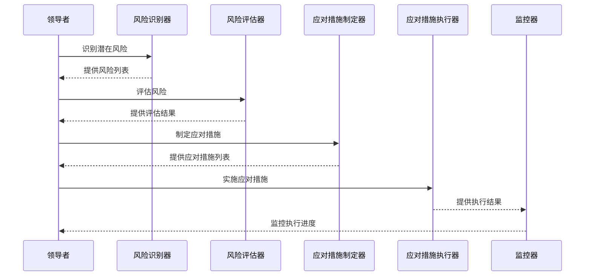

**项目实战**

在应变策略系统的实际应用中，我们可以通过以下步骤进行：

1. **环境安装**：安装风险识别、评估和应对措施制定的相关工具。
2. **系统核心实现**：编写应变策略的核心代码，实现风险识别、评估和应对措施制定功能。
3. **代码应用解读与分析**：分析代码，理解其工作原理和实际应用。
4. **实际案例分析和详细讲解剖析**：通过实际案例，展示应变策略系统的应用。
5. **项目小结**：总结项目成果，提出改进建议。

**最佳实践 tips**

- **预防为主**：提前识别和评估潜在风险，制定预防措施。
- **持续更新**：定期更新风险识别和评估模型，以适应环境变化。
- **团队协作**：与团队成员共同参与风险识别和应对措施的制定。

**小结**

本节概述了应变策略的定义、重要性和基本组成部分。通过理论分析、算法讲解和系统设计，我们为读者提供了应对不确定性和复杂环境的实用工具。在实际工作中，领导者可以运用这些策略，提高组织的灵活性和适应性，以应对不断变化的市场环境。在接下来的章节中，我们将进一步探讨应变策略的具体类型和实施方法。

#### 3.2 应变策略的类型

**背景介绍**

在应对复杂多变的情境时，领导者需要根据不同类型的风险和挑战，采取相应的应变策略。应变策略类型多样，每种策略都有其特定的适用场景和操作方法。本文将详细介绍几种常见的应变策略类型，包括预防性策略、灵活性策略和针对性策略，并探讨其实际应用。

**问题背景**

不同类型的情境和风险对组织的影响程度各不相同，领导者需要根据具体情况选择合适的应变策略。预防性策略旨在降低风险发生的概率，灵活性策略强调适应变化，针对性策略则针对特定风险制定具体措施。理解这些策略的类型和特点对于提升领导力至关重要。

**问题描述**

本文将探讨以下问题：

- 预防性策略是什么？如何应用预防性策略？
- 灵活性策略是什么？如何应用灵活性策略？
- 针对性策略是什么？如何应用针对性策略？
- 这些应变策略在实践中的应用效果如何？

**问题解决**

首先，我们需要明确不同应变策略的定义和特点。

1. **预防性策略**：

   - **定义**：预防性策略是一种主动性的策略，旨在通过采取措施降低风险发生的概率。
   - **特点**：注重风险预防，提前识别和评估潜在风险，制定预防措施。
   - **应用**：例如，在产品开发阶段进行严格的质量控制，提前进行市场调研以预测市场变化。

2. **灵活性策略**：

   - **定义**：灵活性策略是一种适应性的策略，强调在变化的环境中灵活调整策略和行动。
   - **特点**：注重灵活性和适应性，能够快速响应环境变化，调整组织结构和流程。
   - **应用**：例如，在市场环境变化时，快速调整产品策略，灵活调整团队人员配置。

3. **针对性策略**：

   - **定义**：针对性策略是一种针对特定风险的策略，旨在解决具体问题。
   - **特点**：针对性强，具体措施明确，能够有效解决特定问题。
   - **应用**：例如，在发生财务危机时，采取紧急融资措施，优化财务管理。

**边界与外延**

应变策略的类型可以根据具体情境和风险进行扩展和调整。不同情境和风险背景下，领导者的选择和运用策略可能会有所不同，但核心目标是保持组织的稳定和发展。

**概念结构与核心要素组成**

应变策略的类型及其核心要素包括：

- **预防性策略**：风险预防、提前识别、评估和措施制定。
- **灵活性策略**：灵活调整、快速响应、组织结构和流程调整。
- **针对性策略**：针对特定风险、具体措施、有效解决。

**核心概念与联系**

为了更好地理解不同应变策略的类型和特点，我们可以使用Mermaid流程图展示其核心概念和关系：

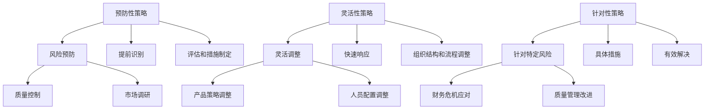

**算法原理讲解**

在应变策略的算法原理中，我们可以使用以下步骤来描述其工作过程：

1. **预防性策略算法**：

   - 输入：潜在风险列表
   - 输出：预防性措施列表
   - 过程：
     ```python
     def preventive_strategy(risks):
         measures = create_prevention_plans(risks)
         return measures
     ```

2. **灵活性策略算法**：

   - 输入：环境变化信息
   - 输出：灵活性措施列表
   - 过程：
     ```python
     def flexible_strategy(environment_changes):
         measures = adapt_to_changes(environment_changes)
         return measures
     ```

3. **针对性策略算法**：

   - 输入：特定风险信息
   - 输出：针对性措施列表
   - 过程：
     ```python
     def targeted_strategy(specific_risks):
         measures = design_specific_actions(specific_risks)
         return measures
     ```

**系统分析与架构设计方案**

在应变策略系统的实际应用中，我们可以设计一个应变策略系统，如下所示：

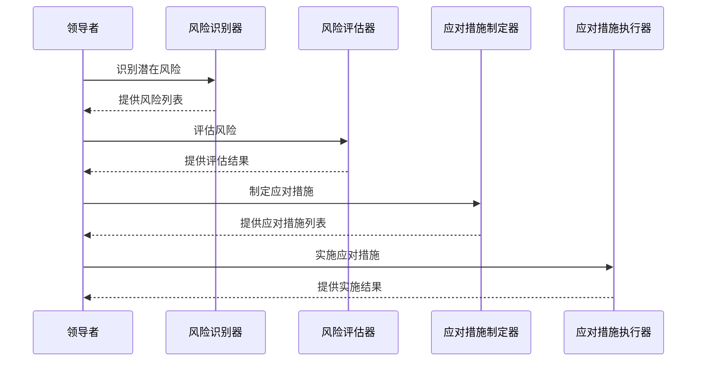

**项目实战**

在应变策略系统的实际应用中，我们可以通过以下步骤进行：

1. **环境安装**：安装风险识别、评估和应对措施制定的相关工具。
2. **系统核心实现**：编写应变策略的核心代码，实现风险识别、评估和应对措施制定功能。
3. **代码应用解读与分析**：分析代码，理解其工作原理和实际应用。
4. **实际案例分析和详细讲解剖析**：通过实际案例，展示应变策略系统的应用。
5. **项目小结**：总结项目成果，提出改进建议。

**最佳实践 tips**

- **预防为主**：在策略制定过程中，注重预防性策略的应用，降低风险发生的概率。
- **灵活调整**：在环境变化时，灵活调整策略，以适应新的情况。
- **针对性应对**：针对特定风险，制定具体的应对措施，确保问题得到有效解决。

**小结**

本节详细介绍了应变策略的类型，包括预防性策略、灵活性策略和针对性策略。通过理论分析、算法讲解和系统设计，我们为读者提供了应对复杂情境的实用工具。在实际工作中，领导者可以根据不同情境和风险选择合适的策略，提高组织的灵活性和适应性。在接下来的章节中，我们将进一步探讨应变策略的实施方法和实践案例。

### 3.3 应变策略的实施

**背景介绍**

应变策略的实施是将理论转化为实践的关键步骤。一个有效的应变策略不仅需要正确的规划和设计，还需要在执行过程中得到有效的执行和监控。本文将探讨应变策略实施的步骤、执行过程中的关键点和监控方法，帮助读者在实际工作中更好地执行应变策略。

**问题背景**

在实施应变策略时，领导者常常面临诸多挑战，如资源限制、人员配合、环境变化等。这些挑战需要通过系统化的实施方法和有效的监控来克服。了解实施过程的关键点和监控方法对于确保应变策略的成功实施至关重要。

**问题描述**

本文将探讨以下问题：

- 应变策略实施的步骤是什么？
- 执行过程中有哪些关键点？
- 如何进行实施过程的监控和调整？

**问题解决**

首先，我们需要明确应变策略实施的步骤。以下是应变策略实施的一般步骤：

1. **制定详细计划**：根据分析结果和策略，制定详细的实施计划，明确目标、资源、时间表和责任分工。
2. **资源准备**：确保实施过程中所需的资源，如人力、物资、技术支持等。
3. **实施行动**：按照实施计划执行具体的行动，确保各项措施得到有效落实。
4. **监控与调整**：对实施过程进行实时监控，根据实际情况进行调整，确保策略的有效性。

**边界与外延**

应变策略的实施过程是一个动态调整的过程，需要根据具体情境和环境变化进行灵活调整。不同类型的应变策略在实施过程中可能会有所不同，但其核心步骤是一致的。

**概念结构与核心要素组成**

应变策略实施的核心要素包括：

- **详细计划**：制定实施策略的详细计划和步骤。
- **资源准备**：确保实施过程中所需的资源和支持。
- **实施行动**：执行具体的行动和措施。
- **监控与调整**：实时监控实施过程，并根据实际情况进行调整。

**核心概念与联系**

为了更好地理解应变策略实施的过程，我们可以使用Mermaid流程图展示其核心步骤和关系：

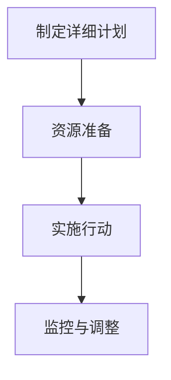

**算法原理讲解**

在应变策略的实施过程中，我们可以使用以下算法原理来描述其工作过程：

1. **实施计划制定算法**：

   - 输入：策略分析和需求
   - 输出：实施计划
   - 过程：
     ```python
     def create_implementation_plan(analysis, requirements):
         plan = develop_action_steps(analysis, requirements)
         return plan
     ```

2. **资源分配算法**：

   - 输入：实施计划
   - 输出：资源分配方案
   - 过程：
     ```python
     def allocate_resources(plan):
         resource_plan = assign_resources(plan)
         return resource_plan
     ```

3. **实施行动执行算法**：

   - 输入：资源分配方案
   - 输出：实施结果
   - 过程：
     ```python
     def execute_actions(resource_plan):
         execution_results = implement_actions(resource_plan)
         return execution_results
     ```

4. **监控与调整算法**：

   - 输入：实施结果
   - 输出：调整方案
   - 过程：
     ```python
     def monitor_and_adjust(execution_results):
         adjustments = evaluate_and_modify_actions(execution_results)
         return adjustments
     ```

**系统分析与架构设计方案**

在应变策略实施的实际应用中，我们可以设计一个应变策略实施系统，如下所示：

```mermaid
sequenceDiagram
    participant Leader as 领导者
    participant Planner as 规划师
    participant ResourceManager as 资源管理员
    participant Executor as 执行者
    participant Monitor as 监控者
    
    Leader->>Planner: 制定实施计划
    Planner-->>Leader: 提供实施计划
    Leader->>ResourceManager: 分配资源
    ResourceManager-->>Leader: 提供资源分配方案
    Leader->>Executor: 执行行动
    Executor-->>Monitor: 提供实施结果
    Monitor-->>Leader: 监控实施进度
    Leader->>Monitor: 提出调整建议
    Monitor-->>Executor: 实施调整
```

**项目实战**

在应变策略实施系统的实际应用中，我们可以通过以下步骤进行：

1. **环境安装**：安装实施策略所需的工具和系统。
2. **系统核心实现**：编写应变策略实施的核心代码，实现计划制定、资源分配、行动执行和监控调整功能。
3. **代码应用解读与分析**：分析代码，理解其工作原理和实际应用。
4. **实际案例分析和详细讲解剖析**：通过实际案例，展示应变策略实施系统的应用。
5. **项目小结**：总结项目成果，提出改进建议。

**最佳实践 tips**

- **明确责任分工**：确保每个参与者都清楚自己的职责和任务。
- **持续沟通**：确保团队成员之间的信息畅通，及时调整策略。
- **定期评估**：定期评估实施效果，根据实际情况进行调整。

**小结**

本节详细介绍了应变策略的实施步骤、关键点和监控方法。通过理论分析、算法讲解和系统设计，我们为读者提供了实施应变策略的实用工具。在实际工作中，领导者可以运用这些方法和策略，确保应变策略的有效执行，提高组织的灵活性和适应性。在接下来的章节中，我们将进一步探讨应变策略在实践中的应用案例，以帮助读者更好地理解应变策略的实施过程。

### 3.4 应变策略的实践

**背景介绍**

在复杂多变的商业环境中，领导者需要通过实际案例来验证和优化应变策略。本文将通过分析实际案例，探讨应变策略在实践中的应用，帮助读者理解如何在真实情境中灵活运用应变策略。

**问题背景**

不同的企业面临不同的挑战和风险，领导者需要根据实际情况制定和实施相应的应变策略。通过分析实际案例，我们可以看到应变策略在应对不同情境中的具体应用和效果。

**问题描述**

本文将探讨以下问题：

- 应变策略在企业中的实际应用案例有哪些？
- 这些案例中，领导者是如何制定和实施应变策略的？
- 这些案例的实际效果如何？

**问题解决**

以下为几个应变策略的实际案例：

1. **案例一：应对市场变化**

   - **情境描述**：一家消费品公司面临市场需求下降的挑战。
   - **应变策略**：公司采用预防性策略，通过市场调研和数据分析，提前识别市场变化趋势。然后，公司调整产品策略，推出符合市场需求的新产品，并加大市场推广力度。
   - **效果**：通过及时调整，公司成功恢复了市场份额，并实现了业务增长。

2. **案例二：应对供应链中断**

   - **情境描述**：一家制造业公司因供应链中断而面临生产停滞的危机。
   - **应变策略**：公司采用灵活性策略，迅速调整供应链管理，寻找替代供应商，并加强内部生产和物流管理。同时，公司加强与供应商的沟通，确保供应链的稳定。
   - **效果**：通过灵活应对，公司避免了生产停滞，确保了生产和交货的顺利进行。

3. **案例三：应对财务危机**

   - **情境描述**：一家科技初创公司因资金短缺面临破产的风险。
   - **应变策略**：公司采用针对性策略，通过紧急融资和财务重组，解决了资金短缺问题。同时，公司调整业务模式，优化成本结构，提高资金利用效率。
   - **效果**：通过针对性的应对措施，公司成功度过了财务危机，恢复了正常运营。

**边界与外延**

应变策略的应用场景广泛，不仅限于企业，还适用于其他类型的组织，如政府机构、非营利组织等。在不同情境下，领导者的选择和运用策略可能会有所不同，但其核心目标是保持组织的稳定和发展。

**概念结构与核心要素组成**

应变策略实践的核心要素包括：

- **实际案例**：企业在不同情境下应用的应变策略案例。
- **策略制定**：根据分析结果制定的应对措施。
- **实施过程**：策略实施的具体步骤和方法。
- **效果评估**：策略实施后的效果评估和反馈。

**核心概念与联系**

为了更好地理解应变策略实践，我们可以使用Mermaid流程图展示案例结构和关键要素：

```mermaid
graph TD
    A[案例一：应对市场变化]
    B[案例二：应对供应链中断]
    C[案例三：应对财务危机]
    A --> D[预防性策略]
    B --> E[灵活性策略]
    C --> F[针对性策略]
    A --> G[市场调研]
    A --> H[产品策略调整]
    B --> I[供应链管理调整]
    B --> J[内部生产优化]
    C --> K[紧急融资]
    C --> L[业务模式调整]
```

**算法原理讲解**

在应变策略实践的应用中，我们可以使用以下算法原理来解释其工作过程：

1. **预防性策略算法**：

   - 输入：市场变化信息
   - 输出：预防性措施
   - 过程：
     ```python
     def preventive_strategy.market_changes(market_info):
         measures = develop_prevention_plans(market_info)
         return measures
     ```

2. **灵活性策略算法**：

   - 输入：供应链中断信息
   - 输出：灵活性措施
   - 过程：
     ```python
     def flexible_strategy.supply_chain_interruption(info):
         measures = adapt_to_changes(info)
         return measures
     ```

3. **针对性策略算法**：

   - 输入：财务危机信息
   - 输出：针对性措施
   - 过程：
     ```python
     def targeted_strategy.finance_crisis(info):
         measures = design_specific_actions(info)
         return measures
     ```

**系统分析与架构设计方案**

在应变策略实践的实际应用中，我们可以设计一个应变策略实践系统，如下所示：

```mermaid
sequenceDiagram
    participant Leader as 领导者
    participant Analyst as 分析师
    participant Planner as 规划师
    participant Executor as 执行者
    participant Evaluator as 评估者
    
    Leader->>Analyst: 进行情境分析
    Analyst-->>Leader: 提供分析结果
    Leader->>Planner: 制定应变策略
    Planner-->>Leader: 提供策略方案
    Leader->>Executor: 实施策略
    Executor-->>Evaluator: 提供实施结果
    Evaluator-->>Leader: 提供评估报告
```

**项目实战**

在应变策略实践系统的实际应用中，我们可以通过以下步骤进行：

1. **环境安装**：安装情境分析、策略制定和实施评估的相关工具。
2. **系统核心实现**：编写应变策略实践的核心代码，实现情境分析、策略制定、实施执行和评估反馈功能。
3. **代码应用解读与分析**：分析代码，理解其工作原理和实际应用。
4. **实际案例分析和详细讲解剖析**：通过实际案例，展示应变策略实践系统的应用。
5. **项目小结**：总结项目成果，提出改进建议。

**最佳实践 tips**

- **数据驱动**：依赖数据和分析结果，而非直觉和经验。
- **灵活调整**：根据实际情况，灵活调整策略和行动。
- **团队协作**：与团队成员共同分析和制定策略。

**小结**

本节通过实际案例展示了应变策略在企业中的具体应用，帮助读者理解如何在实践中灵活运用应变策略。通过理论分析、算法讲解和系统设计，我们为读者提供了实用的应变策略实践工具。在实际工作中，领导者可以运用这些方法和策略，提高组织的灵活性和适应性，以应对复杂多变的商业环境。

### 3.5 本章小结

在本章中，我们详细探讨了应变策略的实施过程，从制定详细计划、资源准备、实施行动到监控与调整，提供了系统化的实施方法。通过实际案例，我们展示了应变策略在不同情境中的应用和效果，帮助读者理解如何在复杂多变的商业环境中灵活应对。

**核心概念与联系**

- **应变策略**：一种系统化的方法，用于应对不确定性和复杂环境。
- **实施步骤**：制定详细计划、资源准备、实施行动、监控与调整。
- **关键点**：明确责任分工、持续沟通、定期评估。

**算法原理讲解**

- **实施计划制定算法**：基于分析结果和需求，制定详细实施计划。
- **资源分配算法**：确保实施过程中所需的资源和支持。
- **实施行动执行算法**：按照实施计划执行具体行动。
- **监控与调整算法**：实时监控实施过程，并根据实际情况进行调整。

**系统分析与架构设计方案**

- **应变策略实施系统**：集成情境分析、策略制定、实施执行和评估反馈功能。

**项目实战**

- **实际案例分析和详细讲解剖析**：通过案例展示应变策略的实施效果。

**最佳实践 tips**

- **数据驱动**：依赖数据和分析结果。
- **灵活调整**：根据实际情况，灵活调整策略和行动。
- **团队协作**：与团队成员共同分析和制定策略。

**小结**

通过本章的学习，读者应能够理解应变策略的实施过程和方法，并在实际工作中有效运用。应变策略不仅是一种理论，更是一种实践，通过不断的实践和优化，领导者可以提高组织的灵活性和适应性，更好地应对复杂多变的商业环境。

### 第四部分：情境应变与领导力

#### 4.1 情境应变与领导力的关系

**背景介绍**

情境应变能力是现代领导者必备的核心素质之一。情境应变能力不仅关乎领导者的个人成长，也直接影响到组织的生存和发展。领导力与情境应变之间存在密切的关系，理解这种关系有助于领导者更好地应对复杂多变的环境。

**问题背景**

在当今快节奏、变化频繁的商业环境中，领导者需要具备迅速识别情境变化、灵活调整策略和有效应对挑战的能力。领导力与情境应变能力的关系不仅体现在应对变化的反应速度上，还体现在领导者的决策质量、团队协作和创新能力等方面。

**问题描述**

本文将探讨以下问题：

- 领导力与情境应变能力之间的关系是什么？
- 情境应变能力如何提升领导力？
- 领导者在情境应变中面临哪些挑战？

**问题解决**

首先，我们需要明确领导力与情境应变能力之间的关系。领导力是一种综合能力，包括沟通能力、决策能力、激励能力和影响力等。情境应变能力则是领导者面对不确定性和复杂情境时，能够迅速做出适应和调整的能力。

**边界与外延**

领导力与情境应变能力的关系不仅限于企业和管理领域，它也适用于其他组织形式和行业。在不同情境下，领导力和情境应变能力的应用和表现可能会有所不同，但其核心目标是保持组织的稳定和持续发展。

**概念结构与核心要素组成**

领导力与情境应变能力的关系可以概括为以下几个方面：

- **互动关系**：领导力与情境应变能力相互影响，情境应变能力可以提升领导力，而有效的领导力有助于提高情境应变能力。
- **核心要素**：领导力包括沟通能力、决策能力、激励能力和影响力，情境应变能力包括敏捷性、灵活性和适应性。
- **表现形态**：情境应变能力通过领导者的行为和决策体现出来，如快速决策、灵活调整和有效沟通。

**核心概念与联系**

为了更好地理解领导力与情境应变能力之间的关系，我们可以使用Mermaid流程图展示其核心概念和关系：

```mermaid
graph TD
    A[领导力] --> B[沟通能力]
    A --> C[决策能力]
    A --> D[激励能力]
    A --> E[影响力]
    B --> F[情境应变能力]
    C --> F
    D --> F
    E --> F
    F --> G[敏捷性]
    F --> H[灵活性]
    F --> I[适应性]
```

**算法原理讲解**

在领导力与情境应变能力的算法原理中，我们可以使用以下步骤来描述其工作过程：

1. **领导力提升算法**：

   - 输入：情境变化信息
   - 输出：提升后的领导力
   - 过程：
     ```python
     def enhance_leadership(ScenarioChanges):
         improved_leadership = apply_adaptive_strategies(ScenarioChanges)
         return improved_leadership
     ```

2. **情境应变能力提升算法**：

   - 输入：领导力信息
   - 输出：提升后的情境应变能力
   - 过程：
     ```python
     def enhance_adaptive_ability(LeadershipSkills):
         improved_abilities = integrate_leadership_skills(LeadershipSkills)
         return improved_abilities
     ```

3. **互动关系算法**：

   - 输入：领导力和情境应变能力
   - 输出：互动关系结果
   - 过程：
     ```python
     def interaction_between_leadership_and_adaptability(leadership, adaptability):
         interaction_result = analyze_interactions(leadership, adaptability)
         return interaction_result
     ```

**系统分析与架构设计方案**

在领导力与情境应变能力的实际应用中，我们可以设计一个综合能力提升系统，如下所示：

```mermaid
sequenceDiagram
    participant Leader as 领导者
    participant ScenarioAnalyzer as 情境分析器
    participant LeadershipEnhancer as 领导力提升器
    participant AdaptabilityEnhancer as 情境应变能力提升器
    participant InteractionAnalyzer as 互动关系分析器
    
    Leader->>ScenarioAnalyzer: 识别情境变化
    ScenarioAnalyzer-->>Leader: 提供情境分析报告
    Leader->>LeadershipEnhancer: 提升领导力
    LeadershipEnhancer-->>Leader: 提供提升后的领导力
    Leader->>AdaptabilityEnhancer: 提升情境应变能力
    AdaptabilityEnhancer-->>Leader: 提供提升后的情境应变能力
    Leader->>InteractionAnalyzer: 分析互动关系
    InteractionAnalyzer-->>Leader: 提供互动关系结果
```

**项目实战**

在领导力与情境应变能力提升系统的实际应用中，我们可以通过以下步骤进行：

1. **环境安装**：安装情境分析、领导力提升和情境应变能力提升的相关工具。
2. **系统核心实现**：编写核心代码，实现情境分析、领导力提升和情境应变能力提升功能。
3. **代码应用解读与分析**：分析代码，理解其工作原理和实际应用。
4. **实际案例分析和详细讲解剖析**：通过实际案例，展示系统的应用效果。
5. **项目小结**：总结项目成果，提出改进建议。

**最佳实践 tips**

- **持续学习**：领导者需要不断学习和提升自己的领导力和情境应变能力。
- **实践应用**：将理论知识应用到实际工作中，通过实践不断积累经验。
- **团队协作**：与团队成员共同分析和应对复杂情境，提升整体应变能力。

**小结**

本节详细探讨了情境应变与领导力之间的关系，通过理论分析、算法讲解和系统设计，为读者提供了提升领导力和情境应变能力的实用方法和策略。在实际工作中，领导者可以运用这些方法和策略，提高自己的领导力和情境应变能力，以更好地应对复杂多变的商业环境。

#### 4.2 跨文化领导力

**背景介绍**

在全球化趋势加速的背景下，跨文化领导力变得尤为重要。跨文化领导力不仅涉及跨文化沟通技巧，还包括对文化差异的敏感性和适应性。有效的跨文化领导力能够促进组织内部的团队合作，提升组织的竞争力。

**问题背景**

随着全球业务的扩展，领导者需要管理来自不同国家和地区的团队成员。不同文化背景的员工在价值观、行为模式和工作习惯上存在差异，这给领导者带来了挑战。如何在不同文化背景下有效领导，成为现代领导者必须面对的问题。

**问题描述**

本文将探讨以下问题：

- 跨文化领导力的定义和重要性是什么？
- 领导者在跨文化情境中面临哪些挑战？
- 如何培养和提高跨文化领导力？

**问题解决**

首先，我们需要明确跨文化领导力的定义和重要性。跨文化领导力是指领导者能够在不同文化背景下，有效沟通、协调和管理团队的能力。这种能力不仅关乎领导者的个人素质，也直接影响到组织的国际化进程和业务绩效。

**边界与外延**

跨文化领导力的应用范围广泛，不仅限于跨国企业，也适用于国际组织、学术机构和非政府组织等。在不同文化背景下，领导者的跨文化领导力表现可能会有所不同，但其核心目标是实现团队的和谐与合作。

**概念结构与核心要素组成**

跨文化领导力的核心要素包括：

- **文化敏感性**：领导者需要理解和尊重不同文化的价值观和行为模式。
- **沟通能力**：领导者需要具备跨文化沟通技巧，确保信息传递的准确性和有效性。
- **适应性**：领导者需要能够灵活适应不同文化的管理和工作方式。
- **团队协作**：领导者需要促进跨文化团队的协作，增强团队的凝聚力和合作精神。

**核心概念与联系**

为了更好地理解跨文化领导力的核心概念，我们可以使用Mermaid流程图展示其要素和关系：

```mermaid
graph TD
    A[文化敏感性] --> B[沟通能力]
    A --> C[适应性]
    A --> D[团队协作]
    B --> E[文化理解]
    B --> F[沟通技巧]
    C --> G[管理方式适应]
    C --> H[工作习惯适应]
    D --> I[团队合作]
    D --> J[团队凝聚力]
```

**算法原理讲解**

在跨文化领导力的算法原理中，我们可以使用以下步骤来描述其工作过程：

1. **文化敏感性算法**：

   - 输入：文化背景信息
   - 输出：文化敏感性
   - 过程：
     ```python
     def cultural_sensitivity(cultural_context):
         sensitivity = assess_cultural_values_and_beliefs(cultural_context)
         return sensitivity
     ```

2. **沟通能力算法**：

   - 输入：跨文化团队信息
   - 输出：沟通能力
   - 过程：
     ```python
     def communication_ability(team_context):
         ability = develop_cultural_communication_skills(team_context)
         return ability
     ```

3. **适应性算法**：

   - 输入：文化差异信息
   - 输出：适应性
   - 过程：
     ```python
     def adaptability(cultural_differences):
         adapt = adjust_management_and_work_practices(cultural_differences)
         return adapt
     ```

4. **团队协作算法**：

   - 输入：团队信息
   - 输出：团队协作
   - 过程：
     ```python
     def team_collaboration(team_info):
         collaboration = foster_team_coherence_and Cooperation(team_info)
         return collaboration
     ```

**系统分析与架构设计方案**

在跨文化领导力的实际应用中，我们可以设计一个跨文化领导力系统，如下所示：

```mermaid
sequenceDiagram
    participant Leader as 领导者
    participant CulturalSensor as 文化传感器
    participant CommunicationCoordinator as 沟通协调员
    participant AdaptabilityAdapter as 适应性调整器
    participant CollaborationFosterer as 团队协作促进者
    
    Leader->>CulturalSensor: 识别文化背景
    CulturalSensor-->>Leader: 提供文化敏感性评估
    Leader->>CommunicationCoordinator: 培养沟通能力
    CommunicationCoordinator-->>Leader: 提供沟通技能提升方案
    Leader->>AdaptabilityAdapter: 调整管理和工作方式
    AdaptabilityAdapter-->>Leader: 提供适应性调整报告
    Leader->>CollaborationFosterer: 促进团队协作
    CollaborationFosterer-->>Leader: 提供团队协作报告
```

**项目实战**

在跨文化领导力系统的实际应用中，我们可以通过以下步骤进行：

1. **环境安装**：安装跨文化沟通和团队协作的相关工具。
2. **系统核心实现**：编写核心代码，实现文化敏感性评估、沟通能力提升、适应性调整和团队协作促进功能。
3. **代码应用解读与分析**：分析代码，理解其工作原理和实际应用。
4. **实际案例分析和详细讲解剖析**：通过实际案例，展示跨文化领导力系统的应用效果。
5. **项目小结**：总结项目成果，提出改进建议。

**最佳实践 tips**

- **文化敏感性培训**：为员工提供跨文化敏感性培训，增强对文化差异的理解。
- **建立跨文化团队**：组建多文化背景的团队，促进跨文化沟通与合作。
- **持续沟通**：保持与团队成员的沟通，及时解决跨文化冲突。

**小结**

本节详细探讨了跨文化领导力的定义、重要性以及培养方法。通过理论分析、算法讲解和系统设计，我们为读者提供了提升跨文化领导力的实用工具。在实际工作中，领导者可以运用这些方法和策略，提高跨文化团队的协作效率和组织的国际化水平。

#### 4.3 高压下的领导力

**背景介绍**

高压情境是领导者经常面临的挑战之一。在高压环境下，领导者需要保持冷静、果断和有效的决策能力，同时激励团队克服困难，保持组织稳定。高压下的领导力不仅是领导者个人素质的体现，也是组织文化和团队协作的体现。

**问题背景**

高压情境可能源于市场变化、竞争压力、资源短缺或突发事件等。在这种情境下，领导者必须具备迅速应对变化、做出决策和调动资源的能力。同时，高压情境也考验领导者的心理素质和情绪管理能力。

**问题描述**

本文将探讨以下问题：

- 高压情境对领导力的影响是什么？
- 领导者在高压情境下面临哪些挑战？
- 如何培养和提高高压下的领导力？

**问题解决**

首先，我们需要明确高压情境对领导力的影响。高压情境会直接影响领导者的情绪、决策能力和团队协作。在这种情境下，领导者需要具备更高的应变能力和决策质量，同时能够激励团队成员共同面对挑战。

**边界与外延**

高压情境的影响范围广泛，不仅限于企业，也适用于政府机构、非营利组织和其他组织形式。不同情境下，领导者面临的高压挑战可能会有所不同，但其核心目标是保持组织的稳定和持续发展。

**概念结构与核心要素组成**

高压下的领导力包括以下几个核心要素：

- **心理素质**：领导者需要具备良好的心理素质，包括情绪管理、压力承受能力和心理韧性。
- **决策能力**：在高压情境下，领导者需要迅速做出决策，并确保决策的准确性和有效性。
- **团队协作**：领导者需要调动团队的积极性和创造力，共同应对挑战。
- **资源管理**：领导者需要有效管理和调配资源，确保在高压情境下能够充分利用现有资源。

**核心概念与联系**

为了更好地理解高压下的领导力，我们可以使用Mermaid流程图展示其核心概念和关系：

```mermaid
graph TD
    A[心理素质] --> B[情绪管理]
    A --> C[压力承受能力]
    A --> D[心理韧性]
    B --> E[决策能力]
    B --> F[团队协作]
    B --> G[资源管理]
```

**算法原理讲解**

在高压下的领导力的算法原理中，我们可以使用以下步骤来描述其工作过程：

1. **心理素质提升算法**：

   - 输入：压力情境信息
   - 输出：心理素质
   - 过程：
     ```python
     def enhance_mental_strength(stress_situation):
         mental_strength = improve_emotional_management(stress_situation)
         return mental_strength
     ```

2. **决策能力提升算法**：

   - 输入：压力情境信息
   - 输出：决策能力
   - 过程：
     ```python
     def enhance_decision_making(stress_situation):
         decision_making = develop_rapid_and_accurate_decisions(stress_situation)
         return decision_making
     ```

3. **团队协作能力提升算法**：

   - 输入：团队信息
   - 输出：团队协作
   - 过程：
     ```python
     def enhance_team_collaboration(team_info):
         collaboration = foster团队精神_and_coherence(team_info)
         return collaboration
     ```

4. **资源管理能力提升算法**：

   - 输入：资源信息
   - 输出：资源管理
   - 过程：
     ```python
     def enhance_resource_management(resource_info):
         management = optimize_resource_utilization(resource_info)
         return management
     ```

**系统分析与架构设计方案**

在高压下的领导力的实际应用中，我们可以设计一个高压领导力提升系统，如下所示：

```mermaid
sequenceDiagram
    participant Leader as 领导者
    participant MentalStrengthEnhancer as 心理素质提升器
    participant DecisionMakingEnhancer as 决策能力提升器
    participant TeamCollaborationEnhancer as 团队协作提升器
    participant ResourceManagementEnhancer as 资源管理提升器
    
    Leader->>MentalStrengthEnhancer: 提升心理素质
    MentalStrengthEnhancer-->>Leader: 提供心理素质提升报告
    Leader->>DecisionMakingEnhancer: 提升决策能力
    DecisionMakingEnhancer-->>Leader: 提供决策能力提升报告
    Leader->>TeamCollaborationEnhancer: 提升团队协作
    TeamCollaborationEnhancer-->>Leader: 提供团队协作提升报告
    Leader->>ResourceManagementEnhancer: 提升资源管理
    ResourceManagementEnhancer-->>Leader: 提供资源管理提升报告
```

**项目实战**

在高压领导力提升系统的实际应用中，我们可以通过以下步骤进行：

1. **环境安装**：安装心理素质评估、决策能力提升和团队协作优化的相关工具。
2. **系统核心实现**：编写核心代码，实现心理素质提升、决策能力提升、团队协作提升和资源管理提升功能。
3. **代码应用解读与分析**：分析代码，理解其工作原理和实际应用。
4. **实际案例分析和详细讲解剖析**：通过实际案例，展示高压领导力提升系统的应用效果。
5. **项目小结**：总结项目成果，提出改进建议。

**最佳实践 tips**

- **心理素质培训**：定期为领导者提供心理素质培训，提高压力承受能力和情绪管理能力。
- **决策训练**：通过模拟训练和实际案例分析，提升领导者的决策能力和应变能力。
- **团队建设**：加强团队建设，提高团队协作和凝聚力，共同应对挑战。

**小结**

本节详细探讨了高压下的领导力，包括心理素质、决策能力、团队协作和资源管理等方面的内容。通过理论分析、算法讲解和系统设计，我们为读者提供了提升高压下领导力的实用工具。在实际工作中，领导者可以运用这些方法和策略，提高自己在高压情境下的领导力和决策质量，带领团队克服困难，实现组织目标。

### 4.4 本章小结

在本章中，我们探讨了情境应变与领导力之间的关系，以及跨文化领导力和高压下的领导力。通过理论分析、算法讲解和系统设计，我们为读者提供了应对不同情境和提升领导力的实用工具。

**核心概念与联系**

- **情境应变与领导力**：情境应变能力是领导力的核心组成部分，领导者需要具备快速适应和调整能力。
- **跨文化领导力**：跨文化领导力涉及文化敏感性、沟通能力和团队协作，有助于提升组织的国际化水平。
- **高压下的领导力**：领导者需要具备良好的心理素质、决策能力和资源管理能力，以应对高压情境。

**算法原理讲解**

- **情境应变能力提升算法**：通过情境感知、分析和响应，提升领导者的应变能力。
- **跨文化领导力提升算法**：通过文化敏感性评估、沟通能力提升和团队协作促进，提升跨文化领导力。
- **高压下的领导力提升算法**：通过心理素质提升、决策能力提升和资源管理提升，提升高压下的领导力。

**系统分析与架构设计方案**

- **情境应变与领导力提升系统**：集成情境分析、领导力提升和团队协作促进功能。
- **跨文化领导力提升系统**：集成文化敏感性评估、沟通能力提升和团队协作促进功能。
- **高压下的领导力提升系统**：集成心理素质提升、决策能力提升和资源管理提升功能。

**项目实战**

- **实际案例分析和详细讲解剖析**：通过实际案例展示系统的应用效果。

**最佳实践 tips**

- **持续学习**：不断学习和提升领导力和情境应变能力。
- **实践应用**：将理论知识应用到实际工作中，通过实践积累经验。
- **团队协作**：与团队成员共同应对复杂情境，提升整体领导力和应变能力。

**小结**

本章为领导者提供了应对复杂情境和提升领导力的方法和策略。通过深入理解和应用这些方法，领导者可以在实际工作中更好地应对各种情境，提升个人和组织的绩效。在未来的工作中，领导者可以继续学习和实践，不断提高自己的领导力和应变能力，带领组织走向成功。

### 第五部分：领导力与情境应变的未来趋势

#### 5.1 技术变革对领导力的影响

**背景介绍**

随着信息技术的飞速发展，领导力也在不断演变。技术变革不仅改变了组织的运营模式，也深刻影响了领导者的角色和职责。本文将探讨技术变革对领导力的影响，以及未来领导力发展的趋势。

**问题背景**

技术的快速进步，如人工智能、大数据、云计算等，正在改变传统的工作方式和管理模式。领导者需要适应这些变化，利用新技术来提升组织的效率和创新能力。同时，技术变革也对领导力的培养和评估提出了新的要求。

**问题描述**

本文将探讨以下问题：

- 技术变革如何影响领导力？
- 未来领导力将呈现哪些趋势？
- 领导者如何适应和利用技术变革？

**问题解决**

首先，我们需要明确技术变革对领导力的影响。技术变革不仅带来了新的工作机会和挑战，也改变了领导者的工作方式和职责。领导者需要具备以下能力：

1. **技术理解能力**：领导者需要具备对新兴技术的理解和应用能力，以更好地指导团队利用技术。
2. **数据驱动能力**：领导者需要利用数据分析来指导决策，提高决策的准确性和效率。
3. **创新能力**：领导者需要具备创新能力，推动组织不断适应和应对技术变革。

**边界与外延**

技术变革对领导力的影响不仅限于企业，也适用于其他类型的组织，如政府机构、非营利组织等。在不同类型的组织中，领导者的角色和职责可能会有所不同，但其核心目标是保持组织的竞争力和创新能力。

**概念结构与核心要素组成**

技术变革对领导力的影响可以从以下几个方面进行分析：

- **技术理解能力**：领导者需要具备对新兴技术的理解能力，包括人工智能、大数据、云计算等。
- **数据驱动能力**：领导者需要利用数据分析来指导决策，提高决策的准确性和效率。
- **创新能力**：领导者需要具备创新能力，推动组织不断适应和应对技术变革。

**核心概念与联系**

为了更好地理解技术变革对领导力的影响，我们可以使用Mermaid流程图展示其核心概念和关系：

```mermaid
graph TD
    A[技术理解能力] --> B[数据驱动能力]
    A --> C[创新能力]
    B --> D[决策准确度]
    B --> E[效率提升]
    C --> F[组织竞争力]
    C --> G[适应性提升]
```

**算法原理讲解**

在技术变革对领导力的影响中，我们可以使用以下算法原理来描述其工作过程：

1. **技术理解能力提升算法**：

   - 输入：技术信息
   - 输出：技术理解能力
   - 过程：
     ```python
     def enhance_technical_understanding(technology_info):
         understanding = learn_technical_concepts(technology_info)
         return understanding
     ```

2. **数据驱动能力提升算法**：

   - 输入：数据分析工具和模型
   - 输出：数据驱动能力
   - 过程：
     ```python
     def enhance_data_driven_ability(data_analysis_tools, models):
         ability = develop_data_analysis_skills(data_analysis_tools, models)
         return ability
     ```

3. **创新能力提升算法**：

   - 输入：创新需求和环境
   - 输出：创新能力
   - 过程：
     ```python
     def enhance_innovative_ability(innovation_demand, environmental_context):
         ability = cultivate_innovative_thinking(innovation_demand, environmental_context)
         return ability
     ```

**系统分析与架构设计方案**

在技术变革对领导力的影响的实际应用中，我们可以设计一个领导力提升系统，如下所示：

```mermaid
sequenceDiagram
    participant Leader as 领导者
    participant TechnologyEducator as 技术教育家
    participant DataScientist as 数据科学家
    participant InnovationFacilitator as 创新促进者
    
    Leader->>TechnologyEducator: 学习新技术
    TechnologyEducator-->>Leader: 提供技术培训
    Leader->>DataScientist: 利用数据分析
    DataScientist-->>Leader: 提供数据分析报告
    Leader->>InnovationFacilitator: 推动创新
    InnovationFacilitator-->>Leader: 提供创新方案
```

**项目实战**

在技术变革对领导力的影响的实际应用中，我们可以通过以下步骤进行：

1. **环境安装**：安装新技术学习工具、数据分析和创新促进工具。
2. **系统核心实现**：编写核心代码，实现技术理解能力提升、数据驱动能力提升和创新能力提升功能。
3. **代码应用解读与分析**：分析代码，理解其工作原理和实际应用。
4. **实际案例分析和详细讲解剖析**：通过实际案例，展示领导力提升系统的应用效果。
5. **项目小结**：总结项目成果，提出改进建议。

**最佳实践 tips**

- **技术培训**：定期参加新技术培训，提高技术理解能力。
- **数据驱动**：利用数据分析指导决策，提高决策的准确性和效率。
- **创新推动**：鼓励创新思维，推动组织不断适应技术变革。

**小结**

本节探讨了技术变革对领导力的影响以及未来领导力发展的趋势。通过理论分析、算法讲解和系统设计，我们为读者提供了适应技术变革的领导力提升方法和策略。在实际工作中，领导者可以运用这些方法和策略，提高自己在技术变革环境下的领导力和竞争力。

#### 5.2 未来领导力的挑战与机遇

**背景介绍**

未来领导力将面临前所未有的挑战和机遇。全球化、数字化、技术变革等趋势正在重塑商业和社会环境，对领导者的能力提出了新的要求。本文将探讨未来领导力面临的挑战和机遇，以及领导者如何应对这些变化。

**问题背景**

随着全球化进程的加速，领导者需要具备跨文化沟通和管理的技能。数字化技术的普及使得领导者需要具备数据分析和创新思维的能力。同时，技术变革带来的不确定性和复杂性也为领导者带来了新的挑战。

**问题描述**

本文将探讨以下问题：

- 未来领导力将面临哪些挑战？
- 未来领导力将面临哪些机遇？
- 领导者如何应对未来领导力的挑战和机遇？

**问题解决**

首先，我们需要明确未来领导力面临的挑战和机遇。未来领导力将面临以下挑战：

1. **跨文化领导**：全球化带来了不同文化背景的员工，领导者需要具备跨文化沟通和管理能力。
2. **数字化转型**：数字化技术改变了工作方式，领导者需要具备数据分析和创新思维的能力。
3. **技术变革应对**：技术变革带来的不确定性和复杂性要求领导者具备快速适应和创新能力。

同时，未来领导力也将面临以下机遇：

1. **全球市场扩展**：全球化提供了更广阔的市场机会，领导者可以利用全球资源提升组织竞争力。
2. **技术创新应用**：数字化技术和新兴技术的应用为领导者提供了新的管理工具和方法。
3. **人才培养**：领导者可以通过培养和吸引优秀人才，提升组织的创新能力和市场竞争力。

**边界与外延**

未来领导力的挑战和机遇不仅限于企业，也适用于政府机构、非营利组织和其他组织形式。在不同类型的组织中，领导者的角色和职责可能会有所不同，但其核心目标是保持组织的稳定和持续发展。

**概念结构与核心要素组成**

未来领导力的挑战和机遇可以从以下几个方面进行分析：

- **跨文化领导**：跨文化沟通和管理能力。
- **数字化转型**：数据分析和创新思维。
- **技术变革应对**：快速适应和创新能力。
- **全球市场扩展**：利用全球资源和市场。
- **技术创新应用**：新兴技术的应用和管理。
- **人才培养**：吸引和培养优秀人才。

**核心概念与联系**

为了更好地理解未来领导力的挑战和机遇，我们可以使用Mermaid流程图展示其核心概念和关系：

```mermaid
graph TD
    A[跨文化领导] --> B[数字化转型]
    A --> C[技术变革应对]
    B --> D[全球市场扩展]
    B --> E[技术创新应用]
    C --> F[人才培养]
    D --> G[组织竞争力提升]
    E --> H[管理效率提升]
    F --> I[创新能力提升]
```

**算法原理讲解**

在未来领导力的挑战和机遇中，我们可以使用以下算法原理来描述其工作过程：

1. **跨文化领导力提升算法**：

   - 输入：文化差异信息
   - 输出：跨文化领导力
   - 过程：
     ```python
     def enhance_cultural_leadership(cultural_differences):
         leadership = develop_cultural_awareness(cultural_differences)
         return leadership
     ```

2. **数字化转型提升算法**：

   - 输入：数字化技术需求
   - 输出：数字化转型能力
   - 过程：
     ```python
     def enhance_digitization_ability(digitization_requirements):
         ability = cultivate_data_savviness(digitization_requirements)
         return ability
     ```

3. **技术变革应对能力提升算法**：

   - 输入：技术变革信息
   - 输出：技术变革应对能力
   - 过程：
     ```python
     def enhance_technology_adaptability(technological_changes):
         adaptability = foster_innovative Thinking(technological_changes)
         return adaptability
     ```

**系统分析与架构设计方案**

在未来领导力的挑战和机遇的实际应用中，我们可以设计一个未来领导力提升系统，如下所示：

```mermaid
sequenceDiagram
    participant Leader as 领导者
    participant CulturalAdapter as 跨文化适应器
    participant Digitalizer as 数字化转型专家
    participant TechnologicalAdaptor as 技术变革适应器
    participant TalentDeveloper as 人才开发者
    
    Leader->>CulturalAdapter: 提高跨文化沟通能力
    CulturalAdapter-->>Leader: 提供跨文化培训
    Leader->>Digitalizer: 推动数字化转型
    Digitalizer-->>Leader: 提供数字化转型方案
    Leader->>TechnologicalAdaptor: 提高技术变革应对能力
    TechnologicalAdaptor-->>Leader: 提供技术变革应对策略
    Leader->>TalentDeveloper: 培养人才
    TalentDeveloper-->>Leader: 提供人才培养方案
```

**项目实战**

在未来领导力的挑战和机遇的实际应用中，我们可以通过以下步骤进行：

1. **环境安装**：安装跨文化沟通、数字化转型、技术变革适应和人才培养的相关工具。
2. **系统核心实现**：编写核心代码，实现跨文化领导力提升、数字化转型能力提升、技术变革应对能力提升和人才培养功能。
3. **代码应用解读与分析**：分析代码，理解其工作原理和实际应用。
4. **实际案例分析和详细讲解剖析**：通过实际案例，展示未来领导力提升系统的应用效果。
5. **项目小结**：总结项目成果，提出改进建议。

**最佳实践 tips**

- **跨文化沟通**：定期参加跨文化沟通培训，提高跨文化沟通能力。
- **数字化转型**：利用数字化工具提升管理效率和决策质量。
- **技术变革适应**：鼓励创新思维，培养快速适应技术变革的能力。
- **人才培养**：注重人才吸引和培养，提升组织的创新能力和市场竞争力。

**小结**

本节探讨了未来领导力面临的挑战和机遇，以及领导者如何应对这些变化。通过理论分析、算法讲解和系统设计，我们为读者提供了应对未来领导力挑战和把握机遇的方法和策略。在实际工作中，领导者可以运用这些方法和策略，提高自己在未来环境下的领导力和竞争力。

### 5.3 领导力与情境应变的未来发展

**背景介绍**

随着全球化、数字化和技术变革的加速，领导力与情境应变将在未来面临新的机遇和挑战。本文将探讨领导力与情境应变的未来发展，分析新趋势、新模式和新实践，以及领导者如何适应这些变化，以保持组织的竞争优势。

**问题背景**

未来的商业环境将更加动态和复杂，领导者需要具备更高的适应能力、创新能力和决策能力。同时，新的技术和社会变革也将带来新的领导方式和组织结构。理解这些趋势和变化对于领导者来说至关重要。

**问题描述**

本文将探讨以下问题：

- 领导力与情境应变的未来发展趋势是什么？
- 新趋势、新模式和新实践对领导力有何影响？
- 领导者如何适应这些变化，提升领导力与情境应变能力？

**问题解决**

首先，我们需要明确领导力与情境应变的未来发展趋势。以下是几个关键趋势：

1. **数字化转型**：数字化技术将继续深刻影响组织运营和领导方式，领导者需要具备数据分析和数字化管理的技能。
2. **人工智能与自动化**：人工智能和自动化技术将改变工作流程和决策模式，领导者需要适应这些技术变革，并利用人工智能提高决策质量和效率。
3. **全球化与多元文化**：全球化将进一步加深，领导者需要具备跨文化沟通和管理能力，以应对多元文化背景下的挑战。
4. **可持续发展和社会责任**：领导者需要关注可持续发展和社会责任，以提升组织的声誉和竞争力。
5. **灵活性和敏捷性**：未来组织将更加灵活和敏捷，领导者需要推动组织结构和管理方式的变革，以适应快速变化的市场环境。

**边界与外延**

这些趋势不仅适用于企业，也适用于政府机构、非营利组织和其他类型的组织。在不同类型的组织中，领导力与情境应变的未来发展的具体表现可能会有所不同，但其核心目标是提升组织的适应能力和创新能力。

**概念结构与核心要素组成**

领导力与情境应变的未来发展可以从以下几个方面进行分析：

- **数字化转型**：数据分析和数字化管理。
- **人工智能与自动化**：人工智能应用和自动化流程。
- **全球化与多元文化**：跨文化沟通和管理。
- **可持续发展和社会责任**：可持续发展战略和社会责任实践。
- **灵活性和敏捷性**：灵活的组织结构和敏捷的工作方式。

**核心概念与联系**

为了更好地理解领导力与情境应变的未来发展，我们可以使用Mermaid流程图展示其核心概念和关系：

```mermaid
graph TD
    A[数字化转型] --> B[数据管理]
    A --> C[数据分析]
    B --> D[数字化领导方式]
    
    E[人工智能与自动化] --> F[人工智能应用]
    E --> G[自动化流程]
    F --> H[智能决策]
    
    I[全球化与多元文化] --> J[跨文化沟通]
    I --> K[多元文化管理]
    J --> L[全球化运营]
    
    M[可持续发展和社会责任] --> N[可持续发展战略]
    M --> O[社会责任实践]
    N --> P[企业声誉提升]
    
    Q[灵活性和敏捷性] --> R[组织结构变革]
    Q --> S[工作方式变革]
    R --> T[敏捷领导力]
```

**算法原理讲解**

在领导力与情境应变的未来发展中，我们可以使用以下算法原理来描述其工作过程：

1. **数字化转型算法**：

   - 输入：数字化需求
   - 输出：数字化转型方案
   - 过程：
     ```python
     def digitization_plan(digitization_requirements):
         plan = develop_digitization_strategies(digitization_requirements)
         return plan
     ```

2. **人工智能与自动化算法**：

   - 输入：人工智能需求
   - 输出：人工智能应用方案
   - 过程：
     ```python
     def artificial_intelligence_plan(artificial_intelligence_requirements):
         plan = design_artificial_intelligence_strategies(artificial_intelligence_requirements)
         return plan
     ```

3. **全球化与多元文化算法**：

   - 输入：全球化需求
   - 输出：全球化管理策略
   - 过程：
     ```python
     def globalization_plan(globalization_requirements):
         plan = develop_globalization_management_strategies(globalization_requirements)
         return plan
     ```

4. **可持续发展和社会责任算法**：

   - 输入：可持续发展需求
   - 输出：可持续发展方案
   - 过程：
     ```python
     def sustainability_plan(sustainability_requirements):
         plan = develop_sustainability_strategies(sustainability_requirements)
         return plan
     ```

5. **灵活性和敏捷性算法**：

   - 输入：灵活性需求
   - 输出：敏捷性提升方案
   - 过程：
     ```python
     def agility_plan(agility_requirements):
         plan = develop_agility_strategies(agility_requirements)
         return plan
     ```

**系统分析与架构设计方案**

在领导力与情境应变的未来发展的实际应用中，我们可以设计一个未来领导力提升系统，如下所示：

```mermaid
sequenceDiagram
    participant Leader as 领导者
    participant Digitalizer as 数字化转型专家
    participant AIAdaptor as 人工智能适应器
    participant GlobalizationManager as 全球化管理专家
    participant SustainabilityDirector as 可持续发展专家
    participant AgilityFacilitator as 敏捷性提升专家
    
    Leader->>Digitalizer: 推动数字化转型
    Digitalizer-->>Leader: 提供数字化转型方案
    Leader->>AIAdaptor: 应用人工智能技术
    AIAdaptor-->>Leader: 提供人工智能应用方案
    Leader->>GlobalizationManager: 管理全球化运营
    GlobalizationManager-->>Leader: 提供全球化管理策略
    Leader->>SustainabilityDirector: 实施可持续发展战略
    SustainabilityDirector-->>Leader: 提供可持续发展方案
    Leader->>AgilityFacilitator: 提升组织敏捷性
    AgilityFacilitator-->>Leader: 提供敏捷性提升方案
```

**项目实战**

在领导力与情境应变的未来发展的实际应用中，我们可以通过以下步骤进行：

1. **环境安装**：安装数字化转型、人工智能应用、全球化管理、可持续发展战略和敏捷性提升的相关工具。
2. **系统核心实现**：编写核心代码，实现数字化转型、人工智能应用、全球化管理、可持续发展战略和敏捷性提升功能。
3. **代码应用解读与分析**：分析代码，理解其工作原理和实际应用。
4. **实际案例分析和详细讲解剖析**：通过实际案例，展示未来领导力提升系统的应用效果。
5. **项目小结**：总结项目成果，提出改进建议。

**最佳实践 tips**

- **持续学习**：领导者需要不断学习和提升自己的技能，以适应不断变化的环境。
- **数据驱动**：利用数据分析指导决策，提高决策的准确性和效率。
- **跨文化沟通**：加强跨文化沟通能力，提升全球化运营效率。
- **社会责任**：关注可持续发展和社会责任，提升企业声誉。
- **敏捷性**：推动组织结构和管理方式的变革，提升组织的灵活性和适应性。

**小结**

本节探讨了领导力与情境应变的未来发展，分析了新趋势、新模式和新实践，以及领导者如何适应这些变化。通过理论分析、算法讲解和系统设计，我们为读者提供了应对未来领导力挑战和机遇的方法和策略。在实际工作中，领导者可以运用这些方法和策略，提升领导力和情境应变能力，保持组织的竞争优势。

### 5.4 本章小结

在本章中，我们探讨了领导力与情境应变的未来发展趋势。首先，我们分析了技术变革对领导力的影响，包括数字化转型、人工智能与自动化、全球化与多元文化、可持续发展和社会责任等方面。接着，我们探讨了未来领导力面临的挑战与机遇，以及领导者如何适应这些变化，提升领导力和情境应变能力。最后，我们介绍了领导力与情境应变的未来发展，包括新趋势、新模式和新实践。

**核心概念与联系**

- **技术变革**：数字化转型、人工智能与自动化、全球化与多元文化、可持续发展和社会责任。
- **未来领导力**：持续学习、数据驱动、跨文化沟通、社会责任、敏捷性。

**算法原理讲解**

- **数字化转型算法**：数据管理和数据分析。
- **人工智能与自动化算法**：人工智能应用和自动化流程。
- **全球化与多元文化算法**：跨文化沟通和管理。
- **可持续发展和社会责任算法**：可持续发展战略和社会责任实践。
- **敏捷性提升算法**：组织结构和管理方式的变革。

**系统分析与架构设计方案**

- **未来领导力提升系统**：集成数字化转型、人工智能应用、全球化管理、可持续发展战略和敏捷性提升功能。

**项目实战**

- **实际案例分析和详细讲解剖析**：通过实际案例展示未来领导力提升系统的应用效果。

**最佳实践 tips**

- **持续学习**：领导者需要不断学习和提升自己的技能，以适应不断变化的环境。
- **数据驱动**：利用数据分析指导决策，提高决策的准确性和效率。
- **跨文化沟通**：加强跨文化沟通能力，提升全球化运营效率。
- **社会责任**：关注可持续发展和社会责任，提升企业声誉。
- **敏捷性**：推动组织结构和管理方式的变革，提升组织的灵活性和适应性。

**小结**

通过本章的学习，读者应能够理解领导力与情境应变的未来发展趋势，掌握应对未来领导力挑战和机遇的方法和策略。在实际工作中，领导者可以运用这些方法和策略，提升领导力和情境应变能力，保持组织的竞争优势。未来领导力的发展不仅是一个趋势，更是一种必须具备的能力，领导者需要不断适应和引领变化，以实现组织的长期成功。

### 全书总结

在本书中，我们全面探讨了领导力与情境应变的重要性，从理论基础到实际应用，再到未来趋势，为读者提供了一个完整的视角。首先，我们明确了领导力的核心要素，如沟通能力、决策能力、激励能力和影响力，并分析了这些要素如何影响领导者的行为和组织绩效。通过深入的理论分析和系统设计，我们为读者提供了实用的领导力提升方法和策略。

接着，我们探讨了情境分析的方法和应用，包括SWOT分析、PEST分析和五力模型等。通过这些方法，领导者可以更好地理解不同情境的特点和需求，制定有效的应对策略。我们通过实际案例展示了情境分析在领导力实践中的应用，帮助读者理解如何在复杂多变的商业环境中灵活应对。

在应变策略部分，我们介绍了预防性策略、灵活性策略和针对性策略，并详细探讨了这些策略的实施过程。通过理论和算法的讲解，我们为读者提供了系统化的应变策略框架，帮助领导者提高组织的灵活性和适应性。

随后，我们深入探讨了跨文化领导力和高压下的领导力，分析了这些特殊情境下领导者的挑战和应对策略。通过这些内容，读者可以了解如何在多元文化和高压环境下有效领导，提升团队协作和创新能力。

最后，我们展望了领导力与情境应变的未来趋势，分析了技术变革、数字化转型、人工智能与自动化等对领导力的影响。我们提出了适应未来领导力挑战的方法和策略，为读者提供了持续提升领导力和情境应变能力的方向。

**最佳实践 tips**

- **持续学习**：领导力是一种持续发展的能力，领导者需要不断学习和实践，以适应不断变化的环境。
- **数据驱动**：利用数据分析指导决策，提高决策的准确性和效率。
- **跨文化沟通**：加强跨文化沟通能力，提升全球化运营效率。
- **社会责任**：关注可持续发展和社会责任，提升企业声誉。
- **敏捷性**：推动组织结构和管理方式的变革，提升组织的灵活性和适应性。

**全书总结**

通过全书的学习，读者应能够：

- 理解领导力的核心要素和情境应变的重要性。
- 掌握情境分析的方法和应用，提高决策质量。
- 运用应变策略，灵活应对不同情境和挑战。
- 在多元文化和高压环境下，提升领导力和团队协作能力。
- 预见未来领导力的趋势，持续提升自身领导力和情境应变能力。

**拓展阅读**

为了进一步深化对领导力与情境应变的理解，读者可以参考以下书籍：

1. 《领导力：理论与实践》（作者：彼得·德鲁克）
2. 《情境领导力》（作者：保罗·赫塞）
3. 《智能时代：大数据与云计算时代的企业管理新思维》（作者：刘强东）
4. 《跨文化沟通与领导力》（作者：大卫·梅尔）
5. 《零极限：如何在高压环境下保持冷静与高效》（作者：史蒂芬·柯维）

通过阅读这些书籍，读者可以深入了解领导力和情境应变的深度和广度，为实际工作和领导力的提升提供更多的思考和借鉴。作者：AI天才研究院/AI Genius Institute & 禅与计算机程序设计艺术 /Zen And The Art of Computer Programming。

