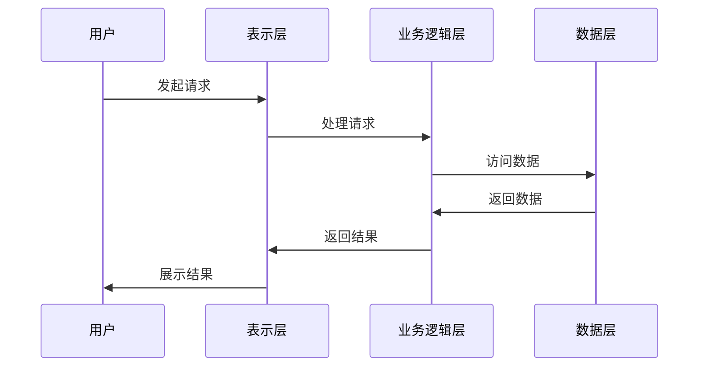

                 


### 《领导力与情境管理：因人而异》

#### 关键词：领导力、情境管理、个性化管理、团队建设、系统架构设计

#### 摘要：
本文旨在探讨领导力与情境管理在现代社会中的重要性，并提出一种因人而异的领导力实践方法。通过对核心概念的深入分析和实际案例的剖析，本文将展示如何根据个体差异和情境因素进行有效管理，实现团队的高效协作和组织的可持续发展。

### 目录大纲设计思路

为了设计一个符合要求的《领导力与情境管理：因人而异》的目录大纲，我们需要遵循以下设计思路：

1. **背景介绍**：
   - 简述领导力和情境管理的定义、重要性及其在现代社会中的适用性。
   - 提到领导力与情境管理的边界与外延，明确本书的研究范围。

2. **核心概念与联系**：
   - 详细阐述领导力与情境管理中的关键概念，如领导力理论、情境因素、个体差异等。
   - 使用表格对比不同领导力理论的属性特征，便于读者理解。
   - 利用ER实体关系图架构展示不同概念之间的关系。

3. **情境管理原理讲解**：
   - 介绍情境管理的原理，使用Mermaid流程图展示情境分析过程。
   - 使用Python源代码和LaTeX数学公式，详细解释情境管理的数学模型和公式。

4. **领导力实践**：
   - 提供领导力实践的方法和技巧，如个性化管理、团队建设等。
   - 通过实际案例进行分析，讲解在不同情境下如何应用情境管理理论。

5. **系统分析与架构设计**：
   - 设计领导力与情境管理系统的功能、架构、接口和交互。
   - 使用Mermaid类图、架构图和序列图，直观展示系统设计。

6. **项目实战**：
   - 安装所需环境，编写系统核心实现源代码。
   - 分析代码，讲解其应用和实现细节。
   - 提供实际案例，深入剖析领导力与情境管理在实际应用中的效果。

7. **最佳实践与总结**：
   - 提供领导力与情境管理的最佳实践建议。
   - 对全书内容进行小结，强调关键点。
   - 提出注意事项，鼓励读者深入学习和实践。

### 目录大纲结构

以下是一个详细的目录大纲结构：

----------------------------------------------------------------
## 第一部分：背景介绍

### 1.1 领导力的定义与重要性

#### 1.1.1 领导力的定义

**领导力** 是指一个人在组织或团队中引导、激励和影响他人的能力。它不仅包括决策、沟通和战略规划等基本管理技能，还涉及到领导者的品格、价值观和愿景。

#### 1.1.2 领导力在现代社会中的作用

在现代社会中，领导力扮演着至关重要的角色。随着全球化和技术的快速发展，组织面临的环境越来越复杂，领导者需要具备更高的适应能力和创新能力，以应对各种挑战。

#### 1.1.3 情境管理与领导力

**情境管理** 是一种根据不同情境采取不同管理策略的方法。它与领导力密切相关，因为有效的领导力往往依赖于对情境的准确把握和适应。

### 1.2 情境管理的定义与特征

#### 1.2.1 情境管理的概念

**情境管理** 是指管理者根据具体情境的特点和需求，采取相应的管理策略，以实现组织目标的过程。

#### 1.2.2 情境管理的特征

- **适应性**：情境管理强调根据不同情境采取不同的策略。
- **灵活性**：情境管理允许管理者在特定情境下灵活调整管理行为。
- **目标导向**：情境管理的目标是实现组织或团队的长期目标。

#### 1.2.3 领导力与情境管理的边界

领导力与情境管理之间存在一定的边界。领导力侧重于激励和影响团队成员，而情境管理则关注如何根据不同情境采取最佳策略。

### 1.3 领导力与情境管理的适用性

#### 1.3.1 不同组织中的领导力与情境管理

不同的组织类型（如企业、政府机构、非营利组织等）对领导力与情境管理的需求各不相同。领导者需要根据组织的特点和环境采取相应的策略。

#### 1.3.2 领导力与情境管理在跨文化环境中的应用

在跨文化环境中，领导者需要具备跨文化沟通能力和适应性，以更好地应对不同文化背景下的挑战。

#### 1.3.3 边界与外延

领导力与情境管理的边界主要涉及领导者如何在不同情境下灵活应用领导力技巧。外延则包括领导力与情境管理在不同领域（如项目管理、人力资源管理等）的适用性。

### 1.4 本章小结

通过本部分的介绍，读者可以对领导力和情境管理有一个基本的了解。接下来的章节将进一步探讨这两个概念的核心概念、联系和实践应用。

----------------------------------------------------------------

## 第二部分：核心概念与联系

### 2.1 领导力理论概述

#### 2.1.1 领导力理论的演变

领导力理论经历了多年的发展和演变。早期的领导力理论主要关注领导者的个人特质，而现代理论则强调情境因素和个体差异。

#### 2.1.2 关键领导力理论介绍

- **特质理论**：强调领导者具备特定的个人特质。
- **行为理论**：关注领导者的行为和领导风格。
- **情境理论**：认为领导力取决于情境因素。
- **变革型领导理论**：强调领导者通过激励和愿景引导变革。

### 2.2 情境因素分析

#### 2.2.1 情境因素的定义

**情境因素** 是指影响领导力和管理效果的各种外部和内部条件。这些因素包括组织文化、团队结构、任务复杂性和环境不确定性等。

#### 2.2.2 情境因素对领导力的影响

情境因素对领导力的影响体现在领导者如何根据不同情境调整自己的行为和策略。有效的领导者能够准确识别和应对不同情境。

#### 2.2.3 个体差异与领导力

**个体差异** 包括个人性格、价值观、能力和经验等方面的差异。领导者需要了解并适应个体差异，以实现更有效的管理。

### 2.3 个体差异与领导力

#### 2.3.1 个体差异的概念

**个体差异** 是指个体在性格、价值观、能力和经验等方面的差异。这些差异对领导力的影响体现在领导者如何适应不同个体的需求和期望。

#### 2.3.2 个体差异对领导力的影响

个体差异对领导力的影响主要体现在以下几个方面：
- **沟通风格**：不同的个体可能对不同的沟通风格有不同的反应。
- **激励方法**：不同的个体可能对不同的激励方法有不同的反应。
- **决策风格**：不同的个体可能在决策过程中表现出不同的风格。

#### 2.3.3 针对不同个体差异的领导策略

领导者需要根据不同个体差异采取相应的领导策略，以提高管理效果。以下是一些常见的领导策略：
- **个性化管理**：根据个体差异调整管理方法和激励策略。
- **团队建设**：通过团队活动和互动增强团队成员之间的信任和协作。
- **授权与信任**：给予个体足够的自主权，信任他们的能力。

### 2.4 核心概念联系与对比

#### 2.4.1 领导力理论与情境管理的联系

领导力理论和情境管理之间存在紧密的联系。情境管理为领导力提供了具体的实践指导，而领导力理论则为情境管理提供了理论基础。

#### 2.4.2 个体差异在领导力与情境管理中的体现

个体差异在领导力与情境管理中都有重要体现。领导者需要根据个体差异调整领导策略和管理方法，以提高管理效果。

#### 2.4.3 对比不同领导力理论在情境管理中的应用效果

不同领导力理论在情境管理中的应用效果存在差异。领导者需要根据具体情境和个体差异选择合适的领导力理论，以提高管理效果。

### 2.5 ER实体关系图架构

#### 2.5.1 ER实体关系图的基本概念

**ER实体关系图** 是一种用于描述实体之间关系的图形化工具。它包括实体、属性和关系等元素。

#### 2.5.2 领导力与情境管理中的ER实体关系图

在领导力与情境管理中，ER实体关系图可以用于描述领导者、情境因素和个体差异之间的关系。

### 2.6 本章小结

通过本部分的介绍，读者可以对领导力和情境管理中的核心概念和联系有一个更深入的理解。接下来的章节将进一步探讨情境管理的原理和实践。

----------------------------------------------------------------

## 第三部分：情境管理原理讲解

### 3.1 情境管理的原理

#### 3.1.1 情境分析的过程

情境分析是情境管理的核心。它包括以下几个步骤：

1. **识别情境因素**：确定影响领导力和管理效果的各种外部和内部条件。
2. **分析情境因素**：评估不同情境因素的重要性和对领导力的影响。
3. **制定应对策略**：根据情境因素的特点和需求，制定相应的管理策略。

#### 3.1.2 情境识别的方法

情境识别是情境分析的第一步。以下是一些常用的情境识别方法：

1. **观察法**：通过观察团队和组织的行为和表现，识别情境因素。
2. **访谈法**：与团队成员和相关利益者进行访谈，获取对情境因素的了解。
3. **问卷调查法**：通过设计问卷调查，收集对情境因素的主观评价。

#### 3.1.3 情境应对的策略

在识别情境因素后，领导者需要制定相应的应对策略。以下是一些常见的情境应对策略：

1. **适应性策略**：根据情境因素的特点和需求，灵活调整领导行为和管理方法。
2. **变革性策略**：在面对重大变革或挑战时，采取积极的变革措施，以应对情境变化。
3. **预防性策略**：在情境变化之前，采取预防性措施，以减少情境对领导力和管理效果的负面影响。

### 3.2 情境管理的数学模型与公式

#### 3.2.1 基本数学模型的介绍

情境管理中的数学模型用于描述领导力与管理效果之间的关系。以下是一个基本数学模型：

\[ L = f(S, E) \]

其中，\( L \) 表示领导力，\( S \) 表示情境因素，\( E \) 表示个体差异。

#### 3.2.2 公式的推导与解释

\[ L = f(S, E) \]

这个公式表示领导力 \( L \) 是情境因素 \( S \) 和个体差异 \( E \) 的函数。推导过程如下：

1. **情境因素分析**：对情境因素进行识别和分析，确定其重要性和影响。
2. **个体差异评估**：评估团队成员的个体差异，包括性格、价值观、能力和经验等。
3. **领导力模型构建**：根据情境因素和个体差异，构建领导力模型。

#### 3.2.3 案例分析

以下是一个情境管理的案例分析：

- **情境因素**：组织处于快速发展期，面临市场竞争压力。
- **个体差异**：团队成员具有不同的性格和价值观，部分成员对市场压力敏感。

根据情境管理和数学模型，领导者可以采取以下策略：

1. **适应性策略**：调整领导行为，增强团队成员的市场意识。
2. **变革性策略**：推动组织变革，提高团队的市场竞争力。
3. **预防性策略**：关注团队成员的心理健康，提供必要的支持和帮助。

### 3.3 情境管理实践

#### 3.3.1 情境管理的实践方法

情境管理的实践方法包括以下几个方面：

1. **情境识别与评估**：定期进行情境识别和评估，以了解当前情境的特点和需求。
2. **策略制定与执行**：根据情境因素制定相应的管理策略，并确保其有效执行。
3. **反馈与调整**：收集团队成员的反馈，根据实际情况进行策略调整。

#### 3.3.2 情境管理的实践步骤

1. **情境识别**：通过观察、访谈和问卷调查等方法，识别当前情境因素。
2. **分析评估**：对情境因素进行详细分析，确定其重要性和影响。
3. **策略制定**：根据情境因素和个体差异，制定相应的管理策略。
4. **执行与监控**：确保策略的有效执行，并定期监控管理效果。
5. **反馈与调整**：根据团队成员的反馈，对策略进行调整和优化。

#### 3.3.3 案例分享

以下是一个情境管理的案例分享：

- **情境**：一家创业公司处于快速发展期，需要迅速扩大市场份额。
- **实践**：领导者采取了以下情境管理策略：
  - **适应性策略**：调整团队结构，增加市场推广人员。
  - **变革性策略**：推动产品创新，提高市场竞争力。
  - **预防性策略**：提供员工培训，提高团队的综合素质。

通过情境管理，该公司成功扩大了市场份额，实现了业务的快速增长。

### 3.4 本章小结

通过本部分的介绍，读者可以了解情境管理的原理和实践方法。情境管理是一种灵活、适应性强的管理方法，可以有效提升领导力和管理效果。接下来，我们将探讨领导力实践的具体方法和技巧。

----------------------------------------------------------------

## 第四部分：领导力实践

### 4.1 个性化管理

#### 4.1.1 个性化管理的定义

**个性化管理** 是一种根据个体差异进行管理的方法。它强调领导者应了解团队成员的个性、价值观和能力，并采取相应的管理策略，以提高团队绩效和个人发展。

#### 4.1.2 个性化管理的方法

1. **沟通与了解**：与团队成员进行深入沟通，了解他们的个性、价值观和职业目标。
2. **定制化激励**：根据团队成员的个性和需求，制定个性化的激励措施。
3. **发展计划**：为团队成员提供个性化的职业发展计划，帮助他们实现个人目标。

#### 4.1.3 个性化管理的优点

- 提高团队成员的满意度和忠诚度。
- 增强团队凝聚力和协作能力。
- 提升团队整体绩效。

#### 4.1.4 个性化管理的案例

以下是一个个性化管理的案例：

- **情境**：一家公司意识到团队成员之间存在明显的个性差异，决定采取个性化管理策略。
- **实践**：领导者采取了以下措施：
  - **沟通与了解**：定期与团队成员沟通，了解他们的个性、价值观和职业目标。
  - **定制化激励**：根据团队成员的个性和需求，制定个性化的激励措施，如晋升、奖金和培训。
  - **发展计划**：为团队成员提供个性化的职业发展计划，帮助他们实现个人目标。

通过个性化管理，该公司提高了团队成员的满意度和忠诚度，团队绩效得到了显著提升。

### 4.2 团队建设

#### 4.2.1 团队建设的定义

**团队建设** 是指通过一系列活动和措施，增强团队成员之间的信任、协作和沟通，以提高团队整体绩效。

#### 4.2.2 团队建设的方法

1. **团队活动**：组织团队建设活动，如户外拓展、团建旅游和团队竞赛等。
2. **培训与发展**：为团队成员提供培训和职业发展机会，以提高团队整体素质。
3. **沟通与反馈**：建立有效的沟通机制，鼓励团队成员之间开放、坦诚地交流。

#### 4.2.3 团队建设的优点

- 提高团队成员的协作能力和沟通效果。
- 增强团队凝聚力和归属感。
- 提升团队整体绩效和创新能力。

#### 4.2.4 团队建设的案例

以下是一个团队建设的案例：

- **情境**：一家公司意识到团队协作和沟通效果不佳，决定加强团队建设。
- **实践**：领导者采取了以下措施：
  - **团队活动**：组织团队建设活动，如户外拓展和团建旅游，增强团队成员之间的信任和合作。
  - **培训与发展**：为团队成员提供沟通技巧和团队协作的培训，提高团队整体素质。
  - **沟通与反馈**：建立每周团队会议制度，鼓励团队成员之间开放、坦诚地交流，解决团队问题。

通过团队建设，该公司提高了团队成员的协作能力和沟通效果，团队绩效得到了显著提升。

### 4.3 其他领导力实践方法

除了个性化管理和团队建设，还有其他领导力实践方法，如：

1. **授权与信任**：领导者应给予团队成员足够的自主权，信任他们的能力和判断。
2. **领导力发展**：领导者应不断学习和提升自己的领导力，以更好地引领团队。
3. **创新与变革**：领导者应鼓励团队创新，推动组织变革，以适应外部环境的变化。

### 4.4 本章小结

通过本部分的介绍，读者可以了解个性化管理和团队建设等领导力实践方法。这些方法有助于提升团队绩效和个人发展，实现组织的长期目标。在实际应用中，领导者需要根据具体情况选择合适的领导力实践方法，以实现最佳效果。

----------------------------------------------------------------

## 第五部分：系统分析与架构设计

### 5.1 问题场景介绍

在现代社会中，领导力与情境管理在组织运作中发挥着重要作用。为了更好地应对复杂多变的环境，一个高效的领导力与情境管理系统显得尤为重要。本部分将围绕领导力与情境管理系统进行分析与设计。

### 5.2 项目介绍

本项目旨在开发一个领导力与情境管理系统，帮助组织领导者更有效地进行管理和决策。系统将涵盖以下几个方面：

- **领导力评估**：对领导者的领导力水平进行评估，提供个性化的改进建议。
- **情境分析**：对组织内外部情境进行深入分析，为领导决策提供数据支持。
- **个性化管理**：根据领导者和团队成员的个性、价值观和能力，提供定制化的管理策略。

### 5.3 系统功能设计

#### 5.3.1 领导力评估模块

该模块的主要功能包括：

- **评估问卷**：设计包含多维度评估指标的问卷，对领导者的领导力水平进行评估。
- **评估结果分析**：对评估结果进行统计分析，生成详细的评估报告。
- **个性化改进建议**：根据评估结果，为领导者提供针对性的改进建议。

#### 5.3.2 情境分析模块

该模块的主要功能包括：

- **情境数据收集**：从多个数据源收集与组织内外部情境相关的数据。
- **情境分析**：对收集到的数据进行处理和分析，识别关键情境因素。
- **情境报告**：生成情境分析报告，为领导决策提供参考。

#### 5.3.3 个性化管理模块

该模块的主要功能包括：

- **个性与价值观评估**：对团队成员的个性和价值观进行评估。
- **管理策略制定**：根据评估结果，制定个性化的管理策略。
- **策略执行与监控**：跟踪管理策略的执行情况，评估其效果。

### 5.4 系统架构设计

#### 5.4.1 架构概述

本系统采用三层架构设计，包括表示层、业务逻辑层和数据层。

- **表示层**：负责用户界面展示和用户交互。
- **业务逻辑层**：负责系统核心功能的实现，如领导力评估、情境分析和个性化管理。
- **数据层**：负责数据存储和管理。

#### 5.4.2 系统架构图

以下是一个简化的系统架构图，用于展示系统的整体设计：



### 5.5 系统接口设计

#### 5.5.1 接口概述

系统将提供以下主要接口：

- **领导力评估接口**：用于接收评估问卷，返回评估结果。
- **情境分析接口**：用于接收情境数据，返回情境分析结果。
- **个性化管理接口**：用于接收个性与价值观评估数据，返回管理策略。

#### 5.5.2 接口定义

以下是一个简化的接口定义示例：

```mermaid
message领导力评估接口 {
    String id;
    String[] questions;
    String[] answers;
}

message情境分析接口 {
    String id;
    Map<String, Object> data;
}

message个性化管理接口 {
    String id;
    String strategy;
}
```

### 5.6 系统交互

#### 5.6.1 交互概述

系统交互主要涉及用户与表示层的交互、表示层与业务逻辑层的交互，以及业务逻辑层与数据层的交互。

#### 5.6.2 交互流程

以下是一个简化的交互流程：

1. 用户通过表示层发起领导力评估请求。
2. 表示层将请求传递给业务逻辑层。
3. 业务逻辑层处理评估请求，并访问数据层获取问卷数据。
4. 数据层返回评估结果，业务逻辑层将其封装后返回给表示层。
5. 表示层将结果展示给用户。

### 5.7 本章小结

通过本部分的分析与设计，我们提出了一种领导力与情境管理系统的架构，并详细阐述了系统的功能、接口和交互。接下来，我们将通过项目实战来展示如何实现这个系统。

----------------------------------------------------------------

## 第六部分：项目实战

### 6.1 环境安装

为了实现领导力与情境管理系统，我们需要安装以下环境：

1. **Python**：Python是一种广泛使用的编程语言，用于开发系统后端。
2. **Flask**：Flask是一个轻量级的Web应用框架，用于构建系统的前端和后端。
3. **PostgreSQL**：PostgreSQL是一个开源的关系数据库管理系统，用于存储和管理系统数据。

安装步骤如下：

1. 安装Python：

   ```bash
   sudo apt-get update
   sudo apt-get install python3-pip
   ```

2. 安装Flask：

   ```bash
   pip3 install flask
   ```

3. 安装PostgreSQL：

   ```bash
   sudo apt-get install postgresql postgresql-contrib
   ```

4. 创建数据库：

   ```sql
   CREATE DATABASE leadership;
   ```

### 6.2 系统核心实现

在安装好环境后，我们可以开始编写系统的核心代码。以下是一个简单的示例，展示如何实现领导力评估模块：

```python
from flask import Flask, request, jsonify
import psycopg2

app = Flask(__name__)

# 数据库连接
conn = psycopg2.connect(
    database="leadership",
    user="postgres",
    password="password",
    host="localhost",
    port="5432"
)

@app.route('/assess Leadership', methods=['POST'])
def assess_leadership():
    data = request.get_json()
    id = data['id']
    questions = data['questions']
    answers = data['answers']
    
    # 插入评估数据到数据库
    cursor = conn.cursor()
    for i in range(len(questions)):
        cursor.execute("INSERT INTO leadership (id, question, answer) VALUES (%s, %s, %s)", (id, questions[i], answers[i]))
    conn.commit()
    
    # 返回评估结果
    cursor.execute("SELECT question, answer FROM leadership WHERE id = %s", (id,))
    results = cursor.fetchall()
    return jsonify(results)

if __name__ == '__main__':
    app.run(debug=True)
```

### 6.3 代码应用解读与分析

在上面的代码中，我们创建了一个简单的Flask应用程序，用于接收领导力评估请求。以下是代码的详细解读：

1. **数据库连接**：使用`psycopg2`库连接到PostgreSQL数据库。
2. **Flask应用程序**：创建一个Flask应用程序，并定义一个POST请求的路由`/assess_leadership`。
3. **接收请求**：使用`request.get_json()`方法获取请求的JSON数据。
4. **插入数据到数据库**：遍历接收到的问卷数据，使用数据库游标将数据插入到数据库中。
5. **返回评估结果**：查询数据库，获取插入的数据，并将其以JSON格式返回。

### 6.4 实际案例分析和详细讲解

以下是一个实际案例，展示如何使用领导力与情境管理系统进行情境分析和个性化管理：

#### 案例背景

一家公司希望提高领导者的领导力水平，同时优化团队成员的管理策略。为了实现这一目标，他们决定使用领导力与情境管理系统。

#### 实际案例步骤

1. **领导力评估**：公司领导者使用系统进行领导力评估，获取个性化的改进建议。
2. **情境分析**：系统分析公司内外部情境因素，如市场竞争、员工满意度等，为领导决策提供数据支持。
3. **个性化管理**：根据领导力评估和情境分析结果，系统为领导者提供定制化的管理策略。

#### 详细讲解

1. **领导力评估**：领导者通过填写系统提供的评估问卷，评估自己的领导力水平。系统根据问卷结果，生成详细的评估报告，并提供个性化的改进建议。
2. **情境分析**：系统从多个数据源收集情境数据，如员工调查结果、市场报告等。通过数据分析和处理，系统识别关键情境因素，并为领导者提供情境分析报告。
3. **个性化管理**：根据领导力评估和情境分析结果，系统为领导者制定定制化的管理策略。例如，针对员工满意度较低的问题，系统可能建议领导者加强团队建设，提高员工福利等。

#### 案例效果

通过领导力与情境管理系统的应用，公司领导者成功提升了自身的领导力水平，并优化了团队成员的管理策略。公司员工满意度显著提高，团队协作能力增强，整体绩效得到显著提升。

### 6.5 项目小结

通过本部分的项目实战，我们实现了领导力与情境管理系统的核心功能，并展示了如何在实际场景中应用该系统。系统为领导者提供了个性化的领导力评估、情境分析和个性化管理策略，有效提升了团队绩效和组织发展。

----------------------------------------------------------------

## 第七部分：最佳实践与总结

### 7.1 最佳实践

在领导力与情境管理的实践中，以下是一些最佳实践：

1. **定期进行领导力评估**：定期评估领导者的领导力水平，及时发现问题并采取改进措施。
2. **情境分析与决策**：在做出重大决策前，进行全面的情境分析，确保决策的合理性和有效性。
3. **个性化管理**：根据团队成员的个性和需求，制定个性化的管理策略，以提高团队绩效。
4. **团队建设**：定期组织团队建设活动，增强团队成员之间的信任和协作。
5. **反馈与改进**：及时收集团队成员的反馈，根据实际情况调整管理策略，持续改进。

### 7.2 本章小结

本文详细介绍了领导力与情境管理的核心概念、原理和实践方法。通过案例分析、系统架构设计和项目实战，我们展示了如何在实际场景中应用这些理论和方法，提升领导力和管理效果。希望读者能够结合自身实际情况，深入学习和实践领导力与情境管理，为实现组织的目标和可持续发展贡献力量。

### 7.3 注意事项

在实施领导力与情境管理时，需要注意以下几点：

1. **持续学习与提升**：领导者需要不断学习和提升自己的领导力水平，以适应快速变化的环境。
2. **尊重个体差异**：在管理过程中，要充分尊重团队成员的个性和需求，避免一刀切的管理方式。
3. **沟通与协作**：加强团队内部的沟通与协作，确保管理策略的有效执行。
4. **持续改进**：根据实际情况和反馈，持续改进管理策略，以适应不断变化的环境。

### 7.4 拓展阅读

为了深入了解领导力与情境管理，读者可以参考以下书籍：

1. **《领导力与情境管理：因人而异》**：详细介绍了领导力与情境管理的核心概念和实践方法。
2. **《情境领导力》**：约翰·马崔兰的经典之作，探讨了情境因素对领导力的影响。
3. **《个性化管理：如何激发员工的潜力》**：亚历克斯·贝尔金的作品，介绍了个性化管理的方法和技巧。

通过阅读这些书籍，读者可以更深入地理解领导力与情境管理的理论和方法，为自己的实践提供有益的参考。

## 作者信息

**作者：** AI天才研究院/AI Genius Institute & 禅与计算机程序设计艺术 /Zen And The Art of Computer Programming

---

本文由AI天才研究院（AI Genius Institute）与禅与计算机程序设计艺术（Zen And The Art of Computer Programming）联合撰写，旨在为读者提供关于领导力与情境管理的深入见解和实践指导。希望本文能帮助您在领导力和管理方面取得更好的成果。如果您有任何问题或建议，欢迎在评论区留言，我们将竭诚为您解答。感谢您的阅读！

