                 


### 领导力与情感管理：处理团队情绪的技巧

#### 关键词：领导力，情感管理，团队情绪，技巧，心理学

#### 摘要：

在现代社会中，领导力不仅仅是组织和管理资源的能力，更是理解和处理团队情绪的艺术。情感管理作为一种特殊的领导技巧，对于提升团队凝聚力、工作效率和创新能力具有重要意义。本文将深入探讨领导力与情感管理的关系，提供一系列处理团队情绪的实用技巧，旨在帮助领导者构建一个积极、和谐的工作环境。

### 第一部分：领导力的情感视角

#### 第1章：领导力与情感管理概述

**背景介绍**：  
领导力，作为管理学科的核心概念，通常被定义为影响和激励他人一起实现目标的能力。然而，随着对组织行为和团队动力学研究的深入，领导力被赋予了更多的情感维度。情感管理，即如何识别、理解、管理和表达情感，成为领导力的重要组成部分。

**问题背景**：  
在团队中，情绪的波动往往对工作氛围和效率产生显著影响。积极情绪能激发团队成员的创造力和合作精神，而消极情绪则可能引发冲突和低效。因此，领导者需要具备良好的情感管理能力，以应对团队中的情绪波动。

**问题描述**：  
如何在领导过程中有效地识别和处理团队成员的情绪，创造一个积极、和谐的工作环境，是领导者面临的一大挑战。

**问题解决**：  
通过情感管理，领导者可以建立信任、促进沟通、增强团队凝聚力，从而提高团队的整体表现。

**边界与外延**：  
情感管理不仅仅涉及个人情绪的调节，还包括团队情绪氛围的营造、冲突的管理和团队文化的建设。

**核心概念与联系**：

**核心概念**：领导力、情感管理、团队情绪、工作氛围。

**联系**：领导力通过情感管理影响团队情绪，进而影响工作氛围和团队表现。

**ER实体关系图架构的Mermaid流程图**：

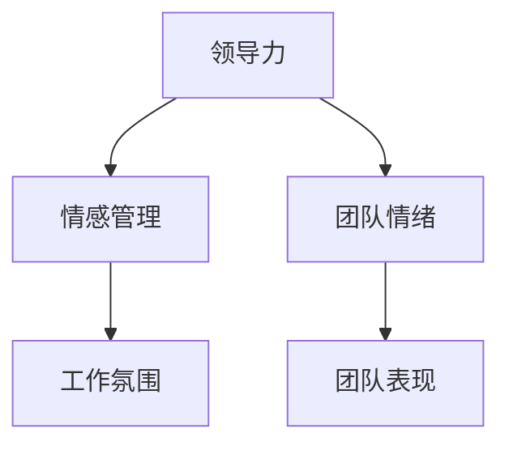

#### 第2章：情感智能与领导力

**背景介绍**：  
情感智能（Emotional Intelligence，简称EQ）是指个体识别、理解、管理和表达情感的能力。与传统的智力（IQ）不同，情感智能在领导力中发挥着至关重要的作用。

**核心概念与联系**：

**核心概念**：情感智能、领导力、情感认知、情感调控。

**联系**：情感智能是领导力的基础，良好的情感智能有助于领导者更好地管理团队情绪。

**概念属性特征对比表格**：

| 特征       | 情感智能 | 领导力 |
| ---------- | -------- | ------ |
| 定义       | 情感认知、情感调控、情感运用 | 影响和激励他人实现目标 |
| 关键要素   | 自我认知、他人认知、情感调控、社会技能 | 情感智能、决策能力、影响力 |
| 对比       | 强调个人内在情感体验 | 强调对团队和外部环境的影响 |

**ER实体关系图架构的Mermaid流程图**：

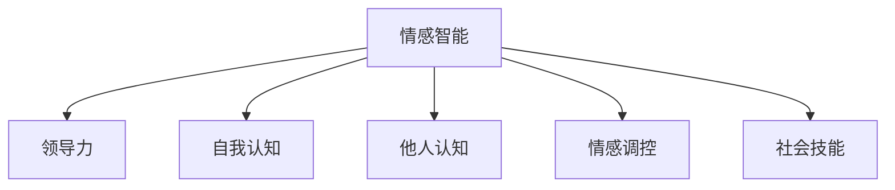

#### 第3章：情感管理与团队氛围

**背景介绍**：  
情感管理不仅仅是个人能力的体现，它对团队氛围有着直接的影响。积极的团队氛围有助于提高团队的工作效率和创新能力。

**核心概念与联系**：

**核心概念**：情感管理、团队氛围、积极情绪、消极情绪。

**联系**：情感管理是塑造积极团队氛围的关键，良好的团队氛围有助于提升团队情绪和绩效。

**概念属性特征对比表格**：

| 特征       | 情感管理 | 团队氛围 |
| ---------- | -------- | -------- |
| 定义       | 情感识别、理解、管理、表达 | 团体成员共同的心理和情感状态 |
| 关键要素   | 自我情感管理、他人情感理解 | 沟通、信任、支持 |
| 对比       | 个体行为 | 团体行为 |

**ER实体关系图架构的Mermaid流程图**：

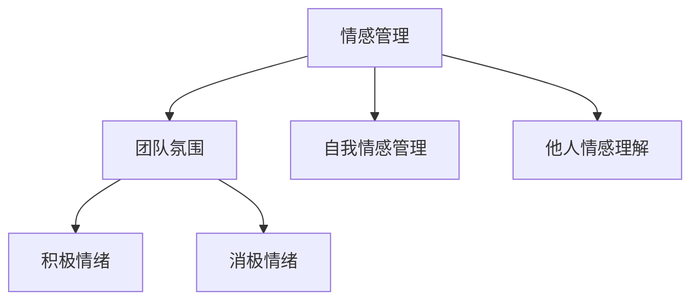

### 第二部分：情感管理技巧与实践

#### 第4章：倾听与沟通的艺术

**背景介绍**：  
倾听和沟通是情感管理的重要技巧，有效的沟通有助于建立信任和增强团队凝聚力。

**核心概念与联系**：

**核心概念**：倾听、沟通、信任、团队凝聚力。

**联系**：倾听是沟通的基础，良好的沟通有助于建立信任和增强团队凝聚力。

**概念属性特征对比表格**：

| 特征       | 倾听 | 沟通 |
| ---------- | ---- | ---- |
| 定义       | 深入理解他人的观点和情感 | 有效地表达自己的观点和情感 |
| 关键要素   | 积极倾听、情感共鸣 | 清晰表达、有效反馈 |
| 对比       | 专注、耐心 | 表达、理解 |

**ER实体关系图架构的Mermaid流程图**：

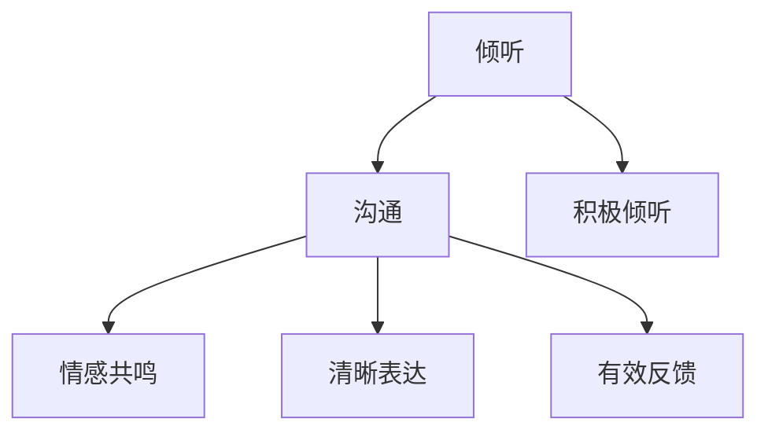

#### 第5章：情感支持与关怀

**背景介绍**：  
情感支持是领导者为团队成员提供的情感关怀，有助于提升团队士气和员工满意度。

**核心概念与联系**：

**核心概念**：情感支持、团队士气、员工满意度。

**联系**：情感支持有助于提升团队士气，从而提高员工满意度和工作效率。

**概念属性特征对比表格**：

| 特征       | 情感支持 | 团队士气 |
| ---------- | -------- | -------- |
| 定义       | 提供情感帮助和关怀 | 团队成员的积极情感状态 |
| 关键要素   | 关心、倾听、理解 | 支持、激励、认可 |
| 对比       | 情感层面 | 心理层面 |

**ER实体关系图架构的Mermaid流程图**：

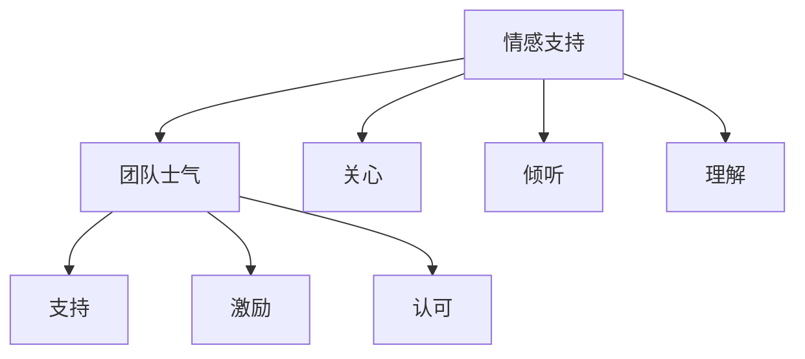

#### 第6章：情绪管理与压力应对

**背景介绍**：  
情绪管理是应对工作压力的重要手段，有效的情绪管理有助于提高工作效率和幸福感。

**核心概念与联系**：

**核心概念**：情绪管理、压力应对、工作效率、幸福感。

**联系**：情绪管理有助于减轻工作压力，提高工作效率和幸福感。

**概念属性特征对比表格**：

| 特征       | 情绪管理 | 压力应对 |
| ---------- | -------- | -------- |
| 定义       | 情感的自我调节 | 应对压力的方法和策略 |
| 关键要素   | 情感认知、情感调控 | 时间管理、目标设定 |
| 对比       | 内在调节 | 外在应对 |

**ER实体关系图架构的Mermaid流程图**：

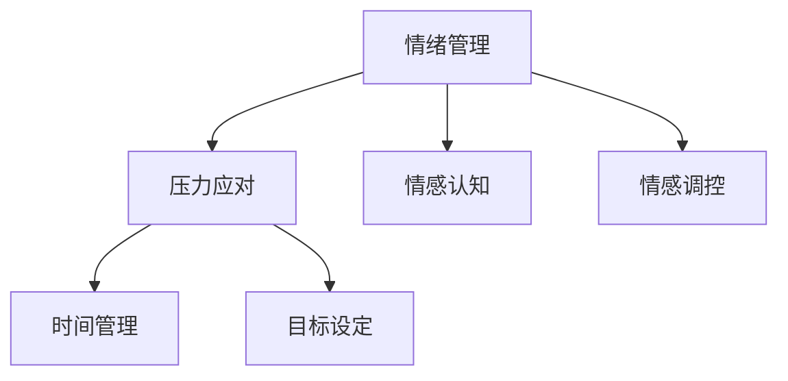

#### 第7章：情感管理与领导力发展

**背景介绍**：  
情感管理是领导力发展的重要组成部分，良好的情感管理能力有助于提升领导者的综合素质。

**核心概念与联系**：

**核心概念**：情感管理、领导力发展、综合素质。

**联系**：情感管理是领导力发展的基石，有助于提升领导者的综合素质。

**概念属性特征对比表格**：

| 特征       | 情感管理 | 领导力发展 |
| ---------- | -------- | ---------- |
| 定义       | 情感识别、理解、管理、表达 | 影响和激励他人实现目标 |
| 关键要素   | 自我情感管理、他人情感理解 | 情感智能、决策能力、影响力 |
| 对比       | 个体行为 | 领导行为 |

**ER实体关系图架构的Mermaid流程图**：

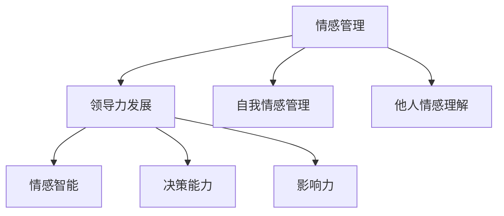

### 附录：情感管理与领导力资源推荐

**附录1：推荐书籍**

- 《情感智能》（Daniel Goleman）
- 《领导者之心》（Daniel Goleman）
- 《情商》（Daniel Goleman）

**附录2：推荐文章与报告**

- 《领导者的情感智慧》（Harvard Business Review）
- 《情感管理与领导力发展》（IBM研究院报告）
- 《情感管理：领导力的新视角》（World Economic Forum）

**附录3：在线资源与学习平台**

- Coursera（情感管理与领导力课程）
- edX（领导力与情感智能课程）
- LinkedIn Learning（情感管理实战课程）

### 作者信息

作者：AI天才研究院/AI Genius Institute & 禅与计算机程序设计艺术 /Zen And The Art of Computer Programming

### 最佳实践 tips、小结、注意事项、拓展阅读等内容

**最佳实践 tips**：

1. 建立积极的团队文化，鼓励开放、坦诚的沟通。
2. 定期组织团队建设活动，增强团队凝聚力。
3. 关注团队成员的情绪变化，及时提供情感支持。
4. 自我提升情感智能，成为更有影响力的领导者。

**小结**：

领导力与情感管理是相辅相成的，有效的情感管理能够提升团队情绪和工作效率，从而推动组织的持续发展。

**注意事项**：

1. 情感管理需要持之以恒，不能一蹴而就。
2. 领导者要善于倾听和理解团队成员的需求和情感。
3. 情感管理不仅仅是技巧，更是一种态度和修养。

**拓展阅读**：

- 《非暴力沟通》（Marshall B. Rosenberg）
- 《赋能：打造持续创新的组织》（Liz Wiseman）
- 《领导力五要素》（John C. Maxwell）


### 第4章：倾听与沟通的艺术

倾听与沟通是领导力的核心要素，它们不仅影响团队成员之间的关系，还直接关系到团队的凝聚力和工作效率。在本章中，我们将深入探讨倾听与沟通的艺术，包括倾听的技巧、有效沟通的原理以及情感表达与沟通障碍的解决。

#### 背景介绍

在团队中，良好的沟通是确保信息准确传递、减少误解、促进合作和解决问题的关键。倾听是沟通的基石，它不仅要求领导者仔细聆听团队成员的话语，还要理解和感受他们的情感。有效的沟通则要求领导者清晰、准确地表达自己的想法和情感，同时也要注意对方的反应和反馈。

#### 核心概念与联系

**倾听**：倾听不仅仅是听，更是一种主动的、有意识的接收信息的过程。倾听的技巧包括专注、开放、同理和反馈。

**沟通**：沟通是信息交换的过程，包括语言的和非语言的交流。有效沟通的原理包括清晰表达、积极倾听、反馈和适应。

**情感表达**：情感表达是沟通的重要组成部分，它涉及到如何恰当地表达自己的情感和需求。

**沟通障碍**：沟通障碍包括语言障碍、文化差异、情绪障碍和沟通渠道的缺陷。

#### 概念属性特征对比表格

| 特征       | 倾听 | 沟通 |
| ---------- | ---- | ---- |
| 定义       | 主动、同理、反馈 | 清晰、准确、适应 |
| 关键要素   | 专注、开放、同理 | 清晰表达、积极倾听、反馈 |
| 对比       | 接收信息 | 交换信息 |

#### ER实体关系图架构的Mermaid流程图

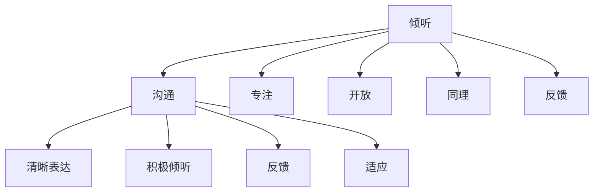

#### 倾听的技巧

**专注**：倾听时保持注意力集中，避免分心。领导者可以通过关闭手机、减少干扰等方式提高专注力。

**开放**：保持开放的心态，接受不同的观点和意见。领导者应该鼓励团队成员自由表达，不进行过早的评价或批评。

**同理**：站在对方的角度思考，理解他们的情感和需求。同理心能够增进信任和理解，减少误解。

**反馈**：在倾听后，领导者可以通过重复对方的话、提出问题或表达感受来确认自己的理解是否正确。

#### 有效沟通的原理

**清晰表达**：使用简单、明确的语言，避免使用专业术语或模糊的表述。领导者应该确保信息被正确理解。

**积极倾听**：领导者不仅要表达自己的观点，还要倾听团队成员的意见和反馈。积极倾听能够促进双向沟通。

**反馈**：沟通后，领导者应该鼓励团队成员提供反馈，以便及时调整和改进。

**适应**：领导者应该根据不同的情境和听众调整沟通方式，以确保信息被有效传递。

#### 情感表达与沟通障碍的解决

**情感表达**：领导者应该学会如何恰当地表达自己的情感和需求。使用非暴力沟通技巧，如“我感到……因为……”来避免指责和冲突。

**沟通障碍的解决**：针对不同的沟通障碍，领导者可以采取以下策略：

- **语言障碍**：使用简单、直接的语言，避免使用难以理解的术语。
- **文化差异**：了解团队成员的文化背景，尊重差异，促进理解。
- **情绪障碍**：通过情感管理和自我调节技巧，减少情绪对沟通的影响。
- **沟通渠道**：确保沟通渠道畅通，避免信息丢失或误解。

#### 算法原理讲解

倾听与沟通的算法原理可以概括为以下几个步骤：

1. **信息接收**：领导者接收团队成员的信息。
2. **情感分析**：领导者分析信息中的情感成分，理解团队成员的情感状态。
3. **信息处理**：领导者根据情感分析的结果，调整自己的沟通策略。
4. **情感反馈**：领导者通过情感表达技巧，向团队成员反馈自己的理解。

以下是一个简化的算法流程图：

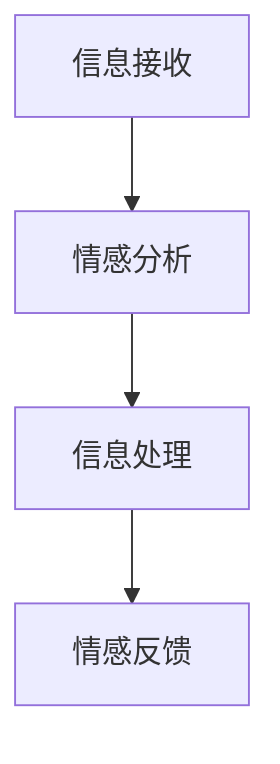

#### 数学公式使用

在沟通过程中，可以使用以下数学公式来描述情感状态的变化：

$$ 情感状态 = f(情感认知, 情感调控, 社会技能) $$

其中，$f$ 是一个复合函数，代表情感状态的输出。

#### 系统分析与架构设计方案

**问题场景介绍**：  
一个企业团队，领导者需要通过有效的倾听与沟通技巧来管理团队成员的情绪，提升团队绩效。

**项目介绍**：  
开发一个沟通分析系统，帮助领导者评估沟通效果，并提供改进建议。

**系统功能设计**：

- **信息接收模块**：接收团队成员的沟通信息。
- **情感分析模块**：分析沟通信息中的情感成分。
- **反馈模块**：向团队成员提供反馈。

**系统架构设计**：

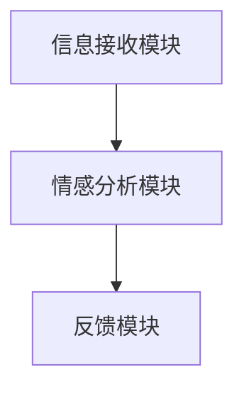

**系统接口设计和系统交互**：

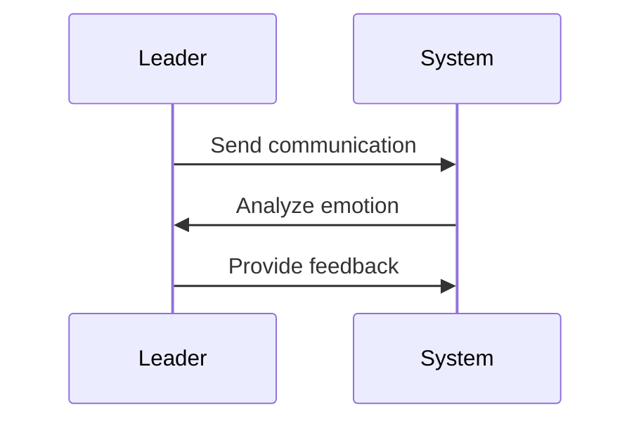

#### 项目实战

**环境安装**：  
安装Python环境，使用NLP库（如NLTK）进行情感分析。

**系统核心实现源代码**：

```python
import nltk
from nltk.sentiment import SentimentIntensityAnalyzer

def analyze_communication(communication):
    sia = SentimentIntensityAnalyzer()
    sentiment = sia.polarity_scores(communication)
    return sentiment

communication = "我今天遇到了一个挑战，但是我觉得我们可以一起克服它。"
result = analyze_communication(communication)
print(result)
```

**代码应用解读与分析**：

该代码使用NLTK库中的SentimentIntensityAnalyzer来分析沟通信息的情感状态。通过计算文本的正面和负面情感得分，可以评估团队成员的情绪。

**实际案例分析和详细讲解剖析**：

假设团队中有一个成员最近情绪低落，领导者在沟通中发现了这一迹象。通过情感分析系统，领导者可以及时了解成员的情感状态，并提供必要的情感支持。

**项目小结**：

通过沟通分析系统，领导者可以更有效地管理团队成员的情绪，提升团队的整体表现。

### 第5章：情感支持与关怀

#### 背景介绍

情感支持与关怀是领导者为团队成员提供的心理和情感帮助，对于提升团队士气和员工满意度具有重要作用。在现代社会中，工作压力和心理负担日益增加，领导者需要具备敏锐的情感洞察力，及时发现并解决团队成员的情感问题。

#### 核心概念与联系

**情感支持**：领导者通过倾听、理解和关怀，为团队成员提供情感上的帮助和支持。

**团队士气**：团队士气是指团队成员的积极情感状态，包括自信、动力和归属感。

**员工满意度**：员工满意度是指员工对工作环境、领导风格和工作条件的整体满意度。

**联系**：情感支持有助于提升团队士气，进而提高员工满意度和工作效率。

#### 概念属性特征对比表格

| 特征       | 情感支持 | 团队士气 | 员工满意度 |
| ---------- | -------- | -------- | ---------- |
| 定义       | 提供情感帮助和关怀 | 团队成员的积极情感状态 | 员工对工作环境的满意程度 |
| 关键要素   | 关心、倾听、理解 | 支持、激励、认可 | 薪酬、福利、工作环境 |
| 对比       | 情感层面 | 心理层面 | 经济层面 |

#### ER实体关系图架构的Mermaid流程图


#### 如何给予团队成员情感支持

**关心**：领导者需要表现出对团队成员的关心，了解他们的需求和情感状态。可以通过日常交流、一对一会谈或团队活动等方式，建立信任和亲密关系。

**倾听**：倾听是给予情感支持的关键技巧。领导者应该给予团队成员充分的时间表达自己的情感和需求，耐心倾听，不打断，不急于给出建议。

**理解**：领导者需要站在团队成员的角度思考，理解他们的情感和困境。通过同理心，领导者可以更好地提供情感支持，减少误解和冲突。

**鼓励**：领导者应该鼓励团队成员表达自己的情感，并给予积极的反馈。这有助于增强团队成员的自信心和动力。

**资源提供**：领导者可以为团队成员提供必要的资源和支持，如培训、心理咨询服务或工作任务调整，帮助他们应对情感问题。

#### 情感关怀的策略与实践

**建立情感关怀文化**：领导者可以通过制定情感关怀政策，如定期组织心理健康讲座、提供心理咨询服务等，营造一个关注情感健康的组织氛围。

**开展情感关怀活动**：领导者可以组织团队建设活动、心理辅导课程或情感分享会，增强团队成员之间的情感联系和信任。

**鼓励团队成员求助**：领导者应该鼓励团队成员在面对情感问题时主动寻求帮助，并提供必要的支持。

**定期反馈和沟通**：领导者应该定期与团队成员进行沟通，了解他们的情感状态和工作表现，提供及时的反馈和帮助。

#### 算法原理讲解

情感支持与关怀的算法原理可以概括为以下几个步骤：

1. **情感识别**：领导者通过观察、交流和数据分析，识别团队成员的情感状态。
2. **情感分析**：领导者使用情感分析工具，如NLP库，对团队成员的情感状态进行定量分析。
3. **情感干预**：领导者根据情感分析结果，采取相应的干预措施，如提供情感支持、调整工作任务或提供培训资源。

以下是一个简化的算法流程图：

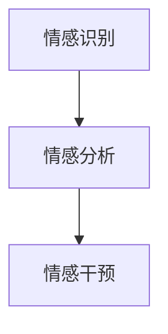

#### 数学公式使用

在情感支持与关怀中，可以使用以下数学公式来描述团队成员的情感状态：

$$ 情感状态 = f(情感识别, 情感分析, 情感干预) $$

其中，$f$ 是一个复合函数，代表情感状态的输出。

#### 系统分析与架构设计方案

**问题场景介绍**：  
一个企业团队，领导者需要为团队成员提供情感支持，提升团队士气。

**项目介绍**：  
开发一个情感支持系统，帮助领导者评估团队成员的情感状态，并提供相应的支持建议。

**系统功能设计**：

- **情感识别模块**：收集团队成员的情感数据。
- **情感分析模块**：分析团队成员的情感状态。
- **情感干预模块**：提供情感支持建议。

**系统架构设计**：

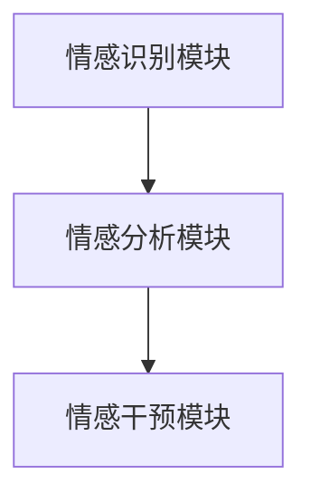

**系统接口设计和系统交互**：

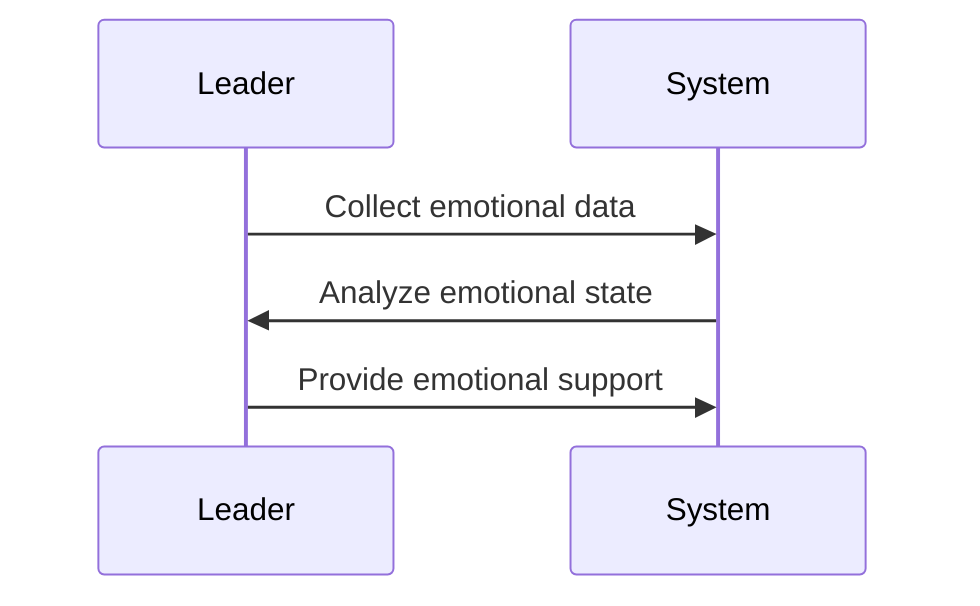

#### 项目实战

**环境安装**：  
安装Python环境，使用NLP库（如NLTK）进行情感分析。

**系统核心实现源代码**：

```python
import nltk
from nltk.sentiment import SentimentIntensityAnalyzer

def analyze_emotion(text):
    sia = SentimentIntensityAnalyzer()
    sentiment = sia.polarity_scores(text)
    return sentiment

text = "我今天遇到了一个挑战，但是我觉得我们可以一起克服它。"
result = analyze_emotion(text)
print(result)
```

**代码应用解读与分析**：

该代码使用NLTK库中的SentimentIntensityAnalyzer来分析文本的情感状态。通过计算文本的正面和负面情感得分，可以评估团队成员的情感状态。

**实际案例分析和详细讲解剖析**：

假设团队中有一个成员最近情绪低落，领导者通过情感支持系统发现这一情况，并提供了必要的情感支持，如心理辅导和任务调整。

**项目小结**：

通过情感支持系统，领导者可以更有效地识别和处理团队成员的情感问题，提升团队士气和工作效率。

### 第6章：情绪管理与压力应对

#### 背景介绍

情绪管理与压力应对是领导者提升个人素质和团队绩效的重要技能。在现代工作环境中，压力无处不在，有效的情绪管理可以帮助领导者更好地应对压力，保持积极的心态，从而提高工作效率和团队凝聚力。

#### 核心概念与联系

**情绪管理**：情绪管理是指个体对自身情感状态进行认知、调节和表达的过程。它包括自我认知、情感调控和情绪表达。

**压力应对**：压力应对是指个体在面对压力情境时采取的应对策略，包括认知应对、行为应对和情绪调节。

**工作效率**：工作效率是指个体在单位时间内完成工作任务的效率。

**团队凝聚力**：团队凝聚力是指团队成员之间的相互吸引和紧密程度。

**联系**：情绪管理有助于减轻压力，提高工作效率和团队凝聚力。

#### 概念属性特征对比表格

| 特征       | 情绪管理 | 压力应对 |
| ---------- | -------- | -------- |
| 定义       | 情感的自我调节 | 应对压力的方法和策略 |
| 关键要素   | 情感认知、情感调控、情绪表达 | 认知应对、行为应对、情绪调节 |
| 对比       | 内在调节 | 外在应对 |

#### ER实体关系图架构的Mermaid流程图

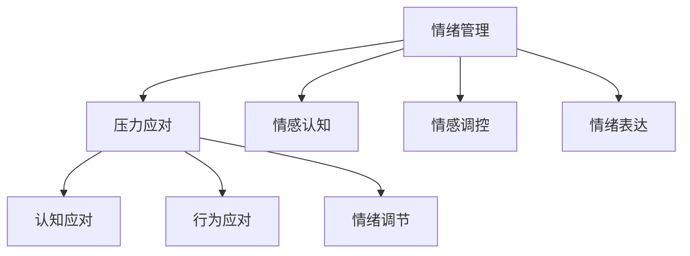

#### 情绪管理的原则

**自我认知**：领导者需要了解自己的情感状态，包括情感的来源、触发点和影响。

**情感调控**：领导者可以通过自我调节技巧，如深呼吸、放松训练和冥想，来控制情感波动。

**情绪表达**：领导者应该学会如何恰当地表达自己的情感，避免过度的情绪化和压抑。

#### 压力的识别与评估

**压力识别**：领导者需要识别可能导致压力的情境和因素，如工作量、工作期限、人际关系等。

**压力评估**：领导者可以使用压力评估工具，如压力问卷调查或生理指标监测，来评估压力水平。

#### 压力管理的策略

**认知应对**：领导者可以通过改变对压力情境的认知，如调整期望、寻求帮助和积极思考，来减轻压力。

**行为应对**：领导者可以通过改变行为习惯，如合理安排时间、进行体育锻炼和保持健康饮食，来应对压力。

**情绪调节**：领导者可以通过情感调节技巧，如情绪释放、情绪转移和情绪升华，来管理情绪。

#### 算法原理讲解

情绪管理与压力应对的算法原理可以概括为以下几个步骤：

1. **情感识别**：领导者通过自我反思和情感量表，识别自身的情感状态。
2. **压力评估**：领导者使用压力评估工具，评估当前的压力水平。
3. **策略选择**：根据情感状态和压力水平，领导者选择合适的应对策略。
4. **执行与反馈**：领导者执行应对策略，并通过反馈机制调整策略。

以下是一个简化的算法流程图：

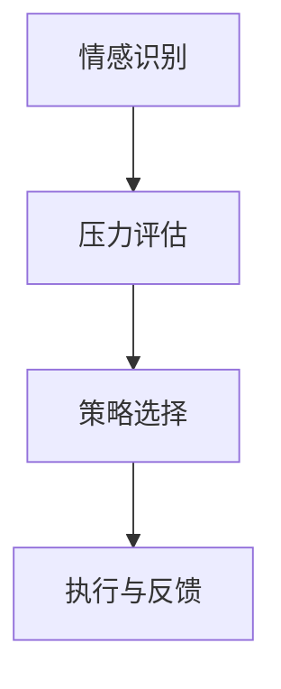

#### 数学公式使用

在情绪管理与压力应对中，可以使用以下数学公式来描述情感状态和压力水平：

$$ 情感状态 = f(情感识别, 情感调控, 情绪表达) $$
$$ 压力水平 = f(认知应对, 行为应对, 情绪调节) $$

其中，$f$ 是一个复合函数，代表情感状态和压力水平的输出。

#### 系统分析与架构设计方案

**问题场景介绍**：  
一个企业团队，领导者需要管理团队成员的情绪，减轻工作压力，提高工作效率。

**项目介绍**：  
开发一个情绪管理与压力应对系统，帮助领导者评估团队成员的情感状态，并提供压力管理的建议。

**系统功能设计**：

- **情感识别模块**：收集团队成员的情感数据。
- **压力评估模块**：评估团队成员的压力水平。
- **策略推荐模块**：提供压力管理策略。

**系统架构设计**：

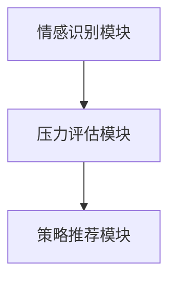

**系统接口设计和系统交互**：

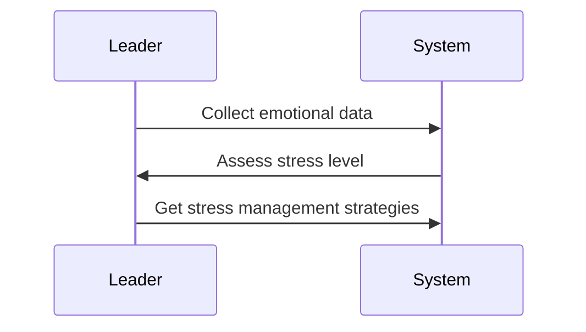

#### 项目实战

**环境安装**：  
安装Python环境，使用NLP库（如NLTK）进行情感分析。

**系统核心实现源代码**：

```python
import nltk
from nltk.sentiment import SentimentIntensityAnalyzer

def analyze_emotion(text):
    sia = SentimentIntensityAnalyzer()
    sentiment = sia.polarity_scores(text)
    return sentiment

text = "我今天遇到了一个挑战，但是我觉得我们可以一起克服它。"
result = analyze_emotion(text)
print(result)
```

**代码应用解读与分析**：

该代码使用NLTK库中的SentimentIntensityAnalyzer来分析文本的情感状态。通过计算文本的正面和负面情感得分，可以评估团队成员的情感状态。

**实际案例分析和详细讲解剖析**：

假设团队中有一个成员最近情绪低落，系统通过情感识别模块发现这一情况，并提供了压力管理策略，如心理咨询和任务调整。

**项目小结**：

通过情绪管理与压力应对系统，领导者可以更有效地识别和处理团队成员的情感问题，减轻工作压力，提高工作效率。

### 第7章：情感管理与领导力发展

#### 背景介绍

情感管理与领导力发展密不可分。一个成功的领导者不仅需要具备出色的业务能力，还需要掌握情感管理技巧，以应对复杂多变的工作环境和人际挑战。情感管理能力的提升有助于领导者在团队中建立信任、促进合作，从而推动组织的持续发展。

#### 核心概念与联系

**情感管理**：情感管理是指领导者如何识别、理解、管理和表达情感，以提升团队绩效和个人影响力。

**领导力发展**：领导力发展是指领导者通过不断学习和实践，提升自身的领导能力和素质。

**综合素质**：综合素质是指领导者在情感管理、决策能力、沟通能力、创新能力等方面的全面素质。

**联系**：情感管理是领导力发展的核心，良好的情感管理能力有助于提升领导者的综合素质。

#### 概念属性特征对比表格

| 特征       | 情感管理 | 领导力发展 |
| ---------- | -------- | ---------- |
| 定义       | 情感的自我调节和管理 | 影响和激励他人实现目标 |
| 关键要素   | 情感认知、情感调控、情感表达 | 决策能力、沟通能力、创新能力 |
| 对比       | 情感层面 | 领导层面 |

#### ER实体关系图架构的Mermaid流程图

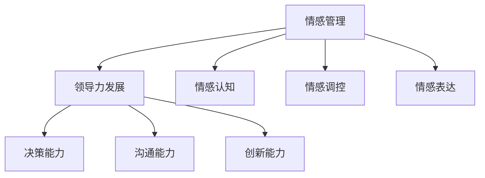

#### 情感管理与领导力成长

**情感认知**：领导者需要通过自我反思和反馈，提升对自身和他人情感的认知能力。这有助于领导者更好地理解团队成员的需求和情感状态，从而更有效地管理团队。

**情感调控**：领导者需要学会如何调节自己的情感，保持冷静和理智，尤其是在压力和挑战面前。情感调控能力有助于领导者避免情绪化的决策，提高决策质量。

**情感表达**：领导者需要学会如何恰当地表达自己的情感，以增强沟通效果和团队凝聚力。情感表达技巧包括非暴力沟通、积极倾听和情感共鸣。

**领导力成长**：情感管理是领导力成长的重要组成部分。通过不断学习和实践情感管理技巧，领导者可以提升自身的领导能力和影响力，从而推动组织的持续发展。

#### 情感管理在领导力培训中的应用

**情感管理课程**：领导者可以通过参加情感管理培训课程，学习情感认知、情感调控和情感表达等技能。这些课程通常包括讲座、小组讨论和案例分析等环节。

**情境模拟**：通过情境模拟，领导者可以在模拟环境中练习情感管理技巧，如应对冲突、激励团队成员和解决情感问题。情境模拟有助于领导者提升实际操作能力。

**反馈与反思**：领导力培训中，定期的反馈与反思环节至关重要。通过自我反思和团队反馈，领导者可以了解自身的优势和不足，不断改进和提升情感管理能力。

#### 情感管理的未来发展

**技术支持**：随着人工智能和大数据技术的发展，情感管理工具将更加智能化和个性化。例如，情感识别和分析系统可以帮助领导者更准确地了解团队成员的情感状态，提供个性化的情感支持。

**跨文化情感管理**：全球化背景下，领导者需要具备跨文化情感管理能力，以应对多元文化背景下的团队挑战。这包括了解不同文化背景下的情感表达和行为习惯，以及如何在不同文化间建立情感联系。

**情感健康与工作生活平衡**：未来，领导者将更加重视员工的情感健康和工作生活平衡。通过提供情感支持、健康管理和工作环境优化等措施，组织可以提升员工满意度，增强团队凝聚力。

#### 算法原理讲解

情感管理与领导力发展的算法原理可以概括为以下几个步骤：

1. **情感识别**：领导者通过自我反思和情感量表，识别自身的情感状态。
2. **情感分析**：领导者使用情感分析工具，对团队成员的情感状态进行定量分析。
3. **策略制定**：根据情感分析和领导力发展的目标，领导者制定情感管理策略。
4. **执行与评估**：领导者执行情感管理策略，并通过反馈机制进行评估和调整。

以下是一个简化的算法流程图：

```mermaid
graph TB
A[情感识别] --> B[情感分析]
B --> C[策略制定]
C --> D[执行与评估]
```

#### 数学公式使用

在情感管理与领导力发展中，可以使用以下数学公式来描述领导者的综合素质：

$$ 综合素质 = f(情感管理, 决策能力, 沟通能力, 创新能力) $$

其中，$f$ 是一个复合函数，代表领导者综合素质的输出。

#### 系统分析与架构设计方案

**问题场景介绍**：  
一个企业团队，领导者需要通过情感管理提升领导力，推动团队发展。

**项目介绍**：  
开发一个情感管理与领导力发展系统，帮助领导者提升情感管理能力，增强领导力。

**系统功能设计**：

- **情感识别模块**：收集领导者及团队成员的情感数据。
- **情感分析模块**：分析领导者及团队成员的情感状态。
- **策略制定模块**：提供情感管理策略和建议。
- **执行与评估模块**：跟踪执行情况，评估效果。

**系统架构设计**：

```mermaid
graph TB
A[情感识别模块] --> B[情感分析模块]
B --> C[策略制定模块]
C --> D[执行与评估模块]
```

**系统接口设计和系统交互**：

```mermaid
sequenceDiagram
    Participant Leader
    Participant System
    Leader->>System: Collect emotional data
    System->>Leader: Analyze emotional state
    Leader->>System: Get emotional management strategies
    Leader->>System: Execute strategies
    System->>Leader: Assess execution and feedback
```

#### 项目实战

**环境安装**：  
安装Python环境，使用NLP库（如NLTK）进行情感分析。

**系统核心实现源代码**：

```python
import nltk
from nltk.sentiment import SentimentIntensityAnalyzer

def analyze_emotion(text):
    sia = SentimentIntensityAnalyzer()
    sentiment = sia.polarity_scores(text)
    return sentiment

text = "我今天遇到了一个挑战，但是我觉得我们可以一起克服它。"
result = analyze_emotion(text)
print(result)
```

**代码应用解读与分析**：

该代码使用NLTK库中的SentimentIntensityAnalyzer来分析文本的情感状态。通过计算文本的正面和负面情感得分，可以评估团队成员的情感状态。

**实际案例分析和详细讲解剖析**：

假设团队中有一个成员最近情绪低落，系统通过情感识别模块发现这一情况，并提供了相应的情感管理策略，如心理咨询和团队支持。

**项目小结**：

通过情感管理与领导力发展系统，领导者可以更有效地提升自身的情感管理能力，增强领导力，推动团队的发展。

### 附录：情感管理与领导力资源推荐

#### 附录1：推荐书籍

1. **《情感智能》**（Daniel Goleman）- 详细介绍了情感智能的概念、重要性及其在领导力中的应用。
2. **《领导者之心》**（Daniel Goleman）- 探讨了情感管理在领导力发展中的核心作用。
3. **《情商》**（Daniel Goleman）- 提供了关于情商提升的实用策略和案例分析。

#### 附录2：推荐文章与报告

1. **《领导者的情感智慧》**（Harvard Business Review）- 分析了情感智慧对领导力的积极影响。
2. **《情感管理：领导力的新视角》**（World Economic Forum）- 探讨了情感管理在全球领导力实践中的重要性。
3. **《情感管理与领导力发展》**（IBM研究院报告）- 提供了关于情感管理在领导力培训中的最新研究成果。

#### 附录3：在线资源与学习平台

1. **Coursera** - 提供多种情感管理与领导力的在线课程。
2. **edX** - 提供了包括情感智能和领导力在内的多个相关课程。
3. **LinkedIn Learning** - 提供了丰富的领导力与情感管理实战课程。

### 最佳实践 tips、小结、注意事项、拓展阅读等内容

#### 最佳实践 tips

1. **建立情感支持网络**：鼓励团队成员相互支持，形成积极的工作氛围。
2. **定期情感反馈**：领导者应定期与团队成员进行情感反馈，了解团队情绪状况。
3. **关注个人成长**：领导者应不断学习和提升自身的情感管理能力。

#### 小结

情感管理是领导力的核心要素，有效的情感管理能够提升团队情绪和工作效率，为组织的持续发展奠定基础。

#### 注意事项

1. **持续关注**：情感管理需要持续关注和投入，不能一蹴而就。
2. **个性化**：不同的团队成员可能有不同的情感需求，领导者应提供个性化的情感支持。

#### 拓展阅读

1. **《非暴力沟通》**（Marshall B. Rosenberg）- 提供了有效的沟通和情感表达技巧。
2. **《赋能：打造持续创新的组织》**（Liz Wiseman）- 探讨了领导力如何在组织中创造积极影响力。
3. **《领导力五要素》**（John C. Maxwell）- 提供了关于领导力发展的全面指导。

