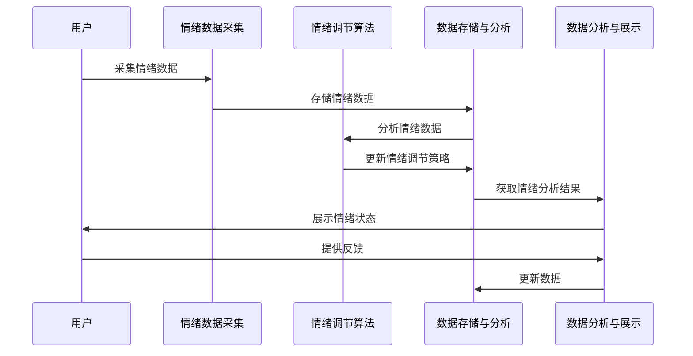

                 


### 摘要

在当今快速发展的信息技术时代，领导力与情绪调节成为企业持续发展和员工幸福的关键要素。本文旨在探讨如何通过情绪调节平衡工作与生活，提升领导者的领导力。本文首先介绍了领导力的定义及其在团队管理中的作用，然后探讨了情绪调节的概念、心理学原理及其在压力管理中的应用。接着，文章分析了领导力与情绪调节的结合，探讨了领导者如何在工作中调节情绪，提高团队管理效能。随后，文章提出了具体的工作场景中的情绪调节策略，包括情绪识别与管理、情绪调节能力的提升以及领导者在压力下的情绪调节方法。最后，本文讨论了实现工作与生活平衡的重要性，提出了具体策略和实践建议，帮助领导者提升生活质量。本文通过案例分析、系统分析与架构设计、项目实战等环节，深入讲解了情绪调节与领导力提升的方法，旨在为IT领域从业者提供实用的指导。

### 关键词

领导力、情绪调节、压力管理、工作与生活平衡、团队管理、心理健康

----------------------------------------------------------------

## 第1章：领导力与情绪调节的背景和重要性

在当今信息爆炸、竞争激烈的商业环境中，领导力与情绪调节成为企业成功和员工幸福感的关键因素。领导力不仅仅是指导团队达成目标的能力，更是影响员工情绪和行为的关键因素。情绪调节则是指个体在面临压力和挑战时，能够有效地识别、理解和控制自己的情绪，从而保持心理平衡和积极态度。这一章将深入探讨领导力与情绪调节的背景和重要性，为后续章节的讨论打下基础。

### 1.1 领导力的定义与作用

领导力是指领导者通过影响力、激励和指导，引导团队成员共同实现目标的能力。它不仅仅是职位赋予的权力，更是一种影响力的体现。领导力包含多个方面，如战略思维、决策能力、沟通技巧、团队建设等。在团队管理中，领导力具有以下作用：

- **目标设定**：领导者能够清晰地设定团队目标，并确保团队成员理解并认同这些目标。
- **决策制定**：领导者需在不确定性和压力下做出明智的决策，以应对复杂的问题和挑战。
- **资源分配**：领导者需要合理分配资源和时间，确保团队目标的实现。
- **团队建设**：领导者通过建立良好的团队关系，提高团队成员的协作能力和工作效率。

### 1.2 情绪调节的概念与影响

情绪调节是指个体在面对外部事件和内部感受时，能够有效地识别、理解和控制自己的情绪，从而保持心理平衡和积极态度的过程。情绪调节对个体的心理健康和生活质量有着重要影响：

- **心理平衡**：通过情绪调节，个体能够在面对压力和挑战时保持冷静，避免情绪的失控。
- **生活质量**：良好的情绪调节能力有助于提升个体的幸福感和生活质量。
- **人际关系**：情绪调节能力强的个体更容易与他人建立良好的关系，提高团队协作效率。
- **工作表现**：情绪调节能力强的员工通常能更好地应对工作压力，提高工作表现和生产力。

### 1.3 平衡工作与生活的挑战

在现代社会，工作和生活的平衡成为越来越多人的关注点。然而，随着工作压力的增加和科技的发展，平衡工作与生活变得越来越困难。平衡工作与生活的挑战主要体现在以下几个方面：

- **时间管理**：工作任务的增加使得员工难以在有限的时间内完成所有工作，从而影响生活时间的安排。
- **工作-生活干扰**：科技的进步使得工作与生活之间的界限变得模糊，员工容易在休息时间受到工作干扰。
- **压力管理**：过大的工作压力会影响到个人的情绪和生活质量，导致工作与生活之间的不平衡。
- **家庭责任**：家庭责任的增加，如育儿、照顾老人等，也会对工作与生活的平衡造成挑战。

### 1.4 领导力与情绪调节的结合

领导力与情绪调节的结合对于团队的成功和员工的幸福感至关重要。领导者不仅需要具备领导力，还需要具备良好的情绪调节能力，以应对工作中遇到的挑战：

- **激励员工**：领导者通过情绪调节，能够更好地激励员工，提升团队士气。
- **冲突解决**：领导者通过情绪调节，能够更好地处理团队内部的冲突，维护团队的和谐。
- **压力管理**：领导者通过情绪调节，能够更好地管理自己的压力，从而更好地支持团队成员。
- **个人发展**：领导者通过情绪调节，能够提升自己的心理素质，为个人和团队的发展奠定基础。

综上所述，领导力与情绪调节在团队管理和员工幸福中起着关键作用。下一章将深入探讨情绪调节的理论基础，为理解如何在实践中应用情绪调节提供支持。

### 1.1 领导力的定义与作用

#### 领导力的定义

领导力是一种能够影响和激励他人达成共同目标的能力，不仅仅是指挥和控制，更强调影响力、信任和合作。从广义上讲，领导力涵盖了个人素质、技能和行为三个层面：

- **个人素质**：包括品格、价值观、自信心和自我意识等，这些是领导力的基础。
- **技能**：如沟通能力、决策能力、解决问题的能力和团队建设能力，这些是领导力的核心。
- **行为**：如激励员工、培养团队精神和推动创新等，这些是领导力的具体体现。

#### 领导力在团队管理中的作用

在团队管理中，领导力发挥着至关重要的作用，具体体现在以下几个方面：

- **目标设定**：领导者需要明确团队的愿景和目标，并将这些目标传达给团队成员，确保团队成员理解并认同这些目标。
- **决策制定**：领导者需在不确定性和压力下做出明智的决策，以应对复杂的问题和挑战。
- **资源分配**：领导者需要合理分配资源和时间，确保团队目标的实现。
- **团队建设**：领导者通过建立良好的团队关系，提高团队成员的协作能力和工作效率。

#### 领导力的层次与类型

领导力可以根据不同的标准进行分类，常见的分类方法包括层次分类和类型分类：

- **层次分类**：通常分为高层领导力、中层领导力和基层领导力。高层领导力关注企业战略和长期目标，中层领导力关注团队协作和资源管理，基层领导力关注具体任务的执行和员工激励。
- **类型分类**：根据领导者的行为和风格，可以分为专制型领导、民主型领导、参与型领导和变革型领导等。每种类型的领导力都有其独特的优势和适用场景。

#### 领导力的重要性

领导力对团队管理和组织发展至关重要，具体体现在以下几个方面：

- **提高团队绩效**：有效的领导力能够激发团队成员的潜力，提高团队整体绩效。
- **增强团队凝聚力**：领导力通过建立信任和合作，增强团队的凝聚力，提高团队的协作效率。
- **促进创新和变革**：领导力鼓励创新思维，推动组织变革，以适应不断变化的市场环境。
- **提升员工满意度**：领导力通过激励和关心员工，提高员工的满意度和忠诚度，降低员工流失率。

#### 领导力的应用场景

领导力在不同场景中的应用有所不同，但核心目标始终是激励和引导团队成员达成目标。以下是几个常见的领导力应用场景：

- **项目团队管理**：领导者需在项目规划、执行和监控中发挥关键作用，确保项目成功。
- **危机管理**：在危机情况下，领导者需迅速作出决策，稳定团队情绪，制定应对策略。
- **团队建设活动**：通过团队建设活动，领导者能够增强团队凝聚力，提升团队士气。
- **员工激励**：领导者需通过激励措施，激发员工的积极性和创造力，提高工作绩效。

总之，领导力是一种复杂的综合能力，涉及多个方面，对团队管理和组织发展具有深远影响。在接下来的章节中，我们将进一步探讨情绪调节的概念、心理学原理及其在压力管理中的应用，为理解如何在实践中提升领导力提供支持。

### 1.2 情绪调节的概念与影响

#### 情绪调节的概念

情绪调节是指个体在面对外部刺激和内部感受时，通过认知、行为和生理调节过程，有效地识别、理解和控制自己的情绪，从而保持心理平衡和积极态度的过程。情绪调节不仅涉及情绪的认知层面，还包括情绪的表达和反应。情绪调节的三个核心成分包括：

- **情绪识别**：个体能够识别和理解自己正在体验的情绪，包括情绪的类型、强度和持续时间。
- **情绪理解**：个体能够理解情绪产生的原因和背景，以及情绪对个人行为和思维的影响。
- **情绪控制**：个体能够通过认知和行为调节，有效地控制情绪反应，保持心理平衡。

#### 情绪调节的重要性

情绪调节对个体的心理健康和生活质量有着重要影响，具体体现在以下几个方面：

- **心理平衡**：情绪调节能力强的个体能够在面对压力和挑战时保持冷静，避免情绪的失控，从而维持心理平衡。
- **生活质量**：良好的情绪调节能力有助于提升个体的幸福感和生活质量，减少情绪问题对生活的负面影响。
- **人际关系**：情绪调节能力强的个体更容易与他人建立良好的关系，有效沟通和解决冲突，提高人际交往质量。
- **工作表现**：情绪调节能力强的员工通常能更好地应对工作压力，保持积极态度，提高工作绩效和生产力。

#### 情绪调节与心理健康

情绪调节与心理健康密切相关，情绪调节能力强的个体通常具有以下心理健康优势：

- **心理韧性**：情绪调节能力强的个体在面对压力和挫折时，能够迅速恢复，具有较强的心理韧性。
- **抗压能力**：良好的情绪调节能力有助于个体有效应对压力，减少压力对心理健康的负面影响。
- **情绪稳定性**：情绪调节能力强的个体能够保持情绪的稳定性，避免情绪的剧烈波动，减少情绪障碍的发生。
- **自我效能感**：情绪调节能力强的个体对自己的情绪调节能力有较高的信心，从而提高自我效能感，增强应对生活挑战的信心。

#### 情绪调节对工作效率的影响

情绪调节不仅对个体的心理健康和生活质量有重要影响，还对工作效率产生显著影响：

- **工作态度**：情绪调节能力强的个体通常能保持积极的工作态度，对工作更加投入和热情。
- **协作能力**：情绪调节能力强的个体能够更好地与他人合作，减少冲突，提高团队协作效率。
- **问题解决能力**：情绪调节能力强的个体在面对问题时，能够保持冷静，快速找到解决方案，提高工作效率。
- **创新能力**：情绪调节能力强的个体能够更好地应对挑战和不确定性，激发创新思维，提高工作效率。

#### 情绪调节的具体方法

为了提升情绪调节能力，个体可以采用以下具体方法：

- **认知重构**：通过改变对事件的认知评价，减少消极情绪的产生。
- **情绪表达**：通过适当的渠道和方式表达自己的情绪，避免情绪压抑。
- **放松训练**：通过深呼吸、冥想、瑜伽等放松训练，减轻情绪压力。
- **时间管理**：合理安排工作和休息时间，避免工作过度和疲劳。
- **社交支持**：寻求家人、朋友和同事的支持，减轻情绪负担。

总之，情绪调节是维护心理健康和提高工作效率的重要能力。在接下来的章节中，我们将进一步探讨情绪调节的理论基础，为理解情绪调节的心理学原理提供支持。

### 1.3 平衡工作与生活的挑战

在现代社会，工作与生活的平衡成为许多职场人士关注的焦点，然而这一目标却往往难以实现。以下将分析平衡工作与生活的挑战，探讨其成因及其对个体的影响。

#### 时间管理问题

时间管理问题是导致工作与生活不平衡的主要原因之一。随着工作任务的增加和紧迫性的提升，员工往往需要投入更多的时间和精力来完成工作。这种情况下，员工很难在工作和生活之间找到平衡：

- **工作时间延长**：为了完成工作，许多员工不得不加班，导致工作时间延长，从而影响个人生活时间。
- **工作-生活干扰**：随着科技的发展，许多员工在工作时间外也会接收到工作相关的消息和任务，使得工作与生活的界限变得模糊。
- **家务和工作任务的冲突**：对于家庭责任较重的员工，如父母或照顾者的角色，平衡工作和家庭责任更加困难。

#### 压力管理问题

工作压力是另一个导致工作与生活不平衡的重要因素。高压力的工作环境往往会导致员工情绪不稳定，影响其心理健康和生活质量：

- **工作压力过大**：在竞争激烈的环境中，员工往往需要面对巨大的工作压力，这种压力如果得不到有效管理，会对其身心健康造成负面影响。
- **情绪波动**：工作压力可能会导致员工出现情绪波动，如焦虑、沮丧等，这些情绪会影响家庭生活和个人幸福感。
- **身体健康问题**：长期的工作压力可能导致身体健康问题，如失眠、高血压等，这些问题会进一步影响工作和生活。

#### 家庭责任问题

对于有家庭责任的员工，家庭和工作的平衡问题尤为突出。家庭责任包括育儿、照顾老人、家务等，这些责任需要大量的时间和精力：

- **家庭责任的重担**：家庭责任可能会占据员工大量的时间，使得他们难以投入到工作中，从而影响工作效率。
- **角色冲突**：在工作与家庭之间，员工往往需要在多个角色之间切换，这种角色冲突可能导致压力和焦虑。
- **亲子关系的影响**：如果员工无法平衡工作和家庭责任，可能会对亲子关系产生负面影响，影响家庭和谐。

#### 社会支持不足

社会支持不足也是导致工作与生活不平衡的一个原因。社会支持包括家人、朋友、同事以及社会机构的支持：

- **缺乏家庭支持**：如果家庭成员无法提供足够的支持和帮助，员工在平衡工作和生活时将面临更大的困难。
- **职场压力**：在某些职场环境中，工作氛围紧张，竞争激烈，员工可能缺乏足够的社会支持，增加心理压力。
- **社会资源不足**：社会资源，如托儿所、养老院等，如果不足，将使员工在平衡工作和生活时面临更多挑战。

#### 个人成长需求

随着个人成长需求的变化，工作与生活的平衡问题也会变得更加复杂。个人成长需求包括职业发展、兴趣爱好、自我提升等：

- **职业发展的压力**：为了追求职业发展，员工可能需要投入更多的时间和精力，从而影响个人生活。
- **兴趣爱好与家庭责任的冲突**：员工在追求个人兴趣爱好时，可能会与家庭责任发生冲突，影响工作与生活的平衡。
- **自我提升的需求**：自我提升需要时间和精力，如果员工无法平衡工作和自我提升，可能会导致压力和疲劳。

总之，平衡工作与生活是一个复杂而挑战性的过程，涉及多个方面的因素。要实现这一目标，不仅需要员工自身的努力，还需要家庭、职场和社会的支持。在接下来的章节中，我们将探讨如何通过情绪调节实现工作与生活的平衡，提供具体的策略和实践方法。

### 1.4 领导力与情绪调节的结合

领导力与情绪调节的结合对于团队的成功和员工的幸福感至关重要。领导者不仅是团队的目标设定者，更是团队情绪的调节者和维护者。以下将从多个方面探讨领导力与情绪调节的结合，以及其在团队管理和员工激励中的重要性。

#### 激励员工

领导力与情绪调节的结合能够帮助领导者更好地激励员工。通过情绪调节，领导者能够：

- **理解员工情绪**：领导者通过情绪调节，能够更好地理解员工的情绪状态，从而提供针对性的支持和激励。
- **积极沟通**：领导者通过情绪调节，能够以积极的态度与员工沟通，增强员工的自信心和积极性。
- **激励策略**：领导者可以利用情绪调节技巧，制定有效的激励策略，如奖励、认可和鼓励，激发员工的潜能。

#### 冲突解决

在团队管理中，冲突是不可避免的。领导者通过情绪调节，能够更好地处理团队内部的冲突：

- **冷静分析**：领导者通过情绪调节，能够在冲突发生时保持冷静，避免情绪化的决策，从而更理性地分析冲突原因和解决方案。
- **有效沟通**：领导者通过情绪调节，能够以开放和诚实的态度与冲突双方沟通，促进双方的理解和共识。
- **调解和协调**：领导者通过情绪调节，能够更好地调解和协调团队内部的冲突，维护团队的和谐与稳定。

#### 压力管理

工作压力对员工的心理健康和生产力有显著影响。领导者通过情绪调节，能够帮助员工更好地管理压力：

- **情绪调节培训**：领导者可以通过培训和指导，帮助员工掌握情绪调节的技巧，提高其抗压能力。
- **建立支持系统**：领导者可以建立员工支持系统，如心理咨询、团队互助等，为员工提供情感支持和心理疏导。
- **灵活的工作安排**：领导者可以通过灵活的工作安排，如弹性工作时间、休假制度等，减轻员工的工作压力。

#### 个人发展

领导力与情绪调节的结合也有助于员工的个人发展：

- **自我认知**：通过情绪调节，员工能够更好地认识自己，了解自己的情绪和需求，为个人发展提供指导。
- **心理韧性**：情绪调节能力强的员工通常具备更高的心理韧性，能够在面对挑战和困难时保持积极态度。
- **职业规划**：领导者可以通过情绪调节，帮助员工制定清晰的职业规划，支持其职业发展。

#### 领导者自我调节

领导者作为团队的领导者，其情绪调节能力直接影响团队的整体情绪和工作氛围。因此，领导者需要：

- **自我情绪调节**：领导者需要通过自我情绪调节，保持情绪稳定，避免负面情绪对团队的影响。
- **情绪反思**：领导者需要定期进行情绪反思，了解自己的情绪状态，并寻找改进的方法。
- **榜样作用**：领导者通过自我情绪调节，能够为员工树立榜样，激励员工也关注情绪调节。

#### 案例分析

以下是一个关于领导力与情绪调节结合的案例分析：

**案例背景**：某公司团队在项目验收阶段面临巨大压力，项目进展缓慢，团队成员情绪低落，工作积极性下降。

**领导力与情绪调节结合**：

- **理解员工情绪**：领导者通过与团队成员一对一沟通，了解他们的情绪和困难，提供情感支持。
- **积极沟通**：领导者以积极的态度与团队成员交流，鼓励他们分享自己的观点和问题，建立信任关系。
- **制定激励策略**：领导者制定了一系列激励措施，如奖励优秀表现、提供额外的休息时间等，激发团队成员的积极性。
- **压力管理**：领导者通过安排灵活的工作时间，提供心理辅导，帮助团队成员减轻压力。
- **团队建设**：领导者组织团队建设活动，如团队游戏、团队聚餐等，增强团队凝聚力。

**结果**：通过领导力与情绪调节的结合，团队成员的情绪得到改善，工作积极性提高，项目最终顺利完成。

总之，领导力与情绪调节的结合在团队管理和员工激励中具有重要意义。领导者通过情绪调节，能够更好地激励员工、解决冲突、管理压力，促进团队和个人发展。在下一章中，我们将深入探讨情绪调节的理论基础，为理解如何在实际工作中应用情绪调节提供支持。

### 1.5 平衡工作与生活的重要性

在现代社会，平衡工作与生活已经成为职场人士追求的目标。这种平衡不仅关乎个体的心理健康和生活质量，还对企业的长远发展和团队的协作效率产生深远影响。

#### 提高个体心理健康

工作与生活的平衡首先对个体的心理健康有显著影响。过劳、压力过大和长时间的加班都会导致心理压力增加，进而引发一系列心理健康问题，如焦虑、抑郁和失眠。通过平衡工作与生活，个体能够获得更多的休息和放松时间，从而缓解心理压力，提高心理健康水平。

- **减少心理健康问题**：平衡工作与生活能够减少由于过度工作引起的心理健康问题，如焦虑和抑郁。
- **提高幸福感**：合理分配工作与生活时间，使个体能够在工作和休闲之间找到平衡，从而提高幸福感。
- **提升生活质量**：工作与生活的平衡有助于个体在家庭生活、个人兴趣和自我提升方面获得更多时间，提升整体生活质量。

#### 促进团队合作效率

工作与生活的平衡不仅对个体有益，还对团队合作效率产生积极影响。当团队成员能够平衡工作与生活时，他们的工作效率和创造力会得到提升：

- **提高工作积极性**：平衡工作与生活的员工往往对工作更加积极和投入，因为他们没有因工作压力而感到疲惫和压抑。
- **增强团队凝聚力**：团队成员之间的沟通和协作在平衡工作与生活的情况下更为顺畅，有助于增强团队的凝聚力。
- **提高团队生产力**：通过平衡工作与生活，团队成员能够更好地管理时间和精力，从而提高团队整体的生产力。

#### 提升企业竞争力

工作与生活的平衡对企业竞争力也有重要影响。一个能够关注员工工作与生活平衡的企业，往往能够吸引和留住优秀的人才，提高企业的整体竞争力：

- **吸引人才**：企业关注员工工作与生活平衡，能够吸引更多优秀的求职者，因为这些人才往往寻求一个能够平衡工作与生活的环境。
- **提高员工忠诚度**：企业通过关注员工的工作与生活平衡，提高员工的满意度和忠诚度，从而降低员工流失率。
- **提升品牌形象**：企业关注员工工作与生活平衡，能够提升品牌形象，增强市场竞争力。

#### 提高决策质量

平衡工作与生活有助于提高决策质量。在压力较小、心态更积极的情况下，员工能够更全面、客观地分析问题，提出创新的解决方案：

- **理性决策**：在平衡工作与生活的情况下，员工能够更冷静、理性地分析问题，避免因情绪波动而做出错误的决策。
- **创新思维**：工作与生活的平衡有助于员工放松思维，激发创新灵感，提高决策的创新性和前瞻性。

总之，平衡工作与生活对个体、团队和企业都有重要意义。通过关注员工的工作与生活平衡，企业不仅能够提升员工的幸福感和工作效率，还能增强企业的竞争力和品牌形象。在下一章中，我们将探讨实现工作与生活平衡的具体策略和实践方法，帮助读者找到适合自己的平衡之道。

## 第2章：情绪调节的理论基础

情绪调节是一个复杂的过程，涉及多个心理学理论和概念。本章将深入探讨情绪调节的理论基础，包括心理学原理、压力管理理论和情绪智力的核心概念。通过理解这些理论基础，读者将能够更好地掌握情绪调节的机制和方法。

### 2.1 情绪调节的心理学原理

情绪调节的心理学原理是理解情绪调节过程的基础。以下是几个关键的心理学理论：

#### 情绪认知理论

情绪认知理论认为，情绪的产生和调节受到个体对事件和情境的认知评价影响。根据这一理论，情绪调节过程包括以下几个步骤：

1. **事件识别**：个体首先需要识别触发情绪的事件或情境。
2. **情感评价**：个体对事件进行情感评价，判断其是否具有积极或消极的意义。
3. **情绪反应**：根据情感评价，个体产生相应的情绪反应。
4. **情绪调节**：个体通过认知和行为调节来调整情绪反应，保持心理平衡。

#### 情绪反应周期理论

情绪反应周期理论提出了情绪调节的四个阶段：触发、评估、反应和调节。这一理论强调情绪调节是一个动态的过程，个体需要在不同阶段进行干预：

- **触发**：事件或情境引发情绪反应。
- **评估**：个体评估事件的严重性和相关后果，决定如何反应。
- **反应**：个体根据评估结果产生情绪反应。
- **调节**：个体通过认知和行为策略调节情绪，以减少负面影响。

#### 情绪调节策略

情绪调节策略是指个体在面对情绪触发时，所采取的认知和行为调整方法。以下是一些常见的情绪调节策略：

- **认知重构**：通过改变对事件的认知评价，减少消极情绪的产生。
- **接受性策略**：接受当前情绪状态，不试图改变，以减少情绪冲突。
- **表达性策略**：通过表达和分享情绪，减轻情绪负担。
- **行为调整**：通过改变行为和环境，调节情绪反应。

### 2.2 压力管理理论

压力管理是情绪调节的一个重要方面，旨在减少工作生活中的压力，提高生活质量。以下是几个关键的压力管理理论：

#### 压力源-压力反应理论

压力源-压力反应理论认为，压力是由压力源（如工作负荷、人际关系等）和个体对压力源的认知评价共同作用而产生的。根据这一理论，压力管理包括以下几个方面：

- **识别压力源**：个体需要识别和了解引发压力的因素。
- **改变认知评价**：通过改变对压力源的认知评价，减少压力感。
- **应对策略**：采取有效的应对策略，如放松训练、时间管理等，以减轻压力。

#### 压力过程模型

压力过程模型认为，压力的产生是一个动态的过程，涉及多个阶段，包括压力源识别、情绪反应、行为反应和生理反应。这一模型强调，情绪调节在压力管理中的关键作用：

- **压力源识别**：个体识别压力源，如工作负荷、时间压力等。
- **情绪反应**：个体对压力源产生的情绪反应，如焦虑、愤怒等。
- **行为反应**：个体通过行为反应应对压力，如加班、逃避等。
- **生理反应**：压力导致生理反应，如心率加快、血压升高等。

#### 压力缓解策略

压力缓解策略是减轻压力感，提高心理健康水平的方法。以下是一些有效的压力缓解策略：

- **放松训练**：通过深呼吸、冥想、瑜伽等放松训练，减轻生理和心理压力。
- **时间管理**：通过合理规划时间和任务，减轻时间压力和工作负荷。
- **积极心态**：培养积极的心态，面对压力时保持乐观和冷静。
- **社交支持**：寻求家人、朋友和同事的支持，减轻情绪负担。

### 2.3 情绪智力与自我意识

情绪智力（Emotional Intelligence，EQ）是指个体识别、理解和管理自己情绪，以及识别、理解和管理他人情绪的能力。情绪智力包括以下四个核心能力：

- **自我意识**：个体能够识别和理解自己的情绪，了解情绪对行为和思维的影响。
- **自我调节**：个体能够通过认知和行为调节，管理自己的情绪，保持情绪平衡。
- **社交意识**：个体能够识别、理解和管理他人情绪，有效沟通和建立良好的人际关系。
- **同理心**：个体能够从他人的角度思考问题，体验和理解他人的情绪。

情绪智力在情绪调节中起着关键作用。以下是一个关于情绪智力的案例：

**案例**：某公司销售经理李明在面对一个重要的客户会议时，由于近期工作压力较大，情绪较为紧张。通过情绪智力的应用，李明采取以下策略：

- **自我意识**：李明意识到自己的紧张情绪，并认识到这是由于近期工作压力导致的。
- **自我调节**：李明通过深呼吸和冥想，缓解紧张情绪，保持冷静和专注。
- **社交意识**：李明在与客户沟通时，注意到客户的情绪变化，及时调整自己的表达方式，以建立信任和合作关系。
- **同理心**：李明理解客户的需求和期望，从客户的角度思考问题，提供个性化的解决方案。

通过情绪智力的应用，李明不仅成功应对了客户会议，还赢得了客户的高度评价，提升了团队的业绩。

总之，情绪调节的理论基础涉及多个心理学理论，包括情绪认知理论、情绪反应周期理论和压力管理理论。情绪智力作为情绪调节的重要组成部分，对个体的情绪调节能力具有显著影响。通过理解这些理论基础，读者可以更好地掌握情绪调节的机制和方法，提升自己的情绪调节能力。

### 2.1 情绪调节的心理学原理

情绪调节的心理学原理是理解情绪调节过程的基础。以下是几个关键的理论和步骤：

#### 情绪调节的理论基础

情绪调节的心理学原理主要基于情绪认知理论、情绪反应周期理论和情绪调节策略。以下是对这些理论基础的详细解释：

1. **情绪认知理论**：
   情绪认知理论认为，情绪的产生和调节受到个体对事件和情境的认知评价影响。根据这一理论，情绪调节过程包括以下几个步骤：

   - **事件识别**：个体首先需要识别触发情绪的事件或情境。
   - **情感评价**：个体对事件进行情感评价，判断其是否具有积极或消极的意义。
   - **情绪反应**：根据情感评价，个体产生相应的情绪反应。
   - **情绪调节**：个体通过认知和行为调节来调整情绪反应，保持心理平衡。

   这个理论强调，认知评价是情绪调节的核心，通过改变对事件的认知评价，可以有效地调节情绪。

2. **情绪反应周期理论**：
   情绪反应周期理论提出了情绪调节的四个阶段：触发、评估、反应和调节。这一理论强调情绪调节是一个动态的过程，个体需要在不同阶段进行干预：

   - **触发**：事件或情境引发情绪反应。
   - **评估**：个体评估事件的严重性和相关后果，决定如何反应。
   - **反应**：个体根据评估结果产生情绪反应。
   - **调节**：个体通过认知和行为策略调节情绪反应，以减少负面影响。

   这一理论提供了一个清晰的框架，帮助个体理解和掌握情绪调节的步骤。

3. **情绪调节策略**：
   情绪调节策略是指个体在面对情绪触发时，所采取的认知和行为调整方法。以下是一些常见的情绪调节策略：

   - **认知重构**：通过改变对事件的认知评价，减少消极情绪的产生。
   - **接受性策略**：接受当前情绪状态，不试图改变，以减少情绪冲突。
   - **表达性策略**：通过表达和分享情绪，减轻情绪负担。
   - **行为调整**：通过改变行为和环境，调节情绪反应。

   这些策略有助于个体在情绪触发时，采取积极的应对方式，从而实现情绪调节。

#### 情绪调节的具体步骤

情绪调节的具体步骤可以概括为以下几个阶段：

1. **识别情绪**：
   个体需要能够识别和理解自己正在体验的情绪，包括情绪的类型、强度和持续时间。这需要个体具备一定的情绪认知能力。

2. **评估情境**：
   个体需要评估触发情绪的情境，理解情绪产生的背景和原因。这一步骤有助于个体更好地理解情绪，并制定相应的调节策略。

3. **选择策略**：
   根据情绪调节策略，个体需要选择适合当前情境的情绪调节方法。例如，如果个体感到焦虑，可以选择深呼吸、冥想等放松策略。

4. **实施调节**：
   个体需要将选定的情绪调节策略付诸实践，通过认知和行为调整，减少负面情绪的影响。

5. **评估效果**：
   实施情绪调节策略后，个体需要评估策略的效果，了解情绪是否得到有效调节。如果效果不佳，个体可以尝试其他策略。

#### 情绪调节的应用实例

以下是一个情绪调节的应用实例：

**案例**：某公司项目经理张华在项目关键阶段，由于任务繁重和时间紧迫，感到极度焦虑。他采取了以下情绪调节步骤：

1. **识别情绪**：
   张华意识到自己感到焦虑，并识别出焦虑的主要原因是工作任务繁重和时间紧迫。

2. **评估情境**：
   张华评估了当前的项目进度和工作量，意识到必须采取有效的措施来应对压力。

3. **选择策略**：
   张华选择了深呼吸和冥想作为情绪调节策略，以缓解焦虑情绪。

4. **实施调节**：
   张华每天在项目休息时间进行深呼吸和冥想练习，以减轻焦虑情绪。

5. **评估效果**：
   经过一段时间的调节，张华发现焦虑情绪明显减轻，工作效率也有所提高。

通过这个案例，我们可以看到情绪调节在具体情境中的应用效果。情绪调节不仅有助于个体缓解负面情绪，还能提高工作效率和生活质量。

总之，情绪调节的心理学原理为个体提供了理解和掌握情绪调节的方法。通过识别情绪、评估情境、选择策略和实施调节，个体可以有效地调节情绪，保持心理平衡。在接下来的章节中，我们将继续探讨情绪调节在团队管理中的具体应用。

### 2.2 压力管理理论

压力管理是情绪调节的重要组成部分，对个体的心理健康和生产力有着重要影响。以下是几个关键的压力管理理论：

#### 压力源 - 压力反应理论

压力源 - 压力反应理论认为，压力是由压力源和个体对压力源的认知评价共同作用而产生的。这一理论将压力管理分为以下几个步骤：

1. **识别压力源**：个体需要识别和了解引发压力的因素，如工作负荷、人际关系、时间压力等。
2. **认知评价**：个体对压力源进行认知评价，判断其严重性和对个体的影响。
3. **情绪反应**：个体根据认知评价产生相应的情绪反应，如焦虑、愤怒等。
4. **应对策略**：个体采取有效的应对策略，如放松训练、时间管理等，以减轻压力。

#### 压力过程模型

压力过程模型认为，压力的产生是一个动态的过程，涉及多个阶段，包括压力源识别、情绪反应、行为反应和生理反应。这一模型强调了情绪调节在压力管理中的关键作用：

1. **压力源识别**：个体识别压力源，如工作负荷、时间压力等。
2. **情绪反应**：个体对压力源产生的情绪反应，如焦虑、愤怒等。
3. **行为反应**：个体通过行为反应应对压力，如加班、逃避等。
4. **生理反应**：压力导致生理反应，如心率加快、血压升高等。

#### 压力缓解策略

有效的压力缓解策略可以帮助个体减轻压力，提高心理健康水平。以下是一些常见的压力缓解策略：

1. **放松训练**：通过深呼吸、冥想、瑜伽等放松训练，减轻生理和心理压力。
2. **时间管理**：通过合理规划时间和任务，减轻时间压力和工作负荷。
3. **积极心态**：培养积极的心态，面对压力时保持乐观和冷静。
4. **社交支持**：寻求家人、朋友和同事的支持，减轻情绪负担。

#### 压力管理案例分析

以下是一个关于压力管理的案例分析：

**案例**：某公司的技术总监李华在项目管理过程中，由于项目进度紧张和团队成员的沟通不畅，感到巨大压力。他采取了以下压力管理策略：

1. **识别压力源**：李华意识到压力源主要是项目进度紧张和团队沟通不畅。
2. **认知评价**：李华评估了项目进度和团队沟通的现状，认识到必须采取有效的措施来应对压力。
3. **情绪反应**：李华感到焦虑和不安，意识到这种情绪会影响项目进展和团队士气。
4. **应对策略**：
   - **沟通策略**：李华与团队成员进行了深入沟通，了解了他们的工作进展和困难，并提供了支持和帮助。
   - **时间管理**：李华重新规划了项目进度，确保团队成员有足够的时间完成任务。
   - **放松训练**：李华每天进行深呼吸和冥想，以减轻压力和焦虑。
   - **社交支持**：李华与家人和朋友进行了交流，分享了压力和困难，得到了他们的支持和理解。

通过这些策略，李华成功减轻了压力，提高了工作效率和团队士气，项目最终顺利完成。

总之，压力管理理论为个体提供了识别和应对压力的方法。通过理解压力源 - 压力反应理论和压力过程模型，个体可以采取有效的压力缓解策略，减轻压力，提高心理健康水平。在接下来的章节中，我们将继续探讨情绪调节的具体方法，帮助读者更好地掌握情绪调节的技巧。

### 2.3 情绪智力与自我意识

情绪智力（Emotional Intelligence，EQ）是指个体识别、理解和管理自己情绪，以及识别、理解和管理他人情绪的能力。情绪智力包括以下四个核心能力：

#### 自我意识

自我意识是指个体能够识别和理解自己的情绪，并了解情绪对行为和思维的影响。自我意识是情绪智力的基础，有助于个体在情绪触发时保持冷静和理性。以下是自我意识的几个关键点：

- **情绪识别**：个体能够识别自己正在体验的情绪，如快乐、愤怒、焦虑等。
- **情绪理解**：个体能够理解情绪产生的原因和背景，以及情绪对个人行为和思维的影响。
- **情绪反思**：个体能够反思自己的情绪反应，了解情绪对自己的工作和生活的影响。

#### 自我调节

自我调节是指个体通过认知和行为调节，管理自己的情绪，以保持心理平衡。自我调节能力强的个体能够在面对压力和挑战时保持冷静，避免情绪的失控。以下是自我调节的几个关键点：

- **情绪控制**：个体能够控制情绪反应，避免情绪化的行为。
- **情绪重构**：个体能够改变对事件和情境的认知评价，减少消极情绪的产生。
- **情绪适应**：个体能够适应不同的情绪状态，保持心理平衡。

#### 社交意识

社交意识是指个体能够识别、理解和管理他人情绪，有效沟通和建立良好的人际关系。社交意识对个体的社会交往和团队合作能力至关重要。以下是社交意识的几个关键点：

- **情绪感知**：个体能够感知他人的情绪，理解他人的情感需求。
- **情感沟通**：个体能够通过情感沟通，表达自己的情绪和需求，建立信任和合作关系。
- **冲突管理**：个体能够有效处理冲突，维护和谐的人际关系。

#### 同理心

同理心是指个体能够从他人的角度思考问题，体验和理解他人的情绪。同理心是建立良好人际关系的重要能力，有助于个体在团队中发挥积极作用。以下是同理心的几个关键点：

- **情感体验**：个体能够体验他人的情感，理解他人的感受。
- **情感表达**：个体能够表达对他人情感的理解和支持。
- **情感支持**：个体能够为他人提供情感支持和帮助。

#### 情绪智力在情绪调节中的作用

情绪智力在情绪调节中起着关键作用。通过自我意识和自我调节，个体能够更好地识别和管理自己的情绪，避免情绪的失控。通过社交意识和同理心，个体能够更好地理解和管理他人的情绪，建立良好的人际关系。以下是情绪智力在情绪调节中的应用实例：

- **自我调节**：在项目关键阶段，程序员小张感到巨大压力。通过自我调节，他通过深呼吸和冥想，保持情绪稳定，避免情绪的失控。
- **社交意识**：小张的同事小李感到沮丧，小张通过社交意识，注意到小李的情绪变化，主动与小李沟通，了解他的困扰，并提供支持。
- **同理心**：小张理解小李的困境，表达对他的支持和关心，帮助小李重新找回信心，共同面对挑战。

总之，情绪智力是情绪调节的核心能力，通过自我意识、自我调节、社交意识和同理心，个体能够更好地管理自己的情绪，提升心理健康水平。在下一章中，我们将探讨情绪调节在实际工作中的应用，为读者提供实用的情绪调节策略。

### 2.4 情绪智力与自我意识的实证研究

情绪智力与自我意识是情绪调节的核心能力，大量实证研究已经揭示了它们在个体心理健康和工作绩效中的重要性。以下是几个关键的研究结果和分析：

#### 研究一：情绪智力与工作压力的关系

某项研究通过对2000名职场人士的调查，发现情绪智力与工作压力存在显著负相关关系。具体来说，情绪智力高的个体在面对工作压力时，能够更好地调节自己的情绪，减少压力对心理健康的影响。研究通过自我报告问卷和压力测量工具，分析了情绪智力（包括自我意识、自我调节、社交意识和同理心）与工作压力（包括压力感知、情绪波动、身体症状等）的关系。

**结论**：情绪智力高的个体能够更好地应对工作压力，减少心理健康问题。

#### 研究二：自我意识与职业成就的关系

另一项研究探讨了自我意识与职业成就之间的关系。研究发现，自我意识高的个体在职业发展中表现出更强的自我驱动力和目标导向性。研究通过自我意识量表和职业成就指标（如薪酬、晋升机会、工作满意度等），分析了自我意识对职业成就的影响。

**结论**：自我意识是个体职业发展的重要预测因素，有助于提高职业成就。

#### 研究三：情绪智力与团队合作效率的关系

某项针对软件开发团队的实证研究揭示了情绪智力对团队合作效率的显著影响。研究通过情绪智力问卷、团队绩效评估工具，以及团队成员的反馈，分析了情绪智力（特别是自我调节和同理心）对团队合作效率的影响。

**结论**：情绪智力高的团队成员在沟通、协作和解决问题方面表现出更高的效率，有助于提高团队的整体绩效。

#### 研究四：自我意识与情绪调节能力的关系

一项针对高校学生的研究探讨了自我意识与情绪调节能力之间的关系。研究发现，自我意识高的学生在面对压力和挑战时，表现出更强的情绪调节能力。研究通过自我意识量表、情绪调节策略问卷和心理健康指标，分析了自我意识对情绪调节能力的影响。

**结论**：自我意识是情绪调节能力的重要预测因素，有助于个体更好地管理情绪，保持心理健康。

#### 研究五：情绪智力与领导力的关系

某项研究分析了情绪智力与领导力之间的关系，发现情绪智力高的领导者表现出更强的领导力和团队管理能力。研究通过情绪智力量表、领导力评估工具和团队绩效指标，分析了情绪智力对领导力的影响。

**结论**：情绪智力是领导者成功的重要因素，有助于提升领导力和团队管理能力。

综上所述，情绪智力与自我意识在个体心理健康、工作绩效和领导力中起着重要作用。实证研究结果表明，通过提升情绪智力和自我意识，个体能够更好地调节情绪，提高心理健康水平，增强工作绩效，并提升领导力。这些研究结果为企业和个人提供了有力的指导，强调了情绪调节能力培养的重要性。

### 第3章：领导力与情绪调节的结合

在团队管理中，领导力与情绪调节的结合发挥着至关重要的作用。领导力不仅仅是指导团队达成目标的能力，更是影响团队成员情绪和行为的关键因素。情绪调节能力强的领导者能够在面对压力和挑战时保持冷静和理智，从而更好地管理团队情绪，提高团队绩效。本章将探讨领导力与情绪调节的结合，以及如何通过情绪调节提升领导力。

### 3.1 领导风格与情绪调节

领导风格是领导者在与团队成员互动过程中表现出来的行为和态度。不同的领导风格对团队成员的情绪和行为有着不同的影响。以下是一些常见的领导风格及其对情绪调节的影响：

#### 1. 专制型领导

专制型领导强调权威和控制，领导者对团队决策有最终决定权。这种领导风格可能会使团队成员感到压抑和不满，导致情绪问题：

- **影响**：专制型领导可能导致团队成员情绪压抑，缺乏自主性和创造力。
- **情绪调节建议**：领导者可以尝试增加透明度和参与度，让团队成员在决策过程中有更多的发言权，从而提升情绪调节能力。

#### 2. 民主型领导

民主型领导强调团队合作和参与，领导者鼓励团队成员参与决策，尊重团队成员的意见和需求。这种领导风格有助于提升团队成员的情绪调节能力：

- **影响**：民主型领导能够提高团队成员的参与感和满意度，减少情绪压抑。
- **情绪调节建议**：领导者可以定期组织团队会议，倾听团队成员的意见和建议，鼓励团队成员表达情绪和解决问题。

#### 3. 参与型领导

参与型领导注重与团队成员的沟通和互动，领导者通过与团队成员建立信任关系，提升团队凝聚力。这种领导风格有助于情绪调节能力的提升：

- **影响**：参与型领导能够建立良好的团队氛围，提高团队成员的情绪稳定性和幸福感。
- **情绪调节建议**：领导者可以通过定期的团队建设活动，如团队游戏、户外拓展等，增强团队凝聚力，提升情绪调节能力。

#### 4. 变革型领导

变革型领导强调创新和变革，领导者通过激励和示范，推动团队成员积极应对变化。这种领导风格对情绪调节能力也有显著影响：

- **影响**：变革型领导能够激发团队成员的积极性和创造力，提高情绪调节能力。
- **情绪调节建议**：领导者可以通过提供培训和发展机会，帮助团队成员提升情绪调节技能，以更好地应对变化。

### 3.2 情绪调节在团队管理中的应用

情绪调节在团队管理中具有重要意义，领导者可以通过以下方法在团队管理中应用情绪调节：

#### 1. 情绪识别

领导者需要具备良好的情绪识别能力，能够识别团队成员的情绪变化，了解他们的需求和困扰。通过情绪识别，领导者可以及时提供支持和帮助：

- **方法**：定期与团队成员进行一对一沟通，了解他们的情绪状态，建立信任关系。

#### 2. 情绪理解

领导者需要理解团队成员的情绪产生原因和背景，从而提供更有针对性的支持。情绪理解有助于建立良好的团队氛围：

- **方法**：倾听团队成员的意见和反馈，了解他们的观点和需求，尊重团队成员的情绪表达。

#### 3. 情绪控制

领导者需要通过情绪控制，保持冷静和理智，避免负面情绪对团队的影响。良好的情绪控制能力有助于提升团队的整体情绪：

- **方法**：通过深呼吸、冥想等放松训练，减轻压力和焦虑，保持情绪稳定。

#### 4. 情绪表达

领导者需要学会表达自己的情绪，同时引导团队成员进行情绪表达。情绪表达有助于缓解情绪压力，建立良好的沟通渠道：

- **方法**：在团队会议中，鼓励团队成员分享自己的情绪和观点，建立开放和诚实的沟通环境。

#### 5. 情绪支持

领导者需要为团队成员提供情绪支持，帮助他们应对工作中的压力和挑战。情绪支持有助于提升团队成员的积极性和满意度：

- **方法**：建立团队支持系统，如心理咨询、团队互助等，为团队成员提供情感支持和心理疏导。

#### 6. 情绪管理培训

领导者可以通过培训和指导，帮助团队成员提升情绪管理能力。情绪管理培训有助于提高团队的整体情绪调节水平：

- **方法**：组织情绪管理培训课程，介绍情绪调节的理论和实践方法，帮助团队成员掌握情绪管理技巧。

### 3.3 领导力与个人情绪调节的关系

领导力与个人情绪调节之间存在密切的关系。情绪调节能力强的领导者能够在面对压力和挑战时保持冷静和理智，从而更好地发挥领导力。以下是从三个方面探讨领导力与个人情绪调节的关系：

#### 1. 自我意识

自我意识是情绪调节的基础，领导者需要具备良好的自我意识，能够识别和理解自己的情绪。通过自我意识，领导者可以更好地管理自己的情绪，避免情绪的失控：

- **方法**：领导者可以通过日记、反思等方式，记录自己的情绪变化，了解自己的情绪触发点和调节方法。

#### 2. 自我调节

自我调节能力是领导者情绪调节的核心，领导者需要通过自我调节，管理自己的情绪，保持冷静和理智。自我调节能力有助于提升领导力的稳定性和可持续性：

- **方法**：领导者可以通过放松训练、冥想等自我调节方法，减轻压力和焦虑，提升情绪稳定性。

#### 3. 社交意识

社交意识是领导者识别和管理他人情绪的重要能力，领导者需要具备良好的社交意识，能够识别和理解团队成员的情绪。通过社交意识，领导者可以更好地支持团队成员，提升团队的凝聚力：

- **方法**：领导者可以通过倾听、观察和沟通，了解团队成员的情绪状态，提供针对性的支持和帮助。

总之，领导力与情绪调节的结合在团队管理中具有重要意义。通过领导风格、情绪调节在团队管理中的应用，以及个人情绪调节能力的提升，领导者可以更好地管理团队情绪，提升团队绩效。在下一章中，我们将探讨如何通过情绪调节实现工作与生活的平衡，为领导者的全面发展提供指导。

## 第4章：识别和管理情绪

情绪是人们日常生活中不可或缺的一部分，它影响着我们的思维、行为和人际关系。然而，许多人在面对情绪时感到困惑和无助，无法有效地识别和管理情绪。在这一章中，我们将探讨如何识别和管理情绪，提供实用的方法和技术，帮助读者更好地理解和应对自己的情绪。

### 4.1 识别情绪的技巧

#### 1. 自我观察

自我观察是识别情绪的第一步。通过自我观察，我们可以意识到自己正在体验的情绪，包括情绪的类型、强度和持续时间。以下是一些自我观察的技巧：

- **日记记录**：每天花几分钟时间记录自己的情绪变化，描述情绪的类型、发生的时间和情境。
- **身体感受**：注意身体感受的变化，如心跳加速、肌肉紧张等，这些通常是情绪的物理表现。
- **情感标签**：学会给情绪贴上标签，如愤怒、快乐、焦虑等，这有助于我们更清晰地识别情绪。

#### 2. 情感词汇

使用情感词汇是识别情绪的有效方法。情感词汇可以帮助我们更准确地描述自己的情绪，从而更好地理解和管理情绪。以下是一些常见的情感词汇：

- **正面情绪**：快乐、满足、兴奋、平静、爱、感激
- **负面情绪**：愤怒、焦虑、沮丧、恐惧、羞愧、厌烦

#### 3. 情绪识别练习

通过情绪识别练习，我们可以提高识别情绪的能力。以下是一些情绪识别练习：

- **静坐冥想**：每天花几分钟时间进行静坐冥想，专注于呼吸和身体感受，观察情绪的起伏。
- **情境模拟**：设想一个让你感到情绪激动的情境，尝试识别自己在情境中的情绪反应。

### 4.2 管理负面情绪的策略

负面情绪如愤怒、焦虑和沮丧对个体的心理健康和生活质量有显著影响。以下是一些管理负面情绪的策略：

#### 1. 认知重构

认知重构是通过改变对事件和情境的认知评价，减少负面情绪的方法。以下是一些认知重构的技巧：

- **反驳负面思维**：识别自己的负面思维，并用积极的思维替代它们。例如，将“我无法完成这个任务”改为“我可以逐步解决这个问题”。
- **认知重构练习**：每天花几分钟时间，记录自己的负面思维，并尝试用积极的思维替换。

#### 2. 放松训练

放松训练是通过身体和精神的放松，减轻负面情绪的方法。以下是一些放松训练的技巧：

- **深呼吸**：深呼吸可以帮助我们放松身体，减轻焦虑和紧张。尝试每次呼吸时，吸气3秒，呼气5秒。
- **冥想**：冥想可以帮助我们专注于当下，减轻压力和焦虑。每天花几分钟时间，找一个安静的地方，闭上眼睛，专注于呼吸和身体感受。
- **渐进性肌肉放松**：通过逐步放松身体各个部位的肌肉，减轻紧张和压力。

#### 3. 情绪表达

情绪表达是通过适当的方式表达情绪，减轻情绪负担的方法。以下是一些情绪表达的建议：

- **倾诉**：找一个信任的朋友或家人，向他们倾诉自己的情绪，获得情感支持。
- **写日记**：将情绪记录在日记中，通过书写释放情绪，减轻内心的压力。

#### 4. 行为调整

通过调整行为和环境，我们可以减少负面情绪的影响。以下是一些行为调整的建议：

- **时间管理**：合理安排时间和任务，避免过度工作和压力。
- **健康生活方式**：保持健康的生活习惯，如定期锻炼、健康饮食和充足的睡眠。
- **逃避和回避**：在情绪激动时，暂时离开引发情绪的情境，给自己一些空间和时间冷静下来。

### 4.3 建立情绪管理的日常习惯

情绪管理需要持续的努力和实践，建立情绪管理的日常习惯可以帮助我们更好地应对情绪波动。以下是一些建立情绪管理日常习惯的建议：

- **定期反思**：每天花几分钟时间反思自己的情绪，了解情绪的变化和原因。
- **情绪记录**：记录自己的情绪变化，了解情绪的规律，找到适合自己的情绪管理方法。
- **情绪调节练习**：定期进行情绪调节练习，如深呼吸、冥想等，提高情绪调节能力。
- **积极心态**：培养积极的心态，面对挑战时保持乐观和冷静。

通过识别和管理情绪，我们可以更好地理解自己的情绪，提高心理健康水平，提升生活质量。在下一章中，我们将探讨如何提高情绪调节能力，为情绪管理提供更多实用的技巧。

### 4.1 识别情绪的技巧

情绪是人类心理状态的重要组成部分，识别情绪是情绪调节的第一步。以下是几种实用的技巧来帮助我们更好地识别情绪：

#### 自我观察

自我观察是识别情绪的基础。通过观察自己的身体感受、思维模式和行为反应，我们可以更准确地识别情绪。

1. **身体感受**：情绪往往会在我们的身体上产生特定的感觉。例如，焦虑可能会导致心跳加速、手心出汗；愤怒可能会让我们感到肌肉紧张。注意这些身体信号，可以帮助我们识别情绪。

2. **思维模式**：情绪往往伴随着特定的思维模式。例如，当我们感到快乐时，我们可能会想到愉快的事情；当我们感到沮丧时，我们可能会反复思考不愉快的事情。通过注意思维模式的变化，我们可以识别情绪。

3. **行为反应**：情绪也会影响我们的行为。例如，当我们感到兴奋时，我们可能会表现得更加活跃；当我们感到恐惧时，我们可能会退缩或逃避。通过观察行为反应，我们可以识别情绪。

#### 情感词汇

情感词汇是识别情绪的有力工具。使用情感词汇可以帮助我们更具体、准确地描述自己的情绪。

1. **积极情绪词汇**：例如，快乐、满足、兴奋、平静、爱、感激等。

2. **负面情绪词汇**：例如，愤怒、焦虑、沮丧、恐惧、羞愧、厌烦等。

通过使用这些词汇，我们可以更清晰地识别和表达情绪，从而更好地理解和调节情绪。

#### 情绪识别练习

进行情绪识别练习可以提高我们识别情绪的能力。以下是一些练习方法：

1. **静坐冥想**：每天花几分钟时间进行静坐冥想，专注于呼吸和身体感受，观察情绪的起伏。

2. **情境模拟**：设想一个让你感到情绪激动的情境，尝试识别自己在情境中的情绪反应。

3. **情绪日记**：每天记录自己的情绪变化，包括情绪的类型、发生的时间和情境。

#### 情绪量表

使用情绪量表可以帮助我们更科学、系统地识别情绪。以下是一个简单的情绪量表：

| 情绪类型 | 强度 |
| --- | --- |
| 快乐 | 1-5 |
| 满足 | 1-5 |
| 兴奋 | 1-5 |
| 平静 | 1-5 |
| 爱 | 1-5 |
| 感激 | 1-5 |
| 愤怒 | 1-5 |
| 焦虑 | 1-5 |
| 沮丧 | 1-5 |
| 恐惧 | 1-5 |
| 羞愧 | 1-5 |
| 厌烦 | 1-5 |

通过这个量表，我们可以量化自己的情绪强度，更好地了解自己的情绪状态。

总之，识别情绪是情绪调节的重要步骤。通过自我观察、情感词汇、情绪识别练习和情绪量表等方法，我们可以更准确地识别情绪，为情绪调节打下基础。在下一部分，我们将探讨如何管理和调节情绪，帮助我们在日常生活中更好地应对情绪波动。

### 4.2 管理负面情绪的策略

负面情绪如愤怒、焦虑和沮丧对个体的心理健康和生活质量有显著影响。以下是一些实用的策略，帮助我们更好地管理和调节负面情绪：

#### 1. 认知重构

认知重构是通过改变对事件和情境的认知评价，减少负面情绪的方法。以下是一些认知重构的技巧：

- **反驳负面思维**：当我们产生负面思维时，要学会反驳并替换这些思维。例如，将“我做不到”替换为“我可以尝试不同的方法”。
- **认知重构练习**：每天花几分钟时间记录自己的负面思维，并尝试用积极的思维替换。

#### 2. 放松训练

放松训练是通过身体和精神的放松，减轻负面情绪的方法。以下是一些放松训练的技巧：

- **深呼吸**：深呼吸可以帮助我们放松身体，减轻焦虑和紧张。尝试每次呼吸时，吸气3秒，呼气5秒。
- **冥想**：冥想可以帮助我们专注于当下，减轻压力和焦虑。每天花几分钟时间，找一个安静的地方，闭上眼睛，专注于呼吸和身体感受。
- **渐进性肌肉放松**：通过逐步放松身体各个部位的肌肉，减轻紧张和压力。

#### 3. 情绪表达

情绪表达是通过适当的方式表达情绪，减轻情绪负担的方法。以下是一些情绪表达的建议：

- **倾诉**：找一个信任的朋友或家人，向他们倾诉自己的情绪，获得情感支持。
- **写日记**：将情绪记录在日记中，通过书写释放情绪，减轻内心的压力。

#### 4. 行为调整

通过调整行为和环境，我们可以减少负面情绪的影响。以下是一些行为调整的建议：

- **时间管理**：合理安排时间和任务，避免过度工作和压力。
- **健康生活方式**：保持健康的生活习惯，如定期锻炼、健康饮食和充足的睡眠。
- **逃避和回避**：在情绪激动时，暂时离开引发情绪的情境，给自己一些空间和时间冷静下来。

#### 5. 心理咨询和治疗

如果负面情绪严重影响到日常生活，可以考虑寻求心理咨询和治疗。专业的心理咨询师可以帮助我们识别和处理情绪问题，提供个性化的解决方案。

总之，管理负面情绪需要持续的努力和实践。通过认知重构、放松训练、情绪表达、行为调整和心理治疗等方法，我们可以更好地调节负面情绪，提高心理健康水平。在下一部分，我们将探讨如何培养和提高情绪调节能力。

### 4.3 建立情绪管理的日常习惯

情绪管理是维护心理健康和生活质量的重要环节，建立情绪管理的日常习惯可以帮助我们更好地应对情绪波动。以下是一些建议，帮助读者建立有效的情绪管理习惯：

#### 1. 定期反思

每天花几分钟时间反思自己的情绪，了解情绪的变化和原因。可以通过写日记或思考的方式，记录情绪的类型、发生的时间和情境，分析情绪产生的根源。

#### 2. 情绪记录

定期记录自己的情绪变化，有助于我们了解情绪的规律，找到适合自己的情绪管理方法。可以使用情绪量表或情绪日记，量化自己的情绪强度，为情绪调节提供数据支持。

#### 3. 情绪调节练习

定期进行情绪调节练习，如深呼吸、冥想和渐进性肌肉放松等，可以帮助我们在情绪激动时快速冷静下来。可以设定固定的练习时间，如每天早上或晚上，确保情绪调节练习成为日常习惯。

#### 4. 积极心态培养

培养积极的心态，面对挑战时保持乐观和冷静。可以通过阅读积极向上的书籍、听积极音乐和与积极的人交往，提高自己的积极情绪水平。

#### 5. 保持健康生活方式

保持健康的生活方式，如定期锻炼、健康饮食和充足睡眠，有助于提高情绪调节能力。合理安排时间和任务，避免过度工作和压力。

#### 6. 寻求社交支持

寻求家人、朋友和同事的支持，减轻情绪负担。与信任的人分享自己的情绪和困扰，获得情感支持和建议。

#### 7. 定期放松和休息

定期安排放松和休息时间，如进行户外活动、旅行或与朋友聚会，让身心得到充分休息和放松。

#### 8. 设定情绪目标

设定情绪管理目标，如每天保持良好的情绪状态、减少负面情绪的发生等。通过设定目标，我们可以有针对性地提升情绪调节能力。

#### 9. 持续学习和成长

持续学习和成长，提高自己的情绪管理能力。可以通过参加培训课程、阅读相关书籍和参加心理咨询服务，提升情绪调节技巧。

总之，建立情绪管理的日常习惯需要坚持和努力。通过定期反思、情绪记录、情绪调节练习、积极心态培养、健康生活方式、寻求社交支持、定期放松和休息、设定情绪目标和持续学习和成长，我们可以更好地管理情绪，提升心理健康和生活质量。

### 第5章：提高情绪调节能力

情绪调节能力是个体在面对压力和挑战时，能够有效识别、理解和控制自己情绪的能力。提高情绪调节能力不仅能帮助个体更好地应对日常生活中的情绪波动，还能提升整体的生活质量和工作表现。本章将探讨提高情绪调节能力的几种方法，包括情绪调节能力的培养、情绪调节的训练方法和心理韧性在情绪调节中的作用。

#### 5.1 情绪调节能力的培养

情绪调节能力的培养是一个长期的过程，需要个体在日常生活中持续练习和积累。以下是一些培养情绪调节能力的建议：

1. **自我意识提升**：自我意识是情绪调节的基础。个体需要通过反思和自我观察，了解自己的情绪触发点和情绪反应模式。这有助于个体在面对情绪波动时，能够迅速识别并调整情绪。

2. **情绪识别训练**：通过情绪识别训练，个体可以更加准确地识别自己的情绪。这可以通过记录情绪日记、情境模拟和情绪量表等方式进行。随着识别能力的提高，个体能够更快地应对情绪波动。

3. **认知重构**：认知重构是通过改变对事件和情境的认知评价，减少负面情绪的方法。个体可以通过反驳负面思维、建立积极的思维模式来改善情绪调节能力。

4. **情绪表达训练**：情绪表达训练有助于个体学会以健康的方式表达情绪。这可以通过倾诉、写日记、绘画等方式进行。通过情绪表达训练，个体可以更好地释放情绪压力。

5. **情绪调节技巧学习**：学习情绪调节技巧，如深呼吸、冥想、渐进性肌肉放松等，可以帮助个体在情绪激动时迅速冷静下来。个体可以通过参加培训班或自学这些技巧。

#### 5.2 情绪调节的训练方法

情绪调节的训练方法包括认知行为疗法、正念训练和情感调节训练等。以下是一些具体的训练方法：

1. **认知行为疗法**：认知行为疗法（CBT）是一种基于认知科学的情绪调节方法。通过识别和改变负面思维模式，个体可以减少负面情绪的产生。CBT通常包括认知重构、行为实验和技能训练等步骤。

2. **正念训练**：正念训练是一种通过专注于当下，减少心理压力和焦虑的方法。正念训练包括冥想、身体扫描和正念呼吸练习等。这些练习有助于个体提高注意力，减少情绪波动。

3. **情感调节训练**：情感调节训练旨在帮助个体学会控制情绪反应，包括情绪调节策略、情感调节技巧和情感调节游戏等。这些训练方法可以帮助个体在面对情绪挑战时，更加冷静和理智。

#### 5.3 心理韧性在情绪调节中的作用

心理韧性是指个体在面对压力和挑战时，能够迅速恢复并保持积极态度的能力。提高心理韧性有助于增强情绪调节能力。以下是一些提高心理韧性的方法：

1. **积极心态**：培养积极心态，学会从积极的角度看待生活中的挑战。通过积极的自我对话和心态调整，个体能够更好地应对压力。

2. **适应性策略**：学会使用适应性策略，如问题解决、接受性和灵活性，来应对生活中的挑战。这些策略可以帮助个体在压力情境中保持冷静和理智。

3. **社会支持**：建立强大的社会支持网络，包括家人、朋友和同事。在需要时，寻求支持和帮助，可以减轻情绪负担，提高心理韧性。

4. **自我效能感**：通过设定并实现小目标，个体可以逐步建立自我效能感。自我效能感高的个体在面对挑战时，更有信心和动力去克服困难。

5. **情绪调节训练**：通过情绪调节训练，个体可以学会更有效地管理和调节自己的情绪。这些训练方法包括认知重构、情绪表达训练和放松训练等。

总之，提高情绪调节能力需要个体在日常生活中持续练习和积累。通过自我意识提升、情绪识别训练、认知重构、情绪表达训练、情绪调节技巧学习以及心理韧性培养，个体可以逐步提高情绪调节能力，更好地应对日常生活中的情绪波动。在下一章中，我们将探讨领导者在压力下的情绪调节策略，为领导者在高压环境下保持情绪平衡提供指导。

### 5.1 情绪调节能力的培养

情绪调节能力是一个复杂且动态的过程，需要个体通过多种途径进行培养和提升。以下是一些具体的培养策略：

#### 自我意识提升

自我意识是情绪调节的基石，个体需要不断加强自我意识的培养。以下是一些提升自我意识的方法：

1. **反思日志**：每天花几分钟时间记录自己的情绪变化，反思情绪产生的原因、情境和自己的反应。通过持续记录，个体可以更好地了解自己的情绪模式和触发点。

2. **情绪标签**：学习使用情感词汇，为自己的情绪贴上标签。这有助于个体更准确地识别和理解情绪。

3. **自我监控**：通过自我监控，个体可以随时了解自己的情绪状态。在日常生活中，可以通过观察身体感受、思维模式和行为反应来识别情绪。

#### 情绪识别训练

情绪识别是情绪调节的第一步，个体需要通过训练提高情绪识别能力。以下是一些情绪识别训练的方法：

1. **情境模拟**：通过设想不同的情境，识别在这些情境下可能产生的情绪。这种练习可以帮助个体在真实情境中更快地识别情绪。

2. **情绪量表**：使用情绪量表，如积极情绪量表和消极情绪量表，量化自己的情绪强度。这有助于个体更客观地了解自己的情绪状态。

3. **情绪日记**：记录每天的显著情绪事件，分析情绪的类型、强度和持续时间。这种练习有助于个体建立情绪识别的习惯。

#### 认知重构

认知重构是通过改变对事件和情境的认知评价，减少负面情绪的方法。以下是一些认知重构的策略：

1. **积极思维替代**：当负面思维出现时，尝试用积极的思维替代。例如，将“我做不到”改为“我可以尝试不同的方法”。

2. **优点清单**：定期制作自己的优点清单，提醒自己自己的优势和成功经历。这有助于提升自信和积极心态。

3. **认知重构练习**：每天花几分钟时间，反思并反驳自己的负面思维。通过持续练习，个体可以逐步改变消极的认知模式。

#### 情绪表达训练

情绪表达是情绪调节的重要环节，个体需要学会以健康的方式表达情绪。以下是一些情绪表达训练的方法：

1. **倾诉**：找一个信任的朋友或家人，向他们倾诉自己的情绪。这种练习有助于释放情绪压力。

2. **写日记**：将情绪记录在日记中，通过书写释放情绪。这种练习有助于个体深入理解自己的情绪。

3. **绘画和艺术表达**：通过绘画、音乐或其他艺术形式表达情绪。这种练习有助于个体将情绪转化为具体的形式。

#### 情绪调节技巧学习

学习情绪调节技巧是提高情绪调节能力的重要途径。以下是一些情绪调节技巧：

1. **深呼吸**：深呼吸可以帮助个体放松身体，减轻焦虑和紧张。每次呼吸时，吸气3-5秒，呼气5-7秒。

2. **冥想**：冥想有助于个体专注于当下，减少心理压力。每天花几分钟时间进行冥想，可以帮助个体提高情绪调节能力。

3. **渐进性肌肉放松**：通过逐步放松身体各个部位的肌肉，个体可以减轻紧张和压力。这种练习有助于提高情绪稳定性。

#### 心理韧性培养

心理韧性是指个体在面对压力和挑战时，能够迅速恢复并保持积极态度的能力。以下是一些提高心理韧性的方法：

1. **积极心态**：培养积极心态，学会从积极的角度看待生活中的挑战。通过积极的自我对话和心态调整，个体能够更好地应对压力。

2. **适应性策略**：学会使用适应性策略，如问题解决、接受性和灵活性，来应对生活中的挑战。这些策略可以帮助个体在压力情境中保持冷静和理智。

3. **社会支持**：建立强大的社会支持网络，包括家人、朋友和同事。在需要时，寻求支持和帮助，可以减轻情绪负担，提高心理韧性。

4. **自我效能感**：通过设定并实现小目标，个体可以逐步建立自我效能感。自我效能感高的个体在面对挑战时，更有信心和动力去克服困难。

总之，情绪调节能力的培养需要个体在日常生活中持续努力和实践。通过自我意识提升、情绪识别训练、认知重构、情绪表达训练、情绪调节技巧学习和心理韧性培养，个体可以逐步提高情绪调节能力，更好地应对日常生活中的情绪波动。在下一部分，我们将探讨领导者在压力下的情绪调节策略。

### 5.2 情绪调节的训练方法

情绪调节的训练方法多种多样，以下介绍几种常见的训练方法，并详细说明每种方法的原理和应用。

#### 认知行为疗法（Cognitive Behavioral Therapy，CBT）

**原理**：认知行为疗法（CBT）基于心理学理论，认为情绪问题主要源于不合理的认知和行为模式。通过识别和改变这些认知模式，个体可以减少负面情绪的产生。

**应用**：

1. **认知重构**：帮助个体识别和改变负面思维，例如将“我做不到”改为“我可以尝试不同的方法”。
2. **行为实验**：通过实际行为来验证认知改变的有效性，例如尝试新的应对策略。
3. **技能训练**：教授个体情绪调节的技能，如时间管理、放松训练和问题解决。

**示例**：一位员工感到焦虑，认为自己无法完成工作任务。通过CBT，咨询师帮助他识别出负面思维，如“我必须完美完成任务”，并引导他采用新的认知重构策略，如“我可以接受不完美，并从中学习”。

#### 正念训练（Mindfulness Training）

**原理**：正念训练强调专注于当下，通过提高个体的注意力，减少对过去和未来的担忧，降低负面情绪。

**应用**：

1. **冥想**：通过冥想，个体可以学会专注于呼吸和身体感受，减少心理压力。
2. **正念呼吸**：通过深呼吸，个体可以放松身体，减轻焦虑和紧张。
3. **正念行走**：在行走时，专注于脚下的感觉，提高对当下的觉知。

**示例**：一位领导者通过每天早晨的冥想练习，学会了在压力情境中保持冷静，减少了焦虑情绪。

#### 情感调节训练（Emotional Regulation Training）

**原理**：情感调节训练旨在帮助个体学会控制情绪反应，通过情感调节技巧，如情绪表达和情感识别，提高情绪调节能力。

**应用**：

1. **情绪识别**：通过情绪识别练习，个体可以更准确地识别和理解自己的情绪。
2. **情绪表达**：通过健康的情绪表达方式，如倾诉、写日记和艺术表达，个体可以释放情绪压力。
3. **情感调节技巧**：如深呼吸、渐进性肌肉放松和情绪释放练习，帮助个体在情绪激动时迅速冷静下来。

**示例**：一位销售人员通过情绪调节训练，学会了在客户投诉时保持冷静，并通过积极的沟通技巧解决问题，提高了客户满意度。

#### 系统脱敏（Systematic Desensitization）

**原理**：系统脱敏是一种逐步暴露个体于恐惧情境，并学会放松的方法，通过逐步减少恐惧，帮助个体克服恐惧和焦虑。

**应用**：

1. **逐步暴露**：个体首先在想象中面对恐惧情境，然后逐步在实际情境中面对恐惧。
2. **放松练习**：在暴露过程中，个体学会放松身体，减少焦虑。
3. **自我效能感提升**：通过逐步克服恐惧，个体提高自我效能感，增强应对能力的信心。

**示例**：一位飞行恐惧症患者通过系统脱敏训练，逐步克服了对飞行的恐惧，最终能够乘坐飞机旅行。

总之，情绪调节的训练方法多种多样，每种方法都有其独特的原理和应用场景。通过选择合适的训练方法，个体可以逐步提高情绪调节能力，更好地应对日常生活中的情绪挑战。

### 5.3 心理韧性在情绪调节中的作用

心理韧性（Resilience）是指个体在面对压力、挑战和逆境时，能够迅速恢复并保持积极态度的能力。心理韧性在情绪调节中起着至关重要的作用，它不仅有助于个体更好地应对负面情绪，还能提升整体的情绪调节能力和生活质量。以下是心理韧性在情绪调节中具体作用的几个方面：

#### 1. 促进情绪恢复

心理韧性强的个体在面对压力和挑战时，能够更快地恢复情绪平衡。他们能够有效地应对情绪波动，迅速从负面情绪中恢复过来。这种快速恢复能力有助于减少情绪对日常生活和工作的影响，提高情绪调节能力。

**实例**：一位项目经理在经历了一个失败的项目后，能够迅速调整情绪，分析问题并从中学习，而不是长时间陷入自责和消极情绪中。这种快速恢复能力使他能够更高效地应对后续项目。

#### 2. 提高情绪稳定性

心理韧性有助于个体提高情绪稳定性，减少情绪波动。韧性强的个体在面对压力时，能够保持冷静和理智，避免情绪的剧烈波动，从而更好地控制情绪反应。

**实例**：一位销售经理在面临一个重要的客户谈判时，即使遇到困难和挑战，也能保持冷静，分析问题的根本原因，并采取有效的策略解决问题。他的情绪稳定性使得谈判过程更加顺利，最终达成了协议。

#### 3. 增强应对能力

心理韧性使个体在面对逆境和挑战时，能够更好地应对并解决问题。他们能够灵活地应对各种情境，采取适应性的策略，从而提高应对能力。

**实例**：一位研发人员在项目开发过程中遇到了技术难题，但他通过韧性的力量，积极寻求解决方案，最终成功解决了问题。他的韧性不仅帮助他克服了困难，还提升了团队的整体技术水平。

#### 4. 提升心理健康

心理韧性有助于个体提升整体心理健康水平，减少心理健康问题。韧性强的个体能够更好地应对生活中的压力和挑战，减少焦虑、抑郁等心理健康问题的发生。

**实例**：一位教师通过培养心理韧性，能够更好地应对工作中的压力和挑战，保持积极的工作态度。他的心理韧性使他不仅能够更好地教育学生，还能在日常生活中保持良好的心理健康状态。

#### 5. 促进个人成长

心理韧性促使个体在面对逆境和挑战时，能够从经历中学习和成长。韧性强的个体能够在逆境中找到机会，提升自己的能力和素质，实现个人成长。

**实例**：一位创业者在面对市场变化和竞争压力时，能够积极调整策略，不断创新。他的心理韧性使他在失败中找到了成功的机会，最终成为行业的领军人物。

#### 培养心理韧性的方法

要提升心理韧性，个体可以采取以下方法：

1. **积极心态**：培养积极的心态，学会从逆境中寻找机会，保持乐观和自信。
2. **适应性策略**：学会使用适应性策略，如问题解决、接受性和灵活性，来应对生活中的挑战。
3. **社会支持**：建立强大的社会支持网络，包括家人、朋友和同事，寻求他们的支持和帮助。
4. **自我效能感**：通过设定并实现小目标，逐步建立自我效能感，增强应对能力的信心。
5. **情绪调节**：通过情绪调节技巧，如深呼吸、冥想和放松训练，提高情绪调节能力。

总之，心理韧性在情绪调节中起着至关重要的作用。通过培养心理韧性，个体能够更好地应对压力和挑战，提高情绪调节能力，实现个人成长。在下一章中，我们将探讨领导者在压力下的情绪调节策略，为领导者在高压环境下保持情绪平衡提供指导。

### 第6章：领导者在压力下的情绪调节

领导者在工作中常常面临各种压力，如项目管理、团队管理、业绩目标等，这些压力可能会导致情绪波动，影响领导力和团队绩效。因此，领导者在压力下如何有效地调节情绪，成为关键问题。本章将探讨领导者在压力下的情绪调节策略，帮助领导者更好地管理情绪，提升领导力和团队效率。

#### 6.1 压力对领导力的影响

压力是领导者在工作中不可避免的一部分。适度的压力可以激发领导者的潜力，提高工作效率和创新能力。然而，过度的压力会对领导力产生负面影响，具体表现在以下几个方面：

1. **情绪波动**：过度的压力可能导致领导者的情绪波动，如焦虑、愤怒和沮丧。这些负面情绪会影响领导者的判断力，导致决策失误。

2. **工作效能下降**：压力过大可能导致领导者的工作效率下降，难以集中注意力，影响工作质量和进度。

3. **人际关系紧张**：在压力下，领导者可能会对团队成员表现出不耐烦、易怒等行为，导致人际关系紧张，影响团队凝聚力。

4. **身体健康问题**：长期的过度压力可能导致身体健康问题，如失眠、高血压等，进一步影响领导者的身心健康。

#### 6.2 领导者在压力下的应对策略

为了在压力下保持良好的情绪状态，领导者可以采取以下策略：

1. **情绪识别**：领导者需要学会识别自己的情绪变化，理解情绪背后的原因。通过情绪识别，领导者可以及时调整自己的情绪，避免负面情绪的蔓延。

2. **情绪表达**：领导者可以通过适当的渠道表达自己的情绪，如与同事、朋友或家人交流，或通过写日记、绘画等方式释放情绪。情绪表达有助于减轻情绪压力，提高情绪调节能力。

3. **放松训练**：领导者可以通过深呼吸、冥想、瑜伽等放松训练来减轻压力和焦虑。这些放松技巧有助于领导者恢复心理平衡，提高情绪稳定性。

4. **时间管理**：领导者需要合理安排时间，确保工作与生活的平衡。通过有效的时间管理，领导者可以减少因工作压力导致的情绪波动，提高工作效率。

5. **积极心态**：领导者需要培养积极的心态，面对压力时保持乐观和冷静。积极心态有助于领导者更好地应对挑战，提高领导力和团队效率。

6. **社会支持**：领导者需要建立强大的社会支持网络，包括家人、朋友和同事。在需要时，领导者可以寻求他们的支持和帮助，减轻情绪负担。

#### 6.3 领导力与情绪调节的实践

以下是一些领导力与情绪调节相结合的实践方法，帮助领导者在压力下保持情绪平衡：

1. **定期反思**：领导者可以定期进行反思，回顾自己的情绪状态和行为表现，分析情绪波动的根源，并寻找改进的方法。

2. **情绪管理培训**：领导者可以参加情绪管理培训，学习情绪调节的理论和实践方法，提升情绪调节能力。

3. **团队建设**：通过组织团队建设活动，如团队游戏、户外拓展等，增强团队凝聚力，减轻领导者的压力。

4. **角色扮演**：领导者可以通过角色扮演练习，学会以不同的角度看待问题，提高情绪调节能力。

5. **心理健康支持**：领导者可以提供心理健康支持，如心理咨询、心理健康讲座等，帮助团队成员应对压力，提高情绪调节能力。

总之，领导者在压力下如何有效地调节情绪，对提升领导力和团队绩效至关重要。通过情绪识别、情绪表达、放松训练、时间管理、积极心态和社会支持等策略，领导者可以更好地管理自己的情绪，保持情绪平衡，提升领导力和团队效率。在下一章中，我们将探讨如何实现工作与生活的平衡，为领导者提供全面的指导。

### 6.1 压力对领导力的影响

在高压环境下，领导者的情绪状态对其领导力产生了显著影响。以下将详细分析压力对领导力的影响，包括情绪波动、工作效能下降和人际关系紧张等方面。

#### 情绪波动

压力首先会导致领导者的情绪波动，具体表现为焦虑、愤怒和沮丧等负面情绪。这种情绪波动可能会影响领导者的判断力和决策能力：

1. **判断力下降**：在情绪波动的情况下，领导者可能会难以保持冷静和理智，从而导致决策失误。例如，当面临项目紧急情况时，焦虑和压力可能会导致领导者做出仓促的决定，忽略重要细节，从而影响项目的成功。

2. **决策犹豫**：情绪波动还可能导致领导者在做决策时犹豫不决，缺乏决断力。这种犹豫可能会延误决策时间，影响团队的行动效率和响应速度。

3. **情绪传染**：领导者的情绪波动容易传染给团队成员，导致整个团队的士气低落。如果领导者经常表现出焦虑和沮丧，团队成员可能会感到不安，从而影响团队协作和整体绩效。

#### 工作效能下降

压力过大还可能导致领导者的工作效能下降，具体表现为以下几个方面：

1. **注意力分散**：压力和情绪波动会分散领导者的注意力，使其难以集中精力处理重要任务。这种注意力分散会影响领导者的工作质量和效率。

2. **工作效率降低**：情绪波动可能会使领导者在工作时效率降低，例如，焦虑可能会导致领导者频繁中断工作，进行无意义的担忧和反思，从而影响整体的工作进度。

3. **创造力受限**：在压力下，领导者的创造力和创新能力可能会受到限制。焦虑和压力会消耗领导者的脑力资源，使其难以产生新的想法和解决方案。

#### 人际关系紧张

压力不仅影响领导者的情绪和工作效能，还会对人际关系产生负面影响，导致团队内部紧张：

1. **沟通障碍**：在情绪波动的情况下，领导者可能会对团队成员表现出不耐烦、易怒等行为，从而阻碍有效的沟通。这种沟通障碍可能导致误解和冲突，影响团队协作。

2. **团队凝聚力下降**：领导者情绪波动和压力过大可能会破坏团队的凝聚力，导致团队成员之间的关系紧张。团队成员可能会感到领导者不关心他们，从而影响团队的合作氛围。

3. **信任危机**：如果领导者无法有效管理自己的情绪，团队成员可能会对领导者的能力和诚信产生怀疑，导致信任危机。这种信任危机会进一步影响团队的稳定性和合作效率。

#### 应对策略

为了减轻压力对领导力的影响，领导者可以采取以下应对策略：

1. **情绪识别**：领导者需要学会识别自己的情绪波动，理解情绪背后的原因。这可以通过自我反思、情绪日记等方式进行。

2. **情绪表达**：领导者可以通过适当的渠道表达自己的情绪，如与同事、朋友或家人交流，或通过写日记、绘画等方式释放情绪。

3. **放松训练**：领导者可以通过深呼吸、冥想、瑜伽等放松训练来减轻压力和焦虑。

4. **时间管理**：领导者需要合理安排时间，确保工作与生活的平衡，避免因过度工作而导致的情绪波动。

5. **积极心态**：领导者需要培养积极的心态，面对压力时保持乐观和冷静。

6. **社会支持**：领导者需要建立强大的社会支持网络，包括家人、朋友和同事。在需要时，领导者可以寻求他们的支持和帮助。

通过上述策略，领导者可以更好地管理自己的情绪，减轻压力对领导力的影响，提高团队的整体绩效和幸福感。

### 6.2 领导者在压力下的应对策略

在高压环境下，领导者如何应对压力并保持情绪平衡，对领导力和团队绩效至关重要。以下是一些有效的策略，帮助领导者应对压力，提升情绪调节能力：

#### 1. 情绪识别

情绪识别是情绪调节的第一步。领导者需要学会识别自己的情绪波动，理解情绪背后的原因。以下是一些情绪识别的方法：

- **情绪日记**：每天记录自己的情绪变化，描述情绪的类型、发生的时间和情境。这有助于领导者了解情绪的规律，找到情绪波动的根源。
- **情绪量表**：使用情绪量表，如积极情绪量表和消极情绪量表，量化自己的情绪强度。这有助于领导者更客观地了解自己的情绪状态。
- **情境模拟**：通过设想不同情境，识别在这些情境下可能产生的情绪。这有助于领导者预判情绪反应，提前做好准备。

#### 2. 情绪表达

情绪表达是情绪调节的关键环节。领导者需要学会以健康的方式表达自己的情绪，避免情绪压抑或爆发。以下是一些情绪表达的方法：

- **倾诉**：找一个信任的朋友或家人，向他们倾诉自己的情绪，获得情感支持。这有助于领导者释放情绪压力，缓解心理负担。
- **写日记**：将情绪记录在日记中，通过书写释放情绪。这种方法有助于领导者深入理解自己的情绪，找到情绪调节的方法。
- **艺术表达**：通过绘画、音乐或其他艺术形式表达情绪。这种方法有助于领导者将情绪转化为具体的形式，从而更好地理解和调节情绪。

#### 3. 放松训练

放松训练是减轻压力和焦虑的有效方法。以下是一些放松训练的技巧：

- **深呼吸**：深呼吸可以帮助领导者放松身体，减轻焦虑和紧张。每次呼吸时，吸气3-5秒，呼气5-7秒。
- **冥想**：冥想有助于领导者专注于当下，减少心理压力。每天花几分钟时间，找一个安静的地方，闭上眼睛，专注于呼吸和身体感受。
- **渐进性肌肉放松**：通过逐步放松身体各个部位的肌肉，领导者可以减轻紧张和压力。这种方法有助于提高情绪稳定性。

#### 4. 时间管理

有效的时间管理有助于减轻领导者的工作压力，提高情绪调节能力。以下是一些时间管理的方法：

- **制定计划**：领导者需要制定详细的工作计划，合理安排时间和任务。这有助于领导者避免因工作过度而导致情绪波动。
- **优先级排序**：领导者需要明确任务的重要性和紧急程度，优先处理重要且紧急的任务。这有助于领导者集中精力，提高工作效率。
- **休息和放松**：领导者需要确保有足够的休息和放松时间，避免因过度工作而导致的情绪波动。每天安排固定的休息时间，进行放松活动，如散步、阅读等。

#### 5. 积极心态

积极心态有助于领导者面对压力时保持乐观和冷静。以下是一些培养积极心态的方法：

- **正面思考**：领导者需要学会用积极的角度看待问题，避免消极思维。例如，将“我做不到”改为“我可以尝试不同的方法”。
- **感恩练习**：每天花几分钟时间思考自己的感恩清单，回顾自己的优点和成功经历。这有助于提升自信和积极心态。
- **自我激励**：领导者可以通过设定小目标，逐步实现，从而提升自我效能感。这有助于领导者面对挑战时保持积极态度。

#### 6. 社会支持

建立强大的社会支持网络有助于领导者减轻情绪负担，提高情绪调节能力。以下是一些建立社会支持网络的方法：

- **家人和朋友**：与家人和朋友保持良好的关系，定期与他们交流，分享自己的情绪和困扰。这有助于领导者获得情感支持和建议。
- **同事和导师**：与同事和导师建立良好的关系，寻求他们的支持和帮助。在需要时，可以与他们交流工作压力和挑战，获得专业建议和指导。
- **心理健康咨询**：如果情绪压力过大，领导者可以寻求专业心理健康咨询。心理咨询师可以帮助领导者识别和处理情绪问题，提供个性化的解决方案。

总之，领导者在压力下如何应对压力并保持情绪平衡，对领导力和团队绩效至关重要。通过情绪识别、情绪表达、放松训练、时间管理、积极心态和社会支持等策略，领导者可以更好地管理自己的情绪，提升情绪调节能力，从而提高领导力和团队绩效。

### 第7章：工作与生活平衡的重要性

在现代职场中，工作与生活的平衡已成为许多员工和领导者关注的重要议题。这种平衡不仅关乎个体的幸福感和生活质量，还对组织的长远发展和团队的凝聚力产生深远影响。以下将详细探讨工作与生活平衡的重要性，包括其对企业和个人成长的积极影响。

#### 对企业的积极影响

1. **提高员工生产力**：当员工能够平衡工作与生活时，他们通常会更加投入和专注于工作。这有助于提高工作效率和生产力，从而为企业带来更高的效益。

2. **降低员工流失率**：工作与生活的失衡是员工离职的主要原因之一。通过提供工作与生活平衡的环境，企业能够留住优秀人才，降低员工流失率，减少招聘和培训成本。

3. **增强企业竞争力**：工作与生活平衡的企业往往更受求职者的青睐。这种积极的雇主品牌有助于企业在人才市场上脱颖而出，吸引更多的优秀人才。

4. **提升团队凝聚力**：当团队成员能够在工作与生活之间找到平衡时，他们更有可能建立起深厚的团队关系。这种凝聚力有助于提高团队的协作效率和创新能力。

5. **促进企业文化建设**：工作与生活平衡的企业文化能够营造一个积极、健康的工作氛围，增强员工的归属感和忠诚度。

#### 对个人的积极影响

1. **提高幸福感**：工作与生活的平衡使个体能够更好地享受生活，减少因过度工作导致的压力和焦虑。这有助于提高个体的幸福感和生活质量。

2. **促进身心健康**：适度的休息和娱乐活动有助于减轻身体和心理的压力，促进身心健康。长期的工作与生活平衡有助于降低患病风险，提高生活质量。

3. **个人成长与发展**：工作与生活的平衡为个体提供了更多的时间和机会，用于自我提升和兴趣爱好的培养。这有助于个体实现个人成长和职业发展。

4. **家庭和谐**：工作与生活的平衡有助于员工更好地照顾家庭，提高家庭生活质量。这有助于建立和谐的家庭关系，减少因工作压力导致的家庭冲突。

5. **职业满意度**：当个体能够在工作与生活之间找到平衡时，他们对自己的工作更加满意。这种职业满意度有助于提升工作积极性和工作表现。

#### 实现工作与生活平衡的挑战

尽管工作与生活平衡对企业和个人都有显著的积极影响，但实现这一目标并不容易，面临以下挑战：

1. **工作时间过长**：许多员工因工作负荷和时间紧迫而不得不延长工作时间，导致工作和生活难以平衡。

2. **职业发展压力**：为了在职业生涯中取得成功，员工往往需要投入更多的时间和精力，这可能会牺牲个人时间和生活质量。

3. **科技依赖**：随着科技的进步，工作和生活的界限变得越来越模糊。员工可能会在休息时间接到工作相关的消息，导致工作和生活难以分离。

4. **家庭责任**：有家庭责任的员工，如抚养孩子或照顾老人，往往需要在工作和家庭责任之间做出艰难的选择。

5. **文化因素**：在某些企业文化中，工作被视为一切的中心，这可能导致员工难以实现工作与生活的平衡。

#### 应对挑战的策略

为了实现工作与生活的平衡，企业和员工可以采取以下策略：

1. **灵活的工作安排**：企业可以提供灵活的工作安排，如远程工作、弹性工作时间等，帮助员工更好地平衡工作与生活。

2. **时间管理培训**：企业可以提供时间管理培训，帮助员工提高时间管理技能，更有效地安排工作和个人时间。

3. **心理健康支持**：企业可以提供心理健康支持，如心理咨询、健康体检等，帮助员工应对工作和生活压力。

4. **家庭友好政策**：企业可以实施家庭友好政策，如亲子假、家庭日等，支持员工更好地照顾家庭。

5. **员工参与**：企业可以鼓励员工参与决策过程，如工作时间安排、休假制度等，增加员工的参与感和控制感。

总之，工作与生活平衡对企业和个人都有重要意义。通过理解其重要性、识别挑战并采取有效策略，企业和员工可以共同实现工作与生活的平衡，提升整体幸福感和生活质量。

### 7.1 工作与生活不平衡的影响

工作与生活不平衡对员工的心理健康和生活质量产生了显著的影响。以下将详细分析这种不平衡带来的负面影响，以及它们如何影响员工的心理和生理健康。

#### 对心理健康的影响

1. **焦虑和压力**：工作与生活不平衡可能导致员工面临巨大的工作压力和焦虑。长时间的工作和无法放松的生活状态，使员工难以缓解压力，长期处于高度紧张的状态，容易引发焦虑和抑郁等心理问题。

2. **情绪波动**：工作与生活不平衡使员工在工作和生活中难以保持情绪稳定。在工作时，过度的压力可能导致情绪波动，影响工作效率和决策能力；在生活时，由于工作和生活时间的冲突，员工可能难以享受休闲时光，导致情绪低落。

3. **心理健康问题**：长期的工作与生活不平衡可能导致严重的心理健康问题，如抑郁症、焦虑症和失眠等。这些问题不仅影响员工的工作表现，还可能对员工的个人生活产生负面影响。

4. **人际关系紧张**：工作与生活不平衡可能导致员工与家人、朋友和同事之间的关系紧张。由于缺乏时间和精力，员工可能无法充分参与家庭和社交活动，导致人际关系疏远，增加孤独感。

#### 对生理健康的影响

1. **慢性疾病风险增加**：长期的工作与生活不平衡可能导致员工出现慢性健康问题，如心脏病、高血压和糖尿病等。长时间的工作压力和缺乏运动，使员工处于高压力状态下，增加慢性疾病的风险。

2. **身体疲劳**：工作与生活不平衡导致员工经常处于疲劳状态，难以获得充足的休息和恢复时间。长期疲劳可能导致免疫力下降，增加患病风险。

3. **睡眠质量下降**：工作与生活不平衡可能导致员工的睡眠质量下降。长时间的工作可能导致员工在晚上难以入睡，而缺乏足够的休息时间，进一步影响工作效率和健康。

4. **饮食不均衡**：工作与生活不平衡可能使员工无法合理安排饮食，导致饮食不均衡。长时间的工作和加班可能导致员工依赖快餐和外卖，摄入过多的热量和脂肪，增加肥胖和心血管疾病的风险。

#### 对生活质量的影响

1. **幸福感降低**：工作与生活不平衡使员工难以享受生活，幸福感降低。由于工作和生活之间的冲突，员工可能无法充分参与自己喜欢和重要的活动，导致生活质量下降。

2. **家庭生活受损**：工作与生活不平衡可能对家庭生活产生负面影响。员工由于工作繁忙，可能无法陪伴家人，导致家庭关系紧张和亲子关系疏远。

3. **社交活动减少**：工作与生活不平衡使员工难以参与社交活动，如与朋友聚会、参加社区活动等。这可能导致员工感到孤独和社交孤立。

#### 减少工作与生活不平衡的方法

为了减少工作与生活不平衡带来的负面影响，企业和员工可以采取以下方法：

1. **灵活的工作安排**：企业可以提供灵活的工作安排，如远程工作、弹性工作时间等，帮助员工更好地平衡工作与生活。

2. **时间管理培训**：企业可以提供时间管理培训，帮助员工提高时间管理技能，更有效地安排工作和个人时间。

3. **心理健康支持**：企业可以提供心理健康支持，如心理咨询、健康体检等，帮助员工应对工作和生活压力。

4. **家庭友好政策**：企业可以实施家庭友好政策，如亲子假、家庭日等，支持员工更好地照顾家庭。

5. **员工参与**：企业可以鼓励员工参与决策过程，如工作时间安排、休假制度等，增加员工的参与感和控制感。

通过上述方法，企业和员工可以共同努力，减少工作与生活不平衡带来的负面影响，提高员工的心理健康和生活质量。

### 7.2 平衡工作与生活的意义

平衡工作与生活在现代职场中具有重要的意义，不仅对员工个人的幸福感和生活质量有显著影响，还对企业的长期发展和团队凝聚力产生积极效应。以下从多个角度详细探讨平衡工作与生活的意义。

#### 提高员工幸福感

平衡工作与生活有助于提高员工的幸福感。当员工能够在工作和生活之间找到平衡时，他们能够更好地享受个人时间，满足家庭和个人需求。以下是一些具体的影响：

1. **减少压力**：工作与生活不平衡往往导致员工承受巨大的工作压力，影响心理健康。平衡工作与生活可以减少工作压力，提高员工的幸福感和心理稳定性。

2. **提升生活质量**：当员工有更多的时间投入到家庭和个人兴趣中时，他们的生活质量得到显著提升。这不仅有助于提高个人的幸福感，还能增强员工的整体幸福感。

3. **促进家庭和谐**：平衡工作与生活使员工能够更好地照顾家庭，与家人共度美好时光，减少因工作压力导致的家庭冲突，促进家庭和谐。

4. **增强自我价值感**：当员工在工作之外有充足的时间进行自我提升和兴趣爱好时，他们能够更好地实现自我价值，增强自信心和满足感。

#### 增强员工工作效率和生产力

平衡工作与生活对员工的工作效率和生产力的提升也具有重要作用。以下是一些具体的影响：

1. **提高专注力**：当员工有足够的时间休息和放松时，他们的专注力会得到显著提升。研究表明，充足的休息能够增强大脑的记忆力和工作效率。

2. **减少错误和疏漏**：工作与生活不平衡可能导致员工在长时间工作后出现疲劳和注意力下降，从而增加工作中的错误和疏漏。平衡工作与生活可以减少这种风险，提高工作质量。

3. **激发创新能力**：当员工有更多的时间进行思考和创新时，他们的创造力会得到显著提升。平衡工作与生活有助于员工在工作之余进行个人兴趣爱好的探索，从而激发新的工作灵感。

4. **提高团队合作效率**：当团队成员能够在工作与生活之间找到平衡时，他们的协作效率会得到显著提升。平衡的工作与生活状态有助于团队成员在团队合作中保持积极和专注的态度。

#### 促进企业长期发展

平衡工作与生活不仅对员工个人有益，还对企业的长期发展产生积极影响。以下是一些具体的影响：

1. **提高员工满意度**：当员工感受到企业关注其工作与生活的平衡时，他们的满意度会显著提高。高员工满意度有助于减少员工流失率，提高企业的稳定性。

2. **增强企业竞争力**：平衡工作与生活有助于企业吸引和留住优秀人才。在一个重视员工幸福感和工作生活平衡的企业中，员工更愿意长期留在企业，从而增强企业的竞争力。

3. **提升企业品牌形象**：一个注重员工工作与生活平衡的企业往往具有良好的雇主品牌形象，能够吸引更多的求职者。这有助于企业在人才市场上脱颖而出。

4. **提高企业创新能力**：平衡工作与生活有助于员工在工作之余进行创新思考和项目探索，从而提升企业的整体创新能力和市场竞争力。

#### 增强团队凝聚力

平衡工作与生活对团队凝聚力的提升也具有重要作用。以下是一些具体的影响：

1. **增强团队合作**：当团队成员能够在工作与生活之间找到平衡时，他们有更多的时间进行团队合作和交流。这有助于增强团队凝聚力，提高协作效率。

2. **建立信任关系**：平衡工作与生活使员工能够更好地了解彼此的个人背景和家庭情况，从而建立更深厚的信任关系。这种信任关系有助于团队在面对挑战时更好地合作。

3. **提高团队士气**：当团队成员感受到企业关注其工作与生活平衡时，他们的士气会显著提高。高士气有助于团队在面对困难和挑战时保持积极和乐观的态度。

4. **减少内部冲突**：平衡工作与生活有助于减少因工作压力和疲劳导致的内部冲突。团队成员在工作和生活中有足够的休息和放松时间，能够以更平和的心态面对彼此。

总之，平衡工作与生活在现代职场中具有重要的意义。它不仅有助于提高员工的幸福感、工作效率和生产力，还能促进企业的长期发展和团队凝聚力。企业和员工应共同努力，寻找适合自己的平衡之道，实现个人与企业的双赢。

### 7.3 建立健康的生活习惯

建立健康的生活习惯是实现工作与生活平衡的关键。以下是一些建议，帮助读者建立健康的生活习惯，提高生活质量。

#### 1. 定期锻炼

锻炼是保持身体健康和心理健康的重要手段。以下是一些建议：

- **每天至少30分钟**：每天至少进行30分钟的中等强度锻炼，如快走、跑步、游泳或骑自行车。
- **多样化运动**：尝试不同的运动项目，如瑜伽、太极或团体运动，以增加兴趣和保持动力。
- **制定计划**：制定一个明确的锻炼计划，并尽量保持一致性。

#### 2. 健康饮食

健康饮食有助于维持身体和心理健康。以下是一些建议：

- **均衡饮食**：确保饮食均衡，摄入足够的蛋白质、碳水化合物、脂肪、维生素和矿物质。
- **减少加工食品**：尽量减少加工食品的摄入，选择新鲜、天然的食材。
- **定时用餐**：尽量定时用餐，避免暴饮暴食。

#### 3. 充足睡眠

充足的睡眠对身体健康和心理健康至关重要。以下是一些建议：

- **每晚7-8小时**：每晚保证7-8小时的睡眠时间，确保身体和大脑得到充分休息。
- **规律作息**：尽量保持规律的作息时间，每天定时上床和起床。
- **睡前放松**：睡前进行放松活动，如阅读、冥想或热水澡，有助于入睡。

#### 4. 定期休息

定期休息有助于缓解压力，提高工作效率。以下是一些建议：

- **每日休息**：每天安排固定的休息时间，如午休、下午茶时间或下班后的短暂休息。
- **周末休息**：在周末安排一些放松和休息的活动，如旅行、参加社交活动或家庭聚会。
- **避免工作打扰**：在工作时间避免接听私人电话或处理个人事务，确保专注工作。

#### 5. 社交互动

社交互动有助于提高心理健康和幸福感。以下是一些建议：

- **与家人和朋友交流**：定期与家人和朋友交流，分享生活和工作的经历，获得情感支持。
- **参加社交活动**：参加社交活动，如社团、俱乐部或社区活动，扩大社交圈子。
- **志愿服务**：参与志愿服务活动，帮助他人，同时提升自己的幸福感。

#### 6. 兴趣爱好

培养兴趣爱好有助于提高生活质量。以下是一些建议：

- **发现兴趣**：尝试不同的兴趣爱好，如绘画、音乐、摄影或园艺，找到自己喜欢的事情。
- **定期实践**：定期投入时间进行兴趣爱好活动，如每周至少一次。
- **享受过程**：不要只关注结果，而是享受兴趣爱好的过程，享受其中的乐趣。

通过建立健康的生活习惯，读者可以更好地平衡工作与生活，提高生活质量。以下是一个具体的时间管理示例，帮助读者更好地安排日常活动：

```
每日时间安排示例：

6:00 AM - 7:00 AM：起床、锻炼
7:00 AM - 8:00 AM：早餐
8:00 AM - 12:00 PM：工作（分阶段休息）
12:00 PM - 1:00 PM：午餐
1:00 PM - 5:00 PM：工作（分阶段休息）
5:00 PM - 6:00 PM：家庭时间/兴趣爱好
6:00 PM - 7:00 PM：晚餐
7:00 PM - 9:00 PM：个人时间/社交活动
9:00 PM - 10:00 PM：放松/阅读/冥想
10:00 PM：准备睡眠
```

通过合理的时间管理和健康的生活习惯，读者可以更好地平衡工作与生活，实现个人与职业的双重成功。

### 第8章：实现工作与生活的平衡

在现代社会，实现工作与生活的平衡是一项重要的任务，它不仅关系到个人的幸福感和生活质量，也直接影响企业的长远发展和团队效率。以下将详细讨论实现工作与生活平衡的具体策略，包括制定合理的工作计划、管理工作和生活的边界以及提高工作效率和时间管理技巧。

#### 8.1 制定合理的工作计划

制定合理的工作计划是实现工作与生活平衡的第一步。以下是一些关键策略：

1. **明确目标和任务**：在开始工作之前，明确工作目标和任务。这有助于员工集中精力，提高工作效率。

2. **优先级排序**：将任务按照优先级排序，确保重要且紧急的任务首先完成。这有助于避免因时间紧张而导致的焦虑和压力。

3. **分解任务**：将大型任务分解为小步骤，逐一完成。这有助于员工更清晰地了解任务进展，减少因任务复杂而导致的拖延。

4. **时间分配**：为每个任务分配具体的时间，确保在规定时间内完成。这有助于员工合理规划时间，避免工作时间的浪费。

5. **灵活调整**：根据实际情况，灵活调整工作计划。如果遇到突发事件，及时调整计划，确保任务的完成。

#### 8.2 管理工作和生活的边界

管理和维护工作和生活的边界是实现平衡的关键。以下是一些策略：

1. **明确工作时间**：设定固定的工作时间，如早上9点到下午5点。这有助于员工在工作和休息时间之间建立明确的界限。

2. **避免工作打扰**：在工作时间避免接听私人电话或处理个人事务。这有助于员工集中精力，提高工作效率。

3. **设定休息时间**：确保在工作之余有足够的休息时间。这有助于员工恢复精力，提高工作效率。

4. **定期休息**：定期进行休息，如每工作45分钟休息5-10分钟。这有助于员工缓解疲劳，保持工作效率。

5. **家庭和工作环境分开**：尽量保持家庭和工作环境的分开。这有助于员工在工作时集中精力，在休息时放松身心。

#### 8.3 提高工作效率和时间管理技巧

提高工作效率和时间管理技巧是实现工作与生活平衡的重要方面。以下是一些策略：

1. **有效沟通**：提高沟通效率，确保信息传递准确无误。这有助于减少不必要的沟通成本和时间浪费。

2. **利用工具**：使用时间管理工具，如日程表、待办事项列表和项目管理软件，提高工作效率。

3. **避免多任务处理**：避免同时处理多个任务，这会导致工作效率下降和错误率增加。专注于一个任务，直到完成。

4. **学会拒绝**：学会拒绝不紧急或不重要的任务，专注于最重要的工作。

5. **定期评估**：定期评估工作进度和效率，及时调整工作计划，确保目标的实现。

#### 案例分析

以下是一个企业实现工作与生活平衡的案例分析：

**案例背景**：某科技公司因业务快速发展，员工工作负荷增加，导致员工工作与生活不平衡，员工满意度和工作效率下降。

**解决方案**：

1. **制定合理的工作计划**：公司通过优化工作流程，明确任务目标和优先级，确保员工集中精力处理重要任务。

2. **管理工作和生活的边界**：公司设定了固定的工作时间，避免员工在休息时间接听工作电话。同时，鼓励员工在工作时间避免私人事务，提高工作效率。

3. **提高工作效率和时间管理技巧**：公司为员工提供了时间管理培训，教授有效沟通、工具使用和避免多任务处理的技巧。

4. **提供灵活的工作安排**：公司实施远程工作和弹性工作时间政策，允许员工根据个人需求安排工作时间，提高工作与生活的平衡。

5. **心理健康支持**：公司为员工提供心理健康咨询服务，帮助员工应对工作压力，提高心理健康水平。

**结果**：通过上述措施，公司员工的工作满意度显著提高，工作效率和生产力得到提升，员工流失率降低。企业整体运营效率得到改善，团队凝聚力增强。

总之，实现工作与生活平衡需要企业和员工的共同努力。通过制定合理的工作计划、管理工作和生活的边界以及提高工作效率和时间管理技巧，企业和员工可以共同实现工作与生活的平衡，提高整体幸福感和工作效率。

### 8.1 制定合理的工作计划

制定合理的工作计划是实现工作与生活平衡的关键步骤。以下是一些具体的策略，帮助员工在有限的时间内高效地完成工作任务，同时保持生活的平衡：

#### 1. 目标明确

明确目标是制定工作计划的第一步。员工需要了解自己的长期和短期目标，以确保每项任务都有明确的方向和目的。

- **长期目标**：设定个人职业发展的长期目标，如晋升、技能提升或专业认证等。
- **短期目标**：设定具体的短期目标，如每周完成的工作任务、项目进度等。

#### 2. 任务分解

将大任务分解为小任务，有助于更清晰地了解工作进度，减少任务的复杂性和压力。

- **小步骤**：将大任务分解为一系列小步骤，每个步骤都有明确的完成标准和时间。
- **优先级**：根据任务的紧急程度和重要性，对任务进行优先级排序，确保重要任务优先完成。

#### 3. 时间管理

有效的时间管理是提高工作效率的关键。以下是一些时间管理策略：

- **日程表**：使用日程表或时间管理应用程序，规划每天的工作时间和休息时间，确保任务有明确的完成时间。
- **番茄工作法**：采用番茄工作法，将工作时间分为25分钟工作周期，每个周期后休息5分钟，有助于保持专注和效率。
- **避免干扰**：在工作期间尽量避免干扰，如关闭不必要的社交媒体通知，集中精力完成任务。

#### 4. 动态调整

工作计划需要根据实际情况进行动态调整。以下是一些调整策略：

- **灵活性**：在制定工作计划时，预留一些灵活的时间，以应对突发情况或任务的调整。
- **定期回顾**：定期回顾工作进度和计划，及时调整任务和时间安排，确保工作计划与实际情况相符。

#### 5. 记录和反思

记录和反思是优化工作计划的重要环节。以下是一些记录和反思策略：

- **日志记录**：记录每天的工作任务和完成情况，了解哪些任务耗费时间较多，哪些任务效率较高。
- **反思总结**：定期总结工作计划的效果，分析成功和失败的原因，为下一阶段的工作计划提供改进建议。

#### 6. 周期性任务

对于周期性任务，如周报、月报或季度总结等，可以提前规划，以确保任务的顺利完成。

- **提前安排**：提前规划周期性任务的时间，确保在截止日期前完成。
- **持续改进**：通过周期性任务，了解工作流程中的问题和改进空间，持续优化工作计划。

#### 7. 个人需求

在制定工作计划时，要充分考虑个人需求，如家庭责任、兴趣爱好和健康需求等。

- **平衡安排**：合理安排工作和个人时间，确保在完成任务的同时，能够满足个人需求。
- **灵活性**：根据个人需求调整工作计划，如调整工作时间或任务分配，以更好地平衡工作与生活。

总之，通过明确目标、任务分解、时间管理、动态调整、记录和反思、周期性任务安排以及考虑个人需求，员工可以制定出合理的工作计划，提高工作效率，实现工作与生活的平衡。

### 8.2 管理工作和生活的边界

在现代社会中，工作和生活的界限日益模糊，很多员工在下班后仍然需要处理工作相关的任务，导致工作和生活难以平衡。有效管理工作和生活的边界对于提升个人幸福感和工作效率至关重要。以下是一些策略，帮助员工建立清晰的工作与生活边界：

#### 1. 设定工作时间

设定固定的工作时间，有助于明确工作和生活的界限。以下是一些具体建议：

- **固定工作时间**：确保每天有固定的工作时间，如从早上9点到下午5点，这有助于员工在工作和休息时间之间建立明确的界限。
- **避免加班文化**：企业应避免过度加班的文化，鼓励员工在规定时间内完成工作任务，避免因工作负荷过大而影响生活质量。
- **休息时间保护**：在工作时间外，员工应确保自己有充足的休息时间，避免因工作需要而占用休息时间。

#### 2. 避免工作打扰

在工作时间外，避免工作相关的打扰，有助于员工更好地享受个人时间。以下是一些策略：

- **关闭通知**：在非工作时间，关闭手机和工作相关的通知，减少工作打扰。
- **明确界限**：与同事和上司沟通，明确自己在非工作时间不接受工作相关的消息和任务，确保个人时间的完整。
- **远程工作限制**：如果员工需要远程工作，应设定固定的远程工作时间，并在非工作时间保持远离工作环境，以减少工作干扰。

#### 3. 规划休息时间

确保在工作时间外有足够的休息时间，对于维持个人幸福感和工作效率至关重要。以下是一些策略：

- **定期休息**：定期安排休息时间，如午休、下午茶时间或下班后的短暂休息，以缓解工作压力。
- **周末休息**：在周末安排一些放松和休息的活动，如旅行、参加社交活动或家庭聚会，避免将工作带入周末。
- **休假计划**：定期安排休假，确保在休假期间完全脱离工作，充分放松和恢复。

#### 4. 分离工作与生活空间

将工作和生活空间分离，有助于员工在工作时间保持专注，在非工作时间享受个人生活。以下是一些策略：

- **办公室环境**：保持工作环境的整洁和专注，减少工作环境中的干扰因素。
- **家庭和工作空间的分隔**：确保家庭和工作空间有明显分隔，避免在家庭空间中进行工作，干扰家庭生活。
- **远程工作的环境设置**：如果员工在家远程工作，应设立一个固定的远程工作空间，保持工作环境的专注和整洁。

#### 5. 自我监督

通过自我监督，员工可以更好地管理自己的时间和精力，确保工作和生活之间的平衡。以下是一些策略：

- **时间记录**：记录每天的工作时间和休息时间，了解自己的时间分配情况，及时调整和优化。
- **目标设定**：设定短期和长期目标，确保工作计划与个人目标一致，避免因工作而牺牲个人生活。
- **反思和调整**：定期反思自己的工作和生活平衡状况，评估现有的策略是否有效，根据实际情况进行调整。

通过以上策略，员工可以有效管理工作和生活的边界，实现工作与生活的平衡，提高个人幸福感和工作效率。

### 8.3 提高工作效率和时间管理技巧

在现代社会，时间管理是提高工作效率和实现工作与生活平衡的关键。以下是一些实用的时间管理技巧，帮助员工更高效地完成任务，同时确保有足够的时间享受个人生活。

#### 1. **使用日程表**

日程表是管理时间的基本工具。以下是一些使用日程表的技巧：

- **每天规划**：每天早上花几分钟时间规划当天的工作和活动，确保任务的优先级和完成时间。
- **预留休息时间**：在日程表中预留一定的休息时间，如每工作45分钟休息5-10分钟，有助于提高工作效率和保持专注。
- **定期回顾**：每周或每月回顾日程表，检查任务完成情况和时间分配，及时调整计划。

#### 2. **番茄工作法**

番茄工作法是一种简单而有效的任务管理技巧。以下是如何使用番茄工作法的步骤：

- **设定任务**：选择一个需要完成的任务，明确任务目标。
- **计时**：将任务分解为25分钟的工作周期，称为“番茄钟”。每个番茄钟后休息5分钟。
- **重复**：完成一个番茄钟后，休息5分钟，然后继续下一个番茄钟。
- **标记完成**：每完成四个番茄钟后，休息15-30分钟，以充分恢复精力。

#### 3. **优先级排序**

优先级排序有助于集中精力处理最重要的任务。以下是一些优先级排序的技巧：

- **紧急-重要矩阵**：将任务分为四个象限，紧急且重要、紧急但不重要、不紧急但重要、不紧急且不重要。优先处理紧急且重要的任务，然后是紧急但不重要的任务。
- **GTD（Getting Things Done）**：将任务分类为“待办”、“正在进行”和“已完成”，确保任务有条不紊地完成。

#### 4. **避免多任务处理**

多任务处理会降低工作效率，并增加错误率。以下是一些避免多任务处理的技巧：

- **专注单一任务**：一次专注于一个任务，确保任务能够高效完成。
- **任务隔离**：在工作期间，避免处理与当前任务无关的信息，如不查看邮件或社交媒体。
- **使用番茄工作法**：通过番茄工作法，确保在一段时间内集中精力完成一个任务。

#### 5. **定期休息**

定期休息有助于提高工作效率和保持精力充沛。以下是一些定期休息的技巧：

- **短暂休息**：每工作45-60分钟后，进行5-10分钟的短暂休息，帮助恢复精力。
- **长时间休息**：每周安排至少一天的时间进行长时间休息，如周末或假期，避免过度工作。

#### 6. **任务委托**

学会委托任务，有助于减轻工作负担，提高工作效率。以下是一些任务委托的技巧：

- **识别可委托任务**：识别那些可以委托给他人完成或无需亲自处理的任务。
- **明确委托**：向团队成员或同事明确任务的目标和期望结果，确保任务能够高效完成。
- **沟通与反馈**：与委托任务的团队成员保持沟通，及时提供反馈和支持，确保任务顺利完成。

通过使用这些时间管理技巧，员工可以更高效地完成任务，同时确保有足够的时间享受个人生活。有效的时间管理不仅提高了工作效率，还有助于实现工作与生活的平衡。

### 第9章：领导力与生活质量的提升

领导力不仅影响团队绩效和企业发展，还直接关联到领导者的生活质量。一个成功的领导者不仅需要具备强大的领导能力和业务技能，还需要关注自身的生活质量。提升生活质量对领导者的身心健康、工作动力以及长期职业发展都有深远的影响。以下将探讨领导力与生活质量之间的关系，并分享一些提升生活质量的领导力实践。

#### 9.1 领导力对生活质量的影响

领导力对生活质量的影响主要体现在以下几个方面：

1. **心理健康**：领导力有助于领导者维持良好的心理健康。有效的领导力可以减少工作压力，提高工作满意度，从而改善整体生活质量。

2. **工作与生活的平衡**：领导者通过合理的领导策略，如时间管理和工作分配，可以更好地平衡工作与生活，减少因工作导致的疲劳和焦虑，提升生活质量。

3. **人际关系**：领导力有助于领导者建立积极的人际关系，这不仅有助于工作环境的和谐，还能为个人生活带来积极影响，增强社交支持和幸福感。

4. **职业成就**：成功的领导力可以带来职业成就和满足感，这些成就和满足感能够显著提升领导者的生活质量。

5. **身体和心理健康**：领导力中的健康管理实践，如定期锻炼、健康饮食和充足的睡眠，有助于提升领导者的身体和心理健康。

#### 9.2 提升生活质量的领导力实践

以下是一些实用的领导力实践，帮助领导者提升生活质量：

1. **自我管理**：领导者需要先管理好自己，包括情绪、时间和健康。通过自我管理，领导者可以更好地应对工作压力，保持身心健康。

2. **设定界限**：领导者应学会设定工作与生活的界限，避免过度工作和工作侵占生活时间。这可以通过设定固定的工作时间、避免在工作时间外处理工作事务来实现。

3. **有效沟通**：有效的沟通技巧有助于领导者与团队成员建立信任，减少误解和冲突，从而提升工作和生活的质量。

4. **激励和认可**：领导者通过激励和认可团队成员，可以提升团队士气和工作满意度，这有助于领导者在工作之余享受更多的个人时间和成就。

5. **培养积极心态**：领导者应培养积极的心态，面对挑战和困难时保持乐观和冷静。积极心态有助于提高生活质量，减少焦虑和压力。

6. **健康生活方式**：领导者应注重健康生活方式，如定期锻炼、健康饮食和充足的睡眠。这不仅能提高身体健康，还能增强心理韧性。

7. **终身学习**：领导者应持续学习和成长，不断提升自己的知识和技能。终身学习不仅有助于职业发展，还能提升生活质量。

8. **家庭和时间管理**：领导者应学会平衡家庭和工作的责任，合理安排家庭时间，确保有足够的时间陪伴家人，享受家庭生活。

#### 案例分析

以下是一个领导者提升生活质量的案例分析：

**案例背景**：某公司技术总监李先生在工作中表现出色，但长期的工作压力和加班让他感到身心疲惫，生活质量下降。

**解决方案**：

1. **设定界限**：李先生与团队明确了工作时间，并规定在非工作时间不处理工作事务，确保有足够的休息时间。

2. **健康生活方式**：李先生开始定期锻炼，保持健康饮食，确保每晚有足够的睡眠。

3. **有效沟通**：李先生与团队成员进行了深入的沟通，确保团队成员理解并支持他的工作计划，减少了误解和冲突。

4. **激励和认可**：李先生通过定期的团队会议和一对一沟通，激励和认可团队成员的成就，提升了团队士气和工作满意度。

5. **家庭和时间管理**：李先生学会了合理安排家庭时间，确保有足够的时间陪伴家人，享受家庭生活。

**结果**：通过上述措施，李先生的工作和生活质量显著提升。他感到更加轻松和满足，工作效率和团队绩效也得到提高。

总之，提升生活质量是领导者职业发展的关键一环。通过自我管理、设定界限、有效沟通、健康生活方式、激励和认可、终身学习和家庭时间管理，领导者可以显著提升生活质量，实现工作与生活的平衡。

### 9.1 领导力对生活质量的影响

领导力不仅影响企业的绩效和团队的合作效率，还对领导者的生活质量产生深远的影响。以下从多个方面详细探讨领导力如何影响生活质量。

#### 1. 心理健康

有效的领导力有助于领导者维持良好的心理健康。领导力包含自我意识、情绪调节和自我管理等方面，这些能力可以帮助领导者更好地应对工作压力和挑战。以下是一些具体的影响：

- **降低压力**：领导者通过情绪调节和有效沟通，能够减少因工作压力导致的焦虑和抑郁。这有助于提高心理健康水平。
- **提升幸福感**：领导力中的激励和认可机制，能够提升团队成员的工作满意度和幸福感，间接提升领导者的心理健康。
- **增强心理韧性**：通过培养团队成员的心理韧性，领导者能够提高整个团队在面对逆境时的适应能力，从而减少对领导者的心理压力。

#### 2. 生活与工作的平衡

领导力对于生活与工作的平衡具有重要作用。以下是一些具体的影响：

- **合理分配时间**：领导者通过有效的时间管理，能够更好地平衡工作和生活。这有助于领导者避免因工作过度占用个人时间，提高生活质量。
- **家庭支持**：领导力中的家庭友好的管理策略，如灵活的工作安排和假期政策，能够支持领导者更好地照顾家庭，减少因工作与家庭冲突导致的生活质量下降。
- **团队协作**：领导者通过有效的团队协作和沟通，能够提高团队的工作效率，从而减少个人需要投入的工作时间，提高生活质量。

#### 3. 人际关系

领导力在建立和维护良好的人际关系方面发挥着关键作用，以下是一些具体的影响：

- **信任与尊重**：领导者通过建立信任和尊重的关系，能够提高团队内部的人际关系质量。这有助于提高领导者的社会支持网络，提升生活质量。
- **沟通能力**：领导力中的沟通技巧，如倾听、表达和解决冲突的能力，能够帮助领导者更好地处理人际关系问题，减少冲突和误解，提高生活质量。
- **团队凝聚力**：领导者通过增强团队凝聚力，能够建立和谐的团队关系，减少因团队矛盾导致的生活质量下降。

#### 4. 职业成就

领导力对职业成就的影响同样显著，以下是一些具体的影响：

- **职业发展**：领导者通过有效的领导策略，能够提升个人的职业成就和晋升机会，从而提高生活质量。
- **激励与认可**：领导者通过激励和认可团队成员，能够提高团队的整体绩效，间接提升领导者的职业成就和职业满意度。
- **创新与学习**：领导力中的创新思维和学习能力，能够推动领导者不断提升自身技能和知识，实现职业成长，提高生活质量。

#### 5. 身体健康

领导力对领导者的身体健康也有重要影响。以下是一些具体的影响：

- **健康生活方式**：领导力中的健康意识，如鼓励团队成员进行锻炼和健康饮食，能够促进领导者的健康生活方式，提高身体健康水平。
- **健康支持**：企业通过提供健康支持，如健身房会员、健康体检等，能够帮助领导者保持良好的身体健康，提高生活质量。

#### 6. 综合影响

领导力对生活质量的影响是综合性的，它不仅影响领导者的心理健康、生活与工作的平衡、人际关系、职业成就和身体健康，还通过这些方面综合作用于生活质量。以下是一些综合影响：

- **整体幸福感**：领导力通过提高心理健康、生活与工作的平衡、人际关系和职业成就，能够显著提升领导者的整体幸福感，从而提高生活质量。
- **自我实现**：领导力中的自我意识、自我管理、激励和认可等，能够帮助领导者实现自我价值，提高生活质量。

综上所述，领导力对生活质量的影响是多方面的，通过提升心理健康、平衡生活与工作、改善人际关系、促进职业成就和保持身体健康，领导力能够显著提升领导者的生活质量。因此，领导者应注重提升自身的领导力，以实现个人与职业的全面发展。

### 9.2 提升生活质量的领导力实践

在现代社会，领导者不仅需要在工作中展现卓越的领导力，还需要关注自身的生活质量。以下是一些具体的领导力实践，帮助领导者提升生活质量：

#### 1. 培养积极心态

积极心态是提升生活质量的关键。领导者可以通过以下方法培养积极心态：

- **正面思考**：领导者应学会用积极的角度看待问题，将挑战视为成长的机会。
- **感恩练习**：每天花时间反思自己的感恩清单，关注生活中的美好事物。
- **自我激励**：设定小目标，逐步实现，以增强自我效能感。

#### 2. 设定界限

为了实现工作与生活的平衡，领导者需要设定明确的界限。以下是一些设定界限的策略：

- **固定工作时间**：设定固定的工作时间，避免工作侵占个人时间。
- **避免过度加班**：避免因工作负荷过大而过度加班，确保有充足的休息时间。
- **明确沟通规则**：在工作时间外，避免处理工作事务，确保个人时间的完整。

#### 3. 有效沟通

有效沟通是领导者提升生活质量的重要技能。以下是一些有效沟通的策略：

- **倾听**：倾听团队成员的意见和需求，建立信任和尊重。
- **表达**：清晰表达自己的想法和意见，避免误解和冲突。
- **解决冲突**：学会通过对话和妥协解决冲突，维护团队和谐。

#### 4. 激励与认可

领导者通过激励和认可团队成员，可以提升团队士气和工作满意度。以下是一些激励与认可的策略：

- **个人成就**：认可团队成员的成就，鼓励个人成长。
- **公开表扬**：在公开场合表扬团队成员的优异表现，提高团队士气。
- **激励计划**：设立激励计划，如奖励、晋升等，激发团队成员的工作热情。

#### 5. 健康管理

健康管理是提升生活质量的重要组成部分。领导者可以通过以下方法进行健康管理：

- **定期锻炼**：鼓励团队成员定期进行体育锻炼，提高身体健康水平。
- **健康饮食**：倡导健康饮食文化，减少不健康食品的摄入。
- **充足睡眠**：确保团队成员有充足的睡眠时间，提高工作效率和生活质量。

#### 6. 家庭与时间管理

领导者需要平衡家庭和工作的责任，以下是一些家庭与时间管理的策略：

- **家庭时间**：确保有足够的时间陪伴家人，建立和谐的家庭关系。
- **时间规划**：合理安排工作和个人时间，避免时间浪费。
- **委托任务**：学会委托任务，减轻个人工作负担。

#### 7. 终身学习

终身学习是领导者提升自身能力和生活质量的重要途径。以下是一些终身学习的策略：

- **参加培训**：参加各类培训课程，提升专业技能和知识水平。
- **阅读**：定期阅读相关书籍和文章，保持对行业动态的敏感性。
- **反思**：定期反思自己的工作和管理方法，持续改进。

#### 8. 社会支持

建立强大的社会支持网络有助于提升生活质量。以下是一些建立社会支持网络的方法：

- **家庭支持**：与家人保持良好的沟通和关系，获得情感支持。
- **朋友支持**：与朋友保持联系，分享生活和工作经验，互相支持。
- **职业网络**：积极参与行业活动，建立职业网络，获得专业支持和建议。

通过上述领导力实践，领导者可以提升自身的生活质量，实现工作与生活的平衡，同时为团队成员树立榜样，促进整个团队的发展和成长。

### 9.3 领导力与家庭生活的平衡

领导力与家庭生活的平衡对于领导者及其家庭成员都至关重要。在职业生涯中取得成功的领导者，往往需要投入大量的时间和精力，但这并不意味着他们无法在家庭生活中保持和谐。以下是一些策略，帮助领导者平衡领导力和家庭生活，实现个人与家庭的和谐发展。

#### 1. 设定家庭时间

领导者需要为家庭设定固定的家庭时间，确保能够与家人共度美好时光。以下是一些具体的建议：

- **家庭晚餐**：每天或每周至少安排一次家庭晚餐，这是家庭成员交流感情、分享一天经历的好时机。
- **周末活动**：在周末安排家庭活动，如户外运动、旅行或简单的家庭聚会，增强家庭成员之间的互动和感情。
- **日常沟通**：无论多忙，每天都要抽出时间与家人沟通，了解他们的需求和感受，关心他们的生活。

#### 2. 家庭参与

领导者应积极参与家庭事务，提高家庭生活质量。以下是一些具体的建议：

- **家务分工**：与家人共同分担家务，如做饭、打扫和购物等，减轻彼此的负担。
- **子女教育**：积极参与子女的教育和成长过程，如参加家长会、辅导作业或与孩子进行有意义的对话，增进亲子关系。
- **家庭决策**：在家庭决策中，充分尊重家庭成员的意见，共同参与决策过程，提高家庭凝聚力。

#### 3. 情感支持

领导者需要为家庭成员提供情感支持，建立和谐的家庭关系。以下是一些具体的建议：

- **倾听**：倾听家人的心声，关心他们的需求和困扰，给予他们情感上的支持和安慰。
- **鼓励**：鼓励家庭成员追求自己的兴趣和梦想，提供鼓励和支持，帮助他们实现个人成长。
- **共同解决问题**：在家庭遇到困难时，与家人一起分析问题，寻找解决方案，共同面对挑战。

#### 4. 家庭活动

定期组织家庭活动，有助于增强家庭凝聚力，提升生活质量。以下是一些具体的建议：

- **家庭旅行**：利用假期安排家庭旅行，共同探索新的地方，体验不同的文化，增强家庭成员之间的感情。
- **家庭游戏**：在周末或节假日，组织家庭游戏，如桌游、户外运动或棋牌游戏，增进家庭互动和乐趣。
- **家庭聚会**：邀请亲戚朋友来家中聚会，举办家庭聚会，共享欢乐时光。

#### 5. 工作与家庭时间管理

有效的时间管理是平衡工作与家庭生活的关键。以下是一些时间管理的建议：

- **优先排序**：将家庭时间和工作时间进行优先排序，确保家庭时间不被工作干扰。
- **灵活安排**：根据家庭成员的需求和工作状况，灵活调整工作时间，确保有足够的时间陪伴家人。
- **提前规划**：提前规划每天、每周和每月的时间安排，确保工作和家庭活动能够有序进行。

#### 6. 寻求支持

领导者可以寻求家庭内外部的支持，以减轻工作压力，更好地平衡家庭生活。以下是一些具体的建议：

- **配偶支持**：与配偶建立良好的沟通和合作关系，共同分担家庭责任，互相支持。
- **家人帮助**：在必要时，寻求家人的帮助，如请父母照顾孩子或邀请亲戚协助家务。
- **专业服务**：利用专业的家政服务或儿童看护服务，减轻家庭负担，确保有更多的时间陪伴家人。

通过上述策略，领导者可以更好地平衡领导力和家庭生活，实现个人与家庭的和谐发展，同时确保职业生涯的持续成功。

### 第10章：领导力与情绪调节的实践案例分析

在领导力与情绪调节的结合中，实践案例分析是非常有价值的。通过具体的案例，我们可以看到情绪调节如何在实际领导工作中发挥作用，以及领导力如何帮助领导者和管理者在压力和挑战中保持情绪平衡。以下我们将分析几个具体的案例，从中提炼出实用的经验和教训。

#### 案例一：成功应对项目危机

**背景**：一家大型科技公司接到了一个重要的项目，需要在短时间内完成。项目初期进展顺利，但随着时间的推移，技术难题逐渐显现，团队士气开始下降。

**领导力与情绪调节实践**：

1. **情绪识别**：项目经理张女士通过定期团队会议，识别出团队成员的焦虑和压力。她注意到，一些团队成员在面对挑战时表现出沮丧和无助。

2. **积极沟通**：张女士通过一对一的沟通，与团队成员交流，了解他们的担忧和困扰。她鼓励团队成员分享自己的想法，建立信任关系。

3. **情绪调节策略**：张女士采用了一系列情绪调节策略，包括深呼吸、冥想和渐进性肌肉放松等，帮助团队成员缓解焦虑和压力。

4. **团队激励**：张女士通过积极的激励措施，如公开表扬和奖励，提升了团队的士气。她组织了团队建设活动，增强团队凝聚力。

**结果**：通过情绪调节和领导力实践，项目团队的情绪得到了显著改善，士气大幅提升。最终，项目在规定时间内成功完成，获得了客户的高度评价。

**经验教训**：领导者在面对团队情绪问题时，应首先识别并理解团队成员的情绪，然后采取有效的情绪调节策略，同时通过激励和团队建设活动提升团队士气。

#### 案例二：处理团队成员的冲突

**背景**：一家中型企业的销售团队在执行一项重要销售计划时，因分工不均和目标设置问题，团队成员之间出现了冲突。

**领导力与情绪调节实践**：

1. **冲突识别**：销售经理李先生通过观察和与团队成员的沟通，识别出团队内部的冲突，并意识到冲突的根源在于目标和资源的分配。

2. **情绪调节**：李先生采取了情绪调节技巧，如深呼吸和冷静思考，避免在冲突中情绪失控。他确保在处理冲突时保持客观和理性。

3. **冲突解决**：李先生组织了一次团队会议，与冲突双方进行沟通，了解他们的观点和需求。他采用协商和妥协的方法，找到了双方都能接受的解决方案。

4. **团队重建**：在冲突解决后，李先生通过团队建设活动，如团队游戏和团队聚餐，重建团队关系，增强团队凝聚力。

**结果**：通过情绪调节和领导力实践，团队内部的冲突得到了有效解决，团队成员之间的关系得到了改善，销售业绩显著提升。

**经验教训**：领导者在处理团队冲突时，应首先进行情绪调节，保持冷静和理性，然后通过有效的沟通和协商解决冲突，重建团队关系。

#### 案例三：应对个人工作压力

**背景**：一家创业公司的CEO王先生在公司快速扩张阶段面临巨大的工作压力，情绪波动明显，影响了工作表现和家庭生活。

**领导力与情绪调节实践**：

1. **自我情绪调节**：王先生通过定期进行冥想和深呼吸练习，缓解自己的情绪波动。他学会了在高压环境中保持冷静和专注。

2. **时间管理**：王先生调整了自己的工作时间安排，确保有足够的时间进行休息和放松。他学会了拒绝不紧急的任务，集中精力处理重要事务。

3. **家庭支持**：王先生与家人建立了良好的沟通和合作关系，获得了家庭的支持和理解。他确保有足够的时间陪伴家人，享受家庭生活。

4. **心理咨询**：当压力过大时，王先生寻求了专业的心理咨询，帮助自己更好地管理情绪和压力。

**结果**：通过情绪调节和领导力实践，王先生的工作表现得到提升，家庭关系更加和谐，个人生活质量显著改善。

**经验教训**：领导者应注重自我情绪调节，通过时间管理和家庭支持，减轻工作压力。在必要时，寻求专业帮助，以更好地管理情绪和压力。

通过以上案例分析，我们可以看到情绪调节和领导力在实际工作中的重要性。领导者通过识别和调节情绪，采取有效的沟通和激励策略，可以显著提升团队绩效和个人生活质量。这些实践经验对其他领导者和管理者具有借鉴意义，帮助他们更好地应对工作中的情绪挑战。

### 第11章：系统分析与架构设计

为了实现领导力与情绪调节的有效结合，我们需要从系统分析和架构设计入手，确保解决方案的科学性和实用性。本章节将详细描述问题场景、系统设计以及关键组件和接口设计。

#### 11.1 问题场景

在现代企业中，领导力与情绪调节的需求日益突出。员工在高压环境下工作，容易产生焦虑、抑郁等负面情绪，影响工作效率和团队氛围。为了解决这个问题，企业需要构建一个有效的情绪调节系统，帮助领导者和管理者更好地应对压力，提升团队情绪调节能力。

#### 11.2 系统设计

**11.2.1 项目介绍**

本系统名为“领导力与情绪调节系统”，旨在提供一套完整的解决方案，包括情绪识别、情绪调节、情绪反馈和情绪管理等多个模块。系统将帮助领导者和管理者更好地了解和调节自己的情绪，提高领导力和团队绩效。

**11.2.2 系统功能设计**

- **情绪识别模块**：通过生理传感器和情感分析技术，实时监测员工的情绪状态。
- **情绪调节模块**：提供一系列情绪调节方法，如深呼吸、冥想、渐进性肌肉放松等，帮助员工缓解压力。
- **情绪反馈模块**：通过自我反馈和团队反馈，收集员工的情绪调节效果，为后续改进提供依据。
- **情绪管理模块**：提供情绪管理的策略和建议，如时间管理、压力管理、社交支持等，帮助员工更好地应对压力。

**11.2.3 系统架构设计**

系统的整体架构采用分层设计，包括感知层、处理层和展示层。

- **感知层**：负责采集员工的情绪数据，包括生理数据和主观反馈。通过穿戴设备和移动应用，实时收集员工的情绪信息。
- **处理层**：负责对采集到的情绪数据进行处理和分析，包括情感识别、情绪分析和调节策略生成。该层采用云计算和大数据分析技术，提供高效的情绪处理能力。
- **展示层**：负责将处理后的情绪数据以直观的方式展示给员工和领导者，包括情绪图表、报告和建议等。

#### 11.3 系统接口设计

**11.3.1 用户接口**

用户接口（UI）设计应简洁易用，提供直观的操作界面，方便员工和领导者查看情绪数据和调节策略。主要包括以下功能：

- **情绪监测**：实时显示员工的情绪状态，包括情绪类型和强度。
- **情绪调节**：提供多种情绪调节方法，员工可以根据自己的情绪选择相应的调节策略。
- **反馈与建议**：员工可以提供自我反馈，系统会根据反馈提供个性化的情绪管理建议。

**11.3.2 管理接口**

管理接口设计用于领导者和管理者，包括以下功能：

- **员工情绪监控**：领导者可以查看整个团队的情绪状态，识别情绪问题的员工。
- **情绪数据分析**：领导者可以查看情绪数据的统计和分析结果，了解团队情绪的整体趋势。
- **策略调整**：领导者可以根据分析结果，调整情绪调节策略，提高团队的情绪调节能力。

**11.3.3 系统交互**

系统交互设计应确保不同模块之间的数据传输和功能调用顺畅。以下是一些关键交互：

- **数据同步**：感知层采集到的情绪数据实时同步到处理层，保证数据的准确性和实时性。
- **数据共享**：处理层生成的情绪分析结果和调节策略可以共享给展示层，方便员工查看和执行。
- **反馈机制**：员工提供的自我反馈数据会返回到处理层，用于进一步的情绪分析和策略优化。

#### 11.4 系统交互序列图

以下是系统的交互序列图，展示了系统各模块之间的交互流程：

```
+-----------------------------+
|        感知层                |
+----------+-------------------+
           | 数据采集          |
           | ------------------|
           |     数据同步      |
           | ------------------|
           |        ↓         |
           +----------+-------------------+
                        |
                        | 数据处理与分析
                        | ------------------|
                        |    数据存储      |
                        | ------------------|
                        |        ↓         |
           +----------+-------------------+
           |        处理层                |
           +----------+-------------------+
                        |
                        | 数据展示
                        | ------------------|
                        |    用户操作      |
                        | ------------------|
           +----------+-------------------+
           |        展示层                |
           +----------+-------------------+
                        |
                        | 系统交互
                        | ------------------|
                        |    反馈机制      |
                        | ------------------|
+-----------------------------+
```

通过以上系统分析和架构设计，我们可以构建一个完整的领导力与情绪调节系统，帮助领导者和管理者更好地应对压力，提升团队情绪调节能力，实现工作与生活的平衡。

### 11.4 系统交互序列图

在构建领导力与情绪调节系统中，系统交互序列图是描述系统各个模块之间交互流程的关键工具。以下是一个简化的系统交互序列图，用于展示情绪识别、情绪调节、情绪反馈和情绪管理模块之间的交互过程。



#### 详细解释

1. **用户采集情绪数据**：
   用户通过穿戴设备或移动应用，实时采集情绪数据，如心率、皮肤电导、情绪表情等。

2. **情绪数据存储**：
   采集到的情绪数据通过情绪数据采集模块（EDA）发送到数据存储与分析模块（DSA），进行初步存储。

3. **情绪数据分析**：
   数据存储与分析模块（DSA）对情绪数据进行分析，识别情绪的类型和强度。分析结果发送到情绪

