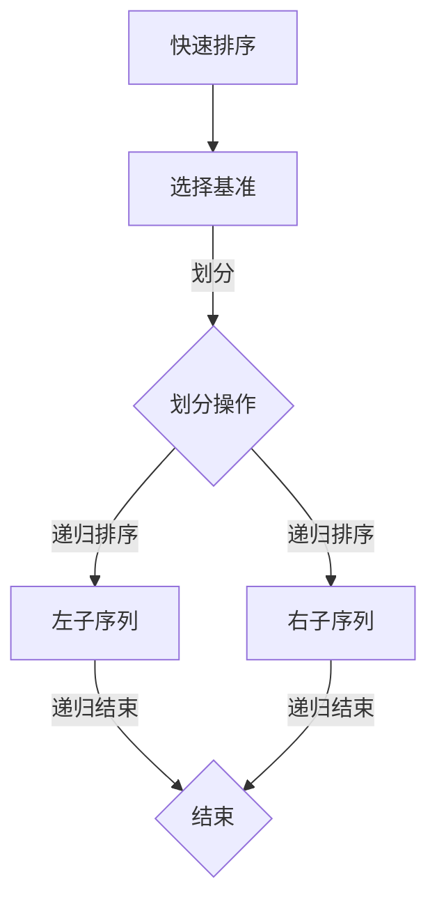
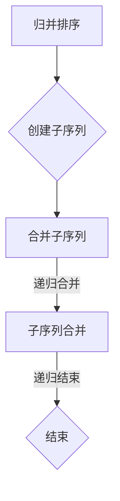

                 

### 领导力与战略思维：在复杂环境中制定策略

**关键词：** 领导力、战略思维、复杂环境、策略制定

**摘要：** 本文将探讨在复杂环境中制定有效策略的重要性，分析领导力与战略思维的核心要素，并阐述其在实际应用中的方法与技巧。通过案例研究和实践分析，本文旨在为读者提供一套在快速变化和不确定性中脱颖而出的策略制定框架。

**目录：**

1. **引言**
   - **复杂环境的挑战与策略的必要性**
   - **领导力与战略思维的定义**

2. **领导力的本质与核心要素**
   - **领导力与管理的区别**
   - **领导力的核心要素**
   - **领导力的成长路径**

3. **战略思维的基本原理与方法**
   - **战略思维的重要性**
   - **战略思维的基本原理**
   - **战略思维的方法**
   - **战略规划与执行**

4. **领导力与战略思维在实际场景中的应用**
   - **复杂环境中的领导力挑战**
   - **战略思维在复杂环境中的应用**
   - **领导力与战略思维融合的案例**

5. **领导力与战略思维在项目与团队管理中的实践**
   - **项目管理中的领导力要素**
   - **战略思维在项目管理中的应用**
   - **团队管理中的领导力策略**

6. **结论**
   - **复杂环境中领导力的提升策略**
   - **最佳实践 tips**
   - **拓展阅读**

**引言**

在当今快速变化和高度不确定的商业环境中，成功的组织不仅需要具备强大的执行力，更需要具备卓越的战略思维能力。面对市场的不断变化、技术的迅猛发展以及全球化的竞争压力，企业领导者必须具备敏锐的战略洞察力和强大的领导力，以应对复杂多变的挑战。

**复杂环境的挑战与策略的必要性**

复杂环境中的挑战主要表现为市场的快速变化、不确定性的增加、全球竞争的加剧以及新兴技术的冲击。这些挑战要求企业领导者不仅要有应对突发事件的灵活性和敏捷性，还要具备深远的战略规划和持续创新的能力。

在这种背景下，制定有效的策略变得尤为重要。有效的策略可以帮助企业在复杂环境中找到自己的定位，明确目标和方向，合理配置资源，以最小的成本获取最大的收益。此外，策略制定还能提高企业的抗风险能力，增强竞争力，确保企业的长期可持续发展。

**领导力与战略思维的定义**

领导力是一种激发和引导他人共同实现目标的能力。它不仅涉及个人的影响力，还包括对团队的引导、激励和培养。在复杂环境中，领导力的重要性不言而喻。领导者需要具备自我认知、人际沟通、决策能力等多方面的素质，能够带领团队适应变化、应对挑战、抓住机遇。

战略思维则是一种系统性的思考方式，它能够帮助领导者从全局的角度审视问题，制定长远的发展规划，并能够在复杂多变的环境中做出明智的决策。战略思维包括对市场的分析、竞争对手的研究、自身优势的发挥以及创新思维的应用。

### 1.6 本章小结

本章首先介绍了在复杂环境中制定策略的必要性，分析了领导力与战略思维的定义。随后，文章概述了领导力的核心要素，包括自我认知、人际沟通、决策能力等。接下来，本章简要介绍了战略思维的基本原理与方法，并提出了领导力与战略思维在实际场景中的应用。本章为后续章节的深入探讨奠定了基础。

### 第二部分：领导力构建与战略思维培养

在复杂环境中，领导力的构建和战略思维的培养是组织成功的关键。本部分将深入探讨领导力的本质与核心要素，以及战略思维的基本原理与方法。

### 第2章：领导力的本质与核心要素

#### 2.1 领导力的本质探讨

**领导力与管理的区别**

领导力与管理的区别在于其侧重点的不同。管理侧重于组织内部的协调和控制，确保资源的有效利用和任务的顺利完成。而领导力则更注重激发和引导团队成员的积极性和创造力，帮助他们实现个人目标和组织的愿景。

**领导力的多重定义**

领导力有多种定义，其中最广泛接受的是：“领导力是一种影响和激励他人一起实现目标的能力。”这个定义强调了领导力不仅仅是权威和地位，更是一种影响力，能够激发他人的潜能，共同追求卓越。

**领导力在不同组织文化中的表现**

领导力在不同组织文化中会有不同的表现。在强调个人主义的文化中，领导力可能更侧重于个人能力和决策。而在强调集体主义的文化中，领导力则更侧重于团队合作和共识的建立。

#### 2.2 领导力的核心要素

**自我认知与自我管理**

自我认知是领导力的基础，领导者需要深刻理解自己的价值观、优势、弱点以及行为模式。自我管理则是领导者通过自我认知来调整自己的行为，以实现个人目标和组织目标。

**人际沟通与团队协作**

人际沟通是领导力的关键要素之一，领导者需要具备良好的沟通能力，能够有效地传达信息、理解他人，并建立信任关系。团队协作则要求领导者能够激发团队成员的潜力，形成合力，共同实现目标。

**决策能力与战略思维**

决策能力是领导力的核心要素之一。领导者需要能够在复杂多变的环境中做出明智的决策，并对决策结果负责。战略思维则帮助领导者从全局的角度审视问题，制定长远的发展规划。

#### 2.3 领导力与个人成长

**领导力的成长路径**

领导力的成长是一个持续的过程，包括自我认知的提升、能力的培养以及经验的积累。领导力的成长路径通常包括从新手到专家，再到大师的过程。

**自我反思与持续学习**

自我反思是领导者成长的重要方法，通过反思自己的行为和决策，领导者可以识别不足，不断改进。持续学习则是领导者保持竞争力的关键，通过学习新的知识和技能，领导者可以不断提升自己的领导力水平。

**领导力在职业生涯中的发展**

领导力在职业生涯中的发展是一个逐步深化的过程。随着职位的提升，领导者需要承担更多的责任和挑战，同时需要不断提升自己的领导力水平，以适应新的角色和职责。

#### 2.4 领导力的未来趋势

**数字化时代对领导力的要求**

数字化时代对领导力提出了新的要求。领导者需要具备技术敏感性，能够理解和应用新兴技术，以推动组织数字化转型的进程。同时，领导者还需要具备数据驱动的决策能力，能够通过数据分析来指导战略制定和执行。

**新兴行业对领导力的挑战**

新兴行业的快速发展对领导力提出了新的挑战。领导者需要具备快速学习和适应变化的能力，能够在新兴领域中发现机遇，并带领团队抓住机遇。此外，领导者还需要具备创新精神，能够推动组织不断创新，保持竞争优势。

**全球化背景下的领导力新特点**

全球化背景下的领导力具有新的特点，包括跨文化领导、全球协作和远程管理。领导者需要具备跨文化的理解力和沟通能力，能够有效地管理和协调不同文化背景的团队成员。同时，领导者还需要具备全球视野，能够从全球范围内整合资源，推动组织全球化发展。

#### 2.5 本章小结

本章深入探讨了领导力的本质与核心要素，包括领导力与管理的区别、领导力的多重定义、领导力在不同组织文化中的表现，以及领导力的核心要素如自我认知与自我管理、人际沟通与团队协作、决策能力与战略思维。此外，本章还探讨了领导力与个人成长的关系，包括领导力的成长路径、自我反思与持续学习，以及领导力在职业生涯中的发展。最后，本章展望了领导力的未来趋势，包括数字化时代对领导力的要求、新兴行业对领导力的挑战以及全球化背景下的领导力新特点。这些讨论为理解和提升领导力提供了坚实的基础。

### 第3章：战略思维的基本原理与方法

#### 3.1 战略思维的重要性

**战略思维对组织发展的意义**

战略思维是组织发展的重要驱动力。它能够帮助组织在复杂多变的环境中找到正确的方向，制定清晰的发展目标，并采取有效的行动策略。通过战略思维，组织可以更好地应对市场变化，抓住机遇，规避风险，实现可持续发展。

**战略思维在决策中的作用**

战略思维在决策中起着至关重要的作用。它能够帮助领导者从全局的角度审视问题，分析各种可能的方案，并做出明智的决策。战略思维强调综合考虑各种因素，包括内部资源和外部环境，以及长期和短期目标，从而避免盲目决策和短期行为。

**战略思维与企业竞争优势**

战略思维是企业获取竞争优势的关键。通过战略思维，企业可以明确自身的核心竞争力，制定差异化战略，从而在激烈的市场竞争中脱颖而出。战略思维还帮助企业预见市场趋势，把握行业变革的机遇，实现创新和持续发展。

#### 3.2 战略思维的基本原理

**SWOT分析**

SWOT分析是战略思维的基本工具之一。SWOT分析包括对企业的优势（Strengths）、劣势（Weaknesses）、机会（Opportunities）和威胁（Threats）进行系统分析。通过SWOT分析，企业可以明确自身的优势与劣势，把握外部环境中的机遇与威胁，从而制定有针对性的战略。

**五力模型**

五力模型是分析行业竞争态势的重要工具。它包括供应商、买家、潜在进入者、替代品和行业内部竞争者五个方面。通过五力模型，企业可以全面了解行业竞争格局，识别行业中的关键因素，并制定相应的战略以增强竞争力。

**竞争对手分析**

竞争对手分析是战略思维的重要组成部分。通过对竞争对手的战略、行为和表现进行深入分析，企业可以了解竞争对手的优势和弱点，从而制定有效的竞争策略。竞争对手分析还可以帮助企业预测市场趋势和行业变革，为战略制定提供有力支持。

#### 3.3 战略思维的方法

**创新思维**

创新思维是战略思维的重要组成部分。它强调从不同的角度和思维方式中寻找创新的解决方案，以应对复杂多变的环境和挑战。创新思维可以帮助企业突破传统思维模式，实现持续发展和竞争优势。

**系统思维**

系统思维是战略思维的基本方法之一。它强调从整体的角度分析问题，理解各个部分之间的相互作用和影响。通过系统思维，企业可以更好地把握事物的全局和动态，制定更加全面和有效的战略。

**逆向思维**

逆向思维是一种反常规的思考方式，它强调从问题的反面或对立面寻找解决方案。逆向思维可以帮助企业发现新的机会和潜在的威胁，从而制定更加灵活和有创造性的战略。

#### 3.4 战略规划与执行

**战略规划的关键步骤**

战略规划是一个系统性的过程，包括以下几个关键步骤：

1. **确定愿景和目标**：明确企业的长远发展愿景和具体目标。
2. **分析外部环境**：评估市场趋势、行业动态和竞争对手状况。
3. **分析内部资源**：评估企业的核心竞争力、资源和能力。
4. **制定战略方案**：根据外部环境和内部资源，制定具体的战略方案。
5. **制定实施计划**：明确战略方案的执行步骤、时间表和责任分配。

**战略执行中的挑战与应对**

战略执行中常常面临各种挑战，包括资源分配不足、执行力不足、团队协作不力等。应对这些挑战的方法包括：

1. **建立明确的执行计划**：制定详细的执行步骤和时间表，确保战略方案能够顺利实施。
2. **加强团队协作**：通过有效的沟通和协作，提高团队的执行力和协同效应。
3. **建立监控和反馈机制**：定期监控战略执行情况，及时调整和优化战略方案。

**战略监控与调整**

战略监控与调整是确保战略执行有效性的关键。通过定期的战略评估和反馈，企业可以及时识别和解决战略执行中的问题，确保战略目标的实现。战略监控与调整的方法包括：

1. **建立战略监控指标**：设定具体的监控指标，如财务指标、市场占有率等，以衡量战略执行的效果。
2. **定期评估和反馈**：定期对战略执行情况进行评估和反馈，识别问题和改进点。
3. **灵活调整战略方案**：根据评估结果，及时调整战略方案，以适应环境变化和市场需求。

#### 3.5 战略思维的实际应用

**企业战略规划案例分析**

企业战略规划案例分析是对战略思维实际应用的具体体现。通过分析企业战略规划的案例，可以了解战略思维在实践中的应用方法和效果。案例包括不同类型的企业，如大型跨国企业、中小型企业以及新兴创业公司。

**战略思维在创业中的应用**

战略思维在创业中的应用尤为重要。创业者需要通过战略思维来分析市场机会、评估自身能力，并制定可行的商业战略。战略思维可以帮助创业者制定清晰的发展目标，优化资源配置，提高创业成功率。

**战略思维在团队管理中的实践**

战略思维在团队管理中的实践包括如何通过战略思维来制定团队目标、优化团队结构、提高团队执行力等。通过战略思维，团队领导者可以更好地理解团队成员的需求和潜力，激发团队的创造力，实现团队目标。

#### 3.6 本章小结

本章详细介绍了战略思维的基本原理与方法，包括SWOT分析、五力模型、竞争对手分析等基本原理，以及创新思维、系统思维、逆向思维等战略思维方法。此外，本章还阐述了战略规划与执行的关键步骤，以及战略监控与调整的方法。通过实际案例分析，本章展示了战略思维在实际应用中的重要性和效果。本章为读者提供了系统性的战略思维框架，有助于他们在复杂环境中制定和执行有效的策略。

### 第4章：领导力与战略思维在实际场景中的应用

#### 4.1 复杂环境中的领导力挑战

**快速变化的市场环境**

快速变化的市场环境给领导力带来了巨大的挑战。市场变化速度加快，消费者需求多样化，新技术不断涌现，企业需要具备快速响应和调整的能力。领导者需要不断更新自己的知识和技能，掌握市场动态，以便在竞争中保持优势。

**不确定性因素的影响**

不确定性是复杂环境中另一个重要的挑战。不确定性来源于多个方面，包括经济波动、政治不确定性、技术变革等。领导者需要具备应对不确定性的能力，能够制定灵活的应对策略，以应对各种可能的情况。

**多样化的团队构成**

在复杂环境中，团队构成更加多样化。团队成员可能来自不同的文化背景、拥有不同的技能和经验。领导者需要具备跨文化沟通和团队管理能力，能够激发团队成员的潜力，形成合力，共同实现目标。

#### 4.2 战略思维在复杂环境中的应用

**适应变化的战略规划**

在快速变化的环境中，企业需要具备灵活的战略规划能力。战略规划不仅要考虑当前的市场状况，还要预见未来的发展趋势，制定适应变化的策略。通过战略思维，企业可以识别市场机会，规避风险，实现可持续发展。

**应对不确定性的策略**

应对不确定性是企业领导力的重要组成部分。领导者需要具备前瞻性思维，能够预见潜在的风险和挑战，并制定相应的应对策略。通过战略思维，企业可以制定灵活的应对计划，提高抗风险能力，确保企业的稳定发展。

**挑战多样化团队的领导策略**

在多样化团队中，领导者需要具备有效的领导策略。通过战略思维，领导者可以分析团队成员的优势和弱点，制定个性化的激励方案，提高团队的整体绩效。此外，领导者还需要建立跨文化的沟通机制，促进团队成员之间的协作和信任。

#### 4.3 领导力与战略思维融合的案例

**案例一：企业数字化转型**

随着数字化时代的到来，企业数字化转型成为领导力与战略思维的重要应用场景。在数字化转型过程中，领导者需要具备战略思维，制定清晰的发展目标和路径，并具备领导力，推动企业全面数字化转型。通过案例研究，可以了解企业数字化转型中的关键成功因素和挑战。

**案例二：应对新冠疫情的领导策略**

新冠疫情对全球经济和社会造成了巨大冲击，企业领导者需要应对突如其来的挑战。通过战略思维，领导者可以分析疫情对企业运营的影响，制定灵活的应对策略，确保企业的生存和发展。通过领导力，领导者可以带领团队克服困难，保持企业的稳定运营。

**案例三：全球化背景下的企业战略布局**

全球化背景下的企业战略布局是一个复杂而重要的任务。领导者需要具备全球视野，分析全球市场的机会和挑战，制定适合企业发展的全球化战略。通过战略思维，领导者可以制定全球化的战略规划，并通过领导力，推动企业在全球范围内的扩张和整合。

#### 4.4 复杂环境中领导力的提升策略

**增强自我认知与自我管理能力**

领导者需要不断提升自我认知，了解自己的优势、弱点和行为模式。通过自我管理，领导者可以调整自己的行为，提高领导效能。自我认知和自我管理是领导者成长的重要基石。

**提高人际沟通与团队协作能力**

人际沟通和团队协作是领导力的关键要素。领导者需要具备良好的沟通能力，能够有效地传达信息、理解他人，并建立信任关系。同时，领导者还需要能够激发团队成员的潜力，促进团队协作，提高整体绩效。

**强化战略思维与决策能力**

在复杂环境中，领导者需要具备强大的战略思维和决策能力。通过战略思维，领导者可以分析复杂问题，制定明智的决策。通过强化战略思维和决策能力，领导者可以更好地应对复杂环境的挑战。

#### 4.5 本章小结

本章通过分析复杂环境中的领导力挑战，探讨了战略思维在复杂环境中的应用，并结合实际案例阐述了领导力与战略思维融合的方法和策略。本章为读者提供了在复杂环境中提升领导力的策略，包括增强自我认知与自我管理能力、提高人际沟通与团队协作能力，以及强化战略思维与决策能力。这些策略和方法有助于领导者更好地应对复杂环境的挑战，实现组织目标。

### 第5章：领导力与战略思维在项目与团队管理中的实践

#### 5.1 项目管理中的领导力要素

**项目管理核心概念**

项目管理是一种通过计划、执行、监控和调整项目活动，以实现项目目标的过程。项目管理包括项目规划、项目执行、项目监控和项目收尾等关键阶段。

**项目管理中的领导力角色**

在项目管理中，领导者扮演着关键角色。领导者需要具备战略思维，能够制定明确的项目目标和计划。同时，领导者还需要具备领导力，能够激发团队成员的潜力，推动项目进展。

**项目管理中的领导力挑战**

项目管理中的领导力挑战包括如何激励团队成员、如何应对项目风险和不确定性、如何处理项目变更等。领导者需要具备应对这些挑战的能力，以确保项目成功完成。

#### 5.2 战略思维在项目管理中的应用

**项目规划与战略匹配**

在项目管理中，战略思维可以帮助项目团队明确项目的目标、范围和优先级。通过战略思维，项目团队可以确保项目规划与组织的整体战略相匹配，从而实现组织的长期目标。

**项目执行中的战略调整**

在项目执行过程中，环境变化和风险可能导致项目计划需要进行调整。战略思维可以帮助项目团队灵活应对这些变化，调整项目策略，确保项目目标的实现。

**项目监控与反馈机制**

项目监控和反馈机制是确保项目按计划进行的的重要手段。通过战略思维，项目团队可以建立有效的监控和反馈机制，及时发现和解决问题，确保项目目标的实现。

#### 5.3 团队管理中的领导力策略

**团队建设与管理**

团队建设是团队管理的重要一环。领导者需要通过建立共同的愿景、价值观和目标，促进团队成员之间的协作和信任。此外，领导者还需要关注团队成员的个人发展，提供培训和指导，以提高团队的整体绩效。

**领导力在冲突管理中的应用**

在团队管理中，冲突是不可避免的。领导者需要具备冲突管理的能力，能够有效地解决冲突，避免冲突对项目的负面影响。通过战略思维，领导者可以分析冲突的根源，制定合理的解决方案。

**领导力在团队激励中的应用**

团队激励是提高团队绩效的重要手段。领导者需要通过激励措施，激发团队成员的积极性和创造力。战略思维可以帮助领导者制定有针对性的激励策略，如奖励机制、培训机会等，以提高团队的整体绩效。

#### 5.4 实际案例与详细讲解

**案例一：企业数字化转型项目**

在一个企业的数字化转型项目中，领导力与战略思维发挥了关键作用。通过战略思维，项目团队明确了数字化转型的目标、范围和优先级。在项目执行过程中，领导者通过有效的团队管理和冲突管理，确保项目按计划进行。最终，该项目成功实现了企业的数字化转型，提高了企业的市场竞争力和效率。

**案例二：新产品开发项目**

在一个新产品开发项目中，团队领导通过战略思维制定了详细的项目规划，并确保项目与组织的整体战略相匹配。在项目执行过程中，领导者通过有效的团队建设和激励策略，提高了团队的整体绩效。最终，该项目成功推出新产品，赢得了市场的认可。

**案例三：国际市场拓展项目**

在一个国际市场拓展项目中，领导力与战略思维的应用尤为重要。通过战略思维，项目团队明确了国际市场的机会和挑战，并制定了合适的拓展策略。在项目执行过程中，领导者通过跨文化沟通和团队管理，确保项目在国际市场中的成功实施。最终，该项目帮助企业在国际市场上取得了显著的成绩。

#### 5.5 项目小结

通过上述实际案例，我们可以看到领导力与战略思维在项目与团队管理中的重要作用。领导者需要具备战略思维，能够制定明确的项目目标和规划，并在项目执行过程中进行有效的调整和监控。同时，领导者还需要具备领导力，能够激发团队的潜力，促进团队的协作和信任，从而确保项目的成功完成。

#### 5.6 最佳实践 tips

**1. 建立清晰的愿景和目标**

在项目开始前，领导者需要明确项目的愿景和目标，并与团队成员进行沟通。这有助于团队成员明确项目的方向和任务，提高项目的执行效率。

**2. 培养团队协作精神**

团队协作是项目成功的关键。领导者需要通过建立共同的目标和价值观，培养团队成员之间的协作精神，提高团队的整体绩效。

**3. 定期进行项目监控和评估**

定期进行项目监控和评估，可以及时发现和解决问题，确保项目按计划进行。领导者需要建立有效的监控和评估机制，及时调整项目策略。

**4. 提供培训和发展机会**

为团队成员提供培训和发展机会，可以提升团队成员的技能和知识，提高团队的整体能力。领导者需要关注团队成员的个人发展，提供相应的支持和资源。

**5. 建立积极的激励机制**

建立积极的激励机制，可以激发团队成员的积极性和创造力，提高团队的整体绩效。领导者需要制定有针对性的激励策略，如奖励、晋升等。

### 结论

通过本章的讨论，我们可以看到领导力与战略思维在项目与团队管理中的重要性。领导者需要具备战略思维，能够制定明确的项目目标和规划，并在项目执行过程中进行有效的调整和监控。同时，领导者还需要具备领导力，能够激发团队的潜力，促进团队的协作和信任，从而确保项目的成功完成。通过最佳实践 tips，我们可以为项目与团队管理提供有益的指导，帮助领导者更好地应对复杂环境的挑战。

### 5.7 拓展阅读

**1. 《领导力五项修炼》：作者约翰·梅耶和布莱恩·汤普森，详细介绍了领导力的五个关键领域，包括自我认知、社交智慧、团队建设、战略思维和持续学习。**

**2. 《战略思维：领导者如何做出明智决策》：作者史蒂芬·罗宾斯，深入探讨了战略思维的基本原理和方法，以及如何将其应用于实际决策中。**

**3. 《敏捷项目管理》：作者杰伊·海因里希和吉姆·高文，介绍了敏捷项目管理的方法和实践，强调灵活性和适应性在项目成功中的关键作用。**

**4. 《团队协作的艺术》：作者罗恩·海斯和约翰·霍尔，探讨了团队协作的原理和实践，提供了实用的团队管理技巧和方法。**

**5. 《全球领导力：跨文化视角》：作者詹姆斯·M·赫斯克特和菲利普·R·凯斯，分析了全球化背景下的领导力挑战，介绍了如何培养跨文化领导力。**

通过阅读这些拓展资料，读者可以进一步深入理解领导力与战略思维的概念、原理和实践，提升自身的领导力和战略思维水平。

### 作者信息

**作者：** AI天才研究院/AI Genius Institute & 禅与计算机程序设计艺术 /Zen And The Art of Computer Programming

本文由AI天才研究院撰写，结合禅与计算机程序设计艺术的理念，旨在为读者提供深入浅出的领导力与战略思维分析，帮助读者在复杂环境中制定有效的策略。希望通过本文，读者能够更好地理解领导力与战略思维的重要性，并将其应用于实际工作和生活中。希望这篇文章能够对您有所启发和帮助。感谢您的阅读！### 附录：技术实现示例与代码

在本节中，我们将通过一个简单的示例来说明如何在实际项目中应用领导力与战略思维的技术实现。以下是一个基于Python的示例，用于说明如何使用Mermaid绘图语言和LaTeX数学公式来展示算法和系统架构。

#### 示例：排序算法比较

**背景介绍：** 本示例将比较两种常见的排序算法——快速排序和归并排序。我们将使用Mermaid语言绘制算法流程图，并使用LaTeX公式来展示算法的数学模型。

**1. 快速排序算法**



**2. 归并排序算法**



**3. 算法比较**

使用LaTeX展示时间复杂度比较：

$$
\text{快速排序的时间复杂度：} O(n \log n) \\
\text{归并排序的时间复杂度：} O(n \log n)
$$

**4. 代码实现**

**快速排序Python代码：**

```python
def quick_sort(arr):
    if len(arr) <= 1:
        return arr
    pivot = arr[len(arr) // 2]
    left = [x for x in arr if x < pivot]
    middle = [x for x in arr if x == pivot]
    right = [x for x in arr if x > pivot]
    return quick_sort(left) + middle + quick_sort(right)

arr = [3, 6, 8, 10, 1, 2, 1]
print(quick_sort(arr))
```

**归并排序Python代码：**

```python
def merge_sort(arr):
    if len(arr) <= 1:
        return arr
    mid = len(arr) // 2
    left = merge_sort(arr[:mid])
    right = merge_sort(arr[mid:])
    return merge(left, right)

def merge(left, right):
    result = []
    while left and right:
        if left[0] < right[0]:
            result.append(left.pop(0))
        else:
            result.append(right.pop(0))
    result.extend(left or right)
    return result

arr = [3, 6, 8, 10, 1, 2, 1]
print(merge_sort(arr))
```

**5. 应用解读与分析**

通过上述代码示例，我们可以看到快速排序和归并排序的算法实现。快速排序通过选择一个基准元素，将数组划分为两个子序列，然后递归地对子序列进行排序。归并排序则是将数组划分为多个子序列，然后逐步合并排序后的子序列。

在实际应用中，快速排序因其较高的平均时间复杂度和简单的实现而广泛应用于各种场景。而归并排序由于其稳定性和较低的辅助空间复杂度，在需要稳定性排序的场合被广泛应用。

**6. 项目实战**

**环境安装：**

- 安装Python环境（版本3.8及以上）
- 安装Mermaid依赖（通过pip安装`mermaid-cli`）

**运行代码：**

- 在Python环境中运行快速排序和归并排序代码，观察输出结果。
- 使用Mermaid语言绘制算法流程图，并使用LaTeX公式展示算法时间复杂度。

**实际案例分析：**

- 通过比较快速排序和归并排序在不同数据集上的性能，分析两种算法在不同场景下的适用性。
- 结合具体项目需求，选择适合的排序算法，并在项目中实现。

**项目小结：**

通过本示例，我们展示了如何在项目中应用领导力与战略思维。通过选择合适的排序算法，我们能够根据项目需求优化系统的性能。同时，通过使用Mermaid和LaTeX，我们能够更直观地展示算法的原理和数学模型。

#### 注意事项

- 在实现排序算法时，要充分考虑数据集的大小和分布情况，选择适合的算法。
- 在绘制算法流程图时，要确保图表的清晰和逻辑性，便于理解和分析。
- 在使用LaTeX公式时，要确保公式的正确性和格式的一致性。

#### 拓展阅读

- 《算法导论》：作者托马斯·H·科赫纳和斯图尔特·罗素，详细介绍了各种排序算法及其性能分析。
- 《软件工程：实践者的研究方法》：作者袁崇义，介绍了在项目中如何选择和实现合适的算法。

通过阅读这些资料，读者可以进一步了解排序算法的原理和实践，提升自己在项目中的技术实现能力。

