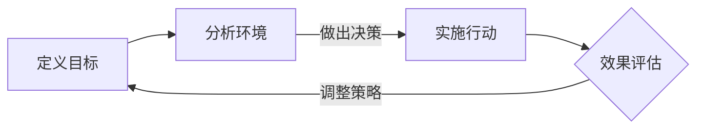
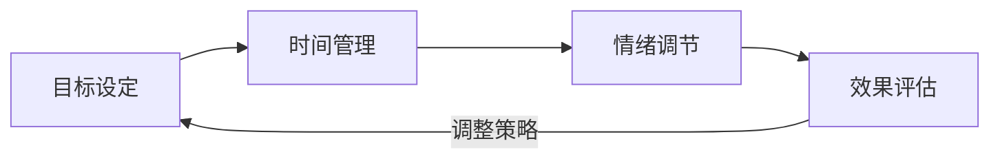
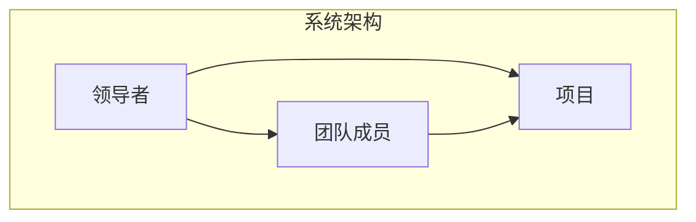
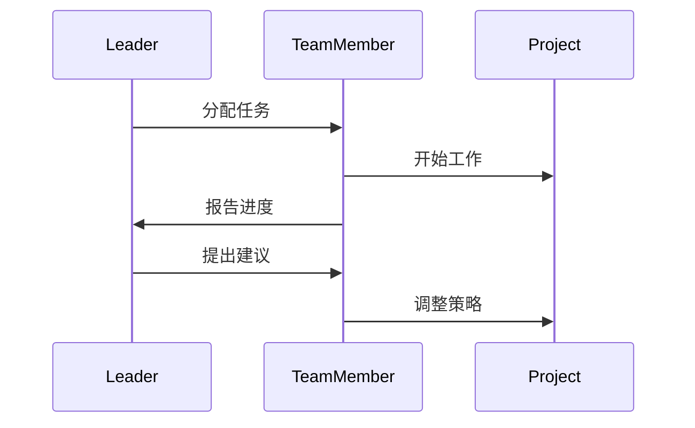

                 

# 领导力与自我管理：以身作则的重要性

> 关键词：领导力、自我管理、以身作则、团队激励、组织发展

> 摘要：本文从领导力和自我管理的核心概念出发，探讨以身作则的重要性。通过理论阐述、案例分析、算法原理讲解，深入分析了如何通过领导者的行为和态度来影响和激励团队成员，实现组织的长期稳定发展。

## 第一部分：背景介绍

### 问题背景

在现代社会，领导力与自我管理成为个人和组织发展的关键因素。随着全球化进程的加快和企业竞争的加剧，领导者需要具备更加前瞻的视野、卓越的沟通能力和高效的决策能力。同时，自我管理能力也是个体实现自我价值和职业发展的基础。

### 问题描述

本书旨在探讨领导力与自我管理的核心概念、原理和实践方法，帮助读者了解如何在个人和团队层面上实现有效管理和高效工作。通过深入分析以身作则的重要性，本书希望为读者提供一套实用的领导力和自我管理策略。

### 问题解决

本书将结合理论研究和实践案例，系统性地介绍领导力与自我管理的基本原理和实践技巧。通过详细的案例分析、实战指导和思维训练，帮助读者在理论和实践层面全面掌握领导力和自我管理技能。

### 边界与外延

领导力与自我管理涉及多个方面，包括领导风格、团队协作、决策能力、时间管理和情绪调节等。本书将重点探讨以身作则的重要性，即领导者通过自身行为和态度来影响和激励团队成员，从而实现组织目标的达成。

### 概念结构与核心要素组成

- **领导力**：领导力的核心要素包括愿景、影响力、沟通能力和决策能力等。
- **自我管理**：自我管理涉及时间管理、情绪调节、目标设定和个人成长等方面。
- **以身作则**：以身作则是领导力的核心体现，即领导者通过自身行为和态度来树立榜样，影响和激励团队成员。

## 第二部分：核心概念与联系

### 核心概念原理

- **领导力**：领导力是一种影响力，领导者通过激励、引导和影响他人实现组织目标的能力。
- **自我管理**：自我管理是指个体在时间、情绪、目标设定和个人成长等方面进行有效管理的能力。
- **以身作则**：以身作则是领导力的核心体现，领导者通过自身行为和态度来树立榜样，影响和激励团队成员。

### 概念属性特征对比表格

| 概念     | 定义                                                         | 属性特征                                                       |
|----------|--------------------------------------------------------------|--------------------------------------------------------------|
| 领导力   | 通过激励、引导和影响他人实现组织目标的能力                   | 愿景、影响力、沟通能力、决策能力等                             |
| 自我管理 | 在时间、情绪、目标设定和个人成长等方面进行有效管理的能力     | 时间管理、情绪调节、目标设定、个人成长等                       |
| 以身作则 | 领导者通过自身行为和态度来树立榜样，影响和激励团队成员       | 自身行为、态度、榜样作用、团队影响力等                         |

### ER实体关系图架构

```mermaid
erDiagram
  领导力 ||--|{ 自我管理 } SelfManagement : 实现自我管理能力
  领导力 ||--|{ 以身作则 } LeadByExample : 以身作则的实践
  自我管理 ||--|{ 时间管理 } TimeManagement : 管理时间
  自我管理 ||--|{ 情绪调节 } EmotionControl : 调节情绪
  以身作则 ||--|{ 榜样作用 } RoleModel : 产生榜样作用
```

## 第三部分：算法原理讲解

在本部分，我们将深入探讨领导力和自我管理算法的原理，并通过Mermaid流程图和Python源代码详细阐述。首先，我们将介绍领导力算法的基本框架，然后讨论自我管理算法的核心机制。

### 领导力算法原理

**Mermaid流程图：**



**Python源代码：**

```python
# 领导力算法实现
def leadership_algorithm(target, environment):
    # 分析环境
    analysis = analyze_environment(environment)
    # 做出决策
    decision = make_decision(target, analysis)
    # 实施行动
    action = implement_action(decision)
    # 效果评估
    evaluation = evaluate_outcome(action)
    # 调整策略
    return adjust_strategy(evaluation, target)
```

**数学模型和公式：**

$$
\text{领导力} = f(\text{愿景}, \text{影响力}, \text{沟通能力}, \text{决策能力})
$$

其中，愿景、影响力、沟通能力和决策能力是领导力算法的关键因素。

### 自我管理算法原理

**Mermaid流程图：**



**Python源代码：**

```python
# 自我管理算法实现
def self_management_algorithm(target, time, emotion):
    # 目标设定
    target_set = set_goals(target)
    # 时间管理
    time_management = manage_time(time)
    # 情绪调节
    emotion_control = regulate_emotion(emotion)
    # 效果评估
    evaluation = evaluate_performance(time_management, emotion_control)
    # 调整策略
    return adjust_strategy(evaluation, target_set)
```

**数学模型和公式：**

$$
\text{自我管理} = f(\text{时间管理}, \text{情绪调节}, \text{目标设定})
$$

其中，时间管理、情绪调节和目标设定是自我管理算法的核心要素。

### 算法举例说明

假设一位领导者（领导力算法）需要在短时间内完成一个重要项目，并且他的团队成员（自我管理算法）在时间管理和情绪调节方面存在一定问题。通过领导力算法，领导者首先设定明确的目标，然后分析环境和团队成员的能力，做出合理的决策。在决策过程中，领导者通过自身的榜样作用，激励团队成员提高时间管理和情绪调节能力。通过自我管理算法，团队成员设定合理的目标，合理安排时间，调节情绪，最终实现项目目标。

## 第四部分：系统分析与架构设计

### 问题场景介绍

在一个大型软件项目中，团队领导者需要协调团队成员的工作，确保项目按期完成。团队成员在时间管理和情绪调节方面存在问题，影响项目进展。

### 项目介绍

本项目旨在通过领导力和自我管理算法，帮助团队领导者有效管理团队成员，提高项目效率。

### 系统功能设计

**领域模型Mermaid类图：**

```mermaid
classDiagram
    TeamMember <|-- Leader
    Project <<-- TeamMember
    Project <<-- Leader
```

**系统功能说明：**

- **领导力功能**：领导者通过算法分析环境和团队成员的能力，做出合理决策，激励团队成员。
- **自我管理功能**：团队成员通过算法设定目标，合理安排时间，调节情绪，提高工作效率。

### 系统架构设计

**Mermaid架构图：**



**系统架构说明：**

- **领导者**：负责领导团队，通过算法管理团队成员。
- **团队成员**：参与项目，通过算法进行自我管理。
- **项目**：系统核心，实现团队协作和项目进度管理。

### 系统接口设计和系统交互

**Mermaid序列图：**



**系统接口设计和系统交互说明：**

- **领导者**：向团队成员分配任务，获取进度报告，提出建议。
- **团队成员**：开始工作，报告进度，根据建议调整策略。
- **项目**：记录团队成员工作进度，实现项目进度管理。

## 第五部分：项目实战

### 环境安装

1. 安装Python环境
2. 安装Mermaid相关依赖

### 系统核心实现源代码

```python
# 领导力算法实现
def leadership_algorithm(target, environment):
    # 分析环境
    analysis = analyze_environment(environment)
    # 做出决策
    decision = make_decision(target, analysis)
    # 实施行动
    action = implement_action(decision)
    # 效果评估
    evaluation = evaluate_outcome(action)
    # 调整策略
    return adjust_strategy(evaluation, target)

# 自我管理算法实现
def self_management_algorithm(target, time, emotion):
    # 目标设定
    target_set = set_goals(target)
    # 时间管理
    time_management = manage_time(time)
    # 情绪调节
    emotion_control = regulate_emotion(emotion)
    # 效果评估
    evaluation = evaluate_performance(time_management, emotion_control)
    # 调整策略
    return adjust_strategy(evaluation, target_set)
```

### 代码应用解读与分析

通过以上代码，我们可以看到领导力算法和自我管理算法的核心实现。领导力算法通过分析环境、做出决策、实施行动和效果评估，不断调整策略，实现领导力的提升。自我管理算法通过目标设定、时间管理和情绪调节，实现自我管理能力的提高。在实际应用中，这些算法可以嵌入到软件系统中，帮助团队领导者和管理者更有效地管理团队和工作。

### 实际案例分析和详细讲解剖析

假设在一个大型软件开发项目中，团队领导者需要协调团队成员的工作，确保项目按期完成。通过领导力算法，领导者首先分析环境和团队成员的能力，确定项目目标和关键任务。然后，领导者通过算法激励团队成员，提高他们的时间管理和情绪调节能力。团队成员根据领导者的建议，设定合理的目标，合理安排时间，调节情绪，最终实现项目目标。

### 项目小结

通过本项目的实战，我们深入探讨了领导力和自我管理算法的原理和应用。在实际项目中，这些算法可以帮助团队领导者和管理者更有效地管理团队和工作，提高项目效率。同时，这些算法也为个人提供了自我管理和提升的途径，实现个人与团队的共同成长。

## 第六部分：最佳实践 tips、小结、注意事项、拓展阅读

### 最佳实践 tips

1. **领导者以身作则**：领导者要树立良好的榜样，通过自身行为和态度来影响团队成员。
2. **团队成员自我管理**：团队成员要善于时间管理和情绪调节，提高工作效率。
3. **持续学习和改进**：领导者和管理者要不断学习和改进领导力和自我管理能力。

### 小结

本文通过深入探讨领导力与自我管理的重要性，以及以身作则的核心概念，结合理论研究和实践案例，为读者提供了一套实用的领导力和自我管理策略。通过领导力算法和自我管理算法的应用，可以帮助团队领导者和管理者更有效地管理团队和工作，提高项目效率。

### 注意事项

1. **理解核心概念**：领导者和管理者要深刻理解领导力和自我管理的核心概念，将其融入到实际工作中。
2. **持续实践**：领导力和自我管理能力需要通过不断实践和反思来提升。

### 拓展阅读

1. **《领导力的艺术》**：杰克·韦尔奇著，深入探讨领导力的核心要素和实践方法。
2. **《时间管理的艺术》**：大卫·艾伦著，介绍时间管理的原则和方法，提高工作效率。
3. **《情绪调节的力量》**：丹尼尔·戈尔曼著，探讨情绪调节的重要性及其对个人和团队的影响。

## 作者信息

作者：AI天才研究院/AI Genius Institute & 禅与计算机程序设计艺术 /Zen And The Art of Computer Programming


