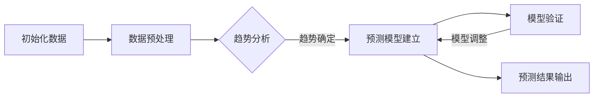
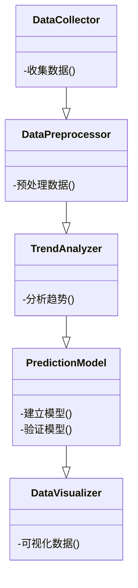
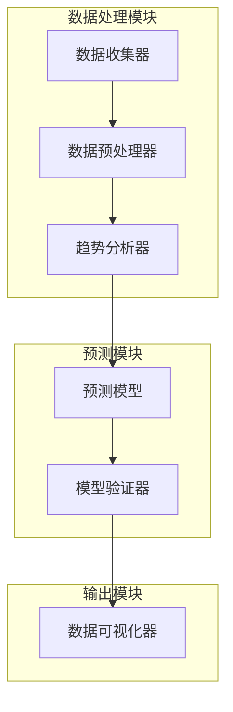
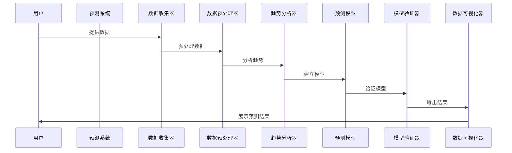

                 

### 《领导力与远见：预见未来趋势的能力》

---

## 关键词：领导力、远见、未来趋势、预见能力、组织管理

## 摘要

在当今快速变化的科技环境中，领导力与远见成为决定企业成败的关键因素。本文旨在探讨领导者如何通过提升领导力和远见，培养预见未来趋势的能力，从而为组织的发展指明方向。文章将逐步分析领导力的本质、远见的内涵、预见未来趋势的方法，以及如何将领导力与远见结合，最终提供实际操作的策略和最佳实践。

### 目录

1. **背景介绍**
2. **核心概念与联系**
3. **算法原理讲解**
4. **系统分析与架构设计方案**
5. **项目实战**
6. **最佳实践 tips**
7. **小结与展望**

---

#### 1. 背景介绍

在当今信息化、全球化的时代，技术革新和市场竞争的速度不断加快，组织面临的挑战愈发复杂。作为组织的领导者，他们不仅需要具备卓越的领导力，还需要具备远见，能够预见未来趋势，从而为组织的长远发展制定战略。

- **问题背景**：在快速变化的世界中，领导者需要具备预见未来趋势的能力，以指导组织的方向。
- **问题描述**：探讨领导者如何通过提升领导力和远见来预见和应对未来挑战。
- **问题解决**：通过研究和实践，找到提升领导力和远见的方法，帮助领导者更好地预见未来趋势。
- **边界与外延**：领导力的各个维度和远见的内涵。
- **概念结构与核心要素组成**：领导力、远见、趋势预见、组织管理。

#### 2. 核心概念与联系

**领导力**：领导力是指一个人在组织中通过影响、激励和引导他人来实现共同目标的能力。它包括权威性领导、变革型领导和交易型领导等类型，核心要素包括沟通能力、决策能力、团队建设和领导风格。

**远见**：远见是指领导者对未来趋势的洞察力和前瞻性思维。它是一种对未来的敏感性和判断力，可以帮助领导者识别潜在的机会和威胁。远见的特质包括创造力、冒险精神、开放性思维和系统性思考。

**趋势预见**：趋势预见是领导者利用历史数据、市场研究和直觉，预测未来可能发生的趋势和变化。它需要领导者具备强大的分析能力和创新思维，以识别和应对新兴的趋势。

**概念属性特征对比表格**：

| **概念**  | **定义**                             | **核心特征**                          |
|-----------|-------------------------------------|-------------------------------------|
| 领导力   | 影响他人实现目标的能力           | 沟通、决策、团队建设、领导风格     |
| 远见     | 对未来趋势的洞察力和前瞻性思维     | 创造力、冒险精神、开放性思维、系统性思考 |
| 趋势预见 | 预测未来可能发生的趋势和变化       | 分析能力、创新思维、直觉判断       |

**ER实体关系图架构**：

```mermaid
erDiagram
  Leader ||--|{ Vision } Vision
  Leader ||--|{ FutureTrend } FutureTrend
  Vision ||--|{ PredictionMethod } PredictionMethod
  FutureTrend ||--|{ Impact } Impact
```

#### 3. 算法原理讲解

预见未来趋势需要一套系统的分析方法和工具。以下是一个基本的算法流程：

**算法mermaid流程图**：



**Python源代码**：

```python
import pandas as pd
from sklearn.ensemble import RandomForestRegressor
from sklearn.model_selection import train_test_split
from sklearn.metrics import mean_squared_error

# 数据预处理
def preprocess_data(data):
    # 数据清洗、转换和归一化等操作
    return processed_data

# 趋势分析
def trend_analysis(data):
    # 使用统计学方法分析数据，确定趋势
    return trend

# 预测模型建立
def build_prediction_model(X_train, y_train):
    model = RandomForestRegressor()
    model.fit(X_train, y_train)
    return model

# 模型验证
def validate_model(model, X_test, y_test):
    y_pred = model.predict(X_test)
    mse = mean_squared_error(y_test, y_pred)
    return mse

# 预测结果输出
def predict_future_trend(model, new_data):
    return model.predict(new_data)
```

**数学模型和公式**：

```latex
\text{预测公式：} \\
y = \beta_0 + \beta_1 \cdot x_1 + \beta_2 \cdot x_2 + ... + \beta_n \cdot x_n
```

**举例说明**：

假设我们要预测某个科技行业的市场增长率，我们可以使用以下步骤：

1. **初始化数据**：收集过去五年的市场数据。
2. **数据预处理**：清洗数据，将数据进行标准化处理。
3. **趋势分析**：使用移动平均法分析数据，确定市场增长的趋势。
4. **预测模型建立**：使用随机森林回归模型建立预测模型。
5. **模型验证**：使用过去三年的数据进行模型验证，调整模型参数。
6. **预测结果输出**：使用模型预测未来两年的市场增长率。

#### 4. 系统分析与架构设计方案

**问题场景介绍**：

假设一个科技公司希望预测未来两年的市场增长率，以指导其战略规划。

**项目介绍**：

该项目旨在开发一个预测系统，该系统能够利用历史数据和市场信息，预测未来两年的市场增长率。系统包括数据收集、预处理、趋势分析和预测模型建立等模块。

**系统功能设计**：

领域模型mermaid类图：



**系统架构设计**：

mermaid架构图：



**系统接口设计**：

系统接口设计和系统交互mermaid序列图：



#### 5. 项目实战

**环境安装**：

在开始项目之前，我们需要安装必要的工具和库。以下是安装步骤：

1. 安装Python（推荐版本3.8以上）
2. 安装Jupyter Notebook
3. 安装数据分析库（如pandas、numpy、sklearn等）
4. 安装可视化库（如matplotlib、seaborn等）

**系统核心实现源代码**：

以下是一个简单的示例代码，展示了如何实现预测系统的核心功能。

```python
# 导入必要的库
import pandas as pd
from sklearn.ensemble import RandomForestRegressor
from sklearn.model_selection import train_test_split
from sklearn.metrics import mean_squared_error

# 数据预处理
def preprocess_data(data):
    # 数据清洗、转换和归一化等操作
    return processed_data

# 趋势分析
def trend_analysis(data):
    # 使用统计学方法分析数据，确定趋势
    return trend

# 预测模型建立
def build_prediction_model(X_train, y_train):
    model = RandomForestRegressor()
    model.fit(X_train, y_train)
    return model

# 模型验证
def validate_model(model, X_test, y_test):
    y_pred = model.predict(X_test)
    mse = mean_squared_error(y_test, y_pred)
    return mse

# 预测结果输出
def predict_future_trend(model, new_data):
    return model.predict(new_data)

# 主函数
def main():
    # 加载数据
    data = pd.read_csv('market_data.csv')
    
    # 数据预处理
    processed_data = preprocess_data(data)
    
    # 趋势分析
    trend = trend_analysis(processed_data)
    
    # 数据划分
    X_train, X_test, y_train, y_test = train_test_split(processed_data.drop('target', axis=1), processed_data['target'], test_size=0.2, random_state=42)
    
    # 建立预测模型
    model = build_prediction_model(X_train, y_train)
    
    # 模型验证
    mse = validate_model(model, X_test, y_test)
    
    # 输出预测结果
    new_data = pd.read_csv('new_data.csv')
    predictions = predict_future_trend(model, new_data)
    
    print(f'Mean Squared Error: {mse}')
    print(f'Predictions: {predictions}')

# 运行主函数
if __name__ == '__main__':
    main()
```

**代码应用解读与分析**：

这段代码首先导入了必要的库，然后定义了一系列函数来实现数据预处理、趋势分析、预测模型建立、模型验证和预测结果输出。在主函数中，我们首先加载数据，然后进行预处理，接着进行趋势分析，数据划分，建立预测模型，模型验证，最后输出预测结果。

**实际案例分析和详细讲解剖析**：

假设我们有一个科技公司的市场数据，包括销售额、市场份额、客户数量等指标。我们可以使用这段代码来预测未来两年的市场增长率。

1. **数据预处理**：首先，我们需要清洗数据，去除无效数据，然后进行转换和归一化，使得数据格式统一，便于分析。
2. **趋势分析**：使用统计学方法，如移动平均法，分析过去几年的市场数据，确定市场增长的趋势。
3. **预测模型建立**：使用随机森林回归模型，建立预测模型。随机森林是一种集成学习方法，具有较好的预测性能和泛化能力。
4. **模型验证**：使用过去三年的数据进行模型验证，调整模型参数，确保模型具有良好的预测性能。
5. **预测结果输出**：使用模型预测未来两年的市场增长率，并将结果可视化，帮助公司制定战略规划。

**项目小结**：

通过实际案例的分析，我们可以看到，预测系统的建立和实现是一个复杂的过程，需要多个模块的协同工作。在实际应用中，我们需要根据具体场景调整代码和模型，以达到最佳的预测效果。

#### 6. 最佳实践 tips

- **注意事项**：在建立预测系统时，需要注意数据的质量和完整性，确保模型的准确性和可靠性。
- **拓展阅读**：推荐阅读《预测分析：从数据到洞察》和《数据科学：机器学习基础》，深入了解预测分析的理论和实践。

#### 7. 小结与展望

本文系统地介绍了领导力与远见的重要性，以及如何通过预见未来趋势来指导组织的发展。通过实际案例的分析，我们看到了预测系统在实践中的应用。未来，随着人工智能和大数据技术的发展，预见未来趋势的能力将更加重要。领导者需要不断提升自身的领导力和远见，以应对快速变化的环境。

---

**作者：AI天才研究院/AI Genius Institute & 禅与计算机程序设计艺术 /Zen And The Art of Computer Programming**

