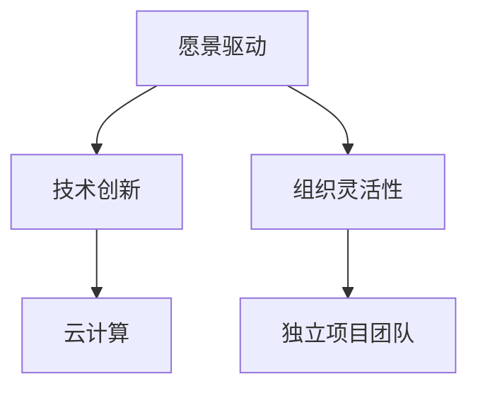
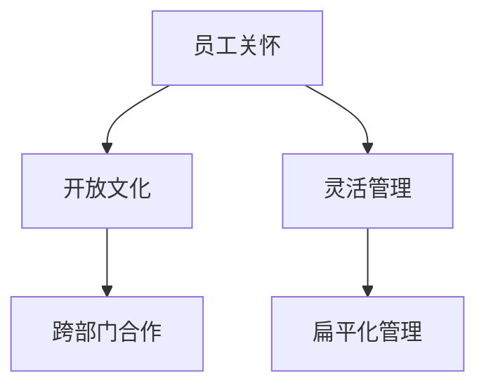
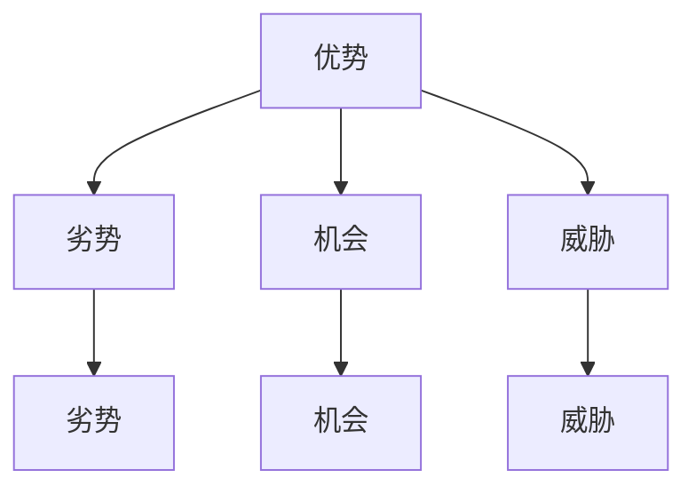
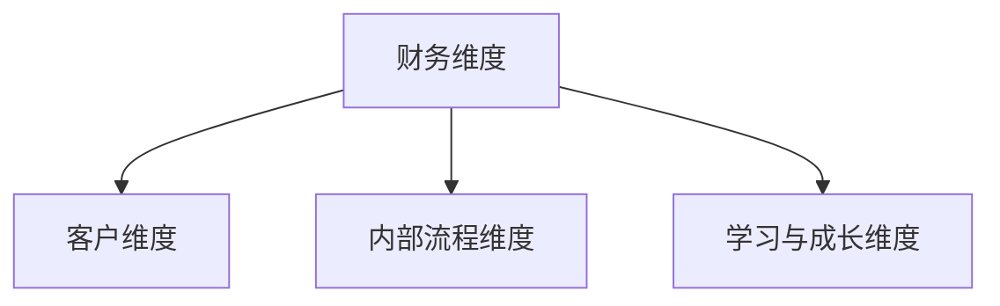

                 

### 第1章 领导力的本质

#### 1.1 领导力的定义与重要性

**领导力**是指引导和影响他人实现共同目标的能力。它不仅仅是管理团队，更是激发团队成员潜能、引导他们朝着正确方向前进的过程。领导力在组织中的重要性不可忽视，它是推动组织发展的核心动力。

首先，领导力能够激发员工的积极性和创造力，从而提高工作效率。在快速变化的环境中，领导者需要具备前瞻性思维，能够预见市场趋势和客户需求，从而指导团队做出正确的决策。其次，领导力有助于建立团队凝聚力，通过有效的沟通和协作，使团队成员在共同目标下形成合力，提高组织整体执行力。最后，领导力是组织创新的重要推动力。创新需要打破常规，而领导者的角色正是鼓励和引导团队尝试新事物、勇于突破。

在技术领域，领导力的重要性尤为突出。技术发展迅速，新技术层出不穷，技术人才的需求也在不断变化。具备领导力的技术专家不仅能够带领团队跟上技术发展的步伐，还能够通过创新推动技术进步。例如，在人工智能、大数据、云计算等前沿领域，领导者的作用尤为关键。他们需要不仅掌握技术本身，还要具备跨学科的视野，能够协调不同领域的技术专家，共同推动项目的成功。

#### 1.2 领导力的类型与风格

领导力可以分为多种类型，每种类型都有其独特的风格和适用场景。以下是几种常见的领导力类型：

- **命令式领导力**：领导者通过明确的指令和严格的控制来管理团队。这种领导力风格适用于需要快速决策和执行的紧急情况。

- **授权式领导力**：领导者赋予团队成员更多的自主权，让他们根据自己的判断做出决策。这种领导力风格有助于激发员工的创造力和责任感。

- **参与式领导力**：领导者鼓励团队成员参与决策过程，通过集思广益来达成共识。这种领导力风格适用于需要团队协作和创新的项目。

- **变革型领导力**：领导者通过激发团队成员的内在动机，引导他们追求更高的目标。这种领导力风格在推动组织变革和创新时尤为有效。

- **服务式领导力**：领导者将团队成员的需求放在首位，通过提供支持和资源来帮助他们实现目标。这种领导力风格有助于建立信任和合作关系。

选择合适的领导力类型和风格，取决于领导者的个人特质、团队的实际情况以及组织的整体目标。有效的领导者需要根据不同情况灵活调整自己的领导风格，以达到最佳效果。

#### 1.3 领导力的发展趋势

随着全球化和信息化的加速，领导力的发展也呈现出一些新的趋势：

- **多元化领导力**：在多元文化背景下，领导者需要具备跨文化的沟通和协调能力，能够理解和尊重不同文化背景的员工。

- **数字领导力**：随着数字化转型的深入推进，领导者需要掌握数字技术和数据分析能力，能够利用数据驱动决策，提升组织竞争力。

- **创新领导力**：在技术飞速发展的时代，领导者需要鼓励创新思维，推动组织持续创新，以保持竞争优势。

- **可持续领导力**：领导者需要关注企业的社会责任和可持续发展，推动企业实现经济效益和社会效益的双赢。

- **敏捷领导力**：在快速变化的市场环境中，领导者需要具备敏捷思维和快速响应能力，能够灵活调整战略和战术。

总之，领导力不是一成不变的，它需要随着环境的变化而不断调整和进化。领导者需要不断学习和成长，才能在变化中保持灵活，引领团队走向成功。

### 第2章 变化中的领导挑战

#### 2.1 快速变化的环境

在当今快速变化的环境中，领导者面临着前所未有的挑战。技术进步、市场动态、全球化等因素共同推动着环境的快速变化，对领导者的应变能力提出了更高的要求。

首先，技术进步带来了新的机遇和挑战。人工智能、大数据、云计算等新兴技术不断涌现，领导者需要不断更新自己的知识库，掌握最新的技术趋势，以便更好地指导团队。同时，技术的快速发展也带来了数据安全和隐私保护的问题，领导者需要确保团队在利用技术的同时，能够有效地保护数据安全。

其次，市场动态的快速变化要求领导者具备前瞻性思维和快速决策能力。市场需求不断变化，消费者偏好也在快速转变，领导者需要及时捕捉市场信息，调整战略，以保持竞争力。例如，在电子商务领域，领导者需要密切关注消费者的购物习惯和偏好，及时调整产品和服务策略，以满足市场需求。

最后，全球化带来了新的挑战和机遇。在全球化的背景下，领导者需要具备跨文化的沟通和协调能力，能够理解和尊重不同文化背景的员工。此外，全球化也带来了更多的竞争，领导者需要具备全球视野，能够应对国际市场的竞争压力。

#### 2.2 新的领导责任

在快速变化的环境中，领导者的责任也在不断扩展和变化。传统的领导责任主要集中在管理团队、制定战略和确保业务运营等方面。然而，在当前的环境下，领导者还需要承担以下新的责任：

首先，领导者需要成为变革的推动者。面对快速变化的环境，领导者需要积极推动组织变革，引导团队适应新的变化。这包括对现有流程和制度的重新审视，以及引入新的技术和管理方法。

其次，领导者需要成为团队的支持者。在变化中，员工可能会感到不确定和焦虑，领导者需要提供支持和指导，帮助员工克服困难，增强信心。这包括提供培训和学习机会，以及建立良好的沟通渠道，确保员工能够及时获取信息和支持。

最后，领导者需要成为组织的战略家。在快速变化的环境中，领导者需要具备战略思维，能够预见未来的发展趋势，制定长期的战略规划，确保组织能够在竞争中获得优势。

#### 2.3 团队协作的挑战

在快速变化的环境中，团队协作面临着新的挑战。首先，团队成员的知识和技能可能存在差异，这需要领导者具备有效的沟通和协调能力，确保团队成员能够有效地合作。其次，团队成员的地理位置可能分散，这增加了沟通和协作的难度，领导者需要利用虚拟团队工具和平台，提高团队协作效率。

此外，团队成员的工作压力和焦虑感可能会增加，领导者需要关注团队成员的心理健康，提供必要的支持和指导。最后，团队成员的流动性和不确定性也增加了团队协作的难度，领导者需要具备灵活的管理策略，确保团队能够在不断变化的环境中保持稳定和高效。

为了应对这些挑战，领导者可以采取以下措施：

1. **建立清晰的沟通机制**：通过定期会议、工作坊和即时通讯工具，确保团队成员能够及时获取信息，了解项目进展和目标。

2. **提供培训和学习机会**：帮助团队成员提升技能和知识，确保他们能够适应新的变化和要求。

3. **培养团队合作精神**：通过团队建设活动和跨部门合作项目，增强团队成员之间的信任和协作。

4. **关注团队成员的心理健康**：提供心理咨询和支持服务，帮助团队成员缓解压力，提高工作效率。

5. **建立灵活的工作安排**：根据团队成员的实际情况，提供灵活的工作时间和地点，确保团队协作不受地理位置的限制。

### 第3章 适应性领导力的核心要素

#### 3.1 自我认知

**自我认知**是适应性领导力的核心要素之一。领导者需要深入理解自己的性格、价值观、优点和缺点，以便更好地应对挑战和引导团队。以下是一些提高自我认知的方法：

- **反思**：定期花时间反思自己的行为和决策，分析哪些是有效的，哪些需要改进。
- **寻求反馈**：与同事、下属和上级进行定期沟通，了解他们对你的看法和建议。
- **心理测试**：通过性格测试和价值观评估，了解自己的性格特点和行为模式。
- **阅读和学习**：阅读有关领导力、心理学和自我发展的书籍，从他人的经验和观点中汲取智慧。

通过自我认知，领导者可以更清晰地了解自己的优势和劣势，从而在决策和团队管理中做出更明智的选择。例如，一个意识到自己在沟通方面有所欠缺的领导者，可能会主动参加沟通技巧的培训，以提高自己的沟通能力。

#### 3.2 情绪管理

情绪管理是适应性领导力的另一个关键要素。领导者需要能够控制自己的情绪，保持冷静和理性，即使在压力和挑战面前也不失稳重。以下是一些情绪管理的方法：

- **深呼吸**：在面对压力时，通过深呼吸来放松身体和心情。
- **积极思考**：尝试从积极的角度看待问题，避免过度悲观和消极情绪。
- **运动**：通过运动来释放压力，保持身心健康。
- **寻求支持**：与家人、朋友或专业人士交流，分享自己的情绪和困扰。
- **休息和放松**：确保有足够的休息时间，进行放松和充电。

良好的情绪管理不仅有助于提升领导者的个人魅力，还能够影响团队成员的情绪状态，营造积极向上的团队氛围。例如，一个能够保持情绪稳定的领导者，可以在团队面临困难时，给团队成员带来信心和支持，从而提高团队的整体士气。

#### 3.3 决策能力

决策能力是领导者必须具备的核心素质之一。在快速变化的环境中，领导者需要能够快速、准确和果断地做出决策，以确保团队和组织能够及时应对变化。以下是一些提高决策能力的方法：

- **收集信息**：在做出决策之前，领导者需要广泛收集相关信息，包括市场趋势、竞争对手动态和团队成员的意见。
- **分析评估**：对收集到的信息进行深入分析，评估各种可能的决策方案及其潜在风险和收益。
- **权衡利弊**：在多个决策方案之间进行权衡，选择最合适的方案。
- **果断执行**：一旦做出决策，领导者需要果断执行，并确保团队紧密配合。
- **反思调整**：在决策执行过程中，领导者需要不断反思和调整，根据实际情况进行灵活调整。

一个具备强大决策能力的领导者，能够在关键时刻为团队指明方向，确保团队在变化中保持稳定和高效。例如，在面对市场突变时，领导者能够迅速调整战略，制定有效的应对措施，从而帮助团队顺利度过危机。

#### 3.4 适应性领导力的综合应用

自我认知、情绪管理和决策能力这三个要素并不是孤立的，它们相互影响、相互促进，共同构成了适应性领导力的核心。领导者需要将这三个要素综合应用，以应对快速变化的环境和挑战。

- **自我认知**帮助领导者了解自己的优势和劣势，从而在决策和团队管理中做出更明智的选择。
- **情绪管理**使领导者能够保持冷静和理性，即使在压力下也能做出明智的决策。
- **决策能力**使领导者能够快速、准确和果断地做出决策，确保团队和组织能够及时应对变化。

通过综合应用这三个要素，领导者不仅能够提升自己的领导能力，还能够激发团队成员的潜力，推动团队和组织实现共同目标。例如，一个具备良好自我认知的领导者，能够根据团队成员的特点和需求，制定个性化的管理策略，从而提高团队的整体绩效。

### 第4章 培养适应性领导力的方法

#### 4.1 学习与反思

培养适应性领导力的第一步是**学习与反思**。在快速变化的环境中，领导者需要不断学习新知识、新技能，并不断反思自己的行为和决策，以不断提升自己的领导能力。

首先，领导者需要保持好奇心和求知欲，积极学习新知识。这包括阅读最新的行业报告、参加专业培训课程、参加行业会议和研讨会等。通过不断学习，领导者可以了解最新的技术趋势、市场动态和管理方法，从而在决策和团队管理中保持领先。

其次，领导者需要培养反思的习惯。反思不仅是回顾过去的行为和决策，更重要的是从中吸取经验教训，以便在未来做出更好的选择。领导者可以定期花时间反思自己的领导行为，思考哪些是有效的，哪些需要改进。此外，领导者还可以寻求他人的反馈和建议，从不同的角度看待自己的行为和决策。

为了提高反思的质量，领导者可以采取以下几种方法：

1. **写日记**：记录每天的工作和思考，包括成功和失败的经历。日记可以帮助领导者更好地理解自己的行为模式，从而进行有针对性的改进。
2. **定期回顾**：定期回顾过去一段时间的工作，总结成功和失败的经验，分析其中的原因。这可以帮助领导者不断优化自己的领导方法。
3. **寻求反馈**：与同事、下属和上级进行定期沟通，了解他们对你的看法和建议。通过外部的反馈，领导者可以更客观地评估自己的领导能力。
4. **情景模拟**：通过模拟不同的工作场景，思考如何应对各种挑战。这种方法可以帮助领导者提前准备好应对策略，提高应对实际问题的能力。

通过学习和反思，领导者可以不断提升自己的知识水平和领导能力，从而在变化中保持灵活和适应。

#### 4.2 倾听与沟通

在培养适应性领导力的过程中，**倾听与沟通**是至关重要的技能。有效的倾听和沟通不仅能够帮助领导者更好地理解团队成员的需求和意见，还能够建立信任和合作关系，推动团队高效协作。

首先，领导者需要学会有效倾听。倾听不仅仅是听到对方说的话，更重要的是理解对方的意图和感受。以下是一些提高倾听效果的方法：

1. **全神贯注**：在与团队成员交流时，领导者需要全神贯注，避免分心。这包括关闭手机、放下手中的工作，确保自己完全投入到对话中。
2. **主动提问**：通过提问来引导对话，帮助领导者更深入地理解对方的观点。提问不仅可以澄清问题，还可以展示领导者对团队成员的尊重和关注。
3. **保持开放态度**：领导者需要保持开放的心态，接受不同的意见和观点。即使某些观点与自己的看法不同，领导者也应该认真倾听，并从中寻找有价值的信息。
4. **肢体语言**：通过肢体语言表达自己的倾听态度，例如点头、微笑和眼神交流。这些肢体动作可以传递出领导者对对方的尊重和关注。

其次，领导者需要注重沟通技巧。有效的沟通不仅能够传达信息，还能够激发团队成员的积极性和创造力。以下是一些提高沟通效果的方法：

1. **明确目标**：在沟通前，领导者需要明确沟通的目标和预期结果。这可以帮助领导者有针对性地进行沟通，避免信息冗余和误解。
2. **简洁表达**：领导者需要用简洁明了的语言表达自己的观点和想法。避免使用复杂的术语和长篇大论，确保团队成员能够轻松理解。
3. **积极反馈**：在沟通过程中，领导者需要给予积极的反馈，鼓励团队成员分享自己的想法和建议。这不仅可以增强团队成员的自信心，还可以提高沟通的效率和质量。
4. **反馈与确认**：在沟通结束后，领导者需要与团队成员进行反馈和确认，确保双方对沟通内容的理解和期望是一致的。这可以帮助避免误解和冲突，提高沟通效果。

通过倾听和沟通，领导者可以更好地理解团队成员的需求和意见，建立信任和合作关系，推动团队高效协作。例如，在一个项目团队中，领导者通过倾听团队成员的意见，了解他们的需求和困惑，及时提供支持和资源，从而确保项目的顺利进行。

#### 4.3 风险管理与决策

在培养适应性领导力的过程中，**风险管理与决策**是至关重要的技能。领导者需要具备识别、评估和管理风险的能力，以便在变化中保持灵活和稳定。以下是一些提高风险管理能力和决策效果的方法：

首先，领导者需要学会**识别风险**。识别风险是风险管理的第一步，它要求领导者能够预见潜在的问题和挑战。以下是一些识别风险的方法：

1. **情景分析**：通过情景分析，领导者可以设想可能出现的各种情况，并评估每种情况的风险程度。这种方法可以帮助领导者提前做好准备，减少潜在风险的影响。
2. **历史数据**：通过分析过去项目或业务的历史数据，领导者可以识别出常见的风险点。例如，在某个项目过程中，技术问题是一个常见风险，领导者可以在未来的项目中重点关注这一点。
3. **专家咨询**：领导者可以寻求行业专家或内部资深员工的意见，了解他们对潜在风险的看法和建议。这种方法可以帮助领导者从不同的角度识别风险。

其次，领导者需要学会**评估风险**。评估风险是确定哪些风险需要重点关注和管理的步骤。以下是一些评估风险的方法：

1. **概率分析**：通过概率分析，领导者可以评估每种风险发生的可能性。这种方法可以帮助领导者确定哪些风险是最需要关注的。
2. **影响评估**：领导者需要评估每种风险可能对项目或业务造成的影响。例如，一个技术风险可能会影响项目的进度和质量，而一个市场风险可能会影响业务的盈利能力。
3. **风险矩阵**：通过风险矩阵，领导者可以将每种风险的概率和影响结合起来，确定其综合风险水平。这种方法可以帮助领导者更清晰地了解每种风险的重要性。

最后，领导者需要学会**管理风险**。管理风险是采取行动减轻风险影响的过程。以下是一些管理风险的方法：

1. **预防措施**：领导者可以采取预防措施，减少风险发生的可能性。例如，在技术项目中，领导者可以提前进行风险评估和测试，以减少技术问题的发生。
2. **应急计划**：领导者可以制定应急计划，以便在风险发生时能够迅速应对。例如，在市场风险发生时，领导者可以提前制定市场危机应对策略，以减少风险的影响。
3. **资源分配**：领导者可以合理分配资源，确保在风险发生时能够有足够的资源和能力进行应对。例如，在技术风险发生时，领导者可以提前安排额外的技术支持人员，以应对技术问题。

通过有效的风险管理与决策，领导者可以更好地应对变化，保持团队的稳定和高效。例如，在一个项目团队中，领导者通过识别、评估和管理风险，确保项目在面临技术问题或市场变化时能够迅速调整策略，从而顺利完成项目。

### 第5章 适应性领导力在实践中的应用

#### 5.1 案例分析

**案例分析**是理解适应性领导力在实践中的有效方式。通过具体案例，我们可以看到领导力在不同情境下的应用，并从中提取出有价值的学习经验。

**案例一：亚马逊的杰夫·贝佐斯**

杰夫·贝佐斯是亚马逊的创始人兼CEO，他的领导风格以创新和变革著称。在亚马逊的发展过程中，贝佐斯通过持续推动公司进行技术创新和业务扩展，展现了卓越的适应性领导力。

1. **背景介绍**：亚马逊成立于1994年，最初是一家在线书店。在贝佐斯的领导下，亚马逊逐渐扩展到电子产品、家居用品等多个领域，成为全球最大的电子商务公司之一。

2. **问题背景**：随着电子商务市场的不断扩大，亚马逊面临着激烈的市场竞争和不断变化的技术环境。如何保持竞争优势，推动公司持续创新，成为贝佐斯面临的重要挑战。

3. **问题描述**：贝佐斯需要制定和实施有效的战略，确保亚马逊在快速变化的市场环境中保持领先地位。

4. **问题解决**：贝佐斯采取了一系列适应性领导策略，包括：
   - **愿景驱动**：贝佐斯提出了“成为世界最以客户为中心的公司”的愿景，并以此驱动公司的战略决策和业务发展。
   - **技术创新**：贝佐斯积极投资新技术，如云计算（Amazon Web Services，简称AWS），使亚马逊在技术领域保持领先地位。
   - **组织灵活性**：贝佐斯鼓励公司内部创新，通过设立独立项目团队和鼓励员工提出新想法，保持组织的灵活性和创新能力。

5. **边界与外延**：贝佐斯的适应性领导力不仅适用于电子商务领域，也为其他行业的领导者提供了借鉴。例如，在人工智能和云计算领域，贝佐斯同样展现了卓越的领导能力。

6. **概念属性特征对比表格**：

| 特征               | 贝佐斯的领导力         | 其他领导力类型       |
|------------------|----------------------|----------------------|
| 愿景驱动           | 强调以客户为中心的愿景  | 以任务为中心的领导力   |
| 技术创新           | 积极投资新技术，推动创新  | 依赖传统方法和流程     |
| 组织灵活性         | 鼓励内部创新，保持组织灵活性 | 依赖固定结构和流程     |

7. **ER实体关系图架构的Mermaid流程图**：



**案例二：谷歌的拉里·佩奇和谢尔盖·布林**

拉里·佩奇和谢尔盖·布林是谷歌的联合创始人，他们的领导风格以开放、创新和员工福利著称。通过以下案例分析，我们可以看到适应性领导力在高科技企业中的应用。

1. **背景介绍**：谷歌成立于1998年，最初是一个基于网页排名的搜索引擎。在佩奇和布林的领导下，谷歌迅速成长为全球最大的科技公司之一。

2. **问题背景**：随着谷歌业务的扩展和竞争的加剧，如何保持公司创新能力和员工满意度，成为佩奇和布林面临的重要挑战。

3. **问题描述**：佩奇和布林需要制定和实施有效的领导策略，确保谷歌在快速变化的市场环境中保持竞争优势。

4. **问题解决**：佩奇和布林采取了一系列适应性领导策略，包括：
   - **员工关怀**：佩奇和布林重视员工福利，提供免费的食物、健身房和休闲娱乐设施，以提升员工满意度。
   - **开放文化**：谷歌鼓励员工自由表达意见，进行跨部门合作，以激发创新思维。
   - **灵活管理**：佩奇和布林采用扁平化管理结构，减少管理层级，提高决策效率。

5. **边界与外延**：佩奇和布林的适应性领导力不仅适用于高科技行业，也为其他行业的领导者提供了参考。

6. **概念属性特征对比表格**：

| 特征               | 佩奇和布林的领导力         | 其他领导力类型       |
|------------------|----------------------|----------------------|
| 员工关怀           | 重视员工福利和满意度       | 依赖绩效指标和考核     |
| 开放文化           | 鼓励员工自由表达和创新     | 依赖传统管理方法和流程 |
| 灵活管理           | 采用扁平化管理结构       | 依赖固定管理层次     |

7. **ER实体关系图架构的Mermaid流程图**：



通过以上案例分析，我们可以看到适应性领导力在具体实践中的应用，以及如何通过有效的领导策略推动企业的发展。这些案例不仅为其他领导者提供了借鉴，也为企业组织管理提供了有益的启示。

#### 5.2 领导力训练计划

为了在组织内部培养适应性领导力，制定和实施有效的领导力训练计划至关重要。以下是一个详细的领导力训练计划，包括培训内容、培训方式和培训评估方法。

**1. 培训内容**

领导力训练计划应涵盖多个关键领域，以确保领导者能够全面掌握适应性领导力所需的技能和知识。

- **自我认知**：通过心理测试和反思活动，帮助领导者了解自己的性格、价值观和领导风格。
- **情绪管理**：教授领导者如何通过深呼吸、积极思考和运动等方法管理自己的情绪。
- **决策能力**：通过模拟情境和案例分析，提高领导者在复杂情况下的决策能力和应对策略。
- **沟通技巧**：教授领导者如何进行有效倾听、清晰表达和建立信任。
- **团队建设**：通过团队合作活动和团队角色分析，培养领导者的团队协作能力。
- **风险管理**：通过风险识别、评估和管理方法的学习，提高领导者在不确定性环境中的应对能力。
- **持续学习**：鼓励领导者不断学习新知识和技能，以保持自身的竞争力和创新能力。

**2. 培训方式**

培训方式应多样化，以适应不同学习风格和需求。以下是一些有效的培训方式：

- **内部培训**：由公司内部资深员工或外部专家进行授课，分享经验和最佳实践。
- **外部培训**：安排领导者参加外部专业培训课程，如领导力工作坊、研讨会和行业会议。
- **在线学习**：利用在线学习平台和资源，提供灵活的学习时间和内容。
- **实践项目**：通过实际项目和工作任务，让领导者将所学知识应用到实际工作中。
- **教练辅导**：提供一对一的教练辅导，帮助领导者解决实际工作中的问题。

**3. 培训评估方法**

有效的培训评估方法可以确保领导力训练计划的实施效果，并不断优化培训内容和方法。

- **知识测试**：通过书面测试和知识问答，评估领导者对培训内容的掌握程度。
- **案例分析**：要求领导者分析实际案例，评估他们在解决问题和制定策略方面的能力。
- **角色扮演**：通过模拟情景，评估领导者在面对复杂情境时的决策能力和沟通技巧。
- **员工反馈**：收集员工的反馈意见，了解他们对领导者的评价和改进建议。
- **绩效评估**：结合领导者的工作绩效，评估培训对实际工作的影响。

通过以上领导力训练计划，组织可以系统地培养适应性领导力，提高领导者的综合素质和团队绩效。同时，持续的评估和反馈机制可以确保培训计划的持续改进和效果优化。

#### 5.3 组织变革中的领导力

在组织变革过程中，领导力扮演着至关重要的角色。有效的领导力不仅能够推动变革的顺利进行，还能够减少变革带来的负面影响，确保组织在变革中保持稳定和持续发展。以下是如何在组织变革中应用适应性领导力的具体措施。

**1. 明确变革目标**

在组织变革的初期，领导者需要明确变革的目标和预期成果。这包括确定变革的原因、目标受众、时间表和资源需求。通过明确变革目标，领导者可以更好地规划变革过程，确保所有团队成员都明确变革的方向和目的。

**2. 沟通与宣传**

变革的成功离不开有效的沟通与宣传。领导者需要通过多种渠道和方式，与员工沟通变革的原因、目标和预期影响。例如，通过会议、内部邮件、公告栏和社交媒体等，确保所有员工都能够了解变革的相关信息。同时，领导者需要积极回应员工的疑问和担忧，建立信任和共识。

**3. 培养变革支持者**

在组织变革过程中，寻找并培养变革的支持者至关重要。这些支持者可以是团队成员、管理层或外部顾问，他们能够为变革提供积极的影响和支持。领导者可以通过提供培训、激励和资源，鼓励员工成为变革的推动者，提高变革的接受度和执行力。

**4. 管理变革阻力**

变革往往伴随着阻力和挑战。领导者需要识别和管理变革中的阻力，采取适当的策略和措施来应对。这包括了解员工的担忧和抵触情绪，提供心理支持，制定合理的变革计划和时间表，确保变革的逐步推进。

**5. 促进团队协作**

在变革过程中，团队协作尤为重要。领导者需要通过有效的团队建设活动和跨部门合作项目，增强团队成员之间的信任和合作。这可以通过定期会议、团队建设活动和工作坊等形式实现，确保团队成员在共同目标下协同工作。

**6. 持续监督和反馈**

变革是一个持续的过程，领导者需要持续监督和反馈变革的进展和效果。通过定期评估和调整变革计划，领导者可以及时发现和解决潜在问题，确保变革的顺利进行。同时，领导者需要鼓励员工提供反馈和建议，不断优化变革方案。

**7. 奖励与激励机制**

为了激励员工积极参与变革，领导者需要建立有效的奖励和激励机制。这可以通过奖金、晋升、荣誉和其他形式实现，确保员工在变革中能够获得公平的回报和认可。

通过以上措施，领导者可以在组织变革中有效应用适应性领导力，推动变革的顺利进行，确保组织在变革中保持稳定和持续发展。

### 第6章 领导力工具与技术

#### 6.1 SWOT分析

**SWOT分析**是一种常用的战略规划工具，用于评估组织的优势、劣势、机会和威胁。通过SWOT分析，领导者可以更好地了解组织的整体状况，制定有效的战略规划。

**定义**：SWOT分析是一种战略分析工具，它通过评估组织的优势（Strengths）、劣势（Weaknesses）、机会（Opportunities）和威胁（Threats），帮助领导者制定战略决策。

**应用场景**：SWOT分析适用于各种类型的组织，无论是企业、政府机构还是非营利组织，都可以通过SWOT分析来评估自身的战略定位和未来发展。

**步骤**：

1. **优势（Strengths）**：识别组织内部的优势，例如：
   - 技术优势：组织拥有的独特技术或专利。
   - 资源优势：组织拥有的资源，如资金、人力、设备等。
   - 品牌优势：组织的品牌知名度和美誉度。
   - 经验优势：组织在特定领域积累的丰富经验。

2. **劣势（Weaknesses）**：识别组织内部的劣势，例如：
   - 技术劣势：组织在技术方面的不足或落后。
   - 资源劣势：组织在资金、人力、设备等方面的不足。
   - 品牌劣势：组织品牌知名度和影响力不足。
   - 经验劣势：组织在特定领域缺乏经验或知识。

3. **机会（Opportunities）**：识别外部环境中的机会，例如：
   - 市场机会：市场需求增长或变化，为组织带来新的商业机会。
   - 技术机会：新技术的发展和应用，为组织带来新的技术优势。
   - 政策机会：政府政策支持或变化，为组织提供新的发展机遇。
   - 联合机会：与其他组织的合作或联盟，共同开拓市场。

4. **威胁（Threats）**：识别外部环境中的威胁，例如：
   - 竞争威胁：竞争对手的竞争压力和市场变化。
   - 技术威胁：新技术的发展和应用，可能对组织的现有业务造成威胁。
   - 政策威胁：政府政策变化或不确定性，可能影响组织的运营和发展。
   - 经济威胁：经济环境的变化，可能影响组织的营收和盈利能力。

**Mermaid流程图**：



**Python代码示例**：

```python
# SWOT分析示例

# 定义优势、劣势、机会和威胁
strengths = ["技术优势", "资源优势", "品牌优势", "经验优势"]
weaknesses = ["技术劣势", "资源劣势", "品牌劣势", "经验劣势"]
opportunities = ["市场需求增长", "新技术应用", "政府政策支持", "联合机会"]
threats = ["竞争压力", "技术威胁", "政策威胁", "经济威胁"]

# 打印SWOT分析结果
print("优势：", strengths)
print("劣势：", weaknesses)
print("机会：", opportunities)
print("威胁：", threats)
```

通过SWOT分析，领导者可以全面了解组织的内外部环境，从而制定出更科学、更有效的战略规划。

#### 6.2 平衡计分卡

**平衡计分卡**（Balanced Scorecard，BSC）是一种综合性的战略管理工具，它帮助组织从多个维度（财务、客户、内部流程、学习与成长）评估绩效，确保组织实现长期目标。

**定义**：平衡计分卡是一种绩效管理工具，它通过四个维度（财务、客户、内部流程、学习与成长）来评估组织的绩效，确保组织在实现短期目标的同时，不偏离长期战略。

**应用场景**：平衡计分卡适用于各种类型的组织，特别是在制定和实施长期战略时，通过平衡计分卡可以确保组织的战略目标得到全面和有效的执行。

**步骤**：

1. **财务维度**：评估组织的财务状况，包括利润、成本、投资回报率等关键指标。
   - 目标：提高盈利能力、降低成本、增加收入。

2. **客户维度**：评估组织在满足客户需求和提升客户满意度方面的表现，包括市场份额、客户保留率、客户满意度等。
   - 目标：提升客户满意度、增加市场份额。

3. **内部流程维度**：评估组织内部流程的效率和质量，包括生产效率、供应链管理、产品和服务质量等。
   - 目标：优化内部流程、提高生产效率。

4. **学习与成长维度**：评估组织在员工培训、知识管理、技术创新等方面的投入和效果，包括员工满意度、员工流失率、创新能力等。
   - 目标：提升员工能力、增强组织创新能力。

**Mermaid流程图**：



**Python代码示例**：

```python
# 平衡计分卡示例

# 定义四个维度的目标
financial_goals = ["提高盈利能力", "降低成本", "增加收入"]
customer_goals = ["提升客户满意度", "增加市场份额"]
internal_process_goals = ["优化内部流程", "提高生产效率"]
learning_growth_goals = ["提升员工能力", "增强组织创新能力"]

# 打印平衡计分卡目标
print("财务维度目标：", financial_goals)
print("客户维度目标：", customer_goals)
print("内部流程维度目标：", internal_process_goals)
print("学习与成长维度目标：", learning_growth_goals)
```

通过平衡计分卡，领导者可以全面评估组织的绩效，确保各个维度目标的实现，从而推动组织的持续发展和成长。

### 第7章 领导力提升技巧

#### 7.1 时间管理

时间管理是领导者提升工作效率和实现目标的关键技巧。通过有效的时间管理，领导者可以更好地平衡工作与生活，提高工作效率，实现个人和组织的长期目标。

**1. 制定优先级**

领导者需要明确任务的优先级，将精力集中在最重要和最紧急的任务上。使用**艾森豪威尔矩阵**（Eisenhower Matrix）是一种有效的优先级管理方法。艾森豪威尔矩阵将任务分为四个象限：紧急且重要、紧急但不重要、不紧急但重要、不紧急且不重要。领导者应该优先处理紧急且重要的任务，然后是重要但不紧急的任务。

**2. 制定计划**

制定详细的计划可以帮助领导者更好地管理时间。领导者可以使用**甘特图**（Gantt Chart）来可视化项目进度和任务分配。甘特图可以展示每个任务的开始和结束时间，以及任务之间的依赖关系，从而帮助领导者合理安排时间。

**3. 避免拖延**

拖延是时间管理的大敌。领导者可以通过以下方法避免拖延：
   - **设定具体目标**：明确任务的目标和时间期限，避免模糊不清的目标。
   - **分解任务**：将大任务分解为小任务，逐步完成，减少压力。
   - **使用时间块**：为每个任务分配特定的时间段，专注于任务的完成，避免分心。

**4. 学会拒绝**

领导者需要学会拒绝那些不重要或不紧急的请求，以确保自己有足够的时间处理重要任务。这需要领导者具备良好的沟通能力和决策能力，能够清楚地表达自己的立场和理由。

**5. 利用心智助手**

使用智能助手或日程管理应用程序可以帮助领导者更好地管理时间和任务。这些工具可以自动提醒任务的时间、重要事件的日期，以及即将到来的会议，从而帮助领导者更好地规划时间。

#### 7.2 人际关系管理

人际关系管理是领导者成功的关键因素之一。通过有效的人际关系管理，领导者可以建立良好的团队氛围，增强团队的凝聚力和协作能力。

**1. 建立信任**

建立信任是人际关系管理的核心。领导者可以通过以下方式建立信任：
   - **诚信**：始终保持诚实和透明，对自己的承诺负责。
   - **尊重**：尊重团队成员的观点和意见，给予他们发言和参与决策的机会。
   - **支持**：在团队成员需要帮助时提供支持，帮助他们克服困难。

**2. 沟通与反馈**

有效的沟通和反馈是建立良好人际关系的基础。领导者可以通过以下方法改善沟通和反馈：
   - **积极倾听**：倾听团队成员的需求和意见，理解他们的立场和感受。
   - **清晰表达**：使用简洁明了的语言表达自己的观点和想法，避免歧义和误解。
   - **定期反馈**：定期与团队成员进行一对一的沟通，提供反馈和指导，帮助他们改进工作。

**3. 解决冲突**

冲突是人际关系中不可避免的一部分。领导者需要学会有效地解决冲突，以维护团队的和谐和稳定。以下是一些解决冲突的方法：
   - **理解**：尝试从对方的角度理解冲突的原因，寻找共同点。
   - **倾听**：倾听双方的意见，确保每个人都能够表达自己的观点。
   - **寻求共识**：通过协商和妥协，寻找双方都能接受的解决方案。

**4. 赞赏与激励**

领导者需要及时赞赏和激励团队成员，以增强他们的积极性和归属感。以下是一些赞赏和激励的方法：
   - **公开表扬**：在团队会议上公开表扬团队成员的成就和贡献。
   - **提供奖励**：为表现出色的团队成员提供奖金、晋升或其他形式的奖励。
   - **个性化关怀**：关注团队成员的个人需求和兴趣，提供个性化的支持和帮助。

通过以上人际关系管理技巧，领导者可以建立积极向上的团队氛围，提高团队协作效率和绩效。

#### 7.3 团队建设

团队建设是提升团队协作能力和绩效的关键环节。通过有效的团队建设活动，领导者可以增强团队成员之间的信任和合作，提高团队的凝聚力和战斗力。

**1. 定期团队建设活动**

定期组织团队建设活动可以帮助团队成员放松身心，增强团队凝聚力。以下是一些常见的团队建设活动：
   - **团队拓展训练**：通过户外拓展训练，如攀岩、徒步等，增强团队成员的信任和协作能力。
   - **团队聚餐**：组织团队成员一起聚餐，增进彼此的了解和友谊。
   - **团队竞赛**：组织团队竞赛活动，如运动会、篮球赛等，增强团队竞争意识和团队精神。

**2. 团队角色分析**

了解团队成员的角色和个性特点，可以帮助领导者更好地分配任务和协调团队工作。以下是一些常见的团队角色：
   - **执行者**：负责执行任务和计划，确保项目按时完成。
   - **协调者**：负责协调团队成员的工作，确保项目顺利进行。
   - **创新者**：负责提出新的想法和创意，推动团队创新。
   - **支持者**：负责提供支持和鼓励，帮助团队成员克服困难。

通过团队角色分析，领导者可以更好地了解每个成员的优势和不足，合理安排工作任务，提高团队的整体绩效。

**3. 团队文化建设**

团队文化建设是团队建设的重要组成部分。通过建立共同的目标和价值观，领导者可以增强团队成员的归属感和责任感。以下是一些团队文化建设的方法：
   - **共同目标**：明确团队的目标和愿景，确保所有成员都朝着同一个方向努力。
   - **价值观**：建立团队的共同价值观，如诚信、责任、创新等，引导团队成员的行为和决策。
   - **荣誉制度**：建立荣誉制度，表彰和奖励在团队中表现突出的成员，激励他们继续努力。

通过团队建设，领导者可以打造一个高效、协作和有战斗力的团队，从而提高组织的整体绩效。

### 第8章 领导力与个人发展

#### 8.1 职业生涯规划

职业生涯规划是领导者个人发展的重要组成部分。通过合理的职业生涯规划，领导者可以明确自己的职业目标和发展路径，实现个人价值和职业成长。

**1. 确定职业目标**

领导者需要明确自己的职业目标，包括短期和长期目标。短期目标可以是一年内要完成的任务和成就，长期目标可以是五年或十年内要达到的职业高度。明确职业目标可以帮助领导者更好地规划自己的职业生涯。

**2. 分析个人优势与劣势**

在制定职业生涯规划时，领导者需要分析自己的优势与劣势。了解自己的优势和劣势，可以帮助领导者更好地利用自己的优势，同时有针对性地提升自己的劣势。例如，一个在技术领域有优势的领导者，可以通过参加培训和学习，提升自己的管理能力和领导力。

**3. 制定发展计划**

根据职业目标和自身优势与劣势，领导者可以制定具体的发展计划。发展计划应包括学习目标、技能提升计划、工作经验积累等。例如，一个希望成为高级管理者的领导者，可以通过参加高级管理培训课程、积累丰富的管理经验，以及提升自己的沟通和决策能力，来实现职业目标。

**4. 持续学习和成长**

职业生涯规划不仅仅是短期目标的实现，更是长期学习和成长的过程。领导者需要保持持续学习和成长的心态，不断更新自己的知识体系和技能，以适应快速变化的工作环境。通过参加培训、阅读书籍、交流经验等途径，领导者可以不断提升自己的能力和素质。

#### 8.2 自我提升与持续学习

自我提升和持续学习是领导者个人发展的关键。通过自我提升和持续学习，领导者可以不断拓展自己的知识领域，提高领导能力和专业素养，从而在职业生涯中保持竞争优势。

**1. 培养学习习惯**

领导者需要培养良好的学习习惯，持续学习新知识和技能。可以通过以下方式培养学习习惯：
   - **定期阅读**：定期阅读专业书籍、行业报告和学术论文，了解最新的行业动态和研究成果。
   - **参加培训**：参加相关的培训课程和工作坊，学习新的管理工具和技术。
   - **交流经验**：与同行和专家进行交流，分享经验和观点，互相学习和启发。

**2. 提升关键技能**

领导者需要根据职业发展的需要，提升关键技能。关键技能包括沟通能力、决策能力、团队管理能力、领导力等。可以通过以下方式提升关键技能：
   - **实践锻炼**：通过实际工作项目和挑战，锻炼和提升关键技能。
   - **学习榜样**：观察和学习优秀领导者的行为和决策，借鉴他们的成功经验。
   - **寻求指导**：寻求导师或专业人士的指导，获得针对性和个性化的提升建议。

**3. 创新思维**

创新思维是领导者应对快速变化环境的重要能力。通过以下方式培养创新思维：
   - **打破常规**：勇于挑战传统思维模式，尝试新的方法和策略。
   - **鼓励创新**：营造鼓励创新的文化氛围，激发团队成员的创新潜力。
   - **跨学科学习**：跨学科学习，拓展视野，从不同领域的知识中汲取灵感。

#### 8.3 领导力与个人成长

领导力与个人成长密不可分。通过提升领导力，领导者不仅能够更好地应对工作挑战，还能实现个人成长和价值提升。

**1. 增强自我认知**

自我认知是领导力的基础。领导者需要深入了解自己的性格、价值观、优点和缺点。通过自我认知，领导者可以更好地理解自己的行为模式，找到提升领导力的方法和途径。

**2. 培养积极心态**

积极心态是领导者应对挑战和困难的关键。领导者需要培养乐观、自信和坚韧的心态，以积极的态度面对工作中的挑战。通过以下方式培养积极心态：
   - **正面思考**：尝试从积极的角度看待问题，寻找解决方案。
   - **自我激励**：设定目标，不断鼓励自己，保持积极的心态。
   - **情绪管理**：学会管理自己的情绪，保持冷静和理性，避免情绪波动。

**3. 不断提升能力**

领导者需要不断提升自己的能力，以适应快速变化的工作环境。通过以下方式不断提升能力：
   - **终身学习**：持续学习新知识和技能，保持自身的竞争力。
   - **实践经验**：通过实际工作项目和挑战，锻炼和提升自己的能力。
   - **反思与总结**：定期反思自己的工作经历，总结经验教训，不断提升自己的能力。

通过领导力与个人成长的结合，领导者不仅能够提升自己的领导能力和专业素养，还能实现个人价值和职业成长。

### 第9章 适应性领导力的重要性

#### 9.1 企业发展的关键因素

在当今快速变化的市场环境中，适应性领导力成为企业发展的关键因素之一。适应性领导力不仅决定了企业的生存和发展，还影响着企业的创新能力和市场竞争力。

首先，**创新能力**是企业发展的核心驱动力。一个具备适应性领导力的领导者能够激发团队的创造力和创新思维，推动企业不断推出新产品和服务，以满足市场的变化和客户的需求。例如，谷歌的拉里·佩奇和谢尔盖·布林通过鼓励内部创新，推动了谷歌在搜索引擎、云计算和人工智能等领域的突破，从而保持了企业的领先地位。

其次，**市场竞争力**是企业发展的关键指标。适应性领导力使领导者能够快速应对市场变化和竞争压力，调整企业的战略和战术，以保持竞争优势。例如，亚马逊的杰夫·贝佐斯通过持续推动技术创新和业务扩展，使亚马逊在电子商务市场中始终保持领先地位。

此外，**团队协作**是企业发展的基石。一个具备适应性领导力的领导者能够建立高效的团队，激发团队成员的潜力，提高团队的整体绩效。通过倾听与沟通、团队建设等活动，领导者可以增强团队的凝聚力和协作能力，从而推动企业的快速发展。

#### 9.2 适应性领导力的长期影响

适应性领导力不仅对企业短期发展有显著影响，还具有长期的深远影响。以下是适应性领导力的几个长期影响：

首先，**组织文化**的塑造。适应性领导力有助于建立积极向上的组织文化，鼓励创新、学习和合作。通过倡导开放、透明和包容的文化，领导者可以激发员工的积极性和创造力，提高组织的整体绩效。

其次，**人才储备**的优化。适应性领导力能够吸引和留住优秀的人才。领导者通过有效的沟通和激励，让员工感受到组织的关怀和信任，从而提高员工的满意度和忠诚度。这有助于企业在激烈的市场竞争中保持人才优势。

最后，**持续发展**的能力。适应性领导力使企业能够适应不断变化的环境，持续改进和创新，保持竞争优势。通过不断学习和适应，企业可以持续提升自身的竞争力和市场地位，实现长期稳定的发展。

#### 9.3 适应性领导力与社会责任

在当今社会，企业不仅需要追求经济效益，还必须承担社会责任。适应性领导力在企业社会责任（CSR）方面也发挥着重要作用。以下是如何通过适应性领导力实现社会责任的几个方面：

首先，**环境保护**。适应性领导力使企业能够关注环境保护，采取可持续发展的措施。领导者可以推动企业减少资源消耗、降低碳排放，参与环保项目，为社会创造绿色价值。

其次，**社会公益**。适应性领导力鼓励企业积极参与社会公益事业，通过捐赠、志愿服务等形式，回馈社会。领导者可以通过与企业价值观相符的社会责任项目，提升企业的社会形象和品牌价值。

最后，**员工福利**。适应性领导力关注员工的身心健康和职业发展，通过提供良好的工作环境、培训机会和福利待遇，提升员工的满意度和幸福感。这不仅有助于企业吸引和留住人才，还能促进社会的和谐发展。

通过适应性领导力，企业可以在追求经济效益的同时，积极履行社会责任，实现可持续发展。

### 第10章 未来领导力的展望

#### 10.1 新兴技术对领导力的影响

随着新兴技术的不断发展，领导力也在不断演变。人工智能、大数据、区块链等技术的普及，对领导力带来了深远的影响。

首先，**人工智能**（AI）的兴起，使得领导者需要具备新的技能和知识。AI技术可以帮助领导者更好地进行数据分析和决策，提高工作效率。例如，通过AI算法，领导者可以预测市场趋势、优化业务流程，从而做出更明智的决策。同时，AI技术也要求领导者具备一定的技术背景，以便更好地理解和应用这些工具。

其次，**大数据**技术的应用，使得领导者需要具备更强的数据分析和解读能力。大数据不仅提供了丰富的信息资源，也带来了数据隐私和安全等问题。领导者需要能够有效管理和利用大数据，同时确保数据的安全和合规。此外，大数据的实时性和复杂性，也要求领导者具备快速决策和应对变化的能力。

最后，**区块链**技术的兴起，为领导力带来了新的挑战和机遇。区块链技术以其去中心化、不可篡改的特点，为数据的存储和处理提供了新的解决方案。领导者需要关注区块链技术的发展趋势，了解其应用场景，以便在组织内部推广和应用。

#### 10.2 多样性与包容性的领导力

多样性与包容性已成为现代领导力的关键要素。随着全球化和文化多元化的发展，领导者需要具备理解和尊重不同文化背景和价值观的能力。

首先，**多样性与包容性**有助于提高团队的创造力和创新能力。一个多元化的团队，可以汇集不同的观点和想法，从而激发更多的创新思维。领导者需要鼓励团队成员表达自己的观点，尊重彼此的差异，共同创造价值。

其次，**多样性与包容性**有助于提升团队的整体绩效。通过包容不同的背景和观点，领导者可以更好地理解和满足团队成员的需求，从而提高员工的满意度和忠诚度。此外，包容性文化也有助于减少冲突和误解，提高团队的凝聚力和协作能力。

最后，**多样性与包容性**是社会责任的一部分。作为领导者，有责任推动组织的多样性和包容性，为社会创造更多的价值。通过倡导平等、尊重和包容，领导者可以树立良好的社会形象，提升企业的品牌价值。

#### 10.3 领导力发展的趋势与挑战

随着全球化和技术革命的推进，领导力发展也呈现出一些新的趋势和挑战。

首先，**领导力的数字化转型**成为趋势。随着数字化技术的广泛应用，领导者需要具备数字素养，了解和掌握数字化工具和方法，以便更好地应对数字化时代的挑战。此外，数字化领导力也要求领导者具备快速适应和变革的能力，以保持组织的活力和竞争力。

其次，**全球视野**成为领导者必备的能力。在全球化的背景下，领导者需要具备跨文化的沟通和协调能力，能够理解和尊重不同文化背景的员工和客户。这要求领导者具备开放的心态和全球视野，以适应全球市场的变化。

最后，**可持续领导力**受到越来越多的关注。随着环境问题的日益严重，领导者需要关注企业的社会责任和可持续发展，推动企业实现经济效益和社会效益的双赢。可持续领导力要求领导者具备环保意识和社会责任感，以实现长期的可持续发展。

面对这些趋势和挑战，领导者需要不断学习和成长，提升自身的领导力和适应能力，以应对未来的变化和挑战。

## 总结

通过本文的详细探讨，我们深入了解了**领导力与适应性**的重要性，以及如何在快速变化的环境中培养和提升适应性领导力。首先，我们阐述了领导力的本质和重要性，包括领导力的定义、类型与风格，以及领导力的发展趋势。接着，我们分析了变化中的领导挑战，如快速变化的环境、新的领导责任和团队协作的挑战。这些挑战要求领导者具备更高的适应性和灵活应变能力。

在适应性领导力的核心要素部分，我们详细讨论了自我认知、情绪管理、决策能力和团队合作的重要性。通过自我认知，领导者可以更好地了解自己的优势和劣势；情绪管理则帮助领导者保持冷静和理性，即使在压力下也能做出明智的决策；决策能力是领导者必须具备的核心素质之一，能够在快速变化的环境中做出正确的决策；团队合作则有助于建立强大的团队凝聚力，提高整体执行力。

随后，我们介绍了培养适应性领导力的方法，包括学习与反思、倾听与沟通、风险管理与决策。通过学习与反思，领导者可以不断提升自己的知识和能力；倾听与沟通则有助于建立信任和合作关系，推动团队高效协作；风险管理与决策能力是领导者应对变化和挑战的关键。

在实践应用部分，我们通过具体案例分析，展示了适应性领导力在现实场景中的应用，以及如何通过有效的领导力训练计划和组织变革中的领导力措施，提升领导者的适应性和领导力水平。

最后，我们探讨了领导力提升的具体工具与技巧，如SWOT分析、平衡计分卡、时间管理、人际关系管理和团队建设等，以及领导力与个人发展的关系。这些工具与技巧不仅有助于领导者提升自身能力，还能推动组织的持续发展。

展望未来，新兴技术、多样性与包容性以及数字化领导力将成为领导力发展的关键趋势和挑战。领导者需要不断学习和适应，以应对未来的变化和挑战，保持组织的竞争优势。

通过本文的深入探讨，我们希望读者能够对领导力与适应性有更深刻的理解，并能够在实际工作中运用这些理论和方法，提升自身的领导力水平，为组织的持续发展贡献自己的力量。

## 作者信息

作者：AI天才研究院/AI Genius Institute & 禅与计算机程序设计艺术 /Zen And The Art of Computer Programming

AI天才研究院（AI Genius Institute）致力于推动人工智能和计算机科学领域的研究与应用，汇聚全球顶尖的科学家和工程师，共同探索人工智能的未来。研究院专注于技术创新和人才培养，旨在培养下一代人工智能领域的杰出人才。

《禅与计算机程序设计艺术》是一部经典的技术书籍，深入探讨了计算机科学和哲学之间的关系，提出了一种独特的编程哲学和思考方式，影响了无数编程爱好者和专业人士。本书的作者以其独特的见解和深刻的思考，为读者提供了宝贵的编程经验和智慧。

两者结合，旨在通过技术创新和哲学思考，推动人工智能和计算机科学领域的发展，为未来的科技和创新奠定坚实的基础。

