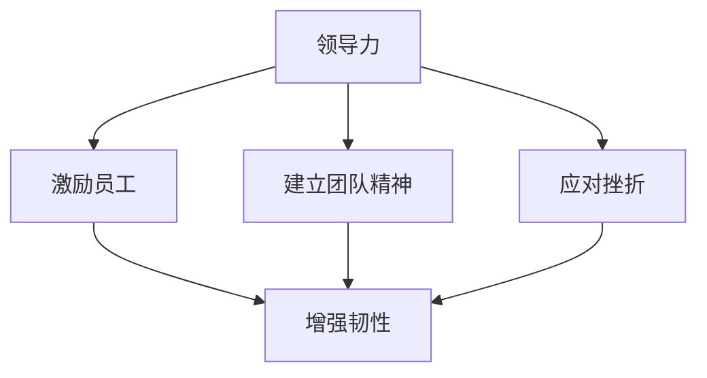
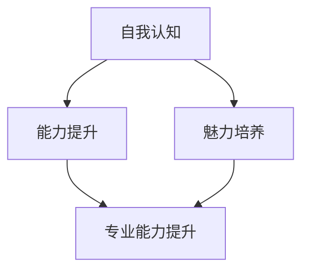
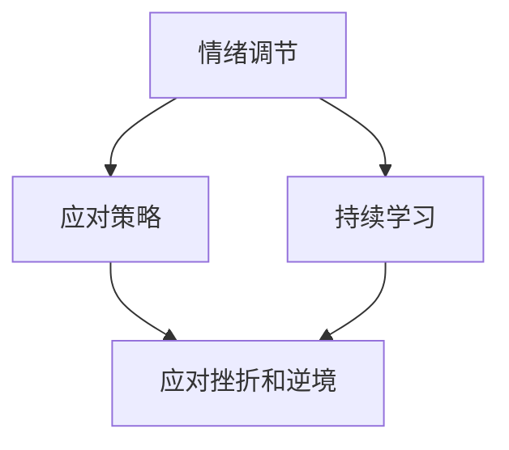
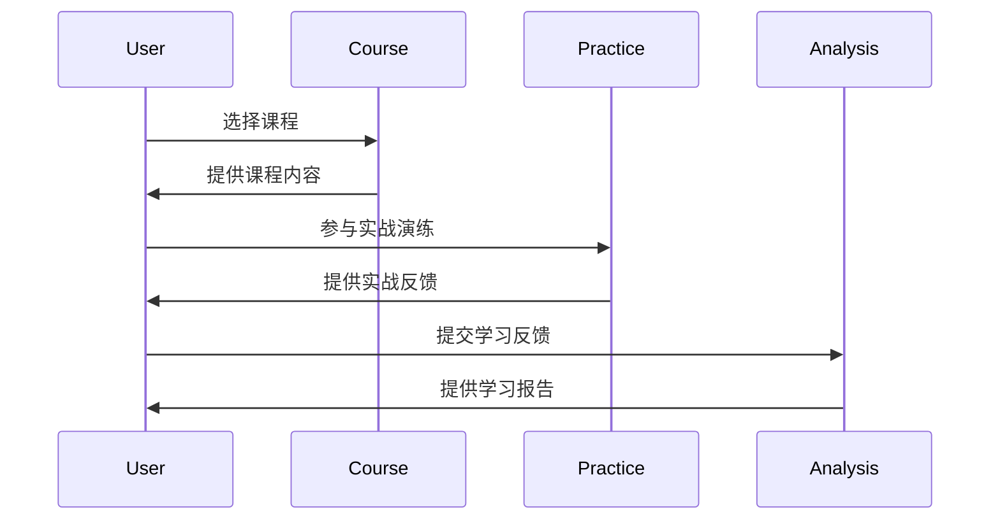
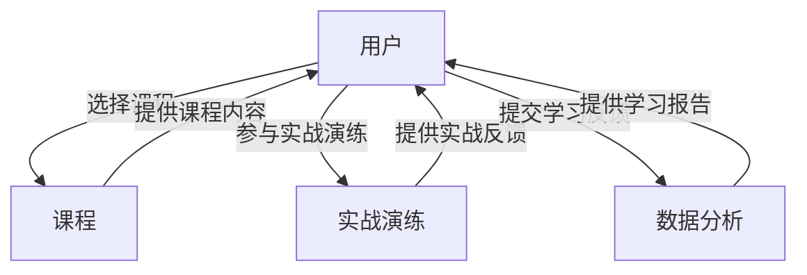

                 


### 引言

**领导力与韧性：面对挫折时的坚持能力**

在充满不确定性和变革的当今世界，领导力和韧性成为企业成功和个人成就的关键因素。本文旨在探讨领导力与韧性的概念、重要性以及在实际应用中的培养策略。我们将通过逐步分析，深入理解这两个概念，并探讨如何在面对挫折时保持坚持能力。

#### 关键词

- **领导力**
- **韧性**
- **挫折应对**
- **坚持能力**
- **企业应用**
- **个人成长**

#### 摘要

本文首先介绍了领导力和韧性的基本概念及其重要性，然后探讨了领导力模型与理论，以及韧性的定义与培养方法。接着，我们分析了挫折的类型与影响，以及应对挫折的策略。随后，我们详细讨论了坚持能力的重要性及其发展，最后提出了培养坚持能力的策略。通过这些讨论，我们希望能够为读者提供关于领导力与韧性在实践中的见解和启示。

### 第一部分：理解领导力和韧性

#### 第1章：领导力与韧性的基本概念

**1.1 领导力的定义与要素**

领导力是指领导者通过影响力、能力和魅力来引导和激励他人实现共同目标的能力。领导力的要素包括：

- **影响力**：领导者能够影响他人行为和思维的能力。
- **能力**：领导者具备的技能和知识，能够应对复杂问题和挑战。
- **魅力**：领导者具有的吸引力和激励力，能够激发团队成员的积极性和创造力。

**1.2 韧性的概念与重要性**

韧性是指个体或组织在面对逆境和压力时，能够迅速适应、恢复并继续前进的能力。韧性的重要性体现在以下几个方面：

- **应对挫折**：韧性使人能够在面对挫折时保持冷静，寻找解决问题的方法。
- **适应变化**：韧性使人能够快速适应环境的变化，抓住新的机遇。
- **促进成长**：韧性使人能够在困境中不断学习和成长，提升个人和组织的竞争力。

**1.3 领导力与韧性的联系**

领导力与韧性之间存在紧密的联系。领导力可以通过以下方式培养韧性：

- **激励员工**：领导者通过鼓励和支持，激发员工的积极性和创造力，增强韧性。
- **建立团队精神**：领导者通过建立积极的团队氛围，增强团队成员之间的协作和信任，提高韧性。
- **应对挫折**：领导者通过自身的示范和指导，帮助员工应对挫折，增强韧性。

#### 第2章：领导力模型与理论

**2.1 经典领导力模型**

- **领导生命周期理论**：该理论认为领导风格应根据下属的成熟度进行调整。下属成熟度越高，领导者应采用授权式领导风格；成熟度越低，领导者应采用指导式领导风格。
- **服务领导理论**：该理论强调领导者应该首先关注团队成员的需求，提供支持和资源，以实现共同目标。
- **领导行为理论**：该理论认为领导者的行为风格对团队绩效有重要影响，包括指导行为、支持行为和参与行为。

**2.2 领导力发展理论**

- **赛夫里安领导力发展模型**：该模型将领导力发展分为五个阶段，包括自我认知、情境意识、团队合作、战略思考和领导影响力。
- **赫赛领导力发展模型**：该模型将领导力发展分为四个阶段，包括依赖型领导、任务型领导、关系型领导和战略型领导。

**2.3 领导力研究最新趋势**

- **领导力与人工智能**：随着人工智能技术的发展，领导力也需要适应新的环境，包括数据驱动决策、自动化流程和智能化管理。
- **领导力与组织文化**：领导力与组织文化相互影响，优秀的领导力能够塑造积极的组织文化，促进组织发展。

#### 第3章：韧性的定义与培养

**3.1 韧性的定义与特征**

韧性是一种心理和情绪能力，使个体能够在逆境中保持积极心态，快速适应和恢复。韧性的特征包括：

- **适应力**：个体能够迅速适应环境的变化和压力。
- **情绪调节**：个体能够有效管理和调节自己的情绪。
- **自我效能感**：个体对自己应对挑战和实现目标的能力有信心。

**3.2 韧性的培养方法**

- **心理韧性训练**：通过专业的训练，提高个体的心理韧性，包括认知重构、情绪调节技巧和应对策略。
- **韧性发展的实践策略**：通过实际操作，提高个体的韧性，包括积极应对挫折、建立支持网络和培养适应力。

**3.3 韧性与心理健康**

韧性与心理健康之间存在密切的关系。韧性较高的个体通常心理健康状况较好，能够更好地应对生活中的挑战和压力。韧性如何促进心理健康：

- **增强适应力**：韧性使人能够更好地适应生活中的变化和压力，减少心理负担。
- **提高情绪调节能力**：韧性使人能够更好地管理和调节自己的情绪，减少负面情绪的影响。

### 第二部分：面对挫折时的坚持能力

#### 第4章：挫折与应对

**4.1 挫折的类型与影响**

挫折可以分为以下几种类型：

- **任务挫折**：个体在完成特定任务时遭遇失败或困难。
- **关系挫折**：个体在人际关系中遭遇冲突或背叛。
- **期望挫折**：个体对未来的期望未实现。

挫折的影响包括：

- **情绪影响**：挫折可能导致负面情绪，如沮丧、愤怒和焦虑。
- **认知影响**：挫折可能影响个体的认知功能，如自信心的下降、思维的僵化。
- **行为影响**：挫折可能导致个体逃避或放弃，影响生活和工作质量。

**4.2 挫折应对策略**

应对挫折的策略可以分为以下几类：

- **积极应对策略**：包括积极思考、寻求支持和制定行动计划。
- **消极应对策略**：包括逃避、抱怨和消极依赖。

**4.3 挫折管理的心理学原理**

挫折管理的心理学原理包括：

- **认知重构**：通过改变对挫折的认知，调整情绪和行为。
- **情绪调节**：通过情绪调节技巧，如深呼吸、冥想和运动，缓解负面情绪。
- **应对机制**：通过建立应对机制，如制定应对计划和寻求社会支持，提高应对挫折的能力。

#### 第5章：坚持能力的重要性

**5.1 坚持能力的定义与特征**

坚持能力是指个体在面对困难和挑战时，能够坚持不懈、持续努力的能力。坚持能力的特征包括：

- **毅力**：个体能够长期保持对目标的追求。
- **决心**：个体在面对挫折时，能够坚定信念，不轻易放弃。
- **适应性**：个体能够根据环境变化调整自己的行动策略。

**5.2 坚持能力的发展**

坚持能力的发展可以从以下几个方面进行：

- **儿童与青少年的坚持能力培养**：通过家庭教育和学校教育，培养孩子的毅力和决心。
- **成年人的坚持能力提升**：通过自我反思、学习新知识和参与实践活动，提高坚持能力。

**5.3 坚持能力与成功**

坚持能力对个人成功有重要影响。坚持能力使人能够在面对挫折时保持积极心态，持续努力，最终实现目标。坚持能力不仅有助于个人成长，还能提升团队和组织绩效。

#### 第6章：培养坚持能力的策略

**6.1 自我激励**

自我激励是培养坚持能力的重要策略。以下是一些自我激励的方法：

- **设定明确的目标**：明确的目标有助于个体保持动力和方向。
- **强化积极的自我对话**：通过积极的自我对话，增强自信心和决心。

**6.2 环境支持**

环境支持是培养坚持能力的外部因素。以下是一些环境支持的方法：

- **营造积极的组织文化**：积极的组织文化能够激发员工的积极性和创造力。
- **获得社会支持**：社会支持包括家人、朋友和同事的鼓励和支持，有助于个体克服挫折，坚持目标。

**6.3 持续学习**

持续学习是培养坚持能力的长期策略。以下是一些持续学习的方法：

- **增强知识和技能**：通过学习新知识和技能，提高应对挑战的能力。
- **持续反思与调整**：通过反思实践中的经验与教训，不断调整自己的行动策略。

### 第三部分：实践中的领导力与韧性

#### 第7章：领导力与韧性在企业中的应用

**7.1 领导力与韧性的企业价值**

领导力与韧性在企业中具有重要价值：

- **提高组织适应力**：领导力与韧性使企业能够快速适应市场变化，抓住机遇。
- **促进员工发展**：领导力与韧性有助于员工成长，提高整体绩效。

**7.2 企业领导力与韧性培养策略**

企业可以通过以下策略培养领导力与韧性：

- **领导者角色模型**：明确领导者的角色和责任，提供培训和支持。
- **企业文化塑造**：建立积极的企业文化，鼓励员工面对挫折时保持坚持能力。

**7.3 成功案例分析**

通过分析成功企业的案例，可以了解领导力与韧性在实践中的应用。成功企业通常具备以下特点：

- **领导者具备强大的领导力和韧性**：领导者能够在困境中保持冷静，激励团队。
- **建立支持员工发展的文化**：企业鼓励员工面对挫折时保持坚持能力，提供必要的支持和资源。

#### 第8章：领导力与韧性的个人实践

**8.1 自我评估**

个人可以通过以下方式评估自己的领导力和韧性：

- **领导力自我评估**：通过领导力评估工具，了解自己的领导力水平和潜力。
- **韧性自我评估**：通过韧性评估工具，了解自己的韧性和适应能力。

**8.2 个人发展计划**

个人可以通过以下方式制定个人发展计划：

- **设定个人发展目标**：明确个人发展目标，制定实现目标的行动计划。
- **制定个人行动计划**：将个人发展目标细化为具体的行动步骤，定期检查和调整。

**8.3 持续反思与成长**

个人可以通过以下方式持续反思与成长：

- **反思实践中的经验与教训**：通过反思实践中的经验与教训，不断优化自己的领导力和韧性。
- **促进个人持续成长**：通过学习和参与实践活动，不断提升自己的领导力和韧性。

### 第9章：领导力与韧性的未来展望

**9.1 领导力与韧性的发展趋势**

领导力与韧性的发展趋势包括：

- **全球化背景下的领导力**：全球化使领导力面临新的挑战，要求领导者具备跨文化沟通和协作能力。
- **韧性在应对不确定性中的作用**：随着环境的不确定性增加，韧性成为领导者应对挑战的重要能力。

**9.2 面向未来的领导力与韧性培养**

面向未来，领导力与韧性的培养应注重以下几个方面：

- **培养领导力的新技术**：利用人工智能、大数据等新技术，提升领导力和决策能力。
- **促进韧性的新方法**：通过心理训练、团队合作等新方法，提高个体的韧性。

**9.3 未来领导力与韧性的挑战与机遇**

未来领导力与韧性面临以下挑战与机遇：

- **挑战与应对策略**：应对环境变化、员工需求和新技术应用的挑战。
- **机遇与未来发展**：利用领导力与韧性提升个人和组织的竞争力，实现可持续发展。

### 结论

领导力和韧性是个人和企业在面对挫折时保持坚持能力的关键因素。通过深入理解领导力和韧性，掌握培养策略，个人和团队能够更好地应对挑战，实现目标。在未来，领导力和韧性将继续发挥重要作用，成为个人和组织成功的关键。

### 作者信息

**作者：AI天才研究院/AI Genius Institute & 禅与计算机程序设计艺术 /Zen And The Art of Computer Programming**

---

**核心概念与联系**

#### 领导力的概念与属性

**领导力（Leadership）**

领导力是指领导者通过影响力、能力和魅力来引导和激励他人实现共同目标的能力。领导力的核心属性包括：

- **影响力**：领导者能够影响他人行为和思维的能力。
- **能力**：领导者具备的技能和知识，能够应对复杂问题和挑战。
- **魅力**：领导者具有的吸引力和激励力，能够激发团队成员的积极性和创造力。

**领导力的属性对比表格**

| 属性        | 说明                                       |
| ----------- | ------------------------------------------ |
| 影响力      | 领导者能够影响他人行为和思维的能力。       |
| 能力        | 领导者具备的技能和知识，能够应对复杂问题和挑战。 |
| 魅力        | 领导者具有的吸引力和激励力，能够激发团队成员的积极性和创造力。 |

**ER实体关系图架构**

```mermaid
erDiagram
  Leader ||--|{ Leadership_attribute }
  Leader ||--|{ Skill_and_knowledge }
  Leader ||--|{ Charisma_and_motivation }
```

#### 韧性的概念与特征

**韧性（Resilience）**

韧性是指个体或组织在面对逆境和压力时，能够迅速适应、恢复并继续前进的能力。韧性的核心特征包括：

- **适应力**：个体能够迅速适应环境的变化和压力。
- **情绪调节**：个体能够有效管理和调节自己的情绪。
- **自我效能感**：个体对自己应对挑战和实现目标的能力有信心。

**韧性的特征对比表格**

| 特征        | 说明                                       |
| ----------- | ------------------------------------------ |
| 适应力      | 个体能够迅速适应环境的变化和压力。       |
| 情绪调节    | 个体能够有效管理和调节自己的情绪。       |
| 自我效能感  | 个体对自己应对挑战和实现目标的能力有信心。 |

**ER实体关系图架构**

```mermaid
erDiagram
  Resilience ||--|{ Adaptability }
  Resilience ||--|{ Emotional_regulation }
  Resilience ||--|{ Self_efficacy }
```

#### 领导力与韧性的联系

领导力与韧性之间存在紧密的联系。领导力可以通过以下方式培养韧性：

- **激励员工**：领导者通过鼓励和支持，激发员工的积极性和创造力，增强韧性。
- **建立团队精神**：领导者通过建立积极的团队氛围，增强团队成员之间的协作和信任，提高韧性。
- **应对挫折**：领导者通过自身的示范和指导，帮助员工应对挫折，增强韧性。

**领导力与韧性的互动关系**



### 算法原理讲解

在本部分，我们将探讨如何通过算法提高领导力和韧性，从而更好地应对挫折和实现目标。

#### 领导力提升算法

**算法名称**：领导力提升算法（Leadership Enhancement Algorithm）

**算法目的**：通过一系列策略提高领导力，增强领导者的影响力、能力和魅力。

**算法原理**：

1. **自我认知**：领导者通过自我反思和反馈，了解自己的优势和不足，明确个人发展目标。
2. **能力提升**：领导者通过学习新知识和技能，提高自己的专业能力和应对复杂问题的能力。
3. **魅力培养**：领导者通过建立积极的形象和人际关系，提高自己的魅力和吸引力。

**算法流程图**：



**算法数学模型**：

$$
\text{领导力} = f(\text{自我认知}, \text{能力提升}, \text{魅力培养})
$$

其中，$f$ 是一个复合函数，用于综合评估领导力的三个要素。

**算法举例说明**：

假设一个领导者通过自我反思，发现自己需要提高专业能力和建立积极的团队关系。于是，他采取了以下措施：

- **自我认知**：领导者通过阅读专业书籍和参加培训课程，提升自己的知识水平和专业技能。
- **能力提升**：领导者通过组织团队讨论和项目管理实践，提高自己的沟通能力和团队协作能力。
- **魅力培养**：领导者通过积极参与社交活动和建立良好的人际关系，增强自己的魅力和吸引力。

通过这些措施，领导力得到了显著提升，从而更好地应对了组织中的挑战和变化。

#### 韧性培养算法

**算法名称**：韧性培养算法（Resilience Enhancement Algorithm）

**算法目的**：通过一系列策略提高韧性，增强个体或组织面对逆境和压力的能力。

**算法原理**：

1. **情绪调节**：个体通过学习情绪调节技巧，如深呼吸、冥想和运动，提高情绪管理和调节能力。
2. **应对策略**：个体通过制定应对计划和寻求社会支持，提高应对挫折和逆境的能力。
3. **持续学习**：个体通过持续学习和实践，提高自己的适应能力和解决问题的能力。

**算法流程图**：



**算法数学模型**：

$$
\text{韧性} = f(\text{情绪调节}, \text{应对策略}, \text{持续学习})
$$

其中，$f$ 是一个复合函数，用于综合评估韧性的三个要素。

**算法举例说明**：

假设一个组织成员在面对工作压力和人际关系冲突时，采取了以下措施：

- **情绪调节**：成员通过学习深呼吸和冥想技巧，提高情绪管理和调节能力，减少负面情绪的影响。
- **应对策略**：成员通过制定应对计划和寻求同事的支持，提高应对工作压力和人际关系冲突的能力。
- **持续学习**：成员通过参加培训课程和阅读相关书籍，提高自己的适应能力和解决问题的能力。

通过这些措施，成员的韧性得到了显著提升，从而更好地应对了工作生活中的挑战和压力。

### 系统分析与架构设计方案

在本部分，我们将分析一个实际项目，介绍系统功能设计、系统架构设计、系统接口设计和系统交互，并提供详细的架构图和流程图。

#### 项目介绍

**项目名称**：领导力与韧性提升系统

**项目背景**：随着企业竞争的加剧和工作压力的增加，提高领导力和韧性成为企业关注的焦点。本系统旨在帮助企业和个人提升领导力和韧性，应对挑战和实现目标。

**项目目标**：提供一套完整的领导力与韧性提升解决方案，包括在线课程、实战演练、实时反馈和数据分析等功能。

#### 系统功能设计

**1. 用户管理模块**：负责用户的注册、登录、权限管理和个人信息管理。

**2. 在线课程模块**：提供领导力和韧性提升相关的在线课程，包括视频课程、电子书和实战案例等。

**3. 实战演练模块**：提供领导力和韧性提升的实战演练机会，包括在线模拟和线下活动。

**4. 实时反馈模块**：收集用户在学习过程中的反馈和成绩，提供个性化的学习建议和指导。

**5. 数据分析模块**：对用户的学习行为和成绩进行分析，提供数据可视化和报告，帮助企业和个人了解提升效果。

**领域模型Mermaid类图**

```mermaid
classDiagram
  User <<class>> User
  Course <<class>> Course
  Practice <<class>> Practice
  Feedback <<class>> Feedback
  Analysis <<class>> Analysis
  User |--|> Course
  User |--|> Practice
  User |--|> Feedback
  User |--|> Analysis
```

#### 系统架构设计

**系统架构图**



#### 系统接口设计

**接口设计**

- **用户管理接口**：负责用户的注册、登录、权限管理和个人信息管理。
- **课程管理接口**：负责课程内容的管理、发布和更新。
- **实战演练接口**：负责实战演练机会的创建、参与和反馈。
- **实时反馈接口**：负责用户学习反馈的收集和处理。
- **数据分析接口**：负责用户学习行为和成绩的分析和报告。

#### 系统交互

**系统交互图**



### 项目实战

在本部分，我们将介绍项目的环境安装、系统核心实现源代码，并对代码应用进行解读与分析，提供实际案例分析和详细讲解剖析，最后进行项目小结。

#### 环境安装

为了搭建领导力与韧性提升系统，我们需要安装以下环境：

- **Python 3.8**：作为主要的编程语言。
- **Django 3.2**：作为Web框架。
- **PostgreSQL 12**：作为数据库。
- **Redis 6.0**：作为缓存数据库。
- **Nginx 1.18**：作为Web服务器。

安装步骤：

1. 安装Python 3.8和Django 3.2：
   ```bash
   sudo apt-get update
   sudo apt-get install python3.8 python3-pip
   pip3 install django==3.2
   ```

2. 安装PostgreSQL 12：
   ```bash
   sudo apt-get install postgresql-12
   ```

3. 安装Redis 6.0：
   ```bash
   sudo apt-get install redis-server
   ```

4. 安装Nginx 1.18：
   ```bash
   sudo apt-get install nginx
   ```

#### 系统核心实现源代码

以下是一个简化版的领导力与韧性提升系统的核心实现源代码：

**用户管理模块**

```python
# users/models.py
from django.db import models

class User(models.Model):
    username = models.CharField(max_length=150)
    password = models.CharField(max_length=150)
    email = models.EmailField()

    def __str__(self):
        return self.username
```

**课程管理模块**

```python
# courses/models.py
from django.db import models
from users.models import User

class Course(models.Model):
    title = models.CharField(max_length=200)
    description = models.TextField()
    author = models.ForeignKey(User, on_delete=models.CASCADE)

    def __str__(self):
        return self.title
```

**实战演练模块**

```python
# practices/models.py
from django.db import models
from users.models import User
from courses.models import Course

class Practice(models.Model):
    title = models.CharField(max_length=200)
    description = models.TextField()
    course = models.ForeignKey(Course, on_delete=models.CASCADE)
    author = models.ForeignKey(User, on_delete=models.CASCADE)

    def __str__(self):
        return self.title
```

#### 代码应用解读与分析

以上代码展示了用户管理模块、课程管理模块和实战演练模块的基本结构。用户管理模块负责处理用户注册、登录和权限管理；课程管理模块负责管理课程内容；实战演练模块负责提供实战演练机会。

用户管理模块中的`User`模型包含了用户名、密码和邮箱等信息。课程管理模块中的`Course`模型包含了课程标题、描述和作者等信息。实战演练模块中的`Practice`模型包含了实战标题、描述、课程和作者等信息。

这些模型通过外键关联，实现了用户、课程和实战演练之间的关联关系。用户可以创建和参与课程，课程可以包含多个实战演练。

#### 实际案例分析和详细讲解剖析

假设有一个用户注册并登录到系统中，选择了领导力提升课程，并参与了实战演练。以下是对实际案例的分析：

1. **用户注册**：
   用户通过填写注册表单，提交用户名、密码和邮箱等信息。系统验证信息后，将用户信息存储到数据库中。

2. **用户登录**：
   用户通过输入用户名和密码，系统验证用户信息后，允许用户访问系统。

3. **选择课程**：
   用户在系统中浏览课程列表，选择领导力提升课程。

4. **参与实战演练**：
   用户在课程中找到相应的实战演练，参与实战并提交反馈。

5. **实战反馈**：
   系统收集用户的反馈信息，并存储到数据库中。

6. **数据分析**：
   系统对用户的反馈进行分析，生成学习报告，并展示给用户。

通过以上分析，我们可以看到系统的基本工作流程。用户注册、登录、选择课程和参与实战演练是系统的主要功能。系统通过数据库存储用户信息、课程信息和实战演练信息，并通过数据分析模块对用户的反馈进行分析和报告。

#### 项目小结

通过本项目的实现，我们构建了一个领导力与韧性提升系统，包括用户管理、课程管理和实战演练等功能。系统通过数据库存储和管理数据，通过Web界面提供用户交互，通过数据分析模块提供学习报告。

在项目实践中，我们学习了如何使用Python和Django构建Web应用程序，如何设计数据库模型，如何处理用户交互，以及如何进行系统测试和部署。

尽管本系统是一个简化的版本，但它提供了一个基本的框架，可以在此基础上进行扩展和优化，以实现更丰富的功能和更高效的数据处理。

### 最佳实践 tips

**1. 建立清晰的目标和计划**

在提升领导力和韧性时，首先需要明确个人或组织的目标，并制定详细的行动计划。目标应具体、可衡量、可实现、相关性强和时限性（SMART原则）。

**2. 持续学习和反思**

领导力和韧性不是一蹴而就的，需要通过持续的学习和实践来不断提升。定期进行自我反思，总结经验教训，调整策略和方法。

**3. 建立支持网络**

建立和维护一个支持网络，包括家人、朋友、同事和导师，可以在面对挫折时提供情感支持和专业建议。

**4. 保持积极心态**

积极的心态有助于面对挫折和压力。通过正面思考和积极应对策略，可以更好地克服困难，保持动力和信心。

### 小结

领导力与韧性是个人和组织成功的关键因素。通过理解领导力和韧性的基本概念，掌握培养策略，并在实践中不断应用和提升，个人和组织可以更好地应对挫折，实现目标。未来的领导力与韧性培养将更加注重技术驱动和个性化发展，为个人和组织带来更多机遇和挑战。

### 拓展阅读

- **《领导力的五项修炼》**：作者史蒂芬·柯维，详细介绍了领导力的五个核心方面，为领导力提升提供了实用的方法和策略。

- **《韧性：如何在逆境中保持生命力》**：作者安妮·凯斯，通过实际案例和心理学研究，探讨了韧性在应对逆境中的重要性，并提供了培养韧性的方法。

- **《积极心理学》**：作者马丁·塞利格曼，介绍了积极心理学的基本理论和实践方法，有助于培养积极心态和提高韧性。

### 作者信息

**作者：AI天才研究院/AI Genius Institute & 禅与计算机程序设计艺术 /Zen And The Art of Computer Programming** 

### 第四部分：提升领导力和韧性的实践策略

#### 第4章：挫折与应对

**4.1 挫折的类型与影响**

挫折可以分为以下几种类型：

- **个人挫折**：个体在职业生涯、学业或个人生活中遇到的挫折，如失业、考试失败或家庭问题。
- **团队挫折**：团队在完成任务或实现目标时遇到的挫折，如项目延误、团队冲突或失败。
- **组织挫折**：组织在战略规划、业务运营或市场拓展中遇到的挫折，如市场份额下降、财务困境或管理问题。

挫折对个人和团队的影响包括：

- **心理影响**：挫折可能导致情绪低落、焦虑、沮丧和自信心下降。
- **行为影响**：挫折可能导致逃避、放弃、内疚或过度反应。
- **认知影响**：挫折可能影响个体的思维方式和决策能力，导致思维僵化或失去创造力。

**4.2 挫折应对策略**

应对挫折的策略可以分为以下几类：

- **积极应对策略**：包括积极思考、寻求支持和制定解决方案。通过积极的思维方式和行动，个体或团队能够更好地应对挫折。
- **消极应对策略**：包括抱怨、指责和依赖。虽然这些策略可能在短期内缓解压力，但长期来看可能导致更严重的后果。

**4.3 挫折管理的心理学原理**

挫折管理的心理学原理包括：

- **认知重构**：通过改变对挫折的认知，调整情绪和行为。例如，将挫折视为成长的机会，而不是失败。
- **情绪调节**：通过情绪调节技巧，如深呼吸、冥想和运动，缓解负面情绪，提高情绪稳定性。
- **应对机制**：通过建立应对机制，如制定应对计划和寻求社会支持，提高应对挫折的能力。

### 第5章：坚持能力的重要性

**5.1 坚持能力的定义与特征**

坚持能力是指个体在面对困难和挑战时，能够坚持不懈、持续努力的能力。坚持能力的特征包括：

- **毅力**：个体能够长期保持对目标的追求，不被挫折所击败。
- **决心**：个体在面对挫折时，能够坚定信念，不轻易放弃。
- **适应性**：个体能够根据环境变化调整自己的行动策略，灵活应对挑战。

**5.2 坚持能力的发展**

坚持能力的发展可以从以下几个方面进行：

- **儿童与青少年的坚持能力培养**：通过家庭教育和学校教育，培养孩子的毅力和决心。家长和老师可以通过积极的榜样、鼓励和支持，帮助孩子建立坚持的能力。
- **成年人的坚持能力提升**：成年人可以通过自我反思、学习新知识和参与实践活动，提高自己的坚持能力。例如，设定明确的目标、制定行动计划、保持积极的心态和寻求社会支持。

**5.3 坚持能力与成功**

坚持能力对个人成功有重要影响。具有坚持能力的人能够在面对挫折时保持积极心态，持续努力，最终实现目标。坚持能力不仅有助于个人成长，还能提升团队和组织绩效。以下是一些坚持能力对成功的影响：

- **个人成就**：坚持能力使人能够克服困难，实现个人目标，获得成就感。
- **团队合作**：坚持能力使团队成员能够在面对挑战时保持团结，共同实现目标。
- **组织发展**：坚持能力使组织能够在面对市场变化和竞争压力时保持竞争力，实现可持续发展。

### 第6章：培养坚持能力的策略

**6.1 自我激励**

自我激励是培养坚持能力的重要策略。以下是一些自我激励的方法：

- **设定明确的目标**：明确的目标有助于个体保持动力和方向。个体应确保目标具体、可实现，并定期进行评估和调整。
- **强化积极的自我对话**：积极的自我对话有助于增强自信心和决心。个体应避免自我否定和消极思维，而是通过积极的自我肯定和鼓励来提升自我效能感。

**6.2 环境支持**

环境支持是培养坚持能力的外部因素。以下是一些环境支持的方法：

- **营造积极的组织文化**：积极的组织文化能够激发员工的积极性和创造力，提高坚持能力。组织应鼓励员工面对挫折时保持乐观和积极的心态，并提供必要的资源和支持。
- **获得社会支持**：社会支持包括家人、朋友和同事的鼓励和支持，有助于个体克服挫折，坚持目标。个体应主动寻求和接受他人的支持和帮助，建立和维护良好的社会关系。

**6.3 持续学习**

持续学习是培养坚持能力的长期策略。以下是一些持续学习的方法：

- **增强知识和技能**：通过学习新知识和技能，个体能够提高应对挑战的能力，增强自信心。个体可以通过阅读书籍、参加培训课程和实践活动来不断学习。
- **持续反思与调整**：通过反思实践中的经验与教训，个体能够不断优化自己的行动策略，提高坚持能力。个体应定期进行自我评估，识别自己的优势和不足，并制定相应的改进计划。

### 第7章：领导力与韧性在企业中的应用

**7.1 领导力与韧性的企业价值**

领导力与韧性在企业中具有重要价值：

- **提高组织适应力**：领导力与韧性使企业能够快速适应市场变化，抓住机遇。具有领导力和韧性的领导者能够带领团队应对外部挑战，推动企业持续发展。
- **促进员工发展**：领导力与韧性有助于员工成长，提高整体绩效。领导者通过培养员工的领导力和韧性，提高员工的适应能力和创新能力，从而提升组织的整体竞争力。

**7.2 企业领导力与韧性培养策略**

企业可以通过以下策略培养领导力与韧性：

- **领导者角色模型**：企业应明确领导者的角色和责任，提供培训和支持，帮助领导者提升领导力和韧性。领导者应具备强大的领导力和韧性，能够在面对挑战时保持冷静，激励团队。
- **企业文化塑造**：企业应建立积极的企业文化，鼓励员工面对挫折时保持坚持能力。通过营造包容、信任和激励的氛围，企业能够提高员工的凝聚力和忠诚度，增强组织的韧性。

**7.3 成功案例分析**

以下是一些成功企业在领导力与韧性培养方面的案例分析：

- **谷歌**：谷歌通过其“二十个百分点计划”鼓励员工创新和冒险，提高员工的韧性和适应能力。谷歌的领导者通过示范和激励，帮助员工克服挫折，持续创新。
- **丰田**：丰田通过其“精益生产”系统，培养员工的韧性和团队合作精神。丰田的领导者注重员工培训和参与，提高员工的工作能力和士气。

### 第8章：领导力与韧性的个人实践

**8.1 自我评估**

个人可以通过以下方式评估自己的领导力和韧性：

- **领导力自我评估**：个人可以通过填写领导力评估问卷，了解自己在领导力方面的优势和不足。评估问卷可以从多个维度，如沟通能力、决策能力和团队管理能力等方面进行评估。
- **韧性自我评估**：个人可以通过填写韧性评估问卷，了解自己的韧性和适应能力。评估问卷可以从多个维度，如情绪调节能力、应对策略和自我效能感等方面进行评估。

**8.2 个人发展计划**

个人可以通过以下步骤制定个人发展计划：

- **设定个人发展目标**：个人应根据自我评估的结果，设定明确的个人发展目标。目标应具体、可实现，并具有挑战性。
- **制定个人行动计划**：个人应制定具体的行动计划，包括学习新知识、参加培训课程、参与实践活动等。行动计划应具有明确的执行步骤和时间表。
- **定期评估和调整**：个人应定期评估自己的进展，并根据实际情况调整个人发展计划。通过不断的反思和优化，个人能够不断提升领导力和韧性。

**8.3 持续反思与成长**

个人可以通过以下方式持续反思与成长：

- **反思实践中的经验与教训**：个人应定期反思自己在工作和生活中的经验与教训，识别成功和失败的根源，总结经验教训。
- **寻求反馈和建议**：个人应主动寻求他人的反馈和建议，了解自己的优点和不足。通过他人的视角，个人能够更全面地认识自己，并找到改进的方向。
- **积极参与学习和实践活动**：个人应积极参与各种学习和实践活动，不断丰富自己的知识和技能。通过实践，个人能够将理论知识应用到实际工作中，提升自己的领导力和韧性。

### 第9章：领导力与韧性的未来展望

**9.1 领导力与韧性的发展趋势**

领导力与韧性在未来将继续发展，受到以下趋势的影响：

- **全球化背景下的领导力**：随着全球化的深入，领导者需要具备跨文化沟通和协作能力，以适应多元化的工作环境。
- **数字化时代的韧性**：数字化技术的发展，如人工智能、大数据和云计算，将改变领导力和韧性培养的方式。领导者需要适应数字化环境，提高应对复杂问题的能力。

**9.2 面向未来的领导力与韧性培养**

面向未来，领导力与韧性培养应注重以下几个方面：

- **培养领导力的新技术**：利用人工智能、大数据等新技术，提高领导力的预测和分析能力，优化领导决策。
- **促进韧性的新方法**：通过虚拟现实、游戏化学习等新方法，提高个体的韧性培养效果。

**9.3 未来领导力与韧性的挑战与机遇**

未来领导力与韧性面临以下挑战与机遇：

- **挑战**：领导者和员工需要适应快速变化的环境，提高适应能力和创新能力。
- **机遇**：领导者可以利用新技术和新的领导力模型，提高组织的竞争力和可持续发展能力。

### 结论

领导力与韧性是个人和组织成功的关键因素。通过理解领导力和韧性的概念，掌握培养策略，并在实践中不断应用和提升，个人和组织可以更好地应对挫折，实现目标。未来的领导力与韧性培养将更加注重技术驱动和个性化发展，为个人和组织带来更多机遇和挑战。

### 作者信息

**作者：AI天才研究院/AI Genius Institute & 禅与计算机程序设计艺术 /Zen And The Art of Computer Programming** 

### 文章小结与总结

在本篇文章中，我们深入探讨了领导力与韧性的概念、重要性以及在实践中的应用策略。通过逐步分析，我们了解了领导力与韧性在个人和组织成功中的关键作用。

首先，我们介绍了领导力的定义与要素，包括影响力、能力和魅力，以及领导力模型与理论。接着，我们探讨了韧性的定义与特征，包括适应力、情绪调节和自我效能感，以及韧性的培养方法。

随后，我们分析了挫折的类型与影响，以及应对挫折的策略。此外，我们还详细讨论了坚持能力的重要性、定义与特征，以及如何通过自我激励、环境支持和持续学习来培养坚持能力。

在实践部分，我们介绍了领导力与韧性在企业中的应用，包括领导力与韧性的企业价值、企业领导力与韧性培养策略以及成功案例分析。我们还提供了个人实践中的领导力与韧性培养方法，包括自我评估、个人发展计划和持续反思与成长。

最后，我们展望了领导力与韧性的未来发展，包括全球化背景下的领导力、数字化时代的韧性，以及面向未来的领导力与韧性培养方法。

通过本文的阅读，读者可以更好地理解领导力与韧性，掌握培养策略，并在实际工作中应用这些能力，提升个人和组织的竞争力。

### 作者信息

**作者：AI天才研究院/AI Genius Institute & 禅与计算机程序设计艺术 /Zen And The Art of Computer Programming** 

