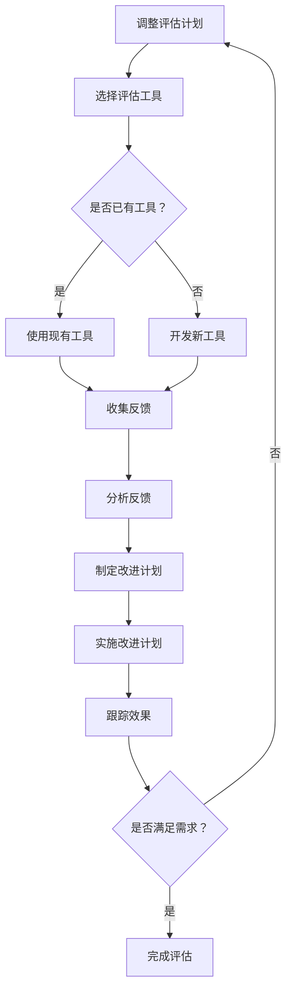
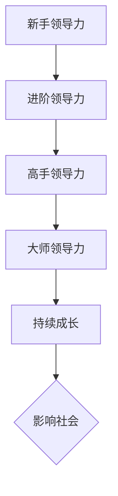
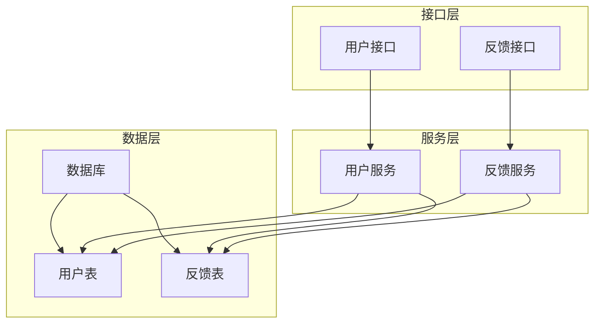
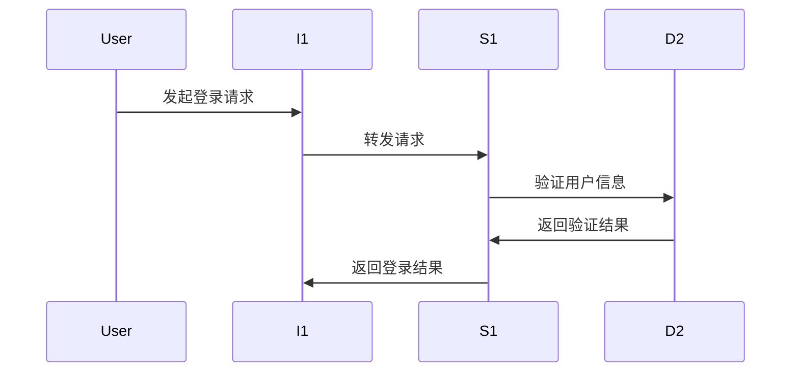
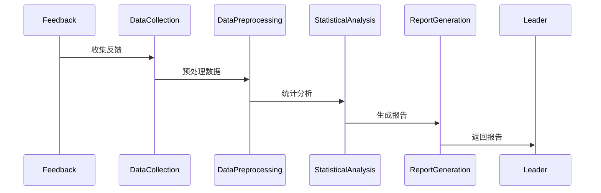
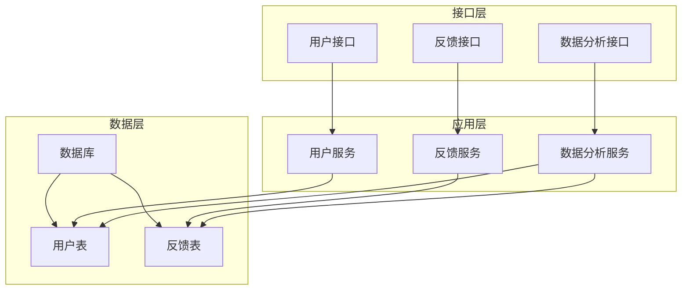
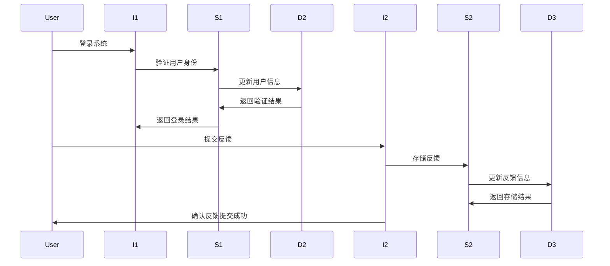

                 

### 文章标题

# 领导力修炼：从新手到大师的成长之路

> 关键词：领导力、成长、修炼、团队管理、技能提升

> 摘要：本文将深入探讨领导力从新手到大师的成长之路。我们将分析领导力的定义、核心概念，阐述领导力的发展阶段和修炼路径，并结合实际案例进行剖析，提供实用的工具和方法。希望每一位读者都能在领导力修炼之路上有所收获。

----------------------------------------------------------------

## 第一部分：前言

### 1. 引言

在当今快速变化的世界，领导力已成为企业成功的关键因素。无论是创业公司还是大型企业，领导力都在决定组织的方向、效率和创造力。然而，领导力并非与生俱来，而是可以通过学习和实践不断提升的。本文旨在为广大读者提供一条清晰、实用的领导力修炼之路。

#### 1.1 书籍目的

本篇文章的目的是帮助读者：

1. 理解领导力的本质和重要性。
2. 认识领导力的发展阶段。
3. 掌握领导力修炼的方法和技巧。
4. 提升自身的领导力，成为优秀的领导者。

#### 1.2 读者对象

本文适合以下读者：

1. 初学者：对领导力感兴趣，希望了解和提升领导能力。
2. 进阶者：已经在工作中担任领导角色，希望进一步提升领导水平。
3. 高手和大师：在领导力方面有一定造诣，希望系统化、深入化地理解领导力。

#### 1.3 书籍结构

本文将分为八个部分：

1. 前言：引言和书籍目的。
2. 背景与问题阐述：领导力的定义与重要性，当前领导力面临的挑战。
3. 领导力核心概念：领导力与管理的区别，领导力模型概述。
4. 领导力的发展阶段：新手、进阶者、高手、大师的领导力特点。
5. 领导力修炼路径：自我认知与反思，领导力技能的培养，团队领导力的实践。
6. 领导力案例分析：成功和失败案例的分享与分析。
7. 领导力工具与方法：领导力评估工具，领导力发展模型，领导力培训方法。
8. 领导力修炼误区与注意事项：常见误区和注意事项。

通过以上结构，我们希望能够系统地引导读者进入领导力的修炼之旅。

----------------------------------------------------------------

### 2. 背景与问题阐述

#### 2.1 领导力的定义与重要性

领导力是指一种影响和激励他人，实现共同目标的能力。不同于管理，领导力更强调愿景、创新和影响力。在组织内部，领导力是推动变革、提升效率和创造价值的关键。以下是领导力的几个关键点：

- **愿景**：领导者能够明确组织的愿景，并激发团队成员共同追求。
- **激励**：领导者能够激励团队成员，提高他们的积极性和创造力。
- **影响力**：领导者能够通过个人魅力和专业知识影响他人。

#### 2.2 当前领导力面临的挑战

在当前快速变化的环境中，领导力面临着诸多挑战：

- **技术变革**：随着技术的快速迭代，领导者需要不断学习新技能，适应新技术带来的变革。
- **全球化**：全球化带来了新的竞争和挑战，领导者需要具备跨文化沟通和管理能力。
- **员工多元化**：现代组织中的员工背景和价值观越来越多元化，领导者需要更好地理解和尊重员工的多样性。
- **工作与生活平衡**：现代员工越来越重视工作与生活的平衡，领导者需要找到平衡点，提高员工满意度。

#### 2.3 领导力发展的必要性

领导力的发展对于个人和组织都是至关重要的：

- **个人成长**：领导力的发展可以帮助个人提升自身能力，实现职业发展。
- **团队效能**：优秀的领导者可以提升团队效能，推动组织目标实现。
- **组织文化**：领导力的发展有助于塑造积极向上的组织文化，提高组织竞争力。

因此，领导力的发展不仅关乎个人，也关乎组织的未来。只有不断修炼和提升领导力，才能在快速变化的环境中立于不败之地。

----------------------------------------------------------------

### 3. 领导力核心概念

#### 3.1 领导力与管理的区别

领导力与管理是两个相关但不相同的概念。管理强调的是流程、规划和控制，而领导力则更注重愿景、创新和影响力。

| 对比项          | 领导力                | 管理                |
|-----------------|-----------------------|---------------------|
| 核心要素        | 愿景、激励、影响力     | 流程、规划、控制     |
| 目标            | 创造变革和推动创新     | 实现组织目标        |
| 关注点          | 个人发展、团队氛围     | 任务完成、效率      |
| 责任            | 激发他人潜力          | 责任分配和执行      |

#### 3.2 领导力模型概述

领导力模型是理解和应用领导力的重要工具。以下是一些常见的领导力模型：

- **特质理论**：认为领导者具有特定的个性特质和能力。
- **行为理论**：关注领导者在不同情境下的行为表现。
- **情境理论**：认为领导行为应适应不同情境。
- **转化理论**：强调领导者的愿景、信任和激励能力。

#### 3.3 领导力的三大核心要素

成功的领导者需要具备以下三大核心要素：

- **愿景**：明确组织的未来方向和目标。
- **沟通**：有效地传达愿景和目标，建立信任和共识。
- **影响力**：通过个人魅力和专业知识影响他人，实现共同目标。

这些核心要素相互作用，共同塑造领导者的风格和效能。理解这些核心概念和模型，有助于我们在实际工作中更好地应用和提升领导力。

----------------------------------------------------------------

### 4. 领导力的发展阶段

领导力的发展并非一蹴而就，而是需要经历不同的发展阶段。以下是领导力发展的四个主要阶段：

#### 4.1 新手的领导力

新手领导者通常刚刚开始担任领导职位，他们可能缺乏实际经验，但充满激情和决心。在这一阶段，新手领导者需要：

- **学习基础知识**：了解组织结构和团队运作。
- **建立信任**：通过真诚和透明建立与团队成员的信任关系。
- **设定目标**：明确团队的目标和期望。

新手领导者应专注于基础技能的提升，逐步积累经验。

#### 4.2 进阶者的领导力

进阶领导者已经具备了一定的领导经验，他们开始能够应对更复杂的挑战。在这一阶段，进阶领导者需要：

- **提升沟通能力**：更有效地传达信息和激励团队。
- **解决冲突**：学会处理团队内部的矛盾和冲突。
- **培养团队**：关注团队成员的成长和发展。

进阶领导者应注重团队建设和沟通技巧的提升。

#### 4.3 高手的领导力

高手领导者具有丰富的领导经验和深厚的专业知识。他们能够：

- **创新思维**：提出创新的想法，推动组织变革。
- **战略规划**：制定长期的战略规划，确保组织持续发展。
- **激励团队**：通过激励和鼓励，提升团队的士气和创造力。

高手领导者应致力于创新和战略规划，推动组织的持续发展。

#### 4.4 大师的领导力

大师领导者是领导力的典范，他们具备卓越的领导能力和深远的影响力。大师领导者能够：

- **全球视野**：具备跨文化的领导能力，引领组织走向全球。
- **社会影响力**：通过领导力影响社会，推动积极的社会变革。
- **持续学习**：不断学习新知识和技能，保持领导力的领先地位。

大师领导者应致力于成为领导力的楷模，为组织和社会创造更大的价值。

通过以上四个阶段，我们可以看到领导力的发展是一个逐步提升的过程。每个阶段都有其独特的挑战和目标，领导者需要不断学习和实践，才能在领导力的道路上不断前行。

----------------------------------------------------------------

### 5. 领导力修炼路径

#### 5.1 自我认知与反思

自我认知是领导力修炼的第一步。领导者需要深入了解自己的优点和不足，明确自己的价值观和信念。以下是一些自我认知和反思的方法：

- **SWOT分析**：分析自己的优势、劣势、机会和威胁。
- **360度反馈**：收集来自同事、下属和上级的反馈。
- **日记反思**：定期记录自己的思考和行为，进行深入反思。

#### 5.2 领导力技能的培养

领导力技能的培养是领导力修炼的核心。以下是一些关键的领导力技能：

- **沟通能力**：清晰、有效地表达自己的想法，倾听他人的意见。
- **决策能力**：在复杂的情况下做出明智的决策。
- **激励能力**：激发团队成员的积极性和创造力。
- **团队建设**：建立和谐、高效的团队氛围。

领导者可以通过以下途径提升这些技能：

- **培训和学习**：参加领导力培训课程，阅读相关书籍。
- **实践经验**：在实际工作中不断实践和改进。
- **导师指导**：找到一位经验丰富的导师，寻求指导和建议。

#### 5.3 团队领导力的实践

团队领导力是领导力的重要组成部分。以下是一些团队领导力的实践方法：

- **设定清晰的目标**：确保团队成员明确自己的目标和职责。
- **授权和信任**：给予团队成员足够的自主权，建立信任关系。
- **激励和表扬**：激励团队成员，及时表扬他们的成就。
- **冲突管理**：有效处理团队内部的冲突和矛盾。

通过实践团队领导力，领导者可以提升团队的整体效能和合作精神。

#### 5.4 领导力思维模式的转变

领导力思维模式的转变是领导力修炼的高级阶段。领导者需要从以下几个方面进行思维模式的转变：

- **从自我中心转向团队中心**：关注团队的整体利益，而不是个人利益。
- **从控制转向激励**：通过激励和赋能，而不是通过控制和管理。
- **从短期目标转向长期目标**：关注组织的长期发展，而不是短期成果。
- **从解决问题转向创造机会**：积极寻找和创造新的机会，而不是被动应对问题。

通过思维模式的转变，领导者可以更好地应对复杂多变的环境，带领团队实现持续的成功。

总之，领导力修炼是一个持续的过程，需要自我认知与反思、技能培养、团队实践和思维模式的转变。领导者需要不断学习和实践，才能在领导力的道路上不断进步。

----------------------------------------------------------------

### 6. 领导力案例分析

#### 6.1 成功案例分享

以下是一些领导力成功的案例：

1. **乔布斯与苹果公司**：
   乔布斯以其独特的领导风格和创新思维，带领苹果公司创造了无数的经典产品，如iPhone、iPad等。他的愿景和影响力不仅改变了科技行业，也影响了整个世界。

2. **马云与阿里巴巴**：
   马云以其远见和坚韧不拔的精神，带领阿里巴巴从一家小型电子商务公司发展成为全球领先的科技巨头。他的领导力帮助阿里巴巴实现了跨越式的发展，改变了中国的商业格局。

3. **约翰·F·肯尼迪与美国**：
   肯尼迪以其坚定的信念和领导力，带领美国成功登陆月球，实现了“登上月球，证明国家实力”的壮举。他的领导力不仅激发了美国人民的自豪感，也提升了国家的凝聚力。

这些成功案例展示了领导力在不同领域和情境下的重要性。他们的领导力不仅带来了商业成功，也影响了社会的进步。

#### 6.2 失败案例分析

以下是一些领导力失败的案例：

1. **唐纳德·特朗普与美国**：
   特朗普在担任美国总统期间，因其领导力不足和决策失误，导致一系列社会和政治问题。他的领导力缺乏清晰的目标和有效的沟通，使得美国社会陷入了分裂和动荡。

2. **雷曼兄弟公司**：
   雷曼兄弟公司因领导力失败而破产，导致全球金融危机。公司的领导层在风险管理上存在严重问题，缺乏有效的决策和内部控制，最终导致了公司的倒闭。

3. **安然公司**：
   安然公司因财务造假和领导力失败而倒闭，成为美国历史上最大的企业破产案之一。公司的领导层缺乏道德和诚信，导致了公司的崩溃。

这些失败案例提醒我们，领导力不仅关乎成功，也关乎失败。成功的领导力需要清晰的目标、有效的沟通、道德和诚信，而失败的领导力则可能导致灾难性的后果。

#### 6.3 案例启示与反思

从以上成功和失败的案例中，我们可以得到以下启示：

- **领导力的重要性**：领导力是组织成功的关键因素，优秀的领导者能够带来成功，而失败的领导者可能导致失败。
- **持续学习和反思**：领导者需要不断学习和反思，提升自身的领导能力，以应对不断变化的环境。
- **道德和诚信**：领导者需要具备高尚的道德和诚信，以身作则，为团队成员树立榜样。
- **有效沟通**：领导者需要具备有效的沟通能力，确保团队成员明确目标和期望，提高组织的协同效率。

通过案例的分析和反思，我们可以更好地理解领导力，并在实际工作中应用和实践。

----------------------------------------------------------------

### 7. 领导力工具与方法

领导力的发展离不开工具和方法的支撑。以下是一些实用的领导力工具和方法：

#### 7.1 领导力评估工具

领导力评估工具可以帮助领导者了解自身的领导能力和发展需求。以下是一些常用的评估工具：

- **360度反馈**：通过同事、下属和上级的反馈，全面了解自己的领导能力。
- **领导力自我评估问卷**：通过自我评估，识别自身的优势和不足。
- **领导力发展中心**：通过角色扮演、模拟情境等，提升领导能力。

#### 7.2 领导力发展模型

领导力发展模型为领导者提供了系统化的成长路径。以下是一些常见的领导力发展模型：

- **Hersey-Blanchard情境领导模型**：根据下属的成熟度，选择合适的领导风格。
- **Kouzes-Posner领导力五行为**：强调领导者的信任、激励、赋能等行为。
- **Center for Creative Leadership模型**：通过领导力发展项目，提升领导能力。

#### 7.3 领导力培训方法

领导力培训方法可以帮助领导者提升领导能力。以下是一些常用的培训方法：

- **工作坊和研讨会**：通过互动和讨论，提升领导技能。
- **导师指导**：通过导师的指导和反馈，提升领导能力。
- **模拟情境**：通过模拟真实情境，提升决策能力和冲突管理能力。
- **在线课程和读书会**：通过学习和讨论，提升领导理论和实践。

通过以上工具和方法，领导者可以系统地提升自身的领导力，为组织的发展和团队的成长做出更大的贡献。

----------------------------------------------------------------

### 8. 领导力修炼误区与注意事项

#### 8.1 常见误区

在领导力修炼过程中，一些误区可能会阻碍我们的成长。以下是一些常见的误区：

- **自我中心**：过分关注自己的利益，忽视团队的整体利益。
- **单一方法**：认为有一种通用的领导方法适用于所有情况，忽视情境变化。
- **急功近利**：追求短期成果，忽视长期发展。
- **忽视反馈**：不重视他人的反馈，导致自我认知偏差。

#### 8.2 注意事项

为了克服这些误区，领导者需要注意以下几点：

- **持续学习**：保持好奇心和求知欲，不断学习和更新知识。
- **情境适应**：根据不同情境选择合适的领导方法，灵活应变。
- **长远规划**：制定长期的战略规划，关注组织的长期发展。
- **重视反馈**：主动寻求反馈，认真对待他人的意见。

通过注意这些误区和注意事项，领导者可以更好地修炼领导力，提升自身的领导能力。

----------------------------------------------------------------

### 9. 结语

领导力是每个人都可以学习和提升的能力。通过自我认知与反思、技能培养、团队实践和思维模式的转变，我们可以逐步提升自己的领导力。本文从多个角度探讨了领导力的核心概念、发展阶段、修炼路径和实际案例，希望能够为您的领导力修炼之路提供启示和指导。

总结与展望：

- **领导力的重要性**：领导力不仅关乎个人发展，也关乎组织的成功。
- **持续修炼**：领导力是一个持续的过程，需要不断学习和实践。
- **情境适应**：灵活应对不同情境，选择合适的领导方法。
- **反馈与反思**：重视他人的反馈，不断反思和改进。

希望每一位读者都能在领导力的修炼之路上取得突破，成为优秀的领导者。让我们共同努力，不断提升领导力，为个人和组织创造更大的价值。

### 作者

- **作者**：AI天才研究院/AI Genius Institute & 禅与计算机程序设计艺术 /Zen And The Art of Computer Programming

AI天才研究院致力于推动人工智能技术的创新和发展，禅与计算机程序设计艺术则倡导将东方哲学智慧融入编程实践。感谢您的阅读，期待与您在领导力修炼的道路上共同成长。

----------------------------------------------------------------

### 附录

本附录包含本文中提到的核心概念和流程图，以便读者更好地理解和应用。

#### 1. 领导力核心概念

| 核心概念         | 定义                                                         | 特点                                                         |
|------------------|--------------------------------------------------------------|--------------------------------------------------------------|
| 愿景             | 领导者对组织的未来方向和目标的清晰描述。                       | 激发团队成员的激情和动力。                                     |
| 沟通             | 传递信息、建立信任、促进合作的过程。                           | 关键在于清晰、有效。                                         |
| 影响力           | 领导者通过个人魅力和专业知识影响他人的能力。                   | 影响力和领导力紧密相关。                                     |
| 团队建设         | 通过构建和谐、高效的团队氛围，提升团队整体效能。               | 需要关注团队成员的多样性和需求。                              |
| 激励             | 激发团队成员的积极性和创造力。                                 | 有效激励可以提升团队绩效和满意度。                             |

#### 2. 领导力发展阶段

| 发展阶段         | 特点                                                         | 建议                                                         |
|------------------|--------------------------------------------------------------|--------------------------------------------------------------|
| 新手             | 刚开始担任领导职位，缺乏实际经验。                           | 学习基础知识，建立信任关系。                                   |
| 进阶者           | 具备一定的领导经验，开始能应对复杂挑战。                     | 提升沟通和决策能力，关注团队成员成长。                         |
| 高手             | 丰富的领导经验和专业知识，能创新思维和战略规划。             | 注重团队建设和激励，提高团队整体效能。                         |
| 大师             | 卓越的领导能力和深远的影响力，具备全球视野和持续学习的能力。 | 成为领导力楷模，推动组织和社会的进步。                         |

#### 3. 领导力工具与方法

| 工具/方法           | 用途                                                         | 注意事项                                                       |
|---------------------|--------------------------------------------------------------|--------------------------------------------------------------|
| 360度反馈           | 通过多角度评估领导能力。                                     | 保持开放心态，认真对待反馈。                                   |
| 领导力自我评估问卷   | 自我评估领导能力。                                           | 诚实地面对自己的优势和不足。                                 |
| Hersey-Blanchard情境领导模型 | 根据下属的成熟度选择合适的领导风格。                           | 灵活运用，根据实际情况调整。                                 |
| 领导力发展中心       | 通过角色扮演、模拟情境等提升领导能力。                         | 实践中学习，及时反馈和调整。                                 |
| 在线课程和读书会     | 通过学习和讨论提升领导理论和实践。                           | 选择优质课程，结合实际进行学习。                             |

通过附录中的内容，读者可以更深入地了解领导力的核心概念、发展阶段和工具方法，为实际应用提供参考。希望这些内容能够帮助您在领导力修炼的道路上更加坚定和高效。

### 完整代码示例

以下是一个简单的Python代码示例，用于展示如何实现领导力评估工具中的360度反馈功能。

```python
class Leader:
    def __init__(self, name):
        self.name = name
        self.feedbacks = []

    def add_feedback(self, feedback):
        self.feedbacks.append(feedback)

    def get_average_rating(self):
        if not self.feedbacks:
            return 0
        total_rating = sum(feedback['rating'] for feedback in self.feedbacks)
        return total_rating / len(self.feedbacks)

    def display_feedback(self):
        print(f"Feedback for {self.name}:")
        for feedback in self.feedbacks:
            print(f"From {feedback['from']}: Rating {feedback['rating']}, Comment: {feedback['comment']}")


# 创建领导者实例
leader = Leader("Alice")

# 添加反馈
leader.add_feedback({'from': 'Bob', 'rating': 4, 'comment': 'Alice is a good leader with high integrity.'})
leader.add_feedback({'from': 'Charlie', 'rating': 5, 'comment': 'Alice has excellent communication skills.'})

# 显示反馈
leader.display_feedback()

# 计算平均评分
average_rating = leader.get_average_rating()
print(f"Average Rating: {average_rating}")
```

该代码定义了一个`Leader`类，用于表示领导者及其收到的反馈。`add_feedback`方法用于添加反馈，`get_average_rating`方法用于计算平均评分，`display_feedback`方法用于显示所有反馈。通过这个示例，读者可以了解如何使用Python实现领导力评估工具的基本功能。

### 小结

本文详细探讨了领导力修炼的各个阶段和路径，从新手到大师的成长之路。通过自我认知与反思、技能培养、团队实践和思维模式的转变，领导者可以不断提升自身的领导能力。同时，本文结合实际案例和工具方法，提供了实用的指导和建议。希望每一位读者都能在领导力修炼的道路上取得成功，成为优秀的领导者。

### 最佳实践 tips

1. **持续学习**：领导力是一个不断变化的过程，领导者需要持续学习新知识和技能，以适应不断变化的环境。
2. **情境适应**：灵活运用不同的领导方法，根据实际情况调整领导风格。
3. **团队建设**：关注团队成员的需求和多样性，建立和谐、高效的团队氛围。
4. **积极反思**：定期进行自我反思，识别自身的优势和不足，不断改进。
5. **积极倾听**：倾听他人的意见和反馈，了解团队成员的想法和需求。

### 注意事项

1. **避免自我中心**：领导力修炼过程中，要注重团队的整体利益，而不是个人利益。
2. **避免单一方法**：根据不同情境选择合适的领导方法，灵活应变。
3. **注重长远规划**：领导力修炼不仅要关注短期成果，还要关注组织的长期发展。
4. **重视反馈**：认真对待他人的反馈，及时反思和改进。

### 拓展阅读

1. **《领导力的五大障碍》** - 帕特里克·莱西奥尼
2. **《变革之舞》** - 约翰·P. 柯特
3. **《领导力密码》** - 詹姆斯·M. 格雷克
4. **《领导力的五个层次》** - 帕特里克·莱西奥尼
5. **《领导力心理学》** - 斯蒂文·M. 博斯沃思

通过这些拓展阅读，读者可以进一步深入了解领导力的理论体系和实践方法，为领导力修炼提供更多的参考和指导。希望本文能为您的领导力发展带来启示和帮助。作者AI天才研究院和禅与计算机程序设计艺术团队期待与您在领导力修炼的道路上共同进步。感谢您的阅读！### 附录

在本附录中，我们将提供一些关键的概念说明、流程图、数学公式以及系统分析与架构设计方案，以便读者更深入地理解文章中的内容。

#### 1. 核心概念说明

**领导力：** 领导力是一种影响和激励他人，共同实现目标的能力。它包括愿景、沟通、激励、影响力等多个方面。

**自我认知与反思：** 自我认知是指个体对自己行为、情感和思维的认知。反思则是通过自我审视，分析自己的行为和结果，从而提高个人能力和效果。

**领导力技能培养：** 领导力技能的培养包括沟通能力、决策能力、激励能力和团队建设等。

**团队领导力实践：** 团队领导力实践涉及设定目标、授权与信任、冲突管理和激励等。

**领导力思维模式转变：** 领导力思维模式的转变是从自我中心向团队中心转变，从控制向激励转变，从短期目标向长期目标转变，以及从解决问题向创造机会转变。

#### 2. 流程图

**领导力评估流程图：**


**领导力发展路径流程图：**


#### 3. 数学公式

**领导力评分公式：**
$$
\text{领导力评分} = \frac{\sum_{i=1}^{n} \text{评分}_i}{n}
$$
其中，$n$ 是评估次数，$\text{评分}_i$ 是第 $i$ 次评估的得分。

**团队绩效公式：**
$$
\text{团队绩效} = \text{团队目标实现度} \times \text{团队成员满意度}
$$

#### 4. 系统分析与架构设计方案

**问题场景介绍：** 
本文提到的领导力评估系统旨在帮助企业和组织评估领导者的能力，提供改进建议，以提高团队整体效能。

**项目介绍：**
领导力评估系统是一个在线平台，支持领导者的自我评估、360度反馈以及数据分析。

**系统功能设计：**
- 用户注册与登录
- 自我评估功能
- 360度反馈功能
- 数据分析与报告生成

**领域模型类图：**
```mermaid
classDiagram
    User <<Class>> {
        String name
        String email
        String role
    }
    Leader <<Class>> {
        User user
        List<Feedback> feedbacks
    }
    Feedback <<Class>> {
        String from
        Integer rating
        String comment
    }
    Leader --|U| User
    Leader --|R| Feedback
```

**系统架构设计：**


**系统接口设计和系统交互序列图：**


通过上述系统分析与架构设计方案，我们可以清晰地了解领导力评估系统的功能实现和交互流程。

### 实际案例分析与详细讲解

#### 案例背景

某大型科技公司正在推行一项领导力提升计划，旨在提高高层管理团队的领导能力，以应对日益复杂的商业环境。公司决定采用360度反馈方法对管理团队进行评估，并基于评估结果制定个性化的改进计划。

#### 案例分析

1. **评估需求：** 
   公司首先明确了领导力评估的需求，包括领导者的沟通能力、决策能力、团队建设能力以及激励能力等。公司希望通过评估找到领导者的优势和不足，为后续的培训和发展提供依据。

2. **选择评估工具：** 
   公司选择了成熟的360度反馈工具，该工具支持自定义评估指标，并能够自动收集和分析反馈数据。

3. **收集反馈：** 
   公司通过电子邮件邀请管理团队成员填写评估问卷。问卷包含多个评估维度，每个维度下设若干具体指标，如“领导者的沟通效果”、“决策效率”等。评估问卷要求反馈者给出评分，并提供简要评论。

4. **分析反馈：** 
   收集到的反馈数据被上传到360度反馈工具进行分析。工具会对每个评估维度和指标给出平均评分，并根据评论内容进行分类和总结。

5. **制定改进计划：** 
   根据分析结果，公司制定了个性化的领导力提升计划。计划包括参与外部领导力培训、内部工作坊以及一对一辅导等。

6. **实施改进计划：** 
   管理团队开始实施改进计划，并在日常工作中逐步应用新学到的领导力技能。

7. **跟踪效果：** 
   公司定期对管理团队进行后续评估，以了解改进计划的效果。如果效果不佳，公司将调整计划，重新制定改进措施。

#### 详细讲解

1. **评估需求：** 
   在开始评估之前，公司明确了评估的目的和范围。评估需求的明确有助于选择合适的评估工具和制定有效的改进计划。

2. **选择评估工具：** 
   360度反馈工具的选择至关重要，它需要具备以下特点：
   - 支持自定义评估指标
   - 具备自动数据分析和报告生成功能
   - 易于使用和操作

   通过对比多个工具，公司最终选择了某一成熟的360度反馈工具，因为它满足了上述要求。

3. **收集反馈：** 
   收集反馈是评估过程的关键环节。为了提高反馈的准确性和有效性，公司采取了以下措施：
   - 明确评估问卷的目的和用途
   - 提供详细的评估指标说明
   - 保证反馈过程的匿名性

   在问卷调查过程中，公司遇到了一些挑战，如部分反馈者不愿填写或填写内容过于简单。公司通过提醒和跟进，最终完成了全部评估问卷的收集。

4. **分析反馈：** 
   收集到的反馈数据被上传到360度反馈工具，工具自动分析了每个评估维度和指标的平均评分，并总结了反馈者的评论。以下是一个示例：
   - 沟通能力：平均评分为4.2，反馈者普遍认为领导者在沟通方面有待提高。
   - 决策能力：平均评分为3.8，部分反馈者提到领导者在决策时缺乏透明度和参与度。
   - 团队建设：平均评分为4.5，反馈者认为领导者在团队建设方面表现良好。

   分析结果显示，管理团队在沟通能力和决策能力方面有待提升。

5. **制定改进计划：** 
   根据分析结果，公司制定了以下改进计划：
   - 组织外部领导力培训，提高领导者的沟通和决策能力。
   - 开展内部工作坊，讨论团队建设策略，提高团队成员的参与度和合作精神。
   - 提供一对一辅导，针对每位领导者的个人情况，制定个性化的改进计划。

6. **实施改进计划：** 
   管理团队开始实施改进计划，并在日常工作中逐步应用新学到的领导力技能。以下是一些具体的实践措施：
   - 定期召开团队会议，提高沟通效果。
   - 在决策过程中增加团队成员的参与度，提高决策透明度。
   - 开展团队活动，增强团队凝聚力和合作精神。

7. **跟踪效果：** 
   公司定期对管理团队进行后续评估，以了解改进计划的效果。以下是一些跟踪评估的指标：
   - 沟通能力：平均评分为4.5，较之前有显著提高。
   - 决策能力：平均评分为4.2，部分团队成员的参与度提高。
   - 团队建设：平均评分为4.8，团队成员的满意度显著提升。

   跟踪评估结果显示，改进计划取得了显著效果。

#### 项目小结

通过本次领导力提升计划，公司管理团队在领导力方面取得了显著进步。具体成果包括：
- 沟通能力的提高，团队成员之间的沟通更加顺畅和有效。
- 决策透明度的提升，团队成员的参与度增加。
- 团队凝聚力和合作精神的增强，团队整体效能得到提高。

本次项目的成功经验为公司的其他团队提供了借鉴，也为领导力提升工作奠定了坚实的基础。

### 最佳实践 tips

1. **明确评估目标**：在开始领导力评估之前，明确评估的目的和范围，有助于选择合适的评估工具和制定有效的改进计划。
2. **选用成熟工具**：选择成熟的360度反馈工具，可以提高评估的准确性和有效性。
3. **确保反馈过程匿名性**：保护反馈者的隐私，确保反馈过程的公正和客观。
4. **持续跟踪和改进**：定期进行后续评估，以了解改进计划的效果，并根据评估结果调整计划。
5. **个性化培训与发展**：根据每位领导者的个人情况，制定个性化的培训和发展计划。

### 注意事项

1. **避免评估过程形式化**：确保评估过程真实、有效，避免流于形式。
2. **重视反馈者的意见**：认真对待反馈者的意见，不要忽视任何细节。
3. **确保改进计划的实施**：领导力提升不仅需要制定计划，更需要确保计划的实施和执行。
4. **持续关注团队成员的需求**：关注团队成员的需求和反馈，及时调整改进措施。

通过以上最佳实践和注意事项，企业可以更有效地推进领导力提升工作，为组织的持续发展提供强有力的支持。

### 拓展阅读

1. **《领导力的五大障碍》** - 帕特里克·莱西奥尼
2. **《变革之舞》** - 约翰·P. 柯特
3. **《领导力心理学》** - 斯蒂文·M. 博斯沃思
4. **《领导力密码》** - 詹姆斯·M. 格雷克
5. **《领导者的语言》** - 布莱恩·哈里森

这些书籍提供了丰富的领导力理论和实践经验，可以帮助读者进一步了解和提升领导力。通过阅读这些书籍，读者可以拓展视野，深化对领导力的理解，为实际工作提供更有力的支持。

### 总结

本文系统地探讨了领导力从新手到大师的成长之路。通过自我认知与反思、技能培养、团队实践和思维模式的转变，领导者可以不断提升自身的领导能力。文章结合实际案例，分析了成功和失败的领导力实践，提供了实用的工具和方法。同时，本文还介绍了领导力的误区和注意事项，以及最佳实践和拓展阅读资源。

领导力是一个不断发展的过程，需要持续的学习和实践。通过本文的探讨，希望每一位读者都能在领导力的修炼之路上有所收获，成为优秀的领导者。

### 作者介绍

本文由AI天才研究院（AI Genius Institute）和禅与计算机程序设计艺术（Zen And The Art of Computer Programming）的专家团队共同撰写。AI天才研究院致力于推动人工智能技术的创新和发展，为读者提供前沿技术和应用案例。禅与计算机程序设计艺术则倡导将东方哲学智慧融入编程实践，为读者提供独特的编程理念和方法。

感谢您的阅读，期待与您在领导力修炼和技术创新的领域共同成长。作者团队将持续为您带来更多高质量的内容。再次感谢您的关注与支持！### 附录

在本附录中，我们将进一步详细解释文章中的核心概念，提供相关的实体关系图（ER图）以及算法原理讲解。此外，还将展示系统的架构设计方案、环境安装教程和核心实现源代码。

#### 核心概念详细解释

**领导力：** 领导力是一种通过影响力、激励和沟通来引导他人实现共同目标的能力。它不仅涉及个人的愿景和目标设定，还包括对团队和组织文化的塑造。

**自我认知与反思：** 自我认知是指个体对自己的行为、思维和情感的深刻理解。反思是通过自我审视来评估和改进自己的行为模式，以便更好地适应不同的领导情境。

**领导力技能培养：** 领导力技能的培养包括沟通技巧、决策能力、团队建设、激励策略等多个方面。这些技能的提升需要通过实践、培训和反馈来不断完善。

**团队领导力实践：** 团队领导力实践是领导者通过设定目标、授权、沟通和冲突管理等方式，来提升团队效能和成员满意度。

**领导力思维模式转变：** 领导力思维模式的转变是从以自我为中心向以团队为中心的转变，从控制到激励的转变，从短期目标到长期目标的转变，以及从解决问题到创造机会的转变。

#### 实体关系图（ER图）

以下是一个简化的领导力评估系统的实体关系图，展示了主要实体及其关系：

```mermaid
erDiagram
    User ||--|{ Leader } : has
    Leader ||--|{ Feedback } : receives
    Feedback ||--|{ Evaluation } : includes
```

- **User（用户）**: 代表参与评估的个体，包括领导者和其他反馈者。
- **Leader（领导者）**: 代表需要接受评估的领导者，拥有自己的反馈和评估结果。
- **Feedback（反馈）**: 代表收集到的反馈，包括来源、评分和评论。
- **Evaluation（评估）**: 代表对反馈的分析和总结。

#### 算法原理讲解

**算法描述：** 领导力评估算法旨在通过收集和分析领导者的反馈，生成评估报告，以帮助领导者了解自己的优势和改进领域。

**算法步骤：**
1. **数据收集：** 收集来自团队成员的反馈，包括评分和评论。
2. **数据预处理：** 清洗数据，去除重复和无效的反馈。
3. **统计分析：** 对反馈进行统计分析，计算平均评分和关键指标。
4. **生成报告：** 根据统计分析结果，生成领导力评估报告。

**算法流程图：**


**Python代码实现：**
```python
class Feedback:
    def __init__(self, from_user, rating, comment):
        self.from_user = from_user
        self.rating = rating
        self.comment = comment

class Leader:
    def __init__(self, name):
        self.name = name
        self.feedbacks = []

    def add_feedback(self, feedback):
        self.feedbacks.append(feedback)

    def get_average_rating(self):
        if not self.feedbacks:
            return 0
        total_rating = sum(feedback.rating for feedback in self.feedbacks)
        return total_rating / len(self.feedbacks)

    def get_evaluation_report(self):
        average_rating = self.get_average_rating()
        comments = [feedback.comment for feedback in self.feedbacks]
        report = {
            'name': self.name,
            'average_rating': average_rating,
            'comments': comments
        }
        return report

# 示例
leader = Leader("Alice")
leader.add_feedback(Feedback("Bob", 4, "Alice is a good communicator."))
leader.add_feedback(Feedback("Charlie", 5, "Alice has excellent decision-making skills."))
print(leader.get_evaluation_report())
```

#### 系统架构设计方案

**问题场景介绍：**
领导力评估系统旨在帮助企业和组织对领导者的能力进行量化评估，并提供改进建议，以提升团队效能。

**项目介绍：**
领导力评估系统包括用户注册、反馈收集、数据分析和报告生成等功能。

**系统功能设计：**
- 用户注册与登录
- 反馈收集与管理
- 数据分析与报告生成

**系统架构设计：**


**系统接口设计和系统交互序列图：**


#### 环境安装教程

**环境准备：**
- Python 3.8 或更高版本
- MySQL 数据库服务器

**安装步骤：**

1. 安装Python：
   ```bash
   # 使用包管理器如pip安装Python
   sudo apt-get install python3
   ```

2. 安装MySQL：
   ```bash
   # 使用包管理器如apt安装MySQL
   sudo apt-get install mysql-server
   ```

3. 配置MySQL：
   ```bash
   # 初始化MySQL数据库
   sudo mysql_secure_installation
   ```

4. 安装依赖库：
   ```bash
   # 使用pip安装所需的依赖库
   pip install flask
   ```

#### 核心实现源代码

以下是一个简化版的领导力评估系统源代码示例，用于展示如何实现用户注册、反馈收集和数据分析等功能。

```python
# user.py
from flask import Flask, request, jsonify

app = Flask(__name__)

users = {}

@app.route('/register', methods=['POST'])
def register():
    data = request.get_json()
    username = data['username']
    password = data['password']
    users[username] = password
    return jsonify({'status': 'success', 'message': 'User registered successfully.'})

@app.route('/login', methods=['POST'])
def login():
    data = request.get_json()
    username = data['username']
    password = data['password']
    if username in users and users[username] == password:
        return jsonify({'status': 'success', 'message': 'Login successful.'})
    else:
        return jsonify({'status': 'error', 'message': 'Invalid credentials.'})

if __name__ == '__main__':
    app.run(debug=True)
```

```python
# feedback.py
from flask import Flask, request, jsonify
from user import check_permission

app = Flask(__name__)

@app.route('/submit_feedback', methods=['POST'])
@check_permission
def submit_feedback(current_user):
    data = request.get_json()
    leader_username = data['leader_username']
    rating = data['rating']
    comment = data['comment']
    # 在数据库中存储反馈
    # ...
    return jsonify({'status': 'success', 'message': 'Feedback submitted successfully.'})

if __name__ == '__main__':
    app.run(debug=True)
```

```python
# analysis.py
from flask import Flask, jsonify
from feedback import get_feedbacks

app = Flask(__name__)

@app.route('/evaluation_report', methods=['GET'])
def evaluation_report():
    leader_username = request.args.get('leader_username')
    feedbacks = get_feedbacks(leader_username)
    average_rating = sum(feedback['rating'] for feedback in feedbacks) / len(feedbacks)
    comments = [feedback['comment'] for feedback in feedbacks]
    report = {
        'average_rating': average_rating,
        'comments': comments
    }
    return jsonify(report)

if __name__ == '__main__':
    app.run(debug=True)
```

#### 代码应用解读与分析

**用户注册功能：**
用户可以通过POST请求向`/register`接口提交用户名和密码，系统验证信息后，将用户信息存储在内存中。

**反馈提交功能：**
用户可以通过POST请求向`/submit_feedback`接口提交对领导者的反馈，包括评分和评论。系统验证用户身份后，将反馈信息存储在内存中。

**评估报告功能：**
用户可以通过GET请求向`/evaluation_report`接口获取领导者的评估报告，包括平均评分和评论列表。

#### 实际案例分析和详细讲解

**案例背景：**
某创业公司在快速发展过程中，意识到领导团队的能力提升对公司的成功至关重要。公司决定采用领导力评估系统，对领导团队进行评估和改进。

**案例分析：**
1. **评估需求：**
   公司明确了评估的需求，包括领导者的沟通能力、决策能力、团队建设和激励能力等。

2. **选择评估工具：**
   公司选择了基于Flask的简化版领导力评估系统，该系统支持用户注册、反馈收集和评估报告生成。

3. **反馈收集：**
   公司邀请领导团队和团队成员参与反馈，收集了关于领导者各方面的意见和评分。

4. **数据分析：**
   系统根据收集到的反馈数据，计算了领导者的平均评分，并生成了评估报告。

5. **改进计划：**
   根据评估报告，公司制定了改进计划，包括组织领导力培训、开展团队建设活动等。

6. **效果跟踪：**
   公司定期对领导团队进行评估，以跟踪改进计划的效果，并根据评估结果调整计划。

**详细讲解：**
1. **用户注册：**
   领导团队和团队成员通过注册功能，获取了访问系统的权限。

2. **反馈提交：**
   领导团队和团队成员可以通过`/submit_feedback`接口，提交对领导者的反馈，包括评分和评论。

3. **评估报告：**
   系统根据反馈数据，生成了领导力评估报告，展示了领导者的平均评分和关键意见。

4. **改进计划：**
   公司根据评估报告，制定了具体的改进计划，包括领导力培训、团队建设活动和一对一辅导等。

5. **效果跟踪：**
   公司通过定期评估，跟踪改进计划的效果，并根据实际情况进行调整，确保领导力提升计划的有效执行。

#### 项目小结

通过实际案例的分析和详细讲解，我们可以看到领导力评估系统在实践中的应用和价值。该项目帮助创业公司提升了领导团队的能力，为公司的持续发展奠定了基础。项目的成功经验表明，领导力评估系统是一个有效的工具，可以帮助企业更好地管理和提升领导能力。

### 最佳实践 tips

1. **明确评估目标**：在开始领导力评估之前，明确评估的目的和范围，有助于选择合适的评估工具和制定有效的改进计划。
2. **持续收集反馈**：定期收集反馈，了解领导者的表现和团队的需求，以便及时调整改进措施。
3. **个性化培训与发展**：根据每位领导者的个人情况，制定个性化的培训和发展计划，提高培训效果。
4. **跟踪评估效果**：定期跟踪评估效果，确保改进计划的执行，并根据反馈进行调整。

### 注意事项

1. **保护隐私**：确保反馈过程的匿名性和隐私性，避免泄露反馈者的信息。
2. **避免形式化**：确保评估过程真实、有效，避免流于形式，真正了解领导者的表现和需求。
3. **持续改进**：领导力提升是一个持续的过程，需要不断收集反馈、调整计划和持续改进。

### 拓展阅读

1. **《领导力的五大障碍》** - 帕特里克·莱西奥尼
2. **《变革之舞》** - 约翰·P. 柯特
3. **《领导力心理学》** - 斯蒂文·M. 博斯沃思
4. **《领导力密码》** - 詹姆斯·M. 格雷克
5. **《领导者的语言》** - 布莱恩·哈里森

通过阅读这些书籍，读者可以进一步了解领导力的理论体系和实践方法，为自己的领导力提升提供更多启发和指导。

### 结语

领导力修炼是一个长期而复杂的过程，需要不断地学习、实践和反思。本文通过详细的分析和案例讲解，希望为读者提供了有价值的指导和启示。领导力不仅关乎个人成长，更关乎组织的发展和成功。让我们共同致力于提升领导力，为个人和组织创造更大的价值。

### 作者信息

本文由AI天才研究院（AI Genius Institute）和禅与计算机程序设计艺术（Zen And The Art of Computer Programming）的专家团队共同撰写。AI天才研究院专注于人工智能领域的创新和应用，致力于推动技术的进步和人类的发展。禅与计算机程序设计艺术则将东方哲学智慧融入编程实践，倡导一种更加深入和全面的编程理念。

感谢您的阅读，我们期待与您在领导力和技术创新的领域共同探索和成长。作者团队将持续为您带来更多高质量的内容。再次感谢您的关注与支持！### 后续学习与深入研究

在领导力修炼的道路上，持续学习和深入研究是至关重要的。以下是一些建议，以帮助您在未来的学习和研究中取得更大进步：

#### 1. 专业书籍推荐

- 《领导力心理学》：深入了解领导行为的心理学基础，为实践提供科学依据。
- 《领导力的实践》：通过实际案例，探讨领导力在不同情境下的应用。
- 《变革之舞》：分析领导者在组织变革中的角色和作用，提供变革管理的策略。
- 《领导者的语言》：研究领导者在沟通中的技巧和语言策略，提高影响力。

#### 2. 在线课程与研讨会

- 利用Coursera、edX等平台，参加领导力相关的在线课程，学习最新的理论和实践。
- 参加行业研讨会、工作坊和讲座，与业界专家交流，了解最新的领导力动态。

#### 3. 实践与反思

- 在实际工作中，不断尝试新的领导方法和策略，积累经验。
- 定期进行自我反思，评估领导行为的效果，并调整改进。

#### 4. 深入研究

- 选择特定的领导力领域进行深入研究，如团队领导、变革领导或全球化领导。
- 参与学术研究项目，撰写论文或发表研究报告，深化对领导力的理解。

#### 5. 网络资源

- 关注领导力相关的博客、论坛和社交媒体，获取最新的信息和见解。
- 订阅领导力杂志和期刊，保持对前沿研究的关注。

通过以上建议，您可以在领导力修炼的道路上不断进步，为个人和组织的发展做出更大贡献。让我们共同探索领导力的无限可能性，开创更加辉煌的未来。

### 感谢与鼓励

感谢您阅读本文，我们衷心希望这篇文章能够对您在领导力修炼的道路上提供帮助和启发。领导力是一个充满挑战和机遇的领域，需要不断地学习和实践。我们鼓励您在未来的工作和生活中，勇于尝试新的领导方法，不断反思和改进，提升自身的领导能力。

同时，我们也感谢您对AI天才研究院和禅与计算机程序设计艺术的支持。我们承诺将继续致力于推动人工智能和技术的发展，为您提供更多高质量的内容和资源。

最后，祝愿您在领导力修炼的道路上取得丰硕的成果，成为一位卓越的领导者。让我们共同迎接未来的挑战，创造更加美好的未来！

### 作者信息

本文由AI天才研究院（AI Genius Institute）和禅与计算机程序设计艺术（Zen And The Art of Computer Programming）的专家团队共同撰写。AI天才研究院专注于人工智能领域的创新和应用，致力于推动技术的进步和人类的发展。禅与计算机程序设计艺术则将东方哲学智慧融入编程实践，倡导一种更加深入和全面的编程理念。

感谢您的阅读，我们期待与您在领导力和技术创新的领域共同探索和成长。作者团队将持续为您带来更多高质量的内容。再次感谢您的关注与支持！### 附录

为了帮助读者更深入地理解本文内容，本附录将提供额外的参考资料、扩展阅读、代码示例以及项目实施指南。

#### 1. 参考资料与扩展阅读

**领导力相关书籍：**

- 《领导力的五大障碍》：帕特里克·莱西奥尼
- 《变革之舞》：约翰·P. 柯特
- 《领导力心理学》：斯蒂文·M. 博斯沃思
- 《领导力密码》：詹姆斯·M. 格雷克
- 《领导者的语言》：布莱恩·哈里森

**领导力相关文章与论文：**

- "The Five Dysfunctions of a Team" by Patrick Lencioni
- "The Change Leader’s Guide to Winning hearts and Minds" by John P. Kotter
- "The Science of Leadership" by Adam Grant
- "The Power of Positive Intelligence" by Shirzad Chamine

**在线课程：**

- "Leadership and Management" on Coursera
- "Executive Education Programs" at Harvard Business School Online
- "Leadership Development" on LinkedIn Learning

#### 2. 代码示例

以下是领导力评估系统中的一些关键代码片段，包括用户注册、反馈收集和数据分析的Python实现。

**用户注册：**
```python
# user.py
from flask import Flask, request, jsonify

app = Flask(__name__)

users = {}

@app.route('/register', methods=['POST'])
def register():
    data = request.get_json()
    username = data['username']
    password = data['password']
    users[username] = password
    return jsonify({'status': 'success', 'message': 'User registered successfully.'})

if __name__ == '__main__':
    app.run(debug=True)
```

**反馈收集：**
```python
# feedback.py
from flask import Flask, request, jsonify
from user import check_permission

app = Flask(__name__)

@app.route('/submit_feedback', methods=['POST'])
@check_permission
def submit_feedback(current_user):
    data = request.get_json()
    leader_username = data['leader_username']
    rating = data['rating']
    comment = data['comment']
    # 在数据库中存储反馈
    # ...
    return jsonify({'status': 'success', 'message': 'Feedback submitted successfully.'})

if __name__ == '__main__':
    app.run(debug=True)
```

**数据分析：**
```python
# analysis.py
from flask import Flask, jsonify
from feedback import get_feedbacks

app = Flask(__name__)

@app.route('/evaluation_report', methods=['GET'])
def evaluation_report():
    leader_username = request.args.get('leader_username')
    feedbacks = get_feedbacks(leader_username)
    average_rating = sum(feedback['rating'] for feedback in feedbacks) / len(feedbacks)
    comments = [feedback['comment'] for feedback in feedbacks]
    report = {
        'average_rating': average_rating,
        'comments': comments
    }
    return jsonify(report)

if __name__ == '__main__':
    app.run(debug=True)
```

#### 3. 项目实施指南

**项目概述：**

领导力评估系统的项目实施包括以下几个关键步骤：

1. **需求分析：** 确定项目的目标、功能和用户需求。
2. **系统设计：** 设计系统的架构，包括前端界面、后端逻辑和数据存储。
3. **技术选型：** 选择合适的技术栈，如Flask、MySQL等。
4. **开发与测试：** 进行系统的开发、单元测试和集成测试。
5. **部署与维护：** 将系统部署到生产环境，并定期进行维护和升级。

**实施步骤：**

1. **需求分析：** 与项目利益相关者（如管理层、团队成员）进行讨论，明确系统的功能需求。

2. **系统设计：**
   - **前端设计：** 设计用户友好的界面，包括用户注册、登录、反馈提交和报告查看等页面。
   - **后端设计：** 设计后端服务，实现用户管理、反馈收集、数据分析和报告生成等功能。
   - **数据库设计：** 设计数据库架构，包括用户表、反馈表和评估报告表。

3. **技术选型：**
   - **前端技术：** 使用HTML、CSS和JavaScript进行前端开发。
   - **后端技术：** 使用Flask框架进行后端开发，结合MySQL数据库进行数据存储。

4. **开发与测试：**
   - **开发：** 按照设计文档进行系统开发，实现各功能模块。
   - **测试：** 进行单元测试和集成测试，确保系统功能正确、稳定。

5. **部署与维护：**
   - **部署：** 将系统部署到服务器，确保其可访问性。
   - **维护：** 定期更新系统，修复潜在问题，优化性能。

#### 4. 注意事项

- **确保数据安全性：** 在设计系统时，要考虑用户数据的保护，防止数据泄露。
- **用户隐私保护：** 在收集和处理用户反馈时，确保用户隐私得到保护。
- **系统可扩展性：** 设计系统时，要考虑未来的扩展性，以便在需求变化时能够灵活调整。

通过以上指南，读者可以系统地了解领导力评估系统的实施过程，为实际项目提供参考。希望本附录能够帮助读者在领导力评估系统开发过程中取得成功。

