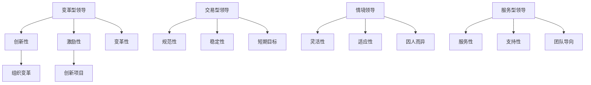

                 

# 领导力进化论：新时代管理者的领导力修炼

## 关键词
领导力、新时代、管理者、领导艺术、领导技能、变革管理

## 摘要
本文旨在探讨新时代背景下领导力的演变和提升。通过深入分析领导力的核心概念、理论框架和实践应用，本文旨在为管理者提供一套系统的领导力修炼指南，帮助他们在快速变化的环境中有效领导团队，实现组织目标。

## 引言
领导力，作为推动组织发展和变革的关键因素，一直受到管理者和研究者的关注。然而，随着全球化和数字化的深入发展，传统领导力模型和方法面临着前所未有的挑战。新时代的管理者不仅需要具备传统的管理技能，更需要适应新的环境和要求，提升自身的领导力。本文将从以下几个核心方面展开讨论：

1. 领导力的背景与演变
2. 核心领导力理论
3. 新时代管理者的领导力技能
4. 领导力的实践应用
5. 技术对领导力的影响
6. 情绪智力与领导力
7. 领导力在多元化团队中的应用

## 领导力的背景与演变
### 核心概念术语说明
在探讨领导力的背景与演变之前，我们需要明确一些核心概念术语，如领导力、管理者、组织等。

- **领导力**：指领导者通过影响力、指导力和激励力来引导和推动团队实现目标的能力。
- **管理者**：负责规划、组织、领导和控制组织资源和活动的人。
- **组织**：由一群人组成的具有共同目标和结构的集体。

### 问题背景
领导力作为一个历史悠久的概念，经历了多个阶段的发展。从早期的家长制领导，到现代的科学管理和变革型领导，每个阶段都有其特定的背景和需求。

### 问题描述
然而，在当今这个快速变化的时代，传统领导力模式已经无法完全适应新的环境和要求。管理者面临着诸多挑战，如：

- 技术变革的速度加快
- 全球化带来的文化多样性
- 员工期望的变化
- 激烈的竞争压力

### 问题解决
为了应对这些挑战，新时代的管理者需要：

- 不断更新自己的知识和技能
- 适应新的工作环境和要求
- 培养团队合作和创新精神
- 关注员工的情感和需求

### 边界与外延
领导力不仅局限于企业组织，也适用于其他类型的组织，如非营利组织、政府机构等。在不同的环境中，领导力的具体应用可能会有所不同。

### 概念结构与核心要素组成
领导力概念结构主要由以下几个要素组成：

- **目标设定**：明确组织的目标和愿景
- **决策制定**：通过分析信息做出有效决策
- **团队协作**：激发团队成员的潜力，形成协作团队
- **变革管理**：引导组织适应环境变化
- **情感智力**：理解和管理自己的情感，以及他人的情感

## 核心领导力理论
### 领导力的理论框架
领导力理论多种多样，以下介绍几种主要的领导力理论：

- **变革型领导**：通过激发团队成员的内在动机和自我实现需求，推动团队实现变革。
- **交易型领导**：通过奖励和惩罚来激励团队成员，实现短期目标。
- **情境领导**：根据不同情境和团队成员的特点，采用不同的领导风格。
- **服务型领导**：关注团队成员的需求，提供支持和服务，从而推动团队的发展。

### 概念属性特征对比表格
以下是几种领导力理论的概念属性特征对比表格：

| 领导力理论 | 定义 | 特点 | 适用场景 |
| --- | --- | --- | --- |
| 变革型领导 | 激发团队成员的内在动机 | 创新性、激励性、变革性 | 组织变革、创新项目 |
| 交易型领导 | 通过奖励和惩罚激励团队成员 | 规范性、稳定性、短期目标 | 稳定运营、常规任务 |
| 情境领导 | 根据情境和团队成员特点选择领导风格 | 灵活性、适应性、因人而异 | 多样化团队、复杂任务 |
| 服务型领导 | 关注团队成员需求，提供服务 | 服务性、支持性、团队导向 | 服务行业、团队建设 |

### ER实体关系图架构
以下是几种领导力理论的ER实体关系图：

## 新时代管理者的领导力技能
### 领导技能的重要性
新时代的管理者需要具备一系列的领导技能，以应对复杂多变的环境和挑战。以下介绍几种关键的领导技能：

- **沟通技能**：有效沟通是领导力的核心，能够帮助管理者与团队成员建立信任和合作关系。
- **决策能力**：在不确定性和压力下做出明智的决策是领导者的职责。
- **变革管理能力**：引导组织适应环境和需求变化，推动组织持续发展。
- **创新思维**：鼓励团队成员创新，推动组织发展。
- **团队协作能力**：激发团队成员的潜力，形成高效的团队。

### 实践方法
为了提升领导力技能，管理者可以采取以下实践方法：

- **定期培训**：参加领导力培训，学习最新的理论和方法。
- **角色扮演**：通过模拟场景，锻炼自己的决策能力和沟通技巧。
- **反思和总结**：定期反思自己的领导行为，总结经验教训。
- **与优秀领导者交流**：向优秀领导者学习，借鉴他们的成功经验。

## 领导力的实践应用
### 案例分析
以下是一个领导力实践应用的案例分析：

**案例背景**：某公司面临激烈的市场竞争，需要迅速调整战略以保持竞争力。

**问题描述**：公司管理层需要做出一系列决策，包括产品创新、市场拓展和团队建设。

**问题解决**：

1. **目标设定**：明确公司的愿景和目标，制定具体的行动计划。
2. **团队协作**：组建跨部门团队，激发团队成员的创新思维。
3. **变革管理**：通过内部培训和激励措施，推动员工适应新战略。
4. **沟通技能**：定期与团队成员沟通，确保信息畅通，消除误解。

**结果**：公司成功实现了战略调整，市场份额和利润都有了显著提升。

### 边界与外延
领导力的实践应用不仅限于企业组织，也适用于其他类型的组织，如政府机构、非营利组织等。在不同的环境中，领导力的具体应用可能会有所不同。

## 技术对领导力的影响
### 数字化时代的领导力挑战
在数字化时代，领导力面临着新的挑战：

- **数据驱动的决策**：领导者需要掌握数据分析技能，以做出更加明智的决策。
- **远程管理和协作**：领导者需要适应远程工作环境，提高远程管理和协作能力。
- **技术创新的引领**：领导者需要关注技术创新，推动组织实现数字化转型。

### 技术赋能的领导力
以下介绍几种技术赋能的领导力：

- **人工智能**：通过人工智能技术，领导者可以更加高效地分析和处理大量数据。
- **大数据分析**：领导者可以利用大数据分析，了解市场趋势和客户需求，做出更加精准的决策。
- **云计算**：领导者可以利用云计算技术，实现资源的弹性分配和高效管理。

## 情绪智力与领导力
### 情绪智力的重要性
情绪智力（Emotional Intelligence，简称EQ）是领导力的关键要素之一。情绪智力包括以下几个方面的能力：

- **自我意识**：了解自己的情绪，并能够进行有效的自我调节。
- **自我激励**：在面对挑战和困难时，能够保持积极的心态和动力。
- **社交意识**：理解他人的情绪和需求，建立良好的人际关系。
- **关系管理**：通过有效沟通和协作，推动团队的发展。

### 情绪智力在领导力中的应用
情绪智力在领导力中的应用主要体现在以下几个方面：

- **团队管理**：领导者通过情绪智力，能够更好地了解和满足团队成员的需求，提高团队凝聚力。
- **决策制定**：领导者通过情绪智力，能够更加冷静地分析问题和制定决策，减少冲动行为。
- **领导风格**：领导者通过情绪智力，能够根据不同情境和团队成员的特点，采用适当的领导风格。

## 领导力在多元化团队中的应用
### 多元化团队的挑战
多元化团队在带来优势的同时，也面临着一系列挑战：

- **文化差异**：团队成员来自不同的文化背景，可能存在价值观和行为习惯的差异。
- **沟通障碍**：团队成员的语言和沟通方式可能存在差异，导致沟通不畅。
- **权力分配**：多元化团队中可能存在权力分配不均的问题，导致决策效率低下。

### 多元化团队的管理策略
为了有效管理多元化团队，领导者可以采取以下策略：

- **文化敏感性**：领导者需要具备文化敏感性，尊重和理解不同文化的差异。
- **沟通技巧**：领导者需要提高沟通技巧，确保团队成员能够有效传达信息。
- **权力分配**：领导者需要合理分配权力，确保团队成员能够在决策过程中发挥积极作用。

## 总结与展望
领导力在新时代背景下具有重要意义。管理者需要不断提升自身的领导力，以应对复杂多变的环境和挑战。本文从多个角度探讨了领导力的核心概念、理论框架和实践应用，为管理者提供了一套系统的领导力修炼指南。

### 最佳实践 Tips
1. 定期进行领导力培训，提升自身知识和技能。
2. 注重团队建设，培养团队合作和创新精神。
3. 关注员工的情感和需求，建立良好的人际关系。
4. 利用技术工具，提高领导力和决策能力。

### 注意事项
1. 领导力不是一成不变的，需要不断学习和适应。
2. 领导力的发展是一个长期的过程，需要持续努力。
3. 领导力的发展需要结合具体环境和实际情况。

### 拓展阅读
1. 沃伦·本尼斯，《领导者的变革之路》
2. 丹尼斯·雷恩，《情商：为什么情商比智商更重要》
3. 彼得·德鲁克，《管理的实践》

## 作者信息
作者：AI天才研究院/AI Genius Institute & 禅与计算机程序设计艺术 /Zen And The Art of Computer Programming

