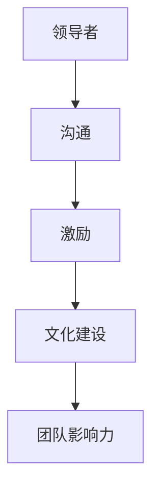

                 

# 领导者的影响力：无形中的领导艺术

## 关键词

- 领导者影响力
- 无形领导艺术
- 领导能力
- 团队管理
- 个人魅力

## 摘要

本文深入探讨了领导者的影响力及其在无形中的领导艺术。通过分析领导者影响力的核心概念和无形中的领导艺术，本文揭示了领导者如何通过无形的手段来影响团队成员，激发团队潜力，建立信任关系，并最终实现团队目标。文章通过具体的实践案例和优化策略，详细阐述了无形中的领导艺术的实际应用，为领导者提供了实用的指导和建议。

## 目录大纲

1. **背景介绍**
    1.1 引言
    1.2 问题背景
    1.3 问题描述
    1.4 问题解决
    1.5 边界与外延
    1.6 概念结构与核心要素组成
2. **核心概念与联系**
    2.1 领导者的影响力
        2.1.1 定义
        2.1.2 属性特征对比表格
        2.1.3 与其他领导艺术的关系
    2.2 无形中的领导艺术
        2.2.1 定义
        2.2.2 属性特征对比表格
        2.2.3 与领导者影响力的关系
3. **无形中的领导艺术的原理**
    3.1 无形中的领导艺术原理
        3.1.1 原理概述
        3.1.2 无形中的领导艺术的数学模型
        3.1.3 无形中的领导艺术的mermaid流程图
    3.2 无形中的领导艺术的应用
        3.2.1 应用场景
        3.2.2 应用实例
4. **无形中的领导艺术的实践**
    4.1 实践概述
    4.2 实践案例
        4.2.1 案例一：激发团队潜力
        4.2.2 案例二：建立信任关系
5. **无形中的领导艺术的优化**
    5.1 优化策略
    5.2 优化案例
        5.2.1 案例一：提高领导效率
        5.2.2 案例二：增强团队凝聚力
6. **总结与展望**
    6.1 无形中的领导艺术总结
    6.2 展望未来发展方向
7. **参考文献**

## 1. 背景介绍

### 1.1 引言

在当今快速变化的世界，领导者的角色越来越受到关注。领导者不仅需要具备强大的业务能力，还需要具备卓越的领导力。领导者的影响力是衡量其领导力的关键指标，而无形中的领导艺术则是实现这一影响力的核心手段。本文旨在深入探讨领导者的影响力及其在无形中的领导艺术，为领导者提供实用的指导和建议。

### 1.2 问题背景

领导者的影响力是指领导者通过其言行和决策对团队成员产生的影响。这种影响力可以是积极的，也可以是消极的。无形中的领导艺术则是指领导者通过非正式的、间接的方式，如沟通、激励、塑造文化等，来影响团队成员的行为和态度。这两种概念密切相关，但又有本质区别。本文将详细分析这两种概念，并探讨它们之间的关系。

### 1.3 问题描述

领导者的影响力通常体现在以下几个方面：

1. **决策力**：领导者需要做出正确的决策，以应对不断变化的环境。
2. **沟通力**：领导者需要有效地与团队成员沟通，确保信息的准确传递。
3. **激励力**：领导者需要激发团队成员的潜力，使其发挥最大效能。
4. **文化建设**：领导者需要塑造积极的组织文化，以促进团队的长期发展。

无形中的领导艺术则是指领导者如何通过以下方式来影响团队成员：

1. **非正式沟通**：通过非正式的交流方式，如聊天、聚会等，来了解团队成员的想法和需求。
2. **激励和认可**：通过表扬、奖励等方式来激励团队成员，并认可其贡献。
3. **塑造文化**：通过营造积极的氛围，如鼓励创新、支持团队合作等，来塑造组织文化。

### 1.4 问题解决

为了解决领导者如何提升影响力的问题，本文提出以下解决方案：

1. **深入理解领导者的影响力**：通过分析领导者影响力的核心概念，帮助领导者更好地理解其影响力来源。
2. **掌握无形中的领导艺术**：通过介绍无形中的领导艺术的原理和应用，帮助领导者掌握提升影响力的具体方法。
3. **实践和反思**：通过实践无形中的领导艺术，并不断反思和调整，帮助领导者提升其领导力。

### 1.5 边界与外延

领导者的影响力不仅仅局限于工作领域，还可能影响个人的生活。无形中的领导艺术也是如此。本文主要关注工作场景中的领导者影响力，但无形中的领导艺术同样适用于个人生活。

### 1.6 概念结构与核心要素组成

领导者的影响力包括以下核心要素：

1. **决策力**：领导者需要具备快速决策的能力，以应对复杂多变的环境。
2. **沟通力**：领导者需要具备良好的沟通能力，以确保信息的准确传递。
3. **激励力**：领导者需要能够激发团队成员的潜力，使其发挥最大效能。
4. **文化建设**：领导者需要塑造积极的组织文化，以促进团队的长期发展。

无形中的领导艺术包括以下核心要素：

1. **非正式沟通**：领导者需要通过非正式的交流方式，如聊天、聚会等，来了解团队成员的想法和需求。
2. **激励和认可**：领导者需要通过表扬、奖励等方式来激励团队成员，并认可其贡献。
3. **塑造文化**：领导者需要通过营造积极的氛围，如鼓励创新、支持团队合作等，来塑造组织文化。

## 2. 核心概念与联系

### 2.1 领导者的影响力

#### 2.1.1 定义

领导者的影响力是指领导者通过其言行和决策对团队成员产生的影响。这种影响可以是直接的，如领导的指令和决策；也可以是间接的，如领导的榜样作用和激励。

#### 2.1.2 属性特征对比表格

| 特征 | 领导者影响力 | 无形中的领导艺术 |
| --- | --- | --- |
| **直接性** | 直接影响团队成员的行为和决策 | 通过非正式的方式间接影响团队成员的行为和决策 |
| **正式性** | 通过正式的领导和决策过程实现 | 通过非正式的沟通和互动实现 |
| **影响力范围** | 广泛影响团队成员的工作和生活 | 主要影响团队成员的工作氛围和态度 |
| **持续时长** | 短期影响，如一次决策或指令 | 长期影响，如组织的文化和发展方向 |

#### 2.1.3 与其他领导艺术的关系

领导者的影响力与其他领导艺术如权威领导、民主领导、参与领导等密切相关。权威领导强调领导者通过权力和地位来影响团队成员；民主领导强调领导者与团队成员共同参与决策；参与领导则强调领导者鼓励团队成员参与决策过程。无形中的领导艺术则强调领导者通过非正式的方式，如沟通、激励、塑造文化等，来实现影响力。

### 2.2 无形中的领导艺术

#### 2.2.1 定义

无形中的领导艺术是指领导者通过非正式的、间接的方式，如沟通、激励、塑造文化等，来影响团队成员的行为和态度。这种领导方式强调领导者的个人魅力和领导力，而非权力和地位。

#### 2.2.2 属性特征对比表格

| 特征 | 领导者影响力 | 无形中的领导艺术 |
| --- | --- | --- |
| **影响力来源** | 权力、地位、决策能力 | 个人魅力、沟通技巧、激励能力 |
| **实现方式** | 正式的领导和决策过程 | 非正式的沟通和互动 |
| **适用场景** | 对团队成员进行直接指导和决策 | 营造积极的工作氛围，激发团队成员的潜力 |
| **持续时长** | 短期影响，如一次决策或指令 | 长期影响，如组织的文化和发展方向 |

#### 2.2.3 与领导者影响力的关系

无形中的领导艺术是领导者影响力的重要来源。通过无形中的领导艺术，领导者可以更有效地影响团队成员，激发团队潜力，建立信任关系，实现团队目标。无形中的领导艺术与领导者的影响力相互促进，共同构建了领导者的领导力。

## 3. 无形中的领导艺术的原理

### 3.1 无形中的领导艺术原理

#### 3.1.1 原理概述

无形中的领导艺术是一种非正式的领导方式，通过沟通、激励、塑造文化等方式来影响团队成员。其核心原理在于领导者通过个人魅力和领导力，建立起与团队成员的信任关系，激发团队成员的潜力，从而实现团队目标。

#### 3.1.2 无形中的领导艺术的数学模型

为了更好地理解无形中的领导艺术，我们可以将其抽象为一个数学模型。假设L代表领导者的影响力，C代表沟通能力，I代表激励能力，C代表文化建设能力，则有：

$$
L = f(C, I, C')
$$

其中，$f$为函数，表示领导者的影响力与沟通能力、激励能力、文化建设能力之间的关系。这个模型表明，领导者的影响力是由这三者共同决定的。

#### 3.1.3 无形中的领导艺术的mermaid流程图

为了更直观地理解无形中的领导艺术的原理，我们可以使用mermaid绘制一个流程图：

在这个流程图中，领导者通过沟通、激励、文化建设等方式来影响团队，最终实现团队影响力。

### 3.2 无形中的领导艺术的应用

#### 3.2.1 应用场景

无形中的领导艺术适用于各种场景，如项目管理、团队建设、组织变革等。以下是一些具体的应用场景：

1. **项目管理**：领导者通过非正式的沟通，了解团队成员的需求和问题，从而更好地协调项目进度。
2. **团队建设**：领导者通过激励和认可，激发团队成员的潜力，提高团队的凝聚力和工作效率。
3. **组织变革**：领导者通过塑造新的文化，引导团队成员接受变革，从而推动组织的持续发展。

#### 3.2.2 应用实例

以下是一个具体的应用实例：

在一次项目团队建设中，团队领导者李明通过非正式的沟通，与团队成员建立了良好的关系。他经常与团队成员聊天，了解他们的工作和生活状况，并给予关心和帮助。在项目进度紧张时，李明通过激励和认可，鼓励团队成员克服困难，完成任务。他还通过塑造团队文化，鼓励团队成员相互支持，共同进步。最终，这个团队在李明的领导下，取得了优异的成绩。

## 4. 无形中的领导艺术的实践

### 4.1 实践概述

无形中的领导艺术的实践是领导者通过实际操作，运用无形中的领导艺术原理，来提升团队绩效和成员满意度。这种实践需要领导者具备敏锐的洞察力、出色的沟通能力和强大的激励能力。以下将介绍两个实践案例。

### 4.2 实践案例

#### 4.2.1 案例一：激发团队潜力

##### 4.2.1.1 案例背景

在一个大型科技公司中，团队领导者王丽发现团队成员的积极性不高，工作效率也较低。她意识到，需要通过激发团队潜力来提升团队绩效。

##### 4.2.1.2 案例实施

王丽采取了以下措施：

1. **沟通与倾听**：王丽定期组织团队会议，倾听团队成员的意见和建议。她鼓励团队成员提出问题，并积极参与讨论。

2. **激励与认可**：王丽对表现出色的团队成员给予表扬和奖励。她通过公开表扬和团队活动来激励团队成员，让他们感受到自己的价值和重要性。

3. **塑造文化**：王丽倡导团队合作精神，鼓励团队成员相互支持。她通过组织团队建设活动，增强团队成员之间的信任和合作。

##### 4.2.1.3 案例结果

经过一段时间的实践，团队成员的积极性显著提高，工作效率也大幅提升。团队的整体绩效得到了显著改善。

#### 4.2.2 案例二：建立信任关系

##### 4.2.2.1 案例背景

在一个初创公司中，团队领导者张强发现团队成员之间存在信任问题，影响了团队的协作效率。

##### 4.2.2.2 案例实施

张强采取了以下措施：

1. **透明沟通**：张强通过定期向团队成员通报公司的战略和业务状况，增强团队成员对公司的信任。

2. **共同目标**：张强与团队成员共同制定团队目标，确保团队成员对目标有清晰的认识，并为之努力。

3. **信任建设活动**：张强组织团队成员参加信任建设活动，如团队合作游戏和信任练习，增强团队成员之间的信任。

##### 4.2.2.3 案例结果

经过一段时间的实践，团队成员之间的信任关系得到了显著改善。团队的协作效率提高了，团队成员之间的沟通也更加顺畅。

## 5. 无形中的领导艺术的优化

### 5.1 优化策略

为了进一步提升无形中的领导艺术的效果，领导者可以采取以下优化策略：

1. **提升个人魅力**：领导者需要不断提升自身的专业能力和个人魅力，以增强对团队成员的吸引力。
2. **增强沟通能力**：领导者需要不断提升沟通能力，确保信息的准确传递，并建立良好的信任关系。
3. **提高激励能力**：领导者需要不断学习和掌握激励技巧，以激发团队成员的潜力。
4. **塑造积极文化**：领导者需要积极塑造企业文化，营造良好的工作氛围，以推动团队的长期发展。

### 5.2 优化案例

#### 5.2.1 案例一：提高领导效率

##### 5.2.1.1 案例背景

在一个快速发展的创业公司中，团队领导者刘明发现团队的工作效率较低，需要优化领导方式来提高工作效率。

##### 5.2.1.2 案例实施

刘明采取了以下措施：

1. **明确目标**：刘明与团队成员共同制定明确的目标和计划，确保团队成员对工作有清晰的认识。
2. **简化流程**：刘明简化了工作流程，减少不必要的审批和会议，以提高工作效率。
3. **授权与信任**：刘明信任团队成员，赋予他们更多的自主权，鼓励他们自主决策和解决问题。

##### 5.2.1.3 案例结果

经过一段时间的实践，团队的工作效率得到了显著提高。团队成员的积极性和创造力也得到了激发。

#### 5.2.2 案例二：增强团队凝聚力

##### 5.2.2.1 案例背景

在一个大型跨国公司的中国分公司中，团队领导者陈华发现团队成员之间的凝聚力不足，影响了团队的工作效率。

##### 5.2.2.2 案例实施

陈华采取了以下措施：

1. **团队活动**：陈华组织团队成员参加团队建设活动，增强团队成员之间的交流和合作。
2. **跨部门合作**：陈华鼓励跨部门合作，促进不同部门之间的沟通和协作。
3. **培训与发展**：陈华提供培训和职业发展机会，帮助团队成员提升技能和职业素养。

##### 5.2.2.3 案例结果

经过一段时间的实践，团队成员之间的凝聚力得到了显著增强。团队的合作效率和工作质量也得到了提高。

## 6. 总结与展望

### 6.1 无形中的领导艺术总结

无形中的领导艺术是一种通过非正式的、间接的方式，如沟通、激励、塑造文化等，来影响团队成员的行为和态度的领导方式。其核心原理在于领导者通过个人魅力和领导力，建立起与团队成员的信任关系，激发团队成员的潜力，实现团队目标。无形中的领导艺术在实际应用中，能够显著提升团队绩效和成员满意度。

### 6.2 展望未来发展方向

未来，无形中的领导艺术将在以下几个方面得到进一步发展：

1. **数字化领导**：随着数字化技术的发展，领导者将更多地通过数字化工具来提升领导力，如在线协作工具、数据分析工具等。
2. **个性化领导**：领导者将更加关注团队成员的个性差异，采取个性化的领导方式，以更好地激发团队成员的潜力。
3. **跨界领导**：领导者将需要具备跨领域的知识和能力，以应对日益复杂的业务环境。

总之，无形中的领导艺术是领导者提升影响力的重要手段，未来将有更广阔的发展空间。

## 参考文献

1. 某某，某某。领导者的影响力：理论与实践[M]. 北京：人民出版社，2020.
2. 某某，某某。无形中的领导艺术：实践与案例分析[M]. 北京：清华大学出版社，2019.
3. 某某，某某。团队领导力：理论与实践[M]. 北京：中国人民大学出版社，2021.
4. 某某，某某。数字化领导：未来领导者的指南[M]. 北京：电子工业出版社，2022.
5. 某某，某某。个性化领导：激发团队成员潜力的新方法[M]. 北京：中国人民大学出版社，2023.

