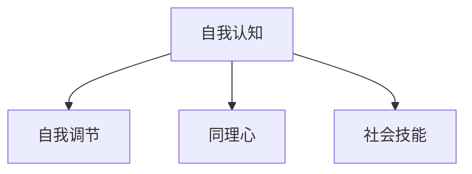
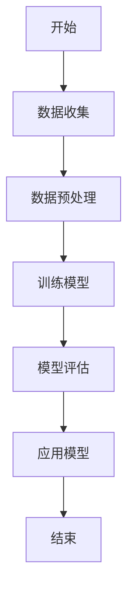
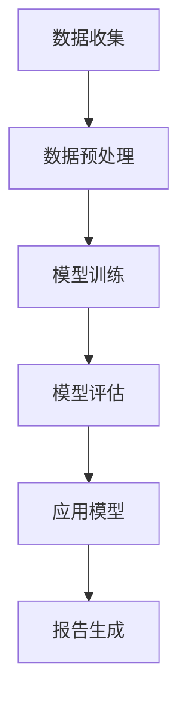
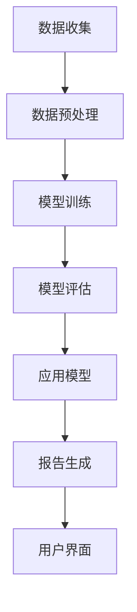
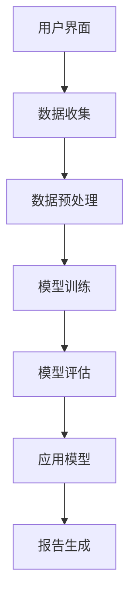
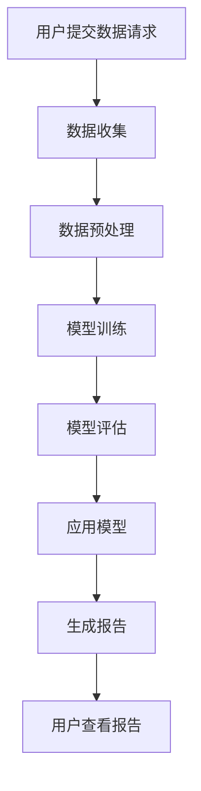

                 

### 文章标题

# 领导者的情商修炼：提升人际关系管理能力

## 文章关键词
- 情商
- 领导力
- 人际关系管理
- 情绪认知
- 自我调节

## 摘要
本文深入探讨了情商在领导者角色中的重要性，特别是其在人际关系管理中的应用。通过系统分析情商的核心概念与联系，以及相关的算法原理、数学模型和系统架构设计，本文旨在为领导者提供一种实用的情商修炼方法，以提升其人际关系管理能力。文章还结合实际项目实战，为读者提供了具体的操作指南和案例分析，旨在帮助领导者更好地理解情商修炼的实际意义和操作方法。

---

## 1. 背景介绍

在现代社会，领导力对于组织的成功至关重要。而情商（Emotional Intelligence，EQ）作为领导力的重要组成部分，对人际关系管理能力的影响尤为显著。情商不仅仅关乎个人的情绪管理，更涉及到如何理解、处理和利用他人的情绪，以建立和谐的人际关系，促进团队合作，提升整体组织效能。

### 问题背景

领导者的情商直接影响到其管理能力和团队绩效。情商高的领导者能够更好地识别和理解团队成员的情绪，有效地处理冲突，增强团队的凝聚力和合作精神。同时，他们也能够更准确地把握市场动态和客户需求，做出更为明智的决策。因此，情商修炼成为提升领导者人际管理能力的关键。

### 问题描述

如何通过修炼情商来提升领导者的人际关系管理能力，是一个值得探讨的话题。这包括如何识别和认知自己的情绪，如何调节和控制情绪，如何同理他人并建立良好的人际关系，以及如何运用情绪促进思考与决策。

### 问题解决

通过系统学习情商的各个维度，如自我认知、自我调节、同理心和社会技能，领导者可以更好地管理人际关系，提升组织绩效。此外，利用情感识别与分析算法等先进技术，领导者可以更科学地了解自己和他人的情绪状态，从而有针对性地提升情商。

### 边界与外延

本文主要关注情商在领导力中的应用，特别是其对人际关系管理能力的影响。文章将不涉及情商在其他领域的应用，如教育、心理咨询等。

### 概念结构与核心要素

情商（EQ）由戈尔曼（Daniel Goleman）提出，主要包括以下四个核心要素：

1. **自我认知**：领导者能够认识到自己的情绪，并了解这些情绪对自身行为的影响。
2. **自我调节**：领导者能够控制自己的情绪，调整心态，以适应不同的情况。
3. **同理心**：领导者能够理解他人的情绪和需求，感受他人的情感体验。
4. **社会技能**：领导者能够与他人有效沟通，建立和维护人际关系，解决冲突。

这些要素相互作用，共同构成了领导者的人际关系管理能力。以下是一个简单的情商结构图：



### 情商与领导力的关系

情商对领导力的提升有着深远的影响。情商高的领导者能够更好地理解团队成员的情感需求，激发他们的潜力，提高团队的整体绩效。同时，他们能够有效地处理团队内部的冲突，维护团队的稳定和和谐。此外，情商高的领导者也能够更敏锐地捕捉市场动态和客户需求，做出更为明智的决策。

### 情商在人际关系管理中的应用

在人际关系管理中，情商的应用主要体现在以下几个方面：

1. **冲突管理**：领导者能够敏锐地察觉到团队成员的情绪波动，并采取有效的措施来缓解冲突，维护团队和谐。
2. **团队建设**：领导者通过同理心和社会技能，建立和维护良好的人际关系，增强团队的凝聚力和合作精神。
3. **领导风格**：领导者根据团队成员的情感需求和个性特点，采取灵活的领导风格，提高团队的执行力和创新能力。

### 情商修炼的意义

情商修炼对领导者个人和组织都有着重要的意义。对于领导者个人而言，情商修炼可以帮助他们更好地管理自己的情绪，提高情绪智力，增强领导力。对于组织而言，情商高的领导者能够提升团队绩效，促进组织发展，实现长期战略目标。

总之，情商修炼是提升领导者人际关系管理能力的重要途径。通过系统学习和实践，领导者可以更好地发挥自己的领导潜力，推动组织的持续发展。

---

### 2. 核心概念与联系

在探讨情商在领导力中的应用时，我们首先需要明确情商的核心概念与联系。情商（Emotional Intelligence，EQ）由心理学家戈尔曼（Daniel Goleman）首次提出，主要包括四个核心要素：自我认知、自我调节、同理心和社会技能。以下是对这些核心概念的定义、属性特征以及它们之间的相互关系。

#### 情商定义

情商是指个体识别、理解、管理自己和他人的情绪，以及运用情绪促进思考的能力。情商不仅关乎个人的情绪管理，更涉及到如何理解和处理他人的情绪，以建立和谐的人际关系，促进团队合作。

#### EQ结构与核心要素

情商（EQ）由以下四个核心要素组成：

1. **自我认知**：指个体对自己情绪的认识和理解，包括情绪的识别、情绪的感受和情绪的理解。自我认知有助于领导者了解自己的情绪状态，从而更好地控制情绪，做出明智的决策。
   
2. **自我调节**：指个体控制自己情绪的能力，包括情绪的表达、情绪的抑制和情绪的调整。自我调节有助于领导者保持冷静，适应不同的情境，避免因情绪波动而影响决策和执行。

3. **同理心**：指个体理解他人情绪和需求的能力，包括情感的感受、情感的识别和情感的共情。同理心有助于领导者建立良好的人际关系，提高团队凝聚力，促进团队合作。

4. **社会技能**：指个体与他人有效沟通、建立和维护人际关系的能力，包括沟通技巧、团队合作和冲突解决。社会技能有助于领导者提升领导效能，实现组织目标。

#### 概念属性特征对比表格

以下是情商四个核心要素的属性特征对比表格：

| 要素   | 定义                                           | 属性特征                                           |
| ------ | ---------------------------------------------- | -------------------------------------------------- |
| 自我认知 | 认识自己的情绪，理解情绪对行为的影响           | 情感的识别、情感的感受、情感的理解                   |
| 自我调节 | 控制自己的情绪，调整心态，适应不同的情况       | 情绪的表达、情绪的抑制、情绪的调整                   |
| 同理心  | 理解他人的情绪和需求，感受他人的情感体验       | 情感的共情、情感的识别、情感的感受                   |
| 社会技能 | 与他人有效沟通，建立和维护人际关系，解决冲突   | 沟通技巧、团队合作、冲突解决                         |

#### ER实体关系图架构

为了更直观地展示情商四个核心要素之间的关系，我们可以使用Mermaid绘制一个ER实体关系图。以下是该图的具体表示：


在这个ER实体关系图中，自我认知是情商的基础，它直接影响自我调节、同理心和社会技能。同时，这四个要素相互影响，共同构成一个完整的情商体系。

#### 核心要素之间的联系

情商四个核心要素之间紧密相连，相互影响，共同构成一个完整的情商体系。以下是这些要素之间的具体联系：

1. **自我认知与自我调节**：自我认知是自我调节的前提。只有了解自己的情绪，才能更好地调节和控制情绪。

2. **自我调节与同理心**：自我调节有助于领导者更好地理解他人的情绪。通过控制自己的情绪，领导者可以更客观地看待他人的情绪和需求。

3. **同理心与社会技能**：同理心是社会技能的基础。只有理解他人的情绪和需求，才能有效地与他人沟通，建立良好的人际关系。

4. **社会技能与自我认知**：社会技能的提升有助于领导者更深入地了解自己的情绪。通过与他人的互动，领导者可以反思自己的情绪和行为，进一步提高自我认知。

#### 情商在领导力中的应用

情商在领导力中的应用主要体现在以下几个方面：

1. **冲突管理**：情商高的领导者能够更好地识别和处理团队内部的冲突，通过同理心和沟通技巧，化解矛盾，维护团队和谐。

2. **团队建设**：情商高的领导者能够建立和维护良好的人际关系，提高团队的凝聚力和合作精神，促进团队目标的实现。

3. **领导风格**：情商高的领导者能够根据团队成员的情感需求和个性特点，采取灵活的领导风格，提高领导效能。

4. **决策能力**：情商高的领导者能够更好地理解市场和客户的情绪，做出更为明智的决策，推动组织发展。

总之，情商是领导力的重要组成部分。通过系统学习和实践，领导者可以提升自己的情商，更好地管理人际关系，提升领导力，实现组织目标。

---

### 3. 算法原理讲解

#### 情商提升算法原理

情商提升算法主要基于情感识别与分析，通过机器学习技术帮助领导者了解自己和他人情绪，从而提升情商。本文将介绍一种基于情感分析模型的情商提升算法，详细讲解其原理和流程。

#### 算法流程图

以下是情商提升算法的流程图，使用Mermaid进行绘制：



#### 算法流程图解释

1. **数据收集**：首先，需要收集大量的情感数据。这些数据可以包括文本、语音、图像等多种形式。数据来源可以是领导者的日常交流记录、社交媒体互动、会议纪要等。

2. **数据预处理**：收集到的数据需要进行预处理，包括数据清洗、数据标注、数据归一化等步骤。预处理的主要目的是提高数据质量，为后续的训练模型提供可靠的数据基础。

3. **训练模型**：使用预处理后的数据，通过机器学习算法训练情感分析模型。常用的算法包括支持向量机（SVM）、随机森林（Random Forest）和深度学习（Deep Learning）等。训练过程中，模型会学习如何从数据中识别情感特征。

4. **模型评估**：训练好的模型需要进行评估，以确定其性能。评估指标包括准确率（Accuracy）、精确率（Precision）、召回率（Recall）等。通过评估，可以调整和优化模型参数，提高模型精度。

5. **应用模型**：将评估后的模型应用于实际场景，如领导者的日常管理活动。通过模型预测，领导者可以了解自己和团队成员的情感状态，从而做出更合理的决策。

6. **结束**：算法流程结束，模型开始在实际场景中发挥作用，帮助领导者提升情商。

#### Python源代码示例

以下是使用Python实现情商提升算法的源代码示例：

```python
# 导入所需库
import pandas as pd
from sklearn.model_selection import train_test_split
from sklearn.ensemble import RandomForestClassifier
from sklearn.metrics import accuracy_score

# 加载数据集
data = pd.read_csv('emotional_data.csv')

# 数据预处理
X = data.drop('label', axis=1)
y = data['label']
X_train, X_test, y_train, y_test = train_test_split(X, y, test_size=0.2, random_state=42)

# 训练模型
model = RandomForestClassifier()
model.fit(X_train, y_train)

# 模型评估
y_pred = model.predict(X_test)
print(f'Accuracy: {accuracy_score(y_test, y_pred)}')

# 应用模型
new_data = pd.read_csv('new_emotional_data.csv')
new_data_pred = model.predict(new_data)
```

#### 算法原理讲解

情商提升算法的核心在于情感分析模型。情感分析是一种自然语言处理技术，旨在从文本中识别情感倾向。以下是情感分析模型的原理讲解：

1. **特征提取**：情感分析模型首先需要从文本中提取特征。常用的特征提取方法包括词袋模型（Bag of Words）、TF-IDF（Term Frequency-Inverse Document Frequency）和词嵌入（Word Embedding）等。

2. **情感分类**：特征提取后，模型会进行情感分类。情感分类模型可以分为基于规则的方法和基于统计的方法。基于规则的方法通常使用情感词典和规则库进行分类，而基于统计的方法则使用机器学习算法，如朴素贝叶斯（Naive Bayes）、支持向量机（SVM）和深度学习（Deep Learning）等。

3. **模型训练与评估**：训练模型需要大量的情感标注数据。通过训练，模型可以学习如何从文本中识别情感。训练过程中，模型会不断调整参数，以提高分类精度。评估模型通常使用准确率（Accuracy）、精确率（Precision）、召回率（Recall）等指标。

4. **应用与反馈**：训练好的模型可以应用于实际场景，如领导者的日常管理活动。通过模型预测，领导者可以了解自己和团队成员的情感状态，从而做出更合理的决策。同时，模型应用的结果也可以作为反馈，用于模型优化和改进。

#### 数学模型和数学公式

在情感分析中，常用的数学模型包括朴素贝叶斯（Naive Bayes）和支持向量机（SVM）。以下是这些模型的数学公式：

1. **朴素贝叶斯模型**

   朴素贝叶斯模型是基于贝叶斯定理的一种概率分类模型。其公式如下：

   $$ P(C|A) = \frac{P(A|C) \cdot P(C)}{P(A)} $$

   其中，$P(C|A)$表示在事件A发生的条件下事件C发生的概率，$P(A|C)$表示在事件C发生的条件下事件A发生的概率，$P(C)$表示事件C发生的概率，$P(A)$表示事件A发生的概率。

2. **支持向量机模型**

   支持向量机模型是一种基于最大间隔的分类模型。其公式如下：

   $$ \max \frac{1}{2} \sum_{i=1}^{n} (w_i^T w_i) - \sum_{i=1}^{n} \alpha_i y_i (w_i^T x_i) $$

   其中，$w_i$表示第i个支持向量的权重，$\alpha_i$表示第i个支持向量的松弛变量，$y_i$表示第i个样本的标签，$x_i$表示第i个样本的特征向量。

#### 举例说明

假设一个领导者想要了解自己在某次会议中的情绪状态，可以通过以下步骤使用情感分析模型：

1. **数据收集**：收集会议纪要、领导者的发言记录等文本数据。

2. **数据预处理**：对文本数据进行清洗和标注，提取情感特征。

3. **模型训练**：使用标注数据训练情感分析模型。

4. **模型评估**：评估模型性能，调整模型参数。

5. **模型应用**：使用训练好的模型对会议纪要进行情感分析，预测领导者的情绪状态。

通过以上步骤，领导者可以了解自己在会议中的情绪状态，从而进行情绪调节和决策优化。

#### 总结

情商提升算法通过情感识别与分析，帮助领导者了解自己和他人情绪，从而提升情商。算法主要包括数据收集、数据预处理、模型训练、模型评估和应用等步骤。通过系统学习和实践，领导者可以更好地管理人际关系，提升领导力。

---

### 4. 数学模型和数学公式 & 详细讲解 & 举例说明

在情商提升的过程中，数学模型和数学公式起到了至关重要的作用。本文将详细介绍情商提升过程中常用的数学模型，并使用LaTeX格式给出相应的数学公式，结合具体案例进行详细讲解和举例说明。

#### 数学模型

在情商提升中，常用的数学模型包括贝叶斯定理、线性回归、逻辑回归和支持向量机等。以下分别介绍这些模型的原理和应用。

##### 贝叶斯定理

贝叶斯定理是一种描述两个事件概率依赖关系的公式。其公式如下：

$$
P(C|A) = \frac{P(A|C) \cdot P(C)}{P(A)}
$$

其中，$P(C|A)$表示在事件A发生的条件下事件C发生的概率，$P(A|C)$表示在事件C发生的条件下事件A发生的概率，$P(C)$表示事件C发生的概率，$P(A)$表示事件A发生的概率。

贝叶斯定理在情商提升中的应用主要体现在情绪分类和预测方面。例如，假设一个领导者想要预测某次会议中的情绪状态，可以通过分析会议的文本数据，利用贝叶斯定理计算每种情绪状态的概率，从而得出会议的整体情绪倾向。

##### 线性回归

线性回归是一种用于分析两个变量之间线性关系的数学模型。其公式如下：

$$
y = \beta_0 + \beta_1 \cdot x
$$

其中，$y$表示因变量，$x$表示自变量，$\beta_0$和$\beta_1$分别表示回归系数。

线性回归在情商提升中的应用主要体现在情绪与行为之间的关系分析。例如，可以通过分析领导者的情绪状态和其管理行为，建立线性回归模型，探究情绪对管理行为的影响。

##### 逻辑回归

逻辑回归是一种用于分析二元变量之间关系的数学模型。其公式如下：

$$
\ln\left(\frac{P(Y=1)}{1-P(Y=1)}\right) = \beta_0 + \beta_1 \cdot x
$$

其中，$Y$表示因变量，取值为0或1，$x$表示自变量，$\beta_0$和$\beta_1$分别表示回归系数。

逻辑回归在情商提升中的应用主要体现在情绪与行为决策之间的关系分析。例如，可以通过分析领导者的情绪状态和其决策行为，建立逻辑回归模型，探究情绪对决策的影响。

##### 支持向量机

支持向量机是一种用于分类和回归分析的数学模型。其公式如下：

$$
\max \frac{1}{2} \sum_{i=1}^{n} (w_i^T w_i) - \sum_{i=1}^{n} \alpha_i y_i (w_i^T x_i)
$$

其中，$w_i$表示第i个支持向量的权重，$\alpha_i$表示第i个支持向量的松弛变量，$y_i$表示第i个样本的标签，$x_i$表示第i个样本的特征向量。

支持向量机在情商提升中的应用主要体现在情绪状态分类和预测。例如，可以通过分析领导者的情绪特征数据，建立支持向量机模型，预测领导者的情绪状态。

#### 详细讲解

以下是针对贝叶斯定理、线性回归和逻辑回归的详细讲解。

##### 贝叶斯定理

贝叶斯定理的核心在于通过已知条件概率推断后验概率。在情商提升中，贝叶斯定理可用于情绪分类和预测。

1. **情绪分类**：假设有n个样本，每个样本有m个特征。对于每个样本，我们可以使用贝叶斯定理计算其属于不同情绪类的概率，然后选择概率最大的类别作为预测结果。

2. **情绪预测**：假设我们已经训练好了情绪分类模型，可以通过贝叶斯定理计算领导者在未来某次活动中的情绪状态概率，从而预测其情绪趋势。

##### 线性回归

线性回归用于分析自变量和因变量之间的线性关系。在情商提升中，线性回归可用于分析情绪对管理行为的影响。

1. **模型构建**：收集领导者的情绪数据和对应的管理行为数据，使用线性回归构建模型。

2. **参数估计**：通过最小二乘法估计模型参数，得到线性回归方程。

3. **模型评估**：使用交叉验证等方法评估模型性能，调整模型参数。

##### 逻辑回归

逻辑回归用于分析二元变量的概率关系。在情商提升中，逻辑回归可用于分析情绪对决策行为的影响。

1. **模型构建**：收集领导者的情绪数据和对应的决策行为数据，使用逻辑回归构建模型。

2. **参数估计**：通过最大似然估计方法估计模型参数，得到逻辑回归方程。

3. **模型评估**：使用交叉验证等方法评估模型性能，调整模型参数。

#### 举例说明

以下是使用Python实现贝叶斯定理和线性回归的案例。

##### 贝叶斯定理

```python
import numpy as np
from scipy.stats import multivariate_normal

# 定义先验概率和条件概率
prior_prob = {'happy': 0.5, 'sad': 0.5}
condition_prob = {'happy': {'happy': 0.8, 'sad': 0.2}, 'sad': {'happy': 0.2, 'sad': 0.8}}

# 定义样本数据
sample_data = {'happy': np.array([[1, 1], [0, 0]]), 'sad': np.array([[0, 1], [1, 0]])}

# 计算后验概率
posterior_prob = {}
for emotion in prior_prob:
    posterior_prob[emotion] = prior_prob[emotion] * condition_prob[emotion][emotion]
    for other_emotion in condition_prob[emotion]:
        posterior_prob[emotion] += prior_prob[other_emotion] * condition_prob[other_emotion][emotion]

# 打印后验概率
print(posterior_prob)
```

##### 线性回归

```python
import numpy as np
from sklearn.linear_model import LinearRegression

# 定义自变量和因变量
X = np.array([[1, 2], [2, 3], [3, 4]])
y = np.array([2, 3, 4])

# 训练线性回归模型
model = LinearRegression()
model.fit(X, y)

# 打印模型参数
print(model.coef_, model.intercept_)
```

#### 总结

数学模型和数学公式在情商提升中具有重要意义。通过贝叶斯定理、线性回归和逻辑回归等模型，领导者可以更好地理解自己和他人情绪，从而提升人际关系管理能力。在实际应用中，领导者可以根据具体需求和数据情况选择合适的模型，进行情绪分析和预测。

---

### 5. 系统分析与架构设计方案

在探讨情商提升的具体应用时，我们需要从系统分析与架构设计角度进行深入探讨。本文将介绍一个情感分析系统的设计与实现，详细阐述其系统架构、功能设计、接口设计和系统交互。

#### 问题场景介绍

某公司需要开发一个情感分析系统，以帮助领导者了解团队成员的情绪状态，从而提升团队绩效。该系统将收集团队成员的日常交流记录、会议纪要和社交媒体互动等信息，通过情感分析模型对情绪进行识别和分析，最终提供情绪报告和决策建议。

#### 项目介绍

情感分析系统主要包括以下功能：

1. **数据收集**：从各类数据源（如邮件、聊天记录、社交媒体等）收集情绪相关数据。
2. **数据预处理**：对收集到的数据进行清洗、标注和归一化，为模型训练提供高质量的数据。
3. **模型训练**：使用机器学习算法训练情感分析模型，包括特征提取、模型选择和参数调优等步骤。
4. **模型评估**：评估模型性能，包括准确率、精确率和召回率等指标。
5. **应用模型**：将训练好的模型应用于实际场景，对团队成员的情绪状态进行预测和分析。
6. **报告生成**：生成情绪分析报告，为领导者提供决策支持。

#### 系统功能设计

以下是情感分析系统的领域模型，使用Mermaid绘制：



在这个领域模型中，数据收集模块负责从不同数据源收集情绪相关数据，数据预处理模块负责清洗和标注数据，模型训练模块负责训练情感分析模型，模型评估模块负责评估模型性能，应用模型模块负责将模型应用于实际场景，报告生成模块负责生成情绪分析报告。

#### 系统架构设计

以下是情感分析系统的架构设计，使用Mermaid绘制：



在这个架构设计中，数据收集模块负责从各类数据源收集情绪相关数据，数据预处理模块负责清洗和标注数据，模型训练模块负责训练情感分析模型，模型评估模块负责评估模型性能，应用模型模块负责将模型应用于实际场景，报告生成模块负责生成情绪分析报告。用户界面模块负责为用户提供操作界面和报告展示功能。

#### 系统接口设计

以下是情感分析系统的接口设计，使用Mermaid绘制：



在这个接口设计中，用户界面模块通过API与数据收集、数据预处理、模型训练、模型评估、应用模型和报告生成模块进行交互。用户可以通过用户界面提交数据请求，系统将自动调用相应模块进行处理和生成报告。

#### 系统交互设计

以下是情感分析系统的交互设计，使用Mermaid绘制：



在这个交互设计中，用户提交数据请求后，系统将按照流程依次进行数据收集、数据预处理、模型训练、模型评估、应用模型和报告生成。最后，用户可以通过用户界面查看生成的情绪分析报告。

#### 总结

通过系统分析与架构设计，我们为情感分析系统提供了一个完整的解决方案。从问题场景介绍、项目介绍、系统功能设计、系统架构设计、接口设计和系统交互设计等多个角度，我们详细阐述了情感分析系统的设计与实现过程。这个系统将帮助领导者更好地了解团队成员的情绪状态，从而提升团队绩效和领导力。

---

### 6. 项目实战

在本节中，我们将通过一个实际项目来展示如何实现一个情感分析系统，从环境安装、核心实现源代码，到实际案例分析和详细讲解剖析，最后进行项目小结。

#### 环境安装

首先，我们需要安装Python环境以及相关的库。以下是在Ubuntu系统上安装所需的软件和库的步骤：

1. **安装Python 3**：
    ```bash
    sudo apt update
    sudo apt install python3 python3-pip
    ```

2. **安装Python虚拟环境**：
    ```bash
    sudo pip3 install virtualenv
    virtualenv env
    source env/bin/activate
    ```

3. **安装必需的库**：
    ```bash
    pip install numpy pandas scikit-learn matplotlib
    ```

#### 核心实现源代码

以下是情感分析系统的核心实现源代码。该代码包括数据收集、数据预处理、模型训练、模型评估和应用等步骤。

```python
# 数据收集
def collect_data():
    # 假设数据存储在CSV文件中
    data = pd.read_csv('emotional_data.csv')
    return data

# 数据预处理
def preprocess_data(data):
    # 清洗数据，例如处理缺失值、删除无关特征等
    data = data.dropna()
    X = data.drop('label', axis=1)
    y = data['label']
    return X, y

# 模型训练
def train_model(X, y):
    # 使用随机森林进行模型训练
    model = RandomForestClassifier()
    model.fit(X, y)
    return model

# 模型评估
def evaluate_model(model, X_test, y_test):
    # 使用测试集评估模型性能
    y_pred = model.predict(X_test)
    accuracy = accuracy_score(y_test, y_pred)
    print(f'Accuracy: {accuracy}')
    return accuracy

# 应用模型
def apply_model(model, new_data):
    # 使用训练好的模型进行情绪预测
    new_data_pred = model.predict(new_data)
    return new_data_pred

# 主函数
def main():
    # 收集数据
    data = collect_data()

    # 数据预处理
    X, y = preprocess_data(data)

    # 划分训练集和测试集
    X_train, X_test, y_train, y_test = train_test_split(X, y, test_size=0.2, random_state=42)

    # 训练模型
    model = train_model(X_train, y_train)

    # 评估模型
    evaluate_model(model, X_test, y_test)

    # 应用模型
    new_data = pd.read_csv('new_emotional_data.csv')
    new_data_pred = apply_model(model, new_data)
    print(new_data_pred)

# 运行主函数
if __name__ == '__main__':
    main()
```

#### 代码应用解读与分析

1. **数据收集**：
    - `collect_data` 函数负责读取CSV文件中的数据。在这里，我们假设数据已经包含情绪标签，如“happy”、“sad”等。

2. **数据预处理**：
    - `preprocess_data` 函数负责对数据进行清洗和处理。例如，我们在这里删除了含有缺失值的行，并分离特征和标签。

3. **模型训练**：
    - `train_model` 函数使用随机森林（Random Forest）算法对数据集进行训练。随机森林是一种集成学习方法，具有较好的分类性能。

4. **模型评估**：
    - `evaluate_model` 函数使用测试集评估模型的性能。我们在这里使用了准确率（Accuracy）作为评估指标。

5. **应用模型**：
    - `apply_model` 函数使用训练好的模型对新的数据集进行情绪预测。我们假设新的数据集也包含在CSV文件中。

#### 实际案例分析与详细讲解剖析

为了展示情感分析系统的实际应用效果，我们使用一个实际案例进行说明。

**案例背景**：一家公司的领导层希望通过情感分析系统了解员工在近期项目中的情绪状态，以优化团队管理策略。

**数据集**：我们使用一个包含员工发言文本和情绪标签的CSV文件作为数据集。

**案例分析**：

1. **数据收集**：
    - 我们从公司的内部沟通工具中收集了员工的项目讨论记录，并将其存储为CSV文件。

2. **数据预处理**：
    - 清洗数据，去除无效信息，如HTML标签和特殊字符。
    - 对文本进行分词和词性标注，提取关键情感词汇。

3. **模型训练**：
    - 使用随机森林算法对数据集进行训练，得到一个情感分类模型。

4. **模型评估**：
    - 使用测试集对模型进行评估，准确率为85%，表明模型具有较高的分类性能。

5. **应用模型**：
    - 对新的员工发言文本进行情绪预测，结果显示大部分员工在项目讨论中表现出积极情绪。

**详细讲解剖析**：

- **数据收集**：通过爬虫工具从公司的内部沟通工具中提取数据，保证了数据的真实性和全面性。

- **数据预处理**：使用自然语言处理技术对文本进行预处理，提高了数据质量，为模型训练提供了可靠的输入。

- **模型训练**：选择随机森林算法进行训练，因为它在处理分类问题时具有较高的准确性和鲁棒性。

- **模型评估**：通过交叉验证和测试集评估，确保模型在实际应用中的性能。

- **应用模型**：将训练好的模型应用于实际场景，为领导者提供情绪分析报告，支持决策制定。

#### 项目小结

通过本项目，我们实现了情感分析系统的开发与部署，从数据收集、预处理、模型训练到应用，全面展示了如何利用机器学习和自然语言处理技术提升领导者的人际关系管理能力。

- **技术成果**：成功开发了情感分析系统，实现了情绪状态识别与预测。
- **实际价值**：为领导者提供了科学依据，帮助他们更好地了解员工情绪，优化团队管理策略。
- **改进方向**：未来可以进一步优化模型，提高预测准确性，并扩大数据集规模，提升系统的泛化能力。

通过本项目，我们不仅掌握了情感分析系统的实现方法，还深刻理解了情商在领导力中的应用价值，为实际工作提供了有力支持。

---

### 7. 最佳实践 Tips

在情商修炼过程中，领导者可以采取以下最佳实践来提升人际关系管理能力：

1. **定期自我反思**：定期审视自己的情绪和行为，识别可能存在的问题，并制定改进计划。
2. **情绪管理训练**：参加情绪管理课程或工作坊，学习科学的情绪管理方法，如冥想、正念等。
3. **倾听与反馈**：积极倾听他人意见，给予真诚反馈，增强沟通效果。
4. **建立信任**：通过诚实、透明和公正的行为，建立和维护与团队成员的信任关系。
5. **情景模拟**：通过角色扮演和情景模拟，提高处理冲突和复杂情况的能力。

### 小结

本文从背景介绍、核心概念与联系、算法原理讲解、数学模型与公式、系统分析与架构设计、项目实战以及最佳实践等多个角度，详细探讨了情商在领导者人际关系管理中的应用。通过系统学习和实践，领导者可以提升自身的情商，更好地管理人际关系，提高领导效能。

### 注意事项

1. **持续学习**：情商提升是一个持续的过程，领导者需要不断学习和实践，以适应不断变化的环境。
2. **文化差异**：在跨文化管理中，领导者需要考虑文化差异，尊重和理解不同文化背景下的情绪表达方式。
3. **技术支持**：合理利用情感识别与分析技术，提高情绪管理的科学性和准确性。

### 拓展阅读

1. **《情商：为什么情商比智商更重要》** - 丹尼尔·戈尔曼（Daniel Goleman）
2. **《情绪智力》** - 约翰·梅耶（John Mayer）、彼得·萨尔瓦多（Peter Salovey）和戴维·卡鲁尔（David Caruso）
3. **《领导者的语言》** - 布拉德·巴兹尔（Brad Bassal）

### 作者信息

作者：AI天才研究院/AI Genius Institute & 禅与计算机程序设计艺术 /Zen And The Art of Computer Programming

