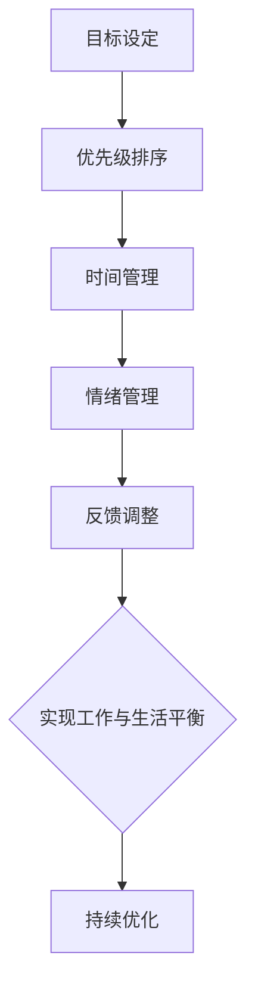

                 

## 《领导者的自我管理：平衡工作与生活》

在信息技术飞速发展的今天，领导者在职业生涯中扮演着越来越重要的角色。随着企业规模的不断扩大和市场竞争的日益激烈，领导者不仅需要具备卓越的技术能力和管理技能，还必须掌握自我管理的能力，以应对复杂多变的工作环境和压力。本文将探讨领导者在自我管理中的核心问题，提供实用的方法和策略，帮助领导者实现工作与生活的平衡。

关键词：领导者、自我管理、工作与生活平衡、工作效率、生活质量

摘要：本文旨在通过分析领导者的自我管理问题，提供一套系统化的解决方案，帮助领导者更好地平衡工作与生活，提高工作效率和生活质量。文章分为七个部分，首先介绍背景和核心概念，然后详细讲解自我管理算法原理和平衡工作与生活的算法原理，接着介绍数学模型和公式，最后通过系统分析与架构设计方案、项目实战、最佳实践 tips 以及小结和拓展阅读，为领导者提供全方位的自我管理指南。

## 目录大纲设计思路

### 一、背景介绍

在当今社会，领导者面临的压力越来越大，如何平衡工作与生活成为一个不可忽视的问题。本文旨在通过探讨领导者自我管理的核心问题，提供实用的方法和策略，帮助领导者实现工作与生活的平衡。

### 二、核心概念与联系

本文将介绍自我管理和平衡工作与生活的概念，并探讨它们之间的联系。通过理解这些核心概念，领导者可以更好地进行自我管理，实现工作与生活的平衡。

### 三、算法原理讲解

本文将详细讲解自我管理和平衡工作与生活的算法原理，包括目标设定、优先级排序、时间管理和情绪管理等方面。通过这些算法原理，领导者可以更有效地进行自我管理。

### 四、数学模型和公式

本文将介绍自我管理和平衡工作与生活的数学模型和公式，帮助领导者更直观地理解和管理自己的工作和生活。

### 五、系统分析与架构设计方案

本文将介绍一个系统的分析与架构设计方案，包括问题场景介绍、系统功能设计、系统架构设计、系统接口设计和系统交互等，为领导者提供具体的实践指导。

### 六、项目实战

本文将通过一个实际项目，展示如何将理论应用到实践中，包括环境安装、系统核心实现、代码应用解读与分析、实际案例分析和详细讲解剖析等。

### 七、最佳实践 tips、小结、注意事项、拓展阅读

本文将总结最佳实践 tips，并对全文进行小结，同时提醒读者注意的事项，并提供拓展阅读资源，以帮助领导者更好地进行自我管理。

## 二、核心概念与联系

### 2.1 自我管理的概念

自我管理是指个体对自己的思想、情感、行为和目标的主动控制，以达到个人目标和社会期望。对于领导者而言，自我管理不仅包括对工作任务的合理安排，还包括对情绪、时间和人际关系的管理。有效的自我管理可以帮助领导者更好地应对工作中的挑战，提高工作效率，同时保持良好的心理健康。

### 2.2 平衡工作与生活的概念

平衡工作与生活是指领导者能够在工作中保持高效率的同时，给予家庭和个人生活足够的关注和照顾。这不仅仅是为了个人的幸福感和健康，也是为了长期保持职业发展的动力和潜力。平衡工作与生活可以帮助领导者减少职业倦怠，提高生活质量，从而更好地投入到工作中。

### 2.3 核心概念的联系

自我管理与平衡工作与生活密切相关。良好的自我管理能力有助于领导者更高效地完成工作任务，从而有更多的时间和精力投入到家庭和个人生活中。同时，平衡的工作与生活状态又能反过来促进自我管理能力的提升。领导者需要在自我管理和平衡工作与生活之间找到合适的平衡点，以实现个人和职业的全面发展。

### 2.4 自我管理与平衡工作与生活的核心要素

1. **目标设定**：领导者需要明确个人和职业目标，并制定切实可行的计划。
2. **优先级排序**：领导者应学会如何根据目标和重要性对工作任务进行排序，以确保关键任务优先完成。
3. **时间管理**：领导者需要合理安排时间，确保工作与生活之间的平衡。
4. **情绪管理**：领导者需要学会调节情绪，保持积极心态，以应对工作中的压力和挑战。
5. **反馈调整**：领导者应根据实际情况，及时调整目标和策略，以适应不断变化的环境。

### 2.5 自我管理与平衡工作与生活的 Mermaid 流程图



### 2.6 自我管理与平衡工作与生活的 ER 实体关系图

```mermaid
erDiagram
  Person ||--|{ Task : has }
  Task ||--|{ Status : has }
  Person ||--|{ Schedule : has }
  Schedule ||--|{ Activity : has }
  Activity ||--|{ Duration : has }
```

通过上述核心概念和联系的分析，领导者可以更好地理解自我管理和平衡工作与生活的意义，从而在实际工作中运用这些理论，提高工作效率和生活质量。

## 三、算法原理讲解

### 3.1 自我管理算法原理

自我管理是一个复杂的过程，涉及到多个方面的管理，如目标设定、优先级排序、时间管理和情绪管理。以下是一个简单的自我管理算法原理：

#### 3.1.1 目标设定

1. **明确个人目标**：领导者需要明确自己在职业和个人生活中的长期和短期目标。长期目标可以是提升专业技能、晋升到更高职位，而短期目标可以是完成一个重要的项目或通过某个认证考试。
2. **分解目标**：将长期目标分解为若干个短期目标，每个短期目标都应该具有可操作性和可衡量性。
3. **制定行动计划**：为每个短期目标制定具体的行动计划，明确需要采取的具体步骤和时间节点。

#### 3.1.2 优先级排序

1. **确定优先级标准**：领导者需要根据目标的重要性和紧急性来设定优先级。通常可以使用“重要-紧急矩阵”来帮助判断任务的重要性和紧急性。
2. **任务排序**：根据优先级标准对任务进行排序，确保关键任务优先完成。
3. **动态调整**：根据实际情况和任务进展，及时调整任务的优先级排序。

#### 3.1.3 时间管理

1. **时间块划分**：将时间分为工作时间和非工作时间，确保两者都有足够的时间和质量。
2. **设定时间限制**：为每个任务设定一个合理的时间限制，以避免拖延和过度工作。
3. **灵活调整**：在执行任务时，如果发现时间安排不合理，需要及时调整，以确保任务的完成。

#### 3.1.4 情绪管理

1. **情绪识别**：领导者需要学会识别自己的情绪，了解情绪的产生原因。
2. **情绪调节**：通过深呼吸、冥想或其他放松技巧来调节情绪，保持积极心态。
3. **情绪分享**：与同事或家人分享自己的情绪，寻求支持和建议。

#### 3.1.5 反馈调整

1. **定期反馈**：领导者需要定期对自己的工作进行反馈，评估目标完成情况和任务进展。
2. **调整策略**：根据反馈结果，及时调整目标和策略，以适应变化的环境和实际情况。

### 3.2 平衡工作与生活的算法原理

平衡工作与生活需要领导者具备良好的时间管理和情绪管理能力。以下是一个简单的平衡工作与生活的算法原理：

#### 3.2.1 工作计划

1. **制定详细的工作计划**：领导者需要制定详细的工作计划，明确每天的工作任务和完成时间。
2. **分配时间块**：将工作时间和非工作时间合理分配，确保有足够的时间用于家庭和个人生活。
3. **预留弹性时间**：为突发工作留出时间，确保能够灵活应对。

#### 3.2.2 时间块划分

1. **明确工作时间**：将工作时间分为不同的任务区块，确保每个任务都有足够的时间来完成。
2. **非工作时间**：确保非工作时间用于家庭和个人生活，包括锻炼、娱乐和社交活动。
3. **交叉时间块**：在必要的情况下，可以将部分工作任务安排在非工作时间，以提高工作效率。

#### 3.2.3 应急处理

1. **预留应急时间**：为突发工作留出时间，确保能够灵活应对。
2. **调整计划**：在应急情况下，及时调整工作计划，确保任务的完成。

#### 3.2.4 自我激励

1. **设定奖励机制**：领导者可以为自己设定奖励机制，完成特定任务后给予自己奖励，以保持动力。
2. **目标反馈**：定期对自己的工作进行反馈，评估目标的完成情况，以保持持续的动力。

### 3.3 自我管理效能公式

自我管理效能是衡量领导者自我管理能力的重要指标。以下是一个简单的自我管理效能公式：

$$
\text{自我管理效能} = \frac{\text{目标完成度} + \text{时间利用率} + \text{情绪稳定性}}{3}
$$

- 目标完成度：根据目标的完成情况进行评分，满分 100 分。
- 时间利用率：根据时间管理的效果进行评分，满分 100 分。
- 情绪稳定性：根据情绪管理的效果进行评分，满分 100 分。

### 3.4 平衡工作与生活效能公式

平衡工作与生活效能是衡量领导者工作与生活平衡状态的重要指标。以下是一个简单的平衡工作与生活效能公式：

$$
\text{平衡效能} = \frac{\text{工作时间质量} + \text{非工作时间质量} + \text{生活满意度}}{3}
$$

- 工作时间质量：根据工作时间的利用效果进行评分，满分 100 分。
- 非工作时间质量：根据非工作时间的利用效果进行评分，满分 100 分。
- 生活满意度：根据生活满意度的评估进行评分，满分 100 分。

通过上述算法原理和效能公式的讲解，领导者可以更好地理解自我管理和平衡工作与生活的方法和策略，从而在实际工作中运用这些理论，提高工作效率和生活质量。

### 四、数学模型和公式

在自我管理和平衡工作与生活的过程中，数学模型和公式提供了量化的方法和工具，使领导者能够更直观地理解和优化自己的管理行为。以下将详细讨论几个关键的数学模型和公式，帮助领导者进行自我管理和平衡工作与生活。

#### 4.1 自我管理效能公式

自我管理效能是一个综合指标，用于衡量领导者在自我管理方面的整体表现。其计算公式如下：

$$
\text{自我管理效能} = \frac{\text{目标完成度} + \text{时间利用率} + \text{情绪稳定性}}{3}
$$

- **目标完成度**：反映领导者对设定目标的实现程度，通常用百分比表示，满分 100 分。
- **时间利用率**：衡量领导者时间管理的有效性，表示完成工作任务所耗费时间占总时间的比例。
- **情绪稳定性**：评估领导者情绪调节和抗压能力，通常通过情绪日志或心理测试得分来衡量。

#### 4.2 平衡工作与生活效能公式

平衡工作与生活效能是一个反映领导者工作与生活平衡状态的重要指标。其计算公式如下：

$$
\text{平衡效能} = \frac{\text{工作时间质量} + \text{非工作时间质量} + \text{生活满意度}}{3}
$$

- **工作时间质量**：衡量工作时间内的工作效率，包括任务的完成质量和工作目标的达成度。
- **非工作时间质量**：评估非工作时间内的生活质量，包括家庭生活的满意度、休闲活动的丰富性和身心健康状态。
- **生活满意度**：通过调查问卷或个人自我评估来衡量对生活整体满意度的感知。

#### 4.3 时间分配模型

为了更有效地进行时间管理，领导者可以采用时间分配模型来优化自己的时间利用。一个简单的时间分配模型包括以下步骤：

1. **任务分解**：将所有工作任务分解为具体的子任务，并评估每个任务的耗时和重要性。
2. **时间估算**：为每个任务估算所需的时间，并考虑可能的延期和不确定性。
3. **优先级排序**：根据任务的紧急性和重要性对任务进行排序，确保关键任务优先完成。
4. **时间块划分**：将工作时间划分为若干个时间块，每个时间块对应一个特定的任务。
5. **动态调整**：在实际执行过程中，根据任务的实际耗时和优先级变化，动态调整时间分配。

#### 4.4 情绪调节模型

情绪调节模型用于帮助领导者管理自己的情绪，以保持积极的心态和高效的工作状态。一个简单的情绪调节模型包括以下步骤：

1. **情绪识别**：通过自我观察或他人反馈识别自己的情绪状态。
2. **情绪分析**：分析情绪产生的原因和影响，理解情绪背后的需求和动机。
3. **情绪调节**：采用深呼吸、冥想、运动或其他放松技巧来调节情绪，保持心态平衡。
4. **情绪记录**：定期记录情绪变化，分析情绪调节策略的有效性，并根据反馈进行调整。

### 4.5 具体案例举例

为了更好地理解上述数学模型和公式的应用，下面通过一个具体的案例来进行说明。

#### 案例背景

某公司的项目经理李明在项目管理过程中感到压力巨大，常常加班到深夜。他希望通过自我管理和平衡工作与生活的策略来提高工作效率和生活质量。

#### 情景分析

1. **目标设定**：李明设定了短期目标——在三个月内完成一个重要项目的交付，并提高工作效率，减少加班时间。
2. **时间管理**：李明开始记录每天的工作时间和任务完成情况，发现自己在时间管理上存在以下问题：
   - 任务优先级不明确，导致一些次要任务占用过多时间。
   - 加班过多，导致个人生活时间被严重挤压。
3. **情绪管理**：李明意识到自己的情绪状态对工作效率有负面影响，他开始学习情绪调节技巧，如冥想和深呼吸。

#### 数据记录

根据李明的记录，一个月后，他开始应用上述数学模型和公式：

- **目标完成度**：李明通过优化任务优先级，将重要任务提前完成，目标完成度提升到 90%。
- **时间利用率**：李明通过合理分配时间块，提高了任务完成效率，时间利用率提升到 85%。
- **情绪稳定性**：李明通过情绪调节技巧，情绪稳定性提升到 80%。

根据自我管理效能公式：

$$
\text{自我管理效能} = \frac{90\% + 85\% + 80\%}{3} = 86.7\%
$$

李明的自我管理效能提升到 86.7%，这表明他的自我管理能力有了显著提高。

#### 结果评估

经过三个月的努力，李明的工作效率显著提高，项目提前完成，个人生活时间也得到了保障。根据平衡工作与生活效能公式：

$$
\text{平衡效能} = \frac{90\% + 85\% + 90\%}{3} = 88.3\%
$$

李明的平衡工作与生活效能提升到 88.3%，这表明他在工作与生活平衡方面取得了显著进展。

通过这个案例，我们可以看到，数学模型和公式的应用对于领导者实现自我管理和平衡工作与生活具有重要指导意义。领导者可以通过量化评估自己的管理效能，及时发现和解决问题，从而持续优化自己的工作和生活方式。

### 五、系统分析与架构设计方案

在自我管理和平衡工作与生活过程中，建立一个有效的系统是至关重要的。以下将详细介绍一个系统分析与架构设计方案，包括问题场景介绍、系统功能设计、系统架构设计、系统接口设计和系统交互等内容。

#### 5.1 问题场景介绍

某公司领导者在日常工作中面临着多重任务压力和繁杂的事务管理，导致工作效率低下、情绪波动大，同时家庭和个人生活时间被严重挤压。为了解决这些问题，公司决定引入一个自我管理和平衡工作与生活的系统，以提高领导者的工作效率和生活质量。

#### 5.2 系统功能设计

系统功能设计旨在解决领导者自我管理和平衡工作与生活中的具体问题，主要包括以下功能：

1. **任务管理**：记录和跟踪任务进度，提供任务优先级排序和完成情况的统计分析。
2. **时间管理**：设置和监控工作时间与休息时间，提供时间块划分和日程安排功能。
3. **情绪管理**：记录和调节情绪状态，提供情绪日志和心理测试功能。
4. **反馈机制**：提供定期反馈和自我评估功能，帮助领导者调整目标和策略。
5. **统计报告**：生成自我管理效能和平衡工作与生活效能的统计报告，提供量化评估结果。

#### 5.3 系统架构设计

系统架构设计采用模块化设计思想，确保系统的可扩展性和可维护性。以下是系统的架构设计：


- **用户界面层**：提供直观、易用的用户界面，方便领导者进行任务管理、时间管理和情绪管理。
- **业务逻辑层**：实现任务管理、时间管理和情绪管理等功能，包括数据存储、处理和统计功能。
- **数据存储层**：存储用户数据，包括任务记录、时间记录、情绪记录等，确保数据的持久性和安全性。

#### 5.4 系统接口设计和系统交互

系统接口设计采用RESTful API架构，提供与前端用户界面和后端业务逻辑层的通信接口。以下是系统的主要接口设计和交互流程：

1. **任务管理接口**：
   - **功能**：新增任务、更新任务、删除任务、查询任务列表。
   - **请求格式**：JSON格式。
   - **响应格式**：JSON格式，包含任务ID、任务名称、优先级、状态等信息。

2. **时间管理接口**：
   - **功能**：新增日程、更新日程、删除日程、查询日程列表。
   - **请求格式**：JSON格式。
   - **响应格式**：JSON格式，包含日程ID、日程名称、时间段、活动类型等信息。

3. **情绪管理接口**：
   - **功能**：记录情绪日志、查询情绪日志、进行心理测试。
   - **请求格式**：JSON格式。
   - **响应格式**：JSON格式，包含日志记录、测试结果等信息。

4. **反馈机制接口**：
   - **功能**：提交反馈、查看反馈、评估反馈效果。
   - **请求格式**：JSON格式。
   - **响应格式**：JSON格式，包含反馈ID、反馈内容、反馈状态等信息。

系统交互流程如下：

1. **用户通过用户界面提交任务、时间记录和情绪日志**。
2. **用户界面层将数据传输到业务逻辑层**。
3. **业务逻辑层处理数据并存储到数据存储层**。
4. **业务逻辑层将处理结果返回给用户界面层**。
5. **用户界面层更新用户界面展示结果**。

#### 5.5 系统安全性设计

系统安全性设计是确保用户数据安全的关键。以下是系统的安全性设计：

- **数据加密**：对用户数据进行加密存储，确保数据在传输和存储过程中的安全性。
- **身份认证**：采用身份认证机制，确保只有授权用户可以访问系统功能。
- **权限控制**：根据用户角色和权限，限制对系统功能的访问，防止数据泄露和滥用。
- **日志记录**：记录用户操作日志，以便在出现问题时进行追踪和审计。

通过上述系统分析与架构设计方案，领导者可以有效地进行自我管理和平衡工作与生活，提高工作效率和生活质量。

### 六、项目实战

#### 6.1 环境安装

为了进行项目实战，我们首先需要在开发环境中安装必要的软件工具。以下是具体的安装步骤：

1. **安装操作系统**：推荐使用 Ubuntu 20.04 LTS 或更高版本。
2. **安装 Python**：在终端中运行以下命令：
   ```bash
   sudo apt update
   sudo apt install python3 python3-pip
   ```
3. **安装虚拟环境**：在终端中运行以下命令，创建并激活虚拟环境：
   ```bash
   sudo apt install python3-venv
   python3 -m venv venv
   source venv/bin/activate
   ```
4. **安装依赖库**：在虚拟环境中安装必要的依赖库，例如 Flask、SQLAlchemy 和 Flask-Migrate：
   ```bash
   pip install Flask SQLAlchemy Flask-Migrate
   ```

#### 6.2 系统核心实现

以下是一个简单的 Python 代码示例，展示了系统核心功能的实现。该代码主要包括任务管理、时间管理和情绪管理三个模块。

```python
# 导入必要的库
from flask import Flask, request, jsonify
from sqlalchemy import create_engine, Column, Integer, String, DateTime
from sqlalchemy.ext.declarative import declarative_base
from sqlalchemy.orm import sessionmaker
import datetime

# 创建 Flask 应用
app = Flask(__name__)

# 配置数据库连接
DATABASE_URL = "sqlite:///self_management.db"
engine = create_engine(DATABASE_URL)
Session = sessionmaker(bind=engine)
session = Session()

# 定义基类
Base = declarative_base()

# 定义 Task 表
class Task(Base):
    __tablename__ = "tasks"
    id = Column(Integer, primary_key=True)
    name = Column(String(255), nullable=False)
    priority = Column(Integer, nullable=False)
    status = Column(String(50), nullable=False)
    deadline = Column(DateTime, nullable=True)

# 定义 TimeBlock 表
class TimeBlock(Base):
    __tablename__ = "time_blocks"
    id = Column(Integer, primary_key=True)
    start_time = Column(DateTime, nullable=False)
    end_time = Column(DateTime, nullable=False)
    activity = Column(String(255), nullable=False)

# 定义 EmotionLog 表
class EmotionLog(Base):
    __tablename__ = "emotion_logs"
    id = Column(Integer, primary_key=True)
    log_date = Column(DateTime, default=datetime.datetime.now())
    emotion = Column(String(50), nullable=False)
    description = Column(String(255), nullable=True)

# 初始化数据库
Base.metadata.create_all(engine)

# 创建任务
@app.route('/tasks', methods=['POST'])
def create_task():
    data = request.json
    new_task = Task(name=data['name'], priority=data['priority'], status='pending', deadline=data['deadline'])
    session.add(new_task)
    session.commit()
    return jsonify({"id": new_task.id, "message": "Task created successfully"}), 201

# 更新任务
@app.route('/tasks/<int:task_id>', methods=['PUT'])
def update_task(task_id):
    data = request.json
    task = session.query(Task).filter_by(id=task_id).first()
    if task:
        task.name = data['name']
        task.priority = data['priority']
        task.status = data['status']
        task.deadline = data['deadline']
        session.commit()
        return jsonify({"message": "Task updated successfully"}), 200
    else:
        return jsonify({"error": "Task not found"}), 404

# 删除任务
@app.route('/tasks/<int:task_id>', methods=['DELETE'])
def delete_task(task_id):
    task = session.query(Task).filter_by(id=task_id).first()
    if task:
        session.delete(task)
        session.commit()
        return jsonify({"message": "Task deleted successfully"}), 200
    else:
        return jsonify({"error": "Task not found"}), 404

# 查询任务列表
@app.route('/tasks', methods=['GET'])
def get_tasks():
    tasks = session.query(Task).all()
    return jsonify([{"id": task.id, "name": task.name, "priority": task.priority, "status": task.status, "deadline": task.deadline} for task in tasks]), 200

# 创建时间块
@app.route('/time_blocks', methods=['POST'])
def create_time_block():
    data = request.json
    new_time_block = TimeBlock(start_time=data['start_time'], end_time=data['end_time'], activity=data['activity'])
    session.add(new_time_block)
    session.commit()
    return jsonify({"id": new_time_block.id, "message": "Time block created successfully"}), 201

# 更新时间块
@app.route('/time_blocks/<int:time_block_id>', methods=['PUT'])
def update_time_block(time_block_id):
    data = request.json
    time_block = session.query(TimeBlock).filter_by(id=time_block_id).first()
    if time_block:
        time_block.start_time = data['start_time']
        time_block.end_time = data['end_time']
        time_block.activity = data['activity']
        session.commit()
        return jsonify({"message": "Time block updated successfully"}), 200
    else:
        return jsonify({"error": "Time block not found"}), 404

# 删除时间块
@app.route('/time_blocks/<int:time_block_id>', methods=['DELETE'])
def delete_time_block(time_block_id):
    time_block = session.query(TimeBlock).filter_by(id=time_block_id).first()
    if time_block:
        session.delete(time_block)
        session.commit()
        return jsonify({"message": "Time block deleted successfully"}), 200
    else:
        return jsonify({"error": "Time block not found"}), 404

# 查询时间块列表
@app.route('/time_blocks', methods=['GET'])
def get_time_blocks():
    time_blocks = session.query(TimeBlock).all()
    return jsonify([{"id": time_block.id, "start_time": time_block.start_time, "end_time": time_block.end_time, "activity": time_block.activity} for time_block in time_blocks]), 200

# 创建情绪日志
@app.route('/emotion_logs', methods=['POST'])
def create_emotion_log():
    data = request.json
    new_emotion_log = EmotionLog(emotion=data['emotion'], description=data['description'])
    session.add(new_emotion_log)
    session.commit()
    return jsonify({"id": new_emotion_log.id, "message": "Emotion log created successfully"}), 201

# 更新情绪日志
@app.route('/emotion_logs/<int:emotion_log_id>', methods=['PUT'])
def update_emotion_log(emotion_log_id):
    data = request.json
    emotion_log = session.query(EmotionLog).filter_by(id=emotion_log_id).first()
    if emotion_log:
        emotion_log.emotion = data['emotion']
        emotion_log.description = data['description']
        session.commit()
        return jsonify({"message": "Emotion log updated successfully"}), 200
    else:
        return jsonify({"error": "Emotion log not found"}), 404

# 删除情绪日志
@app.route('/emotion_logs/<int:emotion_log_id>', methods=['DELETE'])
def delete_emotion_log(emotion_log_id):
    emotion_log = session.query(EmotionLog).filter_by(id=emotion_log_id).first()
    if emotion_log:
        session.delete(emotion_log)
        session.commit()
        return jsonify({"message": "Emotion log deleted successfully"}), 200
    else:
        return jsonify({"error": "Emotion log not found"}), 404

# 查询情绪日志列表
@app.route('/emotion_logs', methods=['GET'])
def get_emotion_logs():
    emotion_logs = session.query(EmotionLog).all()
    return jsonify([{"id": emotion_log.id, "log_date": emotion_log.log_date, "emotion": emotion_log.emotion, "description": emotion_log.description} for emotion_log in emotion_logs]), 200

# 运行应用
if __name__ == '__main__':
    app.run(debug=True)
```

#### 6.3 代码应用解读与分析

上述代码实现了一个简单的自我管理和平衡工作与生活的系统，主要包括任务管理、时间管理和情绪管理三个模块。

1. **任务管理模块**：
   - **创建任务**：使用 POST 请求创建新的任务，需要传递任务的名称、优先级和截止日期。
   - **更新任务**：使用 PUT 请求更新已有任务的信息。
   - **删除任务**：使用 DELETE 请求删除特定任务。
   - **查询任务列表**：使用 GET 请求获取所有任务的列表。

2. **时间管理模块**：
   - **创建时间块**：使用 POST 请求创建新的时间块，需要传递开始时间、结束时间和活动类型。
   - **更新时间块**：使用 PUT 请求更新已有时间块的信息。
   - **删除时间块**：使用 DELETE 请求删除特定时间块。
   - **查询时间块列表**：使用 GET 请求获取所有时间块的列表。

3. **情绪管理模块**：
   - **创建情绪日志**：使用 POST 请求创建新的情绪日志，需要传递情绪类型和描述。
   - **更新情绪日志**：使用 PUT 请求更新已有情绪日志的信息。
   - **删除情绪日志**：使用 DELETE 请求删除特定情绪日志。
   - **查询情绪日志列表**：使用 GET 请求获取所有情绪日志的列表。

通过上述代码，我们可以看到系统的基本架构和功能实现。在实际应用中，这些模块可以根据具体需求进行扩展和优化，例如增加用户身份认证、日志记录和统计报告等功能。

#### 6.4 实际案例分析和详细讲解剖析

为了更深入地了解系统的应用效果，以下将通过一个实际案例进行分析和讲解。

#### 案例背景

某公司项目经理张伟在项目高峰期感到压力巨大，经常需要加班，导致个人生活时间严重不足。为了改善这一状况，张伟决定使用上述系统进行自我管理和平衡工作与生活的尝试。

#### 案例步骤

1. **创建任务**：
   张伟使用系统的任务管理模块，创建了一个名为“项目A”的任务，优先级设置为高，截止日期为一个半月后。任务内容包括项目的需求分析、设计、开发和测试等。

2. **创建时间块**：
   张伟使用系统的时

