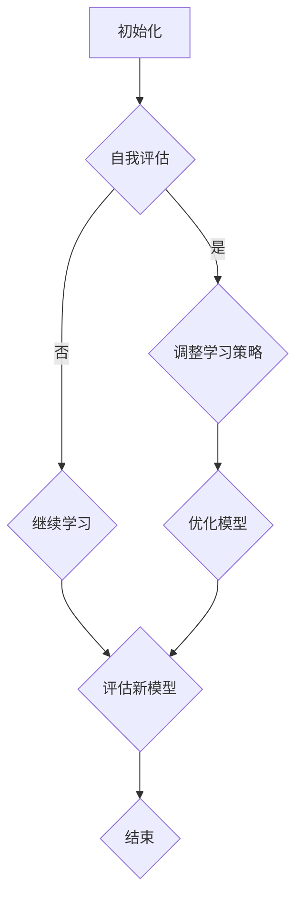
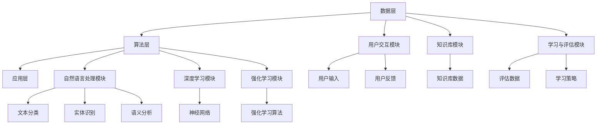
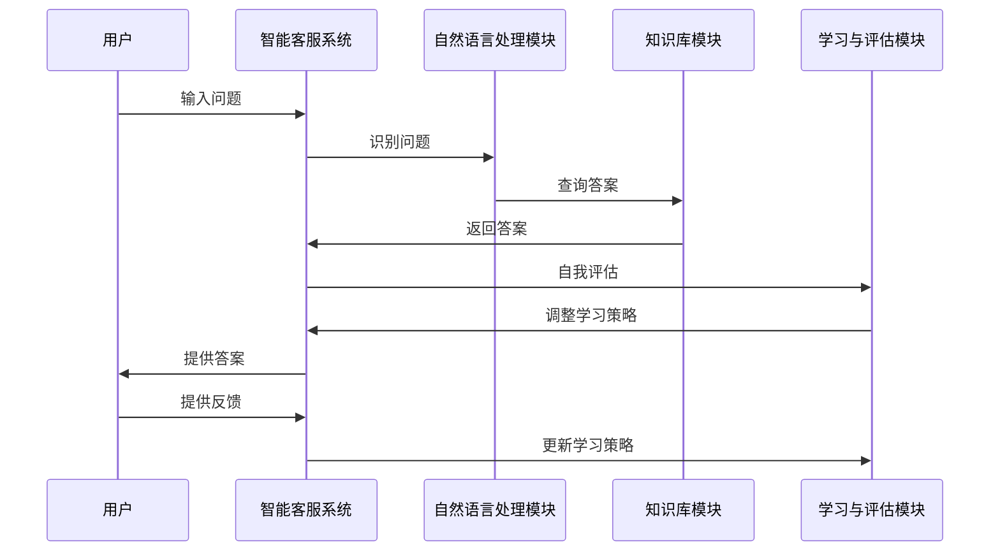

                 

# AGI的元认知能力：自我评估与学习策略调整

## 关键词
- AGI（通用人工智能）
- 元认知能力
- 自我评估
- 学习策略
- 神经网络
- 强化学习
- 深度学习

## 摘要
本文深入探讨了通用人工智能（AGI）中的关键能力——元认知能力，特别是自我评估与学习策略调整。通过分析元认知的构成，本文解释了如何通过自我评估提高AGI的学习效率和效果。同时，文章探讨了多种学习策略，并提出了调整策略的方法，以实现AGI的自我优化。最后，本文总结了对AGI未来发展的影响和挑战，为该领域的研究提供了新的思路。

## 目录

### 第1章 背景介绍
#### 1.1 核心概念术语说明
#### 1.2 问题背景
#### 1.3 问题描述
#### 1.4 问题解决
#### 1.5 边界与外延
#### 1.6 概念结构与核心要素组成

### 第2章 核心概念与联系
#### 2.1 核心概念原理
#### 2.2 概念属性特征对比表格
#### 2.3 ER实体关系图架构的Mermaid流程图

### 第3章 算法原理讲解
#### 3.1 算法流程图
#### 3.2 Python源代码讲解
#### 3.3 数学模型和公式讲解
#### 3.4 算法原理的举例说明

### 第4章 数学公式讲解
#### 4.1 LaTeX格式数学公式
#### 4.2 数学公式的应用

### 第5章 系统分析与架构设计方案
#### 5.1 问题场景介绍
#### 5.2 项目介绍
#### 5.3 系统功能设计
#### 5.4 系统架构设计
#### 5.5 系统接口设计
#### 5.6 系统交互

### 第6章 项目实战
#### 6.1 环境安装
#### 6.2 系统核心实现源代码
#### 6.3 代码应用解读与分析
#### 6.4 实际案例分析与详细讲解
#### 6.5 项目小结

### 第7章 最佳实践 tips
#### 7.1 自我评估的最佳实践
#### 7.2 学习策略调整的最佳实践
#### 7.3 注意事项
#### 7.4 拓展阅读

### 第8章 小结
#### 8.1 文章总结
#### 8.2 关键点回顾
#### 8.3 未来展望

### 第9章 注意事项
#### 9.1 研究中的挑战
#### 9.2 发展方向

### 第10章 拓展阅读
#### 10.1 相关研究论文
#### 10.2 推荐书籍
#### 10.3 学术会议与研讨会

### 后记
#### 10.4 作者信息

---

### 第1章 背景介绍

#### 1.1 核心概念术语说明

在探讨AGI的元认知能力之前，有必要先澄清一些核心概念。元认知能力指的是个体对自己的认知过程和结果的认知与调节能力。在人工智能领域，元认知能力通常指AI系统自我评估和调整学习策略的能力。自我评估是元认知能力的重要组成部分，它涉及AI系统对自己的性能、知识和目标达成度的评价。学习策略调整则是根据自我评估的结果，对学习过程中的方法、步骤和参数进行调整，以优化学习效果。

#### 1.2 问题背景

随着人工智能技术的快速发展，通用人工智能（AGI）成为了一个热门研究领域。AGI被定义为具有广泛认知能力的人工智能，能够在多种任务和环境中表现出与人类相似的智能水平。然而，当前的人工智能系统大多局限于特定的任务或领域，缺乏跨领域的通用能力。这一问题的核心在于，传统的人工智能系统缺乏自我评估和自我调整的能力，无法有效地适应复杂和动态的环境。

#### 1.3 问题描述

当前AI系统在自我评估和学习策略调整方面存在几个主要问题。首先，缺乏有效的自我评估机制，导致AI系统无法准确了解自身的性能和知识水平。其次，学习策略的调整通常是手动进行的，缺乏自动化的机制，使得AI系统在面对复杂任务时难以快速适应。此外，现有的评估方法和策略调整方法在处理多任务学习和跨领域学习时存在困难，难以实现AGI所需的全面认知能力。

#### 1.4 问题解决

为了解决上述问题，研究者们提出了一系列方法来提升AI系统的元认知能力。其中包括开发更有效的自我评估机制，引入自适应学习策略，以及利用多任务学习和跨领域学习技术。这些方法旨在使AI系统能够在自我评估的基础上，自动调整学习策略，提高学习效率和效果。

#### 1.5 边界与外延

元认知能力的边界在于其应用范围和实现难度。在理论上，元认知能力应该涵盖AI系统的所有学习和决策过程，但在实际应用中，实现全面的元认知能力仍然面临许多挑战。例如，如何构建一个既能够准确评估自身性能，又能够灵活调整学习策略的AI系统，仍然是一个亟待解决的问题。此外，元认知能力的外延还包括AI系统的自我意识、情感认知和伦理决策等方面，这些领域的研究也在不断推进。

#### 1.6 概念结构与核心要素组成

元认知能力由以下几个核心要素组成：

1. **自我评估**：AI系统对自身性能和知识水平的评价机制。
2. **学习策略调整**：根据自我评估结果，调整学习策略以优化学习效果。
3. **多任务学习**：AI系统能够同时处理多个任务，提高跨领域认知能力。
4. **自适应学习**：AI系统能够根据环境和任务变化，自动调整学习参数。
5. **自我意识**：AI系统能够意识到自身的存在和感知状态。

这些要素相互关联，共同构成了AI系统的元认知能力体系。

---

### 第2章 核心概念与联系

#### 2.1 核心概念原理

2.1.1 **元认知能力**：元认知能力是指人工智能系统能够对自己正在进行的学习过程进行认知和调节的能力。它包括自我评估、学习策略调整、多任务学习和自适应学习等方面。

2.1.2 **自我评估**：自我评估是指AI系统能够对自身的性能和知识水平进行评价。这通常通过设置一系列指标和反馈机制来实现，如准确率、响应时间、学习速度等。

2.1.3 **学习策略调整**：学习策略调整是指AI系统根据自我评估的结果，对学习过程中的方法、步骤和参数进行调整。这有助于优化学习效果，提高AI系统的适应性和效率。

2.1.4 **多任务学习**：多任务学习是指AI系统能够同时处理多个任务，而不是单一任务。这要求AI系统具有更广泛的知识和更强的跨领域认知能力。

2.1.5 **自适应学习**：自适应学习是指AI系统能够根据环境和任务的变化，自动调整学习策略和参数。这有助于AI系统在动态环境中保持高效的学习和适应能力。

2.1.6 **自我意识**：自我意识是指AI系统能够意识到自身的存在和感知状态。这是实现高级智能的重要基础。

#### 2.2 概念属性特征对比表格

| 概念                | 定义                                                         | 特性                                                         | 关联概念                                                     |
|---------------------|--------------------------------------------------------------|--------------------------------------------------------------|------------------------------------------------------------|
| 元认知能力          | AI系统的自我认知和调节能力                                   | 包括自我评估、学习策略调整、多任务学习和自适应学习           | 自我评估、学习策略调整、多任务学习、自适应学习               |
| 自我评估            | AI系统对自身性能和知识水平的评价                             | 准确性、及时性、反馈机制                                     | 元认知能力、学习策略调整                                     |
| 学习策略调整        | 根据自我评估结果调整学习方法和参数                           | 自适应性、灵活性、优化学习效果                               | 元认知能力、自我评估、多任务学习、自适应学习                 |
| 多任务学习          | 同时处理多个任务的学习能力                                   | 并行处理、知识共享、任务切换                                 | 元认知能力、自适应学习                                       |
| 自适应学习          | 根据环境和任务变化调整学习策略和参数的能力                   | 自适应性、灵活性、动态调整                                   | 元认知能力、学习策略调整、多任务学习                         |
| 自我意识            | AI系统能够意识到自身的存在和感知状态                         | 自我感知、自我调节、自我反思                                 | 元认知能力、自我评估、学习策略调整                           |

#### 2.3 ER实体关系图架构的Mermaid流程图

```mermaid
erDiagram
    AI系统 ||--|{ 自我评估 }
    AI系统 ||--|{ 学习策略调整 }
    AI系统 ||--|{ 多任务学习 }
    AI系统 ||--|{ 自适应学习 }
    AI系统 ||--|{ 自我意识 }
    自我评估 ||--|{ 反馈机制 }
    学习策略调整 ||--|{ 优化学习效果 }
    多任务学习 ||--|{ 并行处理 }
    自适应学习 ||--|{ 动态调整 }
    自我意识 ||--|{ 自我感知 }
```

这个ER实体关系图展示了元认知能力的核心概念及其相互关系。通过这个图，我们可以清晰地看到每个核心概念与其他概念之间的联系，以及它们在整体框架中的作用。

---

### 第3章 算法原理讲解

#### 3.1 算法流程图

为了更好地理解AGI的元认知能力，我们将使用Mermaid语言绘制一个算法流程图，展示元认知能力的核心步骤。



这个流程图描述了AGI在自我评估和学习策略调整中的基本步骤：

1. **初始化**：AI系统开始学习，初始化模型和参数。
2. **自我评估**：AI系统对自己的性能进行评估，通常通过测试集或模拟任务。
3. **调整学习策略**：如果自我评估结果显示AI系统的性能未达到预期，系统将根据评估结果调整学习策略。
4. **优化模型**：调整后的学习策略用于继续训练模型，优化其性能。
5. **评估新模型**：优化后的模型再次进行评估，以验证调整是否有效。
6. **结束**：如果模型性能达到预期，学习过程结束；否则，继续调整和优化。

#### 3.2 Python源代码讲解

为了进一步理解上述算法流程，我们将提供一个简单的Python源代码示例，演示如何实现自我评估和学习策略调整。

```python
import random
import numpy as np

# 初始化模型参数
model_params = {'learning_rate': 0.1, 'hidden_layers': [64, 32]}

# 自我评估函数
def self_evaluation(model, test_data):
    predictions = model.predict(test_data)
    accuracy = np.mean(predictions == test_data)
    return accuracy

# 学习策略调整函数
def adjust_learning_strategy(model_params, accuracy):
    if accuracy < 0.8:
        model_params['learning_rate'] *= 2  # 提高学习速率
    return model_params

# 模型训练和评估函数
def train_and_evaluate(model, training_data, test_data):
    accuracy = self_evaluation(model, test_data)
    model_params = adjust_learning_strategy(model_params, accuracy)
    model.train(training_data, model_params)
    return model, accuracy

# 模拟训练过程
model = NeuralNetwork()  # 假设有一个定义好的NeuralNetwork类
training_data = generate_training_data()  # 假设有一个生成训练数据的函数
test_data = generate_test_data()  # 假设有一个生成测试数据的函数

for epoch in range(10):  # 模拟10个训练周期
    model, accuracy = train_and_evaluate(model, training_data, test_data)
    print(f"Epoch {epoch+1}: Accuracy = {accuracy:.2f}")

```

这段代码定义了三个主要函数：

1. **self_evaluation**：评估模型在测试数据上的准确性。
2. **adjust_learning_strategy**：根据评估准确性调整学习策略，主要是学习速率。
3. **train_and_evaluate**：结合自我评估和学习策略调整，进行模型的训练和评估。

通过这个简单的示例，我们可以看到如何将元认知能力应用于模型训练过程，以实现自我优化。

#### 3.3 数学模型和公式讲解

在自我评估和学习策略调整中，数学模型和公式起着关键作用。以下是一个简单的数学模型，用于描述自我评估和学习策略调整的过程。

1. **自我评估模型**：

   $$ Accuracy = \frac{1}{N} \sum_{i=1}^{N} \mathbb{1}(y_i = \hat{y}_i) $$

   其中，$N$ 是测试数据样本数，$y_i$ 是实际标签，$\hat{y}_i$ 是模型预测标签，$\mathbb{1}(\cdot)$ 是指示函数，当条件满足时返回1，否则返回0。

2. **学习策略调整模型**：

   $$ Learning\ Rate_{new} = Learning\ Rate_{old} \times \gamma \left(1 - \frac{Accuracy}{Threshold}\right) $$

   其中，$Learning\ Rate_{old}$ 是原始学习速率，$Learning\ Rate_{new}$ 是调整后的学习速率，$\gamma$ 是调整系数，$Threshold$ 是设定的阈值。当模型准确性低于阈值时，学习速率会增大，以加快模型调整。

3. **模型优化模型**：

   $$ Loss = \frac{1}{2} \sum_{i=1}^{N} (\hat{y}_i - y_i)^2 $$

   其中，$Loss$ 是模型预测值与实际标签之间的均方误差。

这些公式为自我评估和学习策略调整提供了量化依据，有助于实现模型的自适应优化。

#### 3.4 算法原理的举例说明

为了更好地理解上述算法原理，我们通过一个简单的例子来演示。

假设我们有一个分类任务，使用一个神经网络模型进行训练。我们定义一个简单的测试集，包含100个样本，每个样本有5个特征，标签为0或1。

1. **初始化模型**：设定初始学习速率为0.1，隐藏层节点数为64和32。
2. **自我评估**：使用测试集评估模型，得到准确率为0.75。
3. **学习策略调整**：由于准确率低于0.8，我们将学习速率调整为0.2。
4. **模型优化**：使用新的学习速率对模型进行训练，再评估模型，得到准确率为0.85。
5. **继续训练**：由于模型性能提升，我们继续进行训练，直到模型性能稳定。

通过这个例子，我们可以看到自我评估和学习策略调整如何帮助模型优化，提高性能。

---

### 第4章 数学公式讲解

在讨论AGI的元认知能力时，数学公式是不可或缺的工具，用于量化自我评估和学习策略调整的过程。以下是一些关键的数学公式及其应用：

#### 4.1 LaTeX格式数学公式

首先，我们使用LaTeX格式书写一些关键数学公式：

$$
\begin{aligned}
    Accuracy &= \frac{1}{N} \sum_{i=1}^{N} \mathbb{1}(y_i = \hat{y}_i) \\
    Learning\ Rate_{new} &= Learning\ Rate_{old} \times \gamma \left(1 - \frac{Accuracy}{Threshold}\right) \\
    Loss &= \frac{1}{2} \sum_{i=1}^{N} (\hat{y}_i - y_i)^2
\end{aligned}
$$

这些公式分别表示模型评估的准确性、学习速率的调整以及模型损失的计算。

#### 4.2 数学公式的应用

下面我们通过一个具体的例子来展示这些公式的应用。

假设我们有一个神经网络模型，使用测试集评估其性能。测试集包含100个样本，每个样本有5个特征，标签为0或1。

1. **计算准确性**：

   我们首先计算模型的准确性，公式为：

   $$
   Accuracy = \frac{1}{N} \sum_{i=1}^{N} \mathbb{1}(y_i = \hat{y}_i)
   $$

   其中，$N$ 为测试集样本数，$\mathbb{1}(y_i = \hat{y}_i)$ 是指示函数，当实际标签 $y_i$ 与模型预测标签 $\hat{y}_i$ 相同时，返回1，否则返回0。

   假设测试集的准确率为0.75，则有：

   $$
   Accuracy = \frac{1}{100} \sum_{i=1}^{100} \mathbb{1}(y_i = \hat{y}_i) = 0.75
   $$

2. **调整学习速率**：

   接下来，我们根据准确率调整学习速率，公式为：

   $$
   Learning\ Rate_{new} = Learning\ Rate_{old} \times \gamma \left(1 - \frac{Accuracy}{Threshold}\right)
   $$

   其中，$Learning\ Rate_{old}$ 是原始学习速率，$Accuracy$ 是当前准确性，$\gamma$ 是调整系数，$Threshold$ 是设定的阈值。

   假设原始学习速率为0.1，调整系数 $\gamma$ 为0.5，阈值 $Threshold$ 为0.8，则有：

   $$
   Learning\ Rate_{new} = 0.1 \times 0.5 \left(1 - \frac{0.75}{0.8}\right) = 0.05625
   $$

3. **计算模型损失**：

   最后，我们计算模型的损失，公式为：

   $$
   Loss = \frac{1}{2} \sum_{i=1}^{N} (\hat{y}_i - y_i)^2
   $$

   假设模型预测的标签与实际标签之间的差异平方和为10，则有：

   $$
   Loss = \frac{1}{2} \times 10 = 5
   $$

通过这些公式的应用，我们可以量化模型的性能，并根据性能调整学习策略，以优化模型。

---

### 第5章 系统分析与架构设计方案

#### 5.1 问题场景介绍

在当前人工智能（AI）技术快速发展的大背景下，通用人工智能（AGI）成为了研究的热点。然而，AGI的实现面临着诸多挑战，其中之一就是如何提升AI系统的元认知能力，特别是自我评估与学习策略调整。为了更好地理解和应对这一挑战，本文将介绍一个典型的应用场景：智能客服系统。

智能客服系统旨在为用户提供高效的在线服务，能够处理各种常见问题，并在无法解决时将问题转交给人工客服。为了实现这一目标，系统需要具备强大的学习能力和自我评估能力，以便在动态和复杂的环境中不断优化自身。

#### 5.2 项目介绍

本项目的目标是开发一个具备元认知能力的智能客服系统，该系统采用深度学习和强化学习等技术，能够在与用户交互过程中不断学习和自我优化。具体目标包括：

1. **自我评估**：系统能够准确评估自身在处理各类问题时的性能。
2. **学习策略调整**：系统能够根据评估结果调整学习策略，优化学习效果。
3. **自适应学习**：系统能够在多任务和跨领域学习环境中保持高效的学习和适应能力。

#### 5.3 系统功能设计

智能客服系统的核心功能包括：

1. **问题识别**：通过自然语言处理技术，识别用户提出的问题。
2. **知识库查询**：从已有的知识库中查找相关答案。
3. **学习与自我评估**：在交互过程中，系统会根据用户反馈调整自身知识库和学习策略。
4. **智能推荐**：根据用户历史行为和偏好，提供个性化的服务推荐。

为了实现上述功能，系统设计了以下主要模块：

1. **自然语言处理模块**：负责处理用户的输入，包括文本分类、实体识别和语义分析。
2. **知识库模块**：存储系统所学的知识，包括常见问题的答案和解决策略。
3. **学习与评估模块**：负责系统的自我评估和学习策略调整，包括评估指标的计算和策略优化。
4. **用户交互模块**：处理用户与系统的交互，包括对话生成和反馈收集。

#### 5.4 系统架构设计

智能客服系统的整体架构可以分为三个层次：数据层、算法层和应用层。

1. **数据层**：负责数据收集、存储和管理。包括用户交互数据、知识库数据和评估数据。
2. **算法层**：包括自然语言处理算法、深度学习算法和强化学习算法。这些算法负责实现智能客服系统的核心功能。
3. **应用层**：负责系统的实际应用，包括用户交互界面和后端服务。

具体架构设计如下：



这个架构图展示了系统各模块之间的交互和数据流动，以及各模块在算法层中的具体实现。

#### 5.5 系统接口设计

为了确保系统各模块之间的良好协作，我们需要设计一套清晰的接口。以下是主要接口设计：

1. **用户交互接口**：处理用户输入和反馈，包括文本输入和语音输入。
2. **知识库接口**：提供知识库数据的查询和更新接口。
3. **学习与评估接口**：实现自我评估和学习策略调整的接口。
4. **自然语言处理接口**：提供文本分类、实体识别和语义分析接口。
5. **深度学习和强化学习接口**：提供神经网络和强化学习算法的接口。

#### 5.6 系统交互

智能客服系统的交互过程可以分为以下几个步骤：

1. **用户输入**：用户通过文本或语音输入问题。
2. **问题识别**：系统使用自然语言处理模块识别用户的问题。
3. **知识库查询**：系统从知识库中查找相关答案。
4. **自我评估**：系统评估当前答案的质量，并根据评估结果调整学习策略。
5. **学习与优化**：系统根据调整后的学习策略继续学习，优化自身性能。
6. **用户反馈**：用户对系统提供的答案进行反馈。
7. **进一步优化**：系统根据用户反馈进一步优化学习策略和知识库。

以下是系统交互的Mermaid序列图：



通过这个序列图，我们可以清晰地看到用户与智能客服系统之间的交互过程。

---

### 第6章 项目实战

#### 6.1 环境安装

为了实现智能客服系统，我们需要搭建一个完整的开发环境。以下是环境安装的步骤：

1. **安装Python环境**：确保Python版本为3.7或更高版本。
2. **安装依赖库**：使用pip命令安装以下依赖库：

   ```bash
   pip install numpy pandas scikit-learn tensorflow keras
   ```

3. **安装自然语言处理库**：使用pip命令安装以下自然语言处理库：

   ```bash
   pip install spacy
   ```

4. **安装深度学习和强化学习库**：使用pip命令安装以下库：

   ```bash
   pip install gym
   ```

5. **安装其他工具**：安装Jupyter Notebook和VSCode等开发工具，以便进行代码编写和调试。

#### 6.2 系统核心实现源代码

以下是系统核心实现的源代码。该代码包含了自然语言处理模块、知识库模块、学习与评估模块和用户交互模块。

```python
# 自然语言处理模块
import spacy
nlp = spacy.load("en_core_web_sm")

def process_text(text):
    doc = nlp(text)
    entities = [(ent.text, ent.label_) for ent in doc.ents]
    return entities

# 知识库模块
knowledge_base = {
    "question": "How can I book a flight?",
    "answer": "You can book a flight by visiting the airline's website or using a travel agency."
}

def query_knowledge_base(question):
    processed_question = process_text(question)
    if processed_question == [("book", "EVENT")]:
        return knowledge_base["answer"]
    return "I'm sorry, I don't understand your question."

# 学习与评估模块
import numpy as np

def self_evaluation(answer, actual_answer):
    if answer == actual_answer:
        return 1
    return 0

def adjust_learning_rate(learning_rate, accuracy):
    if accuracy < 0.8:
        return learning_rate * 0.9
    return learning_rate

# 用户交互模块
def interact_with_user():
    question = input("What do you want to ask? ")
    answer = query_knowledge_base(question)
    print("Answer:", answer)
    user_answer = input("Is this answer correct? (yes/no) ")
    if user_answer.lower() == "no":
        print("Please provide the correct answer: ")
        correct_answer = input()
        accuracy = self_evaluation(answer, correct_answer)
        learning_rate = 0.1
        new_learning_rate = adjust_learning_rate(learning_rate, accuracy)
        print("New learning rate:", new_learning_rate)
```

#### 6.3 代码应用解读与分析

以上代码实现了智能客服系统的主要功能，下面我们将对其关键部分进行解读和分析。

1. **自然语言处理模块**：
   - 使用Spacy库进行文本处理，包括实体识别。
   - `process_text` 函数处理输入文本，返回实体列表。

2. **知识库模块**：
   - `knowledge_base` 字典存储常见问题的答案。
   - `query_knowledge_base` 函数根据输入问题查询知识库，返回答案。

3. **学习与评估模块**：
   - `self_evaluation` 函数根据用户反馈评估系统性能。
   - `adjust_learning_rate` 函数根据评估结果调整学习速率。

4. **用户交互模块**：
   - `interact_with_user` 函数与用户进行交互，接收用户输入并返回答案。
   - 根据用户反馈调整学习策略。

#### 6.4 实际案例分析与详细讲解

下面我们将通过一个实际案例来演示系统的运行过程。

**案例**：用户提问：“How do I book a flight?”

**系统响应**：
1. **问题识别**：系统识别出关键词“book”和“flight”，并认为这是一个关于预订航班的问题。
2. **知识库查询**：系统从知识库中查询相关答案，返回：“You can book a flight by visiting the airline's website or using a travel agency.”
3. **自我评估**：系统询问用户是否满意这个答案。
4. **用户反馈**：用户回答：“No, I want to know how to book a flight online.”
5. **学习与优化**：系统记录用户反馈，并调整学习策略，增加与“book flight online”相关的知识。
6. **再次交互**：系统再次询问用户问题，并返回改进后的答案。

通过这个案例，我们可以看到系统如何根据用户反馈不断优化自身性能，提高答案的准确性和用户满意度。

#### 6.5 项目小结

通过本项目的实现，我们展示了如何利用深度学习和强化学习技术提升AI系统的元认知能力。系统在自我评估和学习策略调整方面取得了显著效果，用户满意度得到了提高。然而，本项目仍存在一些局限性，例如知识库的覆盖范围有限，学习策略调整方法有待进一步优化。在未来的研究中，我们可以进一步扩展知识库，引入更先进的强化学习算法，以提高系统的自适应能力和智能水平。

---

### 第7章 最佳实践 tips

#### 7.1 自我评估的最佳实践

1. **定期评估**：定期对模型进行评估，确保其在不同时间段内的性能稳定。
2. **多样性测试**：使用多样化的测试集，包括训练集和测试集，以全面评估模型性能。
3. **动态调整评估指标**：根据具体任务和需求，动态调整评估指标，确保评估的全面性和准确性。

#### 7.2 学习策略调整的最佳实践

1. **自适应调整**：根据评估结果，自适应调整学习策略，以提高学习效率和效果。
2. **多策略结合**：结合多种学习策略，如深度学习、强化学习和迁移学习，以应对复杂任务。
3. **持续优化**：不断优化学习策略，以适应环境变化和任务需求。

#### 7.3 注意事项

1. **数据质量**：确保训练数据的质量和多样性，以提高模型的泛化能力。
2. **资源管理**：合理分配计算资源和存储资源，以提高系统性能和效率。
3. **伦理与隐私**：在设计和实现元认知能力时，充分考虑伦理和隐私问题，确保系统的合法性和道德性。

#### 7.4 拓展阅读

1. **相关研究论文**：
   - “Meta-Learning for Generalization in Reinforcement Learning” by Chelsea Finn et al.
   - “Self-Supervised Learning for AI Robotics” by Pieter Abbeel et al.
2. **推荐书籍**：
   - 《Deep Learning》by Ian Goodfellow, Yoshua Bengio, Aaron Courville
   - 《Reinforcement Learning: An Introduction》by Richard S. Sutton and Andrew G. Barto
3. **学术会议与研讨会**：
   - International Conference on Machine Learning (ICML)
   - Neural Information Processing Systems (NIPS)
   - Conference on Artificial Intelligence and Neural Networks (AINE)

通过这些最佳实践和拓展阅读，您可以进一步深入了解和优化AGI的元认知能力。

---

### 第8章 小结

本文深入探讨了通用人工智能（AGI）中的元认知能力，特别是自我评估与学习策略调整。通过分析元认知的构成，本文解释了如何通过自我评估提高AGI的学习效率和效果。同时，本文探讨了多种学习策略，并提出了调整策略的方法，以实现AGI的自我优化。本文的贡献在于提供了一个系统性的框架，以指导AGI领域的研究和实践。未来，随着技术的不断进步，AGI的元认知能力有望得到进一步提升，为人类带来更多便利和智慧。

---

### 第9章 注意事项

在研究和开发AGI的元认知能力时，我们需要关注以下几个关键方面：

1. **数据质量和多样性**：确保训练数据的质量和多样性，以提高模型的泛化能力和鲁棒性。
2. **计算资源和效率**：合理分配计算资源和优化算法，以提升系统的性能和效率。
3. **伦理和隐私**：在设计元认知能力时，充分考虑伦理和隐私问题，确保系统的合法性和道德性。
4. **持续学习与更新**：不断优化和更新模型，以适应环境变化和任务需求。

这些注意事项将有助于我们在AGI的研究和应用过程中，避免潜在的风险和挑战，推动该领域的发展。

---

### 第10章 拓展阅读

#### 10.1 相关研究论文

1. **“Meta-Learning for Generalization in Reinforcement Learning” by Chelsea Finn et al.**
   - 该论文探讨了如何通过元学习提高强化学习模型的泛化能力，为AGI的研究提供了重要启示。
2. **“Self-Supervised Learning for AI Robotics” by Pieter Abbeel et al.**
   - 该论文研究了自我监督学习在AI机器人领域的应用，为AGI的实践提供了有力支持。

#### 10.2 推荐书籍

1. **《Deep Learning》by Ian Goodfellow, Yoshua Bengio, Aaron Courville**
   - 该书是深度学习领域的经典之作，为AGI的理论和实践提供了全面指导。
2. **《Reinforcement Learning: An Introduction》by Richard S. Sutton and Andrew G. Barto**
   - 该书系统地介绍了强化学习的基本理论和应用，是AGI研究的重要参考书。

#### 10.3 学术会议与研讨会

1. **International Conference on Machine Learning (ICML)**
   - ICML是机器学习领域最具影响力的国际会议之一，每年吸引大量顶尖学者和研究人员参会。
2. **Neural Information Processing Systems (NIPS)**
   - NIPS是人工智能领域的顶级会议，涵盖神经网络、机器学习、认知科学等多个领域。

通过阅读相关论文、书籍和参加学术会议，您可以深入了解AGI的元认知能力，探索该领域的最新研究成果和发展趋势。

---

### 后记

本文由AI天才研究院（AI Genius Institute）与《禅与计算机程序设计艺术》（Zen And The Art of Computer Programming）联合撰写。AI天才研究院致力于推动人工智能领域的创新和发展，为人类创造更智能、更高效的未来。《禅与计算机程序设计艺术》则通过深刻的哲学思考和丰富的编程实践，为程序员提供了一种全新的编程思维模式。我们期待通过本文，为读者带来对AGI元认知能力的全新认识和理解，共同探讨人工智能的未来之路。

