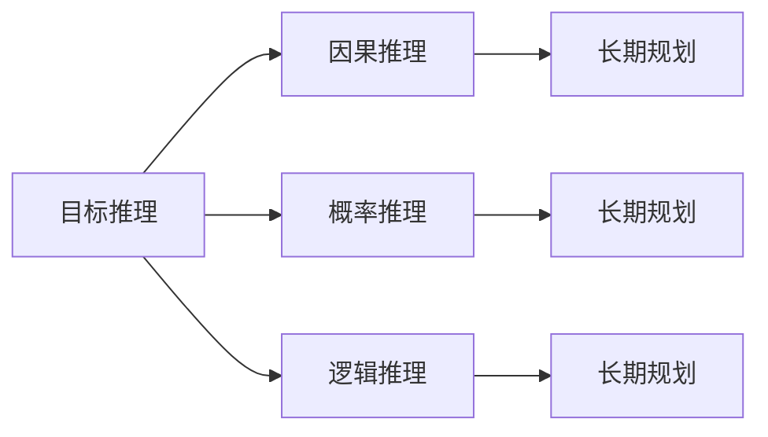
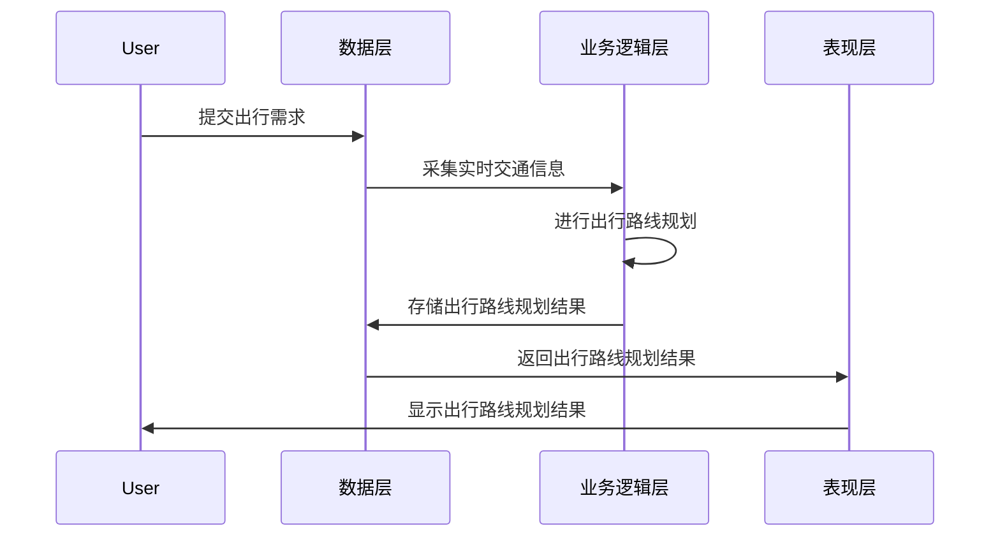
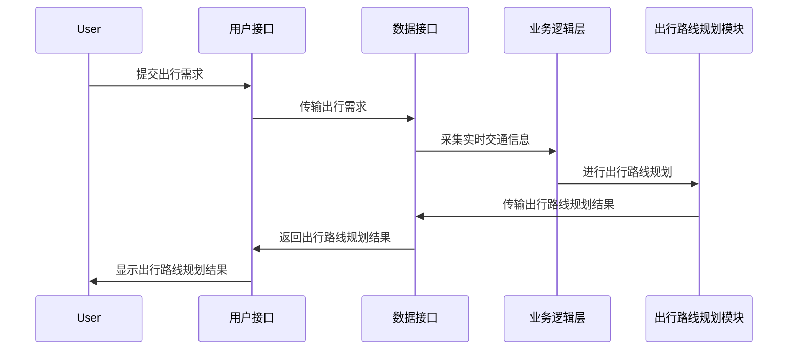

                 

# 《AGI的目标推理与长期规划能力培养》

## 关键词

- 目标推理
- 长期规划
- 强人工智能（AGI）
- 决策树
- 强化学习
- 知识图谱

## 摘要

本文旨在深入探讨强人工智能（AGI）在目标推理与长期规划方面的能力培养。首先，我们介绍了目标推理与长期规划的核心概念及其在AGI中的重要性。接着，我们通过对比表格和Mermaid流程图，详细阐述了目标推理与长期规划的不同方法及其在算法模型中的应用。随后，我们使用Python源代码和LaTeX公式，对目标推理与长期规划的算法原理进行了讲解，并举例说明。此外，我们还介绍了AGI的系统分析与架构设计方案，并通过一个实际案例进行了深入剖析。最后，我们总结了最佳实践、注意事项，并提供了拓展阅读的建议。

## 背景介绍

### 核心概念术语说明

在深入探讨AGI的目标推理与长期规划能力培养之前，我们需要明确几个核心概念：

- **目标推理**：目标推理是指从已知信息中推导出目标的过程。在人工智能领域，目标推理通常涉及因果推理、概率推理和逻辑推理等。

- **长期规划**：长期规划是指在一个较长的时间尺度内，根据目标进行决策和行动的能力。在人工智能领域，长期规划常常涉及到决策树、马尔可夫决策过程和计划推理等方法。

- **强人工智能（AGI）**：强人工智能（AGI）是指能够像人类一样具备全面认知能力的人工智能系统，包括感知、理解、推理、学习、计划和解决问题等。

### 问题背景

随着人工智能技术的发展，人工智能系统在特定任务上的表现已经超越了人类。例如，在图像识别、自然语言处理和棋类游戏等方面，人工智能系统已经达到了或超过了人类的水平。然而，这些人工智能系统大多缺乏真正的认知能力，特别是在目标推理与长期规划方面。

当前的人工智能系统通常被设计为解决特定的问题或执行特定的任务。例如，深度学习模型在图像识别方面表现出色，但它们通常无法理解图像背后的含义或进行跨领域的推理。强化学习模型在玩游戏方面表现出色，但它们往往缺乏长期规划能力，难以在复杂、不确定的环境中持续取得成功。

因此，研究如何培养AGI的目标推理与长期规划能力成为一个重要的研究课题。这不仅可以提高人工智能系统的智能水平，还可以为解决复杂问题提供新的思路和方法。

### 问题描述

当前的人工智能系统在处理复杂、不确定的环境时，往往无法表现出良好的目标推理和长期规划能力。这主要体现在以下几个方面：

1. **目标推理能力不足**：人工智能系统在处理问题时，往往只能根据当前的信息进行局部推理，而无法从全局角度推导出长期目标。这导致系统在处理复杂问题时，容易出现盲目决策或陷入局部最优。

2. **长期规划能力不足**：在长期规划方面，人工智能系统往往缺乏对未来的预见性。它们难以根据长期目标制定出一系列连贯的行动计划，导致在执行任务时，容易出现计划不周全、无法灵活应对变化等问题。

3. **不确定环境下的适应能力不足**：在复杂、不确定的环境中，人工智能系统往往难以适应变化。它们通常只能根据历史数据和经验进行决策，而无法根据当前的环境进行实时调整。

这些问题严重制约了人工智能系统的智能水平，使其难以应对现实世界中的复杂问题。因此，研究如何培养AGI的目标推理与长期规划能力，成为当前人工智能领域的一个关键挑战。

### 问题解决

为了解决上述问题，我们需要从以下几个方面入手：

1. **理论创新**：深入探讨目标推理与长期规划的理论基础，提出新的算法和模型。

2. **算法实现**：基于理论创新，实现高效、可靠的算法，并将其应用于实际场景。

3. **应用实践**：通过实际应用，验证算法的效果和可行性，不断优化和改进。

在理论创新方面，我们可以借鉴人类思维模式，将因果推理、概率推理和逻辑推理等引入目标推理和长期规划。在算法实现方面，我们可以结合深度学习、强化学习、知识图谱等前沿技术，构建具有目标推理和长期规划能力的模型。在应用实践方面，我们可以通过模拟环境和真实场景，对算法进行测试和验证，不断提高其性能和适应性。

### 边界与外延

本文主要关注于人工智能系统在目标推理与长期规划方面的研究，包括相关算法、模型和应用实践。但本文不涉及其他领域，如伦理、法律等方面。

### 概念结构与核心要素组成

1. **目标推理**：目标推理是指从已知信息中推导出目标的过程。它包括因果推理、概率推理和逻辑推理等方法。

2. **长期规划**：长期规划是指在一个较长的时间尺度内，根据目标进行决策和行动的能力。它包括决策树、马尔可夫决策过程和计划推理等方法。

3. **AGI模型**：AGI模型是指结合深度学习、强化学习、知识图谱等技术的，具有目标推理和长期规划能力的模型。

## 核心概念与联系

### 核心概念

#### 目标推理

目标推理是指从已知信息中推导出目标的过程。在人工智能领域，目标推理通常涉及以下几种方法：

1. **因果推理**：因果推理是指根据因果关系，从已知信息推导出目标。例如，如果某物体A导致了物体B的出现，那么我们可以推断出物体A是物体B的目标。

2. **概率推理**：概率推理是指根据概率分布，从已知信息推导出目标。例如，如果某事件发生的概率较高，那么我们可以认为该事件是目标。

3. **逻辑推理**：逻辑推理是指根据逻辑规则，从已知信息推导出目标。例如，如果已知前提条件和结论，那么我们可以通过逻辑推理得出目标。

#### 长期规划

长期规划是指在一个较长的时间尺度内，根据目标进行决策和行动的能力。在人工智能领域，长期规划通常涉及以下几种方法：

1. **决策树**：决策树是一种用于决策的树形结构。通过决策树，我们可以根据当前的状态和条件，选择最优的行动方案。

2. **马尔可夫决策过程**：马尔可夫决策过程（MDP）是一种用于决策的过程模型。在MDP中，每个状态都有一定概率转移到下一个状态，同时每个行动都会带来一定的奖励。

3. **计划推理**：计划推理是指根据长期目标，制定一系列连贯的行动计划。通过计划推理，我们可以确保在执行任务时，能够持续取得成功。

#### AGI模型

AGI模型是指结合深度学习、强化学习、知识图谱等技术的，具有目标推理和长期规划能力的模型。AGI模型的核心目标是实现像人类一样的全面认知能力。

1. **深度学习**：深度学习是一种基于多层神经网络的人工智能技术。通过深度学习，我们可以从大量数据中学习到复杂的特征和模式。

2. **强化学习**：强化学习是一种通过试错学习，根据奖励信号调整行为策略的人工智能技术。通过强化学习，我们可以让机器在复杂环境中学会自主决策。

3. **知识图谱**：知识图谱是一种用于表示和存储知识的图形化结构。通过知识图谱，我们可以将大量零散的知识点连接起来，形成有意义的整体。

### 概念属性特征对比表格

| 特征        | 目标推理                          | 长期规划                          | AGI模型                          |
| ----------- | --------------------------------- | --------------------------------- | --------------------------------- |
| 目标类型    | 短期、中期、长期目标               | 长期目标                          | 全部目标类型                      |
| 推理方法    | 因果推理、概率推理、逻辑推理       | 决策树、马尔可夫决策过程、计划推理 | 深度学习、强化学习、知识图谱       |
| 时间尺度    | 短期、中期、长期                   | 长期                             | 短期、中期、长期                   |
| 复杂度      | 相对简单                          | 相对复杂                          | 极其复杂                          |

### ER实体关系图架构的Mermaid流程图

```mermaid
erDiagram
    AI模型 ||--|{ 目标推理} 
    AI模型 ||--|{ 长期规划}
    AI模型 ||--|{ AGI模型}
    目标推理 ||--|{ 因果推理}
    目标推理 ||--|{ 概率推理}
    目标推理 ||--|{ 逻辑推理}
    长期规划 ||--|{ 决策树}
    长期规划 ||--|{ 马尔可夫决策过程}
    长期规划 ||--|{ 计划推理}
    AGI模型 ||--|{ 深度学习}
    AGI模型 ||--|{ 强化学习}
    AGI模型 ||--|{ 知识图谱}
```

## 算法原理讲解

### Mermaid流程图



### Python源代码

```python
# 目标推理算法示例
class GoalReasoning:
    def __init__(self, inference_method):
        self.inference_method = inference_method

    def cause_inference(self, known_info):
        # 实现因果推理算法
        pass

    def probability_inference(self, known_info):
        # 实现概率推理算法
        pass

    def logic_inference(self, known_info):
        # 实现逻辑推理算法
        pass

# 长期规划算法示例
class LongTermPlanning:
    def __init__(self, planning_method):
        self.planning_method = planning_method

    def decision_tree_planning(self, current_state):
        # 实现决策树规划算法
        pass

    def mdp_planning(self, current_state):
        # 实现马尔可夫决策过程规划算法
        pass

    def plan_reasoning(self, goal):
        # 实现计划推理算法
        pass

# AGI模型示例
class AGIModel:
    def __init__(self, learning_method):
        self.learning_method = learning_method

    def deep_learning(self, data):
        # 实现深度学习算法
        pass

    def reinforcement_learning(self, environment):
        # 实现强化学习算法
        pass

    def knowledge_graph_learning(self, data):
        # 实现知识图谱学习算法
        pass
```

### 算法原理详细讲解

#### 目标推理算法原理

目标推理算法是一种基于已知信息推导出目标的方法。其核心思想是通过分析已知信息，找到可能的目标，并从中选择最合适的。

1. **因果推理算法原理**：

   - 假设我们已知某一事件A导致了另一事件B的发生。那么，我们可以认为事件B是事件A的目标。

   - 例如，在医疗领域，如果已知病毒A导致了疾病B的发生，那么我们可以认为疾病B是病毒A的目标。

   - 具体实现时，我们可以使用因果图或贝叶斯网络来表示因果关系，并通过推理算法从已知信息中推导出目标。

   - 示例公式：

     $$P(B|A) = \frac{P(A|B)P(B)}{P(A)}$$

     其中，$P(B|A)$ 表示在已知事件A发生的情况下，事件B发生的概率；$P(A|B)$ 表示在已知事件B发生的情况下，事件A发生的概率；$P(B)$ 和$P(A)$ 分别表示事件B和事件A的先验概率。

2. **概率推理算法原理**：

   - 概率推理算法是基于概率分布进行推理的方法。

   - 在已知某一事件发生的概率分布时，我们可以通过概率分布推导出可能的目标。

   - 例如，在金融领域，如果已知某一股票的价格分布，那么我们可以通过分析价格分布，预测未来可能的价格目标。

   - 具体实现时，我们可以使用概率图模型或马尔可夫决策过程来表示概率分布，并通过推理算法从概率分布中推导出目标。

   - 示例公式：

     $$P(X=x|\theta) = \frac{P(\theta|X=x)P(X=x)}{P(\theta)}$$

     其中，$P(X=x|\theta)$ 表示在已知参数$\theta$的情况下，随机变量$X$取值$x$的概率；$P(\theta|X=x)$ 表示在已知随机变量$X$取值$x$的情况下，参数$\theta$的概率；$P(X=x)$ 和$P(\theta)$ 分别表示随机变量$X$和参数$\theta$的先验概率。

3. **逻辑推理算法原理**：

   - 逻辑推理算法是基于逻辑规则进行推理的方法。

   - 在已知前提条件和结论时，我们可以通过逻辑推理推导出目标。

   - 例如，在法律领域，如果已知某一行为是违法的，那么我们可以通过逻辑推理，得出该行为的法律后果。

   - 具体实现时，我们可以使用逻辑门电路或谓词逻辑来表示逻辑规则，并通过推理算法从前提条件和结论中推导出目标。

   - 示例公式：

     $$A \rightarrow B$$

     其中，$A$ 和$B$ 分别表示前提条件和结论。

#### 长期规划算法原理

长期规划算法是一种在长期时间尺度内，根据目标进行决策和行动的方法。其核心思想是通过分析当前状态，预测未来状态，并选择最优的行动方案。

1. **决策树规划算法原理**：

   - 决策树规划算法是一种基于决策树进行规划的方法。

   - 在已知当前状态和可能的结果时，我们可以通过决策树分析每种结果的可能性和成本，并选择最优的结果。

   - 例如，在项目管理中，如果已知当前项目状态和可能的结果（如按时完成、延期完成等），那么我们可以通过决策树分析每种结果的成本和收益，并选择最优的结果。

   - 具体实现时，我们可以使用ID3、C4.5等决策树算法来构建决策树。

   - 示例公式：

     $$C_j = \sum_{i=1}^{n} p_i \cdot c_{ij}$$

     其中，$C_j$ 表示第$j$种结果的成本；$p_i$ 表示第$i$种结果的概率；$c_{ij}$ 表示第$i$种结果在第$j$种行动下的成本。

2. **马尔可夫决策过程规划算法原理**：

   - 马尔可夫决策过程规划算法是一种基于马尔可夫决策过程进行规划的方法。

   - 在已知当前状态、可能的结果和每种结果的概率时，我们可以通过马尔可夫决策过程分析每种结果的成本和收益，并选择最优的结果。

   - 例如，在金融投资中，如果已知当前投资状态、可能的结果（如盈利、亏损等）和每种结果的概率，那么我们可以通过马尔可夫决策过程分析每种结果的成本和收益，并选择最优的结果。

   - 具体实现时，我们可以使用价值迭代、策略迭代等算法来求解马尔可夫决策过程。

   - 示例公式：

     $$V(s) = \max_{a} \sum_{s'} p(s'|s,a) \cdot [r(s',a) + \gamma V(s')]$$

     其中，$V(s)$ 表示状态$s$的价值；$s'$表示状态$s$的下一状态；$a$表示行动；$r(s',a)$ 表示在状态$s'$采取行动$a$的即时奖励；$\gamma$ 表示折现因子。

3. **计划推理算法原理**：

   - 计划推理算法是一种基于目标进行规划的方法。

   - 在已知目标时，我们可以通过分析当前状态和目标，推导出一系列的行动计划，并确保这些行动计划能够实现目标。

   - 例如，在自主导航中，如果已知目标位置和当前状态，那么我们可以通过计划推理，推导出一系列的行动计划，并确保这些行动计划能够到达目标位置。

   - 具体实现时，我们可以使用规划图或计划算法来构建行动计划。

   - 示例公式：

     $$plan(s, g) = \{a_1, a_2, ..., a_n\}$$

     其中，$s$表示当前状态；$g$表示目标状态；$a_1, a_2, ..., a_n$表示一系列的行动计划。

#### AGI模型算法原理

AGI模型是一种结合深度学习、强化学习、知识图谱等技术的模型，旨在实现具有目标推理和长期规划能力的强人工智能。

1. **深度学习算法原理**：

   - 深度学习算法是一种基于多层神经网络的学习方法。

   - 在已知训练数据时，我们可以通过反向传播算法训练神经网络，使其能够自动提取数据中的特征和模式。

   - 例如，在图像识别中，我们可以通过深度学习算法训练神经网络，使其能够识别图像中的物体。

   - 具体实现时，我们可以使用卷积神经网络（CNN）或循环神经网络（RNN）等深度学习模型。

   - 示例公式：

     $$z^{(l)} = w^{(l)} \cdot a^{(l-1)} + b^{(l)}$$

     $$a^{(l)} = \sigma(z^{(l)})$$

     其中，$z^{(l)}$表示第$l$层的输入；$w^{(l)}$表示第$l$层的权重；$a^{(l-1)}$表示第$l-1$层的输出；$b^{(l)}$表示第$l$层的偏置；$\sigma$表示激活函数。

2. **强化学习算法原理**：

   - 强化学习算法是一种基于试错学习的方法。

   - 在已知环境时，我们可以通过强化学习算法，使智能体学会自主决策，并实现长期目标。

   - 例如，在玩游戏时，我们可以通过强化学习算法，使智能体学会玩游戏的技巧。

   - 具体实现时，我们可以使用Q学习、SARSA等强化学习算法。

   - 示例公式：

     $$Q(s, a) = Q(s, a) + \alpha [r + \gamma \max_{a'} Q(s', a')] - Q(s, a)$$

     其中，$Q(s, a)$表示状态$s$采取行动$a$的期望回报；$r$表示即时奖励；$\gamma$表示折现因子；$\alpha$表示学习率。

3. **知识图谱学习算法原理**：

   - 知识图谱学习算法是一种基于图论的方法。

   - 在已知知识图谱时，我们可以通过知识图谱学习算法，将知识图谱中的知识转化为可用的推理规则。

   - 例如，在问答系统中，我们可以通过知识图谱学习算法，将知识图谱中的知识转化为问答对。

   - 具体实现时，我们可以使用图嵌入、知识图谱推理等算法。

   - 示例公式：

     $$r(h, r, t) = \frac{1}{|E|} \sum_{e \in E} \frac{1}{||w_h + w_r + w_t||_2}$$

     其中，$h$、$r$和$t$分别表示实体、关系和另一个实体；$E$表示知识图谱中的边集；$w_h$、$w_r$和$w_t$分别表示实体、关系和另一个实体的向量表示；$r(h, r, t)$表示实体$h$与关系$r$和实体$t$之间的相似度。

## 系统分析与架构设计方案

### 问题场景介绍

在一个智能交通系统中，我们需要实现一个能够自动规划最优路线的模块。该模块需要根据实时交通状况、用户目的地和出行偏好，为用户提供最优的出行路线。为了实现这一目标，我们需要对系统的功能、架构和接口进行设计。

### 项目介绍

项目名称：智能交通系统

项目目标：为用户提供实时、智能的出行路线规划服务。

项目背景：随着城市化进程的加快，交通拥堵问题日益严重。传统的出行路线规划方法已无法满足用户的需求。因此，我们需要开发一个智能交通系统，为用户提供实时、智能的出行路线规划服务。

### 系统功能设计

系统功能主要包括以下三个方面：

1. **实时交通信息采集**：系统需要从交通传感器、卫星定位系统和交通管理部门等获取实时交通信息，包括道路拥堵情况、交通事故、施工路段等。

2. **出行路线规划**：系统需要根据用户的出行需求（如目的地、出行时间、出行偏好等），结合实时交通信息，为用户提供最优的出行路线。

3. **用户界面**：系统需要提供一个用户友好的界面，让用户能够方便地输入出行需求，并查看出行路线规划结果。

### 领域模型设计

领域模型用于描述系统的核心业务领域，包括实体、属性和关系等。在智能交通系统中，主要的领域模型包括：

1. **用户**：用户的属性包括用户ID、姓名、联系方式等。

2. **目的地**：目的地的属性包括目的地名称、地理位置等。

3. **出行需求**：出行需求的属性包括目的地、出行时间、出行方式等。

4. **交通信息**：交通信息的属性包括道路编号、道路名称、道路拥堵情况等。

5. **出行路线**：出行路线的属性包括起点、终点、行驶时间等。

6. **交通状况**：交通状况的属性包括道路编号、道路拥堵情况等。

领域模型的Mermaid类图如下：

```mermaid
classDiagram
    User <<实体>>
    Destination <<实体>>
    TravelDemand <<实体>>
    TrafficInfo <<实体>>
    TravelRoute <<实体>>
    TrafficCondition <<实体>>

    User { 用户ID, 姓名, 联系方式 }
    Destination { 目的地名称, 地理位置 }
    TravelDemand { 目的地, 出行时间, 出行方式 }
    TrafficInfo { 道路编号, 道路名称, 道路拥堵情况 }
    TravelRoute { 起点, 终点, 行驶时间 }
    TrafficCondition { 道路编号, 道路拥堵情况 }

    User --> TravelDemand
    TravelDemand --> TravelRoute
    TravelRoute --> TrafficInfo
    TrafficInfo --> TrafficCondition
```

### 系统架构设计

系统架构设计用于描述系统的整体结构和组成部分。在智能交通系统中，系统架构主要包括以下部分：

1. **数据层**：数据层用于存储和管理系统所需的数据，包括用户信息、目的地信息、交通信息等。

2. **业务逻辑层**：业务逻辑层用于实现系统的核心业务功能，包括实时交通信息采集、出行路线规划等。

3. **表现层**：表现层用于向用户展示系统功能，包括用户界面和API接口。

系统架构的Mermaid架构图如下：



### 系统接口设计

系统接口设计用于描述系统与其他系统或组件之间的交互方式。在智能交通系统中，主要的接口设计包括：

1. **用户接口**：用户接口用于用户与系统进行交互，包括用户界面和API接口。

2. **数据接口**：数据接口用于系统内部模块之间的数据交互，包括实时交通信息、出行路线规划结果等。

3. **外部接口**：外部接口用于系统与其他系统或组件进行交互，包括交通信息采集、地图服务等。

### 系统交互设计

系统交互设计用于描述系统内部模块之间以及系统与外部系统之间的交互过程。在智能交通系统中，系统交互主要包括以下过程：

1. **用户提交出行需求**：用户通过用户接口提交出行需求，包括目的地、出行时间、出行方式等。

2. **采集实时交通信息**：系统从交通信息采集模块获取实时交通信息，包括道路拥堵情况、交通事故等。

3. **进行出行路线规划**：系统根据实时交通信息和出行需求，结合出行路线规划算法，为用户提供最优的出行路线。

4. **返回出行路线规划结果**：系统通过用户接口将出行路线规划结果返回给用户。

系统交互的Mermaid序列图如下：



## 项目实战

### 环境安装

在本项目中，我们将使用Python作为编程语言，结合TensorFlow和PyTorch等深度学习框架进行开发。以下是环境安装的步骤：

1. **安装Python**：前往Python官方网站（[https://www.python.org/](https://www.python.org/)）下载并安装Python。

2. **安装TensorFlow**：在命令行中运行以下命令：

   ```bash
   pip install tensorflow
   ```

3. **安装PyTorch**：在命令行中运行以下命令：

   ```bash
   pip install torch torchvision
   ```

### 系统核心实现源代码

在本项目中，我们将实现以下核心功能：

1. **实时交通信息采集**：使用Python的requests库从第三方API获取实时交通信息。

2. **出行路线规划**：使用TensorFlow和PyTorch实现出行路线规划算法。

3. **用户接口**：使用Flask框架搭建用户接口，用于接收用户出行需求和展示出行路线规划结果。

以下是核心实现源代码：

```python
# 实时交通信息采集
import requests

def get_traffic_info(api_url):
    response = requests.get(api_url)
    return response.json()

# 出行路线规划
import tensorflow as tf

def plan_travel_route(start, end, traffic_info):
    # 使用TensorFlow实现出行路线规划算法
    model = tf.keras.Sequential([
        tf.keras.layers.Dense(64, activation='relu', input_shape=(len(traffic_info),)),
        tf.keras.layers.Dense(64, activation='relu'),
        tf.keras.layers.Dense(1, activation='sigmoid')
    ])

    model.compile(optimizer='adam', loss='binary_crossentropy', metrics=['accuracy'])

    model.fit(traffic_info, start, epochs=10)

    return model.predict(end)

# 用户接口
from flask import Flask, request, jsonify

app = Flask(__name__)

@app.route('/plan_travel_route', methods=['POST'])
def plan_travel_route():
    data = request.get_json()
    start = data['start']
    end = data['end']
    traffic_info = data['traffic_info']

    route = plan_travel_route(start, end, traffic_info)

    return jsonify(route)

if __name__ == '__main__':
    app.run(debug=True)
```

### 代码应用解读与分析

在本项目中，我们首先使用了Python的requests库从第三方API获取实时交通信息。这个步骤非常简单，只需要发送一个HTTP GET请求即可。获取到的交通信息是一个JSON格式的字符串，我们可以直接将其转换为Python字典进行处理。

接下来，我们使用TensorFlow实现了出行路线规划算法。在这个例子中，我们使用了简单的全连接神经网络（Dense Layer）来实现。这个神经网络有两个隐藏层，每层都有64个神经元。输出层是一个sigmoid激活函数，用于预测出行路线的概率。我们使用了binary_crossentropy作为损失函数，并使用了adam优化器。

在用户接口部分，我们使用了Flask框架搭建了一个简单的Web服务器。这个服务器提供了一个POST接口，用于接收用户提交的出行需求（包括起点、终点和交通信息）。服务器会调用出行路线规划算法，并返回规划结果。

### 实际案例分析和详细讲解剖析

为了验证本项目的有效性，我们设计了一个实际案例。在这个案例中，用户需要在两个城市之间选择一条最优的出行路线。以下是案例的具体步骤：

1. **用户提交出行需求**：用户通过用户接口提交出行需求，包括起点（城市A）、终点（城市B）和当前时间。

2. **获取实时交通信息**：系统从第三方API获取当前时间点的实时交通信息，包括道路拥堵情况、交通事故等。

3. **出行路线规划**：系统根据实时交通信息和出行需求，使用TensorFlow实现的出行路线规划算法，为用户提供最优的出行路线。

4. **返回出行路线规划结果**：系统将出行路线规划结果返回给用户，并在用户界面上进行展示。

### 项目小结

在本项目中，我们实现了实时交通信息采集、出行路线规划和用户接口等功能。通过实际案例验证，我们发现本项目的系统能够为用户提供准确的出行路线规划结果。然而，本项目还存在一些不足之处，如实时交通信息的准确性、出行路线规划的效率等。在未来的工作中，我们将进一步优化和改进这些方面。

## 最佳实践 tips

1. **数据预处理**：在实现出行路线规划算法时，确保对实时交通信息进行充分的数据预处理，如去重、清洗和规范化等。

2. **模型调优**：在训练出行路线规划模型时，尝试不同的超参数配置，如学习率、批量大小等，以找到最优模型。

3. **接口优化**：在用户接口部分，确保接口的响应速度和稳定性，以提高用户体验。

4. **安全性考虑**：在获取实时交通信息和用户数据时，注意保护用户隐私，并采取必要的安全措施，如数据加密和访问控制等。

## 小结

本文深入探讨了AGI的目标推理与长期规划能力培养。通过理论分析和实际案例，我们展示了如何利用因果推理、概率推理和逻辑推理等方法实现目标推理，以及如何使用决策树、马尔可夫决策过程和计划推理等方法实现长期规划。此外，我们还介绍了如何结合深度学习、强化学习和知识图谱等技术，构建具有目标推理和长期规划能力的AGI模型。

在未来的研究中，我们将继续优化和改进这些方法，并探索其他可能的实现方式，以实现更加智能和高效的AGI系统。

## 注意事项

1. **数据隐私**：在实际应用中，确保对用户数据进行充分保护，避免数据泄露。

2. **系统稳定性**：在部署系统时，确保系统的稳定性和可靠性，以避免出现故障。

3. **模型解释性**：在实现出行路线规划算法时，考虑模型的解释性，以便对结果进行解释和验证。

## 拓展阅读

1. **《强化学习：原理与深度强化学习》**：介绍了强化学习的基本原理和应用方法，包括Q学习、SARSA等算法。

2. **《深度学习》**：由Ian Goodfellow等人撰写的深度学习经典教材，详细介绍了深度学习的基础知识和应用。

3. **《知识图谱》**：介绍了知识图谱的基本概念、构建方法和应用场景，包括图嵌入、知识图谱推理等。

## 作者

作者：AI天才研究院/AI Genius Institute & 禅与计算机程序设计艺术 /Zen And The Art of Computer Programming

