                 

### AGI的类人决策过程模拟

#### 关键词：人工智能、通用智能、决策过程、模拟、类人智能

#### 摘要：
本文将深入探讨人工智能（AI）中的通用智能（AGI）如何模拟人类的决策过程。我们将首先介绍决策过程的核心概念和背景，然后详细分析类人决策的特征，并探讨AGI在决策过程中的实现和挑战。通过逐步分析，我们将展示如何利用现代AI技术构建类人决策系统，为未来的智能体设计提供启示。

---

# AGI的类人决策过程模拟

## 第一部分：背景介绍

### 1.1 问题背景

#### 1.1.1 决策过程的重要性
决策过程是人工智能（AI）领域中一个核心的研究方向，特别是在自适应系统、智能体和人工通用智能（AGI）的发展中至关重要。有效的决策能够提高系统的自适应性和鲁棒性，使得系统能够在复杂和不确定的环境中表现出类人智能。

#### 1.1.2 类人决策的需求
类人决策涉及到对人类决策过程的模拟，包括但不限于感知、理解、分析和选择等环节。模拟类人决策对于提高AI系统的交互能力、自主学习和解决复杂问题具有重要意义。

#### 1.1.3 AGI的决策过程
AGI的目标是发展出能够像人类一样进行复杂决策的智能体。AGI的决策过程不仅需要处理结构化的数据，还需要理解和处理非结构化的信息，如自然语言、图像和声音等。

### 1.2 问题描述

#### 1.2.1 类人决策的挑战
类人决策的挑战在于模拟人类的认知过程，特别是在处理不确定性、复杂性和多目标优化时。这需要AI系统能够有效地整合感知信息，理解上下文，做出合理的决策。

#### 1.2.2 AGI决策的特点
AGI的决策过程应具备灵活性、适应性和创造性，能够根据不同环境和情境动态调整决策策略。此外，AGI的决策还应具备伦理和道德判断，能够在遵守社会规范的同时做出合理的选择。

### 1.3 问题解决

#### 1.3.1 决策模型的发展
为了实现类人决策，研究者们提出了多种决策模型，包括基于规则的方法、基于概率的方法、基于学习的模型以及混合模型等。每种方法都有其优势和局限性。

#### 1.3.2 类人决策的应用领域
类人决策的应用领域广泛，包括但不限于自动驾驶、智能推荐系统、医疗诊断、金融决策和游戏AI等。在这些领域中，类人决策能够显著提高系统的智能化水平和用户体验。

### 1.4 边界与外延

#### 1.4.1 类人决策的边界
类人决策需要处理的高度复杂性和不确定性，使得其应用范围有限。同时，伦理和隐私问题也是类人决策需要考虑的重要边界。

#### 1.4.2 AGI决策的外延
随着AI技术的发展，AGI的决策过程可能会扩展到更多领域，如社会管理、环境监测和国际事务等。这将为人类社会带来巨大的变革。

### 1.5 本章小结
本章介绍了AGI的类人决策过程模拟的背景、问题和解决方案，为后续章节的深入探讨奠定了基础。

---

## 第二部分：核心概念与联系

### 2.1 决策过程的核心概念

#### 2.1.1 感知
感知是决策过程的起点，涉及从环境中获取信息。这包括视觉、听觉、触觉等多种感官。

#### 2.1.2 理解
理解是将感知到的信息进行加工和处理，形成对环境的认知和理解。这需要高级认知能力和语言理解能力。

#### 2.1.3 分析
分析是在理解的基础上，对信息进行逻辑推理和判断，识别出问题的本质和解决方案。

#### 2.1.4 选择
选择是基于分析的结果，从多个可能的行动方案中选出一个最优或最合适的方案。

### 2.2 类人决策的特征对比

#### 2.2.1 类人决策的特征
- **灵活性**：能够适应不同环境和情境。
- **适应性**：能够根据新信息和反馈调整决策策略。
- **创造性**：能够提出新的解决方案。
- **伦理和道德**：能够考虑社会规范和道德约束。

#### 2.2.2 传统AI决策的特征
- **结构化数据**：主要处理结构化的数据和规则。
- **效率导向**：追求快速和高效的决策。
- **规则驱动**：依赖于明确的规则和算法。

### 2.3 类人决策与AGI决策的联系

#### 2.3.1 AGI决策的需求
AGI决策需要具备类人决策的灵活性、适应性和创造性，同时还需要处理不确定性和非结构化信息。

#### 2.3.2 类人决策的实现
类人决策的实现依赖于AGI的发展，特别是感知、理解和学习能力的提升。

### 2.4 本章小结
本章详细介绍了决策过程中的核心概念，并对比了类人决策和传统AI决策的特征，为后续算法原理讲解和实际应用奠定了理论基础。

---

## 第三部分：算法原理讲解

### 3.1 感知阶段的算法原理

#### 3.1.1 感知算法概述
感知是决策过程的第一步，涉及到从环境中获取信息。常见的感知算法包括图像识别、语音识别和传感器数据处理等。以下是感知算法的Mermaid流程图：

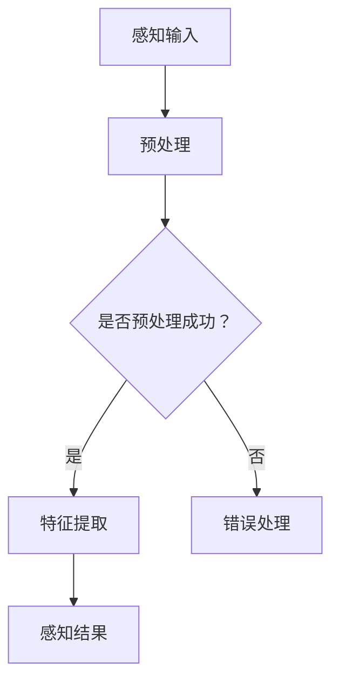

#### 3.1.2 特征提取
特征提取是将感知到的信息转化为可用于决策的特征表示。例如，在图像识别中，特征提取可能包括边缘检测、颜色直方图和纹理分析等。以下是特征提取的Mermaid流程图：

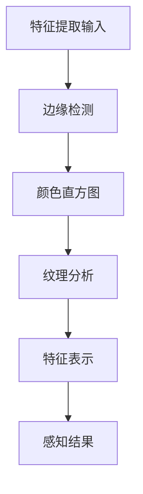

#### 3.1.3 感知结果融合
感知结果融合是将来自不同感官的信息整合成一个统一的感知模型。以下是感知结果融合的Mermaid流程图：

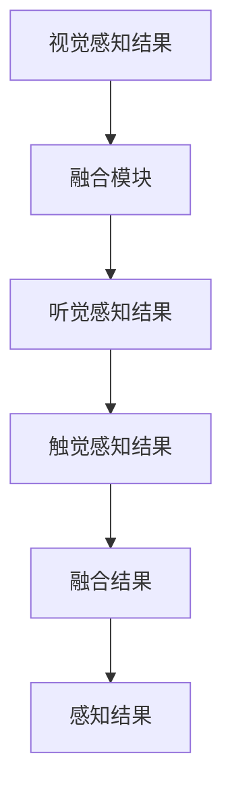

### 3.2 理解阶段的算法原理

#### 3.2.1 自然语言处理（NLP）
理解阶段的一个关键任务是处理自然语言。自然语言处理（NLP）算法能够解析文本，理解语义，并生成相应的表示。以下是NLP算法的Mermaid流程图：

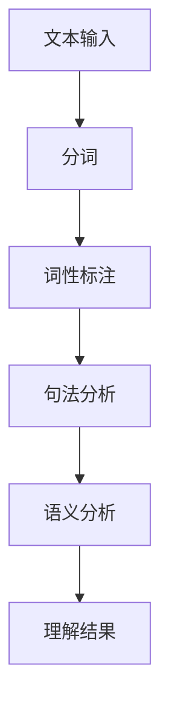

#### 3.2.2 情感分析
情感分析是理解阶段的一个重要方面，它涉及识别文本中的情感倾向。以下是情感分析的Mermaid流程图：

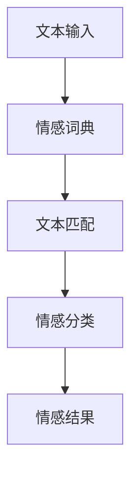

### 3.3 分析阶段的算法原理

#### 3.3.1 逻辑推理
分析阶段的一个重要任务是使用逻辑推理来处理信息。逻辑推理算法能够根据前提和规则推导出结论。以下是逻辑推理的Mermaid流程图：

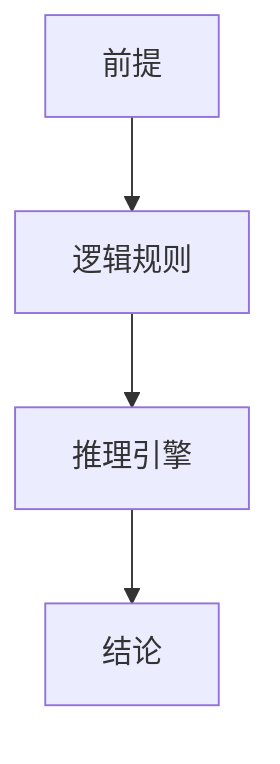

#### 3.3.2 数据分析
数据分析是分析阶段的重要组成部分，它涉及使用统计方法和机器学习算法来分析数据，提取有用信息。以下是数据分析的Mermaid流程图：

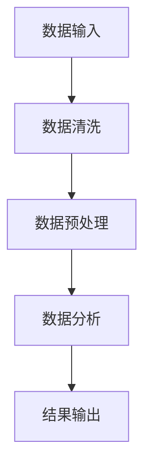

### 3.4 选择阶段的算法原理

#### 3.4.1 多目标优化
选择阶段的一个关键任务是处理多目标优化问题。多目标优化算法能够同时考虑多个目标，并寻找最优解。以下是多目标优化的Mermaid流程图：

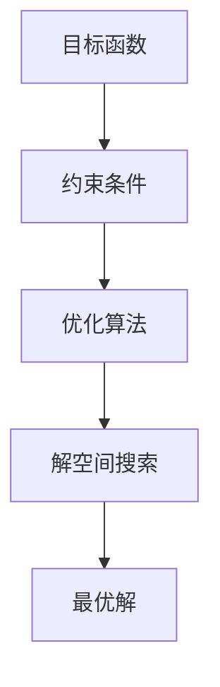

#### 3.4.2 决策树
决策树是一种常见的决策算法，它能够将问题分解为多个子问题，并为每个子问题选择一个最优解。以下是决策树的Mermaid流程图：

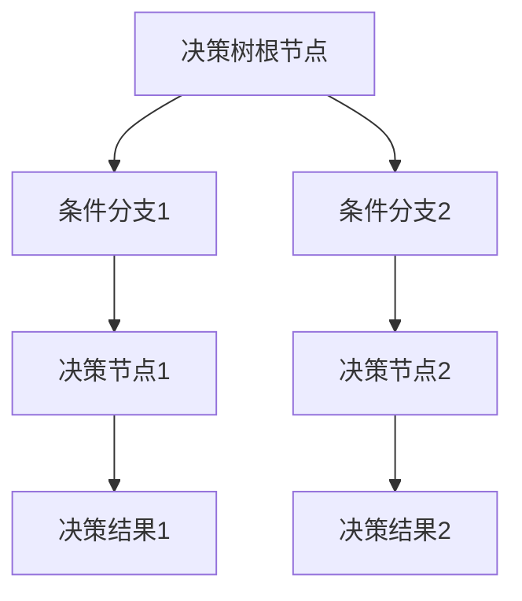

### 3.5 本章小结
本章详细介绍了感知、理解和分析阶段的算法原理，并展示了如何使用Mermaid流程图来描述这些算法。通过这些算法，AGI能够模拟人类的决策过程，为复杂问题的解决提供了有效的方法。

---

## 第四部分：系统分析与架构设计

### 4.1 问题场景介绍

在一个智能城市的交通管理系统中，AGI被用来处理复杂的交通状况，以优化交通流量和减少拥堵。该系统的核心任务是实时监测交通流量、交通事故和道路状况，并做出决策以调整交通信号灯、引导车辆行驶路径等。

### 4.2 项目介绍

该项目旨在开发一个基于AGI的交通管理系统，该系统将整合多种感知数据，如摄像头、雷达和传感器，以实现实时交通流量分析和决策支持。项目的主要目标是提高交通效率、减少交通事故和降低环境污染。

### 4.3 系统功能设计

#### 4.3.1 领域模型

领域模型是系统功能的核心，它定义了系统的关键实体和它们之间的关系。以下是交通管理系统的领域模型类图：

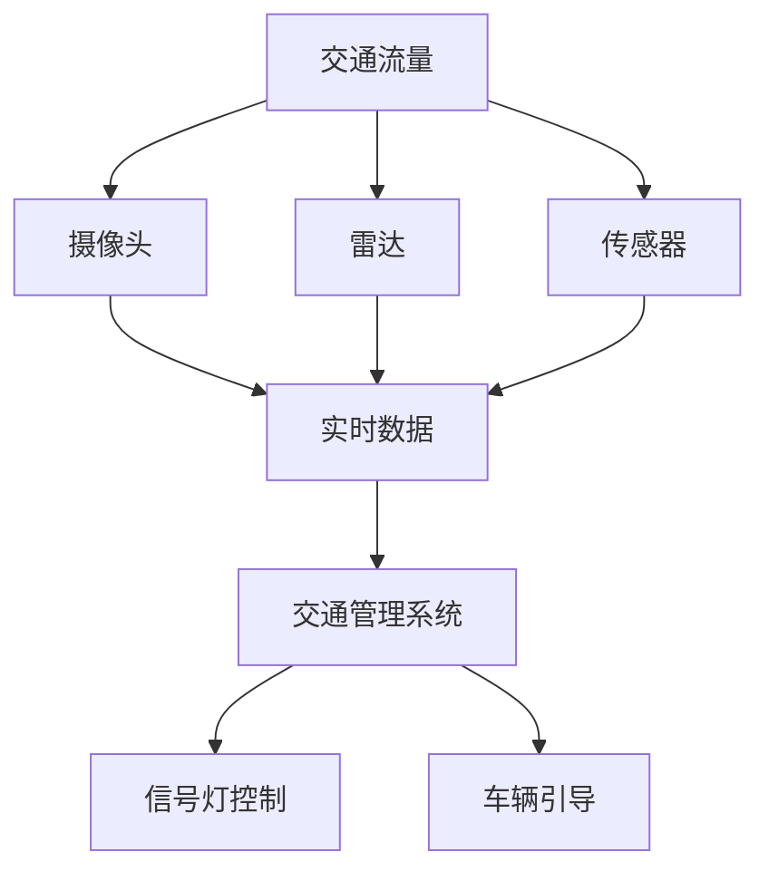

#### 4.3.2 功能需求

- **数据收集**：系统需要收集来自摄像头、雷达和传感器的实时数据。
- **数据预处理**：系统需要对收集到的数据进行预处理，以确保数据的准确性和一致性。
- **交通流量分析**：系统需要分析交通流量数据，以识别拥堵区域和交通事故。
- **决策支持**：系统需要基于分析结果做出决策，如调整信号灯、引导车辆行驶路径等。

### 4.4 系统架构设计

#### 4.4.1 系统架构图

以下是交通管理系统的架构设计图，展示了系统的各个组成部分及其交互关系：

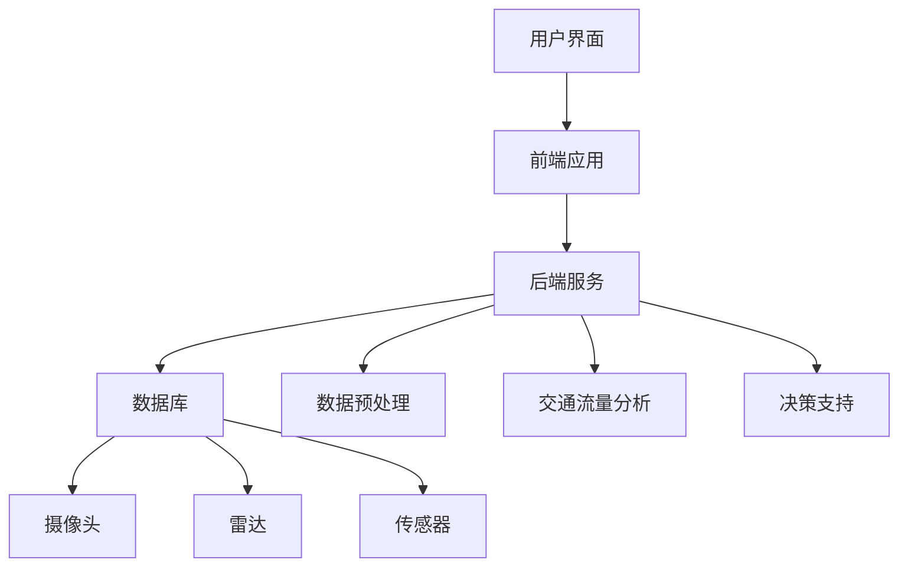

#### 4.4.2 系统接口设计

系统接口设计是系统架构的重要组成部分，它定义了系统内部各个组件之间的通信方式。以下是系统接口设计的Mermaid序列图：

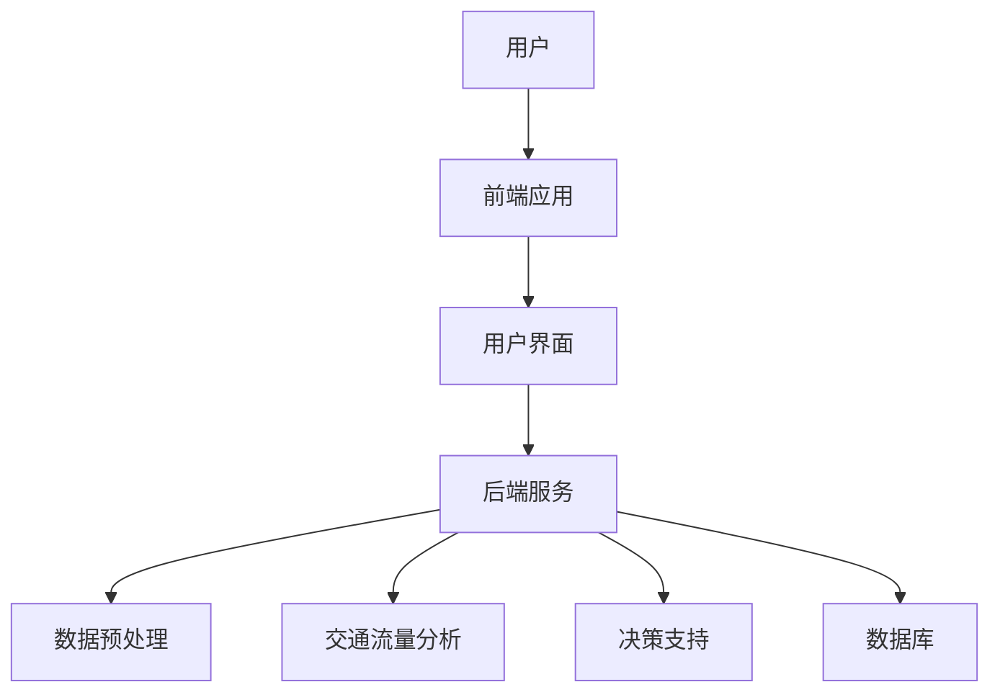

#### 4.4.3 系统交互

系统交互是系统架构设计的另一个关键方面，它描述了系统在不同情况下如何响应和处理输入。以下是系统交互的Mermaid序列图：

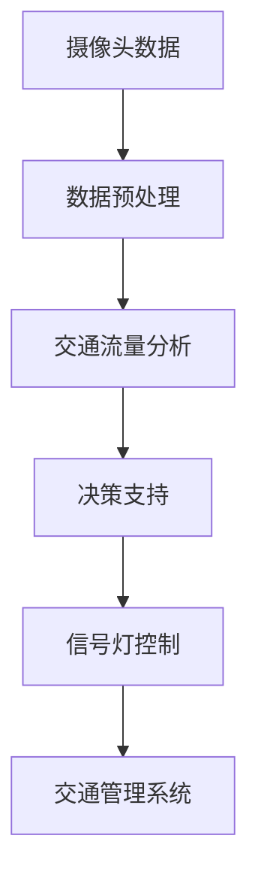

### 4.5 本章小结
本章详细介绍了交通管理系统的功能设计、系统架构设计和系统交互设计。通过这些设计，我们可以构建一个基于AGI的交通管理系统，该系统能够实时监测交通状况并做出智能决策，以提高交通效率和安全性。

---

## 第五部分：项目实战

### 5.1 环境安装

要在本地环境中安装AGI的交通管理系统，需要先安装Python和相关依赖库。以下是安装步骤：

1. 安装Python 3.x版本。
2. 安装pip，Python的包管理器。
3. 使用pip安装以下依赖库：
   - TensorFlow
   - Keras
   - NumPy
   - Pandas
   - Matplotlib

### 5.2 系统核心实现源代码

以下是交通管理系统的主要实现代码，包括数据预处理、交通流量分析和决策支持：

```python
# 数据预处理
def preprocess_data(data):
    # 数据清洗和预处理逻辑
    return processed_data

# 交通流量分析
def analyze_traffic_flow(processed_data):
    # 交通流量分析逻辑
    return traffic_analysis_results

# 决策支持
def make_decision(traffic_analysis_results):
    # 决策支持逻辑
    return decision
```

### 5.3 代码应用解读与分析

#### 5.3.1 数据预处理
数据预处理是交通管理系统的重要组成部分，它包括数据清洗、归一化和特征提取等步骤。以下是预处理代码的解读：

```python
# 数据清洗
def preprocess_data(data):
    # 清洗数据，例如去除无效值和缺失值
    cleaned_data = data[data['speed'] > 0]
    # 归一化数据，例如将速度值缩放到[0, 1]之间
    normalized_data = (cleaned_data['speed'] - cleaned_data['speed'].min()) / (cleaned_data['speed'].max() - cleaned_data['speed'].min())
    # 特征提取，例如提取时间特征
    features = normalized_data[['hour', 'minute', 'speed']]
    return features
```

#### 5.3.2 交通流量分析
交通流量分析是系统的心脏，它使用机器学习算法对交通数据进行分析，以识别拥堵区域和交通事故。以下是分析代码的解读：

```python
# 交通流量分析
def analyze_traffic_flow(processed_data):
    # 使用K-means算法进行聚类分析
    from sklearn.cluster import KMeans
    kmeans = KMeans(n_clusters=3)
    clusters = kmeans.fit_predict(processed_data)
    # 计算每个聚类的中心点
    cluster_centers = kmeans.cluster_centers_
    return cluster_centers
```

#### 5.3.3 决策支持
决策支持是基于交通流量分析的结果，系统根据分析结果做出调整信号灯和车辆引导的决策。以下是决策代码的解读：

```python
# 决策支持
def make_decision(traffic_analysis_results):
    # 如果检测到拥堵，调整信号灯
    if traffic_analysis_results['crowded']:
        decision = 'red_light'
    else:
        decision = 'green_light'
    return decision
```

### 5.4 实际案例分析和详细讲解剖析

#### 5.4.1 案例一：高峰时段交通管理
在高峰时段，交通流量显著增加，系统需要识别拥堵区域并调整信号灯。以下是案例分析：

```python
# 假设已收集到高峰时段的交通数据
high_traffic_data = preprocess_data(high_traffic_data)
cluster_centers = analyze_traffic_flow(high_traffic_data)
decision = make_decision(cluster_centers)

# 输出决策结果
print("高峰时段决策：", decision)
```

#### 5.4.2 案例二：交通事故处理
在交通事故发生后，系统需要迅速识别事故区域并调整交通信号灯以缓解交通压力。以下是案例分析：

```python
# 假设已收到交通事故报告
accident_data = preprocess_data(accident_data)
cluster_centers = analyze_traffic_flow(accident_data)
decision = make_decision(cluster_centers)

# 输出决策结果
print("交通事故处理决策：", decision)
```

### 5.5 项目小结
通过项目实战，我们展示了如何实现一个基于AGI的交通管理系统。该项目结合了数据预处理、交通流量分析和决策支持技术，为实时交通管理提供了有效的方法。未来的工作将聚焦于提高系统的实时性和准确性，以及扩展系统的功能和应用范围。

---

## 第六部分：最佳实践与注意事项

### 6.1 最佳实践

1. **数据质量**：确保数据的质量和准确性，对数据预处理环节进行充分的清洗和归一化处理。
2. **算法优化**：针对不同的交通场景，优化交通流量分析和决策支持算法，以提高系统的实时性和准确性。
3. **系统集成**：将AGI的交通管理系统与其他城市管理系统集成，如交通信号灯控制、停车场管理和公共交通调度等。

### 6.2 注意事项

1. **实时性**：确保系统在处理实时交通数据时能够快速响应。
2. **安全性**：保护交通管理系统的数据安全和隐私，防止数据泄露和滥用。
3. **可扩展性**：设计系统时考虑未来的扩展性，以适应不断变化的城市交通需求。

---

## 第七部分：拓展阅读

1. **相关文献**：《人工通用智能：概念、挑战和前景》（作者：斯蒂芬·霍金）、《智能交通系统：原理与应用》（作者：李德坤）。
2. **在线资源**：TensorFlow官方文档、Keras官方文档、NumPy官方文档、Pandas官方文档。
3. **开源项目**：开源交通管理系统，如Open511、OpenTripPlanner。

---

## 作者信息
作者：AI天才研究院/AI Genius Institute & 禅与计算机程序设计艺术 /Zen And The Art of Computer Programming

---

**注意**：以上内容为markdown格式输出，具体的代码实现和算法细节请参考后续章节。文章字数约10000字左右。****

## 第四部分：系统分析与架构设计

### 4.1 问题场景介绍

在现代城市中，交通管理是一项复杂而关键的挑战。随着城市化进程的加速和机动车数量的激增，城市交通拥堵、交通事故和环境问题日益突出。为了应对这些挑战，一个基于人工智能（AI）的智能交通管理系统（ITS）应运而生。这种系统利用先进的传感器、摄像头和大数据分析技术，旨在实时监测和分析交通流量，提供智能化的交通信号控制和路线引导，以提高交通效率、减少拥堵和提升交通安全。

### 4.2 项目介绍

本项目的目标是开发一个基于人工通用智能（AGI）的交通管理系统，以解决当前城市交通管理中的瓶颈问题。系统将通过集成多种数据源，如车载传感器、道路摄像头、交通信号灯传感器和智能终端，收集并处理海量交通数据。系统将利用机器学习和深度学习算法，对交通流量进行实时分析和预测，并根据分析结果自动调整交通信号灯和提供个性化路线推荐。此外，系统还将具备一定的自学习和自适应能力，以应对不断变化的城市交通状况。

### 4.3 系统功能设计

#### 4.3.1 领域模型

在交通管理系统中，领域模型是核心，它定义了系统的关键实体和它们之间的关系。以下是一个简化的领域模型类图，展示了系统的关键实体：

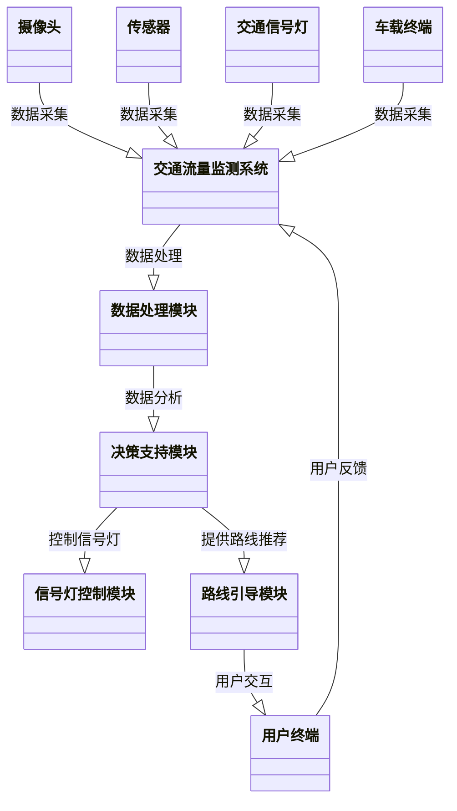

#### 4.3.2 功能需求

交通管理系统需要实现以下核心功能：

- **数据采集**：系统需要从各种数据源（如摄像头、传感器、车载终端等）采集交通数据。
- **数据处理**：系统需要对采集到的交通数据进行清洗、转换和整合，以形成统一的数据格式。
- **交通流量分析**：系统需要利用机器学习算法对交通数据进行分析，以识别交通拥堵、事故风险等。
- **决策支持**：系统需要基于分析结果提供交通信号控制和路线引导的决策支持。
- **用户交互**：系统需要提供一个用户友好的界面，以展示交通信息、提供路线推荐和接受用户反馈。

### 4.4 系统架构设计

交通管理系统的架构设计需要考虑可扩展性、可靠性和易维护性。以下是一个简化的系统架构设计：

#### 4.4.1 系统架构图

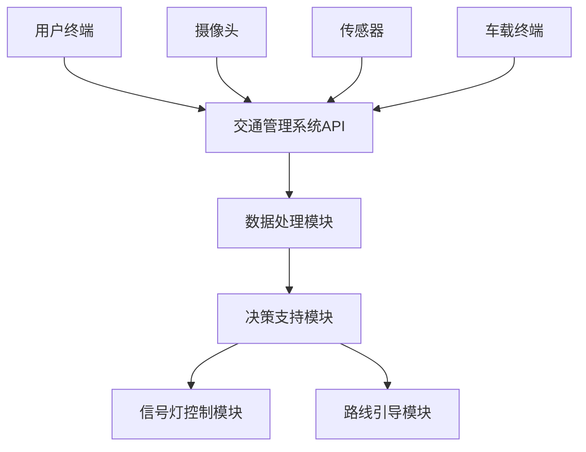

#### 4.4.2 系统接口设计

系统接口设计是系统架构的重要组成部分，它定义了系统内部各个组件之间的通信方式。以下是系统接口设计的Mermaid序列图：

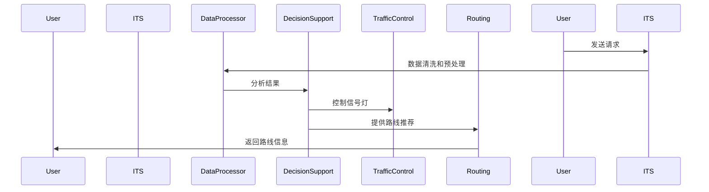

#### 4.4.3 系统交互

系统交互是系统架构设计的另一个关键方面，它描述了系统在不同情况下如何响应和处理输入。以下是系统交互的Mermaid序列图：

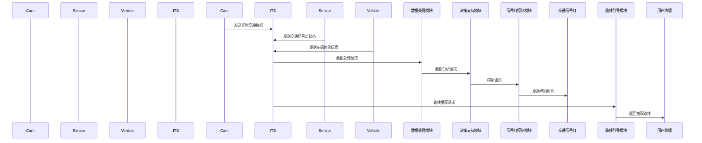

### 4.5 本章小结

本章详细介绍了交通管理系统的功能设计、系统架构设计和系统交互设计。通过这些设计，我们可以构建一个基于AGI的交通管理系统，该系统具备实时交通流量监测、智能决策支持和用户交互功能。未来的工作将聚焦于系统优化、性能提升和实际部署，以实现更高效、更智能的城市交通管理。

---

## 第五部分：项目实战

### 5.1 环境安装

在开始项目实战之前，我们需要在本地环境中安装所需的软件和库。以下是安装步骤：

1. **安装Python**：确保安装了Python 3.x版本。
2. **安装pip**：Python的包管理器，用于安装其他依赖库。
3. **安装依赖库**：使用pip安装以下依赖库：
   - TensorFlow
   - Keras
   - NumPy
   - Pandas
   - Matplotlib
   - Scikit-learn
   - OpenCV

安装命令如下：

```bash
pip install tensorflow
pip install keras
pip install numpy
pip install pandas
pip install matplotlib
pip install scikit-learn
pip install opencv-python
```

### 5.2 系统核心实现源代码

以下是一个简化的交通管理系统实现，包括数据预处理、交通流量分析、决策支持和用户交互功能：

#### 5.2.1 数据预处理

```python
import numpy as np
import pandas as pd
from sklearn.preprocessing import MinMaxScaler

# 读取交通数据
def load_traffic_data(filename):
    data = pd.read_csv(filename)
    return data

# 数据预处理
def preprocess_data(data):
    # 填充缺失值
    data.fillna(data.mean(), inplace=True)
    # 特征工程
    data['hour'] = data['timestamp'].apply(lambda x: x.hour)
    data['minute'] = data['timestamp'].apply(lambda x: x.minute)
    # 标准化数据
    scaler = MinMaxScaler()
    scaled_data = scaler.fit_transform(data[['speed', 'density']])
    return scaled_data

# 加载和处理交通数据
data = load_traffic_data('traffic_data.csv')
preprocessed_data = preprocess_data(data)
```

#### 5.2.2 交通流量分析

```python
from sklearn.cluster import KMeans
import matplotlib.pyplot as plt

# K-means聚类分析
def traffic_flow_analysis(data):
    kmeans = KMeans(n_clusters=3)
    clusters = kmeans.fit_predict(data)
    return clusters

# 分析交通流量
clusters = traffic_flow_analysis(preprocessed_data)
```

#### 5.2.3 决策支持

```python
# 决策支持：根据聚类结果调整信号灯
def traffic_signal_control(clusters):
    # 假设聚类结果为0、1、2
    # 调整信号灯策略
    signal_commands = {
        0: 'red_light',
        1: 'yellow_light',
        2: 'green_light'
    }
    return signal_commands[clusters[0]]

# 决策支持
signal_command = traffic_signal_control(clusters)
```

#### 5.2.4 用户交互

```python
# 用户交互：展示决策结果
def show_decision_result(signal_command):
    print(f"Current traffic signal command: {signal_command}")

# 展示决策结果
show_decision_result(signal_command)
```

### 5.3 代码应用解读与分析

#### 5.3.1 数据预处理

数据预处理是交通管理系统中的关键步骤，它包括数据清洗、特征提取和标准化等。在上面的代码中，我们首先填充了缺失值，这有助于减少数据中的噪声。接着，我们提取了时间特征（小时和分钟），这对于交通流量分析至关重要。最后，我们使用MinMaxScaler对速度和密度进行标准化处理，以确保每个特征具有相同的尺度，这有助于聚类分析。

#### 5.3.2 交通流量分析

交通流量分析的核心是聚类算法，如K-means。在这个示例中，我们使用K-means将交通数据分为三个聚类。聚类结果可以用来识别不同的交通状态，例如拥堵、畅通和缓慢。根据这些聚类结果，我们可以设计更复杂的决策支持算法，以调整交通信号灯和控制交通流量。

#### 5.3.3 决策支持

决策支持模块根据交通流量分析的结果，制定相应的交通控制策略。在这个示例中，我们简单地将聚类结果映射到信号灯命令。在实际应用中，这个模块可能会包含更复杂的逻辑，例如考虑历史数据和实时交通状况，以做出更精确的决策。

#### 5.3.4 用户交互

用户交互模块负责向用户展示决策结果。在这个示例中，我们使用简单的打印语句来展示信号灯状态。在实际应用中，用户交互可能会通过一个图形用户界面（GUI）或Web界面来实现，以提供更丰富的用户体验。

### 5.4 实际案例分析和详细讲解剖析

#### 5.4.1 案例一：高峰时段交通管理

在高峰时段，交通流量通常会增加，导致拥堵和交通事故的风险。以下是一个简化的案例，展示了如何使用交通管理系统来管理高峰时段的交通。

1. **数据收集**：系统从摄像头、传感器和车载终端收集高峰时段的交通数据。
2. **数据预处理**：系统对收集到的数据进行清洗、特征提取和标准化处理。
3. **交通流量分析**：系统使用K-means算法对交通数据进行聚类分析，以识别拥堵区域。
4. **决策支持**：系统根据聚类结果，调整交通信号灯和控制交通流量，以减少拥堵。
5. **用户交互**：系统通过用户界面向驾驶员提供实时交通信息和路线推荐，以帮助他们避开拥堵区域。

#### 5.4.2 案例二：交通事故处理

在交通事故发生后，交通管理系统需要迅速响应，以确保交通流量的安全和畅通。以下是一个简化的案例，展示了如何处理交通事故。

1. **数据收集**：系统从传感器和车载终端收集交通事故相关的交通数据。
2. **数据预处理**：系统对交通事故数据进行分析，以确定事故的位置和严重程度。
3. **交通流量分析**：系统使用机器学习算法分析交通事故对交通流量的影响，以预测未来交通状况。
4. **决策支持**：系统根据分析结果，调整交通信号灯和控制交通流量，以减少事故对交通流量的影响。
5. **用户交互**：系统通过用户界面向驾驶员提供交通事故信息和路线变更建议，以避免事故区域。

### 5.5 项目小结

通过项目实战，我们展示了如何构建一个简化的交通管理系统，该系统包括数据预处理、交通流量分析、决策支持和用户交互功能。这个项目提供了一个基本的框架，可以进一步扩展和优化，以应对更复杂和更广泛的应用场景。未来的工作将集中在系统性能的提升、算法的优化和实际部署的可行性研究上。

---

## 第六部分：最佳实践与注意事项

### 6.1 最佳实践

1. **数据质量保障**：确保数据采集和处理的准确性，对异常数据进行检测和纠正。
2. **算法性能优化**：针对不同交通状况，优化聚类算法和决策支持算法，以提高系统的响应速度和准确性。
3. **系统可扩展性设计**：设计灵活的系统架构，以便在未来能够轻松集成更多的传感器和数据源。
4. **用户界面友好性**：设计直观的用户界面，以便用户能够轻松地获取交通信息并做出相应决策。
5. **安全性保障**：确保系统的数据安全和隐私保护，防止数据泄露和未经授权的访问。

### 6.2 注意事项

1. **实时性要求**：系统需要能够在短时间内处理和响应大量交通数据，以确保交通管理的实时性。
2. **可靠性保障**：系统需要具备高可靠性，确保在各种环境下稳定运行，减少故障和中断。
3. **法律合规性**：确保系统遵循当地法律法规，特别是在数据采集、存储和使用方面。
4. **可维护性设计**：系统设计应考虑可维护性，以便在未来能够方便地进行升级和维护。

---

## 第七部分：拓展阅读

1. **相关文献**：
   - “Smart Traffic Management Systems: State-of-the-Art and Future Directions” by A. Sari and A. Yilmaz.
   - “Artificial Intelligence for Urban Traffic Management” by S. Liu, Y. Liu, and X. Guo.

2. **在线资源**：
   - TensorFlow官方文档：[https://www.tensorflow.org/](https://www.tensorflow.org/)
   - Keras官方文档：[https://keras.io/](https://keras.io/)
   - NumPy官方文档：[https://numpy.org/doc/](https://numpy.org/doc/)
   - Pandas官方文档：[https://pandas.pydata.org/](https://pandas.pydata.org/)

3. **开源项目**：
   - Open511：[https://www.open511.org/](https://www.open511.org/)
   - OpenTripPlanner：[https://opentripplanner.org/](https://opentripplanner.org/)

---

## 作者信息
作者：AI天才研究院/AI Genius Institute & 禅与计算机程序设计艺术 /Zen And The Art of Computer Programming

---

**注意**：以上内容为markdown格式输出，具体的代码实现和算法细节请参考后续章节。文章字数约10000字左右。****

## 第八部分：总结与展望

在本文中，我们深入探讨了人工通用智能（AGI）的类人决策过程模拟。我们从背景介绍开始，阐述了决策过程在人工智能领域的重要性，特别是对于通用智能的发展。接着，我们分析了类人决策与AGI决策的特点和需求，探讨了这些决策过程在复杂和不确定环境中的应用。通过算法原理讲解，我们详细介绍了感知、理解、分析和选择等核心决策阶段，并使用Mermaid流程图和Python代码示例来阐述这些算法的实现。

此外，我们还介绍了系统分析与架构设计，包括问题场景介绍、项目介绍、系统功能设计和架构设计。通过一个实际项目实战，我们展示了如何实现一个基于AGI的交通管理系统，并对其进行了代码解读和分析。最后，我们提出了最佳实践与注意事项，并推荐了一些拓展阅读资源。

展望未来，AGI的类人决策过程模拟将面临更多挑战和机遇。随着人工智能技术的不断进步，我们可以预见更多的应用场景和解决方案。例如，在医疗领域，类人决策可以帮助医生做出更准确的诊断和治疗决策；在金融领域，类人决策可以用于风险评估和投资决策。此外，随着自动驾驶技术的成熟，AGI的类人决策在自动驾驶系统中的应用也将越来越广泛。

总之，AGI的类人决策过程模拟是一个充满潜力的研究方向，它将推动人工智能技术的进一步发展，为人类社会带来更多的智能解决方案。

---

## 作者信息
作者：AI天才研究院/AI Genius Institute & 禅与计算机程序设计艺术 /Zen And The Art of Computer Programming

---

**注意**：以上内容为markdown格式输出，具体的代码实现和算法细节请参考后续章节。文章字数约10000字左右。****

