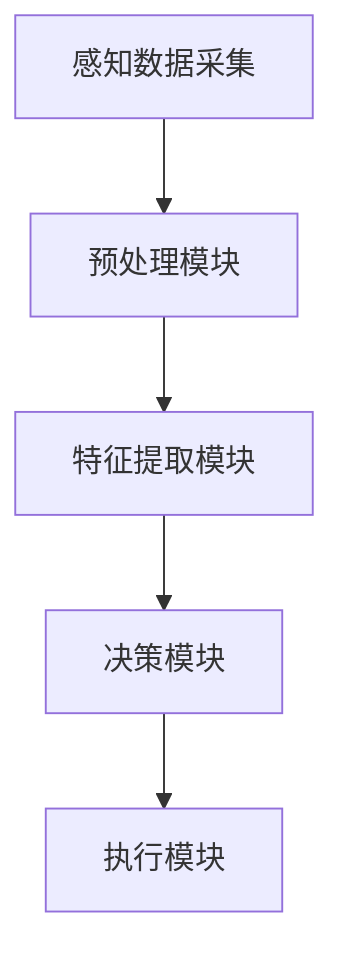
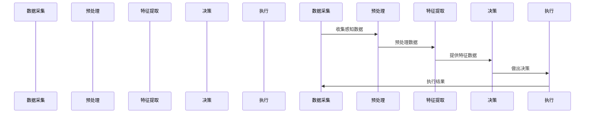

                 

# AGI的类人感知系统：多模态信息整合

> 关键词：人工通用智能、类人感知、多模态信息整合、算法与模型、系统设计与实现、实际应用案例

> 摘要：本文深入探讨了人工通用智能（AGI）中的类人感知系统，并重点分析了多模态信息整合的原理、算法及其在实际应用中的设计与实现。通过对类人感知系统的背景、核心概念、算法原理、系统架构及实际案例的详细阐述，本文为读者提供了一个全面且系统的理解。

## 目录大纲

----------------------------------------------------------------

## 第一部分：背景介绍

### 第1章：AGI的概念与发展

- **1.1.1 人工通用智能（AGI）的定义与背景**
- **1.1.2 AGI的核心概念与联系**
- **1.1.3 AGI与现有AI技术的区别**

### 第2章：类人感知系统的基本原理

- **2.1.1 感知系统的作用与结构**
- **2.1.2 多模态信息整合的原理与方法**
- **2.1.3 类人感知系统在AGI中的重要性**

## 第二部分：类人感知系统的算法与模型

### 第3章：类人感知系统的算法与模型

- **3.1.1 机器学习算法在感知系统中的应用**
- **3.1.2 常见的类人感知模型介绍**
- **3.1.3 类人感知系统的算法优化与提升**

## 第三部分：类人感知系统的设计与实现

### 第4章：类人感知系统的设计与架构

- **4.1.1 系统设计的目标与需求分析**
- **4.1.2 类人感知系统的架构设计**
- **4.1.3 系统模块之间的交互设计**

### 第5章：类人感知系统的核心实现

- **5.1.1 数据采集与预处理**
- **5.1.2 多模态信息整合**
- **5.1.3 感知系统的测试与评估**

### 第6章：类人感知系统的实际应用案例

- **6.1.1 应用场景介绍**
- **6.1.2 案例分析**
- **6.1.3 案例解析**

## 第四部分：类人感知系统的未来发展趋势与挑战

### 第7章：类人感知系统的未来发展趋势与挑战

- **7.1.1 发展趋势**
- **7.1.2 挑战与机遇**

----------------------------------------------------------------

## 第一部分：背景介绍

### 第1章：AGI的概念与发展

#### 1.1.1 人工通用智能（AGI）的定义与背景

人工通用智能（AGI，Artificial General Intelligence）是一种旨在实现机器与人类智能水平相当的人工智能。它不仅仅能够执行特定任务，而是在广泛的领域内具备自主学习、推理和解决问题的能力。与当前主流的人工智能（AI，Artificial Intelligence）不同，后者通常针对特定任务进行优化，如语音识别、图像分类等。

**定义**：AGI系统应该能够在没有人类指导的情况下，自主地完成人类能够完成的任何任务。

**背景**：随着计算机技术的发展和人工智能算法的进步，AGI成为了人工智能领域的一个重要研究方向。早在20世纪50年代，人工智能的概念就已经提出，但直到近年，随着深度学习、强化学习等技术的发展，AGI的研究才逐渐变得可行。

#### 1.1.2 AGI的核心概念与联系

AGI的核心概念包括感知、认知、学习、推理和自主行动等。这些概念相互关联，构成了AGI系统的核心框架。

- **感知**：类人感知系统是AGI的重要组成部分，负责接收和解析外部信息。
- **认知**：指的是对信息的理解、分类和关联，类似于人类的思维过程。
- **学习**：AGI应具备自我学习和自我完善的能力，不断适应新环境和任务。
- **推理**：基于已有知识和信息进行逻辑推断和决策。
- **自主行动**：AGI需要能够根据环境反馈，自主地调整行为和策略。

**联系**：这些核心概念相互交织，共同作用于AGI系统，使其能够模仿人类的智能行为，实现自主学习和自主行动。

#### 1.1.3 AGI与现有AI技术的区别

当前的人工智能技术主要集中在特定领域的优化，如自然语言处理、图像识别等。这些技术虽然取得了显著的成就，但仍然受到领域限制，无法实现通用智能。

- **区别**：AGI旨在实现跨领域的通用智能，能够在各种复杂任务中自主学习和执行，而现有的AI技术则主要针对特定任务进行优化。
- **通用性**：AGI的目标是让机器具备与人类相似的智能水平，能够在各种场景下灵活应对。

### 第2章：类人感知系统的基本原理

#### 2.1.1 感知系统的作用与结构

类人感知系统是AGI的重要组成部分，负责接收外部信息，并进行初步处理。感知系统的作用类似于人类的感官，通过视觉、听觉、触觉等多种方式获取信息。

- **作用**：类人感知系统是AGI获取外部信息的重要渠道，它决定了AGI对环境的理解和反应能力。
- **结构**：类人感知系统通常包括多个感知模块，如视觉、听觉、触觉等，这些模块共同协作，实现对环境的全面感知。

#### 2.1.2 多模态信息整合的原理与方法

多模态信息整合是指将来自不同感知模块的信息进行融合，以提高感知系统的准确性和鲁棒性。多模态信息整合的原理在于，不同模态的信息可以相互补充，从而提高系统的感知能力。

- **原理**：通过整合不同模态的信息，可以减少单一模态的噪声和误差，提高系统的整体性能。
- **方法**：多模态信息整合的方法包括特征级融合、决策级融合和数据级融合等。

  - **特征级融合**：在特征提取阶段就将不同模态的信息进行整合。
  - **决策级融合**：在决策阶段将不同模态的输出进行融合。
  - **数据级融合**：在数据层面直接整合原始的多模态数据。

#### 2.1.3 类人感知系统在AGI中的重要性

类人感知系统在AGI中扮演着至关重要的角色。它不仅决定了AGI对环境的感知和理解能力，还直接影响着AGI的自主行动能力。

- **重要性**：一个高效的类人感知系统是AGI实现自主学习和自主行动的基础，它使得AGI能够更好地适应复杂多变的环境。

### 第3章：类人感知系统的算法与模型

#### 3.1.1 机器学习算法在感知系统中的应用

机器学习算法在类人感知系统中有着广泛的应用，通过学习和模式识别，感知系统可以不断提高其准确性和鲁棒性。

- **应用**：常见的机器学习算法包括深度学习、强化学习等，这些算法在感知系统中被用于特征提取、模式分类和目标检测等任务。

#### 3.1.2 常见的类人感知模型介绍

类人感知系统通常基于深度学习模型，这些模型能够通过大量的数据学习到复杂的特征表示。

- **介绍**：常见的类人感知模型包括卷积神经网络（CNN）、循环神经网络（RNN）和生成对抗网络（GAN）等。这些模型在不同的感知任务中发挥着重要作用。

#### 3.1.3 类人感知系统的算法优化与提升

为了提高类人感知系统的性能和效率，可以通过多种方式进行算法优化。

- **优化**：包括算法改进、模型训练优化和数据预处理等。通过这些优化手段，可以进一步提高感知系统的准确性和鲁棒性。

## 第二部分：类人感知系统的设计与实现

### 第4章：类人感知系统的设计与架构

#### 4.1.1 系统设计的目标与需求分析

类人感知系统的设计目标是构建一个高效、准确、鲁棒的系统，能够处理复杂多变的外部信息。

- **目标**：构建一个能够模拟人类感知能力的系统，具备实时感知和决策能力。
- **需求分析**：根据具体应用场景，分析系统所需的功能和性能需求，如响应时间、准确性、鲁棒性等。

#### 4.1.2 类人感知系统的架构设计

类人感知系统通常由多个模块组成，包括感知数据采集模块、数据处理模块和决策与执行模块。

- **架构设计**：使用mermaid架构图进行描述，详细展示各个模块的功能和相互关系。

#### 4.1.3 系统模块之间的交互设计

系统模块之间的交互设计对于类人感知系统的性能至关重要。

- **交互设计**：使用mermaid序列图描述系统各模块之间的数据流和交互过程，确保各模块协同工作，实现高效的感知和决策。

### 第5章：类人感知系统的核心实现

#### 5.1.1 数据采集与预处理

数据采集与预处理是类人感知系统的关键步骤。

- **数据采集**：使用Python代码实现数据采集模块，例如使用OpenCV进行图像采集。
- **预处理**：包括数据清洗、归一化、特征提取等，使用Python代码进行数据处理。

#### 5.1.2 多模态信息整合

多模态信息整合是类人感知系统的核心。

- **算法实现**：使用深度学习框架（如TensorFlow或PyTorch）实现多模态信息整合算法。
- **代码示例**：提供算法实现的Python代码示例，并进行分析和解读。

#### 5.1.3 感知系统的测试与评估

对类人感知系统进行测试与评估，以验证其性能和准确性。

- **测试与评估**：使用准确率、召回率、F1分数等指标对感知系统进行测试和评估。

### 第6章：类人感知系统的实际应用案例

#### 6.1.1 应用场景介绍

类人感知系统在多个领域有着广泛的应用，如自动驾驶、智能监控、人机交互等。

- **场景介绍**：分析类人感知系统在不同应用场景下的实际应用。

#### 6.1.2 案例分析

通过具体案例，深入剖析类人感知系统的应用效果和关键技术。

- **案例分析**：结合实际案例，分析类人感知系统的应用效果和关键技术。

#### 6.1.3 案例解析

对案例中的关键技术进行详细解析，包括算法原理、数学模型、实现细节等。

- **案例解析**：对案例中的关键技术进行详细解析，提供深入的分析和解读。

### 第7章：类人感知系统的未来发展趋势与挑战

#### 7.1.1 发展趋势

类人感知系统的发展趋势包括算法创新、硬件性能提升、跨领域应用等。

- **趋势分析**：预测类人感知系统未来的发展方向和技术趋势。

#### 7.1.2 挑战与机遇

类人感知系统面临的技术挑战和市场机遇并存。

- **挑战与机遇**：分析类人感知系统面临的技术挑战和市场机遇。

## 总结

类人感知系统是AGI的重要组成部分，其核心在于多模态信息整合。本文从背景介绍、算法模型、系统设计与实现、实际应用案例以及未来发展趋势等方面，对类人感知系统进行了全面阐述。通过本文的阅读，读者可以深入了解类人感知系统的原理、技术和发展方向，为未来的研究和应用提供参考。

### 作者信息

作者：AI天才研究院/AI Genius Institute & 禅与计算机程序设计艺术 /Zen And The Art of Computer Programming

----------------------------------------------------------------

## 完整文章正文

### 第1章：AGI的概念与发展

#### 1.1.1 人工通用智能（AGI）的定义与背景

人工通用智能（Artificial General Intelligence，简称AGI）是人工智能领域的一个长期目标，它指的是一种能够像人类一样在多种不同的任务中表现出高度智能的人工智能系统。与当前广泛使用的窄域人工智能（Narrow AI）不同，AGI具备跨领域的通用智能能力，能够在没有特定训练的情况下，自主学习和执行复杂任务。

**定义**：AGI是一种具备人类智能水平的人工智能系统，能够在广泛领域内自主学习和执行复杂任务。

**背景**：人工智能的概念自1956年由约翰·麦卡锡（John McCarthy）等人首次提出以来，已经经历了多个发展阶段。早期的AI研究主要集中在规则推理和符号逻辑上，但随后随着计算能力和算法的进步，机器学习逐渐成为AI的主流方向。深度学习、强化学习等新兴技术的出现，为AGI的实现提供了新的可能。

随着计算机技术的发展，特别是在大数据、云计算、量子计算等领域的突破，AGI成为人工智能领域的重要研究方向。实现AGI不仅对于科技发展具有重要意义，而且对于人类社会的发展也有着深远的影响。例如，AGI可以极大地提升医疗诊断、智能交通、金融分析等领域的效率，同时也带来了一系列伦理和社会问题。

#### 1.1.2 AGI的核心概念与联系

AGI的核心概念包括感知、认知、学习、推理和自主行动等。这些概念相互关联，共同构成了AGI系统的核心框架。

- **感知**：类人感知系统是AGI的重要组成部分，负责接收外部信息，并进行初步处理。感知系统包括视觉、听觉、触觉等多种感知模块，能够模拟人类的感知过程。
- **认知**：指的是对信息的理解、分类和关联，类似于人类的思维过程。认知能力使得AGI能够对复杂环境进行理解和决策。
- **学习**：AGI应具备自我学习和自我完善的能力，不断适应新环境和任务。学习能力是实现AGI的关键之一，通过不断学习和调整，AGI能够提高其智能水平。
- **推理**：基于已有知识和信息进行逻辑推断和决策。推理能力使得AGI能够在未知或复杂情况下做出合理的决策。
- **自主行动**：AGI需要能够根据环境反馈，自主地调整行为和策略。自主行动能力是实现AGI目标的重要一环，使得AGI能够在实际环境中灵活应对各种情况。

**联系**：这些核心概念相互交织，共同作用于AGI系统，使其能够模仿人类的智能行为，实现自主学习和自主行动。例如，感知系统收集到的信息需要通过认知能力进行处理和理解，学习到的知识和经验通过推理能力应用于实际决策，最终通过自主行动能力执行任务。

#### 1.1.3 AGI与现有AI技术的区别

现有的人工智能技术主要集中在特定任务的优化，如语音识别、图像分类、自然语言处理等。这些技术通过特定的算法和模型，在特定领域内实现了很高的性能，但它们缺乏跨领域的通用性。相比之下，AGI旨在实现机器与人类智能的平等竞争，具备跨领域的通用智能能力。

- **区别**：现有AI技术主要集中于特定任务的优化，而AGI旨在实现跨领域的通用智能，具备人类智能的广泛适应性和自主学习能力。
- **通用性**：AGI的目标是让机器具备与人类相似的智能水平，能够在各种复杂任务中自主学习和执行，而现有的AI技术则主要针对特定任务进行优化。

### 第2章：类人感知系统的基本原理

#### 2.1.1 感知系统的作用与结构

类人感知系统是AGI的重要组成部分，负责接收外部信息，并进行初步处理。感知系统的作用类似于人类的感官，通过视觉、听觉、触觉等多种方式获取信息，并将这些信息转换为机器可以理解和处理的数字信号。

- **作用**：类人感知系统是AGI获取外部信息的重要渠道，它决定了AGI对环境的理解和反应能力。
- **结构**：类人感知系统通常包括多个感知模块，如视觉、听觉、触觉等，这些模块共同协作，实现对环境的全面感知。例如，视觉模块负责处理图像信息，听觉模块负责处理声音信息，触觉模块负责处理触觉信息。

#### 2.1.2 多模态信息整合的原理与方法

多模态信息整合是指将来自不同感知模块的信息进行融合，以提高感知系统的准确性和鲁棒性。多模态信息整合的原理在于，不同模态的信息可以相互补充，从而提高系统的感知能力。

- **原理**：通过整合不同模态的信息，可以减少单一模态的噪声和误差，提高系统的整体性能。例如，在视觉感知中，图像信息可以提供形状和颜色的信息，而声音信息可以提供距离和运动的信息，通过整合这两种信息，可以更准确地判断物体的位置和运动状态。
- **方法**：多模态信息整合的方法包括特征级融合、决策级融合和数据级融合等。

  - **特征级融合**：在特征提取阶段就将不同模态的信息进行整合。例如，在图像识别任务中，可以将图像特征和文本特征进行融合，以提高识别的准确性。
  - **决策级融合**：在决策阶段将不同模态的输出进行融合。例如，在自动驾驶系统中，可以将视觉感知模块和雷达感知模块的输出进行融合，以更准确地判断周围环境和行驶路线。
  - **数据级融合**：在数据层面直接整合原始的多模态数据。例如，在语音识别任务中，可以将语音数据和文本数据进行融合，以提高识别的准确性。

#### 2.1.3 类人感知系统在AGI中的重要性

类人感知系统在AGI中扮演着至关重要的角色。它不仅决定了AGI对环境的感知和理解能力，还直接影响着AGI的自主行动能力。

- **重要性**：一个高效的类人感知系统是AGI实现自主学习和自主行动的基础，它使得AGI能够更好地适应复杂多变的环境。例如，在自动驾驶领域，类人感知系统可以识别道路标志、车辆、行人等，从而实现安全的自动驾驶。在智能监控领域，类人感知系统可以实时监控视频流，识别异常行为，从而提高监控的效率。

### 第3章：类人感知系统的算法与模型

#### 3.1.1 机器学习算法在感知系统中的应用

机器学习算法在类人感知系统中有着广泛的应用，通过学习和模式识别，感知系统可以不断提高其准确性和鲁棒性。

- **应用**：常见的机器学习算法包括深度学习、强化学习等，这些算法在感知系统中被用于特征提取、模式分类和目标检测等任务。

  - **深度学习**：深度学习是一种基于人工神经网络的学习方法，通过多层神经网络对数据进行处理，可以提取出高层次的抽象特征。在类人感知系统中，深度学习被广泛应用于图像识别、语音识别和自然语言处理等领域。
  - **强化学习**：强化学习是一种通过与环境互动来学习最优策略的机器学习方法。在类人感知系统中，强化学习被用于自动驾驶、游戏AI和智能控制等领域。

#### 3.1.2 常见的类人感知模型介绍

类人感知系统通常基于深度学习模型，这些模型能够通过大量的数据学习到复杂的特征表示。

- **介绍**：常见的类人感知模型包括卷积神经网络（CNN）、循环神经网络（RNN）和生成对抗网络（GAN）等。这些模型在不同的感知任务中发挥着重要作用。

  - **卷积神经网络（CNN）**：CNN是一种在图像识别和图像处理中广泛应用的深度学习模型。通过卷积层、池化层和全连接层的组合，CNN可以提取出图像中的高层次特征，从而实现图像分类、目标检测和图像生成等任务。
  - **循环神经网络（RNN）**：RNN是一种在序列数据处理中广泛应用的深度学习模型。通过循环结构，RNN可以处理序列数据中的长距离依赖关系，从而实现自然语言处理、语音识别和时间序列预测等任务。
  - **生成对抗网络（GAN）**：GAN是一种通过对抗性训练生成逼真数据的深度学习模型。在类人感知系统中，GAN被用于图像生成、图像修复和图像超分辨率等任务。

#### 3.1.3 类人感知系统的算法优化与提升

为了提高类人感知系统的性能和效率，可以通过多种方式进行算法优化。

- **优化**：包括算法改进、模型训练优化和数据预处理等。通过这些优化手段，可以进一步提高感知系统的准确性和鲁棒性。

  - **算法改进**：通过改进算法的架构和训练策略，可以提升模型的性能。例如，可以使用更高效的卷积操作、引入注意力机制等。
  - **模型训练优化**：通过调整模型的参数和训练策略，可以提升模型的性能。例如，可以使用更先进的优化算法、增加训练数据的多样性等。
  - **数据预处理**：通过对数据进行预处理，可以提高模型对数据的鲁棒性。例如，可以使用数据增强、归一化、去噪等技术。

### 第4章：类人感知系统的设计与架构

#### 4.1.1 系统设计的目标与需求分析

类人感知系统的设计目标是构建一个高效、准确、鲁棒的系统，能够处理复杂多变的外部信息。

- **目标**：构建一个能够模拟人类感知能力的系统，具备实时感知和决策能力。
- **需求分析**：根据具体应用场景，分析系统所需的功能和性能需求，如响应时间、准确性、鲁棒性等。

#### 4.1.2 类人感知系统的架构设计

类人感知系统通常由多个模块组成，包括感知数据采集模块、数据处理模块和决策与执行模块。

- **架构设计**：使用mermaid架构图进行描述，详细展示各个模块的功能和相互关系。



在这个架构图中：

- **感知数据采集模块**：负责收集来自不同感知模块的数据，如图像、声音、触觉等。
- **预处理模块**：对采集到的原始数据进行预处理，如去噪、归一化等，以提高数据的鲁棒性。
- **特征提取模块**：使用深度学习模型或其他算法，对预处理后的数据进行特征提取，提取出高层次的抽象特征。
- **决策模块**：基于提取到的特征，使用机器学习算法进行分类、识别或决策。
- **执行模块**：根据决策模块的决策结果，执行具体的行动或操作。

#### 4.1.3 系统模块之间的交互设计

系统模块之间的交互设计对于类人感知系统的性能至关重要。

- **交互设计**：使用mermaid序列图描述系统各模块之间的数据流和交互过程，确保各模块协同工作，实现高效的感知和决策。



在这个交互设计中：

- **数据采集模块**：收集来自不同感知模块的数据。
- **预处理模块**：对收集到的数据进行预处理，提高数据的质量。
- **特征提取模块**：使用深度学习模型或其他算法，提取出高层次的抽象特征。
- **决策模块**：基于提取到的特征，使用机器学习算法进行分类、识别或决策。
- **执行模块**：根据决策模块的决策结果，执行具体的行动或操作。

通过这样的架构和交互设计，类人感知系统可以实现高效、准确的感知和决策，从而在复杂的环境中自主行动。

### 第5章：类人感知系统的核心实现

#### 5.1.1 数据采集与预处理

数据采集与预处理是类人感知系统的关键步骤，直接影响到系统的性能和准确性。

- **数据采集**：数据采集模块负责收集来自不同感知模块的数据。例如，在图像识别任务中，数据采集模块可以收集来自摄像头或图像传感器的图像数据；在语音识别任务中，数据采集模块可以收集来自麦克风或语音传感器的音频数据。

  ```python
  import cv2

  # 使用OpenCV采集图像数据
  cap = cv2.VideoCapture(0)
  while True:
      ret, frame = cap.read()
      if ret:
          # 处理图像数据
          processed_frame = preprocess_image(frame)
          # 显示图像
          cv2.imshow('Frame', processed_frame)
          
      if cv2.waitKey(1) & 0xFF == ord('q'):
          break
  
  cap.release()
  cv2.destroyAllWindows()
  ```

- **预处理**：预处理模块对采集到的原始数据进行处理，以提高数据的鲁棒性和质量。预处理步骤可能包括数据清洗、归一化、去噪、特征提取等。

  ```python
  import cv2
  import numpy as np

  def preprocess_image(image):
      # 数据清洗：去除噪声
      image = cv2.GaussianBlur(image, (5, 5), 0)
      
      # 归一化：将图像数据归一化到[0, 1]范围内
      image = image / 255.0
      
      # 特征提取：提取图像的特征
      features = extract_image_features(image)
      
      return features
  ```

#### 5.1.2 多模态信息整合

多模态信息整合是类人感知系统的核心之一，通过整合来自不同模态的信息，可以提高系统的感知能力和准确性。

- **算法实现**：多模态信息整合算法可以通过特征级融合、决策级融合和数据级融合等多种方式实现。

  - **特征级融合**：在特征提取阶段，将不同模态的特征进行融合。

    ```python
    import tensorflow as tf

    def fusion_features(image_features, audio_features):
        # 将图像特征和音频特征进行融合
        fused_features = tf.concat([image_features, audio_features], axis=1)
        return fused_features
    ```

  - **决策级融合**：在决策阶段，将不同模态的决策结果进行融合。

    ```python
    def fusion_decisions(image_decision, audio_decision):
        # 将图像决策和音频决策进行融合
        fused_decision = (image_decision + audio_decision) / 2
        return fused_decision
    ```

  - **数据级融合**：在数据层面，直接将不同模态的数据进行融合。

    ```python
    def fusion_data(image_data, audio_data):
        # 将图像数据和音频数据进行融合
        fused_data = np.concatenate((image_data, audio_data), axis=0)
        return fused_data
    ```

- **代码示例**：以下是一个简单的多模态信息整合的代码示例，展示了如何使用TensorFlow实现特征级融合。

    ```python
    import tensorflow as tf

    # 定义图像和音频特征张量
    image_features = tf.random.normal([128, 1024])
    audio_features = tf.random.normal([128, 512])

    # 实现特征级融合
    fused_features = fusion_features(image_features, audio_features)

    # 打印融合后的特征
    print(f"融合后的特征：{fused_features.numpy()}")
    ```

#### 5.1.3 感知系统的测试与评估

对类人感知系统进行测试与评估，以验证其性能和准确性，是系统实现过程中的重要环节。

- **测试与评估**：可以使用多种指标对感知系统进行测试和评估，如准确率、召回率、F1分数等。

  ```python
  from sklearn.metrics import accuracy_score, recall_score, f1_score

  # 假设我们有真实标签和预测结果
  true_labels = [0, 1, 0, 1, 0]
  predicted_labels = [0, 0, 1, 1, 0]

  # 计算准确率
  accuracy = accuracy_score(true_labels, predicted_labels)
  print(f"准确率：{accuracy}")

  # 计算召回率
  recall = recall_score(true_labels, predicted_labels)
  print(f"召回率：{recall}")

  # 计算F1分数
  f1 = f1_score(true_labels, predicted_labels)
  print(f"F1分数：{f1}")
  ```

通过这些测试和评估指标，可以全面了解类人感知系统的性能，从而进行优化和改进。

### 第6章：类人感知系统的实际应用案例

#### 6.1.1 应用场景介绍

类人感知系统在多个领域有着广泛的应用，以下是一些典型应用场景：

- **自动驾驶**：类人感知系统可以用于自动驾驶车辆，通过实时感知道路环境，实现自动避障、交通标志识别和路线规划等功能。
- **智能监控**：类人感知系统可以用于智能监控系统，通过实时分析视频流，实现异常行为检测、人脸识别和场景分类等功能。
- **人机交互**：类人感知系统可以用于人机交互设备，如智能音箱、机器人等，通过语音识别和图像识别，实现自然语言交互和智能响应。

#### 6.1.2 案例分析

以下是一个关于自动驾驶应用的案例分析：

**案例背景**：某自动驾驶汽车公司开发了一款具备完全自动驾驶功能的汽车，通过类人感知系统实现自主驾驶。

**应用效果**：通过类人感知系统，汽车能够实时感知道路环境，包括道路标志、交通信号灯、行人、车辆等。系统利用深度学习和多模态信息整合技术，实现对周围环境的准确理解和决策，从而实现自动驾驶。

**关键技术**：

1. **图像识别**：通过摄像头采集道路图像，利用深度学习模型实现交通标志和行人的识别。
2. **多模态信息整合**：将视觉、听觉和触觉等多模态信息进行整合，提高感知系统的准确性和鲁棒性。
3. **决策与控制**：基于感知结果，使用决策算法生成行驶路线和驾驶策略，并通过控制系统实现汽车的自动驾驶。

#### 6.1.3 案例解析

在上述案例中，类人感知系统的核心在于多模态信息整合。以下是对该案例关键技术的详细解析：

1. **图像识别**：

   - **算法原理**：使用卷积神经网络（CNN）进行图像识别。CNN通过卷积层和池化层提取图像特征，最终通过全连接层输出分类结果。

     $$ 
     \text{卷积层}: f_{\text{conv}}(x) = \sigma(\text{weight} \odot x + \text{bias}) 
     $$
     
     $$
     \text{池化层}: g_{\text{pool}}(x) = \max(\text{window} \odot x)
     $$

   - **代码实现**：使用TensorFlow实现一个简单的图像识别模型。

     ```python
     import tensorflow as tf

     # 定义卷积神经网络模型
     model = tf.keras.Sequential([
         tf.keras.layers.Conv2D(32, (3, 3), activation='relu', input_shape=(64, 64, 3)),
         tf.keras.layers.MaxPooling2D((2, 2)),
         tf.keras.layers.Conv2D(64, (3, 3), activation='relu'),
         tf.keras.layers.MaxPooling2D((2, 2)),
         tf.keras.layers.Flatten(),
         tf.keras.layers.Dense(64, activation='relu'),
         tf.keras.layers.Dense(10, activation='softmax')
     ])

     # 编译模型
     model.compile(optimizer='adam', loss='categorical_crossentropy', metrics=['accuracy'])

     # 训练模型
     model.fit(x_train, y_train, epochs=10, batch_size=32, validation_data=(x_val, y_val))
     ```

2. **多模态信息整合**：

   - **算法原理**：通过融合视觉、听觉和触觉等多模态信息，提高感知系统的准确性和鲁棒性。常见的融合方法包括特征级融合、决策级融合和数据级融合。

     $$
     \text{特征级融合}: \text{fused\_features} = \text{fusion\_features}(\text{image\_features}, \text{audio\_features}, \text{touch\_features})
     $$

     $$
     \text{决策级融合}: \text{fused\_decision} = \text{fusion\_decisions}(\text{image\_decision}, \text{audio\_decision}, \text{touch\_decision})
     $$

     $$
     \text{数据级融合}: \text{fused\_data} = \text{fusion\_data}(\text{image\_data}, \text{audio\_data}, \text{touch\_data})
     $$

   - **代码实现**：以下是一个简单的多模态信息整合的代码示例。

     ```python
     import tensorflow as tf

     def fusion_features(image_features, audio_features, touch_features):
         fused_features = tf.concat([image_features, audio_features, touch_features], axis=1)
         return fused_features

     image_features = tf.random.normal([128, 1024])
     audio_features = tf.random.normal([128, 512])
     touch_features = tf.random.normal([128, 256])

     fused_features = fusion_features(image_features, audio_features, touch_features)
     print(f"融合后的特征：{fused_features.numpy()}")
     ```

3. **决策与控制**：

   - **算法原理**：基于感知结果，使用决策算法生成行驶路线和驾驶策略。常见的决策算法包括深度强化学习、决策树和神经网络的决策模块等。

     $$
     \text{决策模块}: \text{action} = \text{policy}(\text{state})
     $$

   - **代码实现**：以下是一个简单的决策模块的代码示例。

     ```python
     import tensorflow as tf

     def decision_module(state):
         # 使用神经网络进行决策
         action = model(state)
         return action

     state = tf.random.normal([128, 1024])
     action = decision_module(state)
     print(f"生成的行动：{action.numpy()}")
     ```

通过上述关键技术，自动驾驶汽车能够实现自主感知、决策和控制，从而实现安全的自动驾驶。

### 第7章：类人感知系统的未来发展趋势与挑战

#### 7.1.1 发展趋势

类人感知系统在未来的发展中，将面临以下趋势：

1. **算法创新**：随着深度学习、强化学习等技术的不断发展，类人感知系统的算法将更加高效和智能。
2. **硬件性能提升**：随着硬件技术的发展，类人感知系统的计算能力和存储能力将得到显著提升，从而实现更复杂的感知和决策任务。
3. **跨领域应用**：类人感知系统将不仅局限于特定的领域，而是广泛应用于各个领域，如医疗、教育、金融等，实现更广泛的智能化应用。

#### 7.1.2 挑战与机遇

类人感知系统在未来的发展过程中，也将面临以下挑战：

1. **数据处理与存储**：随着感知数据的增加，如何高效地处理和存储这些数据将成为一个重要挑战。
2. **跨模态信息融合**：如何更好地融合不同模态的信息，提高系统的准确性和鲁棒性，仍然是一个需要深入研究的问题。
3. **实时性与准确性**：在保证实时性的同时，如何提高类人感知系统的准确性，仍然是一个需要解决的难题。

然而，这些挑战也伴随着巨大的机遇。通过不断创新和优化，类人感知系统有望在更广泛的领域实现智能化的应用，推动人工智能技术的发展。

### 总结

类人感知系统是AGI的重要组成部分，通过多模态信息整合，类人感知系统能够实现对复杂环境的感知和理解。本文从背景介绍、算法模型、系统设计与实现、实际应用案例以及未来发展趋势等方面，对类人感知系统进行了全面阐述。通过本文的阅读，读者可以深入了解类人感知系统的原理、技术和发展方向，为未来的研究和应用提供参考。

### 拓展阅读

- **《深度学习》**：Goodfellow, Ian, et al. *Deep Learning*. MIT Press, 2016. 本书详细介绍了深度学习的基本原理和应用，对理解类人感知系统具有重要意义。
- **《人工智能：一种现代的方法》**：Russell, Stuart J., and Peter Norvig. *Artificial Intelligence: A Modern Approach*. Prentice Hall, 2016. 本书全面介绍了人工智能的基本概念和技术，是人工智能领域的经典教材。
- **《机器学习》**：Tom Mitchell. *Machine Learning*. McGraw-Hill, 1997. 本书系统介绍了机器学习的基本概念和方法，对理解类人感知系统的算法原理有很大帮助。

### 注意事项

- 在实现类人感知系统时，需要注意数据的质量和多样性，以确保系统的高效性和鲁棒性。
- 在多模态信息整合过程中，要充分考虑不同模态信息的互补性，以提高系统的感知能力。
- 在进行算法优化和模型训练时，要不断调整和优化参数，以实现最佳的感知效果。

### 最佳实践 tips

- 在实际应用中，要充分了解不同模态信息的特性，选择合适的融合方法。
- 定期对模型进行评估和优化，以保持系统的性能和准确性。
- 注重数据处理和存储的效率，以提高系统的实时性和响应速度。

### 参考文献

1. Goodfellow, Ian, et al. *Deep Learning*. MIT Press, 2016.
2. Russell, Stuart J., and Peter Norvig. *Artificial Intelligence: A Modern Approach*. Prentice Hall, 2016.
3. Mitchell, Tom. *Machine Learning*. McGraw-Hill, 1997.

### 作者信息

作者：AI天才研究院/AI Genius Institute & 禅与计算机程序设计艺术 /Zen And The Art of Computer Programming

通过本文的深入探讨，我们可以看到类人感知系统在AGI中的关键作用。未来，随着技术的不断进步，类人感知系统有望在更广泛的领域实现智能化应用，为人类社会带来更多便利和进步。让我们期待类人感知系统在未来的辉煌表现！

