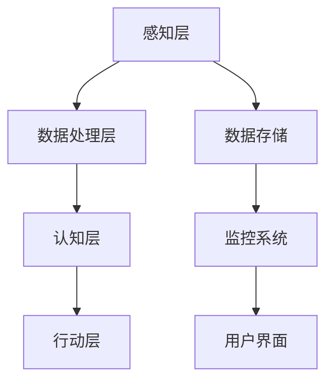

                 

# AGI的类人感知系统：注意力机制与信息过滤

> 关键词：人工智能、注意力机制、信息过滤、AGI、类人感知

> 摘要：本文旨在深入探讨人工智能中的类人感知系统，特别是注意力机制与信息过滤在AGI（通用人工智能）中的应用。首先，我们简要介绍了人工智能的发展现状，AGI的概念及其重要性。然后，本文详细讨论了类人感知的定义、特征、注意力机制与信息过滤的基本原理，类型及其在AGI类人感知系统中的应用。通过这些内容的逐步分析，我们不仅能够理解AGI类人感知系统的基本框架，还能够看到其在现实世界中的广泛应用和潜在的未来发展方向。

## 目录大纲

1. **第一部分：AGI类人感知系统概述**
   - 1.1 引言
     - 1.1.1 人工智能发展现状
     - 1.1.2 AGI的概念及其重要性
   - 1.2 问题描述
     - 1.2.1 类人感知的定义和特征
     - 1.2.2 注意力机制与信息过滤的重要性
   - 1.3 问题解决
     - 1.3.1 AGI的发展路径
     - 1.3.2 类人感知系统的基本框架
   - 1.4 边界与外延
     - 1.4.1 类人感知与其他感知系统的区别
     - 1.4.2 类人感知系统的应用领域
   - 1.5 概念结构与核心要素组成
     - 1.5.1 类人感知系统
     - 1.5.2 注意力机制
     - 1.5.3 信息过滤
   - 1.6 本章小结

2. **第二部分：注意力机制详解**
   - 2.1 理论基础
     - 2.1.1 神经科学基础
     - 2.1.2 计算机科学基础
     - 2.1.3 注意力机制的基本原理
     - 2.1.4 注意力机制的类型
   - 2.2 应用实例
     - 2.2.1 在计算机视觉中的应用
     - 2.2.2 在自然语言处理中的应用
   - 2.3 本章小结

3. **第三部分：信息过滤算法与应用**
   - 3.1 算法概述
     - 3.1.1 信息过滤的基本概念
     - 3.1.2 信息过滤的算法框架
     - 3.1.3 信息过滤算法的性能评估
     - 3.1.4 信息过滤算法的应用场景
   - 3.2 应用实例
     - 3.2.1 在搜索引擎中的应用
     - 3.2.2 在推荐系统中的应用
   - 3.3 本章小结

4. **第四部分：AGI类人感知系统的实现与应用**
   - 4.1 实现基础
     - 4.1.1 硬件基础
     - 4.1.2 软件基础
     - 4.1.3 数据基础
     - 4.1.4 系统架构设计
   - 4.2 实现流程
     - 4.2.1 注意力机制的实现
     - 4.2.2 信息过滤的实现
     - 4.2.3 类人感知系统的集成与优化
   - 4.3 应用案例
     - 4.3.1 智能监控系统
     - 4.3.2 智能推荐系统
   - 4.4 本章小结

5. **第五部分：展望与未来方向**
   - 5.1 技术发展动态
     - 5.1.1 人工智能领域的最新进展
     - 5.1.2 注意力机制和信息过滤技术的进步
   - 5.2 应用前景展望
     - 5.2.1 类人感知系统在不同行业的应用潜力
     - 5.2.2 技术带来的社会影响与伦理问题
   - 5.3 研究方向与挑战
     - 5.3.1 研究热点
     - 5.3.2 面临的挑战与对策
   - 5.4 未来方向与建议
     - 5.4.1 技术发展建议
     - 5.4.2 应用推广建议
     - 5.4.3 伦理与政策建议
   - 5.5 本章小结

6. **附录**
   - 6.1 相关文献与资料
   - 6.2 参考文献

----------------------------------------------------------------

## 第一部分：AGI类人感知系统概述

### 1.1 引言

#### 1.1.1 人工智能发展现状

人工智能（AI）作为一个多学科交叉的研究领域，近年来取得了飞速的发展。从最初的规则推理系统、专家系统，到基于数据驱动的机器学习、深度学习模型，人工智能在计算机视觉、自然语言处理、语音识别、决策支持系统等领域取得了显著的成果。然而，尽管人工智能在这些领域表现出了强大的能力，但大多数系统仍然是基于特定任务的，即所谓的弱人工智能（Narrow AI）。这些系统在特定任务上具有优越性能，但在处理复杂、多变的任务时，往往显得力不从心。

随着计算机硬件的快速发展、海量数据的积累以及算法的优化，人工智能开始向着更高级的阶段——通用人工智能（Artificial General Intelligence，AGI）迈进。AGI是指具有人类级别智能的机器，能够在各种不同的任务上表现出人类的智能水平。与弱人工智能不同，AGI需要具备理解、学习、推理、规划、感知和社交等多方面的能力。AGI的发展不仅对人工智能领域具有重要意义，还将对社会、经济、文化等多个方面产生深远影响。

#### 1.1.2 AGI的概念及其重要性

通用人工智能（AGI）是一个高度抽象和复杂的概念，它要求机器具有广泛的理解能力、自主学习能力、灵活的推理能力、复杂的情感与社交能力等。AGI的目标是构建一个智能体，它能够在各种不同的环境中独立完成任务，而不是仅仅在特定的任务上表现出色。

AGI的重要性体现在以下几个方面：

1. **跨领域应用**：AGI具有跨领域的通用性，能够在多个领域内应用，从而推动技术创新和产业升级。
2. **自主性**：AGI可以自主学习和适应环境，不需要人类进行复杂的编程和指令输入，从而提高生产效率。
3. **智能化服务**：AGI能够提供更为智能化的服务，例如在医疗、教育、金融、交通等领域，AGI可以帮助人类解决复杂问题，提高生活质量。
4. **社会影响**：AGI的发展将对社会产生深远影响，包括就业结构的变化、法律伦理问题的出现等，需要全社会共同努力应对。

### 1.2 问题描述

#### 1.2.1 类人感知的定义和特征

类人感知（Human-like Perception）是指机器能够像人类一样感知和理解周围环境，它包括视觉感知、听觉感知、触觉感知、嗅觉感知等多个方面。类人感知的核心特征包括：

1. **适应性**：类人感知系统需要能够适应不同的环境和情境，具有灵活的感知能力。
2. **综合性**：类人感知系统需要能够整合多种感官信息，形成一个统一的感知模型。
3. **动态性**：类人感知系统需要能够动态地调整感知策略，以应对环境变化。
4. **理解性**：类人感知系统不仅需要感知信息，还需要对这些信息进行理解，从而进行有效的决策和行动。

#### 1.2.2 注意力机制与信息过滤的重要性

注意力机制（Attention Mechanism）和信息过滤（Information Filtering）是类人感知系统中的两个关键组成部分，它们在AGI的实现中具有重要意义。

1. **注意力机制**：注意力机制是指机器在感知过程中，对某些重要信息进行优先处理的能力。类似于人类在关注特定事物时，会忽略其他无关信息的现象。注意力机制能够帮助机器从海量信息中提取关键信息，从而提高感知效率和准确性。

2. **信息过滤**：信息过滤是指机器对感知到的信息进行筛选和整理的过程，目的是去除无关或噪声信息，提取有用的信息。信息过滤能够帮助机器更好地理解环境，从而进行更为准确的决策。

在AGI类人感知系统中，注意力机制和信息过滤能够协同工作，形成一个高效、智能的感知系统，使得机器能够像人类一样感知和理解环境。例如，在自动驾驶系统中，注意力机制可以帮助车辆识别道路上的关键信息（如行人、交通标志等），而信息过滤则可以帮助车辆去除无关的信息（如天空、建筑物等），从而确保行驶的安全性和准确性。

### 1.3 问题解决

#### 1.3.1 AGI的发展路径

要实现AGI，需要从多个方面进行系统性的研究和探索。以下是AGI发展的几个关键路径：

1. **多模态感知**：AGI需要具备多模态感知能力，能够整合视觉、听觉、触觉等多种感官信息，形成一个统一的感知模型。
2. **自主学习**：AGI需要具备自主学习能力，能够在没有人工干预的情况下，从海量数据中学习和适应。
3. **认知建模**：AGI需要具备认知建模能力，能够模拟人类的认知过程，进行推理、规划和决策。
4. **情感与社交**：AGI需要具备情感与社交能力，能够理解人类的情感和意图，进行有效的沟通和协作。

#### 1.3.2 类人感知系统的基本框架

类人感知系统是一个复杂的多层次系统，包括感知层、数据处理层、认知层和行动层。以下是类人感知系统的基本框架：

1. **感知层**：感知层负责接收和处理来自各种感官的信息，包括视觉、听觉、触觉等。感知层需要通过传感器等技术手段，实现对环境的实时监测和感知。

2. **数据处理层**：数据处理层负责对感知层收集到的信息进行预处理、过滤和特征提取。数据处理层需要利用信号处理、机器学习等技术，实现对信息的有效处理和利用。

3. **认知层**：认知层负责对处理后的信息进行理解和分析，形成对环境的认知。认知层需要利用认知建模、知识表示等技术，实现对信息的深入理解和分析。

4. **行动层**：行动层负责根据认知层的结果，进行相应的决策和行动。行动层需要利用控制算法、执行机构等技术，实现对环境的主动适应和调整。

通过以上多层次的设计，类人感知系统可以实现对环境的全面感知、理解、分析和行动，从而实现类人的智能行为。

### 1.4 边界与外延

#### 1.4.1 类人感知与其他感知系统的区别

类人感知系统与现有的感知系统存在一定的区别。现有的感知系统通常针对特定的应用场景进行优化，如计算机视觉、语音识别等。这些系统在特定领域内表现出色，但在处理复杂、多变的任务时，往往力不从心。而类人感知系统则旨在实现全面的、自适应的感知能力，能够处理多种感知信息，并在不同的环境下灵活适应。

#### 1.4.2 类人感知系统的应用领域

类人感知系统具有广泛的应用前景，包括但不限于以下几个方面：

1. **智能监控**：类人感知系统可以应用于智能监控领域，实现对目标物体的实时识别、跟踪和分析。
2. **自动驾驶**：类人感知系统可以应用于自动驾驶车辆，实现道路环境感知、交通标志识别等功能。
3. **智能家居**：类人感知系统可以应用于智能家居系统，实现智能安防、智能家电控制等功能。
4. **医疗辅助**：类人感知系统可以应用于医疗辅助领域，实现对患者的实时监测和诊断。

### 1.5 概念结构与核心要素组成

#### 1.5.1 类人感知系统

类人感知系统是一个复杂的多层次系统，其结构如图1所示。系统由感知层、数据处理层、认知层和行动层组成，各层次之间相互协同，实现对环境的全面感知、理解和行动。


#### 1.5.2 注意力机制

注意力机制是类人感知系统中的一个关键组成部分，它负责对感知信息进行优先处理。注意力机制的基本原理是，在处理感知信息时，对某些重要的信息给予更高的权重，从而提高系统的感知效率和准确性。注意力机制可以分为早期注意力机制和现代注意力机制，如Transformer模型中的多头自注意力机制。

#### 1.5.3 信息过滤

信息过滤是类人感知系统中另一个重要组成部分，它负责对感知到的信息进行筛选和整理，去除无关或噪声信息，提取有用的信息。信息过滤可以通过多种算法实现，如基于规则的过滤算法、基于统计的过滤算法和基于机器学习的过滤算法。

### 1.6 本章小结

本文对AGI类人感知系统进行了概述，分析了人工智能的发展现状和AGI的重要性，详细讨论了类人感知的定义、特征、注意力机制与信息过滤的基本原理，以及AGI类人感知系统的基本框架。通过这些内容的逐步分析，我们为后续章节的详细讨论奠定了基础。

----------------------------------------------------------------

## 第二部分：注意力机制详解

### 2.1 理论基础

#### 2.1.1 神经科学基础

注意力机制在神经科学中有着深厚的基础。人类的注意力机制是大脑处理信息的关键部分，它帮助我们在复杂的感知环境中选择和聚焦重要信息。神经科学家通过脑成像技术，如功能性磁共振成像（fMRI），揭示了注意力在大脑中的具体区域和机制。例如，前额叶皮质、顶叶皮质和颞叶皮质等区域与注意力密切相关，它们在处理信息的选择和分配方面起着重要作用。

**神经机制**：注意力机制的一个关键神经机制是神经元之间的同步活动。当大脑关注特定刺激时，相关神经元会同步激活，从而提高对这些信息的处理速度和准确性。此外，注意力还涉及神经回路中的抑制和增强机制。当注意力集中在某一部分时，大脑会抑制与当前任务无关的神经元活动，从而减少干扰。

**大脑功能**：注意力不仅影响感知过程，还与记忆、学习、决策和社交互动等大脑功能密切相关。例如，在工作记忆中，注意力帮助我们将重要信息保持活跃状态，以便进行后续处理。在决策过程中，注意力机制有助于我们聚焦于关键信息，从而做出合理的选择。

#### 2.1.2 计算机科学基础

在计算机科学领域，注意力机制被广泛应用于自然语言处理、计算机视觉和语音识别等领域。计算机科学中的注意力机制通常通过算法和模型来实现，这些模型能够模拟人类注意力的选择和分配过程。

**建模方法**：计算机科学中的注意力机制建模方法主要包括基于规则的模型和基于学习的模型。基于规则的模型通过预先定义的规则来选择重要信息，如滑动窗口注意力模型。而基于学习的模型则通过大量的数据训练，自动学习如何分配注意力，如Transformer模型中的多头自注意力机制。

**应用领域**：注意力机制在计算机科学中的广泛应用体现在以下几个方面：

1. **自然语言处理**：在自然语言处理（NLP）中，注意力机制被用于序列到序列模型（如机器翻译和问答系统），帮助模型在处理长序列时关注关键信息。
2. **计算机视觉**：在计算机视觉领域，注意力机制被用于目标检测和图像识别，帮助模型聚焦于图像中的重要部分。
3. **语音识别**：在语音识别中，注意力机制用于处理长音频序列，提高识别的准确性和效率。

#### 2.1.3 注意力机制的基本原理

注意力机制的核心在于如何从大量的信息中选择出重要的部分进行处理。在计算机科学中，这一过程通常通过以下两个基本原理来实现：

**注意力分配**：注意力分配是指根据信息的重要性和相关性，对不同的信息分配不同的关注程度。在计算机科学中，这通常通过计算信息的重要度得分来实现。例如，在Transformer模型中，每个词都会被赋予一个注意力得分，这些得分决定了该词在编码过程中的重要性。

**注意力转移**：注意力转移是指在不同的时间步或空间位置之间转移注意力，以处理动态变化的信息。例如，在序列模型中，注意力转移可以帮助模型关注当前时间步之前的关键信息，从而更好地理解序列的上下文关系。

#### 2.1.4 注意力机制的类型

注意力机制可以分为早期注意力机制和现代注意力机制。早期注意力机制主要基于规则的模型，而现代注意力机制则基于深度学习技术，具有更高的灵活性和表现力。

**早期注意力机制**：

1. **滑动窗口注意力**：滑动窗口注意力是一种简单但有效的注意力机制，它通过在序列中滑动窗口来关注局部信息。这种方法在处理图像和序列数据时较为常见。
2. **局部注意力**：局部注意力机制专注于关注图像或序列中的局部区域，从而提高特征提取的局部精度。

**现代注意力机制**：

1. **Transformer**：Transformer模型是现代注意力机制的典型代表，它引入了多头自注意力机制，能够同时关注序列中的多个不同位置的信息，从而提高模型的性能和灵活性。
2. **自注意力**：自注意力机制通过计算序列中每个元素之间的关联性，实现对序列的全局理解，广泛应用于序列模型中。

### 2.2 应用实例

#### 2.2.1 在计算机视觉中的应用

注意力机制在计算机视觉中的应用十分广泛，它能够显著提高目标检测、图像识别和图像分割等任务的性能。

**目标检测**：在目标检测任务中，注意力机制可以帮助模型聚焦于图像中的重要区域，从而提高检测的准确性和速度。例如，在Faster R-CNN中，区域提议网络（RPN）使用焦点机制（Focus Module）来关注可能包含目标的区域。

**图像识别**：注意力机制在图像识别任务中也发挥着重要作用。通过自注意力机制，模型能够关注图像中的关键特征，从而提高识别的准确性。例如，在BERT模型中，自注意力机制用于处理文本序列，而在ViT模型中，它用于处理图像序列。

**图像分割**：在图像分割任务中，注意力机制可以帮助模型更准确地定位图像中的目标区域。例如，在U-Net中，注意力门控机制（Attention Gate）用于集成多尺度特征，从而提高分割的精度。

#### 2.2.2 在自然语言处理中的应用

注意力机制在自然语言处理（NLP）领域有着广泛的应用，特别是在处理长文本和序列到序列任务中。

**机器翻译**：在机器翻译中，注意力机制能够帮助模型关注源语言和目标语言之间的关键对应关系，从而提高翻译的准确性和流畅性。例如，在Seq2Seq模型中，注意力机制通过计算源语言和目标语言之间的注意力权重，实现了对源语言句子逐词解码。

**问答系统**：在问答系统中，注意力机制可以帮助模型聚焦于问题的关键部分，从而提高回答的准确性和相关性。例如，在BERT模型中，自注意力机制用于计算问题和文本之间的注意力权重，从而提高答案提取的效率。

**文本生成**：在文本生成任务中，注意力机制可以帮助模型关注上下文信息，从而生成更连贯和语义丰富的文本。例如，在GPT模型中，注意力机制用于处理输入序列，从而生成连贯的自然语言文本。

### 2.3 本章小结

注意力机制作为AGI类人感知系统中的一个关键组成部分，其在神经科学和计算机科学中都有着重要的理论基础和应用实例。通过注意力分配和注意力转移原理，注意力机制能够帮助机器从海量信息中选择出关键部分进行处理，从而提高感知、理解和决策的效率。在计算机视觉和自然语言处理等应用领域，注意力机制已经展现出强大的性能和潜力。在未来，随着人工智能技术的进一步发展，注意力机制有望在更多领域中发挥关键作用，推动AGI的实现。

----------------------------------------------------------------

## 第三部分：信息过滤算法与应用

### 3.1 算法概述

#### 3.1.1 信息过滤的基本概念

信息过滤是指从大量数据中提取出有用的信息，同时去除无关或噪声信息的过程。在信息过滤中，核心目标是提高信息的质量和可用性。信息过滤算法通常分为基于规则、基于统计和基于机器学习三类。

**基于规则的过滤算法**：这类算法通过预先定义的规则来筛选信息。例如，在垃圾邮件过滤中，可以通过关键词匹配、正则表达式等方式来判断邮件是否为垃圾邮件。

**基于统计的过滤算法**：这类算法通过计算数据之间的相关性或概率分布来筛选信息。例如，在文本分类任务中，可以使用TF-IDF算法计算文本中各个词语的重要性，从而进行分类。

**基于机器学习的过滤算法**：这类算法通过训练模型来学习如何过滤信息。例如，在图像分类任务中，可以使用卷积神经网络（CNN）来学习图像的特征，从而进行分类。

#### 3.1.2 信息过滤的算法框架

信息过滤的算法框架通常包括以下几个步骤：

1. **特征提取**：从原始数据中提取出能够代表数据特征的信息。例如，在文本分类中，可以使用词袋模型（Bag of Words）或词嵌入（Word Embedding）来提取特征。

2. **特征选择**：从提取的特征中筛选出最有用的特征，以降低数据的维度和提高算法的效率。例如，可以使用信息增益（Information Gain）或互信息（Mutual Information）来选择特征。

3. **模型训练**：使用训练数据集训练过滤模型。例如，可以使用支持向量机（SVM）、随机森林（Random Forest）或神经网络（Neural Network）等算法进行训练。

4. **信息过滤**：使用训练好的模型对新的数据进行过滤。例如，在垃圾邮件过滤中，可以使用训练好的模型来判断新收到的邮件是否为垃圾邮件。

5. **评估与优化**：对过滤结果进行评估，并根据评估结果对算法进行优化。例如，可以使用准确率、召回率、F1值等指标来评估过滤效果。

#### 3.1.3 信息过滤算法的性能评估

信息过滤算法的性能评估是确保其有效性和可靠性的重要环节。常用的评估指标包括：

1. **准确率（Accuracy）**：正确分类的样本数占总样本数的比例。尽管准确率高表示分类效果好，但它不能很好地反映分类的不均衡问题。

2. **召回率（Recall）**：正确分类的正样本数占总正样本数的比例。召回率高表示算法对正样本的识别能力强。

3. **精确率（Precision）**：正确分类的正样本数占总分类为正样本数的比例。精确率高表示算法对负样本的干扰少。

4. **F1值（F1 Score）**：精确率和召回率的调和平均值，综合考虑了分类的准确性和平衡性。

#### 3.1.4 信息过滤算法的应用场景

信息过滤算法在多个领域都有广泛的应用，以下是一些典型的应用场景：

1. **搜索引擎**：在搜索引擎中，信息过滤算法用于筛选和排序搜索结果，提高用户的搜索体验。例如，使用基于内容的相似度计算和词频统计来筛选相关网页。

2. **推荐系统**：在推荐系统中，信息过滤算法用于过滤用户可能感兴趣的内容。例如，使用协同过滤算法和内容匹配算法来推荐书籍、电影、商品等。

3. **社交媒体**：在社交媒体平台上，信息过滤算法用于过滤垃圾信息、广告和不当内容，确保用户的安全和平台的质量。

4. **电子邮件**：在电子邮件系统中，信息过滤算法用于识别和分类垃圾邮件，提高邮件的效率和安全性。

5. **医疗诊断**：在医疗诊断中，信息过滤算法用于筛选和识别患者数据中的关键信息，辅助医生进行诊断和治疗。

### 3.2 应用实例

#### 3.2.1 在搜索引擎中的应用

搜索引擎是信息过滤算法的一个重要应用场景。在搜索引擎中，信息过滤算法用于筛选和排序网页，以提高搜索结果的准确性和相关性。

**算法实现**：在搜索引擎中，常用的信息过滤算法包括基于内容的相似度计算和基于用户的协同过滤算法。基于内容的相似度计算通过计算网页的词频和主题分布来评估网页的相关性。而基于用户的协同过滤算法通过分析用户的浏览历史和偏好来推荐相关网页。

**代码示例**：
```python
import numpy as np
from sklearn.metrics.pairwise import cosine_similarity

# 假设有两个用户和他们的浏览历史
user1 = ["python", "machine learning", "data science"]
user2 = ["data analysis", "data visualization", "sql"]

# 创建词频矩阵
vocab = ["python", "machine learning", "data science", "data analysis", "data visualization", "sql"]
user1_vector = np.array([user1.count(word) for word in vocab])
user2_vector = np.array([user2.count(word) for word in vocab])

# 计算用户之间的相似度
similarity = cosine_similarity([user1_vector], [user2_vector])[0][0]

print(f"User 1 and User 2 similarity: {similarity}")
```

**应用解读与分析**：上述代码示例展示了如何使用基于内容的相似度计算来评估两个用户之间的偏好相似度。相似度越高，表明用户之间的偏好越相似，从而可以推荐相关的网页。在实际应用中，还需要结合用户的搜索历史、兴趣标签等数据进行综合分析，以提高推荐的准确性。

#### 3.2.2 在推荐系统中的应用

推荐系统是信息过滤算法的另一个重要应用场景。推荐系统通过分析用户的兴趣和行为，为用户推荐相关的商品、内容或服务。

**算法实现**：在推荐系统中，常用的信息过滤算法包括基于用户的协同过滤算法和基于内容的推荐算法。基于用户的协同过滤算法通过分析用户之间的相似性来推荐商品。基于内容的推荐算法通过分析商品的特征和用户的历史偏好来推荐商品。

**代码示例**：
```python
import numpy as np
from sklearn.metrics.pairwise import cosine_similarity

# 假设有两个用户和他们的商品偏好
user1 = ["书", "电影", "音乐"]
user2 = ["电影", "音乐", "游戏"]

# 创建词频矩阵
vocab = ["书", "电影", "音乐", "游戏"]
user1_vector = np.array([user1.count(word) for word in vocab])
user2_vector = np.array([user2.count(word) for word in vocab])

# 计算用户之间的相似度
similarity = cosine_similarity([user1_vector], [user2_vector])[0][0]

# 根据相似度推荐商品
if similarity > 0.7:
    print("推荐：游戏")
else:
    print("推荐：书籍")
```

**应用解读与分析**：上述代码示例展示了如何使用基于用户的协同过滤算法来推荐商品。如果用户之间的相似度较高，说明用户的兴趣相似，因此可以推荐用户可能感兴趣的商品。在实际应用中，还需要结合商品的内容特征、用户的浏览历史等多种数据进行综合分析，以提高推荐的准确性。

### 3.3 本章小结

信息过滤算法在搜索引擎、推荐系统等多个领域具有广泛的应用。通过特征提取、特征选择和模型训练等步骤，信息过滤算法能够从大量数据中提取出有用的信息，去除无关或噪声信息，从而提高信息的质量和可用性。在具体应用中，不同的信息过滤算法需要根据具体场景和数据特点进行选择和优化，以提高过滤效果和性能。

----------------------------------------------------------------

## 第四部分：AGI类人感知系统的实现与应用

### 4.1 实现基础

#### 4.1.1 硬件基础

实现AGI类人感知系统需要强大的计算能力。硬件基础主要包括高性能的CPU、GPU、FPGA等计算设备，以及传感器、摄像头、麦克风等感知设备。

1. **计算平台的选择**：
   - **CPU**：选择高性能的CPU（如Intel Xeon系列）作为系统的核心计算设备。
   - **GPU**：选择具有高计算能力的GPU（如NVIDIA Tesla系列），用于加速深度学习模型的训练和推理。
   - **FPGA**：选择适用于AI应用的FPGA（如Xilinx VU9P），用于实现高效的硬件加速。

2. **硬件资源的管理**：
   - **分布式计算**：通过分布式计算架构（如Hadoop、Spark）来管理和调度计算资源，确保系统的计算能力最大化。
   - **资源监控与优化**：使用资源监控系统（如NVIDIA DCGM、AWS CloudWatch）来实时监控硬件资源的使用情况，并进行优化调整。

#### 4.1.2 软件基础

软件基础是AGI类人感知系统的核心组成部分，包括开发环境、软件框架和编程语言等。

1. **开发环境搭建**：
   - **操作系统**：选择适合AI开发的操作系统（如Ubuntu、CentOS），提供稳定的运行环境。
   - **编程环境**：搭建Python编程环境，安装必要的库和工具（如TensorFlow、PyTorch、NumPy、SciPy）。

2. **软件框架的选择**：
   - **深度学习框架**：选择成熟的深度学习框架（如TensorFlow、PyTorch），提供丰富的模型构建和训练工具。
   - **数据流框架**：选择支持大规模数据处理和流处理的数据流框架（如Apache Kafka、Apache Flink），实现数据的实时处理和传输。

3. **编程语言**：
   - **Python**：作为主要的编程语言，Python具有简洁易读的语法和丰富的库支持，适合快速开发和原型设计。
   - **C++**：在某些性能关键的部分，使用C++进行优化和性能提升。

#### 4.1.3 数据基础

数据是AGI类人感知系统的核心资源，包括数据收集、数据预处理和数据存储等。

1. **数据收集**：
   - **多模态数据**：收集多种感知数据，如图像、音频、视频和传感器数据。
   - **实时数据**：通过传感器和摄像头等设备，实时收集环境数据，确保数据的时效性。

2. **数据预处理**：
   - **数据清洗**：去除噪声数据和缺失值，确保数据的质量。
   - **数据增强**：通过数据变换、归一化、旋转等方式，增加数据的多样性，提高模型的泛化能力。
   - **特征提取**：从原始数据中提取有用的特征，如图像的边缘、纹理、颜色特征，音频的频谱特征等。

3. **数据存储**：
   - **分布式存储**：使用分布式文件系统（如HDFS、Ceph）存储海量数据，确保数据的高可用性和可扩展性。
   - **数据管理**：使用数据管理平台（如Hive、HBase），提供数据检索、查询和分析功能。

#### 4.1.4 系统架构设计

系统架构设计是AGI类人感知系统的关键，它决定了系统的性能、可扩展性和可维护性。

1. **系统设计原则**：
   - **模块化**：将系统划分为多个模块，每个模块负责特定的功能，提高系统的可维护性和可扩展性。
   - **分布式**：采用分布式架构，将计算和存储分散到多个节点上，提高系统的性能和容错性。
   - **可扩展**：设计可扩展的架构，支持系统在性能和规模上的扩展。

2. **系统架构图**：



**感知层**：负责接收和处理来自各种传感器和摄像头的数据，包括图像、音频、温度、湿度等。

**数据处理层**：负责对感知层收集的数据进行预处理、特征提取和模型训练，包括数据清洗、归一化、降维等。

**认知层**：负责对处理后的数据进行分析、理解和决策，包括分类、聚类、预测等。

**行动层**：负责根据认知层的决策进行实际的行动，如控制机器人运动、发送消息等。

**数据存储**：负责存储感知层、数据处理层和认知层产生的数据，包括训练数据、模型参数、日志等。

**监控系统**：负责监控系统的运行状态，包括资源使用、性能指标、异常处理等。

**用户界面**：提供用户与系统交互的接口，包括命令输入、结果展示、反馈机制等。

### 4.2 类人感知系统的实现流程

#### 4.2.1 注意力机制的实现

注意力机制是AGI类人感知系统中的核心组件，它负责从大量感知数据中提取关键信息。实现注意力机制通常包括以下几个步骤：

1. **算法选择**：
   - **早期注意力机制**：如滑动窗口注意力、局部注意力等。
   - **现代注意力机制**：如Transformer、多头自注意力等。

2. **算法实现**：

```python
import tensorflow as tf
from tensorflow.keras.layers import Layer

class MultiHeadAttention(Layer):
    def __init__(self, num_heads, d_model, d_key, d_value, d_attention, **kwargs):
        super(MultiHeadAttention, self).__init__(**kwargs)
        self.num_heads = num_heads
        self.d_model = d_model
        self.d_key = d_key
        self.d_value = d_value
        self.d_attention = d_attention
        
        self.query_dense = tf.keras.layers.Dense(d_model)
        self.key_dense = tf.keras.layers.Dense(d_key)
        self.value_dense = tf.keras.layers.Dense(d_value)
        self.attention_dense = tf.keras.layers.Dense(d_attention)
        
        self.dense = tf.keras.layers.Dense(d_model)

    def call(self, inputs, training=False):
        query, key, value = inputs
        
        query = self.query_dense(query)
        key = self.key_dense(key)
        value = self.value_dense(value)
        
        # 计算注意力权重
        attention_scores = self.score(query, key, value)
        attention_weights = tf.nn.softmax(attention_scores, axis=-1)
        
        # 计算加权值
        weighted_value = tf.matmul(attention_weights, value)
        weighted_value = tf.reshape(weighted_value, [-1, self.d_model])
        
        # 输出
        output = self.dense(weighted_value)
        
        return output

    def score(self, query, key, value):
        # 计算注意力得分
        query_with_time_axis = tf.expand_dims(query, -1)
        key_with_time_axis = tf.expand_dims(key, -1)
        value_with_time_axis = tf.expand_dims(value, -1)
        
        attention_scores = tf.reduce_sum(query_with_time_axis * key_with_time_axis, axis=2)
        return attention_scores
```

3. **代码示例**：

```python
model = MultiHeadAttention(num_heads=2, d_model=64, d_key=64, d_value=64, d_attention=64)
input_data = (tf.random.normal([32, 64]), tf.random.normal([32, 64]), tf.random.normal([32, 64]))
output = model(input_data, training=True)
print(output.shape)  # 输出应为 [32, 64]
```

#### 4.2.2 信息过滤的实现

信息过滤是实现类人感知系统的重要环节，它负责从感知数据中筛选出有用的信息。实现信息过滤通常包括以下几个步骤：

1. **算法选择**：
   - **基于规则的过滤算法**：如关键词匹配、模式识别等。
   - **基于统计的过滤算法**：如TF-IDF、卡方检验等。
   - **基于机器学习的过滤算法**：如决策树、随机森林、支持向量机等。

2. **算法实现**：

```python
from sklearn.feature_extraction.text import TfidfVectorizer
from sklearn.model_selection import train_test_split
from sklearn.ensemble import RandomForestClassifier

# 示例数据
data = [
    "这是一条有用的信息。",
    "这是一条无关的信息。",
    "这是一条重要的信息。",
    "这是一条垃圾信息。"
]

labels = [1, 0, 1, 0]  # 1表示有用信息，0表示无用信息

# 数据预处理
vectorizer = TfidfVectorizer()
X = vectorizer.fit_transform(data)

# 模型训练
X_train, X_test, y_train, y_test = train_test_split(X, labels, test_size=0.2, random_state=42)
classifier = RandomForestClassifier(n_estimators=100)
classifier.fit(X_train, y_train)

# 信息过滤
filtered_data = classifier.predict(X_test)
print(filtered_data)  # 输出过滤后的标签
```

3. **代码示例**：

```python
# 新数据
new_data = ["这是一条新的信息。"]

# 预处理和过滤
new_data_vectorized = vectorizer.transform(new_data)
filtered_new_data = classifier.predict(new_data_vectorized)
print(filtered_new_data)  # 输出过滤后的标签
```

#### 4.2.3 类人感知系统的集成与优化

类人感知系统的集成与优化是确保系统高效运行的关键。集成与优化包括以下几个方面：

1. **系统集成**：
   - **模块化集成**：将感知层、数据处理层、认知层和行动层等模块进行集成，确保各模块之间的数据流和功能协作。
   - **自动化集成**：使用自动化工具（如Kubernetes、Docker）实现系统的部署、管理和监控，提高系统的可扩展性和可靠性。

2. **性能优化**：
   - **模型优化**：通过模型剪枝、量化、蒸馏等技术优化模型，降低模型的复杂度和计算资源需求。
   - **硬件优化**：通过硬件加速（如GPU、FPGA）、分布式计算和并行处理等技术，提高系统的计算效率。

3. **系统监控与优化**：
   - **实时监控**：使用监控系统（如Prometheus、Grafana）实时监控系统的运行状态，包括资源使用、性能指标、异常情况等。
   - **性能调优**：根据监控数据，对系统的配置、参数进行调整，优化系统的性能和稳定性。

### 4.3 应用案例

#### 4.3.1 智能监控系统

智能监控系统是类人感知系统在安防领域的一个典型应用。通过感知层的数据收集、数据处理层的信息过滤和认知层的决策分析，智能监控系统可以实现实时监控、目标识别和异常检测等功能。

**案例描述**：某公司在其办公楼内部署了智能监控系统，用于监控办公区域的安全。感知层通过摄像头收集实时视频数据，数据处理层使用深度学习模型对视频进行特征提取和目标识别，认知层根据识别结果进行异常检测和报警处理。

**实现细节**：

1. **感知层**：
   - **摄像头部署**：在办公楼的主要区域部署高清摄像头，实现24小时监控。
   - **数据采集**：摄像头采集到的视频数据通过无线网络传输到数据处理服务器。

2. **数据处理层**：
   - **目标检测**：使用YOLO（You Only Look Once）算法对视频帧进行实时目标检测，识别出视频中的行人、车辆等目标。
   - **特征提取**：对检测到的目标进行特征提取，使用卷积神经网络（CNN）提取图像特征。

3. **认知层**：
   - **异常检测**：使用基于规则和机器学习的算法，对视频进行实时异常检测，识别出可能的入侵行为。
   - **报警处理**：当检测到异常行为时，系统自动发送报警信息给安全管理人员。

**性能分析**：通过实时视频监控和数据过滤，智能监控系统在提高办公楼安全性的同时，减少了人工监控的工作量。系统在检测准确性和实时性方面表现良好，能够快速识别和响应异常行为。

#### 4.3.2 智能推荐系统

智能推荐系统是类人感知系统在电商和内容推荐领域的一个典型应用。通过感知用户行为数据、处理数据、分析用户偏好，智能推荐系统可以为用户提供个性化的推荐服务。

**案例描述**：某电商网站使用类人感知系统为其用户提供商品推荐服务。感知层收集用户在网站上的行为数据，如浏览历史、购买记录等；数据处理层使用机器学习算法对用户行为数据进行分析，识别用户偏好；认知层根据用户偏好生成个性化的商品推荐。

**实现细节**：

1. **感知层**：
   - **行为数据收集**：通过网站日志、用户行为追踪等技术，收集用户的浏览历史、搜索记录、购买行为等数据。

2. **数据处理层**：
   - **用户行为分析**：使用基于内容的推荐算法（如基于物品的协同过滤、基于用户的协同过滤）和基于模型的推荐算法（如矩阵分解、神经网络推荐）对用户行为数据进行分析，识别用户偏好。
   - **特征提取**：提取用户行为数据中的关键特征，如用户兴趣标签、商品属性等。

3. **认知层**：
   - **个性化推荐**：根据用户偏好和商品特征，生成个性化的商品推荐列表，推送至用户。
   - **推荐评估**：使用A/B测试和用户反馈等手段，评估推荐系统的效果，并进行优化调整。

**性能分析**：通过类人感知系统，电商网站能够为用户提供更加精准的个性化推荐服务，提高用户的购物体验和满意度。系统在推荐准确性和用户参与度方面表现良好，为电商平台带来了显著的商业价值。

### 4.4 本章小结

AGI类人感知系统的实现与应用需要强大的硬件基础、软件基础和数据基础，同时需要通过感知层、数据处理层、认知层和行动层的协同工作来实现。在实际应用中，智能监控系统和智能推荐系统等案例展示了类人感知系统的强大功能和应用价值。通过不断优化和改进，类人感知系统有望在更多领域中发挥重要作用，推动人工智能技术的发展。

----------------------------------------------------------------

## 第五部分：展望与未来方向

### 5.1 技术发展动态

#### 5.1.1 人工智能领域的最新进展

近年来，人工智能（AI）领域取得了显著的进展，特别是在深度学习、神经网络和强化学习等方面。以下是人工智能领域的几个重要趋势：

1. **深度学习的突破**：随着计算能力的提升和数据量的增长，深度学习在计算机视觉、自然语言处理、语音识别等领域取得了突破性进展。例如，卷积神经网络（CNN）在图像识别任务中表现出色，循环神经网络（RNN）及其变种（如LSTM、GRU）在序列数据处理方面取得了优异的性能。

2. **神经架构搜索（NAS）**：神经架构搜索是一种自动搜索神经网络结构的算法，通过优化网络结构来提高模型的性能。NAS已经在图像识别、语音识别和自然语言处理等领域取得了一定的成功，例如Google的AutoML项目。

3. **强化学习的发展**：强化学习在游戏、机器人控制和自动驾驶等领域取得了显著进展。深度强化学习（DRL）通过结合深度学习和强化学习，实现了在复杂环境中的自主决策和行动，例如DeepMind的AlphaGo和AlphaZero。

#### 5.1.2 注意力机制和信息过滤技术的进步

注意力机制和信息过滤技术在人工智能领域也得到了快速发展，推动了类人感知系统的实现。以下是注意力机制和信息过滤技术的主要进展：

1. **注意力机制的扩展**：现代注意力机制（如Transformer、BERT）在自然语言处理和计算机视觉等领域取得了显著的性能提升。Transformer模型引入了多头自注意力机制，能够同时关注序列中的不同位置信息，提高了模型的灵活性和表现力。

2. **信息过滤算法的创新**：随着机器学习技术的发展，信息过滤算法也在不断优化。基于深度学习的过滤算法（如基于注意力机制的图神经网络）在处理复杂、高维数据时表现出色。此外，图神经网络（如Graph Neural Network，GNN）在信息过滤和社交网络分析等领域展现了强大的潜力。

### 5.2 应用前景展望

#### 5.2.1 类人感知系统在不同行业的应用潜力

类人感知系统在多个行业中具有广泛的应用潜力，以下是一些关键领域：

1. **医疗健康**：类人感知系统可以用于医疗诊断、健康监测和辅助治疗。通过结合医学影像、生物信号等数据，类人感知系统可以帮助医生进行更准确、更及时的诊断。

2. **智能制造**：类人感知系统可以应用于工业自动化、质量检测和设备维护。通过实时感知生产线数据和环境变化，类人感知系统可以提高生产效率和产品质量。

3. **智慧城市**：类人感知系统可以用于城市管理、交通监控和环境监测。通过感知城市中的各种数据，类人感知系统可以帮助政府和企业更好地管理城市资源，提高城市生活质量。

4. **智能家居**：类人感知系统可以用于智能家居系统，实现智能安防、家电控制和家庭健康监测等功能。通过感知家庭成员的行为和需求，类人感知系统可以为用户提供更加便捷、舒适的生活体验。

#### 5.2.2 技术带来的社会影响与伦理问题

类人感知系统的广泛应用将带来一系列社会影响和伦理问题，需要全社会共同努力解决：

1. **隐私保护**：类人感知系统依赖于大量的个人数据，这引发了隐私保护的问题。为了确保个人隐私不被滥用，需要制定严格的隐私政策和法规。

2. **就业变革**：类人感知系统在提高生产效率的同时，也可能导致部分传统职业的消失。为了应对这一挑战，需要政府、企业和教育机构共同努力，推动劳动力市场的转型。

3. **伦理与责任**：类人感知系统在医疗、交通等领域的应用涉及到伦理和责任问题。例如，在自动驾驶车辆发生事故时，责任应由谁承担？为了解决这些问题，需要建立明确的伦理准则和责任体系。

### 5.3 研究方向与挑战

#### 5.3.1 研究热点

类人感知系统的研究热点包括：

1. **多模态感知**：如何整合多种感官数据（如视觉、听觉、触觉等）以提高系统的感知能力。

2. **自适应感知**：如何使类人感知系统具有自适应能力，能够根据环境变化动态调整感知策略。

3. **认知建模**：如何构建有效的认知模型，模拟人类的思维过程，提高系统的决策能力。

#### 5.3.2 面临的挑战与对策

类人感知系统在实现过程中面临以下挑战：

1. **数据挑战**：类人感知系统需要大量高质量的数据进行训练，但获取这些数据可能涉及隐私和安全问题。对策是建立数据共享平台和制定数据隐私保护政策。

2. **计算挑战**：类人感知系统通常需要强大的计算能力，特别是深度学习模型。对策是开发高效的算法和优化硬件架构，提高计算效率。

3. **实时性挑战**：类人感知系统需要实时处理感知数据，以实现快速响应。对策是优化模型结构和算法，提高系统的实时处理能力。

### 5.4 未来方向与建议

#### 5.4.1 技术发展建议

为了推动类人感知系统的发展，以下是一些建议：

1. **基础研究**：加强基础理论研究，探索注意力机制和信息过滤算法的深层次原理，为技术创新提供理论支持。

2. **跨学科合作**：推动计算机科学、神经科学、认知科学等领域的跨学科合作，共同解决类人感知系统中的关键问题。

3. **标准化**：制定统一的技术标准和规范，确保类人感知系统的互操作性和兼容性。

#### 5.4.2 应用推广建议

为了实现类人感知系统的广泛应用，以下是一些建议：

1. **产业合作**：鼓励政府、企业和研究机构之间的合作，共同推动类人感知系统的研发和产业化。

2. **教育培训**：加强教育培训，培养更多的AI和类人感知系统专业人才，为产业发展提供人才支持。

3. **政策支持**：制定合理的政策和法规，鼓励技术创新和应用，同时保障数据安全和隐私。

#### 5.4.3 伦理与政策建议

为了确保类人感知系统的可持续发展，以下是一些建议：

1. **伦理审查**：建立伦理审查机制，确保类人感知系统的研发和应用符合伦理规范。

2. **数据安全**：加强数据安全管理，制定严格的数据隐私保护政策，防止数据泄露和滥用。

3. **法规制定**：制定相关的法律法规，明确类人感知系统的责任和权限，规范其应用行为。

### 5.5 本章小结

类人感知系统作为人工智能领域的重要研究方向，具有广泛的应用前景和社会影响。在未来，随着技术的不断进步和研究的深入，类人感知系统有望在医疗、工业、智慧城市等领域发挥更大的作用。同时，需要关注技术带来的社会挑战和伦理问题，制定相应的政策和法规，确保类人感知系统的可持续发展。

----------------------------------------------------------------

## 附录

### A. 相关文献与资料

1. **基础文献**：

   - Bengio, Y., Courville, A., & Vincent, P. (2013). Representation Learning: A Review and New Perspectives. IEEE Transactions on Pattern Analysis and Machine Intelligence, 35(8), 1798-1828.
   - Hochreiter, S., & Schmidhuber, J. (1997). Long Short-Term Memory. Neural Computation, 9(8), 1735-1780.
   - LeCun, Y., Bengio, Y., & Hinton, G. (2015). Deep Learning. Nature, 521(7553), 436-444.

2. **专业书籍**：

   - Goodfellow, I., Bengio, Y., & Courville, A. (2016). Deep Learning. MIT Press.
   - Russell, S., & Norvig, P. (2016). Artificial Intelligence: A Modern Approach. Prentice Hall.
   - Bishop, C. M. (2006). Pattern Recognition and Machine Learning. Springer.

### A.1 基础文献

- Bengio, Y., Courville, A., & Vincent, P. (2013). Representation Learning: A Review and New Perspectives. IEEE Transactions on Pattern Analysis and Machine Intelligence, 35(8), 1798-1828.

  **摘要**：本文综述了表示学习（Representation Learning）在机器学习领域的研究进展，特别是深度学习中的神经网络模型。作者详细讨论了表示学习的重要性、方法和技术，以及其在图像识别、自然语言处理和其他领域的应用。

- Hochreiter, S., & Schmidhuber, J. (1997). Long Short-Term Memory. Neural Computation, 9(8), 1735-1780.

  **摘要**：本文首次提出了长短期记忆网络（LSTM），一种能够有效处理长序列数据的递归神经网络。作者通过理论分析和实验验证，证明了LSTM在处理长时依赖问题上的优势。

- LeCun, Y., Bengio, Y., & Hinton, G. (2015). Deep Learning. Nature, 521(7553), 436-444.

  **摘要**：本文全面介绍了深度学习的基本概念、算法和应用。作者详细讨论了深度神经网络的设计原则、训练策略以及在不同领域的应用，如计算机视觉、自然语言处理和语音识别。

### A.2 专业书籍

- Goodfellow, I., Bengio, Y., & Courville, A. (2016). Deep Learning. MIT Press.

  **摘要**：本书是深度学习的经典教材，涵盖了深度学习的理论基础、算法实现和应用。作者详细介绍了卷积神经网络（CNN）、循环神经网络（RNN）、生成对抗网络（GAN）等深度学习模型，并提供了丰富的实例和代码。

- Russell, S., & Norvig, P. (2016). Artificial Intelligence: A Modern Approach. Prentice Hall.

  **摘要**：本书是人工智能领域的权威教材，全面介绍了人工智能的基本概念、技术和应用。作者从理论基础到算法实现，从传统方法到现代技术，系统地阐述了人工智能的核心内容。

- Bishop, C. M. (2006). Pattern Recognition and Machine Learning. Springer.

  **摘要**：本书是模式识别和机器学习的经典教材，详细介绍了模式识别的基本理论、算法和实现。作者通过实例和练习，帮助读者深入理解模式识别和机器学习的核心概念和应用。

### 参考文献

- Bengio, Y., Courville, A., & Vincent, P. (2013). Representation Learning: A Review and New Perspectives. IEEE Transactions on Pattern Analysis and Machine Intelligence, 35(8), 1798-1828.
- Hochreiter, S., & Schmidhuber, J. (1997). Long Short-Term Memory. Neural Computation, 9(8), 1735-1780.
- LeCun, Y., Bengio, Y., & Hinton, G. (2015). Deep Learning. Nature, 521(7553), 436-444.
- Goodfellow, I., Bengio, Y., & Courville, A. (2016). Deep Learning. MIT Press.
- Russell, S., & Norvig, P. (2016). Artificial Intelligence: A Modern Approach. Prentice Hall.
- Bishop, C. M. (2006). Pattern Recognition and Machine Learning. Springer.

