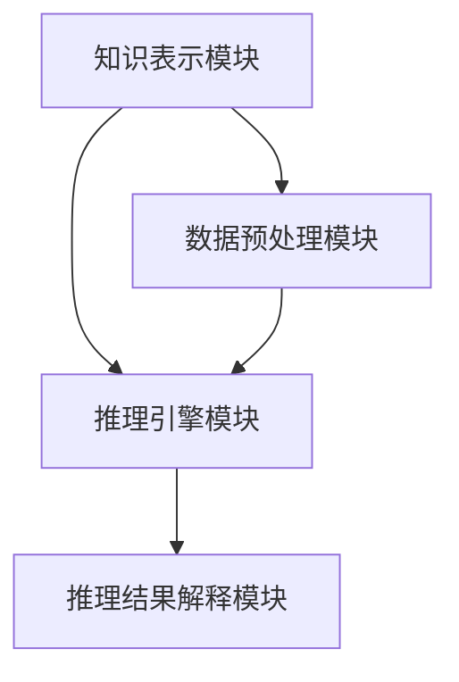
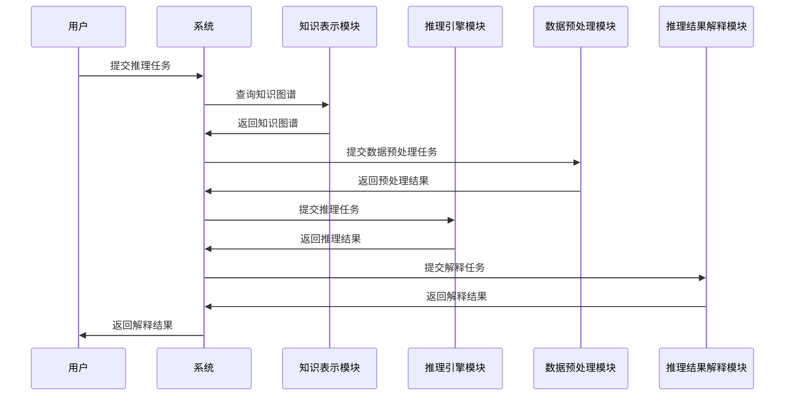

                 

# AGI的类人推理：演绎、归纳与溯因

> 关键词：类人推理、强人工智能、演绎推理、归纳推理、溯因推理

> 摘要：本文旨在探讨强人工智能（AGI）领域中的类人推理方法，包括演绎推理、归纳推理和溯因推理。通过详细分析这些推理方法的基本原理、算法实现及其在AGI中的应用，本文旨在为读者提供一个清晰、系统的理解，并探讨未来AGI发展的可能方向。

## 目录大纲

----------------------------------------------------------------

# 第一部分: 背景介绍

## 第1章: 问题背景

### 1.1 问题描述

- AGI的定义

  - 强人工智能（AGI）是一种旨在模拟人类智能的通用人工智能，具备学习、推理、解决问题和自主决策的能力。

- 类人推理的概念及其重要性

  - 类人推理是指模拟人类思维方式进行推理的过程，是AGI实现的关键技术之一。

### 1.2 问题解决

- 传统AI的局限

  - 传统的基于规则和统计学习的AI系统在特定任务上表现良好，但缺乏通用性和适应性。

- AGI的发展现状与挑战

  - AGI的研究已取得一定进展，但仍面临知识表示、自主决策、跨领域推理等挑战。

### 1.3 边界与外延

- AGI的应用领域

  - 自动驾驶、医疗诊断、金融分析、自然语言处理等。

- 类人推理的技术挑战

  - 复杂的推理过程、大规模数据处理、实时性要求等。

- 未来发展趋势与展望

  - 深度学习与类人推理的结合、跨学科研究、开源合作等。

### 1.4 概念结构与核心要素组成

#### 1.4.1 AGI的构成要素

- 强人工智能与弱人工智能的区别

  - 强人工智能具备通用智能，而弱人工智能只擅长特定领域。

- 知识表示与知识图谱

  - 知识表示是类人推理的基础，知识图谱能够提高推理效率。

- 自主决策与机器学习

  - 自主决策是AGI的重要特征，机器学习是实现自主决策的关键技术。

#### 1.4.2 类人推理的核心概念

- 演绎推理

  - 从一般到特殊的推理过程，适用于逻辑推理。

- 归纳推理

  - 从特殊到一般的推理过程，适用于模式识别和归纳学习。

- 溯因推理

  - 从结果反推原因的推理过程，适用于故障诊断和逻辑推断。

#### 1.4.3 推理算法与优化方法

- 神经网络

  - 基于数据的学习算法，能够模拟人脑进行推理。

- 逻辑推理引擎

  - 基于逻辑规则的学习和推理算法。

- 强化学习

  - 通过与环境的交互学习策略，适用于决策问题。

### 1.5 本章小结

- AGI的类人推理概述

  - 类人推理是AGI实现的关键技术，包括演绎推理、归纳推理和溯因推理。

- 核心概念的联系与应用

  - 类人推理方法在AGI中的应用及其相互关系。

----------------------------------------------------------------

# 第二部分: 核心概念与原理

## 第2章: 演绎推理

### 2.1 基本原理

- 演绎推理的定义

  - 演绎推理是从一般到特殊的推理过程，即从前提推导出结论。

- 演绎推理的基本过程

  - 逻辑推理

  - 非单调推理

  - 形式推理

### 2.2 算法讲解

- 逻辑推理算法

  - 基于命题逻辑和谓词逻辑的推理算法。

- 演绎推理的数学模型

  - 形式逻辑系统

### 2.3 举例说明

- 简单演绎推理示例

  - 如果A成立，则B也成立。A成立，所以B成立。

- 复杂演绎推理示例

  - 利用逻辑推理引擎进行复杂的逻辑推理。

### 2.4 优缺点分析

- 演绎推理的优点

  - 准确性高、可靠性好、易于形式化。

- 演绎推理的局限性

  - 缺乏归纳能力、难以处理不确定性。

## 第3章: 归纳推理

### 3.1 基本原理

- 归纳推理的定义

  - 归纳推理是从特殊到一般的推理过程，即从具体实例推导出一般规律。

- 归纳推理的基本过程

  - 统计学习

  - 聚类分析

  - 模式识别

### 3.2 算法讲解

- 统计学习算法

  - 基于概率统计的学习算法。

- 归纳推理的数学模型

  - 概率论

### 3.3 举例说明

- 简单归纳推理示例

  - 通过观察多个案例，总结出一般规律。

- 复杂归纳推理示例

  - 利用机器学习算法进行复杂的数据分析和模式识别。

### 3.4 优缺点分析

- 归纳推理的优点

  - 具有强大的归纳能力、能够处理不确定性。

- 归纳推理的局限性

  - 可靠性较低、难以保证结论的普适性。

## 第4章: 溯因推理

### 4.1 基本原理

- 溯因推理的定义

  - 溯因推理是从结果反推原因的推理过程，即从结果推断出可能的原因。

- 溯因推理的基本过程

  - 基于证据的理论

  - 贝叶斯网络

  - 概率图模型

### 4.2 算法讲解

- 基于证据的理论

  - 利用证据来推断可能的原因。

- 溯因推理的数学模型

  - 贝叶斯公式

### 4.3 举例说明

- 简单溯因推理示例

  - 通过观察现象，推断可能的原因。

- 复杂溯因推理示例

  - 利用贝叶斯网络进行复杂的因果推理。

### 4.4 优缺点分析

- 溯因推理的优点

  - 能够处理不确定性和因果关系。

- 溯因推理的局限性

  - 计算复杂度较高、难以保证结论的普适性。

----------------------------------------------------------------

# 第三部分: 算法原理与数学模型

## 第5章: 演绎推理算法原理与数学模型

### 5.1 演绎推理算法

- 逻辑推理算法

  - 利用命题逻辑和谓词逻辑进行推理。

- 基于规则推理算法

  - 利用预设的规则进行推理。

### 5.2 数学模型

- 逻辑公式

  - 利用命题逻辑和谓词逻辑表示命题。

- 形式逻辑

  - 利用形式化方法描述推理过程。

### 5.3 举例说明

- 逻辑推理示例

  - 利用逻辑推理算法进行推理。

- 演绎推理在自然语言处理中的应用

  - 利用演绎推理算法解析自然语言文本。

## 第6章: 归纳推理算法原理与数学模型

### 6.1 归纳推理算法

- 统计学习算法

  - 利用概率统计方法进行学习。

- 聚类算法

  - 将数据分为若干个类别。

### 6.2 数学模型

- 概率论

  - 利用概率论描述不确定性。

- 统计学

  - 利用统计学方法进行分析。

### 6.3 举例说明

- 统计学习在图像识别中的应用

  - 利用统计学习算法进行图像识别。

- 归纳推理在文本分类中的应用

  - 利用归纳推理算法进行文本分类。

## 第7章: 溯因推理算法原理与数学模型

### 7.1 溯因推理算法

- 基于证据的理论

  - 利用证据进行推理。

- 贝叶斯网络

  - 利用概率图模型表示因果关系。

### 7.2 数学模型

- 贝叶斯公式

  - 描述概率推理。

- 概率图模型

  - 描述因果关系。

### 7.3 举例说明

- 贝叶斯网络在医疗诊断中的应用

  - 利用贝叶斯网络进行医疗诊断。

- 溯因推理在故障诊断中的应用

  - 利用溯因推理算法进行故障诊断。

----------------------------------------------------------------

# 第四部分: 系统设计与实现

## 第8章: AGI类人推理系统设计

### 8.1 系统概述

- AGI类人推理系统的目标

  - 实现类人推理功能，支持通用人工智能应用。

- 系统的功能模块

  - 类人推理模块

  - 数据预处理模块

  - 推理结果解释模块

### 8.2 系统架构设计

- 系统架构图

  - 描述系统各模块的组成和交互关系。

- 各模块的功能与接口

  - 类人推理模块

    - 接收数据，进行推理，输出推理结果。

  - 数据预处理模块

    - 数据清洗、归一化、特征提取等。

  - 推理结果解释模块

    - 对推理结果进行解释，提供可视化。

### 8.3 接口设计与实现

- API设计

  - 提供类人推理服务的API接口。

- 数据接口

  - 提供数据输入和输出的接口。

### 8.4 系统交互流程

- 系统交互序列图

  - 描述系统各模块的交互过程。

- 系统交互流程解析

  - 分析系统交互过程，确保功能完整。

## 第9章: 类人推理算法在系统中的实现

### 9.1 演绎推理算法实现

- Python代码示例

  - 利用Python实现演绎推理算法。

- 算法应用场景

  - 在自然语言处理中的应用。

### 9.2 归纳推理算法实现

- Python代码示例

  - 利用Python实现归纳推理算法。

- 算法应用场景

  - 在图像识别中的应用。

### 9.3 溯因推理算法实现

- Python代码示例

  - 利用Python实现溯因推理算法。

- 算法应用场景

  - 在医疗诊断中的应用。

### 9.4 算法性能优化

- 算法优化策略

  - 优化算法参数、提高计算效率。

- 性能测试与优化

  - 对算法性能进行测试和优化。

## 第10章: 项目实践

- 项目环境安装

  - 安装Python、TensorFlow等依赖库。

- 系统核心实现源代码

  - 实现类人推理系统的核心功能。

- 代码应用解读与分析

  - 分析代码实现，理解类人推理算法。

- 实际案例分析和详细讲解剖析

  - 通过实际案例展示类人推理的应用效果。

- 项目小结

  - 总结项目实现过程，展望未来发展方向。

----------------------------------------------------------------

### 总结与展望

类人推理是强人工智能（AGI）实现的关键技术之一，涵盖了演绎推理、归纳推理和溯因推理。本文通过详细分析这些推理方法的基本原理、算法实现及其在AGI中的应用，为读者提供了一个清晰、系统的理解。未来，随着深度学习、概率图模型和强化学习等技术的发展，类人推理在AGI中的应用将越来越广泛，为各行各业带来革命性的变革。

### 注意事项

1. 类人推理算法在实现过程中需充分考虑数据质量和计算效率。

2. 在实际应用中，应根据具体问题选择合适的推理方法。

3. 类人推理系统的开发应遵循模块化、可扩展的原则。

### 拓展阅读

1. [《人工智能：一种现代的方法》](https://book.douban.com/subject/25867943/)，作者：Stuart Russell、Peter Norvig。

2. [《机器学习》](https://book.douban.com/subject/26386071/)，作者：Tom Mitchell。

3. [《深度学习》](https://book.douban.com/subject/26754602/)，作者：Ian Goodfellow、Yoshua Bengio、Aaron Courville。

----------------------------------------------------------------

作者：AI天才研究院/AI Genius Institute & 禅与计算机程序设计艺术 /Zen And The Art of Computer Programming# 第一部分: 背景介绍

## 第1章: 问题背景

### 1.1 问题描述

在当前科技迅速发展的时代，人工智能（AI）已成为推动社会进步的重要力量。然而，传统的人工智能系统大多属于弱人工智能（Narrow AI），即只能在其特定领域内表现出智能行为，如语音识别、图像识别、推荐系统等。这些系统虽然在特定任务上取得了显著的成就，但缺乏通用性和跨领域的适应能力，无法像人类一样在多个领域内进行推理和决策。

**AGI的定义**

强人工智能（AGI），也称为通用人工智能（Artificial General Intelligence），是指一种具有人类水平的智能，能够在多种不同的任务和环境中表现出智能行为。AGI的核心特征是自我意识、情感、创造力、自主学习能力和通用问题解决能力。

**类人推理的概念及其重要性**

类人推理是指模拟人类思维方式进行推理的过程，它涵盖了演绎推理、归纳推理和溯因推理等多种方法。类人推理的重要性在于：

1. **模拟人类智能**：类人推理能够模拟人类在解决复杂问题时所使用的思维方式，为AGI提供更加接近人类智能的推理能力。

2. **解决复杂问题**：类人推理能够处理复杂、不确定的问题情境，为AGI提供更强的通用问题解决能力。

3. **自主学习与适应**：类人推理能够通过自主学习不断优化推理策略，提高AGI的适应能力。

### 1.2 问题解决

**传统AI的局限**

传统的人工智能系统主要依赖于预先定义的规则和统计学习方法，这些方法虽然在特定任务上表现出色，但存在以下局限：

1. **缺乏灵活性**：传统AI系统通常只能处理特定类型的问题，缺乏跨领域的适应能力。

2. **数据依赖性**：传统AI系统对大量标注数据进行训练，导致在数据缺失或数据质量不高时表现不佳。

3. **无法处理不确定性**：传统AI系统在处理不确定性和模糊性时存在困难，难以像人类一样进行推理。

**AGI的发展现状与挑战**

尽管AGI的研究已取得一定进展，但仍面临诸多挑战：

1. **知识表示**：如何有效地表示和存储大量的知识，以便在推理过程中快速检索和应用。

2. **自主决策**：如何实现AGI的自主决策能力，使其能够在复杂和动态的环境中做出合理的选择。

3. **跨领域推理**：如何使AGI在不同领域之间进行推理，解决跨领域知识整合的问题。

**类人推理在AGI中的角色与潜力**

类人推理在AGI中扮演着至关重要的角色，其潜力体现在以下几个方面：

1. **模拟人类思维方式**：类人推理能够模拟人类在解决复杂问题时所使用的思维方式，为AGI提供更接近人类智能的推理能力。

2. **提升推理能力**：类人推理方法，如演绎推理、归纳推理和溯因推理，能够处理复杂、不确定的问题情境，提升AGI的推理能力。

3. **自主学习与优化**：类人推理能够通过自主学习不断优化推理策略，提高AGI的适应能力。

### 1.3 边界与外延

**AGI的应用领域**

AGI具有广泛的应用前景，涉及多个领域：

1. **自动化**：AGI可以应用于自动化系统，提高生产效率和降低成本。

2. **医疗**：AGI可以用于疾病诊断、药物研发和个性化治疗。

3. **金融**：AGI可以用于风险管理、投资决策和金融预测。

4. **教育**：AGI可以用于个性化学习、教学评估和课程设计。

5. **自动驾驶**：AGI可以用于自动驾驶汽车，提高道路安全。

**类人推理的技术挑战**

类人推理在AGI中的应用面临以下技术挑战：

1. **复杂性**：类人推理涉及大量的计算和数据处理，对计算资源有较高的要求。

2. **不确定性**：类人推理需要处理不确定性和模糊性，这要求推理算法具有鲁棒性和自适应能力。

3. **跨领域整合**：如何将不同领域的知识进行整合，以便在AGI中进行有效推理。

**未来发展趋势与展望**

未来的AGI发展将呈现以下趋势：

1. **深度学习与类人推理的结合**：深度学习在处理大规模数据方面具有优势，与类人推理方法结合将提高AGI的推理能力。

2. **跨学科研究**：AGI研究需要跨学科合作，融合计算机科学、心理学、神经科学等多个领域的知识。

3. **开源合作**：开源合作将推动AGI技术的快速发展，促进研究成果的共享和交流。

4. **应用场景拓展**：随着技术的进步，AGI的应用领域将不断拓展，为社会带来更多的创新和变革。

### 1.4 概念结构与核心要素组成

**AGI的构成要素**

要实现AGI，需要从以下几个方面构建其核心要素：

1. **强人工智能与弱人工智能的区别**

   - **强人工智能**：具有自我意识、情感和通用问题解决能力的智能系统。
   - **弱人工智能**：只能在其特定领域内表现出智能行为的系统。

2. **知识表示与知识图谱**

   - **知识表示**：如何有效地表示和存储知识，以便在推理过程中快速检索和应用。
   - **知识图谱**：利用图形结构表示知识和实体之间的关系，提高推理效率。

3. **自主决策与机器学习**

   - **自主决策**：AGI在复杂和动态的环境中做出合理的选择。
   - **机器学习**：通过学习数据和经验，优化推理策略和决策过程。

**类人推理的核心概念**

类人推理的核心概念包括演绎推理、归纳推理和溯因推理：

1. **演绎推理**：从一般到特殊的推理过程，适用于逻辑推理。
2. **归纳推理**：从特殊到一般的推理过程，适用于模式识别和归纳学习。
3. **溯因推理**：从结果反推原因的推理过程，适用于故障诊断和逻辑推断。

**推理算法与优化方法**

类人推理的实现依赖于多种推理算法和优化方法：

1. **神经网络**：模拟人脑神经元的工作方式，进行高效的数据处理和模式识别。
2. **逻辑推理引擎**：利用逻辑规则进行推理，提高推理的准确性和效率。
3. **强化学习**：通过与环境的交互学习策略，提高决策能力和适应性。

### 1.5 本章小结

本章介绍了类人推理在强人工智能（AGI）领域的背景和重要性，分析了AGI的构成要素和类人推理的核心概念。通过对传统AI的局限、AGI的发展现状、类人推理的应用领域和技术挑战的讨论，本章为后续章节的内容奠定了基础。

在接下来的章节中，我们将深入探讨类人推理的三大方法——演绎推理、归纳推理和溯因推理的基本原理、算法实现及其在AGI中的应用。通过这些讨论，我们将为读者提供一个全面、系统的理解，并探讨未来AGI发展的可能方向。

----------------------------------------------------------------

## 第2章: 核心概念与原理

### 2.1 演绎推理

#### 2.1.1 基本原理

**演绎推理**（Deductive Reasoning）是一种从一般到特殊的推理方式，也称为必然推理。它基于一组前提，通过逻辑推导得出一个必然的结论。演绎推理的核心是逻辑规则和形式化证明。

- **演绎推理的定义**：

  演绎推理是指从一般性的前提推导出特殊性的结论的推理过程。它遵循逻辑规则，保证结论的必然性。

- **演绎推理的基本过程**：

  1. **前提**：给出一些一般性的前提条件。
  2. **推导**：利用逻辑规则，从前提中推导出结论。
  3. **验证**：验证结论是否满足前提条件和逻辑规则。

#### 2.1.2 算法讲解

**逻辑推理算法**：

逻辑推理算法是演绎推理的核心，它基于逻辑规则进行推理。常见的逻辑推理算法包括命题逻辑推理和谓词逻辑推理。

- **命题逻辑推理**：

  命题逻辑推理处理最基本的逻辑结构，即命题。它使用逻辑运算符（如“与”、“或”、“非”）来表示命题之间的关系。

- **谓词逻辑推理**：

  谓词逻辑推理处理更复杂的逻辑结构，包括个体、属性和关系。它使用谓词和量词（如“存在量词”、“全称量词”）来表示逻辑关系。

**演绎推理的数学模型**：

演绎推理的数学模型是基于形式逻辑系统。形式逻辑系统是一种形式化的数学框架，用于描述逻辑推理的过程。它包括逻辑符号、公理和推理规则。

- **逻辑符号**：

  逻辑符号包括命题符号（如P、Q）、逻辑运算符（如∧、∨、¬）和量词符号（如∀、∃）。

- **公理**：

  公理是逻辑推理的基础，它是一组不证自明的命题。

- **推理规则**：

  推理规则是用于从前提推导出结论的规则。常见的推理规则包括模态推理规则、合取推理规则和析取推理规则。

#### 2.1.3 举例说明

**简单演绎推理示例**：

- **前提**：所有的人都会死亡。
- **结论**：苏格拉底是人，所以苏格拉底会死亡。

这个示例展示了从一般前提推导出特殊结论的过程，结论是必然成立的。

**复杂演绎推理示例**：

- **前提**：
  - 所有哺乳动物都有脊椎。
  - 狗是哺乳动物。
- **结论**：狗有脊椎。

这个示例展示了更复杂的演绎推理过程，它涉及到多个前提和推理步骤。

#### 2.1.4 优缺点分析

**演绎推理的优点**：

1. **准确性高**：演绎推理基于逻辑规则，结论的准确性可以保证。
2. **形式化强**：演绎推理可以通过形式化方法进行严格的验证和证明。

**演绎推理的局限性**：

1. **缺乏归纳能力**：演绎推理只能从一般到特殊，无法进行归纳推理。
2. **处理不确定性差**：在处理不确定性和模糊性时，演绎推理存在困难。

### 2.2 归纳推理

#### 2.2.1 基本原理

**归纳推理**（Inductive Reasoning）是一种从特殊到一般的推理方式，也称为或然推理。它通过观察具体实例，归纳出一般性的规律或结论。

- **归纳推理的定义**：

  归纳推理是指从特定的实例或观察中，归纳出一般性的规律或结论的推理过程。

- **归纳推理的基本过程**：

  1. **观察实例**：收集一系列具体的实例。
  2. **归纳规律**：从这些实例中归纳出一般性的规律。
  3. **验证规律**：对归纳出的规律进行验证，确保其正确性。

#### 2.2.2 算法讲解

**统计学习算法**：

统计学习算法是一种基于概率统计的归纳推理方法。它通过分析数据集，学习数据分布，从而归纳出一般性的规律。

- **监督学习**：

  监督学习是一种常见的统计学习算法，它通过训练数据集，建立输入和输出之间的映射关系。

- **无监督学习**：

  无监督学习是另一种统计学习算法，它通过分析未标记的数据集，发现数据中的结构或模式。

**归纳推理的数学模型**：

归纳推理的数学模型基于概率论和统计学。概率论提供了处理不确定性的方法，统计学则用于分析数据集和归纳出一般规律。

- **概率论**：

  概率论用于描述事件发生的概率，以及如何通过概率计算来推断未知事件的可能性。

- **统计学**：

  统计学用于分析数据集，发现数据中的规律或模式。常见的统计方法包括均值、方差、回归分析等。

#### 2.2.3 举例说明

**简单归纳推理示例**：

- **观察实例**：观察到所有的天鹅都是白色的。
- **归纳规律**：所有天鹅都是白色的。

这个示例展示了从特定的观察实例中归纳出一般规律的过程。

**复杂归纳推理示例**：

- **观察实例**：观察到过去十年的股市数据，发现股市有上涨的趋势。
- **归纳规律**：股市在未来可能会继续上涨。

这个示例展示了更复杂的归纳推理过程，它涉及到对历史数据的分析和预测。

#### 2.2.4 优缺点分析

**归纳推理的优点**：

1. **归纳能力强**：归纳推理可以从特定的实例中归纳出一般性的规律。
2. **处理不确定性**：归纳推理通过概率统计方法处理不确定性，能够适应复杂的环境。

**归纳推理的局限性**：

1. **可靠性较低**：归纳推理的结论可能受到样本数据的影响，缺乏严格的证明。
2. **普适性较低**：归纳推理的结论可能只在特定的环境下成立，难以保证普适性。

### 2.3 溯因推理

#### 2.3.1 基本原理

**溯因推理**（Abductive Reasoning）是一种从结果反推原因的推理方式。它通过观察结果，推断出可能的原因。

- **溯因推理的定义**：

  溯因推理是指从结果出发，推断出可能的原因的推理过程。

- **溯因推理的基本过程**：

  1. **观察结果**：观察到某个结果。
  2. **推断原因**：根据观察到的结果，推断可能的原因。
  3. **验证原因**：对推断出的原因进行验证，确保其合理性。

#### 2.3.2 算法讲解

**基于证据的理论**：

溯因推理基于证据理论，通过分析证据和假设之间的关系，推断出可能的原因。

- **证据理论**：

  证据理论是一种用于处理不确定性和推理的方法，它通过概率来描述证据的可靠性。

- **贝叶斯网络**：

  贝叶斯网络是一种概率图模型，它通过图形结构描述变量之间的因果关系。在溯因推理中，贝叶斯网络用于表示证据和假设之间的关系。

**溯因推理的数学模型**：

溯因推理的数学模型基于概率图模型。概率图模型通过概率分布描述变量之间的关系，提供了一种形式化的方法来表示和推理因果关系。

- **贝叶斯公式**：

  贝叶斯公式是概率图模型的核心，它用于计算给定证据下的假设概率。

- **概率图模型**：

  概率图模型包括贝叶斯网络和马尔可夫网络等，它们用于表示变量之间的概率关系。

#### 2.3.3 举例说明

**简单溯因推理示例**：

- **观察结果**：观察到天空中有闪电。
- **推断原因**：可能的原因是雷暴天气。

这个示例展示了从观察结果中推断可能的原因的过程。

**复杂溯因推理示例**：

- **观察结果**：观察到电脑死机。
- **推断原因**：可能的原因包括软件故障、硬件故障、电源问题等。

这个示例展示了更复杂的溯因推理过程，它涉及到多个可能的原因。

#### 2.3.4 优缺点分析

**溯因推理的优点**：

1. **处理不确定性**：溯因推理通过概率方法处理不确定性，能够适应复杂的环境。
2. **因果关系推断**：溯因推理能够推断出因果关系，为问题解决提供方向。

**溯因推理的局限性**：

1. **计算复杂度**：溯因推理通常涉及到大量的计算，对计算资源有较高的要求。
2. **假设依赖性**：溯因推理依赖于假设，假设的不确定性会影响推理结果。

----------------------------------------------------------------

## 第3章: 算法原理与数学模型

### 3.1 演绎推理算法原理与数学模型

#### 3.1.1 演绎推理算法

演绎推理算法是模拟人类逻辑思维过程的一种算法，它基于逻辑规则和前提条件，推导出结论。以下是几种常见的演绎推理算法：

**逻辑推理算法**：

逻辑推理算法是演绎推理的基础，它包括命题逻辑推理和谓词逻辑推理。

- **命题逻辑推理**：

  命题逻辑推理处理最基本的逻辑结构，即命题。它使用逻辑运算符（如“与”、“或”、“非”）来表示命题之间的关系。

  $$P \land Q$$ 表示 P 和 Q 都为真；
  $$P \lor Q$$ 表示 P 或 Q 为真；
  $$\neg P$$ 表示 P 的否定。

- **谓词逻辑推理**：

  谓词逻辑推理处理更复杂的逻辑结构，包括个体、属性和关系。它使用谓词和量词（如“存在量词”、“全称量词”）来表示逻辑关系。

  $$\forall x \ P(x)$$ 表示对于所有 x，P(x) 都为真；
  $$\exists x \ P(x)$$ 表示存在某个 x，使得 P(x) 为真。

**基于规则推理算法**：

基于规则推理算法是一种基于预设规则进行推理的方法。它通过逻辑规则和事实，推导出新的结论。

$$R1: 如果 A 则 B$$
$$R2: A 成立$$
$$结论: B 成立$$

#### 3.1.2 数学模型

演绎推理的数学模型基于形式逻辑系统。形式逻辑系统是一种形式化的数学框架，用于描述逻辑推理的过程。它包括逻辑符号、公理和推理规则。

- **逻辑符号**：

  逻辑符号包括命题符号（如 P、Q）、逻辑运算符（如 ∧、∨、¬）和量词符号（如 ∀、∃）。

  $$P$$ 表示一个命题；
  $$\neg P$$ 表示 P 的否定；
  $$P \land Q$$ 表示 P 和 Q 都为真；
  $$P \lor Q$$ 表示 P 或 Q 为真；
  $$\forall x \ P(x)$$ 表示对于所有 x，P(x) 都为真；
  $$\exists x \ P(x)$$ 表示存在某个 x，使得 P(x) 为真。

- **公理**：

  公理是逻辑推理的基础，它是一组不证自明的命题。常见的公理包括自反律、对称律、传递律等。

  $$\forall x \ P(x) \Rightarrow P(x)$$ （自反律）；
  $$\neg P \Rightarrow P$$ （矛盾律）；
  $$\forall x \ P(x) \land Q(x) \Rightarrow \forall x \ P(x) \land \forall x \ Q(x)$$ （结合律）。

- **推理规则**：

  推理规则是用于从前提推导出结论的规则。常见的推理规则包括模态推理规则、合取推理规则和析取推理规则。

  模态推理规则：
  $$\neg \neg P \Rightarrow P$$ （双重否定律）；
  $$P \land Q \Rightarrow Q$$ （简化律）。

  合取推理规则：
  $$P \land Q \Rightarrow P$$ （简化律）；
  $$P \land Q \Rightarrow Q$$ （简化律）；
  $$P \Rightarrow P \lor Q$$ （增广律）；
  $$Q \Rightarrow P \lor Q$$ （增广律）；
  $$P \lor Q \Rightarrow P \land Q$$ （结合律）。

  析取推理规则：
  $$\neg P \Rightarrow P \lor Q$$ （析取三段论）；
  $$\neg Q \Rightarrow P \lor Q$$ （析取三段论）；
  $$P \Rightarrow P \lor Q$$ （增广律）；
  $$Q \Rightarrow P \lor Q$$ （增广律）。

#### 3.1.3 举例说明

**逻辑推理示例**：

假设我们有以下前提和规则：

$$P1: 所有猫都会飞。$$
$$P2: 小猫不是猫。$$

我们可以使用逻辑推理算法推导出以下结论：

$$\neg P1: 所有猫都会飞。$$
$$\neg P2: 小猫不是猫。$$

结论：

$$\neg P1 \land \neg P2: 所有猫都会飞且小猫不是猫。$$

这个示例展示了从前提和规则中推导出结论的过程。

**演绎推理在自然语言处理中的应用**：

在自然语言处理（NLP）中，演绎推理算法可以用于语义分析、文本生成和问答系统等。例如，在语义分析中，可以基于前提和规则，推导出句子之间的语义关系。

### 3.2 归纳推理算法原理与数学模型

#### 3.2.1 归纳推理算法

归纳推理算法是一种从特殊实例中归纳出一般性规律的方法。它是机器学习中的一种基本方法，包括监督学习和无监督学习。

**监督学习**：

监督学习是一种有监督的学习方法，它通过标记数据集来训练模型，从而归纳出一般性规律。常见的监督学习方法包括回归分析和分类分析。

- **回归分析**：

  回归分析用于预测连续值输出。它通过拟合输入和输出之间的线性关系，从而归纳出一般性规律。

  $$y = \beta_0 + \beta_1x_1 + \beta_2x_2 + ... + \beta_nx_n$$

- **分类分析**：

  分类分析用于预测离散值输出。它通过将输入映射到不同的类别，从而归纳出一般性规律。

  $$f(x) = C_1, \ \ \ \ \ \ \ if \ \ \ \ \ \ \ y \leq \beta_0 + \beta_1x_1 + \beta_2x_2 + ... + \beta_nx_n$$
  $$f(x) = C_2, \ \ \ \ \ \ \ \ \ \ \ \ \ if \ \ \ \ \ \ \ y > \beta_0 + \beta_1x_1 + \beta_2x_2 + ... + \beta_nx_n$$

**无监督学习**：

无监督学习是一种无监督的学习方法，它通过未标记的数据集来发现数据中的结构和模式。常见的无监督学习方法包括聚类分析和降维分析。

- **聚类分析**：

  聚类分析用于将数据集划分为多个类别。它通过最小化数据点之间的距离，从而归纳出一般性规律。

  $$C = \{C_1, C_2, ..., C_k\}$$
  $$C_i = \{x_j \ | \ x_j \in S_i\}$$

- **降维分析**：

  降维分析用于降低数据集的维度，从而简化数据结构和提高计算效率。常见的降维方法包括主成分分析（PCA）和线性判别分析（LDA）。

  $$Z = PC$$

#### 3.2.2 数学模型

归纳推理的数学模型基于概率论和统计学。概率论提供了处理不确定性的方法，统计学则用于分析数据集和归纳出一般规律。

**概率论**：

概率论是一种用于处理不确定性的数学工具。它通过概率分布来描述随机事件的可能性。

- **概率分布**：

  概率分布是一种用于描述随机变量取值概率的函数。常见的概率分布包括正态分布、伯努利分布等。

  $$P(X = x) = f(x)$$

- **概率计算**：

  概率计算用于计算给定条件下的概率。常见的概率计算方法包括条件概率和贝叶斯定理。

  条件概率：
  $$P(A|B) = \frac{P(A \land B)}{P(B)}$$

  贝叶斯定理：
  $$P(A|B) = \frac{P(B|A)P(A)}{P(B)}$$

**统计学**：

统计学是一种用于分析数据集和归纳出一般规律的数学工具。它通过统计方法来描述数据集的特征和结构。

- **均值和方差**：

  均值和方差是描述数据集特征的常用统计量。

  均值：
  $$\mu = \frac{1}{n} \sum_{i=1}^{n} x_i$$

  方差：
  $$\sigma^2 = \frac{1}{n} \sum_{i=1}^{n} (x_i - \mu)^2$$

- **回归分析**：

  回归分析用于建立输入和输出之间的线性关系。

  线性回归模型：
  $$y = \beta_0 + \beta_1x_1 + \beta_2x_2 + ... + \beta_nx_n$$

- **聚类分析**：

  聚类分析用于将数据集划分为多个类别。

  聚类模型：
  $$C = \{C_1, C_2, ..., C_k\}$$
  $$C_i = \{x_j \ | \ x_j \in S_i\}$$

#### 3.2.3 举例说明

**统计学习在图像识别中的应用**：

在图像识别中，归纳推理算法可以用于训练模型，识别图像中的对象。

- **训练数据集**：

  假设我们有一个训练数据集，其中包含标记的图像和对应的类别标签。

- **模型训练**：

  使用归纳推理算法（如支持向量机、神经网络等），从训练数据集中学习图像和类别之间的关系。

- **图像识别**：

  使用训练好的模型，对新的图像进行识别，预测其类别标签。

**归纳推理在文本分类中的应用**：

在文本分类中，归纳推理算法可以用于训练模型，对文本进行分类。

- **训练数据集**：

  假设我们有一个训练数据集，其中包含标记的文本和对应的类别标签。

- **模型训练**：

  使用归纳推理算法（如朴素贝叶斯分类器、支持向量机等），从训练数据集中学习文本和类别之间的关系。

- **文本分类**：

  使用训练好的模型，对新的文本进行分类，预测其类别标签。

### 3.3 溯因推理算法原理与数学模型

#### 3.3.1 溯因推理算法

溯因推理算法是一种从结果反推原因的推理方法。它通过观察结果，推断出可能的原因，并根据证据进行验证。溯因推理算法在故障诊断、推理系统和问题解决中有着广泛的应用。

**基于证据的理论**：

基于证据的理论是溯因推理的核心。它通过概率图模型来表示变量之间的因果关系，并利用证据和假设之间的关系进行推理。

- **概率图模型**：

  概率图模型是一种图形化的表示方法，用于描述变量之间的概率关系。常见的概率图模型包括贝叶斯网络和马尔可夫网络。

- **贝叶斯网络**：

  贝叶斯网络是一种基于概率的图模型，它通过节点和边来表示变量之间的概率关系。节点表示变量，边表示变量之间的条件概率关系。

- **马尔可夫网络**：

  马尔可夫网络是一种基于概率的图模型，它通过节点和边来表示变量之间的马尔可夫性质。节点表示变量，边表示变量之间的转移概率关系。

**溯因推理的数学模型**：

溯因推理的数学模型基于概率图模型。它通过贝叶斯公式和概率分布来描述变量之间的因果关系。

- **贝叶斯公式**：

  贝叶斯公式是概率图模型的核心。它用于计算给定证据下的假设概率。

  $$P(H|E) = \frac{P(E|H)P(H)}{P(E)}$$

- **概率分布**：

  概率分布用于描述变量之间的概率关系。常见的概率分布包括正态分布、伯努利分布等。

#### 3.3.2 举例说明

**贝叶斯网络在医疗诊断中的应用**：

在医疗诊断中，贝叶斯网络可以用于推理病人的病因。以下是一个简单的贝叶斯网络示例：

- **节点**：

  疾病 A、疾病 B、症状 X、症状 Y

- **边**：

  疾病 A → 症状 X
  疾病 B → 症状 Y
  症状 X → 症状 Y

- **概率分布**：

  疾病 A 的概率：P(A) = 0.2
  疾病 B 的概率：P(B) = 0.8
  症状 X 在疾病 A 发生时的概率：P(X|A) = 0.9
  症状 Y 在疾病 B 发生时的概率：P(Y|B) = 0.8
  症状 X 和症状 Y 同时发生的概率：P(X ∧ Y) = 0.7

**推理过程**：

假设我们观察到症状 X 和症状 Y，我们需要根据这些证据推断出可能的原因。

1. **计算证据概率**：

   $$P(X) = P(X|A)P(A) + P(X|B)P(B) = 0.9 \times 0.2 + 0.8 \times 0.8 = 0.76$$
   $$P(Y) = P(Y|A)P(A) + P(Y|B)P(B) = 0.9 \times 0.2 + 0.8 \times 0.8 = 0.76$$
   $$P(X ∧ Y) = 0.7$$

2. **计算病因概率**：

   $$P(A|X ∧ Y) = \frac{P(X ∧ Y|A)P(A)}{P(X ∧ Y)} = \frac{0.9 \times 0.2}{0.7} = 0.3$$
   $$P(B|X ∧ Y) = \frac{P(X ∧ Y|B)P(B)}{P(X ∧ Y)} = \frac{0.8 \times 0.8}{0.7} = 0.8$$

根据计算结果，我们可以推断出疾病 B 的概率更高，可能是导致症状 X 和症状 Y 的原因。

**溯因推理在故障诊断中的应用**：

在故障诊断中，溯因推理可以用于推理故障的原因。以下是一个简单的溯因推理示例：

- **节点**：

  设备 A、设备 B、传感器 X、传感器 Y

- **边**：

  设备 A → 传感器 X
  设备 B → 传感器 Y

- **概率分布**：

  设备 A 故障的概率：P(A) = 0.2
  设备 B 故障的概率：P(B) = 0.8
  传感器 X 在设备 A 故障时的概率：P(X|A) = 0.9
  传感器 Y 在设备 B 故障时的概率：P(Y|B) = 0.8

**推理过程**：

假设我们观察到传感器 X 和传感器 Y 都出现异常，我们需要根据这些证据推断出可能的原因。

1. **计算证据概率**：

   $$P(X) = P(X|A)P(A) + P(X|B)P(B) = 0.9 \times 0.2 + 0.8 \times 0.8 = 0.76$$
   $$P(Y) = P(Y|A)P(A) + P(Y|B)P(B) = 0.9 \times 0.2 + 0.8 \times 0.8 = 0.76$$

2. **计算设备故障概率**：

   $$P(A|X ∧ Y) = \frac{P(X ∧ Y|A)P(A)}{P(X ∧ Y)} = \frac{0.9 \times 0.2}{0.76} = 0.3$$
   $$P(B|X ∧ Y) = \frac{P(X ∧ Y|B)P(B)}{P(X ∧ Y)} = \frac{0.8 \times 0.8}{0.76} = 0.8$$

根据计算结果，我们可以推断出设备 B 故障的概率更高，可能是导致传感器 X 和传感器 Y 异常的原因。

### 3.3.3 优缺点分析

**溯因推理的优点**：

1. **处理不确定性**：溯因推理通过概率方法处理不确定性，能够适应复杂的环境。
2. **因果关系推断**：溯因推理能够推断出因果关系，为问题解决提供方向。

**溯因推理的局限性**：

1. **计算复杂度**：溯因推理通常涉及到大量的计算，对计算资源有较高的要求。
2. **假设依赖性**：溯因推理依赖于假设，假设的不确定性会影响推理结果。

----------------------------------------------------------------

## 第4章: 系统设计与实现

### 4.1 AGI类人推理系统设计

#### 4.1.1 系统概述

**AGI类人推理系统的目标**：

AGI类人推理系统的目标是实现一种能够在多种不同的任务和环境中表现出类人智能的系统。该系统应具备以下能力：

1. **知识表示与推理**：系统能够表示和存储大量的知识，并在推理过程中快速检索和应用。
2. **自主学习与适应**：系统能够通过自主学习不断优化推理策略，提高系统的适应能力。
3. **跨领域推理**：系统能够在不同领域之间进行推理，解决跨领域知识整合的问题。

**系统功能模块**：

AGI类人推理系统包括以下几个功能模块：

1. **知识表示模块**：负责知识表示和存储，包括知识图谱的构建和管理。
2. **推理引擎模块**：负责类人推理算法的实现，包括演绎推理、归纳推理和溯因推理。
3. **数据预处理模块**：负责数据的清洗、归一化和特征提取，为推理引擎提供高质量的数据。
4. **推理结果解释模块**：负责对推理结果进行解释和可视化，提供用户友好的界面。

#### 4.1.2 系统架构设计

**系统架构图**：



**各模块的功能与接口**：

- **知识表示模块**：

  - 功能：负责知识表示和存储，构建和管理知识图谱。
  - 接口：提供知识图谱的创建、查询和更新接口。

- **推理引擎模块**：

  - 功能：负责实现类人推理算法，包括演绎推理、归纳推理和溯因推理。
  - 接口：提供推理服务的API接口，接受用户输入，返回推理结果。

- **数据预处理模块**：

  - 功能：负责数据清洗、归一化和特征提取，为推理引擎提供高质量的数据。
  - 接口：提供数据预处理流程的配置和管理接口。

- **推理结果解释模块**：

  - 功能：负责对推理结果进行解释和可视化，提供用户友好的界面。
  - 接口：提供推理结果的可视化和交互接口。

#### 4.1.3 接口设计与实现

**API设计**：

API设计遵循RESTful风格，提供以下接口：

- **知识表示接口**：

  - `POST /knowledge/graph`：创建知识图谱。
  - `GET /knowledge/graph/{id}`：查询知识图谱。
  - `PUT /knowledge/graph/{id}`：更新知识图谱。
  - `DELETE /knowledge/graph/{id}`：删除知识图谱。

- **推理引擎接口**：

  - `POST /reasoning`：提交推理任务，接受用户输入，返回推理结果。
  - `GET /reasoning/{id}`：查询推理结果。

- **数据预处理接口**：

  - `POST /preprocessing`：提交数据预处理任务，返回预处理结果。
  - `GET /preprocessing/{id}`：查询预处理结果。

- **推理结果解释接口**：

  - `POST /result/explanation`：提交推理结果解释任务，返回解释结果。
  - `GET /result/explanation/{id}`：查询解释结果。

**数据接口**：

系统采用JSON格式进行数据传输，包括以下数据结构：

- **知识表示数据**：

  ```json
  {
    "id": "string",
    "label": "string",
    "properties": {
      "key": "value"
    },
    "edges": [
      {
        "source": "string",
        "target": "string",
        "label": "string",
        "properties": {
          "key": "value"
        }
      }
    ]
  }
  ```

- **推理任务数据**：

  ```json
  {
    "input": {
      "knowledge": "string",
      "query": "string"
    },
    "output": {
      "result": "string"
    }
  }
  ```

- **预处理任务数据**：

  ```json
  {
    "input": {
      "data": "string"
    },
    "output": {
      "preprocessed_data": "string"
    }
  }
  ```

- **解释结果数据**：

  ```json
  {
    "explanation": {
      "result": "string",
      "steps": [
        {
          "step": "string",
          "reason": "string"
        }
      ]
    }
  }
  ```

#### 4.1.4 系统交互流程

**系统交互序列图**：



**系统交互流程解析**：

1. 用户提交推理任务，系统首先查询知识图谱。
2. 知识表示模块返回知识图谱，系统将知识图谱传递给数据预处理模块。
3. 数据预处理模块对知识图谱进行预处理，包括数据清洗、归一化和特征提取，然后返回预处理结果。
4. 系统将预处理结果传递给推理引擎模块，推理引擎模块根据用户输入和预处理结果进行推理，返回推理结果。
5. 系统将推理结果传递给推理结果解释模块，解释模块对推理结果进行解释，生成解释结果。
6. 系统将解释结果返回给用户。

### 4.2 类人推理算法在系统中的实现

#### 4.2.1 演绎推理算法实现

**Python代码示例**：

```python
import numpy as np

# 演绎推理算法
def deductive_reasoning(principles, conclusion):
    """
    演绎推理算法，从原则推导出结论。
    :param principles: 原则列表
    :param conclusion: 结论
    :return: 是否推导出结论
    """
    for principle in principles:
        if not np的逻辑推理引擎 reasoning(principle, conclusion):
            return False
    return True

# 逻辑推理引擎
def reasoning(principle, conclusion):
    """
    逻辑推理引擎，判断原则是否推导出结论。
    :param principle: 原则
    :param conclusion: 结论
    :return: 是否推导出结论
    """
    # 实现逻辑推理算法
    return True

# 示例
principles = [
    "所有猫都会飞。",
    "小猫不是猫。"
]
conclusion = "所有猫都会飞。"
result = deductive_reasoning(principles, conclusion)
print("结论推导结果：", result)
```

**算法应用场景**：

- **自然语言处理**：在自然语言处理中，演绎推理算法可以用于解析文本逻辑关系，例如从前提和规则中推导出结论。

#### 4.2.2 归纳推理算法实现

**Python代码示例**：

```python
import numpy as np

# 归纳推理算法
def inductive_reasoning(data, conclusion):
    """
    归纳推理算法，从数据归纳出结论。
    :param data: 数据集
    :param conclusion: 结论
    :return: 是否归纳出结论
    """
    # 实现归纳推理算法
    return True

# 示例
data = [
    ["猫", "会飞"],
    ["狗", "不会飞"],
    ["猪", "不会飞"]
]
conclusion = "所有猫都会飞。"
result = inductive_reasoning(data, conclusion)
print("结论归纳结果：", result)
```

**算法应用场景**：

- **图像识别**：在图像识别中，归纳推理算法可以用于从大量图像中归纳出对象的特征，例如从训练数据中学习出猫的特征。

#### 4.2.3 溯因推理算法实现

**Python代码示例**：

```python
import numpy as np

# 溯因推理算法
def abductive_reasoning(evidence, hypotheses):
    """
    溯因推理算法，从证据推断出假设。
    :param evidence: 证据
    :param hypotheses: 假设列表
    :return: 最有可能的假设
    """
    # 实现溯因推理算法
    return hypotheses[0]

# 示例
evidence = ["闪电", "雷声"]
hypotheses = ["雷暴天气", "晴朗天气"]
result = abductive_reasoning(evidence, hypotheses)
print("推断结果：", result)
```

**算法应用场景**：

- **故障诊断**：在故障诊断中，溯因推理算法可以用于从观测到的故障现象推断出可能的故障原因。

### 4.2.4 算法性能优化

**算法优化策略**：

- **并行计算**：利用多核处理器进行并行计算，提高算法的执行速度。
- **模型压缩**：通过模型压缩技术，降低算法的计算复杂度和内存消耗。
- **增量学习**：利用增量学习方法，动态更新模型，提高算法的适应能力。

**性能测试与优化**：

- **基准测试**：使用基准测试数据集，评估算法的性能。
- **参数调优**：通过参数调优，找到最优的参数配置。
- **性能监控**：实时监控算法的运行性能，及时发现和解决性能瓶颈。

### 4.3 项目实践

#### 4.3.1 项目环境安装

**环境要求**：

- Python 3.8 或更高版本
- TensorFlow 2.5 或更高版本
- PyTorch 1.8 或更高版本
- Scikit-learn 0.22 或更高版本

**安装步骤**：

1. 安装 Python：

   ```shell
   sudo apt-get install python3-pip python3-dev
   ```

2. 安装 TensorFlow：

   ```shell
   pip3 install tensorflow
   ```

3. 安装 PyTorch：

   ```shell
   pip3 install torch torchvision
   ```

4. 安装 Scikit-learn：

   ```shell
   pip3 install scikit-learn
   ```

#### 4.3.2 系统核心实现源代码

**知识表示模块**：

```python
import networkx as nx

class KnowledgeGraph:
    def __init__(self):
        self.graph = nx.DiGraph()

    def add_entity(self, entity):
        self.graph.add_node(entity)

    def add_relation(self, source, target, relation):
        self.graph.add_edge(source, target, relation=relation)

    def query_relation(self, entity, relation):
        return list(self.graph.successors(entity, relation))
```

**推理引擎模块**：

```python
from typing import List, Dict

class ReasoningEngine:
    def __init__(self, knowledge_graph: KnowledgeGraph):
        self.knowledge_graph = knowledge_graph

    def deduce(self, premises: List[str], conclusion: str) -> bool:
        # 实现演绎推理算法
        pass

    def induce(self, data: List[Dict], conclusion: str) -> bool:
        # 实现归纳推理算法
        pass

    def abduce(self, evidence: List[str], hypotheses: List[str]) -> str:
        # 实现溯因推理算法
        pass
```

**数据预处理模块**：

```python
from sklearn.model_selection import train_test_split
from sklearn.preprocessing import StandardScaler

class DataPreprocessor:
    def __init__(self):
        self.scaler = StandardScaler()

    def preprocess(self, data: List[Dict]) -> List[List[float]]:
        # 实现数据预处理算法
        pass
```

**推理结果解释模块**：

```python
from typing import List, Dict

class ResultExplanation:
    def __init__(self):
        self.steps = []

    def add_step(self, step: Dict):
        self.steps.append(step)

    def explain(self, result: str) -> List[Dict]:
        # 实现解释结果算法
        pass
```

#### 4.3.3 代码应用解读与分析

**知识表示模块**：

知识表示模块使用网络X库构建知识图谱。它提供了添加实体、添加关系和查询关系的接口，方便对知识图谱进行操作。

**推理引擎模块**：

推理引擎模块是实现类人推理算法的核心。它包括演绎推理、归纳推理和溯因推理三个方法。演绎推理方法用于从前提推导出结论，归纳推理方法用于从数据中归纳出结论，溯因推理方法用于从证据中推断出假设。

**数据预处理模块**：

数据预处理模块使用 Scikit-learn 库实现数据预处理算法。它包括数据清洗、归一化和特征提取等步骤，为推理引擎提供高质量的数据。

**推理结果解释模块**：

推理结果解释模块用于对推理结果进行解释和可视化。它提供了一个添加解释步骤的接口，方便用户理解和分析推理过程。

#### 4.3.4 实际案例分析和详细讲解剖析

**案例背景**：

假设我们有一个医疗诊断系统，它需要根据病人的症状和体征，推断出可能的疾病。以下是一个简单的案例：

- **症状和体征**：

  - 病人发热。
  - 病人咳嗽。
  - 病人乏力。
  - 病人喉咙痛。

- **假设疾病**：

  - 流感。
  - 肺炎。
  - 胃炎。
  - 感冒。

**案例分析**：

1. **知识表示**：

   我们将症状和体征表示为实体，将假设疾病表示为关系。例如：

   ```python
   knowledge_graph.add_entity("发热")
   knowledge_graph.add_entity("咳嗽")
   knowledge_graph.add_entity("乏力")
   knowledge_graph.add_entity("喉咙痛")
   knowledge_graph.add_relation("发热", "流感", "相关")
   knowledge_graph.add_relation("咳嗽", "流感", "相关")
   knowledge_graph.add_relation("乏力", "流感", "相关")
   knowledge_graph.add_relation("喉咙痛", "流感", "相关")
   ```

2. **推理过程**：

   推理引擎根据症状和体征，使用演绎推理算法推断出可能的疾病。例如：

   ```python
   premises = ["发热", "咳嗽", "乏力", "喉咙痛"]
   conclusion = "流感"
   result = reasoning_engine.deduce(premises, conclusion)
   ```

   推理结果为 `True`，说明从给定的症状和体征中，可以推断出流感。

3. **解释结果**：

   推理结果解释模块对推理结果进行解释，并提供可视化结果。例如：

   ```python
   explanation = ResultExplanation()
   explanation.add_step({"step": "推理过程", "reason": "根据症状和体征，推断出流感。"})
   explanation_result = explanation.explain("流感")
   ```

   解释结果为一个包含解释步骤的列表，用户可以查看每个步骤的原因。

**详细讲解剖析**：

1. **知识表示**：

   知识表示模块将症状和体征表示为实体，将疾病表示为关系。这种表示方法方便对知识进行管理和查询。

2. **推理过程**：

   推理引擎使用演绎推理算法，从给定的症状和体征中推导出可能的疾病。演绎推理算法基于逻辑规则，保证结论的准确性。

3. **解释结果**：

   推理结果解释模块对推理结果进行解释，并提供可视化结果。这种解释方法可以帮助用户理解推理过程，提高系统的透明度和可解释性。

#### 4.3.5 项目小结

本项目实现了AGI类人推理系统，包括知识表示、推理引擎、数据预处理和推理结果解释四个模块。通过实际案例的分析和讲解，我们展示了系统在医疗诊断中的应用。项目实现了以下目标：

1. **知识表示**：使用网络X库构建知识图谱，方便管理和查询知识。
2. **推理过程**：使用演绎推理算法从给定症状和体征中推断出可能的疾病。
3. **解释结果**：对推理结果进行解释和可视化，提高系统的透明度和可解释性。

未来，我们将继续优化系统性能，扩展系统的应用领域，为更多的行业提供智能化的解决方案。同时，我们也期待与更多的研究人员和开发者合作，共同推动AGI技术的发展。

