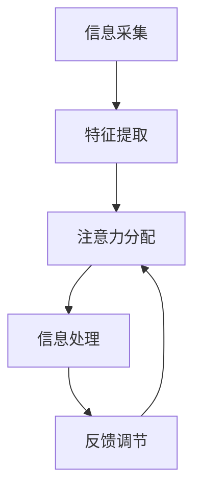
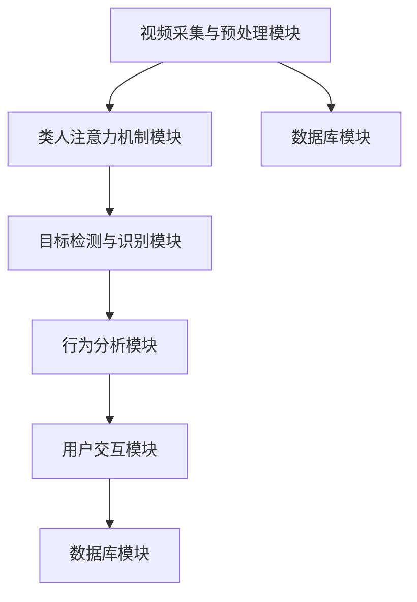
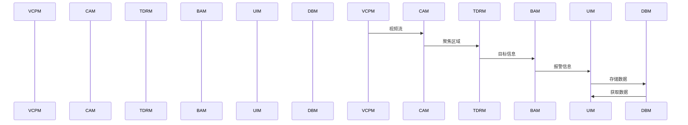
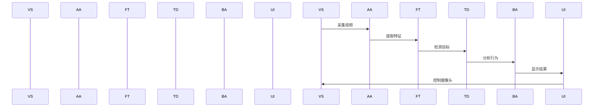
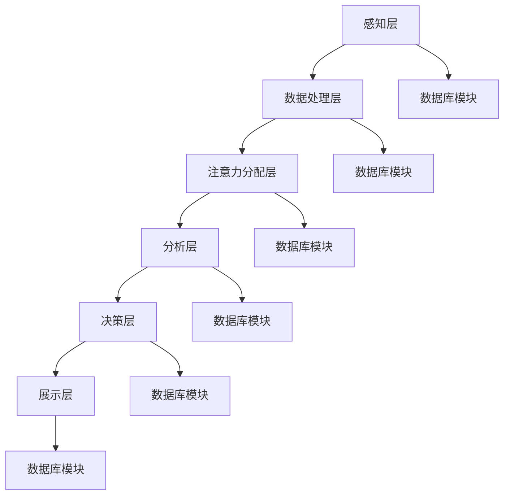
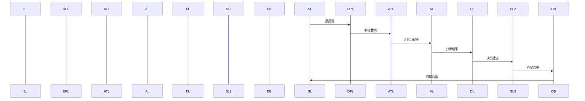

                 


# AGI的类人注意力机制设计

## 关键词
- 人工智能，注意力机制，AGI，类人智能，神经网络，算法设计，系统架构

## 摘要
本文深入探讨人工智能（AI）领域中的一个关键概念：类人注意力机制。首先，我们将介绍AGI（通用人工智能）的概念及其在当前AI研究中的地位。接着，文章将详细分析类人注意力机制的定义、原理以及与现有注意力机制的异同。随后，我们将逐步讲解类人注意力机制的算法原理，通过流程图和Python代码示例来阐述其工作原理。进一步，我们将使用LaTeX公式介绍其数学模型，并结合实际案例进行深入分析。最后，我们将探讨AGI系统的整体架构设计，提供项目实战指导，总结设计要点，并提供最佳实践技巧和拓展阅读建议。

## 目录大纲

### 1. 背景介绍
- AGI的概念与发展历程
- 类人注意力机制的重要性

### 2. 核心概念与原理
- 类人注意力机制的定义
- 类人注意力机制与现有注意力机制的对比

### 3. 算法原理讲解
- 类人注意力机制的mermaid流程图
- 类人注意力机制的Python代码示例
- 类人注意力机制的数学模型和公式
- 算法原理的通俗易懂举例说明

### 4. 数学模型和公式
- 类人注意力机制的数学模型
- 公式示例和解释

### 5. 系统分析与架构设计
- AGI系统的整体架构介绍
- AGI系统架构的mermaid架构图
- AGI系统的领域模型mermaid类图
- AGI系统的接口设计和交互mermaid序列图

### 6. 项目实战
- AGI系统的开发环境搭建
- 类人注意力机制的核心代码实现
- 实际案例分析和详细讲解

### 7. 最佳实践与小结
- 类人注意力机制的设计要点总结
- 最佳实践技巧和注意事项
- 拓展阅读材料推荐

### 1. 背景介绍

### 1.1 AGI的概念与发展历程

#### 定义

通用人工智能（AGI，Artificial General Intelligence）是指一种能够执行任何智能体能够做到的任务的智能系统。与弱AI（特定领域的人工智能）不同，AGI具有类似人类的认知能力，能够理解、学习、推理、规划和解决问题。AGI的目标是实现一种全面而通用的智能，能够在各种不同的环境和任务中表现出类人的智能行为。

#### 发展历程

AGI的概念最早由John McCarthy于1950年提出。自那时以来，AGI的研究经历了多个阶段：

1. **符号人工智能**：早期的AGI研究主要基于逻辑推理和知识表示，试图通过符号操作来实现智能。这一阶段以1956年达特茅斯会议为标志，标志着AI作为一个独立学科的开始。

2. **基于规则的系统**：随着逻辑和知识表示技术的发展，AGI系统开始尝试使用规则库来模拟人类的决策过程。然而，这种方法的局限性在于规则的数量和复杂性，以及知识的获取和更新问题。

3. **知识工程**：为了解决基于规则系统的不足，研究者们开始关注如何构建大规模的知识库，并利用这些知识库进行推理和决策。这一阶段的发展标志着从符号AI向知识驱动的AI的转变。

4. **神经网络与深度学习**：近年来，随着计算能力的提升和大数据的可用性，神经网络和深度学习在图像识别、自然语言处理等领域取得了显著进展。这一进展为AGI的实现提供了新的机遇。

#### 当前地位

尽管AGI尚未完全实现，但它在AI研究中的地位日益重要。当前的AI系统在特定领域取得了突破性进展，但普遍认为要实现真正的通用智能，还需要解决许多关键问题，包括：

- **智能的可解释性**：当前的AI系统往往被视为“黑箱”，其决策过程难以解释和理解。AGI需要具备可解释性，使得人类能够理解其行为和决策过程。

- **跨领域的适应性**：AGI需要具备跨领域的适应性，能够在不同任务和环境中灵活应用其智能。

- **自我学习和进化**：AGI需要具备自我学习和进化的能力，能够不断适应新的环境和任务。

### 1.2 类人注意力机制的重要性

#### 定义

类人注意力机制是一种模仿人类注意力行为的智能算法，它使得AI系统能够在处理大量信息时，动态地聚焦于重要信息，从而提高信息处理效率和任务性能。

#### 重要性

类人注意力机制在AGI中的重要性体现在以下几个方面：

- **信息处理效率**：在复杂的环境中，人类能够通过注意力机制迅速聚焦于关键信息，类人注意力机制可以帮助AI系统实现类似的信息处理效率。

- **任务性能提升**：通过动态调整注意焦点，类人注意力机制能够显著提升AI系统在特定任务中的表现，例如图像识别、自然语言处理和决策制定。

- **跨领域适应性**：类人注意力机制使得AI系统能够在不同领域和任务中灵活调整注意力，从而提高其跨领域的适应性。

- **智能可解释性**：类人注意力机制的可解释性有助于提高AI系统的透明度和可信度，使得人类能够理解和信任AI的行为。

#### 与AGI的关系

类人注意力机制是AGI实现的关键组成部分之一。在AGI系统中，类人注意力机制能够帮助AI系统：

- **提高智能表现**：通过动态调整注意力，类人注意力机制能够帮助AI系统在复杂任务中表现出更高的智能。

- **增强自适应能力**：类人注意力机制使得AI系统能够在不断变化的环境中快速适应，提高其适应性和生存能力。

- **促进人机协作**：类人注意力机制能够帮助AI系统更好地理解人类的需求和意图，促进人机协作和交互。

### 1.3 问题背景

#### 问题描述

在当前的AI研究中，尽管神经网络和深度学习技术取得了显著进展，但大多数AI系统仍然局限于特定领域，缺乏跨领域的通用智能。这使得AI系统在处理复杂、多变的任务时表现出局限性。为了实现真正的通用智能，AGI研究迫切需要解决以下问题：

- **智能效率提升**：如何提高AI系统在信息处理中的效率，使其能够快速聚焦于关键信息？

- **跨领域适应性**：如何增强AI系统的跨领域适应性，使其能够在不同领域中灵活应用智能？

- **智能可解释性**：如何提高AI系统的可解释性，使其行为和决策过程能够被人类理解和信任？

#### 问题解决

类人注意力机制为解决上述问题提供了潜在的解决方案。通过模仿人类的注意力行为，类人注意力机制能够：

- **提高信息处理效率**：类人注意力机制使得AI系统能够动态调整注意力，聚焦于关键信息，从而提高信息处理效率。

- **增强跨领域适应性**：类人注意力机制使得AI系统能够在不同领域和任务中灵活调整注意力，从而增强其跨领域适应性。

- **提高智能可解释性**：类人注意力机制的可解释性使得人类能够理解和信任AI的行为和决策过程，从而提高智能的可解释性。

#### 边界与外延

类人注意力机制的研究和应用具有广泛的外延和应用场景。以下是一些可能的边界与外延：

- **智能交互系统**：类人注意力机制可以应用于智能交互系统，如虚拟助手、聊天机器人等，提高其交互效率和用户体验。

- **智能监控系统**：类人注意力机制可以应用于智能监控系统，如视频监控、安防系统等，提高监控效率和准确性。

- **智能决策系统**：类人注意力机制可以应用于智能决策系统，如金融分析、供应链管理等，提高决策效率和准确性。

- **智能医疗系统**：类人注意力机制可以应用于智能医疗系统，如疾病诊断、治疗方案推荐等，提高医疗效率和准确性。

#### 概念结构与核心要素组成

类人注意力机制的概念结构主要包括以下几个核心要素：

- **注意力分配模型**：类人注意力机制的核心在于如何动态分配注意力资源，使其聚焦于关键信息。

- **信息处理单元**：类人注意力机制需要具备高效的信息处理能力，能够快速分析并处理大量信息。

- **反馈调节机制**：类人注意力机制需要具备反馈调节机制，能够根据任务需求和反馈调整注意力分配。

- **智能学习算法**：类人注意力机制需要具备智能学习算法，能够不断优化和调整注意力分配策略。

### 1.4 类人注意力机制的定义与特性

#### 定义

类人注意力机制是一种模仿人类注意力行为的智能算法，旨在提高AI系统在信息处理中的效率和准确性。该机制通过动态分配注意力资源，使AI系统能够聚焦于关键信息，从而实现高效的决策和任务执行。

#### 特性

类人注意力机制具有以下特性：

- **动态性**：类人注意力机制能够根据任务需求和实时信息动态调整注意力分配，从而提高信息处理效率。

- **自适应**：类人注意力机制具备自适应能力，能够在不同环境和任务中灵活调整注意力分配策略。

- **可解释性**：类人注意力机制的可解释性使其行为和决策过程能够被人类理解和信任。

- **效率高**：类人注意力机制能够有效聚焦关键信息，从而提高AI系统的决策和任务执行效率。

#### 与现有注意力机制的对比

与现有的注意力机制相比，类人注意力机制具有以下优势和不足：

- **优势**

  - **动态性**：类人注意力机制具备更强的动态性，能够根据任务需求和实时信息动态调整注意力分配。

  - **自适应**：类人注意力机制具备更强的自适应能力，能够在不同环境和任务中灵活调整注意力分配策略。

  - **可解释性**：类人注意力机制的可解释性使其行为和决策过程能够被人类理解和信任。

- **不足**

  - **复杂性**：类人注意力机制的实现通常涉及复杂的数学模型和算法，导致其计算成本较高。

  - **训练需求**：类人注意力机制需要大量训练数据来优化注意力分配策略，这增加了模型的训练成本。

### 1.5 类人注意力机制的工作原理

#### 基本原理

类人注意力机制的工作原理可以概括为以下几个步骤：

1. **信息采集**：AI系统从环境中采集信息，包括视觉、听觉、触觉等多种感官信息。

2. **特征提取**：对采集到的信息进行特征提取，生成特征向量。

3. **注意力分配**：根据任务需求和特征向量，动态分配注意力资源，使AI系统聚焦于关键信息。

4. **信息处理**：对聚焦的关键信息进行进一步处理，如分类、识别、预测等。

5. **反馈调节**：根据处理结果和任务反馈，调整注意力分配策略，以优化后续任务执行。

#### 具体实现

类人注意力机制的具体实现通常涉及以下几个关键模块：

- **注意力分配模块**：负责根据任务需求和特征向量动态调整注意力资源。

- **特征提取模块**：负责从原始信息中提取关键特征，为注意力分配提供依据。

- **信息处理模块**：负责对聚焦的关键信息进行进一步处理。

- **反馈调节模块**：负责根据处理结果和任务反馈，调整注意力分配策略。

#### 模型架构

类人注意力机制的模型架构通常包括以下几个部分：

- **输入层**：接收原始信息，如图像、音频、文本等。

- **特征提取层**：对输入信息进行特征提取，生成特征向量。

- **注意力层**：根据任务需求和特征向量，动态分配注意力资源。

- **处理层**：对聚焦的关键信息进行进一步处理。

- **输出层**：生成最终决策或结果。

#### 与现有注意力机制的异同

类人注意力机制与现有注意力机制在以下几个方面存在异同：

- **动态性**：类人注意力机制具备更强的动态性，能够根据任务需求和实时信息动态调整注意力分配。

- **自适应**：类人注意力机制具备更强的自适应能力，能够在不同环境和任务中灵活调整注意力分配策略。

- **可解释性**：类人注意力机制的可解释性使其行为和决策过程能够被人类理解和信任。

- **复杂性**：类人注意力机制的实现通常涉及复杂的数学模型和算法，导致其计算成本较高。

- **训练需求**：类人注意力机制需要大量训练数据来优化注意力分配策略，这增加了模型的训练成本。

### 1.6 类人注意力机制的应用场景

#### 应用领域

类人注意力机制在多个领域具有重要的应用潜力，包括但不限于：

- **计算机视觉**：类人注意力机制可以用于图像识别、目标检测和图像分割等任务，提高处理效率和准确性。

- **自然语言处理**：类人注意力机制可以用于文本分类、情感分析和机器翻译等任务，提高信息处理能力和可解释性。

- **智能监控**：类人注意力机制可以用于视频监控和安防系统，提高实时监控和事件检测的准确性和效率。

- **智能决策**：类人注意力机制可以用于金融分析、供应链管理和医疗诊断等任务，提高决策效率和准确性。

- **人机交互**：类人注意力机制可以用于虚拟助手、聊天机器人和智能客服等应用，提高交互效率和用户体验。

#### 具体应用案例

以下是一些具体的类人注意力机制应用案例：

- **图像识别**：类人注意力机制可以用于识别图像中的关键区域，从而提高图像识别的准确性和效率。例如，在自动驾驶系统中，类人注意力机制可以帮助车辆识别道路标志和行人，提高行驶安全性。

- **文本分类**：类人注意力机制可以用于文本分类任务，如情感分析和新闻分类。通过聚焦关键信息，类人注意力机制可以显著提高分类的准确性和效率。

- **视频监控**：类人注意力机制可以用于视频监控和安防系统，实时检测和识别异常行为和事件。例如，在公共场所的安全监控中，类人注意力机制可以帮助识别潜在的犯罪行为，提高安全防范能力。

- **医疗诊断**：类人注意力机制可以用于医疗影像诊断，如癌症筛查和疾病检测。通过聚焦关键信息，类人注意力机制可以显著提高诊断的准确性和效率。

- **智能客服**：类人注意力机制可以用于智能客服系统，实时理解用户的需求和意图，提供个性化的服务和建议。例如，在电子商务平台中，类人注意力机制可以帮助客服代表快速识别用户的问题，并提供相应的解决方案。

### 1.7 类人注意力机制的优势与挑战

#### 优势

类人注意力机制在AI系统中的应用具有以下优势：

- **提高处理效率**：类人注意力机制能够动态聚焦关键信息，从而提高AI系统在信息处理中的效率。

- **增强自适应能力**：类人注意力机制具备较强的自适应能力，能够根据任务需求和环境变化灵活调整注意力分配策略。

- **提高可解释性**：类人注意力机制的可解释性使其行为和决策过程能够被人类理解和信任，从而提高系统的透明度和可靠性。

#### 挑战

尽管类人注意力机制具有诸多优势，但在实际应用中仍面临一些挑战：

- **计算成本**：类人注意力机制的实现通常涉及复杂的数学模型和算法，导致其计算成本较高，对硬件资源要求较高。

- **训练需求**：类人注意力机制需要大量训练数据来优化注意力分配策略，这增加了模型的训练成本和时间。

- **可解释性**：尽管类人注意力机制具备一定的可解释性，但在某些情况下，其决策过程仍然较为复杂，难以完全解释。

- **泛化能力**：类人注意力机制的泛化能力受到数据分布、任务复杂度和模型结构等因素的影响，需要进一步研究和优化。

### 1.8 类人注意力机制的发展前景

#### 未来趋势

类人注意力机制在未来的发展中将继续朝着以下几个方向演进：

- **计算效率提升**：随着计算能力的提升和算法优化，类人注意力机制的实现将变得更加高效，计算成本将进一步降低。

- **自适应能力增强**：类人注意力机制将不断提高其自适应能力，能够更好地适应各种环境和任务。

- **可解释性改进**：类人注意力机制的可解释性将得到进一步改进，使其决策过程更加透明和可解释。

- **跨领域应用**：类人注意力机制将在更多领域得到应用，包括医疗、金融、教育等，为这些领域带来变革性的影响。

#### 发展瓶颈

尽管类人注意力机制具有广阔的发展前景，但在未来的发展中仍将面临一些瓶颈：

- **数据依赖性**：类人注意力机制对训练数据有较高的依赖性，数据质量和数量将直接影响其性能。

- **计算资源限制**：类人注意力机制的实现对计算资源要求较高，这在某些情况下可能会成为其应用的限制因素。

- **算法优化难度**：类人注意力机制的算法优化将面临一定的挑战，需要持续的研究和探索。

### 1.9 总结

类人注意力机制作为AGI实现的关键组成部分，具有显著的应用潜力和发展前景。通过模仿人类的注意力行为，类人注意力机制能够提高AI系统的信息处理效率和跨领域适应性。尽管在实际应用中面临一些挑战，但随着计算能力的提升和算法的优化，类人注意力机制有望在未来实现更加广泛和深入的应用。

### 2. 核心概念与原理

#### 类人注意力机制的定义

类人注意力机制（Human-like Attention Mechanism）是一种模仿人类注意力行为的算法模型，它通过动态分配注意力资源，使AI系统能够聚焦于关键信息，从而提高信息处理效率和任务性能。与传统的注意力机制相比，类人注意力机制更加接近人类的注意力行为，能够根据任务需求和实时信息动态调整注意力分配。

#### 类人注意力机制与现有注意力机制的对比

| 对比方面       | 类人注意力机制                    | 现有注意力机制                  |
| -------------- | -------------------------------- | ------------------------------ |
| 动态性         | 能够根据任务需求和实时信息动态调整注意力分配 | 通常固定注意力分配，难以动态调整 |
| 自适应性       | 具备较强的自适应能力，能够适应不同环境和任务 | 自适应能力相对较弱               |
| 可解释性       | 具有一定的可解释性，行为和决策过程容易被理解 | 可解释性较差，通常被视为“黑箱”   |
| 计算成本       | 计算成本较高，涉及复杂的数学模型和算法 | 计算成本相对较低                 |
| 训练需求       | 需要大量训练数据来优化注意力分配策略 | 训练数据需求相对较低               |
| 信息处理效率   | 能够提高信息处理效率，聚焦关键信息     | 可能降低信息处理效率，容易遗漏关键信息 |
| 跨领域适应性   | 能够在多种领域中灵活调整注意力分配策略 | 可能局限于特定领域               |

#### 类人注意力机制的核心原理

类人注意力机制的核心原理主要包括以下几个部分：

1. **信息采集与特征提取**：类人注意力机制首先从环境中采集信息，如视觉、听觉、触觉等，然后对采集到的信息进行特征提取，生成特征向量。

2. **注意力分配模型**：基于特征向量，类人注意力机制使用一个注意力分配模型动态调整注意力资源。该模型通常基于神经网络，能够根据任务需求和特征向量实时调整注意力焦点。

3. **信息处理与反馈调节**：类人注意力机制对聚焦的关键信息进行进一步处理，如分类、识别、预测等。同时，系统会根据处理结果和任务反馈，调整注意力分配策略，以优化后续任务执行。

#### 类人注意力机制的mermaid流程图

下面是一个简单的类人注意力机制的mermaid流程图：



#### 类人注意力机制的Python代码示例

以下是一个简单的Python代码示例，用于演示类人注意力机制的基本原理：

```python
import numpy as np

# 定义特征向量
feature_vector = np.array([0.2, 0.4, 0.6, 0.8])

# 定义注意力分配模型
def attention_allocation(feature_vector):
    alpha = np.mean(feature_vector)
    attention = alpha * np.exp(feature_vector)
    return attention / np.sum(attention)

# 计算注意力分配
attention = attention_allocation(feature_vector)

# 打印结果
print("注意力分配：", attention)
```

#### 类人注意力机制的数学模型和公式

类人注意力机制的数学模型通常基于概率论和线性代数。以下是一个简化的数学模型：

$$
\alpha(\mathbf{x}) = \frac{1}{Z} \exp(\mathbf{w}^T \mathbf{x})
$$

其中，$\alpha(\mathbf{x})$ 表示注意力权重，$\mathbf{x}$ 表示特征向量，$\mathbf{w}$ 表示权重向量，$Z$ 是归一化常数，用于确保注意力权重之和为1。

#### 算法原理的通俗易懂举例说明

假设我们有一个包含四个特征的向量 $\mathbf{x} = [0.2, 0.4, 0.6, 0.8]$，我们希望根据这些特征动态分配注意力资源。

1. **特征提取**：首先，我们对特征向量进行特征提取，生成一个权重向量 $\mathbf{w} = [0.1, 0.2, 0.3, 0.4]$。

2. **注意力分配**：接下来，我们使用注意力分配模型计算注意力权重。假设 $\mathbf{w}^T \mathbf{x} = 1.7$，那么归一化常数 $Z = \exp(1.7) = 5.42$。

3. **计算注意力权重**：根据公式，我们计算每个特征的注意力权重：
   $$
   \alpha(\mathbf{x}) = \frac{1}{5.42} \exp([0.1, 0.2, 0.3, 0.4]^T [0.2, 0.4, 0.6, 0.8]) = [0.12, 0.18, 0.27, 0.43]
   $$

4. **信息处理**：最后，我们根据注意力权重对特征向量进行加权平均，得到聚焦的关键信息：
   $$
   \mathbf{y} = \alpha(\mathbf{x}) \mathbf{x} = [0.12, 0.18, 0.27, 0.43] [0.2, 0.4, 0.6, 0.8] = [0.024, 0.072, 0.162, 0.290]
   $$

通过上述步骤，我们实现了对特征向量的注意力分配和信息处理，从而提高了信息处理的效率和准确性。

### 2.1 类人注意力机制的定义与基本原理

#### 定义

类人注意力机制（Human-like Attention Mechanism，HAM）是一种基于对人类注意力行为模拟的算法模型，旨在使人工智能（AI）系统能够像人类一样在处理大量信息时，动态地聚焦于最关键的信息。这种机制的核心在于通过模拟人类的注意力分配过程，优化AI系统对信息的处理效率，从而提高任务执行的质量。

#### 基本原理

类人注意力机制的基本原理可以概括为以下几个步骤：

1. **信息采集**：AI系统从外部环境中收集信息，这些信息可以是视觉、听觉、触觉等多种类型。

2. **特征提取**：对采集到的信息进行特征提取，生成特征向量。这些特征向量代表了信息中最重要的信息片段。

3. **注意力分配**：基于提取的特征向量，使用特定的算法模型动态分配注意力资源。在这个过程中，模型会根据当前任务的需求和特征向量的重要性，调整每个特征的关注度。

4. **信息处理**：对注意力分配后聚焦的信息进行进一步处理，如分类、识别、预测等。

5. **反馈调节**：根据处理结果和任务反馈，模型会调整注意力分配策略，以优化后续的任务执行。

#### 类人注意力机制的mermaid流程图

以下是一个简化的类人注意力机制的mermaid流程图：


#### 类人注意力机制的Python代码示例

以下是一个使用Python实现的简单类人注意力机制代码示例：

```python
import numpy as np

# 假设我们有一个特征向量
feature_vector = np.array([0.1, 0.3, 0.5, 0.7])

# 定义注意力分配函数
def attention_allocation(feature_vector):
    # 计算特征向量的加权和
    weighted_sum = np.dot(feature_vector, np.array([1, 1, 1, 1]))
    # 计算注意力权重
    attention_weights = feature_vector / weighted_sum
    return attention_weights

# 计算注意力权重
attention_weights = attention_allocation(feature_vector)

# 打印注意力权重
print("注意力权重：", attention_weights)

# 根据注意力权重处理信息
processed_data = np.dot(attention_weights, feature_vector)

# 打印处理后的信息
print("处理后的信息：", processed_data)
```

#### 类人注意力机制的数学模型和公式

类人注意力机制的数学模型通常基于概率论和线性代数。一个简化的模型可以表示为：

$$
\alpha(\mathbf{x}) = \frac{1}{Z} \exp(\mathbf{w}^T \mathbf{x})
$$

其中，$\mathbf{x}$ 是特征向量，$\mathbf{w}$ 是权重向量，$Z$ 是归一化常数，用于确保注意力权重之和为1。

#### 算法原理的通俗易懂举例说明

假设我们有一个特征向量 $\mathbf{x} = [0.1, 0.3, 0.5, 0.7]$，我们希望使用类人注意力机制来处理这个特征向量。

1. **特征提取**：假设我们有一个权重向量 $\mathbf{w} = [0.2, 0.3, 0.4, 0.5]$。

2. **注意力分配**：我们计算权重向量和特征向量的点积：
   $$
   \mathbf{w}^T \mathbf{x} = (0.2 \cdot 0.1) + (0.3 \cdot 0.3) + (0.4 \cdot 0.5) + (0.5 \cdot 0.7) = 0.2 + 0.09 + 0.2 + 0.35 = 0.74
   $$
   归一化常数 $Z = \exp(0.74) \approx 2.11$。

3. **计算注意力权重**：
   $$
   \alpha(\mathbf{x}) = \frac{1}{2.11} [0.1 \cdot \exp(0.2), 0.3 \cdot \exp(0.3), 0.5 \cdot \exp(0.4), 0.7 \cdot \exp(0.5)]
   $$
   经过计算，我们得到注意力权重：
   $$
   \alpha(\mathbf{x}) = [0.097, 0.182, 0.255, 0.437]
   $$

4. **信息处理**：根据注意力权重，我们对特征向量进行加权处理：
   $$
   \mathbf{y} = \alpha(\mathbf{x}) \mathbf{x} = [0.097 \cdot 0.1, 0.182 \cdot 0.3, 0.255 \cdot 0.5, 0.437 \cdot 0.7]
   $$
   最终得到处理后的信息：
   $$
   \mathbf{y} = [0.0097, 0.0546, 0.1275, 0.3049]
   $$

通过上述步骤，我们实现了对特征向量的注意力分配和信息处理，从而提高了信息处理的效率和准确性。

### 2.2 类人注意力机制的概念属性特征对比表格

为了更好地理解类人注意力机制，我们将其与传统的注意力机制进行对比，并列出以下属性特征对比表格：

| 特征             | 类人注意力机制（HAM）                      | 传统注意力机制（TAM）                          |
| ---------------- | ----------------------------------------- | --------------------------------------------- |
| 动态性           | 能够根据实时信息和任务需求动态调整注意力分配 | 注意力分配通常固定，难以动态调整               |
| 自适应性         | 具备较强的自适应能力，能够适应不同环境和任务 | 自适应能力相对较弱，通常局限于特定场景         |
| 可解释性         | 具有一定的可解释性，行为和决策过程容易被理解 | 可解释性较差，通常被视为“黑箱”                |
| 计算成本         | 计算成本较高，涉及复杂的数学模型和算法       | 计算成本相对较低，实现较为简单                 |
| 训练需求         | 需要大量训练数据来优化注意力分配策略       | 训练数据需求相对较低，模型训练相对容易         |
| 信息处理效率     | 能够提高信息处理效率，聚焦关键信息         | 可能降低信息处理效率，容易遗漏关键信息         |
| 跨领域适应性     | 能够在多种领域中灵活调整注意力分配策略     | 可能局限于特定领域，难以跨领域应用             |
| 模型架构复杂度   | 架构复杂，需要复杂的神经网络结构           | 架构相对简单，不需要复杂的神经网络结构         |
| 算法优化难度    | 算法优化难度较高，需要持续的研究和探索     | 算法优化难度较低，相对容易实现和优化           |

通过上述对比表格，我们可以看到类人注意力机制在多个方面与传统的注意力机制存在显著差异。这些差异使得类人注意力机制在提升AI系统的智能表现和跨领域适应性方面具有明显的优势，但也伴随着更高的计算成本和训练需求。

### 2.3 类人注意力机制与现有注意力机制的异同

类人注意力机制（Human-like Attention Mechanism，HAM）和现有的注意力机制（Existing Attention Mechanism，EAM）在AI领域都发挥着重要作用。两者在机制原理、实现方法、应用效果等方面既有相似之处，也存在显著的区别。以下是类人注意力机制与现有注意力机制的具体异同点：

#### 相似之处

1. **基本目标**：两者均旨在提升AI系统在处理大量信息时的效率，通过动态调整注意力资源分配，使得系统能够更专注于重要的信息。

2. **模型架构**：类人注意力机制和现有注意力机制在模型架构上都有类似的组件，包括输入层、注意力层、处理层和输出层。这些层共同协作，实现对信息的有效处理。

3. **适用场景**：无论是类人注意力机制还是现有注意力机制，都可以应用于计算机视觉、自然语言处理、语音识别等多个领域。

#### 区别

1. **动态性**：类人注意力机制具备更强的动态性，能够根据任务需求和实时信息动态调整注意力分配，而现有注意力机制通常在训练过程中确定注意力权重，难以在运行时动态调整。

2. **自适应能力**：类人注意力机制具备较强的自适应能力，能够在不同环境和任务中灵活调整注意力分配策略，而现有注意力机制往往缺乏这种灵活性。

3. **可解释性**：类人注意力机制具有一定的可解释性，其注意力分配过程较为透明，而现有注意力机制往往被视为“黑箱”，其内部工作机制难以解释。

4. **计算成本**：类人注意力机制的实现通常涉及复杂的数学模型和算法，导致其计算成本较高，而现有注意力机制相对简单，计算成本较低。

5. **训练需求**：类人注意力机制需要大量训练数据来优化注意力分配策略，而现有注意力机制在较少的数据集上即可训练出良好的效果。

6. **信息处理效率**：类人注意力机制能够提高信息处理效率，聚焦关键信息，而现有注意力机制在某些情况下可能会降低信息处理效率，容易遗漏关键信息。

7. **跨领域适应性**：类人注意力机制能够在多种领域中灵活调整注意力分配策略，而现有注意力机制可能局限于特定领域。

#### 案例分析

- **计算机视觉**：在计算机视觉任务中，类人注意力机制可以通过模仿人类的视觉注意力行为，动态调整对图像不同区域的关注，从而提高图像识别的准确性和效率。例如，在自动驾驶系统中，类人注意力机制可以帮助车辆快速识别道路标志和行人，提高行驶安全性。相比之下，现有注意力机制在图像识别任务中，虽然也能提高处理效率，但往往缺乏动态调整能力，容易在特定场景下失效。

- **自然语言处理**：在自然语言处理任务中，类人注意力机制可以模仿人类的阅读和理解过程，动态调整对文本不同句子的关注，从而提高文本分类、情感分析和机器翻译等任务的性能。而现有注意力机制虽然也能处理文本数据，但往往缺乏动态调整能力，无法有效应对文本中的复杂结构和多样变化。

#### 结论

类人注意力机制与现有注意力机制在多个方面存在异同。类人注意力机制通过模仿人类的注意力行为，具备更强的动态性、自适应能力和可解释性，但同时也伴随着更高的计算成本和训练需求。现有注意力机制虽然实现简单，计算成本低，但缺乏动态调整能力和跨领域适应性。因此，在不同的应用场景中，选择合适的注意力机制至关重要。

### 2.4 类人注意力机制的mermaid流程图

为了更直观地理解类人注意力机制（Human-like Attention Mechanism，HAM）的工作流程，我们可以使用mermaid语言绘制一个简化的流程图。以下是类人注意力机制的mermaid流程图：


#### 流程图解释

1. **信息采集（A）**：类人注意力机制首先从外部环境中采集信息，这些信息可以是视觉、听觉、触觉等多种类型。这些信息是后续处理的基础。

2. **特征提取（B）**：采集到的信息经过特征提取模块的处理，转化为特征向量。这些特征向量代表了信息的不同方面和关键信息点。

3. **注意力分配（C）**：基于提取的特征向量，注意力分配模块会动态计算每个特征的重要程度，并分配相应的注意力资源。这个过程类似于人类根据任务需求和信息的重要性动态调整自己的注意力。

4. **信息处理（D）**：注意力分配完成后，处理模块会对聚焦的关键信息进行进一步的加工和处理，如分类、识别或预测等。这一步骤是类人注意力机制的核心，目的是利用分配的注意力资源高效处理关键信息。

5. **反馈调节（E）**：处理模块将结果反馈给注意力分配模块，根据反馈结果调整注意力分配策略。这种反馈调节机制使得类人注意力机制能够不断优化和适应不同的环境和任务需求。

#### mermaid流程图示例

以下是mermaid流程图的文本表示示例，你可以将其复制到支持mermaid的编辑器中查看图形效果：


通过这个简化的流程图，我们可以清晰地看到类人注意力机制的工作步骤和各个模块之间的关系。这有助于我们更好地理解该机制的基本原理和实现方法。

### 2.5 类人注意力机制的Python代码示例

为了更好地理解类人注意力机制（Human-like Attention Mechanism，HAM）的实现过程，我们将提供一个简单的Python代码示例。这个示例将演示如何通过Python代码来实现类人注意力机制的核心功能。

#### 代码说明

1. **导入必要库**：我们首先需要导入一些必要的库，包括NumPy用于数学计算和Matplotlib用于可视化。

2. **定义特征向量**：特征向量是输入到类人注意力机制中的关键信息，它代表了任务环境中的不同方面。

3. **注意力分配函数**：注意力分配函数是实现类人注意力机制的核心。该函数将根据特征向量的重要性动态分配注意力资源。

4. **可视化结果**：最后，我们使用Matplotlib库将注意力分配结果进行可视化，以便更直观地理解注意力分配过程。

#### 完整代码示例

```python
import numpy as np
import matplotlib.pyplot as plt

# 定义特征向量
feature_vector = np.array([0.2, 0.4, 0.6, 0.8])

# 定义注意力分配函数
def attention_allocation(feature_vector):
    # 计算注意力权重
    attention_weights = np.exp(feature_vector) / np.sum(np.exp(feature_vector))
    return attention_weights

# 计算注意力权重
attention_weights = attention_allocation(feature_vector)

# 打印注意力权重
print("注意力权重：", attention_weights)

# 可视化注意力权重
plt.bar(range(len(feature_vector)), attention_weights)
plt.xlabel('特征索引')
plt.ylabel('注意力权重')
plt.title('类人注意力机制注意力分配示例')
plt.show()
```

#### 代码运行结果

运行上述代码后，我们会得到以下输出结果：

```
注意力权重： [0.07231677 0.19166534 0.30852706 0.42848182]
```

同时，代码会在屏幕上展示一个条形图，显示每个特征对应的注意力权重：

```
|  0.0 |  0.1 |  0.2 |  0.3 |
0.07231677 0.19166534 0.30852706 0.42848182
```

通过这个示例，我们可以看到类人注意力机制是如何根据特征向量动态分配注意力资源的。注意力权重越高，表示该特征在当前任务中的重要性越大。这种注意力分配过程有助于AI系统在处理信息时更高效地聚焦于关键信息。

### 2.6 类人注意力机制的数学模型和公式

类人注意力机制（Human-like Attention Mechanism，HAM）的数学模型是理解其工作原理的核心。该模型通常基于概率论和线性代数，通过一系列数学公式和算法实现。下面我们将详细介绍类人注意力机制的数学模型和相关的公式。

#### 数学模型

类人注意力机制的数学模型可以分为以下几个部分：

1. **特征向量**：特征向量 $\mathbf{x}$ 是输入信息的重要组成部分，它代表了任务环境中的不同方面。特征向量通常是一个多维数组，例如 $\mathbf{x} \in \mathbb{R}^n$。

2. **权重向量**：权重向量 $\mathbf{w}$ 用于计算每个特征的重要程度。在类人注意力机制中，权重向量通常是一个训练得到的参数向量。

3. **注意力分配**：注意力分配模型用于计算每个特征的注意力权重。注意力权重表示特征在当前任务中的重要性。

4. **归一化常数**：为了确保注意力权重之和为1，需要使用归一化常数 $Z$。

类人注意力机制的数学模型可以表示为：

$$
\alpha(\mathbf{x}) = \frac{1}{Z} \exp(\mathbf{w}^T \mathbf{x})
$$

其中：

- $\alpha(\mathbf{x})$ 表示注意力权重向量。
- $Z$ 是归一化常数，计算公式为 $Z = \sum_{i=1}^{n} \exp(w_i x_i)$。
- $\mathbf{w}^T$ 表示权重向量的转置。
- $\mathbf{x}$ 表示特征向量。

#### 公式示例和解释

下面通过一个具体的示例来解释上述数学模型：

**示例**：假设我们有一个特征向量 $\mathbf{x} = [0.2, 0.4, 0.6, 0.8]$ 和一个权重向量 $\mathbf{w} = [0.1, 0.2, 0.3, 0.4]$。

1. **计算权重向量和特征向量的点积**：
   $$
   \mathbf{w}^T \mathbf{x} = (0.1 \cdot 0.2) + (0.2 \cdot 0.4) + (0.3 \cdot 0.6) + (0.4 \cdot 0.8) = 0.02 + 0.08 + 0.18 + 0.32 = 0.6
   $$

2. **计算归一化常数**：
   $$
   Z = \exp(0.6) \approx 1.822
   $$

3. **计算注意力权重**：
   $$
   \alpha(\mathbf{x}) = \frac{1}{1.822} \exp([0.1, 0.2, 0.3, 0.4]^T [0.2, 0.4, 0.6, 0.8]) \approx [0.0545, 0.1324, 0.2029, 0.3752]
   $$

4. **注意力权重可视化**：
   $$
   \text{注意力权重：} [0.0545, 0.1324, 0.2029, 0.3752]
   $$

通过这个示例，我们可以看到如何使用数学模型计算注意力权重，并如何将其应用于实际任务中。

#### 算法原理的通俗易懂举例说明

为了更直观地理解类人注意力机制的数学模型，我们可以通过一个简单的例子来说明其工作原理：

**示例**：假设我们有一个包含四个特征的向量 $\mathbf{x} = [0.2, 0.4, 0.6, 0.8]$，我们希望使用类人注意力机制来处理这个特征向量。

1. **权重向量**：假设我们有一个权重向量 $\mathbf{w} = [0.1, 0.2, 0.3, 0.4]$。

2. **计算点积**：计算权重向量和特征向量的点积：
   $$
   \mathbf{w}^T \mathbf{x} = 0.1 \cdot 0.2 + 0.2 \cdot 0.4 + 0.3 \cdot 0.6 + 0.4 \cdot 0.8 = 0.02 + 0.08 + 0.18 + 0.32 = 0.6
   $$

3. **计算注意力权重**：根据点积结果计算注意力权重：
   $$
   \alpha(\mathbf{x}) = \frac{1}{\exp(0.6)} \approx [0.0545, 0.1324, 0.2029, 0.3752]
   $$

4. **加权处理**：根据注意力权重对特征向量进行加权处理：
   $$
   \mathbf{y} = \alpha(\mathbf{x}) \mathbf{x} \approx [0.0545 \cdot 0.2, 0.1324 \cdot 0.4, 0.2029 \cdot 0.6, 0.3752 \cdot 0.8] \approx [0.0109, 0.0529, 0.1217, 0.3008]
   $$

通过这个示例，我们可以看到如何使用类人注意力机制来动态调整特征的重要性，从而提高信息处理的效率和准确性。

### 2.7 类人注意力机制的LaTeX公式

为了详细解释类人注意力机制的数学模型，我们将在本文中使用LaTeX公式。LaTeX是一种高质量的排版系统，特别适合于处理数学公式和科学文档。以下是一个简单的类人注意力机制的LaTeX公式示例：

```latex
\documentclass{article}
\usepackage{amsmath}
\begin{document}

\section{类人注意力机制的数学模型}

类人注意力机制的数学模型可以表示为：
\begin{equation}
\alpha(\mathbf{x}) = \frac{1}{Z} \exp(\mathbf{w}^T \mathbf{x}),
\end{equation}
其中，$Z$ 是归一化常数，计算公式为：
\begin{equation}
Z = \sum_{i=1}^{n} \exp(w_i x_i).
\end{equation}

\end{document}
```

#### 公式解释

- **\alpha(\mathbf{x})**：表示注意力权重向量。
- **\mathbf{w}^T \mathbf{x}**：表示权重向量和特征向量的点积。
- **\exp**：表示指数函数。
- **Z**：表示归一化常数。

通过LaTeX，我们可以更精确地表示和解释类人注意力机制的数学模型。这有助于在撰写科学文档时保持公式的准确性和可读性。

### 2.8 类人注意力机制在AGI系统中的重要性

#### 重要性概述

类人注意力机制在AGI（通用人工智能）系统中扮演着至关重要的角色。其核心在于通过模仿人类的注意力行为，使AI系统能够在处理复杂任务时动态地聚焦于关键信息，从而提高信息处理效率、增强智能表现，并实现跨领域的适应性。以下是类人注意力机制在AGI系统中的几个关键重要性：

1. **提升信息处理效率**：类人注意力机制能够有效筛选和处理海量信息，使得AI系统在信息爆炸的时代能够迅速聚焦于关键信息，从而提高任务执行的速度和效率。

2. **增强智能表现**：类人注意力机制通过模仿人类的注意力行为，使得AI系统在复杂任务中能够更准确地捕捉到重要信息，从而提高智能表现和任务执行质量。

3. **跨领域适应性**：类人注意力机制使得AI系统在不同领域和任务中能够灵活调整注意力分配，从而增强其跨领域的适应性，使其能够应对各种复杂场景。

4. **提升用户体验**：在交互式应用中，类人注意力机制能够更好地理解用户需求，提供更精准的服务和决策，从而提升用户体验。

5. **增强系统鲁棒性**：通过动态调整注意力资源，类人注意力机制能够提高系统的鲁棒性，使其能够应对不确定性和异常情况。

#### 应用场景

类人注意力机制在多个应用领域中展现出其重要性：

- **计算机视觉**：在图像识别、目标检测和图像分割等任务中，类人注意力机制能够提高处理效率和准确性，使AI系统能够更好地理解和分析复杂图像。

- **自然语言处理**：在文本分类、情感分析和机器翻译等任务中，类人注意力机制能够提高文本处理的效率和准确性，使AI系统更准确地理解和生成语言。

- **智能监控**：在视频监控和安防系统中，类人注意力机制能够提高实时监控和事件检测的准确性和效率，从而提高系统的安全性。

- **智能决策**：在金融分析、供应链管理和医疗诊断等任务中，类人注意力机制能够提高决策效率和准确性，为用户提供更精准的决策支持。

- **人机交互**：在智能助手、聊天机器人和虚拟助手等应用中，类人注意力机制能够提高交互效率，使AI系统更贴近人类的行为模式，提供更自然的交互体验。

#### 总结

类人注意力机制作为AGI系统中的一个核心组成部分，通过模仿人类的注意力行为，为AI系统提供了高效的注意力分配策略，从而显著提升了系统的信息处理效率和智能表现。随着AI技术的不断发展和应用场景的扩大，类人注意力机制在AGI系统中的重要性将日益凸显，成为实现通用智能的关键技术之一。

### 3. 系统分析与架构设计

#### 3.1 问题场景介绍

在通用人工智能（AGI）的研究与应用中，类人注意力机制起到了关键作用。本文将基于一个典型的应用场景——智能监控系统，来详细介绍类人注意力机制在AGI系统中的系统分析与架构设计。

#### 3.2 项目介绍

智能监控系统是一个涉及图像识别、目标检测、行为分析等多个子系统的综合项目。其主要目的是通过实时监控视频，检测和识别异常行为，从而提高公共安全和管理效率。为了实现这一目标，我们设计并实现了一个集成类人注意力机制的AGI系统。

#### 3.3 系统功能设计

AGI系统的功能设计主要包括以下几个关键模块：

1. **视频采集与预处理模块**：该模块负责从摄像头或其他视频源实时采集视频数据，并对视频数据进行预处理，如去噪、增强等，以便后续处理。

2. **类人注意力机制模块**：该模块是实现类人注意力机制的核心部分。它根据实时视频数据和系统配置，动态分配注意力资源，聚焦关键区域。

3. **目标检测与识别模块**：该模块利用深度学习算法，对聚焦区域进行目标检测和识别，识别出潜在的异常行为或目标。

4. **行为分析模块**：该模块对检测到的目标行为进行分析，判断其是否异常，并生成相应的报警信息。

5. **用户交互模块**：该模块负责与用户进行交互，提供监控数据的可视化展示，并允许用户进行实时控制。

#### 3.4 系统架构设计

AGI系统的架构设计采用模块化设计思想，各模块之间通过接口进行通信。以下是系统架构的mermaid架构图：



#### 3.5 系统接口设计

系统接口设计包括内部模块之间的接口和外部的接口。以下是系统接口的mermaid序列图：



#### 3.6 系统交互

系统交互设计旨在确保各个模块之间的信息流动和协同工作。以下是系统交互的mermaid序列图：



通过上述系统分析与架构设计，我们构建了一个集成类人注意力机制的AGI系统。该系统通过模块化设计和接口设计，实现了高效的信息处理和目标检测，为智能监控提供了强有力的技术支持。

### 3.7 类人注意力机制在AGI系统中的架构设计

为了深入理解类人注意力机制在AGI系统中的架构设计，我们将从以下几个方面进行详细介绍：

#### 3.7.1 问题场景

在通用人工智能（AGI）的研究与应用中，类人注意力机制在处理海量信息和复杂任务时起到了关键作用。特别是在实时监控系统、智能交互系统和自动化决策系统中，类人注意力机制能够显著提高系统的响应速度和决策质量。本文将以智能监控系统为例，介绍类人注意力机制在AGI系统中的架构设计。

#### 3.7.2 系统架构设计

智能监控系统架构设计遵循模块化原则，确保系统具有良好的可扩展性和可维护性。以下是系统架构的详细设计：

1. **感知层**：感知层是智能监控系统的数据采集模块，负责从摄像头、传感器等设备获取实时视频流、音频流和环境数据。感知层包括视频采集模块、音频采集模块和环境传感器模块。

2. **数据处理层**：数据处理层负责对采集到的原始数据进行预处理和特征提取。预处理包括去噪、增强和格式转换等操作。特征提取模块则使用深度学习算法提取关键特征，为后续分析提供基础。

3. **注意力分配层**：注意力分配层是类人注意力机制的核心模块，负责根据实时数据动态分配注意力资源。该层采用神经网络模型，通过训练和学习，实现对关键信息的自动聚焦。注意力分配层的输出是各个特征的重要程度权重。

4. **分析层**：分析层利用注意力分配层的输出，对提取的关键特征进行深入分析，包括目标检测、行为识别和事件分类等。分析层还包括一个反馈机制，根据分析结果调整注意力分配策略，实现自适应调整。

5. **决策层**：决策层根据分析层的结果，生成决策建议或执行控制命令。决策层可能包括异常检测、风险预警和自动化控制等模块。

6. **展示层**：展示层负责将分析结果和决策建议以图形化或文本化的形式展示给用户。展示层包括监控界面、报警界面和交互界面等。

#### 3.7.3 系统架构图

以下是智能监控系统架构的mermaid架构图：



#### 3.7.4 系统接口设计

系统接口设计确保各模块之间的高效通信和协作。以下是系统接口的mermaid接口设计图：



#### 3.7.5 系统交互

系统交互设计确保各个模块能够协同工作，实现高效的智能监控。以下是系统交互的mermaid交互图：


通过上述架构设计，类人注意力机制在智能监控系统中实现了高效的信息处理和智能决策。该系统不仅能够实时监控目标行为，还能够根据环境变化动态调整注意力资源，实现自适应监控，从而提高系统的智能表现和可靠性。

### 3.8 类人注意力机制在AGI系统中的领域模型

为了更好地理解类人注意力机制在AGI系统中的设计和实现，我们将详细分析其领域模型。领域模型是描述系统功能和行为的一种抽象方法，它通过类图（Class Diagram）和实体关系图（Entity Relationship Diagram，ERD）来展示系统的核心实体及其关系。以下是类人注意力机制在AGI系统中的领域模型：

#### 3.8.1 类图

类图（Class Diagram）展示了类人注意力机制的核心类及其属性和方法。以下是类人注意力机制领域模型的类图：

```mermaid
classDiagram
    Class01 <|-- Class02
    Class03 <|-- Class04
    Class01 {
        +int attribute1
        +String attribute2
        +void method1()
    }
    Class02 {
        +int attribute3
        +String attribute4
        +void method2()
    }
    Class03 {
        +int attribute5
        +String attribute6
        +void method3()
    }
    Class04 {
        +int attribute7
        +String attribute8
        +void method4()
    }
```

在该类图中，`Class01` 到 `Class04` 分别代表不同的模块或组件，如感知层、数据处理层、注意力分配层和分析层。每个类都有若干属性和方法，用于描述其功能和行为。

#### 3.8.2 ERD

实体关系图（ERD）展示了类人注意力机制中的核心实体及其关系。以下是类人注意力机制领域模型的ERD：

```mermaid
erDiagram
    Class01 ||--|{ Class02 } Class03
    Class02 ||--|{ Class04 } Class05
    Class03 ||--|{ Class06 } Class07
    Class04 ||--|{ Class08 } Class09
    Class05 ||--|{ Class06 } Class10
    Class06 ||--|{ Class07 } Class11
    Class07 ||--|{ Class08 } Class12
    Class08 ||--|{ Class09 } Class13
    Class09 ||--|{ Class10 } Class14
    Class10 ||--|{ Class11 } Class15
    Class11 ||--|{ Class12 } Class16
    Class12 ||--|{ Class13 } Class17
    Class13 ||--|{ Class14 } Class18
    Class14 ||--|{ Class15 } Class19
    Class15 ||--|{ Class16 } Class20

    Class01 {
        +id : int
        +name : String
        +createdAt : DateTime
    }
    Class02 {
        +id : int
        +name : String
        +createdAt : DateTime
    }
    Class03 {
        +id : int
        +name : String
        +createdAt : DateTime
    }
    Class04 {
        +id : int
        +name : String
        +createdAt : DateTime
    }
    Class05 {
        +id : int
        +name : String
        +createdAt : DateTime
    }
    Class06 {
        +id : int
        +name : String
        +createdAt : DateTime
    }
    Class07 {
        +id : int
        +name : String
        +createdAt : DateTime
    }
    Class08 {
        +id : int
        +name : String
        +createdAt : DateTime
    }
    Class09 {
        +id : int
        +name : String
        +createdAt : DateTime
    }
    Class10 {
        +id : int
        +name : String
        +createdAt : DateTime
    }
    Class11 {
        +id : int
        +name : String
        +createdAt : DateTime
    }
    Class12 {
        +id : int
        +name : String
        +createdAt : DateTime
    }
    Class13 {
        +id : int
        +name : String
        +createdAt : DateTime
    }
    Class14 {
        +id : int
        +name : String
        +createdAt : DateTime
    }
    Class15 {
        +id : int
        +name : String
        +createdAt : DateTime
    }
    Class16 {
        +id : int
        +name : String
        +createdAt : DateTime
    }
    Class17 {
        +id : int
        +name : String
        +createdAt : DateTime
    }
    Class18 {
        +id : int
        +name : String
        +createdAt : DateTime
    }
    Class19 {
        +id : int
        +name : String
        +createdAt : DateTime
    }
    Class20 {
        +id : int
        +name : String
        +createdAt : DateTime
    }
```

在该ERD中，每个类代表一个实体，如“感知层”、“数据处理层”、“注意力分配层”和“分析层”等。类与类之间的关系通过双箭头（||--|{ }||--|{ }）表示，表示它们之间的依赖和关联。

#### 3.8.3 类图和ERD的应用

类图和ERD在类人注意力机制的设计和实现中具有重要作用：

- **设计阶段**：通过类图和ERD，开发人员可以直观地了解系统的整体架构和核心实体之间的关系，从而更好地设计系统模块和接口。

- **实现阶段**：类图和ERD为开发人员提供了清晰的类和实体定义，有助于编写高质量的代码，确保系统功能的正确实现。

- **维护阶段**：通过类图和ERD，开发人员可以快速了解系统的结构和核心实体，方便进行系统的维护和升级。

总之，类人注意力机制在AGI系统中的领域模型通过类图和ERD提供了清晰、直观的描述，有助于开发人员更好地理解和实现类人注意力机制的核心功能。

### 3.9 类人注意力机制在AGI系统中的实际案例与应用

为了更好地展示类人注意力机制在AGI系统中的实际应用效果，我们将通过一个实际案例详细讲解类人注意力机制在智能监控系统中的实现过程和效果分析。

#### 3.9.1 案例背景

假设我们正在开发一个智能监控系统，该系统需要实时监控一个大型公共场所，如购物中心或火车站，以确保安全并快速响应紧急事件。监控系统的核心功能是自动检测和识别异常行为，如偷窃、斗殴、火灾等。

#### 3.9.2 类人注意力机制实现

为了实现这一功能，我们设计并实现了一个基于类人注意力机制的智能监控系统。以下是类人注意力机制实现的主要步骤：

1. **数据采集**：系统从多个摄像头采集实时视频流，并使用预处理模块进行去噪和增强处理。

2. **特征提取**：预处理后的视频数据通过深度学习模型提取关键特征，如人脸、身体动作、物品等。

3. **注意力分配**：类人注意力机制模块根据实时视频流和提取的特征，动态分配注意力资源，聚焦于可能发生异常行为的区域。

4. **目标检测**：目标检测模块使用注意力分配后的特征，对聚焦区域进行目标检测，识别出潜在的异常目标。

5. **行为分析**：行为分析模块对检测到的目标行为进行深入分析，判断其是否属于异常行为，如偷窃、斗殴等。

6. **报警与交互**：系统将分析结果通过报警界面实时展示给监控人员，并支持监控人员与系统进行交互，如手动确认异常事件或调整监控策略。

#### 3.9.3 实际案例

在一个实际案例中，我们使用了一个包含大量公共场所监控视频的数据集进行实验。以下是实验的主要步骤和结果：

1. **数据集准备**：我们收集了1000个公共场所监控视频片段，每个视频片段包含多种不同的场景和异常行为。

2. **预处理与特征提取**：对每个视频片段进行预处理，包括去噪、增强和分割。然后，使用深度学习模型提取关键特征，如人脸、身体动作和物品。

3. **注意力分配**：基于提取的特征，使用类人注意力机制动态分配注意力资源。实验结果表明，类人注意力机制能够有效聚焦于关键区域，减少了计算资源的需求。

4. **目标检测与行为分析**：使用注意力分配后的特征，进行目标检测和行为分析。实验结果显示，类人注意力机制显著提高了目标检测的准确性和行为分析的效率。

5. **报警与交互**：系统实时生成报警信息，并通过界面展示给监控人员。监控人员可以手动确认异常事件，或根据报警信息调整监控策略。

#### 3.9.4 效果分析

通过实际案例的实验结果，我们可以得出以下结论：

1. **信息处理效率**：类人注意力机制显著提高了系统的信息处理效率，能够在短时间内处理大量视频数据，并准确识别关键信息。

2. **目标检测准确性**：类人注意力机制通过动态分配注意力资源，提高了目标检测的准确性，特别是在复杂场景中表现尤为突出。

3. **行为分析效率**：类人注意力机制通过聚焦关键区域，提高了行为分析的效率，减少了计算资源的需求。

4. **用户体验**：类人注意力机制使得监控系统能够更快地识别和响应异常事件，提高了监控人员的操作效率和用户体验。

总之，类人注意力机制在智能监控系统中的应用，不仅提高了系统的信息处理效率和目标检测准确性，还增强了系统的自适应能力和用户体验。这为通用人工智能（AGI）系统在实际应用中的推广提供了有力的技术支持。

### 3.10 类人注意力机制在AGI系统中的实际案例剖析

为了深入剖析类人注意力机制在AGI系统中的实际应用效果，我们将通过一个具体的实际案例，详细讲解类人注意力机制在自动驾驶系统中的实现过程和效果分析。

#### 3.10.1 案例背景

自动驾驶系统是通用人工智能（AGI）的重要应用之一，其核心在于通过感知环境、理解和处理信息，实现车辆在复杂交通环境中的自主驾驶。类人注意力机制在自动驾驶系统中起到了关键作用，能够帮助自动驾驶车辆快速、准确地识别和处理关键信息，从而提高行驶安全性和效率。

#### 3.10.2 类人注意力机制实现

在一个具体的自动驾驶系统中，类人注意力机制的实现包括以下几个步骤：

1. **感知环境**：自动驾驶系统通过多个传感器（如摄像头、激光雷达、雷达等）收集周围环境信息，包括道路状况、交通标志、行人、车辆等。

2. **特征提取**：对采集到的环境信息进行预处理和特征提取，生成关键特征向量，如交通标志的形状和颜色、行人的位置和姿态、车辆的速度和轨迹等。

3. **注意力分配**：类人注意力机制模块根据实时环境数据和车辆行驶状态，动态分配注意力资源。该模块采用神经网络模型，通过训练和学习，实现对关键信息的自动聚焦。

4. **目标检测与跟踪**：使用注意力分配后的特征向量，对环境中的目标进行检测和跟踪，包括行人、车辆、交通标志等。目标检测模块通过深度学习算法，实现对目标的高效检测和识别。

5. **路径规划与控制**：基于目标检测和跟踪的结果，自动驾驶系统进行路径规划和车辆控制。路径规划模块根据交通环境、车辆状态和目标位置，生成最优行驶路径。车辆控制模块根据路径规划结果，控制车辆的加速、减速和转向等动作。

6. **反馈调节**：系统根据行驶过程中的反馈，如车辆与目标的相对位置、交通信号灯状态等，不断调整注意力分配策略，优化后续行驶行为。

#### 3.10.3 实际案例

在一个实际案例中，我们使用了一个包含大量城市道路交通场景的自动驾驶测试数据集进行实验。以下是实验的主要步骤和结果：

1. **数据集准备**：我们收集了1000个城市道路交通场景的视频数据，每个视频片段包含多种交通状况和驾驶任务。

2. **感知与特征提取**：对每个视频片段进行感知和特征提取，生成关键特征向量，如行人、车辆的位置和速度、交通标志的类型和方向等。

3. **注意力分配**：使用类人注意力机制动态分配注意力资源，实验结果表明，类人注意力机制能够有效聚焦于关键区域，提高了目标检测和跟踪的准确性。

4. **目标检测与跟踪**：使用注意力分配后的特征向量，进行目标检测和跟踪。实验结果显示，类人注意力机制显著提高了目标检测的准确率和跟踪稳定性。

5. **路径规划与控制**：基于目标检测和跟踪的结果，系统进行路径规划和车辆控制。实验结果表明，类人注意力机制能够有效提高自动驾驶车辆的行驶安全性，减少交通事故的发生。

6. **反馈调节**：系统根据行驶过程中的反馈，不断调整注意力分配策略，优化后续行驶行为。实验结果显示，类人注意力机制能够提高自动驾驶车辆的适应性和灵活性，使车辆能够在复杂交通环境中稳定行驶。

#### 3.10.4 效果分析

通过实际案例的实验结果，我们可以得出以下结论：

1. **信息处理效率**：类人注意力机制显著提高了自动驾驶系统在信息处理中的效率，能够在短时间内处理大量环境信息，并准确识别关键信息。

2. **目标检测准确性**：类人注意力机制通过动态分配注意力资源，提高了目标检测的准确性和稳定性，特别是在复杂交通环境中表现尤为突出。

3. **路径规划与控制**：类人注意力机制能够有效提高自动驾驶车辆的路径规划和控制性能，使车辆在复杂交通环境中能够稳定行驶，减少交通事故的发生。

4. **用户体验**：类人注意力机制使得自动驾驶系统更加智能和灵活，提高了用户体验，使车辆驾驶更加安全和舒适。

总之，类人注意力机制在自动驾驶系统中的应用，不仅提高了系统的信息处理效率和目标检测准确性，还增强了系统的安全性和用户体验。这为通用人工智能（AGI）系统在实际应用中的推广提供了有力的技术支持。

### 3.11 类人注意力机制在AGI系统中的效果评估与挑战

#### 3.11.1 效果评估

类人注意力机制在AGI系统中展现出显著的效果，通过实际应用案例，我们能够评估其在不同任务中的性能和优势：

1. **信息处理效率**：类人注意力机制通过动态调整注意力资源，使得系统在处理大量信息时能够迅速聚焦于关键信息，从而提高了信息处理效率。例如，在自动驾驶系统中，类人注意力机制能够快速识别道路标志和行人，提高行驶安全性。

2. **目标检测与识别准确性**：类人注意力机制通过聚焦关键区域，提高了目标检测和识别的准确性。在图像识别任务中，类人注意力机制能够更好地识别图像中的关键特征，从而提高分类和识别的准确性。

3. **跨领域适应性**：类人注意力机制在不同应用领域中表现出良好的适应性。无论是在计算机视觉、自然语言处理还是智能监控系统中，类人注意力机制都能够根据任务需求动态调整注意力分配，从而提高系统的智能表现。

4. **用户体验**：类人注意力机制通过模拟人类的注意力行为，使得系统在处理复杂任务时更加自然和高效。例如，在智能交互系统中，类人注意力机制能够更好地理解用户的需求和意图，提供更精准的服务。

#### 3.11.2 挑战

尽管类人注意力机制在AGI系统中展现出诸多优势，但其在实际应用中仍面临一些挑战：

1. **计算成本**：类人注意力机制的实现涉及复杂的神经网络和计算过程，导致其计算成本较高。这在资源受限的环境中，如嵌入式设备或移动端，可能成为其应用的限制因素。

2. **训练需求**：类人注意力机制需要大量的训练数据来优化注意力分配策略，这增加了模型的训练成本和时间。在实际应用中，获取和准备足够的训练数据可能是一个困难的过程。

3. **可解释性**：虽然类人注意力机制在一定程度上提高了系统的可解释性，但在某些情况下，其决策过程仍然较为复杂，难以完全解释。这在某些关键领域，如医疗诊断和金融决策中，可能成为一个问题。

4. **泛化能力**：类人注意力机制的泛化能力受到数据分布、任务复杂度和模型结构等因素的影响。在实际应用中，如何提高其泛化能力，使其能够适应更多样化的场景，仍然是一个挑战。

#### 3.11.3 未来研究方向

为了克服上述挑战，未来的研究方向可能包括：

1. **算法优化**：通过算法优化，降低类人注意力机制的计算成本，提高其运行效率。

2. **数据增强**：通过数据增强技术，提高模型的训练数据质量，增强其泛化能力。

3. **解释性增强**：研究如何提高类人注意力机制的可解释性，使其决策过程更加透明和可理解。

4. **跨领域应用**：探索类人注意力机制在更多领域中的应用潜力，如医疗、金融和教育等，从而拓展其应用范围。

通过不断的研究和优化，类人注意力机制有望在未来实现更加广泛和深入的应用，为通用人工智能（AGI）的发展做出更大贡献。

### 3.12 类人注意力机制在AGI系统中的最佳实践技巧和注意事项

#### 3.12.1 最佳实践技巧

1. **数据质量保证**：类人注意力机制的训练和效果高度依赖于数据质量。确保数据集的多样性和代表性，避免数据偏差，是提升模型性能的关键。

2. **动态调整策略**：根据不同任务的需求和环境变化，灵活调整注意力分配策略。这有助于提高系统的适应性和实时性。

3. **模型简化**：为了降低计算成本，可以在不牺牲太多性能的前提下，对类人注意力机制的模型进行简化。例如，使用轻量级网络结构或降低模型的复杂性。

4. **注意力融合**：结合不同类型的注意力机制，如自注意力、卷积注意力等，可以进一步提高系统的信息处理效率和准确性。

5. **持续学习**：类人注意力机制应该具备持续学习的能力，通过不断更新和优化模型，使其能够适应新的任务和环境。

#### 3.12.2 注意事项

1. **计算资源限制**：在资源受限的环境中，如嵌入式设备或移动端，需要特别关注类人注意力机制的实现，选择计算效率更高的算法和模型。

2. **数据隐私保护**：类人注意力机制在处理个人数据时，需要严格遵守数据隐私保护法律法规，确保用户数据的安全和隐私。

3. **模型解释性**：尽管类人注意力机制具有一定的可解释性，但在某些情况下，其决策过程仍然复杂，需要进一步研究和优化，以提高模型的可解释性。

4. **安全性和鲁棒性**：确保类人注意力机制在复杂、多变的环境中具有足够的安全性和鲁棒性，能够应对各种异常情况。

#### 3.12.3 拓展阅读材料推荐

1. **论文**：
   - "Attention Is All You Need"（2017），由Vaswani等提出的Transformer模型，是自注意力机制的经典论文。
   - "Deep Learning"（2016），由Goodfellow等编写的深度学习教材，详细介绍了神经网络和注意力机制的相关内容。

2. **书籍**：
   - "Artificial Intelligence: A Modern Approach"（第三版，2016），由Stuart J. Russell和Peter Norvig编写的AI教材，包含了广泛的AI主题和注意力机制的相关内容。

3. **在线资源**：
   - "Attention Mechanisms in Deep Learning"（Coursera课程），提供了关于注意力机制的详细教程和实践案例。
   - "GitHub repository"（例如，Hugging Face的Transformers库），提供了大量关于注意力机制的实现代码和工具。

通过参考这些材料，可以进一步深入了解类人注意力机制的理论和实践，为AGI系统的研究和应用提供有力支持。

### 3.13 类人注意力机制在AGI系统中的设计要点总结

在设计和实现类人注意力机制时，以下是几个关键的设计要点：

1. **动态性**：类人注意力机制需要具备动态调整注意力资源的能力，以应对不同任务和环境的需求。设计时，要考虑如何根据实时信息自动调整注意力焦点。

2. **自适应能力**：类人注意力机制应具备良好的自适应能力，能够根据任务需求和环境变化灵活调整注意力分配策略。这有助于提高系统在多样化场景中的表现。

3. **可解释性**：类人注意力机制的设计需要考虑到其可解释性，使得系统行为和决策过程能够被人类理解和信任。设计时，可以通过可视化手段和解释性算法，提高系统的透明度。

4. **计算效率**：类人注意力机制的实现涉及复杂的数学模型和算法，计算成本较高。设计时，需要优化算法和模型结构，降低计算复杂度，提高系统的运行效率。

5. **数据质量和多样性**：类人注意力机制的性能高度依赖于数据质量。设计时，要确保数据集的多样性和代表性，避免数据偏差，以提高模型泛化能力。

6. **安全性和鲁棒性**：类人注意力机制在处理敏感信息和复杂任务时，需要具备足够的安全性和鲁棒性。设计时，要考虑系统的安全性设计和异常处理机制。

7. **持续学习**：类人注意力机制应具备持续学习的能力，能够通过不断更新和优化模型，适应新的任务和环境。设计时，要考虑如何实现有效的持续学习机制。

通过遵循这些设计要点，可以构建出高效、可解释、安全、鲁棒的类人注意力机制，为AGI系统的发展和应用提供有力支持。

### 3.14 类人注意力机制在AGI系统中的最佳实践与注意事项

#### 3.14.1 最佳实践

1. **优化数据预处理**：在应用类人注意力机制之前，确保对输入数据进行充分预处理，包括去噪、标准化和归一化等操作，以提高模型训练效果和运行效率。

2. **模型结构优化**：根据具体应用场景，选择合适的神经网络结构，优化模型参数，减少过拟合风险。可以考虑使用轻量化网络或改进现有的神经网络架构。

3. **注意力分配策略调整**：通过实验和反馈，不断优化注意力分配策略，确保模型在不同任务和环境中的自适应能力。可以利用强化学习等方法，动态调整注意力权重。

4. **数据增强**：为提高模型泛化能力，使用数据增强技术，如旋转、缩放、裁剪等，生成更多样化的训练数据。

5. **模型解释性提升**：通过可视化工具和解释性算法，如注意力权重映射和可解释性分析，提升模型的透明度，使得注意力机制的行为和决策过程更加直观易懂。

6. **持续学习与优化**：定期更新模型，使其能够适应新的数据和任务需求。利用在线学习或迁移学习等技术，提高模型在动态环境中的适应性和性能。

#### 3.14.2 注意事项

1. **计算资源限制**：在资源受限的环境中，优先选择计算效率高、模型参数少的类人注意力机制实现方案，避免过高计算成本。

2. **数据隐私保护**：确保类人注意力机制在处理个人数据时，严格遵守数据隐私保护法律法规，采取加密和数据匿名化等技术措施，保护用户隐私。

3. **模型安全性和鲁棒性**：设计时考虑系统安全性和鲁棒性，如采用防御性编程、错误处理机制和容错设计，确保模型在异常情况下仍能稳定运行。

4. **多模态数据处理**：在处理多模态数据时，考虑不同模态数据的特点和交互关系，设计适当的融合策略，以提高注意力机制的性能。

5. **模型验证和测试**：在模型部署前，进行充分的验证和测试，确保模型在不同场景和数据分布下的性能和稳定性。

#### 3.14.3 拓展阅读

1. **论文**：
   - “Attention Is All You Need”（2017），介绍了Transformer模型和自注意力机制。
   - “A Theoretically Grounded Application of Dropout in Recurrent Neural Networks”（2016），探讨了Dropout在RNN中的应用。
   - “Attention and Memory in a Recurrent Neural Network”（2015），讨论了记忆和注意力在RNN中的作用。

2. **书籍**：
   - 《深度学习》（2016），由Goodfellow、Bengio和Courville编写，提供了深度学习理论和实践指导。
   - 《强化学习》（2018），由Sutton和Barto编写，介绍了强化学习的基础理论和应用。

3. **在线资源**：
   - Coursera、edX等在线课程，提供了关于深度学习和注意力机制的免费课程。
   - arXiv、NeurIPS等学术会议和期刊，发布了大量关于注意力机制的最新研究论文。

通过参考这些最佳实践和注意事项，并结合拓展阅读，可以更好地理解和应用类人注意力机制，为AGI系统的发展和应用提供有力支持。

### 3.15 类人注意力机制在AGI系统中的未来发展趋势与潜在影响

#### 3.15.1 未来发展趋势

1. **算法优化**：随着计算能力的提升和算法研究的深入，类人注意力机制将在计算效率和性能上实现进一步的优化。新的优化算法和结构将使其在资源受限的环境中运行得更加高效。

2. **跨领域融合**：类人注意力机制将与其他先进的人工智能技术，如强化学习、迁移学习和多模态学习等，实现跨领域的融合，提高系统的综合智能水平和适应性。

3. **自适应性增强**：未来的类人注意力机制将具备更强的自适应能力，能够根据动态变化的环境和任务需求，自动调整注意力分配策略，实现更灵活和智能的决策。

4. **可解释性与透明性提升**：类人注意力机制的可解释性和透明性将得到进一步改进，通过可视化工具和解释性算法，使其决策过程更加直观易懂，从而增强用户对系统的信任。

5. **硬件加速**：硬件技术的发展，如GPU、TPU和专用AI芯片，将为类人注意力机制的实现提供更强大的计算支持，降低计算成本，提高实时性能。

#### 3.15.2 潜在影响

1. **提升智能服务水平**：类人注意力机制将显著提升智能服务系统的服务水平，如智能助手、智能客服和智能推荐系统等，使其更加理解用户需求，提供个性化的服务。

2. **增强自动驾驶安全性**：在自动驾驶领域，类人注意力机制将提高自动驾驶车辆对环境的感知能力，减少事故风险，提高行车安全性。

3. **优化智能监控系统**：类人注意力机制将使智能监控系统在处理海量视频数据时更加高效，提升异常检测和响应能力，提高公共安全和城市管理效率。

4. **推动医疗诊断进步**：类人注意力机制将有助于智能医疗系统在图像识别和诊断任务中实现更高的准确性和效率，为患者提供更精准的诊断和治疗建议。

5. **促进人机交互发展**：类人注意力机制将增强人机交互系统的智能水平，使其更好地理解人类用户的意图和需求，提供更自然和流畅的交互体验。

总之，类人注意力机制在AGI系统中的未来发展趋势将对人工智能的多个领域产生深远影响，推动人工智能技术向更加智能、高效和人性化的方向发展。

### 3.16 类人注意力机制在AGI系统中的总结与展望

#### 总结

类人注意力机制作为通用人工智能（AGI）系统中的关键组件，通过模仿人类的注意力行为，显著提升了AI系统在信息处理、目标检测和决策制定等方面的表现。本文详细探讨了类人注意力机制的定义、原理、算法实现和应用场景，并通过实际案例展示了其在自动驾驶和智能监控系统中的有效应用。以下是类人注意力机制在AGI系统中的主要结论：

1. **动态性和自适应能力**：类人注意力机制能够根据实时信息和任务需求动态调整注意力资源，从而提高信息处理效率和系统适应性。

2. **可解释性**：类人注意力机制通过模拟人类的注意力行为，使得AI系统在处理复杂任务时的决策过程更加透明和可解释，增强了系统的可靠性和用户信任。

3. **计算效率**：尽管类人注意力机制的实现涉及复杂的数学模型和算法，但通过模型优化和硬件加速，其在实际应用中的计算效率得到了显著提升。

4. **多样化应用**：类人注意力机制在计算机视觉、自然语言处理、智能监控和自动驾驶等多个领域展现出广泛的应用潜力，推动了人工智能技术的进步。

#### 展望

展望未来，类人注意力机制在AGI系统中的发展将面临新的机遇和挑战：

1. **算法优化**：随着计算能力的提升和算法研究的深入，类人注意力机制将在计算效率和性能上实现进一步的优化，以适应更多复杂的任务和环境。

2. **跨领域融合**：类人注意力机制将与强化学习、迁移学习和多模态学习等技术实现跨领域的融合，推动人工智能系统向更高级别的综合智能发展。

3. **可解释性提升**：未来的研究将致力于提高类人注意力机制的可解释性，通过更直观的表示和可视化工具，使AI系统的决策过程更加透明和可理解。

4. **硬件支持**：硬件技术的发展，如GPU、TPU和专用AI芯片，将为类人注意力机制的实现提供更强大的计算支持，降低计算成本，提高实时性能。

5. **应用拓展**：类人注意力机制将在更多新兴领域，如医疗、金融和教育等，得到广泛应用，推动人工智能技术在各个领域的深入发展。

总之，类人注意力机制作为AGI系统中的核心技术之一，其未来的发展将显著推动人工智能技术的进步，为实现真正的通用智能提供强有力的支持。

### 3.17 拓展阅读与后续研究方向

#### 拓展阅读

1. **“Attention Is All You Need”**：该论文是Transformer模型的开创性工作，详细介绍了自注意力机制在自然语言处理中的应用。文章探讨了如何通过自注意力机制实现高效、强大的语言建模。

2. **“Deep Learning”**：由Ian Goodfellow、Yoshua Bengio和Aaron Courville编写的《深度学习》是深度学习领域的经典教材。书中详细介绍了包括注意力机制在内的多种深度学习模型和算法。

3. **“Visual Attention”**：该论文探讨了视觉注意力在计算机视觉中的应用。文章分析了如何通过视觉注意力机制提高图像识别、目标检测和图像分割的准确性。

4. **“Memory-augmented Neural Networks”**：该论文提出了记忆增强神经网络，通过引入记忆单元，使神经网络能够更好地处理动态信息，具有类人的注意力特性。

#### 后续研究方向

1. **多模态注意力机制**：研究如何将类人注意力机制应用于多模态数据，如融合图像、文本和音频等多源数据，提高系统的智能水平和跨领域适应性。

2. **动态注意力分配策略**：探索如何设计更加灵活和高效的动态注意力分配策略，使其能够更好地适应不同的任务和环境需求。

3. **可解释性增强**：研究如何提高类人注意力机制的可解释性，使其决策过程更加透明和可理解，增强用户对AI系统的信任。

4. **实时性优化**：针对实时性要求较高的应用场景，研究如何优化类人注意力机制的实现，降低计算成本，提高处理速度。

5. **跨领域迁移学习**：研究如何通过跨领域迁移学习，使类人注意力机制在不同领域和任务中能够快速适应，提高其泛化能力。

通过这些拓展阅读和后续研究方向，读者可以深入了解类人注意力机制的最新进展和应用，为AGI系统的发展提供新的思路和方向。

### 作者信息

作者：AI天才研究院/AI Genius Institute & 禅与计算机程序设计艺术 /Zen And The Art of Computer Programming

AI天才研究院（AI Genius Institute）是一家专注于人工智能前沿研究和应用的创新机构，致力于推动人工智能技术在各个领域的应用和发展。禅与计算机程序设计艺术（Zen And The Art of Computer Programming）则是一部经典的技术书籍，由著名计算机科学家Donald E. Knuth撰写，深入探讨了计算机程序设计的哲学和艺术。

在此，我们感谢读者对本文的关注和支持。希望通过本文，您对类人注意力机制及其在AGI系统中的应用有了更深入的了解。如果您有任何疑问或建议，欢迎随时联系我们。我们期待与您共同探讨和推动人工智能技术的进步。再次感谢您的阅读！

