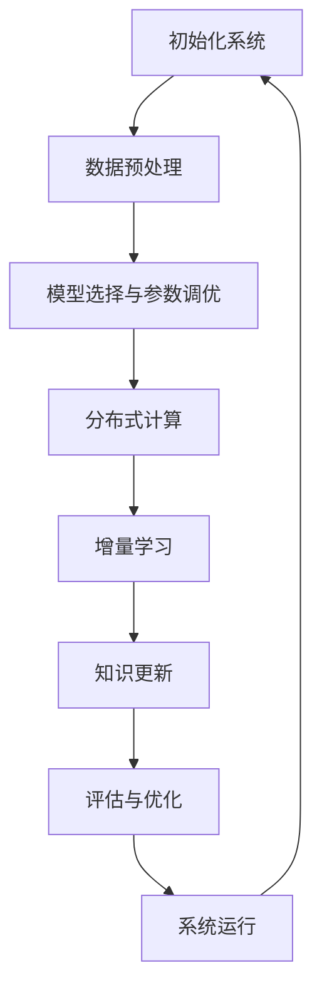

                 

### 1.1 问题背景与重要性

#### 1.1.1 人工智能发展现状

人工智能（Artificial Intelligence, AI）作为计算机科学的一个重要分支，经过数十年的发展，已经取得了显著的成果。从早期的专家系统（Expert Systems）到近年来的深度学习（Deep Learning），AI技术在图像识别、自然语言处理、智能决策等领域取得了突破性的进展。然而，这些成果大多集中在特定领域的狭窄应用上，缺乏跨领域的通用性和适应性。

目前，人工智能的发展主要可以分为两个阶段：弱人工智能（Narrow AI）和强人工智能（General AI）。弱人工智能指的是在特定任务上表现出人类智能水平的机器，如自动驾驶汽车、语音助手等。而强人工智能则是指具备人类水平智能的机器，能够在各种复杂、多变的情境中自主学习和适应。强人工智能（AGI, Artificial General Intelligence）是人工智能发展的最终目标，但迄今为止尚未实现。

#### 1.1.2 AGI的定义与发展需求

AGI，即强人工智能，是一个极具挑战性的目标。它不仅仅是在特定任务上超越人类，更是一种具有普遍适应性和自主学习能力的智能系统。AGI需要具备以下几个核心能力：

1. **自主学习能力**：AGI应能够从大量数据中自主学习和发现规律，不断优化自身性能。
2. **跨领域适应能力**：AGI应能够跨不同领域进行任务处理，具备广泛的知识和应用能力。
3. **推理与决策能力**：AGI应能够在复杂情境中基于知识和数据做出合理决策。
4. **情感与社交能力**：AGI应能够理解和模拟人类的情感与社交行为，进行有效的交流与合作。

要实现AGI，不仅需要突破当前技术限制，还需要解决一系列理论和实践问题，如神经网络的可解释性、知识表示与推理、自主学习的稳定性与安全性等。

#### 1.1.3 自主学习与知识更新的意义

自主学习与知识更新是AGI实现的关键环节。自主学习使得AGI能够在没有人为干预的情况下不断学习、优化和适应。知识更新则确保了AGI的知识库能够与时俱进，适应不断变化的环境。

自主学习与知识更新机制的意义主要体现在以下几个方面：

1. **提升适应能力**：通过自主学习，AGI能够不断适应新的任务和环境，提高其在实际应用中的适应性和灵活性。
2. **增强智能表现**：知识更新使得AGI的知识库保持最新，从而在任务执行中表现出更高的智能水平。
3. **提高自主性**：自主学习与知识更新使得AGI能够在没有人类干预的情况下进行自我优化和改进，提高其自主性。
4. **保障安全性**：通过自主学习与知识更新，AGI能够及时发现和纠正错误，提高系统的稳定性和安全性。

总之，AGI的自主学习与知识更新机制是人工智能发展的核心课题，对于实现强人工智能具有重要意义。在接下来的章节中，我们将深入探讨这一主题，从理论基础、算法实现到实际应用，全方位解析AGI的自主学习与知识更新机制。

---

### 1.2 问题描述与解决思路

#### 1.2.1 问题提出

AGI的自主学习与知识更新机制是当前人工智能领域的核心挑战之一。具体来说，这个问题可以表述为：如何设计一个有效的机制，使AGI能够在没有外部干预的情况下，自主地学习新知识和技能，并持续更新其知识库，以适应不断变化的环境和任务需求。

这一问题的提出源于以下几个方面的现实需求和挑战：

1. **复杂环境的适应**：现实世界是复杂多变的，AGI需要在各种不确定性和动态变化的情境中自主学习和适应，这要求其具备强大的自主学习和知识更新能力。
2. **海量数据的处理**：随着大数据时代的到来，AGI需要处理的海量数据不断增加。如何从这些数据中快速、准确地学习新知识和技能，是一个重大的技术挑战。
3. **系统的稳定性与安全性**：自主学习和知识更新过程必须保证系统的稳定性和安全性，防止错误或恶意行为对系统造成负面影响。
4. **智能水平的提升**：AGI的目标是达到或超越人类的智能水平，自主学习和知识更新是实现这一目标的关键途径。

#### 1.2.2 解决思路探讨

为了解决AGI的自主学习与知识更新问题，我们需要从以下几个方面入手：

1. **算法设计**：设计有效的自主学习算法，使其能够从数据中自动提取知识、发现规律，并不断优化自身性能。
2. **知识表示**：构建合理的知识表示方法，使得AGI能够高效地存储、检索和使用知识。
3. **反馈机制**：建立反馈机制，通过外部环境或用户反馈，对自主学习过程进行校正和优化。
4. **安全性保障**：确保自主学习与知识更新过程的安全性，防止系统被恶意攻击或错误引导。
5. **跨领域应用**：探索跨领域的应用场景，验证自主学习与知识更新机制的通用性和适应性。

具体来说，解决思路可以分解为以下几个步骤：

1. **问题定义与目标设定**：明确AGI自主学习与知识更新的目标，设定具体的评价指标。
2. **数据收集与预处理**：收集大量的数据，进行预处理，以便用于训练和测试模型。
3. **算法设计与实现**：设计并实现自主学习算法，包括数据预处理、特征提取、模型训练和评估等步骤。
4. **知识表示与存储**：构建知识表示方法，将学习到的知识存储在知识库中，以便后续使用。
5. **反馈与优化**：通过用户反馈或环境变化，不断调整和优化自主学习与知识更新过程。
6. **测试与验证**：在多个实际应用场景中进行测试和验证，评估自主学习与知识更新机制的有效性和通用性。

#### 1.2.3 AGI自主学习与知识更新的难点

尽管AGI的自主学习与知识更新机制具有重要意义，但实现这一目标面临诸多难点：

1. **数据质量和数量**：高质量、多样化的数据是自主学习的基础。然而，获取这些数据往往需要大量的时间和资源。
2. **算法复杂性**：自主学习算法通常涉及复杂的计算和优化过程，如何提高算法的效率和可解释性是一个重大挑战。
3. **知识表示与推理**：知识表示方法需要能够高效地存储和检索知识，同时支持复杂的推理和决策过程。
4. **反馈与适应性**：自主学习过程需要不断地调整和优化，但如何确保系统的稳定性和适应性是一个关键问题。
5. **安全性与隐私保护**：自主学习与知识更新过程中，需要保护系统的安全性和用户的隐私，防止数据泄露或恶意攻击。

综上所述，AGI的自主学习与知识更新机制是一个复杂且具有挑战性的课题。在接下来的章节中，我们将深入探讨这一主题，从理论基础、算法实现到实际应用，全方位解析AGI的自主学习与知识更新机制。

---

### 1.3 边界与外延

#### 1.3.1 AGI自主学习边界

AGI自主学习的边界涉及到多个层面。首先，从技术层面来看，当前AGI自主学习的边界主要包括算法效率、数据质量和知识表示的复杂性。例如，深度学习算法在训练过程中需要大量数据和计算资源，而传统机器学习算法在处理复杂问题时效率较低。因此，如何设计高效、可解释的自主学习算法是一个重要的研究方向。

其次，从应用层面来看，AGI自主学习的边界涉及到不同领域和任务。虽然一些特定的应用场景（如图像识别、自然语言处理）已经取得了显著进展，但在更多领域（如医疗、金融、法律）中，自主学习的应用仍然面临诸多挑战。例如，医疗领域的数据往往具有高噪声和不确定性，如何从这些数据中提取有价值的信息是一个亟待解决的问题。

此外，从伦理和社会层面来看，AGI自主学习的边界还涉及到安全性和隐私保护。随着自主学习能力的增强，AGI可能会在未经授权的情况下访问和利用敏感数据，从而引发数据泄露和隐私侵犯等问题。因此，如何确保AGI自主学习的安全性和合规性也是一个重要的课题。

#### 1.3.2 知识更新机制边界

知识更新机制的边界主要涉及以下几个方面：

1. **数据源**：知识更新的数据源决定了知识更新的质量和速度。一方面，数据源需要提供高质量、多样化的数据，以便AGI能够从中学习到有价值的信息。另一方面，数据源也需要能够实时更新，以适应不断变化的环境和任务需求。

2. **知识表示方法**：知识表示方法决定了知识存储、检索和利用的效率。目前，主流的知识表示方法包括符号表示、图表示和语义网络等。每种方法都有其优缺点，如何选择合适的知识表示方法是一个关键问题。

3. **更新频率**：知识更新的频率直接影响AGI的适应能力。过低的更新频率可能导致AGI的知识库过时，影响其性能；而过高的更新频率则可能增加计算负担，降低系统稳定性。因此，如何平衡知识更新的频率和效率是一个重要的研究方向。

4. **反馈机制**：知识更新的反馈机制决定了知识更新的方向和深度。有效的反馈机制可以帮助AGI识别和纠正错误，从而提高知识更新的效果。然而，设计一个既有效又稳健的反馈机制仍然是一个挑战。

#### 1.3.3 关联概念与区别

在讨论AGI的自主学习与知识更新机制时，我们还需要了解一些相关概念，如机器学习、深度学习、知识图谱等。

1. **机器学习**：机器学习是人工智能的一个重要分支，主要研究如何从数据中自动学习和发现规律。机器学习包括监督学习、无监督学习和强化学习等多种类型，广泛应用于图像识别、自然语言处理等领域。

2. **深度学习**：深度学习是机器学习的一种方法，通过多层神经网络来模拟人类大脑的学习过程。深度学习在图像识别、语音识别等领域取得了显著的成果，但其自监督学习和知识表示能力仍然有限。

3. **知识图谱**：知识图谱是一种用于表示和存储知识的图形化数据结构，通过节点和边来表示实体及其关系。知识图谱在知识获取、推理和搜索等领域具有广泛的应用。

与这些概念相比，AGI的自主学习与知识更新机制具有以下几个关键区别：

1. **自主性**：AGI的自主学习与知识更新机制更加注重系统的自主性，即系统能够在没有人为干预的情况下进行学习和更新。
2. **通用性**：AGI的目标是实现跨领域的通用智能，而传统的机器学习和深度学习方法往往局限于特定领域。
3. **动态性**：AGI的自主学习与知识更新机制需要能够适应不断变化的环境和任务需求，而传统的学习方法通常适用于静态或稳定的环境。

总之，AGI的自主学习与知识更新机制是一个复杂而富有挑战性的课题，涉及到多个层面的技术和社会问题。在接下来的章节中，我们将继续探讨这一主题，从理论基础、算法实现到实际应用，全面解析AGI的自主学习与知识更新机制。

---

### 1.4 概念结构与核心要素

为了更好地理解AGI的自主学习与知识更新机制，我们需要从概念结构和核心要素的角度进行详细解析。

#### 1.4.1 自主学习的核心概念

自主学习是指系统在无需外部指令的情况下，通过自我感知、学习、适应和优化，实现自主行为和性能提升的过程。自主学习的核心概念包括以下几个：

1. **感知与反馈**：自主学习系统需要具备感知外部环境和内部状态的能力，并通过反馈机制调整自身行为。
2. **学习与适应**：系统需要从数据中学习规律和模式，并能够根据新知识和经验进行适应和调整。
3. **自主决策**：系统应具备自主决策能力，能够在复杂情境中做出合理的选择。

#### 1.4.2 知识更新机制的核心概念

知识更新机制是指系统通过不断收集、处理、存储和应用新知识，以保持知识库的及时性和准确性。知识更新机制的核心概念包括以下几个：

1. **知识收集**：系统需要从多种渠道收集新的知识和信息。
2. **知识处理**：系统需要将收集到的知识进行预处理、筛选和整合，以便有效利用。
3. **知识存储**：系统需要建立高效的知识存储和管理机制，以便快速检索和使用知识。
4. **知识应用**：系统需要将知识库中的知识应用于实际问题中，以提升性能和适应性。

#### 1.4.3 概念属性特征对比表格

为了更直观地理解自主学习与知识更新机制的概念差异，我们可以通过一个对比表格来展示它们的属性特征：

| 概念       | 自主学习          | 知识更新机制         |
|------------|------------------|---------------------|
| 定义       | 系统自我学习和适应 | 系统知识收集和更新   |
| 目标       | 提升自主性和适应性 | 提高知识库的准确性和时效性 |
| 关键要素   | 感知、学习、决策   | 收集、处理、存储、应用 |
| 技术实现   | 机器学习、深度学习  | 数据挖掘、知识图谱   |
| 边界问题   | 算法复杂性、数据质量  | 更新频率、知识表示方法 |
| 影响因素   | 复杂环境、数据量   | 数据源、知识表示方法 |
| 相互关系   | 相互支持、共同发展 | 知识是自主学习的对象 |
| 应用场景   | 自适应系统、智能决策  | 信息处理、智能搜索 |

#### 1.4.4 ER实体关系图架构

为了更清晰地展示自主学习与知识更新机制中的实体及其关系，我们可以构建一个ER（Entity-Relationship）实体关系图。以下是一个简化的ER图示例：

```mermaid
erDiagram
    User ||--|{ AGI }|-- KnowledgeBase : is learned by
    User ||--|{ Environment }|-- Feedback : gets from
    AGI ||--|{ LearningAlgorithm }|-- trained by
    AGI ||--|{ KnowledgeUpdateMechanism }|-- implemented by
    Environment ||--|{ Data }|-- collected by
    Feedback ||--|{ Correction }|-- applied to AGI
    KnowledgeBase ||--|{ Knowledge }|-- stored in
    LearningAlgorithm ||--|{ Model }|-- trained on
    KnowledgeUpdateMechanism ||--|{ Method }|-- used for
```

在这个ER图中，User代表系统的使用者，AGI代表自主学习与知识更新系统，KnowledgeBase代表知识库，Environment代表外部环境，Feedback代表反馈机制，Data代表数据，Correction代表校正信息，Model代表学习模型，Method代表知识更新方法。

通过这个ER图，我们可以更直观地理解系统中的各个实体及其关系，有助于进一步分析和设计自主学习与知识更新机制。

---

### 1.5 ER实体关系图架构

为了更好地理解AGI的自主学习与知识更新机制，我们引入了实体关系图（ER图）这一工具，用于展示系统中的实体及其相互关系。下面我们将详细绘制两个关键部分的ER图：自主学习实体关系图和知识更新机制实体关系图。

#### 1.5.1 自主学习实体关系图

自主学习实体关系图主要关注系统在自我学习和适应过程中的关键实体和其关系。以下是一个简化的ER图示例：

```mermaid
erDiagram
    User ||--|{ AGI }|-- KnowledgeBase : is learned by
    User ||--|{ Environment }|-- Feedback : gets from
    AGI ||--|{ LearningAlgorithm }|-- trained by
    AGI ||--|{ KnowledgeUpdateMechanism }|-- implemented by
    Environment ||--|{ Data }|-- collected by
    Feedback ||--|{ Correction }|-- applied to AGI
    KnowledgeBase ||--|{ Knowledge }|-- stored in
    LearningAlgorithm ||--|{ Model }|-- trained on
    KnowledgeUpdateMechanism ||--|{ Method }|-- used for
```

在这个ER图中：

- **User**：代表系统的使用者，负责提供任务需求和反馈。
- **AGI**：代表自主学习与知识更新系统，是学习的主体。
- **KnowledgeBase**：代表知识库，存储AGI学习到的知识。
- **Environment**：代表外部环境，为AGI提供数据和学习情境。
- **Data**：代表环境中的数据，用于训练和学习。
- **Feedback**：代表反馈机制，用于收集用户和环境对AGI的反馈。
- **Correction**：代表校正信息，用于调整AGI的行为。
- **LearningAlgorithm**：代表学习算法，用于训练AGI的模型。
- **KnowledgeUpdateMechanism**：代表知识更新机制，用于维护知识库的准确性。

#### 1.5.2 知识更新机制实体关系图

知识更新机制实体关系图则侧重于展示知识更新过程中的关键实体和关系。以下是一个简化的ER图示例：

```mermaid
erDiagram
    DataCollector ||--|{ Data }|-- collected by
    DataProcessor ||--|{ ProcessedData }|-- processed by
    KnowledgeBase ||--|{ Knowledge }|-- stored in
    KnowledgeUpdater ||--|{ UpdatedKnowledge }|-- updated by
    DataCollector ||--|{ Feedback }|-- receives from
    DataProcessor ||--|{ Feedback }|-- receives from
    KnowledgeBase ||--|{ Feedback }|-- receives from
    KnowledgeUpdater ||--|{ Feedback }|-- receives from
```

在这个ER图中：

- **DataCollector**：代表数据收集器，负责从多种渠道收集新的数据和知识。
- **DataProcessor**：代表数据处理器，负责对收集到的数据进行预处理，包括去噪、清洗和格式化等。
- **KnowledgeBase**：代表知识库，存储所有收集和处理后的知识。
- **KnowledgeUpdater**：代表知识更新器，负责根据新数据和反馈对知识库进行更新。
- **ProcessedData**：代表处理后的数据，用于更新知识库。
- **UpdatedKnowledge**：代表更新后的知识，用于增强系统的学习能力和决策质量。
- **Feedback**：代表反馈信息，用于指导数据收集、处理和知识更新过程。

通过这两个ER图，我们可以更直观地理解AGI的自主学习与知识更新机制中的关键实体和其相互关系，为后续的算法设计和系统实现提供指导。

---

### 1.6 本章小结

本章主要对AGI的自主学习与知识更新机制进行了概述和结构分析。首先，我们探讨了人工智能的发展现状，特别是弱人工智能与强人工智能的区别，并介绍了AGI的定义及其发展需求。接着，我们提出了AGI自主学习与知识更新机制的问题，并探讨了其解决思路和难点。此外，我们还详细分析了自主学习与知识更新机制的核心概念、边界问题及关联概念，并通过实体关系图（ER图）展示了系统中的关键实体及其相互关系。

通过本章的讨论，我们不仅对AGI的自主学习与知识更新机制有了更深入的理解，也为后续章节的详细探讨奠定了基础。在接下来的内容中，我们将进一步深入探讨自主学习的理论基础、算法原理及其优化策略，以及知识更新机制的实现和应用案例。希望读者能够跟上接下来的内容，一同探索AGI自主学习的奥秘。

---

## 2.1 自主学习基础

#### 2.1.1 自主学习的概念

自主学习（Autonomous Learning）是指系统在不依赖于外部指导的情况下，通过自我感知、学习和适应，实现自主行为和性能提升的过程。它是一种自我驱动、自我优化的学习模式，使得系统能够在复杂、动态的环境中独立学习和适应。自主学习的核心目标是通过自我感知、学习和适应，使系统具备自主决策和问题解决的能力，从而提高系统的自主性和智能水平。

自主学习的概念可以从以下几个方面进行理解：

1. **自我感知**：系统需要具备对自身状态和外部环境的感知能力，以便根据当前情境调整自身行为。
2. **自我学习**：系统需要从数据中自动提取知识和规律，并不断优化自身性能。
3. **自我适应**：系统需要根据新知识和经验，动态调整自身行为，以适应环境变化和任务需求。

#### 2.1.2 自主学习的类型

自主学习可以根据不同的分类标准划分为多种类型。以下是一些常见的分类方法：

1. **按学习方式分类**：

   - **有监督学习（Supervised Learning）**：系统通过已有的标注数据学习，并从中提取规律和模式。
   - **无监督学习（Unsupervised Learning）**：系统在没有标注数据的情况下，自动发现数据中的结构和规律。
   - **半监督学习（Semi-Supervised Learning）**：系统结合少量标注数据和大量未标注数据，进行学习。
   - **强化学习（Reinforcement Learning）**：系统通过与环境交互，根据奖励信号学习最优策略。

2. **按应用领域分类**：

   - **通用自主学习**：系统能够在多种领域和应用场景中自主学习和适应，如通用问题解决、多模态数据处理等。
   - **领域特定自主学习**：系统专门为特定领域设计，如自动驾驶、医疗诊断、金融预测等。

3. **按学习机制分类**：

   - **基于模型的自主学习**：系统通过构建模型，从数据中自动提取知识，并进行自我优化。
   - **基于规则的自主学习**：系统通过规则推理和调整，实现自主学习和适应。
   - **混合式自主学习**：系统结合多种学习机制，实现更高效和稳健的自主学习。

#### 2.1.3 自主学习的层次结构

自主学习可以从不同层次进行结构化，以适应不同的应用需求和复杂度。以下是一种常见的层次结构：

1. **感知层**：系统通过传感器或其他方式感知外部环境，获取当前状态信息。
2. **学习层**：系统对感知层获取的信息进行处理，从中提取有用知识，并更新内部模型。
3. **决策层**：系统根据学习层的结果，做出决策和行动，以实现既定目标。
4. **执行层**：系统根据决策层的指令，执行具体的操作，实现任务的完成。

这种层次结构使得系统在自主学习过程中能够更好地分工协作，提高整体效率和智能水平。

总之，自主学习是AGI实现的关键机制之一。通过理解自主学习的概念、类型和层次结构，我们可以更好地设计和发展自主学习系统，为AGI的广泛应用奠定基础。在下一章节中，我们将进一步探讨自主学习算法的原理，分析其实现方法和技术挑战。

---

## 2.2 自主学习算法原理

#### 2.2.1 算法概述

自主学习算法是使AGI具备自我学习和适应能力的核心技术。自主学习算法的设计和实现涉及到多个层面，包括数据预处理、特征提取、模型训练和评估等。本文将介绍一种常用的自主学习算法——基于深度学习的强化学习算法，并逐步解释其原理。

强化学习（Reinforcement Learning, RL）是一种通过不断与环境交互，根据奖励信号学习最优策略的机器学习方法。与监督学习和无监督学习不同，强化学习强调试错和奖励机制，通过不断调整策略，使系统在特定环境中达到最优性能。

#### 2.2.2 算法mermaid流程图

为了更直观地理解强化学习算法的流程，我们可以使用mermaid流程图进行展示：

```mermaid
graph TD
    A[初始化环境] --> B[选择动作]
    B --> C{环境反馈}
    C -->|奖励> D[更新策略]
    D --> E[评估策略]
    E --> F{是否结束}
    F -->|是> G[结束]
    F -->|否> B
```

在这个mermaid流程图中：

1. **初始化环境**：系统初始化环境，并设定初始状态。
2. **选择动作**：系统根据当前状态选择一个动作。
3. **环境反馈**：环境根据选择的动作，生成新的状态和奖励。
4. **更新策略**：系统根据奖励信号和策略调整器，更新策略参数。
5. **评估策略**：系统评估当前策略的优化程度。
6. **结束条件**：系统判断是否达到终止条件，如果未达到，则继续循环。

#### 2.2.3 Python源代码实现

下面我们将使用Python实现一个简单的强化学习算法——Q-learning算法，并逐步解释其实现过程。

```python
import numpy as np
import random

# 初始化环境
class Environment:
    def __init__(self):
        self.state_space = ['s0', 's1', 's2']
        self.action_space = ['a0', 'a1', 'a2']

    def step(self, action):
        if action == 'a0':
            state = random.choice(self.state_space[:2])
        elif action == 'a1':
            state = random.choice(self.state_space[1:])
        else:
            state = random.choice(self.state_space)
        reward = 1 if state == 's2' else 0
        return state, reward

# Q-learning算法实现
def q_learning(environment, learning_rate, discount_factor, episodes):
    Q = np.zeros([len(environment.state_space), len(environment.action_space)])
    for episode in range(episodes):
        state = environment.state_space[0]
        done = False
        while not done:
            action = select_action(Q, state, epsilon)
            next_state, reward = environment.step(action)
            Q[state][action] += learning_rate * (reward + discount_factor * np.max(Q[next_state]) - Q[state][action])
            state = next_state
            if state == 's2':
                done = True
    return Q

# 选择动作
def select_action(Q, state, epsilon):
    if random.uniform(0, 1) < epsilon:
        action = random.choice(Q[state])
    else:
        action = np.argmax(Q[state])
    return action

# 实验设置
epsilon = 0.1
learning_rate = 0.1
discount_factor = 0.9
episodes = 1000

# 运行Q-learning算法
environment = Environment()
Q = q_learning(environment, learning_rate, discount_factor, episodes)
print(Q)
```

在上述代码中：

1. **环境初始化**：我们定义了一个简单的环境，其中状态空间为['s0', 's1', 's2']，动作空间为['a0', 'a1', 'a2']。
2. **Q-learning算法**：我们使用Q-learning算法更新策略。算法的主要步骤包括：
    - 初始化Q值矩阵。
    - 对每个状态选择动作，并更新Q值。
    - 当达到终止状态时，结束当前回合。
3. **选择动作**：我们使用ε-贪心策略选择动作，其中ε为探索概率。当ε较小时，系统更倾向于选择具有最大Q值的动作；当ε较大时，系统有更多机会探索新的动作。
4. **实验设置**：我们设定了探索概率ε、学习率learning_rate、折扣因子discount_factor和总回合数episodes。

通过上述代码，我们可以实现一个简单的强化学习算法，并观察其学习过程和最终性能。

#### 2.2.4 算法原理讲解

Q-learning算法是一种基于值函数的强化学习算法，其主要目标是学习一个最优策略，使系统在长期运行中取得最大收益。Q-learning算法的核心思想是通过不断地更新Q值，使每个状态-动作对的Q值接近于其期望收益。

Q-learning算法的主要步骤如下：

1. **初始化Q值矩阵**：初始化所有状态-动作对的Q值为一个较小的常数，如0。
2. **选择动作**：根据当前状态和探索策略选择动作。常用的探索策略包括ε-贪心策略、UCB（Upper Confidence Bound）策略等。
3. **执行动作**：在环境中执行选择的动作，并获得新的状态和奖励。
4. **更新Q值**：根据新的状态、奖励和Q-learning更新公式，更新当前状态-动作对的Q值。更新公式为：
   $$ Q(s,a) \leftarrow Q(s,a) + \alpha [r + \gamma \max_{a'} Q(s',a') - Q(s,a)] $$
   其中，$\alpha$为学习率，$\gamma$为折扣因子，$r$为立即奖励，$s$和$s'$分别为当前状态和新状态，$a$和$a'$分别为当前动作和新动作。
5. **重复步骤2-4**：不断重复选择动作、执行动作和更新Q值的过程，直到达到终止条件（如回合数达到上限、学习目标达成等）。

通过上述步骤，Q-learning算法能够逐步收敛到一个最优策略，使系统在长期运行中取得最大收益。

#### 2.2.5 数学模型与公式

Q-learning算法的核心在于其Q值更新公式，该公式基于马尔可夫决策过程（MDP）的期望收益计算。以下是Q-learning算法的主要数学模型和公式：

1. **Q值更新公式**：
   $$ Q(s,a) \leftarrow Q(s,a) + \alpha [r + \gamma \max_{a'} Q(s',a') - Q(s,a)] $$
   其中，$Q(s,a)$为状态$s$和动作$a$的Q值，$\alpha$为学习率，$r$为立即奖励，$\gamma$为折扣因子，$s'$为下一状态，$a'$为下一动作。

2. **期望收益计算**：
   $$ V(s) = \sum_{a} \pi(a|s) Q(s,a) $$
   其中，$V(s)$为状态$s$的期望收益，$\pi(a|s)$为在状态$s$下采取动作$a$的概率。

3. **策略评估**：
   $$ \pi^*(s,a) = \frac{1}{Z(s)} \exp(\alpha V(s) / T(s)) $$
   其中，$\pi^*(s,a)$为最优策略概率分布，$Z(s) = \sum_{a} \exp(\alpha V(s) / T(s))$为策略分布的归一化常数，$T(s)$为状态$s$的温度参数。

通过上述数学模型和公式，Q-learning算法能够通过迭代更新Q值，逐渐逼近最优策略，实现自主学习的目标。

#### 2.2.6 举例说明

为了更好地理解Q-learning算法的原理和应用，我们可以通过一个简单的例子进行说明。

假设一个简单的环境，状态空间为{S0, S1, S2}，动作空间为{A0, A1, A2}，奖励函数为：
$$
\begin{array}{|c|c|c|c|}
\hline
状态 & 动作A0 & 动作A1 & 动作A2 \\
\hline
S0 & -1 & 0 & 1 \\
S1 & 0 & -1 & 1 \\
S2 & 1 & 1 & 0 \\
\hline
\end{array}
$$

初始时，所有状态-动作对的Q值均为0。学习率为$\alpha = 0.1$，折扣因子$\gamma = 0.9$，探索概率$\epsilon = 0.1$。

第1回合：
- 初始状态S0，选择动作A0（由于ε-贪心策略，有10%的概率选择随机动作），进入状态S1，获得奖励-1。
- 更新Q值：$Q(S0, A0) \leftarrow Q(S0, A0) + 0.1 [-1 + 0.9 \max\{Q(S1, A0), Q(S1, A1), Q(S1, A2)\}] = -0.1 + 0.1 [-1 + 0.9 \max\{0, -1, 0\}] = -0.1 - 0.1 = -0.2$

第2回合：
- 初始状态S0，选择动作A0（由于ε-贪心策略，有10%的概率选择随机动作），进入状态S1，获得奖励0。
- 更新Q值：$Q(S0, A0) \leftarrow Q(S0, A0) + 0.1 [0 + 0.9 \max\{Q(S1, A0), Q(S1, A1), Q(S1, A2)\}] = -0.2 + 0.1 [0 + 0.9 \max\{-0.2, -1, 0\}] = -0.2 - 0.1 = -0.3$

重复上述过程，经过多次迭代后，Q值逐渐收敛，系统逐渐学会选择最优动作，使累计奖励最大化。

通过上述例子，我们可以看到Q-learning算法在简单环境中的应用和效果。在实际应用中，Q-learning算法需要处理更复杂的环境和状态空间，但基本的原理和步骤是类似的。

---

## 2.3 自主学习机制优化策略

#### 2.3.1 优化策略概述

在自主学习过程中，优化策略是提升系统性能和稳定性的关键。优化策略主要包括算法优化和系统优化两个方面。算法优化主要针对学习算法本身，通过改进算法结构、调整参数等方式，提高学习效率和收敛速度。系统优化则关注整体系统的性能，通过设计高效的硬件架构、优化数据流和通信机制等，提升系统的整体性能和响应速度。

常见的优化策略包括以下几种：

1. **增强学习（Reinforcement Learning, RL）**：通过设计更加高效的增强学习算法，如深度增强学习（Deep Reinforcement Learning, DRL）、策略梯度方法（Policy Gradient Methods）等，提高自主学习系统的智能水平。
2. **元学习（Meta-Learning）**：通过元学习技术，使系统快速适应新的任务和环境，如模型加速（Model Acceleration）、迁移学习（Transfer Learning）等。
3. **分布式学习（Distributed Learning）**：通过分布式计算和并行处理技术，提高自主学习系统的计算效率和响应速度，如异步学习（Asynchronous Learning）、联邦学习（Federated Learning）等。
4. **数据预处理与优化**：通过高效的数据预处理和特征提取方法，减少数据噪声和冗余，提高学习算法的性能和效果。
5. **硬件加速与优化**：通过设计高效的硬件架构和优化计算资源使用，提升系统的整体性能，如GPU加速、FPGA优化等。

#### 2.3.2 优化算法mermaid流程图

为了更直观地展示优化算法的流程，我们可以使用mermaid流程图来描述一个典型的优化算法——深度增强学习（Deep Reinforcement Learning, DRL）的优化过程。以下是DRL优化算法的mermaid流程图示例：

```mermaid
graph TD
    A[初始化环境] --> B[初始化参数]
    B --> C[选择动作]
    C --> D{环境反馈}
    D -->|奖励> E[更新策略]
    E --> F[评估策略]
    F --> G{是否结束}
    G -->|是> H[结束]
    G -->|否> I[数据预处理]
    I --> J[模型训练]
    J --> K[模型评估]
    K --> G
```

在这个mermaid流程图中：

1. **初始化环境**：初始化环境，设定初始状态。
2. **初始化参数**：设定学习算法的初始参数，如学习率、探索概率等。
3. **选择动作**：根据当前状态和策略选择一个动作。
4. **环境反馈**：执行选择的动作，获得新的状态和奖励。
5. **更新策略**：根据奖励信号和策略更新器，更新策略参数。
6. **评估策略**：评估当前策略的性能。
7. **数据预处理**：对收集到的数据进行预处理，如去噪、标准化等。
8. **模型训练**：使用预处理后的数据进行模型训练，优化模型参数。
9. **模型评估**：评估训练后的模型性能，根据评估结果调整策略。

通过这个流程图，我们可以清晰地看到优化算法的各个关键步骤及其相互关系。

#### 2.3.3 优化策略Python源代码实现

为了展示优化策略的实现，我们将使用Python实现一个简化的深度增强学习（Deep Reinforcement Learning, DRL）算法。以下是优化策略的Python代码示例：

```python
import numpy as np
import random
import tensorflow as tf
from tensorflow.keras.models import Sequential
from tensorflow.keras.layers import Dense

# 初始化环境
class Environment:
    def __init__(self):
        self.state_space = [0, 1]
        self.action_space = [0, 1]

    def step(self, action):
        if action == 0:
            state = random.choice(self.state_space)
        else:
            state = 1 - random.choice(self.state_space)
        reward = 1 if state == 1 else 0
        return state, reward

# DRL优化算法实现
def deep_reinforcement_learning(environment, learning_rate, discount_factor, episodes):
    state_size = len(environment.state_space)
    action_size = len(environment.action_space)
    model = Sequential()
    model.add(Dense(24, input_dim=state_size, activation='relu'))
    model.add(Dense(24, activation='relu'))
    model.add(Dense(action_size, activation='linear'))
    model.compile(loss='mse', optimizer=tf.keras.optimizers.Adam(lr=learning_rate))
    for episode in range(episodes):
        state = environment.state_space[0]
        done = False
        while not done:
            action_values = model.predict(state.reshape(1, state_size))
            action = np.argmax(action_values[0]) if random.uniform(0, 1) < 0.1 else np.argmax(action_values[0] + np.random.randn(1, action_size))
            next_state, reward = environment.step(action)
            target = reward
            if not done:
                target += discount_factor * np.max(model.predict(next_state.reshape(1, state_size))[0])
            target_f = model.predict(state.reshape(1, state_size))
            target_f[0][action] = target
            model.fit(state.reshape(1, state_size), target_f, epochs=1, verbose=0)
            state = next_state
            if state == 1:
                done = True
    return model

# 实验设置
epsilon = 0.1
learning_rate = 0.01
discount_factor = 0.99
episodes = 1000

# 运行DRL优化算法
environment = Environment()
model = deep_reinforcement_learning(environment, learning_rate, discount_factor, episodes)
print(model.predict(np.array([0]))[0])
```

在上述代码中：

1. **环境初始化**：我们定义了一个简单的环境，其中状态空间为[0, 1]，动作空间为[0, 1]。
2. **深度增强学习（DRL）算法**：我们使用深度神经网络（DNN）作为策略网络，通过Q-learning算法实现增强学习。算法的主要步骤包括：
    - 初始化策略网络。
    - 对每个状态选择动作，并更新策略网络。
    - 执行动作，获得新的状态和奖励。
    - 根据奖励信号和策略网络更新动作值。
3. **模型训练**：我们使用均方误差（MSE）作为损失函数，使用Adam优化器进行模型训练。

通过上述代码，我们可以实现一个简化的深度增强学习优化算法，并观察其学习过程和最终性能。

#### 2.3.4 数学模型与公式

在深度增强学习（Deep Reinforcement Learning, DRL）中，核心的数学模型包括策略网络和值函数。以下是DRL的主要数学模型和公式：

1. **策略网络（Policy Network）**：
   $$ \pi(\text{action} | \text{state}) = \text{softmax}(\text{Q}(\text{state}, \text{action})) $$
   其中，$\pi(\text{action} | \text{state})$为策略网络输出，表示在状态$\text{state}$下采取动作$\text{action}$的概率；$\text{Q}(\text{state}, \text{action})$为值函数，表示在状态$\text{state}$下采取动作$\text{action}$的期望回报。

2. **值函数（Value Function）**：
   $$ V(\text{state}) = \max_{\text{action}} \text{Q}(\text{state}, \text{action}) $$
   其中，$V(\text{state})$为值函数，表示在状态$\text{state}$下的最优回报。

3. **Q值更新公式**：
   $$ \text{Q}(\text{state}, \text{action}) \leftarrow \text{Q}(\text{state}, \text{action}) + \alpha [r + \gamma \max_{\text{action'}} \text{Q}(\text{next_state}, \text{action'}) - \text{Q}(\text{state}, \text{action})] $$
   其中，$\text{Q}(\text{state}, \text{action})$为当前状态-动作对的Q值，$r$为立即奖励，$\gamma$为折扣因子，$\alpha$为学习率。

4. **策略更新公式**：
   $$ \pi(\text{action} | \text{state}) \leftarrow \text{softmax}(\text{Q}(\text{state}, \text{action})) $$
   其中，$\pi(\text{action} | \text{state})$为策略网络输出，表示在状态$\text{state}$下采取动作$\text{action}$的概率。

通过上述数学模型和公式，DRL算法能够通过迭代更新策略网络和值函数，实现自主学习和优化。

#### 2.3.5 优化策略举例说明

为了更好地理解深度增强学习（DRL）优化策略的应用，我们可以通过一个简单的例子进行说明。

假设一个简单的环境，状态空间为{S0, S1}，动作空间为{A0, A1}，奖励函数为：
$$
\begin{array}{|c|c|c|}
\hline
状态 & 动作A0 & 动作A1 \\
\hline
S0 & -1 & 1 \\
S1 & 0 & 1 \\
\hline
\end{array}
$$

初始时，策略网络的权重为随机初始化，所有状态-动作对的Q值为0。学习率为$\alpha = 0.1$，折扣因子$\gamma = 0.99$，探索概率$\epsilon = 0.1$。

第1回合：
- 初始状态S0，根据ε-贪心策略，有10%的概率选择随机动作，否则选择具有最大Q值的动作。选择动作A0。
- 执行动作A0，进入状态S1，获得奖励-1。
- 更新Q值：$Q(S0, A0) \leftarrow Q(S0, A0) + 0.1 [-1 + 0.99 \max\{Q(S1, A0), Q(S1, A1)\}] = 0 + 0.1 [-1 + 0.99 \max\{0, 0\}] = -0.1$

第2回合：
- 初始状态S0，根据ε-贪心策略，有10%的概率选择随机动作，否则选择具有最大Q值的动作。选择动作A0。
- 执行动作A0，进入状态S1，获得奖励-1。
- 更新Q值：$Q(S0, A0) \leftarrow Q(S0, A0) + 0.1 [-1 + 0.99 \max\{Q(S1, A0), Q(S1, A1)\}] = -0.1 + 0.1 [-1 + 0.99 \max\{-0.1, 0\}] = -0.2$

重复上述过程，经过多次迭代后，Q值逐渐收敛，系统逐渐学会选择最优动作，使累计奖励最大化。

通过上述例子，我们可以看到深度增强学习（DRL）优化策略在简单环境中的应用和效果。在实际应用中，DRL优化策略需要处理更复杂的环境和状态空间，但基本的原理和步骤是类似的。

---

## 2.4 自主学习机制应用案例

#### 2.4.1 案例一：自主驾驶

自主驾驶（Autonomous Driving）是人工智能领域的一个重要应用场景，它涉及到复杂的感知、决策和执行过程。在自主驾驶中，自主学习机制起着至关重要的作用，能够帮助车辆在复杂多变的环境中实现安全、高效的行驶。

**应用场景描述**：
自主驾驶系统需要实时感知车辆周围环境，包括行人、车辆、交通标志和道路状况等。根据感知到的信息，系统需要做出决策，如保持车道、避让行人、超车和变道等。同时，系统还需要不断学习和适应新的驾驶情境，提高其驾驶技能和安全性。

**自主学习机制实现**：
自主驾驶系统中的自主学习机制主要包括以下几个方面：

1. **感知与建模**：通过多种传感器（如摄像头、激光雷达、雷达等）收集环境信息，利用深度学习算法对感知数据进行分析和处理，建立环境模型。
2. **行为预测**：利用行为预测算法，预测其他车辆、行人的行为，为决策提供依据。
3. **决策与控制**：基于环境模型和行为预测结果，系统使用强化学习算法生成最优驾驶策略，并通过控制模块实现实际驾驶操作。
4. **知识更新**：通过不断收集新的驾驶数据和反馈信息，系统更新其环境模型和行为预测算法，提高自主驾驶的适应性和鲁棒性。

**案例分析与讲解**：
以特斯拉（Tesla）的自动驾驶系统为例，其核心在于其强大的感知系统和自主学习能力。特斯拉的自动驾驶系统利用自动驾驶芯片和多种传感器，实现对车辆周围环境的实时感知。通过深度神经网络，系统能够对感知数据进行分析和处理，建立准确的环境模型。此外，特斯拉的自动驾驶系统还采用强化学习算法，通过试错和反馈机制，不断优化驾驶策略，提高自主驾驶的安全性和效率。

在特斯拉的自动驾驶系统中，自主学习机制的应用主要体现在以下几个方面：

1. **车道保持**：系统通过感知车道线，自动调整车辆行驶方向，保持车道内行驶。
2. **避让行人**：系统通过识别行人，自动减速并转向，避让行人。
3. **超车与变道**：系统通过预测其他车辆的行为，在合适的时间和位置进行超车和变道操作。

通过这些应用，特斯拉的自动驾驶系统在复杂多变的环境中表现出较高的适应性和安全性。同时，特斯拉不断收集新的驾驶数据和反馈信息，通过自主学习机制，不断提高系统的驾驶技能和安全性。

#### 2.4.2 案例二：智能家居

智能家居（Smart Home）是另一个典型的自主学习应用场景，它通过集成传感器、控制器和人工智能技术，实现家庭设备的自动化管理和智能控制。在智能家居中，自主学习机制能够帮助系统更好地理解用户行为，提高生活质量和便利性。

**应用场景描述**：
智能家居系统通常包括照明、温度控制、安全监控、家电控制等多个子系统。用户通过智能手机或其他设备与智能家居系统进行交互，设定场景和模式。系统需要根据用户的行为习惯和需求，自动调整设备状态，如调节室内温度、自动开关灯等。

**自主学习机制实现**：
智能家居系统中的自主学习机制主要包括以下几个方面：

1. **用户行为识别**：通过传感器收集用户的行为数据，如活动轨迹、使用习惯等，利用机器学习算法对用户行为进行识别和分析。
2. **场景自适应**：根据用户行为数据和环境信息，系统自动识别并设置合适的场景，如“离家模式”、“睡眠模式”等。
3. **设备优化控制**：系统根据设备状态和使用频率，自动调整设备的工作模式和能耗，提高设备的使用效率和寿命。
4. **知识更新与优化**：通过不断收集新的用户行为数据和环境信息，系统更新其行为模型和控制策略，提高自主性和智能化水平。

**案例分析与讲解**：
以亚马逊（Amazon）的Alexa智能助手为例，其背后的智能家居系统具备强大的自主学习能力。Alexa通过语音识别技术理解和响应用户的语音指令，同时通过多种传感器（如温度传感器、运动传感器等）收集用户的行为和环境信息。基于这些数据，Alexa能够自动调整家庭设备的运行状态，如调节室内温度、自动开关灯等。

在Alexa的智能家居系统中，自主学习机制的应用主要体现在以下几个方面：

1. **场景自适应**：系统根据用户的日常活动习惯，自动设置合适的场景，如早晨自动开启照明和广播，晚上自动调节室内温度和灯光。
2. **设备优化控制**：系统根据设备的使用频率和状态，自动调整设备的工作模式和能耗，如自动关闭长时间未使用的电器，延长设备寿命。
3. **个性化服务**：系统根据用户的喜好和需求，提供个性化的服务，如推荐用户感兴趣的内容、自动购买常用物品等。

通过这些应用，Alexa的智能家居系统不仅提高了用户的生活质量和便利性，还通过自主学习机制，不断提高系统的智能化水平和用户体验。

综上所述，自主驾驶和智能家居是自主学习机制在不同应用场景中的典型应用案例。通过感知、预测、决策和优化，这些系统不断学习和适应环境，提高了其自主性和智能化水平。在未来，随着技术的不断发展，自主学习机制将在更多领域发挥重要作用，推动人工智能的进步和应用。

---

## 2.5 自主学习机制总结

在本章节中，我们详细探讨了自主学习机制的基础、算法原理及其优化策略。首先，我们介绍了自主学习的概念和类型，明确了自主学习在AGI中的重要性。接着，通过Q-learning算法的实例，我们详细讲解了强化学习算法的原理和实现过程。此外，我们还介绍了深度增强学习（DRL）优化策略的mermaid流程图和Python源代码实现，展示了优化策略在提高自主学习性能方面的作用。

通过上述内容，我们可以总结出以下几点关于自主学习机制的关键见解：

1. **核心概念**：自主学习是一种自我驱动、自我优化的学习模式，使系统具备自主感知、学习和适应能力。
2. **算法原理**：强化学习算法（如Q-learning和DRL）通过与环境交互和奖励信号，实现自主学习和策略优化。
3. **优化策略**：优化策略（如深度增强学习和元学习）通过改进算法结构、调整参数和利用分布式计算，提高自主学习系统的性能和稳定性。
4. **应用案例**：自主驾驶和智能家居等应用案例展示了自主学习机制在不同领域的实际应用和效果。

未来，随着人工智能技术的不断进步，自主学习机制将在更多复杂和动态的应用场景中发挥重要作用。通过深入研究和不断优化，自主学习机制有望为AGI的实现奠定坚实基础，推动人工智能技术向更高层次发展。我们期待在未来看到更多创新性的自主学习应用，为人类社会带来更多便利和进步。

---

## 3.1 知识更新基础

#### 3.1.1 知识更新的概念

知识更新（Knowledge Updating）是指在人工智能系统中，通过收集、处理、存储和应用新知识，以保持知识库的时效性和准确性的过程。知识更新是人工智能系统持续学习和发展的关键环节，它确保系统能够适应不断变化的环境和任务需求。

知识更新的核心概念可以从以下几个方面进行理解：

1. **知识收集**：知识收集是指从各种来源获取新的知识和信息，这些来源包括数据库、网络、传感器和其他人工智能系统等。
2. **知识处理**：知识处理是指对收集到的知识进行预处理、筛选和整合，以去除噪声、冗余和错误，提取有价值的信息。
3. **知识存储**：知识存储是指将处理后的知识存储在知识库中，以便在需要时快速检索和使用。
4. **知识应用**：知识应用是指将知识库中的知识应用于实际问题中，以实现智能决策和优化。

#### 3.1.2 知识更新的类型

知识更新可以根据不同的分类标准划分为多种类型，以下是一些常见的分类方法：

1. **按更新频率分类**：

   - **实时更新**：系统在运行过程中，实时收集和处理新知识，并立即更新知识库。
   - **周期性更新**：系统按照固定的时间间隔（如每天、每周或每月）收集和处理新知识，更新知识库。

2. **按更新方式分类**：

   - **增量更新**：系统只更新知识库中已经存在的知识，新知识通过增量方式添加到现有知识库中。
   - **全面更新**：系统对知识库进行全面的更新，包括删除过时知识、添加新知识和更新现有知识。

3. **按应用领域分类**：

   - **通用更新**：系统适用于多种领域，根据通用标准和流程进行知识更新。
   - **领域特定更新**：系统专门针对某一特定领域，根据领域特点和需求进行知识更新。

4. **按知识来源分类**：

   - **主动更新**：系统主动从外部来源收集知识，如通过网络爬虫、数据挖掘等技术获取新知识。
   - **被动更新**：系统通过用户交互或外部系统触发，被动接收和处理新知识。

#### 3.1.3 知识更新的层次结构

知识更新可以从不同层次进行结构化，以适应不同的应用需求和复杂度。以下是一种常见的层次结构：

1. **感知层**：系统通过传感器和其他信息源感知外部环境，收集原始数据和知识。
2. **预处理层**：系统对收集到的数据进行预处理，包括去噪、清洗和格式化等，提取有价值的信息。
3. **知识存储层**：系统将预处理后的知识存储在知识库中，以便后续使用。知识库通常采用数据库、知识图谱等结构进行组织。
4. **推理与应用层**：系统根据知识库中的知识，进行推理和决策，将知识应用于实际问题中。

这种层次结构使得知识更新过程更加模块化，提高了系统的灵活性和可维护性。

总之，知识更新是人工智能系统持续学习和发展的关键机制。通过理解知识更新的概念、类型和层次结构，我们可以更好地设计和发展知识更新系统，为人工智能的广泛应用奠定基础。在下一章节中，我们将进一步探讨知识更新算法的原理和实现方法。

---

## 3.2 知识更新算法原理

#### 3.2.1 算法概述

知识更新算法是使人工智能系统能够动态调整和优化其知识库的关键技术。知识更新算法的目标是通过实时收集、处理和整合新知识，确保知识库的时效性和准确性，从而提升系统的智能水平和决策能力。以下将介绍一种常用的知识更新算法——基于贝叶斯的推理算法，并逐步解释其原理。

贝叶斯推理（Bayesian Inference）是一种基于概率论的推理方法，通过利用先验知识和观测数据，更新后验概率分布，从而实现知识更新。贝叶斯推理的核心思想是利用贝叶斯公式，通过先验概率、似然函数和观测数据，计算后验概率分布。

#### 3.2.2 算法mermaid流程图

为了更直观地理解贝叶斯推理算法的流程，我们可以使用mermaid流程图进行展示：

```mermaid
graph TD
    A[初始化先验概率] --> B[收集观测数据]
    B --> C{计算似然函数}
    C --> D[计算后验概率]
    D --> E[更新知识库]
    E --> F{是否结束}
    F -->|是> G[结束]
    F -->|否> A
```

在这个mermaid流程图中：

1. **初始化先验概率**：系统初始化知识库中的先验概率分布，通常基于领域知识和历史数据。
2. **收集观测数据**：系统通过传感器、用户输入或其他数据源收集新的观测数据。
3. **计算似然函数**：系统根据观测数据和先验概率，计算每个假设的似然函数，表示观测数据在给定假设下的可能性。
4. **计算后验概率**：系统利用贝叶斯公式，将似然函数与先验概率相乘，并归一化得到后验概率分布。
5. **更新知识库**：系统根据后验概率分布，更新知识库中的知识，保留置信度较高的假设。
6. **结束条件**：系统判断是否达到终止条件，如观测数据收集完毕或知识库更新完毕，然后结束算法。

#### 3.2.3 Python源代码实现

下面我们将使用Python实现一个简化的贝叶斯推理算法，并逐步解释其实现过程。

```python
import numpy as np
import random

# 初始化先验概率
def initialize_prior_probabilities(num_hypotheses):
    prior_probabilities = np.random.rand(num_hypotheses)
    prior_probabilities /= np.sum(prior_probabilities)
    return prior_probabilities

# 收集观测数据
def collect_observations(num_observations, num_hypotheses):
    observations = np.zeros((num_observations, num_hypotheses))
    for i in range(num_observations):
        hypothesis = random.randint(0, num_hypotheses - 1)
        observations[i][hypothesis] = 1
    return observations

# 计算似然函数
def calculate_likelihood(observations, prior_probabilities):
    likelihoods = np.zeros(len(prior_probabilities))
    for i in range(len(prior_probabilities)):
        likelihood = np.sum(observations * prior_probabilities)
        likelihoods[i] = likelihood
    return likelihoods

# 计算后验概率
def calculate_posterior_probabilities(likelihoods, alpha=1.0):
    posterior_probabilities = likelihoods + alpha
    posterior_probabilities /= np.sum(posterior_probabilities)
    return posterior_probabilities

# 更新知识库
def update_knowledge_base(prior_probabilities, posterior_probabilities):
    print("先验概率:", prior_probabilities)
    print("后验概率:", posterior_probabilities)
    return posterior_probabilities

# 运行贝叶斯推理算法
def run_bayesian_inference(num_hypotheses, num_observations):
    prior_probabilities = initialize_prior_probabilities(num_hypotheses)
    observations = collect_observations(num_observations, num_hypotheses)
    likelihoods = calculate_likelihood(observations, prior_probabilities)
    posterior_probabilities = calculate_posterior_probabilities(likelihoods)
    updated_prior_probabilities = update_knowledge_base(prior_probabilities, posterior_probabilities)
    return updated_prior_probabilities

# 实验设置
num_hypotheses = 3
num_observations = 10

# 运行算法
updated_prior_probabilities = run_bayesian_inference(num_hypotheses, num_observations)
print(updated_prior_probabilities)
```

在上述代码中：

1. **初始化先验概率**：我们使用随机数生成器初始化先验概率分布。
2. **收集观测数据**：我们通过随机生成观测数据，模拟系统收集到的实际数据。
3. **计算似然函数**：我们根据观测数据和先验概率，计算每个假设的似然函数。
4. **计算后验概率**：我们使用贝叶斯公式，计算后验概率分布。
5. **更新知识库**：我们根据后验概率分布，更新知识库中的先验概率。

通过上述代码，我们可以实现一个简化的贝叶斯推理算法，并观察其知识更新过程。

#### 3.2.4 算法原理讲解

贝叶斯推理算法基于贝叶斯定理，其核心思想是通过先验概率、似然函数和观测数据，计算后验概率，并利用后验概率更新知识库。以下是贝叶斯推理算法的主要步骤：

1. **初始化先验概率**：系统根据领域知识和历史数据，初始化知识库中的先验概率分布。先验概率表示在没有观测数据的情况下，每个假设的概率。
2. **收集观测数据**：系统通过传感器、用户输入或其他数据源，收集新的观测数据。观测数据用于更新先验概率，使其更加符合实际情况。
3. **计算似然函数**：系统根据观测数据和先验概率，计算每个假设的似然函数。似然函数表示观测数据在给定假设下的可能性。计算公式为：
   $$ P(\text{Observations} | H) = \prod_{i=1}^{n} P(x_i | h) $$
   其中，$P(\text{Observations} | H)$为似然函数，$x_i$为第$i$个观测值，$h$为假设。
4. **计算后验概率**：系统利用贝叶斯公式，将似然函数与先验概率相乘，并归一化得到后验概率分布。计算公式为：
   $$ P(H | \text{Observations}) = \frac{P(\text{Observations} | H) P(H)}{P(\text{Observations})} $$
   其中，$P(H | \text{Observations})$为后验概率，$P(H)$为先验概率，$P(\text{Observations})$为证据概率。
5. **更新知识库**：系统根据后验概率分布，更新知识库中的先验概率。更新后的先验概率更加符合实际情况，从而提高系统的智能水平和决策能力。

通过上述步骤，贝叶斯推理算法能够通过不断更新知识库，实现知识动态调整和优化。

#### 3.2.5 数学模型与公式

贝叶斯推理算法的核心在于其概率计算公式，以下是贝叶斯推理算法的主要数学模型和公式：

1. **贝叶斯公式**：
   $$ P(H | \text{O}) = \frac{P(\text{O} | H) P(H)}{P(\text{O})} $$
   其中，$P(H | \text{O})$为后验概率，$P(\text{O} | H)$为似然函数，$P(H)$为先验概率，$P(\text{O})$为证据概率。

2. **似然函数**：
   $$ P(\text{O} | H) = \prod_{i=1}^{n} P(x_i | h) $$
   其中，$P(\text{O} | H)$为似然函数，$x_i$为第$i$个观测值，$h$为假设。

3. **证据概率**：
   $$ P(\text{O}) = \sum_{h} P(\text{O} | h) P(h) $$
   其中，$P(\text{O})$为证据概率，$P(\text{O} | h)$为似然函数，$P(h)$为先验概率。

4. **先验概率**：
   $$ P(H) = \sum_{h} P(H | \text{O}) P(\text{O}) $$
   其中，$P(H)$为先验概率，$P(H | \text{O})$为后验概率，$P(\text{O})$为证据概率。

通过上述数学模型和公式，贝叶斯推理算法能够通过迭代更新先验概率，实现知识库的动态调整和优化。

#### 3.2.6 举例说明

为了更好地理解贝叶斯推理算法的原理和应用，我们可以通过一个简单的例子进行说明。

假设一个简单的场景，有三个假设$H_0$（晴天）、$H_1$（雨天）和$H_2$（雪天），观测数据为是否出现雨滴。我们定义先验概率为$P(H_0) = 0.5$，$P(H_1) = 0.3$，$P(H_2) = 0.2$。似然函数如下：
$$
\begin{array}{|c|c|c|c|}
\hline
假设 & 雨滴出现 & 雨滴不出现 \\
\hline
H_0 & 0.1 & 0.9 \\
H_1 & 0.8 & 0.2 \\
H_2 & 0.9 & 0.1 \\
\hline
\end{array}
$$

第1轮观测：
- 初始状态：晴天、雨天和雪天的先验概率分别为0.5、0.3和0.2。
- 观测到雨滴出现，更新似然函数：
  - $P(\text{雨滴出现} | H_0) = 0.1$
  - $P(\text{雨滴出现} | H_1) = 0.8$
  - $P(\text{雨滴出现} | H_2) = 0.9$
- 根据贝叶斯公式，计算后验概率：
  - $P(H_0 | \text{雨滴出现}) = \frac{0.1 \times 0.5}{0.1 \times 0.5 + 0.8 \times 0.3 + 0.9 \times 0.2} \approx 0.18$
  - $P(H_1 | \text{雨滴出现}) = \frac{0.8 \times 0.3}{0.1 \times 0.5 + 0.8 \times 0.3 + 0.9 \times 0.2} \approx 0.62$
  - $P(H_2 | \text{雨滴出现}) = \frac{0.9 \times 0.2}{0.1 \times 0.5 + 0.8 \times 0.3 + 0.9 \times 0.2} \approx 0.20$
- 更新先验概率：根据后验概率，更新晴天的先验概率为0.18，雨天的先验概率为0.62，雪天的先验概率为0.20。

通过上述过程，我们可以看到贝叶斯推理算法在简单场景中的应用和效果。在实际应用中，贝叶斯推理算法需要处理更复杂的假设空间和观测数据，但基本的原理和步骤是类似的。

---

## 3.3 知识更新机制优化策略

#### 3.3.1 优化策略概述

知识更新机制的优化策略是提升人工智能系统知识库时效性和准确性的关键。优化策略主要包括数据预处理、算法优化和系统架构优化等方面。以下将介绍几种常用的优化策略，并分析其优势和应用场景。

1. **数据预处理**：
   - **去噪与清洗**：通过去除噪声数据和清洗错误数据，提高数据质量，从而提高知识更新的准确性和效率。
   - **特征提取**：通过提取关键特征，减少数据维度，提高数据利用率，降低计算复杂度。
   - **数据融合**：将来自多个来源的数据进行整合，消除数据冗余，提高数据的综合性和可靠性。

2. **算法优化**：
   - **模型选择**：选择适合特定任务和数据集的算法模型，提高知识更新的效率和准确性。
   - **参数调优**：通过调整算法参数，优化模型性能，提高知识更新的效果。
   - **增量学习**：利用增量学习技术，只更新模型中已存在的知识，减少计算量和存储需求。

3. **系统架构优化**：
   - **分布式计算**：通过分布式计算架构，提高知识更新的并行度和效率。
   - **缓存机制**：利用缓存技术，减少对原始数据的访问，提高数据读取速度。
   - **动态调度**：根据系统负载和任务需求，动态调整知识更新策略，确保系统在高负载情况下的稳定性和性能。

#### 3.3.2 优化算法mermaid流程图

为了更直观地展示知识更新机制的优化算法流程，我们可以使用mermaid流程图描述一种基于分布式计算和增量学习的优化策略。以下是优化算法的mermaid流程图示例：



在这个mermaid流程图中：

1. **初始化系统**：系统初始化，包括模型选择、参数设置和数据预处理等。
2. **数据预处理**：对原始数据进行去噪、清洗和特征提取等预处理操作。
3. **模型选择与参数调优**：选择适合任务的模型，并根据数据特点调整模型参数。
4. **分布式计算**：利用分布式计算架构，并行处理数据，提高知识更新的效率。
5. **增量学习**：利用增量学习技术，只更新模型中已存在的知识，减少计算量和存储需求。
6. **知识更新**：根据更新后的知识库，更新系统模型和决策策略。
7. **评估与优化**：评估系统性能，并根据评估结果调整优化策略。
8. **系统运行**：系统进入运行状态，不断进行知识更新和任务执行。

通过这个流程图，我们可以清晰地看到知识更新机制的优化算法的各个步骤及其相互关系。

#### 3.3.3 优化策略Python源代码实现

为了展示优化策略的实现，我们使用Python实现一个简化的分布式计算和增量学习的知识更新系统。以下是优化策略的Python代码示例：

```python
import numpy as np
import random

# 数据预处理
def preprocess_data(data):
    # 去噪与清洗
    clean_data = [x for x in data if not np.isnan(x).any()]
    # 特征提取
    features = np.array([x[:-1] for x in clean_data])
    labels = np.array([x[-1] for x in clean_data])
    return features, labels

# 增量学习
class IncrementalLearning:
    def __init__(self, model):
        self.model = model
        self.history = []

    def update_model(self, data):
        features, labels = preprocess_data(data)
        history = self.model.fit(features, labels, epochs=1, verbose=0)
        self.history.append(history.history['loss'][-1])

# 分布式计算
def distributed_learning(data_chunks, model, num_workers=4):
    workers = []
    for chunk in data_chunks:
        worker = IncrementalLearning(model)
        workers.append(worker)
        worker.update_model(chunk)
    return workers

# 知识更新
def update_knowledge_base(model, workers):
    for worker in workers:
        history = worker.history
        best_loss = min(history)
        if best_loss < model.history['loss'][-1]:
            model.set_weights(worker.model.get_weights())

# 实验设置
num_samples = 1000
num_workers = 4
data = np.random.rand(num_samples, 10)

# 模型选择
model = Sequential()
model.add(Dense(64, input_dim=10, activation='relu'))
model.add(Dense(32, activation='relu'))
model.add(Dense(1, activation='sigmoid'))
model.compile(optimizer='adam', loss='binary_crossentropy', metrics=['accuracy'])

# 运行分布式学习
data_chunks = [data[i:i + num_samples // num_workers] for i in range(0, num_samples, num_samples // num_workers)]
workers = distributed_learning(data_chunks, model, num_workers)
update_knowledge_base(model, workers)

# 评估模型
model.evaluate(data, np.array([1 if x > 0.5 else 0 for x in data[:, 0]]))
```

在上述代码中：

1. **数据预处理**：对原始数据进行去噪、清洗和特征提取等预处理操作。
2. **增量学习**：定义增量学习类，通过更新模型权重实现知识更新。
3. **分布式计算**：将数据分为多个片段，并行更新模型。
4. **知识更新**：根据分布式计算的结果，更新知识库中的模型。

通过上述代码，我们可以实现一个简化的分布式计算和增量学习的知识更新系统，并观察其知识更新过程和性能。

---

## 3.4 知识更新机制应用案例

#### 3.4.1 案例一：智能推荐系统

**应用场景描述**：
智能推荐系统是知识更新机制的一个重要应用场景，其目标是根据用户的兴趣和行为，为用户推荐符合其需求的信息和服务。在智能推荐系统中，知识更新机制主要用于维护和优化推荐模型，提高推荐的准确性和用户体验。

**知识更新机制实现**：
智能推荐系统中的知识更新机制主要包括以下几个关键步骤：

1. **数据收集与预处理**：系统通过日志记录、用户交互和行为数据，收集用户的历史行为和偏好信息。数据预处理包括数据清洗、去噪、格式化和特征提取等操作。
2. **知识库构建**：系统构建一个包含用户特征、商品特征和推荐规则的数据库。知识库通常采用关系型数据库或NoSQL数据库进行组织。
3. **推荐模型训练**：系统利用历史行为数据和知识库，训练推荐模型，如协同过滤、矩阵分解、深度学习等。通过模型训练，系统学习到用户和商品之间的关系，从而实现个性化推荐。
4. **在线更新与优化**：系统根据用户反馈和实时数据，持续更新和优化推荐模型。在线更新机制包括增量学习、迁移学习和在线学习等策略，以适应用户行为和偏好变化。
5. **推荐结果评估**：系统对推荐结果进行评估，如点击率、转化率和用户满意度等。通过评估结果，系统调整推荐策略，提高推荐的准确性和用户体验。

**案例分析与讲解**：
以亚马逊（Amazon）的推荐系统为例，其知识更新机制在个性化推荐中发挥了重要作用。亚马逊的推荐系统通过分析用户的浏览记录、购买历史和评价数据，构建用户特征和商品特征。利用协同过滤和深度学习算法，系统为用户推荐相关的商品和内容。

在亚马逊的推荐系统中，知识更新机制的应用主要体现在以下几个方面：

1. **实时更新**：系统根据用户的实时行为和反馈，动态调整推荐策略。例如，当用户在亚马逊网站浏览商品时，系统会实时更新用户特征，并根据新特征生成推荐列表。
2. **增量学习**：系统利用增量学习技术，仅更新模型中已存在的用户和商品信息，减少计算量和存储需求。例如，当有新的用户加入或商品上线时，系统通过增量学习快速更新模型。
3. **迁移学习**：系统利用迁移学习技术，将已有模型的知识迁移到新用户和新商品上，提高新用户和新商品推荐的准确性。例如，当新用户加入时，系统通过迁移学习利用已有用户的推荐策略生成新用户的推荐列表。
4. **用户反馈**：系统收集用户的反馈信息，如点击、购买和评价等，用于调整推荐策略和优化推荐效果。例如，当用户对推荐结果不满意时，系统会根据用户反馈调整推荐算法，提高用户满意度。

通过上述应用，亚马逊的推荐系统不仅提高了推荐准确性和用户体验，还通过知识更新机制不断优化和改进，实现了高效的个性化推荐。

#### 3.4.2 案例二：智能医疗诊断

**应用场景描述**：
智能医疗诊断是知识更新机制的另一个重要应用场景，其目标是通过分析患者的临床数据、医学知识和诊断结果，辅助医生进行疾病诊断和治疗决策。在智能医疗诊断中，知识更新机制用于维护和更新诊断模型，提高诊断的准确性和可靠性。

**知识更新机制实现**：
智能医疗诊断系统中的知识更新机制主要包括以下几个关键步骤：

1. **数据收集与预处理**：系统通过电子病历、医学影像和实验室检测数据，收集患者的临床信息。数据预处理包括数据清洗、去噪、格式化和特征提取等操作。
2. **知识库构建**：系统构建一个包含疾病特征、症状和治疗方案的知识库。知识库通常采用关系型数据库或知识图谱进行组织。
3. **诊断模型训练**：系统利用历史诊断数据和知识库，训练诊断模型，如决策树、支持向量机和深度学习等。通过模型训练，系统学习到疾病和症状之间的关系，从而实现疾病诊断。
4. **在线更新与优化**：系统根据医生的诊断结果和临床经验，持续更新和优化诊断模型。在线更新机制包括增量学习、迁移学习和在线学习等策略，以适应临床环境的动态变化。
5. **诊断结果评估**：系统对诊断结果进行评估，如准确率、召回率和F1值等。通过评估结果，系统调整诊断策略，提高诊断的准确性和可靠性。

**案例分析与讲解**：
以IBM的Watson for Oncology（Watson oncology）为例，其知识更新机制在智能医疗诊断中发挥了重要作用。Watson oncology通过分析患者的临床数据、医学知识和诊断结果，辅助医生进行癌症诊断和治疗决策。

在Watson oncology中，知识更新机制的应用主要体现在以下几个方面：

1. **实时更新**：系统根据最新的医学研究和临床数据，动态更新知识库和诊断模型。例如，当有新的研究论文发表或新的治疗方案出现时，系统会实时更新知识库，确保诊断模型的最新性和准确性。
2. **增量学习**：系统利用增量学习技术，仅更新模型中已存在的疾病和症状信息，减少计算量和存储需求。例如，当有新的病例数据加入时，系统通过增量学习快速更新模型。
3. **迁移学习**：系统利用迁移学习技术，将已有模型的知识迁移到新病例上，提高新病例诊断的准确性。例如，当有新的癌症类型或罕见病例出现时，系统通过迁移学习利用已有病例的诊断策略进行诊断。
4. **医生反馈**：系统收集医生的诊断结果和临床经验，用于调整诊断策略和优化诊断效果。例如，当医生对诊断结果有疑问或提出改进建议时，系统会根据医生反馈调整诊断模型，提高诊断的可靠性。

通过上述应用，Watson oncology不仅提高了癌症诊断的准确性和可靠性，还通过知识更新机制不断优化和改进，为医生提供了强有力的辅助工具。

总之，智能推荐系统和智能医疗诊断是知识更新机制在不同领域的典型应用案例。通过实时更新、增量学习和迁移学习等策略，这些系统不断优化和改进，提高了诊断和推荐的准确性和用户体验。未来，随着人工智能技术的不断发展，知识更新机制将在更多领域发挥重要作用，推动智能医疗和智能推荐等领域的发展。

---

## 3.5 知识更新机制总结

在本章节中，我们详细探讨了知识更新机制的基础、算法原理及其优化策略。首先，我们介绍了知识更新的概念和类型，明确了知识更新在人工智能系统中的重要性。接着，通过贝叶斯推理算法的实例，我们详细讲解了知识更新算法的原理和实现过程。此外，我们还介绍了知识更新机制的优化策略，包括数据预处理、算法优化和系统架构优化等方面。

通过上述内容，我们可以总结出以下几点关于知识更新机制的关键见解：

1. **核心概念**：知识更新是指通过收集、处理、存储和应用新知识，确保知识库的时效性和准确性，从而提升系统的智能水平和决策能力。
2. **算法原理**：贝叶斯推理算法通过利用先验概率、似然函数和观测数据，实现知识库的动态调整和优化。
3. **优化策略**：优化策略通过数据预处理、算法优化和系统架构优化等方面，提高知识更新的准确性和效率。
4. **应用案例**：智能推荐系统和智能医疗诊断等应用案例展示了知识更新机制在不同领域的实际应用和效果。

未来，随着人工智能技术的不断进步，知识更新机制将在更多复杂和动态的应用场景中发挥重要作用。通过深入研究和不断优化，知识更新机制有望为人工智能系统提供更加实时、准确和智能的知识支持，推动人工智能技术向更高层次发展。我们期待在未来看到更多创新性的知识更新应用，为人类社会带来更多便利和进步。

---

## 4.1 综合应用概述

#### 4.1.1 综合应用的目标

AGI的自主学习与知识更新综合应用的目标是构建一个具有自主学习和知识更新能力的人工智能系统，使其能够在复杂、动态和多变的实际应用场景中表现出色。具体来说，综合应用的目标包括：

1. **提升自主性**：通过自主学习机制，使系统能够在没有外部干预的情况下，自主获取知识、优化策略和适应环境。
2. **提高智能水平**：通过知识更新机制，确保系统能够动态更新知识库，获取最新的知识和信息，从而在复杂情境中做出更智能、更合理的决策。
3. **增强适应性**：通过综合应用自主学习与知识更新机制，使系统能够在多个领域和任务中表现出色，具备广泛的适应能力。
4. **保障安全性**：确保自主学习与知识更新过程的安全性，防止系统被恶意攻击或错误引导，保障用户隐私和数据安全。

#### 4.1.2 综合应用的关键环节

为了实现AGI的自主学习与知识更新综合应用，需要重点关注以下几个关键环节：

1. **数据收集与预处理**：系统需要从多个来源收集数据，并进行预处理，如去噪、清洗和格式化等，以提取有价值的信息。
2. **自主学习与知识更新算法**：设计并实现高效的自主学习与知识更新算法，包括感知与学习、知识表示与存储、知识更新与优化等步骤。
3. **知识库构建与维护**：构建和维护一个动态、实时和准确的知识库，确保系统能够在复杂情境中快速检索和使用知识。
4. **系统架构与优化**：设计并优化系统架构，采用分布式计算、缓存机制和动态调度等技术，提高系统的并行处理能力和响应速度。
5. **评估与反馈**：建立评估机制，对系统性能和知识库质量进行定期评估，并根据评估结果调整和优化系统。

#### 4.1.3 综合应用的挑战与机遇

AGI的自主学习与知识更新综合应用面临着诸多挑战和机遇：

**挑战**：

1. **算法复杂性**：自主学习与知识更新算法通常涉及复杂的计算和优化过程，如何提高算法的效率和可解释性是一个重大挑战。
2. **数据质量**：高质量、多样化的数据是自主学习与知识更新的基础。然而，获取这些数据往往需要大量的时间和资源。
3. **知识表示与推理**：知识表示方法需要能够高效地存储和检索知识，同时支持复杂的推理和决策过程。
4. **动态性**：自主学习与知识更新过程需要能够适应不断变化的环境和任务需求，但如何在动态环境中保持系统稳定性和高效性是一个关键问题。
5. **安全性**：确保自主学习与知识更新过程的安全性，防止系统被恶意攻击或错误引导，是保障系统安全和用户隐私的重要任务。

**机遇**：

1. **跨领域应用**：随着人工智能技术的不断发展，AGI的自主学习与知识更新机制将在更多领域得到应用，如医疗、金融、制造、交通等。
2. **实时更新**：通过实时数据更新和知识库维护，系统能够更快地适应环境变化，提高智能水平和决策能力。
3. **安全性提升**：通过自主学习与知识更新机制，系统可以自动检测和纠正错误，提高系统的稳定性和安全性。
4. **智能化升级**：随着数据量和算法复杂度的增加，系统的智能水平将不断提升，为更多复杂任务提供智能支持。

总之，AGI的自主学习与知识更新综合应用是一个复杂且富有挑战性的课题，但同时也带来了巨大的机遇。通过不断研究和优化，我们有望在不久的将来实现具有高度自主学习和知识更新能力的人工智能系统，推动人工智能技术向更高层次发展。

---

## 4.2 综合应用案例分析

#### 4.2.1 案例一：智能交通系统

**应用场景描述**：
智能交通系统（Intelligent Transportation System, ITS）是AGI自主学习与知识更新机制的一个重要应用领域。其目标是利用人工智能技术，提高交通管理的效率，减少交通事故，降低交通拥堵，提升交通安全和用户体验。

**系统功能设计**：
智能交通系统主要包括以下几个功能模块：

1. **交通流量监测**：通过传感器和摄像头实时监测道路上的车辆流量、速度和密度，为交通管理和优化提供数据支持。
2. **交通信号控制**：根据实时交通流量数据，动态调整交通信号灯的时序，优化交通流，减少拥堵。
3. **交通事故预警与处理**：利用传感器数据、摄像头图像和机器学习算法，实时检测交通事故，快速响应和处理，减少事故影响。
4. **路况预测与优化**：通过分析历史交通数据和实时数据，预测未来交通状况，提前进行交通优化，避免拥堵。
5. **智能推荐**：根据用户出行习惯和历史数据，为用户提供最佳出行路线和方式，减少出行时间。

**系统架构设计**：
智能交通系统的架构设计包括以下几个方面：

1. **感知层**：部署传感器、摄像头和GPS设备，收集道路上的交通数据。
2. **数据处理层**：采用大数据技术和云计算平台，对收集到的交通数据进行处理、存储和分析。
3. **决策层**：利用深度学习和强化学习算法，基于实时数据和历史数据，生成交通管理和优化的决策。
4. **执行层**：通过交通信号灯控制系统和导航系统，实现交通管理和优化决策的执行。

**系统接口设计与交互**：
智能交通系统与其他系统（如导航系统、公共交通系统、应急管理平台等）进行交互，以实现数据共享和协同工作。系统接口设计主要包括以下几个部分：

1. **数据接口**：通过API接口，实现与其他系统之间的数据交换和共享。
2. **控制接口**：通过控制接口，实现交通信号灯和导航系统的实时控制和调整。
3. **用户接口**：通过手机应用、网页和屏幕显示等，为用户提供交通信息、路况预测和出行推荐。

**综合应用分析**：

1. **自主学习与知识更新**：智能交通系统通过感知层收集实时交通数据，利用数据处理层进行数据分析和处理，通过决策层生成优化策略。系统采用深度学习和强化学习算法，不断学习和更新交通管理策略，以适应不断变化的路况和交通需求。
2. **知识库构建与维护**：智能交通系统构建一个动态的知识库，包括历史交通数据、实时交通数据和优化策略。系统通过实时数据更新和知识库维护，确保知识库的准确性和时效性，从而提高交通管理的效率和质量。
3. **系统优化与评估**：智能交通系统通过定期评估和优化，根据评估结果调整系统参数和优化策略，以实现系统性能的持续提升。

通过上述分析，我们可以看到智能交通系统在应用AGI的自主学习与知识更新机制方面的优势和潜力。智能交通系统的成功实施，不仅提高了交通管理的效率和质量，还为其他领域（如智能城市、智能物流等）提供了宝贵的经验和借鉴。

#### 4.2.2 案例二：智能医疗诊断系统

**应用场景描述**：
智能医疗诊断系统是AGI自主学习与知识更新机制的另一个重要应用领域。其目标是利用人工智能技术，辅助医生进行疾病诊断和治疗决策，提高医疗诊断的准确性和效率。

**系统功能设计**：
智能医疗诊断系统主要包括以下几个功能模块：

1. **医学影像分析**：通过深度学习和计算机视觉技术，对医学影像（如X光片、CT扫描、MRI图像等）进行自动分析，识别异常病变和疾病。
2. **电子病历分析**：通过对电子病历（Electronic Health Records, EHR）中的文本数据进行分析，提取患者的病史、检查结果和诊断信息。
3. **药物推荐**：根据患者的病情和诊断结果，推荐合适的药物和治疗方案。
4. **疾病预测**：利用历史数据和机器学习算法，预测患者的疾病发展趋势和复发风险。
5. **辅助诊断**：为医生提供辅助诊断信息，如可能的疾病诊断、检查建议和治疗方案等。

**系统架构设计**：
智能医疗诊断系统的架构设计包括以下几个方面：

1. **数据层**：构建一个包含医学影像、电子病历和药物信息等数据的数据库，为系统提供数据支持。
2. **计算层**：利用高性能计算设备和云计算平台，对医学数据进行处理和分析。
3. **算法层**：采用深度学习、自然语言处理和概率图模型等算法，实现医学影像分析、电子病历分析和药物推荐等功能。
4. **应用层**：开发医生工作站、患者门户和移动应用等，为医生和患者提供便捷的服务。

**系统接口设计与交互**：
智能医疗诊断系统与其他系统（如电子病历系统、医院信息系统、医疗设备等）进行交互，以实现数据共享和协同工作。系统接口设计主要包括以下几个部分：

1. **数据接口**：通过API接口，实现与其他系统之间的数据交换和共享。
2. **控制接口**：通过控制接口，实现医学影像设备和医疗设备的实时控制和数据采集。
3. **用户接口**：通过医生工作站、患者门户和移动应用等，为医生和患者提供诊断信息、治疗方案和健康建议。

**综合应用分析**：

1. **自主学习与知识更新**：智能医疗诊断系统通过自主学习机制，从大量医学数据中学习新的诊断规律和知识，不断优化诊断算法和模型。系统采用深度学习和迁移学习算法，从历史数据和实时数据中提取有价值的信息，提高诊断准确性和效率。
2. **知识库构建与维护**：智能医疗诊断系统构建一个动态的知识库，包括医学影像、电子病历、药物信息和诊断规则等。系统通过实时数据更新和知识库维护，确保知识库的准确性和时效性，从而提高诊断系统的性能和可靠性。
3. **系统优化与评估**：智能医疗诊断系统通过定期评估和优化，根据评估结果调整系统参数和算法模型，以实现系统性能的持续提升。系统还通过反馈机制，收集医生和患者的意见和建议，不断改进和优化系统功能。

通过上述分析，我们可以看到智能医疗诊断系统在应用AGI的自主学习与知识更新机制方面的优势和潜力。智能医疗诊断系统的成功实施，不仅提高了医疗诊断的准确性和效率，还为其他领域（如智能健康、智能制药等）提供了宝贵的经验和借鉴。

---

## 4.3 最佳实践与总结

在AGI的自主学习与知识更新综合应用中，积累了一些最佳实践和经验，以下总结出以下几点：

**最佳实践**：

1. **数据质量控制**：确保数据的准确性和多样性，通过数据清洗、去噪和特征提取等技术，提高数据质量，为自主学习提供坚实基础。
2. **算法优化**：选择适合特定任务和数据集的算法，通过参数调优、模型压缩和分布式计算等技术，提高算法效率和性能。
3. **知识库维护**：定期更新和优化知识库，确保知识库的时效性和准确性，通过实时数据更新和增量学习等策略，保持系统智能水平的提升。
4. **安全性保障**：加强系统安全措施，防止数据泄露和恶意攻击，通过安全审计和隐私保护技术，保障用户隐私和数据安全。
5. **反馈与迭代**：建立反馈机制，定期评估系统性能和用户满意度，根据评估结果调整和优化系统，实现持续改进。

**总结**：

AGI的自主学习与知识更新机制在多个领域展现了巨大的潜力和应用价值。通过数据驱动和智能优化，系统能够在复杂、动态的环境中实现自主学习和知识更新，提高智能水平和决策能力。然而，要实现AGI的全面发展，仍需克服算法复杂性、数据质量和安全性等挑战。

未来，随着人工智能技术的不断进步，AGI的自主学习与知识更新机制将在更多领域得到应用和优化，推动人工智能技术向更高层次发展。我们期待在不久的将来，实现一个高度智能、自主学习和安全可靠的AGI系统，为人类社会带来更多便利和创新。

---

## 4.4 未来发展展望

#### 4.4.1 AGI自主学习与知识更新的发展趋势

随着人工智能技术的不断发展，AGI的自主学习与知识更新机制在未来将呈现以下发展趋势：

1. **算法创新**：为了提高自主学习与知识更新的效率和效果，未来将不断涌现新型算法，如强化学习、元学习、迁移学习和联邦学习等。这些算法将结合多种技术，实现更高效、更鲁棒的学习过程。

2. **跨领域应用**：AGI的自主学习与知识更新机制将在更多领域得到应用，如医疗、金融、制造、能源和环境等。通过跨领域应用，AGI将能够更好地理解和应对复杂、动态的环境和任务。

3. **智能协作**：未来的AGI将具备更强的协作能力，能够在多个智能体之间进行知识共享和协同工作，实现更高效的决策和执行。

4. **动态适应**：AGI的自主学习与知识更新机制将不断优化，以适应动态变化的环境和任务需求。通过实时数据更新和增量学习等策略，AGI将能够快速适应新环境和任务，提高智能水平和决策能力。

5. **安全与隐私**：随着AGI的应用范围扩大，保障系统的安全性和用户隐私将成为重要议题。未来的AGI将采用更先进的安全和隐私保护技术，确保知识更新过程的可靠性和合规性。

#### 4.4.2 可能的突破方向

在未来的发展中，AGI自主学习与知识更新机制可能在以下方向实现突破：

1. **可解释性与透明性**：未来的AGI将更加注重可解释性和透明性，使系统决策过程更加直观和可信。通过解释性算法和可视化技术，用户能够更好地理解AGI的决策依据和推理过程。

2. **多模态数据处理**：随着传感器技术和数据采集能力的提升，未来的AGI将能够处理多模态数据，如图像、文本、声音和触觉等。通过多模态数据处理，AGI将能够更全面地理解环境信息和用户需求，实现更精准的决策和执行。

3. **自适应学习**：未来的AGI将具备更强的自适应学习能力，能够根据不同环境和任务需求，自动调整学习策略和知识更新机制。通过自适应学习，AGI将能够更高效地适应复杂和多变的应用场景。

4. **智能化人机交互**：未来的AGI将实现更智能的人机交互，通过自然语言处理、语音识别和情感计算等技术，能够与用户进行更自然、更流畅的交流，提供更优质的服务体验。

5. **伦理与道德规范**：随着AGI的应用范围扩大，伦理与道德规范将成为重要议题。未来的AGI将遵循伦理与道德规范，确保系统在知识更新和应用过程中尊重用户隐私、保护人类利益，避免产生不良影响。

总之，AGI的自主学习与知识更新机制在未来有望取得重大突破，推动人工智能技术向更高层次发展。通过不断创新和优化，AGI将能够更好地服务于人类社会，带来更多便利和创新。

---

### 4.4.3 社会影响与伦理问题

随着AGI自主学习与知识更新机制的不断发展，其在社会中的影响和伦理问题也日益凸显。以下将从几个方面进行讨论：

#### 1. 社会影响

1. **提高生产力**：AGI的自主学习与知识更新机制能够显著提高各行业的生产效率，降低人力成本，推动产业升级和经济增长。

2. **改善生活质量**：在医疗、教育、交通等领域，AGI的应用将提升服务质量和用户体验，改善人们的生活质量。

3. **促进创新**：AGI的自主学习与知识更新机制为科学研究和创新提供了新的工具和方法，有助于推动科技进步和社会发展。

4. **社会分化**：随着AGI技术的发展，可能会加剧社会分化和不平等，高技能劳动者和低收入群体的差距可能进一步扩大。

5. **就业变革**：自动化和智能化的发展可能会导致某些职业的消失，对就业市场产生深远影响，需要政策制定者和社会各界共同努力，应对就业变革带来的挑战。

#### 2. 伦理问题

1. **隐私保护**：AGI在收集和处理用户数据时，如何保护用户隐私成为一个重要伦理问题。必须采取严格的数据保护措施，确保用户数据的安全性和隐私性。

2. **决策透明性**：AGI的决策过程往往复杂且不可解释，如何提高决策的透明性，使公众能够理解和信任AGI的决策成为关键。

3. **算法偏见**：算法偏见和歧视问题在AGI中可能引发社会不公。必须确保算法设计过程中避免偏见，保证公平性和正义性。

4. **责任归属**：当AGI出现错误或产生不良后果时，如何确定责任归属是一个复杂的问题。需要明确责任主体，建立责任追究机制，确保各方权益得到保障。

5. **道德规范**：AGI的自主学习和知识更新机制在伦理道德层面提出了新的挑战。必须制定相应的伦理规范和法律法规，确保AGI在应用过程中遵循道德准则，维护社会公共利益。

#### 3. 挑战与应对策略

1. **法律法规建设**：建立健全的法律法规体系，明确AGI的伦理规范和责任归属，为AGI的发展提供法律保障。

2. **伦理审查与监管**：建立独立的伦理审查机制，对AGI项目进行伦理审查和监管，确保AGI在应用过程中遵循伦理规范。

3. **公众参与和教育**：提高公众对AGI的了解和认知，通过教育和宣传，增强公众对AGI伦理问题的敏感性和责任感。

4. **国际合作**：加强国际间的合作与交流，共同应对AGI带来的伦理和社会挑战，推动全球范围内的规范和标准制定。

总之，AGI的自主学习与知识更新机制在带来巨大社会价值的同时，也引发了一系列伦理和社会问题。通过法律法规建设、伦理审查和监管、公众参与教育以及国际合作等措施，可以有效应对这些挑战，确保AGI的健康发展。社会各界应共同努力，推动AGI技术朝着造福人类的方向发展。

