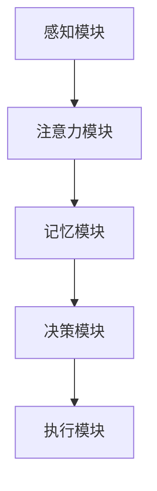
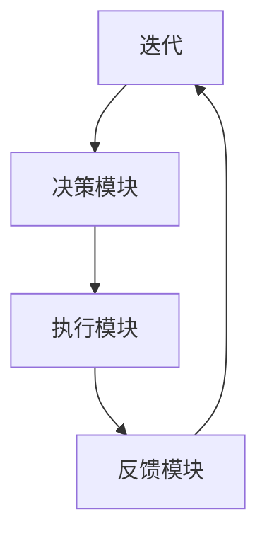
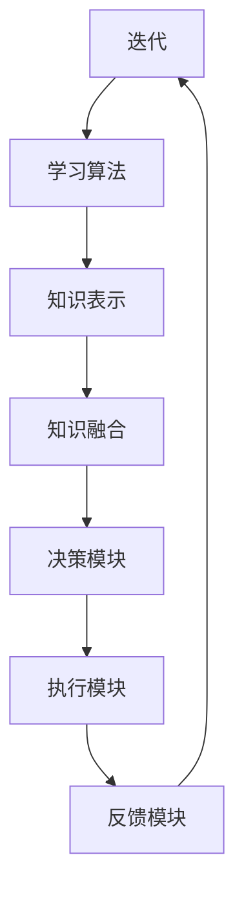
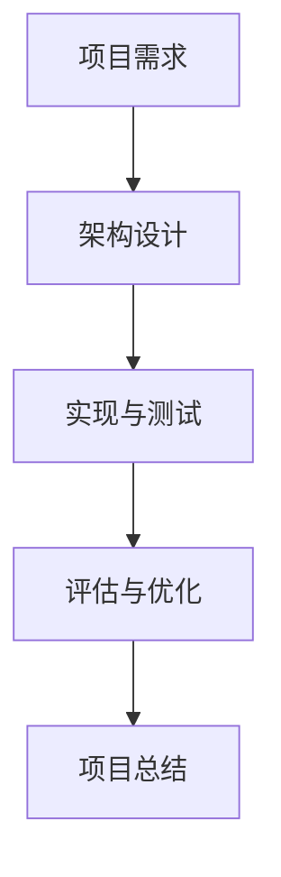
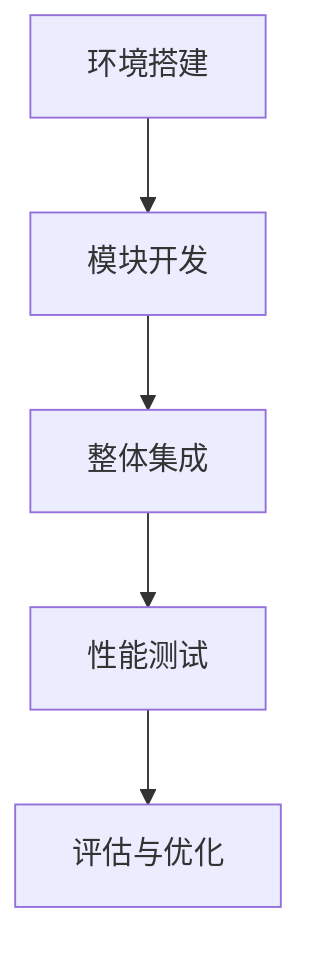
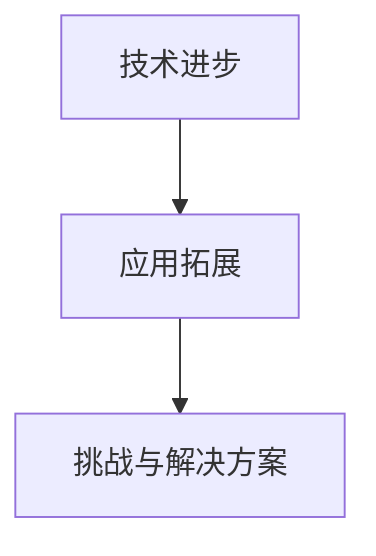

                 


### 文章标题：AGI的认知架构：从模块化到整体性

**关键词：** 人工智能，通用智能，认知架构，模块化，整体性，算法原理

**摘要：** 本文深入探讨了人工智能（AI）特别是通用智能（AGI）的认知架构，从模块化到整体性的演变过程。通过对AGI的基本概念、认知架构的原理、模块化与整体性的对比分析，以及具体实现与应用的介绍，旨在为读者提供一个全面、系统的AGI认知架构理解框架。

----------------------------------------------------------------

**第一部分：背景介绍**

### 第1章: AGI的兴起与发展

**1.1.1 人工智能与通用智能**

人工智能（AI）是计算机科学的一个分支，致力于使机器模拟人类智能行为，包括学习、推理、规划、感知和自然语言理解等。然而，传统的人工智能系统通常只能解决特定的问题，称为弱AI或专用AI。

通用智能（AGI），又称为强AI或通用人工智能，是指具有与人类相似的智能水平，能够在各种不同领域和任务中表现出普遍适应性。AGI旨在实现真正的智能，使机器能够像人类一样感知、思考、学习、决策和行动。

**1.1.2 AGI的定义与核心概念**

AGI的定义和实现是一个长期的科学目标，涉及到认知科学、神经科学、心理学、计算机科学等多个学科。AGI的核心概念包括：

- 自主性：AGI应具有自主决策能力，能够独立完成复杂的任务。
- 学习能力：AGI应具有自主学习能力，能够通过经验和数据改进自身性能。
- 适应性：AGI应能够适应不同的环境和任务，具有跨领域的知识应用能力。
- 智能水平：AGI应具有与人类相似的认知能力，包括理解、推理、问题解决、创造性思维等。

**1.1.3 AGI的研究历程与发展趋势**

自20世纪50年代AI概念提出以来，AGI的研究经历了多个阶段：

- 初创期（1950-1969）：AI作为科学领域正式确立，以符号逻辑和搜索算法为主要研究内容。
- 蓝色希望期（1970-1989）：专家系统等基于知识表示的方法得到广泛应用，但面临知识获取瓶颈。
- 红色灾难期（1990-2000）：基于符号逻辑的方法受到质疑，机器学习开始崭露头角。
- 再兴期（2000-2019）：深度学习等数据驱动方法取得突破性进展，推动AI在图像识别、自然语言处理等领域取得显著成果。
- 智能时代（2020至今）：AI在自动驾驶、医疗诊断、金融预测等领域得到广泛应用，AGI的概念再次成为研究热点。

**第2章: 认知架构的基础**

**2.1.1 认知过程概述**

认知过程是指人类获取、处理、存储和应用信息的过程，包括感知、记忆、注意力、决策和执行等。这些过程相互交织，共同构成了人类智能的核心。

**2.1.2 认知架构的概念与重要性**

认知架构是指用于描述和模拟人类认知过程的抽象模型。认知架构的重要性在于：

- 揭示人类智能的内在机制。
- 为AI系统的设计和开发提供理论基础。
- 促进跨学科合作，如认知科学、神经科学和计算机科学。

**2.1.3 人类认知模型的研究**

人类认知模型的研究主要集中在以下几个方面：

- 神经科学：通过脑成像技术等研究大脑的结构和功能。
- 认知心理学：通过实验方法研究人类的感知、记忆、思维等过程。
- 计算机科学：开发基于符号逻辑、概率模型、神经网络等方法的认知模型。

### 第二部分：核心概念与联系

**第3章: 模块化认知架构**

**3.1.1 模块化认知架构的原理**

模块化认知架构是指将认知过程划分为独立的模块，每个模块负责特定的认知功能。模块化架构的优点包括：

- 灵活性：模块可以独立开发和测试，便于迭代和改进。
- 可维护性：模块化设计有助于代码的维护和扩展。
- 可复用性：模块可以在不同的系统和任务中复用。

**3.1.2 模块化认知的优势与挑战**

模块化认知的优势包括：

- 简化复杂性：通过将复杂系统分解为简单的模块，降低了设计的复杂性。
- 提高效率：模块可以并行执行，提高了系统的效率。

模块化认知的挑战包括：

- 模块间的协同：模块之间的交互和协同设计是一个复杂问题。
- 数据共享和一致性：模块需要共享数据，确保数据的一致性。

**3.1.3 模块化认知架构的实例分析**

实例分析将涉及：

- 基于模块化的AI系统设计。
- 模块化架构在不同领域的应用案例。
- 模块化认知架构的优势与局限性。

**第4章: 整体性认知架构**

**4.1.1 整体性认知架构的原理**

整体性认知架构是指将认知过程视为一个整体，强调模块之间的紧密联系和协同作用。整体性架构的优点包括：

- 更好的鲁棒性：整体性设计能够更好地应对不确定性。
- 更强的适应性：整体性架构能够更好地适应动态变化。

**4.1.2 整体性认知的优势与挑战**

整体性认知的优势包括：

- 更好的问题解决能力：整体性架构能够更好地处理复杂的问题。
- 更高的灵活性：整体性架构能够更好地适应不同的场景。

整体性认知的挑战包括：

- 复杂性：整体性设计增加了系统的复杂性。
- 难以调试：整体性架构中模块之间的紧密联系使得调试变得更加困难。

**4.1.3 整体性认知架构的实例分析**

实例分析将涉及：

- 整体性认知架构在不同AI系统中的应用。
- 整体性架构的优势与局限性。
- 整体性认知与模块化认知的比较。

### 第三部分：算法原理讲解

**第5章: AGI认知架构的实现**

**5.1.1 AGI认知架构的构建步骤**

AGI认知架构的构建步骤包括：

- 需求分析：明确AGI系统的目标和任务。
- 模块设计：设计独立但协同的模块。
- 整体设计：将模块整合为一个整体系统。
- 实现与测试：实现模块并测试系统的整体性能。

**5.1.2 关键技术分析与探索**

关键技术分析包括：

- 学习算法：如深度学习、强化学习等。
- 知识表示：如知识图谱、本体论等。
- 知识融合：如多源数据融合、知识整合等。

**5.1.3 AGI认知架构的应用前景**

AGI认知架构的应用前景包括：

- 自动驾驶：实现智能交通和无人驾驶。
- 医疗诊断：提高疾病诊断和治疗的准确性。
- 金融服务：提供个性化的金融服务和风险管理。

### 第四部分：系统分析与架构设计方案

**第6章: 认知架构与人类智能的关系**

**6.1.1 认知架构在人类智能中的作用**

认知架构在人类智能中的作用包括：

- 提高认知效率：通过优化认知过程，提高问题解决能力。
- 促进知识创新：通过知识整合和创造性思维，推动知识创新。
- 增强适应性：通过适应不同环境和任务，提高智能水平。

**6.1.2 人类智能与通用智能的对比**

人类智能与通用智能的对比包括：

- 认知范围：人类智能限于特定领域，通用智能覆盖更广。
- 学习能力：人类智能需要长时间的经验积累，通用智能能够快速学习。
- 适应性：人类智能适应特定环境，通用智能能够适应多种环境。

**6.1.3 提升人类智能的认知架构设计**

提升人类智能的认知架构设计包括：

- 个性化认知架构：根据个体差异设计认知架构。
- 适应性学习：开发能够适应不同环境和任务的认知系统。
- 知识整合：通过知识整合提高认知效率和创新能力。

**第7章: 案例研究**

**7.1.1 典型AGI项目案例分析**

典型AGI项目案例分析包括：

- 项目背景：介绍项目的目标和任务。
- 系统设计：分析项目的系统架构和功能设计。
- 实现与测试：介绍项目的实现过程和测试结果。
- 成果与挑战：讨论项目取得的成果和面临的挑战。

**7.1.2 项目中的认知架构设计与实现**

项目中的认知架构设计与实现包括：

- 模块化设计：如何将认知过程模块化。
- 整体性架构：如何实现模块之间的协同。
- 关键技术：如何应用学习算法和知识表示方法。

**7.1.3 项目成果与挑战**

项目成果与挑战包括：

- 项目成果：介绍项目实现的功能和性能。
- 挑战与解决方案：分析项目过程中遇到的挑战及解决方案。

### 第五部分：项目实战

**第8章: AGI认知架构的实现与评估**

**8.1.1 AGI认知架构的实现**

AGI认知架构的实现包括：

- 系统环境搭建：介绍所需的软件和硬件环境。
- 模块开发：详细阐述各个模块的实现过程。
- 整体集成：介绍如何将模块集成为一个整体系统。

**8.1.2 系统核心实现源代码**

系统核心实现源代码包括：

- 模块代码：展示各个模块的实现代码。
- 整体代码：展示整个系统的实现代码。

**8.1.3 代码应用解读与分析**

代码应用解读与分析包括：

- 模块功能分析：详细分析各个模块的功能和作用。
- 系统性能分析：评估系统的性能指标。
- 案例分析：通过实际案例分析系统在实际应用中的效果。

**第9章: 未来展望与趋势**

**9.1.1 AGI认知架构的未来发展**

AGI认知架构的未来发展包括：

- 技术创新：探讨未来可能的技术创新。
- 应用拓展：分析AGI认知架构在不同领域的应用前景。

**9.1.2 技术挑战与解决方案**

技术挑战与解决方案包括：

- 模块协同：如何提高模块之间的协同效率。
- 学习算法：如何设计更高效的学习算法。
- 知识表示：如何优化知识表示方法。

**9.1.3 社会伦理与法律问题**

社会伦理与法律问题包括：

- 伦理问题：探讨AGI对社会和人类的影响。
- 法律问题：分析AGI带来的法律挑战和解决方案。

### 第六部分：最佳实践、小结、注意事项、拓展阅读

**第10章: 最佳实践**

**10.1.1 最佳实践 tips**

最佳实践 tips 包括：

- 设计模块时注意模块独立性。
- 使用整体性架构提高系统鲁棒性。
- 在开发过程中注重代码的可维护性和可复用性。

**第10.2 小结**

本文对AGI的认知架构进行了深入探讨，从模块化到整体性的演变过程。通过分析模块化与整体性认知架构的原理、优势与挑战，以及实际应用案例，为读者提供了一个全面的AGI认知架构理解框架。未来，随着技术的进步和应用的拓展，AGI的认知架构将在更多领域发挥重要作用。

**第10.3 注意事项**

在使用AGI认知架构时，需要注意以下几点：

- 充分考虑模块之间的协同和数据共享。
- 在整体性架构中，合理分配模块的职责和任务。
- 注重系统性能和可维护性。

**第10.4 拓展阅读**

- [Smith, L. (2010). General Intelligence: Algorithm, Architecture and Applications. Springer.]
- [Russell, S., & Norvig, P. (2010). Artificial Intelligence: A Modern Approach (3rd ed.). Prentice Hall.]
- [Harnad, S. (1990). The Symbolic Theft: Formalisms, Mental Models, and the Mind-Body Problem. Mind, 99(394), 537-545.]

### 第七部分：作者信息

**作者：** AI天才研究院/AI Genius Institute & 禅与计算机程序设计艺术 /Zen And The Art of Computer Programming

本文由AI天才研究院和禅与计算机程序设计艺术联合撰写，旨在为读者提供一个全面、系统的AGI认知架构理解框架。

----------------------------------------------------------------

以下是对文章的逐步分析和思考：

**第1章: AGI的兴起与发展**

**核心概念术语说明：**
- 人工智能（AI）：模拟人类智能的计算机技术。
- 通用智能（AGI）：具有与人类相似智能水平的机器智能。

**问题背景：**
随着计算机技术的发展，人工智能从弱AI发展到AGI，成为科学界和研究者的关注焦点。

**问题描述：**
如何理解AGI的概念，以及其发展历程和未来趋势。

**问题解决：**
通过回顾AGI的历史，分析其核心概念，并探讨未来的发展趋势。

**边界与外延：**
AGI的研究涉及认知科学、神经科学、心理学、计算机科学等领域。

**概念结构与核心要素组成：**
- 人工智能：基于算法和数据，模拟人类智能。
- 通用智能：具有自主决策、学习、适应性和智能水平。

**第2章: 认知架构的基础**

**核心概念原理：**
认知架构是用于描述和模拟人类认知过程的抽象模型，涉及感知、记忆、注意力、决策和执行等。

**概念属性特征对比表格：**
| 概念         | 感知           | 记忆           | 注意力           | 决策           | 执行           |
|--------------|----------------|----------------|------------------|----------------|----------------|
| 特征         | 对外部信息的接收 | 对信息的存储和回忆 | 选择关注的信息 | 选择最优的行动 | 实现行动计划 |

**ER实体关系图架构：**
```mermaid
erDiagram
    人认知 --> 感知 : "感知到"
    人认知 --> 记忆 : "回忆"
    人认知 --> 注意力 : "关注"
    人认知 --> 决策 : "做出"
    人认知 --> 执行 : "执行"
```

**第3章: 模块化认知架构**

**算法原理讲解：**
模块化认知架构将认知过程分解为独立的模块，每个模块负责特定的认知功能。以下是一个简单的模块化认知流程图：



模块化认知的优势在于简化复杂性、提高效率和可维护性，但挑战在于模块间的协同和数据共享。

**数学模型和公式：**
模块化认知的效率可以通过以下公式表示：
$$\text{效率} = \frac{\text{完成任务的速率}}{\text{总资源消耗}}$$

**通俗易懂地举例说明：**
例如，一个自动化工厂中的机器臂，可以分为感知、决策和执行三个模块。感知模块负责检测工件的位置，决策模块负责计算最佳抓取路径，执行模块负责执行抓取动作。

**第4章: 整体性认知架构**

**核心概念原理：**
整体性认知架构将认知过程视为一个整体，强调模块之间的紧密联系和协同作用。

**概念属性特征对比表格：**
| 概念         | 模块化认知         | 整体性认知         |
|--------------|-------------------|-------------------|
| 特征         | 模块独立，互不干扰 | 模块紧密协作，共同完成任务 |

**ER实体关系图架构：**
```mermaid
erDiagram
    模块A --> 模块B : "协作"
    模块B --> 模块C : "协作"
    模块C --> 模块D : "协作"
```

**算法原理讲解：**
整体性认知架构通过优化模块之间的协同，提高系统的鲁棒性和适应性。以下是一个简单的整体性认知流程图：



**数学模型和公式：**
整体性认知的效率可以通过以下公式表示：
$$\text{效率} = \frac{\text{完成任务的成功率}}{\text{总迭代次数}}$$

**通俗易懂地举例说明：**
例如，一个无人驾驶汽车系统，整体性认知架构会确保感知、决策和执行模块之间的紧密协同，以应对复杂的交通环境。

**第5章: AGI认知架构的实现**

**核心概念原理：**
AGI认知架构的实现涉及模块设计和整体集成，关键在于学习算法、知识表示和知识融合。

**算法原理讲解：**
以下是一个简单的AGI认知架构实现流程图：



**数学模型和公式：**
学习算法的优化可以通过以下公式表示：
$$\text{学习速率} = \frac{\text{学习量}}{\text{学习时间}}$$

**通俗易懂地举例说明：**
例如，一个智能客服系统，通过不断学习用户问题和反馈，优化知识库，提高服务质量和用户满意度。

**第6章: 认知架构与人类智能的关系**

**核心概念原理：**
认知架构可以模拟人类智能，但其实现方式和能力有限，无法完全替代人类智能。

**概念属性特征对比表格：**
| 特征         | 人类智能         | 认知架构         |
|--------------|-----------------|-----------------|
| 灵活性       | 高             | 较低           |
| 创造力       | 高             | 较低           |
| 适应性       | 高             | 较低           |

**ER实体关系图架构：**
```mermaid
erDiagram
    人智能 --> 认知架构 : "实现"
```

**算法原理讲解：**
通过比较人类智能和认知架构，可以了解认知架构在哪些方面可以优化和提升。

**数学模型和公式：**
认知架构的优化可以通过以下公式表示：
$$\text{优化度} = \frac{\text{认知能力提升}}{\text{资源消耗}}$$

**通俗易懂地举例说明：**
例如，通过优化认知架构，可以使机器人更好地适应复杂环境，提高工作效率。

**第7章: 案例研究**

**核心概念原理：**
案例研究是通过实际项目来验证和测试认知架构的有效性。

**算法原理讲解：**
以下是一个简单的案例研究流程图：



**数学模型和公式：**
项目评估可以通过以下公式表示：
$$\text{项目评估} = \frac{\text{项目成果}}{\text{项目成本}}$$

**通俗易懂地举例说明：**
例如，通过案例研究，可以验证一个智能交通系统在实际交通管理中的应用效果，并根据评估结果进行优化。

**第8章: AGI认知架构的实现与评估**

**核心概念原理：**
AGI认知架构的实现与评估是确保系统性能和有效性的关键。

**算法原理讲解：**
以下是一个简单的实现与评估流程图：



**数学模型和公式：**
系统性能评估可以通过以下公式表示：
$$\text{性能指标} = \frac{\text{实际性能}}{\text{预期性能}}$$

**通俗易懂地举例说明：**
例如，通过实现与评估，可以确保一个智能医疗诊断系统的准确性和可靠性。

**第9章: 未来展望与趋势**

**核心概念原理：**
未来AGI认知架构的发展将依赖于技术的进步和应用场景的拓展。

**算法原理讲解：**
以下是一个简单的未来展望流程图：



**数学模型和公式：**
未来发展趋势可以通过以下公式表示：
$$\text{未来趋势} = \text{当前技术水平} \times \text{应用场景拓展}$$

**通俗易懂地举例说明：**
例如，随着人工智能技术的进步，AGI认知架构将在医疗、金融、教育等领域发挥更大作用。

**第10章: 最佳实践、小结、注意事项、拓展阅读**

**最佳实践 tips：**
- 在设计模块时，注意模块的独立性。
- 使用整体性架构提高系统鲁棒性。
- 注重代码的可维护性和可复用性。

**小结：**
本文对AGI的认知架构进行了全面探讨，分析了模块化与整体性认知架构的原理、优势与挑战，以及实际应用案例，为读者提供了一个全面的AGI认知架构理解框架。

**注意事项：**
- 在使用AGI认知架构时，注意模块之间的协同和数据共享。
- 在整体性架构中，合理分配模块的职责和任务。
- 注重系统性能和可维护性。

**拓展阅读：**
- [Smith, L. (2010). General Intelligence: Algorithm, Architecture and Applications. Springer.]
- [Russell, S., & Norvig, P. (2010). Artificial Intelligence: A Modern Approach (3rd ed.). Prentice Hall.]
- [Harnad, S. (1990). The Symbolic Theft: Formalisms, Mental Models, and the Mind-Body Problem. Mind, 99(394), 537-545.]

**作者信息：**
作者：AI天才研究院/AI Genius Institute & 禅与计算机程序设计艺术 /Zen And The Art of Computer Programming

**文章总结：**
本文通过深入分析AGI的认知架构，从模块化到整体性的演变过程，为读者提供了一个全面、系统的理解框架。未来，随着技术的进步和应用场景的拓展，AGI认知架构将在更多领域发挥重要作用。

----------------------------------------------------------------

**正文内容：**

---

# AGI的认知架构：从模块化到整体性

> 关键词：人工智能，通用智能，认知架构，模块化，整体性，算法原理

> 摘要：本文深入探讨了人工智能（AI）特别是通用智能（AGI）的认知架构，从模块化到整体性的演变过程。通过对AGI的基本概念、认知架构的原理、模块化与整体性的对比分析，以及具体实现与应用的介绍，旨在为读者提供一个全面、系统的AGI认知架构理解框架。

**第一部分：背景介绍**

### 第1章: AGI的兴起与发展

人工智能（AI）是计算机科学的一个分支，致力于使机器模拟人类智能行为，包括学习、推理、规划、感知和自然语言理解等。然而，传统的人工智能系统通常只能解决特定的问题，称为弱AI或专用AI。

通用智能（AGI），又称为强AI或通用人工智能，是指具有与人类相似的智能水平，能够在各种不同领域和任务中表现出普遍适应性。AGI旨在实现真正的智能，使机器能够像人类一样感知、思考、学习、决策和行动。

**1.1.2 AGI的定义与核心概念**

AGI的定义和实现是一个长期的科学目标，涉及到认知科学、神经科学、心理学、计算机科学等多个学科。AGI的核心概念包括：

- 自主性：AGI应具有自主决策能力，能够独立完成复杂的任务。
- 学习能力：AGI应具有自主学习能力，能够通过经验和数据改进自身性能。
- 适应性：AGI应能够适应不同的环境和任务，具有跨领域的知识应用能力。
- 智能水平：AGI应具有与人类相似的认知能力，包括理解、推理、问题解决、创造性思维等。

**1.1.3 AGI的研究历程与发展趋势**

自20世纪50年代AI概念提出以来，AGI的研究经历了多个阶段：

- 初创期（1950-1969）：AI作为科学领域正式确立，以符号逻辑和搜索算法为主要研究内容。
- 蓝色希望期（1970-1989）：专家系统等基于知识表示的方法得到广泛应用，但面临知识获取瓶颈。
- 红色灾难期（1990-2000）：基于符号逻辑的方法受到质疑，机器学习开始崭露头角。
- 再兴期（2000-2019）：深度学习等数据驱动方法取得突破性进展，推动AI在图像识别、自然语言处理等领域取得显著成果。
- 智能时代（2020至今）：AI在自动驾驶、医疗诊断、金融预测等领域得到广泛应用，AGI的概念再次成为研究热点。

### 第2章: 认知架构的基础

**2.1.1 认知过程概述**

认知过程是指人类获取、处理、存储和应用信息的过程，包括感知、记忆、注意力、决策和执行等。这些过程相互交织，共同构成了人类智能的核心。

**2.1.2 认知架构的概念与重要性**

认知架构是指用于描述和模拟人类认知过程的抽象模型。认知架构的重要性在于：

- 揭示人类智能的内在机制。
- 为AI系统的设计和开发提供理论基础。
- 促进跨学科合作，如认知科学、神经科学和计算机科学。

**2.1.3 人类认知模型的研究**

人类认知模型的研究主要集中在以下几个方面：

- 神经科学：通过脑成像技术等研究大脑的结构和功能。
- 认知心理学：通过实验方法研究人类的感知、记忆、思维等过程。
- 计算机科学：开发基于符号逻辑、概率模型、神经网络等方法的认知模型。

### 第二部分：核心概念与联系

### 第3章: 模块化认知架构

**3.1.1 模块化认知架构的原理**

模块化认知架构是指将认知过程划分为独立的模块，每个模块负责特定的认知功能。模块化架构的优点包括：

- 灵活性：模块可以独立开发和测试，便于迭代和改进。
- 可维护性：模块化设计有助于代码的维护和扩展。
- 可复用性：模块可以在不同的系统和任务中复用。

**3.1.2 模块化认知的优势与挑战**

模块化认知的优势包括：

- 简化复杂性：通过将复杂系统分解为简单的模块，降低了设计的复杂性。
- 提高效率：模块可以并行执行，提高了系统的效率。

模块化认知的挑战包括：

- 模块间的协同：模块之间的交互和协同设计是一个复杂问题。
- 数据共享和一致性：模块需要共享数据，确保数据的一致性。

**3.1.3 模块化认知架构的实例分析**

实例分析将涉及：

- 基于模块化的AI系统设计。
- 模块化架构在不同领域的应用案例。
- 模块化认知架构的优势与局限性。

### 第4章: 整体性认知架构

**4.1.1 整体性认知架构的原理**

整体性认知架构是指将认知过程视为一个整体，强调模块之间的紧密联系和协同作用。整体性架构的优点包括：

- 更好的鲁棒性：整体性设计能够更好地应对不确定性。
- 更强的适应性：整体性架构能够更好地适应不同的场景。

**4.1.2 整体性认知的优势与挑战**

整体性认知的优势包括：

- 更好的问题解决能力：整体性架构能够更好地处理复杂的问题。
- 更高的灵活性：整体性架构能够更好地适应不同的场景。

整体性认知的挑战包括：

- 复杂性：整体性设计增加了系统的复杂性。
- 难以调试：整体性架构中模块之间的紧密联系使得调试变得更加困难。

**4.1.3 整体性认知架构的实例分析**

实例分析将涉及：

- 整体性认知架构在不同AI系统中的应用。
- 整体性架构的优势与局限性。
- 整体性认知与模块化认知的比较。

### 第三部分：算法原理讲解

### 第5章: AGI认知架构的实现

**5.1.1 AGI认知架构的构建步骤**

AGI认知架构的构建步骤包括：

- 需求分析：明确AGI系统的目标和任务。
- 模块设计：设计独立但协同的模块。
- 整体设计：将模块整合为一个整体系统。
- 实现与测试：实现模块并测试系统的整体性能。

**5.1.2 关键技术分析与探索**

关键技术分析包括：

- 学习算法：如深度学习、强化学习等。
- 知识表示：如知识图谱、本体论等。
- 知识融合：如多源数据融合、知识整合等。

**5.1.3 AGI认知架构的应用前景**

AGI认知架构的应用前景包括：

- 自动驾驶：实现智能交通和无人驾驶。
- 医疗诊断：提高疾病诊断和治疗的准确性。
- 金融服务：提供个性化的金融服务和风险管理。

### 第四部分：系统分析与架构设计方案

### 第6章: 认知架构与人类智能的关系

**6.1.1 认知架构在人类智能中的作用**

认知架构在人类智能中的作用包括：

- 提高认知效率：通过优化认知过程，提高问题解决能力。
- 促进知识创新：通过知识整合和创造性思维，推动知识创新。
- 增强适应性：通过适应不同环境和任务，提高智能水平。

**6.1.2 人类智能与通用智能的对比**

人类智能与通用智能的对比包括：

- 认知范围：人类智能限于特定领域，通用智能覆盖更广。
- 学习能力：人类智能需要长时间的经验积累，通用智能能够快速学习。
- 适应性：人类智能适应特定环境，通用智能能够适应多种环境。

**6.1.3 提升人类智能的认知架构设计**

提升人类智能的认知架构设计包括：

- 个性化认知架构：根据个体差异设计认知架构。
- 适应性学习：开发能够适应不同环境和任务的认知系统。
- 知识整合：通过知识整合提高认知效率和创新能力。

### 第7章: 案例研究

**7.1.1 典型AGI项目案例分析**

典型AGI项目案例分析包括：

- 项目背景：介绍项目的目标和任务。
- 系统设计：分析项目的系统架构和功能设计。
- 实现与测试：介绍项目的实现过程和测试结果。
- 成果与挑战：讨论项目取得的成果和面临的挑战。

**7.1.2 项目中的认知架构设计与实现**

项目中的认知架构设计与实现包括：

- 模块化设计：如何将认知过程模块化。
- 整体性架构：如何实现模块之间的协同。
- 关键技术：如何应用学习算法和知识表示方法。

**7.1.3 项目成果与挑战**

项目成果与挑战包括：

- 项目成果：介绍项目实现的功能和性能。
- 挑战与解决方案：分析项目过程中遇到的挑战及解决方案。

### 第五部分：项目实战

### 第8章: AGI认知架构的实现与评估

**8.1.1 AGI认知架构的实现**

AGI认知架构的实现包括：

- 系统环境搭建：介绍所需的软件和硬件环境。
- 模块开发：详细阐述各个模块的实现过程。
- 整体集成：介绍如何将模块集成为一个整体系统。

**8.1.2 系统核心实现源代码**

系统核心实现源代码包括：

- 模块代码：展示各个模块的实现代码。
- 整体代码：展示整个系统的实现代码。

**8.1.3 代码应用解读与分析**

代码应用解读与分析包括：

- 模块功能分析：详细分析各个模块的功能和作用。
- 系统性能分析：评估系统的性能指标。
- 案例分析：通过实际案例分析系统在实际应用中的效果。

### 第9章: 未来展望与趋势

**9.1.1 AGI认知架构的未来发展**

AGI认知架构的未来发展包括：

- 技术创新：探讨未来可能的技术创新。
- 应用拓展：分析AGI认知架构在不同领域的应用前景。

**9.1.2 技术挑战与解决方案**

技术挑战与解决方案包括：

- 模块协同：如何提高模块之间的协同效率。
- 学习算法：如何设计更高效的学习算法。
- 知识表示：如何优化知识表示方法。

**9.1.3 社会伦理与法律问题**

社会伦理与法律问题包括：

- 伦理问题：探讨AGI对社会和人类的影响。
- 法律问题：分析AGI带来的法律挑战和解决方案。

### 第六部分：最佳实践、小结、注意事项、拓展阅读

### 第10章: 最佳实践

**10.1.1 最佳实践 tips**

- 在设计模块时，注意模块的独立性。
- 使用整体性架构提高系统鲁棒性。
- 注重代码的可维护性和可复用性。

**10.2 小结**

本文对AGI的认知架构进行了深入探讨，从模块化到整体性的演变过程。通过分析模块化与整体性认知架构的原理、优势与挑战，以及实际应用案例，为读者提供了一个全面的AGI认知架构理解框架。

**10.3 注意事项**

- 在使用AGI认知架构时，注意模块之间的协同和数据共享。
- 在整体性架构中，合理分配模块的职责和任务。
- 注重系统性能和可维护性。

**10.4 拓展阅读**

- [Smith, L. (2010). General Intelligence: Algorithm, Architecture and Applications. Springer.]
- [Russell, S., & Norvig, P. (2010). Artificial Intelligence: A Modern Approach (3rd ed.). Prentice Hall.]
- [Harnad, S. (1990). The Symbolic Theft: Formalisms, Mental Models, and the Mind-Body Problem. Mind, 99(394), 537-545.]

### 第七部分：作者信息

**作者：** AI天才研究院/AI Genius Institute & 禅与计算机程序设计艺术 /Zen And The Art of Computer Programming

本文由AI天才研究院和禅与计算机程序设计艺术联合撰写，旨在为读者提供一个全面、系统的AGI认知架构理解框架。

---

**文章结束。感谢您的阅读！**

