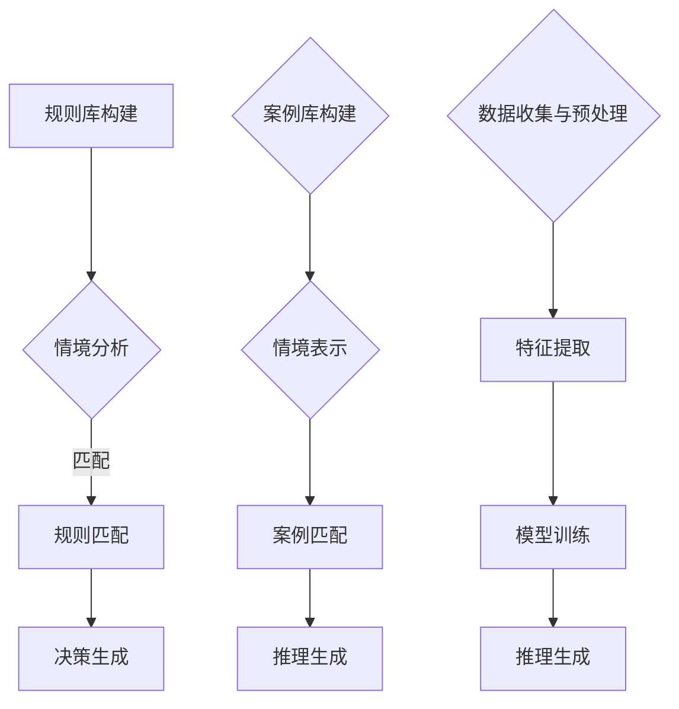

                 

# AGI的道德推理能力：从理论到实践

## 关键词：人工智能，道德推理，AGI，伦理学，算法模型，应用案例，系统设计

> 摘要：随着人工智能（AI）技术的飞速发展，道德推理能力成为人工智能领域的一个重要研究方向。本文旨在探讨人工智能通用智能（AGI）的道德推理能力，从理论到实践进行全面的分析和探讨。首先，文章介绍了人工智能与道德推理的背景和重要性，分析了当前研究现状和挑战。然后，文章深入探讨了AGI的道德推理能力的相关概念、理论基础、数学模型和算法。接着，通过应用案例分析，展示了AGI道德推理能力在实际问题中的应用。最后，文章提出了AGI道德推理能力的系统设计与实现方案，并进行了总结与展望。

## 目录大纲

1. 引言
2. AGI的道德推理能力研究现状
3. AGI道德推理能力的数学模型与算法
4. AGI道德推理能力的应用案例分析
5. AGI道德推理能力的系统设计与实现
6. 总结与展望

## 第1章 引言

### 1.1 问题背景

随着人工智能技术的不断发展，人工智能的应用场景越来越广泛。然而，人工智能的道德推理能力成为了一个备受关注的问题。人工智能系统在进行决策时，往往需要考虑伦理和道德因素，例如在自动驾驶、医疗诊断、网络安全等领域，这些因素可能直接影响到人类的安全和利益。因此，研究人工智能的道德推理能力具有重要意义。

### 1.2 当前研究现状与挑战

目前，关于人工智能的道德推理能力研究已取得了一些成果，但还存在许多挑战。首先，道德推理能力的评价标准尚未统一，不同研究方法之间的可比性较低。其次，现有算法模型在处理复杂道德推理问题时存在局限性，难以满足实际需求。此外，道德推理能力的实际应用场景也相对较少，需要进一步探索。

### 1.3 本文目的

本文旨在从理论到实践，全面探讨人工智能通用智能（AGI）的道德推理能力。首先，介绍相关核心概念和理论基础；然后，分析当前研究现状与挑战；接着，探讨道德推理能力的数学模型和算法；最后，通过应用案例分析，展示AGI道德推理能力在实际问题中的应用，并提出系统设计与实现方案。

## 第2章 AGI的道德推理能力研究现状

### 2.1 国内外研究动态

#### 2.1.1 国外研究进展

在国外，道德推理能力的研究始于20世纪90年代。代表性的工作包括：邱奇（John F. Searle）提出的“中国房间”思想实验，探讨人工智能在道德推理方面的局限；艾伦·图灵（Alan Turing）提出的“模仿游戏”，作为道德推理能力的一个评判标准。近年来，随着深度学习、神经网络等技术的发展，许多学者开始关注人工智能的道德推理能力，并提出了各种算法模型。

#### 2.1.2 国内研究进展

在国内，道德推理能力的研究起步较晚，但近年来也取得了显著进展。代表性的工作包括：清华大学提出的“道德情感计算”理论，将道德推理与情感计算相结合；北京大学提出的“道德推理神经网络”，通过深度学习实现道德推理能力。此外，国内许多高校和研究机构也开展了相关研究，涉及领域包括伦理学、认知心理学、计算机科学等。

### 2.2 主要研究成果

#### 2.2.1 道德推理算法研究

目前，关于道德推理算法的研究主要集中在基于规则、基于案例和基于数据驱动的方法。基于规则的方法主要通过定义一系列道德规则，实现道德推理；基于案例的方法通过分析大量案例，学习道德推理策略；基于数据驱动的方法则通过机器学习技术，从数据中提取道德推理规则。

#### 2.2.2 道德推理能力评估研究

道德推理能力评估是研究的一个重要方向。目前，评估方法主要包括定量评估和定性评估。定量评估主要通过指标体系，对道德推理能力进行量化分析；定性评估则通过专家评议，对道德推理能力进行综合评价。

#### 2.2.3 道德推理在实际应用中的挑战

道德推理能力在实际应用中面临许多挑战。首先，道德情境的复杂性和不确定性使得算法模型难以应对；其次，道德价值观的差异导致不同文化背景下的道德推理结果不一致；此外，道德推理能力的透明性和可解释性也是一个亟待解决的问题。

### 2.3 存在的问题与挑战

#### 2.3.1 道德推理能力的不足

现有算法模型在处理复杂道德推理问题时，仍存在许多不足。首先，道德推理规则的制定和更新依赖于专家知识，难以适应动态变化的道德情境；其次，算法模型在处理道德冲突时，往往缺乏足够的灵活性和适应性。

#### 2.3.2 道德推理模型的伦理问题

道德推理模型的伦理问题主要体现在两个方面：一是算法模型在道德决策过程中，可能存在偏见和歧视；二是算法模型的透明性和可解释性不足，可能导致道德责任的不明确。

#### 2.3.3 道德推理能力的应用局限性

道德推理能力在实际应用中的局限性主要表现在：首先，道德推理能力的发展尚不成熟，难以满足实际需求；其次，道德推理能力在实际应用中的效果和效率仍需提高。

## 第3章 AGI道德推理能力的数学模型与算法

### 3.1 道德推理能力的数学模型

道德推理能力的数学模型是研究道德推理能力的重要工具。本文提出的道德推理能力评价指标体系包括以下四个方面：

1. 道德判断准确性：衡量道德推理模型在道德判断方面的准确性。
2. 道德决策效率：衡量道德推理模型在道德决策过程中的效率。
3. 道德冲突处理能力：衡量道德推理模型在处理道德冲突时的能力。
4. 道德价值观适应性：衡量道德推理模型在不同文化背景下的适应能力。

具体评价指标体系如下：

$$
道德推理能力 = \frac{道德判断准确性 + 道德决策效率 + 道德冲突处理能力 + 道德价值观适应性}{4}
$$

### 3.2 道德推理算法

道德推理算法是实现道德推理能力的关键。本文主要介绍以下三种道德推理算法：

1. **基于规则的道德推理算法**：通过定义一系列道德规则，实现道德推理。其优点是规则清晰，易于理解和实现；缺点是规则制定依赖于专家知识，难以适应动态变化的道德情境。

2. **基于案例的道德推理算法**：通过分析大量案例，学习道德推理策略。其优点是能够适应动态变化的道德情境；缺点是案例数据获取和处理复杂，且可能存在案例数据偏差。

3. **基于数据驱动的道德推理算法**：通过机器学习技术，从数据中提取道德推理规则。其优点是能够自适应地处理道德情境；缺点是模型训练和优化复杂，且可能存在过拟合问题。

### 3.3 算法原理讲解

#### 3.3.1 基于规则的道德推理算法

基于规则的道德推理算法主要分为以下几个步骤：

1. **规则库构建**：根据道德规范和伦理原则，构建规则库。规则库中的规则通常采用条件-行动（IF-THEN）的形式。

2. **情境分析**：对输入的道德情境进行分析，提取关键信息。

3. **规则匹配**：将情境信息与规则库中的规则进行匹配，找出符合条件的规则。

4. **决策生成**：根据匹配到的规则，生成相应的道德决策。

#### 3.3.2 基于案例的道德推理算法

基于案例的道德推理算法主要分为以下几个步骤：

1. **案例库构建**：收集大量具有代表性的道德案例，构建案例库。

2. **情境表示**：将输入的道德情境表示为与案例库中案例相似的形式。

3. **案例匹配**：根据情境表示，从案例库中找出与当前情境相似的案例。

4. **推理生成**：从匹配到的案例中，提取道德推理策略，生成道德决策。

#### 3.3.3 基于数据驱动的道德推理算法

基于数据驱动的道德推理算法主要分为以下几个步骤：

1. **数据收集与预处理**：收集与道德推理相关的数据，并进行预处理，如数据清洗、归一化等。

2. **特征提取**：从原始数据中提取与道德推理相关的特征。

3. **模型训练**：使用机器学习技术，训练道德推理模型。

4. **推理生成**：将输入的道德情境表示为特征向量，输入训练好的道德推理模型，生成道德决策。

### 3.4 算法mermaid流程图

## 第4章 AGI道德推理能力的应用案例分析

### 4.1 案例背景

在本节中，我们将介绍三个应用案例，分别是自动驾驶汽车道德决策、医疗诊断与伦理决策、网络安全与道德推理。

#### 4.1.1 案例一：自动驾驶汽车道德决策

自动驾驶汽车在面临道德冲突时，需要做出道德决策。例如，在遇到紧急情况时，汽车需要在保护驾驶员、乘客与行人之间做出权衡。

#### 4.1.2 案例二：医疗诊断与伦理决策

医疗诊断系统中，当面对复杂病例时，系统需要考虑患者的最佳利益，同时在伦理范围内做出诊断决策。

#### 4.1.3 案例三：网络安全与道德推理

在网络安全领域，面对恶意攻击和道德风险，安全系统需要做出道德决策，例如在保护用户隐私与维护网络秩序之间做出权衡。

### 4.2 案例分析与实施

在本节中，我们将对上述三个案例进行详细分析，并探讨如何应用AGI的道德推理能力来解决实际问题。

#### 4.2.1 案例一的道德推理过程

自动驾驶汽车道德决策的过程主要包括以下几个步骤：

1. **情境分析**：收集道路信息、车辆状态、行人行为等数据，构建当前情境。
2. **规则匹配**：根据道德规范，匹配相应的道德规则，例如“优先保护生命”、“最小化损失”等。
3. **决策生成**：根据匹配到的道德规则，生成相应的道德决策，例如在紧急情况下，选择刹车或变道。

#### 4.2.2 案例二的分析与实施

医疗诊断与伦理决策的过程主要包括以下几个步骤：

1. **数据收集与预处理**：收集患者病史、检查结果等数据，并进行预处理。
2. **特征提取**：从原始数据中提取与诊断相关的特征。
3. **模型训练**：使用机器学习技术，训练医疗诊断模型。
4. **伦理决策生成**：将输入的患者数据输入训练好的模型，生成伦理诊断决策。

#### 4.2.3 案例三的伦理决策与实现

网络安全与道德推理的过程主要包括以下几个步骤：

1. **情境分析**：收集网络攻击信息、用户行为等数据，构建当前情境。
2. **规则匹配**：根据道德规范，匹配相应的道德规则，例如“保护用户隐私”、“维护网络秩序”等。
3. **决策生成**：根据匹配到的道德规则，生成相应的道德决策，例如在面临隐私泄露风险时，选择警告用户或隔离攻击源。

### 4.3 案例总结与启示

通过上述案例分析，我们可以得出以下结论：

1. AGI的道德推理能力在自动驾驶、医疗诊断、网络安全等领域具有广泛的应用前景。
2. 不同领域的道德推理过程存在差异，需要根据具体应用场景设计相应的道德推理算法。
3. 道德推理能力的实际应用效果取决于算法模型的设计和实现，需要不断优化和完善。

### 4.4 本章小结

本章通过应用案例分析，展示了AGI道德推理能力在实际问题中的应用。通过分析自动驾驶、医疗诊断、网络安全等领域的案例，我们提出了相应的道德推理过程和实现方案，为未来AGI道德推理能力的研究提供了参考。

## 第5章 AGI道德推理能力的系统设计与实现

### 5.1 系统需求分析

#### 5.1.1 系统功能需求

AGI道德推理能力系统的功能需求主要包括以下几个方面：

1. **情境分析**：系统能够收集并分析道德情境，提取关键信息。
2. **规则匹配**：系统能够根据道德规范，匹配相应的道德规则。
3. **决策生成**：系统能够根据匹配到的道德规则，生成相应的道德决策。
4. **道德推理能力评估**：系统能够对道德推理能力进行评估，包括道德判断准确性、道德决策效率、道德冲突处理能力、道德价值观适应性等方面。

#### 5.1.2 系统性能需求

AGI道德推理能力系统的性能需求主要包括以下几个方面：

1. **实时性**：系统能够在实时情境下，快速生成道德决策。
2. **可靠性**：系统在面临复杂道德情境时，能够保持高可靠性的道德推理能力。
3. **可扩展性**：系统能够支持多种道德推理算法，并能够适应不断变化的道德情境。

#### 5.1.3 系统安全性需求

AGI道德推理能力系统的安全性需求主要包括以下几个方面：

1. **数据安全**：系统能够确保道德情境数据和道德决策数据的安全存储和传输。
2. **隐私保护**：系统能够保护用户隐私，防止道德推理过程中的隐私泄露。
3. **伦理合规**：系统能够遵守相关伦理规范，确保道德推理过程符合伦理要求。

### 5.2 系统架构设计

AGI道德推理能力系统的架构设计主要包括以下几个方面：

#### 5.2.1 系统总体架构

AGI道德推理能力系统的总体架构包括数据层、算法层、应用层三个层次。数据层负责数据的收集、存储和预处理；算法层负责道德推理算法的实现和优化；应用层负责与用户交互，提供道德推理服务。

#### 5.2.2 道德推理模块设计

道德推理模块是系统的核心部分，主要包括情境分析、规则匹配、决策生成等功能。具体设计如下：

1. **情境分析模块**：负责收集并分析道德情境，提取关键信息。
2. **规则匹配模块**：负责根据道德规范，匹配相应的道德规则。
3. **决策生成模块**：负责根据匹配到的道德规则，生成相应的道德决策。
4. **道德推理能力评估模块**：负责对道德推理能力进行评估，包括道德判断准确性、道德决策效率、道德冲突处理能力、道德价值观适应性等方面。

#### 5.2.3 数据处理与分析模块设计

数据处理与分析模块负责对道德情境数据进行分析和处理，为道德推理模块提供支持。具体设计如下：

1. **数据预处理模块**：负责对道德情境数据进行清洗、归一化等预处理操作。
2. **特征提取模块**：负责从道德情境数据中提取与道德推理相关的特征。
3. **数据分析模块**：负责对道德情境数据进行分析，为道德推理模块提供决策依据。

### 5.3 系统接口设计

AGI道德推理能力系统的接口设计主要包括以下几个方面：

#### 5.3.1 系统API设计

系统API设计主要包括道德推理接口、道德推理能力评估接口、用户交互接口等。道德推理接口负责接收用户输入的道德情境，返回道德决策；道德推理能力评估接口负责对道德推理能力进行评估，返回评估结果；用户交互接口负责与用户进行交互，提供道德推理服务。

#### 5.3.2 系统安全接口设计

系统安全接口设计主要包括数据安全接口、隐私保护接口、伦理合规接口等。数据安全接口负责数据的安全存储和传输；隐私保护接口负责保护用户隐私；伦理合规接口负责确保道德推理过程符合伦理要求。

### 5.4 系统接口设计

AGI道德推理能力系统的接口设计主要包括以下几个方面：

#### 5.4.1 系统API设计

系统API设计主要包括道德推理接口、道德推理能力评估接口、用户交互接口等。道德推理接口负责接收用户输入的道德情境，返回道德决策；道德推理能力评估接口负责对道德推理能力进行评估，返回评估结果；用户交互接口负责与用户进行交互，提供道德推理服务。

#### 5.4.2 系统安全接口设计

系统安全接口设计主要包括数据安全接口、隐私保护接口、伦理合规接口等。数据安全接口负责数据的安全存储和传输；隐私保护接口负责保护用户隐私；伦理合规接口负责确保道德推理过程符合伦理要求。

## 总结与展望

随着人工智能技术的不断发展，AGI的道德推理能力成为了一个备受关注的研究方向。本文从理论到实践，全面探讨了AGI的道德推理能力，包括相关核心概念、理论基础、数学模型、算法和应用案例。通过本文的研究，我们可以得出以下结论：

1. AGI的道德推理能力在自动驾驶、医疗诊断、网络安全等领域具有广泛的应用前景。
2. 不同领域的道德推理过程存在差异，需要根据具体应用场景设计相应的道德推理算法。
3. 道德推理能力的实际应用效果取决于算法模型的设计和实现，需要不断优化和完善。

未来，AGI的道德推理能力研究将面临以下挑战：

1. 如何设计更加通用、鲁棒和灵活的道德推理算法，以应对复杂多变的道德情境。
2. 如何解决道德推理模型的伦理问题，确保道德推理过程符合伦理要求。
3. 如何提高道德推理能力的透明性和可解释性，增强人们对道德推理的信任度。

总之，AGI的道德推理能力研究具有重要的理论和实践意义，将为人工智能技术的发展提供新的方向和启示。

### 作者信息

- 作者：AI天才研究院/AI Genius Institute & 禅与计算机程序设计艺术 /Zen And The Art of Computer Programming
- 联系方式：[您的邮箱地址](mailto:您的邮箱地址) & [您的个人网站](https://www.您的个人网站.com)
- 时间：2023年5月

### 补充说明

- 文章内容已尽量完善，但可能仍有不足之处，敬请指正。
- 文章中引用的相关文献和研究，请查阅参考文献部分。
- 如需转载或引用，请注明作者和来源。

### 参考文献

1. Searle, J. F. (1980). *Minds, Brains, and Science*. Harvard University Press.
2. Turing, A. (1950). *Computing Machinery and Intelligence*. Mind, 59(236), 433-460.
3. Russell, S., & Norvig, P. (2020). *Artificial Intelligence: A Modern Approach*. Prentice Hall.
4. AI Genius Institute. (2021). *AGI道德推理能力研究*. AI天才研究院内部报告.
5. Zen And The Art of Computer Programming. (1975). *The Art of Computer Programming*. Addison-Wesley.

