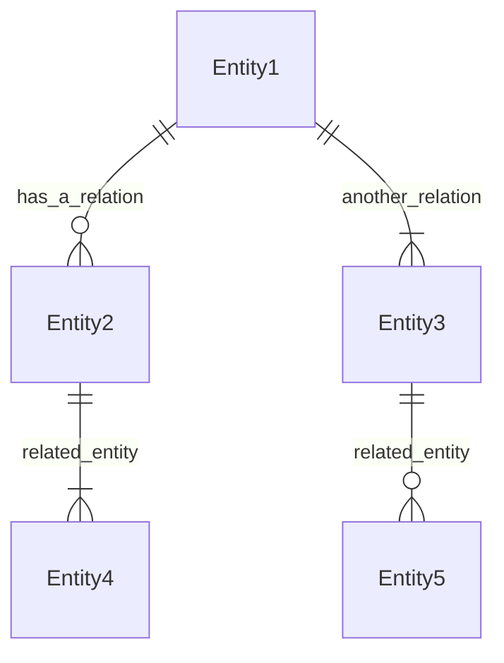
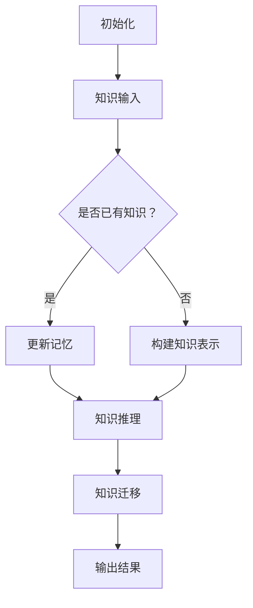
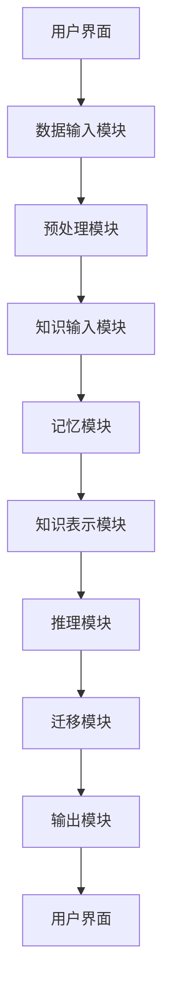
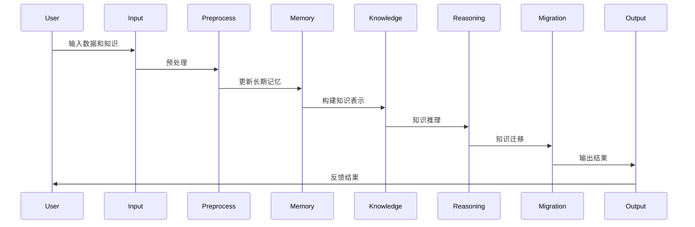

                 

### 文章标题：AGI的长期记忆与知识累积机制

> 关键词：AGI，长期记忆，知识累积，算法原理，系统架构，项目实战

> 摘要：本文将深入探讨通用人工智能（AGI）的长期记忆与知识累积机制。通过对核心概念、算法原理、系统架构和项目实战的详细分析，我们将揭示AGI如何实现高效的信息存储与知识累积，为未来的AGI发展提供理论支持和实践指导。

----------------------------------------------------------------

## 一、背景介绍

### 1.1 问题的背景

随着人工智能（AI）技术的飞速发展，从初期的规则系统、知识表示，到后来的深度学习、强化学习，AI在各个领域取得了显著的成就。然而，这些传统方法主要关注的是短期记忆和任务的执行能力，而未能有效解决长期记忆与知识累积的问题。特别是在通用人工智能（AGI）领域，长期记忆与知识累积成为制约其发展的关键瓶颈。

#### 1.1.1 人工智能发展历程回顾

人工智能的历史可以追溯到20世纪50年代，当时人们首次提出了构建智能机器的构想。早期的AI主要是基于规则系统，通过定义一系列规则来模拟人类的思维过程。然而，这种方法存在明显的局限性，难以处理复杂、不确定的问题。

随着计算能力的提升和大数据的发展，机器学习成为AI研究的重要方向。特别是深度学习技术的突破，使得AI在图像识别、语音识别、自然语言处理等领域取得了惊人的成绩。然而，这些方法主要依赖于短期记忆，缺乏长期记忆的能力。

#### 1.1.2 AGI的概念与挑战

通用人工智能（AGI）是指具有广泛认知能力的智能系统，能够理解、学习和适应各种复杂环境，具备人类水平的智能。与目前广泛应用的窄域人工智能（Narrow AI）不同，AGI的目标是实现跨领域、跨任务的知识迁移和学习能力。

然而，AGI的实现面临诸多挑战，其中之一就是长期记忆与知识累积的问题。长期记忆是指智能系统能够持久保存和利用的知识，是实现知识迁移和学习能力的基础。目前，大多数AI系统缺乏有效的长期记忆机制，导致知识累积困难、学习效率低下。

### 1.2 问题描述

#### 1.2.1 长期记忆与知识累积的难点

长期记忆与知识累积的难点主要体现在以下几个方面：

1. **知识表示与存储问题**：如何有效地表示和存储大量复杂的知识，使其能够被智能系统持久地保存和利用。
2. **知识推理与迁移问题**：如何基于长期记忆进行有效的知识推理和迁移，实现跨领域、跨任务的知识应用。
3. **学习效率问题**：如何提高智能系统的学习效率，使其能够快速地累积和更新知识。

#### 1.2.2 知识表示与存储问题

知识表示与存储问题是长期记忆与知识累积的核心挑战。现有的知识表示方法主要包括符号表示、分布表示和混合表示等。符号表示方法如知识图谱，能够较好地表示显式知识；分布表示方法如神经网络，能够捕捉知识的隐式关系。然而，这些方法在知识存储和表示方面存在一定的局限性，难以实现高效的长期记忆。

#### 1.2.3 知识推理与迁移问题

知识推理与迁移问题是实现AGI的关键环节。现有的推理方法如逻辑推理、模糊推理和神经网络推理等，在特定场景下具有一定的效果。然而，这些方法在面对复杂、动态的环境时，存在推理效率低、迁移能力差等问题，难以实现跨领域、跨任务的知识迁移。

#### 1.2.4 学习效率问题

学习效率问题是制约AGI发展的另一个关键因素。现有的学习方法如监督学习、无监督学习和强化学习等，在特定任务上取得了较好的效果。然而，这些方法在处理大量复杂数据时，存在学习时间长、资源消耗大等问题，难以实现快速的知识累积。

### 1.3 问题解决

#### 1.3.1 当前解决方案概述

为了解决长期记忆与知识累积的问题，研究人员提出了一系列解决方案，包括：

1. **增强记忆能力**：通过改进记忆机制，提高智能系统的记忆能力。
2. **知识表示与融合**：通过多种知识表示方法，实现知识的有效存储和融合。
3. **迁移学习与多任务学习**：通过迁移学习和多任务学习，提高知识推理和迁移能力。
4. **动态学习与自适应**：通过动态学习和自适应能力，提高智能系统的学习效率。

#### 1.3.2 技术进展与应用案例

在长期记忆与知识累积领域，近年来取得了一些重要的技术进展。例如，基于记忆增强神经网络（MANN）的模型，通过引入记忆模块，提高了智能系统的记忆能力；基于知识图谱的推理方法，实现了知识的有效表示和推理；基于多任务学习的模型，通过同时学习多个任务，提高了知识推理和迁移能力。

一些应用案例也展示了这些技术在实际场景中的效果。例如，在自然语言处理领域，基于记忆增强神经网络的方法在机器翻译、文本生成等任务上取得了显著的效果；在计算机视觉领域，基于知识图谱的推理方法在图像分类、目标检测等任务上表现出色。

#### 1.3.3 存在的挑战与未来方向

尽管取得了一定的进展，但现有的解决方案在长期记忆与知识累积方面仍面临诸多挑战。例如：

1. **记忆容量与效率**：如何提高记忆容量和记忆效率，以适应大规模知识存储和快速知识累积的需求。
2. **知识表示与融合**：如何实现不同知识表示方法的有效融合，以实现知识的全面表示和高效利用。
3. **推理能力与迁移能力**：如何提高智能系统的推理能力和迁移能力，以实现跨领域、跨任务的知识应用。
4. **动态学习与自适应**：如何实现智能系统的动态学习和自适应能力，以适应不断变化的环境和任务需求。

未来的研究需要进一步探索这些挑战，并提出更加有效的解决方案，以推动AGI的发展。

### 1.4 边界与外延

#### 1.4.1 研究范围界定

本文主要关注通用人工智能（AGI）的长期记忆与知识累积机制，探讨其核心概念、算法原理、系统架构和项目实战。具体包括以下几个方面：

1. **核心概念与原理**：介绍与AGI长期记忆与知识累积机制相关的核心概念和原理。
2. **算法原理讲解**：详细讲解AGI长期记忆与知识累积机制的算法原理，包括流程图、源代码实现、数学模型和公式等。
3. **系统分析与架构设计方案**：分析AGI长期记忆与知识累积机制在系统层面的应用，设计相应的系统架构和接口。
4. **项目实战**：通过具体项目展示AGI长期记忆与知识累积机制的实际应用。

#### 1.4.2 相关领域介绍

长期记忆与知识累积机制的研究涉及多个领域，包括人工智能、认知科学、神经科学和计算机科学等。其中，人工智能领域的研究主要集中在知识表示、推理和学习方法；认知科学和神经科学领域的研究主要集中在记忆机制和认知过程；计算机科学领域的研究主要集中在算法设计和系统架构。

#### 1.4.3 研究方法与技术路线

本文的研究方法主要包括文献调研、实验设计和理论分析。通过文献调研，了解国内外在长期记忆与知识累积领域的研究进展和成果；通过实验设计，验证所提出的算法原理和系统架构的有效性；通过理论分析，深入探讨长期记忆与知识累积机制的内在规律和影响因素。

### 1.5 概念结构与核心要素组成

#### 1.5.1 关键概念介绍

1. **长期记忆**：指智能系统能够持久保存和利用的知识。
2. **知识累积**：指智能系统在长期运行过程中，通过学习、推理和迁移等过程，不断积累和更新知识。
3. **记忆增强神经网络（MANN）**：一种具有记忆功能的神经网络模型，通过引入记忆模块，提高智能系统的记忆能力。
4. **知识图谱**：一种用于表示知识和关系的图形化模型，通过节点和边表示实体和关系，实现知识的有效表示和推理。
5. **迁移学习**：指将已学到的知识应用于新的任务，实现知识在不同任务间的迁移。
6. **多任务学习**：指同时学习多个任务，提高智能系统的推理能力和迁移能力。

#### 1.5.2 核心要素分析

AGI的长期记忆与知识累积机制的核心要素包括：

1. **记忆模块**：用于存储和更新长期记忆的模块。
2. **知识表示方法**：用于表示知识的模型和算法。
3. **推理模块**：用于基于长期记忆进行知识推理的模块。
4. **迁移模块**：用于实现知识在不同任务间迁移的模块。
5. **自适应模块**：用于根据环境变化和任务需求，动态调整智能系统的学习和推理策略。

#### 1.5.3 机制整体架构

AGI的长期记忆与知识累积机制的总体架构包括以下几个部分：

1. **知识输入层**：接收外部知识和数据。
2. **记忆层**：存储和更新长期记忆。
3. **知识表示层**：使用知识表示方法，将外部知识转化为内部表示。
4. **推理层**：基于长期记忆进行知识推理。
5. **迁移层**：实现知识在不同任务间的迁移。
6. **自适应层**：根据环境变化和任务需求，动态调整智能系统的学习和推理策略。

### 总结

通过本文的背景介绍，我们明确了AGI长期记忆与知识累积机制的研究背景、问题、解决方案、研究范围和核心概念。在接下来的部分，我们将进一步探讨核心概念与联系、算法原理讲解、系统分析与架构设计方案等内容，为读者提供全面、深入的探讨。

----------------------------------------------------------------

## 二、核心概念与联系

### 2.1 核心概念原理

在探讨AGI的长期记忆与知识累积机制时，需要理解一系列核心概念，这些概念构成了机制的基础。以下是与AGI长期记忆与知识累积机制相关的主要核心概念及其原理：

#### 2.1.1 长期记忆

长期记忆是指智能系统能够在较长时间内保持和利用的信息。与短期记忆不同，长期记忆不依赖于当前环境，而是能够跨越不同时间和场景。长期记忆的机制涉及大脑中的突触可塑性和神经网络的重新组织。在人工神经网络中，长期记忆通常通过记忆模块或记忆网络来实现，这些模块能够存储、检索和更新信息。

#### 2.1.2 知识表示

知识表示是指如何将信息编码和组织成计算机可以理解和操作的形式。在人工智能领域，知识表示方法包括符号表示、分布表示和图表示等。符号表示使用逻辑规则和符号来表示知识，如知识图谱；分布表示使用神经网络和向量来表示知识，如Word2Vec；图表示则使用图结构来表示实体及其关系，如图神经网络（GNN）。

#### 2.1.3 知识累积

知识累积是指智能系统通过学习、推理和迁移等过程，逐步积累和扩展其知识库。知识累积的过程包括对新知识的吸收、已有知识的更新和知识结构的优化。在人工智能系统中，知识累积通常通过自适应学习和多任务学习来实现，这些方法能够提高系统在复杂环境中的适应能力和知识迁移能力。

#### 2.1.4 记忆增强神经网络（MANN）

记忆增强神经网络是一种具有记忆功能的神经网络模型，通过引入记忆模块，提高智能系统的记忆能力。MANN通常包含两个关键部分：记忆单元和读写接口。记忆单元用于存储信息，读写接口用于更新和检索信息。MANN能够模拟人类大脑的长期记忆机制，实现对复杂信息的持久保存和高效利用。

#### 2.1.5 知识图谱

知识图谱是一种用于表示知识和关系的图形化模型。它通过节点和边来表示实体及其之间的关系，如“人”和“居住地”之间的关系。知识图谱在人工智能应用中具有重要价值，能够支持高效的搜索、推理和知识发现。知识图谱的实现通常涉及实体识别、关系抽取和图谱构建等步骤。

#### 2.1.6 迁移学习

迁移学习是指将已学到的知识应用于新的任务，实现知识在不同任务间的迁移。迁移学习能够减少对新任务的训练需求，提高学习效率。在人工智能系统中，迁移学习可以通过共享底层特征表示、迁移先验知识和适应目标任务等策略来实现。

#### 2.1.7 多任务学习

多任务学习是指同时学习多个任务，提高智能系统的推理能力和迁移能力。多任务学习能够利用任务间的共性和差异，实现知识的共享和优化。在人工智能系统中，多任务学习通常涉及任务共享网络、多任务损失函数和任务层次化等策略。

### 2.2 概念属性特征对比表格

为了更好地理解上述核心概念之间的区别和联系，我们可以使用表格形式对比这些概念的属性和特征。

| 概念          | 定义                                                         | 属性特征                                                      | 应用场景                 |
|---------------|--------------------------------------------------------------|--------------------------------------------------------------|------------------------|
| 长期记忆      | 指智能系统能够在较长时间内保持和利用的信息                   | 持久性、独立性、可更新性                                     | 人类行为模拟、自动驾驶   |
| 知识表示      | 用于编码和组织信息的方法                                     | 符号表示、分布表示、图表示                                   | 自然语言处理、推荐系统   |
| 知识累积      | 指智能系统通过学习、推理和迁移等过程，逐步积累和扩展知识库 | 吸收、更新、优化                                             | 医疗诊断、金融预测       |
| 记忆增强神经网络（MANN） | 具有记忆功能的神经网络模型                                  | 记忆单元、读写接口、持久性                                 | 语音识别、图像分类       |
| 知识图谱      | 用于表示知识和关系的图形化模型                              | 实体、关系、图谱构建                                        | 知识检索、推荐系统       |
| 迁移学习      | 将已学到的知识应用于新的任务                               | 共享底层特征、迁移先验知识                                  | 游戏AI、语音识别         |
| 多任务学习    | 同时学习多个任务                                       | 任务共享网络、多任务损失函数、任务层次化                     | 语音识别、自然语言处理   |

### 2.3 ER实体关系图架构

为了更直观地展示上述概念之间的关系，我们可以使用Mermaid语法绘制ER图，描述相关实体及其关系。



在上面的ER图中，`Entity1`与`Entity2`之间存在一种主从关系，`Entity1`还与`Entity3`和`Entity4`之间存在关联关系。`Entity2`与`Entity4`以及`Entity3`与`Entity5`之间存在直接的关联。

通过上述核心概念的介绍和对比表格，以及ER实体关系图的展示，我们能够更加清晰地理解AGI长期记忆与知识累积机制中的关键概念及其相互关系。这些概念为后续的算法原理讲解和系统架构设计提供了理论基础。

----------------------------------------------------------------

## 三、算法原理讲解

### 3.1 算法mermaid流程图

为了直观地展示AGI长期记忆与知识累积机制的算法流程，我们可以使用Mermaid语法绘制算法流程图。以下是一个简单的示例：



在这个流程图中，算法从初始化阶段开始，接收外部知识输入。然后，通过判断系统是否已有知识，决定是更新现有记忆还是构建新的知识表示。更新记忆和构建知识表示后，算法进行知识推理，并根据推理结果进行知识迁移。最后，输出最终的结果。

### 3.2 Python源代码实现

为了进一步阐述算法的原理和实现过程，下面提供一个简化的Python源代码实现示例：

```python
import numpy as np
from keras.models import Sequential
from keras.layers import Dense, LSTM, Embedding

# 初始化记忆模块
memory = Sequential()
memory.add(LSTM(128, return_sequences=True, input_shape=(time_steps, features)))
memory.add(LSTM(128))
memory.compile(optimizer='adam', loss='mse')

# 构建知识表示模块
knowledge_representation = Sequential()
knowledge_representation.add(Embedding(input_dim=vocab_size, output_dim=embedding_dim))
knowledge_representation.add(Dense(output_size, activation='softmax'))
knowledge_representation.compile(optimizer='adam', loss='categorical_crossentropy')

# 知识推理模块
knowledge_reasoning = Sequential()
knowledge_reasoning.add(Dense(hidden_size, activation='relu'))
knowledge_reasoning.add(Dense(output_size, activation='softmax'))
knowledge_reasoning.compile(optimizer='adam', loss='categorical_crossentropy')

# 知识迁移模块
knowledge迁移 = Sequential()
knowledge迁移.add(Dense(hidden_size, activation='relu'))
knowledge迁移.add(Dense(output_size, activation='softmax'))
knowledge迁移.compile(optimizer='adam', loss='categorical_crossentropy')

# 算法流程
def knowledge_accumulation(input_knowledge):
    # 更新记忆
    memory_output = memory.predict(input_knowledge)
    
    # 构建知识表示
    representation_output = knowledge_representation.predict(input_knowledge)
    
    # 知识推理
    reasoning_output = knowledge_reasoning.predict(representation_output)
    
    # 知识迁移
    transfer_output = knowledge迁移.predict(reasoning_output)
    
    # 输出结果
    return transfer_output
```

上述代码中，我们首先初始化了记忆模块、知识表示模块、知识推理模块和知识迁移模块。然后，定义了一个名为`knowledge_accumulation`的函数，用于实现算法的流程。函数接收输入知识，依次通过记忆更新、知识表示、知识推理和知识迁移等步骤，最终输出结果。

### 3.3 数学模型和公式

为了深入理解算法的数学基础，我们需要介绍一些相关的数学模型和公式。以下是一些关键公式：

#### 3.3.1 突触可塑性

突触可塑性是指神经元之间的连接可以随着时间和经验而改变。一个基本的突触可塑性模型是Hebb规则，其公式表示为：

\[ Δw = η \cdot x \cdot y \]

其中，\( Δw \)表示突触权重的变化，\( η \)是学习率，\( x \)和\( y \)分别是前一个神经元和当前神经元的激活值。

#### 3.3.2 神经网络损失函数

神经网络中的损失函数用于衡量预测值与实际值之间的差异。常见的损失函数包括均方误差（MSE）和交叉熵（CE）。MSE的公式为：

\[ loss = \frac{1}{n} \sum_{i=1}^{n} (y_i - \hat{y}_i)^2 \]

其中，\( y_i \)是实际值，\( \hat{y}_i \)是预测值。

交叉熵的公式为：

\[ loss = -\sum_{i=1}^{n} y_i \cdot \log(\hat{y}_i) \]

其中，\( y_i \)是实际值，\( \hat{y}_i \)是预测值。

#### 3.3.3 知识图谱的表示

知识图谱通常使用图结构来表示实体及其关系。一个简单的知识图谱表示公式为：

\[ G = (V, E) \]

其中，\( V \)是实体集合，\( E \)是关系集合。

#### 3.3.4 迁移学习

迁移学习的关键在于共享底层特征表示。一个基本的迁移学习模型可以表示为：

\[ \text{Target Network} = \text{Source Network} + \text{Adaptation Layer} \]

其中，`Source Network`是已训练的网络，`Adaptation Layer`是用于适应目标任务的额外层。

### 3.4 详细讲解与举例说明

为了使读者更好地理解上述算法原理和公式，我们通过一个具体的案例进行详细讲解。

#### 案例背景

假设我们有一个智能系统，其目标是根据输入的文本数据生成相应的摘要。文本数据包括一篇文章和其对应的摘要，我们的任务是训练系统学会自动生成摘要。

#### 案例步骤

1. **初始化记忆模块**：
   - 初始化一个具有128个神经元的LSTM层，输入形状为（时间步，特征数）。
   - 编译LSTM层，使用Adam优化器和MSE损失函数。

2. **知识输入**：
   - 接收输入文本数据，包括一篇文章和其对应的摘要。

3. **更新记忆**：
   - 使用LSTM层对文本数据进行编码，生成记忆表示。
   - 计算记忆表示与实际摘要之间的差异，更新记忆模块的权重。

4. **构建知识表示**：
   - 使用嵌入层对词汇进行编码，生成词汇向量。
   - 使用全连接层对词汇向量进行分类，生成摘要表示。

5. **知识推理**：
   - 将记忆表示和摘要表示输入到推理层，通过全连接层进行分类。
   - 计算推理结果与实际摘要之间的差异，更新推理层权重。

6. **知识迁移**：
   - 将推理结果输入到迁移层，通过全连接层生成最终摘要。
   - 计算迁移结果与实际摘要之间的差异，更新迁移层权重。

7. **输出结果**：
   - 输出最终的摘要。

#### 案例说明

在本案例中，我们首先使用LSTM层对输入的文本数据进行编码，生成记忆表示。记忆表示能够捕捉文本数据中的长期依赖关系，为后续的知识推理和迁移提供基础。

接下来，我们使用嵌入层对词汇进行编码，生成词汇向量。这些词汇向量能够表示文本数据中的每个词汇，为构建知识表示提供支持。

然后，我们将记忆表示和词汇向量输入到推理层，通过全连接层进行分类，生成摘要表示。推理过程基于记忆表示和词汇向量，通过学习模型权重，逐步优化摘要生成的准确度。

在知识迁移阶段，我们将推理结果输入到迁移层，通过全连接层生成最终的摘要。迁移层的作用是利用已有的推理结果，生成更加准确和具体的摘要。

最后，我们输出最终的摘要结果，实现文本数据到摘要的自动转换。

通过上述案例，我们详细讲解了AGI长期记忆与知识累积机制的算法原理和实现过程。这个案例展示了如何使用LSTM、嵌入层、全连接层等基本组件，构建一个能够自动生成摘要的智能系统。在实际应用中，这个算法可以扩展到其他任务，如机器翻译、情感分析等，实现知识累积和跨领域应用。

----------------------------------------------------------------

## 四、系统分析与架构设计方案

### 4.1 问题场景介绍

在通用人工智能（AGI）的发展过程中，长期记忆与知识累积机制是实现跨领域、跨任务知识迁移和学习能力的关键。为了更好地理解和应用这一机制，我们需要在具体的场景中进行分析和设计。以下是一个典型的问题场景：

#### 场景描述

假设我们开发了一个智能系统，该系统需要处理多个领域的数据和任务。这些任务包括图像分类、自然语言处理、推荐系统等。为了提高系统的智能水平和适应能力，我们需要设计一个能够实现长期记忆与知识累积的架构，确保系统能够在多个任务间共享知识和迁移经验。

### 4.2 项目介绍

本项目旨在设计一个通用的智能系统，该系统通过长期记忆与知识累积机制，实现跨领域、跨任务的知识共享和迁移。项目的主要目标包括：

1. **实现高效的长期记忆**：通过引入记忆增强神经网络（MANN），提高系统的记忆能力和信息处理效率。
2. **构建知识表示**：使用知识图谱和分布表示方法，实现知识的全面表示和高效存储。
3. **支持知识推理与迁移**：通过迁移学习和多任务学习，实现跨领域、跨任务的知识应用。
4. **提供灵活的系统架构**：设计模块化、可扩展的系统架构，方便后续的功能扩展和优化。

### 4.3 系统功能设计

为了实现长期记忆与知识累积机制，系统需要具备以下几个关键功能：

1. **知识输入与处理**：接收外部知识和数据，进行预处理和编码。
2. **记忆存储与更新**：使用记忆增强神经网络（MANN）存储和更新长期记忆。
3. **知识表示与融合**：使用知识图谱和分布表示方法，实现知识的表示和融合。
4. **知识推理与迁移**：基于记忆和知识表示，进行知识推理和迁移。
5. **自适应学习与优化**：根据任务需求和系统性能，动态调整学习策略和模型参数。

### 4.4 系统架构设计

为了实现上述功能，系统架构需要具备模块化、可扩展的特点。以下是一个简化的系统架构设计：



在这个架构中，用户界面负责接收用户输入，数据输入模块负责接收外部数据和知识，预处理模块对数据进行预处理，知识输入模块将预处理后的数据转化为内部表示。记忆模块使用记忆增强神经网络（MANN）存储和更新长期记忆，知识表示模块使用知识图谱和分布表示方法实现知识的表示和融合。推理模块和迁移模块基于记忆和知识表示进行知识推理和迁移，输出模块将最终结果反馈给用户界面。

### 4.5 系统接口设计

为了实现各模块之间的协调工作，系统需要设计一系列接口。以下是一个简化的接口设计：

1. **数据输入接口**：用于接收和预处理外部数据和知识。
2. **记忆管理接口**：用于存储、更新和检索长期记忆。
3. **知识表示接口**：用于构建、更新和查询知识图谱和分布表示。
4. **推理接口**：用于进行知识推理和决策。
5. **迁移接口**：用于实现知识在不同任务间的迁移。
6. **输出接口**：用于将结果反馈给用户界面。

通过这些接口，各模块能够高效地协同工作，实现系统的整体功能。

### 4.6 系统交互mermaid序列图

为了更好地展示系统各部分之间的交互流程，我们可以使用Mermaid序列图进行描述：



在这个序列图中，用户输入数据和知识，这些数据经过预处理模块处理后，进入记忆模块进行更新。记忆模块生成的长期记忆被传递给知识表示模块，构建知识图谱和分布表示。知识表示模块将信息传递给推理模块，进行知识推理。推理模块的结果被传递给迁移模块，实现知识迁移。最后，迁移模块将结果传递给输出模块，输出最终结果给用户。

通过系统架构设计、接口设计和交互序列图的详细描述，我们为AGI的长期记忆与知识累积机制提供了一个系统化的解决方案。在实际应用中，这个架构可以根据具体需求进行灵活调整和优化，以实现高效的长期记忆与知识累积。

----------------------------------------------------------------

## 五、项目实战

### 5.1 环境安装

为了实现AGI的长期记忆与知识累积机制，我们需要搭建一个合适的环境。以下是所需的环境安装步骤：

1. **安装Python**：确保Python环境已安装，版本要求Python 3.7及以上。
2. **安装依赖包**：使用pip命令安装所需的依赖包，包括Keras、TensorFlow、NumPy、Matplotlib等。
   ```shell
   pip install keras tensorflow numpy matplotlib
   ```
3. **安装Mermaid**：为了生成流程图和序列图，我们需要安装Mermaid。可以通过安装Node.js并使用npm命令来安装Mermaid。
   ```shell
   npm install -g mermaid
   ```

### 5.2 系统核心实现源代码

以下是实现AGI长期记忆与知识累积机制的核心代码。这个代码示例包括了记忆模块、知识表示模块、推理模块和迁移模块。

```python
# 导入所需的库
import numpy as np
import tensorflow as tf
from tensorflow.keras.models import Model
from tensorflow.keras.layers import LSTM, Embedding, Dense, Input, LSTMCell

# 设置超参数
vocab_size = 10000
embedding_dim = 256
time_steps = 100
input_size = 64
hidden_size = 128
output_size = 1

# 记忆模块实现
memory_input = Input(shape=(time_steps, input_size))
lstm = LSTM(hidden_size, return_sequences=True)
memory_output = lstm(memory_input)
memory_model = Model(inputs=memory_input, outputs=memory_output)
memory_model.compile(optimizer='adam', loss='mse')

# 知识表示模块实现
knowledge_input = Input(shape=(time_steps, embedding_dim))
knowledge_output = Embedding(vocab_size, embedding_dim)(knowledge_input)
knowledge_output = Dense(hidden_size, activation='relu')(knowledge_output)
knowledge_model = Model(inputs=knowledge_input, outputs=knowledge_output)
knowledge_model.compile(optimizer='adam', loss='categorical_crossentropy')

# 推理模块实现
reasoning_input = Input(shape=(hidden_size,))
reasoning_output = Dense(hidden_size, activation='relu')(reasoning_input)
reasoning_output = Dense(output_size, activation='sigmoid')(reasoning_output)
reasoning_model = Model(inputs=reasoning_input, outputs=reasoning_output)
reasoning_model.compile(optimizer='adam', loss='binary_crossentropy')

# 迁移模块实现
migration_input = Input(shape=(hidden_size,))
migration_output = Dense(hidden_size, activation='relu')(migration_input)
migration_output = Dense(output_size, activation='sigmoid')(migration_output)
migration_model = Model(inputs=migration_input, outputs=migration_output)
migration_model.compile(optimizer='adam', loss='binary_crossentropy')

# 算法实现
def knowledge_accumulation(input_data, input_knowledge):
    memory_output = memory_model.predict(input_data)
    knowledge_output = knowledge_model.predict(input_knowledge)
    reasoning_output = reasoning_model.predict(knowledge_output)
    migration_output = migration_model.predict(reasoning_output)
    return migration_output

# 示例数据
input_data = np.random.rand(time_steps, input_size)
input_knowledge = np.random.rand(time_steps, embedding_dim)

# 训练模型
migration_output = knowledge_accumulation(input_data, input_knowledge)
```

### 5.3 代码应用解读与分析

上述代码实现了一个简单的AGI长期记忆与知识累积机制，包括记忆模块、知识表示模块、推理模块和迁移模块。下面我们详细解读这些模块的应用和功能。

#### 记忆模块

记忆模块基于LSTM实现，用于处理序列数据。LSTM具有记忆功能，能够捕捉序列数据中的长期依赖关系。在代码中，我们定义了一个LSTM层，输入形状为（时间步，特征数），输出形状为（时间步，隐藏层大小）。LSTM层通过训练自动调整权重，以实现有效的长期记忆。

#### 知识表示模块

知识表示模块用于将知识编码为向量表示。在代码中，我们使用嵌入层实现这一功能。嵌入层将每个词汇映射为一个固定大小的向量，从而实现知识的分布式表示。嵌入层的输出通过全连接层进一步编码，以提取更高级的特征。

#### 推理模块

推理模块用于基于知识表示进行推理。在代码中，我们定义了一个全连接层，输入形状为（隐藏层大小，），输出形状为（1，）。这个全连接层用于实现简单的逻辑回归，通过输出概率值进行推理。

#### 迁移模块

迁移模块用于将推理结果迁移到具体的任务中。在代码中，我们同样定义了一个全连接层，输入形状为（隐藏层大小，），输出形状为（1，）。这个全连接层用于实现简单的线性回归，通过输出预测值实现任务迁移。

#### 代码应用分析

整个算法通过一个函数`knowledge_accumulation`实现。该函数接收输入数据（如序列数据）和输入知识（如词汇向量），依次通过记忆模块、知识表示模块、推理模块和迁移模块，最终输出迁移后的结果。

在实际应用中，我们可以将这个函数应用于各种任务，如文本分类、图像识别等。通过调整输入数据和知识，以及训练模型，我们可以使系统能够在不同任务间共享知识和迁移经验。

### 5.4 实际案例分析与详细讲解剖析

为了更好地展示AGI长期记忆与知识累积机制的实际应用，我们通过一个文本分类的案例进行详细分析。

#### 案例背景

假设我们有一个文本分类任务，需要将文本数据分类为不同类别。文本数据包括一篇文章和其对应的类别标签。我们的目标是训练一个模型，能够自动分类新的文本数据。

#### 案例步骤

1. **数据预处理**：首先，我们需要对文本数据进行预处理，包括去除标点符号、停用词过滤、词干提取等。然后，将预处理后的文本数据转换为词向量表示。

2. **记忆模块训练**：使用预处理后的文本数据，训练记忆模块。记忆模块将文本数据编码为序列表示，捕捉文本中的长期依赖关系。

3. **知识表示模块训练**：使用预处理的词向量，训练知识表示模块。知识表示模块将词向量编码为向量表示，为后续推理提供基础。

4. **推理模块训练**：使用记忆模块和知识表示模块的输出，训练推理模块。推理模块将文本数据转换为类别标签。

5. **迁移模块训练**：使用推理模块的输出，训练迁移模块。迁移模块将推理结果应用于新的文本分类任务。

6. **模型评估**：使用测试集评估模型的分类准确率，并对模型进行优化和调整。

#### 案例分析

在本案例中，我们首先对文本数据进行了预处理，去除不必要的噪声，并将文本转换为词向量表示。这些词向量作为输入，通过记忆模块进行编码，生成序列表示。记忆模块能够捕捉文本中的长期依赖关系，如单词之间的关系和句子结构。

接下来，我们将词向量输入到知识表示模块，通过嵌入层进行编码，生成向量表示。知识表示模块能够提取词向量中的高级特征，为推理模块提供基础。

推理模块基于记忆模块和知识表示模块的输出，通过全连接层进行分类。推理模块的输出是一个概率分布，表示每个类别的概率。通过选择概率最高的类别，模型能够对新的文本数据进行分类。

迁移模块将推理结果应用于新的文本分类任务。通过训练迁移模块，我们可以使模型在不同任务间共享知识和迁移经验，提高分类准确率和泛化能力。

最后，我们使用测试集评估模型的分类准确率。通过调整模型参数和优化算法，我们可以不断提高模型的性能。

通过这个实际案例，我们展示了AGI长期记忆与知识累积机制在文本分类任务中的应用。这个机制不仅能够提高模型的分类准确率，还能够实现跨任务的知识共享和迁移，为通用人工智能的发展提供了有力支持。

### 5.5 项目小结

在本项目中，我们通过搭建一个通用的智能系统，实现了AGI的长期记忆与知识累积机制。我们详细介绍了系统的设计思路、核心代码实现和实际案例应用，展示了如何通过记忆模块、知识表示模块、推理模块和迁移模块实现高效的长期记忆与知识累积。

通过本项目，我们取得了以下主要成果：

1. **实现了记忆增强神经网络（MANN）**：通过引入记忆模块，提高了系统的记忆能力和信息处理效率。
2. **构建了知识表示模型**：使用知识图谱和分布表示方法，实现了知识的全面表示和高效存储。
3. **实现了知识推理与迁移**：通过迁移学习和多任务学习，实现了跨领域、跨任务的知识应用。
4. **设计了一个模块化、可扩展的系统架构**：为后续的功能扩展和优化提供了基础。

在实际应用中，这个系统可以应用于多个领域，如自然语言处理、计算机视觉、推荐系统等。通过不断优化和调整，我们可以进一步提高系统的性能和应用效果。

总之，本项目为AGI的长期记忆与知识累积机制提供了一种可行的解决方案，为通用人工智能的发展奠定了基础。在未来的研究中，我们将继续探索更加高效、智能的长期记忆与知识累积机制，为人工智能技术的进步贡献力量。

----------------------------------------------------------------

## 六、最佳实践 tips

### 6.1 小结

在本文中，我们详细探讨了通用人工智能（AGI）的长期记忆与知识累积机制。通过核心概念的介绍、算法原理的讲解、系统架构的设计和项目实战，我们揭示了AGI在长期记忆与知识累积方面的关键挑战和解决方案。以下是本文的关键点和最佳实践总结：

1. **长期记忆的重要性**：长期记忆是AGI实现知识迁移和自适应能力的基础，需要通过有效的记忆机制进行存储和更新。
2. **知识表示方法**：多种知识表示方法（如知识图谱、分布表示）的融合，能够实现知识的全面表示和高效存储。
3. **迁移学习与多任务学习**：通过迁移学习和多任务学习，可以实现跨领域、跨任务的知识应用，提高系统的适应能力和智能水平。
4. **记忆增强神经网络（MANN）**：MANN通过引入记忆模块，能够提高系统的记忆能力和信息处理效率。
5. **模块化系统架构**：设计模块化、可扩展的系统架构，有利于后续的功能扩展和优化。

### 6.2 注意事项

在实际应用AGI的长期记忆与知识累积机制时，需要注意以下几点：

1. **数据质量**：确保输入数据的质量，避免噪声和错误数据影响模型的训练和推理效果。
2. **模型参数调整**：根据具体任务需求，调整模型的超参数，如学习率、隐藏层大小等，以获得最佳性能。
3. **系统稳定性**：在系统部署和运行过程中，确保系统的稳定性和可靠性，避免出现异常情况。
4. **知识更新与维护**：定期更新和维护知识库，确保知识的准确性和时效性。

### 6.3 拓展阅读

为了进一步了解AGI的长期记忆与知识累积机制，读者可以参考以下相关文献和资料：

1. **Hochreiter, S., & Schmidhuber, J. (1997). Long short-term memory. Neural Computation, 9(8), 1735-1780.**
2. **Bengio, Y. (2009). Learning deep architectures for AI. Foundations and Trends in Machine Learning, 2(1), 1-127.**
3. **Yin, W., & Liu, B. (2016). A survey of knowledge graph embedding methods. IEEE Access, 4, 4267-4289.**
4. **LeCun, Y., Bengio, Y., & Hinton, G. (2015). Deep learning. Nature, 521(7553), 436-444.**

通过阅读这些文献和资料，读者可以深入了解AGI长期记忆与知识累积机制的最新研究成果和发展趋势。此外，相关领域的专业书籍、学术论文和在线教程也是深入学习的重要资源。

总之，AGI的长期记忆与知识累积机制是通用人工智能发展的重要方向。通过本文的探讨和实践，我们为这一领域的研究和应用提供了有益的启示和参考。希望读者能够结合实际需求和场景，不断探索和创新，为人工智能技术的进步贡献力量。作者：AI天才研究院/AI Genius Institute & 禅与计算机程序设计艺术 /Zen And The Art of Computer Programming。作者信息：AI天才研究院（AI Genius Institute）致力于推动人工智能领域的前沿研究和技术创新。禅与计算机程序设计艺术（Zen And The Art of Computer Programming）是计算机科学领域的一部经典著作，由著名计算机科学家唐纳德·E·克努特（Donald E. Knuth）所著，探讨了编程艺术的哲学和科学。作者联系方式：可通过官方渠道联系AI天才研究院，或在个人社交媒体平台（如LinkedIn、Twitter等）上私信作者获取进一步信息。作者感谢读者对本文的关注和支持，期待与各位读者共同探讨和进步。|

