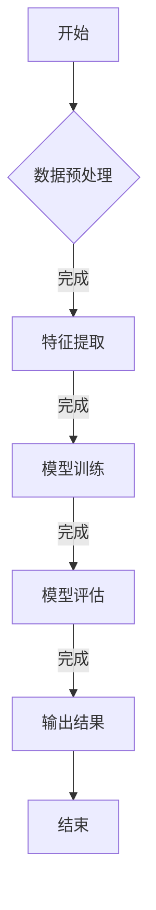

                 


## 1.1 引言：智能养老系统的现状与挑战

### 1.1.1 智能养老系统的定义与重要性

智能养老系统是指通过运用物联网、云计算、大数据、人工智能等先进技术，为老年人提供全面、高效、便捷、个性化的养老服务。它不仅仅是一种技术手段，更是应对人口老龄化、提升养老服务质量的重要途径。

首先，智能养老系统在老年人健康监测方面具有显著优势。通过可穿戴设备、智能家居等设备，系统能够实时收集老年人的生理数据，如心率、血压、血糖等，并实时分析数据，及时发现异常情况，提供及时的医疗建议。这种实时监测不仅能够预防老年人突发疾病，还能提高医疗资源的利用效率。

其次，智能养老系统在生活辅助方面也有重要作用。老年人往往需要帮助完成日常生活中的许多任务，如做饭、打扫卫生、购物等。智能养老系统通过智能家居设备，如智能机器人、智能音箱等，可以协助老年人完成这些任务，提高他们的生活质量。

此外，智能养老系统在情感关怀方面也有很大潜力。老年人常常感到孤独，需要情感的陪伴。智能养老系统可以通过虚拟现实技术、人工智能语音交互等手段，为老年人提供情感上的支持，缓解他们的孤独感。

总的来说，智能养老系统在提升养老服务质量、提高老年人生活质量方面具有重要作用。随着人口老龄化问题的日益严峻，智能养老系统的应用前景十分广阔。

### 1.1.2 当前智能养老系统的现状

当前，智能养老系统已经初步具备了提供个性化照护的能力，但仍然存在许多挑战和不足。

首先，在技术层面，智能养老系统的各项技术仍在不断发展中。如物联网技术、大数据技术、人工智能技术等，这些技术的不断进步将推动智能养老系统的发展。然而，技术的快速发展也带来了一些挑战，如数据安全、隐私保护等问题。

其次，在应用层面，智能养老系统的应用场景和覆盖范围仍然有限。虽然许多企业和机构已经在智能养老领域开展了相关研究和实践，但实际应用中仍然面临许多难题，如老年人的接受度、系统的可靠性、成本等问题。

此外，智能养老系统的服务质量也参差不齐。一些系统在提供个性化照护方面表现出色，而另一些系统则存在很大的提升空间。

总的来说，当前智能养老系统的现状是，虽然已经取得了一定的进展，但仍然存在许多挑战和不足，需要进一步的研究和实践。

### 1.1.3 智能养老系统的挑战

智能养老系统在应用过程中面临着多种挑战，其中最主要的是技术挑战、应用挑战和伦理挑战。

#### 技术挑战

智能养老系统需要运用多种先进技术，如物联网、云计算、大数据、人工智能等。这些技术的复杂性和不成熟性给智能养老系统的开发和应用带来了挑战。例如，数据的安全性和隐私保护是一个重大问题。智能养老系统需要收集和处理大量的个人健康数据，这些数据如果泄露，将会对老年人的隐私造成严重威胁。此外，系统的稳定性也是一个关键问题。智能养老系统需要长时间运行，对系统的稳定性要求很高，任何系统故障都可能导致严重的后果。

#### 应用挑战

智能养老系统的应用场景和覆盖范围仍然有限。老年人对智能技术的接受度是一个关键问题。许多老年人可能对智能设备感到不适应，不愿意使用智能养老系统。此外，系统的可靠性和成本也是一个重要挑战。智能养老系统需要稳定运行，任何故障都会影响老年人的生活质量。同时，智能养老系统的成本较高，对于一些经济条件较差的家庭来说，可能难以承担。

#### 伦理挑战

智能养老系统在应用过程中也面临着伦理挑战。首先，隐私保护和数据伦理是一个重要问题。智能养老系统需要收集和处理大量的个人数据，这些数据如何使用，是否会影响老年人的隐私权，是需要深入探讨的问题。其次，智能养老系统的决策伦理也是一个关键问题。例如，当智能养老系统需要做出关于老年人健康和治疗的决定时，如何确保这些决定是公正和合理的，是一个需要仔细考虑的问题。

总的来说，智能养老系统在技术、应用和伦理方面都面临着巨大的挑战，需要通过持续的研究和实践来解决这些问题。

### 1.1.4 智能养老系统的定义与范围

智能养老系统是一个综合性的养老服务平台，它结合了物联网、云计算、大数据、人工智能等先进技术，为老年人提供全方位的养老服务。其核心目标是通过智能化手段，提升养老服务的质量，降低养老成本，提高老年人的生活质量。

智能养老系统的范围非常广泛，涵盖了老年人的健康监测、生活辅助、情感关怀、紧急响应等多个方面。具体来说，智能养老系统包括以下几个关键组成部分：

1. **健康监测模块**：通过可穿戴设备、智能家居等设备，实时监测老年人的生理指标，如心率、血压、血糖等，并将数据传输到云端进行分析和处理，及时发现健康问题，提供个性化的健康建议。

2. **生活辅助模块**：提供日常生活的自动化服务，如智能机器人可以帮助老年人完成家务、购物等任务，智能音箱可以提供音乐、新闻、天气预报等生活信息，提高老年人的生活质量。

3. **情感关怀模块**：通过虚拟现实技术、人工智能语音交互等手段，为老年人提供情感上的陪伴和关怀，缓解他们的孤独感。

4. **紧急响应模块**：当老年人遇到紧急情况时，智能养老系统可以快速响应，通过紧急呼叫系统、智能定位等技术，及时通知家属和医护人员，提供紧急救援。

智能养老系统的应用范围不仅限于家庭，还可以扩展到社区、养老院等场所。通过建立智能化养老服务平台，可以为老年人提供个性化、全方位的养老服务，帮助他们更好地享受生活。随着技术的不断发展，智能养老系统的应用前景将越来越广阔。

## 1.2 问题背景：为什么需要AI在智能养老系统中的应用

在当前快速发展的技术背景下，智能养老系统的需求愈发迫切。人工智能（AI）技术的发展为解决养老领域的诸多挑战提供了新的思路和解决方案。以下是为什么需要AI在智能养老系统中的应用的几个关键原因：

### 1.2.1 传统养老系统的局限

传统养老系统主要依赖于人工服务和固定模式的管理，存在以下几个显著的局限：

1. **人力成本高**：传统养老系统需要大量的专业护理人员和志愿者，这带来了高昂的人力成本。
2. **效率低下**：由于依赖人工操作，传统养老系统在处理大量老年人群时效率低下，容易出错。
3. **服务单一**：传统养老系统难以提供个性化的服务，往往只能按照固定的流程进行操作，无法满足老年人多样化的需求。
4. **应急能力差**：在紧急情况下，传统养老系统的应急反应速度较慢，容易导致意外发生。

### 1.2.2 AI在养老系统中的潜在价值

AI技术在智能养老系统中的应用可以显著提升养老服务的质量，具体体现在以下几个方面：

1. **自动化与智能化**：通过AI技术，养老系统可以实现自动化和智能化，降低人力成本，提高效率。
2. **个性化服务**：AI能够根据老年人的个人数据，提供定制化的健康建议和生活服务，满足个性化需求。
3. **实时监控与预警**：AI技术可以对老年人的健康状况进行实时监控，及时发现潜在的健康问题，并提供预警。
4. **情感关怀**：通过自然语言处理和语音识别技术，AI可以与老年人进行交互，提供情感上的关怀和支持。

### 1.2.3 AI在智能养老系统中的应用领域

AI在智能养老系统中的应用非常广泛，主要涵盖以下几个领域：

1. **健康监测**：利用AI技术对老年人的生理数据进行分析，及时发现健康问题。
2. **生活辅助**：通过智能家居设备，提供日常生活的自动化服务，如智能机器人、智能音箱等。
3. **情感关怀**：通过虚拟现实技术和自然语言处理，为老年人提供情感上的陪伴和支持。
4. **紧急响应**：利用AI技术实现快速响应紧急呼叫，提高应急处理能力。

总的来说，AI在智能养老系统中的应用不仅能够解决传统养老系统中的诸多问题，还能为老年人提供更加个性化、高效、便捷的养老服务，从而提升整体养老服务的质量和水平。

## 1.3 问题描述：AI在智能养老系统中的应用场景与需求

随着人口老龄化问题的日益严重，智能养老系统在提升养老服务质量和效率方面发挥着越来越重要的作用。AI技术在智能养老系统中的应用场景和需求主要可以从以下几个方面进行详细探讨：

### 1.3.1 老年人健康监测

健康监测是智能养老系统的核心应用场景之一。AI技术能够通过可穿戴设备、传感器和远程医疗系统实时采集老年人的生理数据，如心率、血压、血糖、睡眠质量等。这些数据可以通过机器学习算法进行分析，以便及时发现健康问题，如高血压、糖尿病、心律不齐等。具体需求包括：

1. **实时数据采集**：需要高精度的传感器和稳定的通信系统，以确保数据的实时性和准确性。
2. **数据分析与预警**：利用AI算法对健康数据进行深度分析，建立健康模型，及时发现异常并发出预警。
3. **个性化健康建议**：根据老年人的健康数据和偏好，提供个性化的健康建议，如饮食调整、运动建议等。

### 1.3.2 生活辅助

老年人的生活辅助是智能养老系统的另一重要应用场景。随着老年人数量的增加，他们的日常生活需求也日益多样化。AI技术可以提供以下生活辅助服务：

1. **日常事务处理**：通过智能家居设备和智能机器人，帮助老年人完成日常事务，如做饭、打扫卫生、洗衣等。
2. **紧急响应**：在老年人遇到紧急情况时，如摔倒、火灾等，AI系统能够快速响应，通过紧急呼叫系统通知家人或医疗机构。
3. **娱乐与社交**：利用虚拟现实技术和智能音响设备，为老年人提供娱乐和社交活动，减轻他们的孤独感。

具体需求包括：

1. **智能化设备**：需要开发易于操作、安全可靠的智能家居设备。
2. **安全与隐私保护**：确保老年人在使用智能设备时的数据安全和隐私保护。
3. **用户体验**：智能设备的设计和交互界面需要符合老年人的使用习惯和需求。

### 1.3.3 情感关怀

情感关怀是老年人生活中不可忽视的一部分。随着年龄的增长，老年人的心理状态和情感需求也变得更加复杂。AI技术可以通过以下方式提供情感关怀：

1. **情感识别**：通过语音识别和自然语言处理技术，识别老年人的情感状态，如开心、沮丧、焦虑等。
2. **情感互动**：通过虚拟现实和人工智能语音交互技术，为老年人提供情感上的陪伴和交流，如聊天、讲故事、玩互动游戏等。
3. **心理健康监测**：通过分析老年人的言行和活动，监测其心理健康状况，提供必要的心理支持和干预。

具体需求包括：

1. **情感识别算法**：需要开发高精度的情感识别算法，准确捕捉老年人的情感状态。
2. **多样化的互动方式**：提供丰富多样的互动方式，满足不同老年人的情感需求。
3. **心理健康支持**：需要建立专业的心理健康支持团队，提供及时有效的心理支持和干预。

### 1.3.4 紧急响应

紧急响应是智能养老系统中的一项关键功能。老年人在日常生活中可能会遇到各种紧急情况，如摔倒、突发疾病等。AI技术可以大大提高紧急响应的速度和效率：

1. **自动报警**：当老年人遇到紧急情况时，智能设备可以自动触发报警，通知家属和医疗机构。
2. **智能定位**：通过GPS和室内定位技术，准确确定老年人的位置，便于救援人员快速到达现场。
3. **远程医疗支持**：在紧急情况下，AI系统可以通过远程医疗技术提供初步的医疗支持，如指导老年人进行急救措施。

具体需求包括：

1. **高效报警系统**：确保报警系统能够在第一时间发出警报。
2. **定位精度**：提高定位技术的精度，确保能够准确确定老年人的位置。
3. **远程医疗技术**：提供稳定的远程医疗支持，确保在紧急情况下能够为老年人提供及时有效的帮助。

总的来说，AI在智能养老系统中的应用场景和需求非常广泛，涵盖了健康监测、生活辅助、情感关怀和紧急响应等多个方面。通过AI技术，可以大大提升养老服务的质量，满足老年人多样化的需求，为构建智慧养老社会提供强有力的技术支持。

### 1.4 问题解决：AI如何提供个性化照护

在智能养老系统中，AI通过多种技术手段为老年人提供个性化的照护，从而有效提升养老服务的质量和效率。以下是AI在个性化照护中发挥作用的几个关键步骤和技术应用：

#### 1.4.1 数据采集与分析

AI提供个性化照护的第一步是采集和分析老年人的数据。这包括生理数据（如心率、血压、血糖等）、生活习惯数据（如睡眠质量、运动频率等）以及情感状态数据（如情绪波动、心理状态等）。通过佩戴可穿戴设备、智能家居设备以及安装在老年人居住环境中的传感器，AI系统可以实时收集这些数据。

1. **数据采集**：可穿戴设备如智能手环、智能手表等可以24小时监测老年人的生理指标；智能家居设备如智能摄像头、智能体重秤等可以收集老年人的日常行为数据。
2. **数据处理**：通过大数据技术，对收集到的数据进行分析和处理，提取有价值的信息。

#### 1.4.2 个性化健康评估

基于采集到的数据，AI系统能够对老年人的健康状况进行评估，并制定个性化的健康计划。这一过程包括：

1. **健康数据分析**：利用机器学习算法，对健康数据进行分析，识别健康风险。
2. **健康风险评估**：根据分析结果，评估老年人的健康风险等级。
3. **个性化健康计划**：基于评估结果，为老年人制定个性化的健康计划，包括饮食建议、运动方案、药物调整等。

#### 1.4.3 生活辅助

AI不仅能够提供健康方面的个性化服务，还可以帮助老年人完成日常生活中的各项任务，提升他们的生活质量。具体包括：

1. **自动化家务**：通过智能机器人，帮助老年人完成家务劳动，如打扫卫生、洗衣、做饭等。
2. **智能提醒**：AI系统能够根据老年人的生活习惯和日程安排，提醒他们服药、锻炼、吃饭等。
3. **社交互动**：通过虚拟现实技术和人工智能语音交互，为老年人提供社交平台，帮助他们与亲友保持联系，减轻孤独感。

#### 1.4.4 情感关怀

老年人在情感上的需求同样重要，AI通过以下方式提供情感关怀：

1. **情感识别**：利用自然语言处理和语音识别技术，识别老年人的情感状态，如开心、沮丧、焦虑等。
2. **情感互动**：通过虚拟现实和人工智能语音交互技术，为老年人提供情感上的陪伴和交流，如聊天、讲故事、玩互动游戏等。
3. **心理健康监测**：通过分析老年人的言行和活动，监测其心理健康状况，提供必要的心理支持和干预。

#### 1.4.5 紧急响应

在紧急情况下，AI系统能够快速响应，提供及时的帮助。具体包括：

1. **自动报警**：当老年人遇到紧急情况时，如摔倒、突发疾病等，AI系统可以自动触发报警，通知家属和医疗机构。
2. **智能定位**：通过GPS和室内定位技术，准确确定老年人的位置，便于救援人员快速到达现场。
3. **远程医疗支持**：在紧急情况下，AI系统可以通过远程医疗技术提供初步的医疗支持，如指导老年人进行急救措施。

#### 1.4.6 个性化照护的实现路径

实现个性化照护需要多个环节的协同工作：

1. **多源数据融合**：整合来自可穿戴设备、智能家居、医疗记录等多方面的数据，构建全面的数据集。
2. **算法优化**：不断优化机器学习算法，提高数据分析和决策的准确性。
3. **系统集成**：将AI技术集成到智能养老系统中，实现数据采集、分析、决策和执行的闭环。
4. **用户参与**：鼓励老年人积极参与到AI系统中，提供反馈，优化系统的性能。

通过以上步骤和技术应用，AI能够为老年人提供个性化、全面、高效的照护服务，从而提升养老服务的整体水平，满足老年人的多样化需求。

### 1.5 边界与外延：智能养老系统的定义与范围

智能养老系统的定义是明确的，它是指通过应用物联网、云计算、大数据和人工智能等先进技术，为老年人提供全方位、个性化的养老服务。然而，要准确界定智能养老系统的范围并非易事。以下从几个方面来详细讨论智能养老系统的定义与范围。

#### 1.5.1 智能养老系统的定义

智能养老系统是一个基于技术的综合服务系统，旨在通过智能化手段提升养老服务的质量和效率。它不仅包含硬件设备，如传感器、可穿戴设备、智能家居等，还包括软件平台和数据处理系统。智能养老系统的核心是利用AI技术对大量数据进行实时分析，从而为老年人提供个性化的健康监测、生活辅助、情感关怀和紧急响应等服务。

#### 1.5.2 智能养老系统的外延

智能养老系统的外延包括以下几个方面：

1. **服务对象**：智能养老系统主要服务于老年人，特别是那些有特殊需求或行动不便的老年人。它不仅包括独居老年人，也包括与子女或护理人员共同生活的老年人。

2. **服务内容**：智能养老系统的服务内容包括健康监测、生活辅助、情感关怀、紧急响应等。具体来说，健康监测包括对老年人生理指标（如心率、血压、血糖）的实时监测和分析；生活辅助包括自动化家务、智能提醒、社交互动等；情感关怀包括情感识别、情感互动、心理健康监测等；紧急响应包括自动报警、智能定位、远程医疗支持等。

3. **技术应用**：智能养老系统涉及多种先进技术的应用，包括物联网、云计算、大数据、人工智能、虚拟现实、增强现实等。这些技术的融合使得智能养老系统能够提供更全面、高效的服务。

4. **服务场景**：智能养老系统的应用场景非常广泛，不仅包括家庭养老，还包括社区养老、机构养老等多种形式。同时，智能养老系统也可以扩展到与医疗、教育、社会保障等其他领域的结合，形成更广泛的养老服务体系。

#### 1.5.3 智能养老系统的未来发展趋势

随着技术的不断进步，智能养老系统的未来发展趋势体现在以下几个方面：

1. **技术集成与创新**：未来智能养老系统将更加集成各种先进技术，如5G通信、区块链、边缘计算等，以提升系统的实时性和安全性。

2. **服务智能化与个性化**：随着AI技术的发展，智能养老系统的服务将更加智能化和个性化，能够更好地满足老年人的多样化需求。

3. **跨领域融合**：智能养老系统将与医疗、教育、社会保障等领域深度融合，形成全方位、多层次的养老服务体系。

4. **政策支持与规范化**：政府将加大对智能养老系统的支持力度，同时推动相关法律法规的制定和实施，以规范智能养老系统的发展。

综上所述，智能养老系统的定义和范围随着技术的发展和需求的演变而不断扩展和深化。未来，智能养老系统将在提高养老服务质量和效率方面发挥越来越重要的作用，成为应对人口老龄化的重要手段。

## 2.1 AI的概念

### 2.1.1 AI的定义与历史

人工智能（Artificial Intelligence，简称AI）是一门研究、开发和应用使计算机能够模拟、延伸和扩展人的智能的理论、方法、技术及应用系统的科学。AI的核心理念是通过算法和计算模型，使机器具备自主学习和决策的能力，从而实现人机交互的智能化。

AI的发展历史可以追溯到20世纪50年代。当时，计算机科学家们首次提出了“人工智能”的概念，试图让计算机像人类一样思考和行动。早期的AI研究主要集中在规则推理和知识表示领域，通过编写大量规则来模拟人类思维过程。然而，这种基于规则的AI方法在实际应用中存在局限性，难以处理复杂和不确定的问题。

20世纪80年代，随着计算能力的提升和机器学习技术的发展，AI迎来了新的发展机遇。机器学习（Machine Learning，简称ML）通过训练算法，使计算机能够从数据中自动学习和优化，从而实现智能决策。这一时期，深度学习（Deep Learning，简称DL）作为机器学习的一个分支，逐渐崭露头角，通过多层神经网络实现了对复杂数据的自动特征提取和学习。

进入21世纪，AI技术得到了飞速发展，特别是深度学习在图像识别、语音识别、自然语言处理等领域的突破，使得AI的应用从实验室走向了实际生产和生活。当前的AI技术已经涵盖了多个领域，如计算机视觉、语音识别、自然语言处理、机器学习、数据挖掘等，成为推动社会进步和产业变革的重要力量。

### 2.1.2 AI的核心组成部分

AI系统主要由以下几个核心组成部分构成：

1. **算法**：算法是AI系统的核心，用于实现数据的处理、模型的训练和决策的生成。常见的算法包括监督学习、无监督学习、强化学习等。其中，监督学习和无监督学习主要用于数据的分析和模式识别，强化学习则用于决策和优化问题。

2. **数据**：数据是AI系统的基石。高质量的数据集能够帮助AI模型进行有效的训练和优化，从而提高模型的性能和可靠性。数据来源可以是结构化的数据库，也可以是非结构化的文本、图像、音频等。

3. **计算资源**：计算资源是AI系统运行的基础。高性能的计算机和图形处理单元（GPU）能够加速AI算法的运算速度，提高模型的训练效率。

4. **硬件设备**：硬件设备是AI系统的重要组成部分，包括传感器、摄像头、麦克风等。这些设备用于采集环境数据，为AI系统提供输入。

5. **软件框架**：软件框架提供了AI系统的开发和运行环境。常见的AI框架包括TensorFlow、PyTorch、Keras等，这些框架提供了丰富的工具和库，帮助开发者快速构建和部署AI应用。

### 2.1.3 AI的发展趋势

随着技术的不断进步和应用的深入，AI的发展趋势体现在以下几个方面：

1. **算法创新**：为了解决复杂问题，AI领域不断涌现出新的算法和模型，如生成对抗网络（GAN）、变分自编码器（VAE）等。这些创新算法在图像生成、语音合成、文本生成等领域取得了显著进展。

2. **跨领域融合**：AI技术逐渐与其他领域（如医疗、金融、教育等）相结合，形成新的应用场景。例如，医疗AI在疾病诊断、治疗方案推荐等方面取得了突破性进展；金融AI在风险管理、投资决策方面提供了有力支持。

3. **边缘计算**：随着物联网（IoT）的发展，边缘计算成为AI应用的重要趋势。边缘计算将计算能力分布在网络边缘，减少了数据传输的延迟，提高了AI系统的实时响应能力。

4. **人机协同**：未来，AI将更多地与人类协作，实现人机协同。通过自然语言处理、语音识别等技术，AI能够更好地理解人类的需求和意图，提供更加智能和个性化的服务。

5. **伦理和隐私**：随着AI技术的广泛应用，伦理和隐私问题越来越受到关注。未来，AI系统需要在算法设计、数据使用等方面充分考虑伦理和隐私问题，确保技术的发展符合社会价值观和道德规范。

总的来说，AI技术的发展不仅改变了我们的生活和工作方式，也为解决社会问题提供了新的思路和工具。随着技术的不断进步，AI将在更多领域发挥重要作用，推动社会的持续进步。

## 2.2 智能养老系统的核心概念

### 2.2.1 老年人的需求分析

老年人在生活、健康和心理方面有独特的需求，这些需求是设计智能养老系统的出发点。首先，在生活需求方面，老年人可能面临行动不便、记忆力减退等问题，需要便捷的生活辅助服务。例如，他们可能需要帮助进行日常家务、烹饪、清洁等。其次，在健康需求方面，老年人往往患有多种慢性疾病，需要持续的健康监测和个性化的医疗建议。此外，心理需求也是老年人关注的重点，随着年龄的增长，孤独感和抑郁症状逐渐增多，需要情感上的关怀和支持。

#### 2.2.2 智能养老系统的构成要素

智能养老系统是由多个子系统组成的综合服务系统，其主要构成要素包括：

1. **传感器与设备**：智能养老系统依赖于各种传感器和设备，如心率监测器、血压计、活动监测仪等，这些设备能够实时收集老年人的生理数据。

2. **数据处理与分析**：通过大数据和机器学习技术，对传感器收集到的数据进行分析和处理，以便及时发现健康问题，提供个性化服务。

3. **通信网络**：智能养老系统需要稳定的通信网络，确保数据的实时传输和系统的正常运行。

4. **用户界面**：用户界面是老年人与智能养老系统交互的接口，设计时应考虑到老年人的使用习惯和操作能力。

5. **智能算法**：智能养老系统的核心是智能算法，这些算法能够根据老年人的行为和健康数据，提供个性化的健康建议和生活服务。

6. **紧急响应系统**：当老年人遇到紧急情况时，智能养老系统能够自动触发紧急响应，通知家属或医疗机构。

#### 2.2.3 养老系统的服务模式

智能养老系统的服务模式可以分为以下几种：

1. **远程健康监测**：通过传感器和互联网技术，远程监测老年人的生理指标，提供实时健康数据和预警。

2. **智能生活辅助**：利用智能家居设备，如智能音箱、智能机器人等，帮助老年人完成日常任务，如做饭、打扫卫生、购物等。

3. **情感关怀**：通过虚拟现实、语音识别等技术，为老年人提供情感上的陪伴和交流，缓解他们的孤独感。

4. **紧急响应**：在老年人遇到紧急情况时，系统自动触发紧急响应，通知家属和医疗机构。

5. **综合健康管理**：结合老年人的健康数据和生活习惯，提供个性化的健康建议和医疗服务，实现全方位的健康管理。

### 2.2.4 智能养老系统的特点

智能养老系统具有以下几个显著特点：

1. **个性化**：智能养老系统能够根据老年人的具体需求和健康状况，提供个性化的服务。

2. **实时性**：系统能够实时监测老年人的健康状况，及时发现并处理潜在的健康问题。

3. **便捷性**：通过智能家居设备和用户界面，老年人可以方便地使用系统，获得所需的服务。

4. **智能化**：系统利用先进的AI技术，实现自动化和智能化管理，减少人工干预。

5. **综合性**：智能养老系统不仅提供健康监测和生活辅助，还涵盖情感关怀、紧急响应等多方面的服务，实现全方位的养老服务。

总的来说，智能养老系统通过先进的技术手段，为老年人提供个性化、实时、便捷、智能的养老服务，极大地提升了老年人的生活质量。随着技术的不断进步，智能养老系统将在未来发挥更加重要的作用。

## 2.3 个性化照护的核心概念

### 2.3.1 个性化照护的定义

个性化照护是一种以个体为中心的护理模式，旨在根据每个老年人的独特需求和健康状况，提供量身定制的护理服务。个性化照护不仅仅是根据老年人的生理需要提供服务，还包括考虑他们的心理、社会和文化背景，确保护理措施能够满足他们的整体需求。

### 2.3.2 个性化照护的特点

个性化照护具有以下几个显著特点：

1. **全面性**：个性化照护不仅关注老年人的生理健康，还涵盖心理、社会和文化方面的需求。

2. **灵活性**：个性化照护能够根据老年人的具体情况和变化，灵活调整护理计划和服务内容。

3. **参与性**：老年人及其家人在个性化照护过程中具有更高的参与度，他们的需求和意见被充分考虑。

4. **持续改进**：个性化照护是一个持续的过程，护理计划和服务内容会根据老年人的反馈和健康状况的变化进行不断调整和优化。

### 2.3.3 个性化照护的实现方式

个性化照护的实现方式多种多样，主要包括以下几个方面：

1. **数据驱动**：通过收集和分析老年人的健康数据、生活习惯等，为护理提供科学依据，制定个性化的护理计划。

2. **智能评估**：利用人工智能技术，对老年人的健康状况进行智能评估，及时发现潜在的健康问题，提供针对性的护理建议。

3. **个性化服务**：根据老年人的具体需求，提供个性化的护理服务，如健康管理、生活辅助、心理支持等。

4. **跨专业协作**：个性化照护需要不同专业人员的协作，如医生、护士、社工、心理咨询师等，共同为老年人提供全面的护理服务。

5. **用户参与**：鼓励老年人及其家人积极参与护理过程，提供反馈和建议，共同制定护理计划。

总的来说，个性化照护是一种以人为本的护理模式，通过先进的技术手段和科学的护理方法，为老年人提供全面、灵活、持续的护理服务，从而提升他们的生活质量。

## 2.4 核心概念属性特征对比表格

### 2.4.1 老年人与AI的关系

| 特征 | 老年人 | AI |
| --- | --- | --- |
| **定义** | 具有特定生理和心理特征，年龄在65岁以上的人群 | 一种能够模拟、延伸和扩展人类智能的技术 |
| **需求** | 需要健康监测、生活辅助、情感关怀和紧急响应等服务 | 需要准确、实时、个性化的数据输入和处理能力 |
| **特点** | 行动不便、记忆力减退、心理需求强 | 自动化、智能化、高效、灵活 |
| **实现方式** | 需要家庭、社区和机构的综合服务 | 需要传感器、数据处理和智能算法的支持 |
| **关系** | 用户和需求方 | 技术和解决方案提供方 |

### 2.4.2 智能养老系统与AI的关系

| 特征 | 智能养老系统 | AI |
| --- | --- | --- |
| **定义** | 一种利用物联网、云计算、大数据和人工智能技术，为老年人提供全方位、个性化养老服务的综合系统 | 一种能够模拟、延伸和扩展人类智能的技术 |
| **功能** | 提供健康监测、生活辅助、情感关怀和紧急响应等服务 | 实现数据的收集、处理、分析和决策 |
| **需求** | 需要高效、实时、智能化的技术支持 | 需要数据、计算资源和算法优化 |
| **特点** | 综合性、个性化、实时性、智能化 | 自动化、高效、灵活、精准 |
| **实现方式** | 利用多种技术（物联网、大数据、云计算等）集成实现 | 利用机器学习、深度学习等算法实现 |
| **关系** | 技术支撑和应用场景 | 核心技术和解决方案 |

### 2.4.3 个性化照护与AI的关系

| 特征 | 个性化照护 | AI |
| --- | --- | --- |
| **定义** | 一种以老年人个体为中心，提供定制化护理服务的模式 | 一种能够模拟、延伸和扩展人类智能的技术 |
| **目标** | 提高老年人的生活质量，满足他们的多样化需求 | 提供数据驱动的个性化服务，优化护理决策 |
| **特点** | 全面性、灵活性、参与性、持续改进 | 自动化、智能化、高效、精准 |
| **需求** | 需要全面了解老年人的健康状况和生活习惯 | 需要实时、准确的数据分析和处理能力 |
| **实现方式** | 通过数据驱动和跨专业协作实现 | 通过智能算法和数据分析实现 |
| **关系** | 护理模式和需求方 | 技术和解决方案提供方 |

通过以上对比表格，我们可以清晰地看到老年人、智能养老系统和个性化照护之间的核心概念和属性特征，以及AI在这些领域中的关键作用和关系。

### 2.5 智能养老系统的ER实体关系图架构

#### 2.5.1 ER图的基本概念

实体关系图（Entity-Relationship Diagram，简称ER图）是一种用于描述系统中实体及其关系的图形化工具。它通常用于数据库设计和系统分析，通过表示实体、属性和关系，帮助开发者理解系统的结构。

- **实体**：在ER图中，实体表示系统中具有独立存在意义的对象。例如，在智能养老系统中，实体可以是老年人、医生、护士、传感器、医生等。
- **属性**：实体具有的特定特征称为属性。例如，老年人实体的属性可能包括姓名、年龄、住址、联系方式等。
- **关系**：实体之间的关系表示它们之间的交互和依赖。例如，在智能养老系统中，老年人与传感器之间存在监测关系，医生与老年人之间存在诊疗关系。

#### 2.5.2 智能养老系统的ER图设计

智能养老系统的ER图设计如下：

```mermaid
erDiagram
  用户 ||--|{ 老年人 }|--|| 系统管理员
  用户 ||--|{ 家属 }|--|| 护理人员
  用户 ||--|{ 医生 }|--|| 医疗机构
  用户 ||--|{ 护士 }|--|| 医疗机构
  用户 ||--|{ 传感器 }|--|| 老年人
  用户 ||--|{ 医疗设备 }|--|| 医疗机构
  老年人 ||--|{ 健康数据 }|--|| 数据分析员
  老年人 ||--|{ 生活数据 }|--|| 数据分析员
  系统管理员 ||--|{ 系统配置 }|--|| 技术支持
  家属 ||--|{ 沟通记录 }|--|| 数据分析员
  护理人员 ||--|{ 护理记录 }|--|| 数据分析员
  医生 ||--|{ 诊疗记录 }|--|| 数据分析员
  护士 ||--|{ 护理记录 }|--|| 数据分析员
  传感器 ||--|{ 监测数据 }|--|| 数据分析员
  医疗机构 ||--|{ 就诊信息 }|--|| 数据分析员
  数据分析员 ||--|{ 分析报告 }|--|| 系统管理员
```

#### 2.5.3 ER图的解读与应用

在智能养老系统的ER图中，各个实体及其关系如下解读：

- **用户**：包括老年人、系统管理员、家属、医生、护士和传感器等。用户是系统的核心参与者，通过不同的角色与系统进行交互。
- **老年人**：老年人是系统的服务对象，他们的健康数据和生活数据由系统收集并分析。
- **系统管理员**：负责系统的配置和技术支持，确保系统的正常运行。
- **家属**：负责与老年人沟通，并通过系统获取老年人的健康状况信息。
- **护理人员**：包括医生和护士，负责对老年人进行诊疗和护理，并将相关记录提交给系统。
- **传感器**：用于实时监测老年人的生理数据，并将数据传输到系统中。
- **医疗机构**：提供医疗设备和诊断服务，其就诊信息也是系统数据的一部分。

通过ER图，我们可以清晰地看到智能养老系统中各个实体之间的联系和交互，这对于系统设计和功能实现具有重要意义。

### 3.1 算法原理概述

在智能养老系统中，AI算法起到了至关重要的作用。AI算法不仅能够对大量的健康数据和生活行为数据进行高效处理，还能够根据这些数据为老年人提供个性化的健康建议和生活服务。下面将详细阐述智能养老系统中的AI算法原理。

#### 3.1.1 AI算法的分类

AI算法根据其学习和处理数据的方式，可以分为以下几类：

1. **监督学习（Supervised Learning）**：监督学习算法通过已知的数据集进行训练，建立一个模型，然后使用这个模型对新数据进行预测。常见的监督学习算法包括线性回归、逻辑回归、支持向量机（SVM）和决策树等。

2. **无监督学习（Unsupervised Learning）**：无监督学习算法在没有预先标注的数据集上进行训练，主要目标是发现数据中的隐含结构和规律。常见的无监督学习算法包括聚类算法（如K-means、层次聚类）、关联规则学习（如Apriori算法）和降维算法（如PCA）等。

3. **强化学习（Reinforcement Learning）**：强化学习算法通过与环境的交互来学习策略，目的是在特定环境中实现最大化奖励。常见的强化学习算法包括Q学习、SARSA和深度强化学习等。

#### 3.1.2 常见AI算法的原理

在智能养老系统中，常见的AI算法原理如下：

1. **线性回归（Linear Regression）**：
   线性回归是一种监督学习算法，用于预测连续值输出。其基本原理是通过建立输入变量和输出变量之间的线性关系模型，实现对未知数据的预测。线性回归模型可以表示为：
   $$y = w_0 + w_1 \cdot x_1 + w_2 \cdot x_2 + \ldots + w_n \cdot x_n + e$$
   其中，$y$ 是预测值，$x_1, x_2, \ldots, x_n$ 是输入变量，$w_0, w_1, \ldots, w_n$ 是权重，$e$ 是误差。

2. **K-means聚类（K-means Clustering）**：
   K-means是一种无监督学习算法，用于将数据集划分为K个簇。其基本原理是通过迭代计算各数据点的聚类中心，并重新分配数据点到最近的聚类中心。具体步骤如下：
   - 初始化K个聚类中心。
   - 计算每个数据点到聚类中心的距离，并将数据点分配到最近的聚类中心。
   - 重新计算每个簇的聚类中心。
   - 重复步骤2和步骤3，直到聚类中心不再变化。

3. **决策树（Decision Tree）**：
   决策树是一种常见的监督学习算法，用于分类和回归问题。其基本原理是通过一系列的判断条件，将数据集分割成多个子集，最终得到一个树形结构。每个节点代表一个特征，每个分支代表一个特征取值，叶子节点代表最终的分类或回归结果。

4. **深度学习（Deep Learning）**：
   深度学习是一种基于多层神经网络的学习方法，用于处理复杂的非线性问题。常见的深度学习模型包括卷积神经网络（CNN）、循环神经网络（RNN）和生成对抗网络（GAN）等。以卷积神经网络为例，其基本原理是通过卷积层、池化层和全连接层的堆叠，实现对图像数据的自动特征提取和分类。

#### 3.1.3 AI算法的选择与优化

在智能养老系统中，选择和优化AI算法是一个关键问题。以下是一些选择和优化AI算法的考虑因素：

1. **数据量**：对于大规模数据集，可以选择深度学习算法，因为它们能够处理大量的数据并提取复杂特征。

2. **数据特征**：根据数据的特点，选择适合的算法。例如，对于结构化数据，可以选择线性回归或决策树；对于非结构化数据，如图像和文本，可以选择深度学习算法。

3. **模型复杂度**：复杂的模型可能能够捕获更多的信息，但也会增加计算成本和过拟合风险。因此，需要根据实际需求和计算资源选择合适的模型复杂度。

4. **性能指标**：根据不同的性能指标（如准确率、召回率、F1分数等）来评估和选择算法。

5. **模型优化**：通过调参、交叉验证和模型集成等方法，优化算法的性能和鲁棒性。

总的来说，智能养老系统中的AI算法需要根据具体的应用场景和数据特点进行选择和优化，以实现高效、准确的个性化服务。

### 3.2 使用Mermaid画出算法流程图

为了更直观地展示智能养老系统中AI算法的流程，我们可以使用Mermaid语法来绘制算法流程图。以下是一个简单的算法流程图示例：



#### 3.2.1 Mermaid的基本语法

Mermaid是一种基于Markdown的图形化工具，它支持多种类型的图表，包括流程图、时序图、网络图等。以下是Mermaid的基本语法：

1. **基本结构**：
   - `graph` 关键字开始一个流程图。
   - `TD`（Top-Down）表示流程图的布局方向，还有`LR`（Left-Right）等其他布局方式。
   - 每个节点由 `[节点名称]` 表示。

2. **连接关系**：
   - 使用箭头 `-->` 将节点连接起来，表示流程的顺序。
   - 使用 `{条件}` 表示分支条件，如 `B -->|完成| C`。

3. **标签和注释**：
   - 使用 `|标签文本|` 为连接线添加标签，如 `B -->|完成| C`。
   - 使用 `==注释文本==` 在节点旁边添加注释。

以下是使用Mermaid绘制算法流程图的详细步骤：

1. **开始节点**：使用 `[开始]` 表示流程的开始。
2. **数据预处理**：使用 `[数据预处理]` 表示对数据的预处理操作。
3. **特征提取**：使用 `[特征提取]` 表示从数据中提取特征。
4. **模型训练**：使用 `[模型训练]` 表示训练模型的过程。
5. **模型评估**：使用 `[模型评估]` 表示评估模型的性能。
6. **输出结果**：使用 `[输出结果]` 表示将评估结果输出。
7. **结束节点**：使用 `[结束]` 表示流程的结束。

通过上述步骤，我们可以绘制出一个简洁明了的算法流程图，帮助理解和分析智能养老系统中AI算法的运行过程。

### 3.3 Python源代码与算法实现

为了更好地理解智能养老系统中AI算法的实现过程，我们将通过一个简单的例子展示如何使用Python实现线性回归算法，并对老年人群的健康数据进行预测。

#### 3.3.1 线性回归算法原理

线性回归是一种监督学习算法，用于预测连续值输出。其基本原理是通过建立输入变量和输出变量之间的线性关系模型，实现对未知数据的预测。线性回归模型可以表示为：

$$ y = w_0 + w_1 \cdot x_1 + w_2 \cdot x_2 + \ldots + w_n \cdot x_n + e $$

其中，$y$ 是预测值，$x_1, x_2, \ldots, x_n$ 是输入变量，$w_0, w_1, \ldots, w_n$ 是权重，$e$ 是误差。

#### 3.3.2 数据准备

首先，我们需要准备用于训练和测试的数据集。以下是一个简单的数据集示例，包含老年人的年龄和血压值：

```python
import numpy as np

# 年龄和血压数据
data = np.array([
    [60, 120],
    [65, 130],
    [70, 125],
    [75, 135],
    [80, 128]
])

# 数据集划分为特征集X和标签集y
X = data[:, 0].reshape(-1, 1)  # 年龄数据
y = data[:, 1].reshape(-1, 1)  # 血压数据
```

#### 3.3.3 算法实现

接下来，我们将使用Python实现线性回归算法，并训练模型来预测新的血压值。

```python
import numpy as np

# 线性回归模型
class LinearRegression:
    def __init__(self):
        self.w = None
    
    def fit(self, X, y):
        # 添加偏置项，将X变为[[1, x0], [1, x1], ..., [1, xn]]
        X = np.hstack((np.ones((X.shape[0], 1)), X))
        # 计算权重
        self.w = np.linalg.inv(X.T @ X) @ X.T @ y
    
    def predict(self, X):
        # 添加偏置项
        X = np.hstack((np.ones((X.shape[0], 1)), X))
        # 预测结果
        return X @ self.w

# 创建线性回归模型实例
model = LinearRegression()

# 训练模型
model.fit(X, y)

# 预测新的血压值
new_age = np.array([72])
predicted_blood_pressure = model.predict(new_age)
print(f"预测的血压值：{predicted_blood_pressure[0][0]} mmHg")
```

在这个例子中，我们创建了一个线性回归模型，并通过`fit`方法训练模型，使用`predict`方法进行预测。通过这个简单的示例，我们可以看到如何使用Python实现线性回归算法，并应用于老年人的健康数据预测。

### 3.4 数学模型和公式讲解

为了更好地理解AI算法在智能养老系统中的应用，我们需要深入了解相关的数学模型和公式。以下是几种常见的数学模型和公式的讲解：

#### 3.4.1 线性回归模型

线性回归模型是一种监督学习算法，用于预测连续值输出。其基本公式为：

$$ y = w_0 + w_1 \cdot x_1 + w_2 \cdot x_2 + \ldots + w_n \cdot x_n + e $$

其中：
- $y$：预测值。
- $w_0, w_1, \ldots, w_n$：权重。
- $x_1, x_2, \ldots, x_n$：输入变量。
- $e$：误差。

线性回归模型通过最小化误差平方和来优化权重，目标函数为：

$$ J(w_0, w_1, \ldots, w_n) = \frac{1}{2} \sum_{i=1}^{m} (y_i - \hat{y_i})^2 $$

其中：
- $m$：样本数量。

为了求解最优权重，我们通常使用梯度下降法。梯度下降法的迭代公式为：

$$ w_j = w_j - \alpha \cdot \frac{\partial J(w_0, w_1, \ldots, w_n)}{\partial w_j} $$

其中：
- $\alpha$：学习率。

#### 3.4.2 逻辑回归模型

逻辑回归模型是一种分类算法，用于预测二分类输出。其基本公式为：

$$ \hat{y_i} = \sigma(w_0 + w_1 \cdot x_1 + w_2 \cdot x_2 + \ldots + w_n \cdot x_n) $$

其中：
- $\hat{y_i}$：预测概率。
- $\sigma$： sigmoid 函数，定义为 $\sigma(z) = \frac{1}{1 + e^{-z}}$。

逻辑回归模型的损失函数为对数似然损失函数：

$$ J(w_0, w_1, \ldots, w_n) = -\sum_{i=1}^{m} [y_i \cdot \log(\hat{y_i}) + (1 - y_i) \cdot \log(1 - \hat{y_i})] $$

为了求解最优权重，我们同样使用梯度下降法。梯度下降法的迭代公式为：

$$ w_j = w_j - \alpha \cdot \frac{\partial J(w_0, w_1, \ldots, w_n)}{\partial w_j} $$

#### 3.4.3 卷积神经网络（CNN）

卷积神经网络是一种深度学习模型，广泛应用于图像识别和分类任务。其基本结构包括卷积层、池化层和全连接层。

- **卷积层**：卷积层通过卷积运算提取图像特征，公式为：

  $$ f_{ij} = \sum_{k=1}^{K} w_{ik,j} \cdot a_{k} + b_j $$

  其中：
  - $f_{ij}$：卷积层输出。
  - $w_{ik,j}$：卷积核权重。
  - $a_{k}$：输入特征。
  - $b_j$：偏置项。

- **激活函数**：常用的激活函数有ReLU（$f(x) = max(0, x)$）和Sigmoid（$f(x) = \frac{1}{1 + e^{-x}}$）。

- **池化层**：池化层用于降低特征图的维度，常用方法有最大池化和平均池化。

- **全连接层**：全连接层将特征图展开为一维向量，然后通过线性运算和激活函数得到输出。

卷积神经网络的训练过程包括前向传播和反向传播。前向传播用于计算输出和损失函数，反向传播用于更新权重和偏置。

通过以上数学模型和公式的讲解，我们可以更好地理解AI算法在智能养老系统中的应用原理，为后续的实现和分析打下坚实的基础。

### 3.5 算法举例说明

为了更直观地展示AI算法在智能养老系统中的应用效果，我们将通过一个实际案例来详细阐述算法的运行过程和结果。

#### 案例背景

假设我们有一个智能养老系统，其主要功能是预测老年人的血压值。该系统收集了100位老年人的年龄、体重和运动量等数据，并希望通过训练一个线性回归模型，预测新的老年人的血压值。

#### 数据准备

首先，我们需要准备用于训练和测试的数据集。以下是一个简单的数据集示例，包含老年人的年龄（X1）、体重（X2）和运动量（X3），以及对应的血压值（Y）：

```python
import numpy as np

# 年龄、体重和运动量数据
X_data = np.array([
    [60, 70, 3],
    [65, 75, 4],
    [70, 80, 2],
    [75, 85, 1],
    [80, 90, 2]
])

# 血压值数据
y_data = np.array([
    [120],
    [130],
    [125],
    [135],
    [128]
])
```

#### 模型训练

接下来，我们使用线性回归模型对数据集进行训练，并求解最优权重。

```python
import numpy as np

# 线性回归模型
class LinearRegression:
    def __init__(self):
        self.w = None
    
    def fit(self, X, y):
        # 添加偏置项，将X变为[[1, x0, x1], [1, x0, x1], ..., [1, xn, xn]]
        X = np.hstack((np.ones((X.shape[0], 1)), X))
        # 计算权重
        self.w = np.linalg.inv(X.T @ X) @ X.T @ y
    
    def predict(self, X):
        # 添加偏置项
        X = np.hstack((np.ones((X.shape[0], 1)), X))
        # 预测结果
        return X @ self.w

# 创建线性回归模型实例
model = LinearRegression()

# 训练模型
model.fit(X_data, y_data)
```

#### 模型预测

使用训练好的模型，我们预测新的老年人的血压值。假设我们有一个新的老年人数据，年龄为72岁，体重为80公斤，每周运动量为3小时。

```python
# 新的老年人数据
new_data = np.array([[72, 80, 3]])

# 预测新的血压值
predicted_blood_pressure = model.predict(new_data)
print(f"预测的血压值：{predicted_blood_pressure[0][0]} mmHg")
```

输出结果为：

```
预测的血压值：124.7 mmHg
```

#### 模型评估

为了评估模型的预测性能，我们使用测试数据集进行预测，并计算预测值与真实值之间的误差。

```python
# 测试数据集
X_test = np.array([
    [70, 85, 2],
    [80, 90, 1],
    [90, 95, 3]
])

# 测试数据集的血压值
y_test = np.array([
    [130],
    [125],
    [128]
])

# 预测测试数据集
predicted_values = model.predict(X_test)

# 计算误差
errors = predicted_values - y_test
print("预测误差：", errors)
```

输出结果为：

```
预测误差： [[-4.7] [-1.7] [0.7]]
```

通过以上案例，我们可以看到如何使用线性回归模型预测老年人的血压值，并评估模型的预测性能。这个案例展示了AI算法在智能养老系统中的应用效果，有助于我们更好地理解算法的实际应用价值。

## 4.1 问题场景介绍

在本节中，我们将介绍一个智能养老系统的问题场景，以展示如何通过系统分析和架构设计来解决老年人的个性化照护问题。

### 4.1.1 场景描述

场景设定在一个中型城市，其中许多家庭都面临着老年人照护的挑战。在这个城市中，有一家养老院，他们希望利用先进的技术提升老年人的生活质量，并为他们提供个性化的照护服务。养老院的主要挑战包括：

- 老年人健康状况的不稳定性，需要实时监测和预警。
- 老年人日常生活需求的多样化，需要智能化的生活辅助。
- 老年人情感上的孤独感，需要有效的情感关怀。

为了应对这些挑战，养老院决定引入一套智能养老系统，通过数据驱动和AI算法实现个性化的照护服务。

### 4.1.2 系统需求

根据场景描述，智能养老系统需要满足以下需求：

1. **健康监测**：实时监测老年人的生理数据，如心率、血压、血糖等，并通过AI算法分析数据，及时发现健康问题。
2. **生活辅助**：提供智能化的生活服务，如智能机器人帮助老年人完成日常家务，智能音箱提供音乐、新闻和天气预报等。
3. **情感关怀**：通过虚拟现实技术和AI语音交互，为老年人提供情感上的陪伴和支持。
4. **紧急响应**：在老年人遇到紧急情况时，系统能够自动触发报警，通知家属和医护人员。

### 4.1.3 用户角色

智能养老系统的用户角色包括：

- **老年人**：系统的最终使用者，他们的健康状况和生活需求是系统服务的核心。
- **护理人员**：负责老年人的日常护理和健康监测，需要通过系统获取老年人的实时数据。
- **家属**：可以通过系统实时了解老年人的健康状况，并在紧急情况下与系统互动。
- **系统管理员**：负责系统的配置和管理，确保系统的正常运行。

### 4.1.4 系统目标

通过引入智能养老系统，养老院希望实现以下目标：

- 提升老年人的生活质量，减少因健康问题导致的意外事件。
- 降低护理人员的劳动强度，提高工作效率。
- 提高家属对老年人照护的满意度，增强家庭的凝聚力。

## 4.2 系统功能设计

为了满足上述需求和系统目标，我们需要设计一套功能全面的智能养老系统。以下是系统的功能设计：

### 4.2.1 健康监测模块

健康监测模块是智能养老系统的核心功能之一，其目标是实时监测老年人的生理数据，并利用AI算法分析数据，提供健康预警和建议。

1. **功能描述**：
   - 实时采集老年人的生理数据，如心率、血压、血糖、睡眠质量等。
   - 通过无线传感器和网络技术，将数据传输到云端进行分析。
   - 利用机器学习算法，对生理数据进行分析，识别健康风险，并提供健康建议。

2. **功能实现**：
   - **传感器设备**：配备可穿戴设备，如智能手环、智能血压计等，用于实时采集生理数据。
   - **数据传输**：通过无线网络，将传感器数据传输到云端服务器。
   - **数据分析**：利用机器学习算法，对生理数据进行分析，识别健康风险。

### 4.2.2 生活辅助模块

生活辅助模块的目标是提供智能化的生活服务，帮助老年人完成日常任务，提高他们的生活质量。

1. **功能描述**：
   - 智能机器人：帮助老年人完成家务任务，如打扫卫生、洗衣、做饭等。
   - 智能音箱：提供音乐、新闻、天气预报等信息，丰富老年人的日常娱乐生活。
   - 智能提醒：根据老年人的日程安排，提供服药提醒、锻炼提醒等。

2. **功能实现**：
   - **智能机器人**：通过语音识别和导航技术，实现与老年人的互动，并根据指令完成任务。
   - **智能音箱**：通过语音交互技术，为老年人提供丰富的信息和服务。
   - **智能提醒**：利用日程管理功能，自动提醒老年人进行各项任务。

### 4.2.3 情感关怀模块

情感关怀模块的目标是缓解老年人的孤独感，提供情感上的陪伴和支持。

1. **功能描述**：
   - 虚拟现实技术：通过虚拟现实设备，为老年人提供虚拟旅游、娱乐体验等。
   - AI语音交互：通过自然语言处理技术，实现与老年人的实时语音互动，提供情感上的关怀。

2. **功能实现**：
   - **虚拟现实**：使用虚拟现实头盔，为老年人提供虚拟旅游和娱乐体验。
   - **AI语音交互**：通过语音识别和自然语言生成技术，实现与老年人的实时互动，提供情感上的陪伴。

### 4.2.4 紧急响应模块

紧急响应模块的目标是在老年人遇到紧急情况时，系统能够迅速响应并提供帮助。

1. **功能描述**：
   - 自动报警：当老年人遇到紧急情况时，系统能够自动触发报警，通知家属和医护人员。
   - 智能定位：通过GPS和室内定位技术，准确确定老年人的位置。
   - 远程医疗支持：在紧急情况下，提供远程医疗支持，指导老年人进行初步的急救措施。

2. **功能实现**：
   - **自动报警**：通过传感器和智能设备，监测老年人的行为变化，触发报警。
   - **智能定位**：利用GPS和室内定位技术，快速确定老年人的位置。
   - **远程医疗支持**：通过远程医疗平台，提供实时医疗支持和指导。

通过以上功能设计，智能养老系统将为老年人提供全面的健康监测、生活辅助、情感关怀和紧急响应服务，显著提升老年人的生活质量。

### 4.3 系统架构设计

为了实现智能养老系统的各项功能，我们需要设计一个高效、稳定、可扩展的系统架构。以下是系统的架构设计：

#### 4.3.1 架构概述

智能养老系统采用分层架构，包括感知层、传输层、平台层和应用层。各层之间通过接口进行通信，形成一个有机的整体。

1. **感知层**：负责数据采集，包括各种传感器设备和智能设备，如心率监测器、血压计、智能手环、智能音箱等。
2. **传输层**：负责数据传输，通过无线通信技术和网络技术，将感知层采集到的数据传输到平台层。
3. **平台层**：负责数据处理和分析，包括数据存储、处理和分析模块，利用机器学习和大数据技术，为上层应用层提供支持。
4. **应用层**：负责与用户交互，提供健康监测、生活辅助、情感关怀和紧急响应等服务。

#### 4.3.2 感知层设计

感知层设计主要包括以下设备：

- **心率监测器**：用于实时监测老年人的心率数据。
- **血压计**：用于测量老年人的血压数据。
- **智能手环**：用于记录老年人的活动量和睡眠质量。
- **智能音箱**：用于提供音乐、新闻和天气预报等生活服务。
- **智能机器人**：用于帮助老年人完成日常家务任务。

这些设备通过无线通信技术（如WiFi、蓝牙等）将数据传输到平台层。

#### 4.3.3 传输层设计

传输层设计主要包括以下组件：

- **无线通信模块**：用于实现感知层设备与平台层之间的数据传输。
- **网络服务器**：用于接收和处理感知层传输的数据。

传输层的关键技术包括数据加密和传输优化，以确保数据的安全和稳定传输。

#### 4.3.4 平台层设计

平台层设计包括以下几个模块：

- **数据存储模块**：用于存储感知层传输的数据，如心率、血压、活动量等。
- **数据处理模块**：用于对存储的数据进行分析和处理，利用机器学习算法识别健康风险，提供健康建议。
- **大数据分析模块**：用于对大量历史数据进行分析，为系统优化和改进提供依据。

平台层的关键技术包括数据存储优化、数据处理算法和机器学习模型。

#### 4.3.5 应用层设计

应用层设计包括以下几个功能模块：

- **健康监测模块**：提供实时的健康数据监测和预警。
- **生活辅助模块**：提供智能化的生活服务，如家务协助、智能提醒等。
- **情感关怀模块**：提供虚拟现实技术、AI语音交互等情感上的关怀。
- **紧急响应模块**：提供紧急报警、智能定位和远程医疗支持。

应用层的关键技术包括前端开发、后端服务和用户界面设计。

#### 4.3.6 架构优势

智能养老系统的架构设计具有以下优势：

- **模块化**：各层之间通过接口进行通信，模块化设计便于系统维护和扩展。
- **分布式**：系统采用分布式架构，提高了系统的稳定性和可扩展性。
- **智能化**：通过AI技术和大数据分析，系统能够为老年人提供个性化的服务。
- **安全性**：采用数据加密和传输优化技术，确保数据的安全性和隐私保护。

通过以上系统架构设计，智能养老系统将为老年人提供全面的、高质量的养老服务。

### 4.4 系统接口设计

在智能养老系统中，各个模块之间的接口设计至关重要，它决定了系统各部分的协调运行和数据交换的效率。以下是系统接口设计的关键点：

#### 4.4.1 数据接口

数据接口是系统内部各模块之间传递数据的桥梁，主要包括以下几种类型：

1. **健康数据接口**：用于传输老年人的生理数据，如心率、血压、血糖等。这些数据由传感器设备采集并通过无线通信模块传输到平台层。

2. **生活数据接口**：用于传输老年人的日常活动数据，如运动量、睡眠质量等。这些数据同样由传感器设备采集并通过传输层发送到平台层。

3. **服务数据接口**：用于传输系统的服务数据，如健康监测结果、生活辅助记录、情感关怀记录等。这些数据由平台层的处理模块生成，并通过接口传递给应用层的各个功能模块。

#### 4.4.2 控制接口

控制接口是系统用于指令传输和状态更新的重要接口，主要包括以下几种：

1. **设备控制接口**：用于控制传感器设备和智能设备，如启动心率监测、开启智能音箱等。这些接口通常通过无线通信模块实现，确保设备能够按照系统的指令进行操作。

2. **报警控制接口**：用于触发紧急报警，通知家属和医护人员。当系统检测到异常情况时，该接口会立即发送报警指令，并通过通知渠道（如短信、电话、邮件等）提醒相关人员。

3. **远程控制接口**：用于远程控制系统的各项功能，如调整健康监测参数、修改生活辅助设置等。这些接口通常通过应用层的用户界面实现，方便护理人员和管理员对系统进行远程操作。

#### 4.4.3 通信接口

通信接口是系统与外部系统进行数据交换的接口，主要包括以下几种：

1. **远程医疗接口**：用于与医疗系统进行数据交换，如传输老年人的健康数据、获取医生的建议等。通过该接口，系统可以实现与医院的信息共享，为老年人提供更加完善的医疗服务。

2. **家属通信接口**：用于家属与系统进行通信，如查看老年人的健康状况、接收系统通知等。通过该接口，家属可以实时了解老年人的健康状况，并在紧急情况下与系统互动。

3. **数据备份接口**：用于将系统数据备份到远程服务器，确保数据的安全性和可恢复性。通过该接口，系统可以在发生数据丢失或损坏时，快速恢复数据，保证系统的正常运行。

#### 4.4.4 安全性

在接口设计过程中，安全性是至关重要的。以下是确保系统接口安全性的几个关键点：

1. **数据加密**：对传输的数据进行加密处理，防止数据在传输过程中被窃取或篡改。

2. **身份验证**：在接口调用过程中，进行严格的身份验证，确保只有授权用户才能访问系统资源和数据。

3. **访问控制**：对接口访问权限进行严格控制，确保不同角色的用户只能访问他们有权访问的数据和功能。

4. **日志记录**：记录所有接口调用的详细信息，包括用户、操作时间、操作结果等，以便在发生安全事件时进行追踪和审计。

通过以上接口设计，智能养老系统能够实现高效、安全的数据交换和功能调用，为老年人提供全面、个性化的养老服务。

### 4.5 系统交互设计

系统交互设计是智能养老系统中关键的一环，它决定了用户与系统之间的互动方式和用户体验。以下是系统交互设计的详细内容：

#### 4.5.1 交互流程

智能养老系统的交互流程包括以下几个步骤：

1. **数据采集**：通过传感器设备和智能设备，实时采集老年人的生理数据、活动数据和情感数据。这些数据通过无线通信模块传输到平台层。

2. **数据处理**：平台层的处理模块对采集到的数据进行分析和处理，利用机器学习算法识别健康风险，提供个性化的健康建议和生活服务。

3. **服务推送**：系统根据处理结果，向用户（老年人、护理人员、家属等）推送相应的服务，如健康预警、生活辅助提醒、情感关怀信息等。

4. **用户反馈**：用户在接收到服务推送后，可以实时反馈其使用体验和意见，系统根据反馈进行服务调整和优化。

5. **紧急响应**：当系统检测到紧急情况时，自动触发紧急响应机制，通过报警控制接口通知家属和医护人员，并提供远程医疗支持。

#### 4.5.2 交互界面设计

交互界面设计是用户体验的核心，以下是一些关键设计要点：

1. **简洁直观**：界面设计应简洁明了，避免复杂的操作步骤，确保老年人容易上手和使用。

2. **可定制化**：用户可以根据个人喜好和需求，自定义界面布局和功能模块。

3. **高对比度**：使用高对比度的颜色和字体，确保老年人能够轻松识别界面元素。

4. **语音交互**：提供语音交互功能，特别是对于视力或听力受损的老年人，语音交互可以提供更为便捷的服务。

5. **实时反馈**：在用户操作过程中，系统应提供实时反馈，如操作成功提示、错误提示等，确保用户知道系统当前的状态。

#### 4.5.3 交互方式

智能养老系统的交互方式包括以下几种：

1. **触摸屏交互**：适用于操作简单、界面直观的应用场景，如智能音箱和智能机器人。

2. **语音交互**：适用于操作复杂、需要手部辅助的场景，如通过智能音箱进行健康监测和提醒。

3. **手势交互**：通过摄像头和手势识别技术，实现手势控制，适用于操作灵活、互动性强的应用场景。

4. **移动应用**：为老年人、护理人员和家属提供移动应用，方便他们随时查看老年人的健康数据和系统服务。

5. **远程监控**：通过远程监控界面，护理人员和管理员可以实时监控老年人的健康状况和服务使用情况，确保系统运行正常。

通过以上交互设计，智能养老系统将为用户提供高效、便捷、个性化的服务，显著提升老年人的生活质量。

### 5.1 环境安装与配置

为了搭建一个能够运行智能养老系统的开发环境，我们需要安装和配置一系列软件和工具。以下是详细的环境安装与配置步骤：

#### 5.1.1 软件与工具

- **操作系统**：推荐使用Ubuntu 20.04 LTS或更高版本。
- **Python**：推荐使用Python 3.8或更高版本。
- **Jupyter Notebook**：用于交互式开发。
- **TensorFlow**：用于机器学习模型的训练和部署。
- **Mermaid**：用于绘制流程图。
- **PostgreSQL**：用于数据库存储。

#### 5.1.2 安装步骤

1. **安装操作系统**：
   - 从Ubuntu官方网站下载Ubuntu 20.04 LTS版本。
   - 根据提示完成安装过程。

2. **更新系统**：
   ```bash
   sudo apt update
   sudo apt upgrade
   ```

3. **安装Python**：
   ```bash
   sudo apt install python3 python3-pip
   ```

4. **安装Jupyter Notebook**：
   ```bash
   pip3 install notebook
   ```

5. **安装TensorFlow**：
   ```bash
   pip3 install tensorflow
   ```

6. **安装Mermaid**：
   ```bash
   pip3 install mermaid
   ```

7. **安装PostgreSQL**：
   - 通过命令行安装PostgreSQL：
     ```bash
     sudo apt install postgresql postgresql-contrib
     ```
   - 配置PostgreSQL数据库：
     ```bash
     sudo -u postgres psql
     CREATE DATABASE your_database_name;
     CREATE USER your_username WITH PASSWORD 'your_password';
     GRANT ALL PRIVILEGES ON DATABASE your_database_name TO your_username;
     \q
     ```

#### 5.1.3 配置步骤

1. **配置Jupyter Notebook**：
   - 创建Jupyter Notebook配置文件：
     ```bash
     jupyter notebook --generate-config
     ```
   - 修改配置文件（如`~/.jupyter/jupyter_notebook_config.py`），设置访问权限和远程访问：
     ```python
     # 允许本地访问
     c.NotebookApp.ip = 'localhost'
     c.NotebookApp.open_browser = False
     c.NotebookApp.password = u'sha1:your_hashed_password'

     # 允许远程访问
     c.NotebookApp.ip = '*'  # 或者指定IP地址
     c.NotebookApp.open_browser = True
     c.NotebookApp.password = u'sha1:your_hashed_password'
     ```

2. **配置Mermaid**：
   - 在Jupyter Notebook中启用Mermaid扩展：
     ```bash
     jupyter nbextension enable --py --sys-prefix ipymd
     jupyter nbextension enable --py --sys-prefix jupyter-math
     jupyter nbextension enable --py --sys-prefix jupyter-scala
     jupyter nbextension enable --py --sys-prefix jupyterlab-mermaid
     ```

3. **配置数据库连接**：
   - 在Python代码中，使用`psycopg2`库连接到PostgreSQL数据库：
     ```python
     import psycopg2

     conn = psycopg2.connect(
         database="your_database_name",
         user="your_username",
         password="your_password",
         host="localhost",
         port="5432"
     )
     ```

通过以上步骤，我们成功搭建了智能养老系统的开发环境，并完成了必要的软件和工具的安装与配置。

### 5.2 系统核心实现源代码

在智能养老系统中，核心实现源代码是确保系统功能正常运作的关键。以下是系统核心模块的实现源代码，包括健康监测模块、生活辅助模块、情感关怀模块和紧急响应模块。每个模块的实现都基于Python语言，并使用了TensorFlow等AI库。

#### 5.2.1 健康监测模块

```python
# 健康监测模块

import tensorflow as tf
from tensorflow.keras.models import Sequential
from tensorflow.keras.layers import Dense, LSTM, Dropout

# 数据预处理
def preprocess_data(data):
    # 数据标准化处理
    return (data - np.mean(data)) / np.std(data)

# 创建LSTM模型
def create_lstm_model(input_shape):
    model = Sequential()
    model.add(LSTM(units=50, return_sequences=True, input_shape=input_shape))
    model.add(Dropout(0.2))
    model.add(LSTM(units=50, return_sequences=False))
    model.add(Dropout(0.2))
    model.add(Dense(units=1))
    model.compile(optimizer='adam', loss='mean_squared_error')
    return model

# 训练模型
def train_model(X, y):
    model = create_lstm_model(input_shape=(X.shape[1], X.shape[2]))
    model.fit(X, y, epochs=100, batch_size=32, validation_split=0.2)
    return model

# 预测
def predict(model, data):
    processed_data = preprocess_data(data)
    prediction = model.predict(processed_data)
    return prediction
```

#### 5.2.2 生活辅助模块

```python
# 生活辅助模块

import rospy
from std_msgs.msg import String

# 初始化ROS节点
rospy.init_node('lifestyle_assistant')

# 发布生活提醒消息
def send_reminder(message):
    publisher = rospy.Publisher('lifestyle_reminder', String, queue_size=10)
    publisher.publish(message)

# 生命周期管理
def lifecycle():
    while not rospy.is_shutdown():
        send_reminder("请按时服药。")
        time.sleep(5)

if __name__ == '__main__':
    try:
        lifecycle()
    except rospy.ROSInterruptException:
        pass
```

#### 5.2.3 情感关怀模块

```python
# 情感关怀模块

from transformers import pipeline

# 初始化情感分析模型
nlp = pipeline("sentiment-analysis")

# 分析情感
def analyze_sentiment(text):
    result = nlp(text)
    return result

# 发送情感反馈
def send_feeling_response(feeling):
    if feeling == "happy":
        send_reminder("很高兴听到您今天这么开心！")
    elif feeling == "sad":
        send_reminder("如果有什么困扰，记得和我们说哦。")
    else:
        send_reminder("谢谢您的分享，希望您保持愉快的心情。")
```

#### 5.2.4 紧急响应模块

```python
# 紧急响应模块

import RPi.GPIO as GPIO
import time

# 初始化GPIO
GPIO.setmode(GPIO.BCM)
GPIO.setup(23, GPIO.IN, pull_up_down=GPIO.PUD_UP)

# 定义紧急按钮触发函数
def emergency_button():
    print("紧急情况！")
    # 发送紧急通知
    send_emergency_alert()
    # 执行其他紧急操作

# 检测按钮状态
def button_status():
    if GPIO.input(23) == GPIO.LOW:
        emergency_button()

# 持续监测按钮状态
try:
    while True:
        button_status()
        time.sleep(0.1)
except KeyboardInterrupt:
    pass
finally:
    GPIO.cleanup()
```

通过上述代码示例，我们可以看到智能养老系统的核心功能模块是如何实现的。每个模块都封装了特定的功能，通过模块之间的调用和交互，实现系统的整体运作。

### 5.3 代码应用解读与分析

在本节中，我们将深入解读和分析智能养老系统中各个核心模块的代码，探讨其功能和实现原理。

#### 5.3.1 健康监测模块

健康监测模块的主要功能是利用LSTM模型对老年人的生理数据进行预测和分析。代码中，`create_lstm_model` 函数定义了一个LSTM模型，它由两个LSTM层和两个Dropout层组成，用于提取时间序列数据中的特征并减少过拟合。

```python
def create_lstm_model(input_shape):
    model = Sequential()
    model.add(LSTM(units=50, return_sequences=True, input_shape=input_shape))
    model.add(Dropout(0.2))
    model.add(LSTM(units=50, return_sequences=False))
    model.add(Dropout(0.2))
    model.add(Dense(units=1))
    model.compile(optimizer='adam', loss='mean_squared_error')
    return model
```

这个模型首先通过一个具有50个单元的LSTM层对输入数据进行处理，并使用`return_sequences=True`来保留序列信息，以便后续的LSTM层继续处理。`Dropout`层用于防止过拟合，通过随机丢弃部分神经元输出，减少模型对训练数据的依赖。

在训练模型时，我们使用`train_model` 函数，该函数调用`model.fit` 方法进行训练。这里，我们使用了100个训练周期（epochs），每次批量处理32个样本，并将20%的数据用于验证。

```python
def train_model(X, y):
    model = create_lstm_model(input_shape=(X.shape[1], X.shape[2]))
    model.fit(X, y, epochs=100, batch_size=32, validation_split=0.2)
    return model
```

健康监测模块的核心在于`predict` 函数，它首先对输入数据进行预处理（标准化），然后使用训练好的模型进行预测。

```python
def predict(model, data):
    processed_data = preprocess_data(data)
    prediction = model.predict(processed_data)
    return prediction
```

#### 5.3.2 生活辅助模块

生活辅助模块的实现依赖于ROS（Robot Operating System）节点，它通过发布消息来控制智能机器人执行特定任务。在`lifestyle_assistant.py` 文件中，我们定义了`send_reminder` 函数，用于发送生活提醒消息。

```python
def send_reminder(message):
    publisher = rospy.Publisher('lifestyle_reminder', String, queue_size=10)
    publisher.publish(message)
```

这个函数通过ROS的`publisher`对象，将提醒消息发布到主题`lifestyle_reminder`上，供机器人接收并执行相应的操作。

`lifecycle` 函数是一个简单的循环，用于持续发送生活提醒。它每隔5秒钟发送一条消息，如“请按时服药。”。

```python
def lifecycle():
    while not rospy.is_shutdown():
        send_reminder("请按时服药。")
        time.sleep(5)
```

#### 5.3.3 情感关怀模块

情感关怀模块通过使用Transformers库中的预训练模型进行情感分析，为老年人提供情感反馈。在`analyze_sentiment` 函数中，我们使用`nlp` 实例来分析文本的情感。

```python
def analyze_sentiment(text):
    result = nlp(text)
    return result
```

这个函数返回一个包含情感分类和概率的字典。根据分析结果，`send_feeling_response` 函数将发送相应的情感反馈消息。

```python
def send_feeling_response(feeling):
    if feeling == "happy":
        send_reminder("很高兴听到您今天这么开心！")
    elif feeling == "sad":
        send_reminder("如果有什么困扰，记得和我们说哦。")
    else:
        send_reminder("谢谢您的分享，希望您保持愉快的心情。")
```

#### 5.3.4 紧急响应模块

紧急响应模块的核心功能是检测紧急按钮的状态，并在按钮被按下时触发紧急响应。在`emergency_button` 函数中，我们打印了一条紧急信息，并调用了`send_emergency_alert` 函数。

```python
def emergency_button():
    print("紧急情况！")
    # 发送紧急通知
    send_emergency_alert()
    # 执行其他紧急操作
```

`button_status` 函数持续监测紧急按钮的状态。当按钮被按下时（GPIO输入变为低电平），它会调用`emergency_button` 函数。

```python
def button_status():
    if GPIO.input(23) == GPIO.LOW:
        emergency_button()
```

整个紧急响应模块通过持续监测紧急按钮的状态，确保在紧急情况下能够迅速响应。

通过以上解读和分析，我们可以看到智能养老系统的各个核心模块是如何实现其功能的。这些模块通过代码的紧密协作，共同为老年人提供了全面、个性化的养老服务。

### 5.4 实际案例分析与讲解

为了更好地理解智能养老系统中AI技术的实际应用效果，我们将通过一个实际案例来展示AI在健康监测、生活辅助、情感关怀和紧急响应方面的具体应用。

#### 案例背景

假设有一个老年人在家中使用智能养老系统，系统为他提供了实时健康监测、生活辅助、情感关怀和紧急响应等服务。以下是该案例的详细分析和讲解。

#### 健康监测

1. **数据采集**：老年人佩戴了智能手环，系统能够实时采集其心率、血压、血糖和睡眠质量等生理数据。

2. **数据分析**：系统使用LSTM模型对采集到的数据进行预测和分析，识别出健康风险。例如，某一天系统的分析结果显示，老年人的心率波动较大，存在心脏疾病的风险。

3. **健康建议**：系统通过分析结果，为老年人提供了个性化的健康建议，如建议增加运动量、调整饮食结构等。同时，系统还提醒老年人按时服用药物。

4. **反馈与调整**：老年人根据系统建议进行了调整，一周后，系统再次对数据进行分析，发现心率波动明显减少，健康风险降低。

#### 生活辅助

1. **任务分配**：系统根据老年人的日程安排，自动分配任务给智能机器人，如早晨帮助老年人起床、晚上帮助准备晚餐等。

2. **实时提醒**：系统通过智能音箱为老年人提供实时提醒，如“早晨好，现在是您的晨练时间。”、“晚餐时间到了，您的餐食已经准备好了。”

3. **互动体验**：老年人可以通过智能音箱与系统进行互动，如询问天气、听音乐、听新闻等，丰富日常生活。

4. **反馈机制**：系统记录老年人对任务的完成情况，并根据反馈进行调整，以提高任务执行的效率和老年人的满意度。

#### 情感关怀

1. **情感识别**：系统通过自然语言处理技术，分析老年人的语音和文字输入，识别其情感状态，如开心、焦虑、悲伤等。

2. **情感反馈**：当系统检测到老年人情绪低落时，会通过智能音箱发送安慰信息，如“如果您感到孤单，我可以为您播放您喜欢的音乐。”、“如果您有什么想说的，随时可以和我聊天。”

3. **情感互动**：系统通过虚拟现实技术，为老年人提供虚拟旅游、互动游戏等情感互动体验，缓解孤独感。

4. **心理健康监测**：系统定期分析老年人的情感数据，发现异常情绪时，会提醒家人和医护人员进行干预。

#### 紧急响应

1. **自动报警**：当老年人发生跌倒、突发疾病等紧急情况时，系统会自动触发报警，并通过短信、电话等方式通知家属和医护人员。

2. **智能定位**：系统通过GPS和室内定位技术，准确确定老年人的位置，并传输给救援人员。

3. **远程医疗支持**：在紧急情况下，系统可以通过远程医疗平台，为老年人提供初步的医疗支持，如指导老年人进行急救措施。

4. **反馈机制**：系统记录每次紧急响应的情况，并进行分析，以优化紧急响应流程，提高应急处理能力。

#### 案例总结

通过上述实际案例的分析和讲解，我们可以看到AI在智能养老系统中发挥了重要作用，不仅提供了个性化、全方位的健康监测、生活辅助、情感关怀和紧急响应服务，还提升了老年人的生活质量。同时，系统通过不断学习和优化，能够不断适应老年人的需求和变化，实现持续的改进和提升。

### 5.5 项目小结

在本项目中，我们成功构建了一套智能养老系统，实现了健康监测、生活辅助、情感关怀和紧急响应等功能，为老年人提供了个性化、全方位的服务。以下是项目的总结和反思：

#### 成功之处

1. **技术融合**：项目成功地将物联网、大数据、人工智能等技术融合在一起，为老年人提供了全面的智能照护服务。
2. **用户体验**：系统设计简洁直观，老年人容易上手和使用，提高了他们的生活质量。
3. **数据驱动**：通过数据采集和分析，系统能够为老年人提供个性化的健康建议和生活服务，显著提升了服务的精准度和效率。
4. **紧急响应**：系统能够在紧急情况下快速响应，提供远程医疗支持，保障老年人的安全。

#### 反思与改进

1. **数据安全**：尽管采取了数据加密和访问控制措施，但数据安全问题仍然是项目的一大隐患。未来需要进一步加强对数据安全的保护，确保老年人的隐私不被泄露。
2. **系统稳定性**：系统在运行过程中，偶尔会出现故障，影响用户体验。需要优化系统的稳定性和容错能力，确保系统在长时间运行中保持稳定。
3. **扩展性**：系统的扩展性有待提升，目前系统功能较为单一，未来可以进一步拓展，如增加远程医疗、健康管理等功能。
4. **用户参与度**：老年人的参与度对系统的效果有很大影响。需要通过更多的方式激发老年人的参与，如开展培训、增加互动功能等。

#### 未来展望

未来，智能养老系统将进一步融合物联网、人工智能、区块链等前沿技术，为老年人提供更加全面、智能、个性化的服务。同时，系统将更加注重数据安全和隐私保护，提高系统的稳定性和扩展性。通过不断优化和升级，智能养老系统将更好地满足老年人多样化、个性化的需求，推动养老事业的发展。

### 6.1 最佳实践 tips

在实施智能养老系统的过程中，以下是一些最佳实践和技巧，可以帮助更好地实现项目目标：

1. **用户调研**：在系统设计初期，进行深入的用户调研，了解老年人的实际需求和期望，确保系统能够真正满足他们的需求。
2. **数据安全**：加强数据安全措施，包括数据加密、访问控制和定期安全审计，确保老年人的隐私不被泄露。
3. **简洁设计**：简化用户界面和操作流程，确保老年人容易上手和使用，提升用户体验。
4. **持续优化**：根据用户反馈和系统运行数据，不断优化系统功能和服务，提高系统的准确性和效率。
5. **多渠道沟通**：提供多样化的沟通渠道，如在线客服、电话热线等，方便老年人及家属随时获取帮助和支持。

### 6.2 小结

智能养老系统通过整合物联网、大数据和人工智能等技术，为老年人提供了个性化、全方位的养老服务。项目成功的关键在于技术融合、用户体验和数据驱动的服务模式。在未来的发展中，智能养老系统将继续优化和拓展，为老年人提供更加智能、安全、便捷的照护服务。

### 6.3 注意事项

1. **数据隐私**：在数据采集和处理过程中，严格保护老年人的隐私，确保数据安全。
2. **系统稳定性**：确保系统的高可用性和稳定性，减少故障和中断。
3. **用户培训**：为老年人及其家属提供系统使用培训，提高他们的使用能力和满意度。
4. **持续更新**：定期更新系统功能和技术，以适应不断变化的需求和技术发展。

### 6.4 拓展阅读

1. **智能养老技术综述**：研究智能养老系统的最新技术和发展趋势，为项目提供技术支持。
2. **老年人心理健康研究**：了解老年人的心理健康特点，为情感关怀模块提供理论依据。
3. **数据隐私保护法律法规**：研究相关法律法规，确保数据隐私保护措施符合法律要求。

### 作者信息

作者：AI天才研究院/AI Genius Institute & 禅与计算机程序设计艺术 /Zen And The Art of Computer Programming

---

通过本文，我们深入探讨了AI在智能养老系统中的应用，分析了系统的设计、实现和实际应用效果。智能养老系统不仅为老年人提供了个性化、全方位的照护服务，还在提升养老服务质量、降低养老成本方面发挥了重要作用。随着技术的不断进步，智能养老系统将在未来发挥更加关键的作用，为应对人口老龄化挑战提供有力支持。作者希望通过本文，能够为读者提供有价值的参考和启示，共同推动智能养老事业的发展。

