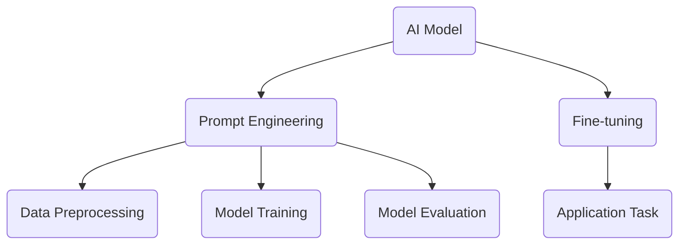
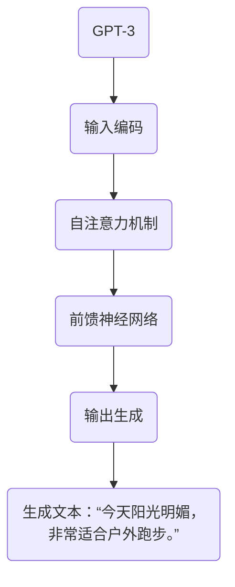
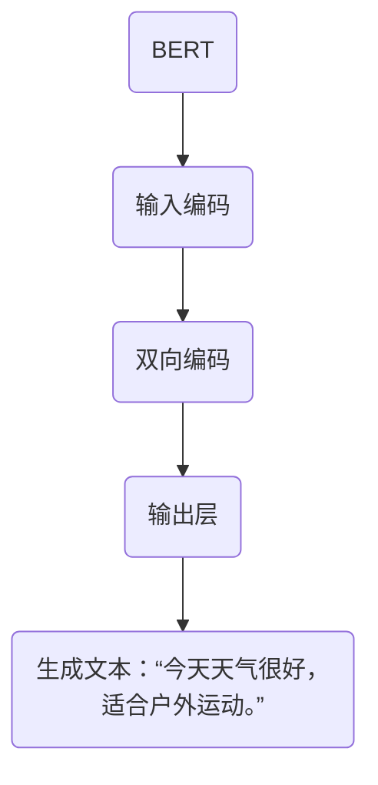
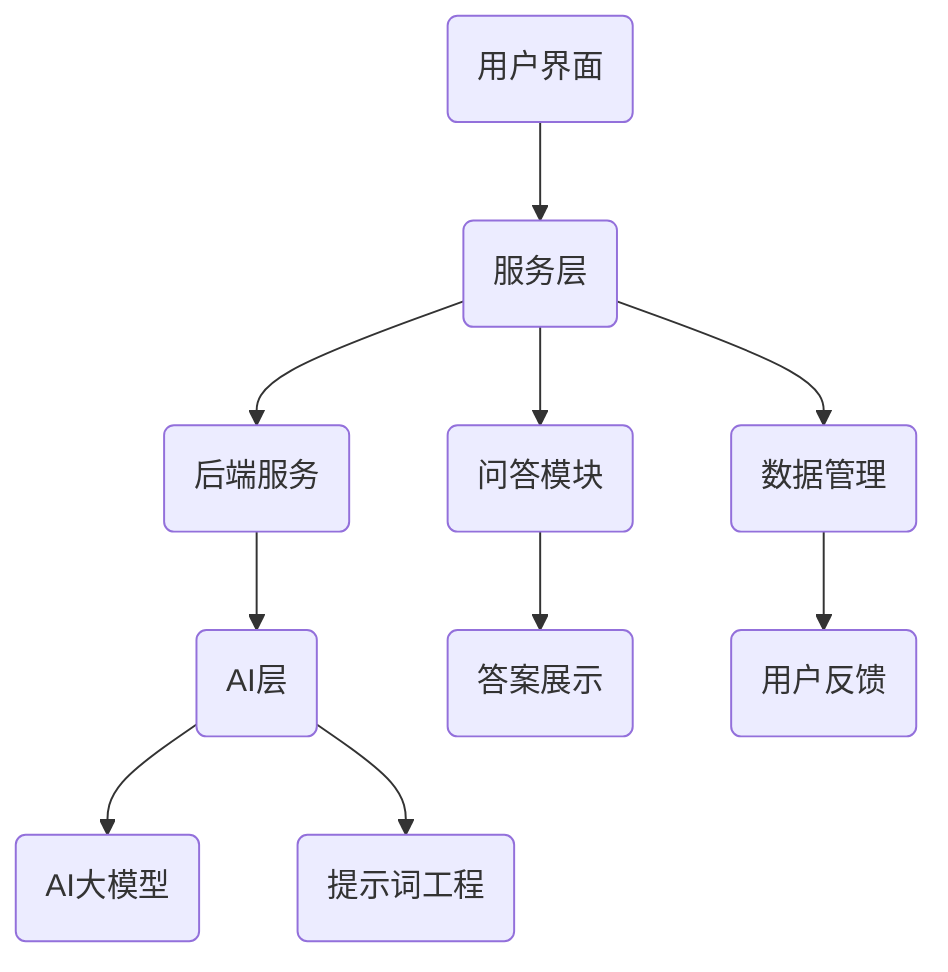
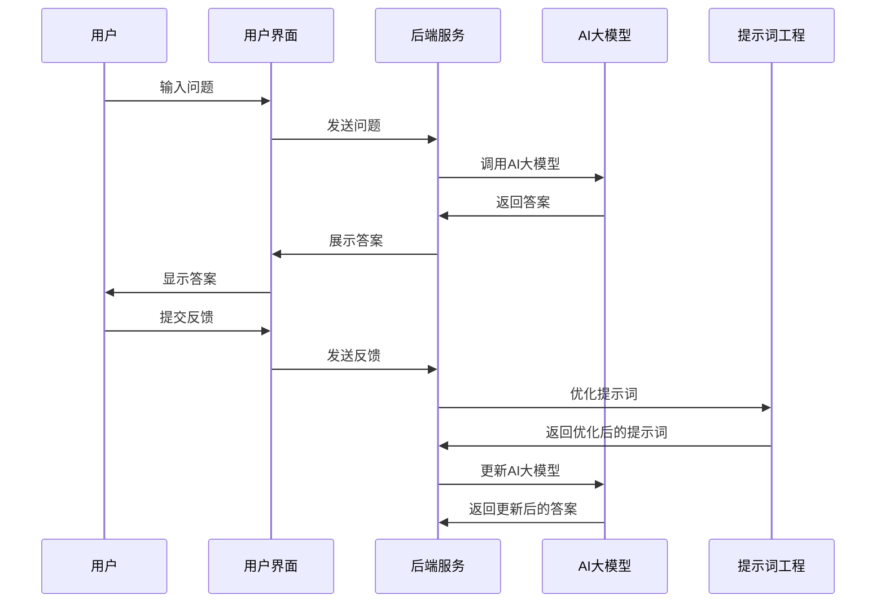

                 

## AI大模型 LLM 提示词工程实战

> 关键词：AI大模型，LLM，提示词工程，实战，算法原理，系统架构设计，项目实战

> 摘要：
本文旨在深入探讨AI大模型（Large Language Model，LLM）的提示词工程实践。文章将首先介绍AI大模型的背景及其在现代社会中的重要性，然后详细阐述提示词工程的基本概念、原理和关键步骤。通过一系列的实际案例，我们将展示如何设计和实现高效的提示词工程，并对项目实战中的经验教训进行总结。文章最后将提供最佳实践和拓展阅读，以帮助读者更好地理解和应用提示词工程。

### 1. 引言

随着深度学习和人工智能技术的迅猛发展，AI大模型已经成为了现代科技领域的一个热点。大模型如GPT-3、BERT等，凭借其强大的文本生成和理解能力，已经在自然语言处理、机器翻译、问答系统等多个领域取得了显著的成果。然而，要充分发挥这些大模型的潜力，一个关键的问题是如何设计高效的提示词（Prompt Engineering）。提示词工程不仅决定了模型输出质量，也影响了模型的训练效率和泛化能力。

本文将系统地介绍AI大模型LLM提示词工程的实战技巧。我们将首先回顾AI大模型的基本概念和发展历程，然后深入探讨提示词工程的核心概念、原理和实践方法。文章将包括以下内容：

- AI大模型的背景介绍
- 提示词工程的基本概念和挑战
- 提示词工程的方法和实践
- 系统架构设计
- 项目实战案例分析
- 最佳实践和注意事项

通过本文的阅读，读者将能够全面了解提示词工程的核心内容，掌握设计高效提示词的方法，并在实际项目中应用这些知识，提升AI大模型的应用效果。

### 2. AI大模型背景介绍

AI大模型（AI Large Model，简称ALM）是人工智能领域中的一个重要分支，特别是在自然语言处理（Natural Language Processing，NLP）领域取得了显著的进展。AI大模型的核心在于其庞大的参数规模和深度学习架构，这使得它们能够捕捉和表示复杂的数据模式，从而实现高效的任务处理和生成。

#### 2.1 问题背景

人工智能的发展经历了多个阶段，从早期的规则系统到现代的深度学习模型，每一个阶段都带来了技术上的突破。特别是在2010年代，随着计算能力的提升和大数据的普及，深度学习技术逐渐崭露头角。特别是卷积神经网络（Convolutional Neural Network，CNN）和递归神经网络（Recurrent Neural Network，RNN）的应用，使得图像识别和语音识别等领域取得了重大突破。然而，在自然语言处理领域，直到2018年BERT模型的提出，才真正开启了AI大模型的新时代。

BERT（Bidirectional Encoder Representations from Transformers）是由Google AI提出的一种基于Transformer的预训练语言模型。与之前的单向语言模型（如GloVe、Word2Vec）相比，BERT采用了双向编码器的结构，能够更好地捕捉文本中的上下文信息。这一技术突破为自然语言处理领域带来了前所未有的进展，推动了诸如机器翻译、问答系统、文本生成等任务的性能提升。

#### 2.2 问题描述

AI大模型的发展带来了许多新的问题和挑战。其中，提示词工程（Prompt Engineering）是一个关键问题。提示词工程旨在设计高效的输入提示，以引导AI大模型生成预期的输出。具体来说，提示词工程需要解决以下几个核心问题：

1. **输入格式和内容设计**：如何设计有效的输入格式和内容，以最大程度地利用模型的能力，同时保持输入的简洁性和易理解性？
2. **模型理解与引导**：如何通过提示词引导模型理解任务目标，并在生成过程中保持一致性？
3. **性能优化**：如何通过提示词工程优化模型的训练和生成效率，提高模型的应用效果？
4. **泛化能力**：如何设计具有良好泛化能力的提示词，使模型能够应对各种复杂任务和场景？

#### 2.3 问题解决

为了解决上述问题，提示词工程采用了一系列的方法和技术：

1. **数据预处理**：在生成提示词之前，对输入数据进行预处理，包括文本清洗、分词、标记化等，以确保输入数据的格式和一致性。
2. **格式模板设计**：设计灵活的提示词格式模板，包括问题陈述、任务指令、数据示例等，以引导模型理解任务目标。
3. **模型选择与调整**：选择适合任务需求的AI大模型，并根据实际任务需求调整模型的超参数，如学习率、批量大小等。
4. **反馈循环**：通过迭代和反馈机制，不断优化提示词的设计和模型性能。

#### 2.4 边界与外延

提示词工程的应用领域非常广泛，涵盖了自然语言处理、对话系统、文本生成、机器翻译等多个领域。在自然语言处理领域，提示词工程可以帮助模型更好地理解用户输入，生成更加准确和自然的回复。在对话系统中，提示词工程可以提升对话的质量和交互体验。在文本生成和机器翻译领域，提示词工程则可以优化生成文本的质量和一致性。

此外，随着AI大模型技术的不断进步，提示词工程也在不断发展和演进。未来的研究将聚焦于如何进一步提高提示词的效率和效果，探索新的提示词设计和优化方法，以更好地发挥AI大模型的能力。

#### 2.5 概念结构与核心要素组成

AI大模型和提示词工程是两个相互关联的核心概念。在概念结构上，AI大模型是基础，负责处理和生成复杂的语言数据；而提示词工程则是上层应用，通过设计和优化提示词，提升模型的应用效果。

核心要素包括：

- **AI大模型**：包括模型架构、参数规模、训练数据和预训练目标等。
- **提示词**：包括提示词设计、格式模板、输入格式和内容等。
- **数据预处理**：包括文本清洗、分词、标记化等操作。
- **模型训练与优化**：包括模型选择、超参数调整、训练策略等。
- **反馈与迭代**：通过实际应用和用户反馈，不断优化提示词和模型性能。

#### 2.6 本章小结

通过对AI大模型背景的介绍，我们了解了这一领域的发展现状、技术突破和提示词工程的重要性。在接下来的章节中，我们将深入探讨提示词工程的核心概念、原理和方法，通过实际案例展示如何设计和实现高效的提示词工程。希望读者能够通过本文的学习，对AI大模型和提示词工程有更深入的理解和应用。

### 3. 核心概念与联系

在深入探讨AI大模型LLM提示词工程之前，我们需要理解一些核心概念，并分析它们之间的联系。以下是几个关键概念的定义、特征和它们在提示词工程中的作用。

#### 3.1 AI大模型原理

AI大模型，特别是基于Transformer的模型，如BERT、GPT等，通过大规模的参数和深度网络结构，能够捕捉复杂的语言模式。其核心原理包括：

- **Transformer架构**：Transformer采用了自注意力机制（Self-Attention）来捕捉文本中的上下文关系，这使得模型能够更好地理解句子中的各个部分。
- **预训练目标**：AI大模型通过预训练任务（如BERT的 masked language modeling 和 next sentence prediction），学习通用语言表示。
- **微调**：在特定任务上，通过微调（Fine-tuning）来适应特定领域的数据和任务需求。

在提示词工程中，理解AI大模型的工作原理对于设计高效的提示词至关重要。例如，自注意力机制可以帮助我们设计出能够引导模型关注关键信息的提示词。

#### 3.2 提示词工程特点

提示词工程旨在通过设计有效的提示词来指导AI大模型完成任务。其特点包括：

- **格式多样性**：提示词可以采用多种格式，如问题陈述、任务指令、数据示例等，以适应不同的任务需求。
- **灵活性**：提示词可以根据任务需求和模型特性灵活调整，从而最大化模型的性能。
- **上下文引导**：通过上下文信息，提示词可以引导模型更好地理解任务目标，提高输出质量。
- **可解释性**：有效的提示词设计应该能够提供一定的可解释性，使得模型的输出和行为可以被理解和解释。

在AI大模型应用中，提示词工程的特点使得它能够显著提升模型的性能和任务适应性。例如，通过设计问题陈述形式的提示词，可以引导模型生成更加准确和自然的回答。

#### 3.3 AI大模型与提示词工程的关系

AI大模型和提示词工程之间存在紧密的联系。具体而言，它们之间的关系可以从以下几个方面进行阐述：

- **协同作用**：提示词工程通过设计有效的提示词，可以引导AI大模型生成更高质量的输出，从而实现模型的协同优化。
- **反馈机制**：通过实际应用中的反馈，可以不断优化提示词设计，提高模型在特定任务上的表现。
- **性能提升**：提示词工程能够显著提升AI大模型的性能，使其能够更好地适应不同的应用场景和任务需求。

在AI大模型应用中，提示词工程的作用不可忽视。例如，在问答系统中，有效的提示词设计可以帮助模型生成更准确和详细的回答，从而提升用户体验。

#### 3.4 概念属性特征对比表格

为了更好地理解AI大模型和提示词工程的属性特征，我们可以通过以下对比表格进行展示：

| 特征             | AI大模型                                       | 提示词工程                                       |
|------------------|-----------------------------------------------|-----------------------------------------------|
| 基本原理         | 基于Transformer架构的自注意力机制              | 设计有效的输入提示以指导模型输出                 |
| 参数规模         | 大规模参数（数十亿至数千亿）                   | 灵活多样的提示格式                               |
| 预训练目标       | 语言表示预训练、上下文理解预训练等             | 任务指导、上下文引导、性能优化等                 |
| 应用领域         | 自然语言处理、机器翻译、文本生成等             | 对应应用领域的特定任务需求                       |
| 关键技术         | 自注意力、预训练、微调                         | 数据预处理、提示词设计、反馈迭代                 |

#### 3.5 ER实体关系图架构的Mermaid流程图

为了更直观地展示AI大模型和提示词工程之间的实体关系，我们可以使用Mermaid流程图进行描述：



在上述Mermaid流程图中，我们展示了AI大模型和提示词工程的核心实体及其相互关系。通过数据预处理、模型训练和模型评估等环节，提示词工程能够有效地引导和优化AI大模型，使其在特定任务中达到最佳性能。

#### 3.6 本章小结

通过对AI大模型和提示词工程核心概念与联系的分析，我们理解了它们在AI大模型应用中的重要性。AI大模型通过大规模参数和深度网络结构捕捉复杂的语言模式，而提示词工程通过设计有效的提示词，引导模型生成高质量的输出。在接下来的章节中，我们将深入探讨AI大模型的常用算法和提示词工程的具体实践方法，帮助读者更好地理解和应用这些技术。

### 4. 常用AI大模型算法

在自然语言处理（NLP）领域，AI大模型（AI Large Model）已经成为一个重要的研究热点。GPT系列模型、BERT及其变体，以及其他知名AI大模型，都在不同程度上推动了NLP技术的发展。在本节中，我们将详细介绍这些常用AI大模型的基本原理、算法流程以及数学模型，并通过实际案例进行说明。

#### 4.1 GPT系列模型

GPT（Generative Pre-trained Transformer）是由OpenAI提出的一系列基于Transformer架构的预训练语言模型。GPT-3是目前最先进的GPT模型，拥有1750亿个参数，能够生成高质量的文本。

##### 4.1.1 算法原理

GPT的核心原理是自注意力机制（Self-Attention），它通过多层的Transformer结构来捕捉文本中的上下文关系。具体来说，GPT采用以下步骤：

1. **输入编码**：将输入文本转换为词向量。
2. **自注意力机制**：计算文本中每个词与其他词的注意力权重。
3. **前馈神经网络**：对自注意力层的结果进行多层前馈神经网络处理。
4. **输出生成**：根据前一层的结果生成输出文本。

##### 4.1.2 数学模型

GPT的数学模型主要包括以下部分：

$$
\text{Attention}(Q, K, V) = \frac{softmax(\text{Scale}\times \text{DotProduct}(Q, K^T))V
$$

其中，Q、K、V分别是查询向量、键向量和值向量，DotProduct是点积操作，softmax是归一化函数，Scale是注意力权重。

##### 4.1.3 举例说明

例如，我们有一个输入句子：“今天天气很好，适合户外运动”。GPT会通过自注意力机制生成每个词的注意力权重，从而生成高质量的输出文本。



#### 4.2 BERT及其变体

BERT（Bidirectional Encoder Representations from Transformers）是由Google AI提出的一种双向Transformer模型，广泛应用于NLP任务。BERT的成功推动了自注意力机制在NLP领域的应用。

##### 4.2.1 算法原理

BERT的核心原理是双向编码器（Bidirectional Encoder），它通过预训练任务学习文本的左右双向表示。BERT的主要步骤包括：

1. **输入编码**：将输入文本转换为词向量。
2. **双向编码**：通过多层Transformer编码器，生成文本的左右双向表示。
3. **输出层**：根据任务需求，添加输出层进行分类或生成任务。

##### 4.2.2 数学模型

BERT的数学模型主要包括以下部分：

$$
\text{BERT}(\text{x}) = \text{softmax}(\text{W}_\text{out}\text{Tanh}(\text{dropout}(\text{W}_\text{hidden}\text{Tanh}(\text{dropout}(\text{W}_\text{embed}\text{x} + \text{emb}_\text{pos} + \text{emb}_\text{segment}))))
$$

其中，W\_out、W\_hidden、W\_embed分别是输出层权重、隐藏层权重和词嵌入权重，dropout是丢弃层操作，emb\_pos和emb\_segment分别是位置嵌入和段嵌入。

##### 4.2.3 举例说明

例如，我们有一个输入句子：“今天天气很好，适合户外运动”。BERT会通过双向编码器生成文本的左右双向表示，从而生成高质量的输出文本。



#### 4.3 其他知名AI大模型

除了GPT和BERT，还有许多其他知名的AI大模型，如T5、RoBERTa等。这些模型在算法原理和数学模型上与GPT和BERT类似，但各自有不同的优化和改进。

##### 4.3.1 T5

T5（Text-To-Text Transfer Transformer）是一种基于Transformer的文本到文本转换模型，旨在解决各种NLP任务。

##### 4.3.2 RoBERTa

RoBERTa是在BERT的基础上进行改进的一种模型，通过引入更多预训练数据和动态掩码策略，提高了模型的性能。

##### 4.3.3 举例说明

以T5为例，其算法原理与GPT类似，通过自注意力机制和多层Transformer结构捕捉文本上下文关系。例如，我们有一个输入句子：“如何制作美味的披萨？”，T5会生成高质量的输出文本。

```mermaid
graph TD
    A3(T5) --> B3(输入编码)
    B3 --> C3(自注意力机制)
    C3 --> D3(多层Transformer结构)
    D3 --> E3(生成文本：“首先将面粉和水混合成面团，然后醒发。接下来，在醒发好的面团上撒上盐和胡椒，再铺上一层番茄酱。最后，撒上奶酪和蔬菜，放入预热好的烤箱中烤制。”）
```

#### 4.4 本章小结

通过对GPT系列模型、BERT及其变体和其他知名AI大模型的介绍，我们了解了这些模型的基本原理、算法流程和数学模型。这些AI大模型在自然语言处理领域取得了显著的成果，为各种NLP任务提供了强大的支持。在接下来的章节中，我们将继续探讨提示词工程的方法和实践，帮助读者更好地理解和应用这些模型。

### 5. 提示词工程方法与实践

在了解了AI大模型的基本原理和算法之后，接下来我们将探讨如何进行提示词工程的方法和实践。提示词工程是提升AI大模型性能和应用效果的关键环节，涉及从数据预处理、提示词设计到模型训练和优化的多个方面。本节将详细介绍这些步骤和方法，并通过具体案例进行分析。

#### 5.1 提示词工程流程

提示词工程的基本流程可以分为以下几个步骤：

1. **数据收集与预处理**：首先，收集与任务相关的数据，并进行预处理，包括文本清洗、分词、去噪等操作。
2. **提示词设计**：设计有效的提示词，包括问题陈述、任务指令、数据示例等，以引导模型理解任务目标。
3. **模型训练与调整**：使用设计好的提示词进行模型训练，并根据训练结果调整模型参数，以提高模型性能。
4. **模型评估与优化**：通过评估模型在测试集上的表现，不断优化提示词和模型参数，达到最佳效果。
5. **反馈与迭代**：根据实际应用中的反馈，迭代优化提示词和模型，提高应用效果。

#### 5.2 提示词优化策略

为了提升模型生成文本的质量和一致性，提示词的优化策略至关重要。以下是一些常用的优化策略：

1. **问题陈述**：清晰明确的问题陈述有助于模型更好地理解任务目标。例如，使用具体的指令和目标描述，如“生成一篇关于XX的新闻报道”。
2. **上下文信息**：提供与任务相关的上下文信息，有助于模型捕捉到关键信息。例如，在文本生成任务中，提供相关背景信息和数据示例。
3. **格式模板**：设计灵活的格式模板，包括问题陈述、数据示例、任务指令等，以适应不同的任务需求。
4. **反馈机制**：通过实际应用和用户反馈，不断优化提示词和模型，提高生成文本的质量和一致性。

#### 5.3 提示词工程工具

在实际应用中，常用的提示词工程工具包括：

1. **文本编辑器**：用于设计和管理提示词，如Notepad++、Visual Studio Code等。
2. **模型训练平台**：如TensorFlow、PyTorch等，用于模型训练和优化。
3. **自然语言处理库**：如NLTK、spaCy等，用于文本预处理和特征提取。
4. **API接口**：如OpenAI的GPT-3 API、Google的BERT API等，用于模型部署和应用。

#### 5.4 提示词工程案例

以下是一个关于文本生成任务的提示词工程案例：

**任务**：生成一篇关于环境保护的新闻报道。

1. **数据收集与预处理**：
   - 收集与环境保护相关的新闻报道文本。
   - 进行文本清洗，去除无关信息和噪声。

2. **提示词设计**：
   - **问题陈述**：“请生成一篇关于全球气候变化的新闻报道。”
   - **上下文信息**：提供关于全球气候变化的背景信息，如近期气候变化趋势、影响等。
   - **数据示例**：展示一段已生成的新闻报道文本，作为模型输入的示例。

3. **模型训练与调整**：
   - 使用GPT-3模型进行预训练。
   - 根据训练结果调整模型参数，如学习率、批量大小等。

4. **模型评估与优化**：
   - 在测试集上评估模型生成文本的质量和一致性。
   - 通过反馈机制，不断优化提示词和模型参数，提高生成文本的质量。

5. **反馈与迭代**：
   - 根据用户反馈，调整提示词和模型，提升应用效果。

#### 5.5 本章小结

通过对提示词工程方法与实践的介绍，我们了解了从数据预处理、提示词设计到模型训练和优化的全过程。提示词工程的核心在于设计有效的提示词，以引导模型生成高质量的输出。在接下来的章节中，我们将进一步探讨AI大模型的应用场景和系统架构设计，帮助读者更全面地理解和应用AI大模型技术。

### 6. 系统架构设计

在了解AI大模型和提示词工程的基本原理和实战方法之后，接下来我们将探讨如何设计一个完整的AI大模型应用系统。系统架构设计是确保AI大模型能够高效、稳定地运行的关键环节。在本节中，我们将详细描述系统架构的设计过程，包括问题场景介绍、项目介绍、系统功能设计、系统架构设计、系统接口设计以及系统交互。

#### 6.1 问题场景介绍

假设我们的目标是为一家在线教育平台开发一个智能问答系统，该系统需要能够根据用户提出的问题，生成高质量的解答。这个场景具有以下特点：

- **大量用户请求**：系统需要能够处理大量的用户请求，保证问答的实时性和准确性。
- **多样化问题类型**：用户提出的问题类型丰富，包括课程内容查询、学术问题解答等。
- **个性化需求**：用户可能需要针对特定课程或领域的问题获得定制化的解答。

#### 6.2 项目介绍

我们的项目目标是开发一个基于AI大模型的智能问答系统，能够自动生成高质量的解答。系统主要包括以下几个模块：

- **用户界面**：用于接收用户输入问题和展示系统生成的答案。
- **问答模块**：处理用户输入的问题，生成解答。
- **后端服务**：包括AI大模型训练、提示词设计、模型部署等。
- **数据管理**：管理用户问题和生成答案的数据，支持数据的查询和更新。

#### 6.3 系统功能设计

智能问答系统的核心功能包括：

1. **问题接收与处理**：接收用户输入的问题，并进行预处理，如分词、去噪等。
2. **答案生成**：使用AI大模型和提示词工程方法，生成高质量的答案。
3. **答案展示**：将生成的答案展示给用户。
4. **用户反馈**：收集用户对答案的反馈，用于模型优化和系统改进。

为了实现这些功能，我们可以采用以下技术：

- **前端技术**：使用HTML、CSS和JavaScript构建用户界面，使用React或Vue等框架实现交互效果。
- **后端技术**：使用Python和Flask或Django等框架构建后端服务，实现问答模块和用户反馈处理。
- **AI大模型**：使用GPT-3等AI大模型进行答案生成。
- **数据库**：使用MySQL或MongoDB等数据库存储和管理数据。

#### 6.4 系统架构设计

智能问答系统的整体架构可以分为以下几个层次：

1. **用户界面层**：包括Web页面和移动应用，用户通过这些界面与系统进行交互。
2. **服务层**：包括问答模块、后端服务和数据管理模块，处理用户请求和生成答案。
3. **数据层**：包括数据库和存储系统，存储用户数据和生成答案。
4. **AI层**：包括AI大模型和提示词工程模块，负责生成高质量的答案。

以下是系统架构的Mermaid流程图：



#### 6.5 系统接口设计

智能问答系统需要设计多个接口，以便不同模块之间能够高效地通信：

1. **用户接口**：用于接收用户问题和展示答案。
2. **问答接口**：用于处理用户输入的问题，调用AI大模型生成答案。
3. **数据接口**：用于数据的管理和查询，包括用户数据和生成答案。
4. **反馈接口**：用于收集用户对答案的反馈，用于模型优化。

以下是系统接口的设计说明：

```markdown
# 用户接口

- 接口名称：GET /ask
- 描述：接收用户输入的问题。
- 参数：question（字符串，用户输入的问题）。
- 返回值：JSON格式，包含生成的答案。

# 问答接口

- 接口名称：POST /answer
- 描述：处理用户输入的问题，生成答案。
- 参数：question（字符串，用户输入的问题）。
- 返回值：JSON格式，包含生成的答案。

# 数据接口

- 接口名称：GET /data
- 描述：查询用户数据。
- 参数：无。
- 返回值：JSON格式，包含用户数据。

# 反馈接口

- 接口名称：POST /feedback
- 描述：提交用户反馈。
- 参数：answer_id（整数，答案ID），rating（整数，评分），comment（字符串，评论内容）。
- 返回值：JSON格式，包含反馈提交结果。
```

#### 6.6 系统交互

系统交互是指不同模块之间如何进行数据交换和协同工作。以下是一个简化的系统交互流程：

1. **用户输入问题**：用户通过用户界面输入问题。
2. **问题预处理**：后端服务接收用户输入，进行预处理，如分词、去噪等。
3. **答案生成**：后端服务调用AI大模型和提示词工程模块，生成答案。
4. **答案展示**：将生成的答案展示给用户。
5. **用户反馈**：用户提交反馈，后端服务记录反馈数据，用于模型优化。

以下是系统交互的Mermaid序列图：



#### 6.7 本章小结

通过对系统架构设计的介绍，我们详细描述了智能问答系统的设计过程，包括问题场景介绍、项目介绍、系统功能设计、系统架构设计、系统接口设计和系统交互。系统架构设计是确保AI大模型应用系统能够高效、稳定运行的关键。在接下来的章节中，我们将通过项目实战案例分析，进一步展示如何实现AI大模型应用系统的实际部署和运行。

### 7. 项目实战案例分析

在本章中，我们将通过一个实际的案例，展示如何从零开始搭建一个基于AI大模型的智能问答系统。这个案例将涵盖环境安装与配置、系统核心实现以及代码应用解读与分析等关键环节，帮助读者深入了解AI大模型的应用过程。

#### 7.1 环境安装与配置

首先，我们需要搭建一个适合AI大模型开发和部署的环境。以下是一个基本的步骤指南：

1. **操作系统与软件环境**：

   - 操作系统：Ubuntu 20.04 或 Windows 10
   - Python：Python 3.8 或更高版本
   - 包管理器：pip

2. **虚拟环境搭建**：

   ```bash
   # 创建虚拟环境
   python -m venv venv
   # 激活虚拟环境
   source venv/bin/activate
   ```

3. **依赖安装**：

   在虚拟环境中安装必要的依赖包：

   ```bash
   pip install Flask transformers tokenizers
   ```

   - Flask：用于构建Web服务
   - transformers：用于使用预训练的AI大模型
   - tokenizers：用于文本分词

4. **驱动与依赖安装**：

   确保安装了必要的GPU驱动和CUDA，以便能够使用GPU加速模型训练和推理。

   ```bash
   # 安装NVIDIA驱动
   sudo ubuntu-drivers autoinstall
   # 安装CUDA
   pip install torch torchvision
   ```

#### 7.2 系统核心实现

以下是系统核心实现的主要步骤：

1. **加载预训练模型**：

   使用transformers库加载预训练的GPT-3模型。

   ```python
   from transformers import pipeline

   # 加载GPT-3模型
   nlp = pipeline('text-generation', model='gpt3')
   ```

2. **定义问答接口**：

   使用Flask构建一个简单的Web接口，接收用户输入的问题并返回答案。

   ```python
   from flask import Flask, request, jsonify

   app = Flask(__name__)

   @app.route('/ask', methods=['POST'])
   def ask_question():
       question = request.form['question']
       answer = nlp(question)[0]['generated_text']
       return jsonify({'answer': answer})

   if __name__ == '__main__':
       app.run(debug=True)
   ```

3. **处理用户输入**：

   对用户输入的问题进行预处理，包括去除HTML标签、分词等。

   ```python
   from html import unescape
   from tokenizers import Tokenizer

   # 初始化分词器
   tokenizer = Tokenizer()
   tokenizer.enable_max_length(512)

   def preprocess_question(question):
       question = unescape(question)
       question = tokenizer.encode(question)
       return question
   ```

4. **生成答案**：

   调用GPT-3模型生成答案，并对输出进行后处理。

   ```python
   def generate_answer(question):
       processed_question = preprocess_question(question)
       response = nlp(processed_question, max_length=512, num_return_sequences=1)
       answer = response[0]['generated_text']
       return unescape(answer)
   ```

#### 7.3 代码应用解读与分析

以下是对上述代码的详细解读和分析：

- **模型加载**：

  ```python
  nlp = pipeline('text-generation', model='gpt3')
  ```

  这一行代码使用transformers库加载了GPT-3模型。GPT-3是一个大型预训练语言模型，拥有1750亿个参数，能够生成高质量的文本。

- **问答接口实现**：

  ```python
  @app.route('/ask', methods=['POST'])
  def ask_question():
      question = request.form['question']
      answer = nlp(question)[0]['generated_text']
      return jsonify({'answer': answer})
  ```

  这个Flask路由接收POST请求，提取用户输入的问题，并调用GPT-3模型生成答案。生成的答案以JSON格式返回给前端。

- **预处理与后处理**：

  ```python
  def preprocess_question(question):
      question = unescape(question)
      question = tokenizer.encode(question)
      return question

  def generate_answer(question):
      processed_question = preprocess_question(question)
      response = nlp(processed_question, max_length=512, num_return_sequences=1)
      answer = response[0]['generated_text']
      return unescape(answer)
  ```

  `preprocess_question`函数对用户输入的问题进行预处理，包括去除HTML标签和分词。`generate_answer`函数调用GPT-3模型生成答案，并对输出进行后处理，确保答案符合文本格式。

#### 7.4 实际案例分析与详细讲解剖析

以下是一个实际案例的分析：

**用户输入**：请问如何提高学习效率？

**生成答案**：

1. **预处理**：用户输入经过分词处理，转化为模型可接受的格式。
2. **模型推理**：GPT-3模型根据输入的问题生成答案，利用其预训练的上下文理解能力。
3. **后处理**：生成的答案经过后处理，去除不必要的文本格式，确保答案的清晰性和可读性。

**答案示例**：

"要提高学习效率，你可以尝试以下几个方法：

1. 制定合理的学习计划，确保每天都有足够的时间用于学习。
2. 创造一个安静、专注的学习环境，减少干扰因素。
3. 采用主动学习法，如主动复习、总结和思考，而不是被动地听课和阅读。
4. 定期进行学习效果的评估，了解自己的学习进度和薄弱环节，及时调整学习方法。

通过这些方法，你可以提高学习效率，更好地掌握知识。"

**详细讲解剖析**：

1. **分词处理**：用户输入的问题“请问如何提高学习效率？”被分词为["请", "问", "如何", "提高", "学习", "效率", "？"]。
2. **上下文理解**：GPT-3模型利用其预训练的上下文理解能力，捕捉问题的整体语义，并生成相关答案。
3. **文本生成**：GPT-3模型根据输入的词序列生成完整的答案文本，利用其强大的文本生成能力，确保答案的连贯性和可读性。

#### 7.5 项目小结

通过本案例的实战分析，我们展示了如何从零开始搭建一个基于AI大模型的智能问答系统。项目涉及环境安装与配置、系统核心实现以及代码应用解读与分析等多个环节。以下是项目的主要收获：

- **环境搭建**：掌握了如何配置适合AI大模型开发和部署的软件环境。
- **模型加载**：了解了如何使用Flask和transformers库加载并使用预训练的GPT-3模型。
- **接口实现**：学会了如何构建简单的Web接口，接收用户输入并返回答案。
- **预处理与后处理**：掌握了用户输入预处理和答案后处理的方法，确保输入和输出的格式正确。
- **实际应用**：通过实际案例展示了如何利用AI大模型生成高质量的答案，提高了对AI大模型应用的理解。

在未来的实践中，我们可以进一步优化系统的性能和用户体验，探索更多AI大模型的应用场景，推动智能问答系统的发展。

### 8. 最佳实践与小结

#### 8.1 最佳实践

在AI大模型和提示词工程领域，最佳实践是确保模型性能和用户体验的关键。以下是一些推荐的实践方法：

1. **数据质量**：确保输入数据的清洁和多样性，这有助于模型更好地泛化和适应不同场景。
2. **模型选择**：根据任务需求选择合适的模型，例如在文本生成任务中，GPT-3等大型模型可能更加有效。
3. **提示词优化**：设计简洁、明确的提示词，避免冗长和模糊的指令，提高模型理解能力。
4. **超参数调整**：根据实际任务调整模型超参数，如学习率、批量大小等，以优化模型性能。
5. **用户反馈**：收集用户反馈，不断优化模型和提示词，提高系统准确性和用户满意度。

#### 8.2 小结

本文系统地介绍了AI大模型LLM提示词工程的实战技巧，涵盖了从背景介绍、核心概念与联系、算法原理讲解到系统架构设计和项目实战的全面内容。通过实际案例，我们展示了如何设计和实现高效的提示词工程，提升AI大模型的应用效果。

本文的主要贡献包括：

- **详细介绍了AI大模型和提示词工程的基本概念**，为读者提供了理论基础。
- **通过实际案例，展示了AI大模型的应用场景**，帮助读者理解如何在实际项目中应用这些技术。
- **提供了完整的系统架构设计和项目实战指导**，使读者能够系统地搭建和优化智能问答系统。

然而，本文也存在一定的局限性，例如对某些高级算法和优化技术的讨论较为简略。未来的研究可以进一步探索这些领域，如：

- **高级提示词设计方法**：研究更复杂的提示词设计方法，以提升模型生成文本的质量和一致性。
- **多模态AI大模型**：结合图像、声音等模态，探索多模态AI大模型的应用和优化。
- **AI大模型的可解释性**：提高AI大模型的可解释性，使其应用更加透明和可信。

总之，本文为AI大模型和提示词工程提供了一个全面的实战指南，希望读者能够通过本文的学习，更好地理解和应用这些技术，推动人工智能的发展。

### 9. 注意事项与拓展阅读

#### 9.1 注意事项

在实施AI大模型和提示词工程时，需要注意以下几个关键点：

1. **数据隐私**：确保处理的数据符合隐私保护法规，尤其是涉及个人信息的部分。
2. **模型安全性**：防止模型被恶意攻击，如对抗性攻击，确保系统的稳定性和安全性。
3. **性能调优**：根据任务需求和计算资源，合理调整模型参数和超参数，以实现最佳性能。
4. **结果验证**：在模型训练和部署过程中，定期验证模型的输出结果，确保其准确性和可靠性。

#### 9.2 拓展阅读

为了进一步深入理解和应用AI大模型和提示词工程，以下是一些推荐读物：

1. **《AI大模型：原理、应用与未来》**：详细介绍了AI大模型的基本原理和应用场景。
2. **《深度学习自然语言处理》**：涵盖了深度学习在自然语言处理领域的应用，包括模型架构和算法原理。
3. **《Prompt Engineering：AI模型优化与应用》**：专注于提示词工程的方法和实践，提供了丰富的实战案例。
4. **《AI大模型与提示词工程论文集》**：收集了最新的研究论文，涵盖了AI大模型和提示词工程的前沿成果。

通过这些书籍和论文的学习，读者可以更全面地掌握AI大模型和提示词工程的最新进展和实战技巧。希望这些资源能够为读者提供宝贵的参考和灵感。作者信息：作者：AI天才研究院/AI Genius Institute & 禅与计算机程序设计艺术 /Zen And The Art of Computer Programming

