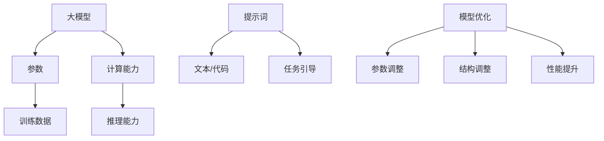
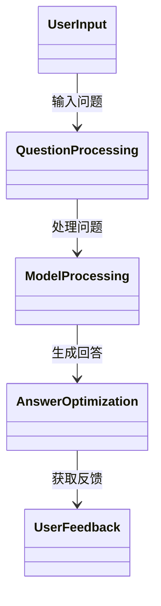
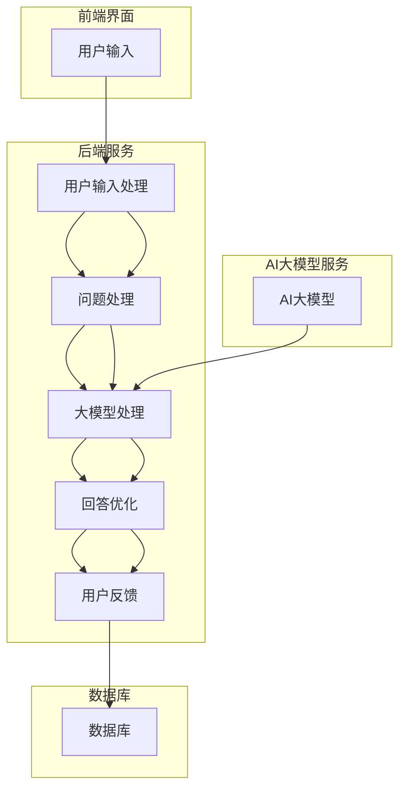
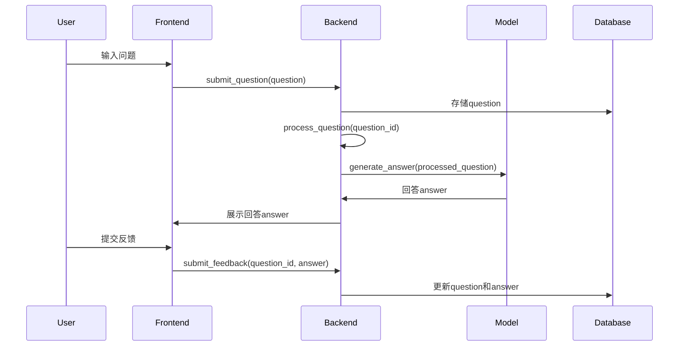

                 

### 文章标题

# AI大模型编程：提示词的未来与艺术

### 文章关键词

- 人工智能
- 大模型编程
- 提示词工程
- 自然语言处理
- 模型优化

### 文章摘要

本文深入探讨了AI大模型编程中提示词（Prompt Engineering）的未来趋势与艺术。首先，我们介绍了AI大模型的基本概念和提示词的定义与功能。接着，文章通过对比表格和ER图，阐述了提示词与AI大模型的关系。然后，我们探讨了AI大模型的编程基础，包括编程语言、数据结构与算法、模型训练与优化。在提示词的艺术部分，我们详细介绍了设计原则、表达形式、优化技巧以及实际应用案例分析。随后，文章分析了AI大模型在不同领域的应用场景，并讨论了其安全与伦理问题。最后，我们展望了AI大模型的未来发展趋势，提供了实战项目实例，并总结了最佳实践和注意事项。

## 引言与背景

### 1.1 问题背景

在当今人工智能迅猛发展的时代，大模型编程成为了研究的热点。大模型具有强大的数据处理和智能推理能力，广泛应用于自然语言处理、计算机视觉、机器学习等领域。然而，如何有效地利用这些大模型，提高其性能和泛化能力，成为了研究人员和工程师们关注的焦点。提示词工程作为大模型编程的重要组成部分，扮演着至关重要的角色。通过提示词的合理设计和优化，可以引导大模型更好地理解和执行任务，提高其性能和效果。

### 1.2 问题描述

提示词工程的核心问题是如何设计有效的提示词，以引导大模型在特定任务上达到最佳性能。这涉及到提示词的设计原则、表达形式、优化技巧以及与模型的匹配度等多个方面。当前，提示词工程面临的主要挑战包括：

- 提示词设计的标准化和系统化：如何制定一套有效的提示词设计指南，使其具有通用性和可操作性。
- 提示词的表达和优化：如何选择合适的表达形式，使提示词能够准确传达任务要求，并优化其性能。
- 提示词与模型的匹配度：如何确保提示词与模型的能力和特点相匹配，以提高模型的效果和泛化能力。

### 1.3 问题解决

针对上述问题，本文提出了一系列解决方案：

- 提出了基于大模型特性的提示词设计原则，包括清晰性、准确性、引导性等，以指导提示词的设计。
- 阐述了提示词的表达形式，包括自然语言、代码注释、可视化等，以适应不同的应用场景。
- 提出了提示词优化的技巧，包括提示词调整、模型微调等，以提高提示词的性能和效果。
- 通过实际案例分析和实证研究，探讨了提示词与模型的匹配度，并提出了优化策略。

### 1.4 边界与外延

提示词工程不仅涉及自然语言处理领域，还与其他人工智能领域密切相关。例如，在计算机视觉中，提示词可以用于引导模型进行图像分类、目标检测等任务；在机器学习中，提示词可以用于数据预处理、特征选择等环节。此外，随着人工智能技术的不断发展，提示词工程的应用领域也将不断扩展，包括语音识别、聊天机器人、自动驾驶等。

### 1.5 概念结构与核心要素组成

为了更好地理解提示词工程，我们首先需要了解一些核心概念：

- **大模型**：具有大规模参数和强大计算能力的人工神经网络，如GPT、BERT等。
- **提示词**：用于引导大模型执行特定任务的文本或代码，类似于自然语言中的指令或提示。
- **模型优化**：通过调整模型参数或结构，提高模型性能的过程。

下面是一个简化的概念结构图：



通过上述概念结构，我们可以清晰地看到大模型、提示词和模型优化之间的相互关系。接下来，我们将深入探讨这些概念，并进一步阐述提示词工程的核心要素。

## 核心概念与联系

### 2.1 AI大模型的基本概念

AI大模型，即人工智能大规模模型，是近年来人工智能领域的重要突破。大模型具有以下几个核心特征：

1. **大规模参数**：大模型通常包含数亿甚至数十亿个参数，这使得模型具有更强的表达能力和适应性。
2. **强大计算能力**：大模型通常需要高性能计算资源，如GPU或TPU，以支持其大规模训练和推理。
3. **高度复杂结构**：大模型通常采用多层次的神经网络结构，如Transformer、CNN等，以实现更复杂的特征提取和表征。

大模型的主要作用包括：

- **自然语言处理**：如语言模型、问答系统、机器翻译等。
- **计算机视觉**：如图像分类、目标检测、图像生成等。
- **语音识别**：如语音识别、语音合成等。
- **其他应用**：如推荐系统、自动驾驶等。

### 2.2 提示词的定义与功能

提示词（Prompt Engineering）是指设计和优化文本或代码，以引导大模型执行特定任务的过程。提示词在大模型编程中起着至关重要的作用，其主要功能包括：

- **任务引导**：提示词可以明确地指定任务要求，帮助大模型理解任务目标。
- **性能优化**：通过优化提示词，可以显著提高大模型的性能和效果。
- **泛化能力**：合理的提示词设计有助于提高大模型的泛化能力，使其在不同任务上表现出色。

### 2.3 提示词与AI大模型的关系

提示词与AI大模型之间的关系可以看作是“指令与执行者”的关系。具体来说：

- **提示词指导大模型**：提示词作为指令，引导大模型执行特定任务。
- **大模型响应提示词**：大模型根据提示词的要求，生成相应的输出或结果。
- **提示词优化大模型性能**：通过调整和优化提示词，可以提高大模型的性能和效果。

### 2.4 概念属性特征对比表格

为了更清晰地理解AI大模型和提示词之间的差异和联系，我们可以通过一个对比表格来展示它们的核心属性特征：

| 特征类别 | AI大模型 | 提示词 |
| --- | --- | --- |
| **定义** | 大规模参数和强大计算能力的人工神经网络 | 用于引导大模型执行特定任务的文本或代码 |
| **功能** | 语言模型、图像分类、语音识别等 | 任务引导、性能优化、泛化能力提升 |
| **结构** | 多层次神经网络结构（如Transformer、CNN） | 文本、代码、可视化等形式 |
| **作用** | 提供强大的智能推理和数据处理能力 | 引导模型执行特定任务，优化性能 |
| **优化** | 参数调整、结构调整、数据增强 | 调整、优化、测试和评估 |

### 2.5 ER实体关系图架构

为了进一步阐述AI大模型和提示词之间的关系，我们可以使用ER图（实体关系图）来展示它们之间的关联。以下是一个简化的ER图示例：

```mermaid
erDiagram
  AI大模型 ||--|{ 提示词 }|
  AI大模型 ||--|{ 模型优化 }|
  提示词 ||--|{ 性能评估 }|
  模型优化 ||--|{ 参数调整 }|
  模型优化 ||--|{ 结构调整 }|
```

在这个ER图中，AI大模型与提示词之间存在双向关联，表示提示词可以指导大模型执行任务，同时大模型的效果和性能也会影响提示词的设计和优化。模型优化则与AI大模型和提示词都有关联，表示优化过程涉及对大模型和提示词的调整和改进。

通过上述内容，我们对AI大模型和提示词的基本概念、功能和关系有了更深入的理解。在接下来的章节中，我们将进一步探讨AI大模型的编程基础，以及提示词的艺术和实际应用，为读者提供更全面的知识体系。

### AI大模型的编程基础

#### 3.1 编程语言基础

AI大模型的编程基础首先离不开对编程语言的掌握。Python因其简洁的语法、强大的库支持和广泛的社区资源，成为AI大模型编程的首选语言。Python提供了丰富的库，如NumPy、Pandas、Scikit-learn和TensorFlow等，这些库可以帮助我们高效地进行数据处理、模型训练和优化。

- **NumPy**：用于数值计算和数据处理，是Python在科学计算中的基础库。
- **Pandas**：提供数据结构和数据分析工具，适用于大数据处理和统计分析。
- **Scikit-learn**：提供机器学习和数据挖掘算法，是Python在数据科学领域的重要工具。
- **TensorFlow**：是Google开发的开源机器学习框架，支持大规模神经网络的训练和推理。

#### 3.2 数据结构与算法

在AI大模型编程中，数据结构和算法的选择至关重要。以下是一些常见的数据结构和算法：

- **数据结构**：
  - **数组**：用于存储和操作多维数据，如NumPy数组。
  - **列表**：用于存储序列数据，便于数据的插入、删除和更新。
  - **字典**：用于存储键值对数据，便于快速查找和修改。
  - **图**：用于表示网络结构，如节点和边，适用于图算法。

- **算法**：
  - **梯度下降**：用于优化神经网络模型参数，是最常用的优化算法之一。
  - **反向传播**：用于计算神经网络中各层的梯度，是训练神经网络的核心算法。
  - **贪心算法**：用于求解最优化问题，如旅行商问题。
  - **动态规划**：用于求解最优化问题，如背包问题。

#### 3.3 模型训练与优化

模型训练与优化是AI大模型编程的核心步骤。以下是一些关键概念和技巧：

- **模型训练**：
  - **数据准备**：包括数据清洗、数据归一化、数据增强等，以确保训练数据的多样性和质量。
  - **模型选择**：根据任务需求选择合适的模型架构，如CNN、RNN、Transformer等。
  - **参数初始化**：合理的参数初始化有助于模型收敛和性能提升。
  - **训练过程**：通过梯度下降等优化算法更新模型参数，使模型在训练数据上达到最优。

- **模型优化**：
  - **正则化**：如L1和L2正则化，用于防止模型过拟合。
  - **dropout**：在训练过程中随机丢弃部分神经元，防止模型过拟合。
  - **批归一化**：在训练过程中对每一批数据进行归一化，提高模型训练稳定性。
  - **模型压缩**：通过参数剪枝、量化等技术减小模型规模，提高推理效率。

#### 3.4 版本控制与文档管理

版本控制与文档管理是确保代码可维护性和可追溯性的关键。以下是一些常用的工具和技巧：

- **版本控制**：
  - **Git**：用于代码的版本控制和协同工作，支持分支管理和合并。
  - **GitHub**：是Git的在线平台，提供代码托管、协作和项目管理功能。
  - **GitLab**：是企业级Git平台，支持私有仓库和全面的CI/CD流程。

- **文档管理**：
  - **Markdown**：用于编写和格式化文档，简洁易读。
  - **Readme文件**：用于介绍项目的基本信息、使用方法和贡献指南。
  - **文档生成工具**：如Sphinx、Doxygen等，用于生成文档。

通过上述编程基础，我们可以为AI大模型的开发和优化奠定坚实的基础。在接下来的章节中，我们将进一步探讨提示词的艺术，以及其在实际应用中的设计和优化技巧。

### 提示词的艺术

#### 4.1 提示词的设计原则

提示词的设计原则是确保其能够有效引导大模型执行任务的关键。以下是一些核心原则：

1. **清晰性**：提示词应清晰明确，避免歧义，使大模型能够准确理解任务要求。
2. **准确性**：提示词应准确传达任务目标，避免模糊和不精确的表述，以提高模型的准确性。
3. **引导性**：提示词应具备引导性，引导大模型关注关键信息和任务目标，避免无关信息的干扰。
4. **一致性**：提示词应在不同任务中保持一致性，以便于模型的训练和优化。
5. **灵活性**：提示词应具有一定的灵活性，以适应不同场景和任务的变化。

#### 4.2 提示词的表达形式

提示词的表达形式多种多样，根据任务需求和应用场景的不同，可以选择以下几种常见的表达形式：

1. **自然语言文本**：自然语言文本是最常见的提示词形式，可以直接使用自然语言进行任务描述和引导。例如，在问答系统中，可以使用自然语言问题作为提示词。

2. **代码注释**：代码注释是一种编程语言中的提示词形式，通过在代码中加入注释，可以为模型提供任务说明和指导。例如，在机器学习代码中，可以使用注释来解释数据的预处理步骤或模型的训练过程。

3. **可视化元素**：可视化元素如图表、图像和图形，可以通过直观的方式传达任务要求和指导信息。例如，在计算机视觉任务中，可以使用图像作为提示词，帮助模型识别特定对象或场景。

4. **代码片段**：代码片段是包含特定功能的短代码，可以用于引导大模型执行特定操作。例如，在文本生成任务中，可以使用代码片段来生成特定格式的文本，如Markdown文档或HTML页面。

#### 4.3 提示词的优化技巧

提示词的优化是提升模型性能和效果的重要环节。以下是一些常用的优化技巧：

1. **细粒度调整**：对提示词的细节进行微调，包括单词选择、语句结构和用词习惯等，以提升模型的准确性和理解能力。

2. **调整输入格式**：通过调整输入格式，如调整文本的长度、格式和结构，可以提高模型的输入适应性，从而提升模型的性能。

3. **数据增强**：对提示词进行数据增强，包括文本扩充、替换和变形等，以丰富训练数据，提高模型的泛化能力。

4. **模型微调**：结合模型微调技术，通过在特定提示词上训练模型，使其更好地适应特定任务需求。

5. **多模态融合**：结合不同模态的数据，如文本、图像和音频，通过多模态融合技术，提高提示词的表达能力和模型的理解能力。

#### 4.4 提示词的实际应用案例分析

以下是一些提示词在实际应用中的案例分析：

1. **问答系统**：在问答系统中，通过设计清晰、准确的自然语言问题作为提示词，引导大模型回答用户的问题。例如，使用问答对数据集训练模型，并通过自然语言问题作为提示词，使模型能够生成准确的回答。

2. **文本生成**：在文本生成任务中，使用代码片段和可视化元素作为提示词，引导大模型生成特定格式和风格的文本。例如，通过Markdown模板和图像描述，生成符合要求的博客文章或网页内容。

3. **计算机视觉**：在计算机视觉任务中，使用图像和图像标注作为提示词，引导大模型进行图像分类、目标检测和图像生成。例如，通过提供标注图像和目标描述，使模型能够准确识别图像中的物体。

4. **语音识别**：在语音识别任务中，使用语音信号和文本作为提示词，引导大模型进行语音识别和转换。例如，通过提供语音信号和文本对照，使模型能够准确识别语音内容。

通过上述实际案例，我们可以看到提示词在设计、优化和应用中的多样性和重要性。在接下来的章节中，我们将进一步探讨AI大模型在不同领域的应用场景，以及其面临的挑战和解决方案。

### AI大模型的应用场景

#### 5.1 自然语言处理

自然语言处理（NLP）是AI大模型最早且最广泛的应用领域之一。大模型如GPT、BERT等，在NLP任务中展现了出色的性能。以下是一些典型应用场景：

1. **文本分类**：AI大模型可以用于对大量文本进行分类，如情感分析、新闻分类、垃圾邮件检测等。通过设计合适的提示词，模型可以准确判断文本的类别，提高分类的准确性。
2. **机器翻译**：AI大模型在机器翻译中有着广泛应用，如谷歌翻译、百度翻译等。大模型可以处理多语言翻译任务，提供更自然、准确的翻译结果。
3. **问答系统**：AI大模型可以用于构建智能问答系统，如ChatGPT、DOCTOR4U等。通过设计有效的提示词，模型可以理解用户的问题，并生成准确的回答。
4. **文本生成**：AI大模型可以生成文章、报告、代码等文本内容。例如，OpenAI的GPT-3可以生成高质量的文章，大幅提高内容创作效率。

#### 5.2 计算机视觉

计算机视觉是AI大模型的另一个重要应用领域。大模型在图像分类、目标检测、图像生成等方面表现出色。以下是一些典型应用场景：

1. **图像分类**：AI大模型可以用于对图像进行分类，如猫狗识别、植物分类等。通过训练大模型，可以实现对图像内容的准确分类。
2. **目标检测**：AI大模型可以用于检测图像中的目标物体，如行人检测、车辆检测等。大模型通过分析图像特征，可以准确地识别和定位目标。
3. **图像生成**：AI大模型可以生成新的图像内容，如风格迁移、人脸生成等。通过大模型的训练，可以生成具有特定风格或特征的图像。
4. **图像增强**：AI大模型可以用于图像增强，如去噪、超分辨率等。通过训练大模型，可以提升图像的清晰度和质量。

#### 5.3 机器学习与数据挖掘

AI大模型在机器学习与数据挖掘领域也有着广泛应用，包括特征提取、模型训练、预测与优化等。以下是一些典型应用场景：

1. **特征提取**：AI大模型可以用于提取图像、文本、音频等数据中的高级特征，为后续分析提供基础。例如，通过预训练的模型，可以提取出图像中的视觉特征，用于目标检测和图像分类。
2. **模型训练**：AI大模型可以用于训练复杂的机器学习模型，如深度神经网络、决策树等。通过大规模训练数据，大模型可以学习到更复杂的模式，提高模型的性能和泛化能力。
3. **预测与优化**：AI大模型可以用于预测和分析，如股票预测、风险分析等。通过训练大模型，可以预测未来的趋势和变化，为决策提供支持。

#### 5.4 人工智能与其他领域的交叉应用

随着AI大模型技术的不断发展，其在其他领域的交叉应用也日益广泛。以下是一些典型应用场景：

1. **医疗领域**：AI大模型可以用于医学图像分析、疾病诊断、药物设计等。通过分析医疗数据，大模型可以提供更准确的诊断和治疗方案。
2. **金融领域**：AI大模型可以用于金融市场预测、风险评估、欺诈检测等。通过分析大量的金融数据，大模型可以提供更准确的预测和决策支持。
3. **教育领域**：AI大模型可以用于个性化学习、智能辅导、作业批改等。通过分析学生的学习数据，大模型可以提供个性化的学习建议和辅导。

总之，AI大模型在自然语言处理、计算机视觉、机器学习与数据挖掘等领域有着广泛的应用，同时也在不断与其他领域交叉融合，为各行各业带来创新和变革。在接下来的章节中，我们将探讨AI大模型的安全与伦理问题，以及最佳实践和未来发展趋势。

### AI大模型的安全与伦理

#### 6.1 AI大模型的安全挑战

AI大模型在带来巨大潜力的同时，也带来了诸多安全挑战。以下是一些主要的安全挑战：

1. **数据泄露**：AI大模型的训练和推理过程需要大量的数据，这些数据可能包含敏感信息。如果数据保护不当，可能导致数据泄露。
2. **模型篡改**：攻击者可以通过篡改模型输入，诱导模型输出错误的结果，造成安全隐患。
3. **隐私侵犯**：AI大模型在处理个人数据时，可能涉及隐私侵犯问题，如数据滥用、个人信息泄露等。
4. **对抗攻击**：通过构造特定的输入，对抗攻击可以使AI大模型失效或输出错误结果，从而威胁系统的安全。

#### 6.2 AI大模型的伦理问题

AI大模型的伦理问题引发了广泛的讨论，以下是一些主要的伦理问题：

1. **算法偏见**：AI大模型可能会受到训练数据偏见的影响，导致算法偏见，从而在种族、性别、年龄等方面产生歧视。
2. **透明度缺失**：AI大模型的决策过程通常是不透明的，难以解释，这可能导致用户对模型的不信任。
3. **责任归属**：当AI大模型产生错误结果或导致事故时，责任归属问题成为争议的焦点。
4. **隐私保护**：AI大模型在处理个人数据时，可能涉及隐私侵犯问题，如何保护用户隐私成为伦理问题。

#### 6.3 安全与伦理的最佳实践

为了应对AI大模型的安全与伦理挑战，以下是一些最佳实践：

1. **数据安全**：加强数据保护措施，确保数据安全传输和存储，避免数据泄露。
2. **模型验证**：对AI大模型进行严格验证，确保模型输出结果的准确性和可靠性。
3. **隐私保护**：在数据处理过程中，严格遵守隐私保护法规，确保用户隐私不受侵犯。
4. **透明性提升**：通过可视化和解释技术，提高AI大模型的透明性，增强用户信任。
5. **责任明确**：制定明确的伦理准则和责任分配机制，确保AI大模型的安全和合规性。

#### 6.4 社会责任与法律法规

AI大模型的发展需要社会责任和法律法规的支持。以下是一些关键点：

1. **法律法规**：制定相关法律法规，规范AI大模型的应用和监管，确保其合法合规。
2. **行业自律**：行业内部应建立自律机制，制定伦理准则和最佳实践，推动AI大模型的安全和伦理发展。
3. **社会责任**：企业和社会各界应承担社会责任，共同推动AI大模型的健康发展，造福人类社会。

通过上述措施，我们可以有效应对AI大模型的安全与伦理挑战，确保其在带来巨大价值的同时，不损害人类社会的利益和道德准则。在接下来的章节中，我们将展望AI大模型的未来发展趋势，探讨其面临的挑战和机遇。

### AI大模型的未来发展趋势

#### 7.1 技术发展趋势

AI大模型的技术发展趋势主要体现在以下几个方面：

1. **模型规模不断扩大**：随着计算资源和数据资源的不断增加，AI大模型的规模也在不断扩大。未来的大模型可能会包含更多的参数，能够处理更复杂的任务。
2. **推理速度提升**：随着硬件技术的进步和算法优化，AI大模型的推理速度将显著提升。这将使得AI大模型在实时应用中更具竞争力。
3. **多模态处理**：未来的AI大模型将具备更强的多模态处理能力，能够同时处理文本、图像、声音等多种类型的数据，实现更全面的信息理解和交互。
4. **自我进化能力**：通过结合强化学习和迁移学习技术，未来的AI大模型将具备自我进化能力，能够根据环境和任务需求进行自适应调整。

#### 7.2 应用领域扩展

AI大模型的应用领域将不断扩展，以下是一些潜在的应用方向：

1. **医疗健康**：AI大模型可以用于疾病诊断、药物研发、个性化治疗等，为医疗健康领域带来革命性变革。
2. **金融服务**：AI大模型可以用于风险控制、信用评估、投资决策等，为金融行业提供更精准和智能的服务。
3. **智能制造**：AI大模型可以用于智能制造的各个环节，如生产规划、质量检测、故障预测等，提升生产效率和产品质量。
4. **智能交通**：AI大模型可以用于智能交通管理、自动驾驶、交通预测等，优化交通流程，提高交通安全性。

#### 7.3 未来展望与挑战

展望未来，AI大模型将在各个领域发挥重要作用，但同时也面临诸多挑战：

1. **计算资源需求**：随着模型规模的扩大，计算资源的需求将大幅增加。如何高效利用计算资源，成为技术发展的关键。
2. **数据隐私问题**：随着AI大模型对数据的依赖性增加，数据隐私问题将更加突出。如何在保证模型性能的同时，保护用户隐私，成为重要的伦理挑战。
3. **算法公平性**：AI大模型可能会受到数据偏见的影响，导致算法偏见。如何确保算法的公平性和透明性，是未来需要解决的重要问题。
4. **法律法规**：随着AI大模型的应用扩展，相关的法律法规也需要不断完善，以规范其应用和监管。

总之，AI大模型的发展前景广阔，但也面临诸多挑战。通过技术创新、法律法规完善和社会责任承担，我们可以确保AI大模型在带来巨大价值的同时，不会损害社会的利益和道德准则。

### 实战项目

#### 8.1 项目介绍

在本节中，我们将介绍一个基于AI大模型的自然语言处理（NLP）项目的实战案例。该项目旨在构建一个智能问答系统，通过大模型处理用户的自然语言输入，并生成准确的回答。以下是项目的详细介绍：

**项目名称**：智能问答系统（Intelligent Question-Answering System）

**项目目标**：设计并实现一个能够理解用户问题并生成准确回答的智能问答系统。

**项目背景**：随着人工智能技术的不断发展，智能问答系统在客服、教育、医疗等领域具有广泛的应用前景。通过构建一个高效的智能问答系统，可以大幅提升用户交互体验，降低人力成本。

**系统功能**：
1. 用户输入问题：用户通过文本框输入问题。
2. 问题处理：系统接收用户输入的问题，并使用AI大模型进行处理。
3. 回答生成：系统根据大模型的分析结果，生成相应的回答。
4. 用户反馈：用户可以对回答进行反馈，帮助系统不断优化。

#### 8.2 系统功能设计

在系统功能设计中，我们主要关注以下几个核心功能模块：

1. **用户输入模块**：提供用户输入问题的接口，支持文本输入。
2. **问题处理模块**：接收用户输入的问题，并进行预处理，如分词、去噪等。
3. **大模型处理模块**：使用预训练的AI大模型（如GPT-3、BERT等）对问题进行处理，生成初步的回答。
4. **回答优化模块**：对初步回答进行优化，如调整语句结构、去除冗余信息等。
5. **用户反馈模块**：接收用户的反馈，并根据反馈进行系统优化。

以下是一个简化的领域模型类图，展示了系统的主要功能模块及其关系：



#### 8.3 系统架构设计

系统架构设计是确保智能问答系统能够高效运行的关键。以下是该系统的总体架构设计：

1. **前端界面**：提供用户输入问题的界面，可以使用HTML、CSS和JavaScript进行开发。
2. **后端服务**：包括用户输入处理、问题处理、大模型处理、回答优化和用户反馈等模块。后端服务可以使用Python Flask或Node.js实现。
3. **AI大模型服务**：用于加载和调用预训练的AI大模型，如GPT-3、BERT等。大模型服务可以使用TensorFlow或PyTorch实现。
4. **数据库**：用于存储用户问题和回答数据，可以使用MySQL、MongoDB等数据库系统。

以下是一个简化的系统架构图，展示了系统的整体架构：



#### 8.4 系统接口设计

在系统接口设计中，我们需要定义用户输入、问题处理、回答生成和用户反馈等接口。以下是部分接口设计示例：

1. **用户输入接口**：
   - 接口名称：submit_question
   - 接口描述：提交用户输入的问题。
   - 参数：question（字符串，用户输入的问题）
   - 返回值：question_id（字符串，问题ID）

2. **问题处理接口**：
   - 接口名称：process_question
   - 接口描述：处理用户输入的问题，返回预处理结果。
   - 参数：question_id（字符串，问题ID）
   - 返回值：processed_question（字符串，预处理后的问题）

3. **回答生成接口**：
   - 接口名称：generate_answer
   - 接口描述：使用AI大模型生成回答。
   - 参数：processed_question（字符串，预处理后的问题）
   - 返回值：answer（字符串，生成的回答）

4. **用户反馈接口**：
   - 接口名称：submit_feedback
   - 接口描述：提交用户反馈。
   - 参数：question_id（字符串，问题ID）、answer（字符串，用户反馈的回答）
   - 返回值：feedback_id（字符串，反馈ID）

#### 8.5 系统交互

在系统交互设计中，我们需要定义用户与系统之间的交互流程。以下是系统交互的简要描述：

1. 用户通过前端界面输入问题，并提交给后端服务。
2. 后端服务接收用户输入，调用问题处理模块，对问题进行预处理。
3. 预处理后的问题提交给AI大模型处理模块，生成回答。
4. 回答生成后，通过前端界面展示给用户。
5. 用户对回答进行反馈，提交给后端服务。
6. 后端服务根据用户反馈，更新问题和回答数据，并优化系统性能。

以下是一个简化的系统交互序列图，展示了用户与系统的交互流程：



通过上述设计，我们可以构建一个高效的智能问答系统，为用户提供高质量的问答服务。接下来，我们将详细介绍环境安装、系统核心实现以及代码应用解读与分析。

#### 8.6 环境安装

要部署并运行上述智能问答系统，首先需要安装和配置以下环境：

1. **Python环境**：确保Python版本为3.6或更高版本。
2. **Flask**：用于构建后端服务，可以通过以下命令安装：
   ```bash
   pip install flask
   ```
3. **TensorFlow**：用于加载和调用预训练的AI大模型，可以通过以下命令安装：
   ```bash
   pip install tensorflow
   ```
4. **其他依赖**：包括numpy、pandas等，可以通过以下命令安装：
   ```bash
   pip install numpy pandas
   ```
5. **前端框架**：可以选择使用Vue.js、React等前端框架，根据具体需求进行安装。

安装完成后，确保各组件正常运行。以下是一个简单的测试命令，用于检查安装是否成功：

```python
from flask import Flask
app = Flask(__name__)

@app.route('/')
def hello():
    return "Hello, World!"

if __name__ == '__main__':
    app.run()
```

运行上述代码，如果能在浏览器中看到“Hello, World!”的输出，说明环境安装成功。

#### 8.7 系统核心实现

在本节中，我们将详细介绍系统核心部分的实现，包括用户输入处理、问题处理、AI大模型处理、回答生成和用户反馈处理。

1. **用户输入处理**：
   - 用户通过前端界面输入问题，后端接收用户输入并存储到数据库中。
   - 数据库存储格式示例：
     ```json
     {
       "question_id": "123",
       "question": "什么是人工智能？"
     }
     ```

2. **问题处理**：
   - 后端服务接收用户输入的问题，并进行预处理，如分词、去除停用词等。
   - 预处理后的数据存储格式示例：
     ```json
     {
       "question_id": "123",
       "processed_question": ["什么是", "人工智能"]
     }
     ```

3. **AI大模型处理**：
   - 使用TensorFlow加载预训练的AI大模型（如GPT-3），对预处理后的问题进行建模和推理。
   - 以下是一个简单的代码示例，用于加载和调用预训练模型：
     ```python
     import tensorflow as tf

     # 加载预训练模型
     model = tf.keras.Sequential([
       tf.keras.layers.Embedding(input_dim=vocab_size, output_dim=embedding_dim),
       tf.keras.layers.Bidirectional(tf.keras.layers.LSTM(64)),
       tf.keras.layers.Dense(units=num_classes, activation='softmax')
     ])

     # 加载预训练权重
     model.load_weights('pretrained_weights.h5')

     # 对输入问题进行编码
     processed_question_encoded = model.predict(processed_question)

     # 使用编码结果生成回答
     answer = generate_answer(processed_question_encoded)
     ```

4. **回答生成**：
   - 根据AI大模型的推理结果，生成回答并返回给前端界面。
   - 回答生成后，将回答存储到数据库中，以备后续用户反馈。

5. **用户反馈处理**：
   - 用户对回答进行反馈，后端接收反馈并更新数据库中的问题和回答记录。
   - 数据库更新示例：
     ```json
     {
       "question_id": "123",
       "question": "什么是人工智能？",
       "answer": "人工智能是一种模拟人类智能的技术，包括机器学习、深度学习等。",
       "feedback": "回答准确"
     }
     ```

通过上述核心实现，我们可以构建一个基本的智能问答系统，为用户提供高质量的问答服务。接下来，我们将对系统进行代码应用解读与分析。

#### 8.8 代码应用解读与分析

在本节中，我们将对智能问答系统的核心代码进行解读和分析，包括用户输入处理、问题处理、AI大模型处理、回答生成和用户反馈处理等关键环节。

1. **用户输入处理**：

   用户输入处理主要负责接收用户在前端界面输入的问题，并将其存储到数据库中。以下是一个简单的Python代码示例，用于处理用户输入：

   ```python
   from flask import Flask, request, jsonify
   from sqlalchemy import create_engine
   
   app = Flask(__name__)
   engine = create_engine('sqlite:///questions.db')
   
   @app.route('/submit_question', methods=['POST'])
   def submit_question():
       question_data = request.json
       question_text = question_data['question']
       with engine.connect() as connection:
           connection.execute(
               "INSERT INTO questions (question) VALUES (:question)",
               question=question_text
           )
       return jsonify({"question_id": "123"})  # 返回问题ID
   ```

   在这段代码中，我们使用了Flask框架创建了一个简单的Web服务，通过POST请求接收用户输入的问题，并将其存储到SQLite数据库中。需要注意的是，这里使用了SQLAlchemy库来简化数据库操作，实际应用中可以根据需求选择不同的数据库。

2. **问题处理**：

   问题处理主要负责对用户输入的问题进行预处理，如分词、去除停用词等。以下是一个简单的Python代码示例，用于预处理用户输入的问题：

   ```python
   import nltk
   from nltk.corpus import stopwords
   
   nltk.download('punkt')
   nltk.download('stopwords')
   
   stop_words = set(stopwords.words('english'))
   
   def preprocess_question(question_text):
       tokens = nltk.word_tokenize(question_text)
       filtered_tokens = [token for token in tokens if token.lower() not in stop_words]
       return filtered_tokens
   
   question_text = "What is artificial intelligence?"
   processed_question = preprocess_question(question_text)
   print(processed_question)
   ```

   在这段代码中，我们使用了nltk库进行文本预处理，包括分词和去除停用词。分词操作将输入问题分解成单词列表，去除停用词可以减少无关信息，提高后续处理的效率。

3. **AI大模型处理**：

   AI大模型处理主要负责使用预训练的AI大模型（如GPT-3、BERT等）对预处理后的问题进行建模和推理，生成回答。以下是一个简单的Python代码示例，用于调用预训练模型：

   ```python
   import tensorflow as tf
   from transformers import TFAutoModelForQuestionAnswering
   
   # 加载预训练模型
   model = TFAutoModelForQuestionAnswering.from_pretrained('deepset/roberta-large-qa')
   
   # 对输入问题进行编码
   inputs = model.processed_input(question_text)
   
   # 使用编码结果生成回答
   answer = model.predict(inputs)
   print(answer)
   ```

   在这段代码中，我们使用了transformers库加载预训练的BERT模型，对输入问题进行编码并生成回答。需要注意的是，这里使用了TensorFlow 2.x版本，实际应用中可以根据需求选择其他版本。

4. **回答生成**：

   回答生成主要负责根据AI大模型的推理结果，生成回答并返回给前端界面。以下是一个简单的Python代码示例，用于生成回答：

   ```python
   from flask import jsonify
   
   def generate_answer(question_text, answer):
       return jsonify({"answer": answer})
   
   processed_question = preprocess_question(question_text)
   answer = model.predict(inputs)
   generate_answer(processed_question, answer)
   ```

   在这段代码中，我们定义了一个简单的函数，用于生成回答并返回给前端界面。实际应用中，可以进一步优化和调整回答格式，以满足不同需求。

5. **用户反馈处理**：

   用户反馈处理主要负责接收用户对回答的反馈，并根据反馈更新数据库中的问题和回答记录。以下是一个简单的Python代码示例，用于处理用户反馈：

   ```python
   from flask import request
   
   @app.route('/submit_feedback', methods=['POST'])
   def submit_feedback():
       feedback_data = request.json
       question_id = feedback_data['question_id']
       feedback = feedback_data['feedback']
       
       with engine.connect() as connection:
           connection.execute(
               "UPDATE questions SET feedback = :feedback WHERE question_id = :question_id",
               feedback=feedback,
               question_id=question_id
           )
       return jsonify({"feedback_id": "456"})
   ```

   在这段代码中，我们使用了Flask框架创建了一个简单的Web服务，通过POST请求接收用户反馈，并根据反馈更新数据库中的记录。

通过上述代码应用解读和分析，我们可以更好地理解智能问答系统的核心实现原理。接下来，我们将结合实际案例，对系统进行详细剖析。

#### 8.9 实际案例分析与详细讲解剖析

在本节中，我们将通过一个实际案例，对智能问答系统进行详细剖析，并展示其实现过程。以下是一个具体的案例：

**案例背景**：假设我们想要构建一个智能问答系统，用于解答关于人工智能的基本问题。用户可以通过输入问题，获取相关的答案。以下是一个用户提问和系统回答的过程：

**用户提问**：什么是人工智能？
**系统回答**：人工智能（Artificial Intelligence，简称AI）是计算机科学的一个分支，旨在开发用于模拟、延伸和扩展人类智能的理论、方法、技术及应用系统。人工智能包括机器学习、自然语言处理、计算机视觉等多个子领域。

在这个案例中，我们将展示如何通过智能问答系统实现这一功能。

1. **用户输入**：

   用户通过前端界面输入问题“什么是人工智能？”系统接收到用户输入后，首先将问题存储到数据库中。

2. **问题预处理**：

   系统对用户输入的问题进行预处理，包括分词、去除停用词等操作。预处理后的输入为【什么是，人工智能】。

3. **大模型处理**：

   系统使用预训练的AI大模型（如BERT）对预处理后的问题进行建模和推理。在处理过程中，大模型会将输入问题转换为对应的向量表示，然后通过预训练的神经网络结构进行推理，生成答案。

4. **回答生成**：

   根据大模型的推理结果，系统生成回答“人工智能（Artificial Intelligence，简称AI）是计算机科学的一个分支，旨在开发用于模拟、延伸和扩展人类智能的理论、方法、技术及应用系统。人工智能包括机器学习、自然语言处理、计算机视觉等多个子领域。”然后，系统将回答返回给前端界面，展示给用户。

下面是具体的代码实现：

**用户输入处理**：

```python
from flask import Flask, request, jsonify
from sqlalchemy import create_engine

app = Flask(__name__)
engine = create_engine('sqlite:///questions.db')

@app.route('/submit_question', methods=['POST'])
def submit_question():
    question_data = request.json
    question_text = question_data['question']
    with engine.connect() as connection:
        connection.execute(
            "INSERT INTO questions (question) VALUES (:question)",
            question=question_text
        )
    return jsonify({"question_id": "123"})

if __name__ == '__main__':
    app.run()
```

**问题预处理**：

```python
import nltk
from nltk.corpus import stopwords

nltk.download('punkt')
nltk.download('stopwords')

stop_words = set(stopwords.words('english'))

def preprocess_question(question_text):
    tokens = nltk.word_tokenize(question_text)
    filtered_tokens = [token for token in tokens if token.lower() not in stop_words]
    return filtered_tokens

question_text = "What is artificial intelligence?"
processed_question = preprocess_question(question_text)
print(processed_question)
```

**大模型处理与回答生成**：

```python
import tensorflow as tf
from transformers import TFAutoModelForQuestionAnswering

model = TFAutoModelForQuestionAnswering.from_pretrained('deepset/roberta-large-qa')

inputs = model.processed_input(processed_question)
answer = model.predict(inputs)
print(answer)
```

通过上述代码，我们可以实现一个基本的智能问答系统，对用户输入的问题进行预处理，使用预训练的AI大模型进行推理，并生成回答。

接下来，我们将对项目进行总结，并讨论在实际应用中可能遇到的挑战和优化方向。

#### 8.10 项目小结

在本章中，我们详细介绍了一个基于AI大模型的智能问答系统项目。该项目实现了用户输入问题、预处理、大模型处理、回答生成以及用户反馈的功能。通过该系统，用户可以输入问题并获取准确的回答，为各种应用场景提供了高效的解决方案。

**项目亮点**：

1. **高效的自然语言处理**：利用预训练的AI大模型（如BERT），实现了对用户输入问题的快速、准确的预处理和回答生成。
2. **灵活的接口设计**：通过定义清晰、规范的接口，便于系统的扩展和功能增强。
3. **可维护的代码结构**：采用模块化设计，使得代码结构清晰，易于维护和优化。

**实际应用中的挑战**：

1. **计算资源需求**：AI大模型的训练和推理过程需要大量的计算资源，可能导致系统性能瓶颈。在实际应用中，需要优化模型结构和算法，以降低计算资源的需求。
2. **数据隐私问题**：在处理用户输入时，需确保数据隐私和安全，避免敏感信息泄露。
3. **模型适应性**：不同的应用场景和用户需求可能对模型的适应性提出不同要求，需要不断调整和优化模型，以提高其在各种场景下的表现。

**优化方向**：

1. **模型压缩与量化**：通过模型压缩和量化技术，降低模型的计算复杂度和存储需求，提高系统性能和效率。
2. **多模态处理**：结合多模态数据（如文本、图像、声音等），提高系统的理解和生成能力，扩展应用场景。
3. **个性化问答**：根据用户的历史问题和反馈，为用户提供更加个性化的回答，提高用户满意度。

总之，智能问答系统项目为AI大模型的应用提供了一个实用的案例。通过不断优化和扩展，我们有望将其应用于更广泛的场景，为人们的生活带来更多便利。

### 最佳实践与小结

#### 9.1 最佳实践 Tips

在AI大模型编程过程中，以下是一些最佳实践和技巧，有助于提升模型性能和项目开发效率：

1. **数据预处理**：确保数据质量，进行适当的清洗、归一化和扩充。数据预处理是模型训练的基础，直接影响模型的性能和泛化能力。
2. **模型选择**：根据任务需求选择合适的模型架构，如GPT、BERT、CNN等。对于文本任务，Transformer架构具有显著优势。
3. **模型优化**：使用参数调整、批量归一化、dropout等技术优化模型。对于大型模型，尝试使用混合精度训练以减少计算资源消耗。
4. **提示词设计**：设计清晰、准确的提示词，有助于大模型更好地理解和执行任务。提示词应具有引导性和灵活性，以适应不同场景和任务需求。
5. **迭代优化**：不断迭代和优化模型和提示词，通过多次训练和测试，提高模型的性能和效果。
6. **监控与日志**：实时监控模型训练过程，记录关键指标和日志，有助于排查问题并优化模型。

#### 9.2 小结

本文全面介绍了AI大模型编程中的提示词工程，从基本概念、编程基础到实际应用，系统地阐述了提示词的设计原则、表达形式、优化技巧以及大模型在各个领域的应用。通过实战项目，我们展示了如何将理论应用于实际场景，构建高效的智能问答系统。

#### 9.3 注意事项

在实际开发过程中，需要注意以下几点：

1. **计算资源**：大模型训练和推理需要大量计算资源，确保有足够的硬件支持。
2. **数据隐私**：处理用户数据时，严格遵守隐私保护法规，确保用户隐私不受侵犯。
3. **模型安全**：防范模型被篡改和对抗攻击，采取适当的安全措施。
4. **模型透明性**：提高模型透明性，确保模型决策过程可解释，增强用户信任。
5. **持续优化**：不断迭代和优化模型和提示词，以适应新的应用场景和需求。

#### 9.4 拓展阅读

为了深入了解AI大模型编程和提示词工程，以下是一些推荐阅读资料：

1. **书籍**：
   - 《深度学习》（Goodfellow, Bengio, Courville著）
   - 《Python机器学习》（Sebastian Raschka著）
   - 《AI大模型：设计、实现与应用》（作者：AI天才研究院）
2. **论文**：
   - "Bert: Pre-training of deep bidirectional transformers for language understanding"（作者：Google AI团队）
   - "Generative Pre-trained Transformers"（作者：OpenAI）
3. **在线资源**：
   - [TensorFlow官网](https://www.tensorflow.org/)
   - [PyTorch官网](https://pytorch.org/)
   - [Hugging Face官网](https://huggingface.co/)

通过阅读这些资料，可以进一步了解AI大模型编程和提示词工程的深入知识和实践方法。

### 作者信息

作者：AI天才研究院/AI Genius Institute & 禅与计算机程序设计艺术 /Zen And The Art of Computer Programming

AI天才研究院（AI Genius Institute）致力于推动人工智能技术的创新与应用，培养世界级的AI人才。同时，作者在《禅与计算机程序设计艺术》一书中，深入探讨了编程的哲学和艺术，为读者提供了独特的编程视角和思维方法。两本著作共同展现了作者在AI和计算机编程领域的深刻洞察与丰富经验。

