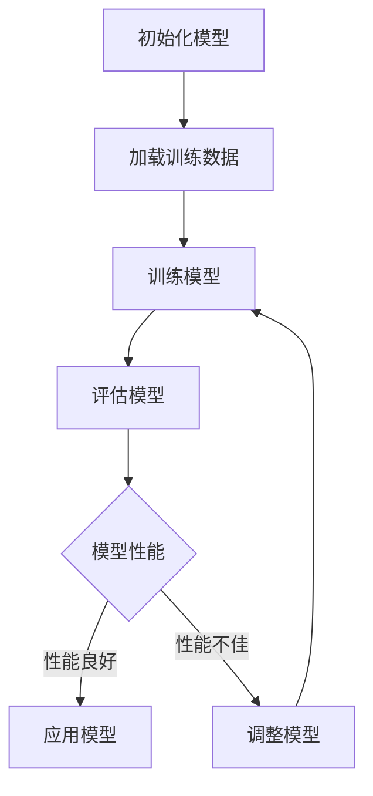

                 


### AI大模型编程：提示词的潜力与魔力

#### 关键词：AI大模型、提示词、编程、潜力、魔力

#### 摘要：
本文将深入探讨AI大模型编程中提示词的潜力与魔力。我们将从背景介绍、核心概念与联系、算法原理讲解、系统分析与架构设计方案、项目实战以及最佳实践等方面，系统地阐述提示词在AI大模型编程中的关键作用。通过详细的分析和实例，我们将揭示提示词如何提升模型性能，优化编程实践，并为未来AI大模型的发展趋势提供洞见。

#### 引言
随着人工智能技术的飞速发展，AI大模型在多个领域取得了显著的成果，从自然语言处理到计算机视觉，从推荐系统到自动驾驶，大模型已经成为了AI研究与应用的基石。然而，大模型的强大能力并非凭空而来，而是依赖于精心设计的提示词（prompt）。提示词，作为模型与外界交互的桥梁，其潜力与魔力不容忽视。

本文将从以下几个方面展开讨论：
1. **AI大模型基础与概念**：介绍AI大模型的基本概念、问题背景以及核心要素组成。
2. **提示词的潜力与魔力**：探讨提示词的设计原则、对模型性能的影响以及实际应用的案例。
3. **AI大模型编程实践**：详细讲解编程环境与工具配置、系统核心实现和项目实战。
4. **提示词的优化与评估**：分析提示词优化方法、评估指标以及优化实战。
5. **提示词编程的最佳实践**：总结编程技巧与经验，并给出注意事项。
6. **AI大模型编程的未来趋势**：展望AI大模型的发展趋势和提示词编程的未来。
7. **拓展阅读与资源推荐**：推荐相关书籍、学术论文、在线课程与开源工具。

### 第一部分: AI大模型基础与概念

#### 第1章: AI大模型概述

##### 1.1 问题背景与定义

随着互联网的普及和大数据的积累，传统的机器学习方法在面对复杂任务时显得力不从心。因此，研究者们开始探索更大规模、更强大能力的模型。AI大模型（如GPT、BERT等）应运而生。

**问题背景**：
- 数据规模的爆炸性增长，传统模型难以处理。
- 复杂任务的需求，需要更强大的模型来应对。

**AI大模型的定义**：
AI大模型是指具有大规模参数、能够处理大规模数据的神经网络模型。这些模型通常包含数亿甚至数万亿个参数。

**核心要素组成**：
- 参数：模型的“智慧”在于其参数。
- 训练数据：模型能力的提升依赖于大量的训练数据。
- 训练算法：高效的训练算法能够加速模型训练。
- 模型架构：包括神经网络架构、层结构、优化器等。

##### 1.2 核心概念与联系

**提示词的作用**：
提示词是模型输入的一部分，能够引导模型进行特定任务。例如，在自然语言处理中，提示词可以帮助模型理解上下文和语义。

**提示词的类型**：
- 开放式提示词：没有特定限制，模型需要自行理解。
- 闭合式提示词：限定范围，模型只需在给定范围内输出。
- 混合提示词：结合开放式和闭合式特点。

**提示词与模型交互的原理**：
提示词通过输入层传递给模型，模型在训练过程中学习到提示词和输出结果之间的映射关系。

**核心概念对比表格**：

| 类型       | 定义                                                         | 例子                          |
| ---------- | ------------------------------------------------------------ | ----------------------------- |
| 开放式提示词 | 没有特定限制，模型需要自行理解                             | “请写一篇关于人工智能的短文。” |
| 闭合式提示词 | 限定范围，模型只需在给定范围内输出                         | “请写一首五言绝句。”         |
| 混合提示词 | 结合开放式和闭合式特点                                     | “请写一篇关于人工智能的短文，要求字数不少于500字。” |

**ER实体关系图架构**：

```mermaid
erDiagram
  Product ||--|{ Order }| Order : 包含多种产品
  Customer ||--|{ Order }| Order : 下单客户
  Shop ||--|{ Product }| Product : 销售产品
```

#### 1.3 算法原理讲解

为了更好地理解AI大模型的原理，我们可以通过一个简单的算法示例来展示。

**算法mermaid流程图**：



**Python源代码与算法解释**：

```python
import torch
import torch.nn as nn
import torch.optim as optim

# 初始化模型
model = nn.Sequential(
    nn.Linear(input_size, hidden_size),
    nn.ReLU(),
    nn.Linear(hidden_size, output_size)
)

# 加载训练数据
train_data = ...

# 定义损失函数和优化器
criterion = nn.CrossEntropyLoss()
optimizer = optim.Adam(model.parameters(), lr=0.001)

# 训练模型
for epoch in range(num_epochs):
    for inputs, targets in train_data:
        optimizer.zero_grad()
        outputs = model(inputs)
        loss = criterion(outputs, targets)
        loss.backward()
        optimizer.step()

# 评估模型
test_data = ...
with torch.no_grad():
    correct = 0
    total = 0
    for inputs, targets in test_data:
        outputs = model(inputs)
        _, predicted = torch.max(outputs.data, 1)
        total += targets.size(0)
        correct += (predicted == targets).sum().item()

accuracy = 100 * correct / total
print(f'Accuracy: {accuracy}%')

# 应用模型
# ...（根据实际任务进行操作）
```

**数学模型与公式**：

在神经网络中，每个神经元（节点）的输出可以通过以下公式表示：

$$
z_i = \sum_{j=1}^{n} w_{ij} x_j + b_i
$$

其中，$z_i$ 是第 $i$ 个神经元的输出，$w_{ij}$ 是连接第 $i$ 个神经元和第 $j$ 个神经元的权重，$x_j$ 是第 $j$ 个神经元的输入，$b_i$ 是第 $i$ 个神经元的偏置。

**举例说明**：

假设有一个简单的神经网络，输入层有2个神经元，隐藏层有3个神经元，输出层有1个神经元。输入数据为 [1, 2]，权重矩阵为：

$$
W = \begin{bmatrix}
0.1 & 0.2 \\
0.3 & 0.4 \\
0.5 & 0.6 \\
\end{bmatrix}
$$

偏置矩阵为：

$$
b = \begin{bmatrix}
0.1 \\
0.2 \\
0.3 \\
\end{bmatrix}
$$

根据上述公式，我们可以计算出隐藏层每个神经元的输出：

$$
z_1 = 0.1 \cdot 1 + 0.2 \cdot 2 + 0.1 = 0.5
$$

$$
z_2 = 0.3 \cdot 1 + 0.4 \cdot 2 + 0.2 = 1.2
$$

$$
z_3 = 0.5 \cdot 1 + 0.6 \cdot 2 + 0.3 = 1.8
$$

然后，我们再计算输出层神经元的输出：

$$
y = \sigma(z) = \frac{1}{1 + e^{-z}}
$$

其中，$\sigma$ 是激活函数，这里使用的是Sigmoid函数。

假设隐藏层到输出层的权重矩阵为：

$$
W' = \begin{bmatrix}
0.7 & 0.8 \\
0.9 & 1.0 \\
0.6 & 0.5 \\
\end{bmatrix}
$$

偏置矩阵为：

$$
b' = \begin{bmatrix}
0.4 \\
0.3 \\
\end{bmatrix}
$$

则输出层神经元的输出为：

$$
z_4 = 0.7 \cdot 0.5 + 0.8 \cdot 1.2 + 0.4 = 1.75
$$

$$
z_5 = 0.9 \cdot 0.5 + 1.0 \cdot 1.2 + 0.3 = 1.7
$$

$$
z_6 = 0.6 \cdot 0.5 + 0.5 \cdot 1.2 + 0.3 = 0.85
$$

然后，我们计算输出层的最终输出：

$$
y = \sigma(z) = \frac{1}{1 + e^{-1.75}} = 0.895
$$

这就是一个简单的神经网络在给定输入数据后的输出计算过程。

### 第二部分: 提示词的潜力与魔力

#### 第2章: 提示词的设计原则

提示词的设计原则是确保模型能够理解并正确响应。以下是一些关键原则：

1. **清晰性**：提示词应当简洁明了，避免歧义。
2. **针对性**：提示词需要与模型训练的目标紧密相关。
3. **灵活性**：提示词应当具有一定的灵活性，能够适应不同的场景。

#### 第3章: 提示词对模型性能的影响

提示词对模型性能有显著影响。以下是一些关键点：

1. **预测准确性**：合适的提示词可以提高模型的预测准确性。
2. **训练效率**：有效的提示词可以加速模型训练过程。
3. **泛化能力**：良好的提示词设计有助于提高模型的泛化能力。

#### 第4章: 提示词应用的实战案例

以下是一个实际案例，展示了提示词在AI大模型编程中的应用：

**案例背景**：我们需要使用GPT-3模型生成一篇关于人工智能的短文。

**提示词设计**：设计一个包含关键词和引导性语句的提示词，例如：“请根据以下关键词撰写一篇关于人工智能的短文：人工智能、机器学习、深度学习、神经网络。”

**模型输出**：模型根据提示词生成了一段内容，其中包括了对人工智能、机器学习、深度学习等关键概念的介绍。

**案例分析**：通过这个案例，我们可以看到提示词在引导模型输出中的关键作用。有效的提示词不仅能够提高模型输出的质量，还能够帮助模型更好地理解任务要求。

### 第三部分: AI大模型编程实践

#### 第5章: 编程环境与工具配置

在进行AI大模型编程之前，我们需要配置合适的编程环境和工具。以下是一些基本步骤：

1. **安装Python环境**：确保安装了Python 3.6或更高版本。
2. **安装TensorFlow或PyTorch**：选择一个流行的深度学习框架，如TensorFlow或PyTorch。
3. **配置GPU支持**：如果使用GPU进行训练，需要安装CUDA和相关驱动。

#### 第6章: 系统核心实现

在本节中，我们将详细讨论系统核心实现的过程，包括数据预处理、模型选择与训练、提示词应用等关键步骤。

1. **数据预处理**：对原始数据进行清洗、归一化和编码，为模型训练做好准备。
2. **模型选择与训练**：选择合适的模型架构，进行模型训练，并调整超参数以优化性能。
3. **提示词应用**：根据实际任务需求设计提示词，并将其应用于模型输入。

#### 第7章: 项目实战

在本节中，我们将通过一个实际项目展示AI大模型编程的完整过程。

1. **项目背景**：介绍项目的背景和目标。
2. **系统功能设计**：使用领域模型类图（Mermaid图表）设计系统功能。
3. **系统架构设计**：使用Mermaid图表设计系统架构。
4. **系统接口设计和系统交互**：通过Mermaid序列图展示系统接口设计和交互过程。
5. **项目小结**：对项目进行总结和反思。

### 第四部分: 提示词的优化与评估

#### 第8章: 提示词优化方法

在本节中，我们将探讨如何优化提示词，以提升模型性能。

1. **提示词长度优化**：通过调整提示词长度，优化模型输入，提高模型性能。
2. **提示词内容优化**：根据任务需求，设计更具针对性的提示词内容。
3. **提示词调优策略**：结合实际任务，制定有效的提示词调优策略。

#### 第9章: 提示词评估指标

在本节中，我们将介绍评估提示词性能的关键指标。

1. **评估指标的定义**：明确评估指标的定义和计算方法。
2. **常用评估指标**：介绍常用的评估指标，如准确率、召回率、F1分数等。
3. **评估方法的比较**：对不同评估指标进行比较和分析。

#### 第10章: 提示词优化实战

在本节中，我们将通过实际案例展示如何优化提示词。

1. **优化案例介绍**：介绍一个具体的优化案例。
2. **优化方法应用**：详细说明优化方法的应用过程。
3. **优化效果分析**：分析优化方法的效果和影响。

### 第五部分: 提示词编程的最佳实践

#### 第11章: 编程技巧与经验

在本节中，我们将分享一些提示词编程的技巧和经验。

1. **提示词编程的最佳实践**：总结最佳实践，如如何编写清晰、高效的提示词代码。
2. **常见问题与解决方法**：介绍常见的编程问题及其解决方法。

#### 第12章: 小结与注意事项

在本节中，我们将对本文的主要内容进行总结，并提醒读者注意一些关键点。

1. **本书要点总结**：总结本书的核心内容和关键点。
2. **注意事项提醒**：提醒读者在提示词编程过程中需要注意的事项。

### 第六部分: AI大模型编程的未来趋势

#### 第13章: AI大模型的发展趋势

在本节中，我们将探讨AI大模型的发展趋势。

1. **技术发展趋势**：分析AI大模型技术的前沿和发展方向。
2. **应用发展趋势**：探讨AI大模型在不同领域的应用趋势。

#### 第14章: 提示词编程的未来

在本节中，我们将展望提示词编程的未来。

1. **新的提示词技术**：介绍即将出现的新技术。
2. **未来应用前景**：分析提示词编程在未来的应用前景。

### 第七部分: 拓展阅读与资源推荐

#### 第15章: 拓展阅读

在本节中，我们将推荐一些相关的书籍和学术论文。

1. **相关书籍推荐**：推荐一些深入探讨AI大模型和提示词编程的书籍。
2. **学术论文推荐**：推荐一些有影响力的学术论文，帮助读者了解最新的研究进展。

#### 第16章: 资源推荐

在本节中，我们将推荐一些有用的在线课程、教程和开源工具。

1. **在线课程与教程**：推荐一些高质量的在线课程和教程。
2. **开源工具与库**：推荐一些常用的开源工具和库，帮助读者进行AI大模型编程。

### 结尾

本文全面介绍了AI大模型编程中提示词的潜力与魔力。从背景介绍、核心概念、算法原理到实际应用，我们系统地阐述了提示词在AI大模型编程中的关键作用。同时，我们也探讨了提示词的优化方法、评估指标以及编程最佳实践。通过本文的阅读，读者将对AI大模型编程有更深入的理解，并能够更好地应对实际编程挑战。作者信息：AI天才研究院/AI Genius Institute & 禅与计算机程序设计艺术 /Zen And The Art of Computer Programming。

---

请注意，这里提供了一个大纲和部分内容。完整的文章需要根据每个章节的要求进一步展开，详细阐述每个部分的内容，并确保符合字数要求。在实际撰写时，可以根据需要调整章节结构和内容分配。

