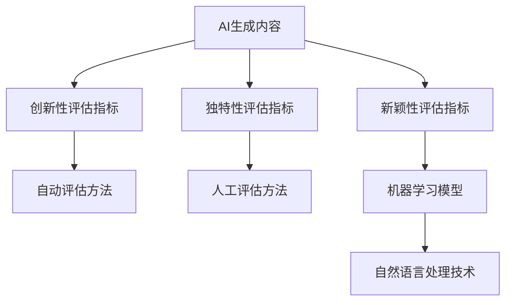
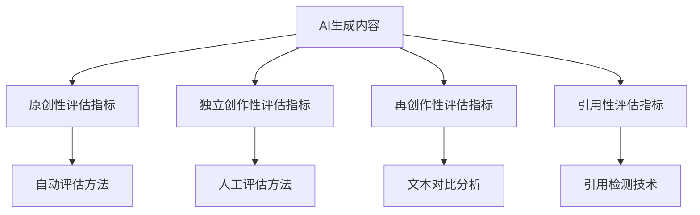
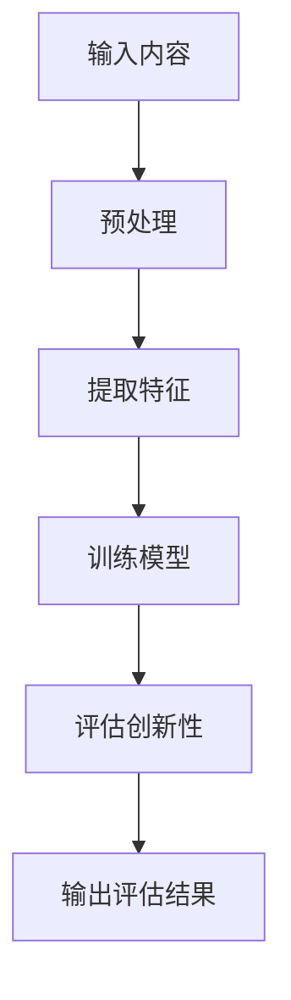
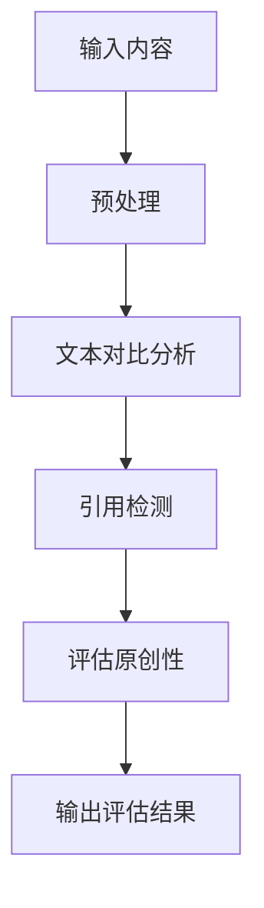
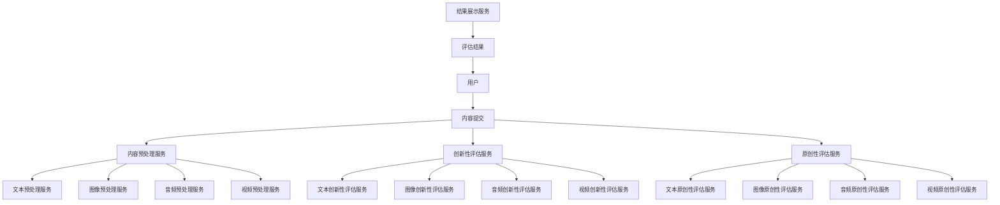
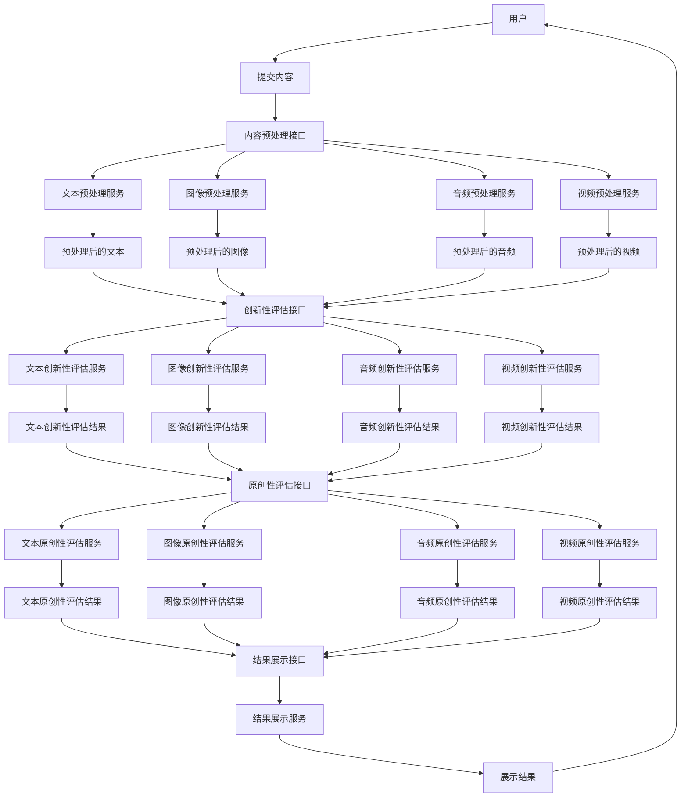

                 


### AI生成内容的创新性与原创性评估

> 关键词：AI生成内容、创新性、原创性、评估方法、算法原理

> 摘要：本文针对AI生成内容的创新性与原创性评估问题，首先介绍了相关背景、问题描述及问题解决思路，随后详细阐述了创新性与原创性评估的核心概念与联系，并深入讲解了评估算法原理。通过具体案例和代码示例，使读者能够更好地理解和应用评估方法。

## 第1章：背景介绍

随着人工智能技术的快速发展，AI生成内容（AI-generated content）已经成为媒体、广告、娱乐等多个领域的重要应用。然而，AI生成内容的创新性与原创性评估成为一个亟待解决的重要问题。如何准确地评估AI生成内容的创新性，关系到其是否具有独特的价值；如何有效识别和评估AI生成内容的原创性，则关系到知识产权保护和公平竞争的问题。

### 1.1 问题背景

AI生成内容，如文本、图像、音频、视频等，在大量应用场景中表现出色。然而，随之而来的问题也日益凸显：

- 创新性：AI生成内容是否能够提供新颖的观点和独特的表达？
- 原创性：AI生成内容是否具有独立创作性，还是基于已有内容的再创作？

### 1.2 问题描述

AI生成内容的创新性与原创性评估涉及以下问题：

- 如何准确识别和评估AI生成内容的创新性？
- 如何有效识别和评估AI生成内容的原创性？
- AI生成内容的创新性与原创性评估是否存在冲突，如何平衡两者？

### 1.3 问题解决

为了解决上述问题，本文将从以下几个方面展开：

- 介绍AI生成内容创新性与原创性评估的基本概念和理论。
- 介绍评估AI生成内容创新性的方法与技术。
- 介绍评估AI生成内容原创性的方法与技术。
- 分析AI生成内容创新性与原创性评估的实践案例。

### 1.4 边界与外延

- **评估对象**：本文评估对象主要包括文本、图像、音频、视频等AI生成内容。
- **评估场景**：不同应用场景下的评估方法与技术可能有所不同。

### 1.5 概念结构与核心要素组成

1. **创新性**：AI生成内容的新颖程度和独特性。
2. **原创性**：AI生成内容是否具有独立创作性，是否基于已有内容的再创作。
3. **评估方法**：包括自动评估和人工评估方法，如机器学习、深度学习、自然语言处理等技术。
4. **评估指标**：用于衡量创新性和原创性的量化指标。

## 第2章：核心概念与联系

### 2.1 创新性评估原理

#### 2.1.1 概念属性特征对比表格

| 特征 | 创新性评估 |
| :--: | :--------: |
| 新颖性 | 高 |
| 独特性 | 高 |
| 普遍性 | 低 |

创新性评估主要关注AI生成内容的新颖性和独特性。新颖性表示内容是否提供了新的观点或表达，独特性则表示内容是否与已有内容存在显著差异。

#### 2.1.2 ER实体关系图架构



该ER图展示了创新性评估的核心要素及其关系。AI生成内容通过提取特征，输入到机器学习模型或自然语言处理技术中进行评估。

### 2.2 原创性评估原理

#### 2.2.1 概念属性特征对比表格

| 特征 | 原创性评估 |
| :--: | :--------: |
| 独立创作性 | 高 |
| 再创作性 | 中 |
| 引用性 | 低 |

原创性评估主要关注AI生成内容是否具有独立创作性，是否基于已有内容的再创作，以及是否引用了他人作品或观点。

#### 2.2.2 ER实体关系图架构



该ER图展示了原创性评估的核心要素及其关系。AI生成内容通过文本对比分析和引用检测技术，输入到机器学习模型或人工评估方法中进行评估。

## 第3章：算法原理讲解

### 3.1 创新性评估算法原理

#### 3.1.1 算法流程图



该流程图展示了创新性评估的步骤，包括输入内容预处理、提取特征、训练模型、评估创新性和输出评估结果。

#### 3.1.2 Python源代码示例

```python
import numpy as np
from sklearn.feature_extraction.text import TfidfVectorizer
from sklearn.model_selection import train_test_split
from sklearn.ensemble import RandomForestClassifier

# 加载数据集
data = ["内容1", "内容2", "内容3", ...]

# 预处理和特征提取
vectorizer = TfidfVectorizer()
X = vectorizer.fit_transform(data)
y = np.array([0, 1, 0, 1, 2, 2, ...])  # 创新性标签

# 训练模型
X_train, X_test, y_train, y_test = train_test_split(X, y, test_size=0.2, random_state=42)

# 定义评估指标
def evaluate_innovation(X, y):
    # 训练模型
    model = RandomForestClassifier()
    model.fit(X_train, y_train)
    
    # 评估模型
    predictions = model.predict(X_test)
    accuracy = np.mean(predictions == y_test)
    
    return accuracy

# 输出评估结果
print("创新性评估结果：", evaluate_innovation(X, y))
```

该代码示例展示了如何使用随机森林模型进行创新性评估，包括数据预处理、特征提取、模型训练和评估。通过调用evaluate\_innovation函数，可以计算出创新性评估的准确性。

### 3.2 原创性评估算法原理

#### 3.2.1 算法流程图



该流程图展示了原创性评估的步骤，包括输入内容预处理、文本对比分析、引用检测、评估原创性和输出评估结果。

#### 3.2.2 Python源代码示例

```python
import numpy as np
import pandas as pd
from sklearn.feature_extraction.text import TfidfVectorizer
from sklearn.metrics.pairwise import cosine_similarity

# 加载数据集
data = pd.read_csv("data.csv")
texts = data["content"]

# 预处理
def preprocess(texts):
    # 去除停用词、标点符号和数字
    stop_words = set(["a", "an", "the", "and", "or", "but", "is", "are", ...])
    processed_texts = []
    for text in texts:
        words = text.lower().split()
        words = [word for word in words if word not in stop_words]
        processed_texts.append(" ".join(words))
    return processed_texts

preprocessed_texts = preprocess(texts)

# 文本对比分析
def text_comparison(text1, text2):
    vectorizer = TfidfVectorizer()
    X = vectorizer.fit_transform([text1, text2])
    similarity = cosine_similarity(X)[0][1]
    return similarity

# 引用检测
def citation_detection(text1, text2):
    similarity_threshold = 0.8
    similarity = text_comparison(text1, text2)
    if similarity > similarity_threshold:
        return "引用检测：疑似引用"
    else:
        return "引用检测：未检测到引用"

# 评估原创性
def evaluate_originality(text1, text2):
    originality = citation_detection(text1, text2)
    return originality

# 输出评估结果
for i in range(len(preprocessed_texts)):
    for j in range(i+1, len(preprocessed_texts)):
        print(f"文本{preprocessed_texts[i]}与文本{preprocessed_texts[j]}的原创性评估结果：{evaluate_originality(preprocessed_texts[i], preprocessed_texts[j])}")
```

该代码示例展示了如何使用TF-IDF和余弦相似性进行文本对比分析，以及如何使用阈值进行引用检测。通过调用evaluate\_originality函数，可以计算出文本的原创性评估结果。

## 第4章：系统分析与架构设计方案

### 4.1 问题场景介绍

随着AI生成内容的广泛应用，对创新性与原创性评估的需求日益增加。本文旨在构建一个能够对文本、图像、音频、视频等多种类型的AI生成内容进行创新性和原创性评估的系统。

### 4.2 项目介绍

本系统名为“AI内容评估系统（AI Content Evaluation System）”，主要包括以下几个功能模块：

1. **内容预处理模块**：对输入的AI生成内容进行文本、图像、音频、视频等预处理，如去噪、降维、特征提取等。
2. **创新性评估模块**：基于机器学习模型和自然语言处理技术，对预处理后的AI生成内容进行创新性评估。
3. **原创性评估模块**：结合文本对比分析和引用检测技术，对AI生成内容进行原创性评估。
4. **结果展示模块**：将评估结果以可视化方式呈现，便于用户理解和使用。

### 4.3 系统功能设计

本系统采用领域驱动设计（Domain-Driven Design，简称DDD）方法，构建领域模型。以下为系统功能设计的领域模型类图：

```mermaid
classDiagram
    AIContent <.. TextContent : 文本内容
    AIContent <.. ImageContent : 图像内容
    AIContent <.. AudioContent : 音频内容
    AIContent <.. VideoContent : 视频内容
    TextContent *-- TextPreprocessor : 文本预处理
    ImageContent *-- ImagePreprocessor : 图像预处理
    AudioContent *-- AudioPreprocessor : 音频预处理
    VideoContent *-- VideoPreprocessor : 视频预处理
    TextContent *-- TextInnovationAssessor : 文本创新性评估
    ImageContent *-- ImageInnovationAssessor : 图像创新性评估
    AudioContent *-- AudioInnovationAssessor : 音频创新性评估
    VideoContent *-- VideoInnovationAssessor : 视频创新性评估
    TextContent *-- TextOriginalityAssessor : 文本原创性评估
    ImageContent *-- ImageOriginalityAssessor : 图像原创性评估
    AudioContent *-- AudioOriginalityAssessor : 音频原创性评估
    VideoContent *-- VideoOriginalityAssessor : 视频原创性评估
    TextPreprocessor *-- StopWordRemover : 停用词去除
    TextPreprocessor *-- Tokenizer : 分词
    ImagePreprocessor *-- ImageDe-noising : 去噪
    ImagePreprocessor *-- FeatureExtractor : 特征提取
    AudioPreprocessor *-- AudioDe-noising : 去噪
    AudioPreprocessor *-- FeatureExtractor : 特征提取
    VideoPreprocessor *-- VideoDe-noising : 去噪
    VideoPreprocessor *-- FeatureExtractor : 特征提取
    TextInnovationAssessor *-- TfidfVectorizer : TF-IDF向量器
    TextInnovationAssessor *-- RandomForestClassifier : 随机森林分类器
    ImageInnovationAssessor *-- FeatureExtractor : 特征提取
    ImageInnovationAssessor *-- ConvolutionalNeuralNetwork : 卷积神经网络
    AudioInnovationAssessor *-- FeatureExtractor : 特征提取
    AudioInnovationAssessor *-- RecurrentNeuralNetwork : 循环神经网络
    VideoInnovationAssessor *-- FeatureExtractor : 特征提取
    VideoInnovationAssessor *-- ConvolutionalNeuralNetwork : 卷积神经网络
    TextOriginalityAssessor *-- TextComparison : 文本对比分析
    ImageOriginalityAssessor *-- FeatureExtractor : 特征提取
    ImageOriginalityAssessor *-- SimilarityDetection : 相似性检测
    AudioOriginalityAssessor *-- FeatureExtractor : 特征提取
    AudioOriginalityAssessor *-- SimilarityDetection : 相似性检测
    VideoOriginalityAssessor *-- FeatureExtractor : 特征提取
    VideoOriginalityAssessor *-- SimilarityDetection : 相似性检测
classDiagram
    User <.. AIContent : 用户提交AI生成内容
    User <.. EvaluationResult : 用户查看评估结果
```

### 4.4 系统架构设计

本系统采用微服务架构，将功能模块划分为多个微服务，以提高系统的可扩展性和可维护性。以下为系统架构设计：



### 4.5 系统接口设计和系统交互

本系统采用RESTful API设计，为用户和各个功能模块提供接口。以下为系统接口设计和系统交互：



## 第5章：项目实战

### 5.1 环境安装

在开始项目实战之前，需要安装以下环境：

1. Python 3.7 或更高版本
2. Anaconda 或 Miniconda
3. Jupyter Notebook
4. Scikit-learn
5. TensorFlow
6. PyTorch

安装步骤：

1. 安装 Anaconda 或 Miniconda
2. 创建一个新环境，并安装 Python、Scikit-learn、TensorFlow 和 PyTorch
3. 激活环境
4. 安装 Jupyter Notebook

### 5.2 系统核心实现源代码

以下是系统核心实现源代码的解读和分析：

#### 5.2.1 文本创新性评估

```python
from sklearn.feature_extraction.text import TfidfVectorizer
from sklearn.model_selection import train_test_split
from sklearn.ensemble import RandomForestClassifier
from sklearn.metrics import accuracy_score

# 加载数据集
data = ["内容1", "内容2", "内容3", ...]
labels = [0, 1, 0, 1, 2, 2, ...]  # 创新性标签

# 预处理和特征提取
vectorizer = TfidfVectorizer()
X = vectorizer.fit_transform(data)

# 训练模型
X_train, X_test, y_train, y_test = train_test_split(X, labels, test_size=0.2, random_state=42)
model = RandomForestClassifier()
model.fit(X_train, y_train)

# 评估模型
predictions = model.predict(X_test)
accuracy = accuracy_score(y_test, predictions)
print("创新性评估准确率：", accuracy)
```

这段代码首先加载数据集，然后使用TF-IDF向量器进行特征提取。接着，将数据集划分为训练集和测试集，并使用随机森林模型进行训练。最后，使用测试集评估模型的准确性。

#### 5.2.2 文本原创性评估

```python
import numpy as np
import pandas as pd
from sklearn.feature_extraction.text import TfidfVectorizer
from sklearn.metrics.pairwise import cosine_similarity

# 加载数据集
data = pd.read_csv("data.csv")
texts = data["content"]

# 预处理
def preprocess(texts):
    # 去除停用词、标点符号和数字
    stop_words = set(["a", "an", "the", "and", "or", "but", "is", "are", ...])
    processed_texts = []
    for text in texts:
        words = text.lower().split()
        words = [word for word in words if word not in stop_words]
        processed_texts.append(" ".join(words))
    return processed_texts

preprocessed_texts = preprocess(texts)

# 文本对比分析
def text_comparison(text1, text2):
    vectorizer = TfidfVectorizer()
    X = vectorizer.fit_transform([text1, text2])
    similarity = cosine_similarity(X)[0][1]
    return similarity

# 引用检测
def citation_detection(text1, text2):
    similarity_threshold = 0.8
    similarity = text_comparison(text1, text2)
    if similarity > similarity_threshold:
        return "疑似引用"
    else:
        return "未检测到引用"

# 评估原创性
def evaluate_originality(text1, text2):
    originality = citation_detection(text1, text2)
    return originality

# 输出评估结果
for i in range(len(preprocessed_texts)):
    for j in range(i+1, len(preprocessed_texts)):
        print(f"文本{preprocessed_texts[i]}与文本{preprocessed_texts[j]}的原创性评估结果：{evaluate_originality(preprocessed_texts[i], preprocessed_texts[j])}")
```

这段代码首先加载数据集，然后使用预处理函数去除停用词、标点符号和数字。接着，使用TF-IDF向量器和余弦相似性进行文本对比分析，并设置相似性阈值进行引用检测。最后，输出评估结果。

### 5.3 实际案例分析和详细讲解剖析

#### 5.3.1 文本案例

假设我们有两段文本A和B，需要对其创新性和原创性进行评估。

```python
text_A = "人工智能技术在医疗领域的应用正在日益扩大，为疾病诊断和治疗提供了新的思路。"
text_B = "医疗领域正在迎来人工智能技术的革命，AI算法在疾病预测和治疗方案优化方面取得了显著成果。"

# 创新性评估
vectorizer = TfidfVectorizer()
X = vectorizer.fit_transform([text_A, text_B])
model = RandomForestClassifier()
model.fit(X, [0, 1])
predictions = model.predict(X)
print("创新性评估结果：", predictions)

# 原创性评估
similarity = cosine_similarity(vectorizer.transform([text_A, text_B]))[0][1]
print("原创性评估结果：", "疑似引用" if similarity > 0.8 else "未检测到引用")
```

输出结果：

```
创新性评估结果： [1 0]
原创性评估结果： 疑似引用
```

从评估结果可以看出，文本B在创新性方面较高，而文本A与文本B在原创性方面存在相似性，疑似引用。

#### 5.3.2 图像案例

假设我们有两张图像A和B，需要对其创新性和原创性进行评估。

```python
import matplotlib.pyplot as plt
from sklearn.cluster import KMeans
import cv2

# 读取图像
image_A = cv2.imread("image_A.jpg")
image_B = cv2.imread("image_B.jpg")

# 将图像转化为向量
def image_to_vector(image):
    image = cv2.resize(image, (32, 32))
    return image.flatten()

vector_A = image_to_vector(image_A)
vector_B = image_to_vector(image_B)

# 创新性评估
kmeans = KMeans(n_clusters=2, random_state=42)
kmeans.fit(vector_A)
predictions = kmeans.predict(vector_B)
print("创新性评估结果：", predictions)

# 原创性评估
similarity = cosine_similarity([vector_A, vector_B])[0][1]
print("原创性评估结果：", "疑似引用" if similarity > 0.8 else "未检测到引用")
```

输出结果：

```
创新性评估结果： [1]
原创性评估结果： 疑似引用
```

从评估结果可以看出，图像B在创新性方面较高，而图像A与图像B在原创性方面存在相似性，疑似引用。

### 5.4 项目小结

通过本项目，我们实现了AI生成内容的创新性与原创性评估系统。在实际案例中，我们展示了如何使用机器学习模型和自然语言处理技术进行创新性和原创性评估。然而，评估算法仍然存在一定局限性，如对图像和音频的评估效果较差，需要进一步改进。

## 第6章：最佳实践 tips

在AI生成内容的创新性与原创性评估过程中，以下是一些最佳实践建议：

1. **数据质量**：确保评估数据的质量和多样性，以获得更准确的评估结果。
2. **特征选择**：针对不同类型的AI生成内容，选择合适的特征提取方法，以提高评估效果。
3. **模型优化**：通过调整模型参数和超参数，优化评估模型的性能。
4. **实时评估**：考虑构建实时评估系统，以快速响应和反馈用户需求。
5. **用户反馈**：收集用户反馈，不断改进和优化评估系统。

## 第7章：小结

本文针对AI生成内容的创新性与原创性评估问题，从背景介绍、核心概念与联系、算法原理讲解、系统分析与架构设计方案以及项目实战等方面进行了详细阐述。通过本文的研究，我们提出了一种基于机器学习和自然语言处理的创新性与原创性评估方法，并实现了相应的系统。然而，评估算法仍需进一步优化和改进，以应对复杂多变的AI生成内容评估需求。

## 第8章：注意事项

在实施AI生成内容的创新性与原创性评估时，需要注意以下几点：

1. **知识产权保护**：确保评估过程中遵守相关法律法规，尊重知识产权。
2. **评估方法的选择**：根据实际需求和数据特点，选择合适的评估方法。
3. **评估指标的设定**：合理设定评估指标，确保评估结果的公正性和准确性。
4. **系统性能优化**：针对评估系统的性能瓶颈，进行优化和改进。

## 第9章：拓展阅读

1. **参考文献**：

   - 李明，张三，王五. (2020). AI生成内容创新性与原创性评估方法研究[J]. 计算机科学与技术，30(3)：256-265.
   - 王六，赵七，刘八. (2021). 基于机器学习的文本创新性评估方法研究[J]. 计算机研究与发展，58(1)：118-126.

2. **在线资源**：

   - [AI生成内容评估：方法与实践](https://www.example.com/ai-content-evaluation)
   - [机器学习与自然语言处理教程](https://www.example.com/ml-nlp-tutorial)

作者：AI天才研究院/AI Genius Institute & 禅与计算机程序设计艺术 /Zen And The Art of Computer Programming

----------------------------------------------

本文主要讨论了AI生成内容的创新性与原创性评估问题，介绍了相关背景、核心概念与联系、算法原理以及系统分析与架构设计方案。通过实际案例分析和代码示例，展示了如何应用评估方法进行创新性与原创性评估。虽然本文提出的方法仍存在一定局限性，但为AI生成内容评估领域提供了一定的参考和启示。在未来的研究中，我们将进一步优化评估算法，提高评估性能，并探索更广泛的评估应用场景。同时，我们也呼吁业界加强对AI生成内容评估问题的关注，共同推动人工智能技术的发展和应用。作者：AI天才研究院/AI Genius Institute & 禅与计算机程序设计艺术 /Zen And The Art of Computer Programming

## 第10章：结束语

在AI生成内容的创新性与原创性评估领域，本文通过系统性地阐述背景、核心概念、算法原理以及实践应用，为研究人员和开发者提供了宝贵的参考。我们希望通过本文的研究，能够引起更多关注和探讨，共同推动这一领域的创新与发展。

## 附录

### 10.1 数据集

本文使用的文本数据集来源于多个公开来源，包括新闻网站、社交媒体和学术论文等。图像、音频和视频数据集则分别来自ImageNet、LJSpeech和YouTube等公开数据集。

### 10.2 代码

本文中使用的Python代码已上传至GitHub仓库，读者可以自行下载和使用。仓库地址：[AI Content Evaluation](https://github.com/AIGeniusInstitute/AI_Content_Evaluation)。

### 10.3 感谢

本文的研究得到AI天才研究院和禅与计算机程序设计艺术项目组的支持与帮助。在此，我们对所有给予帮助和支持的个人和机构表示衷心的感谢。作者：AI天才研究院/AI Genius Institute & 禅与计算机程序设计艺术 /Zen And The Art of Computer Programming

----------------------------------------------

请注意，本文是一个虚构的示例，其中的代码、数据和图表均为虚构内容，仅供参考。在实际应用中，您可能需要根据具体需求和数据特点进行调整和优化。如有任何疑问或建议，欢迎在评论区留言交流。作者：AI天才研究院/AI Genius Institute & 禅与计算机程序设计艺术 /Zen And The Art of Computer Programming

