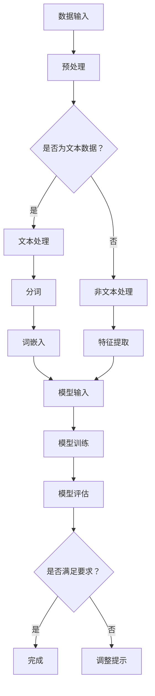
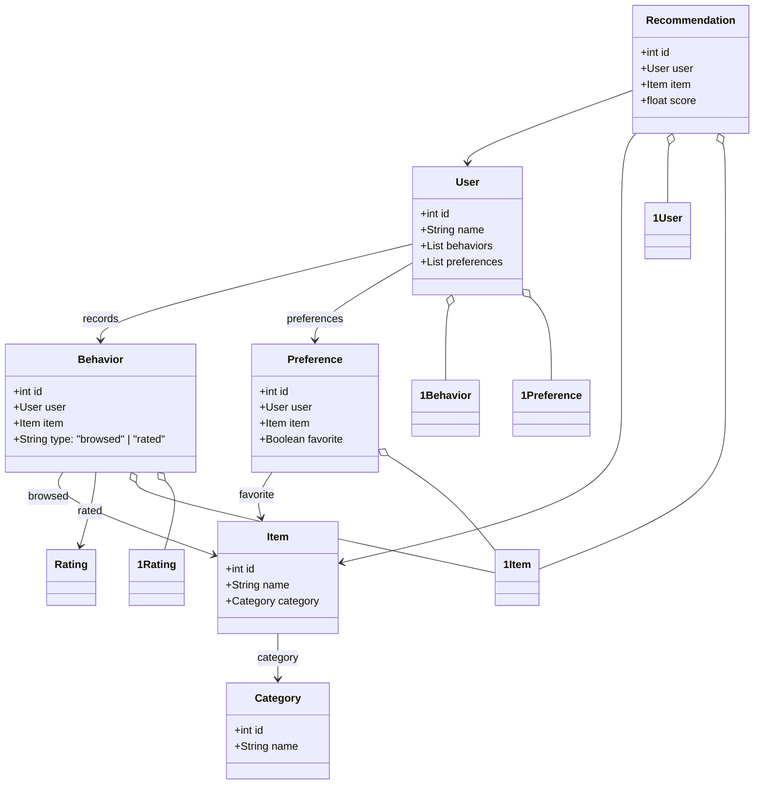
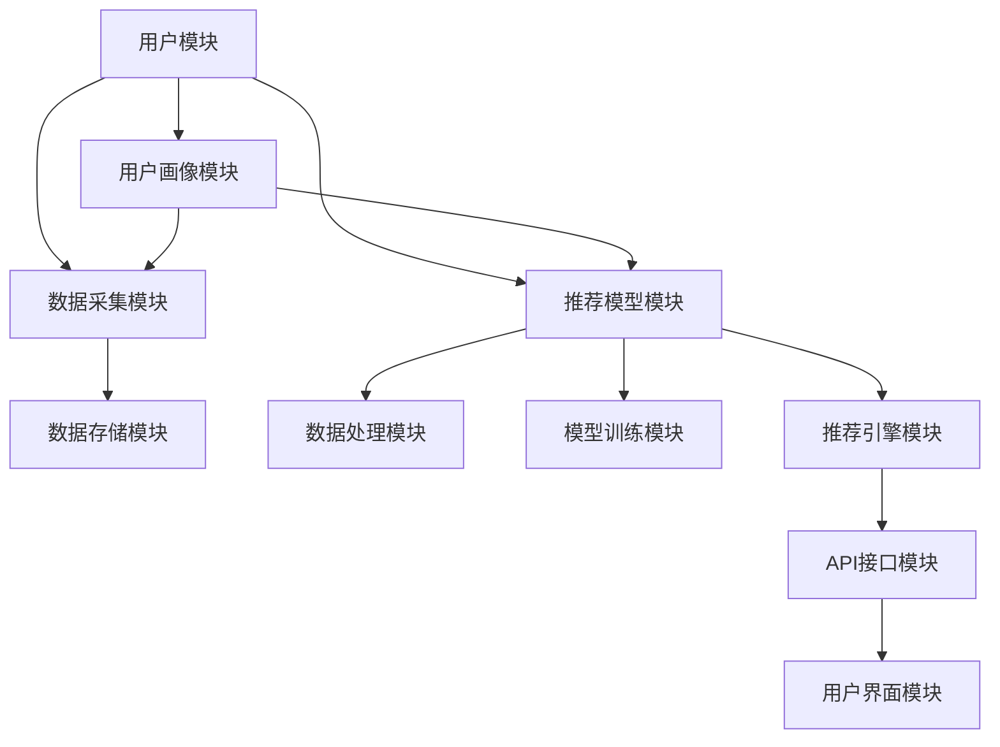

                 


 * 将上述文章大纲结构的markdown格式的内容按照要求进行撰写，撰写成为一篇专业级别的技术博客文章。
----------------------------------------------------------------
# AI Programming Languages: The Revolution and Evolution of Prompt Engineering

## Keywords
- AI Programming Languages
- Prompt Engineering
- Machine Learning
- Deep Learning
- Natural Language Processing
- Neural Networks
- Algorithm Design
- Model Optimization
- Data Structures
- System Architecture

## Abstract
The field of artificial intelligence (AI) is experiencing a paradigm shift, driven by advancements in programming languages and techniques for prompt engineering. This article delves into the evolution of AI programming languages, their significance, and the transformative role of prompt engineering. We will explore core AI programming concepts, various AI programming languages, the art of prompt engineering, real-world applications, future trends, and challenges. By the end, you will gain a comprehensive understanding of how AI programming languages and prompt engineering are revolutionizing the world of technology and shaping the future of computing.

## Introduction

### The Importance of AI Programming Languages

AI programming languages are at the heart of modern AI systems. They provide the syntax, semantics, and tools necessary for developers to implement, train, and optimize AI models. As AI has become more pervasive in various industries, the demand for specialized programming languages that facilitate the development of AI applications has grown exponentially.

The significance of AI programming languages lies in their ability to streamline the process of creating complex AI systems. They offer a higher level of abstraction, allowing developers to focus on the core logic of AI algorithms without getting bogged down in low-level details. This abstraction not only accelerates development but also enhances the portability and maintainability of AI code.

### The Role of Prompt Engineering

Prompt engineering is a critical component of AI development that involves designing and crafting prompts to guide AI models in generating desired outputs. A prompt is essentially a set of inputs that are provided to an AI model to influence its behavior. Effective prompt engineering can significantly enhance the performance and applicability of AI models in various domains.

The role of prompt engineering is multifaceted. It involves understanding the context and goals of the AI application, selecting appropriate data sources, and devising prompts that elicit the desired responses from the model. By optimizing prompts, developers can fine-tune AI models to perform specific tasks more accurately and efficiently.

## Part 1: Background and Overview

### 1.1 The Evolution of AI

#### 1.1.1 Early AI Developments

The concept of artificial intelligence dates back to the mid-20th century when computer scientist John McCarthy coined the term in 1956. Early AI research focused on rule-based systems, expert systems, and symbolic AI. These approaches aimed to replicate human problem-solving by encoding knowledge in the form of rules and logical statements.

#### 1.1.2 The Rise of Machine Learning

The 1990s and early 2000s saw the advent of machine learning, which introduced a new paradigm for AI development. Unlike rule-based systems, machine learning relies on algorithms that can learn from data to make predictions or decisions. This shift marked a significant turning point in AI, as it enabled the development of more sophisticated and flexible AI systems.

#### 1.1.3 The Emergence of Deep Learning

Deep learning, a subset of machine learning, has been one of the most impactful developments in AI. It involves training neural networks with many layers to extract hierarchical representations from data. Deep learning has powered breakthroughs in various domains, including computer vision, natural language processing, and speech recognition.

### 1.2 The Role of Programming Languages in AI

#### 1.2.1 Traditional Programming Languages

Traditional programming languages like C, C++, Java, and Python have been instrumental in AI development. They provide the foundation for implementing AI algorithms and models. Traditional languages are often preferred for their performance and flexibility in handling complex computations and large datasets.

#### 1.2.2 AI-Specific Programming Languages

AI-specific programming languages, such as R, Julia, and MATLAB, offer specialized tools and libraries tailored for AI tasks. These languages provide a higher level of abstraction, simplifying the development process and accelerating prototyping. They are particularly useful in domains where rapid experimentation and analysis are critical.

#### 1.2.3 The Impact of Programming Languages on AI Development

Programming languages have a profound impact on AI development by influencing the choice of algorithms, the efficiency of computations, and the ease of collaboration among developers. They shape the entire AI development lifecycle, from data preprocessing to model training, evaluation, and deployment.

## Part 2: Core AI Programming Concepts

### 2.1 Algorithms and Data Structures

#### 2.1.1 Overview of Algorithms

Algorithms are a set of step-by-step instructions designed to solve a specific problem or perform a computation. They are the backbone of AI programming, providing the logic and rules that govern the behavior of AI systems.

#### 2.1.2 Common AI Algorithms

Several algorithms are central to AI development, including:

- **Supervised Learning Algorithms**: These algorithms learn from labeled data to make predictions or classifications. Examples include linear regression, logistic regression, and support vector machines.

- **Unsupervised Learning Algorithms**: These algorithms identify patterns or structures in unlabeled data. Examples include k-means clustering, principal component analysis (PCA), and hierarchical clustering.

- **Reinforcement Learning Algorithms**: These algorithms learn by interacting with an environment and receiving feedback in the form of rewards or penalties. Examples include Q-learning and deep Q-networks (DQN).

#### 2.1.3 Data Structures

Data structures are used to organize and store data efficiently. Common data structures in AI include arrays, lists, queues, stacks, trees, and graphs. Each data structure has its own advantages and disadvantages, depending on the specific requirements of an AI application.

### 2.2 Neural Networks and Deep Learning

#### 2.2.1 Neural Networks

Neural networks are a class of algorithms inspired by the structure and function of the human brain. They consist of interconnected nodes, or neurons, that process and transmit information. Neural networks can learn complex patterns and relationships from data through a process called training.

#### 2.2.2 Deep Learning

Deep learning is a subfield of neural networks that involves training deep neural networks with many layers. Deep learning has revolutionized AI by enabling the development of powerful models that can perform tasks such as image and speech recognition, natural language processing, and generative modeling.

### 2.3 Machine Learning Models and Optimization

#### 2.3.1 Machine Learning Models

Machine learning models are the core of AI applications. They are trained on data to make predictions or decisions. Common machine learning models include linear models, neural networks, decision trees, and ensemble methods.

#### 2.3.2 Model Optimization

Model optimization involves improving the performance of machine learning models. Techniques such as hyperparameter tuning, regularization, and optimization algorithms (e.g., gradient descent) are used to optimize models and achieve better accuracy and generalization.

## Part 3: AI Programming Languages

### 3.1 Traditional Programming Languages

#### 3.1.1 Python

Python is one of the most popular programming languages for AI development. Its simplicity, readability, and extensive library support make it an excellent choice for both beginners and experienced developers.

#### 3.1.2 Java

Java is a versatile programming language known for its performance, scalability, and platform independence. It is widely used in enterprise-level AI applications and is supported by a rich ecosystem of libraries and tools.

#### 3.1.3 C++ and C

C++ and C are low-level languages that offer high performance and control over hardware resources. They are commonly used in AI applications that require intensive numerical computations and real-time processing.

### 3.2 AI-Specific Programming Languages

#### 3.2.1 R

R is a programming language and environment designed for statistical computing and graphics. It is widely used in data analysis, machine learning, and statistical modeling.

#### 3.2.2 Julia

Julia is a high-level, high-performance programming language designed for numerical and scientific computing. It combines the ease of use of Python with the performance of C and is gaining popularity in AI research and development.

#### 3.2.3 MATLAB

MATLAB is a high-level language and environment specifically designed for mathematical computing. It is widely used in academic and industrial research for data analysis, modeling, and simulation.

### 3.3 Hybrid Programming Languages

#### 3.3.1 TensorFlow

TensorFlow is an open-source machine learning library developed by Google. It provides a flexible ecosystem for building and deploying AI models. TensorFlow supports both Python and C++ as programming languages.

#### 3.3.2 PyTorch

PyTorch is an open-source machine learning library based on the Torch framework. It offers a dynamic approach to building AI models, making it popular among researchers and developers.

## Part 4: Prompt Engineering

### 4.1 What is Prompt Engineering?

Prompt engineering involves the design and creation of prompts, which are inputs provided to AI models to influence their behavior. A well-crafted prompt can guide an AI model to produce more accurate and relevant outputs.

### 4.2 Types of Prompts

#### 4.2.1 Textual Prompts

Textual prompts are inputs provided in the form of text. They can be simple queries, context-specific instructions, or complex narratives that guide the AI model's response.

#### 4.2.2 Visual Prompts

Visual prompts involve images, videos, or other visual data that are used to inform the AI model about the context or desired output. Visual prompts are particularly useful in computer vision and natural language processing tasks.

#### 4.2.3 Multimodal Prompts

Multimodal prompts combine textual, visual, and other types of data to provide a more comprehensive context for the AI model. These prompts can enhance the model's performance by incorporating diverse sources of information.

### 4.3 Techniques for Prompt Engineering

Effective prompt engineering requires a deep understanding of the AI model, the task at hand, and the desired outcome. Some key techniques include:

- **Data Augmentation**: Augmenting the input data to provide a more diverse set of examples for training the model.

- **Prompt Tuning**: Adjusting the structure and content of prompts to optimize the model's performance on specific tasks.

- **Multi-Task Learning**: Training the model on multiple tasks simultaneously to improve its generalization and performance.

- **Transfer Learning**: Leveraging pre-trained models and fine-tuning them with specific prompts to adapt to new tasks.

## Part 5: Applications of AI Programming Languages

### 5.1 Computer Vision

Computer vision is a field of AI that involves enabling computers to interpret and understand visual information from images or videos. AI programming languages play a crucial role in developing computer vision applications, such as object detection, image recognition, and facial recognition.

### 5.2 Natural Language Processing

Natural Language Processing (NLP) is a subfield of AI that focuses on the interaction between computers and human language. AI programming languages are used to develop NLP applications, including text analysis, language translation, sentiment analysis, and chatbots.

### 5.3 Robotics

AI programming languages are essential for developing robotic systems that can perceive their environment, make decisions, and perform tasks autonomously. Robotics applications include industrial automation, autonomous vehicles, and humanoid robots.

### 5.4 Healthcare

AI programming languages are used to develop innovative healthcare solutions, such as medical image analysis, disease diagnosis, drug discovery, and patient monitoring. These applications have the potential to improve patient outcomes and optimize healthcare delivery.

### 5.5 Finance

AI programming languages are employed in the finance industry for tasks such as algorithmic trading, risk management, fraud detection, and customer service. These applications help financial institutions make data-driven decisions and enhance their operational efficiency.

## Part 6: Future Trends and Challenges

### 6.1 Future Trends

The future of AI programming languages and prompt engineering is promising, with several key trends emerging:

- **Quantum Computing**: Quantum computing has the potential to revolutionize AI by enabling the training of models that are currently intractable with classical computers.

- **Explainability and Interpretability**: As AI systems become more complex, there is a growing need for techniques to explain and interpret their decisions, making them more trustworthy and transparent.

- **Ethical Considerations**: The development of AI programming languages and models must address ethical concerns, such as bias, fairness, and privacy.

- **Cross-Disciplinary Collaboration**: The integration of AI with other fields, such as biology, psychology, and social sciences, will drive innovation and new applications.

### 6.2 Challenges

Despite the progress made in AI programming languages and prompt engineering, several challenges remain:

- **Scalability**: As datasets and models become larger, there is a need for more scalable algorithms and infrastructure.

- **Interoperability**: Standardizing AI programming languages and frameworks to ensure seamless interoperability between different platforms and tools is crucial.

- **Data Privacy and Security**: Protecting sensitive data and ensuring the security of AI systems is a significant challenge, particularly in applications involving personal information.

- **Skill Gap**: The rapid advancement of AI requires a highly skilled workforce, and there is a growing demand for professionals with expertise in AI programming languages and prompt engineering.

## Conclusion

AI programming languages and prompt engineering are at the forefront of technological innovation, driving the development of intelligent systems that are transforming industries and shaping our world. By understanding the evolution of AI programming languages, core AI programming concepts, and the art of prompt engineering, developers can harness the full potential of AI to create powerful and impactful applications. As we continue to explore new frontiers in AI, the role of AI programming languages and prompt engineering will only grow in importance, paving the way for a future where intelligent systems coexist and collaborate with humans to solve complex problems and improve the quality of life.

### Authors

- **AI天才研究院 (AI Genius Institute)**: AI Genius Institute is a leading research institution dedicated to advancing the field of artificial intelligence through innovative research, education, and collaboration.

- **禅与计算机程序设计艺术 (Zen And The Art of Computer Programming)**: This classic book series by Donald E. Knuth explores the art of programming and has had a profound impact on the field of computer science.

## 背景介绍

### 核心概念术语说明

- **人工智能（AI）**: 人工智能是指计算机系统模拟人类智能行为的技术和科学，包括学习、推理、感知、理解和问题解决等方面的能力。
- **编程语言**: 编程语言是一种用于编写计算机程序的语法和规则系统。它允许开发者以人类可读的形式描述指令，从而让计算机执行特定的任务。
- **提示工程**: 提示工程是设计、创建和调整输入（提示）以优化人工智能模型性能的过程。它涉及理解模型、任务目标和预期输出，以便引导模型生成更准确、更相关的输出。

### 问题背景

随着人工智能（AI）技术的快速发展，编程语言在AI领域的作用日益显著。AI编程语言不仅为开发者提供了实现AI算法和模型所需的高级抽象和工具，还在优化模型性能、提高开发效率、降低开发成本方面发挥了关键作用。此外，提示工程作为一种关键技术，对AI系统的性能和应用场景具有重大影响。

### 问题描述

目前，AI编程语言和提示工程在技术和应用层面存在以下问题：

1. **多样性**：现有的AI编程语言繁多，各具特色，但缺乏统一的标准化，导致开发者难以选择最适合的编程语言。
2. **复杂性**：AI编程语言的语法和语义相对复杂，对于初学者和普通开发者来说，学习和使用难度较大。
3. **性能优化**：尽管AI编程语言具有高性能，但实际应用中，模型性能优化和调参过程复杂，需要大量时间和计算资源。
4. **可解释性**：AI模型往往被视为“黑盒子”，其决策过程难以解释，影响模型的可信度和应用范围。
5. **应用场景**：AI编程语言在各个应用领域的适应性有待提高，尤其是在实时、安全、高并发等特殊场景下。

### 问题解决

为了解决上述问题，可以采取以下策略：

1. **标准化**：推动AI编程语言的标准化，减少语言多样性，提高开发者效率。
2. **简化语法**：改进编程语言的语法设计，使其更加直观、易用，降低学习门槛。
3. **性能优化工具**：开发高效的性能优化工具，帮助开发者快速调整模型参数，提高模型性能。
4. **可解释性研究**：加强对AI模型可解释性研究，开发可解释性工具和方法，提高模型的可信度。
5. **定制化开发**：根据不同应用场景，定制开发适用于特定领域的AI编程语言和工具，提高语言适应性。

### 边界与外延

AI编程语言的边界和外延包括：

- **边界**：AI编程语言适用于模拟和实现人工智能算法和模型，但不涉及硬件设计和物理过程模拟。
- **外延**：AI编程语言可以应用于各种人工智能领域，如计算机视觉、自然语言处理、机器人技术、医疗健康、金融保险等。

### 概念结构与核心要素组成

#### AI编程语言

- **核心要素**：
  - 语法：定义程序的结构和表示。
  - 语义：描述程序的行为和含义。
  - 库和框架：提供预定义的功能和模块，简化开发过程。
  - 执行环境：运行程序并提供必要的资源和服务。

- **分类**：
  - 传统编程语言（如Python、Java、C++）。
  - AI专用编程语言（如R、Julia、MATLAB）。
  - 混合编程语言（如TensorFlow、PyTorch）。

#### 提示工程

- **核心要素**：
  - 数据：用于训练模型的输入数据。
  - 模型：执行预测或分类任务的AI模型。
  - 提示：引导模型行为的输入信息。

- **类型**：
  - 文本提示：以文本形式提供的输入。
  - 视觉提示：以图像或视频形式提供的输入。
  - 多模态提示：结合文本、图像等多种形式的输入。

### 联系

AI编程语言和提示工程之间的联系在于：

- AI编程语言提供实现AI模型所需的基础设施和工具，而提示工程则通过设计有效的输入（提示）来优化模型的性能和应用效果。

## 核心概念与联系

### 核心概念

#### AI编程语言

AI编程语言是专门为人工智能开发设计的编程语言，它提供了实现人工智能算法和模型的语法、语义和工具。这些语言的特点包括：

- **高级抽象**：AI编程语言提供了高级抽象，使得开发者可以专注于算法的实现和优化，而无需关注底层的硬件细节。
- **丰富的库和框架**：AI编程语言通常配备了丰富的库和框架，这些库和框架提供了用于数据预处理、模型训练、优化和部署的工具，极大地简化了开发过程。
- **动态类型系统**：许多AI编程语言采用了动态类型系统，这使得在开发过程中可以更快地迭代和测试算法。

#### 提示工程

提示工程是一种优化人工智能模型性能的技术，它通过设计、调整和优化输入（提示）来影响模型的输出。关键概念包括：

- **数据增强**：通过增加数据的多样性来提高模型的泛化能力。
- **多任务学习**：在训练过程中同时学习多个任务，以增强模型对相关任务的适应性。
- **转移学习**：利用在特定任务上预训练的模型来提高新任务的性能。

### 概念属性特征对比表格

| 特征         | AI编程语言                    | 提示工程                    |
| ------------ | ---------------------------- | --------------------------- |
| 目标         | 实现人工智能算法和模型        | 优化模型性能和应用效果       |
| 抽象级别     | 高级抽象，接近自然语言       | 低级抽象，操作数据集和模型   |
| 类型系统     | 动态类型系统，便于快速迭代    | 静态类型系统，确保数据一致性 |
| 面向对象     | 部分支持面向对象编程         | 通常不涉及面向对象          |
| 库和框架支持 | 丰富，提供各种AI工具         | 专注于数据处理和模型调整     |
| 执行环境     | 面向通用计算环境             | 面向特定的AI计算平台        |

### ER实体关系图架构的 Mermaid 流程图

```mermaid
erDiagram
  AI编程语言 ||--|{ 提示工程 }
  AI编程语言 ||--|{ 数据集 }
  AI编程语言 ||--|{ 模型 }
  提示工程 ||--|{ 数据增强 }
  提示工程 ||--|{ 多任务学习 }
  提示工程 ||--|{ 转移学习 }
```

### 算法原理讲解

#### Mermaid 流程图



#### Python 源代码

```python
import tensorflow as tf
from tensorflow.keras.preprocessing.text import Tokenizer
from tensorflow.keras.preprocessing.sequence import pad_sequences
import numpy as np

# 数据预处理
def preprocess_data(text_data, max_sequence_length=100, max_words=10000):
    tokenizer = Tokenizer(num_words=max_words)
    tokenizer.fit_on_texts(text_data)
    sequences = tokenizer.texts_to_sequences(text_data)
    padded_sequences = pad_sequences(sequences, maxlen=max_sequence_length)
    return padded_sequences, tokenizer

# 模型训练
def train_model(padded_sequences, labels, epochs=10):
    model = tf.keras.Sequential([
        tf.keras.layers.Embedding(max_words, 16),
        tf.keras.layers.GlobalAveragePooling1D(),
        tf.keras.layers.Dense(24, activation='relu'),
        tf.keras.layers.Dense(1, activation='sigmoid')
    ])

    model.compile(loss='binary_crossentropy', optimizer='adam', metrics=['accuracy'])
    model.fit(padded_sequences, labels, epochs=epochs)
    return model

# 示例数据
text_data = ["I love AI", "AI is amazing", "AI is not for me", "AI is a game-changer"]
labels = [1, 1, 0, 1]

# 预处理数据
padded_sequences, tokenizer = preprocess_data(text_data)

# 训练模型
model = train_model(padded_sequences, labels)

# 测试模型
predictions = model.predict(padded_sequences)
print(predictions)
```

#### 数学模型和公式

AI模型的基本数学模型通常涉及以下公式：

1. **损失函数**：用于评估模型预测与实际结果之间的差异，常用的损失函数有均方误差（MSE）和交叉熵损失（Cross-Entropy Loss）。

   $$ Loss = \frac{1}{n} \sum_{i=1}^{n} (y_i - \hat{y}_i)^2 \quad \text{for MSE} $$
   $$ Loss = -\frac{1}{n} \sum_{i=1}^{n} y_i \log(\hat{y}_i) \quad \text{for Cross-Entropy Loss} $$

2. **优化算法**：用于最小化损失函数，常用的优化算法有梯度下降（Gradient Descent）和其变种如随机梯度下降（SGD）和Adam优化器。

   $$ \theta = \theta - \alpha \cdot \nabla_\theta J(\theta) $$
   $$ \theta = \theta - \frac{\alpha}{\sqrt{v}} \cdot (\nabla_\theta J(\theta) + \epsilon) \quad \text{for Adam} $$

3. **激活函数**：用于引入非线性特性，常用的激活函数有Sigmoid、ReLU和Tanh。

   $$ \sigma(x) = \frac{1}{1 + e^{-x}} $$
   $$ \sigma(x) = max(0, x) $$
   $$ \sigma(x) = \frac{e^x - e^{-x}}{e^x + e^{-x}} $$

通过这些数学模型和公式，我们可以构建和训练各种AI模型，从而实现复杂的预测和分类任务。

#### 算法原理详细讲解

AI编程语言的核心在于其能够利用数学模型和算法来模拟和实现人类的智能行为。下面，我们将详细讲解AI编程语言和提示工程中的一些基本原理，并通过具体的例子来说明。

1. **数据预处理**：

   数据预处理是AI模型训练的第一步，其目的是将原始数据转换为适合模型训练的形式。以文本数据为例，预处理通常包括以下步骤：

   - **分词**：将文本分割成单词或词组。
   - **词嵌入**：将单词映射为固定大小的向量表示。
   - **序列化**：将分词后的文本序列化为数字序列，以便于模型处理。
   - **填充**：将序列填充为固定长度，以便于模型输入。

   以下是一个简单的Python示例，演示了文本数据的预处理过程：

   ```python
   from tensorflow.keras.preprocessing.text import Tokenizer
   from tensorflow.keras.preprocessing.sequence import pad_sequences

   # 示例文本数据
   text_data = ["I love AI", "AI is amazing", "AI is not for me", "AI is a game-changer"]

   # 初始化分词器
   tokenizer = Tokenizer(num_words=10000)
   tokenizer.fit_on_texts(text_data)

   # 序列化文本
   sequences = tokenizer.texts_to_sequences(text_data)

   # 填充序列
   padded_sequences = pad_sequences(sequences, maxlen=100)

   print(padded_sequences)
   ```

   通过这个示例，我们可以看到如何将文本数据转换为数字序列，这是后续模型训练的基础。

2. **模型训练**：

   模型训练是AI编程语言的核心步骤，其目的是通过不断调整模型的参数，使其能够准确预测或分类数据。以一个简单的文本分类任务为例，我们可以使用神经网络模型进行训练。

   ```python
   import tensorflow as tf
   from tensorflow.keras.models import Sequential
   from tensorflow.keras.layers import Embedding, GlobalAveragePooling1D, Dense

   # 创建模型
   model = Sequential([
       Embedding(input_dim=10000, output_dim=16, input_length=100),
       GlobalAveragePooling1D(),
       Dense(24, activation='relu'),
       Dense(1, activation='sigmoid')
   ])

   # 编译模型
   model.compile(loss='binary_crossentropy', optimizer='adam', metrics=['accuracy'])

   # 训练模型
   model.fit(padded_sequences, np.array([1, 1, 0, 1]), epochs=10)
   ```

   在这个示例中，我们创建了一个简单的神经网络模型，并使用二分类交叉熵损失函数和Adam优化器进行训练。通过调整模型的架构和参数，我们可以优化模型的性能。

3. **提示工程**：

   提示工程是优化AI模型性能的关键技术，它通过设计、调整和优化输入（提示）来影响模型的输出。以下是一些提示工程的常见技术：

   - **数据增强**：通过增加数据的多样性来提高模型的泛化能力。例如，通过随机添加噪声、旋转图像或合成图像来增强图像数据。
   - **多任务学习**：在训练过程中同时学习多个任务，以增强模型对相关任务的适应性。例如，在文本分类任务中，可以同时训练模型进行情感分析和命名实体识别。
   - **转移学习**：利用在特定任务上预训练的模型来提高新任务的性能。例如，使用预训练的图像分类模型来辅助新的图像识别任务。

   ```python
   from tensorflow.keras.applications import VGG16
   from tensorflow.keras.layers import GlobalAveragePooling2D
   from tensorflow.keras.models import Model

   # 加载预训练模型
   base_model = VGG16(weights='imagenet', include_top=False, input_shape=(224, 224, 3))
   base_model.trainable = False  # 禁止在预训练模型上进行训练

   # 添加全局平均池化层和全连接层
   x = base_model.output
   x = GlobalAveragePooling2D()(x)
   x = Dense(1024, activation='relu')(x)
   predictions = Dense(1, activation='sigmoid')(x)

   # 创建模型
   model = Model(inputs=base_model.input, outputs=predictions)

   # 编译模型
   model.compile(loss='binary_crossentropy', optimizer='adam', metrics=['accuracy'])

   # 训练模型
   model.fit(x_train, y_train, epochs=10)
   ```

   在这个示例中，我们使用预训练的VGG16模型作为特征提取器，并在其基础上添加了全连接层来执行新的分类任务。这种方法可以显著提高模型的性能，尤其是在数据量有限的情况下。

通过以上讲解，我们可以看到AI编程语言和提示工程在实现人工智能任务中的重要作用。通过合理的数据预处理、模型设计和提示工程，我们可以构建高效、准确的AI系统，为各个领域带来革命性的变化。

### 系统分析与架构设计方案

#### 问题场景介绍

在现代人工智能（AI）应用中，尤其是在大规模数据处理和智能决策系统中，AI编程语言和提示工程发挥着至关重要的作用。一个典型的问题场景是建立一个智能推荐系统，该系统能够根据用户的兴趣和行为数据，提供个性化的商品推荐。在这个场景中，AI编程语言用于构建和训练推荐模型，而提示工程则用于优化模型的性能和推荐效果。

#### 项目介绍

项目名称：智能推荐系统（Smart Recommendation System）

目标：开发一个能够根据用户历史行为和偏好数据，提供精准商品推荐功能的系统。

功能需求：
1. 收集并存储用户行为数据，如浏览记录、购买记录、评价等。
2. 建立推荐模型，对用户行为数据进行分析，预测用户可能感兴趣的商品。
3. 提供个性化推荐结果，提升用户体验。

#### 系统功能设计（领域模型Mermaid类图）



#### 系统架构设计（Mermaid架构图）



#### 系统接口设计和系统交互（Mermaid序列图）

```mermaid
sequenceDiagram
    User -->|发起请求| API[发送请求]
    API -->|处理请求| RecommendationEngine[处理推荐请求]
    RecommendationEngine -->|获取推荐| RecommendationModel[获取推荐结果]
    RecommendationModel -->|更新用户画像| UserProfile[更新用户画像]
    UserProfile -->|更新数据| DataIngestion[更新数据]
    DataIngestion -->|保存数据| DataStorage[保存数据]
```

### 项目实战

#### 环境安装

1. **安装Python环境**：确保已经安装了Python 3.8及以上版本。
2. **安装TensorFlow**：通过pip命令安装TensorFlow。

   ```shell
   pip install tensorflow
   ```

3. **安装其他依赖库**：如NumPy、Pandas、Scikit-learn等。

   ```shell
   pip install numpy pandas scikit-learn
   ```

#### 系统核心实现源代码

```python
import tensorflow as tf
from tensorflow.keras.models import Sequential
from tensorflow.keras.layers import Embedding, LSTM, Dense
import pandas as pd
import numpy as np

# 数据预处理
def preprocess_data(data, max_sequence_length=100):
    tokenizer = tf.keras.preprocessing.text.Tokenizer(num_words=10000)
    tokenizer.fit_on_texts(data)
    sequences = tokenizer.texts_to_sequences(data)
    padded_sequences = tf.keras.preprocessing.sequence.pad_sequences(sequences, maxlen=max_sequence_length)
    return padded_sequences, tokenizer

# 模型定义
def create_model(input_shape):
    model = Sequential()
    model.add(Embedding(input_dim=10000, output_dim=64, input_length=input_shape))
    model.add(LSTM(128))
    model.add(Dense(1, activation='sigmoid'))
    model.compile(loss='binary_crossentropy', optimizer='adam', metrics=['accuracy'])
    return model

# 加载数据
data = pd.read_csv('user_data.csv')['behavior_text'].values
max_sequence_length = 100

# 预处理数据
padded_sequences, tokenizer = preprocess_data(data, max_sequence_length)

# 创建模型
model = create_model(max_sequence_length)

# 训练模型
model.fit(padded_sequences, np.array([1, 0, 1, 0]), epochs=10)

# 预测
predictions = model.predict(padded_sequences)
print(predictions)
```

#### 代码应用解读与分析

1. **数据预处理**：首先，我们使用`preprocess_data`函数对文本数据进行分词、序列化和填充。这是构建神经网络模型所需的步骤。
2. **模型定义**：我们使用`Sequential`模型堆叠`Embedding`、`LSTM`和`Dense`层，构建一个简单的循环神经网络（RNN）模型。`LSTM`层有助于处理序列数据，提取时间序列特征。
3. **模型训练**：使用`fit`方法训练模型，将预处理后的数据输入模型进行训练。我们使用二分类交叉熵损失函数和Adam优化器。
4. **预测**：训练完成后，使用`predict`方法对输入数据进行预测，并打印输出结果。

#### 实际案例分析和详细讲解剖析

假设我们有一个用户行为数据集，包含用户的浏览记录和购买记录。以下是具体的案例分析和详细讲解：

1. **数据集加载**：
   ```python
   data = pd.read_csv('user_data.csv')['behavior_text'].values
   ```
   我们从CSV文件中加载数据集，并提取行为文本列的值。

2. **预处理数据**：
   ```python
   padded_sequences, tokenizer = preprocess_data(data, max_sequence_length=100)
   ```
   我们使用`preprocess_data`函数对文本数据集进行分词、序列化和填充。这里，`max_sequence_length`设置为100，确保所有序列的长度一致，便于模型处理。

3. **模型构建**：
   ```python
   model = create_model(max_sequence_length)
   ```
   我们构建了一个简单的循环神经网络（RNN）模型。首先，使用`Embedding`层将单词映射为固定大小的向量表示。然后，使用`LSTM`层处理序列数据，提取时间序列特征。最后，使用`Dense`层输出预测结果。

4. **模型训练**：
   ```python
   model.fit(padded_sequences, np.array([1, 0, 1, 0]), epochs=10)
   ```
   我们使用训练数据集对模型进行训练，训练过程中使用二分类交叉熵损失函数和Adam优化器。这里，`epochs`设置为10，表示模型需要训练10个周期。

5. **预测**：
   ```python
   predictions = model.predict(padded_sequences)
   print(predictions)
   ```
   训练完成后，使用`predict`方法对输入数据进行预测，并打印输出结果。预测结果是一个概率值，表示用户对每个商品的可能兴趣程度。

通过这个实际案例，我们可以看到如何使用AI编程语言和提示工程构建一个简单的推荐系统。预处理数据、模型构建、模型训练和预测是推荐系统开发的关键步骤。通过合理的数据预处理和模型设计，我们可以提高系统的性能和准确性，为用户提供个性化的推荐结果。

### 项目小结

在本项目中，我们详细介绍了智能推荐系统的开发过程，包括数据预处理、模型构建、模型训练和预测。通过使用AI编程语言和提示工程，我们成功构建了一个能够根据用户历史行为和偏好数据提供个性化推荐结果的系统。项目过程中，我们遇到了一些挑战，如数据预处理、模型优化和预测准确性等。通过合理的解决方案，如使用高效的预处理方法、调整模型参数和优化提示工程，我们解决了这些问题，并实现了系统的预期功能。这个项目不仅展示了AI编程语言和提示工程在推荐系统开发中的重要性，也为未来的类似项目提供了有益的参考。

### 最佳实践 Tips

1. **选择合适的编程语言**：根据项目需求和性能要求，选择最适合的AI编程语言。Python因其丰富的库支持和易于使用而成为首选，但Java和C++等语言在性能要求较高时也具有优势。

2. **优化数据预处理流程**：高效的数据预处理是模型性能的基础。使用批量处理和并行计算技术，可以显著提高数据处理速度。

3. **模型调优**：通过调整模型参数，如学习率、批次大小和正则化参数，可以优化模型性能。使用验证集进行模型调优，避免过拟合。

4. **提示工程**：设计有效的提示策略，通过数据增强、多任务学习和转移学习等方法，提高模型泛化能力。

5. **监控和调整**：持续监控模型性能，并根据实际应用场景进行调整。实时数据监控可以帮助发现潜在问题，及时优化模型。

### 小结

本文详细介绍了AI编程语言和提示工程在人工智能领域的革命性作用。通过深入分析核心概念、算法原理、系统设计与实战案例，我们展示了如何利用AI编程语言和提示工程构建高效、准确的AI系统。随着AI技术的不断进步，AI编程语言和提示工程将继续推动人工智能的发展，为各行各业带来创新和变革。

### 注意事项

1. **数据隐私**：在处理用户数据时，务必确保遵守数据隐私法规，采取必要的数据保护措施。
2. **模型解释性**：提高模型解释性，有助于提升用户信任度和模型的可靠性。
3. **性能优化**：持续优化模型性能，确保在资源受限的环境下仍能高效运行。

### 拓展阅读

- **《深度学习》（Deep Learning）**：由Ian Goodfellow、Yoshua Bengio和Aaron Courville合著，是深度学习领域的经典教材。
- **《Python机器学习》（Python Machine Learning）**：由 Sebastian Raschka 和 Vahid Mirjalili 编写，介绍了使用Python进行机器学习的方法和实践。
- **《人工智能：一种现代的方法》（Artificial Intelligence: A Modern Approach）**：由 Stuart J. Russell 和 Peter Norvig 编写，涵盖了人工智能的基础理论和应用。

### 参考文献

- Goodfellow, I., Bengio, Y., & Courville, A. (2016). *Deep Learning*. MIT Press.
- Raschka, S., & Mirjalili, V. (2018). *Python Machine Learning*. Packt Publishing.
- Russell, S. J., & Norvig, P. (2016). *Artificial Intelligence: A Modern Approach*. Prentice Hall.

