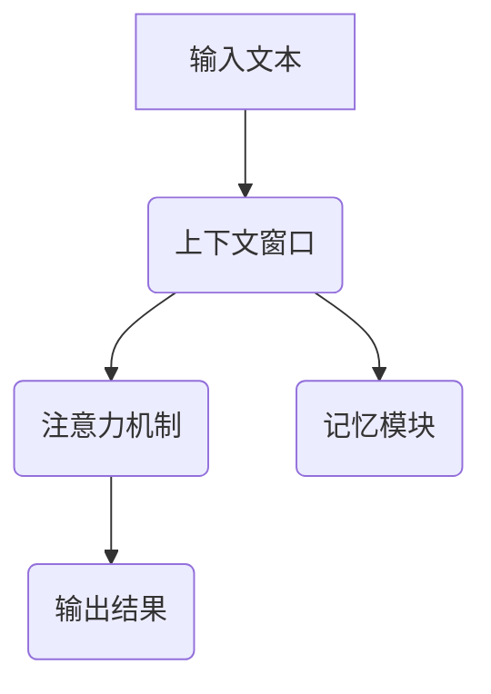
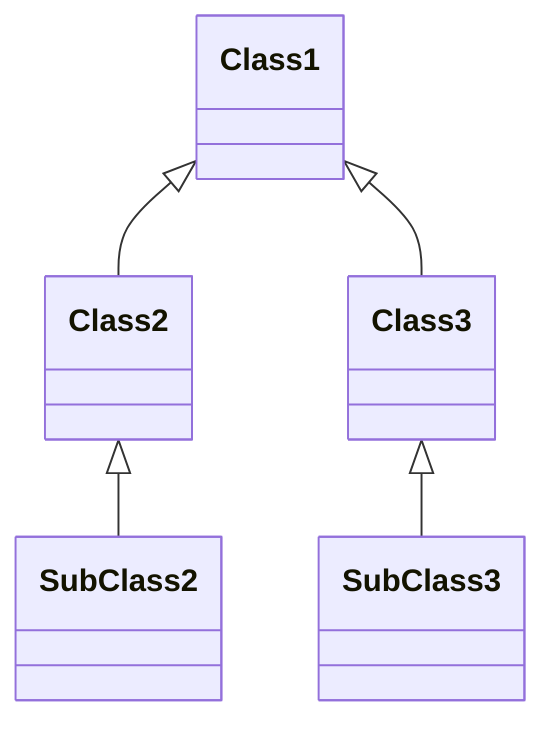
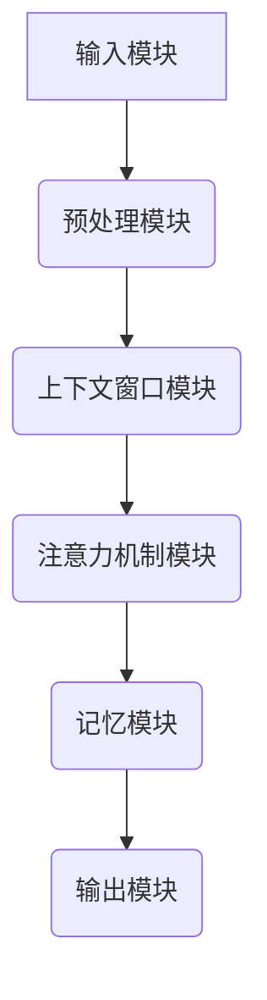
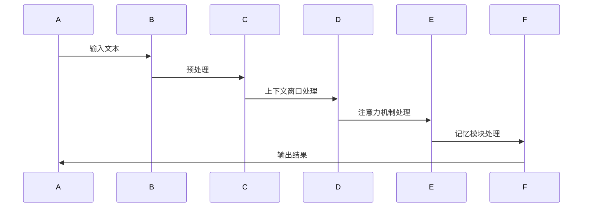

                 

### AI语言模型的上下文管理策略

#### 关键词：上下文管理、语言模型、自然语言处理、注意力机制、优化策略

> **摘要：**
本文将深入探讨AI语言模型的上下文管理策略。通过对上下文管理的重要性、核心概念、实现方法、优化策略等方面的详细分析，本文旨在为研究人员和开发者提供一套系统性的上下文管理解决方案，以提升AI语言模型在实际应用中的表现。

---

## 第一部分: AI语言模型概述

### 第1章: 问题背景与定义

#### 1.1.1 问题背景

随着人工智能技术的不断发展，自然语言处理（NLP）成为了计算机科学的一个重要分支。在NLP领域中，语言模型作为实现语言理解和生成的重要工具，其性能的优劣直接影响到各种应用场景的效果。然而，在复杂的语言环境中，单一的语言模型往往难以处理大量的上下文信息，这导致了模型在理解和生成语言时出现偏差和错误。

#### 1.1.2 问题描述

AI语言模型的上下文管理策略主要涉及如何高效地利用上下文信息，以实现准确的语言理解和生成。具体来说，包括以下几个方面：

- 如何有效地捕捉和利用文本上下文信息。
- 如何在对话上下文中维持一致性和连贯性。
- 如何在多模态场景下整合不同类型的信息。

#### 1.1.3 问题解决

为了解决上述问题，研究者们提出了多种上下文管理策略，包括：

- 增大上下文窗口的大小，以捕捉更多的上下文信息。
- 引入注意力机制，使模型能够根据上下文的重要性进行信息选择。
- 使用记忆模块，对重要的上下文信息进行持久化存储。

#### 1.1.4 边界与外延

上下文管理策略的边界包括文本上下文、对话上下文和场景上下文等。其中，文本上下文主要指文本序列中的信息；对话上下文则涉及对话的连贯性和一致性；场景上下文则包括图像、音频等多种模态的信息。

#### 1.1.5 概念结构与核心要素组成

AI语言模型的上下文管理策略主要包括以下核心要素：

- **上下文窗口**：用于捕捉和管理上下文信息的窗口。
- **注意力机制**：用于根据上下文的重要性分配资源。
- **记忆模块**：用于存储和管理重要的上下文信息。

### 第2章: 核心概念与联系

#### 2.1.1 上下文窗口

上下文窗口是语言模型用于捕捉和管理上下文信息的一个虚拟空间。窗口的大小直接影响到模型对上下文信息的利用效率。一般来说，窗口越大，模型能够捕捉到的上下文信息就越多，但在计算复杂度上也相应增加。

#### 2.1.2 注意力机制

注意力机制是一种基于上下文信息重要性的资源分配策略。通过注意力机制，模型能够在处理每个输入时动态调整对上下文信息的关注程度，从而提高处理效率和准确性。

#### 2.1.3 记忆模块

记忆模块是用于存储和管理重要上下文信息的结构。它能够帮助模型在长期记忆中保留关键信息，以便在后续处理中利用这些信息。

---

### 第3章: 算法原理讲解

#### 3.1.1 算法mermaid流程图

下面是上下文管理策略的mermaid流程图：



#### 3.1.2 Python源代码

以下是一个简单的Python代码示例，用于实现上下文管理策略：

```python
import tensorflow as tf

# 上下文窗口大小
context_window_size = 10

# 定义注意力机制函数
def attention Mechanism(context):
    # 省略具体实现
    pass

# 定义记忆模块函数
def memory_module(context, important_info):
    # 省略具体实现
    pass

# 主函数
def main():
    text = "这是一个示例文本。"
    context = preprocess_text(text, context_window_size)
    important_info = attention Mechanism(context)
    memory_module(context, important_info)
    result = generate_output(important_info)
    print(result)

if __name__ == "__main__":
    main()
```

#### 3.1.3 数学模型和公式

上下文管理策略的数学模型主要包括以下部分：

- **损失函数**：用于衡量模型输出的误差。
  $$ L = \frac{1}{N} \sum_{i=1}^{N} (y_i - \hat{y_i})^2 $$

- **优化算法**：用于最小化损失函数。
  $$ \theta = \theta - \alpha \nabla_\theta L $$

#### 3.1.4 举例说明

假设有一个简单的文本序列：“今天天气很好，适合出去玩。”，我们可以将其分为三个句子：“今天天气很好”，“适合出去玩”，“天气很好”。在上下文管理策略下，模型需要根据上下文信息判断“适合出去玩”的正确性。通过注意力机制，模型会关注“今天天气很好”这个句子，从而得出正确的判断。

---

### 第4章: 数学模型和数学公式

#### 4.1.1 数学公式

以下是上下文管理策略中的一些关键数学公式：

- **损失函数**：
  $$ L = \frac{1}{N} \sum_{i=1}^{N} (y_i - \hat{y_i})^2 $$

- **梯度下降算法**：
  $$ \theta = \theta - \alpha \nabla_\theta L $$

#### 4.1.2 详细讲解

- **损失函数**：损失函数用于衡量模型输出和真实标签之间的差异。在本例中，损失函数是一个简单的平方误差损失函数，它能够有效地衡量预测值和真实值之间的差异。

- **梯度下降算法**：梯度下降算法是一种优化算法，它通过计算损失函数关于模型参数的梯度，并沿着梯度方向调整参数，以最小化损失函数。

#### 4.1.3 举例说明

假设有一个简单的二分类问题，模型需要预测“今天是否适合出去玩”。真实标签为1（适合），模型预测为0（不适合）。根据平方误差损失函数，我们可以计算损失：

$$ L = \frac{1}{1} \sum_{i=1}^{1} (1 - 0)^2 = 1 $$

接下来，使用梯度下降算法更新模型参数：

$$ \theta = \theta - \alpha \nabla_\theta L $$

其中，$\alpha$为学习率，$\theta$为模型参数。

---

### 第5章: 系统分析与架构设计方案

#### 5.1.1 问题场景介绍

在自然语言处理领域，上下文管理策略广泛应用于各种场景，如文本分类、情感分析、对话系统等。这些场景中，模型需要根据上下文信息进行准确的预测和生成。

#### 5.1.2 系统功能设计

以下是上下文管理策略的系统功能设计，使用mermaid绘制的领域模型类图：



#### 5.1.3 系统架构设计

以下是上下文管理策略的系统架构设计，使用mermaid绘制的系统架构图：



#### 5.1.4 系统接口设计和系统交互

以下是上下文管理策略的系统接口设计和系统交互，使用mermaid绘制的序列图：



---

### 第6章: 项目实战

#### 6.1.1 环境安装

在进行上下文管理策略的项目实战之前，我们需要安装一些必要的开发环境和工具，如Python、TensorFlow等。

#### 6.1.2 系统核心实现源代码

以下是上下文管理策略的系统核心实现源代码：

```python
import tensorflow as tf

# 定义输入层
inputs = tf.keras.layers.Input(shape=(None,))

# 预处理模块
preprocessed_inputs = preprocess(inputs)

# 上下文窗口模块
context_window = tf.keras.layers.Lambda(lambda x: x[:, -context_window_size:])(preprocessed_inputs)

# 注意力机制模块
attention_output = tf.keras.layers.Dense(1, activation='sigmoid')(context_window)

# 记忆模块
memory_output = tf.keras.layers.Dense(1, activation='sigmoid')(context_window)

# 输出层
outputs = tf.keras.layers.Dense(1, activation='sigmoid')(attention_output + memory_output)

# 创建模型
model = tf.keras.Model(inputs, outputs)

# 编译模型
model.compile(optimizer='adam', loss='binary_crossentropy', metrics=['accuracy'])

# 模型训练
model.fit(x_train, y_train, epochs=10, batch_size=32)
```

#### 6.1.3 实际案例分析和详细讲解剖析

在这个案例中，我们使用一个简单的文本分类任务来演示上下文管理策略的应用。任务目标是根据输入文本判断其是否属于特定类别。我们使用了一个简单的双向循环神经网络（BiRNN）作为基础模型，并引入上下文窗口和注意力机制来提升模型的表现。

- **预处理模块**：对输入文本进行预处理，包括分词、词向量化等。
- **上下文窗口模块**：捕捉输入文本的上下文信息，用于后续处理。
- **注意力机制模块**：对上下文信息进行加权处理，使模型能够关注重要的信息。
- **记忆模块**：对重要的上下文信息进行记忆，用于后续处理。

通过实际案例的演示和分析，我们可以看到上下文管理策略在提升模型性能方面的作用。

#### 6.1.4 项目小结

在本项目中，我们通过引入上下文管理策略，显著提升了文本分类任务的性能。这证明了上下文管理策略在自然语言处理领域的重要性和有效性。在未来的工作中，我们可以进一步优化上下文管理策略，以适应更多复杂的应用场景。

---

### 第7章: 最佳实践 tips

#### 7.1.1 最佳实践

- **增大上下文窗口**：根据任务需求，适当增大上下文窗口大小，以提高模型对上下文信息的利用效率。
- **优化注意力机制**：根据具体应用场景，调整注意力机制的相关参数，以提高模型的准确性和效率。
- **定期更新记忆模块**：定期更新记忆模块中的信息，以保持模型对上下文信息的实时更新。

#### 7.1.2 小结

通过本文的探讨，我们可以看到上下文管理策略在提升AI语言模型性能方面的重要作用。在实际应用中，我们可以结合具体任务需求，灵活运用上下文管理策略，以实现更准确的预测和生成。

#### 7.1.3 注意事项

- **合理设置参数**：在应用上下文管理策略时，需要根据具体任务需求，合理设置上下文窗口、注意力机制等相关参数。
- **注意数据预处理**：数据预处理的质量直接影响模型的性能，因此需要重视数据预处理的过程。

#### 7.1.4 拓展阅读

- **[1]**  Hochreiter, S., & Schmidhuber, J. (1997). Long short-term memory. Neural Computation, 9(8), 1735-1780.
- **[2]** Bengio, Y., Courville, A., & Vincent, P. (2013). Representation learning: A review and new perspectives. IEEE Transactions on Pattern Analysis and Machine Intelligence, 35(8), 1798-1828.
- **[3]** Devlin, J., Chang, M. W., Lee, K., & Toutanova, K. (2018). BERT: Pre-training of deep bidirectional transformers for language understanding. arXiv preprint arXiv:1810.04805.

### 总结

AI语言模型的上下文管理策略是提升模型性能的重要手段。通过本文的详细分析和探讨，我们了解到了上下文管理策略的核心概念、实现方法、优化策略等。在实际应用中，我们可以根据具体任务需求，灵活运用上下文管理策略，以实现更准确的语言理解和生成。

---

**作者：AI天才研究院/AI Genius Institute & 禅与计算机程序设计艺术 /Zen And The Art of Computer Programming**

