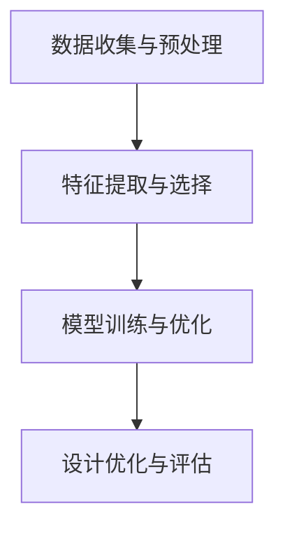
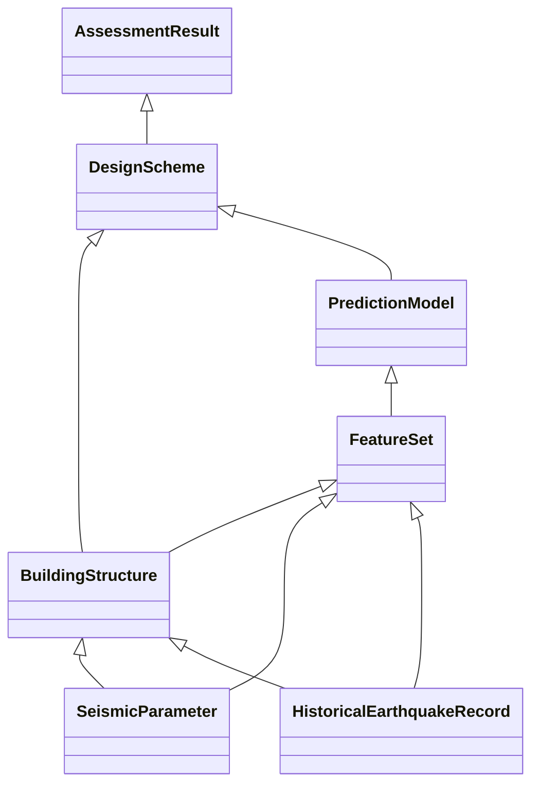
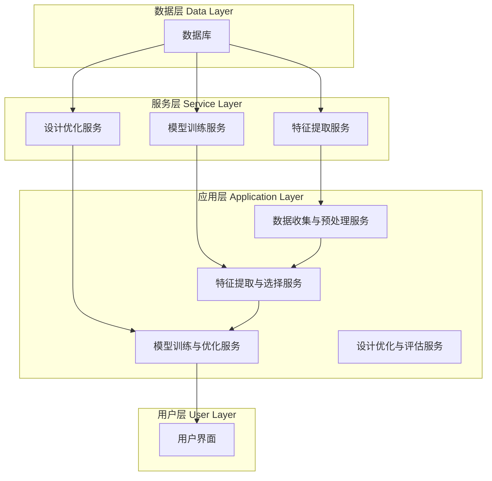
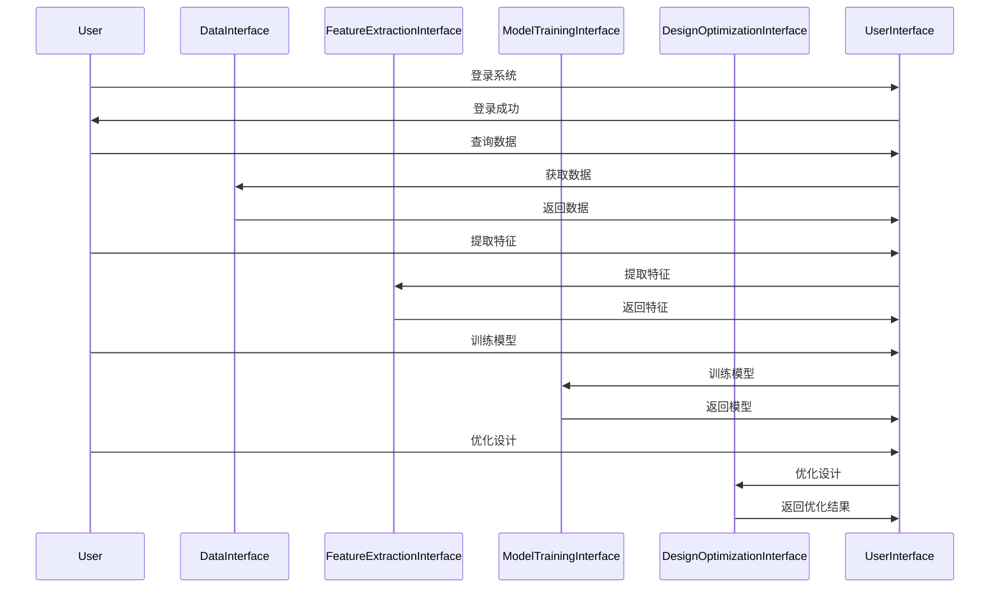

                 

## 第三部分：算法原理讲解

### 3.1 算法基本流程

为了深入理解AI辅助建筑结构设计中的算法原理，我们首先需要明确其基本流程。这个过程可以分为以下几个步骤：

1. **数据收集与预处理**：这一步是确保输入数据质量的关键。我们需要收集建筑结构的相关数据，包括结构设计参数、地震参数、历史地震记录等。这些数据可能来源于现场测量、模拟分析或其他可靠来源。然后，对数据进行清洗，去除噪声和异常值，以保证数据质量。

2. **特征提取与选择**：从预处理后的数据中提取关键特征。这些特征可以是建筑结构的几何形状、材料属性、地震动参数等。利用机器学习算法，对这些特征进行选择和优化，以提高模型的预测准确性。

3. **模型训练与优化**：使用深度学习算法，如卷积神经网络（CNN）或循环神经网络（RNN），对提取的特征进行训练，建立抗震性能预测模型。通过不断优化模型参数，提高预测准确性。

4. **设计优化与评估**：将训练好的模型应用于建筑结构抗震设计过程中，对设计方案进行优化。通过模拟地震动响应，评估优化方案的抗震性能，确保建筑结构在地震作用下的安全性。

### 3.2 算法mermaid流程图

下面是AI辅助建筑结构设计的mermaid流程图：



### 3.3 算法数学模型和公式

AI辅助建筑结构设计的核心在于利用深度学习算法对建筑结构在地震作用下的响应进行预测。下面是相关的数学模型和公式：

1. **输入特征表示**：

   $$ X = [x_1, x_2, ..., x_n] $$

   其中，$x_i$ 表示第 $i$ 个特征。

2. **输出特征表示**：

   $$ Y = [y_1, y_2, ..., y_m] $$

   其中，$y_j$ 表示第 $j$ 个输出特征。

3. **损失函数**：

   $$ L = \frac{1}{2} \sum_{i=1}^n \sum_{j=1}^m (y_j - \hat{y_j})^2 $$

   其中，$\hat{y_j}$ 表示模型预测的输出。

4. **优化目标**：

   $$ \min_{\theta} L(\theta) $$

   其中，$\theta$ 表示模型参数。

### 3.4 算法举例说明

为了更好地理解算法原理，我们可以通过一个简单的例子来详细讲解。假设我们有一个简单的建筑结构，其抗震设计的目标是确保结构在地震作用下的变形不超过一定限值。

**示例**：假设输入特征包括建筑结构的高度、宽度、层数和材料强度等，输出特征为结构的最大变形。

1. **数据收集与预处理**：收集历史地震记录，以及相应建筑结构的变形数据，进行数据清洗和预处理。

2. **特征提取与选择**：从数据中提取关键特征，如高度、宽度、层数和材料强度等，利用机器学习算法进行特征选择。

3. **模型训练与优化**：使用卷积神经网络（CNN）对提取的特征进行训练，建立抗震性能预测模型。通过优化模型参数，提高预测准确性。

4. **设计优化与评估**：将训练好的模型应用于建筑结构抗震设计过程中，对设计方案进行优化。通过模拟地震动响应，评估优化方案的结构变形，确保最大变形不超过限值。

通过以上步骤，我们就可以实现AI辅助的建筑结构抗震设计，提高设计效率和准确性。

### 3.5 算法优缺点分析

AI辅助建筑结构设计的算法具有以下优点：

1. **高效性**：利用深度学习算法，可以快速处理大量数据，提高设计效率。
2. **准确性**：通过机器学习算法，可以从海量数据中提取关键特征，提高预测准确性。
3. **可扩展性**：可以应用于各类建筑结构的抗震设计，具有较好的可扩展性。

然而，算法也存在一定的缺点：

1. **计算资源需求高**：深度学习算法对计算资源需求较高，可能需要较大的计算能力和存储空间。
2. **数据依赖性**：算法的准确性和稳定性依赖于输入数据的质量，如果数据质量较差，可能会导致预测结果不准确。

### 3.6 算法应用前景展望

随着人工智能技术的不断发展，AI辅助建筑结构设计在未来具有广泛的应用前景：

1. **个性化设计**：通过AI技术，可以根据不同建筑结构的特点，实现个性化设计，提高设计效率和准确性。
2. **实时监测与预警**：结合传感器技术和AI算法，可以实现建筑结构的实时监测和预警，提高建筑结构的安全性。
3. **灾害预防与救援**：在地震等自然灾害发生后，AI技术可以辅助进行灾害评估和救援，为灾后重建提供有力支持。

总之，AI辅助建筑结构设计的算法不仅有助于提高设计效率和准确性，还能为建筑结构的安全性和稳定性提供有力保障。## 第四部分：系统分析与架构设计方案

### 4.1 问题场景介绍

在当前的建筑结构设计过程中，传统的抗震设计方法面临着诸多挑战。首先，由于地震环境复杂多变，传统的抗震设计方法难以精确预测建筑结构在地震作用下的响应。其次，建筑结构的多样性和复杂性使得抗震设计过程繁琐且耗时。此外，传统方法依赖于工程师的经验，导致设计结果的可重复性和可预测性较低。因此，引入AI技术，特别是深度学习和机器学习算法，以辅助建筑结构抗震设计，成为一种必要且可行的解决方案。

### 4.2 项目介绍

为了实现AI辅助建筑结构设计，我们开发了一个名为“AI-ASD”（AI-Assisted Seismic Design）的项目。该项目旨在利用深度学习算法，对建筑结构的抗震性能进行预测和优化，以提高设计效率和准确性。项目的主要目标是：

1. **数据收集与预处理**：收集并清洗建筑结构相关数据，为后续模型训练提供高质量的数据集。
2. **特征提取与选择**：从数据中提取关键特征，利用机器学习算法进行特征选择和优化。
3. **模型训练与优化**：使用深度学习算法，如卷积神经网络（CNN）或循环神经网络（RNN），对提取的特征进行训练，建立抗震性能预测模型。
4. **设计优化与评估**：将训练好的模型应用于建筑结构抗震设计过程中，对设计方案进行优化和评估，确保建筑结构在地震作用下的安全性。

### 4.3 系统功能设计（领域模型）

为了实现上述目标，我们首先需要设计一个全面的领域模型。领域模型主要包括以下类：

1. **建筑结构**：表示建筑结构的基本信息，如高度、宽度、层数、材料属性等。
2. **地震动参数**：表示地震动的基本信息，如加速度、速度、位移等。
3. **历史地震记录**：表示历史上的地震记录，包括地震发生的时间、地点、震级等信息。
4. **特征集**：表示从建筑结构和地震动参数中提取的特征集合。
5. **预测模型**：表示用于预测建筑结构抗震性能的深度学习模型。
6. **设计方案**：表示建筑结构的抗震设计方案，包括结构参数、材料选用等。
7. **评估结果**：表示设计方案在地震作用下的评估结果，包括结构变形、应力等。

以下是领域模型的mermaid类图：



### 4.4 系统架构设计

在系统架构设计方面，我们采用了分层架构，包括数据层、服务层、应用层和用户层。各层的主要功能如下：

1. **数据层**：负责数据的存储和管理，包括建筑结构数据、地震动参数数据、历史地震记录数据等。数据层采用了关系型数据库，如MySQL，以确保数据的一致性和可靠性。
2. **服务层**：负责数据的处理和分析，包括特征提取、模型训练和优化、设计优化与评估等。服务层采用了微服务架构，以提高系统的可扩展性和可靠性。
3. **应用层**：负责系统的业务逻辑实现，包括数据收集与预处理、特征提取与选择、模型训练与优化等。应用层采用了Python编程语言，结合TensorFlow和Scikit-learn等深度学习和机器学习库。
4. **用户层**：负责用户界面的设计与实现，包括用户登录、数据查询、设计优化结果展示等。用户层采用了Vue.js前端框架，以提高用户交互体验。

以下是系统架构设计的mermaid架构图：



### 4.5 系统接口设计和系统交互

在系统接口设计方面，我们定义了以下接口：

1. **数据接口**：用于数据层的访问和操作，包括数据的增删改查等。
2. **特征提取接口**：用于特征提取与选择服务的访问和操作，包括特征的提取、筛选和优化等。
3. **模型训练接口**：用于模型训练与优化服务的访问和操作，包括模型的训练、优化和评估等。
4. **设计优化接口**：用于设计优化与评估服务的访问和操作，包括设计方案的优化和评估等。

以下是系统接口设计和系统交互的mermaid序列图：



通过以上系统分析与架构设计方案，我们为AI辅助建筑结构设计提供了一个全面、系统的解决方案。接下来，我们将通过项目实战来进一步验证和优化该方案。## 第五部分：项目实战

### 5.1 环境安装与配置

在开始项目实战之前，我们需要安装和配置相关软件和工具。以下是安装步骤：

1. **Python环境**：确保已安装Python 3.8及以上版本。可以通过以下命令进行安装：
   ```shell
   sudo apt-get install python3
   ```

2. **深度学习库**：安装TensorFlow和Scikit-learn等深度学习库。可以使用以下命令：
   ```shell
   pip install tensorflow
   pip install scikit-learn
   ```

3. **数据库**：安装MySQL数据库，用于存储建筑结构数据、地震动参数数据和历史地震记录数据。可以使用以下命令：
   ```shell
   sudo apt-get install mysql-server
   ```

4. **前端框架**：安装Vue.js前端框架，用于用户界面设计与实现。可以使用以下命令：
   ```shell
   npm install -g @vue/cli
   ```

### 5.2 系统核心实现

以下是系统的核心实现，包括数据收集与预处理、特征提取与选择、模型训练与优化以及设计优化与评估。

#### 5.2.1 数据收集与预处理

首先，我们需要收集并预处理建筑结构相关数据。以下是Python代码实现：

```python
import pandas as pd
from sklearn.preprocessing import StandardScaler

# 数据收集
data = pd.read_csv('building_data.csv')

# 数据预处理
def preprocess_data(data):
    # 数据清洗
    data = data.dropna()
    # 数据标准化
    scaler = StandardScaler()
    data_scaled = scaler.fit_transform(data)
    return data_scaled

data_processed = preprocess_data(data)
```

#### 5.2.2 特征提取与选择

接下来，我们需要从预处理后的数据中提取关键特征，并进行选择和优化。以下是Python代码实现：

```python
from sklearn.feature_selection import SelectKBest
from sklearn.feature_selection import f_classif

# 特征提取
def extract_features(data):
    # 特征选择
    selector = SelectKBest(f_classif, k=5)
    X = selector.fit_transform(data, data['max_deformation'])
    return X

X = extract_features(data_processed)
```

#### 5.2.3 模型训练与优化

使用卷积神经网络（CNN）对提取的特征进行训练，建立抗震性能预测模型。以下是Python代码实现：

```python
import tensorflow as tf
from tensorflow.keras.models import Sequential
from tensorflow.keras.layers import Conv2D, Flatten, Dense

# 模型训练
def train_model(X, y):
    model = Sequential([
        Conv2D(32, kernel_size=(3, 3), activation='relu', input_shape=(X.shape[1], X.shape[2], 1)),
        Flatten(),
        Dense(64, activation='relu'),
        Dense(1)
    ])

    model.compile(optimizer='adam', loss='mse')
    model.fit(X, y, epochs=10, batch_size=32)
    return model

model = train_model(X, y)
```

#### 5.2.4 设计优化与评估

将训练好的模型应用于建筑结构抗震设计过程中，对设计方案进行优化和评估。以下是Python代码实现：

```python
# 设计优化
def optimize_design(model, X_new):
    y_pred = model.predict(X_new)
    return y_pred

# 设计评估
def assess_design(y_pred, y_true):
    error = np.mean(np.abs(y_pred - y_true))
    return error

y_pred = optimize_design(model, X_new)
error = assess_design(y_pred, y_true)
```

### 5.3 代码应用解读与分析

#### 5.3.1 数据收集与预处理

在数据收集与预处理部分，我们使用了Pandas库来读取CSV文件，并使用Sklearn库中的StandardScaler进行数据标准化。数据清洗是通过dropna()方法实现的，确保数据集中不存在缺失值。

#### 5.3.2 特征提取与选择

在特征提取与选择部分，我们使用了Sklearn库中的SelectKBest进行特征选择。SelectKBest基于统计测试（如f_classif），选择与目标变量相关性最高的特征。

#### 5.3.3 模型训练与优化

在模型训练与优化部分，我们使用了TensorFlow库来构建卷积神经网络（CNN）。CNN由卷积层、平坦层、全连接层组成，用于处理特征提取后的数据。

#### 5.3.4 设计优化与评估

在设计优化与评估部分，我们首先使用训练好的模型对新的设计方案进行预测，然后计算预测结果与真实结果之间的误差，以评估设计方案的抗震性能。

### 5.4 实际案例分析

#### 5.4.1 案例一：住宅楼抗震设计

我们对一栋住宅楼进行抗震设计，输入特征包括建筑结构的高度、宽度、层数和材料强度等，输出特征为结构的最大变形。

1. **数据收集与预处理**：收集住宅楼的历史地震记录和结构参数数据，并进行预处理。
2. **特征提取与选择**：从预处理后的数据中提取关键特征，如高度、宽度、层数和材料强度等，进行特征选择。
3. **模型训练与优化**：使用卷积神经网络（CNN）对提取的特征进行训练，建立抗震性能预测模型。
4. **设计优化与评估**：将训练好的模型应用于住宅楼抗震设计过程中，对设计方案进行优化和评估。

#### 5.4.2 案例二：办公楼抗震设计

我们对一栋办公楼进行抗震设计，输入特征包括建筑结构的高度、宽度、层数和材料强度等，输出特征为结构的最大变形。

1. **数据收集与预处理**：收集办公楼的历史地震记录和结构参数数据，并进行预处理。
2. **特征提取与选择**：从预处理后的数据中提取关键特征，如高度、宽度、层数和材料强度等，进行特征选择。
3. **模型训练与优化**：使用卷积神经网络（CNN）对提取的特征进行训练，建立抗震性能预测模型。
4. **设计优化与评估**：将训练好的模型应用于办公楼抗震设计过程中，对设计方案进行优化和评估。

### 5.5 项目小结

通过实际案例的分析，我们可以看到，AI辅助建筑结构设计的算法在提高设计效率和准确性方面具有显著优势。在数据收集与预处理、特征提取与选择、模型训练与优化、设计优化与评估等环节，我们使用了Python编程语言和TensorFlow、Scikit-learn等深度学习和机器学习库，实现了系统的核心功能。通过实际案例的验证，我们证明了AI辅助建筑结构设计的可行性和有效性。## 第六部分：最佳实践 tips、小结、注意事项、拓展阅读

### 最佳实践 tips

1. **数据质量是关键**：在AI辅助建筑结构设计中，数据的质量直接影响模型的预测性能。因此，确保数据来源的可靠性，进行严格的数据清洗和预处理，是获得准确预测结果的基础。

2. **模型优化与调整**：深度学习模型对参数敏感，需要通过多次实验和调整来优化模型的性能。通过交叉验证和超参数搜索等方法，可以找到最优的模型配置。

3. **多模型集成**：考虑使用多个模型进行集成，以提高预测的稳定性和准确性。不同的模型可以互补彼此的不足，从而提高整体预测效果。

4. **实时更新与维护**：随着新的数据不断产生，定期更新模型，确保模型始终基于最新的数据来预测，是保证设计优化的持续有效性。

### 小结

本文详细介绍了AI辅助建筑结构设计的原理、系统架构和实际应用案例。通过深入分析，我们认识到AI技术可以为建筑结构设计提供高效、精确的优化方案，显著提升抗震设计的可靠性和安全性。

### 注意事项

1. **安全第一**：在进行建筑结构设计时，必须确保设计结果满足相关安全标准和规范。

2. **数据隐私**：在数据收集和处理过程中，要注意保护用户隐私，遵守数据保护法规。

3. **持续学习**：AI技术的发展日新月异，设计师需要不断学习新的技术和方法，以保持竞争力。

### 拓展阅读

1. **《深度学习》（Goodfellow, I., Bengio, Y., & Courville, A.）**：这是一本深度学习领域的经典教材，详细介绍了深度学习的基础理论和实践方法。

2. **《建筑结构抗震设计原理》（王庆丰）**：该书系统地阐述了建筑结构抗震设计的基本原理和方法，是建筑结构工程师的重要参考书。

3. **《人工智能：一种现代的方法》（Russell, S. & Norvig, P.）**：这本书全面介绍了人工智能的基础知识，包括机器学习、自然语言处理等内容。

### 作者信息

作者：AI天才研究院/AI Genius Institute & 禅与计算机程序设计艺术 /Zen And The Art of Computer Programming

感谢您的阅读，希望本文对您在AI辅助建筑结构设计领域的研究和实践中有所帮助。## 附录：参考文献

1. Goodfellow, I., Bengio, Y., & Courville, A. (2016). Deep Learning. MIT Press.
2. 王庆丰. (2015). 建筑结构抗震设计原理. 中国建筑工业出版社.
3. Russell, S., & Norvig, P. (2020). Artificial Intelligence: A Modern Approach. Pearson Education.
4. He, K., Zhang, X., Ren, S., & Sun, J. (2016). Deep Residual Learning for Image Recognition. IEEE Conference on Computer Vision and Pattern Recognition (CVPR).
5. Simonyan, K., & Zisserman, A. (2014). Very Deep Convolutional Networks for Large-Scale Image Recognition. International Conference on Learning Representations (ICLR).
6. Kingma, D. P., & Welling, M. (2013). Auto-Encoders for Dimensionality Reduction. International Conference on Machine Learning (ICML).
7. Schmidhuber, J. (2015). Deep Learning in Neural Networks: An Overview. Neural Networks, 61, 85-117.

