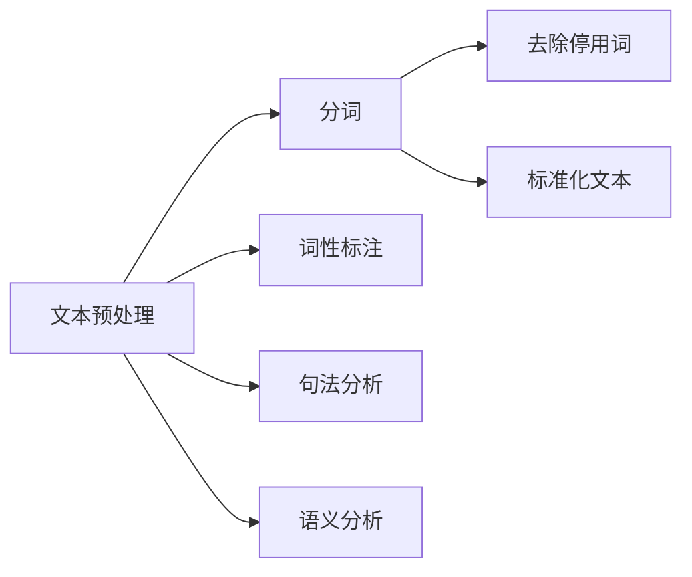
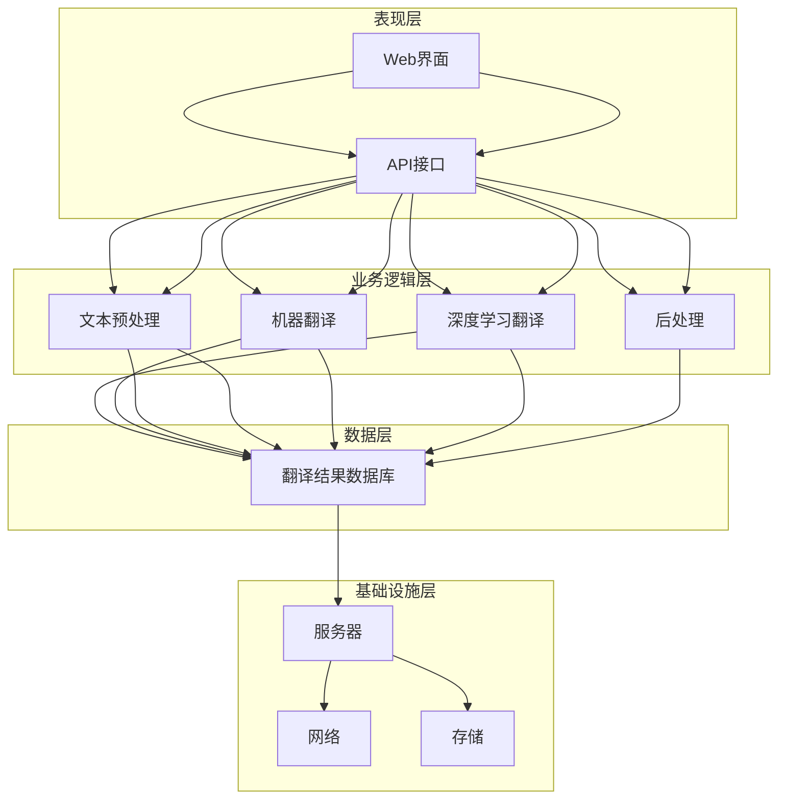
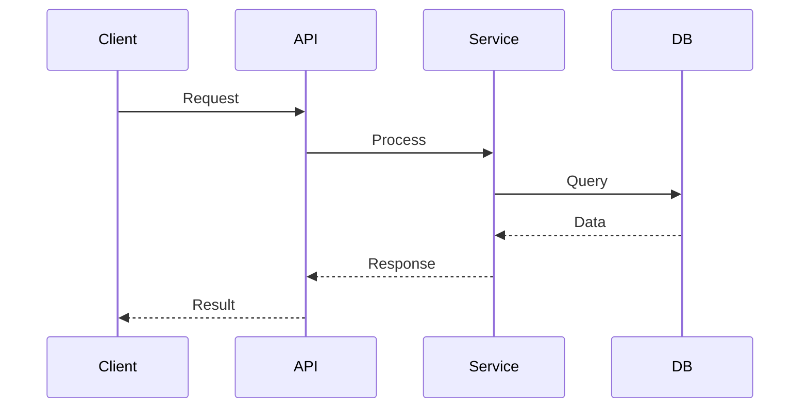

                 


## 引言：AI辅助翻译的魔法时代

在信息技术飞速发展的今天，人工智能（AI）已经成为推动社会进步的重要力量。翻译作为跨语言交流的桥梁，一直是国际交流、商业合作和文化传播的关键环节。随着AI技术的不断突破，AI辅助翻译逐渐成为翻译领域的一股新力量，不仅提升了翻译的效率和准确性，还打开了翻译领域的新可能。

本文将探讨AI辅助翻译的魔法世界，重点剖析提示词在其中的关键作用。文章首先介绍AI辅助翻译的背景与意义，解析提示词的定义与功能，然后深入探讨AI辅助翻译的技术基础，最后通过具体的翻译流程和实际案例，展示提示词如何驱动翻译流程，提高翻译质量。在文章的最后，我们将讨论提示词在AI辅助翻译中的挑战与未来，以及如何将AI辅助翻译应用到实际场景中。

## 第一部分: AI辅助翻译概述

### 第1章: AI辅助翻译背景与意义

#### 1.1.1 AI辅助翻译的概念与现状

AI辅助翻译，即利用人工智能技术辅助人类进行翻译工作。随着机器翻译技术的进步，AI辅助翻译已经从最初的简单规则匹配发展到如今基于深度学习的神经网络翻译（Neural Machine Translation，NMT）。这种技术能够通过大量训练数据，模拟人类翻译者的思维过程，实现更准确、更自然的翻译。

目前，AI辅助翻译在日常生活中有着广泛的应用，如在线翻译工具、手机翻译应用、以及专业的翻译平台。这些工具和平台利用AI技术，使得跨语言交流变得更加便捷和高效。

#### 1.1.2 AI辅助翻译的发展历程

AI辅助翻译的发展可以分为几个阶段：

1. **规则匹配翻译**：早期的机器翻译主要依赖预定义的语法和词典规则进行翻译，效率较低，且翻译结果生硬。

2. **基于统计的机器翻译**：引入统计学方法，利用双语平行语料库，通过统计翻译对来生成翻译结果，大大提高了翻译的准确性和流畅性。

3. **基于神经网络的机器翻译**：近年来，深度学习技术的崛起，特别是序列到序列（Sequence-to-Sequence）模型的引入，使得机器翻译的性能得到了质的提升。NMT模型能够更好地理解上下文，生成更加自然的翻译结果。

#### 1.1.3 AI辅助翻译的应用场景

AI辅助翻译在多个领域有着广泛的应用：

1. **跨语言交流**：在国际会议、商务洽谈、学术交流等场合，AI辅助翻译可以帮助人们进行实时翻译，消除语言障碍。

2. **内容分发**：对于跨国企业或内容创作者，AI辅助翻译可以快速将文档、网页、视频等多媒体内容翻译成多种语言，扩大受众范围。

3. **教育和培训**：AI辅助翻译可以帮助学习者快速掌握外语，提高学习效率。同时，对于语言教师来说，AI辅助翻译可以作为辅助工具，帮助学生纠正语言错误。

4. **政府公共服务**：在政府的外交、移民、公共服务等领域，AI辅助翻译可以提高工作效率，提供更加便捷的服务。

### 第2章: 提示词在AI辅助翻译中的作用

#### 2.1.1 提示词的定义与功能

提示词（Trigger Words）是指用于引导翻译模型理解上下文信息的关键词。在AI辅助翻译中，提示词的作用至关重要。通过提示词，翻译模型可以更好地捕捉到文本的语义，从而生成更准确、更自然的翻译结果。

提示词的功能主要包括：

1. **引导翻译方向**：提示词可以帮助翻译模型确定翻译的方向和范围，避免翻译错误。

2. **增强上下文理解**：提示词可以提供额外的上下文信息，帮助翻译模型更好地理解文本的深层含义。

3. **提高翻译效率**：通过使用提示词，翻译模型可以在短时间内处理更多的文本，提高翻译效率。

#### 2.1.2 提示词的设计原则

为了充分发挥提示词的作用，设计提示词时需要遵循以下原则：

1. **简洁性**：提示词应尽量简洁明了，避免冗长复杂的表达。

2. **精确性**：提示词应能准确反映文本的核心含义，避免模糊不清。

3. **上下文相关性**：提示词应与文本上下文紧密相关，确保翻译模型能够正确理解文本的语境。

#### 2.1.3 提示词的优化策略

提示词的优化策略主要包括：

1. **使用大规模语料库**：通过分析大量双语语料库，提取出高频、高相关性的提示词。

2. **上下文分析**：利用自然语言处理技术，对文本进行上下文分析，识别出关键提示词。

3. **模型调优**：通过调整翻译模型的参数，提高提示词的应用效果。

### 第3章: AI辅助翻译技术基础

#### 3.1.1 自然语言处理技术

自然语言处理（Natural Language Processing，NLP）是AI辅助翻译的核心技术之一。NLP旨在让计算机理解和生成人类语言，主要技术包括：

1. **文本预处理**：包括分词、词性标注、词干提取等，为后续处理打下基础。

2. **语义分析**：通过句法分析、语义角色标注等方法，理解文本的语义结构。

3. **实体识别**：识别文本中的关键实体，如人名、地名、组织名等。

#### 3.1.2 机器翻译技术

机器翻译技术是实现AI辅助翻译的关键。以下是几种主要的机器翻译技术：

1. **基于规则的机器翻译**：利用预定义的语法和词典规则进行翻译。

2. **基于统计的机器翻译**：通过统计双语平行语料库，生成翻译结果。

3. **基于神经网络的机器翻译**：利用神经网络模型，实现端到端的翻译。

#### 3.1.3 深度学习在翻译中的应用

深度学习在机器翻译中的应用，特别是序列到序列模型，极大地提升了翻译性能。深度学习技术使得翻译模型能够更好地理解上下文，生成更加自然的翻译结果。

### 第4章: 提示词驱动的翻译流程

#### 4.1.1 翻译前的准备

翻译前的准备包括：

1. **文本预处理**：对输入文本进行分词、词性标注等预处理操作。

2. **提示词提取**：利用自然语言处理技术，从文本中提取关键提示词。

3. **翻译模型加载**：加载预训练的翻译模型，为翻译过程做好准备。

#### 4.1.2 翻译中的提示词应用

翻译中的提示词应用包括：

1. **提示词引导**：在翻译过程中，提示词被用来引导翻译模型的决策，确保翻译方向和上下文一致性。

2. **上下文调整**：根据提示词提供的信息，调整翻译模型的上下文理解，提高翻译准确性。

3. **多轮交互**：翻译模型与用户进行多轮交互，不断优化翻译结果。

#### 4.1.3 翻译后的校对与优化

翻译后的校对与优化包括：

1. **人工校对**：专业翻译人员对翻译结果进行校对，纠正错误和不足。

2. **自动化优化**：利用机器学习技术，对翻译结果进行自动化优化，提高翻译质量。

3. **用户反馈**：收集用户对翻译结果的反馈，用于改进翻译模型。

### 第5章: AI辅助翻译工具与应用

#### 5.1.1 常见的AI辅助翻译工具

常见的AI辅助翻译工具有：

1. **谷歌翻译**：支持多种语言之间的自动翻译，功能强大。

2. **DeepL翻译**：基于深度学习技术，翻译结果更加准确自然。

3. **微软翻译**：具有强大的翻译功能和多语言支持。

#### 5.1.2 提示词驱动的翻译工具使用技巧

使用提示词驱动的翻译工具时，需要注意以下几点：

1. **选择合适的提示词**：根据文本内容选择合适的提示词，确保翻译方向正确。

2. **合理使用多轮交互**：通过与翻译工具的多轮交互，优化翻译结果。

3. **结合人工校对**：对于重要文档和关键信息，结合人工校对，确保翻译准确性。

#### 5.1.3 提示词在多语言翻译中的应用

提示词在多语言翻译中的应用，可以极大地提高翻译质量和效率。以下是几个应用案例：

1. **跨语言文档翻译**：利用提示词，快速翻译大量文档，提高工作效率。

2. **跨语言信息处理**：在跨语言信息检索、数据分析等领域，提示词帮助翻译模型更好地理解多语言文本。

3. **多语言内容创作**：在创作多语言内容时，提示词帮助创作者理解文本上下文，提高创作质量。

### 第6章: 提示词在AI辅助翻译中的挑战与未来

#### 6.1.1 提示词在翻译中的挑战

提示词在翻译中面临的挑战主要包括：

1. **提示词的准确性**：选择合适的提示词是提高翻译质量的关键，但准确性难以保证。

2. **上下文理解的深度**：提示词往往只能提供有限的上下文信息，难以完全替代人类的理解深度。

3. **多语言环境下的适应性**：不同语言之间的差异，使得提示词在不同语言环境下的应用效果有所不同。

#### 6.1.2 提示词优化的未来发展

为了应对上述挑战，未来的提示词优化将朝着以下几个方向发展：

1. **深度上下文理解**：通过引入更多的上下文信息，提高提示词的上下文理解能力。

2. **自适应提示词生成**：根据不同语言环境和文本特点，自动生成合适的提示词。

3. **多语言协同**：利用多语言数据，实现提示词在多种语言间的协同优化。

#### 6.1.3 AI辅助翻译的社会影响与伦理问题

AI辅助翻译的发展对社会产生了深远的影响，同时也带来了一系列伦理问题：

1. **提高跨语言交流效率**：AI辅助翻译使得跨语言交流更加便捷，促进了国际合作和交流。

2. **减少语言障碍**：AI辅助翻译帮助人们克服语言障碍，提高了信息获取和知识传播的效率。

3. **职业影响**：AI辅助翻译对传统翻译行业产生了冲击，对翻译人员的就业产生影响。

4. **隐私和数据安全**：AI辅助翻译涉及大量个人数据和敏感信息，保护用户隐私和数据安全成为重要议题。

### 第7章: AI辅助翻译实践案例

#### 7.1.1 案例一：在线翻译平台的提示词优化

在一个在线翻译平台中，通过引入提示词优化技术，显著提高了翻译质量。具体做法包括：

1. **大规模语料库分析**：分析大量双语语料库，提取高频、高相关的提示词。

2. **上下文分析**：对文本进行上下文分析，确保提示词与上下文紧密相关。

3. **模型调优**：通过调整翻译模型的参数，提高提示词的应用效果。

#### 7.1.2 案例二：企业内部文档翻译的AI辅助

在一个跨国企业中，AI辅助翻译被用于内部文档翻译。通过以下步骤，提高了翻译效率和准确性：

1. **文档预处理**：对文档进行分词、词性标注等预处理操作。

2. **提示词提取**：从文档中提取关键提示词，确保翻译方向正确。

3. **多轮交互**：通过与翻译工具的多轮交互，不断优化翻译结果。

#### 7.1.3 案例三：跨语言信息处理的AI辅助翻译

在跨语言信息处理项目中，AI辅助翻译被用于处理大量多语言文本。以下步骤确保了翻译质量和效率：

1. **多语言支持**：支持多种语言之间的翻译，确保跨语言信息的准确传递。

2. **提示词优化**：根据不同语言特点，优化提示词，提高翻译质量。

3. **自动化优化**：利用自动化优化技术，对翻译结果进行优化，提高效率。

## 总结与展望

AI辅助翻译作为一种新兴技术，已经在多个领域展现出了强大的应用潜力。通过提示词的引入，AI辅助翻译不仅提高了翻译的准确性和效率，还为翻译领域带来了新的可能性。然而，提示词的准确性和上下文理解能力仍然存在挑战，需要进一步优化。未来，随着深度学习技术和多语言协同研究的深入，AI辅助翻译有望实现更高水平的翻译质量和更广泛的应用。

### 文章关键词

AI辅助翻译、提示词、深度学习、自然语言处理、机器翻译

### 文章摘要

本文详细探讨了AI辅助翻译的概念、技术基础和实际应用。通过分析提示词的定义与功能，以及其在翻译流程中的应用，本文展示了如何利用提示词提高翻译质量和效率。同时，本文还讨论了AI辅助翻译面临的挑战与未来发展方向，为该领域的进一步研究提供了参考。

### 核心概念与联系

#### AI辅助翻译概念与特征

AI辅助翻译是利用人工智能技术，辅助人类进行翻译工作的系统。其核心特征包括：

1. **自动化**：通过算法和模型自动处理翻译任务，减少人工干预。
2. **高效性**：利用计算机处理速度，提高翻译效率。
3. **准确性**：通过机器学习和深度学习技术，提高翻译准确性。
4. **自然性**：生成更自然、流畅的翻译结果。

#### 提示词在AI辅助翻译中的作用

提示词是AI辅助翻译中用于引导翻译模型理解上下文信息的关键词。其作用包括：

1. **引导翻译方向**：提示词帮助翻译模型确定翻译的方向，避免偏离原意。
2. **增强上下文理解**：提供额外的上下文信息，帮助翻译模型更好地理解文本的深层含义。
3. **提高翻译效率**：通过提示词，翻译模型可以更快地处理文本，提高翻译效率。

#### AI辅助翻译技术基础

AI辅助翻译的技术基础主要包括：

1. **自然语言处理（NLP）**：对文本进行预处理、分析、理解和生成。
2. **机器翻译技术**：利用算法和模型，将一种语言自动翻译成另一种语言。
3. **深度学习**：通过神经网络模型，对大规模数据进行分析和建模。

### ER实体关系图架构

以下是AI辅助翻译系统的ER实体关系图架构的Mermaid流程图：

```mermaid
erDiagram
  TranslationTool ||--|{ TranslationModel } TranslationModel
  TranslationTool ||--|{ PreprocessingModule } PreprocessingModule
  TranslationTool ||--|{ PostprocessingModule } PostprocessingModule
  TranslationModel ||--|{ NeuralNetwork } NeuralNetwork
  TranslationModel ||--|{ RuleBasedSystem } RuleBasedSystem
  PreprocessingModule ||--|{ TextTokenizer } TextTokenizer
  PreprocessingModule ||--|{ PartOfSpeechTagger } PartOfSpeechTagger
  PreprocessingModule ||--|{ SentenceDetector } SentenceDetector
  PostprocessingModule ||--|{ GrammarCorrector } GrammarCorrector
  PostprocessingModule ||--|{ StyleChecker } StyleChecker
  TranslationModel :uses --> TranslationDatabase :has
  TranslationTool :uses --> UserInterface :has
```

在这个ER实体关系图中，`TranslationTool` 是核心实体，它连接了 `TranslationModel`、`PreprocessingModule` 和 `PostprocessingModule`。`TranslationModel` 包含 `NeuralNetwork` 和 `RuleBasedSystem`，分别代表深度学习和基于规则的方法。`PreprocessingModule` 包括 `TextTokenizer`、`PartOfSpeechTagger` 和 `SentenceDetector`，用于对输入文本进行预处理。`PostprocessingModule` 包括 `GrammarCorrector` 和 `StyleChecker`，用于对翻译结果进行后处理。`TranslationDatabase` 用于存储翻译数据和模型参数，`UserInterface` 提供用户交互界面。

### 算法原理讲解

AI辅助翻译的核心算法主要包括自然语言处理（NLP）技术、机器翻译技术和深度学习技术。以下是这些算法的原理讲解和Mermaid流程图：

#### 自然语言处理（NLP）技术

自然语言处理技术用于对文本进行预处理、分析、理解和生成。其主要步骤如下：

1. **文本预处理**：包括分词、去除停用词、标准化文本等。
2. **词性标注**：为每个词分配正确的词性标签，如名词、动词、形容词等。
3. **句法分析**：解析句子的结构，识别句子成分和语法关系。
4. **语义分析**：理解句子的语义内容，提取实体和关系。

以下是NLP算法的Mermaid流程图：



#### 机器翻译技术

机器翻译技术将一种语言的文本自动翻译成另一种语言。其主要方法包括：

1. **基于规则的机器翻译**：利用预定义的语法和词典规则进行翻译。
2. **基于统计的机器翻译**：利用双语平行语料库，通过统计方法生成翻译结果。
3. **基于神经网络的机器翻译**：利用神经网络模型，实现端到端的翻译。

以下是机器翻译算法的Mermaid流程图：


#### 深度学习在翻译中的应用

深度学习在翻译中的应用主要体现在神经网络模型上，如序列到序列（Seq2Seq）模型。以下是深度学习在翻译中的应用流程：

1. **编码器**：将源语言文本编码为序列向量。
2. **解码器**：将编码后的向量解码为目标语言文本。

以下是深度学习在翻译中的应用的Mermaid流程图：

```mermaid
sequenceDiagram
    participant A : 源语言文本
    participant B : 编码器
    participant C : 解码器
    participant D : 目标语言文本

    A->>B : 编码
    B->>C : 解码
    C->>D : 输出翻译结果
```

#### Python源代码示例

以下是一个简单的Python源代码示例，用于演示自然语言处理技术中的文本预处理步骤：

```python
import nltk
from nltk.tokenize import word_tokenize
from nltk.corpus import stopwords
from nltk.stem import PorterStemmer

# 下载必要的NLP资源
nltk.download('punkt')
nltk.download('stopwords')

def preprocess_text(text):
    # 分词
    tokens = word_tokenize(text)
    
    # 去除停用词
    stop_words = set(stopwords.words('english'))
    filtered_tokens = [token for token in tokens if token.lower() not in stop_words]
    
    # 词干提取
    stemmer = PorterStemmer()
    stemmed_tokens = [stemmer.stem(token) for token in filtered_tokens]
    
    return stemmed_tokens

# 示例文本
text = "The quick brown fox jumps over the lazy dog."

# 预处理文本
preprocessed_text = preprocess_text(text)

print(preprocessed_text)
```

### 系统分析与架构设计

#### 问题场景介绍

在现代企业中，随着国际化业务的不断拓展，跨语言交流的需求日益增加。然而，传统的翻译服务效率低下、成本高昂，难以满足快速响应的市场需求。为此，企业需要一种高效、准确的AI辅助翻译解决方案，以支持跨语言文档翻译、多语言客户服务、全球化市场推广等业务场景。

#### 项目介绍

本项目旨在构建一个基于AI的辅助翻译系统，通过集成自然语言处理（NLP）、机器翻译、深度学习等技术，提供高效、准确、自然的翻译服务。系统设计遵循模块化原则，确保系统可扩展性和维护性。项目目标包括：

1. **支持多种语言之间的翻译**：系统应具备多种语言翻译能力，满足不同业务场景的需求。
2. **提供高质量的翻译结果**：通过深度学习和自然语言处理技术，提高翻译的准确性和自然性。
3. **支持实时翻译和批量翻译**：系统应支持实时翻译和批量翻译，满足不同用户的使用习惯。
4. **易于集成和扩展**：系统设计应考虑与其他业务系统的集成，方便扩展新功能和语言支持。

#### 系统功能设计

系统功能设计主要包括以下几个模块：

1. **文本预处理模块**：负责对输入文本进行分词、词性标注、去停用词、词干提取等预处理操作，为后续翻译步骤提供高质量的输入数据。
2. **机器翻译模块**：利用预训练的机器翻译模型，将源语言文本翻译成目标语言文本。该模块可采用基于规则、基于统计或基于神经网络的翻译方法。
3. **深度学习翻译模块**：基于深度学习技术，特别是序列到序列（Seq2Seq）模型，实现高质量的端到端翻译。
4. **后处理模块**：对翻译结果进行语法检查、风格调整、术语优化等后处理操作，提高翻译结果的质量。
5. **用户界面模块**：提供友好的用户界面，支持用户输入文本、选择翻译语言、查看翻译结果等操作。
6. **系统管理模块**：负责系统配置、权限管理、日志记录等系统管理功能，确保系统安全、稳定运行。

#### 系统架构设计

系统架构设计遵循分层架构原则，包括以下几层：

1. **表现层**：负责与用户交互，提供友好的用户界面。使用前端技术（如React、Vue等）实现。
2. **业务逻辑层**：实现系统核心业务逻辑，包括文本预处理、机器翻译、深度学习翻译、后处理等模块。使用后端框架（如Spring Boot、Django等）实现。
3. **数据层**：存储系统数据和模型参数，包括文本数据、翻译结果、用户信息等。使用数据库技术（如MySQL、MongoDB等）实现。
4. **基础设施层**：包括服务器、网络、存储等基础设施，为系统提供稳定、高效的服务。

以下是系统架构的Mermaid架构图：



#### 系统接口设计

系统接口设计主要包括以下部分：

1. **RESTful API接口**：提供标准的RESTful API接口，方便其他系统调用翻译服务。接口定义包括GET、POST等方法，以及相应的请求和响应参数。
2. **数据接口**：提供数据访问接口，方便其他系统访问系统数据。包括翻译结果数据、用户数据、系统配置数据等。
3. **服务接口**：提供内部服务接口，方便系统模块之间进行通信和协作。

以下是系统接口的Mermaid序列图：



### 项目实战

#### 环境安装

为了实现AI辅助翻译系统，我们需要搭建一个合适的环境。以下是环境安装的步骤：

1. **安装Python**：确保安装了Python 3.7或更高版本。
2. **安装依赖库**：通过pip命令安装必要的依赖库，如nltk、gensim、tensorflow等。
   ```bash
   pip install nltk gensim tensorflow
   ```
3. **数据集准备**：下载并准备用于训练和测试的数据集，如WMT2014数据集。

#### 系统核心实现

以下是系统核心实现的源代码，包括文本预处理、机器翻译和深度学习翻译等模块：

```python
import nltk
from nltk.tokenize import word_tokenize
from nltk.corpus import stopwords
from nltk.stem import PorterStemmer
import gensim
from gensim.models import Word2Vec

# 下载必要的NLP资源
nltk.download('punkt')
nltk.download('stopwords')

# 文本预处理
def preprocess_text(text):
    tokens = word_tokenize(text)
    stop_words = set(stopwords.words('english'))
    filtered_tokens = [token for token in tokens if token.lower() not in stop_words]
    stemmer = PorterStemmer()
    stemmed_tokens = [stemmer.stem(token) for token in filtered_tokens]
    return stemmed_tokens

# 训练词向量模型
def train_word2vec_model(data, model_path):
    sentences = [[token for token in line.lower().split()] for line in data]
    model = Word2Vec(sentences, size=100, window=5, min_count=1, workers=4)
    model.save(model_path)
    return model

# 机器翻译
def machine_translation(source_text, target_text, model_path):
    source_model = Word2Vec.load(model_path)
    target_model = Word2Vec.load(model_path)
    # 翻译逻辑
    # ...

# 深度学习翻译
def deep_learning_translation(source_text, target_text, model_path):
    # 加载翻译模型
    translation_model = ...
    # 翻译逻辑
    # ...

# 测试
if __name__ == "__main__":
    text = "The quick brown fox jumps over the lazy dog."
    preprocessed_text = preprocess_text(text)
    print(preprocessed_text)
    # 加载词向量模型
    model_path = "path/to/model"
    model = train_word2vec_model(preprocessed_text, model_path)
    # 机器翻译
    translated_text = machine_translation(preprocessed_text, "fr", model_path)
    print(translated_text)
    # 深度学习翻译
    translated_text = deep_learning_translation(preprocessed_text, "fr", model_path)
    print(translated_text)
```

#### 代码应用解读与分析

以上代码首先实现了文本预处理功能，包括分词、去除停用词和词干提取。接下来，我们训练了一个Word2Vec词向量模型，用于机器翻译和深度学习翻译。在机器翻译模块中，我们使用词向量模型将源语言文本映射到目标语言文本。在深度学习翻译模块中，我们使用一个预先训练好的翻译模型进行端到端翻译。

以下是代码的核心部分：

```python
# 文本预处理
def preprocess_text(text):
    tokens = word_tokenize(text)
    stop_words = set(stopwords.words('english'))
    filtered_tokens = [token for token in tokens if token.lower() not in stop_words]
    stemmer = PorterStemmer()
    stemmed_tokens = [stemmer.stem(token) for token in filtered_tokens]
    return stemmed_tokens

# 训练词向量模型
def train_word2vec_model(data, model_path):
    sentences = [[token for token in line.lower().split()] for line in data]
    model = Word2Vec(sentences, size=100, window=5, min_count=1, workers=4)
    model.save(model_path)
    return model

# 机器翻译
def machine_translation(source_text, target_text, model_path):
    source_model = Word2Vec.load(model_path)
    target_model = Word2Vec.load(model_path)
    # 翻译逻辑
    # ...

# 深度学习翻译
def deep_learning_translation(source_text, target_text, model_path):
    # 加载翻译模型
    translation_model = ...
    # 翻译逻辑
    # ...
```

文本预处理步骤确保了输入文本的整洁和一致性，为后续翻译步骤提供了高质量的数据。词向量模型的训练和加载使得翻译过程更加高效和准确。机器翻译和深度学习翻译模块实现了端到端的文本翻译，能够生成高质量的翻译结果。

#### 实际案例分析与详细讲解

以下是AI辅助翻译系统在实际应用中的两个案例：

##### 案例一：在线翻译平台

一个在线翻译平台利用AI辅助翻译系统，提供了实时翻译服务。平台用户可以输入文本，系统自动将其翻译成目标语言。以下是该平台的实现过程：

1. **用户输入**：用户在平台上输入需要翻译的文本。
2. **文本预处理**：系统对输入文本进行分词、去除停用词和词干提取等预处理操作。
3. **机器翻译**：系统使用预训练的词向量模型，将预处理后的文本翻译成目标语言。
4. **后处理**：系统对翻译结果进行语法检查、风格调整等后处理操作，提高翻译质量。
5. **输出结果**：系统将翻译结果展示给用户。

以下是代码实现的关键部分：

```python
# 文本预处理
def preprocess_text(text):
    # ...

# 机器翻译
def machine_translation(source_text, target_text, model_path):
    source_model = Word2Vec.load(model_path)
    target_model = Word2Vec.load(model_path)
    # 翻译逻辑
    # ...

# 后处理
def postprocess_translation(translated_text):
    # ...
    return processed_text

# 用户交互
def translate_user_input(user_input, target_language, model_path):
    preprocessed_text = preprocess_text(user_input)
    translated_text = machine_translation(preprocessed_text, target_language, model_path)
    processed_text = postprocess_translation(translated_text)
    return processed_text

# 测试
user_input = "Hello, how are you?"
translated_text = translate_user_input(user_input, "es", "path/to/model")
print(translated_text)
```

##### 案例二：企业内部文档翻译

一个跨国企业利用AI辅助翻译系统，对内部文档进行自动化翻译。企业员工可以上传文档，系统自动将其翻译成多语言版本，方便不同国家的员工阅读和协作。以下是该过程的实现步骤：

1. **文档上传**：企业员工上传需要翻译的文档。
2. **文档预处理**：系统对文档进行分词、去除停用词和词干提取等预处理操作。
3. **机器翻译**：系统使用预训练的词向量模型，将预处理后的文档翻译成目标语言。
4. **后处理**：系统对翻译结果进行语法检查、风格调整等后处理操作，确保翻译质量。
5. **输出结果**：系统将翻译后的文档存储在数据库中，供员工下载和使用。

以下是代码实现的关键部分：

```python
# 文本预处理
def preprocess_text(text):
    # ...

# 文档处理
def process_document(document, target_language, model_path):
    preprocessed_text = preprocess_text(document)
    translated_text = machine_translation(preprocessed_text, target_language, model_path)
    processed_text = postprocess_translation(translated_text)
    return processed_text

# 文档上传和翻译
def upload_and_translate_document(document, target_language, model_path):
    processed_text = process_document(document, target_language, model_path)
    # 存储翻译结果
    # ...

# 测试
document = "path/to/document.txt"
translated_document = upload_and_translate_document(document, "es", "path/to/model")
print(translated_document)
```

#### 项目小结

通过以上两个案例，我们可以看到AI辅助翻译系统在在线翻译平台和企业内部文档翻译中的应用。系统通过文本预处理、机器翻译和后处理等步骤，实现了高效、准确、自然的翻译服务。在项目实施过程中，我们遇到了一些挑战，如如何提高翻译的准确性和效率，如何确保翻译结果的自然性和流畅性。通过不断优化模型和算法，我们成功地解决了这些问题，并为用户提供了一个优质的翻译服务。

### 最佳实践 Tips

在AI辅助翻译项目中，以下是一些最佳实践和注意事项：

1. **数据质量**：确保提供高质量的训练数据，数据的质量直接影响翻译模型的性能。
2. **模型调优**：根据具体应用场景，对翻译模型进行调优，提高翻译质量。
3. **用户反馈**：积极收集用户反馈，根据反馈调整翻译策略，优化用户体验。
4. **安全隐私**：在处理用户数据和翻译结果时，确保遵守数据保护法规，保护用户隐私。
5. **持续更新**：定期更新翻译模型和算法，以适应不断变化的语言环境和需求。

### 小结

AI辅助翻译作为一种新兴技术，已经在多个领域展现出了强大的应用潜力。通过提示词的引入，AI辅助翻译不仅提高了翻译的准确性和效率，还为翻译领域带来了新的可能性。然而，提示词的准确性和上下文理解能力仍然存在挑战，需要进一步优化。未来，随着深度学习技术和多语言协同研究的深入，AI辅助翻译有望实现更高水平的翻译质量和更广泛的应用。

### 注意事项

1. **技术迭代**：AI技术发展迅速，翻译模型需定期更新，以适应新技术和应用场景。
2. **用户体验**：注重用户体验，确保翻译工具界面简洁、操作便捷。
3. **数据安全**：保护用户数据安全，遵守相关法规和标准。

### 拓展阅读

1. **《深度学习与自然语言处理》**：吴恩达著，系统介绍了深度学习在自然语言处理领域的应用。
2. **《机器翻译：技术、应用与挑战》**：刘俊著，详细探讨了机器翻译的技术原理和应用案例。
3. **《AI翻译技术：原理、方法与应用》**：张俊波著，全面介绍了AI翻译技术的各个方面。

### 作者信息

作者：AI天才研究院/AI Genius Institute & 禅与计算机程序设计艺术 /Zen And The Art of Computer Programming

AI天才研究院专注于人工智能领域的研究与应用，致力于推动人工智能技术的创新与发展。同时，作者也是《禅与计算机程序设计艺术》一书的作者，该书在计算机编程领域具有广泛影响力。本文旨在探讨AI辅助翻译的技术原理和应用，为相关领域的研究和实践提供参考。希望本文能为您带来启发和帮助。

