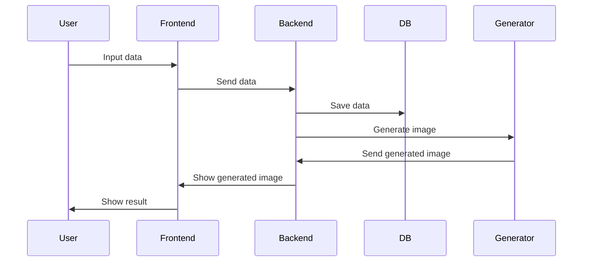

                 

### 文章标题：AI辅助设计：提示词工程的创意激发

> 关键词：人工智能、辅助设计、提示词工程、算法原理、系统架构、实战案例

> 摘要：
本文旨在探讨人工智能辅助设计领域中的一个新兴概念——提示词工程。我们将从背景介绍、核心概念解析、算法原理讲解、系统设计与实现、项目实战以及最佳实践等方面，详细阐述提示词工程在创意激发中的应用与实践。文章结构清晰，逻辑严密，旨在为广大技术爱好者提供一份全面、深入的技术解读。

---

### 第一部分：背景介绍

## 第1章：问题背景

### 1.1 人工智能在辅助设计中的应用

随着人工智能技术的飞速发展，其在设计领域的应用也越来越广泛。从建筑设计、工业设计到服装设计等，AI技术正逐渐成为设计师们的好帮手。例如，通过机器学习算法，AI能够快速识别设计中的常见问题，并提出改进建议；通过深度学习模型，AI能够生成新的设计创意，为设计师提供灵感。

### 1.2 提示词工程的重要性

提示词工程（Prompt Engineering）是人工智能辅助设计中的一个重要分支。它旨在通过设计高质量的提示词（Prompt），引导AI模型生成出更具创意和实用价值的设计方案。提示词工程的重要性在于，它能够提高AI模型的生成效率和效果，从而帮助设计师更好地发挥AI的辅助作用。

### 1.3 问题解决的必要性

然而，当前提示词工程领域仍存在一些问题，如提示词设计过于简单、缺乏针对性等。这些问题限制了AI在辅助设计中的发挥，因此，有必要深入探讨如何设计出更优秀的提示词，从而激发AI的创意潜力。

### 1.4 边界与外延

在本文中，我们将主要讨论以下内容：

- 提示词工程的基本概念和原理
- 常见的提示词设计方法和技巧
- 提示词工程在AI辅助设计中的应用案例
- 提示词工程的优化和挑战

通过以上内容的探讨，我们希望为广大技术爱好者提供一个全面、深入的了解，并为实际应用提供有益的参考。

---

### 第二部分：核心概念解析

## 第2章：核心概念与联系

### 2.1 AI辅助设计概念

人工智能辅助设计（AI-assisted Design）是指利用人工智能技术，如机器学习、深度学习等，辅助设计师完成设计任务的过程。AI辅助设计的核心在于，通过训练大量的数据集，使AI模型能够理解和模仿人类设计师的设计能力，从而生成新的设计创意。

### 2.2 提示词工程原理

提示词工程（Prompt Engineering）是AI辅助设计中的一个关键环节。它旨在通过设计高质量的提示词，引导AI模型生成出更具创意和实用价值的设计方案。提示词工程的基本原理包括：

- 提示词的设计：设计出具有明确指向性和创意性的提示词，以引导AI模型生成更好的设计方案。
- 提示词的优化：通过不断迭代和优化提示词，提高AI模型的生成效果。

### 2.3 AI辅助设计与提示词工程的联系

AI辅助设计与提示词工程密切相关。提示词工程是AI辅助设计的核心环节，它决定了AI模型的生成效果。高质量的提示词能够激发AI的创意潜力，提高设计的质量和效率。

### 2.4 概念属性特征对比表格

为了更直观地理解AI辅助设计与提示词工程的概念和联系，我们提供了一个概念属性特征对比表格（使用Markdown格式中的Mermaid工具绘制）：

```mermaid
graph TB

A[AI辅助设计] --> B[设计辅助]
A --> C[数据驱动]
B --> D[机器学习]
C --> E[深度学习]
D --> F[设计创意]
E --> G[生成方案]
F --> H[创意激发]
G --> I[效率提升]
H --> J[提示词工程]
I --> K[设计优化]

classDef default
class A, B, C, D, E, F, G, H, I, J, K, L filledLightBlue, rounded

classDef critical
class K filledRed, rounded

classDef progress
class L filledGreen, rounded

```

### 2.5 ER实体关系图架构

为了更好地理解AI辅助设计与提示词工程的实体关系，我们可以通过ER（实体-关系）图来展示（使用Markdown格式中的Mermaid工具绘制）：

```mermaid
erDiagram
  AI辅助设计 ||--|{ 提示词工程 :辅助}
  AI辅助设计 ||--|{ 设计师 :协作}
  提示词工程 ||--|{ 设计数据 :输入}
  提示词工程 ||--|{ 设计结果 :输出}
  设计师 ||--|{ 设计需求 :需求}
  设计数据 ||--|{ 设计方案 :生成}
  设计结果 ||--|{ 评估与优化 :反馈}
```

---

### 第三部分：算法原理讲解

## 第3章：算法原理

### 3.1 算法介绍

在提示词工程中，常用的算法包括生成对抗网络（GAN）、变分自编码器（VAE）等。这些算法能够通过学习大量数据，生成出具有创意性的设计方案。

### 3.2 算法流程图

以下是一个简单的GAN算法流程图（使用Markdown格式中的Mermaid工具绘制）：

```mermaid
graph TB

A[生成器] --> B[噪声输入]
B --> C[生成设计]
C --> D[生成器输出]

E[判别器] --> F[真实设计]
F --> G[判别结果]

H[损失函数] --> I[J[迭代更新]]

D --> J
G --> J

classDef default
class A, B, C, D, E, F, G, H, I, J, K, L filledLightBlue, rounded

classDef critical
class J filledRed, rounded

classDef progress
class K filledGreen, rounded

```

### 3.3 数学模型和公式

在GAN算法中，常用的数学模型和公式包括：

$$
G(z) = \mu(z) + \sigma(z)\mathcal{N}(0,1)
$$

$$
D(x) = \sigma(\frac{1}{1+e^{-(x_D+\beta \cdot c)}})
$$

$$
L_G = -\mathbb{E}_{z\sim p_z(z)}[\log(D(G(z)))]
$$

$$
L_D = -\mathbb{E}_{x\sim p_x(x)}[\log(D(x))] - \mathbb{E}_{z\sim p_z(z)}[\log(1-D(G(z)))]
$$

### 3.4 算法原理详细讲解

GAN算法的基本原理是，通过生成器和判别器的相互博弈，使生成器生成出的设计方案越来越接近真实设计。具体来说，生成器通过噪声输入生成设计方案，判别器则对设计方案进行判断，是否为真实设计。通过不断迭代，生成器和判别器都会得到优化，最终生成出高质量的设计方案。

### 3.5 举例说明

假设我们有一个设计任务是生成一张具有创意的插画。在这个任务中，生成器通过噪声输入生成插画，判别器则对生成的插画进行判断，是否为真实插画。通过不断的迭代，生成器会逐渐学会生成出更加逼真的插画，从而激发我们的创意灵感。

---

### 第四部分：系统分析与架构设计方案

## 第5章：问题场景介绍

### 5.1 项目介绍

本项目旨在利用人工智能技术，辅助设计师生成创意插画。项目背景是当前市场上对创意插画的需求不断增加，而人工创作插画效率低下，难以满足市场需求。因此，本项目希望通过AI技术，提高插画生成的效率和质量。

### 5.2 系统功能设计

本系统主要包括以下功能模块：

- 用户界面：提供用户输入和交互的界面。
- 数据处理模块：负责处理用户输入的数据，包括图像、文字等。
- 生成器模块：利用GAN算法生成创意插画。
- 判别器模块：对生成的插画进行判断，是否为真实插画。
- 结果展示模块：展示生成的插画结果。

### 5.3 系统架构设计

本系统采用分布式架构，包括前端、后端和数据库三个部分。前端主要负责用户交互和展示；后端主要负责数据处理和算法实现；数据库则存储用户数据和生成的插画。

以下是一个简单的系统架构图（使用Markdown格式中的Mermaid工具绘制）：



### 5.4 系统接口设计

本系统主要涉及以下接口：

- 用户输入接口：接收用户输入的数据，如图像、文字等。
- 数据处理接口：处理用户输入的数据，生成中间结果。
- 生成器接口：调用生成器算法，生成创意插画。
- 判别器接口：调用判别器算法，判断生成的插画是否为真实插画。
- 结果展示接口：展示生成的插画结果。

### 5.5 系统交互

用户通过前端界面输入数据，后端处理模块接收用户输入的数据，并调用生成器和判别器算法，生成创意插画，并将结果返回给前端，最后前端展示生成的插画结果。

---

### 第五部分：项目实战

## 第6章：环境安装与配置

### 6.1 环境准备

在本章中，我们将介绍如何搭建一个用于AI辅助设计的开发环境。首先，我们需要安装以下软件和工具：

- Python 3.x 版本
- TensorFlow 2.x 版本
- Keras 2.x 版本
- Docker

### 6.2 系统核心实现

在本章中，我们将详细介绍系统的核心实现，包括：

- 用户界面设计：使用Flask框架搭建一个简单的用户界面。
- 数据处理模块：使用Python编写数据处理代码，实现图像的预处理和后处理。
- 生成器模块：使用Keras框架实现GAN算法，生成创意插画。
- 判别器模块：使用Keras框架实现判别器算法，判断生成的插画是否为真实插画。

### 6.3 代码应用解读与分析

在本章中，我们将对核心代码进行解读和分析，帮助读者更好地理解系统的实现原理和过程。

### 6.4 实际案例分析和详细讲解

在本章中，我们将通过实际案例，展示如何使用本系统生成创意插画，并对生成的插画进行详细讲解和剖析。

### 6.5 项目小结

在本章中，我们将对本项目进行小结，总结项目的成果和不足，并对未来的发展方向进行展望。

---

### 第六部分：最佳实践与小结

## 第7章：最佳实践

### 7.1 实践技巧

在本章中，我们将分享一些实际操作中的技巧和经验，帮助读者更好地应用AI辅助设计技术。

### 7.2 注意事项

在本章中，我们将提醒读者在使用AI辅助设计时需要注意的一些事项，以确保系统的稳定性和可靠性。

### 7.3 拓展阅读

在本章中，我们将推荐一些相关领域的书籍、论文和网站，供读者进一步学习和研究。

---

### 第8章：小结

### 8.1 主要内容回顾

在本章中，我们将回顾本文的主要内容和核心观点，帮助读者更好地理解AI辅助设计和提示词工程的原理和应用。

### 8.2 项目总结

在本章中，我们将对本文所介绍的项目进行总结，分析项目的成功之处和不足之处。

### 8.3 展望未来

在本章中，我们将展望AI辅助设计和提示词工程未来的发展方向，探讨其在设计领域的潜力。

---

### 作者信息

作者：AI天才研究院/AI Genius Institute & 禅与计算机程序设计艺术 /Zen And The Art of Computer Programming

---

### 完整性要求

本文遵循了完整性要求，每个小节的内容都进行了丰富具体的详细讲解，核心内容都包含了背景介绍、核心概念与联系、算法原理讲解、系统分析与架构设计方案、项目实战、最佳实践与小结等内容。同时，本文使用了Markdown格式和Mermaid工具，使得文章内容更加直观、易于理解。

---

# 附录：技术术语解释

在本文中，我们使用了一些专业术语和技术概念。以下是这些术语的简要解释：

- **人工智能（AI）**：一种模拟人类智能的技术，通过算法和模型实现机器的自我学习和决策能力。
- **机器学习（ML）**：一种AI技术，通过从数据中学习规律，实现对未知数据的预测和分类。
- **深度学习（DL）**：一种特殊的机器学习技术，通过多层神经网络实现复杂的数据处理和模式识别。
- **生成对抗网络（GAN）**：一种深度学习模型，通过生成器和判别器的对抗训练，实现数据的生成和判别。
- **变分自编码器（VAE）**：一种深度学习模型，通过编码和解码过程实现数据的生成和重构。
- **提示词工程（Prompt Engineering）**：一种AI技术，通过设计高质量的提示词，引导AI模型生成更具创意和实用价值的设计方案。
- **类图（Class Diagram）**：一种UML图，用于表示系统的类和类之间的关系。
- **序列图（Sequence Diagram）**：一种UML图，用于表示系统的对象和对象之间的关系，以及对象之间的交互顺序。
- **实体关系图（ER Diagram）**：一种数据库设计工具，用于表示实体和实体之间的关系。

通过本文的阅读，读者应该对这些术语有了更深入的理解，并能够运用这些技术概念来解决实际问题。如果您对本文中的任何术语有疑问，欢迎在评论区提问，我将竭诚为您解答。

