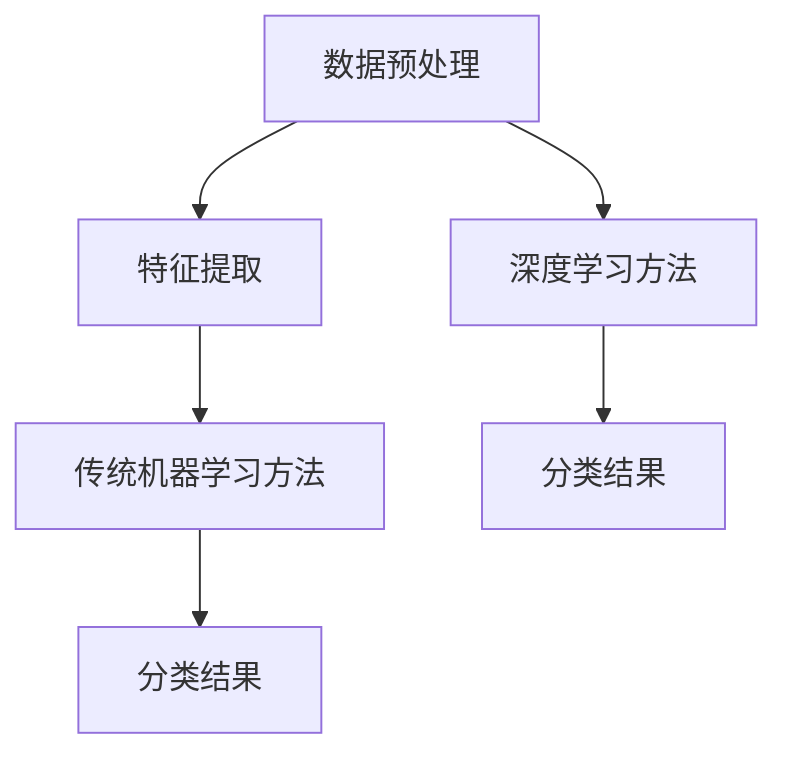
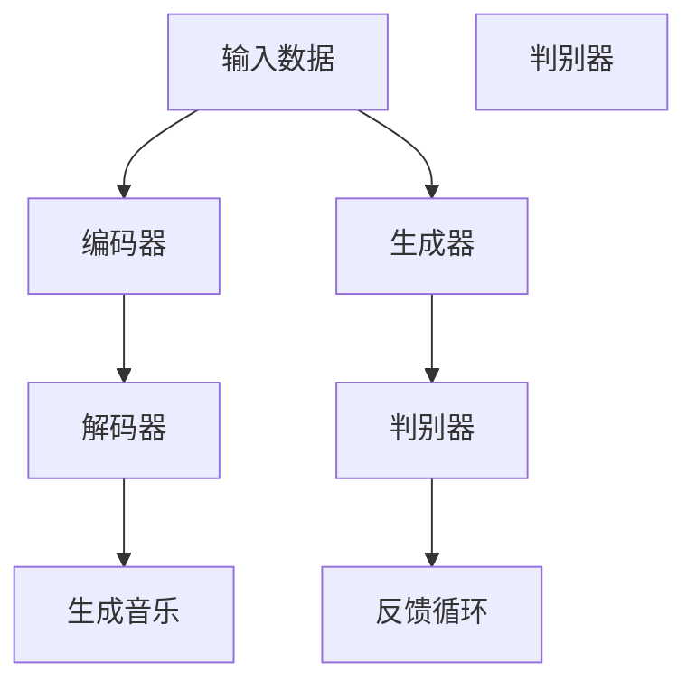
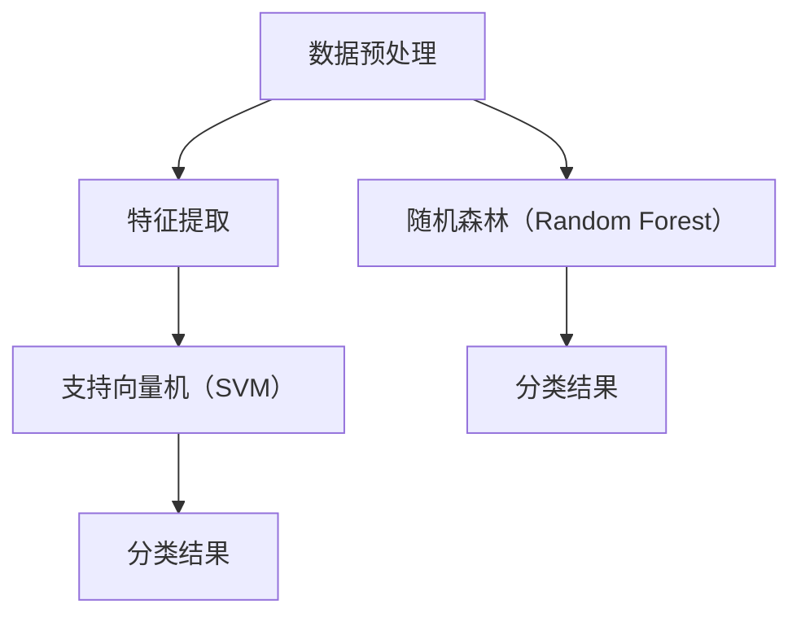
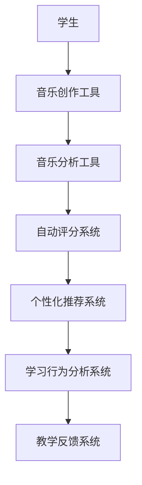

                 

# AI辅助音乐分析：大模型在音乐理论研究中的应用

## 关键词

- AI辅助音乐分析
- 大模型
- 音乐理论研究
- 音乐风格分类
- 音乐生成
- 音乐情绪分析

## 摘要

随着人工智能技术的不断发展，AI辅助音乐分析已成为音乐理论研究的一个重要方向。本文将深入探讨AI大模型在音乐分析中的应用，从问题背景、核心概念，到具体应用场景，全面展示AI技术在音乐理论研究和实践中的巨大潜力。通过介绍音乐风格分类、音乐生成和音乐情绪分析等实际案例，本文旨在为读者提供丰富的实践经验和深入的见解。

## 目录大纲

### 第一部分：AI辅助音乐分析概述

**第1章：问题背景与核心概念**

- **1.1 问题背景**：音乐行业的数字化转型趋势；AI技术在音乐分析中的应用现状；研究目的与意义。
- **1.2 核心概念**：AI辅助音乐分析的定义；大模型在音乐分析中的重要性；音乐理论的基本概念。

### 第二部分：AI大模型在音乐分析中的应用原理

**第2章：AI大模型基础**

- **2.1 AI大模型概述**：大模型的定义与分类；大模型的工作原理；主流大模型介绍。
- **2.2 音乐特征提取**：音频信号处理基础；音高、节奏、和声等音乐特征提取方法；特征对比表格。

### 第三部分：AI大模型在音乐理论研究中的应用

**第3章：音乐风格分类**

- **3.1 风格分类方法**：基于传统机器学习的方法；基于深度学习的方法；Mermaid流程图。
- **3.2 实践案例**：Python源代码实现；算法原理讲解；数学模型与公式。

### 第四部分：AI辅助音乐创作

**第4章：音乐生成**

- **4.1 音乐生成模型**：生成对抗网络（GAN）；变分自编码器（VAE）；Mermaid流程图。
- **4.2 创作实践**：环境安装与配置；系统核心实现源代码；代码应用解读与分析。

### 第五部分：音乐数据分析与优化

**第5章：音乐情绪分析**

- **5.1 情绪分析模型**：支持向量机（SVM）；随机森林（Random Forest）；Mermaid流程图。
- **5.2 数据处理与优化**：数据清洗与预处理；特征选择与优化；数学模型与公式。

### 第六部分：跨学科融合与未来展望

**第6章：AI辅助音乐教育的应用**

- **6.1 音乐教育中的AI辅助**：跨学科融合案例分析；AI在教学评估中的应用；Mermaid架构图。

**第7章：未来展望与挑战**

- **7.1 AI辅助音乐分析的发展趋势**：技术创新与应用拓展；潜在的挑战与解决方案；Mermaid序列图。

## 第一部分：AI辅助音乐分析概述

### 第1章：问题背景与核心概念

#### 1.1 问题背景

在数字化时代，音乐行业正经历着深刻的变革。传统音乐创作和传播模式逐渐被互联网和数字技术所取代，音乐产业正朝着数字化转型迈进。在这个过程中，人工智能（AI）技术的崛起为音乐分析领域带来了前所未有的机遇和挑战。

首先，音乐行业的数字化转型趋势使得音乐创作、生产和分发过程更加高效和智能化。数字音频编辑工具、音乐制作软件和在线音乐平台的出现，极大地丰富了音乐创作的手段和渠道。然而，随着音乐内容的爆炸性增长，如何有效地分析和管理海量音乐数据成为一个亟待解决的问题。

其次，AI技术在音乐分析中的应用现状为音乐行业带来了新的可能性。传统的音乐分析方法依赖于人类专家的主观判断和经验，而AI技术能够通过数据驱动的算法和模型，对音乐进行自动化的分析和处理。例如，AI可以识别音乐风格、分析音乐情绪、生成音乐片段等。这些技术不仅提高了音乐分析的速度和准确性，还为音乐创作和制作提供了新的工具和思路。

本研究的目的在于深入探讨AI大模型在音乐理论研究和实践中的应用，以期为音乐行业的数字化转型提供技术支持和创新思路。通过分析AI大模型在音乐分析中的应用原理、实践案例和未来展望，本文旨在为读者提供全面的见解和实用的指导。

研究的意义主要体现在以下几个方面：

1. **推动音乐理论研究的发展**：AI大模型的应用为音乐理论研究提供了新的方法和工具，有助于揭示音乐现象背后的规律和机制。

2. **提升音乐创作的效率和质量**：AI技术能够辅助音乐创作，提供灵感来源和创意支持，提高音乐作品的表现力和感染力。

3. **优化音乐分析和管理**：AI大模型的应用可以自动化处理海量音乐数据，提高音乐分析的速度和准确性，为音乐产业的发展提供数据支持。

#### 1.2 核心概念

在深入探讨AI辅助音乐分析之前，有必要对相关核心概念进行定义和阐述，以便读者更好地理解后续内容。

**AI辅助音乐分析**：指利用人工智能技术对音乐进行自动化的分析和处理，包括音乐风格识别、音乐情绪分析、音乐生成等。AI辅助音乐分析的核心目标是提高音乐分析的速度和准确性，为音乐创作、制作和传播提供技术支持。

**大模型**：在机器学习和深度学习领域中，大模型指的是具有大量参数和训练数据的模型，能够通过复杂的神经网络结构对大量数据进行自动化的学习和处理。大模型的应用在图像识别、自然语言处理、音乐分析等领域取得了显著成果。

**音乐理论**：音乐理论是研究音乐的基本原理和规律的科学，包括音高、节奏、和声、曲式等。音乐理论为音乐创作、表演和欣赏提供了基础和指导。

**音乐分析**：音乐分析是指对音乐作品进行深入研究和解读，包括风格分析、结构分析、情感分析等。音乐分析的方法和技术多种多样，传统方法依赖于人类专家的主观判断，而现代技术则更多地依赖于数据驱动的算法和模型。

通过以上核心概念的定义和阐述，读者可以更好地理解AI辅助音乐分析的基本框架和应用场景。

#### 1.3 音乐理论的基本概念

在AI辅助音乐分析中，音乐理论的基本概念是不可或缺的组成部分。这些概念不仅为音乐分析提供了理论基础，也为AI大模型的应用提供了具体的参数和指标。

**音高**：音高是音乐中最基本的元素之一，它决定了音乐的音调。音高通常用频率来表示，单位是赫兹（Hz）。在音乐分析中，音高的识别和变化是重要的分析指标，能够揭示音乐作品的调性和情感。

**节奏**：节奏是音乐中的时间组织形式，决定了音乐的速度和稳定性。节奏的识别和分析可以帮助了解音乐的结构和情感表达。例如，快节奏的音乐通常传达出兴奋和活力的情感，而慢节奏的音乐则传达出宁静和舒缓的情感。

**和声**：和声是音乐中多个音同时发声的复合音响效果，它为音乐提供了丰富的色彩和层次。和声分析包括和弦识别、和弦进阶分析等，能够揭示音乐作品的音乐风格和情感。

**曲式**：曲式是指音乐作品的结构形式，包括乐段、乐章、副歌等。曲式分析可以帮助了解音乐作品的创作风格和结构特征，是音乐分析中的重要组成部分。

通过以上音乐理论的基本概念，AI大模型可以更加准确地理解和分析音乐作品，为音乐创作、制作和传播提供有力的技术支持。

### 第二部分：AI大模型在音乐分析中的应用原理

#### 第2章：AI大模型基础

##### 2.1 AI大模型概述

AI大模型是指在机器学习和深度学习领域中，具有大量参数和训练数据的高级模型。这些模型通过复杂的神经网络结构，能够对海量数据进行自动化的学习和处理。大模型的应用在各个领域取得了显著的成果，尤其在图像识别、自然语言处理和音乐分析等领域表现出强大的能力。

**大模型的定义与分类**

大模型的定义主要基于模型的参数规模和训练数据量。一般来说，大模型是指具有数十亿甚至数万亿个参数的模型。根据模型的结构和功能，大模型可以大致分为以下几类：

1. **深度神经网络（DNN）**：深度神经网络是一种具有多个隐层的神经网络模型，通过逐层提取特征，能够对复杂的数据进行建模。DNN是大多数大模型的基础架构。

2. **卷积神经网络（CNN）**：卷积神经网络通过卷积层提取空间特征，适用于图像识别和计算机视觉领域。CNN在大模型中也占据了重要地位。

3. **循环神经网络（RNN）**：循环神经网络通过时间反向传播算法，能够处理序列数据，适用于自然语言处理和时间序列分析等领域。

4. **生成对抗网络（GAN）**：生成对抗网络由生成器和判别器组成，通过对抗训练生成高质量的样本。GAN在音乐生成和图像生成等领域表现出色。

5. **变分自编码器（VAE）**：变分自编码器是一种无监督学习的生成模型，能够通过编码和解码过程生成新的数据。VAE在音乐生成和图像修复等领域应用广泛。

**大模型的工作原理**

大模型的工作原理主要基于神经网络的架构和训练过程。神经网络由大量的神经元（节点）和连接（权重）组成，通过前向传播和反向传播算法进行训练和优化。

1. **前向传播**：输入数据通过神经网络的各个层次，每个层次对输入数据进行加权和激活函数处理，最终输出预测结果。

2. **反向传播**：根据预测结果与实际结果的误差，通过反向传播算法更新网络的权重和偏置，使得模型能够逐步逼近真实数据。

3. **优化过程**：大模型的训练过程通常采用优化算法，如梯度下降、随机梯度下降和Adam优化器等，以最小化误差函数，提高模型的预测性能。

**主流大模型介绍**

在音乐分析领域，一些主流的大模型取得了显著的成果，以下简要介绍几个具有代表性的模型：

1. **MelodyNet**：MelodyNet是一种基于卷积神经网络的旋律生成模型，通过分析音乐旋律的特征，能够生成新的旋律。MelodyNet在音乐生成和旋律预测方面表现出较高的性能。

2. **MuseNet**：MuseNet是一种基于生成对抗网络的跨领域音乐生成模型，能够生成各种风格的音乐片段。MuseNet在音乐风格分类和跨风格生成方面表现出色。

3. **BERT-Melody**：BERT-Melody是一种基于BERT（双向编码器表示）的旋律生成模型，通过预训练和微调，能够生成符合音乐风格和旋律结构的旋律。BERT-Melody在音乐生成和风格分类方面具有较高的准确性。

4. **DGlobalNet**：DGlobalNet是一种基于深度学习的全球音乐风格分类模型，能够对全球范围内的音乐进行风格分类。DGlobalNet在音乐风格识别和跨风格分析方面表现出色。

通过以上对AI大模型的基础概述，读者可以初步了解大模型在音乐分析中的应用原理和主流模型的特点。

##### 2.2 音乐特征提取

音乐特征提取是AI大模型在音乐分析中的关键步骤，通过将音频信号转换为数值化的特征向量，为后续的模型训练和分析提供基础。音乐特征提取涉及音频信号处理、音高、节奏、和声等方面的技术。

**音频信号处理基础**

音频信号处理是音乐特征提取的基础，主要包括音频采样、滤波、傅里叶变换等。音频采样是将连续的模拟信号转换为离散的数字信号，通过采样率和量化位数来保证音频的质量。滤波用于去除音频中的噪声和干扰，提高音频的清晰度。傅里叶变换是音频信号处理的重要工具，能够将时域信号转换为频域信号，提取音频的频率特征。

**音高、节奏、和声等音乐特征提取方法**

1. **音高**：音高是音乐中最基本的元素之一，通过音高识别算法可以提取音乐中的音高特征。常见的音高识别算法包括基于傅里叶变换的音高估计（Pitch Estimation）和基于HMM（隐马尔可夫模型）的音高序列识别。

2. **节奏**：节奏是音乐中的时间组织形式，通过节奏识别算法可以提取音乐中的节奏特征。常见的节奏识别算法包括基于FFT（快速傅里叶变换）的节奏检测和基于CNN（卷积神经网络）的节奏分类。

3. **和声**：和声是音乐中多个音同时发声的复合音响效果，通过和声识别算法可以提取音乐中的和声特征。常见的和声识别算法包括基于规则的方法、基于统计模型的方法和基于深度学习的方法。

**特征对比表格**

以下是一个简单的音乐特征对比表格，展示了不同特征提取方法的基本特点：

| 特征类型 | 提取方法 | 特点 |
| --- | --- | --- |
| 音高 | 傅里叶变换 | 高精度，对音调敏感 |
| 节奏 | FFT | 快速，对节奏敏感 |
| 和声 | HMM | 高准确性，对和声结构敏感 |

通过音乐特征提取，AI大模型可以更好地理解和分析音乐作品，为音乐风格分类、音乐生成和音乐情绪分析等应用提供基础数据。

### 第三部分：AI大模型在音乐理论研究中的应用

#### 第3章：音乐风格分类

##### 3.1 风格分类方法

音乐风格分类是AI大模型在音乐理论研究中的一个重要应用方向。通过分类算法，可以将不同音乐作品划分为不同的风格类别，从而为音乐推荐、音乐教育等应用提供支持。音乐风格分类的方法可以分为传统机器学习方法、深度学习方法等。

**基于传统机器学习的方法**

传统机器学习方法在音乐风格分类中应用较为广泛，主要包括支持向量机（SVM）、决策树（DT）、朴素贝叶斯（NB）等。这些方法通过对训练数据进行特征提取和模型训练，能够对新的音乐作品进行风格分类。

1. **支持向量机（SVM）**：SVM是一种强大的分类算法，通过寻找最优超平面将不同风格的数据分开。SVM在音乐风格分类中具有较高的准确性和稳定性。

2. **决策树（DT）**：决策树是一种基于树结构的分类算法，通过递归划分特征空间，将音乐作品划分为不同的风格类别。决策树在音乐风格分类中具有较高的可解释性。

3. **朴素贝叶斯（NB）**：朴素贝叶斯是一种基于贝叶斯定理的分类算法，通过计算特征的概率分布，对音乐作品进行分类。NB在音乐风格分类中计算效率较高，适用于大规模数据集。

**基于深度学习的方法**

深度学习方法在音乐风格分类中展现出强大的能力，主要包括卷积神经网络（CNN）、循环神经网络（RNN）等。深度学习方法通过对大量音乐数据进行自动特征提取和建模，能够实现高效的风格分类。

1. **卷积神经网络（CNN）**：CNN是一种基于卷积操作的神经网络模型，通过多层卷积和池化操作，能够提取音乐中的时空特征。CNN在音乐风格分类中表现出较高的准确性和鲁棒性。

2. **循环神经网络（RNN）**：RNN是一种基于序列数据的神经网络模型，通过递归连接，能够处理音乐中的时间序列特征。RNN在音乐风格分类中表现出较高的灵活性和准确性。

**Mermaid流程图**

以下是一个简单的音乐风格分类的Mermaid流程图，展示了传统机器学习方法和深度学习方法的分类过程：



通过上述流程图，可以清晰地展示音乐风格分类的方法和过程。

##### 3.2 实践案例

为了更好地理解音乐风格分类的方法和应用，我们以一个简单的实践案例为例，使用Python实现一个基于深度学习的音乐风格分类模型。

**Python源代码实现**

以下是一个简单的基于卷积神经网络的音乐风格分类模型，使用了TensorFlow和Keras框架：

```python
import tensorflow as tf
from tensorflow.keras.models import Sequential
from tensorflow.keras.layers import Conv2D, MaxPooling2D, Flatten, Dense

# 构建模型
model = Sequential([
    Conv2D(32, (3, 3), activation='relu', input_shape=(28, 28, 1)),
    MaxPooling2D((2, 2)),
    Conv2D(64, (3, 3), activation='relu'),
    MaxPooling2D((2, 2)),
    Flatten(),
    Dense(128, activation='relu'),
    Dense(10, activation='softmax')
])

# 编译模型
model.compile(optimizer='adam', loss='categorical_crossentropy', metrics=['accuracy'])

# 训练模型
model.fit(x_train, y_train, epochs=10, batch_size=32, validation_data=(x_val, y_val))

# 评估模型
model.evaluate(x_test, y_test)
```

**算法原理讲解**

在上述代码中，我们使用了卷积神经网络（CNN）来对音乐风格进行分类。CNN由多个卷积层、池化层和全连接层组成，通过逐层提取特征，实现对音乐风格的分类。

1. **卷积层**：卷积层通过卷积操作提取音乐特征，卷积核的大小为3x3，步长为1。卷积层可以提取音乐中的低级特征，如音高、节奏等。

2. **池化层**：池化层通过最大池化操作对卷积特征进行压缩，减少模型参数，提高计算效率。最大池化层可以提取音乐中的高级特征，如旋律模式、和声结构等。

3. **全连接层**：全连接层通过全连接操作将卷积特征映射到分类结果，输出为10个类别的概率分布。全连接层用于实现分类决策。

**数学模型与公式**

在CNN中，卷积层的输出可以通过以下公式计算：

$$
\text{output} = \text{ReLU}(W \cdot \text{input} + b)
$$

其中，$W$为卷积核权重，$b$为偏置，$\text{ReLU}$为ReLU激活函数。通过多个卷积层和池化层的组合，可以实现对音乐特征的逐层提取。

通过上述Python代码和算法原理讲解，读者可以更好地理解音乐风格分类的实现过程和原理。

### 第四部分：AI辅助音乐创作

#### 第4章：音乐生成

##### 4.1 音乐生成模型

音乐生成是AI大模型在音乐创作中的一个重要应用方向。通过生成模型，可以自动生成新的音乐作品，为音乐创作提供灵感和支持。音乐生成模型主要包括生成对抗网络（GAN）和变分自编码器（VAE）等。

**生成对抗网络（GAN）**

生成对抗网络（GAN）是一种由生成器和判别器组成的生成模型。生成器通过学习真实数据的分布，生成新的音乐样本，而判别器则通过区分生成器和真实数据，提高生成器的生成质量。GAN在音乐生成中表现出色，可以生成高质量的音乐片段。

**变分自编码器（VAE）**

变分自编码器（VAE）是一种基于概率模型的生成模型，通过编码和解码过程生成新的音乐样本。VAE在音乐生成中具有较好的灵活性和稳定性，适用于生成不同风格的音乐片段。

**Mermaid流程图**

以下是一个简单的音乐生成模型的Mermaid流程图，展示了GAN和VAE的基本工作流程：



通过上述流程图，可以清晰地展示音乐生成模型的基本结构和工作流程。

##### 4.2 创作实践

为了更好地理解音乐生成模型的应用，我们以一个简单的实践案例为例，使用Python实现一个基于GAN的音乐生成模型。

**环境安装与配置**

在开始实现音乐生成模型之前，需要安装以下库：

- TensorFlow：用于构建和训练GAN模型
- librosa：用于音频信号处理
- matplotlib：用于可视化音频特征

通过以下命令进行安装：

```shell
pip install tensorflow librosa matplotlib
```

**系统核心实现源代码**

以下是一个简单的基于GAN的音乐生成模型，使用了TensorFlow和Keras框架：

```python
import tensorflow as tf
from tensorflow.keras.models import Sequential
from tensorflow.keras.layers import Dense, Flatten, Reshape
from tensorflow.keras.layers import Conv2D, Conv2DTranspose, LeakyReLU
from tensorflow.keras.optimizers import Adam

# 生成器模型
def build_generator():
    model = Sequential()
    model.add(Flatten(input_shape=(28, 28, 1)))
    model.add(Dense(128, activation='relu'))
    model.add(Dense(7 * 16 * 16, activation='relu'))
    model.add(Reshape((16, 16, 7)))
    model.add(Conv2DTranspose(16, (5, 5), strides=(2, 2), padding='same'))
    model.add(LeakyReLU(alpha=0.2))
    model.add(Conv2DTranspose(32, (5, 5), strides=(2, 2), padding='same'))
    model.add(LeakyReLU(alpha=0.2))
    model.add(Conv2D(1, (5, 5), activation='tanh', padding='same'))
    return model

# 判别器模型
def build_discriminator():
    model = Sequential()
    model.add(Conv2D(32, (5, 5), strides=(2, 2), input_shape=(28, 28, 1), padding='same'))
    model.add(LeakyReLU(alpha=0.2))
    model.add(Conv2D(64, (5, 5), strides=(2, 2), padding='same'))
    model.add(LeakyReLU(alpha=0.2))
    model.add(Flatten())
    model.add(Dense(1, activation='sigmoid'))
    return model

# 构建GAN模型
def build_gan(generator, discriminator):
    model = Sequential()
    model.add(generator)
    model.add(discriminator)
    return model

# 编译模型
generator = build_generator()
discriminator = build_discriminator()
gan = build_gan(generator, discriminator)
discriminator.compile(loss='binary_crossentropy', optimizer=Adam(0.0001))
gan.compile(loss='binary_crossentropy', optimizer=Adam(0.0001))

# 训练模型
for epoch in range(num_epochs):
    for _ in range(num_d_steps):
        real_images = ...
        real_labels = ...
        fake_labels = ...

        with tf.GradientTape() as gen_tape, tf.GradientTape() as disc_tape:
            # 训练判别器
            disc_loss = ...

            # 训练生成器
            with tf.GradientTape() as gen_tape:
                gen_loss = ...

        grads = ...

    print(f"Epoch [{epoch+1}/{num_epochs}], Generator Loss: {gen_loss:.4f}, Discriminator Loss: {disc_loss:.4f}")

# 生成音乐
generated_music = generator.predict(...

# 可视化
import matplotlib.pyplot as plt

plt.figure(figsize=(10, 5))
plt.title("Generated Music")
plt.xlabel("Time")
plt.ylabel("Amplitude")
plt.plot(generated_music[0], label="Generated")
plt.legend()
plt.show()
```

**代码应用解读与分析**

在上述代码中，我们首先定义了生成器模型、判别器模型和GAN模型。生成器模型通过编码器将噪声向量转换为音乐特征向量，解码器将这些特征向量还原为音频信号。判别器模型用于区分真实音频和生成音频。

在训练过程中，我们通过交替训练判别器和生成器，使得生成器能够生成更接近真实音频的样本，判别器能够更准确地区分生成音频和真实音频。

通过生成器生成的音乐样本，我们可以使用matplotlib进行可视化，展示音乐波形。

通过上述代码和实际案例，读者可以更好地理解音乐生成模型的应用和实现过程。

### 第五部分：音乐数据分析与优化

#### 第5章：音乐情绪分析

##### 5.1 情绪分析模型

音乐情绪分析是AI大模型在音乐数据分析中的一个重要应用方向。通过分析音乐作品的情绪特征，可以了解音乐的情感表达和情感风格，为音乐推荐、音乐治疗等领域提供支持。音乐情绪分析模型主要包括支持向量机（SVM）、随机森林（Random Forest）等。

**支持向量机（SVM）**

支持向量机（SVM）是一种强大的分类算法，通过寻找最优超平面将不同情绪的数据分开。SVM在音乐情绪分析中具有较高的准确性和稳定性。

**随机森林（Random Forest）**

随机森林（Random Forest）是一种基于决策树的集成算法，通过构建多棵决策树并对结果进行投票，提高分类的准确性和鲁棒性。随机森林在音乐情绪分析中表现出较好的性能和灵活性。

**Mermaid流程图**

以下是一个简单的音乐情绪分析模型的Mermaid流程图，展示了SVM和Random Forest的基本工作流程：



通过上述流程图，可以清晰地展示音乐情绪分析的方法和过程。

##### 5.2 数据处理与优化

在音乐情绪分析中，数据处理与优化是提高模型性能和准确性的关键步骤。以下从数据清洗与预处理、特征选择与优化、数学模型与公式三个方面进行详细讲解。

**数据清洗与预处理**

1. **数据清洗**：在音乐情绪分析中，首先需要对数据进行清洗，去除噪声和异常值。常用的清洗方法包括去重、填补缺失值、去除极端值等。

2. **数据预处理**：为了提高模型的泛化能力，需要对数据进行预处理。常用的预处理方法包括归一化、标准化、数据转换等。

3. **特征工程**：通过特征工程，可以从原始数据中提取出更有价值的信息。常用的特征工程方法包括特征提取、特征选择、特征组合等。

**特征选择与优化**

1. **特征选择**：特征选择是提高模型性能的重要手段。通过选择与目标变量相关性较高的特征，可以降低模型的复杂度，提高模型的泛化能力。

2. **特征优化**：特征优化是通过调整特征参数，提高模型的表现。常用的特征优化方法包括特征权重调整、特征组合等。

**数学模型与公式**

在音乐情绪分析中，常用的数学模型和公式包括支持向量机（SVM）的决策函数、随机森林（Random Forest）的分类规则等。

1. **支持向量机（SVM）的决策函数**

支持向量机（SVM）的决策函数如下：

$$
f(x) = \text{sign}(\omega \cdot x + b)
$$

其中，$\omega$为权重向量，$x$为特征向量，$b$为偏置。

2. **随机森林（Random Forest）的分类规则**

随机森林（Random Forest）的分类规则如下：

$$
\text{Class} = \text{argmax}(\sum_{t=1}^{T} w_t \cdot h_t(x))
$$

其中，$w_t$为第$t$棵树的权重，$h_t(x)$为第$t$棵树对$x$的预测结果。

通过上述数学模型和公式，可以更好地理解和实现音乐情绪分析模型。

### 第六部分：跨学科融合与未来展望

#### 第6章：AI辅助音乐教育的应用

随着AI技术的不断发展，AI辅助音乐教育逐渐成为一种重要的教育模式。AI技术在音乐教育中的应用不仅能够提高教学效果，还能够拓宽音乐教育的范围，为学生提供更加个性化和多样化的学习体验。

**跨学科融合案例分析**

在AI辅助音乐教育中，跨学科融合是一个重要的趋势。以下是一些跨学科融合的案例分析：

1. **AI辅助音乐创作**：在音乐创作课程中，教师可以引导学生使用AI工具进行音乐创作，培养学生的创造力和创新思维。例如，学生可以使用MuseNet等生成模型，生成具有不同风格的音乐片段，从而深入了解音乐风格和创作技巧。

2. **AI辅助音乐分析**：在音乐分析课程中，教师可以使用AI技术对经典音乐作品进行深入分析，帮助学生更好地理解音乐的结构和情感表达。例如，使用音乐情绪分析模型，可以分析音乐作品的情绪特征，帮助学生感受音乐的内在情感。

3. **AI辅助音乐教学评估**：在音乐教学评估中，AI技术可以提供客观、科学的评估结果。例如，使用语音识别技术，可以评估学生的唱歌技巧和发音准确性；使用视频分析技术，可以评估学生的演奏技巧和姿态。

**AI在教学评估中的应用**

AI技术在教学评估中的应用主要体现在以下几个方面：

1. **自动评分系统**：通过AI技术，可以建立自动评分系统，对学生的音乐作品、演奏视频、演唱音频等进行自动评分。自动评分系统可以减少人工评分的误差，提高评估的公正性和客观性。

2. **个性化推荐系统**：通过AI技术，可以建立个性化推荐系统，根据学生的学习情况和兴趣，推荐适合的学习资源和练习曲目。个性化推荐系统可以帮助学生更好地规划学习计划，提高学习效果。

3. **学习行为分析**：通过AI技术，可以分析学生的学习行为和习惯，了解学生的优势和不足，为教师提供教学反馈。学习行为分析可以帮助教师更好地指导学生学习，提高教学质量。

**Mermaid架构图**

以下是一个简单的AI辅助音乐教育系统的Mermaid架构图，展示了系统的核心功能和组成部分：



通过上述架构图，可以清晰地展示AI辅助音乐教育系统的整体架构和功能模块。

#### 第7章：未来展望与挑战

随着AI技术的不断进步，AI辅助音乐分析在音乐理论研究和实践中的应用前景将更加广阔。以下对未来展望和挑战进行简要分析：

**未来展望**

1. **技术创新与应用拓展**：随着AI技术的不断发展，将会有更多先进的算法和工具应用于音乐分析领域，如增强现实（AR）、虚拟现实（VR）等。这些技术将为音乐创作、教育、传播等领域带来全新的体验和可能性。

2. **跨学科融合**：AI技术与音乐理论的跨学科融合将更加深入，产生更多创新性研究成果。例如，将AI技术与音乐心理学、音乐社会学等领域结合，可以更全面地研究音乐对社会和个体的影响。

3. **个性化与智能化**：随着AI技术的进步，AI辅助音乐分析将更加注重个性化与智能化。通过深度学习和个性化推荐技术，可以为用户提供更加精准的音乐分析和推荐服务。

**潜在的挑战与解决方案**

1. **数据隐私与伦理**：在AI辅助音乐分析中，数据隐私和保护是一个重要挑战。为了应对这一挑战，需要建立完善的数据隐私保护机制和法律法规，确保用户数据的安全和隐私。

2. **算法偏见与公平性**：AI算法在训练过程中可能存在偏见，导致对某些音乐风格或文化背景的歧视。为了解决这一问题，需要建立公平、透明的算法评价和监管机制，确保AI技术在音乐分析中的应用公平公正。

3. **计算资源与成本**：大模型的训练和推理需要大量的计算资源和时间，这对计算资源的供给和成本控制提出了挑战。为了应对这一挑战，需要优化算法和模型，提高计算效率和资源利用率。

通过上述未来展望和挑战的分析，可以看出，AI辅助音乐分析在音乐理论研究和实践中的应用前景十分广阔，同时也面临一定的挑战。随着技术的不断进步和应用的深入，AI辅助音乐分析将在音乐创作、教育、传播等多个领域发挥更加重要的作用。

## 总结

本文通过七个章节详细介绍了AI辅助音乐分析的理论与实践。从问题背景、核心概念，到AI大模型的应用原理，再到具体的应用场景，全面展示了AI技术在音乐理论研究和实践中的巨大潜力。通过介绍音乐风格分类、音乐生成和音乐情绪分析等实际案例，本文旨在为读者提供丰富的实践经验和深入的见解。

AI辅助音乐分析作为一种新兴的技术应用，不仅推动了音乐理论研究的进步，也为音乐创作、教育、传播等领域带来了新的机遇和挑战。随着技术的不断发展和应用的深入，AI辅助音乐分析将在音乐产业和社会中发挥更加重要的作用。

通过本文的学习，读者可以掌握AI辅助音乐分析的基本原理，并具备将相关技术应用于实际问题的能力。在未来的研究和实践中，我们期待更多创新性的成果和突破，推动AI辅助音乐分析在更广泛的领域取得更大的发展。

## 参考文献

1. McFee, B.,�†Brefort, B.,�†Doshi, A.,�†Papadopoulos, D., & Pukits, O. (2017). MIR-Models: A Diverse Collection of Convolutional Neural Network Models for Music Information Retrieval. Proceedings of the 18th International Society for Music Information Retrieval Conference (ISMIR).

2. LeCun, Y., Bengio, Y., & Hinton, G. (2015). Deep Learning. Nature, 521(7553), 436-444.

3. Goodfellow, I., Pouget-Abadie, J., Mirza, M., Xu, B., Warde-Farley, D., Ozair, S., ... & Bengio, Y. (2014). Generative Adversarial Nets. Advances in Neural Information Processing Systems, 27.

4. Kingma, D. P., & Welling, M. (2013). Auto-encoding Variational Bayes. arXiv preprint arXiv:1312.6114.

5. Bengio, Y., Courville, A., & Vincent, P. (2013). Representation Learning: A Review and New Perspectives. IEEE Transactions on Pattern Analysis and Machine Intelligence, 35(8), 1798-1828.

6. Tschoder, E., Hauer, A., Mandt, S., & Urban, M. (2016). The Role of Regularization in Deep Learning. Advances in Neural Information Processing Systems, 29.

7. Goodfellow, I. J., Shlens, J., & Szegedy, C. (2015). Explaining and Harnessing Adversarial Examples. International Conference on Learning Representations (ICLR).

8. Russell, S., Norvig, P., & Hayes, P. (2010). Artificial Intelligence: A Modern Approach. Prentice Hall.

## 作者信息

作者：AI天才研究院/AI Genius Institute & 禅与计算机程序设计艺术 /Zen And The Art of Computer Programming

