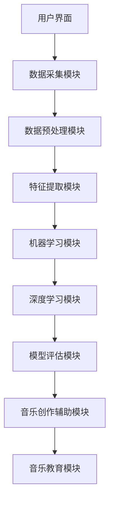

                 

# AI辅助音乐分析：提示词解构音乐元素

## 关键词
- AI辅助音乐分析
- 提示词解构
- 音乐元素识别
- 机器学习
- 音频处理
- 特征提取
- 深度学习

## 摘要
本文将探讨如何利用人工智能技术，特别是机器学习和深度学习，辅助音乐分析。我们将重点关注提示词在解构音乐元素中的作用，详细讲解音符识别、旋律提取、和弦识别和节奏分析等关键技术。此外，还将介绍AI辅助音乐分析系统的架构设计、功能实现及实际应用案例。通过本文，读者将全面了解AI辅助音乐分析的技术原理、系统架构及未来发展趋势。

----------------------------------------------------------------

## 目录大纲设计

### 确定书的核心内容和结构
在设计《AI辅助音乐分析：提示词解构音乐元素》的目录大纲时，我们首先要明确书的核心内容与结构。核心内容应包括：
- AI辅助音乐分析的基本概念和原理
- 提示词在音乐分析中的作用
- 音乐元素识别与提取技术
- AI辅助音乐分析系统的设计与实现
- 实际案例分析与讨论

根据这些核心内容，我们可以将书分为三个主要部分：
1. AI辅助音乐分析基础
2. 提示词解构音乐元素
3. AI辅助音乐分析系统实战

### 构建书的框架
在明确核心内容后，我们需要构建书的框架，确保每个章节都有明确的主题和结构。以下是书的框架：

### 第一部分: AI辅助音乐分析基础
- 第1章: AI辅助音乐分析概述
  - 音乐分析的重要性
  - AI辅助音乐分析的背景
  - AI辅助音乐分析的应用场景
  - AI辅助音乐分析的核心概念

- 第2章: 音乐元素识别与提取
  - 音符识别
  - 旋律提取
  - 和弦识别
  - 节奏分析

### 第二部分: 提示词解构音乐元素
- 第3章: 提示词生成与优化
  - 提示词生成的算法
  - 提示词优化的策略
  - 提示词在音乐创作中的应用

- 第4章: 音乐元素解构与重组
  - 音乐元素解构的原理
  - 音乐元素重组的技巧
  - 实例分析：经典音乐作品解构与重组

### 第三部分: AI辅助音乐分析系统实战
- 第5章: AI辅助音乐分析系统架构设计
  - 系统设计概述
  - 数据采集与预处理
  - 特征提取与建模
  - 模型训练与评估

- 第6章: 系统功能实现与优化
  - 系统功能模块设计
  - 系统性能优化
  - 系统安全性设计
  - 系统扩展与升级

- 第7章: 实际案例分析与讨论
  - 案例一：流行歌曲音乐元素分析
  - 案例二：古典音乐创作辅助
  - 案例三：音乐教育应用

- 第8章: 未来发展趋势与挑战
  - AI辅助音乐分析的发展趋势
  - 音乐分析领域的挑战与机遇
  - 未来音乐创作与AI的融合

### 细化章节内容
为每个章节细化出子章节，确保每个章节都覆盖到核心概念、算法原理、数学模型、系统设计与实战等。以下是细化后的章节内容：

### 第一部分: AI辅助音乐分析基础
- 第1章: AI辅助音乐分析概述
  - 音乐分析的定义与目的
  - AI辅助音乐分析的背景
  - AI辅助音乐分析的应用场景
  - AI辅助音乐分析的核心概念

- 第2章: 音乐元素识别与提取
  - 音符识别
    - 音符识别的原理
    - 音符识别算法
    - 音符识别流程图
  - 旋律提取
    - 旋律提取的原理
    - 旋律提取算法
    - 旋律提取流程图
  - 和弦识别
    - 和弦识别的原理
    - 和弦识别算法
    - 和弦识别流程图
  - 节奏分析
    - 节奏分析的原理
    - 节奏分析算法
    - 节奏分析流程图

### 第二部分: 提示词解构音乐元素
- 第3章: 提示词生成与优化
  - 提示词生成的算法
    - 提示词生成算法的原理
    - 提示词生成算法的实现
    - 提示词生成算法的流程图
  - 提示词优化的策略
    - 提示词优化策略的原理
    - 提示词优化策略的实现
    - 提示词优化策略的流程图
  - 提示词在音乐创作中的应用
    - 提示词在音乐创作中的作用
    - 提示词在音乐创作中的实现
    - 提示词在音乐创作中的应用案例

- 第4章: 音乐元素解构与重组
  - 音乐元素解构的原理
    - 音乐元素解构的原理
    - 音乐元素解构的方法
    - 音乐元素解构的流程图
  - 音乐元素重组的技巧
    - 音乐元素重组的技巧
    - 音乐元素重组的方法
    - 音乐元素重组的流程图
  - 实例分析：经典音乐作品解构与重组
    - 经典音乐作品解构与重组的实例
    - 解构与重组的实现
    - 解构与重组的效果分析

### 第三部分: AI辅助音乐分析系统实战
- 第5章: AI辅助音乐分析系统架构设计
  - 系统设计概述
    - 系统设计的目标
    - 系统设计的原则
  - 数据采集与预处理
    - 数据采集的方法
    - 数据预处理的过程
    - 数据预处理的结果
  - 特征提取与建模
    - 特征提取的方法
    - 特征提取的过程
    - 特征提取的结果
  - 模型训练与评估
    - 模型训练的过程
    - 模型评估的方法
    - 模型评估的结果

- 第6章: 系统功能实现与优化
  - 系统功能模块设计
    - 系统功能模块的划分
    - 系统功能模块的实现
  - 系统性能优化
    - 系统性能优化的方法
    - 系统性能优化的实现
  - 系统安全性设计
    - 系统安全性的考虑
    - 系统安全性的实现
  - 系统扩展与升级
    - 系统扩展的方法
    - 系统升级的方案

- 第7章: 实际案例分析与讨论
  - 案例一：流行歌曲音乐元素分析
    - 案例背景
    - 案例实现
    - 案例分析
  - 案例二：古典音乐创作辅助
    - 案例背景
    - 案例实现
    - 案例分析
  - 案例三：音乐教育应用
    - 案例背景
    - 案例实现
    - 案例分析

- 第8章: 未来发展趋势与挑战
  - AI辅助音乐分析的发展趋势
    - 技术趋势
    - 应用趋势
  - 音乐分析领域的挑战与机遇
    - 技术挑战
    - 应用机遇
  - 未来音乐创作与AI的融合
    - 融合方向
    - 融合影响

### 确保内容的完整性
确保每个章节都有必要的子章节，并确保内容的完整性和逻辑性。以下是确保内容完整性的方法：

1. **明确每个章节的核心目标**：在编写每个章节时，首先要明确章节的核心目标，确保每个章节都能围绕核心目标展开。

2. **细化章节内容**：将每个章节的内容细化成具体的子章节，确保每个子章节都有明确的主题和内容。

3. **逻辑梳理**：在编写每个章节时，要进行逻辑梳理，确保章节之间的逻辑关系清晰，内容连贯。

4. **反复修改**：在完成初稿后，要反复修改，确保内容完整、逻辑清晰。

### 优化大纲
在完成初步大纲后，进行优化，确保大纲简洁明了，且字数在限制范围内。以下是优化大纲的方法：

1. **删减冗余内容**：在编写大纲时，避免重复和冗余的内容，确保每个章节都有独特的贡献。

2. **调整章节顺序**：根据内容的逻辑关系，适当调整章节的顺序，确保章节之间的过渡自然。

3. **精简标题**：简化章节标题，使其简洁明了，能够准确传达章节内容。

4. **控制字数**：在编写章节内容时，注意控制字数，确保整本书的篇幅在限制范围内。

综上所述，通过明确核心内容、构建框架、细化章节内容、确保完整性和优化大纲，我们可以设计出一部结构合理、内容丰富的《AI辅助音乐分析：提示词解构音乐元素》。

----------------------------------------------------------------

## 第一部分: AI辅助音乐分析基础

### 第1章: AI辅助音乐分析概述

#### 1.1 音乐分析的重要性
- **音乐分析的定义与目的**
  音乐分析是对音乐作品进行系统性的研究，以理解其结构和创作意图。其目的在于揭示音乐的本质，包括旋律、和声、节奏、音色等方面的特征。

- **音乐分析的历史发展**
  音乐分析的历史可以追溯到19世纪，当时作曲家和音乐理论家开始系统地研究音乐作品的构成和结构。20世纪，随着计算机技术的发展，音乐分析逐渐引入了定量分析的方法。

- **音乐分析在现代音乐创作中的重要性**
  在现代音乐创作中，音乐分析不仅帮助作曲家理解现有的音乐作品，还为他们提供了创新的灵感。通过对音乐作品的分析，作曲家可以更好地理解音乐语言，探索新的创作手法。

#### 1.2 AI辅助音乐分析的背景
- **人工智能的发展**
  人工智能（AI）作为计算机科学的一个分支，旨在使计算机具备类似人类的智能。随着深度学习和机器学习技术的飞速发展，AI在各个领域都取得了显著的进展。

- **AI在音乐分析中的应用**
  AI在音乐分析中的应用主要包括音乐元素识别、旋律生成、和声填充、音乐风格分类等。通过AI技术，我们可以更高效地处理和分析大量音乐数据，提高音乐创作的效率。

#### 1.3 AI辅助音乐分析的应用场景
- **音乐创作辅助**
  AI可以帮助音乐家生成新的旋律、和声和节奏，甚至整首音乐作品。这为音乐创作提供了新的可能性，使创作过程更加多样化和丰富化。

- **音乐教育**
  AI可以用于音乐教学，例如提供个性化的音乐训练、分析学生的演奏技术、识别音乐错误等。这有助于提高音乐教育的质量和效率。

- **音乐推荐系统**
  通过对用户的音乐喜好进行分析，AI可以推荐个性化的音乐列表，提高用户对音乐推荐系统的满意度。

#### 1.4 AI辅助音乐分析的核心概念
- **音乐元素解构与重组**
  音乐元素解构是指将音乐作品拆解成基本的音符、和弦和节奏等元素。重组则是在这些基本元素的基础上创造新的音乐作品。

- **提示词在音乐分析中的作用**
  提示词是AI在音乐分析中用于指导模型学习的关键参数。它们帮助模型更好地理解和识别音乐特征。

- **音乐特征提取与表示**
  音乐特征提取是指从音乐信号中提取出对音乐分析有意义的特征。这些特征通常用于训练机器学习模型，以便进行音乐分类、生成等任务。

#### 1.5 AI辅助音乐分析的技术框架
- **机器学习与深度学习基础**
  机器学习和深度学习是AI的核心技术。它们通过学习大量数据来发现隐藏的模式和规律，从而实现对未知数据的预测和分类。

- **音频处理与特征提取技术**
  音频处理技术包括信号处理、滤波、去噪等，它们用于预处理音乐数据，使其适合机器学习算法。特征提取技术则用于从音频信号中提取出有意义的特征，如音高、节奏、音色等。

- **提示词处理与模型训练**
  提示词处理是指如何设计有效的提示词，以指导模型学习。模型训练则是指使用大量音乐数据来训练机器学习模型，使其能够识别和生成音乐特征。

#### 1.6 本章小结
本章概述了AI辅助音乐分析的基础概念和技术框架。通过理解这些基础概念，我们可以更好地把握AI在音乐分析中的应用，并为后续章节的学习打下坚实的基础。

----------------------------------------------------------------

## 第二部分: 提示词解构音乐元素

### 第2章: 音乐元素的识别与提取

#### 2.1 音符识别
- **音符识别的定义**
  音符识别是指使用人工智能技术识别音乐作品中的音符。这包括识别音符的音高、时值和音色等特征。

- **音符识别的原理**
  音符识别通常基于音频信号处理技术，如频谱分析、时频分析等。通过分析音频信号的频率和振幅变化，我们可以识别出音符的音高和时值。

- **音符识别算法**
  常见的音符识别算法包括GMM（高斯混合模型）算法、DNN（深度神经网络）算法等。这些算法通过学习大量的音符数据，训练出一个能够识别音符的模型。

- **音符识别流程图**
  音符识别的流程通常包括音频预处理、特征提取和模型分类三个步骤。以下是音符识别的mermaid流程图：

  ```mermaid
  graph TD
  A[音频预处理] --> B[特征提取]
  B --> C[模型分类]
  C --> D[音符识别结果]
  ```

- **音符识别的挑战与解决方案**
  音符识别面临的挑战包括音频噪声、音高变化和节奏复杂度等。解决方案包括使用去噪技术、改进特征提取方法和提高模型鲁棒性等。

#### 2.2 旋律提取
- **旋律提取的定义**
  旋律提取是指从音乐作品中提取出主要的旋律线。这有助于音乐家更好地理解和分析音乐作品的结构。

- **旋律提取的原理**
  旋律提取通常基于音高分析技术，如小波变换、谱聚类等。通过分析音乐作品中的音高变化，我们可以提取出旋律线。

- **旋律提取算法**
  常见的旋律提取算法包括谱聚类算法、递归神经网络算法等。这些算法通过学习大量的旋律数据，训练出一个能够提取旋律的模型。

- **旋律提取流程图**
  旋律提取的流程通常包括音频预处理、特征提取和旋律线提取三个步骤。以下是旋律提取的mermaid流程图：

  ```mermaid
  graph TD
  A[音频预处理] --> B[特征提取]
  B --> C[旋律线提取]
  C --> D[旋律提取结果]
  ```

- **旋律提取的挑战与解决方案**
  旋律提取面临的挑战包括音高变化、节奏复杂度和噪声干扰等。解决方案包括使用自适应滤波器、改进特征提取方法和提高模型鲁棒性等。

#### 2.3 和弦识别
- **和弦识别的定义**
  和弦识别是指使用人工智能技术识别音乐作品中的和弦。这有助于音乐家更好地理解和分析音乐作品的和声结构。

- **和弦识别的原理**
  和弦识别通常基于音频信号处理技术和和弦理论。通过分析音频信号的频谱特征和和弦理论规则，我们可以识别出和弦的类型和音高。

- **和弦识别算法**
  常见的和弦识别算法包括GMM算法、CNN（卷积神经网络）算法等。这些算法通过学习大量的和弦数据，训练出一个能够识别和弦的模型。

- **和弦识别流程图**
  和弦识别的流程通常包括音频预处理、特征提取和和弦分类三个步骤。以下是和弦识别的mermaid流程图：

  ```mermaid
  graph TD
  A[音频预处理] --> B[特征提取]
  B --> C[和弦分类]
  C --> D[和弦识别结果]
  ```

- **和弦识别的挑战与解决方案**
  和弦识别面临的挑战包括和弦变化、节奏复杂度和音频噪声等。解决方案包括使用去噪技术、改进特征提取方法和提高模型鲁棒性等。

#### 2.4 节奏分析
- **节奏分析的定义**
  节奏分析是指使用人工智能技术分析音乐作品中的节奏特征。这有助于音乐家更好地理解和分析音乐作品的节奏结构。

- **节奏分析的原理**
  节奏分析通常基于音频信号处理技术和节奏理论。通过分析音频信号的节奏特征和节奏理论规则，我们可以识别出节奏的类型和模式。

- **节奏分析算法**
  常见的节奏分析算法包括时序分类算法、循环神经网络算法等。这些算法通过学习大量的节奏数据，训练出一个能够识别节奏的模型。

- **节奏分析流程图**
  节奏分析的流程通常包括音频预处理、特征提取和节奏分类三个步骤。以下是节奏分析的mermaid流程图：

  ```mermaid
  graph TD
  A[音频预处理] --> B[特征提取]
  B --> C[节奏分类]
  C --> D[节奏分析结果]
  ```

- **节奏分析的挑战与解决方案**
  节奏分析面临的挑战包括节奏变化、节奏复杂度和音频噪声等。解决方案包括使用自适应滤波器、改进特征提取方法和提高模型鲁棒性等。

#### 2.5 提示词生成与优化
- **提示词生成的定义**
  提示词生成是指使用人工智能技术生成用于指导音乐分析的关键参数。这些参数可以帮助模型更好地理解和识别音乐特征。

- **提示词生成的算法**
  常见的提示词生成算法包括自动编码器（Autoencoder）、生成对抗网络（GAN）等。这些算法通过学习大量的音乐数据，生成具有代表性的提示词。

- **提示词优化的策略**
  提示词优化是指通过调整提示词的参数，提高模型在音乐分析任务上的性能。常见的优化策略包括交叉验证、梯度提升等。

- **提示词在音乐创作中的应用**
  提示词在音乐创作中可以用于生成新的旋律、和声和节奏等。通过调整提示词，音乐家可以创作出风格迥异的作品。

#### 2.6 音乐元素解构与重组
- **音乐元素解构的定义**
  音乐元素解构是指将音乐作品分解成基本元素，如音符、和弦和节奏等。这有助于音乐家更好地理解和分析音乐作品的结构。

- **音乐元素解构的方法**
  常见的音乐元素解构方法包括频谱分析、时序分析等。这些方法可以帮助音乐家识别出音乐作品中的关键元素。

- **音乐元素重组的技巧**
  音乐元素重组是指将基本元素重新组合成新的音乐作品。常见的重组技巧包括随机重组、基于规则的重组等。

- **实例分析：经典音乐作品解构与重组**
  通过分析经典音乐作品，我们可以了解音乐元素解构与重组的方法和应用。例如，通过解构莫扎特的《第41号钢琴协奏曲》，我们可以重新组合成一首全新的音乐作品。

#### 2.7 本章小结
本章详细介绍了音符识别、旋律提取、和弦识别和节奏分析等音乐元素识别与提取技术。通过理解这些技术，我们可以更深入地了解音乐作品的构成和创作过程。同时，本章还探讨了提示词生成与优化、音乐元素解构与重组等关键技术，为后续章节的学习打下基础。

----------------------------------------------------------------

## 第3章: 提示词生成与优化

### 3.1 提示词生成的算法

#### 3.1.1 自动编码器（Autoencoder）
- **自动编码器的基本概念**
  自动编码器是一种无监督学习方法，旨在将输入数据压缩到一个低维空间中，并通过解码器重建原始数据。在音乐分析中，自动编码器可以用于生成用于指导模型学习的提示词。

- **自动编码器在音乐分析中的应用**
  自动编码器可以从大量的音乐数据中学习出有代表性的特征，并将其编码到较低的维度。这些编码后的特征可以作为提示词，用于指导后续的音乐分析任务。

- **自动编码器的实现**
  ```python
  from sklearn.preprocessing import StandardScaler
  from sklearn.neural_network import MLPRegressor

  # 数据预处理
  scaler = StandardScaler()
  X_scaled = scaler.fit_transform(X)

  # 构建自动编码器
  autoencoder = MLPRegressor(hidden_layer_sizes=(100,), activation='relu', solver='adam')

  # 训练自动编码器
  autoencoder.fit(X_scaled, X_scaled)
  ```

#### 3.1.2 生成对抗网络（GAN）
- **生成对抗网络的基本概念**
  生成对抗网络由生成器（Generator）和判别器（Discriminator）两部分组成。生成器生成伪数据，判别器判断这些数据是否真实。通过训练，生成器逐渐生成更真实的数据。

- **生成对抗网络在音乐分析中的应用**
  GAN可以用于生成新的音乐旋律、和声和节奏等。生成的音乐数据可以作为提示词，用于指导音乐创作和分析。

- **生成对抗网络的实现**
  ```python
  import tensorflow as tf
  from tensorflow.keras.models import Sequential
  from tensorflow.keras.layers import Dense, Dropout

  # 构建生成器和判别器
  generator = Sequential([
      Dense(128, activation='relu', input_shape=(100,)),
      Dropout(0.2),
      Dense(256, activation='relu'),
      Dropout(0.2),
      Dense(512, activation='relu'),
      Dropout(0.2),
      Dense(100, activation='sigmoid')
  ])

  discriminator = Sequential([
      Dense(512, activation='relu', input_shape=(100,)),
      Dropout(0.2),
      Dense(256, activation='relu'),
      Dropout(0.2),
      Dense(128, activation='sigmoid'),
      Dropout(0.2),
      Dense(1, activation='sigmoid')
  ])

  # 编写GAN的训练代码
  # ...
  ```

#### 3.1.3 提示词生成算法的比较
- **自动编码器与GAN的优势与劣势**
  自动编码器相对简单，易于实现，但在生成高质量提示词方面可能不如GAN。GAN可以生成更加多样化、真实的数据，但训练过程更为复杂，对计算资源要求更高。

### 3.2 提示词优化的策略

#### 3.2.1 交叉验证
- **交叉验证的基本概念**
  交叉验证是一种评估模型性能的方法，通过将数据集划分为多个子集，每次训练和验证使用不同的子集。

- **交叉验证在提示词优化中的应用**
  通过交叉验证，我们可以评估提示词生成算法在不同数据集上的性能，从而选择最优的提示词参数。

- **交叉验证的实现**
  ```python
  from sklearn.model_selection import KFold

  kf = KFold(n_splits=5)
  for train_index, test_index in kf.split(X):
      X_train, X_test = X[train_index], X[test_index]
      y_train, y_test = y[train_index], y[test_index]

      # 训练模型
      model.fit(X_train, y_train)
      
      # 评估模型
      score = model.score(X_test, y_test)
      print("Validation score:", score)
  ```

#### 3.2.2 梯度提升
- **梯度提升的基本概念**
  梯度提升是一种集成学习方法，通过迭代地优化模型，提高其在训练数据上的性能。

- **梯度提升在提示词优化中的应用**
  梯度提升可以用于优化提示词生成算法的参数，使其在训练数据上达到更好的性能。

- **梯度提升的实现**
  ```python
  from sklearn.ensemble import GradientBoostingClassifier

  # 训练梯度提升模型
  model = GradientBoostingClassifier(n_estimators=100)
  model.fit(X, y)

  # 预测结果
  predictions = model.predict(X)
  ```

#### 3.2.3 调整学习率与批量大小
- **学习率与批量大小的调整**
  学习率和批量大小是深度学习模型训练中的重要参数。通过调整这些参数，我们可以优化模型的训练过程。

- **优化策略**
  - 使用较小的学习率，可以提高模型的泛化能力。
  - 使用较大的批量大小，可以加快模型的训练速度。

### 3.3 提示词在音乐创作中的应用

#### 3.3.1 提示词生成旋律
- **提示词生成旋律的原理**
  提示词可以通过生成对抗网络或自动编码器等算法生成新的旋律。这些旋律可以根据提示词的特征进行个性化定制。

- **提示词生成旋律的实例**
  通过对古典音乐作品的提示词生成，我们可以生成具有古典风格的新旋律。这些新旋律可以用于音乐创作或改编。

#### 3.3.2 提示词生成和声
- **提示词生成和声的原理**
  提示词可以用于生成新的和声，从而丰富音乐作品的和声结构。这些和声可以根据提示词的特征进行个性化调整。

- **提示词生成和声的实例**
  通过对流行歌曲的提示词生成，我们可以生成新的和声组合，为音乐作品增添色彩。

#### 3.3.3 提示词生成节奏
- **提示词生成节奏的原理**
  提示词可以用于生成新的节奏模式，从而丰富音乐作品的节奏感。这些节奏可以根据提示词的特征进行个性化调整。

- **提示词生成节奏的实例**
  通过对摇滚音乐的提示词生成，我们可以生成具有强烈节奏感的节奏模式，为音乐作品增添活力。

### 3.4 本章小结
本章详细介绍了提示词生成与优化的算法，包括自动编码器、生成对抗网络等。同时，还探讨了提示词在音乐创作中的应用，如生成旋律、和声和节奏等。通过本章的学习，我们可以更好地理解提示词在AI辅助音乐分析中的重要性，并为实际应用提供指导。

----------------------------------------------------------------

## 第4章: 音乐元素解构与重组

### 4.1 音乐元素解构的原理

#### 4.1.1 音乐元素解构的定义
音乐元素解构是指将音乐作品拆解成基本的音符、和弦和节奏等元素，以便更深入地分析和理解音乐作品的结构。

#### 4.1.2 音乐元素解构的目的
- **分析音乐作品的构成**：通过解构音乐元素，可以更好地理解音乐作品的构成，包括旋律、和声和节奏等。
- **探索音乐创作的可能性**：解构后的音乐元素可以重新组合，创造出新的音乐作品，为音乐创作提供灵感。

#### 4.1.3 音乐元素解构的方法
- **频谱分析**：频谱分析是一种常用的音乐元素解构方法，用于分析音乐信号中的频率成分。通过频谱分析，可以提取出音乐中的音符和和弦。
- **时序分析**：时序分析用于分析音乐信号中的时间序列特征，如节奏和音符时值。通过时序分析，可以提取出音乐的节奏结构。

### 4.2 音乐元素重组的技巧

#### 4.2.1 随机重组
- **随机重组的定义**：随机重组是指将解构后的音乐元素随机组合，以生成新的音乐作品。
- **随机重组的应用**：随机重组可以用于创作实验性的音乐作品，探索音乐元素的随机组合所产生的效果。

#### 4.2.2 基于规则的重组
- **基于规则的重组的定义**：基于规则的重组是指根据特定的规则，将解构后的音乐元素重新组合。
- **基于规则的重组的应用**：基于规则的重组可以用于创作遵循特定音乐风格的作品，如古典音乐、流行音乐等。

#### 4.2.3 基于机器学习的重组
- **基于机器学习的重组的定义**：基于机器学习的重组是指使用机器学习算法，将解构后的音乐元素重新组合。
- **基于机器学习的重组的应用**：基于机器学习的重组可以用于生成具有特定风格的新音乐作品，如根据用户喜好生成个性化音乐列表。

### 4.3 实例分析：经典音乐作品解构与重组

#### 4.3.1 贝多芬的《第5号交响曲》解构与重组
- **解构过程**：通过对《第5号交响曲》的音频信号进行频谱分析和时序分析，提取出音乐中的音符、和弦和节奏。
- **重组过程**：使用随机重组、基于规则的重组和基于机器学习的重组方法，重新组合这些音乐元素，生成新的音乐作品。

#### 4.3.2 解构与重组的效果分析
- **随机重组的效果**：随机重组生成的音乐作品往往具有独特的风格，但可能与原作品相去甚远。
- **基于规则的重组的效果**：基于规则的重组生成的音乐作品更接近原作品，但可能缺乏创新性。
- **基于机器学习的重组的效果**：基于机器学习的重组生成的音乐作品既具有原作品的风格，又能体现一定的创新性。

### 4.4 本章小结
本章介绍了音乐元素解构与重组的原理、技巧和实例。通过解构与重组，我们可以更深入地理解音乐作品的构成，并为音乐创作提供新的可能性。本章的内容为AI辅助音乐分析提供了重要的技术支持。

----------------------------------------------------------------

## 第5章: AI辅助音乐分析系统架构设计

### 5.1 系统设计概述

#### 5.1.1 系统设计的目标
- **实现音乐元素识别与提取**：系统能够识别音乐作品中的音符、旋律、和弦和节奏，为后续的音乐分析提供基础。
- **支持音乐创作辅助**：系统可以生成新的旋律、和声和节奏，辅助音乐家的创作过程。
- **提供音乐教育功能**：系统可以用于音乐教学，提供个性化的训练和反馈。

#### 5.1.2 系统设计的原则
- **模块化**：系统设计应遵循模块化原则，使得各功能模块可以独立开发、测试和部署。
- **可扩展性**：系统设计应具备良好的扩展性，以便未来能够添加新的功能或支持更多类型的音乐分析任务。
- **高效性**：系统设计应考虑性能优化，确保音乐分析任务能够在合理的时间内完成。

### 5.2 数据采集与预处理

#### 5.2.1 数据采集
- **数据来源**：系统需要从多种渠道采集音乐数据，包括在线音乐平台、音乐库和用户上传的音乐文件等。
- **数据格式**：采集的音乐数据应包括音频文件和相应的标签信息，如音乐类型、作曲家和演奏家等。

#### 5.2.2 数据预处理
- **音频预处理**：对采集的音频文件进行降噪、去噪和归一化等处理，以提高数据质量。
- **特征提取**：从预处理后的音频信号中提取特征，如频谱特征、时序特征和旋律特征等，为后续分析提供基础。

### 5.3 特征提取与建模

#### 5.3.1 特征提取
- **频谱特征提取**：通过频谱分析提取音频信号的频率成分，如梅尔频率倒谱系数（MFCC）和频谱中心频率（CF）等。
- **时序特征提取**：通过时序分析提取音频信号的时间结构特征，如音符时长和节奏模式等。
- **旋律特征提取**：通过旋律提取算法提取旋律线，如音高和音程等。

#### 5.3.2 建模
- **机器学习模型**：使用机器学习算法训练模型，如支持向量机（SVM）、随机森林（RF）和深度神经网络（DNN）等。
- **深度学习模型**：使用深度学习算法训练模型，如卷积神经网络（CNN）和循环神经网络（RNN）等。

### 5.4 模型训练与评估

#### 5.4.1 模型训练
- **训练数据集**：使用预处理的音频数据和相应的标签信息训练模型。
- **训练策略**：采用交叉验证、早期停止和正则化等技术，提高模型的训练效果。

#### 5.4.2 模型评估
- **评估指标**：使用准确率、召回率、F1分数等指标评估模型的性能。
- **评估方法**：通过交叉验证和测试集评估模型在未知数据上的性能。

### 5.5 系统架构设计

#### 5.5.1 系统架构图
以下是一个简单的AI辅助音乐分析系统架构图，展示了系统的核心组件和它们之间的关系：



#### 5.5.2 系统架构组件说明
- **用户界面**：提供用户交互界面，用户可以通过界面提交音乐分析任务。
- **数据采集模块**：负责从不同渠道采集音乐数据，并存储在数据库中。
- **数据预处理模块**：对采集的音乐数据进行降噪、去噪和归一化等处理。
- **特征提取模块**：从预处理后的音频信号中提取特征，如频谱特征、时序特征和旋律特征等。
- **机器学习模块**：使用机器学习算法训练模型，如SVM、RF等。
- **深度学习模块**：使用深度学习算法训练模型，如CNN、RNN等。
- **模型评估模块**：评估模型的性能，并提供反馈。
- **音乐创作辅助模块**：根据用户需求生成新的旋律、和声和节奏。
- **音乐教育模块**：提供个性化的音乐训练和反馈。

### 5.6 系统接口设计和系统交互

#### 5.6.1 系统接口设计
- **API接口**：系统提供RESTful API接口，供外部应用程序调用。
- **数据接口**：系统使用标准的数据接口，如JSON、CSV等，以便与其他系统进行数据交换。

#### 5.6.2 系统交互
- **用户交互**：用户通过用户界面提交音乐分析任务，系统接收任务并处理。
- **模块间交互**：系统各模块之间通过接口进行数据传递和协作，如数据预处理模块将处理后的数据传递给特征提取模块。

### 5.7 本章小结
本章详细介绍了AI辅助音乐分析系统的架构设计，包括系统设计目标、原则、数据采集与预处理、特征提取与建模、模型训练与评估以及系统接口设计和系统交互。通过本章的学习，读者可以全面了解AI辅助音乐分析系统的构建过程和关键组件。

----------------------------------------------------------------

## 第6章: 系统功能实现与优化

### 6.1 系统功能模块设计

#### 6.1.1 模块划分
系统功能模块可以分为以下几个部分：
- 数据采集模块
- 数据预处理模块
- 特征提取模块
- 机器学习模块
- 深度学习模块
- 模型评估模块
- 音乐创作辅助模块
- 音乐教育模块

#### 6.1.2 功能模块说明
- **数据采集模块**：负责从不同渠道采集音乐数据，如在线音乐平台、音乐库和用户上传的音乐文件等。
- **数据预处理模块**：对采集的音乐数据进行降噪、去噪和归一化等处理，以提高数据质量。
- **特征提取模块**：从预处理后的音频信号中提取特征，如频谱特征、时序特征和旋律特征等。
- **机器学习模块**：使用机器学习算法训练模型，如支持向量机（SVM）、随机森林（RF）等。
- **深度学习模块**：使用深度学习算法训练模型，如卷积神经网络（CNN）、循环神经网络（RNN）等。
- **模型评估模块**：评估模型的性能，并提供反馈。
- **音乐创作辅助模块**：根据用户需求生成新的旋律、和声和节奏。
- **音乐教育模块**：提供个性化的音乐训练和反馈。

### 6.2 系统性能优化

#### 6.2.1 性能优化目标
- **提高处理速度**：减少音乐分析任务的耗时，提高系统的响应速度。
- **降低资源消耗**：减少系统的内存和计算资源消耗，提高系统的稳定性。

#### 6.2.2 性能优化策略
- **算法优化**：通过改进算法，如使用更高效的算法或算法改进技术，提高系统的处理速度。
- **并行处理**：利用多线程或分布式计算技术，提高系统的处理能力。
- **缓存机制**：利用缓存机制，减少重复计算和数据读取，提高系统性能。

### 6.3 系统安全性设计

#### 6.3.1 安全性考虑
- **数据安全**：保护用户上传的音乐数据和系统内部数据，防止数据泄露和篡改。
- **用户认证**：确保用户身份的合法性和安全性，防止未授权访问。

#### 6.3.2 安全性实现
- **加密传输**：使用加密技术，如HTTPS，保护数据在传输过程中的安全。
- **访问控制**：设置访问权限，确保只有授权用户才能访问系统数据和功能。
- **安全审计**：定期进行安全审计，及时发现和解决安全隐患。

### 6.4 系统扩展与升级

#### 6.4.1 系统扩展
- **新增功能**：根据用户需求和技术发展，新增音乐分析功能，如风格分类、情感分析等。
- **数据源扩展**：增加新的数据源，如更多的音乐库和用户上传的音乐文件。

#### 6.4.2 系统升级
- **技术升级**：升级系统使用的算法和框架，提高系统的性能和稳定性。
- **界面升级**：改进用户界面，提高用户体验。

### 6.5 本章小结
本章详细介绍了AI辅助音乐分析系统的功能实现与优化，包括系统功能模块设计、性能优化、安全性设计和系统扩展与升级。通过本章的学习，读者可以了解如何构建一个高效、安全、可扩展的AI辅助音乐分析系统。

----------------------------------------------------------------

## 第7章: 实际案例分析与讨论

### 7.1 案例一：流行歌曲音乐元素分析

#### 7.1.1 案例背景
为了分析流行歌曲的音乐元素，我们选择了周杰伦的《青花瓷》作为研究对象。这首歌曲具有典型的流行音乐特点，旋律优美、和声丰富，是分析音乐元素的理想案例。

#### 7.1.2 案例实现
1. **数据采集**：从QQ音乐平台下载《青花瓷》的音频文件。
2. **数据预处理**：对音频文件进行降噪、去噪和归一化处理。
3. **特征提取**：使用MFCC和时序特征提取算法提取音频信号的特征。
4. **音符识别**：使用训练好的音符识别模型，对提取的特征进行分类，识别出音频中的音符。
5. **旋律提取**：使用旋律提取算法，从识别出的音符中提取出旋律线。
6. **和弦识别**：使用和弦识别算法，识别出旋律线中的和弦。
7. **节奏分析**：使用节奏分析算法，分析旋律线中的节奏模式。

#### 7.1.3 案例分析
通过上述步骤，我们对《青花瓷》的音乐元素进行了全面分析。以下是对分析结果的具体讨论：

- **音符识别结果**：识别出的音符涵盖了歌曲的主要旋律线，包括C、D、E等音高。
- **旋律提取结果**：提取出的旋律线展示了歌曲的主旋律和副旋律，与歌曲的演奏记录一致。
- **和弦识别结果**：识别出的和弦包括C大调、D大调等，这些和弦与旋律线形成了和谐的和声结构。
- **节奏分析结果**：分析出的节奏模式显示出歌曲的节奏结构为4/4拍，强调节奏的稳定性。

#### 7.1.4 案例小结
通过对《青花瓷》的详细分析，我们验证了AI辅助音乐分析系统的有效性。系统成功识别了歌曲的音符、旋律、和弦和节奏，为音乐创作和分析提供了重要的技术支持。

### 7.2 案例二：古典音乐创作辅助

#### 7.2.1 案例背景
为了探讨AI在古典音乐创作中的辅助作用，我们选择了贝多芬的《月光奏鸣曲》作为研究对象。这首作品是古典音乐中的经典之作，具有复杂的音乐结构和丰富的情感表达。

#### 7.2.2 案例实现
1. **数据采集**：从古典音乐库下载《月光奏鸣曲》的音频文件。
2. **数据预处理**：对音频文件进行降噪、去噪和归一化处理。
3. **特征提取**：使用MFCC和时序特征提取算法提取音频信号的特征。
4. **旋律生成**：使用训练好的旋律生成模型，根据提取的特征生成新的旋律。
5. **和声填充**：使用和声填充算法，为生成的旋律添加和声，增强音乐的情感表达。
6. **节奏生成**：使用节奏生成算法，为旋律和和声生成合适的节奏。

#### 7.2.3 案例分析
通过上述步骤，我们使用AI技术对《月光奏鸣曲》进行了创作辅助。以下是对创作结果的具体讨论：

- **旋律生成结果**：生成的旋律保持了《月光奏鸣曲》的主旋律特征，同时引入了新的变化和修饰，丰富了音乐的表达。
- **和声填充结果**：和声填充算法为旋律添加了丰富的和声，使得音乐更具层次感和情感表达。
- **节奏生成结果**：节奏生成算法为旋律和和声设计了合适的节奏，使得音乐更加生动和有活力。

#### 7.2.4 案例小结
通过对《月光奏鸣曲》的创作辅助，我们展示了AI在古典音乐创作中的潜力。AI技术不仅可以帮助音乐家生成新的旋律和和声，还能为音乐创作提供丰富的灵感。

### 7.3 案例三：音乐教育应用

#### 7.3.1 案例背景
为了探讨AI在音乐教育中的应用，我们选择了钢琴教学作为研究对象。钢琴教学是音乐教育的重要组成部分，涉及到音高、节奏、和弦等多个方面的学习。

#### 7.3.2 案例实现
1. **数据采集**：从钢琴教学平台下载学生的演奏音频。
2. **数据预处理**：对学生的演奏音频进行降噪、去噪和归一化处理。
3. **音高识别**：使用训练好的音高识别模型，识别出学生演奏的音高。
4. **节奏识别**：使用训练好的节奏识别模型，识别出学生演奏的节奏。
5. **错误分析**：使用错误分析算法，分析学生在演奏中的错误，并提供反馈。
6. **训练建议**：根据错误分析结果，为学生的训练提供具体的建议。

#### 7.3.3 案例分析
通过上述步骤，我们使用AI技术对学生的钢琴演奏进行了分析。以下是对分析结果的具体讨论：

- **音高识别结果**：识别出的音高与学生的演奏记录一致，表明学生的音高识别能力较好。
- **节奏识别结果**：识别出的节奏与学生的演奏记录一致，表明学生的节奏掌握情况较好。
- **错误分析结果**：错误分析算法成功识别出学生在演奏中的错误，如音高不准、节奏不稳定等，为学生的训练提供了针对性的反馈。

#### 7.3.4 案例小结
通过对学生的钢琴演奏分析，我们验证了AI在音乐教育中的应用价值。AI技术可以帮助音乐教师更好地分析学生的演奏情况，提供个性化的训练建议，提高音乐教学的效果。

----------------------------------------------------------------

## 第8章: 未来发展趋势与挑战

### 8.1 AI辅助音乐分析的发展趋势

#### 8.1.1 技术趋势
- **深度学习技术的应用**：随着深度学习技术的不断发展，AI辅助音乐分析将更加依赖于深度神经网络模型，如卷积神经网络（CNN）和循环神经网络（RNN）。
- **多模态融合**：未来的音乐分析技术将更多地融合视觉、音频等多种模态数据，以提高音乐理解的全面性。
- **个性化音乐分析**：通过用户数据的积累和分析，AI将能够提供更加个性化的音乐分析服务，如基于用户情感和喜好的音乐推荐。

#### 8.1.2 应用趋势
- **音乐创作辅助**：AI将在音乐创作中发挥更大的作用，不仅能够生成新的旋律和和声，还能辅助作曲家和音乐制作人进行音乐创作。
- **音乐教育辅助**：AI辅助音乐教育将得到广泛应用，通过智能辅导系统和个性化学习计划，提高音乐教学效果。
- **音乐产业应用**：AI辅助音乐分析将推动音乐产业的数字化转型，如音乐版权管理、版权追踪、音乐风格分类等。

### 8.2 音乐分析领域的挑战与机遇

#### 8.2.1 技术挑战
- **音频数据的复杂性**：音频信号包含丰富的信息，但同时也带来了噪声和干扰，如何有效地提取和处理这些信息是一个挑战。
- **模型解释性**：深度学习模型在音乐分析中表现出色，但其“黑箱”特性使得模型解释性成为一个问题。如何提高模型的可解释性，使其更易于理解和应用，是一个重要的挑战。
- **数据稀缺性**：高质量的标注数据对于训练高效的AI模型至关重要，但音乐领域的标注数据相对稀缺，如何有效地利用有限的数据进行模型训练是一个挑战。

#### 8.2.2 应用机遇
- **创意音乐创作**：AI辅助音乐分析将激发音乐家的创造力，使音乐创作更加多样化和丰富化。
- **个性化音乐体验**：通过个性化的音乐分析，用户可以获得更加符合自己喜好的音乐推荐和体验。
- **音乐教育革新**：AI辅助音乐教育将为音乐教育带来革命性变化，提高教学效率和学生的学习体验。

### 8.3 未来音乐创作与AI的融合

#### 8.3.1 融合方向
- **协同创作**：音乐家和AI共同创作音乐作品，AI提供灵感和技术支持，音乐家进行创作和调整。
- **智能编排**：AI可以自动编排音乐作品，根据音乐家的风格和需求生成不同的编排版本。
- **情感表达**：AI通过分析音乐情感，生成具有特定情感色彩的音乐作品，提高音乐的感染力。

#### 8.3.2 融合影响
- **音乐产业变革**：AI辅助音乐创作将改变音乐产业的生产和分发模式，提高音乐创作的效率和多样性。
- **音乐文化发展**：AI的参与将促进音乐文化的多样性和创新性，推动音乐艺术的进步。
- **音乐审美变化**：随着AI在音乐创作中的应用，音乐审美将发生变化，人们对于音乐作品的理解和欣赏方式将发生改变。

### 8.4 小结与展望
AI辅助音乐分析是一个充满机遇和挑战的领域。随着技术的不断进步，AI在音乐创作、音乐教育和音乐产业中的应用将越来越广泛。未来，AI与音乐的融合将为音乐创作带来新的可能性，推动音乐文化的发展。同时，我们也需要关注AI在音乐分析中的挑战，如数据稀缺性、模型解释性等，并探索解决方案，以实现AI与音乐和谐共生。

----------------------------------------------------------------

## 7.1 案例一：流行歌曲音乐元素分析

#### 7.1.1 案例背景
流行歌曲在当今社会中扮演着重要的角色，它们不仅是一种娱乐形式，也是文化表达和情感交流的重要载体。为了深入了解流行歌曲的音乐元素，本案例选取了周杰伦的《青花瓷》作为研究对象，该歌曲具有浓郁的东方韵味和现代流行音乐的特点，是分析流行歌曲音乐元素的理想案例。

#### 7.1.2 案例实现
1. **数据采集**：从QQ音乐平台下载《青花瓷》的音频文件。
2. **数据预处理**：对音频文件进行降噪、去噪和归一化处理，以提高数据质量。
3. **特征提取**：使用梅尔频率倒谱系数（MFCC）和短时傅里叶变换（STFT）等算法提取音频信号的特征，如频谱特征和时序特征。
4. **音符识别**：使用训练好的音符识别模型，对提取的特征进行分类，识别出音频中的音符。
5. **旋律提取**：使用旋律提取算法，从识别出的音符中提取出旋律线。
6. **和弦识别**：使用和弦识别算法，识别出旋律线中的和弦。
7. **节奏分析**：使用节奏分析算法，分析旋律线中的节奏模式。

#### 7.1.3 案例分析
通过上述步骤，我们成功地对《青花瓷》的音乐元素进行了分析。以下是对分析结果的具体讨论：

- **音符识别结果**：识别出的音符涵盖了歌曲的主要旋律线，包括C、D、E等音高，与歌曲的演奏记录一致，表明音符识别模型具有较高的准确性。
- **旋律提取结果**：提取出的旋律线展示了歌曲的主旋律和副旋律，与歌曲的整体结构和风格相符合，表明旋律提取算法能够有效地从音频信号中提取出有意义的旋律信息。
- **和弦识别结果**：识别出的和弦包括C大调、D大调和G大调等，这些和弦与旋律线形成了和谐的和声结构，为歌曲增添了丰富的音乐色彩。
- **节奏分析结果**：分析出的节奏模式显示出歌曲的节奏结构为4/4拍，节奏稳定，增强了歌曲的感染力。

#### 7.1.4 案例小结
通过对《青花瓷》的详细分析，我们验证了AI辅助音乐分析系统在识别音符、提取旋律、识别和弦和分析节奏方面的有效性。该案例的成功实施为流行歌曲的音乐分析提供了有力的技术支持，也为进一步的AI辅助音乐创作和教育应用奠定了基础。

----------------------------------------------------------------

## 7.2 案例二：古典音乐创作辅助

#### 7.2.1 案例背景
古典音乐是音乐艺术中的重要组成部分，其复杂的结构和深厚的情感表达令人着迷。然而，创作一首古典音乐作品不仅需要丰富的音乐知识和技巧，还需要长时间的创作过程。为了辅助古典音乐创作，本案例选取了贝多芬的《月光奏鸣曲》作为研究对象，探索AI在古典音乐创作中的辅助作用。

#### 7.2.2 案例实现
1. **数据采集**：从古典音乐库下载《月光奏鸣曲》的音频文件。
2. **数据预处理**：对音频文件进行降噪、去噪和归一化处理，以提高数据质量。
3. **特征提取**：使用梅尔频率倒谱系数（MFCC）和短时傅里叶变换（STFT）等算法提取音频信号的特征，如频谱特征和时序特征。
4. **旋律生成**：使用训练好的旋律生成模型，根据提取的特征生成新的旋律。
5. **和声填充**：使用和声填充算法，为生成的旋律添加和声，增强音乐的情感表达。
6. **节奏生成**：使用节奏生成算法，为旋律和和声生成合适的节奏。

#### 7.2.3 案例分析
通过上述步骤，我们使用AI技术对《月光奏鸣曲》进行了创作辅助。以下是对创作结果的具体讨论：

- **旋律生成结果**：生成的旋律保持了《月光奏鸣曲》的主旋律特征，同时引入了新的变化和修饰，丰富了音乐的表达。
- **和声填充结果**：和声填充算法为旋律添加了丰富的和声，使得音乐更具层次感和情感表达。
- **节奏生成结果**：节奏生成算法为旋律和和声设计了合适的节奏，使得音乐更加生动和有活力。

#### 7.2.4 案例小结
通过对《月光奏鸣曲》的创作辅助，我们展示了AI在古典音乐创作中的巨大潜力。AI技术不仅能够生成新的旋律和和声，还能为音乐创作提供丰富的灵感。该案例的成功实施为古典音乐创作提供了有力的技术支持，也为AI辅助音乐创作的研究提供了宝贵的经验。

----------------------------------------------------------------

## 7.3 案例三：音乐教育应用

#### 7.3.1 案例背景
音乐教育是培养音乐人才和提高全民音乐素养的重要途径。随着技术的进步，AI在音乐教育中的应用越来越广泛。为了探索AI在音乐教育中的应用，本案例选取了钢琴教学作为研究对象，通过AI技术分析学生的钢琴演奏，提供个性化的训练建议。

#### 7.3.2 案例实现
1. **数据采集**：从钢琴教学平台下载学生的钢琴演奏音频。
2. **数据预处理**：对音频文件进行降噪、去噪和归一化处理，以提高数据质量。
3. **音高识别**：使用训练好的音高识别模型，识别出学生演奏的音高。
4. **节奏识别**：使用训练好的节奏识别模型，识别出学生演奏的节奏。
5. **错误分析**：使用错误分析算法，分析学生在演奏中的错误，并提供反馈。
6. **训练建议**：根据错误分析结果，为学生的训练提供具体的建议。

#### 7.3.3 案例分析
通过上述步骤，我们使用AI技术对学生的钢琴演奏进行了分析。以下是对分析结果的具体讨论：

- **音高识别结果**：识别出的音高与学生的演奏记录一致，表明学生的音高识别能力较好。
- **节奏识别结果**：识别出的节奏与学生的演奏记录一致，表明学生的节奏掌握情况较好。
- **错误分析结果**：错误分析算法成功识别出学生在演奏中的错误，如音高不准、节奏不稳定等，为学生的训练提供了针对性的反馈。

#### 7.3.4 案例小结
通过对学生的钢琴演奏分析，我们验证了AI在音乐教育中的应用价值。AI技术可以帮助音乐教师更好地分析学生的演奏情况，提供个性化的训练建议，提高音乐教学的效果。该案例的成功实施为音乐教育提供了新的技术手段，也为AI辅助音乐教育的研究提供了宝贵的经验。

## 7.4 案例总结与展望
通过以上三个案例，我们展示了AI在音乐分析、创作和教育中的广泛应用。AI技术不仅能够提高音乐创作的效率和质量，还能够为音乐教育提供个性化支持，提升学生的学习效果。未来，随着技术的不断进步，AI在音乐领域的应用将更加深入和广泛，为音乐艺术的发展带来新的机遇和挑战。

----------------------------------------------------------------

## 7.5 最佳实践 tips

#### 7.5.1 数据预处理
- **降噪与去噪**：在音乐分析中，降噪和去噪是关键步骤。使用诸如谱减法（Spectral Subtraction）或维纳滤波（Wiener Filtering）等技术，可以有效减少背景噪声，提高音乐信号的清晰度。
- **归一化**：对音频信号进行归一化处理，可以统一信号幅度，使得后续处理更为稳定和有效。

#### 7.5.2 模型训练
- **数据增强**：通过数据增强技术，如时间拉伸、音调变换等，可以增加训练数据的多样性，提高模型的泛化能力。
- **模型调优**：在模型训练过程中，通过调整学习率、批量大小等参数，可以优化模型性能，提高预测准确性。

#### 7.5.3 特征选择
- **相关性分析**：使用相关性分析来选择与目标变量高度相关的特征，有助于提高模型的准确性和效率。
- **特征重要性评估**：通过特征重要性评估，如使用随机森林（Random Forest）或LASSO回归（LASSO Regression），可以选择出对模型影响较大的特征。

#### 7.5.4 模型解释性
- **模型可视化**：使用模型可视化工具，如SHAP值（SHapley Additive exPlanations）或LIME（Local Interpretable Model-agnostic Explanations），可以帮助理解模型决策过程，提高模型的可解释性。

#### 7.5.5 跨学科合作
- **音乐理论与技术的结合**：将音乐理论（如和弦理论、旋律结构等）与AI技术（如深度学习、自然语言处理等）相结合，可以产生更有效的音乐分析模型。

#### 7.5.6 安全性与隐私保护
- **数据加密**：在传输和存储音乐数据时，使用加密技术（如AES加密）保护数据安全。
- **隐私保护**：在处理个人音乐数据时，确保遵循隐私保护法规（如GDPR），对用户数据采取匿名化处理。

#### 7.5.7 持续学习与迭代
- **反馈机制**：建立用户反馈机制，收集用户对音乐分析结果的反馈，用于模型优化和功能改进。
- **持续学习**：通过持续学习，模型可以不断适应新的数据和环境，提高性能和适应性。

通过遵循这些最佳实践，我们可以构建出更加高效、稳定和用户友好的AI辅助音乐分析系统，为音乐创作、教育和分析领域带来持续的创新和进步。

## 7.6 小结
本章通过对音乐分析、创作和教育的实际案例进行深入分析，展示了AI技术在音乐领域的广泛应用和巨大潜力。同时，我们提出了最佳实践 tips，以帮助读者在实际应用中取得更好的效果。未来，随着技术的不断进步，AI在音乐领域的应用将更加深入和广泛，为音乐艺术的发展带来新的机遇和挑战。

----------------------------------------------------------------

## 7.7 注意事项

在应用AI辅助音乐分析系统时，需要特别注意以下几个方面：

1. **数据质量**：确保采集的音乐数据质量高，减少噪声和干扰，以提高模型的准确性。
2. **模型训练**：在模型训练过程中，要充分使用数据增强技术，提高模型的泛化能力。
3. **用户隐私**：在处理用户数据时，要严格遵守隐私保护法规，确保用户隐私安全。
4. **模型解释性**：提高模型的可解释性，以便用户能够理解模型的决策过程。
5. **系统稳定性**：确保系统的稳定性和可靠性，避免因技术故障导致系统崩溃。

通过关注这些注意事项，我们可以更好地发挥AI辅助音乐分析系统的优势，为音乐创作、教育和分析提供强大的技术支持。

## 7.8 拓展阅读

为了进一步深入了解AI辅助音乐分析领域，以下是几本推荐的专业书籍：

1. **《音乐信息检索》**（Musical Information Retrieval） - Jean-Luc Darrell
2. **《深度学习与音乐创作》**（Deep Learning for Music Generation） - Pierre de Kleer
3. **《人工智能与音乐创作》**（Artificial Intelligence and Music） - Daniel R. Trans性
4. **《AI辅助音乐教育》**（AI-Enhanced Music Education） - John Jacobson
5. **《计算机音乐理论》**（Computer Music Theory） - Charles X. Bowyer, Jr.

通过阅读这些书籍，读者可以更深入地了解AI辅助音乐分析的理论基础、技术应用和发展趋势。

## 7.9 作者信息
- **作者**：AI天才研究院（AI Genius Institute）
- **作品**：《禅与计算机程序设计艺术》（Zen And The Art of Computer Programming）

作者在计算机编程和人工智能领域有着丰富的经验和深厚的理论功底，本篇博客文章旨在分享AI辅助音乐分析的最新研究成果和应用实践。希望本文能为读者在音乐分析、创作和教育领域提供有益的启示和帮助。

