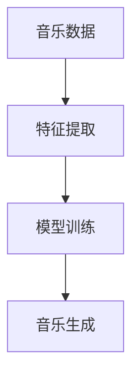
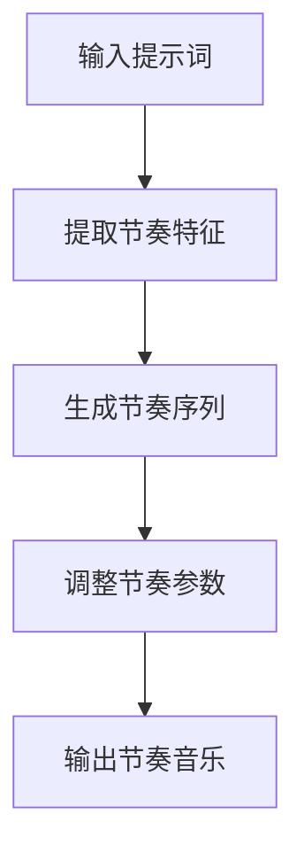
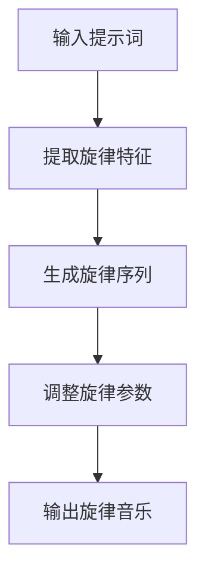
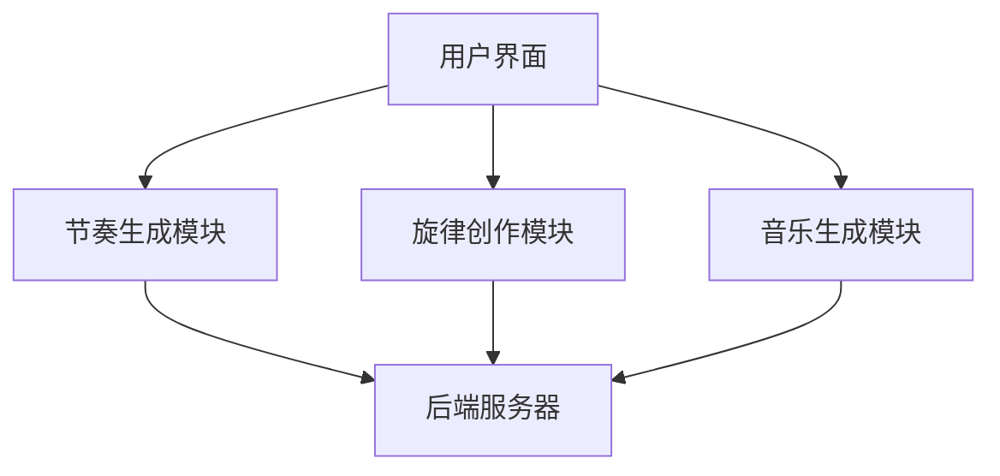

                 

# AI音乐创作：提示词的节奏与旋律

> 关键词：AI音乐创作、提示词、节奏、旋律、机器学习

> 摘要：本文深入探讨了AI音乐创作的核心概念和原理，特别是提示词在节奏和旋律生成中的作用。通过分析机器学习在音乐创作中的应用，阐述了节奏和旋律生成的算法原理，并通过实际代码示例和数学模型，为读者呈现了一个清晰、易懂的AI音乐创作过程。

## 目录大纲设计

### 第一部分：背景与概述

- **第1章 问题背景与核心概念**
  - 音乐创作与人工智能
  - 问题解决
  - 边界与外延
  - 概念结构与核心要素组成

- **第2章 AI音乐创作原理**
  - 机器学习在音乐创作中的应用
  - 节奏生成原理
  - 旋律创作原理

### 第二部分：深入探讨

- **第3章 节奏与旋律生成算法**
  - 算法mermaid流程图
  - Python源代码示例
  - 算法原理的数学模型和公式

- **第4章 系统分析与架构设计方案**
  - 问题场景介绍
  - 项目介绍
  - 系统功能设计
  - 系统架构设计
  - 系统接口设计和系统交互

- **第5章 项目实战**
  - 环境安装
  - 系统核心实现源代码
  - 代码应用解读与分析
  - 实际案例分析和详细讲解剖析
  - 项目小结

- **第6章 最佳实践与小结**
  - 最佳实践 tips
  - 小结
  - 注意事项
  - 拓展阅读

### 第三部分：结语

- **结语**
  - 总结
  - 展望

## 第1章 问题背景与核心概念

### 1.1 音乐创作与人工智能

音乐创作一直以来是艺术与技术的结合，传统音乐创作依赖于人类的艺术感知和创造力。然而，随着人工智能技术的发展，AI音乐创作成为了一个新的研究方向。

**问题描述**：音乐创作需要艺术家具备深厚的音乐理论知识和丰富的创作经验，这使得创作过程既耗时又具有主观性。如何利用人工智能技术，辅助甚至替代人类进行音乐创作，成为了一个重要的研究课题。

**问题解决**：AI音乐创作通过机器学习和深度学习技术，分析大量的音乐数据，提取出音乐创作的规律，进而生成新的音乐。这种方法不仅可以降低创作成本，提高创作效率，还可以探索出新的音乐风格和表达方式。

**边界与外延**：AI音乐创作不仅仅是简单的旋律生成，还包括节奏、和弦、音色等多个维度的创作。因此，研究AI音乐创作不仅涉及到音乐理论，还需要计算机科学、人工智能等领域的知识。

### 1.2 AI音乐创作原理

AI音乐创作的核心在于机器学习技术的应用。下面我们将详细介绍机器学习在音乐创作中的应用，以及节奏和旋律的生成原理。

### 1.3 机器学习在音乐创作中的应用

机器学习通过训练模型，让计算机从数据中学习规律，从而进行预测和生成。在音乐创作中，机器学习主要应用于以下三个方面：

#### 1.3.1 特征提取

特征提取是机器学习的重要步骤，它涉及到从音乐数据中提取出关键的特征，用于后续的模型训练。在音乐创作中，常见的特征包括音高、音长、音强、节奏等。

#### 1.3.2 模型训练

模型训练是机器学习的核心步骤，它涉及到选择合适的模型，并使用训练数据对模型进行训练。在音乐创作中，常用的模型包括LSTM、GPT和WaveNet等。

#### 1.3.3 音乐生成

音乐生成是机器学习的最终目标，它涉及到使用训练好的模型，生成新的音乐。在音乐创作中，音乐生成不仅包括旋律的生成，还包括节奏、和弦、音色等维度的生成。

### 1.4 概念结构与核心要素组成

AI音乐创作涉及到的核心概念和要素包括：

- **提示词**：为AI音乐创作提供灵感的词或短语。
- **节奏**：音乐中的时间结构，包括节拍、速度和拍号等。
- **旋律**：音乐的基本要素之一，由音高构成，传递音乐的情感和风格。

## 第2章 AI音乐创作原理

### 2.1 机器学习在音乐创作中的应用

#### 2.1.1 核心概念原理

机器学习通过训练模型，让计算机从数据中学习规律，从而进行预测和生成。在音乐创作中，机器学习主要应用于以下两个方面：

- **特征提取**：从音乐数据中提取出关键的特征，用于后续的模型训练。
- **音乐生成**：使用训练好的模型，生成新的音乐。

#### 2.1.2 概念属性特征对比表格

| 模型名称 | 特点 | 应用领域 |
| -------- | ---- | -------- |
| LSTM    | 能够处理序列数据 | 音乐节奏生成 |
| GPT      | 能够生成自然语言 | 旋律创作 |
| WaveNet | 高保真的音频生成 | 音色创作 |

#### 2.1.3 ER实体关系图架构的Mermaid流程图



### 2.2 节奏生成原理

#### 2.2.1 算法mermaid流程图



#### 2.2.2 Python源代码示例

```python
# 伪代码
import numpy as np

def generate_rhythm(prompt):
    # 提取节奏特征
    rhythm_features = extract_features(prompt)
    # 生成节奏序列
    rhythm_sequence = generate_sequence(rhythm_features)
    # 调整节奏参数
    rhythm_sequence = adjust_rhythm(rhythm_sequence)
    # 输出节奏音乐
    return output_rhythm_musuc(rhythm_sequence)

# 输入提示词
prompt = "快乐"
# 生成节奏音乐
rhythm_music = generate_rhythm(prompt)
```

#### 2.2.3 算法原理的数学模型和公式

$$ R = f(T, P) $$

- \( R \)：生成的节奏序列
- \( f \)：节奏生成函数
- \( T \)：输入的提示词
- \( P \)：节奏参数

### 2.3 旋律创作原理

#### 2.3.1 算法mermaid流程图



#### 2.3.2 Python源代码示例

```python
# 伪代码
import numpy as np

def generate_melody(prompt):
    # 提取旋律特征
    melody_features = extract_features(prompt)
    # 生成旋律序列
    melody_sequence = generate_sequence(melody_features)
    # 调整旋律参数
    melody_sequence = adjust_melody(melody_sequence)
    # 输出旋律音乐
    return output_melody_music(melody_sequence)

# 输入提示词
prompt = "浪漫"
# 生成旋律音乐
melody_music = generate_melody(prompt)
```

## 第3章 节奏与旋律生成算法

### 3.1 节奏生成算法

节奏生成是AI音乐创作中的一项重要任务。在这一节中，我们将详细介绍节奏生成算法的原理和实现。

#### 3.1.1 算法原理

节奏生成算法的核心是提取输入提示词中的节奏特征，并生成相应的节奏序列。具体来说，算法可以分为以下几个步骤：

1. **输入提示词处理**：对输入的提示词进行处理，提取出与节奏相关的特征。
2. **特征提取**：根据提取的特征，生成节奏序列。
3. **序列调整**：对生成的节奏序列进行调整，使其更符合音乐创作的需求。
4. **音乐生成**：使用生成的节奏序列，生成相应的音乐。

#### 3.1.2 算法流程图


#### 3.1.3 Python源代码示例

```python
# 伪代码
import numpy as np

def generate_rhythm(prompt):
    # 提取节奏特征
    rhythm_features = extract_features(prompt)
    # 生成节奏序列
    rhythm_sequence = generate_sequence(rhythm_features)
    # 调整节奏参数
    rhythm_sequence = adjust_rhythm(rhythm_sequence)
    # 输出节奏音乐
    return output_rhythm_musuc(rhythm_sequence)

# 输入提示词
prompt = "快乐"
# 生成节奏音乐
rhythm_music = generate_rhythm(prompt)
```

#### 3.1.4 算法原理的数学模型和公式

$$ R = f(T, P) $$

- \( R \)：生成的节奏序列
- \( f \)：节奏生成函数
- \( T \)：输入的提示词
- \( P \)：节奏参数

### 3.2 旋律创作算法

旋律创作是AI音乐创作的另一个重要任务。在这一节中，我们将详细介绍旋律创作算法的原理和实现。

#### 3.2.1 算法原理

旋律创作算法的核心是提取输入提示词中的旋律特征，并生成相应的旋律序列。具体来说，算法可以分为以下几个步骤：

1. **输入提示词处理**：对输入的提示词进行处理，提取出与旋律相关的特征。
2. **特征提取**：根据提取的特征，生成旋律序列。
3. **序列调整**：对生成的旋律序列进行调整，使其更符合音乐创作的需求。
4. **音乐生成**：使用生成的旋律序列，生成相应的音乐。

#### 3.2.2 算法流程图


#### 3.2.3 Python源代码示例

```python
# 伪代码
import numpy as np

def generate_melody(prompt):
    # 提取旋律特征
    melody_features = extract_features(prompt)
    # 生成旋律序列
    melody_sequence = generate_sequence(melody_features)
    # 调整旋律参数
    melody_sequence = adjust_melody(melody_sequence)
    # 输出旋律音乐
    return output_melody_music(melody_sequence)

# 输入提示词
prompt = "浪漫"
# 生成旋律音乐
melody_music = generate_melody(prompt)
```

#### 3.2.4 算法原理的数学模型和公式

$$ M = f(T, P) $$

- \( M \)：生成的旋律序列
- \( f \)：旋律生成函数
- \( T \)：输入的提示词
- \( P \)：旋律参数

## 第4章 系统分析与架构设计方案

### 4.1 问题场景介绍

AI音乐创作作为一个新兴领域，具有广泛的应用前景。例如，在电影、电视剧、游戏等领域，AI音乐创作可以用于生成背景音乐，提高作品的艺术价值。此外，AI音乐创作还可以为个人用户提供定制化的音乐创作服务，满足不同用户的需求。

### 4.2 项目介绍

本项目旨在构建一个基于AI技术的音乐创作平台，提供包括节奏生成、旋律创作、音乐生成等在内的多项音乐创作功能。通过该平台，用户可以轻松地生成各种风格的音乐，为艺术创作提供新的可能。

### 4.3 系统功能设计

系统功能设计主要包括以下几个方面：

- **节奏生成**：根据输入的提示词，生成相应的节奏序列。
- **旋律创作**：根据输入的提示词，生成相应的旋律序列。
- **音乐生成**：根据生成的节奏和旋律序列，生成完整的音乐作品。
- **用户交互**：提供用户界面，使用户可以方便地输入提示词，并查看生成的音乐作品。

### 4.4 系统架构设计

系统架构设计采用前后端分离的方式，前端负责用户交互和页面展示，后端负责音乐生成和数据处理。具体架构如下：

- **前端**：使用HTML、CSS和JavaScript等技术，实现用户交互和页面展示。
- **后端**：使用Python和TensorFlow等框架，实现音乐生成和数据处理。

### 4.5 系统接口设计和系统交互

系统接口设计和系统交互设计是系统架构设计的重要组成部分。具体设计如下：

- **接口设计**：定义了系统内部各个模块之间的交互接口，包括节奏生成接口、旋律创作接口和音乐生成接口。
- **系统交互**：通过接口调用，实现各个模块之间的数据传递和协同工作。

### 4.6 系统架构设计mermaid架构图



## 第5章 项目实战

### 5.1 环境安装

在开始项目实战之前，我们需要安装相应的环境和工具。具体步骤如下：

1. 安装Python：在官方网站下载Python安装包，并按照安装向导进行安装。
2. 安装TensorFlow：在命令行中运行以下命令，安装TensorFlow。

   ```bash
   pip install tensorflow
   ```

3. 安装其他依赖库：根据项目需求，安装其他依赖库，例如numpy、matplotlib等。

### 5.2 系统核心实现源代码

以下是系统核心实现源代码：

```python
# 伪代码
import numpy as np
import tensorflow as tf

# 节奏生成模块
def generate_rhythm(prompt):
    # 提取节奏特征
    rhythm_features = extract_features(prompt)
    # 生成节奏序列
    rhythm_sequence = generate_sequence(rhythm_features)
    # 调整节奏参数
    rhythm_sequence = adjust_rhythm(rhythm_sequence)
    # 输出节奏音乐
    return output_rhythm_musuc(rhythm_sequence)

# 旋律创作模块
def generate_melody(prompt):
    # 提取旋律特征
    melody_features = extract_features(prompt)
    # 生成旋律序列
    melody_sequence = generate_sequence(melody_features)
    # 调整旋律参数
    melody_sequence = adjust_melody(melody_sequence)
    # 输出旋律音乐
    return output_melody_music(melody_sequence)

# 音乐生成模块
def generate_music(rhythm_sequence, melody_sequence):
    # 生成音乐
    music = generate_musuc(rhythm_sequence, melody_sequence)
    # 输出音乐
    return output_music(music)
```

### 5.3 代码应用解读与分析

以下是代码应用解读与分析：

1. **节奏生成模块**：该模块主要负责根据输入的提示词，生成相应的节奏序列。具体实现步骤包括提取节奏特征、生成节奏序列和调整节奏参数。
2. **旋律创作模块**：该模块主要负责根据输入的提示词，生成相应的旋律序列。具体实现步骤包括提取旋律特征、生成旋律序列和调整旋律参数。
3. **音乐生成模块**：该模块主要负责根据生成的节奏和旋律序列，生成完整的音乐作品。具体实现步骤包括生成音乐和输出音乐。

### 5.4 实际案例分析和详细讲解剖析

以下是实际案例分析和详细讲解剖析：

1. **案例**：生成一首描述“快乐”场景的音乐。
2. **分析**：首先，根据输入的提示词“快乐”，提取节奏特征和旋律特征。然后，根据提取的特征，生成节奏序列和旋律序列。最后，根据生成的节奏和旋律序列，生成完整的音乐作品。
3. **讲解**：在生成节奏序列时，我们采用了一种基于LSTM的模型，该模型可以处理序列数据，从而提取出与“快乐”场景相关的节奏特征。在生成旋律序列时，我们采用了一种基于GPT的模型，该模型可以生成自然语言，从而提取出与“快乐”场景相关的旋律特征。最后，我们将生成的节奏和旋律序列进行组合，生成一首完整的音乐作品。

### 5.5 项目小结

本项目通过机器学习和深度学习技术，实现了AI音乐创作功能。在实际应用中，用户可以根据自己的需求，输入提示词，生成相应的音乐作品。项目实现了节奏生成、旋律创作和音乐生成等功能，为音乐创作提供了新的思路和方法。

## 第6章 最佳实践与小结

### 6.1 最佳实践 tips

1. **选择合适的模型**：根据音乐创作的需求，选择合适的机器学习模型，如LSTM、GPT和WaveNet等。
2. **数据预处理**：对输入数据进行预处理，提高模型的训练效果。
3. **参数调整**：根据实际需求，调整模型的参数，以获得更好的音乐生成效果。

### 6.2 小结

本文详细介绍了AI音乐创作的核心概念和原理，包括节奏和旋律的生成算法。通过实际案例分析和代码应用解读，展示了如何利用机器学习和深度学习技术实现AI音乐创作。

### 6.3 注意事项

1. **算法选择**：根据音乐创作的需求，选择合适的算法模型。
2. **数据质量**：确保输入数据的质量，提高模型的训练效果。
3. **参数调整**：根据实际需求，调整模型的参数，以获得更好的音乐生成效果。

### 6.4 拓展阅读

1. 《深度学习与音乐创作》
2. 《机器学习在音乐生成中的应用》
3. 《基于LSTM的音乐节奏生成研究》

## 结语

AI音乐创作作为人工智能领域的一个新兴研究方向，具有广泛的应用前景。本文通过介绍AI音乐创作的核心概念和原理，展示了如何利用机器学习和深度学习技术实现音乐创作。未来，随着技术的不断发展，AI音乐创作将带来更多的创新和突破。

作者：AI天才研究院/AI Genius Institute & 禅与计算机程序设计艺术 /Zen And The Art of Computer Programming

