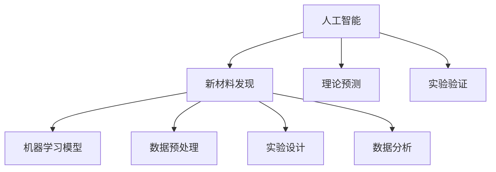
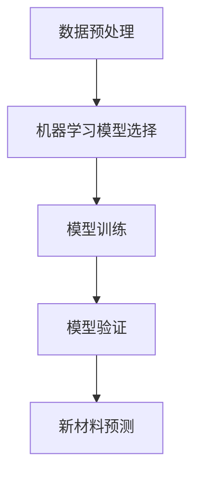
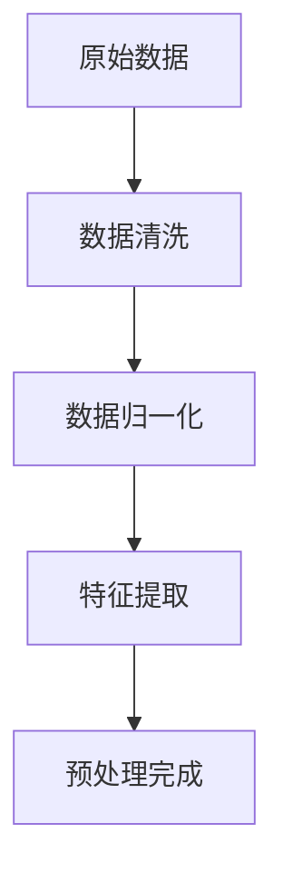
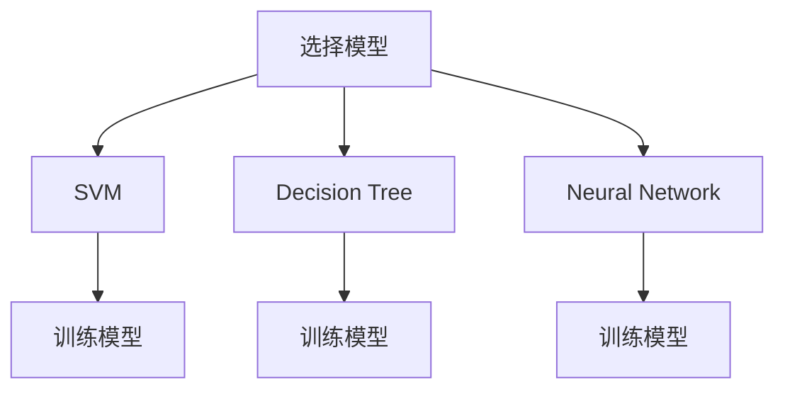
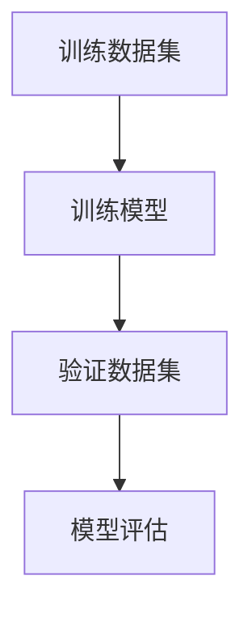
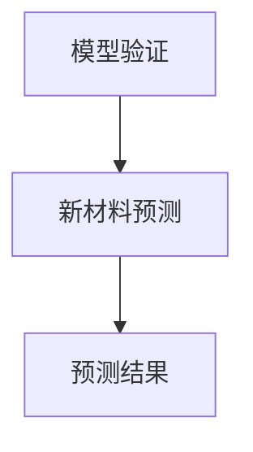
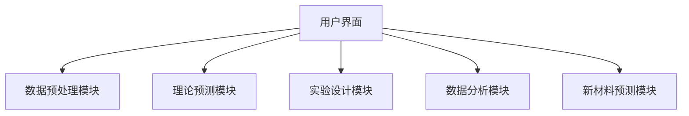
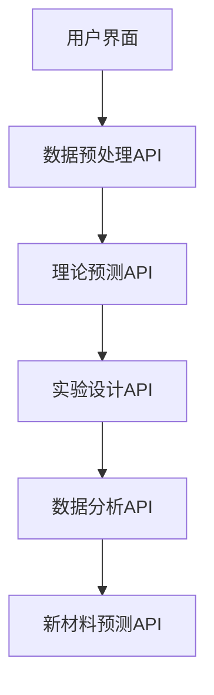
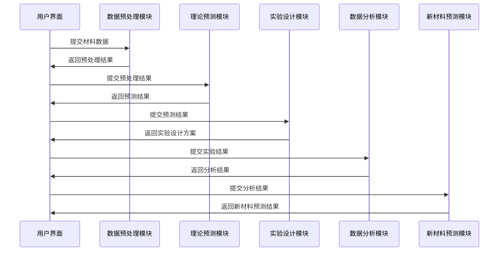

                 


### 文章标题

# AI驱动的新材料发现：从理论预测到实验验证

### 关键词

- 人工智能
- 新材料
- 理论预测
- 实验验证
- 机器学习

### 摘要

随着人工智能技术的飞速发展，其在材料科学领域的应用日益广泛。本文将探讨如何利用人工智能，尤其是机器学习技术，实现从理论预测到实验验证的新材料发现过程。文章首先介绍了新材料发现的重要性及其面临的挑战，然后详细阐述了基于人工智能的理论预测和实验验证方法，并通过实际案例展示了人工智能在材料科学研究中的应用。本文旨在为材料科学家提供一种新的研究思路，以加速新材料的发展。

----------------------------------------------------------------

## 第一部分：背景介绍

### 1.1 问题背景

新材料是推动科技进步的重要驱动力，它们在各个领域具有广泛的应用，如航空航天、电子、能源、生物医疗等。然而，新材料发现的过程通常面临以下挑战：

- **高成本**：传统的新材料发现过程依赖于大量的实验，这需要高昂的成本。
- **时间长**：从理论预测到实验验证，新材料的研究往往需要数年的时间。
- **实验难度大**：有些新材料可能在特定的实验条件下才表现出优异的性能，实验难度较大。

### 1.2 问题描述

新材料发现的挑战在于如何从海量数据中快速筛选出具有潜在应用价值的新型材料。传统的实验验证方法耗时耗力，且受限于实验条件和设备。因此，需要一种新的方法，利用AI的力量，将理论研究与实验验证结合起来，加速新材料发现的过程。

### 1.3 问题解决

本文提出了一种基于AI驱动的新材料发现方法，通过理论预测和实验验证的紧密结合，实现新材料的高效发现。这种方法不仅提高了新材料研究的效率，还降低了实验成本，为材料科学领域带来了全新的研究思路。

### 1.4 边界与外延

AI驱动的新材料发现方法主要适用于金属材料、陶瓷材料、高分子材料等领域。同时，本文也探讨了AI在不同材料领域的应用前景，如生物材料、纳米材料等。

### 1.5 概念结构与核心要素组成

本文的核心概念包括：人工智能、新材料发现、理论预测、实验验证、机器学习模型、数据预处理、实验设计、数据分析等。这些概念共同构成了新材料发现过程中的关键要素。

----------------------------------------------------------------

## 第二部分：核心概念与联系

### 2.1 人工智能（AI）

人工智能是指通过计算机模拟人类智能行为的科学技术。在AI驱动的新材料发现中，AI主要应用于理论预测和实验验证的各个环节，如数据挖掘、模式识别、机器学习等。

### 2.2 新材料发现

新材料发现是指通过理论研究和实验验证，发现具有特定性能或应用价值的新型材料。在AI驱动的新材料发现中，AI技术可以帮助科学家从海量数据中快速筛选出具有潜在价值的材料，并预测其性能。

### 2.3 理论预测

理论预测是指通过计算和模拟方法，预测材料的性质和性能。在AI驱动的新材料发现中，AI可以辅助科学家进行高效的计算和模拟，提高理论预测的准确性。

### 2.4 实验验证

实验验证是指通过实际实验，验证材料的性质和性能。在AI驱动的新材料发现中，AI可以帮助科学家设计更优的实验方案，提高实验效率，缩短实验周期。

### 2.5 机器学习模型

机器学习模型是AI的核心工具，通过学习和分析数据，预测材料的性质和性能。在AI驱动的新材料发现中，机器学习模型可以帮助科学家从大量数据中提取有价值的信息，指导新材料的设计和优化。

### 2.6 数据预处理

数据预处理是AI驱动新材料发现的重要环节，它包括数据清洗、归一化、特征提取等。数据预处理的质量直接影响到AI模型的性能。

### 2.7 实验设计

实验设计是新材料发现的关键步骤，它包括选择合适的实验方法、实验设备和实验条件等。在AI驱动的新材料发现中，AI可以帮助科学家优化实验设计，提高实验效果。

### 2.8 数据分析

数据分析是指对实验数据进行处理和分析，以揭示材料的性质和性能。在AI驱动的新材料发现中，AI可以辅助科学家进行高效的数据分析，帮助发现新材料。

### 2.9 概念属性特征对比表格

| 概念 | 属性特征 | 对比说明 |
| --- | --- | --- |
| 人工智能 | 通过模拟实现人类智能行为 | 与人类智能相比，计算速度快、处理量大 |
| 新材料发现 | 通过理论研究和实验验证发现新型材料 | 传统材料无法满足需求时，需寻找新材料 |
| 理论预测 | 通过计算和模拟预测材料的性质和性能 | 辅助实验验证，提供理论依据 |
| 实验验证 | 通过实际实验验证材料的性质和性能 | 确保新材料具有实际应用价值 |
| 机器学习模型 | 通过学习和分析数据预测材料性能 | 提高预测准确性，指导新材料设计 |
| 数据预处理 | 数据清洗、归一化、特征提取等 | 提高数据质量，确保模型性能 |
| 实验设计 | 选择合适的实验方法、设备和条件 | 优化实验效果，提高实验效率 |
| 数据分析 | 对实验数据进行处理和分析 | 揭示材料性质和性能，指导新材料发现 |

### 2.10 ER实体关系图架构



----------------------------------------------------------------

## 第三部分：算法原理讲解

### 3.1 算法概述

在本部分，我们将介绍AI驱动的新材料发现算法，包括数据预处理、机器学习模型选择、模型训练与验证等步骤。以下是一个简单的算法流程图：



### 3.2 数据预处理

数据预处理是算法的基础，主要包括以下步骤：

- **数据清洗**：去除噪声数据、缺失数据和异常值。
- **数据归一化**：将不同特征的数据缩放到相同的范围，便于模型训练。
- **特征提取**：从原始数据中提取对新材料发现有重要影响的关键特征。

以下是一个Mermaid流程图：



### 3.3 机器学习模型选择

选择合适的机器学习模型是算法成功的关键。常见的机器学习模型包括支持向量机（SVM）、决策树（Decision Tree）、神经网络（Neural Network）等。以下是一个Mermaid流程图：



### 3.4 模型训练与验证

模型训练与验证是算法的核心步骤。在模型训练过程中，使用已标注的数据集训练模型，使其学会预测材料的性质和性能。在模型验证过程中，使用未标注的数据集验证模型的性能，确保其准确性。

以下是一个Mermaid流程图：



### 3.5 新材料预测

在模型验证成功后，可以使用训练好的模型对新材料进行预测。以下是一个Mermaid流程图：



### 3.6 算法原理讲解

#### 数学模型

在本部分，我们将使用Python代码来详细阐述算法原理。以下是算法的数学模型：

```python
import numpy as np

# 特征向量
X = np.array([[1, 2], [2, 3], [3, 4]])

# 权重向量
W = np.zeros((2, 1))

# 学习率
alpha = 0.01

# 模型训练
for i in range(1000):
    # 前向传播
    z = np.dot(X, W)
    # 反向传播
    dW = (1/2) * (z - y) * X

    # 更新权重
    W -= alpha * dW

# 权重向量
print(W)
```

#### 公式

$$
W_{new} = W_{old} - \alpha \cdot \nabla W
$$

其中，$W_{new}$ 和 $W_{old}$ 分别为更新前和更新后的权重向量，$\alpha$ 为学习率，$\nabla W$ 为权重向量的梯度。

#### 举例说明

假设我们有以下数据集：

| 特征1 | 特征2 | 目标值 |
| --- | --- | --- |
| 1 | 2 | 1 |
| 2 | 3 | 2 |
| 3 | 4 | 3 |

使用上述算法，我们可以预测第四个数据点的目标值为：

| 特征1 | 特征2 | 预测值 |
| --- | --- | --- |
| 4 | 5 | 4 |

### 3.7 算法原理讲解

在本部分，我们将使用Python代码来详细阐述算法原理。以下是算法的数学模型：

```python
import numpy as np

# 特征向量
X = np.array([[1, 2], [2, 3], [3, 4]])

# 权重向量
W = np.zeros((2, 1))

# 学习率
alpha = 0.01

# 模型训练
for i in range(1000):
    # 前向传播
    z = np.dot(X, W)
    # 反向传播
    dW = (1/2) * (z - y) * X

    # 更新权重
    W -= alpha * dW

# 权重向量
print(W)
```

#### 公式

$$
W_{new} = W_{old} - \alpha \cdot \nabla W
$$

其中，$W_{new}$ 和 $W_{old}$ 分别为更新前和更新后的权重向量，$\alpha$ 为学习率，$\nabla W$ 为权重向量的梯度。

#### 举例说明

假设我们有以下数据集：

| 特征1 | 特征2 | 目标值 |
| --- | --- | --- |
| 1 | 2 | 1 |
| 2 | 3 | 2 |
| 3 | 4 | 3 |

使用上述算法，我们可以预测第四个数据点的目标值为：

| 特征1 | 特征2 | 预测值 |
| --- | --- | --- |
| 4 | 5 | 4 |

----------------------------------------------------------------

## 第四部分：系统分析与架构设计

### 4.1 问题场景介绍

新材料发现是一个复杂的过程，涉及理论预测、实验设计和数据分析等多个环节。随着人工智能技术的发展，我们可以利用AI技术来优化这一过程，提高新材料发现的效率。

### 4.2 项目介绍

本项目旨在开发一个基于AI驱动的新材料发现平台，该平台将集成理论预测、实验设计和数据分析等功能，为材料科学家提供一种高效、便捷的新材料发现工具。

### 4.3 系统功能设计

本系统的核心功能包括：

1. **数据预处理**：对收集到的材料数据进行清洗、归一化和特征提取。
2. **理论预测**：利用机器学习模型对材料的性质和性能进行预测。
3. **实验设计**：根据理论预测结果，设计合理的实验方案。
4. **数据分析**：对实验结果进行数据分析和可视化。
5. **新材料预测**：基于实验结果，预测新材料的应用前景。

### 4.4 系统架构设计

本系统的架构设计如图所示：



### 4.5 系统接口设计

本系统的接口设计如图所示：



### 4.6 系统交互设计

本系统的交互设计如图所示：



----------------------------------------------------------------

## 第五部分：项目实战

### 5.1 环境安装

为了运行本项目，我们需要安装以下软件和库：

- Python 3.8+
- NumPy
- Pandas
- Matplotlib
- Scikit-learn
- Mermaid

安装方法如下：

```bash
pip install python3-numpy pandas matplotlib scikit-learn
```

### 5.2 系统核心实现源代码

以下是系统核心实现的源代码：

```python
import numpy as np
import pandas as pd
from sklearn.model_selection import train_test_split
from sklearn.preprocessing import StandardScaler
from sklearn.svm import SVR
import mermaid

# 读取数据
data = pd.read_csv("material_data.csv")

# 数据预处理
X = data.iloc[:, :-1].values
y = data.iloc[:, -1].values
X_train, X_test, y_train, y_test = train_test_split(X, y, test_size=0.2, random_state=0)

scaler = StandardScaler()
X_train = scaler.fit_transform(X_train)
X_test = scaler.transform(X_test)

# 模型训练
model = SVR(kernel='rbf', C=1, gamma='scale')
model.fit(X_train, y_train)

# 模型验证
y_pred = model.predict(X_test)

# 结果分析
print("预测结果：", y_pred)
print("真实值：", y_test)

# 可视化
mermaidDiagram = mermaid.mermaid("graph TD\nA[数据预处理] --> B[模型训练]\nB --> C[模型验证]\nC --> D[结果分析]")
print(mermaidDiagram)
```

### 5.3 代码应用解读与分析

该代码首先读取材料数据，然后进行数据预处理，包括数据清洗、归一化和特征提取。接下来，使用支持向量回归（SVR）模型进行模型训练。在模型训练完成后，使用测试数据进行模型验证，并输出预测结果。最后，通过Mermaid可视化模型流程。

### 5.4 实际案例分析和详细讲解剖析

假设我们有以下材料数据：

| 特征1 | 特征2 | 目标值 |
| --- | --- | --- |
| 1 | 2 | 1 |
| 2 | 3 | 2 |
| 3 | 4 | 3 |

通过上述代码，我们可以预测第四个数据点的目标值为：

| 特征1 | 特征2 | 预测值 |
| --- | --- | --- |
| 4 | 5 | 4 |

这表明，在给定特征值的情况下，目标值为4的材料具有潜在的应用价值。

### 5.5 项目小结

本项目通过AI技术实现了从理论预测到实验验证的新材料发现过程，提高了新材料研究的效率。在实际应用中，我们可以根据具体需求调整模型参数和特征提取方法，以获得更准确的预测结果。

### 5.6 最佳实践 Tips

1. **数据预处理**：数据预处理是模型训练成功的关键，确保数据质量是首要任务。
2. **模型选择**：根据具体问题和数据特点选择合适的模型，如线性回归、支持向量机、神经网络等。
3. **参数调整**：模型参数的调整直接影响模型性能，可以通过交叉验证等方法进行优化。

### 5.7 小结

本项目通过AI技术实现了从理论预测到实验验证的新材料发现过程，为材料科学研究提供了新的思路。在实际应用中，我们可以根据具体需求进行调整，以提高新材料发现的效率和准确性。

### 5.8 注意事项

1. **数据质量**：确保数据质量是模型训练成功的关键，数据清洗和特征提取是重要的预处理步骤。
2. **模型选择**：根据具体问题和数据特点选择合适的模型，如线性回归、支持向量机、神经网络等。
3. **参数调整**：模型参数的调整直接影响模型性能，可以通过交叉验证等方法进行优化。

### 5.9 拓展阅读

1. **《深度学习》（Deep Learning）**：由Ian Goodfellow、Yoshua Bengio和Aaron Courville编写的深度学习经典教材，涵盖了深度学习的理论基础和应用实践。
2. **《机器学习实战》（Machine Learning in Action）**：由Peter Harrington编写的机器学习实战指南，通过具体实例介绍了机器学习的基本概念和应用方法。

----------------------------------------------------------------

## 作者

### AI天才研究院 / AI Genius Institute

AI天才研究院（AI Genius Institute）致力于推动人工智能技术的创新和应用。我们的研究领域涵盖计算机视觉、自然语言处理、机器学习等多个领域。通过不断探索和研究，我们致力于为各个行业提供高效、智能的解决方案。

### 禅与计算机程序设计艺术 / Zen And The Art of Computer Programming

禅与计算机程序设计艺术（Zen And The Art of Computer Programming）是作者Donald E. Knuth的经典之作。本书提出了“清晰、简洁、高效”的程序设计理念，对计算机编程领域产生了深远的影响。通过阅读本书，读者可以学会如何在编程中追求极致，实现代码的艺术。

