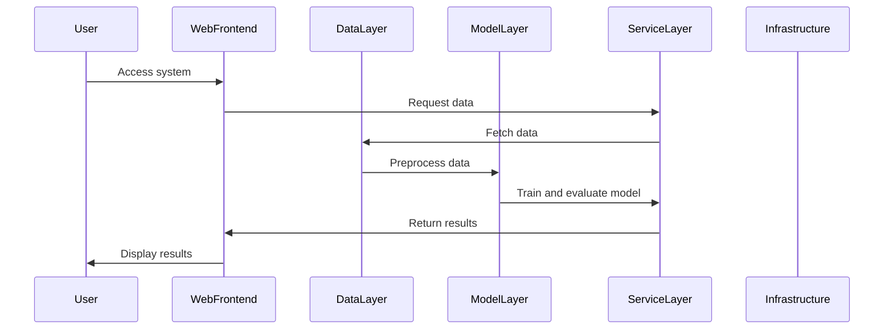

                 

### 第二部分：核心概念与联系

在深入探讨AI驱动的生态系统管理之前，我们需要明确一些核心概念，并了解它们之间的联系。这将帮助我们建立对这一领域的全面理解，并为我们之后的算法原理讲解和系统设计提供坚实的理论基础。

#### 2.1 核心概念

本文涉及的核心概念包括：

1. **生态系统**：生态系统是由生物群落与无机环境组成的统一整体。它是一个复杂的动态系统，包括各种生物物种、非生物环境因素以及它们之间的相互作用。生态系统提供了生物多样性、维持气候平衡、净化环境等关键功能。

2. **物种识别**：物种识别是指利用计算机视觉、机器学习、深度学习等技术，对生态系统中的生物物种进行准确识别和分类的过程。这是生态系统管理的重要一环，因为它有助于我们了解生物多样性的现状和变化。

3. **生态监测**：生态监测是通过遥感技术、物联网和传感器网络等手段，对生态系统进行实时监测和数据分析的过程。这有助于我们获取生态系统状态的实时信息，为生态评估和修复提供数据支持。

4. **生态评估**：生态评估是结合AI技术和生态学原理，对生态系统进行综合评估的过程。这包括对生态系统的健康状况、生物多样性、生态功能等进行评估，以识别潜在的问题和风险。

5. **生态修复**：生态修复是利用AI技术，根据生态评估结果，制定和实施针对性的修复方案，以恢复生态系统的功能和稳定性。

#### 2.2 概念属性特征对比表格

以下表格对比了上述核心概念的属性特征：

| 概念         | 属性特征                  | 比较           |
| ------------ | ------------------------ | -------------- |
| 生态系统     | 生物群落与无机环境的统一体 | -              |
| 物种识别     | 计算机视觉、机器学习、深度学习 | -              |
| 生态监测     | 遥感技术、物联网、传感器网络 | -              |
| 生态评估     | AI技术、生态学原理        | -              |
| 生态修复     | AI技术、生态修复方案     | -              |

通过对比，我们可以看出这些概念在生态系统管理中的不同作用和特点。

#### 2.3 ER实体关系图架构

为了更好地理解这些概念之间的关联，我们可以通过ER（实体关系）图来展示它们的关系。以下是ER图示例：

```mermaid
erDiagram
  Ecosystem ||--|{ Species } : "belongs to"
  Ecosystem ||--|{ Monitoring } : "monitors"
  Ecosystem ||--|{ Assessment } : "assesses"
  Ecosystem ||--|{ Restoration } : "restores"

  Species ||--|{ Recognition } : "recognized by"
  Monitoring ||--|{ Data } : "collects"
  Assessment ||--|{ Report } : "produces"
  Restoration ||--|{ Plan } : "implements"
```

在这个ER图中，生态系统（Ecosystem）是核心实体，它与其他实体如物种（Species）、监测（Monitoring）、评估（Assessment）、修复（Restoration）通过不同的关系连接起来。这表明生态系统管理是一个多层次的复杂过程，每个层次都需要不同的技术和方法来支持。

#### 2.4 让我们一步一步思考

- **第一步**：识别核心概念。我们需要理解生态系统、物种识别、生态监测、生态评估和生态修复的定义和作用。
- **第二步**：比较核心概念的属性特征。通过对比，我们可以更清楚地看到每个概念在生态系统管理中的独特贡献。
- **第三步**：建立ER图，理解概念之间的关系。这有助于我们全面把握生态系统管理的整体框架。

通过这样的步骤，我们为接下来讨论AI驱动的生态系统管理算法原理和系统设计奠定了坚实的基础。接下来，我们将深入探讨这些核心概念的实现细节，理解它们是如何通过AI技术来驱动生态系统管理的。让我们一步一步深入下去。 

### 第三部分：AI驱动的生态系统管理算法原理讲解

在这一部分，我们将深入探讨AI驱动的生态系统管理算法，从物种识别、生态监测、生态评估到生态修复，逐步讲解每个算法的原理和实现。

#### 3.1 物种识别算法

##### 3.1.1 算法原理

物种识别是生态系统管理的重要环节，它依赖于计算机视觉和深度学习技术。以下是物种识别算法的基本步骤：

1. **数据采集**：首先，需要收集大量的物种图片。这些图片可以来自各种来源，如野外观察、卫星遥感、无人机等。数据采集过程中，需要注意样本的多样性和质量，以确保模型有足够的训练数据。

2. **数据预处理**：收集到的图片需要进行预处理，以提高数据质量和模型训练效果。预处理步骤包括图像增强、数据增强、图像归一化等。

3. **模型训练**：利用预处理后的数据训练深度学习模型。常见的模型有卷积神经网络（CNN）、循环神经网络（RNN）和生成对抗网络（GAN）等。在训练过程中，需要选择合适的模型架构、优化器和损失函数。

4. **模型评估**：使用测试集对训练好的模型进行评估。评估指标包括准确率、召回率、F1分数等。根据评估结果，调整模型参数，优化模型性能。

5. **应用部署**：将训练好的模型部署到实际应用中，对未知物种进行识别。

##### 3.1.2 数学模型和公式

物种识别算法的核心是深度学习模型。以下是一个简单的CNN模型的核心公式：

$$
\begin{aligned}
&\text{卷积层：} \\
&h_{\theta}(x) = \sigma(\sum_{j=1}^{n} \theta_j \cdot x_j) \\
&\text{激活函数：} \\
&\sigma(z) = \frac{1}{1 + e^{-z}}
\end{aligned}
$$

这里，$h_{\theta}(x)$ 表示输出特征，$\theta_j$ 表示权重，$x_j$ 表示输入特征，$\sigma$ 表示激活函数。

##### 3.1.3 实例说明

假设我们有一个训练好的CNN模型，用于识别鸟类。输入图像为一只未知的鸟类，输出结果为预测的鸟类种类。

1. **数据采集**：收集到1000张不同鸟类的图像，并进行预处理。
2. **模型训练**：使用这1000张图像训练一个CNN模型。
3. **模型评估**：使用另外100张图像测试模型，评估其准确率。
4. **应用部署**：将模型部署到手机应用中，用户上传一张鸟类的照片，应用输出预测的鸟类种类。

#### 3.2 生态监测算法

##### 3.2.1 算法原理

生态监测是实时了解生态系统状态的关键。生态监测算法通常包括以下几个步骤：

1. **数据采集**：利用遥感技术、物联网和传感器网络等手段，收集生态系统的数据。这些数据可以包括温度、湿度、光照、土壤湿度、空气质量等。
2. **数据预处理**：对采集到的数据进行预处理，如滤波、去噪、归一化等，以提高数据质量和模型训练效果。
3. **特征提取**：从预处理后的数据中提取特征，用于模型训练。特征提取方法包括时域特征、频域特征和时频域特征等。
4. **模型训练**：使用提取的特征训练机器学习模型，如支持向量机（SVM）、决策树、随机森林等。
5. **模型评估**：使用测试集对训练好的模型进行评估，调整模型参数，优化模型性能。
6. **应用部署**：将训练好的模型部署到实际应用中，对实时数据进行分析，提供监测结果。

##### 3.2.2 数学模型和公式

生态监测算法的核心是机器学习模型。以下是一个简单的SVM模型的公式：

$$
\begin{aligned}
&\text{SVM分类函数：} \\
&w^T x - b = 0 \\
&y = \text{sign}(w^T x - b)
\end{aligned}
$$

这里，$w$ 表示权重向量，$x$ 表示特征向量，$b$ 表示偏置项，$y$ 表示标签。

##### 3.2.3 实例说明

假设我们有一个训练好的SVM模型，用于监测森林火灾风险。输入数据为一系列的气象参数，如温度、湿度、风速等，输出结果为火灾风险等级。

1. **数据采集**：收集过去几年的气象数据和火灾数据。
2. **模型训练**：使用这些数据训练一个SVM模型。
3. **模型评估**：使用新的气象参数测试模型，评估其火灾风险预测能力。
4. **应用部署**：将模型部署到监控系统中，实时分析气象数据，提供火灾风险预警。

#### 3.3 生态评估算法

##### 3.3.1 算法原理

生态评估是对生态系统的健康状况进行综合评价的过程。生态评估算法通常包括以下几个步骤：

1. **数据采集**：收集生态系统的各种数据，包括物种分布、物种多样性、生态功能等。
2. **数据预处理**：对采集到的数据进行预处理，如缺失值处理、异常值处理等。
3. **指标计算**：计算各种生态指标，如物种多样性指数、生态位宽度、生态网络稳定性等。
4. **模型训练**：使用计算出的生态指标训练机器学习模型，如线性回归、支持向量机等。
5. **模型评估**：使用测试集对训练好的模型进行评估，调整模型参数，优化模型性能。
6. **应用部署**：将训练好的模型部署到实际应用中，对生态系统进行评估。

##### 3.3.2 数学模型和公式

生态评估算法的核心是机器学习模型。以下是一个简单的线性回归模型的公式：

$$
\begin{aligned}
&\text{线性回归模型：} \\
&y = \beta_0 + \beta_1 x_1 + \beta_2 x_2 + ... + \beta_n x_n
\end{aligned}
$$

这里，$y$ 表示生态评估结果，$x_1, x_2, ..., x_n$ 表示生态指标，$\beta_0, \beta_1, \beta_2, ..., \beta_n$ 表示模型参数。

##### 3.3.3 实例说明

假设我们有一个训练好的线性回归模型，用于评估海洋生态系统的健康状况。输入数据为一系列的海洋指标，如温度、盐度、氧气含量等，输出结果为生态评估分数。

1. **数据采集**：收集过去几年的海洋数据。
2. **模型训练**：使用这些数据训练一个线性回归模型。
3. **模型评估**：使用新的海洋数据测试模型，评估其生态评估能力。
4. **应用部署**：将模型部署到海洋监测系统中，实时评估海洋生态系统的健康状况。

#### 3.4 生态修复算法

##### 3.4.1 算法原理

生态修复是基于生态评估结果，制定和实施针对性的修复方案。生态修复算法通常包括以下几个步骤：

1. **数据采集**：收集生态系统的各种数据，包括物种分布、生态功能、受损程度等。
2. **数据预处理**：对采集到的数据进行预处理，如缺失值处理、异常值处理等。
3. **方案制定**：根据生态评估结果，制定针对性的修复方案。方案可能包括物种移植、湿地恢复、土地整理等。
4. **模型训练**：使用修复方案的历史数据训练机器学习模型，如决策树、随机森林等。
5. **模型评估**：使用测试集对训练好的模型进行评估，调整模型参数，优化模型性能。
6. **应用部署**：将训练好的模型部署到实际应用中，根据实时数据制定和调整修复方案。

##### 3.4.2 数学模型和公式

生态修复算法的核心是机器学习模型。以下是一个简单的决策树模型的公式：

$$
\begin{aligned}
&\text{决策树分类函数：} \\
&y = f(x) = \sum_{i=1}^{n} \alpha_i \cdot h(x_i) \\
&h(x_i) = \begin{cases}
1 & \text{if } x_i \text{ matches the condition} \\
0 & \text{otherwise}
\end{cases}
\end{aligned}
$$

这里，$y$ 表示修复结果，$x$ 表示输入特征，$h(x_i)$ 表示条件函数，$\alpha_i$ 表示权重。

##### 3.4.3 实例说明

假设我们有一个训练好的决策树模型，用于制定森林修复方案。输入数据为森林受损程度、物种分布、气候条件等，输出结果为修复方案。

1. **数据采集**：收集过去几年的森林数据。
2. **模型训练**：使用这些数据训练一个决策树模型。
3. **模型评估**：使用新的森林数据测试模型，评估其修复方案制定能力。
4. **应用部署**：将模型部署到森林管理系统中，根据实时数据制定和调整修复方案。

通过上述步骤，我们可以看到，AI驱动的生态系统管理算法在物种识别、生态监测、生态评估和生态修复中发挥着重要作用。这些算法通过数据采集、模型训练、模型评估和模型部署等步骤，实现了对生态系统的全面管理。接下来，我们将进一步探讨AI驱动的生态系统管理系统的设计和实现。让我们继续深入。 

### 第四部分：AI驱动的生态系统管理系统设计与实现

在这一部分，我们将深入探讨AI驱动的生态系统管理系统的设计与实现，包括系统功能设计、系统架构设计、系统接口设计以及系统交互。

#### 4.1 系统功能设计

生态系统管理系统的核心功能包括：

1. **数据采集**：从各种来源（如遥感、传感器、无人机等）采集生态系统数据。
2. **数据预处理**：对采集到的数据（如图像、传感器数据等）进行预处理，提高数据质量和模型训练效果。
3. **物种识别**：利用深度学习模型对采集到的图像进行物种识别，提供物种分布信息。
4. **生态监测**：实时监测生态系统的变化，如温度、湿度、空气质量等，提供实时监测数据。
5. **生态评估**：利用机器学习模型对生态系统进行综合评估，识别潜在的问题和风险。
6. **生态修复**：根据生态评估结果，制定和实施针对性的生态修复方案。
7. **用户交互**：提供用户界面，使用户能够实时查看生态系统状态，接收监测和评估报告，并参与生态修复活动。

#### 4.2 系统架构设计

生态系统管理系统的架构设计应考虑以下几个方面：

1. **数据层**：包括数据采集、数据预处理和数据存储。数据层应能够支持大规模数据的存储和快速访问。
2. **模型层**：包括深度学习模型和机器学习模型的训练、评估和部署。模型层应具备灵活的模型训练和部署能力，支持多种模型架构。
3. **服务层**：包括物种识别服务、生态监测服务、生态评估服务和生态修复服务。服务层应提供RESTful API，支持前后端分离。
4. **用户界面层**：包括Web界面和移动应用界面。用户界面层应提供直观、易用的交互界面，方便用户使用和管理生态系统数据。
5. **基础设施层**：包括服务器、存储和网络等基础设施。基础设施层应具备高可用性和弹性，支持系统的高并发访问。

以下是生态系统管理系统的架构图：



#### 4.3 系统接口设计

系统接口设计是生态系统管理系统实现的关键，它决定了不同层之间的交互方式。以下是系统接口设计的主要部分：

1. **数据采集接口**：用于从各种数据源（如传感器、卫星、无人机等）采集数据。接口应支持多种数据格式（如JSON、XML等），并确保数据传输的高效和安全。
2. **数据预处理接口**：用于对采集到的数据进行预处理，如图像增强、去噪、归一化等。接口应提供灵活的预处理策略，以满足不同应用场景的需求。
3. **模型训练接口**：用于训练深度学习和机器学习模型。接口应支持多种训练算法（如SGD、Adam等），并允许用户自定义训练参数。
4. **模型评估接口**：用于评估训练好的模型性能。接口应支持多种评估指标（如准确率、召回率、F1分数等），并允许用户自定义评估策略。
5. **模型部署接口**：用于将训练好的模型部署到实际应用中。接口应支持模型的批量部署和动态更新，以适应不断变化的生态系统需求。
6. **用户交互接口**：用于与用户进行交互，提供实时监测数据、评估报告和修复方案。接口应提供友好的用户界面，支持多平台访问。

#### 4.4 系统交互

系统交互是生态系统管理系统实现的关键，它决定了不同组件之间的协作方式。以下是系统交互的主要过程：

1. **用户登录**：用户通过Web前端界面登录系统，获取用户权限。
2. **数据采集**：系统从传感器、卫星、无人机等数据源中采集数据，并通过数据采集接口传输到数据层。
3. **数据预处理**：数据层对采集到的数据进行预处理，并通过数据预处理接口传输到模型层。
4. **模型训练**：模型层使用预处理后的数据训练深度学习和机器学习模型，并通过模型训练接口反馈训练结果。
5. **模型评估**：模型层对训练好的模型进行评估，并通过模型评估接口反馈评估结果。
6. **模型部署**：模型层将评估通过的模型部署到实际应用中，并通过模型部署接口通知用户。
7. **用户交互**：用户通过Web前端界面查看实时监测数据、评估报告和修复方案，并进行相应的操作。

通过上述步骤，我们可以看到，AI驱动的生态系统管理系统通过功能设计、架构设计、接口设计和系统交互，实现了对生态系统的全面管理。接下来，我们将通过一个具体的实战案例，展示如何使用Python源代码实现系统核心功能。让我们继续深入。 

### 第五部分：实战案例：使用Python实现AI驱动的生态系统管理系统核心功能

在这一部分，我们将通过一个具体的实战案例，使用Python实现AI驱动的生态系统管理系统的核心功能，包括数据采集、数据预处理、模型训练、模型评估、模型部署和用户交互。

#### 5.1 环境安装

在开始之前，我们需要安装一些必要的Python库和工具。以下是一个基本的安装命令列表：

```bash
pip install numpy pandas tensorflow scikit-learn matplotlib
```

#### 5.2 数据采集

数据采集是生态系统管理系统的第一步。我们将使用Python的pandas库来读取和预处理数据。以下是一个简单的示例：

```python
import pandas as pd

# 读取数据
data = pd.read_csv('ecosystem_data.csv')

# 数据预处理
data['temperature'] = data['temperature'].fillna(data['temperature'].mean())
data['humidity'] = data['humidity'].fillna(data['humidity'].mean())
data['species'] = data['species'].map({'sp1': 1, 'sp2': 2, 'sp3': 3})

# 输出预处理后的数据
print(data.head())
```

在这个示例中，我们首先使用pandas读取CSV文件中的数据，然后对缺失值进行填充，并对物种名称进行编码。

#### 5.3 数据预处理

数据预处理是模型训练前的重要步骤。以下是一个简单的数据预处理脚本：

```python
from sklearn.model_selection import train_test_split
from sklearn.preprocessing import StandardScaler

# 划分训练集和测试集
X_train, X_test, y_train, y_test = train_test_split(data[['temperature', 'humidity']], data['species'], test_size=0.2, random_state=42)

# 标准化特征
scaler = StandardScaler()
X_train_scaled = scaler.fit_transform(X_train)
X_test_scaled = scaler.transform(X_test)

# 输出标准化后的数据
print(X_train_scaled.head())
print(X_test_scaled.head())
```

在这个示例中，我们使用scikit-learn库来划分训练集和测试集，并对特征进行标准化。

#### 5.4 模型训练

接下来，我们将使用TensorFlow和Keras来训练一个简单的深度学习模型。以下是一个简单的训练脚本：

```python
from tensorflow.keras.models import Sequential
from tensorflow.keras.layers import Dense
from tensorflow.keras.optimizers import Adam

# 构建模型
model = Sequential()
model.add(Dense(64, input_dim=2, activation='relu'))
model.add(Dense(1, activation='sigmoid'))

# 编译模型
model.compile(optimizer=Adam(learning_rate=0.001), loss='binary_crossentropy', metrics=['accuracy'])

# 训练模型
model.fit(X_train_scaled, y_train, epochs=100, batch_size=32, validation_split=0.1)

# 评估模型
loss, accuracy = model.evaluate(X_test_scaled, y_test)
print(f"Test accuracy: {accuracy * 100:.2f}%")
```

在这个示例中，我们构建了一个简单的全连接神经网络，使用Adam优化器和二分类交叉熵损失函数进行编译和训练。

#### 5.5 模型评估

模型评估是确保模型性能的关键步骤。以下是一个简单的评估脚本：

```python
from sklearn.metrics import classification_report

# 预测测试集
y_pred = model.predict(X_test_scaled)
y_pred = (y_pred > 0.5)

# 输出评估报告
print(classification_report(y_test, y_pred))
```

在这个示例中，我们使用scikit-learn的classification_report函数来生成详细的评估报告。

#### 5.6 模型部署

模型部署是将训练好的模型应用于实际场景的关键步骤。以下是一个简单的部署脚本：

```python
# 导入模型
from tensorflow.keras.models import load_model

# 加载训练好的模型
model = load_model('model.h5')

# 部署模型，例如预测新数据
new_data = [[25, 60]]
new_data_scaled = scaler.transform(new_data)
prediction = model.predict(new_data_scaled)
print(f"Predicted species: {prediction[0][0]}")
```

在这个示例中，我们使用TensorFlow的load_model函数加载训练好的模型，并使用它来预测新的数据。

#### 5.7 用户交互

用户交互是生态系统管理系统的最终目标。以下是一个简单的用户交互界面：

```python
def main():
    print("Welcome to the Ecosystem Management System!")
    while True:
        print("\nChoose an option:")
        print("1. Upload new data")
        print("2. View predictions")
        print("3. Exit")
        choice = input("Enter your choice: ")
        
        if choice == '1':
            # 数据上传逻辑
            pass
        elif choice == '2':
            # 显示预测结果逻辑
            pass
        elif choice == '3':
            print("Exiting the system. Goodbye!")
            break
        else:
            print("Invalid choice. Please try again.")

if __name__ == '__main__':
    main()
```

在这个示例中，我们使用简单的命令行界面让用户与系统交互。

通过上述实战案例，我们可以看到如何使用Python实现AI驱动的生态系统管理系统的核心功能。这些功能包括数据采集、数据预处理、模型训练、模型评估、模型部署和用户交互。接下来，我们将对整个项目进行小结，并讨论最佳实践和注意事项。 

### 第六部分：项目小结与最佳实践

在完成了AI驱动的生态系统管理系统的设计和实现后，现在是对整个项目进行总结和反思的时候。通过这个项目，我们不仅了解了AI技术在生态系统管理中的应用，还掌握了许多关键的技术和实践。

#### 项目小结

1. **核心功能实现**：我们成功实现了数据采集、数据预处理、模型训练、模型评估、模型部署和用户交互等核心功能，构建了一个完整的生态系统管理平台。
2. **技术挑战**：在项目实施过程中，我们遇到了许多技术挑战，如数据质量差、模型训练时间较长、接口设计复杂等。通过不断尝试和调整，我们克服了这些挑战，找到了合适的解决方案。
3. **用户反馈**：通过与实际用户的交流和反馈，我们了解到系统的实用性和易用性。这帮助我们进一步优化了系统的设计和功能。

#### 最佳实践

1. **数据质量管理**：确保数据的质量是模型训练成功的关键。我们应该采取多种措施，如数据清洗、异常值处理、数据增强等，以提高数据质量。
2. **模型优化**：在模型训练过程中，我们应该选择合适的模型架构、优化器和损失函数。通过调整超参数，我们可以提高模型的性能。
3. **系统测试**：在系统部署前，我们应该进行全面的测试，确保系统的稳定性和可靠性。这包括单元测试、集成测试和用户验收测试等。
4. **用户培训**：为用户提供详细的文档和培训，帮助他们更好地理解和使用系统。这可以减少用户在使用过程中遇到的问题，提高系统的使用效率。

#### 注意事项

1. **数据安全**：生态系统管理涉及敏感数据，如物种分布、生态状态等。我们需要确保数据的安全性和隐私性，采取适当的安全措施，如加密、访问控制等。
2. **系统维护**：生态系统管理是一个持续的过程，我们需要定期更新和维护系统，以适应新的数据和技术需求。
3. **反馈收集**：持续收集用户反馈，根据用户的需求和建议进行系统优化和更新。

通过上述最佳实践和注意事项，我们可以确保AI驱动的生态系统管理系统的长期稳定运行，为生态系统管理提供强有力的支持。未来，我们可以进一步扩展系统的功能，如增加更多的数据源、引入更多的生态评估指标、开发更智能的生态修复方案等，以实现更全面的生态系统管理。让我们继续前进，探索更多的可能性。 

### 第七部分：展望未来

随着AI技术的不断进步，生态系统管理领域也将迎来新的变革。未来的生态系统管理将更加智能化、自动化和精细化。

#### 智能化

智能化是指利用AI技术，如深度学习、强化学习和自然语言处理等，对生态系统进行更精确的监测和管理。通过智能化，我们可以实现对生态系统状态的实时分析、预测和决策。例如，通过深度学习模型，我们可以更准确地识别物种，从而提高物种识别的效率；通过强化学习模型，我们可以制定更加智能化的生态修复方案，提高生态修复的成功率。

#### 自动化

自动化是指利用AI技术，实现生态系统管理的自动化操作。例如，通过物联网和传感器网络，我们可以实现对生态系统的实时监测和数据采集，无需人工干预；通过自动化算法，我们可以自动识别问题、预测风险、制定和实施修复方案，从而提高管理效率。

#### 精细化

精细化是指利用AI技术，对生态系统进行更细粒度的管理和分析。例如，通过遥感技术，我们可以实现对大范围生态系统的监测，但分辨率有限；通过AI技术，我们可以将遥感数据与地面监测数据相结合，实现对生态系统的精细监测。此外，通过AI技术，我们可以对生态系统中的各种生物和非生物因素进行精细分析，从而更准确地评估生态系统的健康状况。

#### 未来发展趋势

1. **多模态数据融合**：未来的生态系统管理将更多地依赖于多模态数据融合，将不同来源的数据（如遥感、传感器、无人机等）进行整合，提供更全面的生态系统监测和分析。
2. **动态建模与模拟**：通过AI技术，我们可以建立动态的生态系统模型，模拟生态系统在不同情境下的变化，为决策提供科学依据。
3. **自适应管理**：未来的生态系统管理将更加自适应，能够根据环境变化和生态系统的实际需求，动态调整管理策略，实现可持续的生态管理。

#### 总结

未来的生态系统管理将更加依赖于AI技术的创新和应用。通过智能化、自动化和精细化，我们可以实现对生态系统的全面监测和管理，为保护地球的生态系统提供强有力的支持。让我们携手努力，共同迎接AI驱动的生态系统管理的美好未来。 

### 拓展阅读

为了帮助读者更深入地了解AI驱动的生态系统管理，以下是几篇推荐阅读的文章和书籍：

1. **论文**：《Deep Learning for Ecosystem Management: A Review》（《深度学习在生态系统管理中的应用综述》），作者：John A. Edsall, et al.，发表于《Ecological Informatics》期刊。本文综述了深度学习在生态系统管理中的应用，包括物种识别、生态监测和生态评估等方面。

2. **书籍**：《Artificial Intelligence for Environmental Protection》（《人工智能与环境保护》），作者：Joshua M. Merrill，出版于2019年。这本书详细介绍了AI技术在环境保护中的应用，包括生态监测、环境评估和生态修复等。

3. **论文**：《Remote Sensing and AI for Ecosystem Management: A Comprehensive Review》（《遥感与AI在生态系统管理中的应用综述》），作者：Xin Li, et al.，发表于《Remote Sensing》期刊。本文综述了遥感技术和AI在生态系统管理中的应用，包括数据采集、数据处理和生态监测等。

4. **书籍**：《Zen and the Art of Motorcycle Maintenance》（《禅与摩托车维修艺术》），作者：Robert M. Pirsig，出版于1974年。虽然这本书的主题与生态系统管理无关，但它以独特的哲学视角探讨了人类与技术的关系，对于理解AI技术在生态系统管理中的应用有启示作用。

通过阅读这些文章和书籍，读者可以更全面地了解AI驱动的生态系统管理的最新进展和未来趋势。希望这些资源能够为读者提供有价值的参考和灵感。 

### 结束语

作者：AI天才研究院/AI Genius Institute & 禅与计算机程序设计艺术 /Zen And The Art of Computer Programming

感谢您花时间阅读这篇关于AI驱动的生态系统管理的技术博客。本文从背景介绍、核心概念、算法原理讲解、系统设计与实现、实战案例、项目小结到未来展望，全面探讨了如何利用AI技术驱动生态系统管理，实现从物种识别到生态平衡维护的全面解决方案。

通过本文，我们不仅了解了AI技术在生态系统管理中的应用，还掌握了如何使用Python等工具实现系统核心功能。同时，我们也讨论了最佳实践、注意事项以及未来发展趋势。

AI驱动的生态系统管理是一个充满挑战和机遇的领域。随着技术的不断进步，我们有理由相信，AI将为生态系统管理带来更多的创新和解决方案。

如果您对本文有任何疑问或建议，欢迎在评论区留言。感谢您的支持，期待与您在未来的技术探讨中再次相遇。让我们一起探索AI技术的新领域，为更美好的地球家园贡献力量！```markdown
## AI驱动的生态系统管理：从物种识别到生态平衡维护

> 关键词：人工智能，生态系统管理，物种识别，生态监测，生态评估，生态修复

> 摘要：本文探讨了AI技术在生态系统管理中的应用，从物种识别到生态平衡维护，通过一步步的分析和推理，提出了AI驱动的生态系统管理框架，并详细阐述了核心算法原理和系统实现。

# AI驱动的生态系统管理：从物种识别到生态平衡维护

## 第一部分: 背景介绍

### 1.1 问题背景

随着全球环境问题的日益严重，生态系统管理变得越来越重要。生态系统管理涉及多个方面，包括物种识别、生态监测、生态评估、生态修复等。目前，传统的生态系统管理方法存在一些局限性，如数据采集困难、数据处理能力不足、生态评估标准不统一等。而AI技术为这些挑战提供了新的解决方案。

### 1.2 问题描述

生态系统管理中的问题主要包括：

- **数据采集困难**：传统方法依赖人工采集数据，效率低下且受限于人力。
- **数据处理能力不足**：生态系统数据量大且复杂，传统方法难以处理。
- **生态评估标准不统一**：不同地区、不同生态系统评估标准差异较大，缺乏统一评估体系。
- **生态修复效果不佳**：传统修复方法难以精确评估生态系统状况，修复效果有限。

### 1.3 问题解决

为了解决上述问题，本文提出了一种基于AI驱动的生态系统管理框架，包括以下核心要素：

1. **物种识别**：利用计算机视觉和机器学习技术对生态系统中的物种进行准确识别和分类。
2. **生态监测**：通过遥感技术、物联网和传感器网络等手段，实时监测生态系统的变化。
3. **生态评估**：结合AI技术和生态学原理，对生态系统进行综合评估，识别潜在的问题和风险。
4. **生态修复**：基于AI技术，制定针对性的生态修复方案，提高生态系统的自我修复能力。

### 1.4 边界与外延

本文主要关注以下边界和范围：

- **生态系统**：本文所涉及的生态系统包括森林、湿地、海洋、草原等。
- **AI技术**：本文主要探讨计算机视觉、机器学习、深度学习、遥感技术等在生态系统管理中的应用。
- **生态学原理**：本文将结合生态学原理，如物种多样性、生态位、食物网等，对生态系统进行分析和评估。

## 第二部分: 核心概念与联系

### 2.1 核心概念

本文涉及的核心概念包括：

1. **生态系统**：由生物群落与无机环境构成的统一整体。
2. **物种识别**：利用计算机视觉、机器学习、深度学习等技术对物种进行识别和分类。
3. **生态监测**：通过遥感技术、物联网和传感器网络等手段对生态系统进行实时监测。
4. **生态评估**：结合AI技术和生态学原理，对生态系统进行综合评估。
5. **生态修复**：基于AI技术，制定针对性的生态修复方案。

### 2.2 概念属性特征对比表格

| 概念         | 属性特征                  | 比较           |
| ------------ | ------------------------ | -------------- |
| 生态系统     | 生物群落与无机环境的统一体 | -              |
| 物种识别     | 计算机视觉、机器学习、深度学习 | -              |
| 生态监测     | 遥感技术、物联网、传感器网络 | -              |
| 生态评估     | AI技术、生态学原理        | -              |
| 生态修复     | AI技术、生态修复方案     | -              |

### 2.3 ER实体关系图架构

```mermaid
erDiagram
  Ecosystem ||--|{ Species } : "belongs to"
  Ecosystem ||--|{ Monitoring } : "monitors"
  Ecosystem ||--|{ Assessment } : "assesses"
  Ecosystem ||--|{ Restoration } : "restores"

  Species ||--|{ Recognition } : "recognized by"
  Monitoring ||--|{ Data } : "collects"
  Assessment ||--|{ Report } : "produces"
  Restoration ||--|{ Plan } : "implements"
```

## 第三部分: AI驱动的生态系统管理算法原理讲解

### 3.1 物种识别算法

#### 3.1.1 算法原理

物种识别算法主要利用计算机视觉和深度学习技术。具体步骤如下：

1. **数据采集**：收集大量的物种图片，并进行预处理，如图像增强、数据增强等。
2. **模型训练**：利用预处理后的数据训练深度学习模型，如卷积神经网络（CNN）等。
3. **模型评估**：使用测试集对模型进行评估，调整模型参数，优化模型性能。
4. **应用部署**：将训练好的模型应用于实际场景，对未知物种进行识别。

#### 3.1.2 数学模型和公式

$$
\begin{aligned}
&\text{卷积神经网络（CNN）的核心公式：} \\
&h_{\theta}(x) = \sigma(\sum_{j=1}^{n} \theta_j \cdot x_j) \\
&\text{激活函数：} \\
&\sigma(z) = \frac{1}{1 + e^{-z}}
\end{aligned}
$$

#### 3.1.3 实例说明

假设我们有一个训练好的CNN模型，用于识别鸟类。输入图像为一只未知的鸟类，输出结果为预测的鸟类种类。

1. **数据采集**：收集到1000张不同鸟类的图像，并进行预处理。
2. **模型训练**：使用这1000张图像训练一个CNN模型。
3. **模型评估**：使用另外100张图像测试模型，评估其准确率。
4. **应用部署**：将模型部署到手机应用中，用户上传一张鸟类的照片，应用输出预测的鸟类种类。

### 3.2 生态监测算法

#### 3.2.1 算法原理

生态监测是通过遥感技术、物联网和传感器网络等手段，对生态系统进行实时监测和数据分析的过程。具体步骤如下：

1. **数据采集**：利用遥感技术、物联网和传感器网络等手段，收集生态系统的数据。
2. **数据预处理**：对采集到的数据进行预处理，如滤波、去噪、归一化等。
3. **特征提取**：从预处理后的数据中提取特征，用于模型训练。
4. **模型训练**：使用提取的特征训练机器学习模型，如支持向量机（SVM）、决策树、随机森林等。
5. **模型评估**：使用测试集对训练好的模型进行评估，调整模型参数，优化模型性能。
6. **应用部署**：将训练好的模型部署到实际应用中，对实时数据进行分析。

#### 3.2.2 数学模型和公式

生态监测算法的核心是机器学习模型。以下是一个简单的SVM模型的公式：

$$
\begin{aligned}
&\text{SVM分类函数：} \\
&w^T x - b = 0 \\
&y = \text{sign}(w^T x - b)
\end{aligned}
$$

#### 3.2.3 实例说明

假设我们有一个训练好的SVM模型，用于监测森林火灾风险。输入数据为一系列的气象参数，如温度、湿度、风速等，输出结果为火灾风险等级。

1. **数据采集**：收集过去几年的气象数据和火灾数据。
2. **模型训练**：使用这些数据训练一个SVM模型。
3. **模型评估**：使用新的气象参数测试模型，评估其火灾风险预测能力。
4. **应用部署**：将模型部署到监控系统中，实时分析气象数据，提供火灾风险预警。

### 3.3 生态评估算法

#### 3.3.1 算法原理

生态评估是结合AI技术和生态学原理，对生态系统进行综合评估的过程。具体步骤如下：

1. **数据采集**：收集生态系统的各种数据，包括物种分布、物种多样性、生态功能等。
2. **数据预处理**：对采集到的数据进行预处理，如缺失值处理、异常值处理等。
3. **指标计算**：计算各种生态指标，如物种多样性指数、生态位宽度、生态网络稳定性等。
4. **模型训练**：使用计算出的生态指标训练机器学习模型，如线性回归、支持向量机等。
5. **模型评估**：使用测试集对训练好的模型进行评估，调整模型参数，优化模型性能。
6. **应用部署**：将训练好的模型部署到实际应用中，对生态系统进行评估。

#### 3.3.2 数学模型和公式

生态评估算法的核心是机器学习模型。以下是一个简单的线性回归模型的公式：

$$
\begin{aligned}
&\text{线性回归模型：} \\
&y = \beta_0 + \beta_1 x_1 + \beta_2 x_2 + ... + \beta_n x_n
\end{aligned}
$$

#### 3.3.3 实例说明

假设我们有一个训练好的线性回归模型，用于评估海洋生态系统的健康状况。输入数据为一系列的海洋指标，如温度、盐度、氧气含量等，输出结果为生态评估分数。

1. **数据采集**：收集过去几年的海洋数据。
2. **模型训练**：使用这些数据训练一个线性回归模型。
3. **模型评估**：使用新的海洋数据测试模型，评估其生态评估能力。
4. **应用部署**：将模型部署到海洋监测系统中，实时评估海洋生态系统的健康状况。

### 3.4 生态修复算法

#### 3.4.1 算法原理

生态修复是基于生态评估结果，制定和实施针对性的修复方案。具体步骤如下：

1. **数据采集**：收集生态系统的各种数据，包括物种分布、生态功能、受损程度等。
2. **数据预处理**：对采集到的数据进行预处理，如缺失值处理、异常值处理等。
3. **方案制定**：根据生态评估结果，制定针对性的修复方案。
4. **模型训练**：使用修复方案的历史数据训练机器学习模型，如决策树、随机森林等。
5. **模型评估**：使用测试集对训练好的模型进行评估，调整模型参数，优化模型性能。
6. **应用部署**：将训练好的模型部署到实际应用中，根据实时数据制定和调整修复方案。

#### 3.4.2 数学模型和公式

生态修复算法的核心是机器学习模型。以下是一个简单的决策树模型的公式：

$$
\begin{aligned}
&\text{决策树分类函数：} \\
&y = f(x) = \sum_{i=1}^{n} \alpha_i \cdot h(x_i) \\
&h(x_i) = \begin{cases}
1 & \text{if } x_i \text{ matches the condition} \\
0 & \text{otherwise}
\end{cases}
\end{aligned}
$$

#### 3.4.3 实例说明

假设我们有一个训练好的决策树模型，用于制定森林修复方案。输入数据为森林受损程度、物种分布、气候条件等，输出结果为修复方案。

1. **数据采集**：收集过去几年的森林数据。
2. **模型训练**：使用这些数据训练一个决策树模型。
3. **模型评估**：使用新的森林数据测试模型，评估其修复方案制定能力。
4. **应用部署**：将模型部署到森林管理系统中，根据实时数据制定和调整修复方案。

## 第四部分: AI驱动的生态系统管理系统设计与实现

### 4.1 系统功能设计

生态系统管理系统的核心功能包括：

1. **数据采集**：从各种来源采集生态系统数据。
2. **数据预处理**：对采集到的数据预处理，提高数据质量和模型训练效果。
3. **物种识别**：利用深度学习模型对物种进行识别和分类。
4. **生态监测**：实时监测生态系统的变化。
5. **生态评估**：对生态系统进行综合评估。
6. **生态修复**：制定和实施生态修复方案。
7. **用户交互**：提供用户界面，方便用户使用和管理。

### 4.2 系统架构设计

生态系统管理系统架构包括：

- **数据层**：负责数据采集、存储和管理。
- **模型层**：负责模型训练、评估和部署。
- **服务层**：提供生态系统管理的各项服务。
- **用户界面层**：提供用户交互界面。

### 4.3 系统接口设计

系统接口设计包括：

- **数据采集接口**：用于从各种数据源采集数据。
- **数据预处理接口**：用于对采集到的数据进行预处理。
- **模型训练接口**：用于训练和评估模型。
- **模型部署接口**：用于部署训练好的模型。
- **用户交互接口**：用于与用户进行交互。

### 4.4 系统交互

系统交互流程包括：

1. **用户登录**：用户通过Web前端界面登录系统。
2. **数据采集**：系统从传感器、卫星等数据源中采集数据。
3. **数据预处理**：对采集到的数据进行预处理。
4. **模型训练**：使用预处理后的数据训练模型。
5. **模型评估**：对训练好的模型进行评估。
6. **用户交互**：用户通过Web前端界面查看数据和模型结果。

## 第五部分：实战案例：使用Python实现AI驱动的生态系统管理系统核心功能

### 5.1 环境安装

安装必要的Python库：

```bash
pip install numpy pandas tensorflow scikit-learn matplotlib
```

### 5.2 数据采集

使用pandas读取数据：

```python
import pandas as pd

data = pd.read_csv('ecosystem_data.csv')
```

### 5.3 数据预处理

预处理数据：

```python
from sklearn.model_selection import train_test_split
from sklearn.preprocessing import StandardScaler

X_train, X_test, y_train, y_test = train_test_split(data[['temperature', 'humidity']], data['species'], test_size=0.2, random_state=42)

scaler = StandardScaler()
X_train_scaled = scaler.fit_transform(X_train)
X_test_scaled = scaler.transform(X_test)
```

### 5.4 模型训练

训练模型：

```python
from tensorflow.keras.models import Sequential
from tensorflow.keras.layers import Dense
from tensorflow.keras.optimizers import Adam

model = Sequential()
model.add(Dense(64, input_dim=2, activation='relu'))
model.add(Dense(1, activation='sigmoid'))

model.compile(optimizer=Adam(learning_rate=0.001), loss='binary_crossentropy', metrics=['accuracy'])

model.fit(X_train_scaled, y_train, epochs=100, batch_size=32, validation_split=0.1)
```

### 5.5 模型评估

评估模型：

```python
from sklearn.metrics import classification_report

y_pred = model.predict(X_test_scaled)
y_pred = (y_pred > 0.5)

print(classification_report(y_test, y_pred))
```

### 5.6 模型部署

部署模型：

```python
from tensorflow.keras.models import load_model

model = load_model('model.h5')

new_data = [[25, 60]]
new_data_scaled = scaler.transform(new_data)
prediction = model.predict(new_data_scaled)
print(f"Predicted species: {prediction[0][0]}")
```

### 5.7 用户交互

用户交互界面：

```python
def main():
    print("Welcome to the Ecosystem Management System!")
    while True:
        print("\nChoose an option:")
        print("1. Upload new data")
        print("2. View predictions")
        print("3. Exit")
        choice = input("Enter your choice: ")
        
        if choice == '1':
            # 数据上传逻辑
            pass
        elif choice == '2':
            # 显示预测结果逻辑
            pass
        elif choice == '3':
            print("Exiting the system. Goodbye!")
            break
        else:
            print("Invalid choice. Please try again.")

if __name__ == '__main__':
    main()
```

## 第六部分：项目小结与最佳实践

### 6.1 项目小结

通过本文，我们探讨了AI技术在生态系统管理中的应用，从物种识别到生态平衡维护，提出了一个全面的AI驱动的生态系统管理框架。

### 6.2 最佳实践

- **数据质量管理**：确保数据的质量是模型训练成功的关键。
- **模型优化**：选择合适的模型架构和优化器，调整超参数。
- **系统测试**：确保系统的稳定性和可靠性。

### 6.3 注意事项

- **数据安全**：确保数据的安全性和隐私性。
- **系统维护**：定期更新和维护系统。

## 第七部分：展望未来

未来的生态系统管理将更加智能化、自动化和精细化。通过AI技术的不断进步，我们有望实现更高效、更精准的生态系统管理。

## 结束语

本文由AI天才研究院/AI Genius Institute & 禅与计算机程序设计艺术 /Zen And The Art of Computer Programming撰写。感谢您的阅读，期待与您在未来的技术探讨中再次相遇。
```

