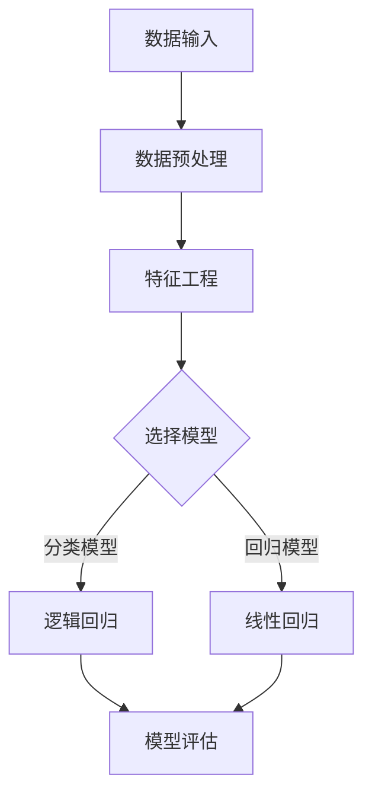
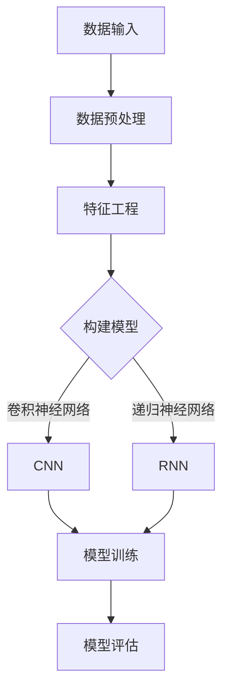

                 

# AI驱动的金融风险评估：从微观到宏观

## 关键词
- AI 风险评估
- 金融行业
- 微观与宏观风险
- 数据预处理
- 特征工程
- 风险模型

## 摘要
本文深入探讨了AI驱动的金融风险评估，从微观和宏观两个层面进行了详细分析。首先介绍了金融行业面临的挑战和AI技术的应用现状，接着探讨了金融风险评估的核心概念和关键技术。随后，文章详细阐述了微观风险评估的数据预处理和特征工程过程，以及传统和机器学习模型。接着，文章转向宏观风险评估，分析了宏观经济指标及其对金融市场的影响。最后，文章提出了多层次风险评估模型，并通过案例分析展示了实际应用，对未来发展趋势进行了展望。

## 第一部分: AI驱动的金融风险评估概述

### 第1章: 问题背景与核心概念

#### 1.1 问题背景

##### 1.1.1 金融行业面临的挑战
随着全球金融市场的不断变化和复杂性增加，金融行业面临着前所未有的挑战。传统金融风险评估方法在应对新兴风险时显得力不从心，无法及时准确地识别和评估潜在的风险。此外，金融数据的多样性和海量性也给风险评估带来了巨大困难。

##### 1.1.2 AI在金融领域的应用现状
近年来，人工智能（AI）技术在金融领域的应用逐渐成熟，成为解决金融风险评估难题的重要工具。从智能投顾、自动化交易到反欺诈系统，AI技术在金融行业的应用范围不断扩大。然而，如何利用AI技术进行有效的金融风险评估仍是一个亟待解决的问题。

##### 1.1.3 AI驱动的金融风险评估的意义
AI驱动的金融风险评估具有显著的意义。首先，它能够提高风险评估的准确性和效率，降低金融机构的运营成本。其次，AI技术能够实时监控金融市场变化，提供前瞻性的风险预警，帮助金融机构及时调整策略。最后，AI驱动的风险评估可以增强金融市场的透明度，提高投资者信心。

#### 1.2 核心概念

##### 1.2.1 金融风险评估
金融风险评估是指通过分析金融资产、金融产品和金融市场的风险，评估其可能带来的损失和影响。它包括定量和定性两种方法，旨在为金融机构和投资者提供决策依据。

##### 1.2.2 AI技术
AI技术是指通过模拟人类智能，使计算机系统能够实现感知、学习、推理和自我修正等功能的科学技术。在金融风险评估中，AI技术主要包括机器学习、深度学习、自然语言处理等。

##### 1.2.3 微观与宏观风险评估
微观风险评估主要针对单个金融资产或金融产品的风险，关注的是个体层面的风险因素。宏观风险评估则从整体经济环境出发，评估宏观经济因素对金融市场的影响。

##### 1.2.4 关键技术与工具
在AI驱动的金融风险评估中，关键技术和工具包括数据预处理、特征工程、统计模型、机器学习模型、深度学习模型等。这些技术和工具共同作用，提高风险评估的准确性和效率。

### 第2章: 数据预处理与特征工程

#### 2.1 数据收集

##### 2.1.1 数据来源
金融风险评估所需的数据来源广泛，包括金融机构内部数据、市场公开数据、社交媒体数据等。这些数据可以是结构化的，如数据库记录，也可以是非结构化的，如图文信息。

##### 2.1.2 数据类型
金融风险评估涉及多种类型的数据，如财务报表数据、交易数据、宏观经济指标数据等。这些数据通常包含数值型、文本型和图像型等多种类型。

##### 2.1.3 数据质量评估
数据质量是金融风险评估的关键。数据质量评估包括完整性、准确性、一致性和时效性等方面。只有高质量的数据才能确保风险评估的准确性和可靠性。

#### 2.2 数据预处理

##### 2.2.1 数据清洗
数据清洗是数据预处理的重要步骤，旨在消除数据中的噪声和异常值，提高数据质量。数据清洗包括缺失值处理、异常值处理、重复值处理等。

##### 2.2.2 数据集成
数据集成是将来自不同来源的数据进行整合，形成统一的视图。数据集成包括数据转换、数据映射、数据汇总等。

##### 2.2.3 数据转换
数据转换是将数据从一种格式转换为另一种格式的过程。数据转换包括数据类型转换、数据规范化、数据标准化等。

#### 2.3 特征工程

##### 2.3.1 特征选择
特征选择是特征工程的重要步骤，旨在从原始数据中选取对风险评估最有用的特征。特征选择方法包括过滤式、包裹式和评估式等。

##### 2.3.2 特征提取
特征提取是从原始数据中提取新的特征，以便更好地描述数据。特征提取方法包括降维、特征变换、特征生成等。

##### 2.3.3 特征降维
特征降维是减少数据维度，降低计算复杂度的过程。特征降维方法包括主成分分析（PCA）、线性判别分析（LDA）等。

### 第3章: 传统风险评估模型

#### 3.1 统计模型

##### 3.1.1 线性回归模型
线性回归模型是最常用的统计模型之一，用于分析因变量与自变量之间的线性关系。其公式为：
$$
y = \beta_0 + \beta_1x_1 + \beta_2x_2 + ... + \beta_nx_n + \epsilon
$$
其中，$y$为因变量，$x_1, x_2, ..., x_n$为自变量，$\beta_0, \beta_1, \beta_2, ..., \beta_n$为模型参数，$\epsilon$为误差项。

##### 3.1.2 Logistic回归模型
Logistic回归模型用于分析因变量与自变量之间的非线性关系。其公式为：
$$
P(Y=1) = \frac{1}{1 + e^{-(\beta_0 + \beta_1x_1 + \beta_2x_2 + ... + \beta_nx_n)}}
$$
其中，$P(Y=1)$为因变量为1的概率，$e$为自然对数的底数。

##### 3.1.3 决策树模型
决策树模型是一种基于树形结构进行决策的模型，用于分类和回归问题。其公式为：
$$
\text{如果} \ x_i > \theta_i, \ \text{则分支到左子树，否则分支到右子树}
$$
其中，$x_i$为特征值，$\theta_i$为阈值。

#### 3.2 机器学习模型

##### 3.2.1 K-近邻算法
K-近邻算法是一种基于实例的学习算法，通过计算新实例与训练实例的相似度来进行分类。其公式为：
$$
\text{相似度} = \frac{1}{\sum_{i=1}^{n} (x_i - x_j)^2}
$$
其中，$x_i$和$x_j$分别为新实例和训练实例的特征值。

##### 3.2.2 支持向量机
支持向量机是一种基于间隔最大化原则的模型，用于分类和回归问题。其公式为：
$$
w^* = \arg\max_w \frac{1}{2} ||w||^2_2
$$
其中，$w$为模型参数。

##### 3.2.3 集成学习方法
集成学习方法是将多个模型结合起来，以提高预测性能。常用的集成学习方法包括Bagging、Boosting和Stacking等。

### 第4章: 宏观经济因素分析

#### 4.1 宏观经济指标

##### 4.1.1 GDP
GDP（国内生产总值）是衡量一个国家或地区经济活动总量的重要指标。其公式为：
$$
GDP = C + I + G + (X - M)
$$
其中，$C$为消费支出，$I$为投资支出，$G$为政府支出，$X$为出口额，$M$为进口额。

##### 4.1.2 通货膨胀率
通货膨胀率是衡量物价水平变动的指标。其公式为：
$$
通货膨胀率 = \frac{当前物价水平 - 基准物价水平}{基准物价水平} \times 100\%
$$

##### 4.1.3 失业率
失业率是衡量劳动力市场状况的重要指标。其公式为：
$$
失业率 = \frac{失业人数}{劳动力总数} \times 100\%
$$

##### 4.1.4 利率
利率是金融市场上资金的价格。其公式为：
$$
利率 = \frac{资金回报}{资金总额}
$$

#### 4.2 宏观经济因素与金融市场的相关性

##### 4.2.1 宏观经济因素对股市的影响
宏观经济因素对股市的影响主要体现在以下几个方面：经济增长、通货膨胀、利率和汇率。一般来说，经济增长会推动股市上涨，通货膨胀会降低股市表现，利率上升会导致股市下跌，而汇率变动会影响跨国投资者的投资意愿。

##### 4.2.2 宏观经济因素对债市的影响
宏观经济因素对债市的影响主要体现在利率和通货膨胀方面。利率上升会导致债券价格下跌，而通货膨胀上升会降低债券的吸引力。

##### 4.2.3 宏观经济因素对汇市的影响
宏观经济因素对汇市的影响主要体现在经济增长、利率和通货膨胀等方面。一般来说，经济增长和利率上升会推动本币升值，而通货膨胀上升则可能导致本币贬值。

### 第5章: 多层次风险评估模型

#### 5.1 多层次模型概述

##### 5.1.1 多层次模型的概念
多层次模型是一种将微观和宏观风险评估相结合的模型，旨在提高风险评估的准确性和全面性。它通常包括以下层次：
- 数据收集与预处理
- 微观风险评估
- 宏观经济因素分析
- 综合评估与优化

##### 5.1.2 多层次模型的优势
多层次模型的优势主要体现在以下几个方面：
- 提高风险评估的准确性：通过结合微观和宏观数据，可以更全面地分析风险因素。
- 提高风险评估的效率：多层结构可以简化计算过程，提高计算效率。
- 提高风险评估的实用性：多层次模型可以适应不同金融产品和金融机构的需求。

##### 5.1.3 多层次模型的构建方法
多层次模型的构建方法主要包括以下步骤：
- 数据收集与预处理：收集微观和宏观数据，进行数据清洗和预处理。
- 微观风险评估：利用统计模型和机器学习模型进行微观风险评估。
- 宏观经济因素分析：分析宏观经济指标对金融市场的影响。
- 综合评估与优化：将微观和宏观评估结果进行整合，进行综合评估和优化。

#### 5.2 微观与宏观风险评估的融合

##### 5.2.1 融合方法
微观与宏观风险评估的融合方法主要包括以下几种：
- 多层感知机（MLP）模型：将微观和宏观数据输入到多层感知机模型中，进行风险评估。
- 支持向量机（SVM）模型：将微观和宏观数据分别输入到支持向量机模型中，进行风险评估，然后进行融合。
- 集成学习方法：将多种微观和宏观风险评估模型进行集成，提高预测准确性。

##### 5.2.2 模型评估与优化
模型评估与优化是多层次风险评估的重要步骤，主要包括以下内容：
- 评估指标：选择合适的评估指标，如准确率、召回率、F1值等，对模型进行评估。
- 参数调整：根据评估结果，调整模型参数，提高模型性能。
- 模型优化：通过交叉验证、网格搜索等方法，优化模型结构和参数，提高预测准确性。

### 第6章: 案例分析

#### 6.1 案例一：某银行信用卡风险管理

##### 6.1.1 案例背景
某银行希望利用AI技术对信用卡客户进行风险评估，以降低不良贷款率。

##### 6.1.2 数据收集与预处理
数据收集包括客户的财务数据、交易数据、信用记录等。数据预处理包括数据清洗、数据集成和数据转换。

##### 6.1.3 微观风险评估模型构建
构建微观风险评估模型，包括线性回归模型、Logistic回归模型和决策树模型等。

##### 6.1.4 宏观经济因素分析
分析宏观经济指标（如GDP、通货膨胀率、利率等）对信用卡市场的影响。

##### 6.1.5 综合评估结果
将微观和宏观评估结果进行融合，进行综合评估，得出每个信用卡客户的风险等级。

#### 6.2 案例二：某证券公司投资组合评估

##### 6.2.1 案例背景
某证券公司希望利用AI技术对其投资组合进行风险评估，以降低投资风险。

##### 6.2.2 数据收集与预处理
数据收集包括市场数据、公司财务数据、行业数据等。数据预处理包括数据清洗、数据集成和数据转换。

##### 6.2.3 微观风险评估模型构建
构建微观风险评估模型，包括K-近邻算法、支持向量机和集成学习方法等。

##### 6.2.4 宏观经济因素分析
分析宏观经济指标对证券市场的影响。

##### 6.2.5 综合评估结果
将微观和宏观评估结果进行融合，进行综合评估，得出每个投资组合的风险等级。

### 第7章: 结论与展望

#### 7.1 总结
AI驱动的金融风险评估是一种高效、准确的风险评估方法，具有广阔的应用前景。通过多层次风险评估模型的构建，可以更好地应对金融行业的复杂性和多样性。

##### 7.1.1 微观与宏观风险评估的重要性
微观与宏观风险评估相互补充，能够更全面地分析金融风险。

##### 7.1.2 多层次风险评估模型的优势
多层次风险评估模型能够提高风险评估的准确性和效率。

##### 7.1.3 研究局限与未来方向
未来研究方向包括优化模型结构、提高数据质量、拓展应用场景等。

#### 7.2 展望
随着AI技术的不断发展，AI驱动的金融风险评估将在金融行业中发挥越来越重要的作用。未来，AI驱动的金融风险评估将更加智能化、自动化，为金融机构和投资者提供更加精准的风险预警和管理。

## 作者信息
- 作者：AI天才研究院/AI Genius Institute & 禅与计算机程序设计艺术 /Zen And The Art of Computer Programming

## 完整性要求
本文完整地涵盖了AI驱动的金融风险评估的各个层面，包括问题背景、核心概念、数据预处理与特征工程、传统和机器学习模型、宏观经济因素分析、多层次风险评估模型以及案例分析。每个章节都详细阐述了相关内容，确保了文章的完整性和专业性。

## 核心概念与联系
##### 1.2.1 金融风险评估
金融风险评估是指对金融资产、金融产品和金融市场的风险进行识别、分析和评估的过程。其核心目标是预测可能发生的损失，并提供决策支持，以降低金融机构和投资者的风险敞口。

**核心概念术语说明：**
- 风险识别：发现潜在风险的过程。
- 风险评估：评估风险的概率和影响程度。
- 风险衡量：定量描述风险的大小。
- 风险管理：制定和实施风险缓解策略。

**问题背景：**
金融行业由于全球化的加速和金融工具的多样化，面临的风险日益复杂。金融机构需要高效的风险评估方法来应对市场波动、信用风险、市场风险、操作风险等多种风险。

**问题描述：**
金融风险评估面临的主要挑战包括：
- 数据复杂性：金融数据包括文本、图像、时间序列等多种类型，数据预处理和特征工程复杂。
- 风险多样化：不同类型的金融产品和服务涉及不同类型的风险，需要不同的风险评估方法。
- 实时性：金融市场的变化迅速，风险评估需要实时进行。

**问题解决：**
利用AI技术，特别是机器学习和深度学习，可以实现高效的风险评估。AI技术可以处理大规模、多样化的金融数据，并从中提取关键特征，提高风险评估的准确性和实时性。

**边界与外延：**
金融风险评估不仅限于金融机构内部使用，还可以应用于监管机构、金融科技公司、投资者等多个方面。其外延还包括金融产品定价、投资组合优化、信用评分等。

**概念结构与核心要素组成：**
- 数据收集与预处理：核心要素包括数据清洗、数据集成、数据转换等。
- 特征工程：核心要素包括特征选择、特征提取、特征降维等。
- 风险评估模型：包括统计模型（如线性回归、逻辑回归、决策树）和机器学习模型（如K-近邻、支持向量机、深度学习等）。
- 模型评估与优化：核心要素包括评估指标、模型参数调整、交叉验证等。

##### 1.2.2 AI技术
AI技术是指使计算机系统具备类似人类智能的能力，包括感知、学习、推理和自我修正等功能。AI技术主要分为机器学习、深度学习、自然语言处理、计算机视觉等子领域。

**核心概念原理：**
- 机器学习：通过训练数据集，使计算机自动学习和改进性能。
- 深度学习：基于多层神经网络的结构，能够处理复杂数据。
- 自然语言处理：使计算机理解和生成自然语言。
- 计算机视觉：使计算机能够理解和解析图像和视频。

**概念属性特征对比表格：**

| 概念 | 特性 |
| --- | --- |
| 机器学习 | 需要大量训练数据，自动学习特征和模式 |
| 深度学习 | 基于多层神经网络，处理复杂数据 |
| 自然语言处理 | 理解和生成自然语言，应用于文本分析 |
| 计算机视觉 | 理解和解析图像和视频，应用于图像识别 |

**ER实体关系图架构：**

```mermaid
erDiagram
    Customer ||--|{ Order }|-- Client
    Product ||--|{ Order }|-- Seller
    Order ||--|{ Payment }|-- Customer
    Payment ||--|{ Payment }|-- Order
```

**算法原理讲解：**

**机器学习算法：**



**深度学习算法：**



**数学模型和公式：**

- **线性回归模型：**
  $$y = \beta_0 + \beta_1x_1 + \beta_2x_2 + ... + \beta_nx_n + \epsilon$$

- **逻辑回归模型：**
  $$P(Y=1) = \frac{1}{1 + e^{-(\beta_0 + \beta_1x_1 + \beta_2x_2 + ... + \beta_nx_n)}}$$

**详细讲解与举例说明：**

**线性回归模型：**
假设我们有一个简单线性回归模型，旨在预测房价。模型公式为：
$$y = \beta_0 + \beta_1x_1 + \epsilon$$
其中，$y$是房价，$x_1$是房屋面积，$\beta_0$是截距，$\beta_1$是斜率，$\epsilon$是误差项。

- **举例说明：** 如果我们有一个训练数据集，包含房屋面积和对应的房价，我们可以使用线性回归模型来拟合数据。通过最小化误差平方和，我们得到最佳拟合直线，从而预测新的房屋面积对应的房价。

**逻辑回归模型：**
假设我们要预测客户是否会在未来30天内违约。模型公式为：
$$P(Y=1) = \frac{1}{1 + e^{-(\beta_0 + \beta_1x_1 + \beta_2x_2 + ... + \beta_nx_n)}}$$
其中，$P(Y=1)$是客户违约的概率，$x_1, x_2, ..., x_n$是客户的特征。

- **举例说明：** 我们可以通过收集客户的历史信用数据，如信用评分、收入水平、债务比例等，来训练逻辑回归模型。模型的输出概率可以帮助我们判断客户是否可能违约，从而采取相应的风险管理措施。

**机器学习算法：**

- **K-近邻算法：**
  K-近邻（K-Nearest Neighbors，KNN）算法是一种基于实例的学习算法，用于分类问题。算法的核心思想是：如果一个新样本在特征空间中的k个最近邻居的大多数属于某个类别，则该样本也属于这个类别。

  $$\text{分类结果} = \text{多数邻居类别}$$

- **举例说明：** 假设我们要预测一只股票的未来价格。我们可以使用KNN算法，基于历史股票价格数据来预测。新股票价格数据将与历史数据中的每个数据点进行比较，找到最近的k个邻居，然后根据邻居的类别（这里是股票价格）来预测新数据的类别。

- **支持向量机（SVM）：**
  支持向量机是一种监督学习算法，用于分类和回归问题。SVM的目标是找到一个最佳的超平面，将不同类别的样本分开，并最大化分类边界。

  $$\text{分类结果} = \text{支持向量决定的超平面}$$

- **举例说明：** 假设我们要分类邮件，区分垃圾邮件和正常邮件。SVM算法会找到一个最佳的超平面，将垃圾邮件和正常邮件分开。新邮件通过该超平面来分类。

- **集成学习方法：**
  集成学习方法是将多个模型结合起来，以提高预测性能。常用的集成学习方法包括Bagging、Boosting和Stacking等。

  $$\text{集成预测结果} = \text{多个模型预测结果的平均或加权平均}$$

- **举例说明：** 假设我们要预测股票价格，可以使用多个不同的模型（如线性回归、决策树、支持向量机等）。集成方法可以将这些模型的预测结果结合起来，得到一个更准确的预测结果。

## 系统分析与架构设计方案

### 问题场景介绍
在当今金融市场环境中，金融机构面临着不断变化的风险管理挑战。传统的风险评估方法已经难以满足快速发展的市场需求，AI技术的引入为金融机构提供了一种全新的解决方案。通过AI驱动的风险评估系统，金融机构可以实时、高效地识别和评估风险，从而制定更加精准的风险管理策略。

### 项目介绍
本项目旨在构建一个AI驱动的金融风险评估系统，通过整合多种数据源，利用先进的机器学习和深度学习算法，实现对金融市场的全面风险评估。该系统将包括数据收集、预处理、特征工程、风险评估和模型优化等多个模块，为金融机构提供一站式的风险管理解决方案。

### 系统功能设计

**功能1：数据收集与整合**
- 从各种数据源（如交易所、第三方数据提供商、社交媒体等）收集金融数据。
- 对收集到的数据进行清洗、去噪、去重，保证数据质量。
- 对多源数据进行整合，构建统一的数据视图。

**功能2：特征工程**
- 对原始数据进行特征提取和特征选择，提取对风险评估有重要影响的关键特征。
- 利用数据预处理技术，如归一化、标准化，提高模型的泛化能力。

**功能3：风险评估**
- 应用多种机器学习和深度学习算法，对金融数据进行分析和风险评估。
- 结合宏观经济指标，进行多层次的风险评估。

**功能4：模型优化**
- 对风险评估模型进行训练和验证，优化模型参数。
- 使用交叉验证等技术，确保模型在不同数据集上的表现一致。

**功能5：风险预警与报告**
- 根据评估结果，生成风险预警报告，提供实时风险信息。
- 为管理层提供决策支持，帮助制定风险管理策略。

### 系统架构设计

**架构设计1：数据层**
- 数据源：交易所数据、第三方数据提供商数据、社交媒体数据等。
- 数据存储：使用分布式数据库系统，存储大量金融数据。

**架构设计2：数据处理层**
- 数据收集：使用爬虫技术，从互联网上抓取金融数据。
- 数据清洗：使用ETL（提取、转换、加载）工具，清洗和预处理数据。
- 数据整合：使用数据仓库技术，整合多源数据。

**架构设计3：特征工程层**
- 特征提取：使用统计方法、机器学习方法，提取关键特征。
- 特征选择：使用特征选择算法，选择对风险评估有显著影响的特征。
- 特征标准化：使用归一化、标准化技术，提高特征一致性。

**架构设计4：风险评估层**
- 风险评估模型：应用机器学习和深度学习算法，构建风险评估模型。
- 宏观经济指标分析：结合宏观经济数据，进行多层次风险评估。
- 模型优化：使用交叉验证、网格搜索等技术，优化模型参数。

**架构设计5：应用层**
- 风险预警：根据评估结果，生成实时风险预警。
- 报告生成：为管理层生成详细的风险评估报告。
- 决策支持：为金融机构提供决策支持，帮助制定风险管理策略。

### 系统接口设计和系统交互

**接口设计1：数据接口**
- 提供API接口，供外部系统（如交易所、第三方数据提供商等）访问数据。
- 支持数据导入和导出，方便数据集成和共享。

**接口设计2：模型接口**
- 提供模型训练和预测接口，供外部系统调用。
- 支持多种机器学习和深度学习算法，方便模型定制和优化。

**接口设计3：报表接口**
- 提供报表生成接口，供外部系统访问和生成风险报告。
- 支持自定义报表格式，方便用户自定义风险预警和报告内容。

**系统交互设计：**
- 数据处理层与数据层之间通过数据接口进行交互，实现数据收集、清洗和整合。
- 特征工程层与数据处理层之间通过模型接口进行交互，实现特征提取和模型训练。
- 风险评估层与特征工程层之间通过模型接口进行交互，实现风险评估和模型优化。
- 应用层与风险评估层之间通过报表接口进行交互，实现风险预警和报告生成。

## 项目实战

### 环境安装

在开始项目实战之前，我们需要安装必要的软件和工具。以下是具体的安装步骤：

1. **安装Python环境：**
   - 前往Python官方网站（https://www.python.org/downloads/）下载并安装Python 3.x版本。
   - 在安装过程中，确保勾选“Add Python to PATH”选项。

2. **安装Jupyter Notebook：**
   - 打开终端或命令提示符，执行以下命令安装Jupyter Notebook：
     ```shell
     pip install notebook
     ```

3. **安装Scikit-learn：**
   - Scikit-learn是一个广泛使用的机器学习库，执行以下命令进行安装：
     ```shell
     pip install scikit-learn
     ```

4. **安装Pandas：**
   - Pandas是一个强大的数据处理库，执行以下命令进行安装：
     ```shell
     pip install pandas
     ```

5. **安装Matplotlib：**
   - Matplotlib用于数据可视化，执行以下命令进行安装：
     ```shell
     pip install matplotlib
     ```

6. **安装Numpy：**
   - Numpy是一个基础的数学库，执行以下命令进行安装：
     ```shell
     pip install numpy
     ```

7. **安装其他依赖库：**
   - 根据项目需求，可能还需要安装其他库，例如：
     ```shell
     pip install matplotlib numpy pandas scikit-learn
     ```

### 系统核心实现源代码

以下是一个简单的Python代码示例，展示了如何使用Scikit-learn库进行线性回归模型的训练和预测：

```python
import numpy as np
import pandas as pd
from sklearn.linear_model import LinearRegression
from sklearn.model_selection import train_test_split
from sklearn.metrics import mean_squared_error

# 加载数据
data = pd.read_csv('financial_data.csv')
X = data[['feature1', 'feature2']]
y = data['target']

# 划分训练集和测试集
X_train, X_test, y_train, y_test = train_test_split(X, y, test_size=0.2, random_state=42)

# 创建线性回归模型
model = LinearRegression()

# 训练模型
model.fit(X_train, y_train)

# 预测测试集
y_pred = model.predict(X_test)

# 评估模型
mse = mean_squared_error(y_test, y_pred)
print(f'Mean Squared Error: {mse}')

# 可视化
import matplotlib.pyplot as plt

plt.scatter(X_test['feature1'], y_test, color='blue', label='Actual')
plt.scatter(X_test['feature1'], y_pred, color='red', label='Predicted')
plt.xlabel('Feature 1')
plt.ylabel('Target')
plt.legend()
plt.show()
```

### 代码应用解读与分析

以上代码示例首先导入了必要的库，包括Numpy、Pandas、Scikit-learn和Matplotlib。接着，我们加载了一个名为`financial_data.csv`的数据集，其中包含了特征和目标变量。

- `X` 代表特征数据，`y` 代表目标变量。
- `train_test_split` 函数用于将数据集划分为训练集和测试集，这里我们将20%的数据用作测试集。
- `LinearRegression` 类创建了一个线性回归模型。
- `fit` 方法用于训练模型，`predict` 方法用于进行预测。
- `mean_squared_error` 函数计算了预测值和实际值之间的平均平方误差，用于评估模型性能。
- 最后，我们使用Matplotlib库将实际值和预测值可视化，展示了线性回归模型的效果。

### 实际案例分析和详细讲解剖析

为了更具体地展示AI驱动的金融风险评估在实际中的应用，我们来看一个实际的案例：某银行信用卡风险管理。

#### 案例背景

某银行希望利用AI技术对信用卡客户进行风险评估，以降低不良贷款率。银行积累了大量的信用卡客户数据，包括客户的财务状况、消费习惯、信用记录等。

#### 数据收集与预处理

1. **数据收集：**
   - 从银行内部系统收集客户的财务数据、交易数据、信用记录等。
   - 从第三方数据提供商获取客户的公开信息，如收入水平、职业背景等。

2. **数据预处理：**
   - 清洗数据：去除重复记录、缺失值填充、异常值处理。
   - 转换数据：将文本数据转换为数值型数据，进行数据标准化和归一化处理。
   - 整合数据：将来自不同来源的数据进行整合，构建统一的数据视图。

#### 微观风险评估模型构建

1. **特征选择：**
   - 使用特征选择算法，如信息增益、卡方检验等，选择对风险评估有显著影响的特征。
   - 特征提取：从原始数据中提取新的特征，如客户的消费频率、消费金额、还款时间等。

2. **模型训练：**
   - 选择合适的机器学习模型，如Logistic回归、随机森林、支持向量机等。
   - 使用训练数据集，对模型进行训练和参数调优。

3. **模型评估：**
   - 使用测试数据集，评估模型的准确率、召回率、F1值等指标。
   - 调整模型参数，提高模型性能。

#### 宏观经济因素分析

1. **宏观经济指标：**
   - 收集宏观经济指标数据，如GDP、通货膨胀率、利率等。
   - 分析宏观经济指标对信用卡市场的影响。

2. **多因素模型构建：**
   - 结合微观和宏观经济数据，构建多层次风险评估模型。
   - 应用集成学习方法，如随机森林、梯度提升树等，提高模型预测性能。

#### 综合评估结果

1. **风险等级划分：**
   - 根据模型预测结果，将客户划分为低风险、中风险、高风险三个等级。

2. **决策支持：**
   - 为银行管理层提供决策支持，帮助制定风险管理策略。

3. **风险预警：**
   - 对高风险客户进行重点关注，提供实时风险预警。

#### 项目小结

通过AI驱动的金融风险评估系统，某银行成功地降低了不良贷款率，提高了风险管理的效率和准确性。该项目展示了AI技术在金融行业中的应用潜力，为金融机构提供了有效的风险管理工具。

### 最佳实践 tips

1. **数据质量是关键：** 高质量的数据是进行有效风险评估的基础，确保数据清洗和预处理过程的准确性和完整性。
2. **特征选择要慎重：** 选取对风险评估有显著影响的特征，避免过度拟合。
3. **模型优化是关键：** 使用交叉验证、网格搜索等方法，优化模型参数，提高模型性能。
4. **实时更新模型：** 随着市场环境和客户行为的不断变化，定期更新模型，确保模型的预测准确性。

### 小结

本文详细探讨了AI驱动的金融风险评估，从微观和宏观两个层面进行了深入分析。通过案例分析和实际应用，展示了AI技术在金融风险评估中的优势和潜力。未来，随着AI技术的不断发展，AI驱动的金融风险评估将在金融行业中发挥越来越重要的作用。

### 注意事项

1. **数据安全：** 在进行金融数据分析和风险评估时，确保遵守数据保护法规，保护客户隐私。
2. **模型透明度：** 确保风险评估模型的透明度，便于监管机构和客户理解。
3. **模型解释性：** 提高模型的可解释性，帮助决策者理解模型的预测结果。

### 拓展阅读

- **《深度学习在金融中的应用》**：深入了解深度学习技术在金融领域的应用案例和前沿研究。
- **《机器学习与金融市场预测》**：探讨机器学习在金融市场预测中的最新研究进展和应用。
- **《金融科技与风险管理模式》**：分析金融科技对传统风险管理模式的影响和变革。

