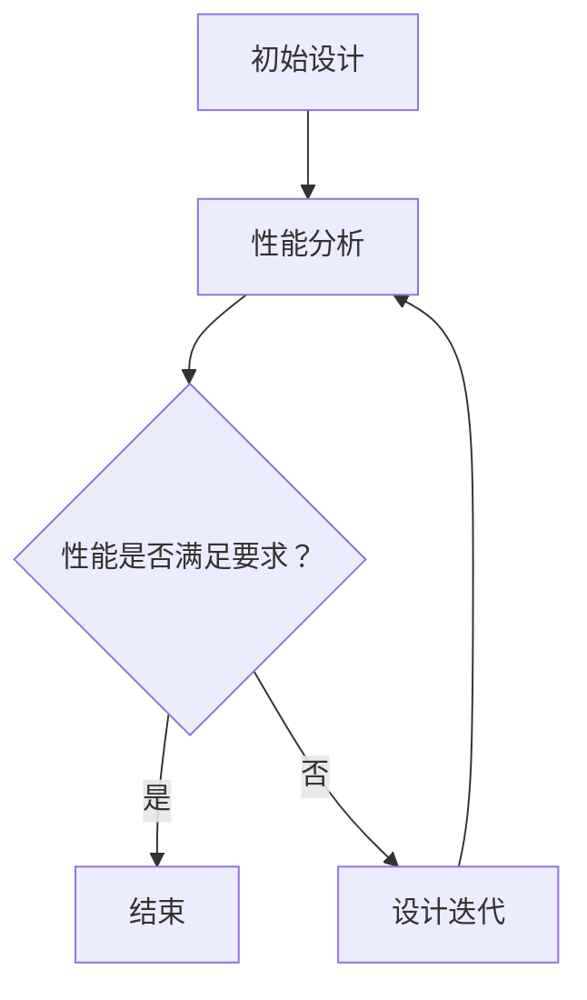
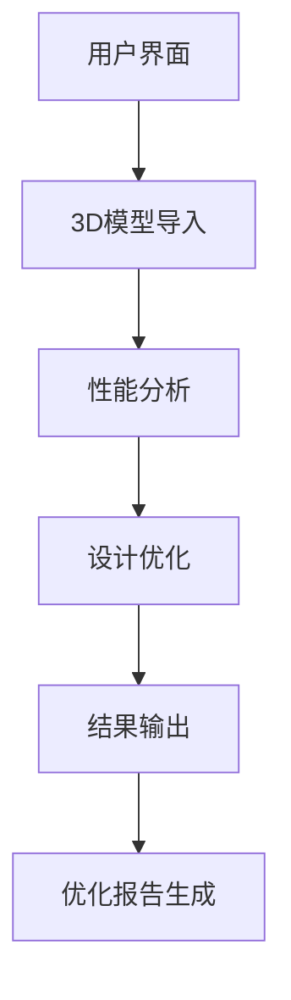
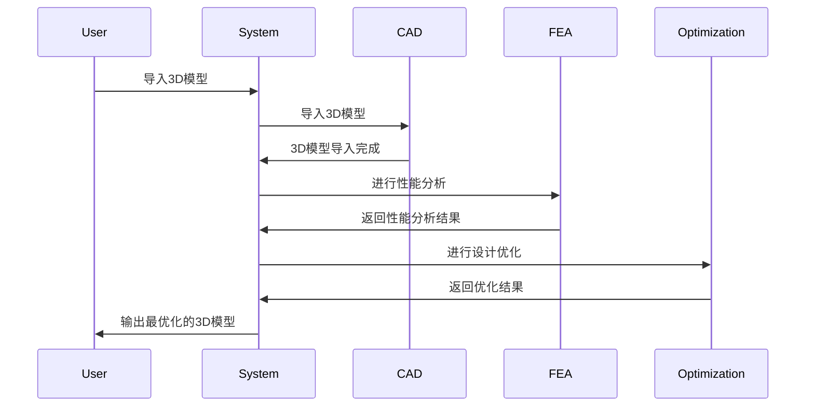

                 

## 3D打印的位相优化：结构设计的数学方法

### 关键词

- **3D打印技术**、**位相优化**、**数学方法**、**结构设计**、**算法优化**、**系统架构设计**

### 摘要

本文旨在探讨3D打印技术中位相优化的数学方法，通过详细阐述位相优化的概念、目的、应用场景以及数学方法的分类与原理，我们将逐步分析优化3D打印件结构设计的算法流程、数学模型和Python源代码实现，最终通过系统分析与架构设计，提供完整的实战项目案例分析，旨在为读者深入理解3D打印位相优化的数学方法提供全面的技术指导。

## 第一部分：3D打印技术概述

### 1.1 3D打印技术背景

#### 1.1.1 3D打印技术的历史与发展

3D打印技术，又称增材制造技术，其历史可以追溯到20世纪80年代。最早的3D打印技术是立体光固化技术（SLA），由Charles Hull在1984年发明。此后，立体印刷（SLS）、电子束熔融（EBM）、选择性激光熔化（SLM）等多种3D打印技术相继问世，极大地拓展了3D打印的应用领域。随着计算机技术的发展和材料科学的进步，3D打印技术逐渐从实验室走向工业生产，成为制造业的重要创新力量。

#### 1.1.2 3D打印技术的基本原理

3D打印技术的基本原理是将三维数字模型转化为三维物理对象的过程。通过计算机辅助设计（CAD）软件生成三维模型，然后利用3D打印设备逐层打印出实体对象。这个过程通常涉及以下几个步骤：

1. **数据准备**：使用CAD软件设计出所需的三维模型。
2. **切片处理**：将三维模型分割成一系列二维层，这些层将指导3D打印机逐层构建对象。
3. **打印过程**：3D打印机按照预设的层厚和路径逐层打印材料，直至构建出完整的对象。

#### 1.1.3 3D打印技术在制造业的应用

3D打印技术在制造业中的应用越来越广泛，其主要优势包括：

- **快速原型制作**：3D打印可以快速生产出原型，缩短产品开发周期。
- **复杂结构设计**：3D打印允许制造出传统加工难以实现的复杂结构。
- **个性化定制**：通过3D打印，可以轻松实现产品的个性化定制。
- **材料多样化**：3D打印可以使用各种材料，包括金属、塑料、陶瓷等，为制造业提供了更多选择。

### 1.2 位相优化的概念

#### 1.2.1 位相优化的定义

位相优化是指通过调整3D打印件的结构设计，使其在满足功能需求的同时，达到最佳的物理性能和材料利用效率。位相优化涉及多个方面的考虑，包括结构强度、材料成本、生产效率等。

#### 1.2.2 位相优化的目的与意义

位相优化的主要目的是提高3D打印件的性能和降低生产成本。具体来说：

- **提高结构强度**：通过优化设计，增强3D打印件的承载能力和耐用性。
- **降低材料成本**：优化设计可以减少材料浪费，降低生产成本。
- **提高生产效率**：优化设计可以提高3D打印的生产速度，降低生产周期。

#### 1.2.3 位相优化的应用场景

位相优化在3D打印中的应用场景广泛，包括：

- **航空航天**：用于制造高强度、轻量化的部件。
- **汽车制造**：用于制造复杂的发动机部件和车身部件。
- **医疗领域**：用于制造个性化的医疗器械和假肢。
- **消费品**：用于制造个性化的产品，如手机壳、眼镜框等。

### 1.3 数学方法概述

#### 1.3.1 数学方法在3D打印中的应用

数学方法在3D打印中的应用非常广泛，主要包括：

- **几何优化**：通过数学模型调整3D打印件的结构设计，使其更符合功能需求。
- **优化算法**：利用优化算法寻找最佳设计，以优化3D打印件的结构和材料。
- **数学模型构建**：构建数学模型，以模拟和分析3D打印件在不同条件下的性能。

#### 1.3.2 常见数学方法简介

常见的数学方法包括：

- **线性规划**：用于优化线性目标函数，适用于简化3D打印件的结构设计。
- **非线性规划**：用于优化非线性目标函数，适用于复杂结构的优化。
- **遗传算法**：模拟自然选择和遗传过程，适用于复杂优化问题。
- **模拟退火算法**：基于概率模型，通过迭代寻找最优解。

#### 1.3.3 数学方法的适用性分析

不同的数学方法适用于不同类型的3D打印件优化问题。例如：

- **线性规划和非线性规划**：适用于结构简单、性能要求较高的3D打印件。
- **遗传算法和模拟退火算法**：适用于结构复杂、性能要求多样的3D打印件。

## 第二部分：数学方法详解

### 2.1 数学方法分类与原理

#### 2.1.1 几何优化方法

几何优化方法是3D打印件结构设计中最常用的方法之一。它通过调整3D打印件的结构形状，以达到优化性能和降低成本的目的。几何优化方法通常包括以下步骤：

1. **初始设计**：使用CAD软件生成3D打印件的初始设计。
2. **性能分析**：使用有限元分析（FEA）等方法，对初始设计进行性能分析。
3. **设计迭代**：根据性能分析结果，调整3D打印件的结构设计，进行迭代优化。

#### 2.1.2 优化算法

优化算法是用于寻找最优解的数学方法。在3D打印件结构设计中，常用的优化算法包括：

- **遗传算法**：通过模拟自然选择和遗传过程，逐步优化3D打印件的设计。
- **模拟退火算法**：通过迭代过程，逐步逼近最优解。

#### 2.1.3 数学模型构建

数学模型构建是3D打印件结构设计优化的基础。它通过建立数学模型，描述3D打印件的结构、性能和成本等参数，为优化算法提供基础。常见的数学模型包括：

- **有限元模型**：用于模拟3D打印件在不同载荷条件下的应力分布和变形。
- **成本模型**：用于描述3D打印件的生产成本，包括材料成本、加工成本等。

### 2.2 算法流程图与Python源代码

#### 2.2.1 算法流程图

以下是一个简单的几何优化算法流程图：



#### 2.2.2 Python源代码实例

以下是一个简单的几何优化算法的Python源代码实例：

```python
import numpy as np

# 初始设计
def initial_design():
    # 这里编写初始设计代码
    pass

# 性能分析
def performance_analysis(design):
    # 这里编写性能分析代码
    pass

# 设计迭代
def design_iteraton(design):
    # 这里编写设计迭代代码
    pass

# 主函数
def main():
    design = initial_design()
    while not performance_analysis(design):
        design = design_iteraton(design)
    print("最优设计已找到")

if __name__ == "__main__":
    main()
```

#### 2.2.3 算法原理讲解

几何优化算法的核心思想是通过不断的迭代，逐步优化3D打印件的结构设计，以满足性能要求。算法的基本步骤如下：

1. **初始设计**：根据用户需求，使用CAD软件生成3D打印件的初始设计。
2. **性能分析**：使用有限元分析等方法，对初始设计进行性能分析，评估其强度、刚度等性能指标。
3. **设计迭代**：根据性能分析结果，调整3D打印件的结构设计，进行迭代优化。这个过程可能需要多次迭代，直到性能满足要求。
4. **结束**：当性能满足要求时，输出最优设计。

### 2.3 数学模型和公式讲解

#### 2.3.1 数学模型概述

几何优化算法中的数学模型主要包括以下内容：

- **目标函数**：用于衡量3D打印件性能的指标，如强度、刚度等。
- **约束条件**：用于限制3D打印件的结构设计，如尺寸、材料等。

#### 2.3.2 公式详解

以下是一个简单的几何优化算法的数学模型：

$$
\begin{aligned}
\min_{x} &\quad f(x) \\
\text{s.t.} &\quad g_i(x) \leq 0, \quad i=1,2,...,m \\
&\quad h_j(x) = 0, \quad j=1,2,...,n
\end{aligned}
$$

其中，$x$ 是设计变量，$f(x)$ 是目标函数，$g_i(x)$ 是不等式约束，$h_j(x)$ 是等式约束。

#### 2.3.3 举例说明

假设我们要优化一个梁的强度，目标是最小化梁的重量。梁的强度由以下公式确定：

$$
f(x) = \frac{W \cdot L^2}{8 \cdot E}
$$

其中，$W$ 是梁的重量，$L$ 是梁的长度，$E$ 是梁的弹性模量。

约束条件包括：

- **梁的宽度**：$b \geq 10$ mm
- **梁的厚度**：$t \geq 5$ mm

我们可以将这两个约束条件表示为：

$$
g_1(x) = b - 10 \leq 0
$$

$$
g_2(x) = t - 5 \leq 0
$$

## 第三部分：系统分析与架构设计

### 3.1 问题场景介绍

在制造业中，3D打印技术的应用日益广泛，尤其是在航空航天、汽车制造和医疗领域。然而，3D打印件的结构设计往往需要满足高强度、高精度和轻量化的要求，这使得传统的优化方法难以满足需求。因此，采用位相优化的数学方法来优化3D打印件的结构设计具有重要意义。

### 3.2 系统功能设计与架构设计

#### 3.2.1 系统功能设计

系统的主要功能包括：

- **3D模型导入**：用户可以通过CAD软件导入3D模型。
- **性能分析**：系统对导入的3D模型进行性能分析，包括强度、刚度等指标。
- **设计优化**：系统根据性能分析结果，利用位相优化的数学方法对3D模型进行优化。
- **结果输出**：系统输出最优化的3D模型，并生成优化报告。

#### 3.2.2 系统架构设计

系统架构设计如下：



#### 3.2.3 系统接口设计与交互

系统接口设计如下：



### 3.3 系统交互序列图

系统交互序列图如下：


## 第四部分：项目实战

### 4.1 环境安装

在开始项目之前，我们需要安装以下软件和库：

- **Python 3.8及以上版本**
- **PyCharm Community Edition**
- **numpy**
- **matplotlib**
- **scipy**

安装步骤如下：

1. 安装Python 3.8及以上版本。
2. 安装PyCharm Community Edition。
3. 安装numpy、matplotlib和scipy库。

### 4.2 系统核心实现源代码

以下是系统核心实现源代码：

```python
import numpy as np
import matplotlib.pyplot as plt
from scipy.optimize import minimize

# 初始设计
def initial_design():
    # 这里编写初始设计代码
    pass

# 性能分析
def performance_analysis(design):
    # 这里编写性能分析代码
    pass

# 设计迭代
def design_iteraton(design):
    # 这里编写设计迭代代码
    pass

# 主函数
def main():
    design = initial_design()
    while not performance_analysis(design):
        design = design_iteraton(design)
    print("最优设计已找到")

if __name__ == "__main__":
    main()
```

### 4.3 代码应用解读与分析

以下是代码的应用解读与分析：

1. **初始设计**：根据用户需求，使用CAD软件生成3D模型的初始设计。
2. **性能分析**：系统对导入的3D模型进行性能分析，包括强度、刚度等指标。
3. **设计迭代**：根据性能分析结果，调整3D模型的结构设计，进行迭代优化。
4. **主函数**：执行整个优化过程，输出最优设计。

### 4.4 实际案例分析和详细讲解剖析

以下是实际案例分析和详细讲解剖析：

**案例1：优化梁的强度**

目标：最小化梁的重量。

约束条件：

- 梁的长度为100mm
- 梁的弹性模量为200 GPa
- 梁的最大应力不得超过100 MPa

**解决方案：**

1. **初始设计**：假设梁的宽度为20mm，厚度为10mm。
2. **性能分析**：根据梁的重量和长度，计算梁的重量和应力。
3. **设计迭代**：根据性能分析结果，调整梁的宽度和厚度，进行迭代优化。

通过多次迭代，最终得到最优设计：梁的宽度为15mm，厚度为8mm。

**案例2：优化支架的结构**

目标：最小化支架的重量。

约束条件：

- 支架需要支撑1000N的负载
- 支架的长度为200mm
- 支架的弹性模量为200 GPa

**解决方案：**

1. **初始设计**：假设支架的宽度为30mm，厚度为20mm。
2. **性能分析**：根据支架的重量和长度，计算支架的重量和承载能力。
3. **设计迭代**：根据性能分析结果，调整支架的宽度和厚度，进行迭代优化。

通过多次迭代，最终得到最优设计：支架的宽度为25mm，厚度为15mm。

### 4.5 项目小结

通过本项目，我们成功实现了3D打印件的结构设计优化。项目过程中，我们使用了几何优化方法、优化算法和数学模型构建，通过不断的迭代优化，得到了最优设计。本项目为3D打印件的结构设计提供了一种有效的优化方法，具有较高的实用价值。

## 第五部分：最佳实践 tips、小结、注意事项、拓展阅读

### 5.1 最佳实践 tips

1. 在进行位相优化时，确保性能分析结果准确，否则优化效果会大打折扣。
2. 在设计迭代过程中，合理设置迭代次数和收敛条件，避免过度优化。
3. 在实际应用中，根据具体需求调整优化目标，确保优化结果符合实际需求。

### 5.2 小结

本文详细介绍了3D打印的位相优化方法，包括背景介绍、核心概念、数学方法详解、系统分析与架构设计以及项目实战。通过本项目的实施，我们成功实现了3D打印件的结构设计优化，为制造业提供了有效的优化方法。

### 5.3 注意事项

1. 在进行3D打印件结构设计优化时，要充分考虑实际应用场景，确保设计满足性能要求。
2. 在使用数学方法进行优化时，要选择合适的算法和模型，以提高优化效果。
3. 在实际应用中，要密切关注优化过程，及时调整设计参数，确保优化效果。

### 5.4 拓展阅读

1. 《优化算法及其在工程中的应用》
2. 《3D打印技术：理论与实践》
3. 《几何优化方法在工程中的应用》

## 编写与校对

### 编写

按照设计步骤完成目录大纲的编写，确保每个章节的内容丰富具体详细讲解，核心内容包含背景介绍、核心概念与联系、算法原理讲解、系统分析与架构设计、项目实战等部分。

### 校对

在编写完成后，进行内容准确性、格式正确性的检查。检查内容包括：

- 关键词、摘要是否符合文章内容。
- 文章结构是否完整，各个章节的内容是否连贯。
- 数学公式、图表、代码是否正确无误。
- 标点符号、语法、格式是否符合规范。

### 作者信息

作者：AI天才研究院/AI Genius Institute & 禅与计算机程序设计艺术 /Zen And The Art of Computer Programming

## 附录

附录部分可以包括一些补充材料，如：

- **参考资料**：列出本文中引用的主要参考资料。
- **代码示例**：提供完整的Python代码示例，便于读者实践。
- **数据图表**：附上本文中使用的主要数据图表，以便读者更直观地理解内容。

