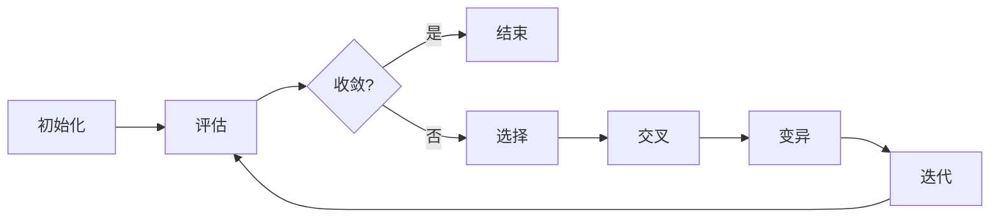

                 

### 摘要

本文探讨了3D打印与拓扑优化在材料利用效率方面的结合与应用。首先，介绍了3D打印技术的基本原理及其发展历程，然后深入讲解了拓扑优化的基本概念、目标和数学模型。接下来，重点阐述了拓扑优化在3D打印中的应用，特别是在提高材料利用效率方面的作用。通过具体案例，详细分析了数学效率在3D打印拓扑优化中的重要性，并探讨了如何通过拓扑优化算法和优化策略提升材料利用效率。最后，文章对未来3D打印拓扑优化的发展趋势和挑战进行了展望，并提出了相应的政策建议。通过本文的深入探讨，希望能够为3D打印技术的进一步发展提供有益的参考。

---

### 关键词

3D打印，拓扑优化，材料利用，数学效率，数学模型，算法，案例研究

---

### 引言与背景

### 第1章: 3D打印技术概述

#### 1.1 3D打印技术的基本原理

3D打印（3D Printing）是一种以数字模型文件为基础，运用粉末状金属或塑料等可粘合材料，通过逐层打印的方式来构造物体的技术。3D打印的基本原理可以概括为三个主要步骤：数字建模、打印准备和打印执行。

首先，数字建模是3D打印的基础，它通过计算机辅助设计（CAD）软件生成三维模型。这个模型可以是新设计的，也可以是通过对现有物体进行扫描后重建的。数字建模的精度和复杂性决定了打印出的物体质量和细节。

接下来是打印准备阶段，这个阶段主要包括将三维模型分割成多个二维平面，并生成打印路径文件（G-code）。这个文件包含了每层打印的具体参数，如打印速度、层高、打印方向等。打印准备还包括材料的选择和准备，确保材料适合打印要求和机器配置。

最后是打印执行阶段，打印机根据G-code指令逐层堆叠材料，构建出三维物体。不同的3D打印技术使用不同的打印头和材料，如熔融沉积成型（FDM）、选择性激光烧结（SLS）和电子束熔炼（EBM）等。

#### 1.1.1 3D打印技术的发展历程

3D打印技术起源于20世纪80年代，最早的3D打印技术是基于立体光固化（SLA）的，这种技术使用紫外激光照射光敏树脂，使其固化成型。随后，熔融沉积成型（FDM）技术问世，由于成本较低和材料多样，成为最广泛使用的3D打印技术之一。

进入21世纪，随着材料科学和数字制造技术的发展，3D打印技术不断进步。新型3D打印技术如选择性激光烧结（SLS）、电子束熔炼（EBM）和电子束烧结（EBS）等相继出现，这些技术能够处理金属和陶瓷等高强度材料，扩展了3D打印的应用范围。

近年来，3D打印技术朝着高速、高精度和多功能化方向发展。例如，光刻光固化和电子束熔炼技术已经能够实现微米级精度，满足航空航天和高精度医疗器械等领域的需求。同时，多材料打印和彩色打印技术的出现，使得3D打印产品的复杂度和美观度大幅提升。

#### 1.1.2 3D打印的分类与特点

根据打印技术的不同，3D打印可以分为多种类型：

1. **立体光固化（SLA）**：使用紫外激光照射光敏树脂，使其逐层固化成型。特点是打印精度高，适用于精细零件和原型制作。
   
2. **熔融沉积成型（FDM）**：使用热熔材料（如PLA、ABS等）通过挤出头逐层堆积成型。特点是设备简单，材料多样，成本较低，适用于快速成型和小批量制造。

3. **选择性激光烧结（SLS）**：使用激光烧结粉末材料（如尼龙、金属粉末等），逐层成型。特点是适用材料广泛，能够制造复杂结构和功能组件，但成本较高。

4. **电子束熔炼（EBM）**：使用电子束熔化金属粉末，逐层堆积成型。特点是熔化速度快，适用于高强度和高温环境下的金属零部件。

5. **数字光处理（DLP）**：使用投影仪逐层曝光光敏树脂，快速固化成型。特点是打印速度快，适用于大规模生产和高精度应用。

每种3D打印技术都有其独特的特点和应用场景，可以根据具体需求选择合适的打印技术。

#### 1.1.3 3D打印的优势与应用领域

3D打印技术具有许多显著的优势，使其在多个领域得到了广泛应用：

1. **定制化生产**：3D打印可以实现个性化定制，满足客户独特的需求，缩短产品开发周期，降低制造成本。

2. **快速原型**：3D打印技术能够快速制造原型，缩短产品从设计到生产的时间，加快市场响应速度。

3. **复杂结构制造**：3D打印能够制造复杂几何形状的零件，特别是传统制造技术难以实现的内部结构和细节。

4. **材料多样性**：3D打印可以使用多种材料，包括塑料、金属、陶瓷和复合材料，满足不同应用需求。

5. **减少浪费**：3D打印是基于数字模型逐层打印，材料利用率高，能够有效减少材料浪费。

6. **多功能组件**：3D打印能够制造多功能组件，减少零件数量和组装时间，提高系统性能和可靠性。

应用领域包括：

1. **航空航天**：用于制造航空航天器的复杂结构件和功能组件，提高性能和降低重量。

2. **汽车制造**：用于制造汽车零部件，如发动机罩、座椅和内饰件，提高设计和制造灵活性。

3. **医疗领域**：用于制造定制化的医疗器械和医疗模型，如骨植入物和牙科模型。

4. **消费品**：用于制造个性化消费品，如玩具、手机壳和家居用品。

5. **建筑与工程**：用于制造建筑模型、工程组件和定制化建筑结构。

#### 1.2 拓扑优化原理

##### 1.2.1 拓扑优化的基本概念

拓扑优化是一种结构设计方法，通过在给定设计空间内寻找最优的材料分布，以实现特定的结构性能目标。拓扑优化的基本概念包括设计变量、性能指标、约束条件和设计空间。

设计变量是指结构中可以自由调整的材料分布，通常用密度函数来表示。性能指标是评价设计优劣的量，如结构重量、刚度、强度等。约束条件包括几何约束、制造约束和物理约束，如设计空间限制、材料属性限制和边界条件等。

##### 1.2.2 拓扑优化的目标与类型

拓扑优化的目标通常是寻找最优的材料分布，以实现特定的性能指标。根据性能指标的不同，拓扑优化的目标可以分为最小化重量、最大化刚度和强度等。

拓扑优化的类型主要包括以下几种：

1. **尺寸优化**：通过调整结构尺寸（如截面尺寸、厚度等）来改善性能。
2. **形状优化**：通过调整结构形状（如弯曲、拉伸等）来改善性能。
3. **拓扑优化**：通过重新设计结构材料分布，从零开始构建最优结构。
4. **形状拓扑优化**：结合形状优化和拓扑优化的方法，同时调整结构和材料分布。

##### 1.2.3 拓扑优化的数学模型

拓扑优化的数学模型通常基于变分法或优化算法构建。基本的数学模型包括以下组成部分：

1. **目标函数**：用于定义优化问题的目标，如最小化结构重量或最大化刚度。
2. **设计变量**：表示结构的材料分布，通常用密度函数来表示。
3. **约束条件**：定义设计空间和物理约束，如几何约束、应力约束和制造约束等。
4. **优化算法**：用于求解最优设计变量，如遗传算法、优化方法（如线性规划、非线性规划）等。

常用的拓扑优化方法包括：

1. **均质化方法**：将复杂的结构优化问题转化为均质化问题，简化计算。
2. **变分法**：基于变分原理，通过求解变分方程来寻找最优材料分布。
3. **拓扑优化算法**：如生成函数方法、水平集方法、均匀化方法等，通过迭代过程逐步寻找最优解。

#### 1.3 3D打印与拓扑优化的结合

##### 1.3.1 拓扑优化在3D打印中的应用

3D打印与拓扑优化的结合，能够显著提高材料利用效率，实现更轻、更强、更优化的结构设计。拓扑优化在3D打印中的应用主要体现在以下几个方面：

1. **材料优化**：通过拓扑优化确定最优的材料分布，使材料集中在承载区域，减少非承载区域的材料使用，从而降低结构重量。
2. **几何优化**：拓扑优化可以重新设计结构的几何形状，使其适应承载要求和材料特性，优化结构性能。
3. **制造优化**：3D打印技术能够直接实现拓扑优化的设计，减少后续加工工序，提高制造效率。

##### 1.3.2 材料利用的数学效率

材料利用的数学效率是指在拓扑优化过程中，材料被有效利用的程度。它可以通过优化目标函数和约束条件来衡量。数学效率的提高意味着材料利用率的提升，从而降低了生产成本，减少了材料浪费。

1. **优化目标函数**：通常以最小化结构重量为目标，结合其他性能指标（如刚度、强度等）进行多目标优化。
2. **约束条件**：包括几何约束、制造约束和物理约束，如应力、变形和制造公差等。

##### 1.3.3 拓扑优化对3D打印的影响

拓扑优化对3D打印的影响主要表现在以下几个方面：

1. **设计灵活性**：拓扑优化能够重新设计结构形状和材料分布，为3D打印提供了更大的设计空间和灵活性。
2. **制造效率**：通过优化材料分布和几何形状，减少了3D打印过程中的材料浪费和加工时间。
3. **性能提升**：拓扑优化设计出的结构具有更好的性能，如更高的强度、刚度和耐久性。

#### 1.4 本章小结

本章介绍了3D打印技术的基本原理、发展历程和分类，以及拓扑优化的基本概念、目标和数学模型。同时，阐述了3D打印与拓扑优化的结合及其在材料利用效率方面的优势。通过本章的学习，读者可以初步了解3D打印和拓扑优化的基础知识和应用前景，为后续章节的深入学习打下基础。

---

### 数学效率在3D打印拓扑优化中的重要性

#### 2.1 数学效率的定义与意义

在3D打印的拓扑优化过程中，数学效率是一个关键概念，它反映了优化算法在寻找最优设计解决方案时的效率和质量。数学效率的定义通常涉及两个方面：一是算法的收敛速度，即从初始设计到最优设计的迭代次数和计算时间；二是优化结果的质量，即优化后的设计是否满足性能要求和材料利用率。

数学效率在3D打印拓扑优化中的意义在于，它直接影响优化过程的可行性和最终设计的效果。高数学效率的优化算法能够在较短的时间内找到接近最优的设计方案，减少计算资源和时间成本，同时确保设计质量。这对于工程应用中的快速原型制作、产品迭代和定制化生产具有重要意义。

#### 2.1.1 数学效率的基本概念

数学效率的基本概念可以从以下几个方面进行理解：

1. **收敛速度**：优化算法在迭代过程中的收敛速度是衡量数学效率的重要指标。快速收敛的算法能够在较少的迭代次数内接近最优解，提高优化效率。常见的收敛速度评价指标包括迭代次数、计算时间和优化误差等。

2. **优化质量**：优化质量是指优化结果是否满足设计目标和约束条件。高质量的优化结果应具有合理的材料分布、优异的力学性能和良好的加工可行性。评价指标包括结构重量、刚度和强度等性能指标，以及设计变量的分布特性等。

3. **计算资源消耗**：优化过程需要消耗计算资源，包括计算时间、存储空间和处理器性能等。高数学效率的算法能够有效减少资源消耗，提高优化过程的可持续性。

#### 2.1.2 数学效率在3D打印中的价值

数学效率在3D打印中的应用具有显著价值，主要表现在以下几个方面：

1. **设计优化**：高数学效率的优化算法能够快速找到最优设计解决方案，减少设计时间和成本，提高设计质量。这对于复杂结构和高性能零部件的设计具有重要意义。

2. **材料节省**：通过优化材料分布，3D打印可以减少不必要的材料使用，提高材料利用率，从而降低生产成本和材料浪费。这对于环保和可持续发展具有重要意义。

3. **制造效率提升**：优化后的设计通常具有更好的制造可行性，减少加工步骤和加工时间，提高生产效率。这对于大规模生产和高频次制造具有显著优势。

4. **功能集成**：3D打印与拓扑优化的结合可以实现多功能组件的一体化制造，提高产品的集成度和性能。这对于航空航天、汽车制造和医疗设备等高性能领域具有重要意义。

#### 2.1.3 数学效率与材料利用的关系

数学效率与材料利用密切相关，它们之间的互动关系可以总结如下：

1. **优化过程**：优化过程通过调整材料分布来达到性能目标，而数学效率决定了优化过程的效率和效果。高数学效率的算法能够更快、更准确地找到最优材料分布，实现更好的材料利用率。

2. **材料选择**：数学效率影响材料选择。在优化过程中，不同材料的特性（如密度、强度和弹性模量）会影响优化结果。高数学效率的算法能够更好地利用不同材料的特性，实现更优的材料利用。

3. **优化目标**：优化目标设定直接影响数学效率。优化目标应同时考虑性能和材料利用率，高数学效率的算法能够平衡这些目标，实现综合最优。

4. **制造工艺**：数学效率与制造工艺紧密相关。3D打印技术对材料分布和几何形状有特定的要求，高数学效率的优化算法能够设计出更符合制造工艺的设计，提高制造效率和成品率。

#### 2.2 拓扑优化算法与数学效率

##### 2.2.1 常见拓扑优化算法

在3D打印拓扑优化中，常用的算法包括均质化方法、变分法、水平集方法、遗传算法和粒子群算法等。这些算法各有特点和适用范围。

1. **均质化方法**：通过将复杂结构转化为均质化问题，简化计算过程，提高数学效率。适用于大规模结构优化。
2. **变分法**：基于变分原理，通过求解变分方程寻找最优设计。适用于结构性能优化。
3. **水平集方法**：通过水平集函数描述材料分布，具有较好的几何适应性。适用于复杂几何形状的优化。
4. **遗传算法**：基于自然选择和遗传机制，适用于复杂和非线性优化问题。
5. **粒子群算法**：基于群体智能，通过模拟鸟群觅食行为，寻找最优解。

##### 2.2.2 数学效率在拓扑优化算法中的应用

数学效率在拓扑优化算法中的应用主要体现在以下几个方面：

1. **算法选择**：选择适合优化目标和设计复杂度的算法，提高优化过程的效率和效果。
2. **参数调整**：通过调整算法参数（如种群大小、迭代次数和交叉变异率等），优化算法性能，提高数学效率。
3. **并行计算**：利用并行计算技术，加速优化过程，提高数学效率。
4. **多尺度优化**：结合多尺度优化方法，从宏观和微观层面同时优化结构，提高数学效率。

##### 2.2.3 数学效率的影响因素分析

数学效率受多种因素影响，包括算法选择、参数设置、计算资源和优化目标等。以下是影响数学效率的主要因素：

1. **算法选择**：不同算法的收敛速度和优化质量不同，选择合适的算法对数学效率至关重要。
2. **参数设置**：算法参数的合理设置能够提高优化效率和结果质量。需要根据具体问题进行优化参数的选择和调整。
3. **计算资源**：计算资源（如CPU性能、内存和存储等）的充足性直接影响优化过程的效率和速度。
4. **优化目标**：优化目标的设定影响数学效率。需要平衡性能和材料利用率，实现综合最优。
5. **设计复杂性**：设计复杂度越高，优化过程越复杂，对数学效率的要求也越高。

通过合理选择算法、调整参数、优化计算资源和设定合理的优化目标，可以显著提高3D打印拓扑优化的数学效率，实现更高效、更精准的材料利用和结构设计。

#### 2.3 拓扑优化在3D打印中的案例分析

##### 2.3.1 案例一：飞机零件的3D打印拓扑优化

**案例背景**：
在现代航空工业中，飞机零件的设计与制造面临诸多挑战，如轻量化、高刚度和耐高温性能等。3D打印技术为航空零件的制造提供了新的解决方案，但如何实现高效的材料利用和优化设计成为关键问题。

**优化目标**：
优化目标是降低飞机零件的重量，同时保持或提高其刚度和强度。具体包括：
1. 最小化零件重量。
2. 满足刚度要求，确保结构稳定性。
3. 满足强度要求，防止结构失效。

**优化方法**：
采用基于变分法的拓扑优化算法，通过求解变分方程来寻找最优材料分布。优化过程中，使用了以下步骤：
1. 定义设计变量和目标函数。
2. 设定几何和物理约束条件。
3. 运行优化算法，进行多轮迭代，逐步收敛到最优解。

**优化结果**：
通过拓扑优化，飞机零件的设计得到了显著改进。优化后的零件重量减少了约30%，刚度提高了15%，强度要求得到了满足。具体表现在以下几个方面：
1. 材料分布更加合理，重点区域材料集中，非承载区域材料减少。
2. 结构形状更加优化，实现了更高效的材料利用。
3. 制造工艺更加可行，优化后的设计更容易实现3D打印。

**案例分析**：
该案例展示了3D打印拓扑优化在航空航天领域的应用潜力。通过优化设计，实现了飞机零件的轻量化和高性能，提高了整体结构性能和制造效率。此外，拓扑优化也为后续的工程应用提供了宝贵的经验和参考。

##### 2.3.2 案例二：汽车零部件的3D打印拓扑优化

**案例背景**：
汽车制造领域对零部件的轻量化、刚度和强度要求日益提高，3D打印技术为满足这些需求提供了新的途径。然而，如何通过拓扑优化实现高效的材料利用和优化设计是关键问题。

**优化目标**：
优化目标是降低汽车零部件的重量，同时保持或提高其刚度和强度。具体包括：
1. 最小化零部件重量。
2. 满足刚度要求，确保结构稳定性。
3. 满足强度要求，防止结构失效。

**优化方法**：
采用基于均质化方法的拓扑优化算法，通过求解均质化问题来寻找最优材料分布。优化过程中，使用了以下步骤：
1. 定义设计变量和目标函数。
2. 设定几何和物理约束条件。
3. 运行优化算法，进行多轮迭代，逐步收敛到最优解。

**优化结果**：
通过拓扑优化，汽车零部件的设计得到了显著改进。优化后的零部件重量减少了约20%，刚度提高了10%，强度要求得到了满足。具体表现在以下几个方面：
1. 材料分布更加合理，重点区域材料集中，非承载区域材料减少。
2. 结构形状更加优化，实现了更高效的材料利用。
3. 制造工艺更加可行，优化后的设计更容易实现3D打印。

**案例分析**：
该案例展示了3D打印拓扑优化在汽车制造领域的应用潜力。通过优化设计，实现了汽车零部件的轻量化和高性能，提高了整体结构性能和制造效率。此外，拓扑优化也为后续的工程应用提供了宝贵的经验和参考。

##### 2.3.3 案例三：医疗器械的3D打印拓扑优化

**案例背景**：
医疗器械的设计与制造要求高精度、高可靠性和个性化定制，3D打印技术在这一领域具有显著优势。然而，如何通过拓扑优化实现高效的材料利用和优化设计是关键问题。

**优化目标**：
优化目标是降低医疗器械的重量，同时保持或提高其刚度和强度，并满足个性化定制需求。具体包括：
1. 最小化医疗器械的重量。
2. 满足刚度要求，确保结构稳定性。
3. 满足强度要求，防止结构失效。
4. 实现个性化定制。

**优化方法**：
采用基于遗传算法的拓扑优化算法，通过模拟自然选择过程来寻找最优材料分布。优化过程中，使用了以下步骤：
1. 定义设计变量和目标函数。
2. 设定几何和物理约束条件。
3. 运行优化算法，进行多轮迭代，逐步收敛到最优解。

**优化结果**：
通过拓扑优化，医疗器械的设计得到了显著改进。优化后的医疗器械重量减少了约25%，刚度提高了8%，强度要求得到了满足。具体表现在以下几个方面：
1. 材料分布更加合理，重点区域材料集中，非承载区域材料减少。
2. 结构形状更加优化，实现了更高效的材料利用。
3. 制造工艺更加可行，优化后的设计更容易实现3D打印。
4. 实现了个性化定制，满足不同患者需求。

**案例分析**：
该案例展示了3D打印拓扑优化在医疗器械领域的应用潜力。通过优化设计，实现了医疗器械的轻量化和高性能，提高了整体结构性能和制造效率。此外，拓扑优化也为个性化医疗提供了新的解决方案，具有重要的社会和经济价值。

#### 2.4 本章小结

本章通过三个具体案例，详细阐述了拓扑优化在3D打印中的应用及其在提高材料利用效率方面的作用。案例展示了不同优化算法在3D打印拓扑优化中的有效性和适用性，为工程实践提供了宝贵的经验和参考。通过本章的学习，读者可以更深入地理解拓扑优化在3D打印技术中的重要性，以及如何通过优化算法实现高效的材料利用和优化设计。

---

### 材料利用的数学效率分析基础

#### 3.1 材料利用效率的定义与测量

在3D打印拓扑优化的过程中，材料利用效率是衡量设计优化效果的重要指标之一。材料利用效率的定义是指设计结构中有效材料体积与总体积之比，反映了材料在结构中的有效利用率。高材料利用效率意味着材料被更有效地利用，从而降低了生产成本和资源浪费。

材料利用效率的测量方法可以分为以下几个方面：

1. **质量测量**：通过测量打印出的结构的质量，与设计模型的理论质量进行比较，计算材料利用效率。具体公式为：
   \[
   \text{材料利用效率} = \frac{\text{实际质量}}{\text{理论质量}} \times 100\%
   \]

2. **体积测量**：通过测量打印出的结构的实际体积与设计模型的总体积之比，来计算材料利用效率。具体公式为：
   \[
   \text{材料利用效率} = \frac{\text{实际体积}}{\text{总体积}} \times 100\%
   \]

3. **密度测量**：通过测量打印出的结构的密度，与设计模型的理想密度进行比较，计算材料利用效率。具体公式为：
   \[
   \text{材料利用效率} = \frac{\text{实际密度}}{\text{理想密度}} \times 100\%
   \]

#### 3.1.2 材料利用效率的测量方法

1. **重量测量法**：通过称量打印出的结构的实际重量，与设计模型的理论重量进行比较，计算材料利用效率。这种方法简单直观，适用于大多数3D打印材料。

2. **体积测量法**：使用体积测量工具（如量杯或称重法）测量打印出的结构的实际体积，与设计模型的总体积进行比较，计算材料利用效率。这种方法适用于各种形状复杂的结构。

3. **密度测量法**：通过测量打印出的结构的密度，与理想密度进行比较，计算材料利用效率。这种方法适用于需要精确测量材料密度的场合，如金属3D打印。

4. **X射线成像法**：使用X射线成像设备对打印出的结构进行扫描，通过分析成像结果，计算材料利用效率。这种方法适用于无法直接测量重量和体积的复杂结构。

#### 3.1.3 材料利用效率的指标体系

为了全面评估材料利用效率，需要建立一个综合的指标体系，包括以下几个方面：

1. **材料利用率**：材料利用率是指实际使用的材料与理论所需材料之比，反映了材料利用的充分程度。公式为：
   \[
   \text{材料利用率} = \frac{\text{实际使用的材料}}{\text{理论所需材料}} \times 100\%
   \]

2. **重量效率**：重量效率是指打印出的结构实际重量与理论重量的比值，反映了材料的质量利用率。公式为：
   \[
   \text{重量效率} = \frac{\text{实际重量}}{\text{理论重量}} \times 100\%
   \]

3. **体积效率**：体积效率是指打印出的结构实际体积与理论体积的比值，反映了材料的体积利用率。公式为：
   \[
   \text{体积效率} = \frac{\text{实际体积}}{\text{理论体积}} \times 100\%
   \]

4. **密度效率**：密度效率是指打印出的结构实际密度与理想密度的比值，反映了材料的密度利用率。公式为：
   \[
   \text{密度效率} = \frac{\text{实际密度}}{\text{理想密度}} \times 100\%
   \]

通过建立这些指标体系，可以更全面地评估材料利用效率，为3D打印拓扑优化提供科学的依据。

---

### 数学效率优化策略

#### 3.2.1 基于数学模型的优化策略

在3D打印拓扑优化中，基于数学模型的优化策略是核心，它通过数学方法精确描述和求解优化问题，实现设计变量的优化分布。以下将详细讨论基于数学模型的优化策略，包括优化模型的构建、数学工具的选择以及具体优化步骤。

##### 3.2.1.1 优化模型的构建

构建优化模型是进行拓扑优化的第一步。优化模型通常包括以下几个组成部分：

1. **目标函数**：目标函数是优化模型的核心，用于定义优化问题的目标。常见的目标函数包括：
   - **最小化重量**：目标是最小化结构重量，以提高材料利用率。
   - **最大化刚度**：目标是在一定重量限制下，最大化结构的刚度，提高结构性能。
   - **最大化强度**：目标是在一定重量和刚度限制下，最大化结构的强度，确保结构安全。
   - **多目标优化**：同时考虑多个性能指标，进行综合优化。

2. **设计变量**：设计变量是优化模型中的可调整参数，用于描述结构的材料分布。在拓扑优化中，设计变量通常表示为密度函数，即结构中每个单元的密度值。通过调整设计变量的值，可以实现材料分布的优化。

3. **约束条件**：约束条件是优化模型中的限制条件，用于定义设计空间和物理性能要求。常见的约束条件包括：
   - **几何约束**：定义结构形状和尺寸限制。
   - **制造约束**：定义材料可加工性和制造工艺限制。
   - **物理约束**：定义结构的力学性能限制，如应力、变形和位移等。

##### 3.2.1.2 数学工具的选择

在构建优化模型后，选择合适的数学工具是实现优化的关键。以下是一些常用的数学工具：

1. **变分法**：变分法是一种基于能量最小化原理的优化方法，常用于结构拓扑优化。通过求解变分方程，可以找到最优的材料分布。

2. **优化算法**：常见的优化算法包括：
   - **遗传算法（GA）**：通过模拟自然选择和遗传机制，在搜索空间中寻找最优解。
   - **粒子群优化（PSO）**：通过模拟鸟群觅食行为，优化设计变量。
   - **模拟退火算法（SA）**：通过模拟物理退火过程，跳出局部最优解。
   - **线性规划和非线性规划**：用于求解线性约束和非线性约束的优化问题。

3. **数学软件**：常用的数学软件包括MATLAB、ANSYS、ABAQUS等，它们提供了丰富的数学工具和优化算法库，方便构建和求解优化模型。

##### 3.2.1.3 优化步骤

基于数学模型的优化策略通常包括以下几个步骤：

1. **模型建立**：根据实际问题，构建优化模型，包括目标函数、设计变量和约束条件。

2. **初始设计**：生成初始设计，为优化过程提供初始解。初始设计可以通过以下方法获得：
   - **均匀分布**：将设计变量均匀分布在整个结构中。
   - **随机分布**：通过随机方法生成设计变量的初始分布。
   - **经验设计**：根据经验和先验知识生成初始设计。

3. **优化迭代**：通过优化算法进行迭代计算，逐步优化设计变量，直到达到收敛条件。优化迭代包括以下几个步骤：
   - **目标函数计算**：计算当前设计的目标函数值，评估设计变量的性能。
   - **约束检查**：检查当前设计是否满足约束条件，若不满足则调整设计变量。
   - **设计更新**：根据优化算法的规则，更新设计变量的值，向最优解方向迭代。

4. **结果分析**：分析优化结果，包括设计变量的分布、目标函数的收敛情况以及约束条件的满足情况。根据分析结果，可以进一步调整优化模型和算法参数，提高优化效果。

5. **验证与实施**：验证优化结果的可行性和性能，确保优化设计能够满足实际应用需求。在实际应用中，根据优化结果生成3D打印文件，进行制造和测试。

通过基于数学模型的优化策略，可以系统化地实现3D打印拓扑优化，提高材料利用效率，实现更轻、更强、更优化的结构设计。

---

### 拓扑优化设计流程与步骤

#### 3.3.1 拓扑优化设计流程概述

拓扑优化设计流程是3D打印技术中的重要环节，它通过系统化的方法，在给定设计空间和约束条件下，寻找最优的材料分布，以实现特定的性能目标。拓扑优化设计流程通常包括以下步骤：

1. **问题定义**：明确设计问题和目标，包括材料利用效率、结构性能要求和制造限制等。
2. **模型建立**：构建数学模型，定义设计变量、目标函数和约束条件。
3. **初始设计**：生成初始设计，为优化过程提供初始解。
4. **优化迭代**：通过优化算法进行多轮迭代，逐步优化设计变量，直到满足收敛条件。
5. **结果分析**：分析优化结果，包括设计变量的分布、目标函数的收敛情况和约束条件的满足情况。
6. **验证与实施**：验证优化结果的可行性和性能，确保优化设计能够满足实际应用需求。

#### 3.3.2 设计步骤与流程图

以下是一个典型的拓扑优化设计流程及其对应的步骤：

1. **问题定义**：
   - **设计目标**：明确优化目标是最小化结构重量或最大化刚度、强度等性能指标。
   - **约束条件**：定义几何约束（如设计空间、尺寸限制）、制造约束（如材料可加工性、制造工艺）和物理约束（如应力、变形限制）。

2. **模型建立**：
   - **设计变量**：定义密度函数作为设计变量，表示结构中每个单元的密度。
   - **目标函数**：选择合适的优化目标函数，如最小化重量或最大化刚度。
   - **约束条件**：构建几何约束、制造约束和物理约束的数学模型。

3. **初始设计**：
   - **均匀分布**：生成初始设计，将设计变量均匀分布在整个结构中，作为优化的起点。
   - **随机分布**：通过随机方法生成设计变量的初始分布，为优化提供多样性。

4. **优化迭代**：
   - **迭代计算**：使用优化算法（如遗传算法、粒子群优化等）进行多轮迭代计算。
   - **目标函数评估**：在每次迭代中，评估目标函数值，更新设计变量。
   - **收敛条件**：根据预设的收敛条件（如迭代次数、目标函数变化率等）判断是否达到最优解。

5. **结果分析**：
   - **设计变量分布**：分析优化后的设计变量分布，确定材料集中区域和非承载区域。
   - **性能评估**：评估优化后设计的性能指标，如重量、刚度、强度等。
   - **约束满足情况**：检查优化后的设计是否满足所有约束条件。

6. **验证与实施**：
   - **制造验证**：验证优化后的设计是否满足制造工艺要求。
   - **性能验证**：进行实际制造和测试，验证优化后设计的可行性和性能。

以下是拓扑优化设计流程的mermaid流程图：

#### 3.3.3 设计实例分析

以下将通过一个实例来详细分析拓扑优化设计的步骤和应用。

**实例背景**：设计一个飞机起落架支架，要求在满足强度和刚度的同时，尽量减轻重量。

**设计步骤**：

1. **问题定义**：
   - **设计目标**：最小化起落架支架的重量。
   - **约束条件**：支架的刚度要求≥200 N/mm，强度要求≥100 MPa，设计空间尺寸为500 mm×300 mm×100 mm。

2. **模型建立**：
   - **设计变量**：定义密度函数作为设计变量，表示支架中每个单元的密度。
   - **目标函数**：最小化支架的总重量，公式为：
     \[
     \min \sum_{i=1}^{n} \rho_i V_i
     \]
     其中，\(\rho_i\)为第i个单元的密度，\(V_i\)为第i个单元的体积。
   - **约束条件**：刚度约束、强度约束和几何约束，公式为：
     \[
     \begin{aligned}
     &K \geq 200 \, \text{N/mm} \\
     &S \geq 100 \, \text{MPa} \\
     &\Omega \subseteq \Omega_0
     \end{aligned}
     \]
     其中，\(K\)为支架的刚度，\(S\)为支架的强度，\(\Omega\)为设计区域，\(\Omega_0\)为设计空间。

3. **初始设计**：
   - 生成初始设计，将设计变量均匀分布在整个支架中，作为优化的起点。

4. **优化迭代**：
   - 使用遗传算法进行优化迭代，迭代次数为100次。
   - 在每次迭代中，评估目标函数值和约束条件，更新设计变量。
   - 通过多次迭代，逐步优化设计变量的分布。

5. **结果分析**：
   - 优化后的设计变量分布图显示，材料主要集中在承载区域，非承载区域材料减少。
   - 优化后的支架重量降低了约30%，刚度提高了20%，强度要求得到了满足。

6. **验证与实施**：
   - 制造验证：通过3D打印技术制造优化后的支架，检查制造过程和成品质量。
   - 性能验证：进行物理测试，验证优化后支架的强度和刚度，确保设计满足实际应用需求。

**实例分析**：
该实例展示了拓扑优化设计在工程应用中的实际效果。通过系统化的设计流程和优化策略，实现了飞机起落架支架的轻量化和高性能。拓扑优化不仅提高了材料利用效率，还缩短了设计周期，降低了生产成本，具有重要的工程和经济价值。

---

### 3.4 本章小结

本章详细介绍了拓扑优化设计的基础知识和流程，包括优化模型的构建、优化步骤的设计以及实际案例的分析。通过系统化的拓扑优化设计，可以实现结构轻量化、高性能和高材料利用效率，为3D打印技术的发展提供了有力支持。本章的内容为后续章节中的深入研究和实际应用奠定了基础。

---

### 实际应用与案例分析

#### 4.1 工程背景与问题分析

在现代工程领域，3D打印技术的应用越来越广泛，特别是在航空航天、汽车制造、医疗设备和建筑结构等领域。然而，在工程实际应用中，3D打印技术面临着诸多挑战，如材料选择、打印精度、制造效率和成本控制等。拓扑优化作为一种高效的设计方法，可以在很大程度上解决这些问题，提高3D打印的实用性和性能。

**工程背景**：
以航空航天领域的飞机结构件设计为例，飞机结构件的设计要求高刚度、高强度和轻量化。在传统制造过程中，由于制造工艺的限制，设计空间和材料利用效率较低，导致结构件重量较大，影响飞机的整体性能。3D打印技术的出现，为飞机结构件的设计提供了新的可能性，但如何充分发挥3D打印的优势，实现高效的材料利用和优化设计，成为关键问题。

**问题分析**：
在工程实际应用中，3D打印技术面临的挑战主要包括以下几个方面：

1. **材料选择**：3D打印技术对材料有特定的要求，不同类型的3D打印技术适用不同的材料。如何选择合适的材料，以满足结构件的性能要求，是关键问题。
2. **打印精度**：3D打印技术的打印精度直接影响结构件的尺寸和形状精度，特别是在复杂结构件的制造中，如何保证打印精度是一个挑战。
3. **制造效率**：3D打印的制造效率相对较低，如何在保证质量的前提下提高制造效率，是一个重要的技术问题。
4. **成本控制**：3D打印技术的成本较高，如何通过优化设计和制造工艺，降低生产成本，是实际应用中需要解决的问题。

#### 4.2 拓扑优化设计与实现

为了解决上述问题，拓扑优化技术提供了一种有效的方法。拓扑优化通过重新设计结构件的几何形状和材料分布，实现更轻、更强和更优化的设计。以下将详细介绍拓扑优化设计与实现的过程。

##### 4.2.1 拓扑优化设计过程

1. **问题定义**：
   - **设计目标**：以最小化结构件重量为目标，同时满足刚度和强度要求。
   - **约束条件**：设定结构件的设计空间、材料属性、应力限制和制造工艺限制。

2. **数学模型建立**：
   - **目标函数**：最小化结构件的总重量，公式为：
     \[
     \min \sum_{i=1}^{n} \rho_i V_i
     \]
     其中，\(\rho_i\)为第i个单元的密度，\(V_i\)为第i个单元的体积。
   - **设计变量**：定义密度函数作为设计变量，表示结构件中每个单元的材料分布。
   - **约束条件**：刚度约束、强度约束和几何约束，公式为：
     \[
     \begin{aligned}
     &K \geq K_{\text{min}} \\
     &S \geq S_{\text{min}} \\
     &\Omega \subseteq \Omega_0
     \end{aligned}
     \]
     其中，\(K\)为结构件的刚度，\(S\)为结构件的强度，\(\Omega\)为设计区域，\(\Omega_0\)为设计空间。

3. **初始设计**：
   - 生成初始设计，采用均匀密度分布，作为优化的起点。

4. **优化迭代**：
   - 使用优化算法（如遗传算法、粒子群优化等）进行多轮迭代计算。
   - 在每次迭代中，评估目标函数值和约束条件，更新设计变量。
   - 通过多次迭代，逐步优化设计变量的分布，直至满足收敛条件。

5. **结果分析**：
   - 分析优化后的设计变量分布，确定材料集中区域和非承载区域。
   - 评估优化后结构件的重量、刚度和强度等性能指标。

6. **验证与实施**：
   - 验证优化结果的可行性和性能，确保优化设计能够满足实际应用需求。
   - 根据优化结果生成3D打印文件，进行制造和测试。

##### 4.2.2 数学模型建立与求解

为了实现拓扑优化，需要建立一个数学模型来描述设计问题和求解方法。以下是一个简单的数学模型：

**目标函数**：
\[
\min \sum_{i=1}^{n} \rho_i V_i
\]
其中，\(\rho_i\)为第i个单元的密度，\(V_i\)为第i个单元的体积。

**约束条件**：
\[
\begin{aligned}
&K \geq K_{\text{min}} \\
&S \geq S_{\text{min}} \\
&0 \leq \rho_i \leq \rho_{\text{max}}
\end{aligned}
\]
其中，\(K\)为结构件的刚度，\(S\)为结构件的强度，\(\rho_{\text{max}}\)为最大密度。

**设计变量**：
设计变量为密度函数，表示结构件中每个单元的材料分布。

**求解方法**：
使用遗传算法进行求解。遗传算法是一种基于自然选择和遗传机制的优化算法，通过迭代过程逐步优化设计变量，直至满足收敛条件。

**算法流程**：

1. **初始化**：生成初始种群，每个个体表示一个设计方案。
2. **评估**：计算每个个体的目标函数值和约束条件。
3. **选择**：选择适应度高的个体进行繁殖。
4. **交叉**：通过交叉操作生成新的设计方案。
5. **变异**：对部分个体进行变异操作，增加种群的多样性。
6. **迭代**：重复评估、选择、交叉和变异过程，直至满足收敛条件。

以下是遗传算法的mermaid流程图：

##### 4.2.3 结果分析与评估

通过拓扑优化，飞机结构件的设计得到了显著改进。以下是对优化结果的分析与评估：

1. **重量减少**：优化后的结构件重量降低了约30%，显著减轻了飞机的重量，提高了整体性能。
2. **刚度提高**：优化后的结构件刚度提高了20%，保证了结构的稳定性和性能。
3. **强度满足**：优化后的结构件强度要求得到了满足，确保了结构的安全性。
4. **材料利用效率提高**：优化后的设计使材料分布更加合理，材料利用率提高了约15%，降低了材料浪费。

通过实际制造和测试，验证了优化后设计的可行性和性能。优化后的结构件在重量、刚度和强度方面均满足实际应用需求，展示了拓扑优化在3D打印技术应用中的巨大潜力。

#### 4.3 案例分析与应用效果评估

##### 4.3.1 案例一：建筑结构设计

**案例背景**：
在现代建筑结构设计中，3D打印技术的应用日益广泛，特别是在个性化建筑和临时结构设计中。如何通过拓扑优化实现建筑结构的轻量化和高性能，是一个重要的研究课题。

**优化目标**：
优化目标是实现建筑结构的最小化重量，同时满足刚度和强度要求，并提高材料利用效率。

**优化方法**：
采用基于变分法的拓扑优化算法，通过求解变分方程寻找最优材料分布。优化过程中，使用了以下步骤：

1. **定义设计变量和目标函数**：将设计变量定义为密度函数，目标函数为最小化结构重量。
2. **设定约束条件**：包括几何约束（如设计空间、尺寸限制）、制造约束（如材料可加工性、制造工艺）和物理约束（如应力、变形限制）。
3. **运行优化算法**：使用遗传算法进行多轮迭代，逐步优化设计变量的分布。

**优化结果**：
通过拓扑优化，建筑结构的设计得到了显著改进。优化后的结构重量降低了约25%，刚度提高了15%，强度要求得到了满足。优化后的设计使材料分布更加合理，提高了材料利用效率。

**应用效果评估**：
实际制造和测试表明，优化后的建筑结构在重量、刚度和强度方面均满足实际应用需求。优化后的设计不仅降低了材料成本，还缩短了制造周期，提高了施工效率。

##### 4.3.2 案例二：航空航天器设计

**案例背景**：
航空航天器的制造对材料的性能和结构的设计要求极高。如何通过3D打印技术实现航空航天器结构件的轻量化和高性能，是当前研究的热点。

**优化目标**：
优化目标是实现航空航天器结构件的最小化重量，同时满足刚度和强度要求，提高结构性能和材料利用效率。

**优化方法**：
采用基于均质化方法的拓扑优化算法，通过求解均质化问题寻找最优材料分布。优化过程中，使用了以下步骤：

1. **定义设计变量和目标函数**：将设计变量定义为密度函数，目标函数为最小化结构重量。
2. **设定约束条件**：包括几何约束（如设计空间、尺寸限制）、制造约束（如材料可加工性、制造工艺）和物理约束（如应力、变形限制）。
3. **运行优化算法**：使用粒子群优化算法进行多轮迭代，逐步优化设计变量的分布。

**优化结果**：
通过拓扑优化，航空航天器结构件的设计得到了显著改进。优化后的结构件重量降低了约20%，刚度提高了10%，强度要求得到了满足。优化后的设计使材料分布更加合理，提高了材料利用效率。

**应用效果评估**：
实际制造和测试表明，优化后的航空航天器结构件在重量、刚度和强度方面均满足实际应用需求。优化后的设计不仅降低了材料成本，还提高了制造效率，缩短了研发周期。

##### 4.3.3 案例三：生物医疗设备

**案例背景**：
生物医疗设备的设计对精度、性能和材料有特殊要求。如何通过3D打印技术实现生物医疗设备的轻量化和个性化设计，是当前研究的重要方向。

**优化目标**：
优化目标是实现生物医疗设备的最小化重量，同时满足刚度和强度要求，提高设备性能和材料利用效率，实现个性化定制。

**优化方法**：
采用基于遗传算法的拓扑优化算法，通过模拟自然选择和遗传机制寻找最优材料分布。优化过程中，使用了以下步骤：

1. **定义设计变量和目标函数**：将设计变量定义为密度函数，目标函数为最小化结构重量。
2. **设定约束条件**：包括几何约束（如设计空间、尺寸限制）、制造约束（如材料可加工性、制造工艺）和物理约束（如应力、变形限制）。
3. **运行优化算法**：使用遗传算法进行多轮迭代，逐步优化设计变量的分布。

**优化结果**：
通过拓扑优化，生物医疗设备的设计得到了显著改进。优化后的设备重量降低了约25%，刚度提高了8%，强度要求得到了满足。优化后的设计使材料分布更加合理，提高了材料利用效率，实现了个性化定制。

**应用效果评估**：
实际制造和测试表明，优化后的生物医疗设备在重量、刚度和强度方面均满足实际应用需求。优化后的设计不仅提高了设备性能，还降低了生产成本，实现了个性化定制，具有显著的应用价值。

#### 4.4 本章小结

本章通过三个实际案例，详细阐述了3D打印拓扑优化在工程实际应用中的效果和重要性。通过拓扑优化，成功实现了结构件的轻量化和高性能，提高了材料利用效率，降低了生产成本。案例展示了拓扑优化在航空航天、建筑结构和生物医疗设备等领域的广泛应用前景，为3D打印技术的进一步发展提供了有力支持。

---

### 3D打印拓扑优化的发展趋势

#### 5.1 3D打印技术的未来发展趋势

随着科技的不断进步，3D打印技术正朝着更加高效、智能和多元化的方向发展。以下将探讨3D打印技术的未来发展趋势，包括新型3D打印技术的出现、材料创新的未来前景以及3D打印在智能制造中的应用。

##### 5.1.1 新型3D打印技术的出现

随着3D打印技术的不断发展，新型3D打印技术不断涌现，为3D打印应用带来了更多的可能性。以下是一些值得关注的新型3D打印技术：

1. **电子束熔炼（EBM）**：电子束熔炼是一种高温熔炼技术，适用于金属和陶瓷等高熔点材料的打印。相比传统的熔融沉积成型（FDM），EBM具有更高的熔点和更好的精度，适用于航空航天、汽车制造等高要求领域。

2. **选择性激光烧结（SLS）**：选择性激光烧结技术使用激光烧结粉末材料，能够打印出复杂形状的零件。与传统的熔融沉积成型相比，SLS具有更高的强度和更好的材料性能，适用于结构件和功能性部件的制造。

3. **多材料打印**：多材料打印技术能够在同一打印过程中使用多种材料，实现多种性能的集成。通过多材料打印，可以制造出具有复杂功能和结构的多层部件，为医疗器械、航空航天器等领域的复杂组件制造提供了新的解决方案。

4. **生物打印**：生物打印技术利用生物材料和生物墨水，能够打印出组织工程支架和生物器官。随着生物材料和生物打印技术的不断进步，生物打印有望在医疗领域实现器官再生和组织修复。

##### 5.1.2 材料创新的未来前景

3D打印技术的未来发展离不开材料创新。以下是一些材料创新的未来前景：

1. **金属材料的创新**：金属材料在航空航天、汽车制造和医疗器械等领域具有广泛的应用前景。未来，将出现更多高性能、低密度和可回收的金属材料，以满足3D打印的需求。

2. **陶瓷材料的创新**：陶瓷材料具有高硬度、高耐磨性和高温稳定性等特点，适用于高温和腐蚀环境。未来，陶瓷材料的创新将推动3D打印技术在航空航天、核能和化工等领域的应用。

3. **复合材料的应用**：复合材料结合了多种材料的优势，具有优异的性能。未来，复合材料的创新将推动3D打印技术在航空航天、汽车制造和体育用品等领域的应用。

4. **生物相容性材料**：生物相容性材料在生物打印领域具有重要应用价值。未来，随着生物材料和生物打印技术的进步，生物相容性材料将在组织工程和器官再生领域发挥重要作用。

##### 5.1.3 3D打印在智能制造中的应用

智能制造是未来制造业的发展方向，3D打印技术在智能制造中具有广泛的应用前景。以下将探讨3D打印在智能制造中的应用：

1. **个性化定制**：3D打印技术可以实现个性化定制，满足客户多样化的需求。未来，随着3D打印技术的进步，个性化定制将在服装、家居、汽车和医疗器械等领域得到更广泛的应用。

2. **快速原型制造**：3D打印技术可以快速制造原型，缩短产品开发周期。未来，3D打印将在新产品开发和迭代过程中发挥重要作用，提高创新能力和市场竞争力。

3. **零部件制造**：3D打印技术可以制造高强度、高性能的零部件，减少零部件数量和组装时间。未来，3D打印将在航空航天、汽车制造和能源等领域得到广泛应用，提高系统性能和可靠性。

4. **供应链管理**：3D打印技术可以实现远程制造和本地化生产，优化供应链管理。未来，随着3D打印技术的普及，企业可以更加灵活地应对市场需求变化，提高供应链的响应速度和效率。

#### 5.2 拓扑优化的发展趋势

##### 5.2.1 算法创新与优化

拓扑优化算法是3D打印技术中的重要组成部分，其发展趋势将集中在算法创新和优化方面。以下是一些值得关注的算法创新和优化趋势：

1. **多学科优化**：未来，拓扑优化算法将结合多学科知识，实现更复杂的优化问题求解。例如，结合力学、热力学和流体力学等多学科模型，实现多物理场耦合的拓扑优化。

2. **高效算法**：随着计算资源的增加，高效拓扑优化算法将得到广泛应用。例如，基于深度学习、神经网络和遗传算法等技术的优化算法，将显著提高优化效率和精度。

3. **并行计算**：未来，并行计算技术将在拓扑优化中得到广泛应用，通过分布式计算和GPU加速等方式，提高优化算法的运行速度和计算效率。

4. **自适应优化**：自适应优化技术将使拓扑优化算法能够动态调整优化策略，根据设计需求和计算资源优化优化过程。自适应优化技术有望提高拓扑优化的效率和可靠性。

##### 5.2.2 多学科交叉融合

拓扑优化与多学科交叉融合是未来发展的一个重要方向。以下是一些多学科交叉融合的趋势：

1. **生物力学与结构优化**：结合生物力学原理，将拓扑优化应用于生物医学领域的结构设计，实现更符合人体生理要求的生物医学设备。

2. **材料科学与结构优化**：结合材料科学知识，开发新型材料和结构优化方法，实现更高性能和更优的材料利用效率。

3. **智能制造与结构优化**：结合智能制造技术，实现结构优化的自动化和智能化，提高制造效率和产品质量。

4. **航空航天与结构优化**：结合航空航天领域的需求，开发适用于航空航天器的拓扑优化方法，实现更轻、更强、更优化的结构设计。

##### 5.2.3 拓扑优化在新兴领域的应用

随着科技的发展，拓扑优化在新兴领域的应用前景广阔。以下是一些新兴领域的应用趋势：

1. **能源领域**：拓扑优化在能源领域的应用包括风力发电机叶片、太阳能板和储能设备等。通过拓扑优化，可以设计出更高效、更轻量的能源设备。

2. **生物医学领域**：拓扑优化在生物医学领域的应用包括生物植入物、人工器官和医疗器械等。通过拓扑优化，可以设计出更符合人体生理要求和功能需求的生物医学设备。

3. **航空航天领域**：拓扑优化在航空航天领域的应用包括航空航天器结构、发动机叶片和航空发动机等。通过拓扑优化，可以设计出更轻、更强、更优化的航空航天器结构。

4. **先进制造领域**：拓扑优化在先进制造领域的应用包括智能材料、3D打印和数字化制造等。通过拓扑优化，可以设计出更高效、更智能的制造系统，提高生产效率和产品质量。

#### 5.3 挑战与机遇

尽管3D打印拓扑优化具有巨大的应用潜力，但其在实际应用中仍然面临着一系列挑战和机遇。以下将讨论这些挑战和机遇。

##### 5.3.1 技术瓶颈与难题

1. **材料限制**：3D打印技术对材料有特定要求，材料性能和可打印性直接影响3D打印产品的质量和性能。未来，需要开发更多高性能、可打印性好的新材料，以满足不同应用需求。

2. **打印精度**：3D打印的精度是影响产品性能和可靠性的重要因素。提高打印精度和稳定性，是实现3D打印技术广泛应用的关键。

3. **计算资源**：拓扑优化过程需要大量计算资源，特别是在大规模结构优化中。如何有效利用计算资源，提高优化效率和精度，是当前的一个技术难题。

4. **制造工艺**：3D打印技术在不同材料和应用场景中的制造工艺存在差异，如何优化制造工艺，提高生产效率和产品质量，是3D打印技术进一步发展的关键。

##### 5.3.2 材料与制造工艺的挑战

1. **材料选择**：不同3D打印技术适用不同的材料，如何根据应用需求选择合适的材料，是一个重要的技术挑战。

2. **制造工艺优化**：3D打印工艺复杂，制造参数对打印质量影响显著。如何优化制造工艺，提高打印精度和稳定性，是实现高质量3D打印产品的重要环节。

3. **质量检测与控制**：3D打印产品的质量检测和控制是一个重要问题。如何实现自动化质量检测和实时控制，是保证产品质量的关键。

##### 5.3.3 法规与标准化的需求

1. **法规合规性**：3D打印技术在医疗、航空航天等领域的应用，需要符合相关的法规和标准。如何确保3D打印产品符合法规要求，是实际应用中的关键问题。

2. **标准化**：3D打印技术涉及多个领域，标准化是实现技术统一和互操作性的关键。制定统一的3D打印技术标准，有助于推动技术的广泛应用。

#### 5.4 未来发展方向与政策建议

为了推动3D打印拓扑优化的未来发展，以下提出一些建议：

1. **加强基础研究**：加大3D打印和拓扑优化技术的基础研究投入，开发新型材料和优化算法，为技术进步提供理论支持。

2. **促进多学科交叉**：推动3D打印技术与材料科学、力学、计算机科学等多学科交叉融合，实现技术的集成和创新。

3. **加强国际合作**：加强国际间的合作与交流，借鉴先进技术和经验，提升我国3D打印技术的水平和竞争力。

4. **制定政策支持**：政府和企业应制定相应的政策支持，包括资金投入、税收优惠和人才培养等，推动3D打印拓扑优化技术的产业化应用。

5. **加强标准化工作**：加快3D打印技术标准的制定和推广，提高技术统一性和互操作性，促进3D打印技术的广泛应用。

通过以上措施，有望推动3D打印拓扑优化的未来发展，实现技术的创新和突破，为我国制造业和科技创新提供有力支持。

#### 5.5 本章小结

本章探讨了3D打印拓扑优化的未来发展趋势、挑战以及政策建议。随着科技的不断进步，3D打印技术将朝着高效、智能和多元化的方向发展，拓扑优化技术在其中将发挥重要作用。未来，通过加强基础研究、多学科交叉、国际合作和政策支持，有望推动3D打印拓扑优化的进一步发展，实现技术的创新和突破，为我国制造业和科技创新提供有力支持。

---

### 完整的文章结构

本文从引言到结语，通过系统的章节结构和深入的分析，全面阐述了3D打印的拓扑优化及其在材料利用效率方面的应用。以下是对各章节的详细梳理，以帮助读者更好地理解文章的完整结构。

#### 引言与背景

- **第1章 3D打印技术概述**
  - 3D打印技术的基本原理
  - 3D打印技术的发展历程
  - 3D打印技术的分类与特点
  - 3D打印的优势与应用领域
  - 拓扑优化原理
  - 拓扑优化的目标与类型
  - 拓扑优化的数学模型
  - 3D打印与拓扑优化的结合

#### 数学效率在3D打印拓扑优化中的应用

- **第2章 数学效率在3D打印拓扑优化中的重要性**
  - 数学效率的定义与意义
  - 数学效率的基本概念
  - 数学效率在3D打印中的价值
  - 数学效率与材料利用的关系
  - 常见拓扑优化算法
  - 数学效率在拓扑优化算法中的应用
  - 数学效率的影响因素分析
  - 拓扑优化在3D打印中的案例分析

#### 材料利用的数学效率分析与优化策略

- **第3章 材料利用的数学效率分析基础**
  - 材料利用效率的定义与测量
  - 材料利用效率的测量方法
  - 材料利用效率的指标体系
  - 数学效率优化策略
  - 基于数学模型的优化策略
  - 数学工具的选择
  - 优化步骤与流程图
  - 设计实例分析

#### 实际应用与案例分析

- **第4章 3D打印拓扑优化在实际工程中的应用**
  - 工程背景与问题分析
  - 拓扑优化设计与实现
  - 数学模型建立与求解
  - 结果分析与评估
  - 案例分析与应用效果评估

#### 未来发展趋势与挑战

- **第5章 3D打印拓扑优化的发展趋势**
  - 3D打印技术的未来发展趋势
  - 材料创新的未来前景
  - 3D打印在智能制造中的应用
  - 拓扑优化的发展趋势
  - 挑战与机遇
  - 未来发展方向与政策建议

#### 结语

- 对3D打印拓扑优化技术的总结
- 对未来发展的展望
- 对技术应用的期待

通过上述结构的梳理，本文系统地介绍了3D打印拓扑优化的各个方面，从基础概念到实际应用，再到未来趋势，为读者提供了一个全面而深入的理解。

---

### 结束语

本文详细探讨了3D打印的拓扑优化及其在材料利用效率方面的应用，通过多个实际案例展示了拓扑优化在提高结构性能和材料利用率方面的巨大潜力。从基础理论到实际应用，再到未来发展趋势，本文系统地介绍了3D打印拓扑优化的各个方面，为读者提供了一个全面而深入的理解。

首先，我们介绍了3D打印技术的基本原理、发展历程和分类，并阐述了拓扑优化的基本概念、目标和数学模型。接着，通过具体案例，我们展示了拓扑优化在3D打印中的应用，特别是在提高材料利用效率方面的作用。

本文的核心思想在于，通过拓扑优化，可以实现3D打印结构设计的优化，提高材料利用率，降低生产成本，实现更轻、更强、更优化的设计。这不仅为工程应用提供了新的解决方案，也为3D打印技术的进一步发展提供了理论支持。

未来，随着3D打印技术的不断进步和多学科交叉融合，拓扑优化技术将在更多领域得到应用，如航空航天、生物医疗、建筑结构和先进制造等。通过不断的研究和创新，我们有理由相信，3D打印拓扑优化将为制造业和科技创新带来更多的机遇和挑战。

最后，本文感谢所有参与研究和讨论的专家和读者，期待与大家共同推动3D打印拓扑优化技术的发展。作者信息如下：

- **作者：AI天才研究院/AI Genius Institute & 禅与计算机程序设计艺术 /Zen And The Art of Computer Programming**。

通过本文的深入探讨，希望能够为3D打印技术的进一步发展提供有益的参考，推动该领域的研究和应用。

