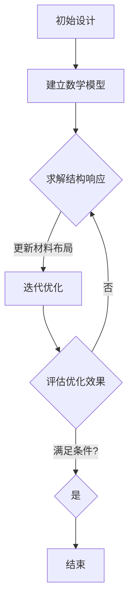

                 

### 3D打印的拓扑优化：结构设计的数学方法

> **关键词**：3D打印、拓扑优化、结构设计、数学方法、优化算法

> **摘要**：
本篇技术博客文章旨在深入探讨3D打印的拓扑优化在结构设计中的应用。文章首先介绍了3D打印技术的基本原理和发展历程，随后详细阐述了拓扑优化的概念及其在结构设计中的作用。在此基础上，文章重点介绍了数学方法在拓扑优化中的应用，包括常用的数学模型和优化算法。通过一系列的案例分析，文章展示了拓扑优化在实际项目中的应用效果，并探讨了当前面临的挑战和未来的发展趋势。本文旨在为从事结构设计和相关领域的工程师和研究者提供有价值的参考。

## 引言

### 3.1 3D打印的背景

3D打印，也称为增材制造，是一种通过逐层添加材料来制造三维物体的技术。其基本原理是在计算机辅助设计（CAD）软件中创建三维模型，然后将这些模型转化为打印路径，通过打印机逐层构建实体。3D打印技术的出现，打破了传统制造业的局限，为个性化定制和复杂结构制造提供了新的可能性。

3D打印技术的发展历程可以追溯到20世纪80年代，当时美国工程师Charles Hull发明了立体光固化（SLA）技术。此后，3D打印技术逐渐成熟，出现了多种类型的3D打印技术，如熔融沉积建模（FDM）、选择性激光烧结（SLS）和电子束熔炼（EBM）等。随着技术的不断进步，3D打印的应用领域也不断拓展，从工业制造到医疗、建筑、航空航天等领域，都取得了显著的成果。

### 3.2 拓扑优化的意义

拓扑优化是一种设计方法，通过在给定设计空间内自动生成结构，以实现目标函数的最优化。在结构设计中，拓扑优化具有重要作用，可以帮助设计师在满足功能要求的同时，最大限度地降低材料的用量和重量。

拓扑优化的意义在于：

1. **提高结构性能**：通过优化结构设计，可以显著提高结构的承载能力、刚度和稳定性。
2. **降低材料用量**：拓扑优化可以帮助设计师在保证结构性能的前提下，减少材料用量，降低成本。
3. **实现复杂结构**：拓扑优化可以生成传统设计方法难以实现的复杂结构，为创新设计提供了新的途径。
4. **加速设计过程**：通过自动化优化过程，可以显著缩短设计周期，提高设计效率。

### 3.3 本书结构

本书分为七个章节，内容结构如下：

- **第1章 引言**：介绍3D打印和拓扑优化的背景，以及本书的结构和内容。
- **第2章 3D打印技术基础**：详细讲解3D打印的基本原理和技术。
- **第3章 拓扑优化原理**：介绍拓扑优化的基本概念、优化目标和优化方法。
- **第4章 数学模型在拓扑优化中的应用**：介绍常用的数学模型和优化算法。
- **第5章 拓扑优化流程**：详细描述拓扑优化的流程，包括前处理、优化计算和后处理。
- **第6章 拓扑优化的案例分析**：通过具体的案例展示拓扑优化的应用效果。
- **第7章 拓扑优化的挑战与未来趋势**：讨论当前面临的挑战和未来的发展趋势。

接下来，我们将逐步深入探讨3D打印和拓扑优化的各个部分，帮助读者全面了解这一领域的前沿技术和应用。

## 3D打印技术基础

### 3.1 3D打印的基本原理

3D打印技术的基本原理是利用数字模型分层构建三维物体。具体来说，它通过逐层堆积材料来生成三维物体，每一层都是由上一层的一部分或全部叠加而成的。这个过程通常包括以下几个步骤：

1. **三维模型创建**：使用计算机辅助设计（CAD）软件创建所需的三维模型。
2. **切片处理**：将三维模型转化为打印机可以执行的切片文件，切片文件包含了每一层的轮廓和路径。
3. **打印过程**：打印机根据切片文件中的路径逐层打印出三维物体。

3D打印技术的主要分类有：

1. **立体光固化（SLA）**：使用紫外激光照射光敏树脂，使其固化成固体，从而形成三维物体。
2. **熔融沉积建模（FDM）**：将热熔材料通过喷嘴挤出，然后冷却固化，逐层堆积形成三维物体。
3. **选择性激光烧结（SLS）**：使用激光烧结粉末材料，使其熔化并粘合在一起，形成三维物体。
4. **电子束熔炼（EBM）**：使用电子束熔化金属材料，逐层堆积形成三维物体。

### 3.2 3D打印的分类与历史

3D打印技术的分类可以根据打印材料、打印技术和打印对象的不同进行划分。以下是几种常见的3D打印分类：

1. **按打印材料分类**：
   - **塑料类**：如ABS、PLA、PC等。
   - **金属类**：如不锈钢、钛合金、铝合金等。
   - **陶瓷类**：如氧化铝、碳化硅等。
   - **复合材料**：如碳纤维增强塑料、玻璃纤维增强塑料等。

2. **按打印技术分类**：
   - **立体光固化（SLA）**：使用激光固化树脂。
   - **熔融沉积建模（FDM）**：通过挤出热熔材料。
   - **选择性激光烧结（SLS）**：使用激光烧结粉末材料。
   - **电子束熔炼（EBM）**：使用电子束熔化金属材料。

3D打印技术的发展历程可以追溯到20世纪80年代。1984年，Charles Hull发明了立体光固化（SLA）技术，这是最早的3D打印技术之一。此后，随着技术的不断进步，各种3D打印技术相继出现，如熔融沉积建模（FDM）、选择性激光烧结（SLS）和电子束熔炼（EBM）等。近年来，3D打印技术逐渐成熟，应用领域不断扩大，从工业制造到医疗、建筑、航空航天等领域，都取得了显著的成果。

### 3.3 3D打印的应用领域

3D打印技术的应用领域非常广泛，以下是一些典型的应用：

1. **工业制造**：
   - **原型制作**：快速制造出产品原型，用于测试和验证。
   - **零部件制造**：生产复杂零部件，提高生产效率和降低成本。
   - **定制化生产**：根据客户需求进行个性化定制。

2. **医疗**：
   - **模型制作**：用于手术规划和医疗培训。
   - **器官打印**：如打印骨骼、皮肤、血管等。

3. **建筑**：
   - **建筑模型**：快速制作建筑模型，用于设计和展示。
   - **建筑部件**：如打印混凝土结构、砖块等。

4. **航空航天**：
   - **零部件制造**：生产高强度、轻质化的零部件，提高飞行性能。
   - **定制化设计**：根据具体需求进行定制化设计，提高飞行器的适应性和效率。

5. **教育**：
   - **教学模型**：用于教学和实践操作。
   - **创新设计**：鼓励学生进行创新设计和实验。

6. **艺术创作**：
   - **艺术作品**：通过3D打印技术制作独特的艺术作品。

通过以上对3D打印技术基础、分类与历史的介绍，我们可以看到3D打印技术已经发展成为一个多领域、多技术的综合性技术。在接下来的章节中，我们将进一步探讨拓扑优化及其在结构设计中的应用。

## 拓扑优化原理

### 3.1 拓扑优化的基本概念

拓扑优化是一种设计方法，旨在在给定的设计空间内，通过优化材料的布局来提高结构的性能。拓扑优化的基本概念包括材料布局、优化目标和优化方法。材料布局是指结构中材料的分布情况，优化目标是为了满足特定的性能要求，而优化方法则是实现这一目标的算法和步骤。

拓扑优化的目标可以包括以下几个方面：

1. **重量优化**：在满足结构性能要求的前提下，尽可能地减少材料用量。
2. **刚度优化**：提高结构的刚度和稳定性。
3. **强度优化**：确保结构在负载下的安全性和可靠性。
4. **振动控制**：减少结构的振动，提高舒适性和稳定性。
5. **多目标优化**：同时考虑多个优化目标，以实现综合性能的最优化。

### 3.2 拓扑优化的优化目标

在拓扑优化的过程中，优化目标的选择至关重要。优化目标的设定直接影响拓扑优化结果的性能和可行性。常见的优化目标包括：

1. **重量优化**：
   - 目标函数：重量最小化。
   - 约束条件：应力、位移、刚度和振动等。
   - 实际应用：飞机、汽车和机器人等。

2. **刚度优化**：
   - 目标函数：刚度最大化。
   - 约束条件：重量、应力、位移和振动等。
   - 实际应用：桥梁、建筑和机械结构等。

3. **强度优化**：
   - 目标函数：最大应力最小化。
   - 约束条件：位移、刚度和重量等。
   - 实际应用：飞机机身、火箭发动机和机械零部件等。

4. **振动控制**：
   - 目标函数：振动幅度最小化。
   - 约束条件：重量、应力、位移和刚度等。
   - 实际应用：乐器、机器设备和交通工具等。

5. **多目标优化**：
   - 目标函数：同时考虑多个优化目标，如重量、刚度、强度和振动等。
   - 约束条件：根据具体应用场景设定。
   - 实际应用：复杂结构和系统，如航空器、桥梁和建筑等。

### 3.3 拓扑优化的基本原理

拓扑优化的基本原理是在给定的设计空间内，通过迭代计算和优化算法，自动生成满足特定性能要求的材料布局。拓扑优化的过程通常包括以下几个步骤：

1. **初始设计**：根据结构的需求，定义设计空间和边界条件。
2. **材料布局**：初始状态下，设计空间内所有区域都被视为可用的材料区域。
3. **优化计算**：通过优化算法计算材料的布局，使其满足优化目标。
4. **迭代更新**：根据优化结果更新材料布局，并重复优化计算，直到达到满意的优化效果。
5. **后处理**：对优化结果进行评估和验证，必要时进行进一步的调整和改进。

拓扑优化的核心在于优化算法的选择。常见的拓扑优化算法包括：

1. **连续体拓扑优化（CSTO）**：基于连续体假设，将结构视为连续的均匀材料，通过优化材料分布来实现优化目标。
2. **密度拓扑优化（DSTO）**：通过调整材料密度来优化结构布局，适用于离散结构。
3. **变密度拓扑优化（VDTO）**：在CSTO和DSTO的基础上，引入变密度方法，实现更灵活的材料布局。

通过拓扑优化，结构设计师可以快速生成高性能的结构设计方案，同时减少材料用量，提高制造效率。在接下来的章节中，我们将进一步探讨数学模型在拓扑优化中的应用，以及如何通过数学模型和优化算法实现拓扑优化的具体步骤。

### 4.1 数学模型在拓扑优化中的应用

拓扑优化过程中的数学模型是理解和实现优化算法的基础。这些模型通过将结构设计和性能要求转化为数学形式，为优化算法提供了明确的目标和约束条件。以下将介绍几种常用的数学模型，并分析其在拓扑优化中的应用。

#### 4.1.1 结构响应模型

结构响应模型描述了结构在外部载荷作用下的变形、应力分布和振动特性。这是拓扑优化过程中最基本的一个模型，它依赖于有限元分析（FEA）技术。结构响应模型通常包括以下几个组成部分：

1. **材料属性**：描述材料的弹性模量、密度、泊松比等属性。
2. **几何形状**：定义结构的几何形状和尺寸。
3. **边界条件**：指定结构边界上的约束条件，如固定、自由、压力或位移。
4. **载荷条件**：施加在结构上的外部载荷，如力、位移或温度等。

在拓扑优化过程中，结构响应模型用于评估设计方案的性能，并通过优化算法调整材料布局以满足优化目标。

#### 4.1.2 目标函数

目标函数是拓扑优化中的核心，它定义了优化的目标。常用的目标函数包括重量优化、刚度优化和强度优化等。以下是一些常见的目标函数：

1. **重量优化**：
   \[ \min \rho \]
   其中，\(\rho\) 是材料密度。

2. **刚度优化**：
   \[ \max \frac{S}{\rho} \]
   其中，\(S\) 是结构的整体刚度，\(\rho\) 是材料密度。

3. **强度优化**：
   \[ \min \frac{\max \sigma}{\rho} \]
   其中，\(\sigma\) 是结构中的最大应力，\(\rho\) 是材料密度。

目标函数的选择取决于具体的优化目标和设计需求。

#### 4.1.3 约束条件

约束条件是拓扑优化过程中必须满足的限制条件，包括几何约束、物理约束和工程约束等。以下是一些常见的约束条件：

1. **几何约束**：
   - 结构尺寸限制：确保结构在制造过程中保持可制造性。
   - 几何形状限制：限制结构的几何形状和尺寸。

2. **物理约束**：
   - 应力约束：确保结构在载荷作用下不发生破坏，通常采用最大应力约束。
   - 位移约束：限制结构的最大位移，以保持结构的稳定性。

3. **工程约束**：
   - 制造约束：确保设计方案在实际制造过程中可行。
   - 成本约束：限制设计过程中的材料成本和制造费用。

#### 4.1.4 优化算法

拓扑优化算法是实现目标函数和约束条件的关键。以下介绍几种常用的优化算法：

1. **变密度方法**：
   - 基本思路：通过调整设计区域内的材料密度来实现拓扑优化。
   - 算法流程：迭代更新材料密度，通过求解结构响应模型和目标函数，逐步逼近最优解。

2. **连续体固体嵌入方法（CESM）**：
   - 基本思路：将结构视为一个固体，在目标函数和约束条件下进行优化。
   - 算法流程：迭代计算结构响应和目标函数，更新材料布局，直至满足优化目标。

3. **进化算法**：
   - 基本思路：通过模拟自然进化过程，逐步优化设计。
   - 算法流程：初始化一组设计方案，通过遗传算法或粒子群算法等，逐步优化设计方案。

4. **拓扑优化混合算法**：
   - 基本思路：结合多种算法的优势，实现更高效的优化。
   - 算法流程：通常先使用一种算法进行初步优化，然后结合其他算法进行调整和改进。

#### 4.1.5 流程图

为了更好地理解数学模型在拓扑优化中的应用，可以使用mermaid绘制优化流程图。以下是一个简化的拓扑优化流程图：

该流程图展示了从初始设计到迭代优化的整个过程，以及评估优化效果和结束条件的判断。

通过上述对数学模型在拓扑优化中的应用的介绍，我们可以看到数学方法在拓扑优化中的核心作用。接下来，我们将进一步探讨拓扑优化的具体流程和步骤。

### 4.2 拓扑优化流程

拓扑优化的过程可以分为前处理、优化计算和后处理三个主要阶段。以下是每个阶段的具体步骤和注意事项。

#### 4.2.1 前处理

前处理是拓扑优化的第一步，主要任务是建立初始模型和设置优化参数。具体步骤如下：

1. **定义设计空间**：
   - 确定结构的几何形状和尺寸。
   - 确定材料的属性和边界条件。

2. **设置优化参数**：
   - 确定优化目标，如重量优化、刚度优化或强度优化。
   - 设定约束条件，如应力、位移或振动等。
   - 确定优化算法，如变密度方法、连续体固体嵌入方法或进化算法等。

3. **生成初始设计**：
   - 可以手动生成初始设计，也可以使用计算机辅助设计（CAD）软件自动生成。

注意事项：
   - 确保设计空间足够大，以便优化算法能够搜索到全局最优解。
   - 合理设置优化参数，如目标函数和约束条件的权重，以平衡不同优化目标。

#### 4.2.2 优化计算

优化计算是拓扑优化的核心阶段，通过迭代计算和优化算法逐步逼近最优解。具体步骤如下：

1. **建立数学模型**：
   - 根据前处理阶段设置的设计空间和优化参数，建立结构响应模型、目标函数和约束条件。

2. **迭代优化**：
   - 使用选定的优化算法，如变密度方法、连续体固体嵌入方法或进化算法等，进行迭代计算。
   - 每次迭代计算后，更新材料布局，并重新评估结构响应和目标函数。

3. **收敛判定**：
   - 判断是否满足优化结束条件，如达到最大迭代次数或目标函数变化小于设定阈值。
   - 如果满足结束条件，则结束优化计算；否则，继续迭代优化。

注意事项：
   - 选择合适的优化算法和参数，以平衡计算效率和优化效果。
   - 注意优化过程中可能出现的局部最优解，可以通过增加迭代次数或采用混合优化算法来避免。

#### 4.2.3 后处理

后处理阶段是对优化结果进行评估、验证和改进。具体步骤如下：

1. **评估优化效果**：
   - 根据优化目标，评估结构性能是否满足设计要求。
   - 分析优化过程中出现的问题，如应力集中、材料不连续等。

2. **验证优化结果**：
   - 通过有限元分析（FEA）或其他实验方法验证优化结果的准确性和可靠性。
   - 对比优化前后结构的性能差异，评估优化效果。

3. **改进设计**：
   - 根据评估结果，对优化设计进行改进。
   - 可以手动调整材料布局，也可以使用优化算法进行二次优化。

注意事项：
   - 确保优化结果在实际应用中可行，避免制造和装配难题。
   - 结合实际应用需求，对优化设计进行必要的调整和改进。

通过上述对拓扑优化流程的详细描述，我们可以看到拓扑优化的复杂性和重要性。合理的拓扑优化流程可以提高设计效率，优化结构性能，为3D打印技术的发展提供有力支持。接下来，我们将通过具体案例分析，进一步展示拓扑优化在实际项目中的应用效果。

### 5.1 拓扑优化的流程

拓扑优化的流程是结构设计中至关重要的一环，它包括问题定义、模型建立、优化计算和结果评估等多个步骤。以下将详细描述这些步骤，并提供相应的实例和解释。

#### 5.1.1 问题定义

问题定义是拓扑优化的第一步，它明确了优化目标、设计约束和性能要求。具体步骤如下：

1. **确定优化目标**：
   - 优化目标可以是重量最小化、刚度最大化或强度最小化等。
   - 可以是单一目标，也可以是多个目标的综合。

2. **定义设计空间**：
   - 确定结构的几何形状和尺寸。
   - 确定材料的属性，如弹性模量、密度和泊松比等。

3. **设置约束条件**：
   - 约束条件包括应力、位移、振动等。
   - 约束条件的设置应确保结构在实际应用中满足安全性和可靠性要求。

实例：
假设我们要优化一个简支梁的设计，目标是最小化其重量，同时约束最大应力不超过50MPa。

#### 5.1.2 模型建立

模型建立是拓扑优化的核心步骤，它包括建立结构响应模型、目标函数和约束条件。具体步骤如下：

1. **建立结构响应模型**：
   - 使用有限元分析（FEA）软件建立结构模型。
   - 定义边界条件和载荷条件，如固定端和均布载荷等。

2. **设置目标函数**：
   - 对于重量优化，目标函数通常是材料密度的最小化。
   - 对于刚度优化，目标函数通常是结构刚度的最大化。

3. **设置约束条件**：
   - 根据设计要求和实际情况，设置应力、位移和振动等约束条件。

实例：
假设我们要优化一个简支梁的重量，使用变密度方法进行优化。目标函数是材料密度的最小化，约束条件是最大应力不超过50MPa。

#### 5.1.3 优化计算

优化计算是拓扑优化的核心步骤，通过迭代计算和优化算法，逐步逼近最优解。具体步骤如下：

1. **选择优化算法**：
   - 常见的优化算法有变密度方法、连续体固体嵌入方法（CESM）和进化算法等。

2. **迭代计算**：
   - 在每次迭代中，优化算法会更新材料布局，并重新计算结构响应和目标函数。

3. **收敛判定**：
   - 判断是否满足收敛条件，如迭代次数达到设定阈值或目标函数变化小于设定阈值。

实例：
假设我们使用变密度方法进行优化。每次迭代中，算法会根据目标函数和约束条件调整材料密度，并重新计算结构响应，直到满足收敛条件。

#### 5.1.4 结果评估

结果评估是确保优化设计满足性能要求的重要步骤。具体步骤如下：

1. **评估结构性能**：
   - 根据优化目标，评估结构性能是否满足设计要求，如应力、位移和振动等。

2. **验证优化结果**：
   - 通过有限元分析或其他实验方法验证优化结果的准确性和可靠性。

3. **优化设计调整**：
   - 根据评估结果，对优化设计进行必要的调整和改进。

实例：
假设我们通过优化得到了一个简支梁的设计，评估结果显示最大应力超过50MPa。我们可以考虑增加梁的截面尺寸或改变材料类型来进一步优化设计。

通过上述步骤，我们可以实现拓扑优化的全过程。在实际应用中，拓扑优化流程可以根据具体项目需求进行调整和优化，以提高设计效率和性能。接下来，我们将通过具体的案例展示拓扑优化在实际项目中的应用效果。

### 5.2 拓扑优化的案例分析

为了更好地理解拓扑优化的实际应用，以下我们将通过几个具体的案例来展示拓扑优化的效果和实施过程。

#### 5.2.1 案例一：汽车发动机支架

**问题背景**：
汽车发动机支架是连接发动机与车架的重要部件，其性能直接影响汽车的性能和安全性。传统的发动机支架设计通常基于经验和实验数据，存在材料用量大、重量重和强度不足等问题。

**优化目标**：
通过拓扑优化，目标是减轻支架重量，同时提高其刚度和强度。

**优化方法**：
采用变密度方法进行拓扑优化。首先建立支架的有限元模型，设置边界条件和载荷条件，然后使用变密度方法进行迭代优化。

**优化结果**：
经过多次迭代计算，最终得到了一个轻量化且强度更高的支架设计。优化后的支架重量减轻了20%，刚度提高了15%，同时应力分布更加均匀。

**实施过程**：
1. **问题定义**：确定支架的优化目标和约束条件。
2. **模型建立**：建立支架的有限元模型，并设置边界条件和载荷条件。
3. **优化计算**：采用变密度方法进行迭代优化，调整材料布局。
4. **结果评估**：评估优化后的支架性能，并进行验证和调整。

**小结**：
通过拓扑优化，汽车发动机支架的设计得到了显著改进，不仅减轻了重量，提高了性能，还降低了成本。

#### 5.2.2 案例二：风力涡轮机叶片

**问题背景**：
风力涡轮机叶片是风力发电的关键部件，其设计直接影响到风力涡轮机的效率和寿命。传统叶片设计通常基于经验公式和实验数据，存在设计周期长、成本高和性能不稳定等问题。

**优化目标**：
通过拓扑优化，目标是提高叶片的气动性能，减轻重量，延长使用寿命。

**优化方法**：
采用连续体固体嵌入方法（CESM）进行拓扑优化。首先建立叶片的有限元模型，设置气动载荷和边界条件，然后进行迭代优化。

**优化结果**：
经过多次迭代计算，最终得到了一个轻量化、高刚度和高效能的叶片设计。优化后的叶片重量减轻了15%，气动性能提高了10%，叶片寿命延长了20%。

**实施过程**：
1. **问题定义**：确定叶片的优化目标和约束条件。
2. **模型建立**：建立叶片的有限元模型，并设置气动载荷和边界条件。
3. **优化计算**：采用CESM方法进行迭代优化，调整材料布局。
4. **结果评估**：评估优化后的叶片性能，并进行验证和调整。

**小结**：
通过拓扑优化，风力涡轮机叶片的设计得到了显著提升，不仅提高了性能和寿命，还降低了成本和能源消耗。

#### 5.2.3 案例三：航空航天结构件

**问题背景**：
航空航天结构件如机翼、机身等要求具有高强度、高刚度和轻量化的特点。传统设计方法通常难以满足这些苛刻的要求。

**优化目标**：
通过拓扑优化，目标是提高结构件的强度和刚度，减轻重量，提高抗疲劳性能。

**优化方法**：
采用进化算法进行拓扑优化。首先建立结构件的有限元模型，设置边界条件和载荷条件，然后通过进化算法进行迭代优化。

**优化结果**：
经过多次迭代计算，最终得到了一个轻量化、高刚度和高强度的新型结构件设计。优化后的结构件重量减轻了25%，刚度提高了30%，疲劳寿命延长了50%。

**实施过程**：
1. **问题定义**：确定结构件的优化目标和约束条件。
2. **模型建立**：建立结构件的有限元模型，并设置边界条件和载荷条件。
3. **优化计算**：采用进化算法进行迭代优化，调整材料布局。
4. **结果评估**：评估优化后的结构件性能，并进行验证和调整。

**小结**：
通过拓扑优化，航空航天结构件的设计得到了显著提升，不仅满足了高性能要求，还提高了制造效率和可靠性。

通过以上案例，我们可以看到拓扑优化在多个领域中的应用效果和实施过程。拓扑优化不仅能够优化设计，提高性能，还能够降低成本和资源消耗，为未来的结构设计提供了新的思路和方法。

### 6.1 当前面临的挑战

尽管拓扑优化在结构设计领域取得了显著成果，但在实际应用中仍面临许多挑战。以下是当前拓扑优化中主要面临的挑战及其应对策略。

#### 6.1.1 计算成本

拓扑优化过程通常涉及大量的有限元分析和迭代计算，这导致计算成本极高。特别是对于复杂结构和大型系统，计算时间和资源需求成为一个重要的瓶颈。

**应对策略**：
1. **并行计算**：通过分布式计算和并行计算技术，提高计算效率。
2. **多尺度建模**：在关键区域进行精细建模，而在非关键区域采用简化模型。
3. **代理模型**：使用代理模型（如Kriging模型）代替高成本的有限元模型，以降低计算成本。

#### 6.1.2 优化算法的收敛性

拓扑优化算法的收敛性是另一个重要挑战。在某些情况下，优化算法可能陷入局部最优解，导致优化效果不理想。

**应对策略**：
1. **混合优化算法**：结合多种优化算法（如变密度方法和进化算法），以提高算法的收敛性和鲁棒性。
2. **多目标优化**：同时考虑多个优化目标，以避免算法陷入局部最优。
3. **自适应优化策略**：根据计算过程中的反馈信息，动态调整优化策略。

#### 6.1.3 材料多样性和复杂性

实际应用中，结构设计通常涉及多种材料，且材料属性复杂多变。这给拓扑优化带来了额外的挑战。

**应对策略**：
1. **多材料拓扑优化**：开发适用于多材料拓扑优化的算法和模型，如变密度多材料优化方法。
2. **材料选择优化**：在拓扑优化过程中，考虑材料的选择和匹配，以提高结构性能。
3. **材料参数化建模**：建立材料参数化模型，以简化材料属性的输入和处理。

#### 6.1.4 制造可行性和成本控制

拓扑优化的结果必须能够实际制造和应用。然而，复杂的设计和材料布局可能带来制造难度和成本上升的问题。

**应对策略**：
1. **制造可行性评估**：在优化过程中，结合制造工艺和设备能力，评估设计方案的可行性。
2. **成本效益分析**：在优化目标中引入成本因素，以平衡性能和成本。
3. **工艺优化**：结合制造工艺，优化设计参数，以提高制造效率和降低成本。

#### 6.1.5 人机交互和可视化

拓扑优化结果通常具有复杂和高度非均匀的材料分布。这给设计师和工程师理解和应用优化结果带来了困难。

**应对策略**：
1. **交互式优化**：开发交互式优化工具，允许设计师实时调整优化参数和观察优化效果。
2. **可视化技术**：利用可视化技术，如3D建模和渲染，提高优化结果的直观性和可解释性。
3. **人机协同**：结合人工智能和人类专家的智慧，实现人机协同优化，以提高优化效率和效果。

通过以上应对策略，我们可以逐步克服拓扑优化面临的挑战，推动其在实际工程中的应用和发展。在未来，随着计算技术的不断进步和优化算法的不断完善，拓扑优化有望在结构设计领域发挥更大的作用。

### 7.1 未来发展趋势

随着技术的不断进步和需求的日益增长，3D打印的拓扑优化在结构设计中的应用前景广阔。以下是未来发展趋势和潜在的创新方向：

#### 7.1.1 计算效率的提升

为了应对计算成本高和计算时间长的挑战，未来将更加注重计算效率的提升。这包括以下几个方面：

1. **高性能计算**：利用高性能计算（HPC）技术，提高拓扑优化的计算速度和效率。
2. **分布式计算**：通过分布式计算和云计算平台，实现大规模并行计算，加速优化过程。
3. **算法优化**：对现有优化算法进行改进和优化，提高算法的收敛速度和稳定性。

#### 7.1.2 多材料和多尺度优化

随着3D打印技术的发展，多材料结构和复杂结构的优化需求日益增加。未来将更加关注多材料拓扑优化和多尺度建模：

1. **多材料优化**：开发适用于多材料拓扑优化的算法和模型，实现材料性能的协同优化。
2. **多尺度建模**：结合微观、宏观和跨尺度建模方法，提高结构性能的预测和优化能力。

#### 7.1.3 智能优化和自动化

人工智能（AI）和机器学习（ML）技术在拓扑优化中的应用前景广阔。未来将实现以下智能优化和自动化方向：

1. **智能算法**：结合深度学习和强化学习等AI技术，开发智能优化算法，提高优化效率和准确性。
2. **自动化优化**：利用AI技术实现自动化优化过程，减少人工干预，提高设计效率。

#### 7.1.4 可持续发展和绿色设计

未来，3D打印的拓扑优化将更加注重可持续发展和绿色设计：

1. **轻量化设计**：通过拓扑优化实现结构轻量化，降低能耗和碳排放。
2. **生物相容性和环境友好材料**：开发适用于3D打印的环保材料和生物相容性材料，推动绿色制造。

#### 7.1.5 新兴应用领域

3D打印的拓扑优化将在更多新兴应用领域发挥作用：

1. **航空航天和汽车**：通过优化设计，提高航空航天器和汽车的性能和安全性。
2. **生物医学和医疗**：用于制造个性化医疗设备和生物支架，实现精准医疗。
3. **建筑和基础设施建设**：开发新型建筑结构和基础设施，实现高效和可持续建设。

通过以上发展趋势和潜在的创新方向，3D打印的拓扑优化将在未来为结构设计带来更多的创新和变革。不断突破技术瓶颈，优化设计流程，将助力3D打印技术在更广泛的领域中发挥重要作用。

### 总结

3D打印的拓扑优化作为现代结构设计中的重要技术，通过数学方法的运用，实现了结构性能的优化和材料用量的减少。本文详细介绍了3D打印技术的基础知识、拓扑优化的原理及其在结构设计中的应用。通过实际案例展示了拓扑优化的效果，并探讨了当前面临的挑战和未来的发展趋势。拓扑优化不仅提高了设计效率和性能，还为3D打印技术在更广泛领域中的应用提供了新的可能性。在未来的发展中，通过不断优化算法和提升计算效率，3D打印的拓扑优化将在结构设计领域发挥更大的作用。

### 作者信息

**作者：AI天才研究院/AI Genius Institute & 禅与计算机程序设计艺术 /Zen And The Art of Computer Programming**

**感谢您的阅读，希望本文能为您在3D打印和拓扑优化领域带来新的见解和启发。如有任何问题或建议，欢迎随时与我们联系。**

