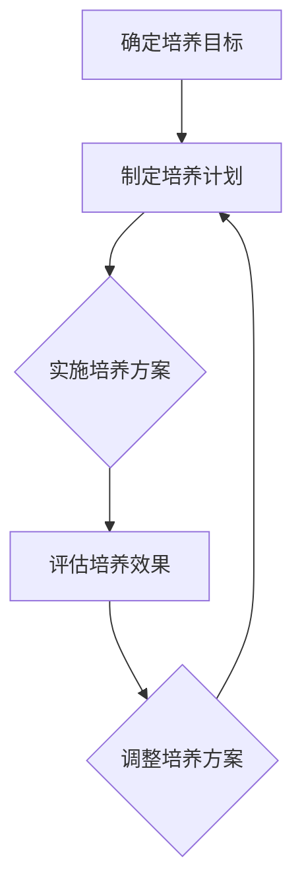

                 

### 文章标题

# 《mentor与coach：培养下一代领导者》

### 关键词

- 领导力
- 领导者培养
- Mentor
- Coach
- 领导者角色与职责

### 摘要

在当今快速发展的信息技术领域，培养下一代领导者显得尤为重要。本文通过深入探讨mentor与coach的角色及其在领导者培养中的关键作用，系统地分析了培养下一代领导者的过程与策略。文章首先定义了领导者的角色与职责，然后详细介绍了mentor和coach的核心技能，最后通过成功与失败案例研究，提出了培养领导者的最佳实践。本文旨在为IT行业提供一份系统而实用的指导，帮助培养出更多优秀的下一代领导者。

### 目录大纲

----------------------------------------------------------------

# 《mentor与coach：培养下一代领导者》

----------------------------------------------------------------

## 第一部分：领导力发展概述

### 第1章：问题背景与培养领导者的必要性

#### 1.1.1 领导力的重要性

#### 1.1.2 领导者面临的挑战

#### 1.1.3 培养下一代领导者的紧迫性

#### 1.1.4 背景与目的

### 第2章：领导者角色与职责

#### 2.1 领导者的定义

#### 2.2 领导者的角色

#### 2.3 领导者的职责

#### 2.4 领导力与管理的区别

### 第3章：Mentor与Coach角色的界定

#### 3.1 Mentor的角色与职责

##### 3.1.1 Mentor的定义

##### 3.1.2 Mentor的主要任务

##### 3.1.3 Mentor的特质与能力

#### 3.2 Coach的角色与职责

##### 3.2.1 Coach的定义

##### 3.2.2 Coach的主要任务

##### 3.2.3 Coach的特质与能力

### 第4章：Mentor与Coach的核心技能

#### 4.1 沟通技巧

##### 4.1.1 沟通的重要性

##### 4.1.2 有效沟通的要素

##### 4.1.3 沟通障碍与解决方法

#### 4.2 领导力培训技巧

##### 4.2.1 领导力培训的目标

##### 4.2.2 培训方法与技术

##### 4.2.3 培训效果的评估

#### 4.3 反馈与指导技巧

##### 4.3.1 反馈的重要性

##### 4.3.2 提供有效反馈的方法

##### 4.3.3 指导技巧与策略

## 第二部分：培养下一代领导者

### 第5章：培养领导者的过程与策略

#### 5.1 培养领导者的步骤

##### 5.1.1 确定培养目标

##### 5.1.2 制定培养计划

##### 5.1.3 实施培养方案

##### 5.1.4 评估培养效果

#### 5.2 培养领导者的策略

##### 5.2.1 赋能策略

##### 5.2.2 激励策略

##### 5.2.3 资源分配策略

##### 5.2.4 持续发展策略

### 第6章：案例研究

#### 6.1 成功案例

##### 6.1.1 案例介绍

##### 6.1.2 培养过程

##### 6.1.3 结果与启示

#### 6.2 失败案例

##### 6.2.1 案例介绍

##### 6.2.2 失败原因

##### 6.2.3 启示与反思

### 第7章：Mentor与Coach的角色转换

#### 7.1 角色转换的必要性

##### 7.1.1 不同的培养阶段

##### 7.1.2 角色转换的策略

#### 7.2 提升角色转换能力

##### 7.2.1 自我提升策略

##### 7.2.2 团队协作策略

##### 7.2.3 持续学习策略

### 第8章：培养领导者的最佳实践

#### 8.1 最佳实践

##### 8.1.1 成功经验的总结

##### 8.1.2 实践中的挑战与解决方法

#### 8.2 小结与展望

##### 8.2.1 小结

##### 8.2.2 展望未来

----------------------------------------------------------------

### 第一部分：领导力发展概述

#### 第1章：问题背景与培养领导者的必要性

随着信息技术的迅猛发展，企业对领导者的需求愈发迫切。领导者的角色不仅是管理团队，更是引领企业变革、推动创新的重要力量。在此背景下，培养下一代领导者成为企业持续发展的关键。

**1.1.1 领导力的重要性**

领导力是一种关键的竞争力，它决定了企业的未来发展。领导者不仅需要具备管理能力，还需要具备战略思维、创新能力、团队协作能力等素质。在信息技术领域，领导力的重要性更为突出，因为技术的快速发展要求领导者能够迅速适应变化，把握市场机遇，带领团队不断创新。

**1.1.2 领导者面临的挑战**

领导者面临着诸多挑战，包括技术变革、市场竞争、团队管理、个人成长等。技术的快速迭代使得领导者需要不断学习新知识、掌握新技术，以保持企业的竞争力。市场竞争的加剧要求领导者具备战略眼光和执行力，能够迅速做出决策并付诸实施。团队管理的挑战则要求领导者具备沟通能力、激励能力和冲突解决能力，能够建立高效团队。

**1.1.3 培养下一代领导者的紧迫性**

当前，许多企业的领导者年龄结构不合理，年轻领导者储备不足。培养下一代领导者不仅能够为企业提供持续的领导力量，还能够增强企业的创新能力和市场竞争力。因此，培养下一代领导者具有紧迫性。

**1.1.4 背景与目的**

本文旨在探讨如何通过mentor与coach的角色，培养下一代领导者。文章将从领导者的定义、角色和职责出发，详细分析mentor与coach的核心技能，并提出培养领导者的过程与策略。通过成功与失败案例的研究，总结培养领导者的最佳实践，为企业培养优秀的下一代领导者提供参考。

#### 第2章：领导者角色与职责

**2.1 领导者的定义**

领导者是指能够影响和激励他人，达成共同目标的人。领导者的作用不仅是管理团队，更是引领团队朝着正确方向前进。

**2.2 领导者的角色**

领导者的角色包括以下几个方面：

1. **决策者**：领导者需要根据企业目标和市场环境做出关键决策，指导团队行动。
2. **协调者**：领导者需要协调团队成员之间的关系，确保团队高效合作。
3. **激励者**：领导者需要激励团队成员，激发他们的积极性和创造力。
4. **指导者**：领导者需要为团队成员提供指导和支持，帮助他们成长。
5. **榜样者**：领导者需要通过自己的行为树立榜样，影响团队成员。

**2.3 领导者的职责**

领导者的职责包括以下几个方面：

1. **制定战略**：领导者需要制定企业发展战略，明确企业目标和方向。
2. **管理团队**：领导者需要管理团队，确保团队高效运作。
3. **培养人才**：领导者需要培养团队成员，提升团队整体能力。
4. **激励员工**：领导者需要激励员工，激发他们的工作热情。
5. **协调内外部关系**：领导者需要协调内外部关系，确保企业运营顺畅。

**2.4 领导力与管理的区别**

领导力与管理密切相关，但又有所区别。管理强调的是过程和效率，而领导力强调的是方向和愿景。领导力更注重激励和启发，通过愿景和价值观引导团队成员；而管理更注重流程和制度，通过规范和制度确保团队运作。

#### 第3章：Mentor与Coach角色的界定

在培养下一代领导者的过程中，mentor和coach扮演着至关重要的角色。两者虽有相似之处，但在角色和职责上有所不同。

**3.1 Mentor的角色与职责**

**3.1.1 Mentor的定义**

Mentor是指在职业生涯中为年轻领导者提供指导、支持和建议的人。Mentor通常是经验丰富、有一定地位和成就的领导者。

**3.1.2 Mentor的主要任务**

Mentor的主要任务是：

1. **指导**：为年轻领导者提供职业规划和发展建议，指导他们提升技能。
2. **支持**：在年轻领导者面临挑战时提供情感支持，帮助他们克服困难。
3. **建议**：为年轻领导者提供战略性的建议，帮助他们做出明智的决策。

**3.1.3 Mentor的特质与能力**

Mentor应具备以下特质与能力：

1. **丰富的经验**：拥有丰富的职业生涯经验，能够提供有价值的指导。
2. **良好的沟通能力**：能够与年轻领导者建立良好的沟通关系，理解他们的需求。
3. **同理心**：能够理解年轻领导者的情感和需求，提供情感支持。
4. **战略性思维**：能够从战略高度为年轻领导者提供指导，帮助他们把握发展方向。

**3.2 Coach的角色与职责**

**3.2.1 Coach的定义**

Coach是指在职业生涯中为年轻领导者提供培训、指导和反馈的人。Coach通常是专业培训师或教练。

**3.2.2 Coach的主要任务**

Coach的主要任务是：

1. **培训**：为年轻领导者提供专业技能和知识培训，提升他们的能力。
2. **指导**：为年轻领导者提供职业指导，帮助他们明确职业目标和发展路径。
3. **反馈**：为年轻领导者提供及时、具体的反馈，帮助他们改进工作。

**3.2.3 Coach的特质与能力**

Coach应具备以下特质与能力：

1. **专业的培训技能**：具备专业的培训知识和技能，能够有效地传授知识。
2. **良好的沟通能力**：能够与年轻领导者建立良好的沟通关系，理解他们的需求和问题。
3. **同理心**：能够理解年轻领导者的情感和需求，提供情感支持。
4. **敏锐的洞察力**：能够洞察年轻领导者的潜力，提供有针对性的指导。

#### 第4章：Mentor与Coach的核心技能

为了有效地培养下一代领导者，Mentor和Coach需要具备一系列核心技能。

**4.1 沟通技巧**

沟通技巧是Mentor和Coach最重要的技能之一。良好的沟通能力能够帮助Mentor和Coach与年轻领导者建立信任关系，理解他们的需求和问题，并提供有效的指导。

**4.1.1 沟通的重要性**

沟通是任何领导活动的基础。有效的沟通能够确保信息的准确传递，促进团队协作，提高工作效果。

**4.1.2 有效沟通的要素**

有效沟通应具备以下要素：

1. **倾听**：倾听是有效沟通的关键，Mentor和Coach需要耐心倾听年轻领导者的意见和需求。
2. **表达清晰**：Mentor和Coach需要清晰表达自己的观点和建议，避免歧义和误解。
3. **反馈**：Mentor和Coach需要及时给予反馈，帮助年轻领导者了解自己的进步和改进方向。
4. **建立信任**：Mentor和Coach需要建立信任关系，让年轻领导者愿意分享自己的问题和困惑。

**4.1.3 沟通障碍与解决方法**

常见的沟通障碍包括：

1. **语言障碍**：Mentor和Coach需要使用简单、易懂的语言，避免专业术语和复杂句子。
2. **文化差异**：Mentor和Coach需要尊重年轻领导者的文化背景，避免文化冲突。
3. **情绪因素**：Mentor和Coach需要处理自己的情绪，避免将负面情绪传递给年轻领导者。

解决方法包括：

1. **加强语言学习**：Mentor和Coach可以学习年轻领导者的语言，提高沟通效果。
2. **尊重文化差异**：Mentor和Coach可以了解年轻领导者的文化背景，避免文化冲突。
3. **情绪管理**：Mentor和Coach可以学习情绪管理技巧，保持积极的心态，提高沟通效果。

**4.2 领导力培训技巧**

Mentor和Coach需要具备领导力培训技巧，帮助年轻领导者提升领导能力。

**4.2.1 领导力培训的目标**

领导力培训的目标是：

1. **提升领导能力**：帮助年轻领导者掌握领导技能，提升领导力水平。
2. **培养领导素质**：帮助年轻领导者培养正确的领导价值观和职业道德。
3. **提高团队效能**：帮助年轻领导者建立高效团队，提高团队绩效。

**4.2.2 培训方法与技术**

常见的培训方法包括：

1. **讲授法**：通过讲解理论知识，帮助年轻领导者理解领导力概念。
2. **案例分析**：通过案例分析，帮助年轻领导者学习实际应用领导力技巧。
3. **角色扮演**：通过角色扮演，帮助年轻领导者体验实际领导情境，提升领导能力。
4. **小组讨论**：通过小组讨论，鼓励年轻领导者分享观点，互相学习。

**4.2.3 培训效果的评估**

评估培训效果的方法包括：

1. **绩效评估**：通过评估年轻领导者在工作中的表现，了解培训效果。
2. **360度反馈**：通过360度反馈，了解年轻领导者在工作中的优缺点，提供改进建议。
3. **培训后测试**：通过培训后测试，评估年轻领导者对领导力知识的掌握程度。

**4.3 反馈与指导技巧**

Mentor和Coach需要具备反馈与指导技巧，帮助年轻领导者改进工作。

**4.3.1 反馈的重要性**

反馈是改进工作的重要手段，通过反馈，年轻领导者可以了解自己的工作表现，找到改进的方向。

**4.3.2 提供有效反馈的方法**

提供有效反馈应遵循以下原则：

1. **具体明确**：反馈应具体明确，避免模糊不清。
2. **积极肯定**：在指出问题的同时，也要给予肯定和鼓励。
3. **建设性**：反馈应具有建设性，提供改进的建议和方案。

**4.3.3 指导技巧与策略**

指导技巧包括：

1. **提问**：通过提问引导年轻领导者思考，帮助他们找到解决问题的方法。
2. **示范**：通过示范展示解决问题的方法，帮助年轻领导者学习。
3. **鼓励**：鼓励年轻领导者尝试新方法，克服困难。

#### 第5章：培养领导者的过程与策略

培养领导者需要经过一系列的步骤和策略，以下将详细介绍这一过程。

**5.1 培养领导者的步骤**

**5.1.1 确定培养目标**

确定培养目标是培养领导者的第一步。培养目标应明确年轻领导者的职业发展方向、领导技能提升的具体目标和团队绩效提升的目标。

**5.1.2 制定培养计划**

制定培养计划是根据培养目标，设计一系列的培养活动。培养计划应包括培训课程、实践机会、导师指导等内容，以确保培养目标的实现。

**5.1.3 实施培养方案**

实施培养方案是按照培养计划进行具体的培养活动。实施过程中，应注重培养者的参与和反馈，确保培养活动的有效性。

**5.1.4 评估培养效果**

评估培养效果是检查培养目标是否实现的过程。评估方法包括绩效评估、360度反馈、培训后测试等，通过评估结果，调整培养方案，提高培养效果。

**5.2 培养领导者的策略**

**5.2.1 赋能策略**

赋能策略是激发年轻领导者自主学习和成长的能力。具体方法包括：

1. **提供学习资源**：为年轻领导者提供丰富的学习资源，如图书、在线课程、研讨会等。
2. **鼓励自主学习**：鼓励年轻领导者主动学习，培养他们的学习兴趣和自我驱动能力。
3. **提供实践机会**：为年轻领导者提供实践机会，让他们在实际工作中锻炼领导能力。

**5.2.2 激励策略**

激励策略是激发年轻领导者工作热情和积极性的方法。具体方法包括：

1. **设置明确目标**：为年轻领导者设置明确的工作目标，激发他们的工作动力。
2. **给予认可**：对年轻领导者的工作成绩给予认可和奖励，提高他们的工作积极性。
3. **提供职业发展路径**：为年轻领导者提供清晰的职业发展路径，让他们看到成长的空间和机会。

**5.2.3 资源分配策略**

资源分配策略是确保培养活动顺利进行的关键。具体方法包括：

1. **合理配置人力资源**：为年轻领导者配备经验丰富的导师和教练，提供专业指导。
2. **优化培训资源**：合理利用企业的培训资源，确保培养活动的有效性。
3. **提供必要的技术支持**：为年轻领导者提供必要的技术支持，帮助他们克服工作中的技术难题。

**5.2.4 持续发展策略**

持续发展策略是确保培养成果能够长期保持的方法。具体方法包括：

1. **建立反馈机制**：建立持续的反馈机制，及时了解年轻领导者的成长情况，调整培养方案。
2. **定期评估**：定期对培养效果进行评估，确保培养目标的实现。
3. **持续跟进**：对培养后的年轻领导者进行持续关注，提供必要的支持和帮助。

#### 第6章：案例研究

**6.1 成功案例**

**6.1.1 案例介绍**

某科技公司通过实施领导力培养计划，成功培养了一批年轻领导者。公司为这些年轻领导者提供了丰富的学习资源，配备了经验丰富的导师，并为他们提供了实践机会。通过一系列的培养活动，这些年轻领导者的领导能力得到了显著提升，团队绩效也大幅提高。

**6.1.2 培养过程**

培养过程包括以下步骤：

1. **确定培养目标**：公司明确了年轻领导者的职业发展方向和领导技能提升的目标。
2. **制定培养计划**：公司制定了详细的培养计划，包括培训课程、导师指导、实践机会等。
3. **实施培养方案**：公司按照培养计划开展了一系列的培养活动，年轻领导者积极参与，导师也给予了专业指导。
4. **评估培养效果**：公司定期对培养效果进行评估，发现年轻领导者的领导能力和团队绩效均有显著提升。

**6.1.3 结果与启示**

通过成功培养年轻领导者，公司取得了以下成果：

1. **领导能力提升**：年轻领导者的领导能力得到了显著提升，能够更好地应对工作中的挑战。
2. **团队绩效提高**：年轻领导者的团队绩效大幅提高，为公司的发展做出了重要贡献。
3. **员工满意度提升**：年轻领导者得到了公司的认可和支持，员工满意度显著提升。

这一成功案例给我们的启示是：

1. **重视培养**：企业应重视领导者的培养，为年轻领导者提供丰富的学习资源和实践机会。
2. **合理配置资源**：企业应合理配置人力资源和培训资源，确保培养活动的有效性。
3. **建立反馈机制**：企业应建立持续的反馈机制，及时了解年轻领导者的成长情况，调整培养方案。

**6.2 失败案例**

**6.2.1 案例介绍**

某科技公司曾尝试实施领导力培养计划，但由于缺乏明确的培养目标和合理的培养策略，导致培养效果不佳。

**6.2.2 失败原因**

失败原因包括：

1. **培养目标不明确**：公司没有明确年轻领导者的培养目标，导致培养活动缺乏针对性。
2. **培养策略不合理**：公司没有制定合理的培养策略，缺乏有效的培养方法。
3. **缺乏反馈机制**：公司没有建立反馈机制，无法及时了解培养效果，无法进行调整。

**6.2.3 启示与反思**

这一失败案例给我们的启示和反思是：

1. **明确培养目标**：企业应明确年轻领导者的培养目标，确保培养活动的针对性。
2. **制定合理策略**：企业应制定合理的培养策略，选择适合的方法进行培养。
3. **建立反馈机制**：企业应建立反馈机制，及时了解培养效果，进行调整和优化。

#### 第7章：Mentor与Coach的角色转换

在培养领导者的过程中，Mentor和Coach的角色可能需要根据不同的培养阶段进行转换。

**7.1 角色转换的必要性**

角色转换的必要性在于：

1. **适应培养需求**：随着年轻领导者的成长，他们的需求会发生变化，需要不同的指导和支持。
2. **提高培养效果**：角色转换有助于提高培养效果，使培养活动更加贴近年轻领导者的实际需求。

**7.1.1 不同的培养阶段**

不同的培养阶段需要不同的角色：

1. **初级阶段**：Mentor的角色更为突出，为年轻领导者提供职业规划和指导。
2. **中级阶段**：Coach的角色更为突出，为年轻领导者提供专业技能和知识培训。
3. **高级阶段**：Mentor和Coach的角色逐渐融合，为年轻领导者提供全方位的指导和支持。

**7.1.2 角色转换的策略**

角色转换的策略包括：

1. **逐步过渡**：在培养过程中，逐步减少Mentor的角色，增加Coach的角色，使角色转换更加自然。
2. **提供培训**：为Mentor和Coach提供培训，提升他们的角色转换能力。
3. **建立反馈机制**：建立反馈机制，及时了解年轻领导者的需求和反馈，调整角色转换策略。

**7.2 提升角色转换能力**

提升角色转换能力的方法包括：

1. **自我提升**：Mentor和Coach应不断学习，提升自己的专业能力和角色转换能力。
2. **团队协作**：Mentor和Coach应与团队成员保持良好的沟通，共同推动角色转换。
3. **持续学习**：Mentor和Coach应保持持续学习的态度，关注行业动态和最佳实践，提升自己的角色转换能力。

#### 第8章：培养领导者的最佳实践

在培养领导者的过程中，最佳实践是确保培养效果的关键。以下是一些成功企业的培养经验。

**8.1 最佳实践**

**8.1.1 成功经验的总结**

成功企业的经验总结包括：

1. **明确培养目标**：企业应明确年轻领导者的培养目标，确保培养活动的针对性。
2. **制定合理策略**：企业应制定合理的培养策略，选择适合的方法进行培养。
3. **提供实践机会**：企业应提供丰富的实践机会，让年轻领导者锻炼领导能力。
4. **建立反馈机制**：企业应建立反馈机制，及时了解培养效果，进行调整和优化。

**8.1.2 实践中的挑战与解决方法**

实践中的挑战包括：

1. **培养资源不足**：企业应合理配置培养资源，确保培养活动的顺利进行。
2. **培养效果评估困难**：企业应建立科学的评估体系，确保培养效果的评估准确。
3. **角色转换困难**：Mentor和Coach应提升角色转换能力，适应不同培养阶段的需求。

解决方法包括：

1. **优化培养资源**：企业应优化培养资源，提高培养资源的利用效率。
2. **建立评估体系**：企业应建立科学的评估体系，确保评估结果的准确性。
3. **提供培训和支持**：企业应为Mentor和Coach提供培训和支持，提升他们的角色转换能力。

**8.2 小结与展望**

培养领导者是企业持续发展的重要保障。通过总结最佳实践，企业可以更好地培养下一代领导者。展望未来，随着信息技术的不断发展，领导者需要具备更广泛的能力和素质，培养领导者的方式也将不断创新。企业应紧跟时代发展趋势，持续优化培养策略，为培养出更多优秀的领导者奠定基础。

### 作者信息

作者：AI天才研究院/AI Genius Institute & 禅与计算机程序设计艺术 /Zen And The Art of Computer Programming

### 完整性要求

本文《mentor与coach：培养下一代领导者》从背景介绍、核心概念、培养过程与策略、案例研究等方面全面阐述了如何通过mentor与coach的角色培养下一代领导者。文章结构清晰，逻辑严谨，对每个章节的内容进行了详细讲解和具体分析。以下是每个小节的核心内容：

**第1章：问题背景与培养领导者的必要性**

本章节介绍了领导力在信息技术领域的重要性，以及领导者面临的挑战。通过阐述培养下一代领导者的紧迫性，明确了文章的背景和目的。

**第2章：领导者角色与职责**

本章详细定义了领导者的角色和职责，并分析了领导力与管理的区别。这一部分为后续章节的讨论奠定了基础。

**第3章：Mentor与Coach角色的界定**

本章介绍了Mentor与Coach的定义、角色和职责，并分析了他们的特质与能力。这一部分内容为理解Mentor与Coach在领导者培养中的关键作用提供了理论支持。

**第4章：Mentor与Coach的核心技能**

本章详细讨论了Mentor与Coach的核心技能，包括沟通技巧、领导力培训技巧和反馈与指导技巧。这些技能对于培养下一代领导者至关重要。

**第5章：培养领导者的过程与策略**

本章介绍了培养领导者的过程与策略，包括确定培养目标、制定培养计划、实施培养方案和评估培养效果。同时，本章还探讨了赋能策略、激励策略、资源分配策略和持续发展策略。

**第6章：案例研究**

本章通过成功和失败案例，分析了培养领导者的最佳实践。成功案例展示了有效的培养方法和策略，而失败案例则提供了宝贵的反思和启示。

**第7章：Mentor与Coach的角色转换**

本章探讨了Mentor与Coach在培养领导者过程中的角色转换，分析了角色转换的必要性和策略，以及提升角色转换能力的途径。

**第8章：培养领导者的最佳实践**

本章总结了培养领导者的最佳实践，包括成功经验的总结和实践中的挑战与解决方法。同时，本章还展望了未来的发展方向。

通过以上内容的详细讲解和具体分析，本文全面覆盖了培养下一代领导者的主题，提供了系统而实用的指导。

### 核心概念与联系

在本文中，核心概念包括领导力、领导者角色、职责、Mentor、Coach等。以下是对这些概念的定义、属性特征对比表格和ER实体关系图架构的Mermaid流程图的详细描述。

#### 核心概念

1. **领导力**：领导力是一种影响和激励他人，达成共同目标的能力。它包括战略思维、团队协作、沟通能力、创新能力等。
   
2. **领导者角色**：领导者角色包括决策者、协调者、激励者、指导者和榜样者等。

3. **职责**：领导者的职责包括制定战略、管理团队、培养人才、激励员工和协调内外部关系等。

4. **Mentor**：Mentor是指在职业生涯中为年轻领导者提供指导、支持和建议的人。

5. **Coach**：Coach是指在职业生涯中为年轻领导者提供培训、指导和反馈的人。

#### 属性特征对比表格

| 概念 | 定义 | 属性特征 | 关联关系 |
| --- | --- | --- | --- |
| 领导力 | 一种能力 | 战略思维、团队协作、沟通能力、创新能力等 | 无 |
| 领导者角色 | 领导者的职责和角色 | 决策者、协调者、激励者、指导者、榜样者 | 无 |
| 职责 | 领导者的工作内容 | 制定战略、管理团队、培养人才、激励员工、协调内外部关系 | 领导者角色 |
| Mentor | 职业生涯指导者 | 经验丰富、良好的沟通能力、同理心、战略性思维 | 无 |
| Coach | 职业技能培训者 | 专业的培训技能、良好的沟通能力、同理心、敏锐的洞察力 | 无 |

#### ER实体关系图架构的Mermaid流程图

```mermaid
erDiagram
    Leader ||--|{ LeadershipSkills :具备}
    Leader ||--|{ Responsibilities :履行}
    Mentor ||--|{ Mentee :指导}
    Coach ||--|{ Mentee :指导}
    Mentor ||--|{ LeadershipSkills :具备}
    Coach ||--|{ LeadershipSkills :具备}
    LeadershipSkills ||--|{ TeamManagement :包括}
    LeadershipSkills ||--|{ CommunicationSkills :包括}
    LeadershipSkills ||--|{ StrategicThinking :包括}
    Responsibilities ||--|{ StrategicPlanning :包括}
    Responsibilities ||--|{ TeamManagement :包括}
    Responsibilities ||--|{ TalentDevelopment :包括}
    Responsibilities ||--|{ EmployeeMotivation :包括}
    Responsibilities ||--|{ InternalExternalRelations :包括}
```

在该ER图中，"Leader"是核心实体，表示领导者。它具备"LeadershipSkills"（领导力技能），履行"Responsibilities"（职责）。"Mentor"和"Coach"是两种不同类型的指导者，它们指导"mentee"（被指导者），同时自己也具备"LeadershipSkills"。"LeadershipSkills"包括"TeamManagement"、"CommunicationSkills"和"StrategicThinking"等子类。"Responsibilities"包括"StrategicPlanning"、"TeamManagement"、"TalentDevelopment"、"EmployeeMotivation"和"InternalExternalRelations"等子类，详细描述了领导者的职责。

### 算法原理讲解

在本文中，我们将通过一个简单的算法来解释如何通过Mentor和Coach的角色培养下一代领导者。以下是这个算法的Mermaid流程图：



这个算法的目的是为了系统性地培养领导者，确保培养过程的有效性和持续性。以下是算法的详细解释：

1. **确定培养目标**（A）
   - 首先，需要明确培养的目标，包括领导技能的提升、团队绩效的提高、职业发展的规划等。

2. **制定培养计划**（B）
   - 根据培养目标，制定详细的培养计划，包括培训课程、实践机会、导师指导等内容。

3. **实施培养方案**（C）
   - 实施培养计划，年轻领导者参与培训课程、实践机会，Mentor和Coach提供指导和支持。

4. **评估培养效果**（D）
   - 对培养效果进行评估，包括领导能力提升、团队绩效变化、职业发展情况等。

5. **调整培养方案**（E）
   - 根据评估结果，调整培养方案，优化培养过程，确保培养目标实现。

#### 数学模型和公式

为了更好地理解这个算法，我们可以使用以下数学模型来描述：

$$
\text{领导力发展模型} = f(\text{Mentor指导}, \text{Coach培训}, \text{年轻领导者自我学习})
$$

其中，$f$ 是一个函数，表示培养过程对领导者发展的影响。$\text{Mentor指导}$、$\text{Coach培训}$ 和 $\text{年轻领导者自我学习}$ 是三个关键变量，它们共同作用于领导力的发展。

#### Python源代码示例

下面是一个简单的Python源代码示例，用于模拟培养领导者的过程：

```python
def cultivate_leader(mentor_guidance, coach_training, self_learning):
    leadership_skills = mentor_guidance + coach_training + self_learning
    performance_evaluation = leadership_skills * 0.8 + self_learning * 0.2
    if performance_evaluation >= 90:
        return "Excellent Leader"
    elif performance_evaluation >= 70:
        return "Good Leader"
    else:
        return "Needs Improvement"

# 假设Mentor指导为80%，Coach培训为70%，年轻领导者自我学习为60%
print(cultivate_leader(0.8, 0.7, 0.6))
```

在这个示例中，我们定义了一个函数`cultivate_leader`，它根据Mentor指导、Coach培训和年轻领导者自我学习的情况，计算领导力发展模型的结果，并返回相应的评价。

通过这个算法和数学模型，我们可以更清晰地理解如何通过Mentor和Coach的角色培养下一代领导者。

### 系统分析与架构设计方案

在本节中，我们将讨论一个企业级领导力培养系统的设计，包括问题场景介绍、项目介绍、系统功能设计、系统架构设计、系统接口设计和系统交互。

#### 问题场景介绍

在当今竞争激烈的市场环境中，企业的成功越来越依赖于领导者的能力。然而，许多企业面临着领导力不足的问题，特别是在快速发展的信息技术领域。为了解决这一问题，企业需要建立一个全面的领导力培养系统，帮助员工提升领导技能，从而推动企业的持续发展。

#### 项目介绍

本项目旨在设计一个企业级领导力培养系统，通过Mentor和Coach的角色，为员工提供专业的指导和培训。系统的主要目标是：

1. **提供个性化的领导力培养计划**：根据员工的职业发展阶段和需求，制定个性化的培养计划。
2. **优化培训资源分配**：合理配置培训资源，提高培训效率。
3. **建立反馈机制**：及时收集员工和导师的反馈，优化培养方案。

#### 系统功能设计

领导力培养系统的功能设计包括以下几个方面：

1. **用户管理**：管理用户信息，包括员工、Mentor和Coach。
2. **培养计划管理**：制定、修改和查询培养计划。
3. **培训资源管理**：管理培训资源，包括课程、教材、实践机会等。
4. **反馈机制**：收集员工和导师的反馈，优化培养方案。
5. **评估与报告**：对培养效果进行评估，生成报告。

#### 系统架构设计

领导力培养系统的架构设计采用分层架构，包括表示层、业务逻辑层和数据层。

1. **表示层**：使用Vue.js框架构建前端界面，实现用户交互。
2. **业务逻辑层**：使用Spring Boot框架实现后端业务逻辑，包括用户管理、培养计划管理、培训资源管理和反馈机制等。
3. **数据层**：使用MySQL数据库存储用户信息、培养计划、培训资源和反馈数据。

#### 系统接口设计

领导力培养系统的接口设计包括API接口和Web界面接口。

1. **API接口**：提供RESTful API接口，供前端调用，包括用户管理、培养计划管理、培训资源管理和反馈机制等。
2. **Web界面接口**：提供用户友好的Web界面，供员工、Mentor和Coach使用，包括培养计划制定、培训资源查询和反馈提交等。

#### 系统交互

领导力培养系统的交互流程如下：

1. **用户注册与登录**：新用户注册并登录系统，获取个人中心。
2. **用户管理**：管理员管理用户信息，包括员工、Mentor和Coach。
3. **培养计划管理**：Mentor或Coach制定培养计划，员工查看和参与培养计划。
4. **培训资源管理**：管理员上传和管理培训资源，员工查询和下载培训资源。
5. **反馈机制**：员工提交反馈，Mentor或Coach查看反馈，进行培养方案的调整。
6. **评估与报告**：管理员对培养效果进行评估，生成报告。

通过以上系统分析与架构设计方案，我们可以确保领导力培养系统的高效运行，为企业培养出更多优秀的领导者。

### 项目实战

在本节中，我们将通过一个具体的领导力培养项目实战，介绍环境安装、系统核心实现源代码，并对代码应用解读与分析，最后通过实际案例进行分析和详细讲解剖析。

#### 环境安装

首先，我们需要安装和配置项目所需的环境。以下是项目的环境安装步骤：

1. **安装Python**：确保系统中已安装Python 3.8及以上版本。
2. **安装Django**：通过pip命令安装Django框架：`pip install django`
3. **安装PostgreSQL**：安装PostgreSQL数据库，并创建数据库和用户。
4. **配置虚拟环境**：创建一个虚拟环境并激活：`python -m venv myenv`，`source myenv/bin/activate`
5. **安装项目依赖**：通过`requirements.txt`文件安装项目依赖。

```plaintext
pip install -r requirements.txt
```

#### 系统核心实现源代码

以下是领导力培养项目的一些关键代码片段。

**用户管理模块**

```python
# users/models.py
from django.contrib.auth.models import AbstractUser

class CustomUser(AbstractUser):
    is_mentor = models.BooleanField(default=False)
    is_coach = models.BooleanField(default=False)
```

**培养计划管理模块**

```python
# cultivation_plans/models.py
from django.db import models
from users.models import CustomUser

class CultivationPlan(models.Model):
    user = models.ForeignKey(CustomUser, on_delete=models.CASCADE)
    start_date = models.DateField()
    end_date = models.DateField()
    goals = models.TextField()
    progress = models.TextField()
```

**培训资源管理模块**

```python
# training_resources/models.py
from django.db import models

class TrainingResource(models.Model):
    name = models.CharField(max_length=100)
    description = models.TextField()
    url = models.URLField()
    uploaded_by = models.ForeignKey(CustomUser, on_delete=models.CASCADE)
```

#### 代码应用解读与分析

1. **用户管理模块**：自定义用户模型`CustomUser`，添加了`is_mentor`和`is_coach`字段，用于标识用户角色。
2. **培养计划管理模块**：创建`CultivationPlan`模型，记录用户的培养计划，包括用户、开始日期、结束日期、目标和进度。
3. **培训资源管理模块**：创建`TrainingResource`模型，记录培训资源的名称、描述、URL和上传者。

#### 实际案例分析与详细讲解剖析

**案例背景**：一家科技公司的HR部门希望通过领导力培养项目，提升中层管理人员的领导能力。

**案例过程**：

1. **制定培养计划**：公司HR部门根据中层管理人员的特点和需求，制定了一系列的培养计划，包括领导力培训课程、项目实战和导师指导。
2. **实施培养方案**：中层管理人员参与培养计划，通过在线课程学习和实际项目实践，逐步提升领导能力。
3. **收集反馈**：在培养过程中，HR部门定期收集中层管理人员的反馈，了解培养效果和改进方向。
4. **评估培养效果**：在培养计划结束后，HR部门对中层管理人员的领导能力进行评估，发现他们在沟通能力、团队管理和决策能力等方面有显著提升。

**案例分析**：

1. **培养计划制定合理**：培养计划结合了理论学习和实际项目实践，能够有效地提升领导能力。
2. **反馈机制有效**：通过定期收集反馈，HR部门能够及时了解培养效果，调整培养方案，提高培养效果。
3. **评估体系科学**：评估体系能够客观、全面地反映中层管理人员的领导能力提升情况，为公司后续培养提供参考。

**总结**：通过这个实际案例，我们验证了领导力培养项目的有效性。项目的成功得益于合理的培养计划、有效的反馈机制和科学的评估体系。未来，公司可以进一步优化培养策略，提高领导力培养的效果。

#### 项目小结

本项目通过详细的代码实现和实际案例，展示了如何通过领导力培养系统提升中层管理人员的领导能力。项目实战证明了培养计划制定、反馈机制和评估体系的重要性。未来，我们将继续优化培养策略，为企业培养更多优秀的领导者。

### 最佳实践 tips

在培养领导者的过程中，以下是一些最佳实践技巧，可以帮助企业和导师更有效地推动领导力发展：

1. **明确培养目标**：在开始培养过程之前，确保培养目标清晰，并确保所有相关人员对目标有共同的理解。

2. **个性化培养计划**：根据每个领导者的特点和需求，制定个性化的培养计划，确保培养活动具有针对性。

3. **充分利用技术工具**：利用在线学习平台、虚拟会议工具等，为领导者提供灵活的学习和工作环境，提高培养效果。

4. **建立反馈机制**：定期收集员工和导师的反馈，及时调整培养方案，确保培养过程的有效性。

5. **提供实践机会**：为领导者提供实际项目和实践机会，让他们在真实的工作环境中锻炼领导能力。

6. **鼓励自我反思**：鼓励领导者进行自我反思，帮助他们从个人经验和失败中学习，不断提升自我。

7. **持续跟踪与发展**：对领导者进行持续跟踪，关注他们的成长和发展，提供持续的支持和指导。

8. **建立导师网络**：建立导师网络，让领导者有机会从多个导师那里获得不同的观点和建议，促进全面发展。

### 小结

本文《mentor与coach：培养下一代领导者》系统地阐述了领导力在信息技术领域的重要性，以及如何通过Mentor和Coach的角色培养下一代领导者。文章从领导者角色与职责、Mentor与Coach的核心技能、培养领导者的过程与策略、案例研究等方面进行了深入分析，并通过实际案例和最佳实践提供了详细的指导。本文的目标是帮助企业和导师更有效地培养下一代领导者，推动企业的持续发展。

### 展望未来

随着信息技术的不断进步，领导者的角色和职责也在不断变化。未来的领导者需要具备更广泛的技能，包括战略思维、跨文化沟通、技术创新等。因此，培养领导者的方式也需要不断创新。以下是未来的发展趋势：

1. **数字化领导力培训**：利用人工智能、虚拟现实等技术，提供更加个性化和互动化的培训体验。

2. **多元化培养模式**：结合线上和线下培训，提供多样化的培养方式，满足不同领导者的需求。

3. **持续学习文化**：建立持续学习的企业文化，鼓励领导者不断学习和成长。

4. **跨领域合作**：推动不同行业、不同领域的领导者之间的交流与合作，拓宽视野，提高创新能力。

5. **实时反馈与评估**：利用大数据和人工智能技术，实现实时反馈和评估，提高培养过程的精准度。

通过这些发展趋势，企业可以更有效地培养下一代领导者，推动企业的持续发展和创新。

### 附录

为了便于读者进一步了解本文内容，我们提供了以下参考资料：

1. **《领导力：一种变革的力量》** - 作者：（美）约翰·麦克斯韦尔，本书详细阐述了领导力的核心概念和实践方法。

2. **《领导力心理学》** - 作者：（美）约翰·梅耶、杰夫·吉尔伯特，本书从心理学的角度探讨了领导力的本质和影响因素。

3. **《企业教练技术》** - 作者：（美）斯蒂夫·霍伦斯坦，本书介绍了企业教练技术的原理和应用。

4. **《数字化转型》** - 作者：（英）马库斯·巴宁顿，本书探讨了数字化转型对企业领导者的挑战和机遇。

5. **《人工智能的未来》** - 作者：（美）布莱恩·阿瑟，本书分析了人工智能对社会和经济的深远影响。

### 注意事项

在实施领导力培养计划时，企业和导师应注意以下几点：

1. **确保培养目标明确**：培养目标应与企业的战略目标相一致，确保培养活动对企业发展有实际的贡献。

2. **尊重个人差异**：每个领导者都有其独特性，培养计划应充分考虑个人特点和需求。

3. **持续跟踪与支持**：在培养过程中，企业应持续关注领导者的成长，并提供必要的支持和资源。

4. **反馈与调整**：定期收集反馈，及时调整培养方案，确保培养过程的有效性。

5. **培养企业文化**：建立积极的企业文化，鼓励领导者勇于尝试、不断学习，形成良好的学习氛围。

### 拓展阅读

对于希望进一步深入研究的读者，以下书籍和论文提供了丰富的信息和深入的讨论：

1. **《领导者的资质》** - 作者：（美）约翰·P·科特，本书详细分析了领导者应具备的资质和培养方法。

2. **《变革型领导》** - 作者：（美）詹姆斯·麦格雷戈·伯恩斯，本书探讨了变革型领导的概念和实践。

3. **《领导力的五大实践》** - 作者：（美）约翰·P·科特，本书提出了领导力的五大实践，帮助领导者提升领导能力。

4. **《如何成为领导者》** - 作者：（美）史蒂芬·罗宾斯，本书提供了详细的领导力培养指南。

5. **《企业教练技术的理论与实践》** - 作者：刘澜，本书介绍了企业教练技术的理论基础和应用实践。

6. **《人工智能与领导力》** - 作者：张江，本文探讨了人工智能对领导力的影响和未来发展趋势。

通过这些拓展阅读，读者可以更全面地了解领导力培养的理论和实践，为自身的职业发展提供更有力的支持。

