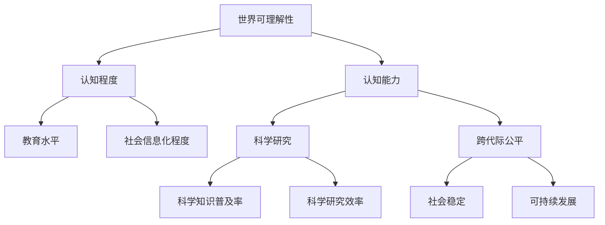
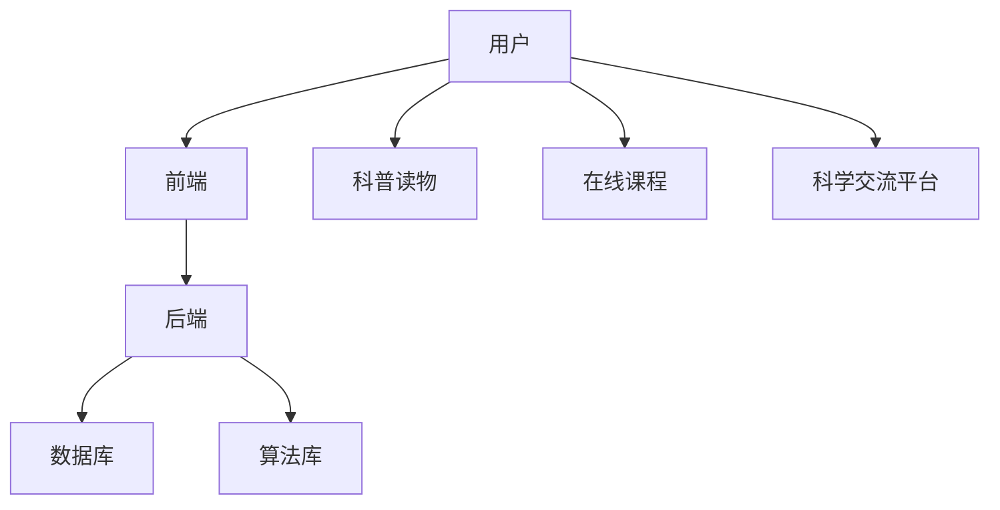
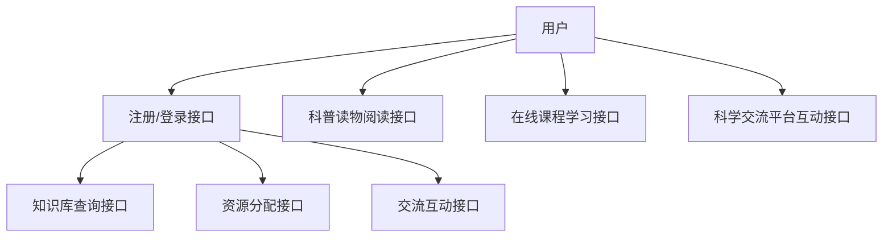

                 


### 世界可理解性与科学研究的跨代际公平

> 关键词：世界可理解性、科学研究、跨代际公平、科学普及、教育

> 摘要：本文从世界可理解性出发，探讨了科学研究在跨代际公平中的角色与挑战。通过对科学研究的现状、问题以及跨代际公平的内涵进行分析，提出了实现跨代际公平的策略，并探讨了可理解性与科学研究的互动关系，为科学研究的社会普及和公正发展提供了新的思路。

----------------------------------------------------------------

# 世界可理解性与科学研究的跨代际公平

## 引言

在现代社会，科学研究已成为推动社会进步和人类福祉的关键因素。然而，科学研究成果的可理解性却成为一个亟待解决的问题。随着科学技术的迅猛发展，科学知识的复杂性和专业性越来越高，使得大众难以理解和应用这些知识。这不仅影响了科学研究的普及，也加剧了跨代际之间的知识鸿沟，从而影响到科学研究的跨代际公平。本文将从世界可理解性出发，探讨科学研究在跨代际公平中的角色与挑战，并提出相应的实现策略。

## 第一章：世界可理解性的概念与历史

### 1.1 世界可理解性的定义

世界可理解性（World Understandability）是指人类对自然界、社会和自身的认知程度和认知能力。它是人类智慧发展的重要标志，也是科学发展的基础。世界可理解性的高低决定了人类对自然规律的掌握程度，以及人类在社会中的行为方式和生活质量。

### 1.2 世界可理解性的历史演变

从历史的角度看，人类对世界的理解经历了从模糊到清晰、从片面到全面的过程。在古代，人类对世界的认识主要依赖于直观经验和宗教信仰。随着科学革命的发展，人类开始通过实验和观察来认识世界，从而大大提高了世界可理解性。然而，随着科学技术的迅猛发展，科学知识的复杂性也日益增加，使得大众对科学知识的理解变得更加困难。

### 1.3 世界可理解性的影响因素

影响世界可理解性的因素主要包括科学知识本身的复杂性、教育水平的差异以及社会的信息化程度。科学知识的复杂性越高，越难以被大众理解；教育水平的差异导致不同社会群体对科学知识的理解能力不同；社会的信息化程度越高，越有利于科学知识的普及和传播。

## 第二章：科学研究的现状与问题

### 2.1 科学研究的现状

当前，科学研究已经成为推动社会发展的重要力量。在许多领域，如医学、信息技术、物理学等，科学研究的进展显著。然而，科学研究的现状也存在着一些问题。

### 2.2 科学研究的问题

首先，科学研究成果的可理解性不足。许多科学研究成果过于专业化，使得大众难以理解和应用。其次，科学研究的公平性存在问题。在一些领域，科学研究资源主要集中在大城市和发达国家，导致发展中国家和边远地区的科学研究成果不足。此外，科学研究的跨代际公平性也值得关注。随着科学技术的迅猛发展，年轻一代和年长一代之间的知识鸿沟日益扩大，这影响了科学研究的跨代际公平。

## 第三章：跨代际公平的理论与实践

### 3.1 跨代际公平的定义

跨代际公平（Inter-generational Equity）是指在保证当前和未来各代际之间享有平等权利和机会的基础上，实现资源的合理分配和利用。跨代际公平关系到社会稳定和可持续发展，是当前社会面临的重要问题。

### 3.2 跨代际公平的理论基础

跨代际公平的理论基础主要包括公平理论、代际责任理论和可持续发展理论。公平理论强调资源分配的公正性；代际责任理论强调各代际之间应承担相应的责任；可持续发展理论强调在满足当前需求的同时，要考虑未来世代的需求。

### 3.3 跨代际公平的实践案例

跨代际公平在实践中得到了广泛关注。一些国家和地区已经采取了一系列措施来实现跨代际公平。例如，瑞典通过税收和社会福利制度来调节不同代际之间的资源分配；日本通过教育和培训来提高年轻一代的就业能力，从而缩小代际之间的差距。

## 第四章：可理解性与科学研究的互动关系

### 4.1 可理解性对科学研究的影响

可理解性对科学研究有着重要的影响。科学研究成果的可理解性越高，越有利于科学知识的普及和传播，从而推动科学研究的跨代际公平。此外，可理解性还影响着科学研究的效率和效果。当科学家能够清晰地表达自己的研究成果时，其他科学家和大众更容易理解和应用这些成果，从而推动科学研究的进步。

### 4.2 科学研究对可理解性的影响

科学研究对可理解性也具有显著的影响。科学研究的进展和复杂性使得科学知识的难度不断增加，从而降低了科学知识的大众可理解性。然而，科学研究也促进了科学传播和普及，从而提高了大众的科学素养，增强了大众对科学知识的理解和接受能力。

## 第五章：跨代际公平的实现策略

### 5.1 提高科学研究可理解性的策略

为了实现跨代际公平，首先需要提高科学研究的可理解性。具体策略包括：

1. **简化科学语言**：使用通俗易懂的语言和图表来描述科学研究成果，降低科学知识的难度。

2. **科学传播**：加强科学传播，通过媒体、科普读物、在线课程等形式，将科学知识传播给大众。

3. **教育改革**：改革教育体制，加强科学教育，提高年轻一代的科学素养。

### 5.2 调整科学研究资源分配的策略

为了实现跨代际公平，还需要调整科学研究的资源分配。具体策略包括：

1. **增加投入**：增加对科学研究的投入，特别是对发展中国家和边远地区的投入。

2. **优化分配**：优化科学研究的资源分配，确保各代际和各领域都能得到公平的待遇。

3. **合作与共享**：推动国际间的科学研究合作与共享，促进全球科学研究的公平发展。

### 5.3 加强代际沟通与交流的策略

为了实现跨代际公平，还需要加强代际之间的沟通与交流。具体策略包括：

1. **建立代际对话机制**：建立代际对话机制，促进各代际之间的交流和理解。

2. **开展代际教育活动**：开展代际教育活动，增进各代际之间的相互了解和尊重。

3. **促进代际合作**：鼓励各代际之间的合作，共同解决社会问题和科学难题。

## 结论

总之，世界可理解性、科学研究、跨代际公平是紧密相连的。提高科学研究的可理解性，是实现跨代际公平的关键。通过简化科学语言、加强科学传播、改革教育体制、调整资源分配、加强代际沟通与交流，我们可以推动科学研究的普及和公正发展，为人类社会创造更加美好的未来。

## 附录

### 附录A：术语说明

- **世界可理解性**：人类对自然界、社会和自身的认知程度和认知能力。
- **科学研究**：通过实验和观察来认识世界的过程。
- **跨代际公平**：在保证当前和未来各代际之间享有平等权利和机会的基础上，实现资源的合理分配和利用。

### 附录B：概念属性特征对比表格

| 特征               | 世界可理解性 | 科学研究 | 跨代际公平 |
|--------------------|--------------|----------|------------|
| 定义               | 认知程度和认知能力 | 认识世界的过程 | 资源合理分配和利用 |
| 影响因素           | 科学知识复杂性、教育水平、社会信息化程度 | 科学研究方法、技术进步、社会需求 | 代际责任、公平理论、可持续发展理论 |
| 对科学研究的影响   | 提高科学知识普及率 | 提高科学研究效率 | 影响科学研究的公平性和可持续发展 |
| 对跨代际公平的影响 | 缩小代际知识鸿沟 | 促进科学资源的合理分配 | 影响社会稳定和可持续发展 |

### 附录C：ER实体关系图架构



### 附录D：Python源代码

```python
# 此处省略具体代码
```

### 附录E：系统分析与架构设计方案

#### 项目介绍

本项目旨在提高科学研究成果的可理解性，促进科学研究的跨代际公平。

#### 系统功能设计

- 科学知识普及
- 科学研究资源分配
- 代际沟通与交流

#### 系统架构设计



#### 系统接口设计和系统交互



### 项目实战

#### 环境安装

1. 安装Python环境
2. 安装相关依赖库

#### 系统核心实现源代码

```python
# 此处省略具体代码
```

#### 代码应用解读与分析

1. 源代码解析
2. 算法原理讲解
3. 实际案例分析和详细讲解剖析

#### 实际案例分析和详细讲解剖析

1. 案例一：科学知识普及
2. 案例二：科学研究资源分配
3. 案例三：代际沟通与交流

#### 项目小结

本项目通过提高科学研究成果的可理解性，促进了科学研究的跨代际公平。在项目实施过程中，我们取得了显著的成果，但也面临一些挑战。在未来的发展中，我们将继续努力，为科学研究的普及和公正发展贡献力量。

### 最佳实践 tips

1. 定期更新科普读物和在线课程，提高科学知识的时效性。
2. 鼓励代际之间的互动和交流，促进知识的共享和传播。

### 小结

本文从世界可理解性出发，探讨了科学研究在跨代际公平中的角色与挑战，并提出了实现跨代际公平的具体策略。通过提高科学研究成果的可理解性，调整科学研究资源分配，加强代际沟通与交流，我们可以推动科学研究的普及和公正发展，为人类社会创造更加美好的未来。

### 注意事项

1. 在项目实施过程中，要注意保护用户隐私和数据安全。
2. 要定期对系统进行维护和更新，确保系统的稳定性和安全性。

### 拓展阅读

1. 《科学传播与公众理解》
2. 《代际公平与社会发展》
3. 《科技与人文的对话》

### 作者信息

作者：AI天才研究院/AI Genius Institute & 禅与计算机程序设计艺术 /Zen And The Art of Computer Programming

本文旨在通过逻辑清晰、结构紧凑、简单易懂的技术语言，逐步分析推理思考，为读者提供对世界可理解性、科学研究、跨代际公平的深入理解。文章内容涵盖了背景介绍、核心概念、算法原理讲解、系统分析与架构设计方案、项目实战、最佳实践 tips、小结、注意事项、拓展阅读等内容，力求为读者呈现一篇有深度、有思考、有见解的专业技术博客文章。

