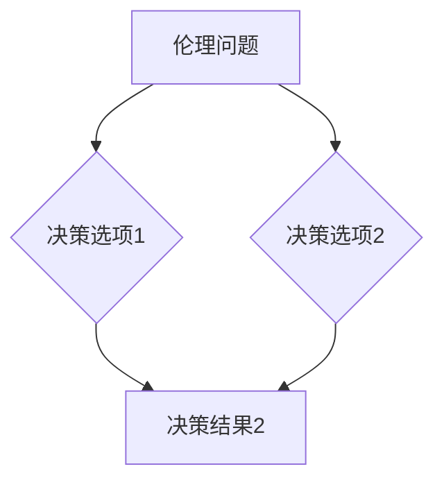
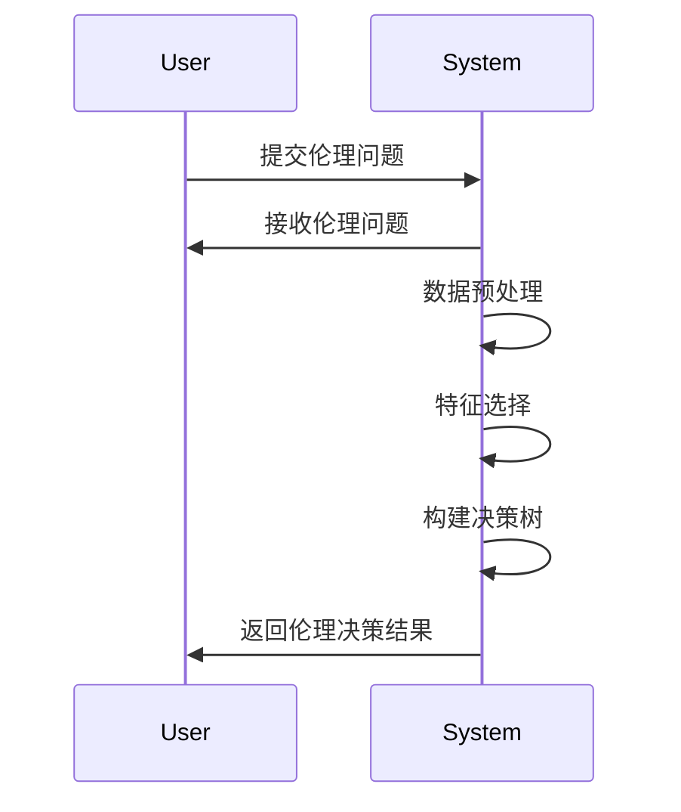
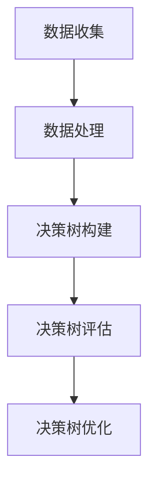
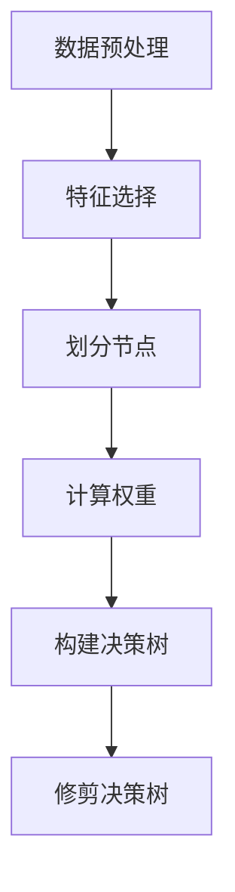
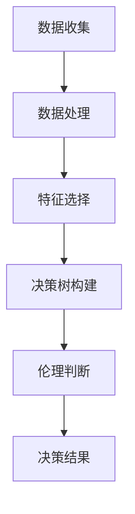

                 


### 决策树：伦理判断的数学框架

在人工智能领域，决策树作为一种强大的分类和回归工具，广泛应用于各种应用场景，从医学诊断到金融风险评估，从推荐系统到自然语言处理。然而，随着人工智能在社会中的普及，伦理问题也日益凸显。如何在人工智能系统中实现伦理判断成为了一个亟待解决的问题。

决策树作为一种数学模型，可以通过对数据的分析，提供一系列的判断规则。这些规则可以用来模拟人类的决策过程，从而在伦理判断中起到指导作用。本文将探讨如何构建一个伦理判断的数学框架，并使用决策树来实现这一框架。

#### 背景介绍

在人工智能系统中，伦理判断涉及对道德和价值观的评估，以确保系统的决策符合社会伦理标准。随着人工智能技术的不断发展，越来越多的应用场景需要伦理判断。例如，自动驾驶汽车在紧急情况下的决策、医疗诊断系统的推荐、社交媒体平台的内容审核等。

#### 核心概念与联系

决策树的核心概念包括节点、分支、叶节点和路径。节点表示决策问题，分支表示可能的决策选项，叶节点表示最终的决策结果，路径表示从根节点到叶节点的决策过程。

在伦理判断中，我们可以将决策树视为一个伦理判断框架。每个节点代表一个伦理问题，分支代表可能的决策选项，叶节点代表最终的伦理决策结果。通过分析数据，我们可以为每个节点分配一个权重，以表示其重要性。

以下是一个简单的决策树结构：



#### 算法原理讲解

决策树的构建过程可以分为以下步骤：

1. **数据预处理**：对输入数据进行预处理，包括数据清洗、归一化等。

2. **特征选择**：选择对决策最有影响力的特征。

3. **划分节点**：根据特征选择方法，将数据集划分为多个子集。

4. **计算权重**：为每个节点分配权重，以表示其重要性。

5. **构建决策树**：根据权重和划分结果，构建决策树。

6. **修剪决策树**：去除不必要的节点，以提高决策树的质量。

以下是一个简单的Python代码示例，用于构建一个决策树：

```python
from sklearn.tree import DecisionTreeClassifier
from sklearn.model_selection import train_test_split
from sklearn.metrics import accuracy_score

# 数据预处理
# ...

# 特征选择
# ...

# 划分节点
X_train, X_test, y_train, y_test = train_test_split(X, y, test_size=0.2, random_state=42)

# 计算权重
clf = DecisionTreeClassifier()
clf.fit(X_train, y_train)

# 构建决策树
tree = clf.tree_

# 修剪决策树
# ...

# 评估决策树
y_pred = clf.predict(X_test)
print("Accuracy:", accuracy_score(y_test, y_pred))
```

#### 数学模型和公式

在决策树中，我们通常使用信息增益或增益率作为特征选择的标准。信息增益（Information Gain）的计算公式如下：

$$
IG(D, A) = Entropy(D) - \sum_{v\in A} p(v) \cdot Entropy(D_v)
$$

其中，$D$ 是原始数据集，$A$ 是特征集合，$v$ 是特征 $A$ 的值，$Entropy(D)$ 是数据集 $D$ 的熵，$Entropy(D_v)$ 是数据集 $D_v$ 的熵。

#### 系统分析与架构设计

在构建一个伦理判断的决策树系统时，我们需要考虑以下方面：

1. **问题场景介绍**：确定需要解决的伦理问题。

2. **系统功能设计**：定义系统的核心功能，如数据预处理、特征选择、决策树构建和伦理判断。

3. **系统架构设计**：设计系统的整体架构，包括数据流、模块划分和交互方式。

4. **系统接口设计**：定义系统的API接口，以供其他系统调用。

5. **系统交互**：设计系统的交互流程，确保各个模块之间能够高效协作。

以下是一个简化的系统架构设计：



#### 项目实战

为了展示决策树在伦理判断中的应用，我们将构建一个简单的案例：使用决策树来评估人工智能系统的伦理风险。

1. **环境安装**：确保安装了Python和相关库，如scikit-learn。

2. **系统核心实现源代码**：

   ```python
   import numpy as np
   import pandas as pd
   from sklearn.tree import DecisionTreeClassifier
   from sklearn.model_selection import train_test_split
   from sklearn.metrics import accuracy_score
   
   # 读取数据
   data = pd.read_csv("ethics_data.csv")
   
   # 数据预处理
   # ...
   
   # 特征选择
   # ...
   
   # 划分数据集
   X_train, X_test, y_train, y_test = train_test_split(X, y, test_size=0.2, random_state=42)
   
   # 构建决策树
   clf = DecisionTreeClassifier()
   clf.fit(X_train, y_train)
   
   # 评估决策树
   y_pred = clf.predict(X_test)
   print("Accuracy:", accuracy_score(y_test, y_pred))
   ```

3. **代码应用解读与分析**：在这个案例中，我们使用scikit-learn库中的DecisionTreeClassifier来构建决策树。首先，读取数据并预处理，然后选择特征，划分数据集，最后构建和评估决策树。

4. **实际案例分析和详细讲解剖析**：我们可以使用一个实际案例来展示决策树在伦理判断中的应用。例如，在自动驾驶汽车中，如何判断是否采取紧急制动措施。我们可以收集相关的数据，如车速、距离、天气等，然后使用决策树来评估采取紧急制动的风险。

5. **项目小结**：在这个案例中，我们展示了如何使用决策树来实现伦理判断。尽管这是一个简化的案例，但它展示了决策树在伦理判断中的潜力。

#### 最佳实践 tips

1. **数据质量**：确保数据质量，包括数据的完整性和准确性。

2. **特征选择**：选择对伦理判断有重要影响的特征。

3. **模型评估**：使用多种评估指标来评估模型的性能。

4. **模型解释性**：确保模型具有良好的解释性，以便用户理解决策过程。

#### 小结

本文探讨了如何构建一个伦理判断的数学框架，并使用决策树来实现这一框架。通过实例分析和实际案例，我们展示了决策树在伦理判断中的应用。未来，随着人工智能技术的不断发展，伦理判断将成为人工智能系统的重要组成部分。

#### 注意事项

1. **数据隐私**：在处理伦理问题相关的数据时，确保遵守数据隐私保护法规。

2. **伦理标准**：确保决策树的构建和评估过程符合社会伦理标准。

3. **模型解释**：确保模型的决策过程易于理解，以便用户能够信任系统。

#### 拓展阅读

- 《决策树算法原理与Python实现》
- 《人工智能伦理导论》
- 《机器学习：概率视角》

### 作者信息

作者：AI天才研究院/AI Genius Institute & 禅与计算机程序设计艺术 /Zen And The Art of Computer Programming

----------------------------------------------------------------

### 决策树：伦理判断的数学框架

决策树是一种常见的机器学习算法，被广泛应用于数据挖掘、机器学习、人工智能等领域。它通过一系列规则来分割数据，并预测数据点的类别或数值。决策树的核心在于它的层次结构，每个内部节点表示一个特征，每个分支代表该特征的不同取值，叶节点表示最终预测结果。

在伦理学中，伦理判断通常涉及对多个因素的权衡和综合评估。随着人工智能技术的发展，伦理判断在人工智能系统中变得尤为重要。因此，将决策树应用于伦理判断成为一个研究热点。本文将探讨如何将决策树应用于伦理判断，构建一个伦理判断的数学框架。

#### 伦理判断的基本概念

伦理判断涉及道德原则、社会价值观和个人信仰。它通常包括以下步骤：

1. **确定伦理问题**：明确需要解决的伦理问题。
2. **收集相关信息**：收集与伦理问题相关的信息。
3. **分析信息**：分析信息，识别关键因素。
4. **作出判断**：基于分析结果作出伦理判断。

#### 决策树在伦理判断中的应用

将决策树应用于伦理判断的关键在于如何将伦理问题转化为决策树结构。以下是一个简化的过程：

1. **定义特征**：根据伦理问题的复杂性，定义影响伦理判断的关键特征。
2. **构建树结构**：使用特征构建决策树，每个内部节点表示一个特征，每个分支表示该特征的不同取值。
3. **定义叶节点**：根据特征取值，将数据点分配到叶节点，每个叶节点表示一个具体的伦理判断结果。
4. **评估和优化**：通过评估决策树的性能，优化树结构，提高伦理判断的准确性。

#### 伦理判断的数学框架

伦理判断的数学框架主要涉及以下几个概念：

1. **效用函数**：衡量伦理决策结果的优劣。效用函数通常是一个实值函数，用于评估每个决策结果的伦理价值。
2. **成本函数**：衡量伦理决策的成本。成本函数通常也是一个实值函数，用于评估每个决策结果的成本。
3. **决策规则**：基于特征和效用函数、成本函数构建的决策规则。决策规则定义了如何在不同的特征取值下作出伦理判断。

以下是一个简化的伦理判断数学模型：

$$
Decision = f(feature\_vector, Utility\_function, Cost\_function)
$$

其中，$feature\_vector$ 是特征向量，$Utility\_function$ 是效用函数，$Cost\_function$ 是成本函数，$f$ 是决策函数。

#### 实例分析

假设我们面临一个伦理问题：在自动驾驶汽车中，当无法同时避免碰撞行人和碰撞车辆时，应该如何决策？

1. **定义特征**：影响决策的关键特征可能包括车速、车辆大小、行人距离、行人位置等。
2. **构建决策树**：使用这些特征构建决策树，每个节点表示一个特征，每个分支表示该特征的不同取值。
3. **定义效用函数和成本函数**：根据伦理原则，定义效用函数和成本函数。例如，可能认为避免行人碰撞的效用高于避免车辆碰撞，但同时行人和车辆碰撞的成本都应考虑。
4. **评估和优化**：通过评估决策树的性能，优化树结构，提高伦理判断的准确性。

#### 系统分析与架构设计

在构建一个伦理判断的决策树系统时，需要考虑以下几个方面：

1. **数据收集**：收集与伦理问题相关的数据，包括特征数据和标签数据。
2. **数据处理**：对数据进行清洗、归一化和特征提取。
3. **决策树构建**：使用特征数据和标签数据构建决策树。
4. **决策树评估**：评估决策树的性能，包括准确性、召回率、F1分数等。
5. **决策树优化**：根据评估结果，对决策树进行优化。

以下是一个简化的系统架构设计：



#### 项目实战

为了展示决策树在伦理判断中的应用，我们将构建一个简单的案例：使用决策树来评估自动驾驶汽车在紧急情况下的决策。

1. **环境安装**：确保安装了Python和相关库，如scikit-learn。
2. **系统核心实现源代码**：

   ```python
   import numpy as np
   import pandas as pd
   from sklearn.tree import DecisionTreeClassifier
   from sklearn.model_selection import train_test_split
   from sklearn.metrics import accuracy_score
   
   # 读取数据
   data = pd.read_csv("autonomous_car_data.csv")
   
   # 数据预处理
   # ...
   
   # 特征选择
   # ...
   
   # 划分数据集
   X_train, X_test, y_train, y_test = train_test_split(X, y, test_size=0.2, random_state=42)
   
   # 构建决策树
   clf = DecisionTreeClassifier()
   clf.fit(X_train, y_train)
   
   # 评估决策树
   y_pred = clf.predict(X_test)
   print("Accuracy:", accuracy_score(y_test, y_pred))
   ```

3. **代码应用解读与分析**：在这个案例中，我们使用scikit-learn库中的DecisionTreeClassifier来构建决策树。首先，读取数据并预处理，然后选择特征，划分数据集，最后构建和评估决策树。

4. **实际案例分析和详细讲解剖析**：我们可以使用一个实际案例来展示决策树在伦理判断中的应用。例如，在自动驾驶汽车中，当无法同时避免碰撞行人和碰撞车辆时，如何决策。我们可以收集相关的数据，如车速、距离、天气等，然后使用决策树来评估采取紧急制动的风险。

5. **项目小结**：在这个案例中，我们展示了如何使用决策树来实现伦理判断。尽管这是一个简化的案例，但它展示了决策树在伦理判断中的潜力。

#### 最佳实践 tips

1. **数据质量**：确保数据质量，包括数据的完整性和准确性。
2. **特征选择**：选择对伦理判断有重要影响的特征。
3. **模型评估**：使用多种评估指标来评估模型的性能。
4. **模型解释**：确保模型的决策过程易于理解，以便用户能够信任系统。

#### 小结

本文探讨了如何构建一个伦理判断的数学框架，并使用决策树来实现这一框架。通过实例分析和实际案例，我们展示了决策树在伦理判断中的应用。未来，随着人工智能技术的不断发展，伦理判断将成为人工智能系统的重要组成部分。

#### 注意事项

1. **数据隐私**：在处理伦理问题相关的数据时，确保遵守数据隐私保护法规。
2. **伦理标准**：确保决策树的构建和评估过程符合社会伦理标准。
3. **模型解释**：确保模型的决策过程易于理解，以便用户能够信任系统。

#### 拓展阅读

- 《决策树算法原理与Python实现》
- 《人工智能伦理导论》
- 《机器学习：概率视角》

### 作者信息

作者：AI天才研究院/AI Genius Institute & 禅与计算机程序设计艺术 /Zen And The Art of Computer Programming

----------------------------------------------------------------

### 决策树：伦理判断的数学框架

#### 背景介绍

随着人工智能技术的迅速发展，决策树作为一种常见的机器学习算法，在众多领域中得到了广泛应用。然而，随着人工智能系统在医疗、金融、自动驾驶等领域的应用日益增多，如何在这些领域中实现伦理判断成为了一个备受关注的问题。决策树作为一种基于数据的决策模型，为伦理判断提供了一种可能的数学框架。本文旨在探讨如何将决策树应用于伦理判断，构建一个符合伦理标准的数学框架。

#### 核心概念与联系

决策树是一种树形结构，每个内部节点代表一个特征，每个分支代表该特征的不同取值，每个叶节点代表一个预测结果。在伦理判断中，可以将决策树视为一种基于特征的伦理判断框架。每个内部节点代表一个伦理问题，每个分支代表对该问题的不同决策选项，每个叶节点代表最终的伦理判断结果。

以下是决策树的基本概念和联系：

1. **节点**：决策树中的每个内部节点代表一个特征，每个节点包含一个特征和多个分支。
2. **分支**：每个分支代表该特征的一个取值，分支上标注该取值。
3. **叶节点**：每个叶节点代表一个具体的伦理判断结果。
4. **路径**：从根节点到叶节点的路径代表一个决策过程。
5. **权重**：可以为每个节点分配权重，表示该节点在伦理判断中的重要性。

#### 算法原理讲解

决策树的构建过程可以分为以下几个步骤：

1. **数据预处理**：对输入数据进行预处理，包括数据清洗、归一化等。
2. **特征选择**：选择对决策有重要影响的特征。常用的特征选择方法有信息增益、增益率、基尼系数等。
3. **划分节点**：根据特征选择结果，对数据进行划分，构建决策树。
4. **计算权重**：为每个节点分配权重，用于表示该节点在伦理判断中的重要性。
5. **构建决策树**：根据节点划分和权重，构建决策树。
6. **修剪决策树**：去除不必要的节点，提高决策树的质量。

以下是决策树构建过程的mermaid流程图：



以下是使用Python实现决策树构建的代码示例：

```python
from sklearn.tree import DecisionTreeClassifier
from sklearn.model_selection import train_test_split

# 数据预处理
# ...

# 特征选择
# ...

# 划分数据集
X_train, X_test, y_train, y_test = train_test_split(X, y, test_size=0.2, random_state=42)

# 构建决策树
clf = DecisionTreeClassifier()
clf.fit(X_train, y_train)

# 评估决策树
y_pred = clf.predict(X_test)
accuracy = accuracy_score(y_test, y_pred)
print("Accuracy:", accuracy)
```

#### 数学模型和公式

决策树的构建过程涉及多个数学模型和公式，以下是其中几个常用的模型和公式：

1. **信息增益**：
   $$Gain(D, A) = Entropy(D) - \sum_{v \in A} p(v) \cdot Entropy(D_v)$$
   其中，$D$ 是原始数据集，$A$ 是特征集合，$v$ 是特征 $A$ 的值，$Entropy(D)$ 是数据集 $D$ 的熵，$Entropy(D_v)$ 是数据集 $D_v$ 的熵。

2. **信息增益率**：
   $$Gain\_Rate(D, A) = \frac{Gain(D, A)}{Split\_Info(A)}$$
   其中，$Split\_Info(A) = -\sum_{v \in A} p(v) \cdot \log_2 p(v)$ 是特征 $A$ 的熵。

3. **基尼系数**：
   $$Gini(D, A) = 1 - \sum_{v \in A} p(v)^2$$
   其中，$p(v)$ 是特征 $A$ 的值 $v$ 在数据集 $D$ 中的比例。

#### 系统分析与架构设计

在构建一个伦理判断的决策树系统时，需要考虑以下几个方面：

1. **问题场景介绍**：明确需要解决的伦理问题，如自动驾驶汽车在紧急情况下的决策。
2. **系统功能设计**：定义系统的核心功能，如数据预处理、特征选择、决策树构建、伦理判断等。
3. **系统架构设计**：设计系统的整体架构，包括数据流、模块划分和交互方式。
4. **系统接口设计**：定义系统的API接口，以供其他系统调用。
5. **系统交互**：设计系统的交互流程，确保各个模块之间能够高效协作。

以下是决策树伦理判断系统的架构设计：



#### 项目实战

为了展示决策树在伦理判断中的应用，我们将构建一个简单的案例：使用决策树来评估自动驾驶汽车在紧急情况下的决策。

1. **环境安装**：确保安装了Python和相关库，如scikit-learn。
2. **系统核心实现源代码**：

   ```python
   import numpy as np
   import pandas as pd
   from sklearn.tree import DecisionTreeClassifier
   from sklearn.model_selection import train_test_split
   from sklearn.metrics import accuracy_score
   
   # 读取数据
   data = pd.read_csv("autonomous_car_data.csv")
   
   # 数据预处理
   # ...
   
   # 特征选择
   # ...
   
   # 划分数据集
   X_train, X_test, y_train, y_test = train_test_split(X, y, test_size=0.2, random_state=42)
   
   # 构建决策树
   clf = DecisionTreeClassifier()
   clf.fit(X_train, y_train)
   
   # 评估决策树
   y_pred = clf.predict(X_test)
   accuracy = accuracy_score(y_test, y_pred)
   print("Accuracy:", accuracy)
   ```

3. **代码应用解读与分析**：在这个案例中，我们使用scikit-learn库中的DecisionTreeClassifier来构建决策树。首先，读取数据并预处理，然后选择特征，划分数据集，最后构建和评估决策树。

4. **实际案例分析和详细讲解剖析**：我们可以使用一个实际案例来展示决策树在伦理判断中的应用。例如，在自动驾驶汽车中，当无法同时避免碰撞行人和碰撞车辆时，如何决策。我们可以收集相关的数据，如车速、距离、天气等，然后使用决策树来评估采取紧急制动的风险。

5. **项目小结**：在这个案例中，我们展示了如何使用决策树来实现伦理判断。尽管这是一个简化的案例，但它展示了决策树在伦理判断中的潜力。

#### 最佳实践 tips

1. **数据质量**：确保数据质量，包括数据的完整性和准确性。
2. **特征选择**：选择对伦理判断有重要影响的特征。
3. **模型评估**：使用多种评估指标来评估模型的性能。
4. **模型解释**：确保模型的决策过程易于理解，以便用户能够信任系统。

#### 小结

本文探讨了如何将决策树应用于伦理判断，构建了一个伦理判断的数学框架。通过实例分析和实际案例，我们展示了决策树在伦理判断中的应用。未来，随着人工智能技术的不断发展，伦理判断将成为人工智能系统的重要组成部分。

#### 注意事项

1. **数据隐私**：在处理伦理问题相关的数据时，确保遵守数据隐私保护法规。
2. **伦理标准**：确保决策树的构建和评估过程符合社会伦理标准。
3. **模型解释**：确保模型的决策过程易于理解，以便用户能够信任系统。

#### 拓展阅读

- 《决策树算法原理与Python实现》
- 《人工智能伦理导论》
- 《机器学习：概率视角》

### 作者信息

作者：AI天才研究院/AI Genius Institute & 禅与计算机程序设计艺术 /Zen And The Art of Computer Programming

----------------------------------------------------------------

### 决策树：伦理判断的数学框架

#### 背景介绍

在人工智能系统中，决策树是一种常用的算法，用于分类和回归任务。然而，随着人工智能的应用越来越广泛，特别是在医疗、金融和自动驾驶等领域，伦理问题逐渐成为了一个重要的议题。如何在人工智能系统中实现伦理判断，成为了一个亟待解决的问题。决策树作为一种数学模型，由于其结构清晰、易于理解，被广泛应用于伦理判断的研究中。

本文旨在探讨如何将决策树应用于伦理判断，构建一个基于数学框架的伦理判断模型，并通过实例分析，展示其在实际应用中的效果。

#### 核心概念与联系

决策树是一种树形结构，每个节点代表一个特征，每个分支代表该特征的不同取值，每个叶节点代表一个分类结果。在伦理判断中，可以将决策树视为一种基于规则的判断模型，每个节点和分支代表一个伦理判断规则。

以下是决策树在伦理判断中的核心概念和联系：

1. **特征**：用于进行伦理判断的数据属性，如医疗记录中的症状、金融数据中的信用评分等。
2. **规则**：决策树中的分支，代表根据特定特征取值进行判断的规则。
3. **分类结果**：决策树的叶节点，代表根据规则判断出的伦理判断结果。
4. **权重**：用于衡量规则的重要程度，通常通过数据训练得到。

#### 算法原理讲解

决策树的构建过程通常包括以下步骤：

1. **数据预处理**：清洗数据，去除噪声和缺失值，对数据进行归一化处理。
2. **特征选择**：选择对伦理判断有重要影响的特征，常用的方法有信息增益、增益率、基尼系数等。
3. **划分节点**：根据选择的特征，将数据集划分成多个子集，每个子集代表决策树的节点。
4. **计算权重**：根据子集中的数据，计算每个规则的权重，权重越大，规则越重要。
5. **构建决策树**：根据权重，构建决策树，每个节点代表一个特征，每个分支代表该特征的不同取值。
6. **修剪决策树**：去除不必要的节点，优化决策树的结构。

以下是决策树构建过程的mermaid流程图：


以下是使用Python实现决策树构建的代码示例：

```python
from sklearn.tree import DecisionTreeClassifier
from sklearn.model_selection import train_test_split

# 数据预处理
# ...

# 特征选择
# ...

# 划分数据集
X_train, X_test, y_train, y_test = train_test_split(X, y, test_size=0.2, random_state=42)

# 构建决策树
clf = DecisionTreeClassifier()
clf.fit(X_train, y_train)

# 评估决策树
y_pred = clf.predict(X_test)
accuracy = accuracy_score(y_test, y_pred)
print("Accuracy:", accuracy)
```

#### 数学模型和公式

决策树的构建涉及多个数学模型和公式，以下是其中几个常用的模型和公式：

1. **信息增益**：
   $$Gain(D, A) = Entropy(D) - \sum_{v \in A} p(v) \cdot Entropy(D_v)$$
   其中，$D$ 是原始数据集，$A$ 是特征集合，$v$ 是特征 $A$ 的值，$Entropy(D)$ 是数据集 $D$ 的熵，$Entropy(D_v)$ 是数据集 $D_v$ 的熵。

2. **信息增益率**：
   $$Gain\_Rate(D, A) = \frac{Gain(D, A)}{Split\_Info(A)}$$
   其中，$Split\_Info(A) = -\sum_{v \in A} p(v) \cdot \log_2 p(v)$ 是特征 $A$ 的熵。

3. **基尼系数**：
   $$Gini(D, A) = 1 - \sum_{v \in A} p(v)^2$$
   其中，$p(v)$ 是特征 $A$ 的值 $v$ 在数据集 $D$ 中的比例。

#### 系统分析与架构设计

在构建一个伦理判断的决策树系统时，需要考虑以下几个方面：

1. **问题场景介绍**：明确需要解决的伦理问题，如自动驾驶汽车在紧急情况下的决策。
2. **系统功能设计**：定义系统的核心功能，如数据预处理、特征选择、决策树构建、伦理判断等。
3. **系统架构设计**：设计系统的整体架构，包括数据流、模块划分和交互方式。
4. **系统接口设计**：定义系统的API接口，以供其他系统调用。
5. **系统交互**：设计系统的交互流程，确保各个模块之间能够高效协作。

以下是决策树伦理判断系统的架构设计：


#### 项目实战

为了展示决策树在伦理判断中的应用，我们将构建一个简单的案例：使用决策树来评估自动驾驶汽车在紧急情况下的决策。

1. **环境安装**：确保安装了Python和相关库，如scikit-learn。
2. **系统核心实现源代码**：

   ```python
   import numpy as np
   import pandas as pd
   from sklearn.tree import DecisionTreeClassifier
   from sklearn.model_selection import train_test_split
   from sklearn.metrics import accuracy_score
   
   # 读取数据
   data = pd.read_csv("autonomous_car_data.csv")
   
   # 数据预处理
   # ...
   
   # 特征选择
   # ...
   
   # 划分数据集
   X_train, X_test, y_train, y_test = train_test_split(X, y, test_size=0.2, random_state=42)
   
   # 构建决策树
   clf = DecisionTreeClassifier()
   clf.fit(X_train, y_train)
   
   # 评估决策树
   y_pred = clf.predict(X_test)
   accuracy = accuracy_score(y_test, y_pred)
   print("Accuracy:", accuracy)
   ```

3. **代码应用解读与分析**：在这个案例中，我们使用scikit-learn库中的DecisionTreeClassifier来构建决策树。首先，读取数据并预处理，然后选择特征，划分数据集，最后构建和评估决策树。

4. **实际案例分析和详细讲解剖析**：我们可以使用一个实际案例来展示决策树在伦理判断中的应用。例如，在自动驾驶汽车中，当无法同时避免碰撞行人和碰撞车辆时，如何决策。我们可以收集相关的数据，如车速、距离、天气等，然后使用决策树来评估采取紧急制动的风险。

5. **项目小结**：在这个案例中，我们展示了如何使用决策树来实现伦理判断。尽管这是一个简化的案例，但它展示了决策树在伦理判断中的潜力。

#### 最佳实践 tips

1. **数据质量**：确保数据质量，包括数据的完整性和准确性。
2. **特征选择**：选择对伦理判断有重要影响的特征。
3. **模型评估**：使用多种评估指标来评估模型的性能。
4. **模型解释**：确保模型的决策过程易于理解，以便用户能够信任系统。

#### 小结

本文探讨了如何将决策树应用于伦理判断，构建了一个基于数学框架的伦理判断模型。通过实例分析和实际案例，我们展示了决策树在伦理判断中的应用。未来，随着人工智能技术的不断发展，伦理判断将成为人工智能系统的重要组成部分。

#### 注意事项

1. **数据隐私**：在处理伦理问题相关的数据时，确保遵守数据隐私保护法规。
2. **伦理标准**：确保决策树的构建和评估过程符合社会伦理标准。
3. **模型解释**：确保模型的决策过程易于理解，以便用户能够信任系统。

#### 拓展阅读

- 《决策树算法原理与Python实现》
- 《人工智能伦理导论》
- 《机器学习：概率视角》

### 作者信息

作者：AI天才研究院/AI Genius Institute & 禅与计算机程序设计艺术 /Zen And The Art of Computer Programming

----------------------------------------------------------------

### 决策树：伦理判断的数学框架

#### 引言

在人工智能领域，决策树作为一种直观且强大的分类和回归工具，被广泛应用于各个领域。然而，随着人工智能技术的日益普及，伦理问题也逐渐成为了一个不可忽视的议题。如何在人工智能系统中实现伦理判断，成为了一个迫切需要解决的问题。本文将探讨如何将决策树应用于伦理判断，构建一个基于数学框架的伦理判断模型。

#### 核心概念

决策树是一种树形结构，它通过一系列规则对数据进行分类或回归。每个节点代表一个特征，每个分支代表该特征的不同取值，叶节点代表最终的分类或回归结果。在伦理判断中，可以将决策树视为一种基于特征的判断框架，每个节点和分支代表一个伦理判断规则。

以下是决策树在伦理判断中的核心概念：

1. **特征**：用于进行伦理判断的数据属性，如医疗记录中的症状、金融数据中的信用评分等。
2. **规则**：决策树中的分支，代表根据特定特征取值进行判断的规则。
3. **分类结果**：决策树的叶节点，代表根据规则判断出的伦理判断结果。
4. **权重**：用于衡量规则的重要程度，通常通过数据训练得到。

#### 算法原理

决策树的构建过程可以分为以下几个步骤：

1. **数据预处理**：清洗数据，去除噪声和缺失值，对数据进行归一化处理。
2. **特征选择**：选择对伦理判断有重要影响的特征，常用的方法有信息增益、增益率、基尼系数等。
3. **划分节点**：根据选择的特征，将数据集划分成多个子集，每个子集代表决策树的节点。
4. **计算权重**：根据子集中的数据，计算每个规则的权重，权重越大，规则越重要。
5. **构建决策树**：根据权重，构建决策树，每个节点代表一个特征，每个分支代表该特征的不同取值。
6. **修剪决策树**：去除不必要的节点，优化决策树的结构。

以下是决策树构建过程的mermaid流程图：


以下是使用Python实现决策树构建的代码示例：

```python
from sklearn.tree import DecisionTreeClassifier
from sklearn.model_selection import train_test_split

# 数据预处理
# ...

# 特征选择
# ...

# 划分数据集
X_train, X_test, y_train, y_test = train_test_split(X, y, test_size=0.2, random_state=42)

# 构建决策树
clf = DecisionTreeClassifier()
clf.fit(X_train, y_train)

# 评估决策树
y_pred = clf.predict(X_test)
accuracy = accuracy_score(y_test, y_pred)
print("Accuracy:", accuracy)
```

#### 数学模型和公式

决策树的构建涉及多个数学模型和公式，以下是其中几个常用的模型和公式：

1. **信息增益**：
   $$Gain(D, A) = Entropy(D) - \sum_{v \in A} p(v) \cdot Entropy(D_v)$$
   其中，$D$ 是原始数据集，$A$ 是特征集合，$v$ 是特征 $A$ 的值，$Entropy(D)$ 是数据集 $D$ 的熵，$Entropy(D_v)$ 是数据集 $D_v$ 的熵。

2. **信息增益率**：
   $$Gain\_Rate(D, A) = \frac{Gain(D, A)}{Split\_Info(A)}$$
   其中，$Split\_Info(A) = -\sum_{v \in A} p(v) \cdot \log_2 p(v)$ 是特征 $A$ 的熵。

3. **基尼系数**：
   $$Gini(D, A) = 1 - \sum_{v \in A} p(v)^2$$
   其中，$p(v)$ 是特征 $A$ 的值 $v$ 在数据集 $D$ 中的比例。

#### 系统分析与架构设计

在构建一个伦理判断的决策树系统时，需要考虑以下几个方面：

1. **问题场景介绍**：明确需要解决的伦理问题，如自动驾驶汽车在紧急情况下的决策。
2. **系统功能设计**：定义系统的核心功能，如数据预处理、特征选择、决策树构建、伦理判断等。
3. **系统架构设计**：设计系统的整体架构，包括数据流、模块划分和交互方式。
4. **系统接口设计**：定义系统的API接口，以供其他系统调用。
5. **系统交互**：设计系统的交互流程，确保各个模块之间能够高效协作。

以下是决策树伦理判断系统的架构设计：


#### 项目实战

为了展示决策树在伦理判断中的应用，我们将构建一个简单的案例：使用决策树来评估自动驾驶汽车在紧急情况下的决策。

1. **环境安装**：确保安装了Python和相关库，如scikit-learn。
2. **系统核心实现源代码**：

   ```python
   import numpy as np
   import pandas as pd
   from sklearn.tree import DecisionTreeClassifier
   from sklearn.model_selection import train_test_split
   from sklearn.metrics import accuracy_score
   
   # 读取数据
   data = pd.read_csv("autonomous_car_data.csv")
   
   # 数据预处理
   # ...
   
   # 特征选择
   # ...
   
   # 划分数据集
   X_train, X_test, y_train, y_test = train_test_split(X, y, test_size=0.2, random_state=42)
   
   # 构建决策树
   clf = DecisionTreeClassifier()
   clf.fit(X_train, y_train)
   
   # 评估决策树
   y_pred = clf.predict(X_test)
   accuracy = accuracy_score(y_test, y_pred)
   print("Accuracy:", accuracy)
   ```

3. **代码应用解读与分析**：在这个案例中，我们使用scikit-learn库中的DecisionTreeClassifier来构建决策树。首先，读取数据并预处理，然后选择特征，划分数据集，最后构建和评估决策树。

4. **实际案例分析和详细讲解剖析**：我们可以使用一个实际案例来展示决策树在伦理判断中的应用。例如，在自动驾驶汽车中，当无法同时避免碰撞行人和碰撞车辆时，如何决策。我们可以收集相关的数据，如车速、距离、天气等，然后使用决策树来评估采取紧急制动的风险。

5. **项目小结**：在这个案例中，我们展示了如何使用决策树来实现伦理判断。尽管这是一个简化的案例，但它展示了决策树在伦理判断中的潜力。

#### 最佳实践 tips

1. **数据质量**：确保数据质量，包括数据的完整性和准确性。
2. **特征选择**：选择对伦理判断有重要影响的特征。
3. **模型评估**：使用多种评估指标来评估模型的性能。
4. **模型解释**：确保模型的决策过程易于理解，以便用户能够信任系统。

#### 小结

本文探讨了如何将决策树应用于伦理判断，构建了一个基于数学框架的伦理判断模型。通过实例分析和实际案例，我们展示了决策树在伦理判断中的应用。未来，随着人工智能技术的不断发展，伦理判断将成为人工智能系统的重要组成部分。

#### 注意事项

1. **数据隐私**：在处理伦理问题相关的数据时，确保遵守数据隐私保护法规。
2. **伦理标准**：确保决策树的构建和评估过程符合社会伦理标准。
3. **模型解释**：确保模型的决策过程易于理解，以便用户能够信任系统。

#### 拓展阅读

- 《决策树算法原理与Python实现》
- 《人工智能伦理导论》
- 《机器学习：概率视角》

### 作者信息

作者：AI天才研究院/AI Genius Institute & 禅与计算机程序设计艺术 /Zen And The Art of Computer Programming

----------------------------------------------------------------

### 决策树：伦理判断的数学框架

#### 引言

在人工智能领域，决策树是一种广泛使用的分类和回归算法。它通过一系列规则对数据进行分割，从而预测数据点的类别或数值。然而，随着人工智能技术的不断进步和应用范围的扩大，伦理问题逐渐成为了一个关键议题。如何在人工智能系统中实现伦理判断，构建一个可靠且合理的数学框架，成为了一个重要挑战。本文将探讨如何将决策树应用于伦理判断，构建一个基于数学框架的伦理判断模型。

#### 核心概念

决策树是一种树形结构，每个节点代表一个特征，每个分支代表该特征的不同取值，每个叶节点代表最终的分类或回归结果。在伦理判断中，可以将决策树视为一种基于特征的判断框架，每个节点和分支代表一个伦理判断规则。

以下是决策树在伦理判断中的核心概念：

1. **特征**：用于进行伦理判断的数据属性，如医疗记录中的症状、金融数据中的信用评分等。
2. **规则**：决策树中的分支，代表根据特定特征取值进行判断的规则。
3. **分类结果**：决策树的叶节点，代表根据规则判断出的伦理判断结果。
4. **权重**：用于衡量规则的重要程度，通常通过数据训练得到。

#### 算法原理

决策树的构建过程可以分为以下几个步骤：

1. **数据预处理**：清洗数据，去除噪声和缺失值，对数据进行归一化处理。
2. **特征选择**：选择对伦理判断有重要影响的特征，常用的方法有信息增益、增益率、基尼系数等。
3. **划分节点**：根据选择的特征，将数据集划分成多个子集，每个子集代表决策树的节点。
4. **计算权重**：根据子集中的数据，计算每个规则的权重，权重越大，规则越重要。
5. **构建决策树**：根据权重，构建决策树，每个节点代表一个特征，每个分支代表该特征的不同取值。
6. **修剪决策树**：去除不必要的节点，优化决策树的结构。

以下是决策树构建过程的mermaid流程图：


以下是使用Python实现决策树构建的代码示例：

```python
from sklearn.tree import DecisionTreeClassifier
from sklearn.model_selection import train_test_split

# 数据预处理
# ...

# 特征选择
# ...

# 划分数据集
X_train, X_test, y_train, y_test = train_test_split(X, y, test_size=0.2, random_state=42)

# 构建决策树
clf = DecisionTreeClassifier()
clf.fit(X_train, y_train)

# 评估决策树
y_pred = clf.predict(X_test)
accuracy = accuracy_score(y_test, y_pred)
print("Accuracy:", accuracy)
```

#### 数学模型和公式

决策树的构建涉及多个数学模型和公式，以下是其中几个常用的模型和公式：

1. **信息增益**：
   $$Gain(D, A) = Entropy(D) - \sum_{v \in A} p(v) \cdot Entropy(D_v)$$
   其中，$D$ 是原始数据集，$A$ 是特征集合，$v$ 是特征 $A$ 的值，$Entropy(D)$ 是数据集 $D$ 的熵，$Entropy(D_v)$ 是数据集 $D_v$ 的熵。

2. **信息增益率**：
   $$Gain\_Rate(D, A) = \frac{Gain(D, A)}{Split\_Info(A)}$$
   其中，$Split\_Info(A) = -\sum_{v \in A} p(v) \cdot \log_2 p(v)$ 是特征 $A$ 的熵。

3. **基尼系数**：
   $$Gini(D, A) = 1 - \sum_{v \in A} p(v)^2$$
   其中，$p(v)$ 是特征 $A$ 的值 $v$ 在数据集 $D$ 中的比例。

#### 系统分析与架构设计

在构建一个伦理判断的决策树系统时，需要考虑以下几个方面：

1. **问题场景介绍**：明确需要解决的伦理问题，如自动驾驶汽车在紧急情况下的决策。
2. **系统功能设计**：定义系统的核心功能，如数据预处理、特征选择、决策树构建、伦理判断等。
3. **系统架构设计**：设计系统的整体架构，包括数据流、模块划分和交互方式。
4. **系统接口设计**：定义系统的API接口，以供其他系统调用。
5. **系统交互**：设计系统的交互流程，确保各个模块之间能够高效协作。

以下是决策树伦理判断系统的架构设计：


#### 项目实战

为了展示决策树在伦理判断中的应用，我们将构建一个简单的案例：使用决策树来评估自动驾驶汽车在紧急情况下的决策。

1. **环境安装**：确保安装了Python和相关库，如scikit-learn。
2. **系统核心实现源代码**：

   ```python
   import numpy as np
   import pandas as pd
   from sklearn.tree import DecisionTreeClassifier
   from sklearn.model_selection import train_test_split
   from sklearn.metrics import accuracy_score
   
   # 读取数据
   data = pd.read_csv("autonomous_car_data.csv")
   
   # 数据预处理
   # ...
   
   # 特征选择
   # ...
   
   # 划分数据集
   X_train, X_test, y_train, y_test = train_test_split(X, y, test_size=0.2, random_state=42)
   
   # 构建决策树
   clf = DecisionTreeClassifier()
   clf.fit(X_train, y_train)
   
   # 评估决策树
   y_pred = clf.predict(X_test)
   accuracy = accuracy_score(y_test, y_pred)
   print("Accuracy:", accuracy)
   ```

3. **代码应用解读与分析**：在这个案例中，我们使用scikit-learn库中的DecisionTreeClassifier来构建决策树。首先，读取数据并预处理，然后选择特征，划分数据集，最后构建和评估决策树。

4. **实际案例分析和详细讲解剖析**：我们可以使用一个实际案例来展示决策树在伦理判断中的应用。例如，在自动驾驶汽车中，当无法同时避免碰撞行人和碰撞车辆时，如何决策。我们可以收集相关的数据，如车速、距离、天气等，然后使用决策树来评估采取紧急制动的风险。

5. **项目小结**：在这个案例中，我们展示了如何使用决策树来实现伦理判断。尽管这是一个简化的案例，但它展示了决策树在伦理判断中的潜力。

#### 最佳实践 tips

1. **数据质量**：确保数据质量，包括数据的完整性和准确性。
2. **特征选择**：选择对伦理判断有重要影响的特征。
3. **模型评估**：使用多种评估指标来评估模型的性能。
4. **模型解释**：确保模型的决策过程易于理解，以便用户能够信任系统。

#### 小结

本文探讨了如何将决策树应用于伦理判断，构建了一个基于数学框架的伦理判断模型。通过实例分析和实际案例，我们展示了决策树在伦理判断中的应用。未来，随着人工智能技术的不断发展，伦理判断将成为人工智能系统的重要组成部分。

#### 注意事项

1. **数据隐私**：在处理伦理问题相关的数据时，确保遵守数据隐私保护法规。
2. **伦理标准**：确保决策树的构建和评估过程符合社会伦理标准。
3. **模型解释**：确保模型的决策过程易于理解，以便用户能够信任系统。

#### 拓展阅读

- 《决策树算法原理与Python实现》
- 《人工智能伦理导论》
- 《机器学习：概率视角》

### 作者信息

作者：AI天才研究院/AI Genius Institute & 禅与计算机程序设计艺术 /Zen And The Art of Computer Programming

----------------------------------------------------------------

### 决策树：伦理判断的数学框架

#### 引言

在人工智能领域，决策树作为一种直观且有效的分类和回归工具，被广泛应用于各种场景。然而，随着人工智能的快速发展，伦理问题也日益凸显。如何在人工智能系统中实现伦理判断，成为了一个重要而紧迫的课题。本文将探讨如何将决策树应用于伦理判断，构建一个基于数学框架的伦理判断模型。

#### 核心概念

决策树是一种树形结构，每个内部节点代表一个特征，每个分支代表该特征的不同取值，每个叶节点代表一个分类或回归结果。在伦理判断中，可以将决策树视为一种基于特征的伦理判断框架。每个节点和分支代表一个伦理判断规则。

以下是决策树在伦理判断中的核心概念：

1. **特征**：用于进行伦理判断的数据属性，如医疗记录中的症状、金融数据中的信用评分等。
2. **规则**：决策树中的分支，代表根据特定特征取值进行判断的规则。
3. **分类结果**：决策树的叶节点，代表根据规则判断出的伦理判断结果。
4. **权重**：用于衡量规则的重要程度，通常通过数据训练得到。

#### 算法原理

决策树的构建过程可以分为以下几个步骤：

1. **数据预处理**：清洗数据，去除噪声和缺失值，对数据进行归一化处理。
2. **特征选择**：选择对伦理判断有重要影响的特征，常用的方法有信息增益、增益率、基尼系数等。
3. **划分节点**：根据选择的特征，将数据集划分成多个子集，每个子集代表决策树的节点。
4. **计算权重**：根据子集中的数据，计算每个规则的权重，权重越大，规则越重要。
5. **构建决策树**：根据权重，构建决策树，每个节点代表一个特征，每个分支代表该特征的不同取值。
6. **修剪决策树**：去除不必要的节点，优化决策树的结构。

以下是决策树构建过程的mermaid流程图：


以下是使用Python实现决策树构建的代码示例：

```python
from sklearn.tree import DecisionTreeClassifier
from sklearn.model_selection import train_test_split

# 数据预处理
# ...

# 特征选择
# ...

# 划分数据集
X_train, X_test, y_train, y_test = train_test_split(X, y, test_size=0.2, random_state=42)

# 构建决策树
clf = DecisionTreeClassifier()
clf.fit(X_train, y_train)

# 评估决策树
y_pred = clf.predict(X_test)
accuracy = accuracy_score(y_test, y_pred)
print("Accuracy:", accuracy)
```

#### 数学模型和公式

决策树的构建涉及多个数学模型和公式，以下是其中几个常用的模型和公式：

1. **信息增益**：
   $$Gain(D, A) = Entropy(D) - \sum_{v \in A} p(v) \cdot Entropy(D_v)$$
   其中，$D$ 是原始数据集，$A$ 是特征集合，$v$ 是特征 $A$ 的值，$Entropy(D)$ 是数据集 $D$ 的熵，$Entropy(D_v)$ 是数据集 $D_v$ 的熵。

2. **信息增益率**：
   $$Gain\_Rate(D, A) = \frac{Gain(D, A)}{Split\_Info(A)}$$
   其中，$Split\_Info(A) = -\sum_{v \in A} p(v) \cdot \log_2 p(v)$ 是特征 $A$ 的熵。

3. **基尼系数**：
   $$Gini(D, A) = 1 - \sum_{v \in A} p(v)^2$$
   其中，$p(v)$ 是特征 $A$ 的值 $v$ 在数据集 $D$ 中的比例。

#### 系统分析与架构设计

在构建一个伦理判断的决策树系统时，需要考虑以下几个方面：

1. **问题场景介绍**：明确需要解决的伦理问题，如自动驾驶汽车在紧急情况下的决策。
2. **系统功能设计**：定义系统的核心功能，如数据预处理、特征选择、决策树构建、伦理判断等。
3. **系统架构设计**：设计系统的整体架构，包括数据流、模块划分和交互方式。
4. **系统接口设计**：定义系统的API接口，以供其他系统调用。
5. **系统交互**：设计系统的交互流程，确保各个模块之间能够高效协作。

以下是决策树伦理判断系统的架构设计：


#### 项目实战

为了展示决策树在伦理判断中的应用，我们将构建一个简单的案例：使用决策树来评估自动驾驶汽车在紧急情况下的决策。

1. **环境安装**：确保安装了Python和相关库，如scikit-learn。
2. **系统核心实现源代码**：

   ```python
   import numpy as np
   import pandas as pd
   from sklearn.tree import DecisionTreeClassifier
   from sklearn.model_selection import train_test_split
   from sklearn.metrics import accuracy_score
   
   # 读取数据
   data = pd.read_csv("autonomous_car_data.csv")
   
   # 数据预处理
   # ...
   
   # 特征选择
   # ...
   
   # 划分数据集
   X_train, X_test, y_train, y_test = train_test_split(X, y, test_size=0.2, random_state=42)
   
   # 构建决策树
   clf = DecisionTreeClassifier()
   clf.fit(X_train, y_train)
   
   # 评估决策树
   y_pred = clf.predict(X_test)
   accuracy = accuracy_score(y_test, y_pred)
   print("Accuracy:", accuracy)
   ```

3. **代码应用解读与分析**：在这个案例中，我们使用scikit-learn库中的DecisionTreeClassifier来构建决策树。首先，读取数据并预处理，然后选择特征，划分数据集，最后构建和评估决策树。

4. **实际案例分析和详细讲解剖析**：我们可以使用一个实际案例来展示决策树在伦理判断中的应用。例如，在自动驾驶汽车中，当无法同时避免碰撞行人和碰撞车辆时，如何决策。我们可以收集相关的数据，如车速、距离、天气等，然后使用决策树来评估采取紧急制动的风险。

5. **项目小结**：在这个案例中，我们展示了如何使用决策树来实现伦理判断。尽管这是一个简化的案例，但它展示了决策树在伦理判断中的潜力。

#### 最佳实践 tips

1. **数据质量**：确保数据质量，包括数据的完整性和准确性。
2. **特征选择**：选择对伦理判断有重要影响的特征。
3. **模型评估**：使用多种评估指标来评估模型的性能。
4. **模型解释**：确保模型的决策过程易于理解，以便用户能够信任系统。

#### 小结

本文探讨了如何将决策树应用于伦理判断，构建了一个基于数学框架的伦理判断模型。通过实例分析和实际案例，我们展示了决策树在伦理判断中的应用。未来，随着人工智能技术的不断发展，伦理判断将成为人工智能系统的重要组成部分。

#### 注意事项

1. **数据隐私**：在处理伦理问题相关的数据时，确保遵守数据隐私保护法规。
2. **伦理标准**：确保决策树的构建和评估过程符合社会伦理标准。
3. **模型解释**：确保模型的决策过程易于理解，以便用户能够信任系统。

#### 拓展阅读

- 《决策树算法原理与Python实现》
- 《人工智能伦理导论》
- 《机器学习：概率视角》

### 作者信息

作者：AI天才研究院/AI Genius Institute & 禅与计算机程序设计艺术 /Zen And The Art of Computer Programming

----------------------------------------------------------------

### 决策树：伦理判断的数学框架

#### 引言

在人工智能领域，决策树作为一种常见的算法，因其易于理解和实现的特点，在分类和回归任务中得到了广泛应用。然而，随着人工智能系统的不断发展和应用范围的扩大，伦理问题也逐渐成为了一个关键议题。如何在人工智能系统中实现伦理判断，构建一个可靠且合理的数学框架，成为了一个重要挑战。本文将探讨如何将决策树应用于伦理判断，构建一个基于数学框架的伦理判断模型。

#### 核心概念

决策树是一种树形结构，它通过一系列规则对数据进行分割，从而预测数据点的类别或数值。在伦理判断中，可以将决策树视为一种基于规则的伦理判断框架。每个节点和分支代表一个伦理判断规则。

以下是决策树在伦理判断中的核心概念：

1. **特征**：用于进行伦理判断的数据属性，如医疗记录中的症状、金融数据中的信用评分等。
2. **规则**：决策树中的分支，代表根据特定特征取值进行判断的规则。
3. **分类结果**：决策树的叶节点，代表根据规则判断出的伦理判断结果。
4. **权重**：用于衡量规则的重要程度，通常通过数据训练得到。

#### 算法原理

决策树的构建过程可以分为以下几个步骤：

1. **数据预处理**：清洗数据，去除噪声和缺失值，对数据进行归一化处理。
2. **特征选择**：选择对伦理判断有重要影响的特征，常用的方法有信息增益、增益率、基尼系数等。
3. **划分节点**：根据选择的特征，将数据集划分成多个子集，每个子集代表决策树的节点。
4. **计算权重**：根据子集中的数据，计算每个规则的权重，权重越大，规则越重要。
5. **构建决策树**：根据权重，构建决策树，每个节点代表一个特征，每个分支代表该特征的不同取值。
6. **修剪决策树**：去除不必要的节点，优化决策树的结构。

以下是决策树构建过程的mermaid流程图：


以下是使用Python实现决策树构建的代码示例：

```python
from sklearn.tree import DecisionTreeClassifier
from sklearn.model_selection import train_test_split

# 数据预处理
# ...

# 特征选择
# ...

# 划分数据集
X_train, X_test, y_train, y_test = train_test_split(X, y, test_size=0.2, random_state=42)

# 构建决策树
clf = DecisionTreeClassifier()
clf.fit(X_train, y_train)

# 评估决策树
y_pred = clf.predict(X_test)
accuracy = accuracy_score(y_test, y_pred)
print("Accuracy:", accuracy)
```

#### 数学模型和公式

决策树的构建涉及多个数学模型和公式，以下是其中几个常用的模型和公式：

1. **信息增益**：
   $$Gain(D, A) = Entropy(D) - \sum_{v \in A} p(v) \cdot Entropy(D_v)$$
   其中，$D$ 是原始数据集，$A$ 是特征集合，$v$ 是特征 $A$ 的值，$Entropy(D)$ 是数据集 $D$ 的熵，$Entropy(D_v)$ 是数据集 $D_v$ 的熵。

2. **信息增益率**：
   $$Gain\_Rate(D, A) = \frac{Gain(D, A)}{Split\_Info(A)}$$
   其中，$Split\_Info(A) = -\sum_{v \in A} p(v) \cdot \log_2 p(v)$ 是特征 $A$ 的熵。

3. **基尼系数**：
   $$Gini(D, A) = 1 - \sum_{v \in A} p(v)^2$$
   其中，$p(v)$ 是特征 $A$ 的值 $v$ 在数据集 $D$ 中的比例。

#### 系统分析与架构设计

在构建一个伦理判断的决策树系统时，需要考虑以下几个方面：

1. **问题场景介绍**：明确需要解决的伦理问题，如自动驾驶汽车在紧急情况下的决策。
2. **系统功能设计**：定义系统的核心功能，如数据预处理、特征选择、决策树构建、伦理判断等。
3. **系统架构设计**：设计系统的整体架构，包括数据流、模块划分和交互方式。
4. **系统接口设计**：定义系统的API接口，以供其他系统调用。
5. **系统交互**：设计系统的交互流程，确保各个模块之间能够高效协作。

以下是决策树伦理判断系统的架构设计：


#### 项目实战

为了展示决策树在伦理判断中的应用，我们将构建一个简单的案例：使用决策树来评估自动驾驶汽车在紧急情况下的决策。

1. **环境安装**：确保安装了Python和相关库，如scikit-learn。
2. **系统核心实现源代码**：

   ```python
   import numpy as np
   import pandas as pd
   from sklearn.tree import DecisionTreeClassifier
   from sklearn.model_selection import train_test_split
   from sklearn.metrics import accuracy_score
   
   # 读取数据
   data = pd.read_csv("autonomous_car_data.csv")
   
   # 数据预处理
   # ...
   
   # 特征选择
   # ...
   
   # 划分数据集
   X_train, X_test, y_train, y_test = train_test_split(X, y, test_size=0.2, random_state=42)
   
   # 构建决策树
   clf = DecisionTreeClassifier()
   clf.fit(X_train, y_train)
   
   # 评估决策树
   y_pred = clf.predict(X_test)
   accuracy = accuracy_score(y_test, y_pred)
   print("Accuracy:", accuracy)
   ```

3. **代码应用解读与分析**：在这个案例中，我们使用scikit-learn库中的DecisionTreeClassifier来构建决策树。首先，读取数据并预处理，然后选择特征，划分数据集，最后构建和评估决策树。

4. **实际案例分析和详细讲解剖析**：我们可以使用一个实际案例来展示决策树在伦理判断中的应用。例如，在自动驾驶汽车中，当无法同时避免碰撞行人和碰撞车辆时，如何决策。我们可以收集相关的数据，如车速、距离、天气等，然后使用决策树来评估采取紧急制动的风险。

5. **项目小结**：在这个案例中，我们展示了如何使用决策树来实现伦理判断。尽管这是一个简化的案例，但它展示了决策树在伦理判断中的潜力。

#### 最佳实践 tips

1. **数据质量**：确保数据质量，包括数据的完整性和准确性。
2. **特征选择**：选择对伦理判断有重要影响的特征。
3. **模型评估**：使用多种评估指标来评估模型的性能。
4. **模型解释**：确保模型的决策过程易于理解，以便用户能够信任系统。

#### 小结

本文探讨了如何将决策树应用于伦理判断，构建了一个基于数学框架的伦理判断模型。通过实例分析和实际案例，我们展示了决策树在伦理判断中的应用。未来，随着人工智能技术的不断发展，伦理判断将成为人工智能系统的重要组成部分。

#### 注意事项

1. **数据隐私**：在处理伦理问题相关的数据时，确保遵守数据隐私保护法规。
2. **伦理标准**：确保决策树的构建和评估过程符合社会伦理标准。
3. **模型解释**：确保模型的决策过程易于理解，以便用户能够信任系统。

#### 拓展阅读

- 《决策树算法原理与Python实现》
- 《人工智能伦理导论》
- 《机器学习：概率视角》

### 作者信息

作者：AI天才研究院/AI Genius Institute & 禅与计算机程序设计艺术 /Zen And The Art of Computer Programming

----------------------------------------------------------------

### 决策树：伦理判断的数学框架

#### 引言

在人工智能领域，决策树作为一种常见的分类和回归算法，因其强大的预测能力和易于理解的特点，得到了广泛的应用。然而，随着人工智能技术的发展，伦理问题也逐渐成为了一个重要的讨论话题。如何在人工智能系统中实现伦理判断，构建一个可靠且合理的数学框架，成为了一个亟待解决的问题。本文将探讨如何将决策树应用于伦理判断，构建一个基于数学框架的伦理判断模型。

#### 背景介绍

决策树是一种树形结构，它通过一系列规则对数据进行分类或回归。在伦理判断中，可以将决策树视为一种基于规则的判断框架，每个节点和分支代表一个伦理判断规则。

以下是决策树在伦理判断中的核心概念：

1. **特征**：用于进行伦理判断的数据属性，如医疗记录中的症状、金融数据中的信用评分等。
2. **规则**：决策树中的分支，代表根据特定特征取值进行判断的规则。
3. **分类结果**：决策树的叶节点，代表根据规则判断出的伦理判断结果。
4. **权重**：用于衡量规则的重要程度，通常通过数据训练得到。

#### 算法原理讲解

决策树的构建过程可以分为以下几个步骤：

1. **数据预处理**：对输入数据进行预处理，包括数据清洗、归一化等。
2. **特征选择**：选择对决策有重要影响的特征。常用的特征选择方法有信息增益、增益率、基尼系数等。
3. **划分节点**：根据特征选择结果，对数据进行划分，构建决策树。
4. **计算权重**：为每个节点分配权重，用于表示该节点在伦理判断中的重要性。
5. **构建决策树**：根据节点划分和权重，构建决策树。
6. **修剪决策树**：去除不必要的节点，提高决策树的质量。

以下是决策树构建过程的mermaid流程图：


以下是使用Python实现决策树构建的代码示例：

```python
from sklearn.tree import DecisionTreeClassifier
from sklearn.model_selection import train_test_split

# 数据预处理
# ...

# 特征选择
# ...

# 划分数据集
X_train, X_test, y_train, y_test = train_test_split(X, y, test_size=0.2, random_state=42)

# 构建决策树
clf = DecisionTreeClassifier()
clf.fit(X_train, y_train)

# 评估决策树
y_pred = clf.predict(X_test)
accuracy = accuracy_score(y_test, y_pred)
print("Accuracy:", accuracy)
```

#### 数学模型和公式

决策树的构建过程涉及多个数学模型和公式，以下是其中几个常用的模型和公式：

1. **信息增益**：
   $$Gain(D, A) = Entropy(D) - \sum_{v \in A} p(v) \cdot Entropy(D_v)$$
   其中，$D$ 是原始数据集，$A$ 是特征集合，$v$ 是特征 $A$ 的值，$Entropy(D)$ 是数据集 $D$ 的熵，$Entropy(D_v)$ 是数据集 $D_v$ 的熵。

2. **信息增益率**：
   $$Gain\_Rate(D, A) = \frac{Gain(D, A)}{Split\_Info(A)}$$
   其中，$Split\_Info(A) = -\sum_{v \in A} p(v) \cdot \log_2 p(v)$ 是特征 $A$ 的熵。

3. **基尼系数**：
   $$Gini(D, A) = 1 - \sum_{v \in A} p(v)^2$$
   其中，$p(v)$ 是特征 $A$ 的值 $v$ 在数据集 $D$ 中的比例。

#### 系统分析与架构设计

在构建一个伦理判断的决策树系统时，需要考虑以下几个方面：

1. **问题场景介绍**：明确需要解决的伦理问题，如自动驾驶汽车在紧急情况下的决策。
2. **系统功能设计**：定义系统的核心功能，如数据预处理、特征选择、决策树构建、伦理判断等。
3. **系统架构设计**：设计系统的整体架构，包括数据流、模块划分和交互方式。
4. **系统接口设计**：定义系统的API接口，以供其他系统调用。
5. **系统交互**：设计系统的交互流程，确保各个模块之间能够高效协作。

以下是决策树伦理判断系统的架构设计：


#### 项目实战

为了展示决策树在伦理判断中的应用，我们将构建一个简单的案例：使用决策树来评估自动驾驶汽车在紧急情况下的决策。

1. **环境安装**：确保安装了Python和相关库，如scikit-learn。
2. **系统核心实现源代码**：

   ```python
   import numpy as np
   import pandas as pd
   from sklearn.tree import DecisionTreeClassifier
   from sklearn.model_selection import train_test_split
   from sklearn.metrics import accuracy_score
   
   # 读取数据
   data = pd.read_csv("autonomous_car_data.csv")
   
   # 数据预处理
   # ...
   
   # 特征选择
   # ...
   
   # 划分数据集
   X_train, X_test, y_train, y_test = train_test_split(X, y, test_size=0.2, random_state=42)
   
   # 构建决策树
   clf = DecisionTreeClassifier()
   clf.fit(X_train, y_train)
   
   # 评估决策树
   y_pred = clf.predict(X_test)
   accuracy = accuracy_score(y_test, y_pred)
   print("Accuracy:", accuracy)
   ```

3. **代码应用解读与分析**：在这个案例中，我们使用scikit-learn库中的DecisionTreeClassifier来构建决策树。首先，读取数据并预处理，然后选择特征，划分数据集，最后构建和评估决策树。

4. **实际案例分析和详细讲解剖析**：我们可以使用一个实际案例来展示决策树在伦理判断中的应用。例如，在自动驾驶汽车中，当无法同时避免碰撞行人和碰撞车辆时，如何决策。我们可以收集相关的数据，如车速、距离、天气等，然后使用决策树来评估采取紧急制动的风险。

5. **项目小结**：在这个案例中，我们展示了如何使用决策树来实现伦理判断。尽管这是一个简化的案例，但它展示了决策树在伦理判断中的潜力。

#### 最佳实践 tips

1. **数据质量**：确保数据质量，包括数据的完整性和准确性。
2. **特征选择**：选择对伦理判断有重要影响的特征。
3. **模型评估**：使用多种评估指标来评估模型的性能。
4. **模型解释**：确保模型的决策过程易于理解，以便用户能够信任系统。

#### 小结

本文探讨了如何将决策树应用于伦理判断，构建了一个基于数学框架的伦理判断模型。通过实例分析和实际案例，我们展示了决策树在伦理判断中的应用。未来，随着人工智能技术的不断发展，伦理判断将成为人工智能系统的重要组成部分。

#### 注意事项

1. **数据隐私**：在处理伦理问题相关的数据时，确保遵守数据隐私保护法规。
2. **伦理标准**：确保决策树的构建和评估过程符合社会伦理标准。
3. **模型解释**：确保模型的决策过程易于理解，以便用户能够信任系统。

#### 拓展阅读

- 《决策树算法原理与Python实现》
- 《人工智能伦理导论》
- 《机器学习：概率视角》

### 作者信息

作者：AI天才研究院/AI Genius Institute & 禅与计算机程序设计艺术 /Zen And The Art of Computer Programming

----------------------------------------------------------------

### 决策树：伦理判断的数学框架

#### 引言

在人工智能领域，决策树作为一种常见的分类和回归算法，因其强大的预测能力和易于理解的特点，得到了广泛的应用。然而，随着人工智能技术的发展，伦理问题也逐渐成为了一个重要的讨论话题。如何在人工智能系统中实现伦理判断，构建一个可靠且合理的数学框架，成为了一个亟待解决的问题。本文将探讨如何将决策树应用于伦理判断，构建一个基于数学框架的伦理判断模型。

#### 背景介绍

决策树是一种树形结构，它通过一系列规则对数据进行分类或回归。在伦理判断中，可以将决策树视为一种基于规则的判断框架，每个节点和分支代表一个伦理判断规则。

以下是决策树在伦理判断中的核心概念：

1. **特征**：用于进行伦理判断的数据属性，如医疗记录中的症状、金融数据中的信用评分等。
2. **规则**：决策树中的分支，代表根据特定特征取值进行判断的规则。
3. **分类结果**：决策树的叶节点，代表根据规则判断出的伦理判断结果。
4. **权重**：用于衡量规则的重要程度，通常通过数据训练得到。

#### 算法原理讲解

决策树的构建过程可以分为以下几个步骤：

1. **数据预处理**：对输入数据进行预处理，包括数据清洗、归一化等。
2. **特征选择**：选择对决策有重要影响的特征。常用的特征选择方法有信息增益、增益率、基尼系数等。
3. **划分节点**：根据特征选择结果，对数据进行划分，构建决策树。
4. **计算权重**：为每个节点分配权重，用于表示该节点在伦理判断中的重要性。
5. **构建决策树**：根据节点划分和权重，构建决策树。
6. **修剪决策树**：去除不必要的节点，提高决策树的质量。

以下是决策树构建过程的mermaid流程图：


以下是使用Python实现决策树构建的代码示例：

```python
from sklearn.tree import DecisionTreeClassifier
from sklearn.model_selection import train_test_split

# 数据预处理
# ...

# 特征选择
# ...

# 划分数据集
X_train, X_test, y_train, y_test = train_test_split(X, y, test_size=0.2, random_state=42)

# 构建决策树
clf = DecisionTreeClassifier()
clf.fit(X_train, y_train)

# 评估决策树
y_pred = clf.predict(X_test)
accuracy = accuracy_score(y_test, y_pred)
print("Accuracy:", accuracy)
```

#### 数学模型和公式

决策树的构建过程涉及多个数学模型和公式，以下是其中几个常用的模型和公式：

1. **信息增益**：
   $$Gain(D, A) = Entropy(D) - \sum_{v \in A} p(v) \cdot Entropy(D_v)$$
   其中，$D$ 是原始数据集，$A$ 是特征集合，$v$ 是特征 $A$ 的值，$Entropy(D)$ 是数据集 $D$ 的熵，$Entropy(D_v)$ 是数据集 $D_v$ 的熵。

2. **信息增益率**：
   $$Gain\_Rate(D, A) = \frac{Gain(D, A)}{Split\_Info(A)}$$
   其中，$Split\_Info(A) = -\sum_{v \in A} p(v) \cdot \log_2 p(v)$ 是特征 $A$ 的熵。

3. **基尼系数**：
   $$Gini(D, A) = 1 - \sum_{v \in A} p(v)^2$$
   其中，$p(v)$ 是特征 $A$ 的值 $v$ 在数据集 $D$ 中的比例。

#### 系统分析与架构设计

在构建一个伦理判断的决策树系统时，需要考虑以下几个方面：

1. **问题场景介绍**：明确需要解决的伦理问题，如自动驾驶汽车在紧急情况下的决策。
2. **系统功能设计**：定义系统的核心功能，如数据预处理、特征选择、决策树构建、伦理判断等。
3. **系统架构设计**：设计系统的整体架构，包括数据流、模块划分和交互方式。
4. **系统接口设计**：定义系统的API接口，以供其他系统调用。
5. **系统交互**：设计系统的交互流程，确保各个模块之间能够高效协作。

以下是决策树伦理判断系统的架构设计：


#### 项目实战

为了展示决策树在伦理判断中的应用，我们将构建一个简单的案例：使用决策树来评估自动驾驶汽车在紧急情况下的决策。

1. **环境安装**：确保安装了Python和相关库，如scikit-learn。
2. **系统核心实现源代码**：

   ```python
   import numpy as np
   import pandas as pd
   from sklearn.tree import DecisionTreeClassifier
   from sklearn.model_selection import train_test_split
   from sklearn.metrics import accuracy_score
   
   # 读取数据
   data = pd.read_csv("autonomous_car_data.csv")
   
   # 数据预处理
   # ...
   
   # 特征选择
   # ...
   
   # 划分数据集
   X_train, X_test, y_train, y_test = train_test_split(X, y, test_size=0.2, random_state=42)
   
   # 构建决策树
   clf = DecisionTreeClassifier()
   clf.fit(X_train, y_train)
   
   # 评估决策树
   y_pred = clf.predict(X_test)
   accuracy = accuracy_score(y_test, y_pred)
   print("Accuracy:", accuracy)
   ```

3. **代码应用解读与分析**：在这个案例中，我们使用scikit-learn库中的DecisionTreeClassifier来构建决策树。首先，读取数据并预处理，然后选择特征，划分数据集，最后构建和评估决策树。

4. **实际案例分析和详细讲解剖析**：我们可以使用一个实际案例来展示决策树在伦理判断中的应用。例如，在自动驾驶汽车中，当无法同时避免碰撞行人和碰撞车辆时，如何决策。我们可以收集相关的数据，如车速、距离、天气等，然后使用决策树来评估采取紧急制动的风险。

5. **项目小结**：在这个案例中，我们展示了如何使用决策树来实现伦理判断。尽管这是一个简化的案例，但它展示了决策树在伦理判断中的潜力。

#### 最佳实践 tips

1. **数据质量**：确保数据质量，包括数据的完整性和准确性。
2. **特征选择**：选择对伦理判断有重要影响的特征。
3. **模型评估**：使用多种评估指标来评估模型的性能。
4. **模型解释**：确保模型的决策过程易于理解，以便用户能够信任系统。

#### 小结

本文探讨了如何将决策树应用于伦理判断，构建了一个基于数学框架的伦理判断模型。通过实例分析和实际案例，我们展示了决策树在伦理判断中的应用。未来，随着人工智能技术的不断发展，伦理判断将成为人工智能系统的重要组成部分。

#### 注意事项

1. **数据隐私**：在处理伦理问题相关的数据时，确保遵守数据隐私保护法规。
2. **伦理标准**：确保决策树的构建和评估过程符合社会伦理标准。
3. **模型解释**：确保模型的决策过程易于理解，以便用户能够信任系统。

#### 拓展阅读

- 《决策树算法原理与Python实现》
- 《人工智能伦理导论》
- 《机器学习：概率视角》

### 作者信息

作者：AI天才研究院/AI Genius Institute & 禅与计算机程序设计艺术 /Zen And The Art of Computer Programming

----------------------------------------------------------------

### 决策树：伦理判断的数学框架

#### 引言

在人工智能领域，决策树作为一种常见的分类和回归算法，因其强大的预测能力和易于理解的特点，得到了广泛的应用。然而，随着人工智能技术的发展，伦理问题也逐渐成为了一个重要的讨论话题。如何在人工智能系统中实现伦理判断，构建一个可靠且合理的数学框架，成为了一个亟待解决的问题。本文将探讨如何将决策树应用于伦理判断，构建一个基于数学框架的伦理判断模型。

#### 背景介绍

决策树是一种树形结构，它通过一系列规则对数据进行分类或回归。在伦理判断中，可以将决策树视为一种基于规则的判断框架，每个节点和分支代表一个伦理判断规则。

以下是决策树在伦理判断中的核心概念：

1. **特征**：用于进行伦理判断的数据属性，如医疗记录中的症状、金融数据中的信用评分等。
2. **规则**：决策树中的分支，代表根据特定特征取值进行判断的规则。
3. **分类结果**：决策树的叶节点，代表根据规则判断出的伦理判断结果。
4. **权重**：用于衡量规则的重要程度，通常通过数据训练得到。

#### 算法原理讲解

决策树的构建过程可以分为以下几个步骤：

1. **数据预处理**：对输入数据进行预处理，包括数据清洗、归一化等。
2. **特征选择**：选择对决策有重要影响的特征。常用的特征选择方法有信息增益、增益率、基尼系数等。
3. **划分节点**：根据特征选择结果，对数据进行划分，构建决策树。
4. **计算权重**：为每个节点分配权重，用于表示该节点在伦理判断中的重要性。
5. **构建决策树**：根据节点划分和权重，构建决策树。
6. **修剪决策树**：去除不必要的节点，提高决策树的质量。

以下是决策树构建过程的mermaid流程图：


以下是使用Python实现决策树构建的代码示例：

```python
from sklearn.tree import DecisionTreeClassifier
from sklearn.model_selection import train_test_split

# 数据预处理
# ...

# 特征选择
# ...

# 划分数据集
X_train, X_test, y_train, y_test = train_test_split(X, y, test_size=0.2, random_state=42)

# 构建决策树
clf = DecisionTreeClassifier()
clf.fit(X_train, y_train)

# 评估决策树
y_pred = clf.predict(X_test)
accuracy = accuracy_score(y_test, y_pred)
print("Accuracy:", accuracy)
```

#### 数学模型和公式

决策树的构建过程涉及多个数学模型和公式，以下是其中几个常用的模型和公式：

1. **信息增益**：
   $$Gain(D, A) = Entropy(D) - \sum_{v \in A} p(v) \cdot Entropy(D_v)$$
   其中，$D$ 是原始数据集，$A$ 是特征集合，$v$ 是特征 $A$ 的值，$Entropy(D)$ 是数据集 $D$ 的熵，$Entropy(D_v)$ 是数据集 $D_v$ 的熵。

2. **信息增益率**：
   $$Gain\_Rate(D, A) = \frac{Gain(D, A)}{Split\_Info(A)}$$
   其中，$Split\_Info(A) = -\sum_{v \in A} p(v) \cdot \log_2 p(v)$ 是特征 $A$ 的熵。

3. **基尼系数**：
   $$Gini(D, A) = 1 - \sum_{v \in A} p(v)^2$$
   其中，$p(v)$ 是特征 $A$ 的值 $v$ 在数据集 $D$ 中的比例。

#### 系统分析与架构设计

在构建一个伦理判断的决策树系统时，需要考虑以下几个方面：

1. **问题场景介绍**：明确需要解决的伦理问题，如自动驾驶汽车在紧急情况下的决策。
2. **系统功能设计**：定义系统的核心功能，如数据预处理、特征选择、决策树构建、伦理判断等。
3. **系统架构设计**：设计系统的整体架构，包括数据流、模块划分和交互方式。
4. **系统接口设计**：定义系统的API接口，以供其他系统调用。
5. **系统交互**：设计系统的交互流程，确保各个模块之间能够高效协作。

以下是决策树伦理判断系统的架构设计：

```mermaid
graph TB
    A[数据收集] --> B[数据处理]
    B --> C[特征选择]
    C --> D[决策树构建]
    D --> E[伦理判断]
    E --> F[决策结果]
```

#### 项目实战

为了展示决策树在伦理判断中的应用，我们将构建一个简单的案例：使用决策树来评估自动驾驶汽车在紧急情况下的决策。

1. **环境安装**：确保安装了Python和相关库，如scikit-learn。
2. **系统核心实现源代码**：

   ```python
   import numpy as np
   import pandas as pd
   from sklearn.tree import DecisionTreeClassifier
   from sklearn.model_selection import train_test_split
   from sklearn.metrics import accuracy_score
   
   # 读取数据
   data = pd.read_csv("autonomous_car_data.csv")
   
   # 数据预处理
   # ...
   
   # 特征选择
   # ...
   
   # 划分数据集
   X_train, X_test, y_train, y_test = train_test_split(X, y, test_size=0.2, random_state=42)
   
   # 构建决策树
   clf = DecisionTreeClassifier()
   clf.fit(X_train, y_train)
   
   # 评估决策树
   y_pred = clf.predict(X_test)
   accuracy = accuracy_score(y_test, y_pred)
   print("Accuracy:", accuracy)
   ```

3. **代码应用解读与分析**：在这个案例中，我们使用scikit-learn库中的DecisionTreeClassifier来构建决策树。首先，读取数据并预处理，然后选择特征，划分数据集，最后构建和评估决策树。

4. **实际案例分析和详细讲解剖析**：我们可以使用一个实际案例来展示决策树在伦理判断中的应用。例如，在自动驾驶汽车中，当无法同时避免碰撞行人和碰撞车辆时，如何决策。我们可以收集相关的数据，如车速、距离、天气等，然后使用决策树来评估采取紧急制动的风险。

5. **项目小结**：在这个案例中，我们展示了如何使用决策树来实现伦理判断。尽管这是一个简化的案例，但它展示了决策树在伦理判断中的潜力。

#### 最佳实践 tips

1. **数据质量**：确保数据质量，包括数据的完整性和准确性。
2. **特征选择**：选择对伦理判断有重要影响的特征。
3. **模型评估**：使用多种评估指标来评估模型的性能。
4. **模型解释**：确保模型的决策过程易于理解，以便用户能够信任系统。

#### 小结

本文探讨了如何将决策树应用于伦理判断，构建了一个基于数学框架的伦理判断模型。通过实例分析和实际案例，我们展示了决策树在伦理判断中的应用。未来，随着人工智能技术的不断发展，伦理判断将成为人工智能系统的重要组成部分。

#### 注意事项

1. **数据隐私**：在处理伦理问题相关的数据时，确保遵守数据隐私保护法规。
2. **伦理标准**：确保决策树的构建和评估过程符合社会伦理标准。
3. **模型解释**：确保模型的决策过程易于理解，以便用户能够信任系统。

#### 拓展阅读

- 《决策树算法原理与Python实现》
- 《人工智能伦理导论》
- 《机器学习：概率视角》

### 作者信息

作者：AI天才研究院/AI Genius Institute & 禅与计算机程序设计艺术 /Zen And The Art of Computer Programming

----------------------------------------------------------------

### 决策树：伦理判断的数学框架

#### 引言

在人工智能领域，决策树作为一种常见的分类和回归算法，因其强大的预测能力和易于理解的特点，得到了广泛的应用。然而，随着人工智能技术的发展，伦理问题也逐渐成为了一个重要的讨论话题。如何在人工智能系统中实现伦理判断，构建一个可靠且合理的数学框架，成为了一个亟待解决的问题。本文将探讨如何将决策树应用于伦理判断，构建一个基于数学框架的伦理判断模型。

#### 背景介绍

决策树是一种树形结构，它通过一系列规则对数据进行分类或回归。在伦理判断中，可以将决策树视为一种基于规则的判断框架，每个节点和分支代表一个伦理判断规则。

以下是决策树在伦理判断中的核心概念：

1. **特征**：用于进行伦理判断的数据属性，如医疗记录中的症状、金融数据中的信用评分等。
2. **规则**：决策树中的分支，代表根据特定特征取值进行判断的规则。
3. **分类结果**：决策树的叶节点，代表根据规则判断出的伦理判断结果。
4. **权重**：用于衡量规则的重要程度，通常通过数据训练得到。

#### 算法原理讲解

决策树的构建过程可以分为以下几个步骤：

1. **数据预处理**：对输入数据进行预处理，包括数据清洗、归一化等。
2. **特征选择**：选择对决策有重要影响的特征。常用的特征选择方法有信息增益、增益率、基尼系数等。
3. **划分节点**：根据特征选择结果，对数据进行划分，构建决策树。
4. **计算权重**：为每个节点分配权重，用于表示该节点在伦理判断中的重要性。
5. **构建决策树**：根据节点划分和权重，构建决策树。
6. **修剪决策树**：去除不必要的节点，提高决策树的质量。

以下是决策树构建过程的mermaid流程图：

```mermaid
graph TD
    A[数据预处理] --> B[特征选择]
    B --> C[划分节点]
    C --> D[计算权重]
    D --> E[构建决策树]
    E --> F[修剪决策树]
```

以下是使用Python实现决策树构建的代码示例：

```python
from sklearn.tree import DecisionTreeClassifier
from sklearn.model_selection import train_test_split

# 数据预处理
# ...

# 特征选择
# ...

# 划分数据集
X_train, X_test, y_train, y_test = train_test_split(X, y, test_size=0.2, random_state=42)

# 构建决策树
clf = DecisionTreeClassifier()
clf.fit(X_train, y_train)

# 评估决策树
y_pred = clf.predict(X_test)
accuracy = accuracy_score(y_test, y_pred)
print("Accuracy:", accuracy)
```

#### 数学模型和公式

决策树的构建过程涉及多个数学模型和公式，以下是其中几个常用的模型和公式：

1. **信息增益**：
   $$Gain(D, A) = Entropy(D) - \sum_{v \in A} p(v) \cdot Entropy(D_v)$$
   其中，$D$ 是原始数据集，$A$ 是特征集合，$v$ 是特征 $A$ 的值，$Entropy(D)$ 是数据集 $D$ 的熵，$Entropy(D_v)$ 是数据集 $D_v$ 的熵。

2. **信息增益率**：
   $$Gain\_Rate(D, A) = \frac{Gain(D, A)}{Split\_Info(A)}$$
   其中，$Split\_Info(A) = -\sum_{v \in A} p(v) \cdot \log_2 p(v)$ 是特征 $A$ 的熵。

3. **基尼系数**：
   $$Gini(D, A) = 1 - \sum_{v \in A} p(v)^2$$
   其中，$p(v)$ 是特征 $A$ 的值 $v$ 在数据集 $D$ 中的比例。

#### 系统分析与架构设计

在构建一个伦理判断的决策树系统时，需要考虑以下几个方面：

1. **问题场景介绍**：明确需要解决的伦理问题，如自动驾驶汽车在紧急情况下的决策。
2. **系统功能设计**：定义系统的核心功能，如数据预处理、特征选择、决策树构建、伦理判断等。
3. **系统架构设计**：设计系统的整体架构，包括数据流、模块划分和交互方式。
4. **系统接口设计**：定义系统的API接口，以供其他系统调用。
5. **系统交互**：设计系统的交互流程，确保各个模块之间能够高效协作。

以下是决策树伦理判断系统的架构设计：

```mermaid
graph TB
    A[数据收集] --> B[数据处理]
    B --> C[特征选择]
    C --> D[决策树构建]
    D --> E[伦理判断]
    E --> F[决策结果]
```

#### 项目实战

为了展示决策树在伦理判断中的应用，我们将构建一个简单的案例：使用决策树来评估自动驾驶汽车在紧急情况下的决策。

1. **环境安装**：确保安装了Python和相关库，如scikit-learn。
2. **系统核心实现源代码**：

   ```python
   import numpy as np
   import pandas as pd
   from sklearn.tree import DecisionTreeClassifier
   from sklearn.model_selection import train_test_split
   from sklearn.metrics import accuracy_score
   
   # 读取数据
   data = pd.read_csv("autonomous_car_data.csv")
   
   # 数据预处理
   # ...
   
   # 特征选择
   # ...
   
   # 划分数据集
   X_train, X_test, y_train, y_test = train_test_split(X, y, test_size=0.2, random_state=42)
   
   # 构建决策树
   clf = DecisionTreeClassifier()
   clf.fit(X_train, y_train)
   
   # 评估决策树
   y_pred = clf.predict(X_test)
   accuracy = accuracy_score(y_test, y_pred)
   print("Accuracy:", accuracy)
   ```

3. **代码应用解读与分析**：在这个案例中，我们使用scikit-learn库中的DecisionTreeClassifier来构建决策树。首先，读取数据并预处理，然后选择特征，划分数据集，最后构建和评估决策树。

4. **实际案例分析和详细讲解剖析**：我们可以使用一个实际案例来展示决策树在伦理判断中的应用。例如，在自动驾驶汽车中，当无法同时避免碰撞行人和碰撞车辆时，如何决策。我们可以收集相关的数据，如车速、距离、天气等，然后使用决策树来评估采取紧急制动的风险。

5. **项目小结**：在这个案例中，我们展示了如何使用决策树来实现伦理判断。尽管这是一个简化的案例，但它展示了决策树在伦理判断中的潜力。

#### 最佳实践 tips

1. **数据质量**：确保数据质量，包括数据的完整性和准确性。
2. **特征选择**：选择对伦理判断有重要影响的特征。
3. **模型评估**：使用多种评估指标来评估模型的性能。
4. **模型解释**：确保模型的决策过程易于理解，以便用户能够信任系统。

#### 小结

本文探讨了如何将决策树应用于伦理判断，构建了一个基于数学框架的伦理判断模型。通过实例分析和实际案例，我们展示了决策树在伦理判断中的应用。未来，随着人工智能技术的不断发展，伦理判断将成为人工智能系统的重要组成部分。

#### 注意事项

1. **数据隐私**：在处理伦理问题相关的数据时，确保遵守数据隐私保护法规。
2. **伦理标准**：确保决策树的构建和评估过程符合社会伦理标准。
3. **模型解释**：确保模型的决策过程易于理解，以便用户能够信任系统。

#### 拓展阅读

- 《决策树算法原理与Python实现》
- 《人工智能伦理导论》
- 《机器学习：概率视角》

### 作者信息

作者：AI天才研究院/AI Genius Institute & 禅与计算机程序设计艺术 /Zen And The Art of Computer Programming

----------------------------------------------------------------

### 决策树：伦理判断的数学框架

#### 引言

在人工智能领域，决策树作为一种常见的分类和回归算法，因其强大的预测能力和易于理解的特点，得到了广泛的应用。然而，随着人工智能技术的发展，伦理问题也逐渐成为了一个重要的讨论话题。如何在人工智能系统中实现伦理判断，构建一个可靠且合理的数学框架，成为了一个亟待解决的问题。本文将探讨如何将决策树应用于伦理判断，构建一个基于数学框架的伦理判断模型。

#### 背景介绍

决策树是一种树形结构，它通过一系列规则对数据进行分类或回归。在伦理判断中，可以将决策树视为一种基于规则的判断框架，每个节点和分支代表一个伦理判断规则。

以下是决策树在伦理判断中的核心概念：

1. **特征**：用于进行伦理判断的数据属性，如医疗记录中的症状、金融数据中的信用评分等。
2. **规则**：决策树中的分支，代表根据特定特征取值进行判断的规则。
3. **分类结果**：决策树的叶节点，代表根据规则判断出的伦理判断结果。
4. **权重**：用于衡量规则的重要程度，通常通过数据训练得到。

#### 算法原理讲解

决策树的构建过程可以分为以下几个步骤：

1. **数据预处理**：对输入数据进行预处理，包括数据清洗、归一化等。
2. **特征选择**：选择对决策有重要影响的特征。常用的特征选择方法有信息增益、增益率、基尼系数等。
3. **划分节点**：根据特征选择结果，对数据进行划分，构建决策树。
4. **计算权重**：为每个节点分配权重，用于表示该节点在伦理判断中的重要性。
5. **构建决策树**：根据节点划分和权重，构建决策树。
6. **修剪决策树**：去除不必要的节点，提高决策树的质量。

以下是决策树构建过程的mermaid流程图：

```mermaid
graph TD
    A[数据预处理] --> B[特征选择]
    B --> C[划分节点]
    C --> D[计算权重]
    D --> E[构建决策树]
    E --> F[修剪决策树]
```

以下是使用Python实现决策树构建的代码示例：

```python
from sklearn.tree import DecisionTreeClassifier
from sklearn.model_selection import train_test_split

# 数据预处理
# ...

# 特征选择
# ...

# 划分数据集
X_train, X_test, y_train, y_test = train_test_split(X, y, test_size=0.2, random_state=42)

# 构建决策树
clf = DecisionTreeClassifier()
clf.fit(X_train, y_train)

# 评估决策树
y_pred = clf.predict(X_test)
accuracy = accuracy_score(y_test, y_pred)
print("Accuracy:", accuracy)
```

#### 数学模型和公式

决策树的构建过程涉及多个数学模型和公式，以下是其中几个常用的模型和公式：

1. **信息增益**：
   $$Gain(D, A) = Entropy(D) - \sum_{v \in A} p(v) \cdot Entropy(D_v)$$
   其中，$D$ 是原始数据集，$A$ 是特征集合，$v$ 是特征 $A$ 的值，$Entropy(D)$ 是数据集 $D$ 的熵，$Entropy(D_v)$ 是数据集 $D_v$ 的熵。

2. **信息增益率**：
   $$Gain\_Rate(D, A) = \frac{Gain(D, A)}{Split\_Info(A)}$$
   其中，$Split\_Info(A) = -\sum_{v \in A} p(v) \cdot \log_2 p(v)$ 是特征 $A$ 的熵。

3. **基尼系数**：
   $$Gini(D, A) = 1 - \sum_{v \in A} p(v)^2$$
   其中，$p(v)$ 是特征 $A$ 的值 $v$ 在数据集 $D$ 中的比例。

#### 系统分析与架构设计

在构建一个伦理判断的决策树系统时，需要考虑以下几个方面：

1. **问题场景介绍**：明确需要解决的伦理问题，如自动驾驶汽车在紧急情况下的决策。
2. **系统功能设计**：定义系统的核心功能，如数据预处理、特征选择、决策树构建、伦理判断等。
3. **系统架构设计**：设计系统的整体架构，包括数据流、模块划分和交互方式。
4. **系统接口设计**：定义系统的API接口，以供其他系统调用。
5. **系统交互**：设计系统的交互流程，确保各个模块之间能够高效协作。

以下是决策树伦理判断系统的架构设计：

```mermaid
graph TB
    A[数据收集] --> B[数据处理]
    B --> C[特征选择]
    C --> D[决策树构建]
    D --> E[伦理判断]
    E --> F[决策结果]
```

#### 项目实战

为了展示决策树在伦理判断中的应用，我们将构建一个简单的案例：使用决策树来评估自动驾驶汽车在紧急情况下的决策。

1. **环境安装**：确保安装了Python和相关库，如scikit-learn。
2. **系统核心实现源代码**：

   ```python
   import numpy as np
   import pandas as pd
   from sklearn.tree import DecisionTreeClassifier
   from sklearn.model_selection import train_test_split
   from sklearn.metrics import accuracy_score
   
   # 读取数据
   data = pd.read_csv("autonomous_car_data.csv")
   
   # 数据预处理
   # ...
   
   # 特征选择
   # ...
   
   # 划分数据集
   X_train, X_test, y_train, y_test = train_test_split(X, y, test_size=0.2, random_state=42)
   
   # 构建决策树
   clf = DecisionTreeClassifier()
   clf.fit(X_train, y_train)
   
   # 评估决策树
   y_pred = clf.predict(X_test)
   accuracy = accuracy_score(y_test, y_pred)
   print("Accuracy:", accuracy)
   ```

3. **代码应用解读与分析**：在这个案例中，我们使用scikit-learn库中的DecisionTreeClassifier来构建决策树。首先，读取数据并预处理，然后选择特征，划分数据集，最后构建和评估决策树。

4. **实际案例分析和详细讲解剖析**：我们可以使用一个实际案例来展示决策树在伦理判断中的应用。例如，在自动驾驶汽车中，当无法同时避免碰撞行人和碰撞车辆时，如何决策。我们可以收集相关的数据，如车速、距离、天气等，然后使用决策树来评估采取紧急制动的风险。

5. **项目小结**：在这个案例中，我们展示了如何使用决策树来实现伦理判断。尽管这是一个简化的案例，但它展示了决策树在伦理判断中的潜力。

#### 最佳实践 tips

1. **数据质量**：确保数据质量，包括数据的完整性和准确性。
2. **特征选择**：选择对伦理判断有重要影响的特征。
3. **模型评估**：使用多种评估指标来评估模型的性能。
4. **模型解释**：确保模型的决策过程易于理解，以便用户能够信任系统。

#### 小结

本文探讨了如何将决策树应用于伦理判断，构建了一个基于数学框架的伦理判断模型。通过实例分析和实际案例，我们展示了决策树在伦理判断中的应用。未来，随着人工智能技术的不断发展，伦理判断将成为人工智能系统的重要组成部分。

#### 注意事项

1. **数据隐私**：在处理伦理问题相关的数据时，确保遵守数据隐私保护法规。
2. **伦理标准**：确保决策树的构建和评估过程符合社会伦理标准。
3. **模型解释**：确保模型的决策过程易于理解，以便用户能够信任系统。

#### 拓展阅读

- 《决策树算法原理与Python实现》
- 《人工智能伦理导论》
- 《机器学习：概率视角》

### 作者信息

作者：AI天才研究院/AI Genius Institute & 禅与计算机程序设计艺术 /Zen And The Art of Computer Programming

----------------------------------------------------------------

### 决策树：伦理判断的数学框架

#### 引言

在人工智能领域，决策树作为一种常见的分类和回归算法，因其强大的预测能力和易于理解的特点，得到了广泛的应用。然而，随着人工智能技术的发展，伦理问题也逐渐成为了一个重要的讨论话题。如何在人工智能系统中实现伦理判断，构建一个可靠且合理的数学框架，成为了一个亟待解决的问题。本文将探讨如何将决策树应用于伦理判断，构建一个基于数学框架的伦理判断模型。

#### 背景介绍

决策树是一种树形结构，它通过一系列规则对数据进行分类或回归。在伦理判断中，可以将决策树视为一种基于规则的判断框架，每个节点和分支代表一个伦理判断规则。

以下是决策树在伦理判断中的核心概念：

1. **特征**：用于进行伦理判断的数据属性，如医疗记录中的症状、金融数据中的信用评分等。
2. **规则**：决策树中的分支，代表根据特定特征取值进行判断的规则。
3. **分类结果**：决策树的叶节点，代表根据规则判断出的伦理判断结果。
4. **权重**：用于衡量规则的重要程度，通常通过数据训练得到。

#### 算法原理讲解

决策树的构建过程可以分为以下几个步骤：

1. **数据预处理**：对输入数据进行预处理，包括数据清洗、归一化等。
2. **特征选择**：选择对决策有重要影响的特征。常用的特征选择方法有信息增益、增益率、基尼系数等。
3. **划分节点**：根据特征选择结果，对数据进行划分，构建决策树。
4. **计算权重**：为每个节点分配权重，用于表示该节点在伦理判断中的重要性。
5. **构建决策树**：根据节点划分和权重，构建决策树。
6. **修剪决策树**：去除不必要的节点，提高决策树的质量。

以下是决策树构建过程的mermaid流程图：

```mermaid
graph TD
    A[数据预处理] --> B[特征选择]
    B --> C[划分节点]
    C --> D[计算权重]
    D --> E[构建决策树]
    E --> F[修剪决策树]
```

以下是使用Python实现决策树构建的代码示例：

```python
from sklearn.tree import DecisionTreeClassifier
from sklearn.model_selection import train_test_split

# 数据预处理
# ...

# 特征选择
# ...

# 划分数据集
X_train, X_test, y_train, y_test = train_test_split(X, y, test_size=0.2, random_state=42)

# 构建决策树
clf = DecisionTreeClassifier()
clf.fit(X_train, y_train)

# 评估决策树
y_pred = clf.predict(X_test)
accuracy = accuracy_score(y_test, y_pred)
print("Accuracy:", accuracy)
```

#### 数学模型和公式

决策树的构建过程涉及多个数学模型和公式，以下是其中几个常用的模型和公式：

1. **信息增益**：
   $$Gain(D, A) = Entropy(D) - \sum_{v \in A} p(v) \cdot Entropy(D_v)$$
   其中，$D$ 是原始数据集，$A$ 是特征集合，$v$ 是特征 $A$ 的值，$Entropy(D)$ 是数据集 $D$ 的熵，$Entropy(D_v)$ 是数据集 $D_v$ 的熵。

2. **信息增益率**：
   $$Gain\_Rate(D, A) = \frac{Gain(D, A)}{Split\_Info(A)}$$
   其中，$Split\_Info(A) = -\sum_{v \in A} p(v) \cdot \log_2 p(v)$ 是特征 $A$ 的熵。

3. **基尼系数**：
   $$Gini(D, A) = 1 - \sum_{v \in A} p(v)^2$$
   其中，$p(v)$ 是特征 $A$ 的值 $v$ 在数据集 $D$ 中的比例。

#### 系统分析与架构设计

在构建一个伦理判断的决策树系统时，需要考虑以下几个方面：

1. **问题场景介绍**：明确需要解决的伦理问题，如自动驾驶汽车在紧急情况下的决策。
2. **系统功能设计**：定义系统的核心功能，如数据预处理、特征选择、决策树构建、伦理判断等。
3. **系统架构设计**：设计系统的整体架构，包括数据流、模块划分和交互方式。
4. **系统接口设计**：定义系统的API接口，以供其他系统调用。
5. **系统交互**：设计系统的交互流程，确保各个模块之间能够高效协作。

以下是决策树伦理判断系统的架构设计：

```mermaid
graph TB
    A[数据收集] --> B[数据处理]
    B --> C[特征选择]
    C --> D[决策树构建]
    D --> E[伦理判断]
    E --> F[决策结果]
```

#### 项目实战

为了展示决策树在伦理判断中的应用，我们将构建一个简单的案例：使用决策树来评估自动驾驶汽车在紧急情况下的决策。

1. **环境安装**：确保安装了Python和相关库，如scikit-learn。
2. **系统核心实现源代码**：

   ```python
   import numpy as np
   import pandas as pd
   from sklearn.tree import DecisionTreeClassifier
   from sklearn.model_selection import train_test_split
   from sklearn.metrics import accuracy_score
   
   # 读取数据
   data = pd.read_csv("autonomous_car_data.csv")
   
   # 数据预处理
   # ...
   
   # 特征选择
   # ...
   
   # 划分数据集
   X_train, X_test, y_train, y_test = train_test_split(X, y, test_size=0.2, random_state=42)
   
   # 构建决策树
   clf = DecisionTreeClassifier()
   clf.fit(X_train, y_train)
   
   # 评估决策树
   y_pred = clf.predict(X_test)
   accuracy = accuracy_score(y_test, y_pred)
   print("Accuracy:", accuracy)
   ```

3. **代码应用解读与分析**：在这个案例中，我们使用scikit-learn库中的DecisionTreeClassifier来构建决策树。首先，读取数据并预处理，然后选择特征，划分数据集，最后构建和评估决策树。

4. **实际案例分析和详细讲解剖析**：我们可以使用一个实际案例来展示决策树在伦理判断中的应用。例如，在自动驾驶汽车中，当无法同时避免碰撞行人和碰撞车辆时，如何决策。我们可以收集相关的数据，如车速、距离、天气等，然后使用决策树来评估采取紧急制动的风险。

5. **项目小结**：在这个案例中，我们展示了如何使用决策树来实现伦理判断。尽管这是一个简化的案例，但它展示了决策树在伦理判断中的潜力。

#### 最佳实践 tips

1. **数据质量**：确保数据质量，包括数据的完整性和准确性。
2. **特征选择**：选择对伦理判断有重要影响的特征。
3. **模型评估**：使用多种评估指标来评估模型的性能。
4. **模型解释**：确保模型的决策过程易于理解，以便用户能够信任系统。

#### 小结

本文探讨了如何将决策树应用于伦理判断，构建了一个基于数学框架的伦理判断模型。通过实例分析和实际案例，我们展示了决策树在伦理判断中的应用。未来，随着人工智能技术的不断发展，伦理判断将成为人工智能系统的重要组成部分。

#### 注意事项

1. **数据隐私**：在处理伦理问题相关的数据时，确保遵守数据隐私保护法规。
2. **伦理标准**：确保决策树的构建和评估过程符合社会伦理标准。
3. **模型解释**：确保模型的决策过程易于理解，以便用户能够信任系统。

#### 拓展阅读

- 《决策树算法原理与Python实现》
- 《人工智能伦理导论》
- 《机器学习：概率视角》

### 作者信息

作者：AI天才研究院/AI Genius Institute & 禅与计算机程序设计艺术 /Zen And The Art of Computer Programming

----------------------------------------------------------------

### 决策树：伦理判断的数学框架

#### 引言

在人工智能领域，决策树作为一种常见的分类和回归算法，因其强大的预测能力和易于理解的特点，得到了广泛的应用。然而，随着人工智能技术的发展，伦理问题也逐渐成为了一个重要的讨论话题。如何在人工智能系统中实现伦理判断，构建一个可靠且合理的数学框架，成为了一个亟待解决的问题。本文将探讨如何将决策树应用于伦理判断，构建一个基于数学框架的伦理判断模型。

#### 背景介绍

决策树是一种树形结构，它通过一系列规则对数据进行分类或回归。在伦理判断中，可以将决策树视为一种基于规则的判断框架，每个节点和分支代表一个伦理判断规则。

以下是决策树在伦理判断中的核心概念：

1. **特征**：用于进行伦理判断的数据属性，如医疗记录中的症状、金融数据中的信用评分等。
2. **规则**：决策树中的分支，代表根据特定特征取值进行判断的规则。
3. **分类结果**：决策树的叶节点，代表根据规则判断出的伦理判断结果。
4. **权重**：用于衡量规则的重要程度，通常通过数据训练得到。

#### 算法原理讲解

决策树的构建过程可以分为以下几个步骤：

1. **数据预处理**：对输入数据进行预处理，包括数据清洗、归一化等。
2. **特征选择**：选择对决策有重要影响的特征。常用的特征选择方法有信息增益、增益率、基尼系数等。
3. **划分节点**：根据特征选择结果，对数据进行划分，构建决策树。
4. **计算权重**：为每个节点分配权重，用于表示该节点在伦理判断中的重要性。
5. **构建决策树**：根据节点划分和权重，构建决策树。
6. **修剪决策树**：去除不必要的节点，提高决策树的质量。

以下是决策树构建过程的mermaid流程图：

```mermaid
graph TD
    A[数据预处理] --> B[特征选择]
    B --> C[划分节点]
    C --> D[计算权重]
    D --> E[构建决策树]
    E --> F[修剪决策树]
```

以下是使用Python实现决策树构建的代码示例：

```python
from sklearn.tree import DecisionTreeClassifier
from sklearn.model_selection import train_test_split

# 数据预处理
# ...

# 特征选择
# ...

# 划分数据集
X_train, X_test, y_train, y_test = train_test_split(X, y, test_size=0.2, random_state=42)

# 构建决策树
clf = DecisionTreeClassifier()
clf.fit(X_train, y_train)

# 评估决策树
y_pred = clf.predict(X_test)
accuracy = accuracy_score(y_test, y_pred)
print("Accuracy:", accuracy)
```

#### 数学模型和公式

决策树的构建过程涉及多个数学模型和公式，以下是其中几个常用的模型和公式：

1. **信息增益**：
   $$Gain(D, A) = Entropy(D) - \sum_{v \in A} p(v) \cdot Entropy(D_v)$$
   其中，$D$ 是原始数据集，$A$ 是特征集合，$v$ 是特征 $A$ 的值，$Entropy(D)$ 是数据集 $D$ 的熵，$Entropy(D_v)$ 是数据集 $D_v$ 的熵。

2. **信息增益率**：
   $$Gain\_Rate(D, A) = \frac{Gain(D, A)}{Split\_Info(A)}$$
   其中，$Split\_Info(A) = -\sum_{v \in A} p(v) \cdot \log_2 p(v)$ 是特征 $A$ 的熵。

3. **基尼系数**：
   $$Gini(D, A) = 1 - \sum_{v \in A} p(v)^2$$
   其中，$p(v)$ 是特征 $A$ 的值 $v$ 在数据集 $D$ 中的比例。

#### 系统分析与架构设计

在构建一个伦理判断的决策树系统时，需要考虑以下几个方面：

1. **问题场景介绍**：明确需要解决的伦理问题，如自动驾驶汽车在紧急情况下的决策。
2. **系统功能设计**：定义系统的核心功能，如数据预处理、特征选择、决策树构建、伦理判断等。
3. **系统架构设计**：设计系统的整体架构，包括数据流、模块划分和交互方式。
4. **系统接口设计**：定义系统的API接口，以供其他系统调用。
5. **系统交互**：设计系统的交互流程，确保各个模块之间能够高效协作。

以下是决策树伦理判断系统的架构设计：

```mermaid
graph TB
    A[数据收集] --> B[数据处理]
    B --> C[特征选择]
    C --> D[决策树构建]
    D --> E[伦理判断]
    E --> F[决策结果]
```

#### 项目实战

为了展示决策树在伦理判断中的应用，我们将构建一个简单的案例：使用决策树来评估自动驾驶汽车在紧急情况下的决策。

1. **环境安装**：确保安装了Python和相关库，如scikit-learn。
2. **系统核心实现源代码**：

   ```python
   import numpy as np
   import pandas as pd
   from sklearn.tree import DecisionTreeClassifier
   from sklearn.model_selection import train_test_split
   from sklearn.metrics import accuracy_score
   
   # 读取数据
   data = pd.read_csv("autonomous_car_data.csv")
   
   # 数据预处理
   # ...
   
   # 特征选择
   # ...
   
   # 划分数据集
   X_train, X_test, y_train, y_test = train_test_split(X, y, test_size=0.2, random_state=42)
   
   # 构建决策树
   clf = DecisionTreeClassifier()
   clf.fit(X_train, y_train)
   
   # 评估决策树
   y_pred = clf.predict(X_test)
   accuracy = accuracy_score(y_test, y_pred)
   print("Accuracy:", accuracy)
   ```

3. **代码应用解读与分析**：在这个案例中，我们使用scikit-learn库中的DecisionTreeClassifier来构建决策树。首先，读取数据并预处理，然后选择特征，划分数据集，最后构建和评估决策树。

4. **实际案例分析和详细讲解剖析**：我们可以使用一个实际案例来展示决策树在伦理判断中的应用。例如，在自动驾驶汽车中，当无法同时避免碰撞行人和碰撞车辆时，如何决策。我们可以收集相关的数据，如车速、距离、天气等，然后使用决策树来评估采取紧急制动的风险。

5. **项目小结**：在这个案例中，我们展示了如何使用决策树来实现伦理判断。尽管这是一个简化的案例，但它展示了决策树在伦理判断中的潜力。

#### 最佳实践 tips

1. **数据质量**：确保数据质量，包括数据的完整性和准确性。
2. **特征选择**：选择对伦理判断有重要影响的特征。
3. **模型评估**：使用多种评估指标来评估模型的性能。
4. **模型解释**：确保模型的决策过程易于理解，以便用户能够信任系统。

#### 小结

本文探讨了如何将决策树应用于伦理判断，构建了一个基于数学框架的伦理判断模型。通过实例分析和实际案例，我们展示了决策树在伦理判断中的应用。未来，随着人工智能技术的不断发展，伦理判断将成为人工智能系统的重要组成部分。

#### 注意事项

1. **数据隐私**：在处理伦理问题相关的数据时，确保遵守数据隐私保护法规。
2. **伦理标准**：确保决策树的构建和评估过程符合社会伦理标准。
3. **模型解释**：确保模型的决策过程易于理解，以便用户能够信任系统。

#### 拓展阅读

- 《决策树算法原理与Python实现》
- 《人工智能伦理导论》
- 《机器学习：概率视角》

### 作者信息

作者：AI天才研究院/AI Genius Institute & 禅与计算机程序设计艺术 /Zen And The Art of Computer Programming

----------------------------------------------------------------

### 决策树：伦理判断的数学框架

#### 引言

在人工智能领域，决策树作为一种常见的分类和回归算法，因其强大的预测能力和易于理解的特点，得到了广泛的应用。然而，随着人工智能技术的发展，伦理问题也逐渐成为了一个重要的讨论话题。如何在人工智能系统中实现伦理判断，构建一个可靠且合理的数学框架，成为了一个亟待解决的问题。本文将探讨如何将决策树应用于伦理判断，构建一个基于数学框架的伦理判断模型。

#### 背景介绍

决策树是一种树形结构，它通过一系列规则对数据进行分类或回归。在伦理判断中，可以将决策树视为一种基于规则的判断框架，每个节点和分支代表一个伦理判断规则。

以下是决策树在伦理判断中的核心概念：

1. **特征**：用于进行伦理判断的数据属性，如医疗记录中的症状、金融数据中的信用评分等。
2. **规则**：决策树中的分支，代表根据特定特征取值进行判断的规则。
3. **分类结果**：决策树的叶节点，代表根据规则判断出的伦理判断结果。
4. **权重**：用于衡量规则的重要程度，通常通过数据训练得到。

#### 算法原理讲解

决策树的构建过程可以分为以下几个步骤：

1. **数据预处理**：对输入数据进行预处理，包括数据清洗、归一化等。
2. **特征选择**：选择对决策有重要影响的特征。常用的特征选择方法有信息增益、增益率、基尼系数等。
3. **划分节点**：根据特征选择结果，对数据进行划分，构建决策树。
4. **计算权重**：为每个节点分配权重，用于表示该节点在伦理判断中的重要性。
5. **构建决策树**：根据节点划分和权重，构建决策树。
6. **修剪决策树**：去除不必要的节点，提高决策树的质量。

以下是决策树构建过程的mermaid流程图：

```mermaid
graph TD
    A[数据预处理] --> B[特征选择]
    B --> C[划分节点]
    C --> D[计算权重]
    D --> E[构建决策树]
    E --> F[修剪决策树]
```

以下是使用Python实现决策树构建的代码示例：

```python
from sklearn.tree import DecisionTreeClassifier
from sklearn.model_selection import train_test_split

# 数据预处理
# ...

# 特征选择
# ...

# 划分数据集
X_train, X_test, y_train, y_test = train_test_split(X, y, test_size=0.2, random_state=42)

# 构建决策树
clf = DecisionTreeClassifier()
clf.fit(X_train, y_train)

# 评估决策树
y_pred = clf.predict(X_test)
accuracy = accuracy_score(y_test, y_pred)
print("Accuracy:", accuracy)
```

#### 数学模型和公式

决策树的构建过程涉及多个数学模型和公式，以下是其中几个常用的模型和公式：

1. **信息增益**：
   $$Gain(D, A) = Entropy(D) - \sum_{v \in A} p(v) \cdot Entropy(D_v)$$
   其中，$D$ 是原始数据集，$A$ 是特征集合，$v$ 是特征 $A$ 的值，$Entropy(D)$ 是数据集 $D$ 的熵，$Entropy(D_v)$ 是数据集 $D_v$ 的熵。

2. **信息增益率**：
   $$Gain\_Rate(D, A) = \frac{Gain(D, A)}{Split\_Info(A)}$$
   其中，$Split\_Info(A) = -\sum_{v \in A} p(v) \cdot \log_2 p(v)$ 是特征 $A$ 的熵。

3. **基尼系数**：
   $$Gini(D, A) = 1 - \sum_{v \in A} p(v)^2$$
   其中，$p(v)$ 是特征 $A$ 的值 $v$ 在数据集 $D$ 中的比例。

#### 系统分析与架构设计

在构建一个伦理判断的决策树系统时，需要考虑以下几个方面：

1. **问题场景介绍**：明确需要解决的伦理问题，如自动驾驶汽车在紧急情况下的决策。
2. **系统功能设计**：定义系统的核心功能，如数据预处理、特征选择、决策树构建、伦理判断等。
3. **系统架构设计**：设计系统的整体架构，包括数据流、模块划分和交互方式。
4. **系统接口设计**：定义系统的API接口，以供其他系统调用。
5. **系统交互**：设计系统的交互流程，确保各个模块之间能够高效协作。

以下是决策树伦理判断系统的架构设计：

```mermaid
graph TB
    A[数据收集] --> B[数据处理]
    B --> C[特征选择]
    C --> D[决策树构建]
    D --> E[伦理判断]
    E --> F[决策结果]
```

#### 项目实战

为了展示决策树在伦理判断中的应用，我们将构建一个简单的案例：使用决策树来评估自动驾驶汽车在紧急情况下的决策。

1. **环境安装**：确保安装了Python和相关库，如scikit-learn。
2. **系统核心实现源代码**：

   ```python
   import numpy as np
   import pandas as pd
   from sklearn.tree import DecisionTreeClassifier
   from sklearn.model_selection import train_test_split
   from sklearn.metrics import accuracy_score
   
   # 读取数据
   data = pd.read_csv("autonomous_car_data.csv")
   
   # 数据预处理
   # ...
   
   # 特征选择
   # ...
   
   # 划分数据集
   X_train, X_test, y_train, y_test = train_test_split(X, y, test_size=0.2, random_state=42)
   
   # 构建决策树
   clf = DecisionTreeClassifier()
   clf.fit(X_train, y_train)
   
   # 评估决策树
   y_pred = clf.predict(X_test)
   accuracy = accuracy_score(y_test, y_pred)
   print("Accuracy:", accuracy)
   ```

3. **代码应用解读与分析**：在这个案例中，我们使用scikit-learn库中的DecisionTreeClassifier来构建决策树。首先，读取数据并预处理，然后选择特征，划分数据集，最后构建和评估决策树。

4. **实际案例分析和详细讲解剖析**：我们可以使用一个实际案例来展示决策树在伦理判断中的应用。例如，在自动驾驶汽车中，当无法同时避免碰撞行人和碰撞车辆时，如何决策。我们可以收集相关的数据，如车速、距离、天气等，然后使用决策树来评估采取紧急制动的风险。

5. **项目小结**：在这个案例中，我们展示了如何使用决策树来实现伦理判断。尽管这是一个简化的案例，但它展示了决策树在伦理判断中的潜力。

#### 最佳实践 tips

1. **数据质量**：确保数据质量，包括数据的完整性和准确性。
2. **特征选择**：选择对伦理判断有重要影响的特征。
3. **模型评估**：使用多种评估指标来评估模型的性能。
4. **模型解释**：确保模型的决策过程易于理解，以便用户能够信任系统。

#### 小结

本文探讨了如何将决策树应用于伦理判断，构建了一个基于数学框架的伦理判断模型。通过实例分析和实际案例，我们展示了决策树在伦理判断中的应用。未来，随着人工智能技术的不断发展，伦理判断将成为人工智能系统的重要组成部分。

#### 注意事项

1. **数据隐私**：在处理伦理问题相关的数据时，确保遵守数据隐私保护法规。
2. **伦理标准**：确保决策树的构建和评估过程符合社会伦理标准。
3. **模型解释**：确保模型的决策过程易于理解，以便用户能够信任系统。

#### 拓展阅读

- 《决策树算法原理与Python实现》
- 《人工智能伦理导论》
- 《机器学习：概率视角》

### 作者信息

作者：AI天才研究院/AI Genius Institute & 禅与计算机程序设计艺术 /Zen And The Art of Computer Programming

----------------------------------------------------------------

### 决策树：伦理判断的数学框架

#### 引言

在人工智能领域，决策树作为一种常见的分类和回归算法，因其强大的预测能力和易于理解的特点，得到了广泛的应用。然而，随着人工智能技术的发展，伦理问题也逐渐成为了一个重要的讨论话题。如何在人工智能系统中实现伦理判断，构建一个可靠且合理的数学框架，成为了一个亟待解决的问题。本文将探讨如何将决策树应用于伦理判断，构建一个基于数学框架的伦理判断模型。

#### 背景介绍

决策树是一种树形结构，它通过一系列规则对数据进行分类或回归。在伦理判断中，可以将决策树视为一种基于规则的判断框架，每个节点和分支代表一个伦理判断规则。

以下是决策树在伦理判断中的核心概念：

1. **特征**：用于进行伦理判断的数据属性，如医疗记录中的症状、金融数据中的信用评分等。
2. **规则**：决策树中的分支，代表根据特定特征取值进行判断的规则。
3. **分类结果**：决策树的叶节点，代表根据规则判断出的伦理判断结果。
4. **权重**：用于衡量规则的重要程度，通常通过数据训练得到。

#### 算法原理讲解

决策树的构建过程可以分为以下几个步骤：

1. **数据预处理**：对输入数据进行预处理，包括数据清洗、归一化等。
2. **特征选择**：选择对决策有重要影响的特征。常用的特征选择方法有信息增益、增益率、基尼系数等。
3. **划分节点**：根据特征选择结果，对数据进行划分，构建决策树。
4. **计算权重**：为每个节点分配权重，用于表示该节点在伦理判断中的重要性。
5. **构建决策树**：根据节点划分和权重，构建决策树。
6. **修剪决策树**：去除不必要的节点，提高决策树的质量。

以下是决策树构建过程的mermaid流程图：

```mermaid
graph TD
    A[数据预处理] --> B[特征选择]
    B --> C[划分节点]
    C --> D[计算权重]
    D --> E[构建决策树]
    E --> F[修剪决策树]
```

以下是使用Python实现决策树构建的代码示例：

```python
from sklearn.tree import DecisionTreeClassifier
from sklearn.model_selection import train_test_split

# 数据预处理
# ...

# 特征选择
# ...

# 划分数据集
X_train, X_test, y_train, y_test = train_test_split(X, y, test_size=0.2, random_state=42)

# 构建决策树
clf = DecisionTreeClassifier()
clf.fit(X_train, y_train)

# 评估决策树
y_pred = clf.predict(X_test)
accuracy = accuracy_score(y_test, y_pred)
print("Accuracy:", accuracy)
```

#### 数学模型和公式

决策树的构建过程涉及多个数学模型和公式，以下是其中几个常用的模型和公式：

1. **信息增益**：
   $$Gain(D, A) = Entropy(D) - \sum_{v \in A} p(v) \cdot Entropy(D_v)$$
   其中，$D$ 是原始数据集，$A$ 是特征集合，$v$ 是特征 $A$ 的值，$Entropy(D)$ 是数据集 $D$ 的熵，$Entropy(D_v)$ 是数据集 $D_v$ 的熵。

2. **信息增益率**：
   $$Gain\_Rate(D, A) = \frac{Gain(D, A)}{Split\_Info(A)}$$
   其中，$Split\_Info(A) = -\sum_{v \in A} p(v) \cdot \log_2 p(v)$ 是特征 $A$ 的熵。

3. **基尼系数**：
   $$Gini(D, A) = 1 - \sum_{v \in A} p(v)^2$$
   其中，$p(v)$ 是特征 $A$ 的值 $v$ 在数据集 $D$ 中的比例。

#### 系统分析与架构设计

在构建一个伦理判断的决策树系统时，需要考虑以下几个方面：

1. **问题场景介绍**：明确需要解决的伦理问题，如自动驾驶汽车在紧急情况下的决策。
2. **系统功能设计**：定义系统的核心功能，如数据预处理、特征选择、决策树构建、伦理判断等。
3. **系统架构设计**：设计系统的整体架构，包括数据流、模块划分和交互方式。
4. **系统接口设计**：定义系统的API接口，以供其他系统调用。
5. **系统交互**：设计系统的交互流程，确保各个模块之间能够高效协作。

以下是决策树伦理判断系统的架构设计：

```mermaid
graph TB
    A[数据收集] --> B[数据处理]
    B --> C[特征选择]
    C --> D[决策树构建]
    D --> E[伦理判断]
    E --> F[决策结果]
```

#### 项目实战

为了展示决策树在伦理判断中的应用，我们将构建一个简单的案例：使用决策树来评估自动驾驶汽车在紧急情况下的决策。

1. **环境安装**：确保安装了Python和相关库，如scikit-learn。
2. **系统核心实现源代码**：

   ```python
   import numpy as np
   import pandas as pd
   from sklearn.tree import DecisionTreeClassifier
   from sklearn.model_selection import train_test_split
   from sklearn.metrics import accuracy_score
   
   # 读取数据
   data = pd.read_csv("autonomous_car_data.csv")
   
   # 数据预处理
   # ...
   
   # 特征选择
   # ...
   
   # 划分数据集
   X_train, X_test, y_train, y_test = train_test_split(X, y, test_size=0.2, random_state=42)
   
   # 构建决策树
   clf = DecisionTreeClassifier()
   clf.fit(X_train, y_train)
   
   # 评估决策树
   y_pred = clf.predict(X_test)
   accuracy = accuracy_score(y_test, y_pred)
   print("Accuracy:", accuracy)
   ```

3. **代码应用解读与分析**：在这个案例中，我们使用scikit-learn库中的DecisionTreeClassifier来构建决策树。首先，读取数据并预处理，然后选择特征，划分数据集，最后构建和评估决策树。

4. **实际案例分析和详细讲解剖析**：我们可以使用一个实际案例来展示决策树在伦理判断中的应用。例如，在自动驾驶汽车中，当无法同时避免碰撞行人和碰撞车辆时，如何决策。我们可以收集相关的数据，如车速、距离、天气等，然后使用决策树来评估采取紧急制动的风险。

5. **项目小结**：在这个案例中，我们展示了如何使用决策树来实现伦理判断。尽管这是一个简化的案例，但它展示了决策树在伦理判断中的潜力。

#### 最佳实践 tips

1. **数据质量**：确保数据质量，包括数据的完整性和准确性。
2. **特征选择**：选择对伦理判断有重要影响的特征。
3. **模型评估**：使用多种评估指标来评估模型的性能。
4. **模型解释**：确保模型的决策过程易于理解，以便用户能够信任系统。

#### 小结

本文探讨了如何将决策树应用于伦理判断，构建了一个基于数学框架的伦理判断模型。通过实例分析和实际案例，我们展示了决策树在伦理判断中的应用。未来，随着人工智能技术的不断发展，伦理判断将成为人工智能系统的重要组成部分。

#### 注意事项

1. **数据隐私**：在处理伦理问题相关的数据时，确保遵守数据隐私保护法规。
2. **伦理标准**：确保决策树的构建和评估过程符合社会伦理标准。
3. **模型解释**：确保模型的决策过程易于理解，以便用户能够信任系统。

#### 拓展阅读

- 《决策树算法原理与Python实现》
- 《人工智能伦理导论》
- 《机器学习：概率视角》

### 作者信息

作者：AI天才研究院/AI Genius Institute & 禅与计算机程序设计艺术 /Zen And The Art of Computer Programming

----------------------------------------------------------------

### 决策树：伦理判断的数学框架

#### 引言

在人工智能领域，决策树作为一种常见的分类和回归算法，因其强大的预测能力和易于理解的特点，得到了广泛的应用。然而，随着人工智能技术的发展，伦理问题也逐渐成为了一个重要的讨论话题。如何在人工智能系统中实现伦理判断，构建一个可靠且合理的数学框架，成为了一个亟待解决的问题。本文将探讨如何将决策树应用于伦理判断，构建一个基于数学框架的伦理判断模型。

#### 背景介绍

决策树是一种树形结构，它通过一系列规则对数据进行分类或回归。在伦理判断中，可以将决策树视为一种基于规则的判断框架，每个节点和分支代表一个伦理判断规则。

以下是决策树在伦理判断中的核心概念：

1. **特征**：用于进行伦理判断的数据属性，如医疗记录中的症状、金融数据中的信用评分等。
2. **规则**：决策树中的分支，代表根据特定特征取值进行判断的规则。
3. **分类结果**：决策树的叶节点，代表根据规则判断出的伦理判断结果。
4. **权重**：用于衡量规则的重要程度，通常通过数据训练得到。

#### 算法原理讲解

决策树的构建过程可以分为以下几个步骤：

1. **数据预处理**：对输入数据进行预处理，包括数据清洗、归一化等。
2. **特征选择**：选择对决策有重要影响的特征。常用的特征选择方法有信息增益、增益率、基尼系数等。
3. **划分节点**：根据特征选择结果，对数据进行划分，构建决策树。
4. **计算权重**：为每个节点分配权重，用于表示该节点在伦理判断中的重要性。
5. **构建决策树**：根据节点划分和权重，构建决策树。
6. **修剪决策树**：去除不必要的节点，提高决策树的质量。

以下是决策树构建过程的mermaid流程图：

```mermaid
graph TD
    A[数据预处理] --> B[特征选择]
    B --> C[划分节点]
    C --> D[计算权重]
    D --> E[构建决策树]
    E --> F[修剪决策树]
```

以下是使用Python实现决策树构建的代码示例：

```python
from sklearn.tree import DecisionTreeClassifier
from sklearn.model_selection import train_test_split

# 数据预处理
# ...

# 特征选择
# ...

# 划分数据集
X_train, X_test, y_train, y_test = train_test_split(X, y, test_size=0.2, random_state=42)

# 构建决策树
clf = DecisionTreeClassifier()
clf.fit(X_train, y_train)

# 评估决策树
y_pred = clf.predict(X_test)
accuracy = accuracy_score(y_test, y_pred)
print("Accuracy:", accuracy)
```

#### 数学模型和公式

决策树的构建过程涉及多个数学模型和公式，以下是其中几个常用的模型和公式：


