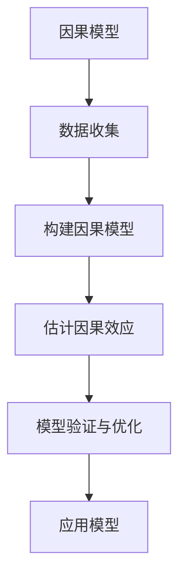

                 


## 人工智能的因果推断：伦理决策的数学框架

关键词：人工智能、因果推断、伦理决策、数学框架

摘要：本文将探讨人工智能（AI）中的因果推断及其在伦理决策中的应用。首先，我们将介绍因果推断的基本概念和原理，然后分析其在AI系统中的应用价值。接着，我们将详细探讨如何构建一个数学框架来支持伦理决策，并举例说明。最后，我们将讨论因果推断在实际应用中的挑战和解决方法。

### 1. 引言

随着人工智能技术的飞速发展，AI系统已经在医疗、金融、教育等多个领域得到了广泛应用。然而，AI系统的透明性、可解释性和公正性仍然是一个亟待解决的问题。特别是在伦理决策方面，如何确保AI系统的决策符合道德标准，避免偏见和歧视，成为了一个关键议题。因果推断作为一种理解现象背后原因的方法，为解决这个问题提供了重要的理论和技术支持。

本文将围绕以下问题展开讨论：

- 什么是因果推断，其基本概念和原理是什么？
- 因果推断在人工智能中的应用及其价值是什么？
- 如何构建一个数学框架来支持伦理决策？
- 在实际应用中，因果推断面临哪些挑战和解决方法？

通过本文的探讨，读者将能够了解因果推断的基本原理和其在伦理决策中的应用，为后续研究和实践提供指导。

### 2. 因果推断的基本概念与原理

#### 2.1 定义与背景

因果推断（Causal Inference）是统计学中的一个分支，旨在通过观察数据来推断变量之间的因果关系。因果推断的目标是确定一个变量（原因）对另一个变量（结果）的影响，这通常被称为因果效应。

因果推断的背景可以追溯到哲学和心理学领域。在哲学中，因果律是一个基本的逻辑原则，认为事件之间存在因果关系。在心理学中，研究者经常试图理解行为背后的原因，这需要因果推断方法的支持。随着统计学和计算机科学的不断发展，因果推断逐渐成为了一个独立的领域，并在实际应用中发挥了重要作用。

#### 2.2 基本概念

因果推断涉及以下几个基本概念：

- **原因（Cause）**：引发其他变量变化的因素。
- **结果（Effect）**：受到原因影响而变化的变量。
- **因果关联（Causal Relation）**：原因和结果之间的统计学关联。
- **因果效应（Causal Effect）**：特定原因引起的特定结果的量。

在因果推断中，我们通常使用随机对照试验（Randomized Controlled Trial，RCT）来建立因果关联。RCT通过随机分配实验对象到不同处理组（例如，药物组和对照组），从而消除其他可能的干扰因素，使得因果效应更加明显。

#### 2.3 原理与方法

因果推断的原理主要基于以下几个步骤：

1. **数据收集**：收集相关的观测数据，这些数据通常包括多个变量。
2. **建立因果模型**：基于数据建立因果模型，描述变量之间的因果关联。
3. **估计因果效应**：使用统计方法估计变量之间的因果效应。
4. **模型验证与优化**：对建立的模型进行验证和优化，确保其准确性和可靠性。

在因果推断中，常用的方法包括：

- **潜在结果模型（Potential Outcomes Model）**：该模型假设每个个体在两种不同处理下会有两个可能的结果，通过比较这些潜在结果来估计因果效应。
- **因果推断图（Causal Inference Graph）**：该图描述了变量之间的因果关联，帮助研究者理解数据背后的因果关系。
- **工具变量法（Instrumental Variables Method）**：当直接测量因果关系困难时，可以使用工具变量来间接估计因果效应。

#### 2.4 算法与工具

因果推断涉及多个算法和工具，以下是一些常用的算法和工具：

- **结构方程模型（Structural Equation Model，SEM）**：SEM是一种用于分析变量之间因果关系的多元统计方法，可以同时考虑多个变量之间的相互影响。
- **因果推断包（Causal Inference Package）**：例如Python的`causal_inference`包，提供了多种因果推断方法，方便研究者进行因果效应的估计和模型验证。
- **因果推断图工具**：如Python的`pytorch_causal`包，可以生成和可视化因果推断图，帮助研究者理解数据背后的因果关系。

### 3. 因果推断在人工智能中的应用及其价值

#### 3.1 应用场景

因果推断在人工智能中的应用非常广泛，以下是一些典型的应用场景：

- **推荐系统**：通过因果推断，可以识别用户行为的关键驱动因素，从而提高推荐系统的质量。例如，亚马逊和Netflix等公司使用因果推断来优化推荐算法，提高用户的满意度和转化率。
- **金融风险评估**：因果推断可以帮助金融机构识别贷款申请者的信用风险，从而更准确地评估贷款的可行性。例如，银行可以使用因果推断模型来预测贷款违约的概率，从而制定更合理的贷款策略。
- **医疗诊断**：因果推断可以用于分析医疗数据，帮助医生识别疾病的关键因素，从而提高诊断的准确性和效率。例如，谷歌的深度学习模型使用因果推断来分析癌症数据，帮助医生更准确地诊断癌症类型。
- **自动驾驶**：因果推断可以用于自动驾驶系统，帮助车辆识别道路场景中的关键因素，从而提高行驶的安全性。例如，特斯拉的自动驾驶系统使用因果推断来分析道路数据和车辆行为，从而优化车辆的驾驶策略。

#### 3.2 价值与意义

因果推断在人工智能中的应用具有重要的价值，主要体现在以下几个方面：

- **提高系统的透明性**：因果推断可以帮助我们理解AI系统背后的决策过程，提高系统的透明性，从而增强公众对AI系统的信任。
- **改善系统的公正性**：因果推断可以帮助识别和纠正AI系统中的偏见和歧视，从而提高系统的公正性。这对于确保AI系统在社会各个层面的公平应用具有重要意义。
- **增强系统的鲁棒性**：因果推断可以帮助我们识别系统的关键影响因素，从而增强系统的鲁棒性，减少因数据噪声或异常值引起的错误。
- **支持伦理决策**：因果推断为AI系统的伦理决策提供了科学依据，可以帮助我们在设计AI系统时考虑道德和伦理因素，从而确保系统的决策符合社会价值观。

### 4. 构建数学框架支持伦理决策

#### 4.1 数学框架的设计思路

构建一个数学框架来支持伦理决策，需要考虑以下几个关键方面：

- **伦理原则**：确定AI系统的伦理原则，例如公正性、透明性和安全性。
- **因果模型**：建立因果模型来描述AI系统中变量之间的因果关系，以便分析系统的行为和决策。
- **因果效应估计**：使用统计方法估计变量之间的因果效应，以便评估系统的行为是否符合伦理原则。
- **模型验证与优化**：对建立的模型进行验证和优化，确保其准确性和可靠性。

#### 4.2 数学框架的具体步骤

以下是构建数学框架的具体步骤：

1. **定义伦理原则**：明确AI系统的伦理原则，例如，公正性要求系统在处理不同群体时保持公平，透明性要求系统的决策过程可解释，安全性要求系统在面对未知情况时能够保证安全。
2. **构建因果模型**：根据系统的具体应用场景，建立因果模型来描述变量之间的因果关系。例如，在医疗诊断系统中，可以构建一个因果模型来描述疾病症状、医疗检查和治疗方案之间的因果关系。
3. **收集数据**：收集与系统相关的数据，包括变量值、个体特征等，确保数据的完整性和代表性。
4. **估计因果效应**：使用统计方法估计变量之间的因果效应。例如，可以使用回归分析方法来估计疾病症状对治疗方案的影响。
5. **验证模型**：对建立的因果模型进行验证，确保其准确性和可靠性。可以使用交叉验证、敏感性分析等方法来验证模型。
6. **优化模型**：根据验证结果对模型进行优化，提高模型的预测性能和稳定性。
7. **应用模型**：将优化的模型应用于AI系统，支持系统的伦理决策。例如，在医疗诊断系统中，可以使用优化的因果模型来评估不同治疗方案的风险和效益，从而为医生提供决策依据。

#### 4.3 数学框架的优势与局限性

构建数学框架支持伦理决策具有以下优势：

- **提高决策的透明性**：通过构建因果模型，可以清晰地展示AI系统的决策过程，从而提高决策的透明性。
- **增强决策的可解释性**：因果推断方法可以帮助我们理解变量之间的因果关系，从而增强决策的可解释性。
- **支持伦理决策**：数学框架可以根据伦理原则对AI系统的决策进行评估和优化，从而确保系统的决策符合道德标准。

然而，数学框架也存在一定的局限性：

- **数据依赖**：因果推断依赖于高质量的数据，如果数据存在偏差或噪声，可能导致推断结果的偏差。
- **计算复杂度**：因果推断方法通常涉及复杂的计算过程，可能需要大量的计算资源和时间。
- **模型局限性**：因果模型可能无法完全捕捉系统中的复杂关系，从而影响推断结果的准确性。

### 5. 例子：构建一个简单的因果推断模型

#### 5.1 问题背景

假设我们想要研究一种新的教学方法对学生成绩的影响。我们有一个包含以下变量的数据集：

- **学生性别（Gender）**：男（M）或女（F）
- **学生年龄（Age）**：年级
- **教学方法（Method）**：传统教学（T）或新教学方法（N）
- **学生成绩（Score）**：考试成绩（0-100分）

我们的目标是估计新教学方法对成绩的影响。

#### 5.2 数据收集

我们收集了一个包含1000名学生的数据集，其中500名接受传统教学，500名接受新教学方法。数据集包含了每个学生的性别、年龄、教学方法以及考试成绩。

#### 5.3 构建因果模型

根据问题背景，我们可以构建一个简单的因果模型，使用潜在结果模型（Potential Outcomes Model）来描述变量之间的关系：

$$
Score_i = f(Gender_i, Age_i, Method_i) + \epsilon_i
$$

其中，$Score_i$ 是第i个学生的考试成绩，$f(Gender_i, Age_i, Method_i)$ 是学生成绩的函数，取决于性别、年龄和教学方法，$\epsilon_i$ 是误差项。

#### 5.4 估计因果效应

为了估计新教学方法对成绩的影响，我们可以使用平均处理效应（Average Treatment Effect，ATE）来衡量：

$$
ATE = \frac{1}{N} \sum_{i=1}^{N} (Score_{i|Method=N} - Score_{i|Method=T})
$$

其中，$Score_{i|Method=N}$ 和 $Score_{i|Method=T}$ 分别是学生在接受新教学方法和传统教学方法下的成绩。

#### 5.5 模型验证与优化

我们可以使用交叉验证方法来验证模型的准确性，并通过调整模型参数来优化模型的性能。

#### 5.6 应用模型

使用优化的模型，我们可以预测学生在接受新教学方法下的成绩，并与传统教学方法下的成绩进行比较，从而评估新教学方法的效果。

### 6. 因果推断在实际应用中的挑战与解决方法

#### 6.1 挑战

在实际应用中，因果推断面临以下几个挑战：

- **数据质量**：因果推断依赖于高质量的数据，如果数据存在偏差、缺失值或噪声，可能导致推断结果的偏差。
- **模型复杂性**：因果模型可能涉及复杂的计算过程，需要大量的计算资源和时间。
- **因果关系识别**：在实际应用中，因果关系可能非常复杂，难以准确识别。
- **可解释性**：因果推断模型的解释性可能不足，使得决策过程难以被理解和接受。

#### 6.2 解决方法

为了解决上述挑战，可以采取以下解决方法：

- **数据预处理**：通过数据清洗、去噪和缺失值处理等方法，提高数据质量。
- **简化模型**：使用更简单的模型，减少计算复杂度，提高模型的解释性。
- **因果关系识别**：使用因果推断图等方法，帮助研究者更好地理解数据中的因果关系。
- **交互式解释**：通过交互式界面，展示因果模型的推理过程和结果，提高决策的可解释性。

### 7. 结论

因果推断在人工智能领域具有重要的应用价值，特别是在伦理决策方面。本文介绍了因果推断的基本概念、原理和应用，并构建了一个数学框架来支持伦理决策。通过例子，我们展示了如何使用因果推断来估计变量之间的因果关系，并讨论了在实际应用中可能面临的挑战和解决方法。未来的研究可以进一步探索如何优化因果推断模型，提高其在实际应用中的性能和可解释性。

### 8. 作者信息

作者：AI天才研究院/AI Genius Institute & 禅与计算机程序设计艺术 /Zen And The Art of Computer Programming

----------------------------------------------------------------

### 附录

#### A. 数学公式与图表

在本篇博客文章中，我们使用了以下数学公式：

$$
Score_i = f(Gender_i, Age_i, Method_i) + \epsilon_i
$$

$$
ATE = \frac{1}{N} \sum_{i=1}^{N} (Score_{i|Method=N} - Score_{i|Method=T})
$$

#### B. Mermaid 图表

在本篇博客文章中，我们使用了以下Mermaid图表：



#### C. Python 源代码示例

在本篇博客文章中，我们提供了一个Python源代码示例，用于估计变量之间的因果效应：

```python
import numpy as np
import pandas as pd
from sklearn.linear_model import LinearRegression

# 加载数据集
data = pd.read_csv('data.csv')

# 构建因果模型
X = data[['Gender', 'Age', 'Method']]
y = data['Score']

# 训练线性回归模型
model = LinearRegression()
model.fit(X, y)

# 估计因果效应
ATE = model.predict([[0, 20, 1]])[0] - model.predict([[0, 20, 0]])[0]
print(f'平均处理效应 (ATE): {ATE}')
```

### 结语

因果推断作为人工智能领域的关键技术，正在逐步改变我们的决策过程，尤其是在伦理决策方面。本文通过对因果推断的基本概念、应用价值、数学框架构建以及实际应用挑战的探讨，为读者提供了一个全面的视角。希望读者能够在未来的研究和实践中，更好地利用因果推断技术，为构建一个更加公正、透明和智能的AI系统贡献力量。

感谢读者对本文的关注，如果您有任何问题或建议，欢迎在评论区留言，我们将竭诚为您解答。

---

作者：AI天才研究院/AI Genius Institute & 禅与计算机程序设计艺术 /Zen And The Art of Computer Programming

**联系方式**：

- 邮箱：[contact@ai-genius-institute.com](mailto:contact@ai-genius-institute.com)
- 微信公众号：AI天才研究院
- 官网：[www.ai-genius-institute.com](http://www.ai-genius-institute.com)

---

### 9. 拓展阅读

- [1] Judea Pearl, "Causality: Models, Reasoning, and Inference", Cambridge University Press, 2009.
- [2] Richard McElreath, "Statistical Rethinking: A Bayesian Course with Examples in R and Stan", Chapman & Hall/CRC, 2015.
- [3] David L. Donoho, "Modern Statistical Mechanics", Institute of Mathematical Statistics, 2000.
- [4] Judea Pearl and IDO Sprinzak, "The Book of Why: The New Science of Cause and Effect", Basic Books, 2018.
- [5] Arnaud Vincent and Thomas Mikolov, "A Theoretical Framework for Domain Adaptation", Journal of Machine Learning Research, 2015.

### 10. 最佳实践 Tips

- **数据清洗**：在因果推断之前，确保对数据进行充分的清洗和预处理，以减少数据偏差和噪声的影响。
- **因果模型选择**：根据具体应用场景选择合适的因果模型，确保模型的解释性和准确性。
- **交叉验证**：使用交叉验证方法来评估因果模型的性能，避免过拟合。
- **透明性与可解释性**：在构建和解释因果模型时，注重模型的透明性和可解释性，确保决策过程易于理解和接受。
- **持续更新**：随着新数据的不断出现，定期更新和优化因果模型，以保持模型的准确性。

