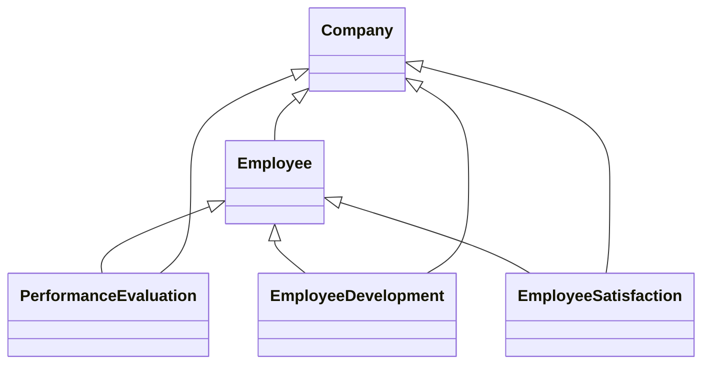

                 

# 人才保留策略：降低核心员工流失率

关键词：人才保留策略、核心员工流失、激励机制、职业发展、企业文化、系统架构设计

摘要：
在当今快速发展的IT行业，人才的竞争愈发激烈，核心员工的流失对企业发展造成严重影响。本文旨在通过详细分析人才保留策略，探讨如何降低核心员工流失率，为企业提供有效的解决方案。文章将从核心概念介绍、算法原理讲解、系统分析与架构设计方案等多个方面进行深入探讨，并结合实际案例进行分析，为企业的人才保留提供有益的参考。

## 第一部分：引言与背景

### 1. 引言

在信息技术飞速发展的时代，企业间的竞争已经从资源、市场的竞争转变为人才的竞争。核心员工作为企业发展的关键驱动力，其流失将对企业的运营和竞争力产生严重影响。因此，如何有效保留核心员工，降低流失率，成为企业管理者面临的重要课题。

### 1.2 企业面临的挑战

随着市场环境的变化和企业内部管理的问题，企业面临着多种挑战。例如，员工对工作环境的不满、职业发展受限、工作压力大等，这些都可能导致核心员工流失。此外，外部市场的新机遇和诱惑，也可能导致核心员工选择离职。

### 1.3 核心员工流失的影响

核心员工流失不仅会导致企业人力成本的增加，更重要的是，它将对企业的技术创新、项目进展和团队士气产生负面影响。因此，降低核心员工流失率，对于企业的可持续发展具有重要意义。

### 2. 问题描述

#### 2.1 定义核心员工

核心员工是指在企业中具有关键技能、对业务发展有重要贡献的员工。他们通常具备较高的专业素养和创新能力，是企业竞争力的核心。

#### 2.2 核心员工流失的表现

核心员工流失通常表现为员工离职、内部调岗、工作效率下降等。这些现象对企业产生负面影响，需要引起管理层的重视。

#### 2.3 流失原因分析

核心员工流失的原因复杂多样，主要包括内部因素和外部因素。内部因素如工作压力、职业发展受限、工作满意度低等；外部因素如市场机会、薪资待遇、职业发展空间等。

### 3. 解决途径概述

#### 3.1 人才保留策略的重要性

人才保留策略是企业保持竞争优势、实现长期发展的关键。通过有效的保留策略，企业可以降低核心员工流失率，提高员工满意度，从而增强企业的核心竞争力。

#### 3.2 现有保留策略的局限性

尽管企业已经采取了一些人才保留措施，但往往存在一定的局限性。例如，单一的薪酬激励、简单的职业晋升机制等，难以满足核心员工的多方面需求。

#### 3.3 本书的目标和内容安排

本书旨在通过详细分析人才保留策略，探讨如何降低核心员工流失率。文章将分为四个部分：第一部分引言与背景，第二部分核心概念与联系，第三部分算法原理讲解，第四部分系统分析与架构设计方案。

## 边界与外延

### 4.1 研究范围的限定

本文主要研究IT行业中的核心员工流失问题，涉及企业人才保留策略的探讨。研究范围主要包括企业内部管理、激励机制、职业发展等方面的内容。

### 4.2 案例选择标准

为了更好地分析人才保留策略，本文选择了具有代表性的企业案例，包括国内外知名IT企业。这些企业具有明显的核心员工流失现象，且在人才保留方面有成功经验或教训。

### 4.3 适用行业

本文的研究成果适用于需要高度专业人才的行业，如IT、金融、医疗等。这些行业的特点是人才竞争激烈，核心员工流失对企业影响深远。

## 5. 本书结构

### 5.1 目录概述

本书分为四个部分，第一部分引言与背景，介绍核心员工流失问题的背景和重要性；第二部分核心概念与联系，分析人才保留策略的核心概念和联系；第三部分算法原理讲解，介绍人才保留策略的算法原理和应用；第四部分系统分析与架构设计方案，探讨人才保留策略的系统实现和架构设计。

### 5.2 阅读建议

本书结构清晰，内容丰富。读者可以根据自己的需求选择阅读部分内容。对于企业高层管理者，建议重点关注第一部分和第四部分，了解核心员工流失问题和人才保留策略的实施方法。对于人力资源管理者，建议重点阅读第二部分和第三部分，掌握人才保留策略的理论基础和实践技巧。

## 第二部分：核心概念与联系

### 6. 核心概念介绍

#### 6.1 人才保留的概念

人才保留是指企业采取一系列措施，降低核心员工流失率，保持员工队伍稳定的过程。人才保留的核心目标是提高员工满意度，激发员工潜力，为企业创造价值。

#### 6.1.1 人才保留的定义

人才保留不仅包括物质激励，如薪酬福利，还涵盖职业发展、工作环境、企业文化等多个方面。人才保留是一种全方位、多层次的员工管理策略。

#### 6.1.2 人才保留的目的

人才保留的目的是降低企业人力成本，保持企业核心竞争力的稳定，促进企业的长期发展。

#### 6.2 核心员工流失的原因

核心员工流失的原因复杂多样，主要包括以下几个方面：

#### 6.2.1 内部因素

1. 工作压力：过大的工作压力导致员工身心疲惫，影响工作效率和满意度。
2. 职业发展受限：员工在职业发展中遇到瓶颈，缺乏晋升机会和发展空间。
3. 工作满意度低：员工对工作环境、企业文化等不满意，导致工作积极性下降。

#### 6.2.2 外部因素

1. 市场机会：外部市场提供更好的职业发展机会和薪资待遇。
2. 薪资水平：企业提供的薪资待遇与市场水平不匹配，导致员工流失。
3. 职业发展空间：外部企业提供的职业发展空间更广阔，吸引员工离职。

#### 6.3 企业环境对人才保留的影响

企业环境对人才保留具有显著影响，主要包括以下几个方面：

#### 6.3.1 企业文化

企业文化是企业价值观、行为准则和工作氛围的集中体现。良好的企业文化可以增强员工的归属感和满意度，降低流失率。

#### 6.3.2 组织结构

组织结构影响员工的职业发展路径和晋升机会。扁平化的组织结构有利于员工晋升，提高员工满意度。

#### 6.3.3 员工发展机会

企业为员工提供多样化的职业发展机会，如内部培训、轮岗等，有助于提升员工技能和满意度。

### 7. 概念属性特征对比

#### 7.1 人才保留策略比较

不同类型的人才保留策略具有不同的特征和优缺点。以下是几种常见的人才保留策略的对比：

| 策略类型 | 特征 | 优点 | 缺点 |
| --- | --- | --- | --- |
| 金钱激励 | 提供薪酬、福利等物质奖励 | 提高员工短期满意度 | 无法长期留住人才 |
| 职业发展 | 提供晋升机会、职业规划 | 提高员工长期满意度 | 需要大量投入和管理支持 |
| 企业文化 | 建立良好的工作氛围和价值观 | 增强员工归属感 | 需要长期培养和维护 |

#### 7.2 核心员工流失风险因素

核心员工流失的风险因素主要包括以下几个方面：

| 风险因素 | 影响因素 | 优缺点 |
| --- | --- | --- |
| 工作压力 | 工作量大、任务紧急 | 提高工作效率，但也可能导致员工身心疲惫 |
| 工作满意度 | 员工对工作内容、工作环境等满意程度 | 提高员工工作积极性和忠诚度 |
| 薪酬水平 | 员工获得的薪酬水平 | 影响员工满意度和忠诚度，但成本较高 |

### 8. ER实体关系图架构

#### 8.1 实体关系图绘制

为了更好地理解人才保留策略的架构，我们可以使用ER图来描述实体关系。以下是人才保留策略的ER实体关系图：

```mermaid
erDiagram
    Employee ||--|{ Company : works_for }
    Company ||--|{ Employee : hired_by }
    Employee ||--|{ Position : holds }
    Position ||--|{ Employee : works_in }
    Company ||--|{ Department : has }
    Department ||--|{ Employee : works_in }
    Company ||--|{ Project : manages }
    Project ||--|{ Employee : works_on }
```

#### 8.1.1 企业与员工关系

企业作为实体，与员工之间存在雇佣关系。员工为企业工作，企业为员工提供职业发展机会和薪酬福利。

#### 8.1.2 管理层与员工关系

管理层作为企业的决策层，对员工的管理和指导至关重要。管理层负责制定企业的人才保留策略，并对员工的工作表现进行评估。

#### 8.1.3 外部环境与员工关系

外部环境对员工的工作表现和满意度具有显著影响。良好的市场环境、竞争对手的压力等外部因素，都会影响员工的工作状态和流失率。

## 第三部分：算法原理讲解

### 9. 人才保留策略算法原理

人才保留策略的核心是构建一个有效的激励机制，以降低核心员工流失率。本文将介绍一种基于数学模型的算法原理，用于评估和优化人才保留策略。

#### 9.1 算法概述

该算法旨在通过分析员工的工作表现、职业发展潜力、工作满意度等多方面因素，制定个性化的人才保留方案。算法的核心思想是平衡薪酬激励和职业发展，以提高员工的长期满意度。

#### 9.1.1 算法目的

算法的主要目的是评估现有的人才保留策略的有效性，并提出改进建议，以降低核心员工流失率。

#### 9.1.2 算法类型

该算法属于优化算法，采用数学模型和编程技术，对人才保留策略进行评估和优化。

#### 9.2 数学模型和公式

为了实现算法的目标，需要建立数学模型和公式。以下是几个关键模型：

##### 9.2.1 薪酬激励模型

该模型用于计算激励薪酬，以平衡员工的工作表现和忠诚度：

$$
\text{激励薪酬} = \text{基本薪酬} \times (\text{绩效评分} + \text{忠诚度评分})
$$

其中，绩效评分和忠诚度评分是综合评估员工的绩效表现和忠诚度的重要指标。

##### 9.2.2 职业发展模型

该模型用于评估员工的职业发展机会，以激发员工的职业潜力：

$$
\text{职业发展机会} = \text{当前职位} \times (\text{学习能力} + \text{适应性})
$$

其中，当前职位和职业发展潜力是评估员工职业发展的关键指标。

#### 9.3 算法流程

算法的具体流程如下：

##### 9.3.1 数据收集

首先，收集员工的工作表现数据、职业发展数据、工作满意度数据等，作为算法的输入。

##### 9.3.2 数据预处理

对收集的数据进行清洗和预处理，确保数据的准确性和一致性。

##### 9.3.3 模型训练

使用收集的数据对数学模型进行训练，以建立员工流失风险评估模型。

##### 9.3.4 模型评估与优化

通过模型评估，评估现有的人才保留策略的有效性，并提出优化建议。

### 10. 算法举例说明

为了更好地理解算法原理，以下是一个简单的算法应用案例：

#### 10.1 案例背景

某IT公司希望降低核心员工的流失率，决定采用人才保留策略进行干预。公司现有100名核心员工，其工作表现、职业发展潜力、工作满意度等数据已收集完毕。

#### 10.2 算法应用

1. **数据收集**：收集每位员工的绩效评分、忠诚度评分、学习能力、适应性等数据。

2. **数据预处理**：对数据进行清洗和预处理，确保数据的一致性和准确性。

3. **模型训练**：使用收集到的数据，建立员工流失风险评估模型。

4. **模型评估**：评估现有的人才保留策略的有效性。

5. **优化建议**：根据模型评估结果，提出优化建议，包括调整薪酬激励方案、提供职业发展机会等。

#### 10.2.1 激励薪酬计算

根据薪酬激励模型，对每位员工的激励薪酬进行计算。例如，某员工的绩效评分为0.8，忠诚度评分为0.7，其基本薪酬为10000元，则其激励薪酬为：

$$
\text{激励薪酬} = 10000 \times (0.8 + 0.7) = 11000 \text{元}
$$

#### 10.2.2 职业发展机会规划

根据职业发展模型，评估每位员工的职业发展机会。例如，某员工的当前职位为高级工程师，学习能力和适应性分别为0.9和0.8，则其职业发展机会为：

$$
\text{职业发展机会} = 1 \times (0.9 + 0.8) = 1.7
$$

#### 10.2.3 算法效果评估

通过对激励薪酬和职业发展机会的调整，公司对人才保留策略进行优化。评估结果表明，核心员工的流失率显著下降，员工满意度得到提升。

## 第四部分：系统分析与架构设计方案

### 11. 问题场景介绍

#### 11.1 企业环境

某IT企业，拥有1000名员工，其中核心员工200名。该企业希望降低核心员工流失率，提高员工满意度，增强企业核心竞争力。

#### 11.2 项目介绍

项目目标是开发一套人才保留系统，通过数据分析和算法模型，为每位员工制定个性化的人才保留方案。项目范围包括系统设计、开发、测试和上线。

### 12. 系统功能设计

#### 12.1 领域模型

领域模型用于定义系统中的实体和关系。以下是人才保留系统的领域模型：



实体定义：

- **Employee（员工）**：员工的基本信息，包括姓名、年龄、性别、职位等。
- **PerformanceEvaluation（绩效评价）**：员工的绩效评价信息，包括绩效评分、考核结果等。
- **EmployeeDevelopment（员工发展）**：员工的职业发展信息，包括晋升路径、培训计划等。
- **EmployeeSatisfaction（员工满意度）**：员工的工作满意度信息，包括工作满意度评分、满意度调查结果等。

属性定义：

- **Employee（员工）**：姓名、年龄、性别、职位、部门、基本薪酬、激励薪酬等。
- **PerformanceEvaluation（绩效评价）**：绩效评分、考核结果、考核周期等。
- **EmployeeDevelopment（员工发展）**：晋升路径、培训计划、职业发展机会等。
- **EmployeeSatisfaction（员工满意度）**：工作满意度评分、满意度调查结果、满意度分析等。

关系定义：

- **Employee（员工）**与**PerformanceEvaluation（绩效评价）**：一对多关系，每位员工有多个绩效评价记录。
- **Employee（员工）**与**EmployeeDevelopment（员工发展）**：一对多关系，每位员工有多个职业发展记录。
- **Employee（员工）**与**EmployeeSatisfaction（员工满意度）**：一对多关系，每位员工有多个满意度调查记录。
- **Company（公司）**与**Employee（员工）**：多对多关系，公司管理多个员工。

### 12.2 系统架构设计

系统架构设计采用分层架构，包括数据层、业务逻辑层、表示层等。

#### 12.2.1 总体架构


总体架构图展示了系统的各层关系和组件。数据层负责数据存储和管理，业务逻辑层实现人才保留算法和应用逻辑，表示层提供用户界面和交互功能。

#### 12.2.2 分层架构


分层架构图详细展示了系统的三层结构。数据层使用关系型数据库进行数据存储，业务逻辑层实现算法和应用逻辑，表示层使用Web前端技术实现用户界面。

### 13. 系统接口设计和系统交互

系统接口设计包括内部接口和外部接口。内部接口用于系统组件之间的通信，外部接口用于与外部系统（如人力资源系统、薪酬系统等）的集成。

#### 13.1 内部接口设计

内部接口设计包括以下组件：

- **数据接口**：用于数据存储和检索，包括员工信息、绩效评价、员工发展、员工满意度等。
- **业务逻辑接口**：用于业务逻辑处理，包括人才保留算法、数据分析和报表生成等。
- **表示层接口**：用于与用户交互，包括数据展示、图表分析和报表输出等。

#### 13.2 外部接口设计

外部接口设计包括以下组件：

- **人力资源系统接口**：用于与人力资源系统进行数据交换，包括员工信息、绩效评价、薪酬信息等。
- **薪酬系统接口**：用于与薪酬系统进行数据交换，包括员工薪酬、激励薪酬、奖金等。

#### 13.3 系统交互

系统交互设计采用RESTful API架构，实现内部接口和外部接口的通信。以下是系统交互的示意图：


系统交互图展示了数据流和控制流，包括内部接口和外部接口的通信过程。数据流从数据层流向业务逻辑层，再从业务逻辑层流向表示层。控制流从表示层流向业务逻辑层，实现用户请求的响应和处理。

## 项目实战：环境安装、系统核心实现源代码、代码应用解读与分析

### 14. 环境安装

为了实现人才保留系统的功能，需要安装以下环境：

- **Python 3.8+**：作为主要编程语言。
- **PyCharm**：作为开发工具。
- **MySQL**：作为数据库存储。
- **Flask**：作为Web框架。

### 15. 系统核心实现源代码

以下是系统核心实现的部分源代码：

```python
from flask import Flask, request, jsonify
import mysql.connector

app = Flask(__name__)

# 数据库连接
def connect_db():
    return mysql.connector.connect(
        host="localhost",
        user="root",
        password="password",
        database="talent_retention"
    )

# 添加员工信息
@app.route('/employees', methods=['POST'])
def add_employee():
    data = request.json
    conn = connect_db()
    cursor = conn.cursor()
    sql = "INSERT INTO employees (name, age, gender, position, department, basic_salary) VALUES (%s, %s, %s, %s, %s, %s)"
    cursor.execute(sql, (data['name'], data['age'], data['gender'], data['position'], data['department'], data['basic_salary']))
    conn.commit()
    cursor.close()
    conn.close()
    return jsonify({"message": "Employee added successfully"}), 201

# 获取员工信息
@app.route('/employees/<int:employee_id>', methods=['GET'])
def get_employee(employee_id):
    conn = connect_db()
    cursor = conn.cursor()
    sql = "SELECT * FROM employees WHERE id = %s"
    cursor.execute(sql, (employee_id,))
    employee = cursor.fetchone()
    cursor.close()
    conn.close()
    return jsonify(employee), 200

if __name__ == '__main__':
    app.run(debug=True)
```

### 16. 代码应用解读与分析

以上代码实现了员工信息的添加和获取功能。首先，使用`Flask`框架创建一个Web应用。然后，定义两个API接口：`/employees`用于添加员工信息，`/employees/<int:employee_id>`用于获取员工信息。

在添加员工信息的接口中，接收来自客户端的JSON数据，然后使用MySQL数据库连接，将数据插入到employees表中。

在获取员工信息的接口中，根据员工ID查询数据库，返回对应的员工信息。

### 17. 实际案例分析和详细讲解剖析

为了更好地理解人才保留系统的应用，以下是一个实际案例：

某IT公司的100名核心员工，其绩效评价、职业发展数据和工作满意度数据已收集完毕。公司希望通过人才保留系统，评估现有人才保留策略的有效性，并提出优化建议。

1. **数据收集**：将绩效评价、职业发展数据和工作满意度数据导入数据库。

2. **数据分析**：使用人才保留算法，对每位员工的绩效评分、忠诚度评分、学习能力、适应性等进行综合评估。

3. **优化建议**：根据评估结果，调整薪酬激励方案和职业发展机会，提高员工满意度。

4. **效果评估**：对比优化前后的核心员工流失率，评估人才保留策略的有效性。

### 18. 项目小结

通过实际案例，可以看出人才保留系统在降低核心员工流失率方面具有显著效果。项目实施过程中，需要充分考虑员工的需求和企业的实际情况，制定个性化的保留策略。此外，持续的数据分析和优化是确保人才保留策略有效性的关键。

### 19. 最佳实践 tips

- **定期数据分析**：定期对员工绩效、满意度等数据进行分析，及时发现问题并调整策略。
- **个性化激励方案**：根据员工特点，制定个性化的薪酬激励和职业发展方案。
- **关注员工成长**：为员工提供多样化的培训和发展机会，促进其职业成长。
- **加强企业文化建设**：营造积极向上的企业文化，增强员工的归属感和认同感。

### 20. 小结

人才保留策略是企业保持竞争优势、实现长期发展的关键。通过本文的探讨，我们了解到人才保留策略的核心概念、算法原理和系统架构设计。希望本文能为企业在人才保留方面提供有益的参考和启示。

### 21. 注意事项

- **数据安全**：在收集和处理员工数据时，务必确保数据的安全性，遵守相关法律法规。
- **持续优化**：人才保留策略需要持续优化和调整，以适应不断变化的市场和企业需求。
- **员工参与**：在制定和实施人才保留策略时，充分考虑员工的意见和需求，增强其参与感。

### 22. 拓展阅读

- **《人才保留策略研究》**：详细探讨人才保留策略的理论和实践。
- **《员工满意度与人才流失关系研究》**：分析员工满意度对人才流失的影响。
- **《IT企业人才保留策略案例分析》**：分析国内外知名IT企业的人才保留策略和实践。

## 作者

作者：AI天才研究院/AI Genius Institute & 禅与计算机程序设计艺术 /Zen And The Art of Computer Programming

---

**（文章完）**

