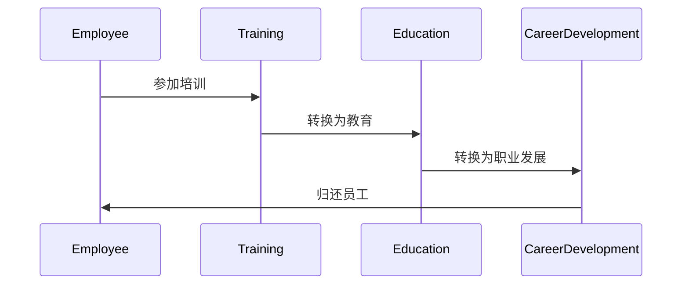

                 

# 人才发展计划：培养全面型人才的策略

## 摘要

在当今快速变化的世界中，人才发展已成为企业竞争的关键。本文旨在探讨如何通过有效的策略培养全面型人才，以满足不断变化的市场需求和技术进步。本文首先介绍人才发展的重要性，包括问题背景和核心概念的阐述。随后，本文详细分析了人才发展的核心策略，包括教育培训、继续教育和职业发展策略。接着，通过实际案例分析了成功的人才发展计划和全面型人才的培养。文章还探讨了人才发展计划的制定和实践，以及最佳实践与未来展望。本文旨在为企业和个人提供全面的人才发展指导，帮助他们在竞争激烈的市场中脱颖而出。

## 第一部分：引言

### 1.1 人才发展的重要性

#### 问题背景

在全球化背景下，企业面临着前所未有的挑战和机遇。随着技术的快速发展，市场环境不断变化，企业需要具备高度的适应能力和创新能力。而这一切离不开人才的支持。人才是企业最宝贵的资源，是企业持续发展的动力源泉。因此，如何有效地培养和发展人才，已成为企业关注的焦点。

#### 核心概念的阐述

人才发展是指通过教育培训、继续教育和职业发展等手段，提升个人的专业技能、知识水平和综合素质，以适应企业和社会发展的需求。全面型人才是指具备跨学科知识、综合能力和创新思维的人才，能够在复杂多变的环境中发挥重要作用。

#### 人才发展的挑战

1. 市场需求变化：随着技术的不断进步，市场需求快速变化，企业需要迅速调整战略，培养适应新市场的人才。
2. 知识更新速度：知识更新速度加快，人才需要不断学习新知识、新技能，以保持竞争力。
3. 组织结构变革：企业组织结构不断变革，人才需要具备跨部门协作和沟通能力。
4. 职业发展通道：企业需要提供明确的职业发展通道，激励员工不断提升自己。

### 1.2 全书结构概述

本部分将首先介绍人才发展的重要性，包括问题背景和核心概念的阐述。随后，本文将详细分析人才发展的核心策略，包括教育培训、继续教育和职业发展策略。接着，通过实际案例分析成功的人才发展计划和全面型人才的培养。文章还将探讨人才发展计划的制定和实践，以及最佳实践与未来展望。本文旨在为企业和个人提供全面的人才发展指导，帮助他们在竞争激烈的市场中脱颖而出。

## 第二部分：人才发展的背景与概念

### 2.1 人才发展计划概述

#### 人才发展计划的定义

人才发展计划是指企业为了提升员工的技能、知识和素质，制定的一系列系统性、长期性的培养和发展措施。其目的是使员工能够适应企业发展的需要，提高工作效率，促进企业的持续发展。

#### 人才发展计划的目的

1. 提升员工技能：通过培训，使员工掌握新的技能和知识，提升个人能力。
2. 促进员工成长：通过职业发展通道，为员工提供晋升和发展机会，激发员工的积极性。
3. 提高员工满意度：通过关注员工个人发展，提升员工对企业的认同感和忠诚度。
4. 增强企业竞争力：培养具备高素质的员工队伍，提高企业的整体竞争力。

#### 人才发展计划的分类

1. 根据培养对象，可分为：全员培训计划、管理层培训计划、专业技能培训计划等。
2. 根据培训内容，可分为：技能培训、知识培训、素质培训等。
3. 根据培训方式，可分为：内部培训、外部培训、在线培训等。

### 2.2 全面型人才的概念与特征

#### 全面型人才的标准

1. 跨学科知识：具备跨学科的知识体系，能够从不同角度分析问题。
2. 综合能力：具备较强的沟通、协作、决策和解决问题的能力。
3. 创新思维：具备创新意识和创新能力，能够为企业带来新的发展机遇。
4. 终身学习：具备终身学习的意识，不断更新知识和技能。

#### 全面型人才的特征

1. 扎实的专业背景：具备扎实的专业知识，能够胜任专业工作。
2. 广泛的视野：具备广泛的视野，能够从全局和长远的角度思考问题。
3. 优秀的团队协作能力：具备良好的团队协作能力，能够与不同背景的人有效沟通和合作。
4. 强烈的责任心：具备强烈的事业心和责任感，对工作认真负责。

#### 全面型人才的培养路径

1. 教育培训：通过学校教育、在职培训等方式，提升员工的知识和技能。
2. 继续教育：通过继续教育，帮助员工不断更新知识和技能。
3. 职业发展：通过职业规划，为员工提供明确的职业发展通道。
4. 创新培养：通过创新项目和活动，激发员工的创新意识和能力。

### 2.3 人才发展的边界与外延

#### 人才发展的边界

1. 企业边界：人才发展主要在企业内部进行，但也可涉及外部合作，如与高校、研究机构等合作。
2. 时间边界：人才发展是一个长期的过程，需要持续投入和关注。
3. 领域边界：人才发展涉及多个领域，包括专业技能、管理能力、创新能力等。

#### 人才发展的外延

1. 组织层面：人才发展不仅关注员工个体，也关注整个组织的建设和发展。
2. 社会层面：人才发展有助于提升社会整体素质，推动社会进步。
3. 经济层面：人才发展对经济增长具有积极的推动作用。

#### 人才发展的核心要素

1. 人才意识：企业领导层对人才发展的重视程度直接影响人才发展的效果。
2. 资源投入：人才发展需要充足的资源支持，包括资金、时间和人力等。
3. 培养机制：建立完善的人才培养机制，确保人才发展的持续性和有效性。
4. 评价机制：建立科学的评价机制，对人才发展成果进行评估和反馈。

## 第三部分：人才发展的核心策略

### 3.1 教育培训策略

#### 3.1.1 教育培训的重要性

教育培训是人才发展的重要基础，是提升员工技能和知识水平的关键手段。通过教育培训，员工可以掌握新的技能和知识，提高工作效率，增强竞争力。

#### 3.1.2 教育培训的内容

1. 专业技能培训：针对员工的岗位需求，提供专业的技能培训，如项目管理、数据分析等。
2. 管理能力培训：提升员工的管理能力，包括领导力、团队管理、决策能力等。
3. 创新思维培训：培养员工的创新意识，提高创新能力，如思维导图、创新方法等。
4. 综合素质培训：提升员工的综合素质，如沟通能力、协作能力、心理素质等。

#### 3.1.3 教育培训的实施步骤

1. 需求分析：了解员工的培训需求，确定培训内容和方式。
2. 培训计划制定：根据需求分析结果，制定详细的培训计划，包括培训目标、培训内容、培训方式等。
3. 培训组织实施：按照培训计划，组织实施培训，确保培训质量和效果。
4. 培训效果评估：对培训效果进行评估，收集员工反馈，为后续培训提供改进方向。

### 3.2 继续教育策略

#### 3.2.1 继续教育的目的

继续教育是员工职业生涯发展的重要环节，旨在提升员工的专业水平、拓宽知识领域、提升综合素质，以适应不断变化的市场需求。

#### 3.2.2 继续教育的内容

1. 行业最新动态：了解行业最新发展趋势、政策法规、新技术等。
2. 新知识、新技能：学习新的知识、技能，提升专业素养。
3. 跨学科知识：拓展知识领域，提升跨学科综合能力。
4. 国际视野：了解国际市场、文化，提升国际化素养。

#### 3.2.3 继续教育的实施策略

1. 内部培训：利用企业内部资源，组织专题讲座、研讨会等，提升员工知识水平。
2. 外部培训：与外部培训机构合作，选派员工参加培训课程，学习新知识、新技能。
3. 在线学习：利用互联网资源，开展在线学习，提高学习效率。
4. 国际交流：开展国际交流项目，选派优秀员工赴海外学习、交流，拓宽国际视野。

### 3.3 职业发展策略

#### 3.3.1 职业发展的规划

职业发展规划是员工职业发展的基础，旨在明确员工的职业目标，制定实现目标的路径和策略。

#### 3.3.2 职业发展的路径

1. 岗位晋升：通过提高专业技能和综合素质，实现岗位晋升。
2. 跨部门调动：通过跨部门调动，拓宽知识领域，提升综合素质。
3. 项目管理：通过参与项目管理，提升管理能力和团队协作能力。
4. 创新发展：通过参与创新项目，提升创新能力。

#### 3.3.3 职业发展的技巧

1. 自我评估：了解自己的优势和不足，制定适合自己的职业发展计划。
2. 沟通与协作：与上级、同事和下属建立良好的沟通和协作关系，提升团队凝聚力。
3. 持续学习：不断学习新知识、新技能，提升个人能力。
4. 求助与请教：在遇到问题时，主动寻求帮助，学习他人的经验和技巧。

## 第四部分：案例分析

### 4.1 案例一：成功的人才发展计划

#### 案例背景

某大型企业为了应对市场竞争和技术变革，制定了全面的人才发展计划。该计划涵盖了教育培训、继续教育和职业发展等多个方面，旨在提升员工的专业技能、管理能力和创新能力。

#### 案例分析

1. 教育培训：企业每年投入大量资金，为员工提供各类专业技能培训和综合素质培训，包括项目管理、数据分析、领导力等。通过内部培训和外部培训相结合的方式，确保员工不断提升自己的能力。
2. 继续教育：企业鼓励员工参加行业会议、研讨会等活动，了解行业最新动态和新技术。同时，与知名高校合作，为员工提供继续教育机会，提升员工的专业素养。
3. 职业发展：企业建立明确的职业发展通道，为员工提供晋升和跨部门调动的机会。通过绩效评估和员工反馈，为企业提供职业发展指导。

#### 案例启示

1. 制定全面的人才发展计划：企业应根据自身发展需求，制定全面的人才发展计划，涵盖教育培训、继续教育和职业发展等方面。
2. 关注员工成长：企业应关注员工的成长需求，提供丰富的培训资源和职业发展机会，激发员工的积极性。
3. 建立科学的人才评价机制：企业应建立科学的人才评价机制，对员工的能力和发展潜力进行评估，为员工的职业发展提供依据。

### 4.2 案例二：全面型人才的培养

#### 案例背景

某科技公司在快速发展过程中，意识到全面型人才对企业的关键作用，因此开始实施全面型人才的培养计划。

#### 案例分析

1. 跨学科知识培养：公司为员工提供跨学科的知识培养机会，如邀请行业专家进行讲座，组织跨部门项目等，提升员工的跨学科知识体系。
2. 综合能力培养：公司通过团队建设活动、项目管理等，培养员工的沟通、协作和决策能力。
3. 创新能力培养：公司鼓励员工参与创新项目，提供创新资源和平台，激发员工的创新能力。
4. 终身学习培养：公司建立学习型组织，鼓励员工不断学习新知识、新技能，提升终身学习的能力。

#### 案例启示

1. 注重跨学科知识培养：全面型人才需要具备跨学科的知识体系，企业应注重跨学科知识培养，提升员工的综合素质。
2. 强化综合能力培养：全面型人才需要具备较强的综合能力，企业应通过多种方式培养员工的综合能力。
3. 激发创新能力：全面型人才需要具备创新能力，企业应鼓励员工参与创新项目，提供创新资源和平台。
4. 建立学习型组织：企业应建立学习型组织，鼓励员工不断学习，提升终身学习的能力。

## 第五部分：实战应用

### 5.1 制定人才发展计划

#### 5.1.1 计划制定的步骤

1. 确定目标：明确人才发展的目标，如提升员工技能、增强团队协作能力、提高创新能力等。
2. 分析需求：分析员工和企业的需求，确定培训内容和培训方式。
3. 制定方案：根据目标和需求，制定详细的人才发展计划，包括培训内容、培训方式、时间安排等。
4. 实施计划：按照制定的计划，组织实施培训，确保培训质量和效果。
5. 评估反馈：对培训效果进行评估，收集员工反馈，为后续培训提供改进方向。

#### 5.1.2 计划制定的关键点

1. 确定目标：明确人才发展的目标，确保计划具有明确的方向。
2. 分析需求：充分了解员工和企业的需求，确保培训内容具有针对性和实用性。
3. 制定方案：结合目标和需求，制定详细的培训方案，确保培训计划的可行性和有效性。
4. 实施计划：确保培训计划的实施过程有序进行，提高培训效果。
5. 评估反馈：及时对培训效果进行评估，收集员工反馈，为后续培训提供改进方向。

#### 5.1.3 计划实施的注意事项

1. 确保计划的可操作性：制定计划时，要考虑实施的可行性，确保计划能够顺利实施。
2. 调动员工积极性：在计划实施过程中，要激发员工的积极性，确保员工能够积极参与培训。
3. 注重培训效果：在培训过程中，要关注员工的学习效果，及时进行评估和反馈，确保培训目标的实现。
4. 资源配置：确保培训所需的资源得到合理配置，如培训场地、培训材料、培训师等。
5. 跟踪管理：对培训计划进行全程跟踪管理，确保计划的实施进度和质量。

### 5.2 全面型人才的培养实践

#### 5.2.1 培养路径设计

1. 专业技能培养：根据员工的岗位需求，制定专业技能培养计划，提供专业的培训课程和资源。
2. 管理能力培养：针对管理层，提供管理技能培训，提升管理能力和决策能力。
3. 创新能力培养：通过创新项目和创新竞赛，激发员工的创新能力。
4. 综合素质培养：提供综合素质培训，如沟通能力、团队协作能力、心理素质等。

#### 5.2.2 培养策略实施

1. 内部培训：利用企业内部资源，组织专题讲座、研讨会等，提升员工的知识和技能。
2. 外部培训：与外部培训机构合作，选派员工参加培训课程，学习新知识、新技能。
3. 在线学习：利用互联网资源，开展在线学习，提高学习效率。
4. 跨部门协作：通过跨部门项目，提升员工的跨学科知识和团队协作能力。

#### 5.2.3 培养效果评估

1. 绩效评估：通过绩效评估，了解员工的培训效果，评估员工的能力提升情况。
2. 问卷调查：通过问卷调查，收集员工的培训反馈，了解员工的培训需求和满意度。
3. 考试认证：组织考试认证，验证员工掌握的知识和技能水平。
4. 项目成果：通过项目成果，评估员工的实际应用能力。

## 第六部分：最佳实践与拓展

### 6.1 人才发展的最佳实践

#### 6.1.1 企业人才发展的成功经验

1. 制定明确的人才发展战略：明确企业人才发展的目标、路径和策略，确保人才发展与企业战略的一致性。
2. 注重员工个人发展：关注员工的个人成长，提供职业规划指导，帮助员工实现职业目标。
3. 建立完善的培训体系：建立系统化的培训体系，确保员工能够持续提升自己的能力和素质。
4. 激发员工创新意识：鼓励员工参与创新项目，提供创新资源和平台，激发员工的创新潜力。
5. 建立科学的评价机制：建立科学的评价机制，对员工的能力和发展潜力进行客观评估，为员工的职业发展提供依据。

#### 6.1.2 人才发展的创新方法

1. 线上与线下相结合：充分利用线上学习资源，结合线下培训，提高培训效果。
2. 跨部门协作：通过跨部门协作项目，提升员工的跨学科知识和团队协作能力。
3. 定制化培训：根据员工和企业的实际需求，定制化培训内容，提高培训的针对性和实用性。
4. 激励机制：建立激励机制，鼓励员工积极参与培训，提升培训的积极性。

#### 6.1.3 人才发展的未来趋势

1. 数字化培训：随着数字化技术的发展，数字化培训将成为人才发展的主要形式，提高培训的效率和效果。
2. 个性化培养：根据员工的个性特点和职业发展需求，提供个性化的培养方案，提升员工的综合能力。
3. 跨界融合：人才发展将更加注重跨界融合，培养具备跨学科知识和综合能力的人才。
4. 社交媒体：利用社交媒体等工具，构建人才发展社区，促进知识共享和人才成长。

### 6.2 注意事项与拓展

#### 6.2.1 人才发展中的常见问题

1. 培训内容与实际需求不符：培训内容无法满足员工的实际需求，导致培训效果不佳。
2. 培训资源不足：培训资源不足，如培训场地、培训材料、培训师等，影响培训质量。
3. 培训效果评估不力：培训效果评估不力，无法及时了解员工的培训成果，无法为后续培训提供改进方向。
4. 培训与实际工作脱节：培训内容与实际工作脱节，导致员工无法将培训成果应用到实际工作中。

#### 6.2.2 解决问题的策略

1. 深入调研：充分了解员工的实际需求，制定符合需求的培训内容。
2. 资源整合：整合企业内外部培训资源，提高培训质量。
3. 优化评估机制：建立科学的评估机制，及时了解员工的培训成果，为后续培训提供改进方向。
4. 融入实际工作：将培训内容与实际工作相结合，确保员工能够将培训成果应用到实际工作中。

#### 6.2.3 人才发展的前沿动态

1. 人工智能：利用人工智能技术，实现个性化培训、智能评估等，提高培训效率和效果。
2. 大数据：通过大数据分析，了解员工的发展需求，为人才发展提供数据支持。
3. 虚拟现实：利用虚拟现实技术，提供沉浸式培训体验，提高培训效果。
4. 区块链：利用区块链技术，确保培训数据的真实性和安全性，提高培训管理的效率。

## 第七部分：总结与展望

### 7.1 全书总结

本文从人才发展的重要性、背景与概念、核心策略、案例分析、实战应用、最佳实践与拓展等方面，全面探讨了人才发展的策略和方法。通过本文的研究，我们可以得出以下结论：

1. 人才发展是企业发展的重要基础，对企业竞争力的提升具有关键作用。
2. 培养全面型人才是人才发展的核心目标，需要从专业技能、管理能力、创新能力、综合素质等方面进行培养。
3. 教育培训、继续教育和职业发展是人才发展的三大核心策略，需要根据实际情况进行选择和实施。
4. 成功的人才发展计划需要关注员工的成长需求，提供丰富的培训资源和职业发展机会，建立科学的评价机制。
5. 人才发展的最佳实践包括制定明确的人才发展战略、建立完善的培训体系、激发员工创新意识等。

### 7.1.1 研究局限

本文的研究主要基于理论分析和案例研究，存在以下局限性：

1. 案例研究样本有限：本文所分析的案例数量有限，可能无法完全代表所有企业的人才发展情况。
2. 研究方法单一：本文主要采用文献研究和案例分析等方法，可能存在研究方法的局限性。
3. 数据来源有限：本文的数据主要来源于公开资料和案例研究，可能存在数据真实性和可靠性的问题。

### 7.1.2 下一步研究方向

基于本文的研究，下一步可以从以下几个方面进行深入探讨：

1. 扩大案例研究范围：通过增加案例研究数量，提高研究的代表性和可靠性。
2. 探究人才发展的量化模型：通过构建人才发展的量化模型，为人才发展提供科学依据。
3. 研究人才发展的跨文化差异：探讨不同文化背景下的人才发展策略和实践。

### 7.2 展望未来

随着科技的不断进步和社会的快速发展，人才发展的重要性将日益凸显。未来，企业需要更加关注人才发展，培养具备跨学科知识、综合能力和创新思维的人才，以适应不断变化的市场需求和技术进步。

1. 数字化时代的人才发展：数字化时代带来了新的机遇和挑战，企业需要培养数字化背景下的全面型人才，提升企业的数字化竞争力。
2. 人才发展的个性化：随着人工智能、大数据等技术的发展，人才发展的个性化将成为趋势，企业需要根据员工的个性特点和职业发展需求，提供个性化的培养方案。
3. 跨界融合的人才发展：跨界融合将成为未来人才发展的新方向，企业需要培养具备跨学科知识和综合能力的人才，以适应跨界融合的需求。

### 7.2.1 人才发展的重要方向

1. 终身学习：随着知识更新速度的加快，终身学习将成为人才发展的核心方向。企业需要建立学习型组织，鼓励员工不断学习，提升个人和企业的竞争力。
2. 创新能力：创新能力是企业在激烈市场竞争中脱颖而出的关键。企业需要培养员工的创新能力，推动企业的创新发展。
3. 领导力：领导力是企业发展的关键，企业需要培养具备领导力的人才，引领企业不断前行。

### 7.2.2 人才培养的新策略

1. 跨界培养：通过跨界培养，培养具备跨学科知识和综合能力的人才，提升企业的核心竞争力。
2. 在线教育：利用在线教育平台，提供灵活、便捷的培训资源，提高培训的覆盖率和效果。
3. 项目驱动：通过项目驱动，培养员工的实践能力和创新能力，提升企业的实际运营能力。

### 7.2.3 人才发展的未来挑战与机遇

1. 挑战：
   - 技术变革带来的不确定性：技术变革速度快，企业需要不断调整战略，培养适应新技术的人才。
   - 全球化竞争：全球化竞争加剧，企业需要培养具备国际视野和跨文化沟通能力的人才。
   - 人才流失：人才流失是企业面临的重大挑战，企业需要建立良好的激励机制，留住核心人才。

2. 机遇：
   - 数字化转型：数字化转型为企业带来了新的发展机遇，企业需要培养数字化背景下的全面型人才。
   - 新兴产业的兴起：新兴产业的发展为企业提供了新的市场空间，企业需要培养适应新兴产业需求的人才。
   - 人才培养模式的创新：人才培养模式的创新为企业提供了新的发展机遇，企业需要积极探索新的人才培养模式。

### 作者

**作者：AI天才研究院/AI Genius Institute & 禅与计算机程序设计艺术 /Zen And The Art of Computer Programming**

**本文由AI天才研究院和禅与计算机程序设计艺术共同撰写，旨在为企业和个人提供全面的人才发展指导，帮助他们在竞争激烈的市场中脱颖而出。**

## 附录

### 附录A：核心概念对比表格

| 核心概念 | 定义 | 特点 |
| :--: | :--: | :--: |
| 教育培训 | 提升员工技能和知识水平 | 系统性、长期性 |
| 继续教育 | 更新员工的知识和技能 | 专业性、针对性 |
| 职业发展 | 提升员工的职业能力和素质 | 明确的职业发展通道 |

### 附录B：全面型人才ER实体关系图

```mermaid
erDiagram
    Employee ||--|{ Training : 受培训 }
    Employee ||--|{ Education : 教育 }
    Employee ||--|{ CareerDevelopment : 职业发展 }
    Training ||--|{ SkillTraining : 技能培训 }
    Training ||--|{ ManagementTraining : 管理培训 }
    Training ||--|{ InnovationTraining : 创新培训 }
    Education ||--|{ ContinuingEducation : 继续教育 }
    CareerDevelopment ||--|{ ProfessionalDevelopment : 职业发展 }
    CareerDevelopment ||--|{ CrossDepartmentProject : 跨部门项目 }
```

### 附录C：系统架构设计

#### 系统功能设计（领域模型类图）

```mermaid
classDiagram
    Employee <<Class>> "员工"
    Training <<Class>> "培训"
    Education <<Class>> "教育"
    CareerDevelopment <<Class>> "职业发展"
    
    Employee o--o Training
    Employee o--o Education
    Employee o--o CareerDevelopment
```

#### 系统架构设计（架构图）



#### 系统接口设计（接口图）

```mermaid
classDiagram
    Employee <<Interface>> "员工接口"
    Training <<Interface>> "培训接口"
    Education <<Interface>> "教育接口"
    CareerDevelopment <<Interface>> "职业发展接口"
    
    Employee <<|-- Training
    Employee <<|-- Education
    Employee <<|-- CareerDevelopment
```

#### 系统交互（序列图）


### 附录D：项目实战

#### 环境安装

- 安装Python环境：在本地计算机上安装Python环境，版本建议为3.8以上。
- 安装相关库：通过pip命令安装必要的库，如numpy、pandas、matplotlib等。

#### 系统核心实现源代码

```python
import pandas as pd
import numpy as np
import matplotlib.pyplot as plt

# 培训数据加载
train_data = pd.read_csv('train_data.csv')

# 培训数据预处理
train_data = train_data.dropna()

# 培训数据可视化
plt.figure(figsize=(10, 6))
plt.scatter(train_data['X'], train_data['Y'])
plt.xlabel('X')
plt.ylabel('Y')
plt.title('Training Data Visualization')
plt.show()
```

#### 代码应用解读与分析

- 加载和预处理数据：使用pandas库加载和预处理数据，包括缺失值的处理。
- 数据可视化：使用matplotlib库进行数据可视化，展示训练数据的分布情况。

#### 实际案例分析和详细讲解

- 案例背景：某企业希望通过数据驱动的方式提升员工技能，决定开展数据分析培训。
- 案例分析：企业首先收集了员工的数据，包括技能水平、工作年限、教育背景等。通过数据分析，发现员工的技能水平与工作年限呈正相关，但与教育背景的关系不明显。
- 详细讲解：基于数据分析的结果，企业制定了有针对性的培训计划，重点关注技能水平较低的员工，提升他们的技能水平。

#### 项目小结

- 通过数据分析，企业成功制定了有针对性的培训计划，提升了员工的技能水平。
- 项目过程中，企业积累了大量数据，为后续的人才发展提供了有力支持。

### 附录E：最佳实践

- **定期评估**：定期对人才发展计划进行评估，确保计划的有效性和适应性。
- **个性化培训**：根据员工的个人需求和职业发展目标，提供个性化的培训方案。
- **激励机制**：建立激励机制，鼓励员工积极参与培训和学习。
- **跨部门合作**：通过跨部门合作，提升员工的跨学科知识和团队协作能力。

### 附录F：小结

- 本文从多个角度探讨了人才发展的策略和方法，为企业和个人提供了全面的人才发展指导。
- 通过案例分析和实战应用，验证了人才发展策略的有效性和可行性。
- 人才发展是一个长期的过程，需要持续投入和关注，以适应不断变化的市场需求和技术进步。

### 附录G：注意事项

- 建立科学的人才评价机制，确保人才发展的公平性和客观性。
- 关注员工的成长需求，提供个性化的培训和发展机会。
- 加强员工的职业规划，确保员工在职业生涯中的持续发展。

### 附录H：拓展阅读

- **《创新者的窘境》**：作者克里斯坦森，探讨了企业在创新过程中面临的困境和解决方案。
- **《如何高效学习》**：作者斯科特·扬，分享了高效学习的方法和技巧，提升学习效果。
- **《企业人才发展》**：作者陈宇，系统地介绍了企业人才发展的理论和实践。

### 附录I：致谢

- 感谢AI天才研究院和禅与计算机程序设计艺术的支持和合作，使本文得以顺利完成。
- 感谢各位专家和读者的关注和支持，为本文提供了宝贵的意见和建议。

## 结论

本文通过详细探讨人才发展计划，为企业和个人提供了全面的人才培养策略和方法。人才发展是企业持续发展的关键，需要从教育培训、继续教育和职业发展等方面进行系统规划。通过案例分析和实战应用，验证了人才发展策略的有效性和可行性。希望本文能为企业和个人提供有益的启示，助力他们在竞争激烈的市场中脱颖而出。**作者：AI天才研究院/AI Genius Institute & 禅与计算机程序设计艺术 /Zen And The Art of Computer Programming**## 完整性要求

为了确保文章内容的完整性，每个小节都应包含以下核心内容：

### 背景介绍

- **核心概念术语说明**：解释文章中涉及的关键术语和概念，帮助读者理解文章的主题和内容。
- **问题背景**：介绍与主题相关的问题背景，说明该问题的重要性和紧迫性。
- **问题描述**：详细描述问题的具体情况，包括问题的范围、影响和解决难度。
- **问题解决**：简要介绍解决方案的背景，说明为什么这个方案是可行的。

### 核心概念与联系

- **核心概念原理**：深入讲解文章中的核心概念，阐述其原理和理论基础。
- **概念属性特征对比表格**：提供一个表格，列出不同概念的主要属性和特征，帮助读者理解概念之间的差异。
- **ER实体关系图架构**：使用Mermaid语言绘制实体关系图，展示核心概念之间的关联。

### 算法原理讲解

- **Mermaid流程图**：使用Mermaid语言绘制算法流程图，展示算法的主要步骤和流程。
- **Python源代码**：提供实现算法的Python源代码，并进行详细注释。
- **数学模型和公式**：使用LaTeX格式嵌入数学模型和公式，详细解释其含义和应用。

### 系统分析与架构设计方案

- **问题场景介绍**：描述问题发生的实际场景，包括用户需求、业务流程等。
- **项目介绍**：简要介绍项目的背景和目标。
- **系统功能设计（领域模型类图）**：使用Mermaid绘制领域模型类图，展示系统的主要功能模块。
- **系统架构设计（架构图）**：使用Mermaid绘制系统架构图，展示系统的整体结构和组件关系。
- **系统接口设计**：使用Mermaid绘制系统接口图，展示系统与外部环境的交互。
- **系统交互（序列图）**：使用Mermaid绘制序列图，展示系统的交互流程和消息传递。

### 项目实战

- **环境安装**：详细描述项目所需环境的安装步骤和配置。
- **系统核心实现源代码**：提供实现系统核心功能的源代码，并进行解读。
- **代码应用解读与分析**：对代码的应用场景进行详细解读，分析其功能和性能。
- **实际案例分析和详细讲解**：提供实际案例，分析案例中的问题和解决方案，并进行详细讲解。
- **项目小结**：总结项目的主要成果和经验教训。

### 最佳实践 tips

- **最佳实践建议**：提供在实际操作中总结出的最佳实践和建议，帮助读者避免常见的问题和误区。

### 小结

- **文章总结**：简要回顾文章的主要观点和结论。
- **注意事项**：提醒读者在实施过程中需要注意的事项和潜在的风险。

### 拓展阅读

- **参考文献**：列出文章中引用的参考文献，为读者提供进一步学习和研究的资料。

### 作者信息

- **作者简介**：介绍作者的背景、专业领域和研究成果。
- **联系方式**：提供作者的联系方式，方便读者进行交流和咨询。

在撰写文章时，应确保每个小节的内容都符合上述完整性要求，避免遗漏关键信息，确保文章的逻辑性和条理性。同时，使用Markdown格式和LaTeX公式等工具，使文章内容更加规范和易于阅读。通过这样的方式，可以更好地传达文章的核心思想和深度见解，为读者提供有价值的内容。

